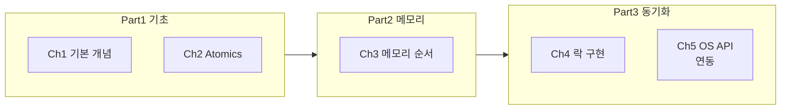

Rust로 동시성(Concurrency) 프로그램을 작성할 때 도움이 되는 책 **Rust Atomics and Locks**를 소개한다. 온라인에서 무료로 읽을 수 있으며, [marabos.nl/atomics](https://marabos.nl/atomics/)에서 확인할 수 있다.

|  |
| :---: |
| 책 표지 |

---

## 개요: 책 정보와 추천 대상

### 책 정보

| 항목 | 내용 |
| --- | --- |
| **제목** | Rust Atomics and Locks |
| **저자** | Mara Bos (Rust 라이브러리 팀 전 팀장) |
| **형식** | 웹북(무료) / 인쇄판 선택 가능 |
| **공식 사이트** | [https://marabos.nl/atomics/](https://marabos.nl/atomics/) |
| **예제 코드** | [https://github.com/m-ou-se/rust-atomics-and-locks](https://github.com/m-ou-se/rust-atomics-and-locks) |

Rust는 동시성에 강한 타입 시스템을 갖춘 언어이지만, 표준 라이브러리나 서드파티 동시성 자료구조를 **올바르게** 사용하거나 직접 구현하려면 저수준 동작에 대한 이해가 필요하다. 이 책은 원자(Atomics), 메모리 순서(Memory ordering), 뮤텍스·조건 변수, 그리고 OS API와의 연동까지 한 권에 체계적으로 다룬다.

### 추천 대상

- **Rust로 동시성 코드를 작성·리뷰하는 개발자**: 메모리 순서 버그를 피하고, 표준/서드파티 동기화 프리미티브를 올바르게 선택하고 싶은 경우
- **자신만의 락·동기화 프리미티브를 만들고 싶은 개발자**: OS API(futex, 조건 변수 등)와 Rust 메모리 모델을 함께 이해하고 싶은 경우
- **C/C++에서의 메모리 모델 경험을 Rust로 옮기고 싶은 개발자**: Rust의 타입 시스템과 결합된 동시성 모델을 한눈에 보고 싶은 경우
- **시스템 프로그래밍·성능에 관심 있는 개발자**: Intel/ARM에서 원자 연산이 실제로 어떻게 동작하는지, 캐시와 명령 재배치가 미치는 영향을 알고 싶은 경우

---

## 책의 구조

전반부는 기본 개념과 원자 타입, 후반부는 메모리 순서·락 구현·OS 연동으로 이어진다. 아래 다이어그램은 흐름을 요약한 것이다.

- **Part 1**: 동시성의 기본, 원자 연산 소개
- **Part 2**: 메모리 순서(Ordering)와 하드웨어·컴파일러 동작
- **Part 3**: 뮤텍스·조건 변수 등 동기화 프리미티브 구현 및 OS 지원 활용

---

## 핵심 내용 요약

### Rust 타입 시스템과 동시성

Rust의 소유권·빌림 규칙은 데이터 레이스(data race)를 컴파일 타임에 막아 준다. 이 책은 그 위에 **원자 타입**과 **메모리 순서**를 올바르게 쓰는 방법을 설명한다. "어떤 순서로 메모리가 보일지"를 명시하지 않으면, 잘 쓰인 것처럼 보이는 코드도 ARM/Intel에서만 재현되는 버그가 나올 수 있다는 점을 반복해서 강조한다.

### 뮤텍스, 조건 변수, Atomics, 메모리 순서

- **뮤텍스·조건 변수**: 개념과 사용법, 그리고 **OS가 제공하는 API**(예: Linux futex, Windows SRW Lock)와 결합해 어떻게 구현되는지 단계별로 다룬다.
- **Atomics**: `AtomicBool`, `AtomicUsize`, `AtomicPtr` 등과 `load`/`store`/`compare_exchange` 등 연산의 의미, 그리고 "왜 순서가 중요한지"를 예제와 함께 설명한다.
- **메모리 순서**: `Ordering::Relaxed`, `Acquire`, `Release`, `AcqRel`, `SeqCst`의 차이, 그리고 Intel·ARM 프로세서에서 실제로 일어나는 일(캐시 일관성, 메모리 배리어)을 연결해 준다.

### 운영체제와의 연동

락을 "올바르게" 구현하려면 OS의 동기화 API가 필수다. 이 책에서는 OS가 제공하는 블로킹·웨이크 업 메커니즘을 어떻게 Rust 코드와 맞추는지, 그리고 그 과정에서 메모리 순서를 어떻게 맞춰야 하는지를 다룬다. 이 부분을 통해 "표준 라이브러리의 `Mutex`나 `Condvar`가 내부적으로 어떻게 설계되었을 수 있는지"를 추론할 수 있게 해 준다.

---

## 예제 코드와 리소스

책 본문의 예제 코드는 GitHub 저장소에서 제공된다.

- **저장소**: [m-ou-se/rust-atomics-and-locks](https://github.com/m-ou-se/rust-atomics-and-locks)
- **내용**: 챕터별 코드, 연습용 자료구조, 책 내 링크 모음

저장소를 클론한 뒤 챕터 순서대로 실행해 보면서, 메모리 순서를 바꿔 보거나 (예: `SeqCst` → `Release`/`Acquire`) 잘못된 순서로 버그를 재현해 보는 실습을 추천한다.

---

## 장단점 및 종합 평가

### 장점

- **무료 웹북**: 온라인에서 전 편 무료로 읽을 수 있어 접근성이 좋다.
- **저자 신뢰도**: Rust 라이브러리 팀 전 팀장이 쓴 책으로, 표준 라이브러리 설계 경험이 반영되어 있다.
- **실용적 구성**: 이론(메모리 모델, CPU 동작)과 실전(락 구현, OS API)이 균형 있게 배치되어 있다.
- **예제 코드 공개**: GitHub에서 바로 실행·수정해 볼 수 있다.

### 단점

- **전제 지식**: Rust 기본 문법과 소유권·빌림은 이미 알고 있어야 하며, 동시성에 대한 사전 경험(다른 언어 포함)이 있으면 이해가 빠르다.
- **영문 중심**: 한글 번역본은 없으므로, 시스템/동시성 용어에 익숙하지 않으면 읽는 속도가 더 걸릴 수 있다.

### 한 줄 평

Rust로 동시성·락·원자 연산을 **올바르게** 다루고 싶다면, 이론과 구현을 한 번에 잡아 주는 책으로 **Rust Atomics and Locks**를 추천한다.

---

## 참고 문헌

1. **Rust Atomics and Locks (공식 웹북)** — [https://marabos.nl/atomics/](https://marabos.nl/atomics/)  
   Mara Bos. 온라인 무료 판. 본문·목차·예제 링크 제공.

2. **rust-atomics-and-locks (GitHub)** — [https://github.com/m-ou-se/rust-atomics-and-locks](https://github.com/m-ou-se/rust-atomics-and-locks)  
   책에 수록된 예제 코드 및 관련 자료 구조·링크 모음.

3. **The Rustonomicon** — [https://doc.rust-lang.org/nomicon/](https://doc.rust-lang.org/nomicon/)  
   Rust 공식 문서. 안전하지 않은 코드·메모리 레이아웃·동시성 관련 저수준 주제 보조 자료.
