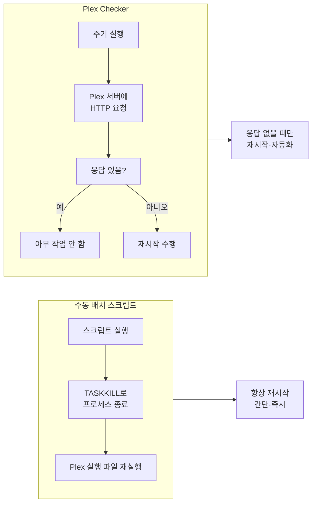

## 개요

이 글은 **Windows 환경에서 Plex Media Server**를 문제 발생 시 빠르게 재구동하거나, **조건부로 자동 재시작**하도록 설정하는 방법을 다룬다. 서버에 직접 접근하기 어렵거나 반복적으로 재실행해야 하는 경우 스크립트와 오픈소스 도구를 활용하면 운영 부담을 줄일 수 있다.

**대상 독자**: Windows에서 Plex Media Server를 셀프호스팅하는 사용자, 재시작·자동화에 관심 있는 초중급 관리자.

**추천 대상**: Plex가 주기적으로 멈추거나 응답이 없어져 수동 재시작에 지치는 경우.

---

## 문제 상황: 왜 재시작이 필요한가

소프트웨어에 문제가 발생했을 때, **재부팅이나 프로세스 재실행**만으로 해결되는 경우가 많다. Plex Media Server도 예외가 아니다. 메모리 누수, 트랜스코딩 부하, 외부 API 타임아웃 등으로 프로세스가 멈추거나 응답하지 않을 수 있다. 서버가 물리적으로 멀리 있거나, RDP·원격 접속이 번거로운 환경에서는 **한 번의 스크립트 실행** 또는 **주기적 검사 후 자동 재시작**이 유용하다.

---

## 방법 1: 배치 스크립트로 수동 재실행

Windows에서 실행 중인 Plex 관련 프로세스를 강제 종료한 뒤, 서버 실행 파일을 다시 띄우는 방식이다. **즉시 재시작**이 필요할 때 적합하다.

### 스크립트 예시

```shell
TASKKILL /f /im "Plex Media Server.exe"
TASKKILL /f /im "PlexScriptHost.exe"
"C:\Program Files (x86)\Plex\Plex Media Server\Plex Media Server.exe"
```

- **TASKKILL /f /im "프로세스명"**: 해당 이름의 프로세스를 강제(`/f`)로 종료한다.
- **Plex Media Server.exe**: 메인 서버 프로세스.
- **PlexScriptHost.exe**: Plex가 사용하는 스크립트 호스트; 함께 종료해야 깔끔하게 재시작할 수 있다.
- 마지막 줄: 기본 설치 경로의 실행 파일을 다시 실행한다. (x64 설치 시 경로는 `C:\Program Files\Plex\Plex Media Server\` 등으로 다를 수 있으므로 본인 환경에 맞게 수정한다.)

이 내용을 `.bat` 파일로 저장해 두고 더블클릭하거나, 작업 스케줄러에 등록해 주기적으로 실행할 수도 있다. 다만 **무조건 재시작**이므로, 서버가 정상일 때도 매번 끊었다 켜게 된다.

---

## 방법 2: Plex Checker로 조건부 자동 재시작

**반응이 없을 때만** 재시작하려면 [Plex Checker](https://gitlab.com/Flaming_Keyboard/plex-checker)를 사용하는 것이 좋다. Python으로 작성된 오픈소스 스크립트로, Plex 서버에 접속해 응답이 없으면 재시작하도록 동작한다. Linux와 Windows에서 동작하며, macOS·BSD에서도 사용 가능할 것으로 알려져 있다.

### 동작 방식

- Plex 서버(HTTP)에 접속해 응답 여부를 확인한다.
- **응답이 없으면** 재시작(예: `os.system()`으로 프로세스 종료 후 실행 파일 재실행).
- 응답이 있으면 아무 작업도 하지 않아 **불필요한 재시작을 줄인다.**
- 필요 시 코드를 수정해 “오프라인” 또는 “특정 응답 중단” 조건을 추가할 수 있다.

### 사용 방법

- Python 2.7·3 호환. `python PlexChecker.py`로 실행.
- Windows에서는 **작업 스케줄러**에 등록해 몇 분마다 실행하도록 설정할 수 있다. 스크립트 오버헤드가 작아 주기 실행 부담이 크지 않다.
- 설정 후 보안을 위해 스크립트 파일을 **읽기 전용**으로 두는 것을 README에서 권장하고 있다. 자동 실행 시 `os.system()` 호출 문자열이 악의적으로 바뀌는 것을 막기 위함이다.

### 한계와 주의

- “응답 없음” 판단 기준(타임아웃 등)은 스크립트 설정에 따라 다르므로, 환경에 맞게 조정이 필요할 수 있다.
- 근본 원인(메모리, 디스크, 네트워크 등) 해결이 아니므로, 자주 재시작이 필요하면 로그와 리소스 사용을 함께 점검하는 것이 좋다.

---

## 방법 비교 및 선택 가이드

두 방식의 차이를 흐름으로 정리하면 아래와 같다.



| 구분 | 배치 스크립트 | Plex Checker |
|------|----------------|--------------|
| **재시작 조건** | 실행할 때마다 무조건 | 응답 없을 때만 |
| **자동화** | 작업 스케줄러로 주기 실행 가능(권장하지 않음) | 주기 실행에 적합 |
| **구성 난이도** | 낮음(경로만 맞추면 됨) | Python 환경·설정 필요 |
| **적합한 상황** | 즉시 한 번 재시작하고 싶을 때 | 장기적으로 무인 감시·자동 복구 |

---

## 정리

- **즉시 한 번 재시작**이 목적이면: `TASKKILL` + Plex 실행 파일 경로를 담은 배치 스크립트를 사용하면 된다.
- **멈췄을 때만 자동으로 재시작**하고 싶으면: Plex Checker를 도입해 주기 실행(예: 작업 스케줄러)으로 연동하는 구성을 추천한다.
- 두 방법 모두 **증상 완화**에 가깝다. 재시작이 자주 필요하면 Plex·시스템 로그, 메모리·디스크 사용량을 확인해 원인을 좁혀 보는 것이 좋다.

---

## 참고 문헌

1. **Plex** — [Plex 공식 사이트](https://www.plex.tv/). 미디어 서버·스트리밍 플랫폼 소개 및 앱·기기 지원 정보.
2. **Plex Checker** — [Plex Checker (GitLab)](https://gitlab.com/Flaming_Keyboard/plex-checker). Python 기반 Plex 서버 응답 검사 및 조건부 재시작 스크립트. Windows·Linux 지원, 사용법·보안·라이선스(GPL-3.0) 안내.
3. **Windows 작업 스케줄러** — Microsoft 공식 문서. [작업 스케줄러로 작업 실행](https://learn.microsoft.com/ko-kr/windows-server/administration/windows-commands/schtasks) 등으로 검색하면 스크립트·프로그램 주기 실행 방법을 확인할 수 있다.
