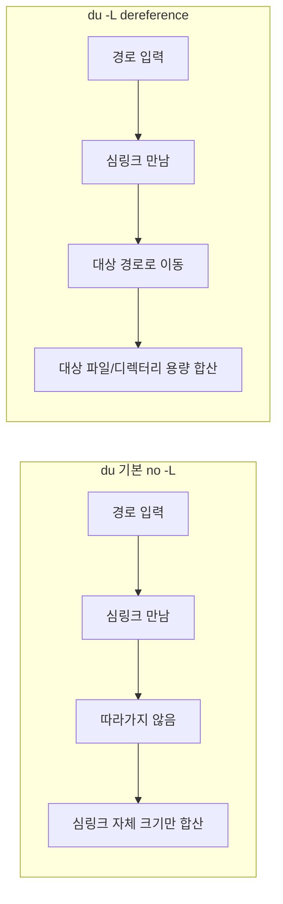

## 개요

리눅스·유닉스에서 **디스크 용량**을 확인할 때 자주 쓰는 명령어는 `du`(disk usage)와 `df`(disk free)다. 디렉터리 구조에 **심링크(symbolic link)**가 많이 들어 있으면, 기본 동작에서는 심링크 자체의 크기(몇 바이트~경로 문자열)만 잡히고, **심링크가 가리키는 실제 파일·디렉터리의 용량은 포함되지 않는다.** 백업 용량 추정, 디스크 사용량 감사, 정리 대상 찾기 등에서는 **실제 데이터 크기**를 알고 싶을 때가 많다. 이 포스트는 **용량 측정 시 심링크를 따라가서(dereference) 대상의 실제 용량을 반영하는 방법**을 정리한다.

**대상 독자**: 리눅스·맥에서 `du`, `df`를 쓰는 개발자·관리자, 심링크가 많은 디렉터리/마운트 구조를 다루는 사람.

---

## 심링크(symlink)란

**심볼릭 링크(symbolic link, symlink)**는 파일 시스템에서 **다른 파일 또는 디렉터리의 경로를 내용으로 갖는 특수 파일**이다. 실제 데이터를 복사하는 것이 아니라, “이 경로를 참조한다”는 정보만 저장한다.

- **하드 링크**: 동일 inode를 가리키는 다른 이름. 같은 파일시스템 내, 파일만 가능.
- **심링크**: 경로 문자열을 저장. 디렉터리·다른 파일시스템·없는 경로도 가리킬 수 있음.

용량 측정 관점에서:

- 심링크 **자체**의 크기: 경로 문자열 길이 정도(수십 바이트 수준).
- 심링크가 **가리키는 대상**의 크기: 수 GB까지 가능.

그래서 `du`·`df`로 “실제 쓰는 용량”을 보고 싶다면, **심링크를 따라가서(dereference) 대상의 크기를 세도록** 옵션을 주어야 한다.

---

## du에서 심링크 따라가기: -L, -D, -H

`du`는 지정한 경로 아래의 **파일·디렉터리 사용량**을 재귀적으로 합산한다. 트리 순회 중 만나는 **심링크 처리 방식**이 옵션에 따라 다르다.

### 기본 동작(-P, no-dereference)

- **디렉터리를 가리키는 심링크**는 **따라가지 않는다**. 심링크 항목 자체만 보고, 그 안으로 들어가지 않음.
- 그 결과, 심링크가 가리키는 큰 디렉터리의 용량이 합산에서 **빠진다**.

### -L (--dereference)

- **모든** 심링크를 따라간다. 명령줄에 준 경로가 심링크여도, 트리 순회 중 만나는 심링크도 모두 역참조.
- “실제 데이터 기준 용량”을 셀 때 가장 많이 쓰는 옵션이다.

```bash
du -L -h /path/to/symlink
du -L -sh /path/to/dir   # 요약만
```

### -D (--dereference-args), -H

- **명령줄 인자로 준 경로만** 심링크면 따라가고, **순회 중 만나는 심링크는 따라가지 않는다**.
- “인자로 준 이름만 논리적 경로로 보고, 나머지는 물리적 트리만 순회”할 때 사용.

### 비교 요약

| 옵션 | 명령줄 인자(심링크) | 순회 중 만난 심링크 |
|------|---------------------|----------------------|
| 기본(-P) | 따라가지 않음 | 따라가지 않음 |
| -D, -H | 따라감 | 따라가지 않음 |
| -L | 따라감 | 따라감 |

**용량 측정 시 심링크까지 모두 반영**하려면 **`du -L`**을 쓰면 된다.

---

## df와 심링크

`df`는 **파일시스템 단위**로 사용 가능·사용 중인 공간을 보여준다. 인자로 경로를 주면, 그 경로가 **속한 파일시스템**의 통계를 출력한다.

- 경로가 **심링크**일 때: 구현에 따라 그 경로를 해석한 **최종 대상**이 있는 파일시스템을 보여주는 경우가 많다. 즉, 심링크를 따라간 뒤 그 경로가 있는 디바이스/마운트의 사용량이 나온다.
- “특정 디렉터리 트리 전체가 차지하는 용량”을 알고 싶을 때는 **`du`**가 맞고, “그 경로가 올라가 있는 디스크의 여유 공간”을 보고 싶을 때 **`df`**를 쓰면 된다.

---

## 동작 방식 흐름 (Mermaid)

`du`가 심링크를 처리하는 두 가지 방식을 흐름으로 구분하면 아래와 같다.



- **왼쪽**: 기본 동작. 심링크를 만나도 따라가지 않아 **실제 데이터 용량이 빠진다**.
- **오른쪽**: `-L` 사용 시. 심링크를 따라가서 **대상의 용량이 반영**된다.

---

## 실전 예제

### 1. 특정 경로(심링크 포함) 실제 용량 요약

```bash
du -L -sh /data/project
```

`/data/project`가 심링크여도 그 대상 디렉터리 전체의 사용량이 출력된다.

### 2. 하위 디렉터리별로 보되, 심링크 따라가기

```bash
du -L -h --max-depth=1 /var
```

`/var` 아래 1단계까지 보면서, 심링크가 가리키는 실제 용량이 포함된다.

### 3. 총합만 한 줄로

```bash
du -L -sc /home/* | tail -1
```

각 인자에 대해 합계(`-c`)를 내고, 마지막 줄이 grand total이다.

### 4. df로 해당 경로가 올라간 디스크 여유 확인

```bash
df -h /data/project
```

`/data/project`(또는 그 심링크가 가리키는 실제 경로)가 올라간 파일시스템의 사용량·여유가 나온다.

---

## 주의사항

1. **중복 계산**: `du -L`로 디렉터리를 재귀하면, **여러 심링크가 같은 디렉터리를 가리킬 경우** 그 디렉터리 용량이 여러 번 더해질 수 있다. “실제 디스크 사용량”보다 큰 값이 나올 수 있음.
2. **순환 심링크**: A → B → A처럼 순환이 있으면, `-L` 사용 시 따라가다가 같은 곳을 반복 방문할 수 있다. 일부 구현에서는 순환 감지로 에러를 내거나 동작이 달라질 수 있으므로, 이상한 디렉터리 구조에서는 주의.
3. **다른 파일시스템**: 심링크가 다른 마운트를 가리키면, `du -L`은 그 마운트 안의 용량까지 합산한다. “이 디스크만의 용량”을 보고 싶다면 `-x`(one-file-system)와 조합해 사용할 수 있다. 예: `du -L -x -sh /` (루트와 같은 파일시스템만).
4. **권한**: 대상 디렉터리/파일에 읽기 권한이 없으면 해당 부분은 합산되지 않거나 에러가 날 수 있다.

---

## 요약

- **심링크**: 실제 파일/디렉터리가 아니라 “경로를 가리키는” 작은 파일이라, 기본 `du`는 그 작은 크기만 잡고 대상을 세지 않는다.
- **실제 데이터 기준 용량**을 보려면 **`du -L`**(또는 `--dereference`)을 사용해 모든 심링크를 따라가도록 하자.
- **명령줄 인자만** 심링크로 따라가고 싶으면 **`-D`/`-H`**를 쓰고, 트리 안의 심링크까지 모두 따라가려면 **`-L`**을 쓴다.
- **`df`**는 “그 경로가 있는 파일시스템의 사용량”을 보는 용도이고, 경로가 심링크면 보통 최종 대상이 있는 디스크 정보가 나온다.
- 중복 계산·순환 링크·다른 파일시스템·권한을 염두에 두고 해석하면 된다.

---

## 참고 문헌

1. [du(1) - Linux manual page](https://man7.org/linux/man-pages/man1/du.1.html) — man7.org. `-L`, `-D`, `-H`, `-P` 등 옵션 설명.
2. [symlink(7) - Linux manual page](https://man7.org/linux/man-pages/man7/symlink.7.html) — man7.org. 심볼릭 링크 처리 규칙, 트리 순회 시 동작.
3. [GNU coreutils - du](https://www.gnu.org/software/coreutils/manual/html_node/du-invocation.html) — GNU coreutils 문서. du invocation 상세.
