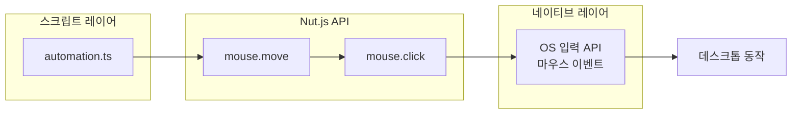

[Nut.js](https://nutjs.dev/)는 **Node.js** 환경에서 데스크톱을 자동으로 제어하기 위한 크로스플랫폼 프레임워크다. JavaScript 또는 TypeScript로 마우스 이동·클릭, 키보드 입력, 클립보드 접근, 화면 캡처·이미지 검색, 윈도우 정보 조회 등을 스크립트에서 직접 다룰 수 있어, 반복 업무 자동화, E2E 테스트, 데스크톱 에이전트 구현에 널리 쓰인다. 이 글에서는 Nut.js의 개요, 설치 방법, 주요 기능, 아키텍처, 사용 예시, 장단점과 적용 판단 기준, 참고 문헌을 정리한다.

|[](https://nutjs.dev/)|
|:---:|
|Nut.js 공식 홈페이지|

## 개요

### 도구 정보

Nut.js는 **데스크톱 오토메이션(Desktop Automation)**을 Node.js 스크립트로 수행할 수 있게 해 주는 라이브러리다. 공식 사이트와 문서는 [nutjs.dev](https://nutjs.dev/), 소스 코드와 이슈는 [GitHub nut-tree/nut.js](https://github.com/nut-tree/nut.js)에서 관리된다. Prebuilt 바이너리를 쓰는 유료 라이선스와 오픈소스 버전이 있으며, Windows 10 이상, macOS 14 이상, X11 기반 Linux를 지원한다.

### 추천 대상

다음과 같은 경우 Nut.js 도입을 고려할 수 있다. 데스크톱 앱의 UI를 자동으로 조작해야 하는 E2E 테스트 작성자, 레거시 데스크톱 앱과 연동하는 배치·워크플로 자동화 담당자, 화면 기반으로 동작하는 봇이나 에이전트를 만드는 개발자에게 적합하다. 반대로 웹만 다루거나, 순수 백엔드 로직만 테스트할 경우에는 Selenium·Playwright 등 웹 중심 도구가 더 나을 수 있다.

## 설치 및 설정

공식 문서의 [Getting Started](https://nutjs.dev/docs/getting-started)와 [Installation](https://nutjs.dev/docs/installation)에 따르면, Node.js 22.x 이상과 npm·yarn·pnpm 중 하나가 필요하다. 프로젝트 루트에서 다음처럼 코어 패키지를 설치한다.

```bash
npm install @nut-tree/nut-js
```

Prebuilt 네이티브 바이너리를 사용하면 별도 빌드 도구 없이 설치만으로 사용할 수 있다(유료 구독 시 제공). 플랫폼별로 **접근성 권한**이 필요하다. macOS에서는 터미널·IDE를 시스템 설정의 보안 및 개인 정보 → 손쉬운 사용(접근성)에 추가해야 마우스·키보드 제어가 동작한다. Linux는 X11 환경이 필요하며, 헤드리스·CI 환경에서는 Xvfb 같은 가상 디스플레이를 쓰는 것이 일반적이다. Windows는 추가 설정 없이 동작하는 경우가 많다.

## 주요 기능

Nut.js가 제공하는 기능은 크게 여섯 가지로 정리할 수 있다. 각각 문단으로 요약한 뒤 표로 요약한다.

**마우스 제어(Mouse Control)**  
마우스 커서를 특정 좌표나 화면 위의 요소로 이동시키고, 클릭·더블클릭·드래그, 휠 스크롤을 수행할 수 있다. 이동 속도와 이징 함수를 설정해 자연스러운 동작을 만들 수 있다.

**키보드 입력(Keyboard Input)**  
텍스트 입력, 단일 키·조합키 누르기, 누른 채 유지하기 등을 지원한다. 타자 속도를 조절해 사람처럼 입력하는 시뮬레이션이 가능하다.

**클립보드(Copy & Paste)**  
시스템 클립보드에 접근해 텍스트·이미지 복사·붙여넣기를 스크립트에서 처리할 수 있다.

**윈도우 정보(Window Info)**  
열려 있는 윈도우 목록 조회, 활성 윈도우 가져오기, 포커스·위치·크기 제어 등으로 테스트·워크플로를 세밀하게 구성할 수 있다.

**비주얼 자동화·검색(Visual automation & testing)**  
플러그인을 통해 화면 위의 **텍스트** 또는 **이미지**를 검색하고, 해당 영역을 좌표로 얻어 마우스·키보드 동작에 활용할 수 있다. E2E 테스트와 시각 기반 자동화에 유용하다.

**크로스플랫폼(Cross-platform)**  
Windows, macOS, Linux에서 동일한 API로 동작하므로, 한 번 작성한 스크립트를 OS별로 재사용하기 쉽다.

| 기능 | 설명 |
|------|------|
| 마우스 제어 | 이동, 클릭, 드래그, 스크롤, 속도·이징 설정 |
| 키보드 입력 | 텍스트 입력, 단일/조합키, 누름 유지 |
| 클립보드 | 복사·붙여넣기(텍스트·이미지) |
| 윈도우 정보 | 목록 조회, 활성 윈도우, 포커스·위치·크기 |
| 비주얼 검색 | 텍스트·이미지 온스크린 검색(플러그인) |
| 크로스플랫폼 | Windows, macOS, Linux 동일 API |

## 아키텍처와 동작 흐름

Nut.js는 Node.js 스크립트에서 네이티브 입력 장치(마우스·키보드)와 화면·윈도우를 제어하기 위해 **네이티브 바이너리**를 사용한다. 스크립트 레벨의 API(mouse, keyboard, screen 등)가 플랫폼별 구현과 연결되고, 필요 시 플러그인(이미지 검색, OCR, 엘리먼트 검사 등)이 그 위에 붙는 구조다. 아래 다이어그램은 스크립트에서 마우스 이동과 클릭을 요청했을 때의 흐름을 단순화한 것이다.



노드 ID는 예약어를 피하고 camelCase를 사용했으며, 라벨은 큰따옴표로 감싸고 줄바꿈은 `</br>`을 사용했다.

## 사용 예시

다음 예시는 화면 중앙으로 마우스를 이동한 뒤 문자열을 입력하는 최소 동작이다. `screen`으로 화면 크기를 구하고, `mouse.move`로 그 중앙 좌표로 이동한 다음 `keyboard.type`으로 텍스트를 입력한다. 실제 사용 시에는 `straightTo`, `centerOf` 등으로 특정 영역을 지정해 클릭·입력하는 패턴이 많다.

```typescript
import { mouse, keyboard, screen, straightTo, Point } from "@nut-tree/nut-js";

const screenWidth = await screen.width();
const screenHeight = await screen.height();

await mouse.move(straightTo(new Point(screenWidth / 2, screenHeight / 2)));
await keyboard.type("Hello from nut.js!");
```

공식 문서의 [Quick Start](https://nutjs.dev/docs/getting-started)에서는 `npx tsx automation.ts`로 실행하는 방법을 안내한다. TypeScript 프로젝트에서는 `ts-node` 또는 `tsc`로 컴파일 후 Node로 실행해도 된다.

## 장단점과 적용 판단 기준

**장점**  
Node.js/TypeScript 생태계와 통합되어 기존 프로젝트에 쉽게 붙일 수 있고, 마우스·키보드·화면·윈도우를 한 API로 다룰 수 있다. Prebuilt 바이너리를 쓰면 네이티브 빌드 없이 설치만으로 사용 가능하며, 플러그인으로 이미지 검색·OCR·엘리먼트 검사 등 고급 기능을 확장할 수 있다. Windows·macOS·Linux를 동일한 코드로 다룰 수 있어 크로스플랫폼 자동화·테스트에 유리하다.

**단점**  
OS별 접근성·권한 설정이 필요하고, 헤드리스 서버에서는 가상 디스플레이(Xvfb 등) 구성이 필요할 수 있다. 화면 해상도·DPI·언어 설정에 따라 이미지 검색 결과가 달라질 수 있어, 비주얼 검색은 환경을 고정하거나 상대 좌표·텍스트 기반 검색을 보조로 쓰는 것이 안정적이다. 상용 라이선스가 있는 Prebuilt 패키지와 오픈소스 버전의 기능·배포 방식 차이를 확인한 뒤 도입하는 것이 좋다.

**적용 판단 기준**  
다음이 해당되면 Nut.js 도입을 검토할 만하다. 데스크톱 네이티브 앱의 E2E 테스트를 자동화하고 싶을 때, 웹이 아닌 데스크톱 UI를 스크립트로 조작해야 할 때, 레거시 데스크톱 앱을 배치·CI에 연동하고 싶을 때다. 반대로 브라우저만 대상으로 하거나, API·유닛 테스트만 필요하다면 Playwright·Jest 등이 더 적합할 수 있다.

## 종합 평가

Nut.js는 Node.js 기반 데스크톱 자동화를 하나의 API로 다루고 싶을 때 선택할 수 있는 실용적인 프레임워크다. 마우스·키보드·화면·윈도우·클립보드를 통합하고, 플러그인으로 비주얼 검색과 E2E 시나리오를 확장할 수 있어, 반복 업무 자동화와 데스크톱 앱 테스트에 잘 맞는다. OS 권한과 환경 의존성을 고려해 도입 여부를 결정하고, 공식 문서와 라이선스 정책을 확인한 뒤 사용하는 것을 권한다.

**한 줄 평:** Node.js로 데스크톱을 마우스·키보드·화면 단위로 제어하고 싶다면 Nut.js가 실무에 바로 쓸 수 있는 선택지다.

### 이 글을 읽은 후 할 수 있는 것

- Nut.js가 무엇인지, 어떤 문제를 해결하는지 설명할 수 있다.
- 공식 문서를 참고해 프로젝트에 Nut.js를 설치하고 플랫폼별 권한을 설정할 수 있다.
- 마우스·키보드·클립보드·윈도우·비주얼 검색 중 필요한 기능을 골라 사용할 수 있다.
- 데스크톱 자동화가 필요한 상황과 웹 전용 도구가 나은 상황을 구분할 수 있다.

## 참고 문헌

1. [Nut.js 공식 사이트](https://nutjs.dev/) — 소개, 가격, use case.
2. [Nut.js 공식 문서 - Getting Started](https://nutjs.dev/docs/getting-started) — 설치 및 첫 스크립트 실행.
3. [Nut.js 공식 문서 - Installation](https://nutjs.dev/docs/installation) — 요구 사항, 플랫폼별 설정.
4. [nut-tree/nut.js (GitHub)](https://github.com/nut-tree/nut.js) — 소스 코드, 이슈, 기여.
