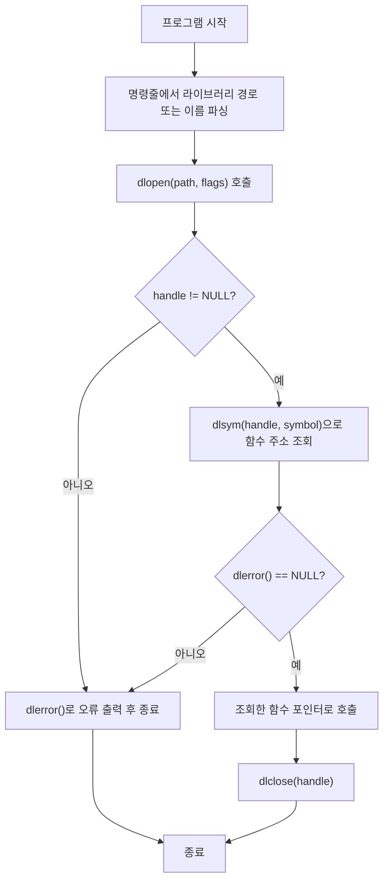

## 개요

**dlopen**은 Linux/Unix에서 공유 라이브러리(`.so`)를 **실행 중에** 불러오고, 그 안의 함수를 **동적으로** 호출할 수 있게 해 주는 API다. 컴파일 시점에 라이브러리를 링크하지 않고, 런타임에 라이브러리 경로나 이름만 지정해 로드·해제할 수 있어 플러그인 구조, 선택적 기능 로딩, 라이브러리 버전 분기 등에 널리 쓰인다.

### 왜 dlopen을 쓰는가

- **플러그인·확장 구조**: 실행 파일을 다시 빌드하지 않고 새 모듈(.so)만 추가해 기능을 확장할 수 있다.
- **선택적 의존성**: 무거운 라이브러리를 “있을 때만” 로드해 시작 부담과 의존성을 줄일 수 있다.
- **A/B·버전 분기**: 같은 인터페이스의 서로 다른 구현(.so)을 경로나 이름으로 골라 로드할 수 있다.

### 이 글에서 다루는 것

- `dlopen`, `dlsym`, `dlclose`, `dlerror` 사용법과 플래그(`RTLD_NOW`, `RTLD_LAZY` 등)
- **gcc**로 dlopen을 쓰는 실행 파일을 만드는 방법(`-ldl`)
- 기본 예제와 실전에서 쓸 만한 패턴, 주의사항·함정

---

## dlopen API 요약

| 함수 | 역할 |
|------|------|
| `dlopen(path, flags)` | 공유 객체를 로드하고 핸들 반환. 실패 시 `NULL` |
| `dlsym(handle, symbol)` | 핸들에서 심볼(함수·변수) 주소 조회 |
| `dlclose(handle)` | 핸들 참조 카운트 감소, 0이 되면 언로드 |
| `dlerror()` | 직전 dl 관련 오류 메시지 반환(없으면 `NULL`) |

`path`에 `/`가 있으면 파일 경로로, 없으면 동적 링커 검색 규칙(`LD_LIBRARY_PATH`, `ld.so.cache`, `/lib`, `/usr/lib` 등)에 따라 찾는다.

---

## 동적 로딩 흐름 (Mermaid)

아래는 dlopen으로 라이브러리를 열고, 심볼을 조회한 뒤 닫는 흐름을 단순화한 것이다. 노드 ID는 camelCase, 라벨에 등호·연산자가 있으면 큰따옴표로 감쌌다.



---

## 기존 다이어그램 (PlantUML)

클래스·시퀀스 관점의 구조는 아래 PlantUML 생성 이미지로 참고할 수 있다.

|  |
| :-------------------------------------------------------------------: |
| 클래스 다이어그램 |

|  |
| :-----------------------------------------------------------------: |
| 시퀀스 다이어그램 |

---

## dlopen 플래그 요약

- **RTLD_NOW**: 로드 시점에 미정의 심볼을 모두 해석. 실패하면 `dlopen`이 곧바로 `NULL`을 반환한다. 디버깅·안정성에 유리.
- **RTLD_LAZY**: 해당 심볼을 처음 참조할 때 해석. 로드만 빠르고, 잘못된 심볼은 나중에 접근할 때 오류가 난다.
- **RTLD_LOCAL** / **RTLD_GLOBAL**: 이 객체의 심볼을 이후에 로드되는 객체에 노출할지 여부. 기본은 `RTLD_LOCAL`이다.

실무에서는 “로드 직후 문제를 발견하고 싶다”면 `RTLD_NOW`를 쓰는 경우가 많다.

---

## 컴파일 및 링크 (gcc, -ldl)

dlopen API는 **libdl**에 들어 있으므로, 링크 단계에서 **`-ldl`**을 반드시 준다.

```bash
gcc -o [executable_name] [source_file] -ldl
```

예:

```bash
gcc -o dlopen_demo main.c -ldl
```

실행 시 로드할 라이브러리는 인자나 설정으로 넘기면 된다.

```bash
./dlopen_demo [library_name_or_path]
```

---

## 예제 1: 라이브러리 로드·해제만 하기

명령줄 인자로 받은 라이브러리를 `dlopen`으로 열고, 성공 시 메시지를 출력한 뒤 `dlclose`로 닫는 최소 예제다.

- `[executable_name]`: 빌드 결과 실행 파일 이름  
- `[source_file]`: 위 소스를 담은 파일 이름(예: `main.c`)  
- `[library_name]`: 실행 시 넘길 `.so` 이름 또는 경로(예: `libm.so.6`)

```c
#include <dlfcn.h>
#include <stdio.h>

int main(int argc, char *argv[])
{
    char *lib_name;

    if (argc < 2) {
        printf("Usage: %s <library_name>\n", argv[0]);
        return 1;
    }

    lib_name = argv[1];

    void *handle;
    handle = dlopen(lib_name, RTLD_NOW);
    if (!handle) {
        printf("Error opening library: %s\n", dlerror());
        return 1;
    }

    printf("Library %s loaded successfully\n", lib_name);
    dlclose(handle);
    return 0;
}
```

---

## 예제 2: dlsym으로 함수 주소 조회해 호출하기

`libm`을 열고 `cos` 심볼을 조회해 호출하는 예제다. `dlsym` 직후 `dlerror()`로 심볼 조회 실패 여부를 반드시 확인하는 패턴을 보여 준다.

```c
#include <dlfcn.h>
#include <stdio.h>
#include <stdlib.h>

int main(void)
{
    void *handle;
    double (*cosine)(double);
    char *error;

    handle = dlopen("libm.so.6", RTLD_LAZY);
    if (!handle) {
        fprintf(stderr, "%s\n", dlerror());
        return EXIT_FAILURE;
    }

    dlerror(); /* 이전 오류 제거 */

    *(void **)&cosine = dlsym(handle, "cos");
    error = dlerror();
    if (error != NULL) {
        fprintf(stderr, "%s\n", error);
        dlclose(handle);
        return EXIT_FAILURE;
    }

    printf("cos(2.0) = %f\n", (*cosine)(2.0));
    dlclose(handle);
    return EXIT_SUCCESS;
}
```

함수 포인터와 `void *` 간 변환은 C 표준상 완전히 정의된 동작은 아니지만, POSIX에서는 `dlsym`이 반환한 `void *`를 함수 포인터로 쓰는 것을 지원한다. 위처럼 `*(void **)&cosine = dlsym(...)` 형태로 쓰면 많은 컴파일러에서 경고를 피할 수 있다.

---

## 실전 활용 팁

1. **에러 처리**: `dlopen`/`dlsym` 실패 시 반드시 `dlerror()`로 메시지를 찍고, 핸들은 `dlclose`만 성공했을 때 호출하도록 하면 리소스 누수와 오류 전파를 줄일 수 있다.
2. **경로 지정**: 배포 환경에서 `.so` 위치가 다르면 `path`에 절대 경로나 `LD_LIBRARY_PATH`를 사용한다. setuid 등 보안 정책에 따라 `LD_LIBRARY_PATH`가 무시될 수 있음을 염두에 둔다.
3. **참조 카운트**: 같은 경로로 여러 번 `dlopen`하면 같은 객체에 대한 참조가 늘어나며, 그만큼 `dlclose`를 호출해야 실제로 언로드된다.

---

## 주의사항 및 함정 (Pitfalls)

- **dlerror() 스레드**: `dlerror()`는 스레드당 하나의 오류 문자열을 반환한다. 멀티스레드에서는 한 스레드가 `dlerror()`를 읽기 전에 다른 스레드가 dl 함수를 호출하면 메시지가 덮어써질 수 있다.
- **RTLD_LAZY와 미정의 심볼**: `RTLD_LAZY`는 “첫 참조 시” 해석한다. 그 시점에 심볼이 없으면 그때서야 오류가 난다. 초기화 직후에 문제를 발견하려면 `RTLD_NOW` 사용을 권장한다.
- **라이브러리 의존성**: 로드한 `.so`가 다른 `.so`에 의존하면 동적 링커가 재귀적으로 로드한다. 이때 의존한 라이브러리가 없거나 버전이 맞지 않으면 `dlopen`이 실패할 수 있으므로, `ldd` 등으로 의존성을 미리 확인하는 것이 좋다.

---

## 참고 문헌 및 출처

- [dlopen(3) - Linux manual page (man7.org)](https://man7.org/linux/man-pages/man3/dlopen.3.html) — dlopen, dlsym, dlclose, dlerror 공식 매뉴얼
- [dlsym(3) - Linux manual page (man7.org)](https://man7.org/linux/man-pages/man3/dlsym.3.html) — dlsym 상세 및 함수 포인터 변환 관련 설명
- [ld.so(8) - Linux manual page (man7.org)](https://man7.org/linux/man-pages/man8/ld.so.8.html) — 동적 링커 동작, 검색 순서, 환경 변수

위 링크들은 접근 가능한 공식 문서이므로 그대로 두었다.
