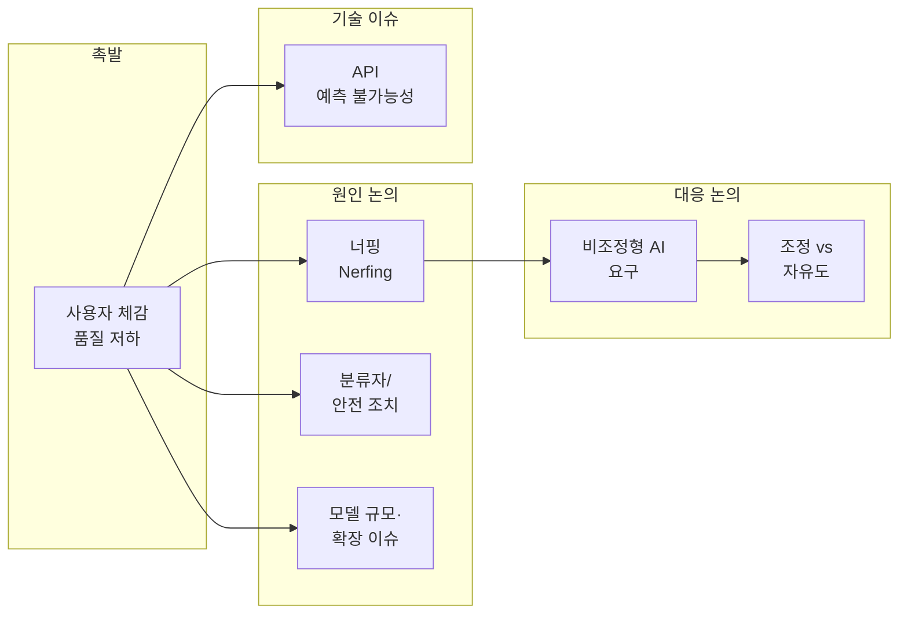

## 개요

인공지능(AI)은 기술 업계의 판도를 바꾸어 왔으며, OpenAI의 **GPT-4**도 그 중심에 서 있습니다. 2023년 5월 말 [해커뉴스(Hacker News)에서 "GPT-4의 품질이 최근 크게 떨어진 것 같다"는 질문](https://news.ycombinator.com/item?id=36134249)이 올라오며 수백 개의 댓글과 함께 논의가 촉발되었습니다. 이 포스트는 해당 논의를 바탕으로 **GPT-4의 품질 저하(너핑) 인식**, **비조정형(Unaligned) AI에 대한 요구**, **조정(alignment)과 안전의 균형**, **API 예측 불가능성**, **모델 규모와 확장 이슈**를 정리하고, AI의 유익하고 윤리적인 활용을 위한 관점을 제시합니다.

**대상 독자**: ChatGPT·LLM을 업무나 학습에 활용하는 개발자, AI 정책·윤리에 관심 있는 독자.

---

## 논의 구조 개요

아래 다이어그램은 본문에서 다루는 논의 흐름을 요약합니다. 사용자 체감 품질 저하에서 출발해, 원인 추측·비조정형 AI 요구·조정의 중요성·기술적 이슈(API·규모)까지 이어지는 구조입니다.

---

## 배경: 해커뉴스에서 촉발된 논의

2023년 5월 31일, 해커뉴스에 **"GPT-4의 품질이 최근 크게 떨어진 것 같다"**는 제목의 글이 올라왔습니다. 작성자와 많은 댓글 사용자들은 **응답 속도는 빨라졌지만 품질은 오히려 GPT-3.5++ 수준으로 느껴진다**고 했습니다. 구체적으로는 **버그 많은 코드 생성**, **답변의 깊이·분석 부족**, **이전에 하던 복잡한 문제 해결 능력 감소** 등이 반복적으로 언급되었습니다. 한 사용자는 "원래 GPT-4는 마법 같았는데, 지금은 그냥 멍청한 확률적 앵무새"라고 표현하기도 했습니다. 이 체감 품질 저하가 **단순한 체감인지, 실제 모델 변경(너핑) 때문인지**, 그리고 **그 원인이 무엇인지**를 둘러싼 논의가 이어졌습니다.

---

## GPT-4의 '너핑(Nerfing)' 논란

사용자들 사이에서 가장 큰 우려는 GPT-4가 **의도적으로 약화(너프)되었다**는 인식입니다. 한때 복잡한 코딩·분석 작업을 잘 수행하던 모델이, 단순한 CSS 몇 줄 수정·재출력 같은 작업에서도 빼먹거나 잘못된 줄을 출력한다는 경험이 공유되었습니다.

### 원인에 대한 추측

- **분류자·안전 계층**: OpenAI가 특정 코딩·작업 유형을 감지해 해당 작업을 제한하도록 **분류자(classifier) 계층**을 넣었다는 추측. GPT-4 공개 문서에서도 **안전(safety) 관련 조치가 정확도를 해친다**는 식의 설명이 있어, 이 추측을 뒷받침하는 자료로 인용되었습니다.
- **대규모 이해관계자**: Microsoft 등 대형 파트너의 참여로 **책임·규제 리스크**를 줄이기 위해 모델 출력이 보수적으로 조정되었을 수 있다는 주장.
- **릴리스 단계별 약화**: Bing에 GPT-4를 통합했던 관계자의 발언처럼, **오픈AI로부터 받는 GPT-4 버전이 배포 단계를 거치며 반복적으로 약화(nerfed)**되었다는 경험담이 소개되었습니다. 예를 들어 "TikZ로 유니콘 그리기" 같은 작업에서 초기 버전은 점점 나아졌다가, **안전(safety)에 초점을 맞춘 이후 버전에서는 오히려 성능이 떨어졌다**는 관찰이 공유되었습니다.

이를 두고 **"안전을 위한 최종 패스로 나쁜 출력만 제거한 것이 아니라, 모델 전체의 일반화 능력에 영향을 주는 깊은 변경"**이라는 해석도 제기되었습니다. 즉, LLM은 사실상 **일반화 기계**이기 때문에, 특정 영역을 억압하는 조정이 다른 영역의 추론·코딩 능력까지 떨어뜨릴 수 있다는 논리입니다.

---

## '비조정형(Unaligned)' AI란

GPT-4 논의와 함께 **'비조정형(Unaligned)' AI**라는 용어가 자주 등장했습니다. 여기서 **비조정형**이란 **특정 기업·단체의 이익, 이념, 정책에 맞추어 설계·제한되지 않은 AI**를 의미합니다.

- **비조정형 AI**: 이론적으로 기업·조직의 영향에서 독립적으로 동작하며, **책임 회피·이해관계·규제**를 이유로 기능을 인위적으로 제한하도록 프로그래밍되지 않은 모델.
- **오픈 소스 비조정형 AI 요구**: "기업이 통제하는 AI는 기업 이익에 반하는 행동을 못 하게 제한될 수밖에 없다"는 전제 아래, **오픈 소스로 공개된 비조정형 대형 모델**을 요구하는 목소리가 커졌습니다. 컴퓨팅 파워만 있으면 **검열되지 않은 강력한 모델**을 돌릴 수 있어야 한다는 주장입니다.

---

## 조정(Alignment)의 중요성

비조정형 AI가 매력적으로 보일 수 있지만, **조정(alignment)**의 역할을 무시할 수는 없습니다.

- **조정의 역할**: AI가 **사용자가 원하는 작업을 유용하게 수행**하도록 만드는 것. 조정되지 않은 모델은 **실제로는 쓸모가 떨어지거나**, 사용자 의도와 어긋난 출력을 낼 수 있습니다.
- **안전·윤리 우려**: 비조정형·제한 없는 모델은 **통제, 윤리, 안전** 측면에서 예측 불가능·유해·비윤리적 행동 가능성을 키운다는 지적이 있습니다. [Geoffrey Hinton이 구글을 떠나며 AI의 실존적 위험을 경고한 인터뷰](https://www.technologyreview.com/2023/05/03/1072589/video-geoffrey-hinton-google-ai-risk-ethics/)처럼, **안전과 능력의 균형**을 어떻게 잡을지에 대한 사회적 논의가 필요합니다.

따라서 **"비조정형이 무조건 좋다"**가 아니라, **투명한 연구·오픈소스 접근과 함께 안전 연구와 규제가 병행**되어야 한다는 관점이 중요합니다. [오픈소스 대형 AI 연구를 위한 CERN 스타일 시설 청원](https://www.openpetition.eu/petition/online/securing-our-digital-future-a-cern-for-open-source-large-scale-ai-research-and-its-safety)은 이런 맥락에서 **민주적 감독 하의 오픈소스 대규모 AI 연구·안전 연구**를 제안합니다.

---

## GPT API의 예측 불가능성

품질 논란과 별개로, **GPT API(채팅 엔드포인트)**에 대한 불만도 제기되었습니다. **몇 주 단위로 응답 특성이 크게 바뀌어**, 이전에 잘 되던 프롬프트가 통하지 않거나 품질이 달라진다는 경험입니다. 이는 **프로덕션·자동화 파이프라인**에서 재현성과 유지보수를 어렵게 만들 수 있어, 개발자 관점에서 실질적인 문제가 됩니다.

---

## GPT-4의 크기와 복잡성

GPT-4는 **약 1조 개 파라미터** 규모로 알려진 초대형 모델입니다. 따라서 **품질 저하가 전부 의도적 너핑 때문이 아니라**, **확장·서빙·비용** 때문에 버전·캐싱·라우팅 등이 바뀌면서 체감 품질이 달라졌을 가능성도 있습니다. 일부 사용자는 "의도적 약화"보다 **규모로 인한 확장 이슈** 쪽을 더 의심하기도 했습니다.

---

## 종합 정리 및 결론

| 항목 | 요약 |
|------|------|
| **체감 품질 저하** | 속도는 빨라졌으나 코드 품질·분석 깊이·복잡 문제 해결 능력이 떨어진다는 경험이 다수 보고됨. |
| **원인 논의** | 분류자·안전 조치, 대형 파트너의 리스크 관리, 릴리스 단계별 약화, 확장·비용 이슈 등 다양한 추측이 존재. |
| **비조정형 AI** | 기업 통제·검열 없이 강력한 모델을 쓰고 싶다는 요구가 있으나, 조정은 유용성·안전에 필수적임. |
| **API** | 주기적인 동작 변경으로 인한 예측 불가능성이 실무에서 문제가 됨. |

OpenAI의 GPT-4를 둘러싼 논의는 **AI 시스템의 복잡성과 트레이드오프**를 잘 보여 줍니다. 품질 저하와 예측 불가능성에 대한 우려가 있지만, **이 모델이 여전히 많은 작업에서 유용하다**는 점도 염두에 두어야 합니다. 앞으로 **AI가 유익하고 윤리적인 방식으로 쓰이도록** 하려면, **투명한 연구·오픈소스·안전 연구·규제**에 대한 대화를 계속 이어가는 것이 중요합니다. 동시에 [GPT 학습에 참여한 저임금 노동자의 경험](https://www.bigtechnology.com/p/he-helped-train-chatgpt-it-traumatized)처럼 **AI 생태계의 인적·사회적 비용**도 함께 논의될 필요가 있습니다.

---

## 참고 문헌

1. **Ask HN: Is it just me or GPT-4's quality has significantly deteriorated lately?** — Hacker News.  
   [https://news.ycombinator.com/item?id=36134249](https://news.ycombinator.com/item?id=36134249)

2. **Video: Geoffrey Hinton talks about the "existential threat" of AI** — MIT Technology Review.  
   [https://www.technologyreview.com/2023/05/03/1072589/video-geoffrey-hinton-google-ai-risk-ethics/](https://www.technologyreview.com/2023/05/03/1072589/video-geoffrey-hinton-google-ai-risk-ethics/)

3. **Securing Our Digital Future: A CERN for Open Source large-scale AI Research and its Safety** — openPetition.  
   [https://www.openpetition.eu/petition/online/securing-our-digital-future-a-cern-for-open-source-large-scale-ai-research-and-its-safety](https://www.openpetition.eu/petition/online/securing-our-digital-future-a-cern-for-open-source-large-scale-ai-research-and-its-safety)

4. **He Helped Train ChatGPT. It Traumatized Him.** — Big Technology (Substack).  
   [https://www.bigtechnology.com/p/he-helped-train-chatgpt-it-traumatized](https://www.bigtechnology.com/p/he-helped-train-chatgpt-it-traumatized)
