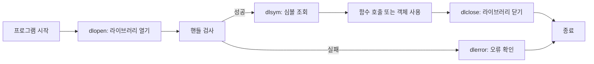

## 개요

**동적 로딩(Dynamic loading)**은 프로그램이 **런타임에** 공유 라이브러리(.so, .dll)를 메모리에 올리고, 그 안의 함수·심볼을 조회해 사용한 뒤 언로드하는 메커니즘이다. C/C++에서는 POSIX의 **dlopen API**(`dlopen`, `dlsym`, `dlclose`, `dlerror`)로 이 기능을 사용한다. 정적 링크와 달리 필요할 때만 모듈을 로드·해제할 수 있어 플러그인, 확장 모듈, 조건부 기능 로딩에 적합하다.

**이 포스트에서 다루는 내용**

- 동적 로딩의 개념과 dlopen API 네 함수의 역할
- C++에서의 **이름 맹글링(Name mangling)**과 **클래스 로딩** 문제
- **extern "C"**와 **클래스 팩토리 함수**를 이용한 해결 방법
- 함수·클래스를 동적으로 로드하는 **실전 예제**
- 자주 묻는 질문과 참고 문헌

**추천 대상**

- Linux/macOS에서 C++로 플러그인·모듈 시스템을 설계하려는 개발자
- dlopen/dlsym을 처음 쓰는 중급 C++ 학습자
- 공유 라이브러리 빌드·심볼 조회·에러 처리 흐름을 정리하고 싶은 사람

---

## 동적 로딩이란

동적 로딩은 **실행 시점**에 코드 모듈을 주소 공간에 올린 뒤 해당 코드를 호출할 수 있게 하는 방식이다. 반대로 **정적 로딩**은 링크 시점에 모든 코드가 실행 파일에 묶여 들어가며, 실행 전부터 메모리 레이아웃이 정해진다. 동적 로딩을 쓰면 필요한 시점에 필요한 라이브러리만 로드하고, 사용이 끝나면 언로드해 리소스를 줄일 수 있다.

C++에서는 보통 **공유 라이브러리**(Linux: `.so`, Windows: `.dll`, macOS: `.dylib`)를 대상으로 하며, 그 안에 있는 함수·변수·(C 인터페이스를 통한) 클래스 인스턴스를 사용할 수 있다.

### 동적 로딩 흐름 개요

다음은 dlopen API를 사용한 전형적인 흐름을 Mermaid로 나타낸 것이다. 노드는 단계, 엣지는 호출 순서를 의미한다.



- **dlopen**: 라이브러리 파일을 열고 핸들(`void*`)을 반환한다.
- **dlsym**: 핸들과 심볼 이름으로 함수/변수 주소를 얻는다.
- 사용 후 **dlclose**로 핸들을 닫아 참조 카운트를 줄이고, 필요 시 언로드한다.
- 각 단계에서 실패 시 **dlerror**로 마지막 오류 메시지를 확인할 수 있다.

---

## dlopen API 네 가지 함수

dlopen API는 다음 네 함수로 구성된다.

| 함수 | 역할 |
|------|------|
| **dlopen** | 공유 라이브러리를 메모리에 로드하고, 이후 API에서 쓸 핸들(`void*`)을 반환한다. |
| **dlsym** | 열린 라이브러리(핸들)에서 심볼(함수·변수) 이름으로 주소를 조회한다. |
| **dlclose** | 핸들에 해당하는 라이브러리의 참조를 줄이고, 필요 시 메모리에서 언로드한다. |
| **dlerror** | 직전 dlopen API 호출에서 발생한 오류에 대한 사람이 읽을 수 있는 문자열을 반환한다. |

- **dlopen**: 파일 경로와 플래그(예: `RTLD_LAZY`, `RTLD_NOW`)를 받는다. 실패 시 `NULL`을 반환하므로 반드시 검사한 뒤 `dlerror()`로 원인을 확인해야 한다.
- **dlsym**: `dlsym(handle, "심볼이름")`으로 함수 포인터나 변수 주소를 얻는다. C++에서는 이름 맹글링 때문에 **extern "C"**로 노출한 심볼 이름을 사용해야 한다.
- **dlclose**: 사용이 끝난 핸들을 넘겨 참조 카운트를 감소시킨다. 0이 되면 OS가 라이브러리를 언로드할 수 있다.
- **dlerror**: 스레드당 하나의 오류 문자열을 반환하며, 호출 시 이전 메시지는 무효화된다. `dlsym` 직후에는 `dlerror()`를 먼저 초기화한 뒤 `dlsym`을 호출하고, 다시 `dlerror()`로 성공 여부를 판단하는 패턴이 권장된다.

---

## C++에서 동적 로딩의 문제점

동적 로딩은 C에는 비교적 단순하지만, C++에서는 **이름 맹글링**과 **클래스 로딩** 두 가지가 걸림돌이 된다.

### 이름 맹글링(Name mangling)

C++는 오버로딩, 네임스페이스, 클래스 멤버 등으로 인해 “함수 이름”만으로는 심볼을 구분할 수 없다. 그래서 컴파일러는 함수 이름·매개변수 타입·네임스페이스 등을 조합해 **내부 심볼 이름**을 만든다. 이를 이름 맹글링이라 한다.

예를 들어:

```cpp
void foo(int a) {}
void foo(double a) {}
```

위 코드가 컴파일되면 Itanium C++ ABI를 쓰는 환경에서는 대략 다음과 같은 심볼 이름이 된다.

```text
_Z3fooi   // foo(int)
_Z3food   // foo(double)
```

- **문제**: `dlsym(handle, "foo")`처럼 소스 코드의 이름만으로는 조회할 수 없다. 맹글링된 이름은 컴파일러·버전·ABI에 따라 달라지므로, 이 이름을 하드코딩하는 것은 비권장이다.
- **해결**: 동적으로 불러올 함수는 **extern "C"**로 선언해 C 링크를 부여하면, 심볼 이름이 소스의 함수 이름과 동일하게 유지되어 `dlsym(handle, "함수이름")`으로 조회할 수 있다.

`nm`으로 확인하는 방법:

```bash
g++ -c myfile.cpp
nm myfile.o
```

출력에서 `T`는 텍스트(코드) 섹션의 심볼(함수)을 의미하며, 세 번째 열이 실제 심볼 이름이다.

### 클래스 로딩

dlopen API는 **함수**를 로드하는 데 초점이 맞춰져 있고, “클래스 타입” 자체를 로드하는 개념은 없다. 그런데 C++에서는 라이브러리가 **클래스**를 노출하는 경우가 많다. 클래스를 쓰려면 인스턴스를 만들어야 하는데, 실행 파일 쪽에는 그 클래스 정의가 없을 수 있고, 설령 있어도 한쪽에서 `new`/`delete`를 쓰면 ODR·메모리 할당자 불일치 문제가 생길 수 있다.

- **해결**: 라이브러리 안에 **파생 클래스**를 두고, **extern "C"**인 **팩토리 함수** 두 개(인스턴스 생성·소멸)만 노출한다. 실행 파일은 베이스 클래스(인터페이스)만 알고, `create`/`destroy`를 `dlsym`으로 구한 뒤 베이스 포인터로 다형적으로 사용한다. 인스턴스 생성·삭제는 모두 라이브러리 내부에서 수행해, `new`/`delete` 쌍을 한 모듈 안에서 맞춘다.

---

## C++ 동적 로딩 해결책 요약

- **함수**: 동적으로 부를 함수는 **extern "C"**로 선언해 맹글링을 막고, `dlsym`으로 함수 포인터를 구한 뒤 호출한다.
- **클래스**:  
  - 실행 파일: 베이스 클래스(가상 함수 인터페이스)와 `create`/`destroy` 타입만 정의.  
  - 라이브러리: 베이스를 상속한 구현 클래스 + **extern "C"** `create`(인스턴스 생성)·`destroy`(인스턴스 삭제).  
  - 실행 파일은 `dlsym(handle, "create")`, `dlsym(handle, "destroy")`로 두 함수를 구해 사용한다.  
  - 베이스 클래스 소멸자는 반드시 **가상**으로 두어, 베이스 포인터로 `destroy` 호출 시 파생 클래스 소멸자가 실행되도록 한다.

---

## 실전 예제: 함수 로드

동적으로 부를 함수가 있는 공유 라이브러리 예시다.

**라이브러리 (예: hello.cpp)**

```cpp
#include <iostream>

extern "C" void hello() {
    std::cout << "Hello, world!" << std::endl;
}
```

**호출 측 (main)**

```cpp
#include <dlfcn.h>
#include <iostream>

int main() {
    void* handle = dlopen("./libhello.so", RTLD_LAZY);
    if (!handle) {
        std::cerr << "Cannot open library: " << dlerror() << '\n';
        return 1;
    }

    dlerror();
    typedef void (*hello_t)();
    hello_t hello = (hello_t) dlsym(handle, "hello");
    const char* dlsym_error = dlerror();
    if (dlsym_error) {
        std::cerr << "Cannot load symbol 'hello': " << dlsym_error << '\n';
        dlclose(handle);
        return 1;
    }

    hello();
    dlclose(handle);
}
```

- `hello`는 **extern "C"**이므로 `dlsym(handle, "hello")`로 조회 가능하다.
- `dlsym` 전에 `dlerror()`를 한 번 호출해 이전 오류를 지우고, `dlsym` 후 다시 `dlerror()`로 성공 여부를 보는 패턴을 사용했다.

---

## 실전 예제: 클래스(플러그인) 로드

베이스 인터페이스와 라이브러리 쪽 구현·팩토리를 나누는 예제다.

**공통 헤더 (실행 파일·라이브러리 공유)**

```cpp
// Base.hpp
class Base {
public:
    virtual void hello() = 0;
    virtual ~Base() = default;
};
```

**라이브러리 (파생 클래스 + extern "C" 팩토리)**

```cpp
#include "Base.hpp"
#include <iostream>

class Derived : public Base {
public:
    void hello() override {
        std::cout << "Hello, world!" << std::endl;
    }
};

extern "C" Base* create() {
    return new Derived;
}

extern "C" void destroy(Base* p) {
    delete p;
}
```

**호출 측 (main)**

```cpp
#include <dlfcn.h>
#include "Base.hpp"
#include <iostream>

typedef Base* (*create_t)();
typedef void (*destroy_t)(Base*);

int main() {
    void* handle = dlopen("./libplugin.so", RTLD_LAZY);
    if (!handle) {
        std::cerr << "Cannot open library: " << dlerror() << '\n';
        return 1;
    }

    dlerror();
    create_t create = (create_t) dlsym(handle, "create");
    const char* err = dlerror();
    if (err) {
        std::cerr << "Cannot load symbol 'create': " << err << '\n';
        dlclose(handle);
        return 1;
    }

    destroy_t destroy = (destroy_t) dlsym(handle, "destroy");
    err = dlerror();
    if (err) {
        std::cerr << "Cannot load symbol 'destroy': " << err << '\n';
        dlclose(handle);
        return 1;
    }

    Base* p = create();
    p->hello();
    destroy(p);
    dlclose(handle);
}
```

- 인스턴스 생성·삭제는 모두 라이브러리의 `create`/`destroy`에서 하므로, `new`/`delete`가 한 모듈 안에서 쌍을 이룬다.
- 베이스에 가상 소멸자를 두어 `destroy(p)` 시 파생 클래스 소멸자가 호출되도록 했다.

---

## 자주 묻는 질문

**Q1: 공유 라이브러리에서 C++ 멤버 함수를 직접 dlsym으로 불러올 수 있나요?**

아니요. `dlsym`으로 안전하게 부를 수 있는 것은 **extern "C"**로 선언된 함수(및 변수)뿐입니다. 클래스는 팩토리 함수(create/destroy)를 extern "C"로 노출하고, 그 안에서 C++ 클래스를 생성·삭제하는 방식으로 사용해야 합니다.

**Q2: 실행 중인 프로그램을 멈추지 않고 기능을 추가·제거할 수 있나요?**

네. 동적 로딩의 장점 중 하나입니다. 필요할 때 `dlopen`으로 라이브러리를 로드하고, 사용이 끝나면 `dlclose`로 언로드할 수 있어 플러그인·모듈 아키텍처에 적합합니다.

**Q3: 동적 로딩이 항상 정적 링크보다 유리한가요?**

상황에 따라 다릅니다. 동적 로딩은 필요 시에만 로드해 메모리·시작 비용을 줄일 수 있지만, `dlopen`/`dlsym` 호출과 에러 처리 오버헤드가 있습니다. 항상 필요한 코어 라이브러리는 정적/동적 링크로 시작 시 로드하고, 선택적 기능만 런타임 동적 로딩하는 조합이 많이 쓰입니다.

**Q4: Windows에서도 같은 방식으로 사용할 수 있나요?**

dlopen API는 POSIX 표준이므로 Linux, macOS, BSD 등에서 사용합니다. Windows에서는 **LoadLibrary**, **GetProcAddress**, **FreeLibrary** 등으로 유사한 동적 로딩을 하며, 인터페이스를 추상화한 래퍼(libtool의 libltdl, GLib 동적 모듈 로딩 등)를 쓰면 이식성을 높일 수 있습니다.

**Q5: C 프로그램에서 C++로 작성된 공유 라이브러리를 로드할 수 있나요?**

가능하지만 주의가 필요합니다. C++ 쪽에서는 반드시 **extern "C"**로만 심볼을 노출하고, C로 전달되는 경계에서는 예외가 나가지 않도록 해야 합니다. C++ 전용 타입·예외·정적 생성자에 의존하지 않도록 설계하는 것이 안전합니다.

---

## 결론

- **동적 로딩**은 런타임에 공유 라이브러리를 로드·심볼 조회·언로드할 수 있게 하는 메커니즘이며, dlopen API(`dlopen`, `dlsym`, `dlclose`, `dlerror`)로 제어할 수 있다.
- C++에서는 **이름 맹글링** 때문에 동적으로 부를 함수는 **extern "C"**로 선언하고, **클래스**는 **팩토리 함수(create/destroy)**를 extern "C"로 노출해 다형성과 함께 사용하는 패턴이 실무에서 널리 쓰인다.
- 실패 시 `dlerror()`로 원인을 확인하고, 클래스 사용 시 베이스 소멸자를 가상으로 두며, 생성·삭제는 같은 모듈(라이브러리)에서 수행하는 것을 지키면 메모리 안전성과 이식성을 유지하기 쉽다.

이 포스트의 예제와 흐름을 참고해 플러그인·모듈 로딩을 설계해 보면 좋다.

---

## 참고 문헌

1. [C++ dlopen mini HOWTO (KLDP Wiki)](https://wiki.kldp.org/wiki.php/DocbookSgml/C%2B%2B-dlopen) — C++에서 dlopen API로 함수·클래스 적재하는 방법 요약.
2. [C++ dlopen mini HOWTO (TLDP)](https://tldp.org/HOWTO/html_single/C++-dlopen/) — 영문 원문, extern "C"·팩토리 패턴·FAQ 포함.
3. [Linux dynamic library (dlopen, dlsym, dlclose, dlerror) 사용법](https://doitnow-man.tistory.com/entry/Linux-dynamic-library-dlopen-dlsym-dlclose-dlerror-%EC%82%AC%EC%9A%A9%EB%B2%95) — 한글 사용법·플래그·에러 처리 정리.
4. [dlopen(3), dlsym(3), dlclose(3) 활용 (IT 개발자 Note)](https://www.it-note.kr/186) — 동적 로딩 API와 함수 포인터 사용 예.
5. [C++ how to use dlopen in C++ (Stack Overflow)](https://stackoverflow.com/questions/68977087/c-how-to-use-dlopen-in-c) — dlopen/dlsym 래퍼 예제와 실무 팁.
