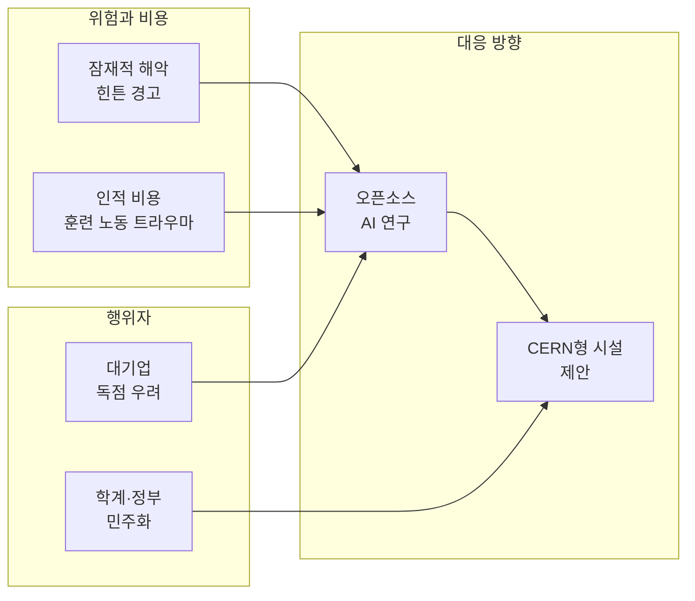

## 이 글에서 다루는 내용

이 포스트는 **인공지능(AI)의 미래**를 다음 네 가지 축으로 정리합니다.

1. **AI의 위험성** — 제프리 힌튼의 경고, GPT 훈련 과정의 인적 비용(리처드 마테엔게 사례)
2. **오픈 소스 AI 연구의 필요성** — 기술 독립, 글로벌 혁신, 안전·보안 연구
3. **대기업의 역할과 한계** — Google, Microsoft, OpenAI 중심 구조와 투명성·공적 책임
4. **CERN형 오픈소스 슈퍼컴퓨팅 시설 제안** — 국제 공공 자금, 10만+ 가속기, 민주적 감독

**추천 대상**: AI 정책·윤리·산업 구조에 관심 있는 독자, 오픈소스 및 공공 연구 옹호자, 기술 독립과 거대 플랫폼 리스크를 고민하는 이들.

---

## 글의 구조

아래 다이어그램은 본문의 논리 흐름을 요약합니다.

---

인공지능(AI)은 현대 기술의 초석이 되어 의료, 금융, 교육, 엔터테인먼트에 이르기까지 수많은 분야에 영향을 미치고 있습니다. 혁신과 효율성의 기회를 제공하면서도, 그 잠재력만큼 **신중한 관리가 필요한 위험과 과제**가 따릅니다.

이 글에서는 AI의 **잠재적 이점과 우려**를 균형 있게 다루고, **오픈소스 AI 연구**와 **CERN에 버금가는 국제 공공 슈퍼컴퓨팅 시설** 제안까지 연결해 설명합니다.

---

## 인공지능의 위험성

AI는 유망한 기술이지만 위험이 없지는 않습니다. 위험은 윤리적·기술적·심리적 차원에 걸쳐 있으며, AI가 진화하고 일상에 스며들수록 더 뚜렷해지고 있습니다.

### 제프리 힌튼의 경고

딥러닝 분야의 선구자인 **제프리 힌튼(Geoffrey Hinton)** 은 AI의 잠재적 해악에 대한 우려를 이유로 Google AI 연구원직에서 물러났습니다. [MIT Technology Review](https://www.technologyreview.com/2023/05/03/1072589/video-geoffrey-hinton-google-ai-risk-ethics/)와의 대담에서 그는 **"인류가 지능의 진화 과정에서 지나가는 단계에 불과할 수 있다"**는 견해를 밝혔습니다. 그의 메시지는 명확합니다. AI 기술의 개발과 배포에는 **신중한 고려와 규제**가 필요하다는 것입니다.

### AI 개발의 인적 비용: 리처드 마테엔게 사례

AI의 위험은 이론이나 먼 미래의 이야기만이 아닙니다. **케냐 나이로비의 리처드 마테엔게(Richard Mathenge)** 와 그의 팀은 OpenAI의 GPT 모델 훈련을 위한 콘텐츠 라벨링 작업을 수행했습니다 ([Big Technology](https://www.bigtechnology.com/p/he-helped-train-chatgpt-it-traumatized)).

- **조건**: 주 5일, 하루 9시간, 노골적·불온한 콘텐츠에 반복 노출
- **내용**: 아동 학대·성폭력 등 극심한 트라우마를 유발할 수 있는 묘사
- **결과**: 불면증, 불안, 우울증, 인간관계 붕괴 등 심리적 피해

이 사례는 **AI 모델 학습에 동원되는 사람들의 인적 비용**을 보여줍니다. 더 나은 지원, 보호, 그리고 개발·배포 단계의 **윤리적 절차**가 필요하다는 점을 시사합니다.

---

## 오픈 소스 AI 연구의 필요성

AI의 힘과 영향력이 커질수록, **민주화된 AI 연구**에 대한 요구도 커집니다. 최근에는 오픈소스 대규모 AI 연구를 위한 **국제 공공 슈퍼컴퓨팅 시설** 설립을 촉구하는 청원이 제기되었습니다 ([openPetition](https://www.openpetition.eu/petition/online/securing-our-digital-future-a-cern-for-open-source-large-scale-ai-research-and-its-safety)).

### 기대 효과

| 영역 | 내용 |
|------|------|
| **기술 독립** | 소수의 대기업에 대한 의존 감소, 교육·정부·국가 차원의 자율성 확보 |
| **글로벌 혁신** | 전 세계 연구자·기관이 고급 모델에 접근해 사회 문제에 활용 |
| **안전·보안 연구** | 잠재적 위험을 빠르고 투명하게 식별·대응할 수 있는 환경 조성 |

AI 연구와 접근이 민주화되지 않으면, 전문 지식과 자원이 대기업에 집중되고 **투명성 저하, 혁신 억제, 오용 가능성**이 커질 수 있습니다. 따라서 **AI 연구를 민주화하고 혜택과 접근을 넓히는 정책**이 필요합니다.

---

## AI 개발에서 대기업의 역할

현재 Google, Microsoft, OpenAI 등 **소수 대기업**이 데이터, 연산 자원, 인력 측면에서 압도적 우위를 갖고 있습니다.

### 우려되는 점

- **투명성 부족**: 내부 운영·의사결정이 블랙박스화되어, 데이터 사용·알고리즘 공정성·편향에 대한 검증이 어렵다.
- **공적 책임의 한계**: 주주 이익이 우선될 수 있어, 윤리·사회적 영향보다 단기 이익이 우선되는 결정이 나올 수 있다.

이런 구조 속에서 **중소기업, 학계, 국가**가 AI 개발에서 자율성을 갖는 것이 중요합니다. 다양한 주체가 참여할수록 **다양하고 균형 잡힌 AI 생태계**가 만들어지고, 윤리적 관행과 혜택의 공정한 분배를 논의하기 쉬워집니다. 대기업의 역할은 인정하되, **이 분야를 소수가 독점하지 않도록** 하는 것이 핵심입니다.

---

## AI 연구를 위한 CERN형 시설 제안

**국제적·공공 자금 지원 오픈소스 슈퍼컴퓨팅 연구 시설** 제안은 유럽입자물리연구소(CERN)에서 영감을 받은 대규모 이니셔티브입니다.

### 시설 구상

- **규모**: 최소 **10만 대 이상**의 GPU 또는 ASIC 등 고성능 가속기
- **운영**: 머신러닝·슈퍼컴퓨팅 전문가가 운영, **민주적으로 선출된 참여국 기관**이 감독
- **목표**: 오픈소스 기반 대규모 모델 훈련, 전 세계 연구자·기관의 접근 보장

### 기대되는 이점

1. **학술·투명성·데이터 보안**: 오픈소스 모델과 멀티모달 데이터(오디오, 비디오, 텍스트, 코드)를 활용한 연구 확대.
2. **안전·보안 연구 촉진**: 위험을 신속·투명하게 식별·해결하는 체계 강화.
3. **경제적 효과**: 중소기업이 대규모 기초 모델에 접근해 가중치·데이터 통제를 유지한 채 미세 조정할 수 있고, 정부도 운영·투명성 측면에서 수요를 갖을 수 있음.

결론적으로, 이런 **국제 공공 오픈소스 슈퍼컴퓨팅 시설**은 보다 **공정하고 포용적인 AI 환경**을 만드는 중요한 한 걸음이 될 수 있습니다.

---

## 요약 및 제안

이 글에서는 다음을 정리했습니다.

- **AI의 잠재적 위험**: 힌튼의 경고, 훈련 노동의 인적 비용(마테엔게 사례).
- **오픈소스 AI 연구의 필요성**: 기술 독립, 혁신, 안전·보안.
- **대기업 중심 구조의 한계**: 투명성·공적 책임 부족과 민주화 필요성.
- **CERN형 국제 공공 슈퍼컴퓨팅 시설 제안**: 민주적 감독, 오픈소스, 글로벌 접근.

AI의 미래는 아직 정해진 것이 아닙니다. **투명성, 책임성, 포용성**에 기반한 개발이 이뤄질수록, 잠재력을 모두를 위한 방향으로 활용하기 쉬워집니다. 관심 있는 독자는 오픈소스 AI 연구 시설을 요구하는 [청원](https://www.openpetition.eu/petition/online/securing-our-digital-future-a-cern-for-open-source-large-scale-ai-research-and-its-safety) 검토 및 지지를 고려해 볼 수 있습니다.

---

## 참고 문헌

1. **MIT Technology Review** — *Video: Geoffrey Hinton talks about the "existential threat" of AI*  
   [https://www.technologyreview.com/2023/05/03/1072589/video-geoffrey-hinton-google-ai-risk-ethics/](https://www.technologyreview.com/2023/05/03/1072589/video-geoffrey-hinton-google-ai-risk-ethics/)

2. **Big Technology** — *He Helped Train ChatGPT. It Traumatized Him.* (Alex Kantrowitz, 2023)  
   [https://www.bigtechnology.com/p/he-helped-train-chatgpt-it-traumatized](https://www.bigtechnology.com/p/he-helped-train-chatgpt-it-traumatized)

3. **openPetition** — *Securing Our Digital Future: A CERN for Open Source large-scale AI Research and its Safety*  
   [https://www.openpetition.eu/petition/online/securing-our-digital-future-a-cern-for-open-source-large-scale-ai-research-and-its-safety](https://www.openpetition.eu/petition/online/securing-our-digital-future-a-cern-for-open-source-large-scale-ai-research-and-its-safety)

4. **Hacker News** — *Ask HN: Is it just me or GPT-4's quality has significantly deteriorated lately?* (2023)  
   [https://news.ycombinator.com/item?id=36134249](https://news.ycombinator.com/item?id=36134249)
