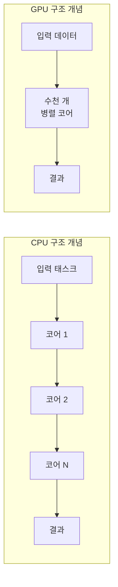

컴퓨팅 시스템의 두 핵심 부품인 **중앙 처리 장치(CPU)** 와 **그래픽 처리 장치(GPU)** 는 설계 목적과 동작 방식이 다르다. CPU는 범용 직렬 처리와 낮은 지연 시간에, GPU는 대량의 병렬 연산과 높은 처리량에 최적화되어 있다. 이 글에서는 두 프로세서의 구조, 기능, 비교 분석, 실제 사용 사례, 머신러닝 활용, 자주 묻는 질문까지 한 번에 정리한다.

## 목차

1. [CPU란 무엇인가](#cpu란-무엇인가요)
2. [GPU란 무엇인가](#gpu란-무엇인가요)
3. [CPU와 GPU: 아키텍처·역할 비교](#cpu와-gpu-아키텍처역할-비교)
4. [비교 요약표와 구조 도식](#비교-요약표와-구조-도식)
5. [실제 사용 사례](#cpu와-gpu의-차이점을-설명하는-실제-예시)
6. [머신러닝에서의 CPU vs GPU](#머신-러닝의-cpu와-gpu-비교)
7. [자주 묻는 질문](#자주-묻는-질문)
8. [결론](#결론)
9. [참고 문헌](#references)

---

## CPU란 무엇인가요?

**중앙 처리 장치(CPU)** 는 컴퓨터의 '두뇌'라고 불리며, 시스템 내 대부분의 연산과 제어를 담당하는 범용 프로세서다.

### 역할과 동작 방식

- **Fetch–Decode–Execute–Writeback**: 메모리에서 명령을 가져오고, 해석한 뒤 실행하고, 결과를 다시 저장하는 사이클을 반복한다.
- **클럭 속도(GHz)**: 초당 처리할 수 있는 명령 수에 영향을 주며, 단일 스레드 성능의 지표로 쓰인다.
- **코어·캐시**: 코어 수는 동시에 처리할 작업 수에, 캐시 크기는 자주 쓰는 데이터에 대한 빠른 접근에 영향을 준다.

### 대표 제품과 적용 범위

- **인텔 코어 시리즈**, **AMD 라이젠 시리즈** 등이 대표적이다.
- 데스크톱·노트북·서버·스마트폰·태블릿까지 다양한 기기에서 OS 실행, 애플리케이션 로직, I/O 제어를 담당한다.

CPU는 **적은 수의 스레드를 저지연으로** 처리하는 데 최적화되어 있어, 복잡한 분기·순차 로직에 강하다.

---

## GPU란 무엇인가요?

**그래픽 처리 장치(GPU)** 는 그래픽 카드·비디오 카드라고도 하며, 이미지·비디오 렌더링과 **대량의 병렬 연산**을 위한 전용 프로세서다.

### 역할과 동작 방식

- **수천 개의 코어**: CPU는 소수의 강력한 코어, GPU는 수백~수천 개의 상대적으로 단순한 코어로 동시에 많은 연산을 수행한다.
- **처리량(Throughput) 중심**: 단일 작업의 지연 시간보다, 단위 시간당 처리할 수 있는 작업량을 극대화하는 설계다.
- **고대역폭 메모리(VRAM)**: GDDR·HBM 등 고대역폭 메모리를 사용해 코어들에 데이터를 빠르게 공급한다.

### 통합 GPU vs 전용 GPU

| 구분 | 통합 GPU(iGPU) | 전용 GPU(dGPU) |
|------|----------------|----------------|
| 위치 | CPU와 같은 칩 | 별도 보드·슬롯 |
| 용도 | 웹·동영상·가벼운 작업 | 게임·3D·ML·고성능 연산 |
| 메모리 | 시스템 RAM 공유 | 전용 VRAM |

**NVIDIA 지포스**, **AMD 라데온** 시리즈가 전용 GPU의 대표 주자다. GPU는 게임·3D 렌더링·과학 시뮬레이션·**딥러닝 학습·추론** 등 병렬화 가능한 워크로드에 필수적이다.

---

## CPU와 GPU: 아키텍처·역할 비교

두 프로세서는 설계 목적이 다르므로, 다음 항목에서 명확히 구분된다.

**컴퓨팅 목적**

- **CPU**: 범용 컴퓨팅. 복잡한 순차 명령 실행에 강함.
- **GPU**: 그래픽·병렬 수치 연산. 같은 연산을 많은 데이터에 동시 적용하는 데 특화.

**운영 초점**

- **CPU**: 적은 스레드, **저지연(Low Latency)**.
- **GPU**: 많은 스레드, **높은 처리량(High Throughput)**.

**코어 구성**

- **CPU**: 코어 수는 적지만 각 코어가 복잡한 제어·캐시·분기 예측을 갖춤.
- **GPU**: 코어 수가 많고 단순하며, 단순 연산을 대량으로 병렬 처리.

**직렬 vs 병렬**

- **CPU**: 직렬 처리에 뛰어남. 한 번에 하나의 흐름을 빠르게 처리.
- **GPU**: 병렬 처리에 뛰어남. 수많은 연산을 동시에 수행.

**캐싱·메모리**

- **CPU**: 다단계 캐시(L1/L2/L3)로 메모리 지연을 줄임.
- **GPU**: 상대적으로 단순한 캐시, 높은 메모리 대역폭으로 많은 코어에 데이터 공급.

**API·호환성**

- **CPU**: 다양한 범용 API·언어 지원.
- **GPU**: CUDA, OpenCL, DirectX, Vulkan 등 그래픽·병렬 연산용 API가 주를 이룸.

이 차이를 이해하면 **게임, 영상 편집, 머신러닝, HPC** 등 워크로드에 맞는 프로세서를 선택하는 데 도움이 된다.

---

## 비교 요약표와 구조 도식

### 요약 표

| 항목 | CPU | GPU |
|------|-----|-----|
| 목적 | 범용 컴퓨팅 | 그래픽·병렬 연산 |
| 코어 | 소수(예: 4~24) | 수백~수천 개 |
| 처리 방식 | 직렬·저지연 | 병렬·고처리량 |
| 캐시 | 다단계·복잡 | 단순·고대역폭 메모리 |
| 메모리 | DDR4/DDR5 등 | GDDR6, HBM 등 VRAM |
| 적합 워크로드 | OS·앱 로직·I/O·DB | 렌더링·AI·과학 연산 |

### CPU vs GPU 구조 개념도

아래 Mermaid 다이어그램은 CPU와 GPU의 **처리 흐름** 개념을 단순화한 것이다. CPU는 소수 코어로 순차 처리하고, GPU는 많은 코어로 병렬 처리하는 특성을 나타낸다.

- **CPU**: 소수의 강력한 코어가 순차적으로 작업을 처리(직렬·저지연).
- **GPU**: 동일한 연산을 많은 코어가 동시에 수행(병렬·고처리량).

---

## CPU와 GPU의 차이점을 설명하는 실제 예시

### 예시 1: 게임

- **CPU**: 게임 로직, AI 판단, 물리 연산, 유닛 이동·리소스 관리(전략 게임), 입력 처리.
- **GPU**: 3D 모델·텍스처를 픽셀로 변환해 화면에 렌더링. 해상도·품질이 올라갈수록 GPU 부하가 커진다.

고사양 게임에서는 CPU와 GPU 균형이 중요하다. GPU만 강하고 CPU가 느리면 낮은 해상도에서 CPU 병목이 발생할 수 있다.

### 예시 2: 비디오 편집

- **CPU**: 클립 자르기·결합, 색 보정, 전환 효과, 인코딩 등 대부분의 연산.
- **GPU**: 특정 코덱 인코딩·효과 렌더링을 가속하는 데 활용. 지원 시 편집 반응성과 내보내기 속도가 좋아진다.

### 예시 3: 머신러닝

- **CPU**: 데이터 전처리, 특징 추출, 소규모 모델 학습·추론, 지연 시간이 중요한 추론.
- **GPU**: 대규모 딥러닝 모델 학습·대용량 배치 추론. 행렬 연산이 병렬화되므로 GPU가 훨씬 유리하다.

작업 특성에 따라 CPU만 쓸지, GPU를 함께 쓸지 결정하면 된다.

---

## 머신 러닝의 CPU와 GPU 비교

인공지능·머신러닝에서는 CPU와 GPU가 **역할을 나눠** 사용된다.

### 역할 정리

- **CPU**: 데이터 전처리, 특징 추출, 소규모 모델 학습, 레이턴시 민감한 추론.
- **GPU**: 대규모 딥러닝 학습, 큰 배치 추론. 행렬 곱셈 등 병렬 연산이 많아 GPU가 효율적이다.

### GPU가 딥러닝에 유리한 이유

- 딥러닝은 **수백만·수십억 개의 행렬 연산**으로 이루어져 있고, 이 연산들은 서로 독립적이라 병렬화하기 좋다.
- GPU는 수천 개 코어로 이런 연산을 동시에 수행하도록 설계되어, 동일 비용·동일 전력 대비 CPU보다 학습·추론 속도에서 유리한 경우가 많다.

모델 크기, 데이터 양, 지연 시간 요구 사항에 따라 CPU만 쓸지, GPU를 쓸지, 둘 다 조합할지 결정하면 된다.

---

## 자주 묻는 질문

**1. 컴퓨터가 GPU 없이도 작동할 수 있나요?**

예. 많은 CPU에 통합 GPU가 있어 웹 브라우징·동영상 시청·간단한 앱 실행은 가능하다. 다만 게임·3D·고성능 연산에는 전용 GPU가 필요할 수 있다.

**2. GPU를 CPU처럼 범용으로 쓸 수 있나요?**

GPU는 병렬 연산에 특화되어 있고, OS·일반 앱 실행은 CPU가 담당한다. GPU는 CUDA·OpenCL 등으로 특정 연산만 가속하는 용도로 쓰인다.

**3. 머신러닝에는 왜 GPU가 유리한가요?**

딥러닝은 대량의 독립적인 행렬 연산으로 구성되어 병렬화하기 좋다. GPU는 이런 연산을 동시에 처리하도록 설계되어, 학습·추론 시간을 크게 줄일 수 있다.

**4. CPU·GPU를 업그레이드할 수 있나요?**

데스크톱은 마더보드·파워·호환 규격을 확인한 뒤 CPU·GPU를 교체할 수 있다. 노트북은 CPU·GPU가 붙어 있는 경우가 많아 업그레이드가 제한적이다. 제조사 사양을 확인하는 것이 좋다.

**5. 게임에서 CPU와 GPU 중 무엇이 더 중요하나요?**

둘 다 중요하다. GPU는 주로 해상도·프레임률에, CPU는 물리·AI·로직·저해상도 구간에서 영향이 크다. 한쪽만 과하게 약하면 병목이 생기므로 용도에 맞는 균형이 좋다.

---

## 결론

- **CPU**: 범용 프로세서. 적은 스레드를 저지연으로 처리하고, OS·앱·I/O·복잡한 로직에 필수다.
- **GPU**: 병렬 연산·그래픽에 특화. 수천 개 코어로 동시 연산을 수행해 게임·3D·머신러닝·과학 연산에 강점이 있다.

장비 구매·업그레이드·소프트웨어 최적화 시, 워크로드가 **직렬·저지연**인지 **병렬·고처리량**인지 구분하면 CPU와 GPU를 더 잘 활용할 수 있다. 최신 시스템에서는 CPU와 GPU를 함께 쓰는 **이기종 컴퓨팅(Heterogeneous Computing)** 이 일반적이다.

---

## References

본문에 반영된 참고 자료는 아래와 같다. 접근 가능한 출처만 포함했다.

1. **Analytics Vidhya.** "CPU vs. GPU: Which to Use and When?"  
   [https://www.analyticsvidhya.com/blog/2023/03/cpu-vs-gpu/](https://www.analyticsvidhya.com/blog/2023/03/cpu-vs-gpu/)

2. **Spiceworks.** "11 Differences Between CPU and GPU."  
   [https://www.spiceworks.com/tech/hardware/articles/cpu-vs-gpu/](https://www.spiceworks.com/tech/hardware/articles/cpu-vs-gpu/)

3. **GIGABYTE.** "CPU vs. GPU: Which Processor is Right for You?"  
   [https://www.gigabyte.com/Article/cpu-vs-gpu-which-processor-is-right-for-you](https://www.gigabyte.com/Article/cpu-vs-gpu-which-processor-is-right-for-you)

위 출처의 내용은 이 포스트의 목적에 맞게 요약·정리되었으며, 상세한 설명은 각 원문을 참고하면 된다.
