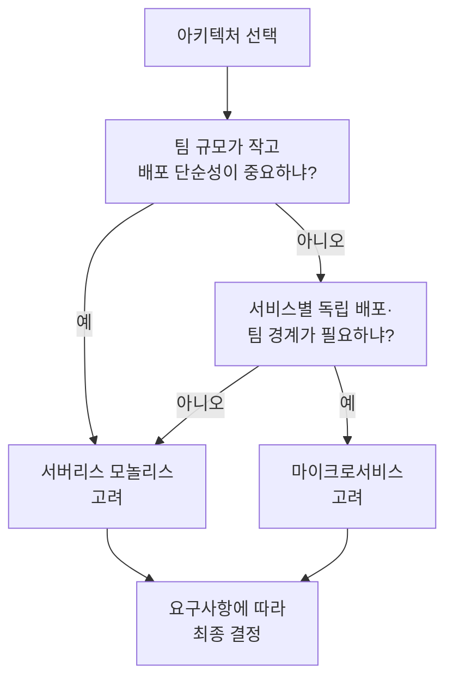

소프트웨어 아키텍처는 모놀리스에서 마이크로서비스로, 다시 **서버리스**로 이어지며 진화해 왔다. 클라우드 보급과 함께 서버를 관리하지 않고 코드만 배포하는 서버리스가 등장했고, 그 위에 **서버리스 모놀리스**라는 하이브리드가 자리 잡았다. 이 글에서는 서버리스 모놀리스가 무엇인지, 언제 선택하고 언제 피할지, 참고할 수 있는 자료까지 정리한다.

## 서버리스 모놀리스란 무엇인가

**서버리스 모놀리스(Serverless Monolith)**란, **여러 서버리스 기능(함수)으로 구성되지만 단일 배포 단위로 함께 배포·운영되는 아키텍처**를 말한다. 한 덩어리로 배포한다는 점에서는 전통 모놀리스와 비슷하고, 실행 환경이 서버리스(FaaS 등)라는 점에서 기존 모놀리스와 구분된다.

서버리스 모놀리스는 “큰 서버 하나에 모든 로직”이 아니라, **단일 배포 패키지 안에 여러 진입점(라우트·이벤트 핸들러)이 공존**하는 형태다. 마이크로서비스처럼 기능별로 나누어 생각할 수 있되, 배포·버전·인프라는 하나로 관리한다. 그래서 소규모 팀이나 초기 제품에서 운영 부담을 줄이면서도 서버리스의 자동 확장·종량제 이점을 누릴 수 있다.

아키텍처 진화를 한눈에 보면 아래와 같다.

## 등장 배경: 왜 서버리스 모놀리스인가

모놀리스는 개발·배포가 단순하지만 확장과 기술 교체가 어렵고, 마이크로서비스는 확장성과 팀 독립성 대신 운영·조율 비용이 크다. 서버리스는 인프라 관리를 줄여 주지만, 함수를 과도하게 잘게 쪼개면 배포·권한·디버깅 복잡도가 올라간다.

서버리스 모놀리스는 다음 요구가 맞을 때 자연스럽게 등장했다.

- **단일 배포 단위**로 버전·롤백을 단순하게 유지하고 싶을 때  
- **서버 관리 없이** 자동 확장·종량제를 쓰고 싶을 때  
- **소규모 팀**에서 서비스 경계·배포 파이프라인을 여러 개 유지하기 어려울 때  
- **리프트 앤 시프트**로 기존 모놀리식을 서버리스 플랫폼(Lambda 등)에 올리면서, 당분간 구조를 크게 갈라지 않고 가져가고 싶을 때  

즉, “모놀리스처럼 단순하게 배포하고, 서버리스처럼 돌리고 싶다”는 절충이 서버리스 모놀리스다.

## 모놀리스·마이크로서비스·서버리스 비교

서버리스 모놀리스를 제대로 쓰려면 세 가지 스타일을 구분할 수 있어야 한다.

**모놀리식 아키텍처**는 모든 기능이 **단일 코드베이스·단일 배포**에 들어 있다. 개발·배포·공유 메모리 활용이 쉽고, 반대로 확장은 보통 앱 전체를 키우는 방식이라 세밀한 스케일이 어렵고, 한 부분의 장애가 전체에 영향을 줄 수 있다.

**마이크로서비스 아키텍처**는 앱을 **기능별 독립 서비스**로 쪼갠다. 서비스별 확장·기술 스택·배포가 가능하지만, 서비스 간 통신·트랜잭션·데이터 일관성·운영·조율 복잡도가 커진다.

**서버리스 아키텍처**는 **서버를 직접 관리하지 않고**, FaaS·관리형 DB 등으로 실행·확장을 위임한다. 운영 부담이 줄고 종량제가 적용되지만, 콜드 스타트·벤더 종속·분산 디버깅 같은 새로운 과제가 생긴다.

아래 표는 세 가지와 **서버리스 모놀리스**를 요약한 것이다.

| 구분 | 모놀리스 | 마이크로서비스 | 서버리스(일반) | 서버리스 모놀리스 |
|------|----------|----------------|----------------|-------------------|
| 배포 단위 | 1개 | 다수 서비스 | 다수 함수/리소스 | 1개 패키지(다중 진입점) |
| 확장 | 앱 전체 | 서비스별 | 함수/리소스별 | 패키지 단위·플랫폼 자동 확장 |
| 운영 복잡도 | 낮음 | 높음 | 중간 | 상대적으로 낮음 |
| 인프라 관리 | 직접 | 직접/컨테이너 등 | 최소 | 최소 |
| 트랜잭션·일관성 | 쉬움 | 어려움(Saga 등) | 분산 고려 | 단일 패키지 내에서는 상대적으로 단순 |

서버리스 모놀리스는 “배포는 하나, 실행은 서버리스”라서 위 표의 중간 지대를 차지한다.

아키텍처 선택 시 팀 규모·트래픽 패턴을 고려하는 흐름은 아래와 같이 요약할 수 있다.

## 서버리스 모놀리스의 장점

- **배포·버전 관리 단순**: 한 단위로 배포·롤백하므로 파이프라인과 환경이 단순해진다.  
- **운영 부담 감소**: 서버 프로비저닝·패치를 플랫폼에 맡길 수 있다.  
- **자동 확장·종량제**: 트래픽에 따라 플랫폼이 확장하고, 사용한 만큼만 비용이 나간다.  
- **기능 간 통신 비용**: 같은 배포 단위 안에서는 네트워크 호출 없이 메모리/함수 호출로 처리할 수 있어, 순수 마이크로서비스보다 레이턴시·복잡도가 낮을 수 있다.  
- **소규모 팀에 적합**: 서비스 경계·팀 경계를 나누지 않고도 서버리스 이점을 얻을 수 있다.

## 서버리스 모놀리스의 한계와 트레이드오프

- **콜드 스타트**: 패키지가 크면 초기 실행 지연이 눈에 띌 수 있다.  
- **최소 권한 적용 어려움**: 한 배포 단위가 여러 역할을 하면, IAM 등 권한을 세밀하게 나누기 어렵다.  
- **장애 전파**: 한 진입점의 버그나 과부하가 같은 단위 전체에 영향을 줄 수 있다.  
- **벤더 종속**: 특정 FaaS·이벤트 소스에 묶이기 쉽다.

그래서 “항상 서버리스 모놀리스”가 아니라, **팀 규모·변경 빈도·규제·레거시**에 따라 선택**하는** 것이 중요하다.

## 적용 시기와 회피 시기

**적용을 고려할 때**

- 팀이 작고(예: 1~2개 팀) 서비스 단위로 나누어 배포·운영할 여유가 없을 때  
- 트래픽이 산발적이어서 종량제·자동 확장이 유리할 때  
- 기존 모놀리스를 서버리스로 옮기는 첫 단계로, 구조를 크게 갈라지 않고 검증하고 싶을 때  
- 배포·버전을 하나로 유지하는 것이 릴리스·롤백을 단순하게 만들 때  

**회피하거나 재검토할 때**

- 팀·도메인이 이미 나뉘어 있고 서비스 경계가 안정적일 때(마이크로서비스가 더 맞을 수 있음)  
- 지연 시간·콜드 스타트에 매우 민감한 워크로드일 때  
- 규제·보안상 기능별로 권한·배포를 철저히 분리해야 할 때  
- 단일 패키지가 비대해져 빌드·테스트·배포가 이미 무거울 때  

정리하면, **단순성·빠른 출시·소규모 팀**에 유리하고, **대규모·강한 격리·극한 레이턴시**가 필요하면 다른 형태(마이크로서비스·전통 서버 등)를 함께 검토하는 것이 좋다.

## 실전 예: 이커머스·CMS·소셜 앱

**이커머스**: 로그인·상품 목록·장바구니·주문 처리를 하나의 서버리스 앱(단일 배포) 안에 두고, 라우트/이벤트별로 핸들러만 나누어 둘 수 있다. 트래픽이 몰리는 구간만 플랫폼이 확장하고, 배포는 한 번에 한다.

**CMS**: 글 작성·수정·사용자 관리·분석을 같은 앱의 서로 다른 경로/함수로 구현한다. 기능은 논리적으로 나뉘되, 배포·인프라는 하나로 관리한다.

**소셜 앱**: 프로필·게시물·댓글·알림을 한 배포 단위에 두고, API Gateway 등으로 경로만 나누어 호출할 수 있다.

공통점은 **“한 번 배포, 여러 진입점”**이고, 서버리스 플랫폼이 스케일과 인프라를 담당한다는 것이다.

## 서버리스로 모놀리스 분해하기

서버리스 모놀리스로 시작했다가, 팀·트래픽·도메인이 커지면 **일부 기능을 독립 서버리스 서비스(또는 마이크로서비스)로 분리**하는 단계가 필요할 수 있다.

분해 시 참고할 점은 다음과 같다.

- **독립적으로 스케일·장애 격리가 필요한 경계**를 먼저 찾고, 그 단위로 함수/서비스를 나눈다.  
- **트랜잭션·데이터 일관성**이 필요한 구간은 Saga·이벤트 소싱 등 분산 패턴을 도입한다.  
- **공통 코드**는 라이브러리·레이어로 두고, 함수별 권한·타임아웃을 최소 권한에 맞게 조정한다.

AWS 문서에서는 “Lambda 모놀리스(Lambda Monolith)” 안티패턴을 경고하며, **한 함수가 모든 라우트를 처리하는 대신 라우트/기능별로 함수를 나누는 것**을 권장한다. 서버리스 모놀리스도 “단일 배포”를 유지할지, “기능별 배포”로 넘어갈지는 요구사항에 따라 결정하면 된다.

## 자주 묻는 질문(FAQ)

**Q. 서버리스 모놀리스와 기존 모놀리스의 차이는?**  
기존 모놀리스는 서버(VM·컨테이너)를 직접 관리하고, 스케일·패치를 직접 한다. 서버리스 모놀리스는 실행을 FaaS 등에 맡기므로 인프라 관리가 거의 없고, 확장·비용이 사용량 기준으로 동작한다.

**Q. 서버리스 모놀리스가 성능을 나쁘게 만들 수 있나?**  
패키지가 크면 콜드 스타트가 길어질 수 있다. 또한 한 단위에 모든 경로가 있으면, 한 경로의 과부하가 같은 단위 전체에 영향을 줄 수 있다. 필요한 구간만 분리해 나가는 것이 좋다.

**Q. 소규모 팀에서 왜 모놀리식 배포가 유리한가?**  
배포 파이프라인·환경·버전을 하나로 두면 조율 비용이 줄고, “전체를 한 번에 테스트·배포”가 가능하다. 서비스 경계를 정할 정보가 부족한 초기에는 단일 배포가 실용적이다.

## 결론 및 핵심 메시지

- **서버리스 모놀리스**는 단일 배포 단위와 서버리스 실행(자동 확장·종량제)을 결합한 아키텍처다.  
- 모놀리스의 단순함과 서버리스의 운영 감소·확장성을 동시에 노리며, **소규모 팀·초기 제품·리프트 앤 시프트**에 잘 맞는다.  
- 반대로 팀·도메인이 크고, 격리·레이턴시·권한 분리가 중요해지면 **기능별 서비스/함수로 점진적으로 분해**하는 것을 검토해야 한다.  
- “모놀리스 vs 마이크로서비스”처럼 **서버리스 모놀리스도 상황에 따른 선택**이며, 프로젝트 제약과 성장 단계에 맞게 조합하는 것이 중요하다.

## 참고 문헌

본문에서 참고한 자료 중 접근 가능한 것만 아래에 둔다.

1. Bottiau, D. (2023). *The Rise of the Serverless Monoliths*. Medium. [https://medium.com/@dbottiau/the-rise-of-the-serverless-monoliths-63d3d2d98164](https://medium.com/@dbottiau/the-rise-of-the-serverless-monoliths-63d3d2d98164)

2. ServerlessOps. *Hello Serverless: Serverless Monoliths*. ServerlessOps. [https://www.serverlessops.io/blog/hello-serverless-serverless-monoliths](https://www.serverlessops.io/blog/hello-serverless-serverless-monoliths)

3. AWS. *Creating event-driven architectures with Lambda* (Lambda 모놀리스 안티패턴 포함). AWS Lambda Operator Guide. [https://docs.aws.amazon.com/lambda/latest/operatorguide/monolith.html](https://docs.aws.amazon.com/lambda/latest/operatorguide/monolith.html)

4. ServerlessFirst. *Why monolithic deployments make sense for small serverless teams*. [https://serverlessfirst.com/emails/why-monolithic-deployments-make-sense-for-small-serverless-teams/](https://serverlessfirst.com/emails/why-monolithic-deployments-make-sense-for-small-serverless-teams/)

5. AWS Builders. *Monoliths vs Microservices vs Serverless*. Dev.to. [https://dev.to/aws-builders/monoliths-vs-microservices-vs-serverless-393m](https://dev.to/aws-builders/monoliths-vs-microservices-vs-serverless-393m)
