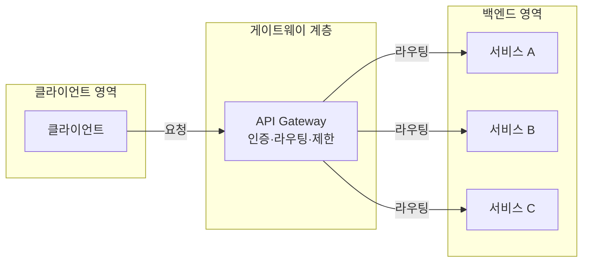
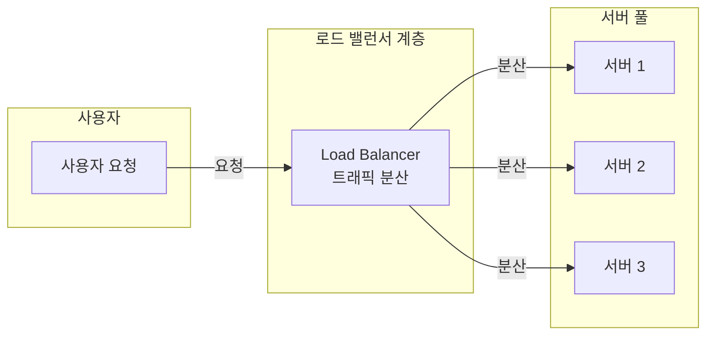
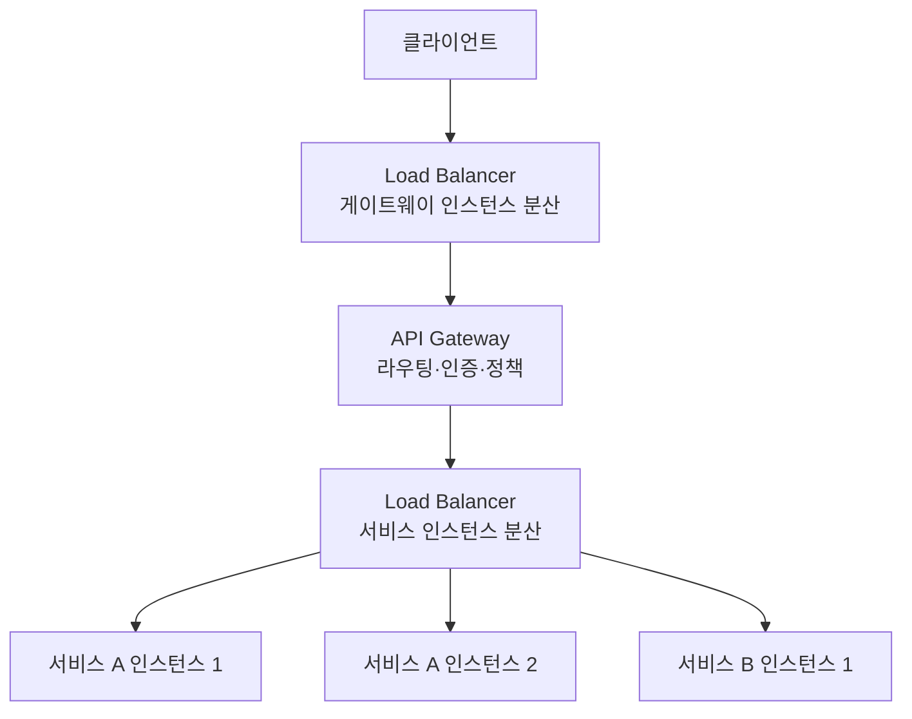

## 개요

**API Gateway**와 **Load Balancer**는 네트워크 트래픽을 다루는 구성 요소로 많이 언급되지만, 역할·적용 계층·처리 방식이 다릅니다. 둘 다 요청이 효율적으로 처리되도록 돕지만, **API Gateway**는 “어디로·어떤 규칙으로 보낼지”에, **Load Balancer**는 “여러 서버에 어떻게 나눌지”에 초점을 둡니다. 효과적인 시스템 설계를 위해 두 개념의 차이와 선택 기준을 정리했습니다.

**이 포스트에서 다루는 내용**

- API Gateway·Load Balancer의 정의와 동작 방식
- 요청 vs 트래픽 관리 관점의 차이
- 기능·사용 사례·실무 예시
- 함께 사용하는 패턴과 선택 가이드
- 진화 방향과 참고 문헌

대상 독자: 백엔드·인프라 엔지니어, 마이크로서비스 설계자, 기술 스택 선택을 고민하는 개발자·리더.

---

## API Gateway란 무엇인가?

### API와 Gateway의 관계

**API**(Application Programming Interface)는 서로 다른 소프트웨어가 통신하기 위한 규칙과 프로토콜입니다. 클라이언트는 “무엇을 요청할 수 있는지”만 알면 되고, 서버 내부 구현은 알 필요가 없습니다. 식당의 메뉴판처럼, 고객(클라이언트)은 주문 가능한 항목만 보고 주문(요청)을 넣으면, 주방(서버)이 그에 맞는 응답을 만듭니다.

**API Gateway**는 클라이언트와 백엔드(API·마이크로서비스) 사이의 **단일 진입점**이자 중개자입니다. 들어오는 API 호출을 받아 검증·라우팅·프로토콜 변환 등을 수행한 뒤, 적절한 서비스로 넘깁니다.

### 주요 역할

- **요청 라우팅**: URL·헤더·메서드 등에 따라 적절한 마이크로서비스로 전달
- **인증·인가**: 토큰 검증, 권한 확인으로 유효한 요청만 백엔드로 전달
- **프로토콜·형식 변환**: REST·GraphQL·gRPC 등 클라이언트와 백엔드 간 형식 통일
- **속도 제한·캐싱**: Rate limiting, 응답 캐싱으로 백엔드 부하·남용 완화
- **로깅·모니터링**: 요청/응답 로깅, 메트릭 수집으로 관찰성 확보

마이크로서비스 아키텍처에서는 서비스가 많아질수록 클라이언트가 직접 각 서비스 엔드포인트를 알 필요가 없어지고, 보안·정책을 한 곳에서 적용할 수 있어 API Gateway가 핵심 구성 요소로 자리 잡습니다.

### 실무 사례: Netflix

Netflix는 다양한 기기(TV, 스마트폰, 노트북 등)와 해상도·형식에 맞는 콘텐츠를 제공해야 합니다. 이를 위해 **Federated Gateway**를 사용합니다. 클라이언트 요청이 게이트웨이에 들어오면, **Movie Entity**(작품 정보), **Production Entity**(제작·스튜디오), **Talent Entity**(출연·제작진) 등 핵심 도메인 중 하나로 라우팅되고, 스키마 레지스트리를 기준으로 응답이 합쳐져 다시 클라이언트로 전달됩니다. 이렇게 게이트웨이가 “어디로 보낼지·어떤 규칙을 적용할지”를 담당합니다.

---

## Load Balancer는 무엇인가?

**Load Balancer**는 들어오는 트래픽을 **여러 서버(인스턴스)에 나누어** 한 서버에 부하가 몰리지 않도록 하는 구성 요소입니다. “어느 서비스로 보낼지”보다 “여유 있는·건강한 서버를 골라서” 요청을 분산하는 데 초점을 둡니다.

### 주요 역할

- **트래픽 분산**: Round-robin, Least connections, IP hash 등 알고리즘으로 요청을 서버에 분배
- **헬스 체크**: 서버 상태를 주기적으로 확인하고, 장애·과부하 인스턴스는 트래픽에서 제외
- **고가용성**: 한 서버가 다운되어도 나머지 서버로 트래픽을 돌려 서비스 중단을 줄임
- **수평 확장**: 트래픽 증가 시 더 큰 서버 한 대를 키우는 대신, 서버를 더 추가하고 LB가 분산하도록 함
- **SSL 오프로딩·세션 유지**: TLS 종료, 세션 고정(Sticky session) 등으로 백엔드 부하·일관성 관리

즉, Load Balancer는 “요청 내용·API 규칙”보다 “서버 부하·가용성”을 보고 **네트워크·서버 수준의 균형**을 맞춥니다.

### 실무 사례: Netflix Edge Load Balancing

Netflix는 엣지에서 들어오는 요청에 **Edge Load Balancing**을 적용합니다. “가장 짧은 대기열(Join-the-Shortest-Queue)”과 “서버가 보고한 사용률(Server-Reported Utilization)”을 조합한 알고리즘으로, 사용자에게 가까우면서 여유 있고 정상인 서버를 선택합니다. Choice-of-2 알고리즘, 필터링·프로베이션·서버 워밍업 등으로 부하를 세밀하게 조정해, 로드 타임·에러율·데이터 전송 속도를 개선했습니다.

---

## API Gateway vs Load Balancer: 비교

### 관점 차이

| 구분 | API Gateway | Load Balancer |
|------|-------------|----------------|
| **관심 대상** | 요청 자체(형식·대상 서비스·권한) | 네트워크 트래픽·서버 부하 |
| **주요 질문** | “어느 서비스로, 어떤 규칙으로?” | “어느 서버가 여유 있는가?” |
| **계층** | 애플리케이션·API 계층 (L7 중심) | 트랜스포트·네트워크 계층 (L4/L7) |
| **대상** | 마이크로서비스·API 엔드포인트 | 서버·인스턴스·노드 |

API Gateway는 **요청의 균형(라우팅·정책)**을, Load Balancer는 **서버·트래픽의 균형**을 담당한다고 보면 됩니다.

### 기능 비교

**API Gateway**

- 프로토콜·스펙 변환, 요청 라우팅, 인증·인가
- Rate limiting, 캐싱, API 버전·규칙 적용
- 로깅·모니터링·정책 집행

**Load Balancer**

- 여러 서버에 트래픽 분산, 헬스 체크
- SSL 오프로딩, 세션 지속성
- L4/L7 분산, 지역·가용 영역별 라우팅

### 아키텍처에서의 위치

실제로는 **둘을 함께** 쓰는 경우가 많습니다. 클라이언트 → (선택) Load Balancer → API Gateway → 마이크로서비스이고, 마이크로서비스 앞에 다시 Load Balancer를 두어 동일 서비스의 여러 인스턴스에 트래픽을 나누는 패턴이 일반적입니다.

---

## 사용 사례와 선택 가이드

### API Gateway가 적합한 경우

- 마이크로서비스·다중 API를 하나의 진입점으로 노출하고 싶을 때
- 인증·인가·Rate limiting·API 버전 등 정책을 중앙에서 적용하고 싶을 때
- 클라이언트와 백엔드 프로토콜·형식이 다를 때(번역·통합 계층이 필요할 때)
- 여러 서비스를 조합한 “복합 응답”이나 BFF(Backend for Frontend)가 필요할 때

### Load Balancer가 적합한 경우

- 동일 서비스의 여러 인스턴스에 트래픽을 나누어 고가용성·확장성을 확보하고 싶을 때
- 서버별 헬스 체크·장애 제거가 필요할 때
- SSL 종료·세션 유지 등 인프라 수준 부하 분산이 필요할 때

### 함께 사용하는 경우

- 트래픽이 많은 마이크로서비스 환경: API Gateway 앞단에 LB로 게이트웨이 인스턴스를 분산하고, 게이트웨이 뒤의 각 서비스 앞에도 LB를 두어 인스턴스 단위로 분산하는 구성이 일반적입니다.

---

## 실전 예시

### 이커머스: API Gateway

사용자 관리·상품 카탈로그·장바구니·결제가 각각 마이크로서비스로 나뉘어 있다면, API Gateway가 단일 진입점이 됩니다. 로그인 요청 → 사용자 서비스, 검색 → 카탈로그 서비스, 장바구니 추가 → 장바구니 서비스, 결제 → 결제 서비스로 라우팅하고, 인증·Rate limiting은 게이트웨이에서 일괄 적용할 수 있습니다.

### 뉴스 사이트: Load Balancer

대량의 동시 접속을 받는 뉴스 사이트는 동일 웹/API 서버를 여러 대 두고, Load Balancer가 요청을 그대로(또는 L7에서 경로별로) 여러 서버에 나눕니다. 서버 추가·제거만으로 수평 확장하고, 한 대가 죽어도 나머지로 트래픽이 돌아가도록 합니다.

---

## API Gateway와 Load Balancer의 진화·미래

- **API Gateway**: 서버리스·컨테이너·엣지 환경에 맞춰 배포 형태가 다양해지고, 서비스 메시·GraphQL·WebAssembly 등과 결합한 형태로 진화하고 있습니다. 인증·트래픽 제어·관찰성은 계속 핵심 기능으로 남습니다.
- **Load Balancer**: 하드웨어 장비에서 소프트웨어·클라우드 네이티브 LB로 전환되었고, L7 라우팅·앱 인지(요청 내용 기반 라우팅)·자동 스케일과 긴밀히 연동됩니다.

둘 다 “트래픽을 잘 나누고, 서비스를 안정적으로 만든다”는 목표는 같지만, Gateway는 **요청·API 수준**, LB는 **서버·인스턴스 수준**에서 그 목표를 달성합니다.

---

## 자주 묻는 질문

**1. API Gateway와 Load Balancer를 함께 사용할 수 있나요?**

네. API Gateway가 요청을 서비스별로 라우팅하고, 각 서비스의 여러 인스턴스 앞에 Load Balancer를 두어 트래픽을 분산하는 구성이 일반적입니다.

**2. 어떤 제품·서비스를 쓰나요?**

API Gateway: Amazon API Gateway, Kong, Apigee, AWS App Mesh 등. Load Balancer: AWS ELB, GCP Load Balancing, HAProxy, Nginx 등. 클라우드·온프레미스에 따라 선택하면 됩니다.

**3. 둘 중 무엇을 먼저 도입해야 하나요?**

마이크로서비스·다중 API를 하나의 진입점으로 묶고 정책을 적용하려면 API Gateway가 우선입니다. 단일 서비스의 인스턴스만 여러 대 두고 부하 분산이 목표라면 Load Balancer만으로도 충분할 수 있습니다. 대규모·마이크로서비스 환경에서는 둘 다 단계적으로 도입하는 경우가 많습니다.

**4. API Gateway의 보안 역할은?**

인증·인가, Rate limiting, API 키·토큰 검증, DDoS 완화 등으로 “유효하고 허용된 요청만” 백엔드로 넘기며, 내부 서비스를 직접 노출하지 않아 공격 면을 줄입니다.

**5. Load Balancer는 확장에 어떻게 도움이 되나요?**

서버를 추가하면 LB가 새 인스턴스로도 트래픽을 나누어 주므로, 한 대의 성능을 키우는 수직 확장 대신 수평 확장이 가능해지고, 비용·복원력 측면에서 유리해질 수 있습니다.

---

## 결론

- **API Gateway**: 클라이언트와 백엔드 사이의 **단일 진입점**으로, “어느 서비스로, 어떤 규칙으로” 요청을 보낼지 담당합니다. 라우팅·인증·정책·프로토콜 변환이 핵심입니다.
- **Load Balancer**: **여러 서버(인스턴스)**에 트래픽을 나누어 부하와 가용성을 관리합니다. “어느 서버가 여유 있는가”에 초점을 둡니다.

둘 다 트래픽·요청을 잘 나누고 안정적인 서비스를 만드는 데 쓰이지만, **요청·API 수준**은 Gateway, **서버·인스턴스 수준**은 Load Balancer가 담당한다고 구분하면, 아키텍처 설계와 도구 선택이 수월해집니다.

---

## 참고 문헌

- [API Gateway vs. Load Balancer: What's The Difference?](https://blog.hubspot.com/website/api-gateway-vs-load-balancer) — HubSpot
- [API gateway vs. load balancer](https://www.solo.io/topics/api-gateway/api-gateway-vs-load-balancer/) — Solo.io
- [What's the Difference Between an API Gateway and a Load Balancer?](https://nordicapis.com/whats-the-difference-between-an-api-gateway-and-a-load-balancer/) — Nordic APIs
