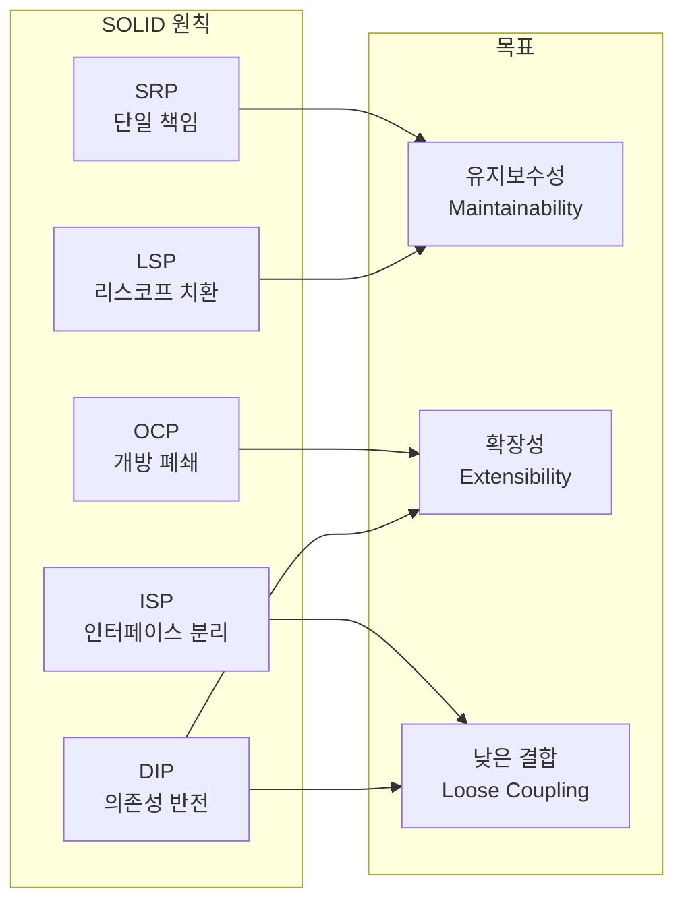

SOLID 원칙은 소프트웨어 커뮤니티에서 **밥 아저씨(Uncle Bob)**라는 애칭으로 잘 알려진 **Robert C. Martin**에 의해 정리·보급되었습니다. 그의 연구는 소프트웨어 업계에 큰 영향을 미쳤으며, 이 원칙들은 많은 개발자가 설계와 구현을 할 때 초석이 되어 왔습니다. SOLID는 단순한 이론이 아니라 실용적인 지침으로, 준수하면 더 견고하고 유연하며 이해하기 쉬운 코드를 만들 수 있습니다.

|  |
| :---: |
| SOLID 원칙 개요 |

## 소개

소프트웨어 개발에서는 더 효율적이고 유지 보수가 쉬우며 견고한 코드를 만들기 위해 여러 원칙을 따릅니다. 그중 **SOLID** 원칙이 특히 널리 쓰입니다. **SOLID**는 객체 지향 프로그래밍 및 설계의 다섯 가지 핵심 원칙을 요약한 약어입니다. 이 원칙들은 관리·이해·확장이 쉬운 소프트웨어를 만들기 위한 토대를 제공합니다.

아래에서는 각 원칙의 의미와 중요성, 실제 적용 사례를 자세히 다룹니다. 숙련된 개발자이든 초보자이든, 이 원칙을 이해하고 적용하면 코딩 기술과 제작하는 소프트웨어의 품질을 높일 수 있습니다.

## 탄생 배경과 역사

SOLID 원칙의 기반은 **Robert C. Martin**이 2000년 논문 《Design Principles and Design Patterns》에서 제시한 설계 원칙입니다. 당시 그는 **소프트웨어 부패(software rot)**를 막기 위한 원칙들을 정리했습니다. **SOLID**라는 약어 자체는 2004년경 **Michael Feathers**가 만들어 널리 퍼뜨렸습니다.

> "상위 레벨의 정책을 설계할 때는 하위 레벨의 세부 사항에 의존하지 말아야 한다." — Robert C. Martin, Design Principles and Design Patterns (2000)

이 원칙들은 **Agile Manifesto**와도 맞닿아 있으며, 클린 코드·클린 아키텍처·디자인 패턴과 함께 읽으면 설계 의도가 더 분명해집니다.

## SOLID 원칙 한눈에 보기

다음 다이어그램은 다섯 가지 원칙이 **유지보수성·확장성·결합 완화**라는 목표로 모인다는 점을 요약합니다.



| 원칙 | 약어 | 한 줄 요약 |
| --- | --- | --- |
| 단일 책임 원칙 | SRP | 클래스는 변경 이유가 하나만 있어야 한다. |
| 개방/폐쇄 원칙 | OCP | 확장에는 열려 있고, 수정에는 닫혀 있어야 한다. |
| 리스코프 치환 원칙 | LSP | 자식 클래스는 부모 클래스로 대체 가능해야 한다. |
| 인터페이스 분리 원칙 | ISP | 클라이언트는 쓰지 않는 인터페이스에 의존하지 않는다. |
| 의존성 반전 원칙 | DIP | 상위 모듈은 하위 모듈이 아니라 추상화에 의존한다. |

## 단일 책임 원칙(SRP)

SOLID의 첫 글자 **S**는 **단일 책임 원칙(Single Responsibility Principle, SRP)**을 가리킵니다. "클래스는 **변경할 이유가 하나만** 있어야 한다"는 뜻입니다. 즉, 한 클래스는 하나의 역할·책임만 가지는 것이 좋습니다. 이 원칙은 프로그램을 각각 특정 기능을 담당하는 부분으로 나누도록 권장합니다.

실제 레스토랑을 떠올리면 됩니다. 요리사, 웨이터, 계산원이 각자 역할을 나눕니다. 요리사가 서빙과 결제까지 맡으면 비효율적이고 오류도 잦아집니다. 소프트웨어에서도 각 클래스가 단일 책임을 가지면 시스템이 더 체계적이고 관리하기 쉬워집니다.

SRP를 지키면 (1) **유지 보수가 쉬워집니다.** 어떤 기능을 바꿀 때 수정할 클래스를 명확히 알 수 있어, 다른 부분에 버그가 퍼질 위험이 줄어듭니다. (2) **가독성이 좋아집니다.** 한 클래스가 한 가지 일에만 집중하면 코드가 단순해져 팀 협업에 유리합니다. (3) **유연성과 적응력이 높아집니다.** 기능이 클래스별로 분리되어 있으면 다른 부분에 영향을 주지 않고 기능을 추가·제거·수정하기 쉽습니다.

급여 시스템에서 **직원**을 나타내는 클래스를 생각해 봅시다. 이 클래스는 이름, 아이디, 급여 같은 **직원 데이터**만 책임져야 합니다. 직원 데이터를 DB에 저장하거나 보고서를 인쇄하는 메서드를 같은 클래스에 넣으면 SRP를 위반합니다. 그런 책임은 `EmployeeDB`, `EmployeeReport`처럼 별도 클래스로 분리하는 것이 맞습니다.

```python
class Employee:
    def __init__(self, id, name, salary):
        self.id = id
        self.name = name
        self.salary = salary

class EmployeeDB:
    def save_employee(self, employee):
        # code to save employee to database
        pass

class EmployeeReport:
    def generate_report(self, employee):
        # code to generate report
        pass
```

## 개방/폐쇄 원칙(OCP)

두 번째 원칙은 **개방/폐쇄 원칙(Open-Closed Principle, OCP)**입니다. "소프트웨어 엔티티(클래스, 모듈, 함수 등)는 **확장에는 열려 있고, 수정에는 닫혀 있어야** 한다"는 뜻입니다. 기존 코드를 고치지 않고도 새로운 기능이나 동작을 추가할 수 있어야 합니다.

스마트폰을 예로 들 수 있습니다. OS나 하드웨어를 바꾸지 않고도 앱 스토어에서 앱을 설치해 기능을 늘립니다. 이처럼 기존 코드를 수정하지 않고 기능을 확장하는 것이 OCP의 핵심입니다.

OCP를 지키면 (1) **안정성이 올라갑니다.** 기존 클래스를 수정하지 않고 확장만 하면 기존 동작에 버그가 생길 위험이 줄어듭니다. (2) **변경 범위가 줄어듭니다.** 새 기능은 새 클래스로 추가하고, 기존 클래스는 건드리지 않아 복잡도가 낮아집니다. (3) **재사용이 쉬워집니다.** 확장 가능하게 설계하면 기존 코드를 그대로 활용할 수 있어 코드량과 중복이 줄어듭니다.

`Shape`와 `AreaCalculator`를 생각해 봅시다. 도형 종류가 늘어나도 **새 도형 클래스만 추가**하고, `AreaCalculator`는 **수정하지 않도록** 설계할 수 있습니다.

```python
class Shape:
    def area(self):
        pass

class Rectangle(Shape):
    def __init__(self, width, height):
        self.width = width
        self.height = height

    def area(self):
        return self.width * self.height

class Circle(Shape):
    def __init__(self, radius):
        self.radius = radius

    def area(self):
        return 3.14 * (self.radius ** 2)

class AreaCalculator:
    def total_area(self, shapes):
        total = 0
        for shape in shapes:
            total += shape.area()
        return total
```

## 리스코프 치환 원칙(LSP)

세 번째 원칙은 **리스코프 치환 원칙(Liskov Substitution Principle, LSP)**입니다. "파생(자식) 클래스는 기반(부모) 클래스로 **대체 가능**해야 한다"는 뜻입니다. 부모 타입이 쓰이는 자리에 자식 타입을 넣어도 프로그램의 올바름이 깨지면 안 됩니다.

새를 예로 들면, `Bird`에 `eat()`, `fly()`가 있다고 하겠습니다. `Pigeon`은 먹고 날 수 있으므로 `Bird`로 대체해도 문제가 없습니다. 반면 `Penguin`은 날 수 없는데 `Bird`로 쓰이면 `fly()` 호출 시 예상과 다른 동작이 됩니다. 이는 LSP 위반입니다.

LSP를 지키면 **상속을 쓸 때 시스템의 일관성**을 유지할 수 있습니다. 자식 클래스가 부모를 대체해도 예상치 못한 동작이 없어야 하므로, 부모가 쓰이는 모든 곳에서 새 자식 클래스를 안심하고 도입할 수 있습니다. 또한 타입을 일일이 검사하지 않아도 되어 코드가 단순해지고 유지 보수가 쉬워집니다.

`Bird`에 `fly()`가 있다면, 날 수 없는 `Penguin`을 `Bird`의 자식으로 두고 `fly()`를 빈 구현이나 예외로 처리하는 것은 LSP 위반입니다. `Bird`가 기대되는 모든 곳에서 `Penguin`을 넣으면 동작이 깨질 수 있기 때문입니다.

```python
class Bird:
    def fly(self):
        pass

class Penguin(Bird):
    pass

penguin = Penguin()
penguin.fly()  # 펭귄은 날 수 없음 — LSP 위반 가능
```

해결 방향은 (1) `Penguin`을 `Bird` 상속에서 빼고 별도 타입으로 두거나, (2) `FlyingBird` / `NonFlyingBird`처럼 계층을 나누어 "날 수 있는 새"만 `fly()`를 갖도록 하는 것입니다.

## 인터페이스 분리 원칙(ISP)

네 번째 원칙은 **인터페이스 분리 원칙(Interface Segregation Principle, ISP)**입니다. "클라이언트가 **사용하지 않는 인터페이스를 구현하도록 강요받지 않아야** 한다"는 뜻입니다. 하나의 거대한 인터페이스보다, 여러 개의 작고 구체적인 인터페이스를 쓰는 편이 낫습니다.

레스토랑 메뉴로 비유하면, 채식주의자에게 채식·비채식이 섞인 메뉴만 주기보다는 채식 메뉴만 주는 것이 맞습니다. 소프트웨어에서도 클라이언트는 자신이 쓰는 기능에 해당하는 인터페이스만 의존해야 합니다.

ISP를 지키면 (1) **변경의 부작용이 줄어듭니다.** 인터페이스가 작고 구체적이면, 변경 시 영향을 받는 클라이언트 수가 적어집니다. (2) **가독성과 유지 보수성이 좋아집니다.** 각 인터페이스가 무엇을 하는지 명확해집니다. (3) **유연하고 적응력 있는 설계**가 됩니다. 기능별로 인터페이스를 나누면 필요한 것만 조합해 쓰기 쉽습니다.

`print`, `fax`, `scan`을 모두 요구하는 `Printer` 인터페이스가 있다면, 인쇄만 하는 `SimplePrinter`는 `fax`·`scan`을 강제로 구현하게 되어 ISP를 위반합니다. 대신 기능별로 인터페이스를 나누는 것이 좋습니다.

```python
class Printer:
    def print_doc(self):
        pass

class Fax:
    def fax(self):
        pass

class Scanner:
    def scan(self):
        pass

class SimplePrinter(Printer):
    def print_doc(self):
        # code to print
        pass

class MultiFunctionPrinter(Printer, Fax, Scanner):
    def print_doc(self):
        pass

    def fax(self):
        pass

    def scan(self):
        pass
```

## 의존성 반전 원칙(DIP)

마지막 원칙은 **의존성 반전 원칙(Dependency Inversion Principle, DIP)**입니다. "상위 레벨 모듈/클래스는 하위 레벨 모듈/클래스에 **직접 의존하면 안 되며**, 둘 다 **추상화에 의존**해야 한다"는 뜻입니다. 결국 모듈 간 의존성을 줄이고 추상화를 통해 연결하는 것이 목표입니다.

**의존성 반전**과 **의존성 주입**은 다릅니다. 의존성 주입은 "객체가 의존성을 어떻게 받을지(외부에서 넣어 주기)"에 관한 기법이고, 의존성 반전은 "어떤 수준의 모듈이 어떤 것에 의존할지(추상화에 의존)"에 관한 원칙입니다. 의존성 주입은 DIP를 실현하는 한 방법입니다.

TV 리모컨과 배터리를 생각해 보세요. 리모컨은 특정 배터리 브랜드에 묶이지 않고, "필요한 전압을 주는 전원"이라는 추상화에만 의존합니다. 리모컨(상위)과 배터리(하위)가 둘 다 그 추상화에 의존하는 구조가 DIP에 부합합니다.

DIP를 지키면 (1) **재사용성이 좋아집니다.** 상위 모듈이 구체 구현이 아니라 추상화에 의존하면, 같은 추상화를 따르는 다른 구현으로 쉽게 바꿀 수 있습니다. (2) **결합도가 낮아집니다.** 한 모듈의 변경이 다른 모듈로 퍼질 가능성이 줄어듭니다. (3) **확장과 수정이 쉬워집니다.** 새 구현을 추가할 때 기존 상위 모듈을 고치지 않아도 됩니다.

`Switch`가 `LightBulb`에 직접 의존하면 다른 종류의 전구나 장치로 바꾸기 어렵습니다. `SwitchableDevice` 같은 추상화에 의존하면, 켜고 끄는 동작만 보장하는 어떤 장치든 연결할 수 있습니다.

```python
class SwitchableDevice:
    def turn_on(self):
        pass

    def turn_off(self):
        pass

class LightBulb(SwitchableDevice):
    def turn_on(self):
        print("LightBulb: Bulb turned on...")

    def turn_off(self):
        print("LightBulb: Bulb turned off...")

class Fan(SwitchableDevice):
    def turn_on(self):
        print("Fan: Fan turned on...")

    def turn_off(self):
        print("Fan: Fan turned off...")

class ElectricSwitch:
    def __init__(self, device):
        self.device = device
        self.on = False

    def press(self):
        if self.on:
            self.device.turn_off()
            self.on = False
        else:
            self.device.turn_on()
            self.on = True

lightbulb = LightBulb()
switch = ElectricSwitch(lightbulb)
switch.press()  # "LightBulb: Bulb turned on..."
switch.press()  # "LightBulb: Bulb turned off..."

fan = Fan()
switch = ElectricSwitch(fan)
switch.press()  # "Fan: Fan turned on..."
switch.press()  # "Fan: Fan turned off..."
```

`ElectricSwitch`는 `LightBulb`나 `Fan`에 직접 의존하지 않고 `SwitchableDevice` 추상화에만 의존하므로, DIP를 만족하며 장치를 바꿀 때 스위치 클래스를 수정할 필요가 없습니다.

## 적용·회피 판단 기준

SOLID는 **모든 상황에 무조건 적용하는 규칙**이라기보다, **설계 결정을 할 때 참고하는 기준**에 가깝습니다. 아래는 언제 적용을 고려하고, 언제 과도한 적용을 피할지 정리한 것입니다.

| 상황 | 권장 | 비고 |
| --- | --- | --- |
| 팀 단위·중장기 유지보수 프로젝트 | SOLID 적극 적용 | 변경·확장이 잦을수록 이득이 큼 |
| 프로토타입·단기 실험 | 최소한만 적용 | 과도한 추상화는 불필요한 복잡도 유발 |
| 레거시 점진적 개선 | SRP·DIP부터 단계적 적용 | 한 번에 전부 바꾸기보다 터치하는 부분부터 |
| 성능이 극도로 중요한 핫 경로 | 추상화 수준 재검토 | 간접 호출·추가 레이어가 병목이 될 수 있음 |
| 도메인이 단순하고 변경이 거의 없음 | 단순한 구조 유지 | YAGNI 관점에서 과설계 방지 |

**적용 체크리스트** (리팩토링 시 참고):

- [ ] 한 클래스에 "변경 이유"가 두 가지 이상인가? → SRP 위반 의심.
- [ ] 새 기능을 넣기 위해 기존 클래스 코드를 계속 수정하는가? → OCP 위반 의심.
- [ ] 부모 타입 자리에 자식을 넣었을 때 예상과 다르게 동작하는가? → LSP 위반 의심.
- [ ] 클라이언트가 쓰지 않는 메서드까지 인터페이스로 강제되는가? → ISP 위반 의심.
- [ ] 상위 모듈이 하위 모듈의 구체 타입에 직접 의존하는가? → DIP 위반 의심.

## 비판적 시각과 트레이드오프

SOLID 원칙에도 **한계와 논란**이 있습니다.

- **과도한 추상화**: 작은 프로젝트나 변경이 거의 없는 코드에까지 인터페이스·계층을 많이 두면, 코드량과 이해 비용만 늘어날 수 있습니다. **YAGNI(You Aren't Gonna Need It)**와 균형을 맞추는 것이 좋습니다.
- **원칙 간 긴장**: 한 원칙을 지키다 보면 다른 원칙과 충돌하는 경우가 있습니다. 예를 들어 OCP를 위해 추상화를 많이 도입하면 클래스 수가 늘어 SRP처럼 "한 가지 일만" 하게 되지만, 복잡도는 올라갈 수 있습니다. **맥락에 따라 우선순위**를 두어 적용하는 것이 현실적입니다.
- **다른 패러다임**: SOLID는 객체 지향 설계를 전제로 합니다. 함수형·선언형 스타일이 주인 프로젝트에서는 "모듈·함수 단위의 단일 책임", "추상화에 의존" 같은 **정신만** 가져가고, 클래스/인터페이스 문법에 얽매이지 않아도 됩니다.

정리하면, SOLID는 **이해하고 상황에 맞게 선택할 줄 아는 것**이 중요하며, "무조건 따르는 규칙"이라기보다 **설계 대화의 공통 언어**로 쓰는 것이 유리합니다.

## FAQ

**1. SOLID 원칙이란 무엇인가요?**

객체 지향 설계의 다섯 가지 원칙입니다. 단일 책임(SRP), 개방/폐쇄(OCP), 리스코프 치환(LSP), 인터페이스 분리(ISP), 의존성 반전(DIP)이며, 유지보수·이해·확장이 쉬운 소프트웨어를 만들기 위한 지침입니다.

**2. 누가 SOLID를 도입했나요?**

원칙의 기반은 Robert C. Martin(Uncle Bob)의 2000년 논문이며, SOLID 약어는 Michael Feathers가 2004년경 정리해 퍼뜨렸습니다.

**3. SOLID가 중요한 이유는 무엇인가요?**

유지보수·이해·확장이 쉬운 설계를 위해 도움이 되기 때문입니다. 팀 개발, 레거시 수정, 요구 사항 변경이 많은 프로젝트에서 특히 가치가 있습니다.

**4. 의존성 반전과 의존성 주입의 차이는 무엇인가요?**

의존성 반전은 "구체가 아닌 추상화에 의존하라"는 **원칙**이고, 의존성 주입은 그 원칙을 실현하는 **기법** 중 하나입니다. 객체가 의존성을 내부에서 만들지 않고 외부에서 받도록 하는 방식입니다.

**5. SOLID를 OOP가 아닌 곳에도 쓸 수 있나요?**

원칙은 OOP를 염두에 두고 표현되었지만, "단일 책임", "추상화에 의존", "불필요한 것에 의존하지 않기" 같은 생각은 함수·모듈·서비스 단위에도 적용할 수 있습니다.

**6. 항상 다섯 가지를 모두 지켜야 하나요?**

원칙은 가이드라인에 가깝습니다. 단순성·성능·맥락에 따라 일부를 완화하는 것이 합리적인 경우도 있습니다. 원칙을 이해한 뒤, 상황에 맞는 선택을 하는 것이 중요합니다.

## 결론

SOLID 원칙은 **견고하고 유지보수·확장이 쉬운 코드**를 만들기 위한 나침반 역할을 합니다. Robert C. Martin이 정리하고 Michael Feathers가 약어로 널리 알린 이 원칙들은, 이해하기 쉽고 변경에 강한 소프트웨어를 설계하는 데 쓰입니다.

- **SRP**: 클래스는 변경 이유가 하나 — 유지보수·가독성 향상.
- **OCP**: 확장에는 열려 있고 수정에는 닫혀 있음 — 안정성·변경 최소화.
- **LSP**: 자식은 부모로 대체 가능 — 일관성·유연성.
- **ISP**: 클라이언트는 쓰는 인터페이스만 의존 — 부작용·불필요한 변경 감소.
- **DIP**: 상위는 하위가 아니라 추상화에 의존 — 재사용·낮은 결합.

이 원칙들을 일상적인 설계와 리팩토링에 녹여 내면, 시간이 지나도 요구 사항과 기술 변화에 맞춰 적응하기 쉬운 소프트웨어를 만드는 데 도움이 됩니다.

## 참고 문헌

- [The SOLID Principles: Writing Scalable & Maintainable Code](https://forreya.medium.com/the-solid-principles-writing-scalable-maintainable-code-13040ada3bca) — Ryan Lai, Medium
- [SOLID Design Principles Explained](https://www.digitalocean.com/community/conceptual-articles/s-o-l-i-d-the-first-five-principles-of-object-oriented-design) — DigitalOcean
- [SOLID Principles Explained in Plain English](https://www.freecodecamp.org/news/solid-principles-explained-in-plain-english/) — freeCodeCamp
- [SOLID](https://en.wikipedia.org/wiki/SOLID) — Wikipedia
- [SOLID Design Principles in Python](https://realpython.com/solid-principles-python/) — Real Python
- [The S.O.L.I.D Principles in Pictures](https://medium.com/backticks-tildes/the-s-o-l-i-d-principles-in-pictures-b34ce2f1e898) — Ugonna Thelma, Medium
- [SOLID Principles with Real Life Examples](https://www.geeksforgeeks.org/solid-principle-in-programming-understand-with-real-life-examples/) — GeeksforGeeks
