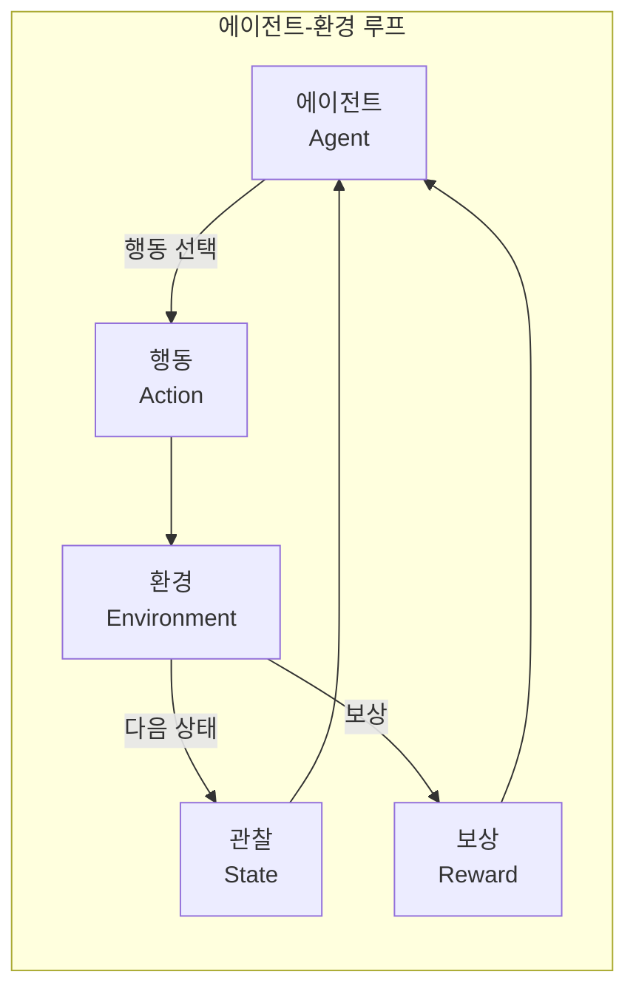
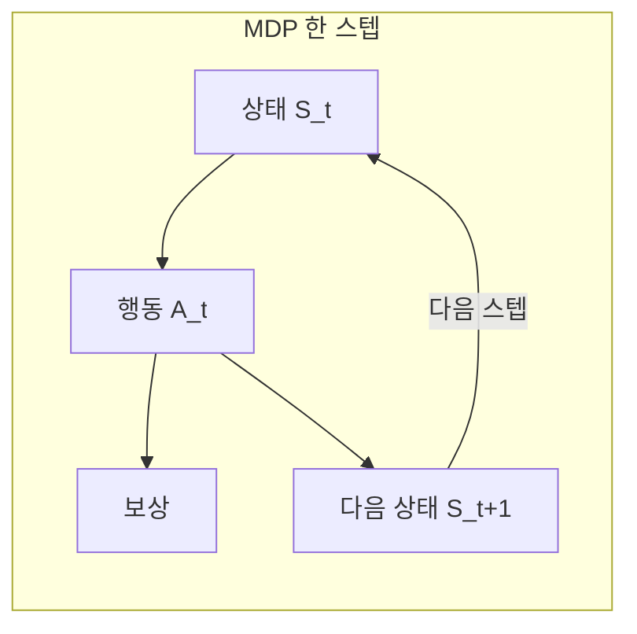
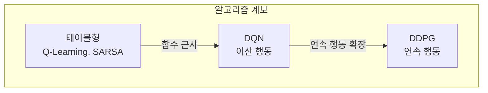

## 개요 및 추천 대상

강화 학습(Reinforcement Learning, RL)은 에이전트가 환경과 상호작용하며 보상·페널티 피드백으로 시행착오 학습을 하는 머신 러닝 분야다. 지도·비지도 학습과 달리 명시적 레이블 없이 **보상 신호**만으로 행동 정책을 학습하며, 게임 AI, 로보틱스, 자율주행, 추천·거래 시스템 등에 널리 쓰인다.

**추천 대상**: ML 입문을 넘어 RL을 체계적으로 알고 싶은 개발자·연구자, Q-Learning·DQN·DDPG 등 알고리즘과 MDP 공식화를 한글로 보고 싶은 독자.

---

## 강화 학습이란 무엇인가?

강화 학습은 **에이전트**가 **환경** 안에서 행동을 선택하고, 그 결과로 **보상**(또는 페널티)을 받으며, 장기 누적 보상을 최대화하는 **정책**을 학습하는 프레임이다. 개가 트릭을 배우는 것에 비유할 수 있다. 시도와 보상만으로 “무엇을 해야 하고 하지 말아야 하는지”를 스스로 학습한다.

### 다른 머신 러닝과의 차이

- **지도 학습**: 입력–출력 레이블 쌍으로 매핑을 학습. RL은 레이블 대신 **보상/페널티**만 사용.
- **비지도 학습**: 데이터 내 패턴·구조 발견. RL은 **누적 보상을 최대화하는 행동 정책**을 찾는 것이 목표.

RL의 핵심은 **행동–보상 피드백 루프**다. 에이전트는 환경과 상호작용하고, 그 결과로 받는 보상으로 미래 행동을 조정하며, 결국 누적 보상을 극대화하는 결정을 학습한다.

다음 Mermaid는 에이전트–환경 상호작용 루프를 단순화해 표현한 것이다.

---

## 기본 강화 학습 문제 공식화

RL을 수학적으로 다루려면 아래 핵심 개념이 필요하다.

### 핵심 용어

1. **환경(Environment)**  
   에이전트가 놓인 세계. 현재 **상태**와 **행동**을 받아 **보상**과 **다음 상태**를 반환한다.

2. **상태(State)**  
   에이전트가 현재 처한 상황. 환경의 현재 구성을 나타낸다.

3. **액션(Action)**  
   에이전트가 취할 수 있는 행동 집합. 각 스텝에서 선택한 액션이 다음 상태와 보상에 영향을 준다.

4. **보상(Reward)**  
   환경이 주는 스칼라 피드백. 에이전트의 목표는 **시간에 따른 누적 보상**을 최대화하는 것이다.

5. **정책(Policy)**  
   상태 → 행동 매핑(또는 확률 분포). 에이전트의 “전략”이다.

6. **가치(Value)**  
   할인된 **장기 기대 보상**. 단기 보상과 구분되는, “이 상태/행동이 얼마나 좋은가”를 나타낸다.

7. **에피소드(Episode)**  
   시작 상태에서 종료 상태까지의 상태–행동–보상 시퀀스. 예: 한 판 게임 전체.

### 팩맨 예시

- **환경**: 그리드 월드  
- **상태**: 팩맨 위치  
- **액션**: 상·하·좌·우  
- **보상**: 음식 획득(양), 유령과 충돌(음)  
- **정책**: 현재 위치에서 다음 이동을 결정하는 규칙  
- **가치**: 현재 상태/행동에서 기대되는 총 보상  
- **에피소드**: 한 게임(시작~게임 오버)

### 탐색 vs 착취

에이전트는 **탐색(exploration)**과 **착취(exploitation)** 사이 균형이 필요하다. 새로운 행동을 시도해 정보를 모으는 것과, 이미 알려진 좋은 행동을 활용하는 것 사이의 트레이드오프다. 최적 정책 학습을 위해 이 균형이 중요하다.

### MDP(마르코프 의사결정 과정)

환경을 수학적으로 표현할 때 흔히 **MDP**를 쓴다. MDP는 상태 집합, 행동 집합, 보상 함수, 전이 모델로 정의된다. 많은 실제 문제에서는 전이·보상이 알려져 있지 않아, **모델 없는** 방법(Q-Learning 등)을 사용한다.

다음 다이어그램은 MDP에서 한 스텝이 진행되는 흐름을 나타낸다.

- 위에서 **R_{t+1}**은 시점 t에서의 행동에 따른 즉시 보상, **S_{t+1}**은 그 다음 상태를 뜻한다.

---

## 강화 학습 알고리즘

### Q-Learning과 SARSA

둘 다 **모델 없는 시간차(TD) 학습**으로, Q값(상태–행동 가치)을 추정한다.

- **Q-Learning (오프-정책)**  
  다음 상태에서 **최대 Q값**을 사용해 업데이트. 최적 행동을 기준으로 학습해 더 공격적일 수 있다.

- **SARSA (온-정책)**  
  실제로 취한 **다음 행동**의 Q값으로 업데이트. 현재 정책의 위험을 반영해 더 보수적이다.

확률적 환경에서는 SARSA가 더 안전한 정책을, Q-Learning이 이론적 최적에 가까운 정책을 학습하는 경향이 있다.

### DQN과 DDPG

- **DQN(심층 Q 네트워크)**  
  Q값을 **신경망**으로 근사해 고차원·연속에 가까운 상태 공간을 다룬다. 이산 행동 공간에 적합하다.

- **DDPG(심층 결정론적 정책 그래디언트)**  
  **연속 행동 공간**에서 쓰는 오프-정책 액터-크리틱 알고리즘. DQN을 연속 제어에 맞게 확장한 형태다.

---

## 강화 학습의 실제 적용 사례

### 게임·로보틱스

- **알파고 제로**: RL로 바둑을 처음부터 자기 대국으로 학습해 초인적 수준 도달.  
- **아타리 게임**: 픽셀 입력만으로 플레이를 학습.  
- **TD-Gammon**: RL로 백개먼 세계 챔피언급 성능.  
- **로보틱스**: 물체 조작, 이동, 탐색 등 작업을 환경 상호작용으로 학습.

### 산업·서비스

- **재고·가격 최적화**: 수요 패턴에 맞춰 재입고·할인 전략을 RL로 학습.  
- **텍스트 요약**: 어떤 문장을 선택할지 보상(정보량·가독성 등)으로 학습.  
- **대화·챗봇**: 대화 지속·사용자 만족을 보상으로 하는 정책 학습.  
- **헬스케어**: 환자 상태와 치료 결과를 반영한 맞춤 치료 계획.  
- **주식·거래**: 수익/손실을 보상으로 하는 매매 정책.

### 기타

- **추천 시스템**: 참여·전환 극대화.  
- **에너지·냉각**: 데이터센터 등에서 소비 최소화.  
- **교통 제어**: 신호 타이밍으로 대기 시간 최소화.  
- **자율주행**: 궤적·모션 계획, 제어기 최적화.

---

## 강화 학습 시작하기: 리소스

### 개념·이론

- **도서**: Sutton & Barto, *Reinforcement Learning: An Introduction* (RL 입문 교과서).  
- **강의**: Coursera “Practical Deep Learning for Coders”(fast.ai), Udacity “Reinforcement Learning”(Georgia Tech).  
- **논문**: “Playing Atari with Deep RL”, “Human-level control through deep RL” 등.

### 실습·코드

- **OpenAI Gym**: 표준 RL 환경 모음.  
- **라이브러리**: Stable Baselines3, TF-Agents, Ray RLlib.  
- **경진**: Kaggle RL 대회, NeurIPS RL 트랙 등.

직접 알고리즘을 구현하고 실험하는 것이 이해에 가장 도움이 된다.

---

## 결론

강화 학습은 **에이전트–환경–보상** 루프와 **MDP**로 문제를 공식화하고, **Q-Learning·SARSA·DQN·DDPG** 등으로 정책을 학습한다. **탐색–착취** 균형과 **모델 없는 vs 모델 기반** 선택이 실무에서 중요하다. 게임, 로보틱스, 자율주행, 추천·거래·에너지 등 다양한 분야에서 이미 쓰이며, 시뮬레이션과 전이 학습과 결합해 적용 범위가 계속 넓어지고 있다. 이 글의 개념과 알고리즘·사례를 바탕으로 교재와 Gym 환경으로 손을 움직여 보는 것을 권한다.

---

## 자주 묻는 질문 (FAQ)

1. **강화 학습이란?**  
   에이전트가 환경과 상호작용하며 보상/페널티로부터 행동 정책을 학습하는 머신 러닝 방식이다.

2. **지도·비지도 학습과의 차이?**  
   지도 학습은 입력–레이블 쌍, 비지도 학습은 비레이블 데이터의 패턴. RL은 **보상만**으로 누적 보상을 최대화하는 정책을 학습한다.

3. **대표 알고리즘?**  
   Q-Learning, SARSA(테이블형), DQN(딥 Q), DDPG(연속 행동 액터-크리틱) 등.

4. **탐색 vs 착취?**  
   새로운 행동 시도(탐색)와 이미 알려진 좋은 행동 활용(착취) 사이의 균형. ε-greedy, UCB 등으로 조절한다.

5. **MDP란?**  
   상태·행동·보상·전이로 환경을 정의하는 수학적 틀. 많은 RL 알고리즘의 기반이다.

6. **추천 입문 경로?**  
   Sutton & Barto 책 1–4장 + OpenAI Gym으로 Q-Learning 구현 후, DQN·Stable Baselines3 순으로 확장하는 것을 추천한다.

---

## 참고 문헌

- Wikipedia. [Reinforcement learning](https://en.wikipedia.org/wiki/Reinforcement_learning).  
- TechTarget. [What is reinforcement learning?](https://www.techtarget.com/searchenterpriseai/definition/reinforcement-learning).  
- Coder One. [7 real-world applications of reinforcement learning](https://www.gocoder.one/blog/reinforcement-learning-real-world-applications/).
