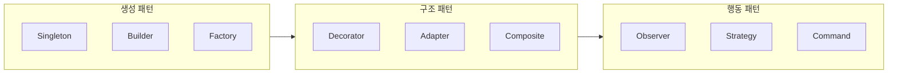
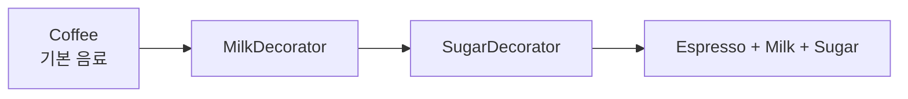
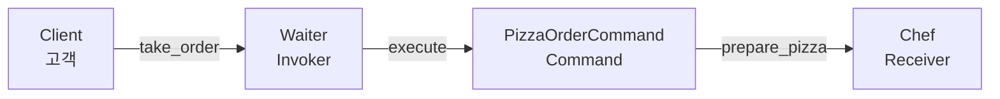

디자인 패턴은 소프트웨어 설계에서 반복적으로 나타나는 문제에 대한 **검증된 재사용 솔루션**입니다. 특정 언어에 종속되지 않으며, 객체 지향 시스템 전반에 적용할 수 있습니다. 이 글에서는 디자인 패턴의 정의와 중요성, **생성·구조·행동** 세 가지 유형, 그리고 싱글톤·데코레이터·커맨드 패턴의 Python 예제를 중심으로 정리합니다.

## 디자인 패턴 분류 개요

GoF(Gang of Four)는 디자인 패턴을 목적에 따라 세 범주로 나눕니다. 아래 Mermaid 다이어그램은 이 분류와 대표 패턴을 요약합니다.



- **생성 패턴**: 객체 생성 메커니즘에 초점을 두어, 유연하고 결합도를 낮춘 방식으로 객체를 만듭니다.
- **구조 패턴**: 클래스·객체의 구성을 다루어 더 큰 구조를 만들고, 기능을 확장합니다.
- **행동 패턴**: 객체 간 상호작용과 책임 분배에 초점을 두어, 통신·조정 방식을 설계합니다.

## 디자인 패턴의 정의

디자인 패턴은 **다양한 맥락에서 재사용 가능한, 반복적인 디자인 문제에 대한 입증된 해결 방식**입니다. 개발자 간 공통 어휘와 모범 사례를 제공하며, 특정 언어나 플랫폼에 국한되지 않고 객체 지향 시스템에 널리 적용됩니다.

## 소프트웨어 개발에서 디자인 패턴의 중요성

디자인 패턴은 다음과 같은 이유로 실무에서 중요합니다.

| 영역 | 기여 |
|------|------|
| **소통·협업** | 공통 어휘와 공유된 이해를 제공해 설계 의도를 빠르게 전달합니다. |
| **재사용성** | 흔한 문제에 대한 해결책을 캡슐화해 코드 재사용을 촉진합니다. |
| **유지보수·확장** | 구조화된 설계로 유지보수성과 확장성을 높입니다. |
| **결합도·관심사 분리** | 느슨한 결합과 관심사 분리를 유도해 모듈형 아키텍처를 만듭니다. |

**생성 패턴**은 객체 생성 방식을 유연하고 분리된 형태로 제공합니다(예: 싱글톤, 팩토리, 빌더). **구조 패턴**은 클래스·객체 구성을 다루어 데코레이터, 어댑터, 컴포지트 등으로 확장합니다. **행동 패턴**은 객체 간 상호작용과 책임 분배를 다루며, 관찰자, 전략, 명령 패턴 등이 해당합니다.

## 생성 패턴

생성 패턴은 **객체 생성**에 초점을 둔 디자인 패턴입니다. 유연하고 재사용 가능한 방식으로 인스턴스를 만들 수 있게 합니다. 이 섹션에서는 **싱글톤** 패턴을 중심으로 Eager·Lazy·스레드 안전 구현을 다룹니다.

### 싱글톤 디자인 패턴

싱글톤은 **클래스의 인스턴스를 하나만 두고, 그 인스턴스에 대한 전역 접근점을 제공**하는 생성 패턴입니다. DB 연결, 로거, 설정 관리자 등 애플리케이션 전역에서 단일 인스턴스가 필요한 경우에 적합합니다.

### 싱글톤 구현 방식

싱글톤은 **비공개 생성자**와, 호출 시 항상 동일한 인스턴스를 반환하는 **정적 메서드**로 구현합니다. 첫 호출 시 인스턴스를 만들고, 이후에는 같은 인스턴스를 반환합니다.

#### Eager 인스턴스화

클래스 로딩 시점에 인스턴스를 미리 생성합니다. 항상 준비되어 있지만, 사용하지 않을 때도 리소스를 점유할 수 있습니다.

```python
class Singleton:
    instance = Singleton()

    def __init__(self):
        pass

    @staticmethod
    def get_instance():
        return Singleton.instance
```

위 예시는 순환 참조 문제가 있을 수 있으므로, 실제로는 `instance = None`으로 두고 클래스 속성으로 한 번만 할당하는 방식을 쓰는 경우가 많습니다. 개념적으로는 “클래스 로딩 시 생성”이 Eager입니다.

#### Lazy 인스턴스화

인스턴스는 **처음 요청될 때만** 생성됩니다. 사용하지 않으면 생성하지 않아 메모리를 절약할 수 있습니다.

```python
class Singleton:
    instance = None

    def __init__(self):
        pass

    @staticmethod
    def get_instance():
        if Singleton.instance is None:
            Singleton.instance = Singleton()
        return Singleton.instance
```

#### 스레드 안전 인스턴스화

여러 스레드가 동시에 `get_instance()`를 호출해도 **인스턴스가 하나만** 생성되도록 락을 사용합니다.

```python
import threading

class Singleton:
    instance = None
    lock = threading.Lock()

    def __init__(self):
        pass

    @staticmethod
    def get_instance():
        if Singleton.instance is None:
            with Singleton.lock:
                if Singleton.instance is None:
                    Singleton.instance = Singleton()
        return Singleton.instance
```

싱글톤을 사용하면 전역에서 하나의 인스턴스만 보장하고 불필요한 중복 생성을 줄일 수 있습니다. 다음으로 구조 패턴과 행동 패턴을 살펴봅니다.

## 구조 패턴

구조 패턴은 **클래스와 객체의 구성**에 초점을 두어, 더 큰 구조를 만들고 새로운 기능을 추가하는 패턴입니다. 서로 다른 객체 간 관계를 구성해 시스템을 더 유연하고 효율적으로 만듭니다.

### 데코레이터 디자인 패턴

데코레이터 패턴은 **런타임에 객체에 동작을 추가**하면서, 기존 클래스의 다른 인스턴스에는 영향을 주지 않는 구조 패턴입니다. 객체 구조를 바꾸지 않고 기능만 덧붙일 때 사용합니다.

#### 데코레이터 패턴의 원리

상속보다 **구성(composition)**을 사용합니다. 데코레이터 객체가 원본 객체를 감싸서, 동일한 인터페이스를 유지한 채 새로운 책임을 추가합니다. 서브클래싱 없이 기능을 확장할 수 있는 대안이 됩니다.

#### 커피숍 시나리오

커피 블렌드(에스프레소, 라떼, 카푸치노 등)에 우유, 설탕, 시럽 같은 **애드온**을 조합하는 상황을 생각해 보겠습니다. 데코레이터로 기본 커피 객체를 감싸고, 각 데코레이터가 설명과 가격을 보강합니다.



#### 데코레이터 패턴 Python 예제

```python
class Coffee:
    def get_description(self):
        pass

    def get_cost(self):
        pass

class Espresso(Coffee):
    def get_description(self):
        return "Espresso"

    def get_cost(self):
        return 2.0

class CoffeeDecorator(Coffee):
    def __init__(self, coffee):
        self.coffee = coffee

    def get_description(self):
        return self.coffee.get_description()

    def get_cost(self):
        return self.coffee.get_cost()

class MilkDecorator(CoffeeDecorator):
    def get_description(self):
        return self.coffee.get_description() + ", Milk"

    def get_cost(self):
        return self.coffee.get_cost() + 0.5

class SugarDecorator(CoffeeDecorator):
    def get_description(self):
        return self.coffee.get_description() + ", Sugar"

    def get_cost(self):
        return self.coffee.get_cost() + 0.25

# 사용 예
espresso = Espresso()
espresso_with_milk = MilkDecorator(espresso)
espresso_with_milk_and_sugar = SugarDecorator(espresso_with_milk)

print(espresso_with_milk_and_sugar.get_description())  # "Espresso, Milk, Sugar"
print(espresso_with_milk_and_sugar.get_cost())          # 2.75
```

`CoffeeDecorator`는 기본 `Coffee`를 감싸고, `MilkDecorator`·`SugarDecorator`가 설명과 비용을 추가합니다. 클래스를 수정하지 않고 조합만으로 다양한 메뉴를 표현할 수 있습니다.

### 구조 패턴 정리

데코레이터 패턴은 런타임에 객체에 책임을 추가하는 강력한 도구입니다. 구성 기반으로 동작을 확장하므로, 기존 클래스를 건드리지 않고 모듈화·유지보수성을 높일 수 있습니다.

## 행동 패턴

행동 패턴은 **객체 간 상호작용**과 **책임 분배**에 초점을 둡니다. 객체 간 통신·조정 방식을 설계하고, 복잡한 상호작용 시나리오에 대한 해결책을 제공합니다.

### 커맨드(Command) 디자인 패턴

커맨드 패턴은 **요청을 객체로 캡슐화**하여, 클라이언트를 서로 다른 요청으로 매개변수화하고, 요청을 큐에 넣거나 기록·실행 취소할 수 있게 하는 행동 패턴입니다. **요청을 보내는 쪽(Invoker)**과 **실제 작업을 수행하는 쪽(Receiver)**을 분리합니다.

#### 커맨드 패턴의 구성 요소

| 역할 | 설명 |
|------|------|
| **Command** | 수행할 액션을 나타내는 객체 |
| **Receiver** | 액션을 실행하는 객체 |
| **Invoker** | Command를 보관했다가 실행을 트리거 |
| **Client** | Command를 만들고 Receiver를 설정 |

#### 식당 주문 시나리오

웨이터(Invoker)가 고객(Client)의 주문을 받아, 요리사(Receiver)에게 전달합니다. 주문은 **Command 객체**로 캡슐화되어, 웨이터는 “무슨 요리인지”만 알면 되고 요리 방법은 알 필요가 없습니다. 다양한 주문 타입을 서로 다른 Command로 표현할 수 있어 유연합니다.



#### 커맨드 패턴 Python 예제

```python
from abc import ABC, abstractmethod

class Command(ABC):
    @abstractmethod
    def execute(self):
        pass

class Chef:
    def prepare_pizza(self):
        print("Preparing pizza...")

class PizzaOrderCommand(Command):
    def __init__(self, chef):
        self.chef = chef

    def execute(self):
        self.chef.prepare_pizza()

class Waiter:
    def __init__(self):
        self.orders = []

    def take_order(self, command):
        self.orders.append(command)

    def place_orders(self):
        for order in self.orders:
            order.execute()

chef = Chef()
waiter = Waiter()

pizza_order = PizzaOrderCommand(chef)
waiter.take_order(pizza_order)

waiter.place_orders()
```

`Command`는 실행할 작업을 추상화하고, `Chef`는 Receiver, `Waiter`는 Invoker입니다. 웨이터는 각 주문의 내부 구현을 모른 채 `execute()`만 호출하면 되므로, 결합도가 낮고 새 명령 추가가 쉽습니다.

## 실용적인 예제와 활용

실무에서는 다음과 같은 패턴들이 자주 쓰입니다.

1. **팩토리 메서드 패턴**: 객체 생성 인터페이스를 제공하고, 구체적인 클래스는 서브클래스가 결정합니다. 공통 인터페이스를 가진 여러 객체를 생성할 때 유용합니다.
2. **옵저버 패턴**: 한 객체(Subject)의 상태 변경을 여러 객체(Observer)에 자동으로 알립니다. GUI, 이벤트 기반 시스템에서 널리 사용됩니다.
3. **전략 패턴**: 알고리즘 군을 정의하고 각각을 캡슐화해 상호 교환 가능하게 합니다. 조건에 따라 다른 알고리즘을 쓰는 상황에 적합합니다.

이런 패턴을 적절히 적용하면 재사용성, 유연성, 유지보수성을 높일 수 있습니다. 다만 당면한 문제에 맞을 때만 사용하는 것이 중요합니다.

## 자주 묻는 질문

**Q: 디자인 패턴이란 무엇인가요?**  
반복적으로 나타나는 설계 문제에 대한 **재사용 가능한 해결 방식**입니다. 코드 재사용, 유지보수성, 확장성을 높이는 템플릿 역할을 합니다.

**Q: 소프트웨어 개발에서 왜 중요한가요?**  
검증된 해결책을 활용해 시간을 절약하고, 공통 언어로 소통을 원활히 하며, 모범 사례에 맞춰 품질을 높일 수 있습니다.

**Q: 디자인 패턴에는 몇 가지 유형이 있나요?**  
GoF 기준으로 **생성·구조·행동** 세 가지로 구분합니다. 생성은 객체 생성, 구조는 클래스·객체 구성, 행동은 객체 간 상호작용을 다룹니다.

**Q: 모든 프로그래밍 언어에 적용 가능한가요?**  
네. 개념과 원칙은 모든 언어에 적용 가능합니다. 일부 패턴은 특정 언어에서 더 자연스럽게 표현되거나, 언어 기능으로 대체되기도 합니다.

**Q: 대규모 프로젝트에만 필요한가요?**  
아니요. 소규모 프로젝트에서도 구조·가독성·확장성을 위해 유용하게 쓸 수 있습니다.

**Q: 좋은 설계 원칙을 대체할 수 있나요?**  
아니요. 디자인 패턴은 설계 원칙을 **보완**합니다. 원칙과 패턴을 함께 이해하고 적용하는 것이 좋습니다.

**Q: 과도하게 사용할 수 있나요?**  
네. 문제에 맞지 않는 패턴을 무리하게 쓰면 복잡성과 가독성이 나빠질 수 있으므로, 필요할 때만 신중히 적용하는 것이 좋습니다.

## 관련 기술

- **객체 지향 프로그래밍(OOP)**: 디자인 패턴은 OOP와 잘 맞습니다. 캡슐화, 다형성, 추상화를 이해하면 패턴 적용이 수월합니다.
- **의존성 주입(DI)**: 객체 생성·의존성 해결을 외부로 분리해 결합도를 낮춥니다. Spring, Angular 등에서 널리 사용됩니다.
- **테스트 주도 개발(TDD)**: 패턴을 잘 쓰면 테스트하기 쉬운 구조를 만들 수 있어 TDD와 시너지가 납니다.
- **관점 지향 프로그래밍(AOP)**: 로깅·캐싱·보안 등 횡단 관심사를 분리할 때, 디자인 패턴과 함께 사용되는 경우가 많습니다.
- **마이크로서비스 아키텍처**: 게이트웨이, 회로 차단기 등 패턴을 활용해 서비스 탐색·부하 분산·내결함성을 설계합니다.

## 결론

이 글에서는 디자인 패턴의 정의와 **생성·구조·행동** 분류, 그리고 싱글톤·데코레이터·커맨드 패턴의 Python 예제를 다뤘습니다. 디자인 패턴은 흔한 문제에 대한 검증된 접근을 제공하고, 재사용성·유지보수성·확장성을 높입니다. 당면한 문제에 맞는 패턴을 선택하고, 설계 원칙과 함께 적용하는 것이 중요합니다. 42jerrykim.github.io에서 더 많은 정리 글을 확인할 수 있습니다.

## 참고 문헌

- [Software design pattern - Wikipedia](https://en.wikipedia.org/wiki/Software_design_pattern)
- [Design Patterns - SourceMaking](https://sourcemaking.com/design_patterns)
- [The basic design patterns all developers need to know - freeCodeCamp](https://www.freecodecamp.org/news/the-basic-design-patterns-all-developers-need-to-know/)
