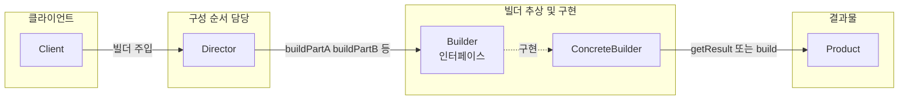

소프트웨어 개발에서 **선택적 속성이 많은 복잡한 객체**를 만들 때, 생성자 인자가 많아지거나 점층적 생성자·자바빈 패턴의 한계가 드러납니다. 이때 **빌더 패턴(Builder pattern)** 은 객체의 **구성(construction)** 과 **표현(representation)** 을 분리해, 같은 구성 과정으로도 서로 다른 표현을 만들 수 있게 해줍니다. 이 글에서는 빌더 패턴의 개념, GoF와 Effective Java 관점, Java 구현 절차, 실전 라이브러리 사례, 관련 패턴·기술, FAQ까지 정리합니다.

## 개요

### 빌더 패턴이란

빌더 패턴은 **생성 패턴(Creational Pattern)** 중 하나로, 복잡한 객체를 **단계적으로 구성**하고 그 **구성 과정과 표현을 분리**하는 패턴입니다. GoF 정의에 따르면, "동일한 구성 프로세스로 서로 다른 표현을 만들 수 있도록" 하는 것이 목적입니다. 선택적 속성이 많을 때 생성자 과부하나 가독성 저하를 피하고, 불변 객체를 안전하게 만들 때도 유용합니다.

### 추천 대상

- Java·Kotlin 등으로 도메인 객체·설정 객체를 많이 만드는 백엔드·Android 개발자  
- 생성자 인자가 많은 클래스를 리팩토링하려는 경우  
- Retrofit, OkHttp, Lombok @Builder 등 빌더 스타일 API를 이해하고 올바르게 쓰고 싶은 경우  

---

## 패턴 구조

GoF 빌더 패턴은 **Director**, **Builder(인터페이스)**, **ConcreteBuilder**, **Product** 네 요소로 구성됩니다. Director는 Builder를 통해 구축 단계만 호출하고, ConcreteBuilder가 실제 부품 조립과 Product 생성에 책임집니다.



- **Director**: Builder 인터페이스만 알고, 구축 단계 호출 순서를 정의한다.  
- **Builder**: 구축 단계 메서드를 선언한다.  
- **ConcreteBuilder**: 단계별 구현과 최종 Product 생성(예: `build()`)을 담당한다.  
- **Product**: 최종 생성되는 객체. Builder마다 다른 타입·표현일 수 있다.  

Effective Java 스타일의 빌더는 **Director 없이** 정적 내부 Builder 클래스로 "선택 인자만 설정하고 `build()`로 한 번에 객체 생성"에 초점을 둡니다. 실무에서는 이 스타일이 더 자주 쓰입니다.

---

## 빌더 패턴의 목적과 이점

### 해결하는 문제

- **점층적 생성자**: 인자 수만 다른 생성자 다수 → 가독성 저하, 인자 순서 실수  
- **자바빈(setter) 패턴**: 한 번에 생성이 끝나지 않아 일관성 깨짐, 불변 객체 불가  
- **선택 속성 다수**: 필수/선택이 섞인 객체를 안전하고 읽기 쉽게 만들기  

### 이점

| 이점 | 설명 |
|------|------|
| **가독성** | 메서드 이름으로 인자 의미가 드러나고, 체이닝으로 의도가 분명해진다. |
| **유연성** | 필요한 속성만 설정하고, 같은 Builder로 여러 설정 조합을 만들 수 있다. |
| **불변성** | setter 없이 Builder에서만 값을 받고 `build()` 한 번으로 완성하므로 불변 객체 작성이 쉽다. |
| **유지보수** | 구성 로직이 Builder로 모이므로, Product 클래스와 클라이언트를 덜 건드리고 확장할 수 있다. |

---

## Java에서 빌더 패턴 구현하기

### 구현 절차 (Effective Java 스타일)

1. **Builder 정적 내부 클래스**: 대상 클래스 안에 `public static class Builder`를 둔다.  
2. **선택 속성 필드**: Builder에만 선택적 속성을 두고, 필요 시 기본값으로 초기화한다.  
3. **필수 인자**: Builder 생성자로 필수 인자만 받는다.  
4. **설정 메서드**: 각 선택 속성마다 메서드를 두고 **`return this`** 로 체이닝 가능하게 한다.  
5. **`build()`**: Builder가 가진 값으로 대상 클래스 인스턴스를 만들어 반환한다.  
6. **대상 클래스 생성자**: `private`으로 두고, 인자로 Builder만 받도록 해서 Builder 통해서만 생성되게 한다.  
7. **진입점**: `public static Builder builder()` 또는 `new Builder(필수인자)`로 Builder 생성한다.  

### 예제: Computer 객체

`processor`, `memory`, `storage`를 선택 속성으로 갖는 `Computer`를 빌더로 구성하는 예시입니다.

```java
public class Computer {
    private final String processor;
    private final int memory;
    private final int storage;

    private Computer(Builder builder) {
        this.processor = builder.processor;
        this.memory = builder.memory;
        this.storage = builder.storage;
    }

    public static class Builder {
        private String processor = "Intel";
        private int memory = 8;
        private int storage = 256;

        public Builder setProcessor(String processor) {
            this.processor = processor;
            return this;
        }

        public Builder setMemory(int memory) {
            this.memory = memory;
            return this;
        }

        public Builder setStorage(int storage) {
            this.storage = storage;
            return this;
        }

        public Computer build() {
            return new Computer(this);
        }
    }

    public static Builder builder() {
        return new Builder();
    }

    // getters...
}
```

**사용 예:**

```java
Computer computer = Computer.builder()
        .setProcessor("AMD")
        .setMemory(16)
        .setStorage(512)
        .build();
```

---

## 실전 활용: Retrofit과 OkHttp

### Retrofit

[Retrofit](https://square.github.io/retrofit/)은 타입 안전 HTTP 클라이언트로, `Retrofit.Builder`로 기본 URL, Converter, 인터셉터 등을 설정한 뒤 `build()`로 인스턴스를 만듭니다. 선택 항목이 많기 때문에 빌더 패턴으로 유연하게 구성합니다.

### OkHttp

[OkHttp](https://square.github.io/okhttp/)의 `OkHttpClient`도 `OkHttpClient.Builder`로 타임아웃, 인터셉터, 연결 풀 등을 설정하고 `build()`로 생성합니다. 동일한 구성 방식으로 가독성과 재사용성을 높입니다.

두 라이브러리 모두 "많은 선택적 설정 + 한 번에 인스턴스 생성"이라는 요구에 맞춰 빌더 패턴을 사용하는 대표 사례입니다.

---

## 관련 기술과 변형

### 자바빈 패턴과의 차이

자바빈은 setter로 속성을 채우므로 **객체가 완성되기 전까지 일관성이 보장되지 않고**, setter가 있으면 **불변 객체**를 만들기 어렵습니다. 빌더는 `build()` 호출 전까지는 Product가 노출되지 않고, 한 번 생성 후 수정 메서드가 없으면 불변성을 유지할 수 있습니다.

### Lombok @Builder

Lombok의 `@Builder`는 Effective Java 스타일의 보일러플레이트를 줄여주지만, **GoF의 Director·여러 ConcreteBuilder 조합**과는 다릅니다. named parameter 스타일의 편의용에 가깝고, Director를 제공하지 않습니다. 클래스 레벨이 아니라 **필수 인자를 받는 생성자에 붙이는 사용**을 권장하는 문서와 블로그가 많습니다.

### 빌더 변형 요약

- **Classic Builder**: 별도 Builder 클래스 + `build()`로 Product 반환.  
- **Fluent Builder**: 설정 메서드가 `this`를 반환해 체이닝.  
- **Telescoping Builder**: 인자 개수별 생성자 대신, 빌더로 필요한 조합만 설정.  

---

## 자주 묻는 질문

**Q: 빌더 패턴을 쓰는 이유는?**  
선택적 속성이 많은 객체를 가독성 있게 만들고, 불변 객체를 쉽게 구성하며, 구성 로직을 한 곳(Builder)에 모아 유지보수를 쉽게 하기 위해서입니다.

**Q: GoF 빌더와 Effective Java 스타일 빌더의 차이는?**  
GoF는 Director가 Builder를 사용해 **동일 구성 과정으로 서로 다른 표현(다른 ConcreteBuilder)**을 만드는 것에 초점을 둡니다. Effective Java 스타일은 **매개변수가 많은 생성자 대신** 빌더로 깔끔하고 안전한 객체 생성에 초점을 둡니다.

**Q: Retrofit·OkHttp 말고 다른 예는?**  
`StringBuilder`, `UriComponentsBuilder`(Spring), `Stream.Builder` 등 많은 선택 설정이 필요한 클래스에서 빌더 형태의 API를 사용합니다.

**Q: 빌더의 단점은?**  
Builder 클래스 추가로 코드량이 늘고, null-safe 언어에서는 설정 누락을 컴파일 타임이 아니라 런타임에 발견할 수 있습니다. `build()` 안에서 필수 필드 검증을 넣어 완화할 수 있습니다.

---

## 결론

빌더 패턴은 **복잡한 객체의 구성과 표현을 분리**해 가독성, 유연성, 불변성, 유지보수성을 높이는 생성 패턴입니다. Java에서는 정적 내부 Builder + 체이닝 + `build()` 형태가 널리 쓰이며, Retrofit·OkHttp 같은 라이브러리에서도 동일한 사고방식을 확인할 수 있습니다. Lombok @Builder는 편의 도구로 활용하되, GoF의 Director·다중 표현 관점과는 다르다는 점을 인지하고 사용하는 것이 좋습니다.

---

## 참고 문헌

- [생성 패턴 - 빌더 패턴 (Builder pattern) 이해 및 예제 - 준비된 개발자](https://readystory.tistory.com/121)
- [빌더 패턴(Builder Pattern) - 개발하는만두](https://dev-youngjun.tistory.com/197)
- [Builder pattern - Wikipedia](https://en.wikipedia.org/wiki/Builder_pattern)
- [Builder - Refactoring.Guru](https://refactoring.guru/design-patterns/builder)
- [빌더 패턴(Builder Pattern) - 기계인간 John Grib](https://johngrib.github.io/wiki/pattern/builder/)
