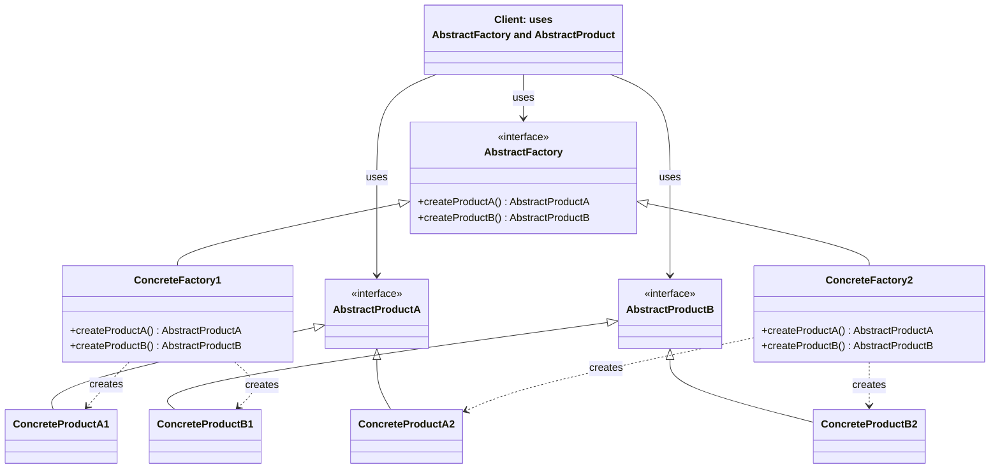

소프트웨어에서 **관련된 객체들의 제품군**을 일관되게 만들면서, 클라이언트가 구체 클래스 이름에 묶이지 않게 하려면 생성 책임을 한곳에 모아야 한다. **추상 팩토리 패턴(Abstract Factory Pattern)**은 GoF(Gang of Four)가 정리한 생성 패턴 중 하나로, “구체 클래스를 지정하지 않고 관련·종속 객체들의 패밀리를 생성하는 인터페이스”를 제공한다. 이 글에서는 추상 팩토리의 정의와 목적, C# 구현 절차, 실용 예제, Factory Method와의 차이, 언제 쓰고 피할지 판단 기준까지 정리한다.

## 정의와 목적

**추상 팩토리 패턴**이란, **관련되거나 종속된 객체들의 패밀리를 생성하기 위한 인터페이스를 제공하되, 구체적인 클래스는 지정하지 않는** 디자인 패턴이다. 객체 생성 로직을 별도의 팩토리 객체에 캡슐화하고, 클라이언트는 그 인터페이스만 사용해 제품군을 얻는다.

Design Patterns(Gamma et al., 1994)에서는 다음과 같이 정의한다.

> "an interface for creating families of related or dependent objects without specifying their concrete classes."  
> — Gamma, Helm, Johnson, Vlissides, *Design Patterns: Elements of Reusable Object-Oriented Software*(1994)

목적은 세 가지로 요약할 수 있다. (1) **관련 객체 제품군**을 한 번에 생성할 수 있게 하고, (2) 클라이언트가 **객체 생성 방식에 의존하지 않도록** 하며, (3) **새 제품군·변형 추가** 시 기존 클라이언트 코드 수정을 최소화하는 것이다. 이에 따라 캡슐화·느슨한 결합·확장성이 강화된다.

## 패턴 구조

추상 팩토리 패턴은 **AbstractFactory**, **ConcreteFactory**, **AbstractProduct**, **ConcreteProduct**, **Client**로 구성된다. 클라이언트는 AbstractFactory와 AbstractProduct 타입만 알면 되고, 구체 팩토리와 구체 제품은 런타임에 주입되거나 설정으로 선택된다.

아래 Mermaid 클래스 다이어그램은 이 관계를 요약한다. 노드 ID는 camelCase·PascalCase를 사용했고, 라벨에 괄호·등호가 있는 부분은 큰따옴표로 감쌌다.



- **AbstractFactory**: 제품군을 만드는 메서드(createProductA, createProductB 등)를 선언하는 인터페이스.
- **ConcreteFactory1 / ConcreteFactory2**: 각각 한 가지 변형(제품군)에 해당하는 구체 제품만 생성.
- **AbstractProductA / AbstractProductB**: 제품 계열의 공통 타입.
- **ConcreteProductA1, B1**과 **ConcreteProductA2, B2**: 같은 제품군 내에서만 호환되도록 구체 구현.
- **Client**: AbstractFactory와 AbstractProduct 타입만 사용하므로, 구체 팩토리를 바꿔도 코드 변경이 없다.

## 작동 방식

추상 팩토리 패턴의 동작은 세 가지로 정리할 수 있다.

**1. 객체 생성을 별도 팩토리 객체에 캡슐화한다.**  
클라이언트는 `new ConcreteProductA1()`처럼 구체 타입을 직접 부르지 않고, 팩토리 인터페이스의 메서드(예: `createProductA()`)를 호출한다. 생성 책임은 모두 팩토리 쪽에 있다.

**2. 객체 생성 책임을 팩토리에 위임한다.**  
클라이언트는 “제품 A·B를 달라”만 요청하고, 어떤 구체 클래스가 만들어질지는 팩토리 구현체가 결정한다. 설정·환경·DI에 따라 다른 ConcreteFactory가 주입되면 동일한 클라이언트 코드로 다른 제품군을 사용할 수 있다.

**3. 클래스를 “객체가 어떻게 생성되는지”와 무관하게 만든다.**  
클라이언트는 AbstractFactory·AbstractProduct 타입에만 의존하므로, 구체 팩토리를 교체해도 클라이언트 코드는 수정할 필요가 없다. 이로써 느슨한 결합과 유지보수성이 확보된다.

## C#에서의 구현 절차

C#에서는 인터페이스와 클래스로 추상 팩토리를 구현한다. 순서는 (1) 추상 제품 정의, (2) 구체 제품 구현, (3) 추상 팩토리 인터페이스 정의, (4) 구체 팩토리 구현, (5) 클라이언트가 팩토리만 받아 사용하는 것이다.

아래 예는 GUI 제품군(Button, TextBox, Label)을 하나의 팩토리로 생성하는 최소 구조다. 클라이언트는 `IGUIFactory`와 추상 제품 타입만 알면 되고, Windows 테마인지 Mac 테마인지는 주입되는 팩토리에 따라 결정된다.

**추상 제품**  
먼저 제품 계열별로 인터페이스를 둔다. 예: `IButton`, `ITextBox`, `ILabel`. 각 구체 제품(WindowsButton, MacButton 등)은 이 인터페이스를 구현한다.

**구체 제품**  
각 테마·플랫폼별로 구체 클래스를 만든다. Windows 테마라면 WindowsButton, WindowsTextBox, WindowsLabel; Mac 테마라면 MacButton, MacTextBox, MacLabel처럼 한 테마 안의 제품끼리만 함께 쓰이도록 한다.

**추상 팩토리**  
제품군 전체를 생성하는 메서드를 선언한 인터페이스를 정의한다. 예: `IButton CreateButton()`, `ITextBox CreateTextBox()`, `ILabel CreateLabel()`. 반환 타입은 모두 추상 제품 타입이다.

**구체 팩토리**  
추상 팩토리 인터페이스를 구현하는 클래스에서, 각 메서드가 해당 테마의 구체 제품을 `new`로 생성해 반환하도록 한다. 예: `WindowsGUIFactory`는 `CreateButton()`에서 `new WindowsButton()`를 반환한다.

다음 코드는 위 구조를 C#으로 옮긴 예이다. 클라이언트(`Application`)는 `IGUIFactory`만 받아 버튼·텍스트박스·레이블을 생성하며, 구체 타입을 전혀 알 필요가 없다.

```csharp
// 추상 제품 인터페이스
public interface IButton { void Render(); }
public interface ITextBox { void Render(); }
public interface ILabel { void Render(); }

// 구체 제품 (Windows 테마)
public class WindowsButton : IButton { public void Render() => Console.WriteLine("Windows Button"); }
public class WindowsTextBox : ITextBox { public void Render() => Console.WriteLine("Windows TextBox"); }
public class WindowsLabel : ILabel { public void Render() => Console.WriteLine("Windows Label"); }

// 추상 팩토리
public interface IGUIFactory
{
    IButton CreateButton();
    ITextBox CreateTextBox();
    ILabel CreateLabel();
}

// 구체 팩토리
public class WindowsGUIFactory : IGUIFactory
{
    public IButton CreateButton() => new WindowsButton();
    public ITextBox CreateTextBox() => new WindowsTextBox();
    public ILabel CreateLabel() => new WindowsLabel();
}

// 클라이언트: 구체 타입에 의존하지 않음
public class Application
{
    private readonly IButton _button;
    private readonly ITextBox _textBox;
    private readonly ILabel _label;

    public Application(IGUIFactory factory)
    {
        _button = factory.CreateButton();
        _textBox = factory.CreateTextBox();
        _label = factory.CreateLabel();
    }

    public void Run()
    {
        _button.Render();
        _textBox.Render();
        _label.Render();
    }
}
```

새 테마(예: Mac)를 추가할 때는 Mac용 구체 제품과 `MacGUIFactory`만 추가하고, `Application` 코드는 그대로 둔다. 이는 개방-폐쇄 원칙(OCP)에 부합한다.

## 실용 예제

### MazeFactory로 미로 게임 구성

게임에서 미로를 구성할 때, “일반 미로”와 “마법/폭탄 미로”처럼 **테마별로 Room, Door, Wall**이 달라질 수 있다. 이때 추상 팩토리를 쓰면, 클라이언트(미로 빌더)는 `MazeFactory` 인터페이스만 사용하고, 구체 팩토리(`SimpleMazeFactory`, `EnchantedMazeFactory`, `BombedMazeFactory` 등)가 주입되면 해당 테마의 Room/Door/Wall이 생성된다. 클라이언트는 구체 클래스 이름을 몰라도 되고, 테마 교체는 팩토리만 바꾸면 된다.

### ThemeFactory로 GUI 테마 전환

데스크톱 앱에서 Light/Dark/HighContrast 테마를 지원할 때, 버튼·입력창·레이블 등이 테마별로 다른 스타일이어야 한다. `IThemeFactory`에 `CreateButton()`, `CreateTextBox()`, `CreateLabel()` 등을 두고, `LightThemeFactory`, `DarkThemeFactory` 등이 각각 동일 계열의 구체 위젯을 생성하도록 하면, 사용자가 테마를 바꿀 때 한 번만 다른 팩토리 인스턴스로 교체하면 된다. 클라이언트 코드는 동일하게 유지된다.

## 언제 사용하고 언제 피할지

| 사용하는 것이 적합한 경우 | 피하는 것이 좋은 경우 |
|---------------------------|------------------------|
| 관련된 객체들의 **제품군**을 한 번에 생성해야 할 때 | 제품 종류가 **한두 개**이고 변형이 거의 없을 때 |
| 구체 클래스에 의존하지 않고 **테마·플랫폼·설정**에 따라 제품군을 바꿔야 할 때 | 단순한 객체 생성만 필요하고 제품군 개념이 없을 때 |
| 새 **제품 변형·테마**를 자주 추가할 가능성이 있을 때 | 팀 규모가 작고 패턴 도입으로 인한 클래스 수 증가가 부담될 때 |
| 클라이언트가 **동일한 추상**만 보고 여러 구현을 교체받아야 할 때 | 런타임에 제품 종류가 자주 바뀌지 않고, 한 가지 구현만 쓰는 경우 |

정리하면, “여러 관련 제품이 한 세트로 바뀌는 경우”와 “구체 타입을 숨기고 싶은 경우”에 추상 팩토리가 유리하고, 단일 제품만 필요하거나 변형이 거의 없으면 Factory Method나 단순 생성으로 충분할 수 있다.

## 추상 팩토리 vs 팩토리 메서드

- **팩토리 메서드**: **한 종류의 제품**을 생성하는 메서드를 (보통 한 개) 두고, 서브클래스가 그 메서드를 오버라이드해 구체 타입을 결정한다. 제품이 하나일 때 적합하다.
- **추상 팩토리**: **여러 종류의 제품**을 한 번에 생성하는 인터페이스를 두고, 각 구체 팩토리가 한 “제품군” 전체를 만든다. 제품들이 서로 호환되는 “패밀리”로 묶일 때 적합하다.

즉, “한 가지 제품의 구체 타입만 숨기면 된다” → 팩토리 메서드, “버튼·텍스트박스·레이블처럼 여러 제품이 테마별로 같이 바뀐다” → 추상 팩토리를 선택하면 된다.

## 의존성 주입과의 결합

추상 팩토리 인터페이스를 DI 컨테이너에 등록하고, 클라이언트 생성자에서 그 인터페이스만 주입받으면, 설정·환경에 따라 다른 구체 팩토리가 주입된다. 클라이언트는 팩토리를 직접 `new`하지 않으므로 테스트 시 목(mock) 팩토리로 교체하기 쉽고, 런타임에 제품군을 바꾸는 것도 설정만으로 가능해진다.

## 자주 묻는 질문

**Q. 추상 팩토리와 팩토리 메서드의 차이는?**  
위 섹션처럼, 팩토리 메서드는 “한 제품 한 종류”의 생성 위임이고, 추상 팩토리는 “여러 제품이 묶인 제품군”의 생성 인터페이스를 제공한다. 추상 팩토리 내부에서 각 제품을 만들 때 팩토리 메서드를 사용할 수 있다.

**Q. 추상 팩토리는 언제 쓰는가?**  
관련 객체들이 “한 세트”로 바뀌어야 하고, 클라이언트가 구체 클래스 이름을 알 필요가 없을 때 사용한다. GUI 테마, 플랫폼별 UI, 게임 오브젝트 계열 등이 전형적인 예이다.

**Q. DI 프레임워크와 함께 쓸 수 있는가?**  
가능하다. 추상 팩토리 인터페이스를 서비스로 등록하고, 클라이언트는 생성자 주입으로 그 인터페이스만 받으면 된다. 테스트·확장·설정 변경이 모두 쉬워진다.

## 관련 기술

- **팩토리 메서드 패턴**: 한 종류의 객체 생성만 서브클래스에 위임하는 패턴. 추상 팩토리 안에서 각 제품을 만들 때 활용할 수 있다.
- **의존성 주입(Dependency Injection)**: 추상 팩토리 구현체를 외부에서 주입하면 클라이언트가 구체 팩토리에 의존하지 않게 되어, 테스트와 교체가 쉬워진다.

## 결론

**추상 팩토리 패턴**은 구체 클래스를 노출하지 않고 **관련 객체 제품군**을 생성하는 인터페이스를 제공하는 GoF 생성 패턴이다. 객체 생성을 팩토리에 캡슐화하고, 클라이언트는 추상 팩토리·추상 제품 타입만 사용하므로, 테마·플랫폼·설정에 따라 제품군을 바꿀 때 기존 코드 변경을 최소화할 수 있다. C#에서는 인터페이스와 구체 팩토리/제품 클래스로 구현하며, DI와 결합하면 유연성과 테스트 용이성이 더 커진다. “여러 관련 제품이 한 세트로 바뀐다”는 요구가 있을 때 적용을 검토하면 된다.

## 학습 성과 목표 (평가 기준)

이 글을 읽은 뒤에는 다음을 할 수 있으면 좋다.

- 추상 팩토리 패턴의 **정의와 목적**을 한 문장으로 설명할 수 있다.
- **AbstractFactory, ConcreteFactory, AbstractProduct, ConcreteProduct, Client** 역할을 구분하고, 클래스 다이어그램으로 그릴 수 있다.
- **추상 팩토리**와 **팩토리 메서드**의 차이를 “제품 한 종류 vs 제품군”으로 설명할 수 있다.
- “관련 제품군을 한 번에 바꿔야 하는 경우”에는 추상 팩토리를, “한 가지 제품만 바꾸면 되는 경우”에는 팩토리 메서드나 단순 생성 중 하나를 선택할 수 있다.
- C#으로 추상 제품·구체 제품·추상 팩토리·구체 팩토리를 정의하고, 클라이언트가 구체 타입에 의존하지 않도록 코드를 작성할 수 있다.

## 참고 문헌

1. [Abstract factory pattern](https://en.wikipedia.org/wiki/Abstract_factory_pattern) — Wikipedia.
2. [Abstract Factory in C#](https://refactoring.guru/design-patterns/abstract-factory/csharp/example) — Refactoring.Guru.
3. [C# Abstract Factory Design Pattern](https://www.dofactory.com/net/abstract-factory-design-pattern) — DoFactory.
4. [Abstract Factory Design Pattern in C# with Examples](https://dotnettutorials.net/lesson/abstract-factory-design-pattern-csharp/) — Dot Net Tutorials.
5. [Understanding Abstract Factory Design Pattern](https://www.dotnettricks.com/learn/designpatterns/abstract-factory-design-pattern-dotnet) — DotNetTricks.
