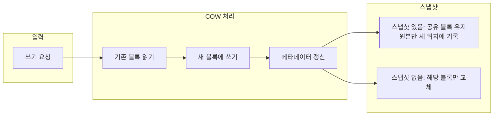

## 개요

**Btrfs**(B-tree file system, 버터 파일 시스템)는 Linux 커널에 포함된 **차세대 파일 시스템**으로, Oracle·Fujitsu·Red Hat 등이 참여해 개발했으며 현재는 오픈소스 커뮤니티(메타, SUSE, 웨스턴디지털 등)가 유지보수하고 있다. Copy-on-Write(COW) B-tree 구조를 기반으로 하며, **데이터 무결성**, **스냅샷**, **서브볼륨**, **내장 압축**, **온라인 검사·복구** 등 현대 스토리지가 요구하는 기능을 한 곳에 모았다.

이 글에서는 Btrfs의 구조와 핵심 기능, 실제 사용 사례, 자주 묻는 질문, ZFS·Ext4와의 비교, 그리고 장단점과 한 줄 평을 정리한다. **시스템 관리자**, **NAS·백업 설계자**, **리눅스 기반 스토리지**를 다루는 개발자에게 유용하다.

---

## Btrfs 아키텍처와 구조

Btrfs는 디스크 상에 **여러 B-tree**를 사용한다. 파일 데이터와 메타데이터는 **익스텐트(extent)** 단위로 관리되며, **쓰기 시 복사(COW)** 방식으로 갱신된다. 즉, 기존 블록을 덮어쓰지 않고 변경된 내용만 새 위치에 기록하므로, 특정 시점의 일관된 스냅샷을 만들기 쉽고 손상 시 복구에 유리하다.

아래 다이어그램은 Btrfs에서 **쓰기 요청이 들어왔을 때** COW와 스냅샷이 어떻게 연동되는지 개념적으로 보여 준다.

노드 ID는 camelCase·의미 있는 이름을 사용했고, 라벨 내부의 한글·설명은 Mermaid 파서가 안정적으로 처리할 수 있도록 했다. **줄바꿈**이 필요한 라벨은 ` `을 사용했다.

Btrfs는 **동적 이노드 할당**을 하므로, 파일 개수가 많아져도 미리 고정된 이노드 수에 막히지 않는다. 최대 볼륨·파일 크기는 이론상 **16 EiB** 수준이며, 64비트 커널 제한으로 실질적으로는 8 EiB 이하로 사용된다.

---

## 핵심 기능 및 장점

### 동적 이노드 할당

**이노드**(inode)는 파일·디렉터리의 메타데이터(권한, 소유자, 크기, 링크 등)를 담는 구조다. 전통적인 ext 시리즈는 생성 시점에 이노드 개수가 고정되어 있어, 작은 파일을 엄청 많이 만들면 "디스크 공간은 남는데 No space left on device" 같은 상황이 발생할 수 있다. Btrfs는 이노드를 **동적으로 할당**하므로, 실제 사용량에 맞춰 메타데이터 공간이 늘어나 이런 한계를 피할 수 있다.

### 쓰기 가능한 스냅샷

Btrfs **스냅샷**은 특정 시점의 파일 시스템 상태를 가리키는 메타데이터 집합이다. 데이터 블록은 COW로 인해 스냅샷과 원본이 **공유**되다가, 수정이 일어난 부분만 새로 할당된다. 따라서 스냅샷 생성은 매우 빠르고, 공간도 변경분만 차지한다. **쓰기 가능 스냅샷**을 만들면 그 스냅샷을 마운트해 그 안에서 수정·복원 작업을 할 수 있어, 백업·테스트·롤백 시나리오에 적합하다.

### 서브볼륨

**서브볼륨**(subvolume)은 하나의 Btrfs 파일 시스템 안에 있는 **독립된 트리**다. 별도 파티션이 아니라도 마운트·스냅샷·할당량 적용 단위로 쓸 수 있다. 예를 들어 `/home`, `/var`, `/opt`를 각각 서브볼륨으로 두면, OS 재설치 시 루트 서브볼륨만 초기화하고 `/home`은 그대로 둘 수 있다. NAS나 멀티테넌트 환경에서 디렉터리 단위 할당량·스냅샷 정책을 나누기 좋다.

### 미러링 및 스트라이핑(RAID)

Btrfs는 **오브젝트(파일/청크) 수준**에서 RAID 0(스트라이핑), RAID 1(미러링), RAID 5/6, RAID 10 등을 지원한다. 여러 블록 디바이스를 하나의 Btrfs 풀에 넣고 프로파일을 지정하면, 데이터·메타데이터별로 서로 다른 RAID 레벨을 쓸 수도 있다. 메타데이터는 기본적으로 **이중화**를 권장해, 단일 디스크 오류 시에도 메타데이터로 인한 전체 손실 위험을 줄인다.

### 내장 압축

Btrfs는 **zlib**, **LZO**, **LZ4**, **Zstd** 등 알고리즘으로 블록 단위 투명 압축을 지원한다. 마운트 옵션 또는 파일 속성으로 압축 방식을 정할 수 있어, 로그·텍스트처럼 압축률이 좋은 데이터는 용량 절감과 함께 I/O 양을 줄이는 효과를 기대할 수 있다. 반대로 이미 압축된 파일은 `compression=none`으로 두는 것이 성능상 유리하다.

### 온라인·오프라인 검사 및 자가 복구

**스크럽**(scrub)은 마운트된 상태에서 전체(또는 일부) 블록을 읽어 체크섬을 검증한다. 불일치가 나면 미러나 RAID 패리티가 있을 경우 **자동 복구**를 시도한다. **오프라인 검사**(예: `btrfs check`)는 마운트 해제 후 메타데이터·구조 일관성을 더 깊게 검사할 때 쓴다. 데이터 무결성을 지키려면 정기적인 스크럽 실행을 권장한다.

---

## 실제 사용 사례

### 클라우드·스토리지 시스템

대규모 스토리지 백엔드에서 Btrfs는 **스냅샷 기반 백업**, **서브볼륨 단위 할당량**, **압축으로 인한 용량·대역폭 절감**을 동시에 활용하기 좋다. COW 덕분에 스냅샷 생성 시 서비스 중단이 거의 없고, send/receive로 증분 백업을 보내는 구성도 가능하다. 다만 **작은 랜덤 쓰기**가 많은 워크로드에서는 COW·압축 오버헤드로 인해 다른 파일 시스템 대비 느려질 수 있으므로, 워크로드 특성을 반드시 측정해 보는 것이 좋다.

### NAS 장치

Synology 등 많은 NAS 제품이 Btrfs를 옵션 또는 기본 파일 시스템으로 제공한다. **메타데이터 이중화**, **체크섬 기반 자가 복구**, **스냅샷·복제·할당량**을 한 번에 쓰기 위해 Btrfs를 선택하는 경우가 많다. 가정·소규모 사무실에서는 스냅샷 스케줄과 보존 정책만 잘 설정해도 랜섬웨어·실수 삭제에 대한 복구 옵션이 크게 늘어난다.

---

## 자주 묻는 질문

**어떤 운영 체제에서 Btrfs를 지원하나요?**

Btrfs는 **Linux 전용**이다. Ubuntu, Fedora, openSUSE, SUSE Linux Enterprise, Debian 등 주요 배포판에서 지원하며, Fedora 33부터는 기본 파일 시스템으로 채택되었다. Windows·macOS에는 공식 드라이버가 없으나, Windows용 서드파티 읽기/쓰기 드라이버(예: WinBtrfs)가 있어 데이터 드라이브로 제한적으로 사용하는 사례가 있다.

**Btrfs는 어떻게 데이터 무결성을 보장하나요?**

모든 데이터·메타데이터 블록에 **체크섬**을 저장하고, 읽을 때마다 검증한다. 불일치가 발견되면 미러 또는 RAID 패리티가 있을 경우 자동으로 복구를 시도한다. 메타데이터는 기본적으로 복제본을 두는 구성을 권장해, 단일 디스크 오류 시에도 풀 전체가 붕괴하는 위험을 줄인다.

**프로덕션 환경에서 Btrfs를 써도 되나요?**

많은 프로덕션 환경에서 사용 중이다. 다만 **RAID 5/6**는 과거 커널에서 치명적 버그가 보고된 이력이 있어, 최신 커널과 문서를 확인한 뒤 신중히 선택해야 한다. 중요한 시스템은 반드시 **비프로덕션에서 충분히 테스트**하고, **정기 백업·스크럽**으로 무결성을 점검하는 것이 좋다.

**Btrfs 사용 시 성능상 주의할 점은 무엇인가요?**

COW 특성상 **작은 랜덤 쓰기**가 많은 워크로드(예: 일부 DB, VM 디스크)에서는 오버헤드가 클 수 있다. 이런 경우 `nodatacow` 옵션으로 일부 서브볼륨만 COW를 끄거나, 다른 파일 시스템을 검토하는 것이 좋다. **스왑 파일**을 Btrfs 위에 둘 때는 Linux 5.0+에서 지원하며, 해당 파일에 대해 COW를 비활성화해야 한다. **4K 정렬**이 된 디스크에서 최적 성능을 내므로, 파티션·RAID 생성 시 정렬을 맞추는 것이 권장된다.

---

## 관련 기술과 비교

### ZFS

ZFS(Sun/Oracle) 역시 COW, 스냅샷, 체크섬, 압축, RAID를 제공한다. 차이로는 **라이선스**(Btrfs는 GPL, ZFS는 CDDL)로 인해 일부 Linux 배포판에서는 ZFS를 커널 모듈로만 제공하거나 사용을 제한하는 경우가 있다. ZFS는 대용량·엔터프라이즈 환경에서 오래 쓰인 실적이 많고, Btrfs는 Linux 커널 메인라인에 완전히 통합되어 배포판 기본값으로 쓰이기 쉽다. 관리 도구·문서·커뮤니티 선호도에 따라 선택하면 된다.

### Ext4

Ext4는 Linux의 **전통적인 기본 파일 시스템**으로, 안정성과 호환성이 뛰어나다. 스냅샷·서브볼륨·내장 RAID·체크섬 기반 자가 복구는 없고, 데이터 보호는 상위 레이어(LVM, mdraid, 애플리케이션 백업)에 맡기는 구조다. 단순하고 예측 가능한 워크로드, 레거시 호환, 부팅 파티션 등에서는 Ext4가 여전히 무난한 선택이다. 스냅샷·무결성·확장성이 중요하면 Btrfs(또는 ZFS)를 고려하는 것이 맞다.

| 구분 | Btrfs | ZFS | Ext4 |
|------|--------|-----|------|
| 스냅샷 | 지원(쓰기 가능) | 지원 | 미지원 |
| COW | 지원 | 지원 | 미지원 |
| 체크섬·자가 복구 | 지원 | 지원 | 미지원 |
| 내장 RAID | 지원 | 지원 | 미지원 |
| 압축 | 지원 | 지원 | 미지원 |
| Linux 커널 통합 | 기본 포함 | 모듈/외부 | 기본 포함 |

---

## 종합 평가

### 장점

- **데이터 무결성**: 체크섬·메타데이터 복제·스크럽으로 손상 감지·복구가 가능하다.
- **스냅샷·서브볼륨**: 백업·롤백·테스트·할당량 관리가 파일 시스템 수준에서 통합된다.
- **유연한 스토리지 풀**: 디스크 추가·RAID 프로파일 변경·볼륨 리사이즈를 온라인으로 할 수 있다.
- **압축**: 워크로드에 맞는 알고리즘 선택으로 용량·I/O 절감을 기대할 수 있다.
- **Linux 네이티브**: 커널 메인라인 포함으로 배포판 지원이 넓다.

### 단점·주의점

- **RAID 5/6**: 과거 버그 이력이 있어, 사용 시 커널·문서를 꼭 확인해야 한다.
- **작은 랜덤 쓰기**: COW·메타데이터 갱신으로 인해 일부 워크로드에서 느려질 수 있다.
- **배포판 차이**: RHEL 8+에서는 Btrfs가 제거되었고, Fedora는 기본값으로 채택하는 등 정책이 갈린다. 대상 배포판의 공식 입장을 확인하는 것이 좋다.

### 한 줄 평

**Btrfs는 데이터 보호·스냅샷·확장성이 중요한 Linux 스토리지(NAS, 백업, 개발 서버)에서 강점이 있는 차세대 파일 시스템이다. 워크로드와 배포판 지원을 확인한 뒤 도입하면 된다.**

---

## 참고 문헌

1. [Btrfs - 위키백과(한국어)](https://ko.wikipedia.org/wiki/Btrfs) — 개요, 역사, 기능 요약.
2. [Btrfs가 기업 데이터를 보호하는 방법 \| Synology](https://www.synology.com/ko-kr/dsm/Btrfs) — NAS 관점의 Btrfs 이점·스냅샷·자가 복구.
3. [Btrfs - 나무위키](https://namu.wiki/w/Btrfs) — 특징, 주의사항, 배포판별 지원.
4. [BTRFS documentation — Welcome](https://btrfs.readthedocs.io/en/latest/) — 공식 문서, 관리·기능 상세.
