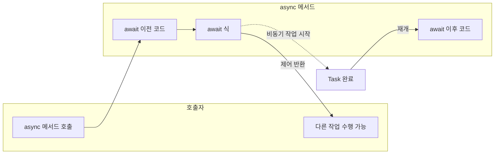

비동기 프로그래밍은 현대 소프트웨어 개발에서 필수 기술입니다. I/O 바인딩 작업(네트워크, 파일, DB)이나 CPU 바인딩 작업을 효율적으로 다루기 위해 C#은 **async**와 **await** 키워드를 통한 언어 수준의 비동기 모델을 제공합니다. 이 모델은 TAP(Task 기반 비동기 패턴)을 따르며, `Task`·`Task<T>`로 비동기 작업을 표현합니다. 이 글에서는 비동기 프로그래밍의 기본 개념, C# 구현 방법, I/O·CPU 바인딩 구분, 실무 시 주의사항까지 정리합니다.

**이 포스트에서 다루는 내용**
- 비동기 프로그래밍 시나리오와 TAP 소개
- 비동기 모델 개요: Task·async·await
- I/O 바인딩·CPU 바인딩 예제와 구분 방법
- 비동기 메서드 작성 규칙과 예외 처리
- Task.WhenAll·WhenAny, ValueTask, ConfigureAwait 등 실무 팁
- 참고 자료 및 정리

|  |
| :--------------------------------------------------------------------------------------------------: |
| Task.WhenAny를 활용한 비동기 아침 식사 예제 개념도 |

## async/await 실행 흐름 개요

`await`를 만나면 호출자에게 제어가 넘어가고, 작업 완료 후 해당 지점부터 재개됩니다. 아래 다이어그램은 그 흐름을 단순화한 것입니다.



---

## 비동기 프로그래밍 시나리오

비동기 프로그래밍은 UI 애플리케이션과 서버 애플리케이션 모두에서 중요합니다. 이 섹션에서는 필요성, 장점, C# 비동기 모델, TAP를 정리합니다.

**비동기 프로그래밍의 필요성**

I/O가 많은 앱(DB 접근, 외부 API 호출 등)에서는 작업 완료를 기다리는 동안에도 앱이 멈추지 않아야 합니다. 비동기 코드를 사용하면 대기 중에도 사용자 입력을 받거나 다른 요청을 처리할 수 있습니다.

**비동기 프로그래밍의 장점**

- **응답성 향상**: UI 스레드가 차단되지 않아 사용자 경험이 좋아집니다.
- **리소스 효율**: 대기 시간 동안 스레드를 놀리지 않고 다른 작업에 쓸 수 있습니다.
- **확장성**: 서버에서 비동기를 쓰면 동일 자원으로 더 많은 요청을 처리할 수 있습니다.

**C#의 비동기 프로그래밍 모델**

C#은 `async`·`await`로 비동기 메서드를 정의하고 호출합니다. 비동기 메서드는 `Task` 또는 `Task<T>`를 반환하며, 이 객체가 “완료될 작업”을 나타냅니다.

**TAP(작업 기반 비동기 패턴) 소개**

TAP는 비동기 작업을 `Task`로 표현하는 .NET 표준 패턴입니다. 다음은 TAP를 사용한 간단한 예제입니다.

```csharp
using System;
using System.Net.Http;
using System.Threading.Tasks;

class Program
{
    static async Task Main(string[] args)
    {
        string url = "https://api.github.com";
        string result = await DownloadStringAsync(url);
        Console.WriteLine(result);
    }

    static async Task<string> DownloadStringAsync(string url)
    {
        using (HttpClient client = new HttpClient())
        {
            client.DefaultRequestHeaders.UserAgent.TryParseAdd("request");
            return await client.GetStringAsync(url);
        }
    }
}
```

`DownloadStringAsync`는 웹에서 내용을 비동기로 가져오고, `await`로 완료될 때까지 기다립니다. 이 동안 호출 스레드는 블로킹되지 않습니다.

---

## 비동기 모델 개요

**비동기 작업의 기본 개념**

비동기 작업은 흐름을 막지 않고 여러 작업을 겹쳐서 진행할 수 있게 합니다. 예: 버튼 클릭 시 서버 요청을 보내고 응답을 기다리는 동안 UI는 계속 반응합니다.

**Task 및 Task\<T\>의 역할**

- `Task`: 결과가 없는 비동기 작업
- `Task<T>`: 타입 `T`의 결과를 반환하는 비동기 작업

```csharp
public async Task<string> DownloadDataAsync(string url)
{
    using (HttpClient client = new HttpClient())
    {
        string result = await client.GetStringAsync(url);
        return result;
    }
}
```

**async와 await 사용**

- `async`: 이 메서드 안에서 `await`를 쓸 수 있음을 표시
- `await`: 해당 비동기 작업이 끝날 때까지 기다리고, 그동안 제어를 호출자에게 넘김

**I/O 바인딩 vs CPU 바인딩**

| 구분 | I/O 바인딩 | CPU 바인딩 |
|------|------------|------------|
| 특징 | 파일·네트워크·DB 등 대기 시간 위주 | CPU 연산 위주 |
| 비동기 이점 | 대기 시 스레드 해제로 효율적 | `Task.Run`으로 별도 스레드에서 실행해 UI 등 블로킹 방지 |
| 예시 | `HttpClient.GetStringAsync`, 파일 읽기 | 복잡한 계산, 이미지 처리 |

비동기 프로그래밍은 특히 I/O 바인딩에서 이득이 크고, CPU 바인딩은 `Task.Run`과 조합해 사용합니다.

---

## 실전 예제

### I/O 바인딩: 웹에서 데이터 다운로드

```csharp
using System;
using System.Net.Http;
using System.Threading.Tasks;

class Program
{
    static async Task Main(string[] args)
    {
        string url = "https://jsonplaceholder.typicode.com/posts";
        string result = await DownloadDataAsync(url);
        Console.WriteLine(result);
    }

    static async Task<string> DownloadDataAsync(string url)
    {
        using (HttpClient client = new HttpClient())
        {
            HttpResponseMessage response = await client.GetAsync(url);
            response.EnsureSuccessStatusCode();
            return await response.Content.ReadAsStringAsync();
        }
    }
}
```

`DownloadDataAsync`는 주어진 URL에서 데이터를 비동기로 받습니다. `await` 때문에 대기 중에도 다른 작업을 수행할 수 있습니다.

### CPU 바인딩: Task.Run으로 백그라운드 실행

CPU를 많이 쓰는 작업은 `Task.Run`으로 스레드 풀에 맡깁니다.

```csharp
using System;
using System.Threading.Tasks;

class Program
{
    static async Task Main(string[] args)
    {
        int number = 100000000;
        long result = await Task.Run(() => CalculateFactorial(number));
        Console.WriteLine($"Factorial of {number} is {result}");
    }

    static long CalculateFactorial(int n)
    {
        if (n == 0) return 1;
        long result = 1;
        for (int i = 1; i <= n; i++)
            result *= i;
        return result;
    }
}
```

### 백그라운드 작업과 CancellationToken

긴 작업을 취소 가능하게 하려면 `CancellationToken`을 사용합니다.

```csharp
using System;
using System.Threading;
using System.Threading.Tasks;

class Program
{
    static async Task Main(string[] args)
    {
        var cts = new CancellationTokenSource();
        var token = cts.Token;

        Task backgroundTask = Task.Run(() => LongRunningOperation(token), token);

        Console.WriteLine("취소하려면 아무 키나 누르세요.");
        Console.ReadKey();
        cts.Cancel();

        try
        {
            await backgroundTask;
        }
        catch (OperationCanceledException)
        {
            Console.WriteLine("작업이 취소되었습니다.");
        }
    }

    static void LongRunningOperation(CancellationToken token)
    {
        for (int i = 0; i < 10; i++)
        {
            token.ThrowIfCancellationRequested();
            Console.WriteLine($"진행 중... {i + 1}");
            Thread.Sleep(1000);
        }
    }
}
```

---

## 이해해야 할 주요 부분

**비동기 코드가 적합한 시나리오**

- 웹·API 요청
- 파일 읽기/쓰기
- DB 쿼리
- 대기 시간이 긴 작업(예: 이미지 처리 대기)

**비동기 메서드 작성 규칙**

1. 반환 타입: `Task` 또는 `Task<T>`
2. 이름: 접미사 `Async` 권장 (예: `GetDataAsync`)
3. 본문에 `await`가 최소 한 번 이상 있어야 비동기 의미가 있음 (없으면 컴파일러 경고)

**비동기 메서드의 예외 처리**

`try-catch`는 동기 메서드와 같이 사용합니다. `await`된 메서드에서 던진 예외는 호출 쪽으로 전파됩니다.

```csharp
public async Task<string> GetDataWithErrorHandlingAsync(string url)
{
    try
    {
        using (HttpClient client = new HttpClient())
            return await client.GetStringAsync(url);
    }
    catch (HttpRequestException e)
    {
        Console.WriteLine($"Request error: {e.Message}");
        return null;
    }
}
```

---

## CPU 바인딩 vs I/O 바인딩 구분

**I/O 바인딩**

- 외부 장치·네트워크·디스크 대기 시간이 큼
- `async`·`await`와 비동기 API(`GetStringAsync`, `ReadAsStringAsync` 등) 사용

**CPU 바인딩**

- 연산·데이터 처리 등 CPU 사용이 큼
- `Task.Run(() => 동기_메서드())`로 스레드 풀에 맡기고 `await`로 기다림

**성능 관련**

- I/O 바인딩: 동기 대기 대신 비동기 대기로 스레드 활용도 향상
- CPU 바인딩: 불필요한 `Task.Run` 남발은 스레드 풀만 부담시킬 수 있으므로, 실제로 UI/응답성을 해치는 구간에만 적용

---

## 추가 예제

### HTML 다운로드 후 문자열 검색

```csharp
static async Task Main(string[] args)
{
    string url = "https://example.com";
    string searchString = "Example Domain";
    string htmlContent = await DownloadHtmlAsync(url);
    bool contains = htmlContent.Contains(searchString);
    Console.WriteLine($"'{searchString}' 포함 여부: {contains}");
}

static async Task<string> DownloadHtmlAsync(string url)
{
    using (HttpClient client = new HttpClient())
        return await client.GetStringAsync(url);
}
```

### 여러 작업 동시 실행: Task.WhenAll

```csharp
string[] urls = { "https://example.com", "https://example.org", "https://example.net" };
Task<string>[] tasks = urls.Select(DownloadHtmlAsync).ToArray();
string[] results = await Task.WhenAll(tasks);
```

### LINQ와 비동기

여러 URL에서 검색하는 경우, **지연 실행** 때문에 `.ToArray()` 또는 `.ToList()`로 한 번에 시작해야 합니다.

```csharp
var results = await Task.WhenAll(urls.Select(url => SearchInHtmlAsync(url, "Example")));
```

---

## 실무 시 유의사항

**비차단 대기**

- `Task.Result`, `Task.Wait()`는 데드락·스레드 낭비를 유발할 수 있음 → 가능하면 `await`만 사용

**ValueTask**

- 결과가 자주 캐시되거나 동기적으로 곧바로 반환되는 경로가 많은 메서드는 `ValueTask<T>`로 힙 할당을 줄일 수 있음

**ConfigureAwait(false)**

- 라이브러리·백엔드 코드처럼 UI 컨텍스트가 필요 없을 때 `await task.ConfigureAwait(false)`를 사용하면 불필요한 포스트백을 줄일 수 있음 (UI 이벤트 핸들러 내부에서는 사용하지 않음)

**async void**

- 이벤트 핸들러 등 호출자가 `Task`를 기다릴 수 없는 경우에만 제한적으로 사용
- 그 외에는 예외가 호출자에게 전달되지 않으므로 `async Task` 사용 권장

---

## 결론

비동기 프로그래밍은 UI 응답성과 서버 확장성을 위해 중요합니다. C#에서는 `async`·`await`와 TAP를 통해 의도를 명확히 표현할 수 있습니다. I/O 바인딩은 비동기 API와 `await`를, CPU 바인딩은 `Task.Run`과 조합하고, `ConfigureAwait`·`ValueTask`·예외 처리 등 실무 팁을 적용하면 더 안정적이고 효율적인 코드를 작성할 수 있습니다.

---

## Reference

- [비동기 프로그래밍 시나리오 - C# \| Microsoft Learn](https://learn.microsoft.com/ko-kr/dotnet/csharp/asynchronous-programming/async-scenarios)
- [async 및 await를 사용한 비동기 프로그래밍 - C# \| Microsoft Learn](https://learn.microsoft.com/ko-kr/dotnet/csharp/asynchronous-programming/)
- [C# async await 예제 코드 #2 - kangworld.tistory.com](https://kangworld.tistory.com/25)
- [C# await - C# 프로그래밍 배우기 (csharpstudy.com)](https://www.csharpstudy.com/CSharp/CSharp-async-await.aspx)
