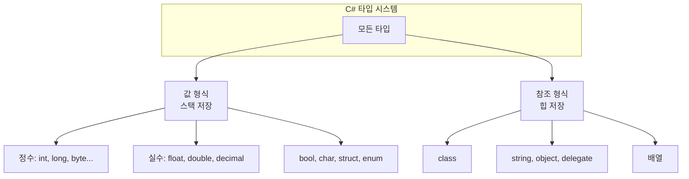

C#은 .NET의 Common Type System(CTS) 위에서 동작하는 강타입 언어다. `int`, `double`, `string` 같은 C# 키워드는 각각 `System.Int32`, `System.Double`, `System.String` 등 .NET 타입으로 매핑되며, 컴파일 시점에 이 타입들로 변환된다. 데이터 타입은 **값 형식(value type)**과 **참조 형식(reference type)**으로 나뉘고, 리터럴 접미사와 Nullable 타입을 통해 표현력과 null 안전성을 높일 수 있다. 이 글에서는 C# 데이터 타입의 구조, 사용법, 변환, 그리고 실무에서 자주 쓰는 패턴까지 정리한다.

## C# 타입 시스템 개요

C#은 변수에 저장할 수 있는 값의 종류를 **데이터 타입**으로 정의하며, 각 타입은 메모리 크기와 표현 범위를 가진다. 기본 제공 타입은 **기본 데이터 타입**과 **사용자 정의 타입**으로 나눌 수 있다.

**기본 데이터 타입**

- **정수형**: `int`, `long`, `short`, `byte`, `sbyte`, `ushort`, `uint`, `ulong`
- **부동소수점형**: `float`, `double`, `decimal`
- **문자형**: `char`
- **불리언형**: `bool`
- **문자열형**: `string`

배열, 리스트, 딕셔너리 등 **컬렉션 타입**도 참조 형식으로 제공되어 다양한 데이터 구조를 다룰 수 있다.

**사용법과 변환**

변수 선언 시 타입을 명시하고 값을 할당한다. 타입 간 변환은 **암시적 변환**(범위가 넓은 쪽으로)과 **명시적 변환(캐스트)**으로 나뉜다. `int` → `double`은 암시적, `double` → `int`는 캐스트가 필요하다.

```csharp
int number = 10;
double pi = 3.14;
int intPi = (int)pi; // 명시적 변환
```

---

## C# 타입 분류 도식

C#의 타입은 값 형식과 참조 형식으로 구분되며, .NET CTS와 1:1로 대응한다. 아래 다이어그램은 이 구조를 요약한다.



- **값 형식**: 변수에 **값 자체**가 들어가며, 대부분 스택에 할당된다. 복사 시 값이 그대로 복사되어 서로 독립적이다.
- **참조 형식**: 변수에는 **인스턴스에 대한 참조(주소)**가 들어가며, 실제 데이터는 힙에 있다. 여러 변수가 같은 인스턴스를 가리킬 수 있다.

---

## C# 값 형식

**정의와 종류**

값 형식은 데이터를 **직접** 저장하는 타입이다. 스택에 할당되며, 변수마다 자신만의 복사본을 가진다. 기본 제공 값 형식에는 다음이 포함된다.

1. **정수형**: `int`, `long`, `short`, `byte`, `sbyte`, `ushort`, `uint`, `ulong`
2. **부동소수점형**: `float`, `double`, `decimal`
3. **불리언형**: `bool`
4. **문자형**: `char`
5. **구조체**: `struct`로 정의하는 사용자 정의 값 형식

**특징**

- **메모리**: 스택에 할당되어 할당·해제가 빠르다.
- **복사**: 변수 간 대입 시 **값이 복사**되므로, 한쪽을 바꿔도 다른 쪽에는 영향이 없다.
- **기본값**: 초기화하지 않으면 정수·실수는 0, `bool`은 false 등 해당 타입의 기본값이 들어간다.
- **Nullable**: `Nullable<T>` 또는 `T?`로 null을 허용할 수 있다.

**예제**

```csharp
using System;

int a = 10;
int b = a;   // 값 복사
b = 20;      // b만 변경

Console.WriteLine($"a: {a}, b: {b}"); // a: 10, b: 20

// 구조체도 값 복사
Point point1 = new Point(1, 2);
Point point2 = point1;
point2.X = 3;

Console.WriteLine($"point1: ({point1.X}, {point1.Y}), point2: ({point2.X}, {point2.Y}");
// point1: (1, 2), point2: (3, 2)
```

```csharp
struct Point
{
    public int X;
    public int Y;
    public Point(int x, int y) { X = x; Y = y; }
}
```

---

## C# 참조 형식

**정의와 종류**

참조 형식은 **객체(인스턴스)에 대한 참조**를 저장한다. 실제 데이터는 힙에 있고, 변수는 그 주소만 갖는다. 주요 참조 형식은 다음과 같다.

1. **클래스(class)**: 속성·메서드를 가진 참조 형식의 기본 단위
2. **배열(Array)**: 같은 타입 요소의 연속
3. **인터페이스(Interface)**: 구현 계약만 정의
4. **델리게이트(Delegate)**: 메서드 참조, 이벤트 등에 사용
5. **기본 제공**: `string`, `object`, `dynamic` 등

**특징**

- **메모리**: 힙에 할당되며, 가비지 컬렉터가 회수한다.
- **공유**: 같은 인스턴스를 가리키는 변수들이 하나의 객체를 공유하므로, 한 변수를 통해 수정하면 다른 변수에서도 같은 변경이 보인다.
- **null**: 참조가 없음을 나타내는 `null`을 가질 수 있다.

**예제**

```csharp
Person person1 = new Person { Name = "Alice" };
Person person2 = person1;   // 같은 객체 참조
person2.Name = "Bob";

Console.WriteLine(person1.Name); // "Bob" — 같은 인스턴스이므로 변경 반영
```

---

## C# 리터럴 데이터

**정의**

리터럴은 소스 코드에 직접 쓴 **고정값**이다. `123`, `true`, `"ABC"`처럼 변수나 상수에 넣거나 식에 사용한다.

**기본 리터럴 타입(접미사 없을 때)**

- `123` → `int`
- `12.3` → `double`
- `"A"` → `string`
- `'a'` → `char`
- `true` / `false` → `bool`

**접미사(Suffix)**

특정 타입을 강하게 지정하려면 리터럴 뒤에 접미사를 붙인다. 대소문자 구분 없다.

| 타입   | 접미사   | 예시        |
|--------|----------|-------------|
| long   | L, l     | 123456789L  |
| uint   | U, u     | 1024U       |
| ulong  | UL, ul 등 | 1024UL      |
| float  | F, f     | 3.14F       |
| double | D, d     | 3.14D 또는 3.14 |
| decimal| M, m     | 3.14M       |

**정수 리터럴 진법**

- 10진수: `42`
- 16진수: `0x2A`
- 2진수: `0b101010` (C# 7.0+)
- 숫자 구분: `1_000_000`

**예제**

```csharp
int decimalLiteral = 100;
int hexLiteral = 0x64;
float floatLiteral = 3.14f;
char charLiteral = 'Z';
string stringLiteral = "Hello, World!";
decimal price = 99.99M;
```

---

## C# 데이터 타입 예제 통합

**기본 타입**

```csharp
int age = 25;
float height = 5.9f;
double weight = 70.5;
char initial = 'A';
bool isStudent = true;
```

**Nullable 타입**

값 형식은 기본적으로 null을 가질 수 없다. `T?` 또는 `Nullable<T>`를 사용하면 null을 허용한다.

```csharp
int? nullableInt = null;
if (nullableInt.HasValue)
    Console.WriteLine(nullableInt.Value);
else
    Console.WriteLine("Value is null");

nullableInt = 10;
Console.WriteLine(nullableInt.Value);
```

**정수 형식**

```csharp
int intValue = 100;
long longValue = 100000L;
short shortValue = 30000;
byte byteValue = 255;
```

---

## 최대값과 최소값

각 숫자 타입은 표현 범위를 가지며, `MaxValue`와 `MinValue`로 조회할 수 있다. 입력 검증이나 오버플로 방지에 유용하다.

- `int`: -2,147,483,648 ~ 2,147,483,647
- `int.MaxValue`, `int.MinValue` 또는 `Int32.MaxValue`, `Int32.MinValue` 사용

```csharp
Console.WriteLine($"Int32 최대: {int.MaxValue}, 최소: {int.MinValue}");
```

```csharp
string input = Console.ReadLine() ?? "";
if (int.TryParse(input, out int number))
{
    if (number >= int.MinValue && number <= int.MaxValue)
        Console.WriteLine("유효한 int 범위입니다.");
    else
        Console.WriteLine("int 범위를 벗어났습니다.");
}
```

---

## NULL과 Nullable Type

**null**

`null`은 “참조가 없다”는 의미다. 참조 형식 변수는 null을 가질 수 있지만, 값 형식은 기본적으로 null을 가질 수 없다.

```csharp
string name = null;
if (name == null)
    Console.WriteLine("이름이 설정되지 않았습니다.");
```

**Nullable Type**

`int?`, `DateTime?`처럼 `?`를 붙이면 해당 값 형식이 null을 허용한다. 데이터베이스의 NULL 컬럼이나 “값 없음”을 표현할 때 사용한다.

```csharp
int? userAge = null;
userAge = int.TryParse(Console.ReadLine(), out int age) ? age : null;

if (userAge.HasValue)
    Console.WriteLine($"나이: {userAge.Value}세");
else
    Console.WriteLine("나이가 설정되지 않았습니다.");
```

**도메인 모델 예**

```csharp
public class User
{
    public string Name { get; set; }
    public int? Age { get; set; }
}

var user = new User { Name = "홍길동", Age = null };
if (user.Age.HasValue)
    Console.WriteLine($"{user.Name}의 나이는 {user.Age.Value}세입니다.");
else
    Console.WriteLine($"{user.Name}의 나이는 미입력입니다.");
```

---

## C# 정수 숫자 형식 요약

| C# 키워드 | .NET 타입   | 비트 | 범위(대표) |
|-----------|-------------|------|------------|
| byte      | System.Byte | 8    | 0 ~ 255    |
| sbyte     | System.SByte| 8   | -128 ~ 127 |
| short     | System.Int16| 16  | -32,768 ~ 32,767 |
| ushort    | System.UInt16| 16 | 0 ~ 65,535 |
| int       | System.Int32| 32  | 약 ±21억   |
| uint      | System.UInt32| 32 | 0 ~ 약 43억 |
| long      | System.Int64| 64  | 약 ±922경  |
| ulong     | System.UInt64| 64 | 0 ~ 약 1844경 |

정수 리터럴은 접미사 없으면 `int` 등으로 해석되고, `L`, `U`, `UL` 등으로 `long`, `uint`, `ulong`을 명시할 수 있다.

---

## 자주 묻는 질문(FAQ)

**Q. C#에서 데이터 타입을 꼭 써야 하나요?**  
C#은 강타입 언어라 변수·반환값의 타입이 정해져 있다. `var`는 컴파일러가 타입을 추론할 뿐, 타입이 없어지는 것은 아니다. 타입을 명시하면 가독성과 컴파일 타임 검사에 유리하다.

**Q. 리터럴 접미사는 왜 쓰나요?**  
실수 리터럴은 접미사 없으면 `double`로 해석된다. `float`나 `decimal`을 쓰려면 `3.14f`, `3.14M`처럼 접미사를 붙여야 타입이 명확해지고 불필요한 변환을 줄일 수 있다.

**Q. Nullable은 언제 쓰나요?**  
DB의 NULL 허용 컬럼, 선택 입력 필드, “값 없음”을 구분해야 하는 경우에 사용한다. `HasValue`/`Value` 또는 null 조건 연산자(`?.`, `??`)로 안전하게 다루면 된다.

**Q. 값 형식과 참조 형식은 메모리에서 어떻게 다르나요?**  
값 형식은 보통 스택에 값 자체가 있고, 참조 형식은 힙에 인스턴스가 있고 변수는 그 참조만 가진다. 따라서 값 형식은 복사 비용이 있고, 참조 형식은 복사가 참조만 복사된다.

---

## 관련 기술

- **.NET / CLR**: C#이 실행되는 런타임. CTS, BCL, 가비지 컬렉션, JIT 컴파일을 제공한다.
- **C# 언어 사양**: 타입 시스템, 연산자, 제네릭 등이 정의된 공식 스펙.
- **Visual Studio / VS Code**: C# 개발용 IDE. IntelliSense, 디버거, 프로파일러로 타입과 메모리 동작을 확인하기 좋다.
- **LINQ**: 컬렉션과 쿼리 시 제네릭 타입·Nullable과 함께 자주 쓰인다.

---

## 결론

C# 데이터 타입은 **값 형식**과 **참조 형식**으로 나뉘며, .NET CTS와 1:1로 대응한다. 값 형식은 스택에 값이 있고 복사 시 독립적이며, 참조 형식은 힙 객체를 가리키고 공유된다. 리터럴 접미사(L, F, M, D 등)로 타입을 명확히 하고, Nullable(`T?`)로 “값 없음”을 안전하게 표현할 수 있다. `MaxValue`/`MinValue`로 범위를 검증하고, 암시적·명시적 변환 규칙을 이해하면 오버플로와 타입 관련 버그를 줄일 수 있다. C#을 제대로 쓰려면 이 타입 시스템을 익히는 것이 필수다.

---

## 참고 문헌

- [기본 제공 형식 - C# 참조 | Microsoft Learn](https://learn.microsoft.com/ko-kr/dotnet/csharp/language-reference/builtin-types/built-in-types)
- [정수 숫자 형식 | Microsoft Learn](https://learn.microsoft.com/ko-kr/dotnet/csharp/language-reference/builtin-types/integral-numeric-types)
- [값 형식 - C# 참조 | Microsoft Learn](https://learn.microsoft.com/ko-kr/dotnet/csharp/language-reference/builtin-types/value-types)
- [참조 형식 - C# 참조 | Microsoft Learn](https://learn.microsoft.com/ko-kr/dotnet/csharp/language-reference/keywords/reference-types)
- [C# 데이타 타입 - C# 프로그래밍 배우기 (csharpstudy.com)](https://www.csharpstudy.com/CSharp/CSharp-datatype.aspx)
