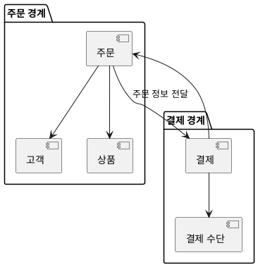

도메인 주도 설계(DDD, Domain Driven Design)는 소프트웨어 개발에서 비즈니스 도메인을 중심으로 설계하는 방법론이다. DDD는 복잡한 시스템을 효과적으로 관리하기 위해 도메인 전문가와 개발자 간의 협업을 강조하며, 이를 통해 소프트웨어의 구조와 언어가 비즈니스 도메인과 일치하도록 한다. DDD의 핵심 목표는 'Loose Coupling'과 'High Cohesion'으로, 이는 각 도메인이 서로 느슨하게 연결되고 높은 응집력을 가지도록 설계하는 것을 의미한다. DDD는 전략적 설계와 전술적 설계로 나뉘며, 전략적 설계는 비즈니스 도메인의 상황에 맞게 설계하는 것을 목표로 하고, 전술적 설계는 구체적인 구현을 위한 설계도를 제공한다. DDD의 중요한 개념 중 하나는 'Ubiquitous Language'로, 이는 도메인 전문가와 개발자 간의 공통 언어를 정의하여 의사소통의 명확성을 높인다. 또한, 'Bounded Context'는 특정 모델이 정의되고 적용될 수 있는 영역을 나타내며, 각 도메인 내에서의 의미를 명확히 한다. DDD는 복잡한 비즈니스 로직을 효과적으로 관리하고, 소프트웨어의 유지보수성을 높이는 데 기여한다. 이러한 DDD의 원칙과 방법론을 통해 개발자들은 비즈니스 요구사항을 보다 잘 반영한 소프트웨어를 설계하고 구현할 수 있다.

||
|:---:|
||

<!--
##### Outline #####
-->

<!--
---
## DDD(도메인 주도 설계)란 무엇인가?
**DDD의 정의와 중요성**
**DDD의 역사적 배경**
**DDD의 핵심 원칙**
**DDD의 목표와 이점**

## 도메인 이해하기
**도메인의 개념**
**비즈니스 도메인과 소프트웨어 도메인**
**도메인 모델링의 필요성**
**도메인 전문가와의 협업**

## DDD의 구성 요소
**Ubiquitous Language(유비쿼터스 언어)**
**Bounded Context(경계가 있는 맥락)**
**Domain Model(도메인 모델)**
**Context Map(맥락 맵)**

## DDD의 설계 방법론
**전략적 설계(Strategic Design)**
**전술적 설계(Tactical Design)**
**Layered Architecture(계층화 아키텍처)**
**Aggregate(집합체)와 Entity(엔티티)**

## DDD의 실용적인 예제
**온라인 쇼핑몰 시스템의 DDD 적용**
**주문 처리 시스템의 도메인 모델링**
**이벤트 스토밍(Event Storming) 기법 활용**
**마이크로서비스 아키텍처와의 통합**

## 자주 묻는 질문(FAQ)
**DDD는 어떤 상황에서 사용해야 하나요?**
**DDD와 전통적인 설계 방법의 차이점은 무엇인가요?**
**DDD를 적용하기 위한 팀 구성은 어떻게 해야 하나요?**
**DDD의 단점은 무엇인가요?**

## 관련 기술
**마이크로서비스 아키텍처**
**이벤트 소싱(Event Sourcing)**
**CQRS(명령 쿼리 책임 분리)**
**도메인 특화 언어(DSL)**

## 결론
**DDD의 핵심 요약**
**DDD의 미래와 발전 방향**
**DDD를 통한 소프트웨어 개발의 변화**

---
-->

<!--
---
## DDD(도메인 주도 설계)란 무엇인가?
**DDD의 정의와 중요성**
**DDD의 역사적 배경**
**DDD의 핵심 원칙**
**DDD의 목표와 이점**
-->

## DDD(도메인 주도 설계)란 무엇인가?

**DDD의 정의와 중요성**  

도메인 주도 설계(DDD, Domain-Driven Design)는 복잡한 소프트웨어 프로젝트를 효과적으로 관리하고 설계하기 위한 접근 방식이다. DDD는 비즈니스 도메인에 대한 깊은 이해를 바탕으로 소프트웨어를 설계하는 것을 목표로 한다. 이를 통해 개발자와 도메인 전문가 간의 원활한 소통을 도모하고, 비즈니스 요구사항을 충족하는 소프트웨어를 개발할 수 있다.

**DDD의 역사적 배경**  

DDD는 에릭 에반스(Eric Evans)가 2003년에 발표한 "Domain-Driven Design: Tackling Complexity in the Heart of Software"라는 책에서 처음 소개되었다. 이 책은 소프트웨어 개발에서 도메인 모델의 중요성을 강조하며, 복잡한 시스템을 효과적으로 설계하는 방법론을 제시하였다. 이후 DDD는 많은 개발자와 기업에서 채택되어 소프트웨어 개발의 표준으로 자리 잡았다.

**DDD의 핵심 원칙**  

DDD의 핵심 원칙은 다음과 같다:

1. **Ubiquitous Language(유비쿼터스 언어)**: 개발자와 도메인 전문가가 공통으로 사용하는 언어를 정의하여 소통의 효율성을 높인다.
2. **Bounded Context(경계가 있는 맥락)**: 시스템의 각 부분이 독립적으로 작동할 수 있도록 경계를 설정하여 복잡성을 줄인다.
3. **Domain Model(도메인 모델)**: 비즈니스 도메인을 모델링하여 소프트웨어의 구조를 정의한다.

**DDD의 목표와 이점**  

DDD의 주요 목표는 비즈니스 요구사항을 충족하는 소프트웨어를 개발하는 것이다. 이를 통해 다음과 같은 이점을 얻을 수 있다:

- 비즈니스와 IT 간의 원활한 소통
- 복잡한 시스템의 관리 용이성
- 유지보수 및 확장성 향상

이와 같은 DDD의 개념과 원칙을 이해하는 것은 소프트웨어 개발에 있어 매우 중요하다. 다음 섹션에서는 도메인에 대한 이해를 더욱 깊이 있게 다루어 보겠다.

<!--
## 도메인 이해하기
**도메인의 개념**
**비즈니스 도메인과 소프트웨어 도메인**
**도메인 모델링의 필요성**
**도메인 전문가와의 협업**
-->

## 도메인 이해하기

**도메인의 개념**  

도메인은 특정 비즈니스나 문제 영역을 의미한다. 소프트웨어 개발에서 도메인은 우리가 해결하고자 하는 문제의 범위와 관련된 모든 요소를 포함한다. 예를 들어, 온라인 쇼핑몰의 도메인은 상품, 주문, 결제, 배송 등 다양한 요소로 구성된다. 도메인을 명확히 이해하는 것은 효과적인 소프트웨어 설계를 위한 첫걸음이다.

**비즈니스 도메인과 소프트웨어 도메인**  

비즈니스 도메인은 실제 비즈니스 환경에서 발생하는 문제와 요구 사항을 포함한다. 반면, 소프트웨어 도메인은 이러한 비즈니스 도메인을 해결하기 위해 설계된 소프트웨어 시스템의 구조와 기능을 의미한다. 두 도메인은 밀접하게 연결되어 있으며, 비즈니스 도메인을 잘 이해해야 소프트웨어 도메인을 효과적으로 설계할 수 있다.

**도메인 모델링의 필요성**  

도메인 모델링은 비즈니스 도메인을 이해하고 이를 소프트웨어로 구현하기 위한 과정이다. 도메인 모델은 비즈니스의 핵심 개념과 그들 간의 관계를 시각적으로 표현한다. 이를 통해 개발자는 비즈니스 요구 사항을 명확히 이해하고, 소프트웨어 설계에 반영할 수 있다. 도메인 모델링은 또한 팀원 간의 커뮤니케이션을 원활하게 하고, 프로젝트의 방향성을 유지하는 데 도움을 준다.

**도메인 전문가와의 협업**  

도메인 전문가와의 협업은 DDD(도메인 주도 설계)의 핵심 요소 중 하나이다. 도메인 전문가는 특정 비즈니스 영역에 대한 깊은 이해를 가지고 있으며, 개발자는 이들의 지식을 활용하여 더 나은 소프트웨어를 설계할 수 있다. 정기적인 회의와 워크숍을 통해 도메인 전문가와의 소통을 강화하고, 유비쿼터스 언어를 사용하여 공통의 이해를 도모하는 것이 중요하다. 

이러한 협업을 통해 개발자는 비즈니스 요구 사항을 정확히 반영한 도메인 모델을 구축할 수 있으며, 이는 최종적으로 소프트웨어의 품질을 높이는 데 기여한다.

<!--
## DDD의 구성 요소
**Ubiquitous Language(유비쿼터스 언어)**
**Bounded Context(경계가 있는 맥락)**
**Domain Model(도메인 모델)**
**Context Map(맥락 맵)**
-->

## DDD의 구성 요소

**Ubiquitous Language(유비쿼터스 언어)**

유비쿼터스 언어는 도메인 전문가와 개발자 간의 원활한 소통을 위해 사용하는 공통 언어이다. 이 언어는 도메인 모델의 모든 요소를 설명하는 데 사용되며, 비즈니스 용어와 기술 용어가 혼합되어 있다. 유비쿼터스 언어를 통해 팀원들은 동일한 개념을 이해하고, 소통의 오류를 줄일 수 있다. 예를 들어, '주문'이라는 용어는 고객이 상품을 구매하는 행위를 의미하며, 개발자는 이 용어를 코드와 문서에서 일관되게 사용해야 한다.

**Bounded Context(경계가 있는 맥락)**

경계가 있는 맥락은 도메인 모델의 특정 부분을 정의하는 경계이다. 각 경계는 독립적으로 관리되며, 서로 다른 경계 간의 상호작용은 명확하게 정의되어야 한다. 예를 들어, '주문'과 '결제'는 서로 다른 경계로 나눌 수 있으며, 각 경계는 자체적인 유비쿼터스 언어와 도메인 모델을 가질 수 있다. 이를 통해 복잡한 시스템을 더 잘 이해하고 관리할 수 있다.

**Domain Model(도메인 모델)**

도메인 모델은 비즈니스 도메인의 개념과 규칙을 표현한 모델이다. 이는 객체 지향 프로그래밍의 개념을 활용하여 도메인의 엔티티, 값 객체, 집합체 등을 정의한다. 도메인 모델은 비즈니스 로직을 구현하는 데 중요한 역할을 하며, 유비쿼터스 언어를 기반으로 구축된다. 예를 들어, '주문' 엔티티는 고객, 상품, 결제 정보 등을 포함할 수 있다.

**Context Map(맥락 맵)**

맥락 맵은 서로 다른 경계가 있는 맥락 간의 관계를 시각적으로 표현한 다이어그램이다. 이를 통해 각 경계의 상호작용과 의존성을 명확히 할 수 있다. 맥락 맵은 팀이 시스템의 구조를 이해하고, 경계 간의 통신을 설계하는 데 도움을 준다. PlantUML을 사용하여 맥락 맵을 그릴 수 있으며, 다음은 간단한 예시이다.

이 다이어그램은 주문 경계와 결제 경계 간의 관계를 보여준다. 각 경계는 독립적으로 관리되며, 필요한 경우에만 상호작용한다. 이를 통해 시스템의 복잡성을 줄이고, 각 경계의 책임을 명확히 할 수 있다.

<!--
## DDD의 설계 방법론
**전략적 설계(Strategic Design)**
**전술적 설계(Tactical Design)**
**Layered Architecture(계층화 아키텍처)**
**Aggregate(집합체)와 Entity(엔티티)**
-->

## DDD의 설계 방법론

**전략적 설계(Strategic Design)**

전략적 설계는 DDD의 핵심 원칙을 기반으로 시스템의 전반적인 아키텍처를 설계하는 과정이다. 이 과정에서는 비즈니스 요구사항을 이해하고, 도메인 전문가와의 협업을 통해 도메인 모델을 정의한다. 전략적 설계의 주요 목표는 비즈니스 도메인을 명확히 이해하고, 이를 소프트웨어 시스템에 효과적으로 반영하는 것이다. 

전략적 설계에서는 다음과 같은 요소들이 중요하다:

- **Bounded Context(경계가 있는 맥락)**: 각 도메인 모델이 독립적으로 작동할 수 있도록 경계를 설정하는 것이다. 이를 통해 서로 다른 도메인 간의 혼란을 방지할 수 있다.
  
- **Ubiquitous Language(유비쿼터스 언어)**: 도메인 전문가와 개발자가 공통으로 사용하는 언어로, 모든 이해관계자가 동일한 언어로 소통할 수 있도록 돕는다.

**전술적 설계(Tactical Design)**

전술적 설계는 전략적 설계에서 정의된 도메인 모델을 실제 코드로 구현하는 과정이다. 이 과정에서는 도메인 모델의 세부 사항을 정의하고, 이를 기반으로 소프트웨어 아키텍처를 설계한다. 전술적 설계의 주요 구성 요소는 다음과 같다:

- **Entity(엔티티)**: 고유한 식별자를 가지며, 상태를 유지하는 객체이다. 엔티티는 도메인 내에서 중요한 비즈니스 개념을 나타낸다.

- **Value Object(값 객체)**: 고유한 식별자를 가지지 않으며, 속성 값으로만 정의되는 객체이다. 값 객체는 불변성을 가지며, 주로 엔티티의 속성으로 사용된다.

- **Aggregate(집합체)**: 관련된 엔티티와 값 객체의 집합으로, 하나의 단위로 관리된다. 집합체는 비즈니스 규칙을 적용하고, 일관성을 유지하는 데 중요한 역할을 한다.

**Layered Architecture(계층화 아키텍처)**

계층화 아키텍처는 소프트웨어 시스템을 여러 계층으로 나누어 설계하는 방법론이다. 각 계층은 특정한 책임을 가지며, 서로 독립적으로 작동할 수 있다. 일반적으로 다음과 같은 계층으로 구성된다:

1. **Presentation Layer(프레젠테이션 계층)**: 사용자 인터페이스와 관련된 모든 요소를 포함한다. 사용자의 입력을 받고, 결과를 표시하는 역할을 한다.

2. **Application Layer(애플리케이션 계층)**: 비즈니스 로직을 처리하고, 도메인 모델과 상호작용하는 계층이다. 이 계층은 사용자의 요청을 처리하고, 필요한 데이터를 도메인 모델에서 가져온다.

3. **Domain Layer(도메인 계층)**: 도메인 모델과 관련된 모든 요소를 포함한다. 비즈니스 규칙과 도메인 로직이 이 계층에 위치한다.

4. **Infrastructure Layer(인프라 계층)**: 데이터베이스, 외부 API 등 시스템의 외부와 상호작용하는 요소를 포함한다. 이 계층은 다른 계층과의 의존성을 최소화하는 것이 중요하다.

**Aggregate(집합체)와 Entity(엔티티)**

집합체와 엔티티는 DDD에서 매우 중요한 개념이다. 집합체는 관련된 엔티티와 값 객체의 그룹으로, 비즈니스 규칙을 적용하고 일관성을 유지하는 역할을 한다. 집합체 내의 엔티티는 서로 밀접하게 연결되어 있으며, 하나의 트랜잭션으로 처리된다.

예를 들어, 온라인 쇼핑몰의 주문 시스템에서 '주문'이라는 집합체는 '주문 항목'이라는 엔티티를 포함할 수 있다. 주문 항목은 각각의 제품을 나타내며, 주문의 상태와 관련된 비즈니스 규칙을 적용받는다. 

이러한 설계 방법론을 통해 DDD는 복잡한 비즈니스 도메인을 효과적으로 모델링하고, 소프트웨어 시스템에 반영할 수 있도록 돕는다. DDD의 설계 방법론은 비즈니스 요구사항을 충족시키는 동시에, 유지보수성과 확장성을 고려한 시스템을 구축하는 데 중요한 역할을 한다.

<!--
## DDD의 실용적인 예제
**온라인 쇼핑몰 시스템의 DDD 적용**
**주문 처리 시스템의 도메인 모델링**
**이벤트 스토밍(Event Storming) 기법 활용**
**마이크로서비스 아키텍처와의 통합**
-->

## DDD의 실용적인 예제

**온라인 쇼핑몰 시스템의 DDD 적용**  

온라인 쇼핑몰 시스템은 다양한 도메인 개념을 포함하고 있다. 고객, 상품, 주문, 결제 등 여러 요소가 상호작용하며, 이러한 요소들을 DDD의 원칙에 따라 모델링하는 것이 중요하다. 예를 들어, 고객은 주문을 생성하고, 주문은 여러 상품을 포함할 수 있으며, 각 상품은 재고와 가격 정보를 가진다. 이러한 관계를 명확히 정의하고, 유비쿼터스 언어를 통해 팀원 간의 소통을 원활하게 하는 것이 DDD의 핵심이다.

**주문 처리 시스템의 도메인 모델링**  

주문 처리 시스템은 DDD의 적용이 특히 유용한 영역이다. 주문은 여러 상태(예: 대기, 처리 중, 완료 등)를 가질 수 있으며, 각 상태에 따라 다른 비즈니스 로직이 적용된다. 이를 위해 주문을 엔티티로 정의하고, 주문의 상태를 관리하는 집합체(Aggregate)를 설계할 수 있다. 예를 들어, 주문 집합체는 주문 항목, 결제 정보, 배송 정보 등을 포함할 수 있으며, 각 항목은 도메인 규칙에 따라 검증된다.

**이벤트 스토밍(Event Storming) 기법 활용**  

이벤트 스토밍은 DDD의 중요한 기법 중 하나로, 도메인 이벤트를 중심으로 시스템을 이해하고 설계하는 방법이다. 팀원들이 함께 모여 도메인 이벤트를 시각적으로 표현하고, 각 이벤트 간의 관계를 파악함으로써 도메인 모델을 구체화할 수 있다. 예를 들어, "주문 생성", "결제 완료", "배송 시작" 등의 이벤트를 정의하고, 이들 간의 흐름을 시각화하여 비즈니스 프로세스를 명확히 할 수 있다.

**마이크로서비스 아키텍처와의 통합**  

DDD는 마이크로서비스 아키텍처와 잘 어울린다. 각 Bounded Context는 독립적인 마이크로서비스로 구현될 수 있으며, 이를 통해 시스템의 모듈성을 높이고, 각 서비스의 독립적인 배포와 확장을 가능하게 한다. 예를 들어, 주문 서비스, 결제 서비스, 배송 서비스 등을 각각의 마이크로서비스로 나누어 구현할 수 있으며, 이들 간의 통신은 API를 통해 이루어진다. DDD의 원칙을 적용하여 각 서비스의 도메인 모델을 명확히 정의하고, 서비스 간의 경계를 명확히 하는 것이 중요하다. 

이와 같은 DDD의 실용적인 예제들은 실제 비즈니스 환경에서의 복잡한 문제를 해결하는 데 큰 도움이 된다. DDD를 통해 도메인을 명확히 이해하고, 이를 기반으로 소프트웨어를 설계함으로써, 더 나은 품질의 시스템을 구축할 수 있다.

<!--
## 자주 묻는 질문(FAQ)
**DDD는 어떤 상황에서 사용해야 하나요?**
**DDD와 전통적인 설계 방법의 차이점은 무엇인가요?**
**DDD를 적용하기 위한 팀 구성은 어떻게 해야 하나요?**
**DDD의 단점은 무엇인가요?**
-->

## 자주 묻는 질문(FAQ)

**DDD는 어떤 상황에서 사용해야 하나요?**

DDD(도메인 주도 설계)는 복잡한 비즈니스 도메인을 다루는 소프트웨어 개발에 적합하다. 특히, 도메인이 복잡하고 다양한 비즈니스 규칙이 존재하는 경우 DDD를 통해 도메인을 명확히 이해하고 모델링할 수 있다. 또한, 팀 내에서 도메인 전문가와의 협업이 중요한 경우 DDD의 유비쿼터스 언어를 통해 효과적인 소통이 가능하다. 따라서, DDD는 복잡한 비즈니스 로직을 가진 시스템에서 그 진가를 발휘한다.

**DDD와 전통적인 설계 방법의 차이점은 무엇인가요?**

전통적인 설계 방법은 주로 기술적인 관점에서 시스템을 설계하는 반면, DDD는 비즈니스 도메인에 초점을 맞춘다. DDD는 도메인 모델을 중심으로 시스템을 설계하며, 도메인 전문가와의 협업을 통해 비즈니스 요구사항을 명확히 반영한다. 또한, DDD는 경계가 있는 맥락(Bounded Context)을 통해 시스템의 복잡성을 관리하고, 각 맥락에 맞는 모델을 설계할 수 있도록 돕는다. 이러한 점에서 DDD는 비즈니스와 기술의 간극을 줄이는 데 기여한다.

**DDD를 적용하기 위한 팀 구성은 어떻게 해야 하나요?**

DDD를 성공적으로 적용하기 위해서는 다양한 역할을 가진 팀이 필요하다. 우선, 도메인 전문가가 팀에 포함되어야 하며, 이들은 비즈니스 요구사항을 명확히 이해하고 전달하는 역할을 한다. 또한, 소프트웨어 개발자와 아키텍트가 함께 협력하여 도메인 모델을 설계하고 구현해야 한다. 이 외에도 QA 엔지니어와 DevOps 엔지니어가 포함되어야 하며, 이들은 시스템의 품질과 배포를 책임진다. 팀원 간의 원활한 소통과 협업이 DDD의 성공적인 적용에 필수적이다.

**DDD의 단점은 무엇인가요?**

DDD는 많은 장점을 가지고 있지만, 몇 가지 단점도 존재한다. 첫째, DDD를 적용하기 위해서는 도메인에 대한 깊은 이해가 필요하므로 초기 학습 곡선이 가파를 수 있다. 둘째, DDD는 복잡한 도메인 모델을 요구하므로, 단순한 시스템에는 과도한 설계가 될 수 있다. 셋째, 팀 내에서 도메인 전문가와의 협업이 원활하지 않으면 DDD의 효과를 제대로 발휘하기 어려울 수 있다. 이러한 단점들을 고려하여 DDD를 적용할 필요가 있다.

<!--
## 관련 기술
**마이크로서비스 아키텍처**
**이벤트 소싱(Event Sourcing)**
**CQRS(명령 쿼리 책임 분리)**
**도메인 특화 언어(DSL)**
-->

## 관련 기술

**마이크로서비스 아키텍처**  

마이크로서비스 아키텍처는 소프트웨어 개발에서 애플리케이션을 여러 개의 작은 서비스로 나누어 개발하는 방법론이다. 각 서비스는 독립적으로 배포 및 확장 가능하며, 서로 다른 기술 스택을 사용할 수 있다. DDD와 마이크로서비스는 서로 잘 어울리며, DDD의 경계가 있는 맥락(Bounded Context)을 마이크로서비스의 경계로 활용할 수 있다. 이를 통해 각 서비스는 특정 도메인에 집중할 수 있으며, 비즈니스 요구사항에 맞게 독립적으로 발전할 수 있다.

**이벤트 소싱(Event Sourcing)**  

이벤트 소싱은 애플리케이션의 상태를 데이터베이스에 저장하는 대신, 상태 변화의 이벤트를 저장하는 패턴이다. 이 방식은 데이터의 변경 이력을 완벽하게 추적할 수 있게 해주며, 시스템의 복원력을 높인다. DDD와 함께 사용될 때, 도메인 이벤트를 통해 비즈니스 로직의 흐름을 명확히 하고, 시스템의 상태를 쉽게 재구성할 수 있다. 이벤트 소싱은 특히 복잡한 비즈니스 로직을 가진 시스템에서 유용하다.

**CQRS(명령 쿼리 책임 분리)**  

CQRS는 명령(Command)과 쿼리(Query)를 분리하여 처리하는 아키텍처 패턴이다. 이 패턴은 데이터의 읽기와 쓰기를 분리하여 각 작업에 최적화된 모델을 사용할 수 있게 해준다. DDD와 CQRS는 함께 사용될 때, 도메인 모델을 명확히 하고, 비즈니스 로직을 더 잘 표현할 수 있다. CQRS는 특히 대규모 시스템에서 성능을 향상시키고, 복잡한 비즈니스 요구사항을 처리하는 데 유리하다.

**도메인 특화 언어(DSL)**  

도메인 특화 언어는 특정 도메인에 맞춰 설계된 프로그래밍 언어 또는 언어의 변형이다. DSL은 도메인 전문가와 개발자 간의 의사소통을 원활하게 하고, 도메인 모델을 더 쉽게 표현할 수 있게 해준다. DDD에서는 DSL을 사용하여 유비쿼터스 언어를 정의하고, 도메인 모델을 명확히 할 수 있다. 이를 통해 비즈니스 요구사항을 코드로 쉽게 변환할 수 있으며, 시스템의 유지보수성을 높일 수 있다.

--- 

이와 같은 기술들은 DDD를 효과적으로 구현하는 데 중요한 역할을 하며, 각 기술의 특성을 이해하고 적절히 활용하는 것이 소프트웨어 개발의 성공에 기여할 수 있다.

<!--
## 결론
**DDD의 핵심 요약**
**DDD의 미래와 발전 방향**
**DDD를 통한 소프트웨어 개발의 변화**
-->

## 결론

**DDD의 핵심 요약**  

도메인 주도 설계(DDD)는 소프트웨어 개발에서 비즈니스 도메인을 중심으로 설계하는 접근 방식이다. DDD는 복잡한 도메인을 이해하고, 이를 효과적으로 모델링하여 소프트웨어 시스템을 구축하는 데 도움을 준다. DDD의 핵심 원칙은 유비쿼터스 언어, 경계가 있는 맥락, 도메인 모델링 등으로, 이러한 원칙들은 개발자와 도메인 전문가 간의 원활한 소통을 가능하게 한다. DDD를 통해 소프트웨어의 품질을 높이고, 유지보수성을 향상시키며, 비즈니스 요구사항에 더 잘 부합하는 시스템을 구축할 수 있다.

**DDD의 미래와 발전 방향**  

DDD는 현재 소프트웨어 개발 분야에서 점점 더 많은 관심을 받고 있으며, 특히 마이크로서비스 아키텍처와의 결합이 두드러진다. 앞으로 DDD는 인공지능, 머신러닝, 클라우드 네이티브 애플리케이션 등과 같은 최신 기술과 통합되어 더욱 발전할 것으로 예상된다. 또한, DDD의 개념이 다양한 산업 분야로 확장되면서, 비즈니스 도메인에 대한 이해가 더욱 중요해질 것이다. 이러한 변화는 개발자와 비즈니스 전문가 간의 협업을 더욱 촉진할 것이며, DDD의 적용 범위가 넓어질 것이다.

**DDD를 통한 소프트웨어 개발의 변화**  

DDD는 소프트웨어 개발의 패러다임을 변화시키고 있다. 전통적인 개발 방법론에서는 기술적인 측면이 우선시되었으나, DDD는 비즈니스 도메인을 중심으로 소프트웨어를 설계하도록 유도한다. 이는 개발자들이 비즈니스 요구사항을 더 잘 이해하고, 이를 반영한 시스템을 구축할 수 있도록 한다. DDD를 통해 소프트웨어 개발은 단순한 코드 작성에서 벗어나, 비즈니스 가치를 창출하는 방향으로 나아가고 있다. 이러한 변화는 소프트웨어의 품질을 높이고, 고객의 요구에 더 잘 부응하는 시스템을 만드는 데 기여하고 있다. 

이와 같은 DDD의 원칙과 접근 방식은 앞으로도 소프트웨어 개발의 중요한 기초가 될 것이며, 개발자와 비즈니스 전문가 간의 협업을 통해 더욱 발전할 것이다.

<!--
##### Reference #####
-->

## Reference

* [https://happycloud-lee.tistory.com/94](https://happycloud-lee.tistory.com/94)
* [https://en.wikipedia.org/wiki/Domain-driven_design](https://en.wikipedia.org/wiki/Domain-driven_design)
* [https://steemit.com/kr/@frontalnh/domain-driven-design](https://steemit.com/kr/@frontalnh/domain-driven-design)
* [https://blog.naver.com/PostView.naver?blogId=seek316&logNo=222710251462](https://blog.naver.com/PostView.naver?blogId=seek316&logNo=222710251462)
* [https://incheol-jung.gitbook.io/docs/q-and-a/architecture/ddd](https://incheol-jung.gitbook.io/docs/q-and-a/architecture/ddd)
* [https://tech.kakao.com/posts/555](https://tech.kakao.com/posts/555)

