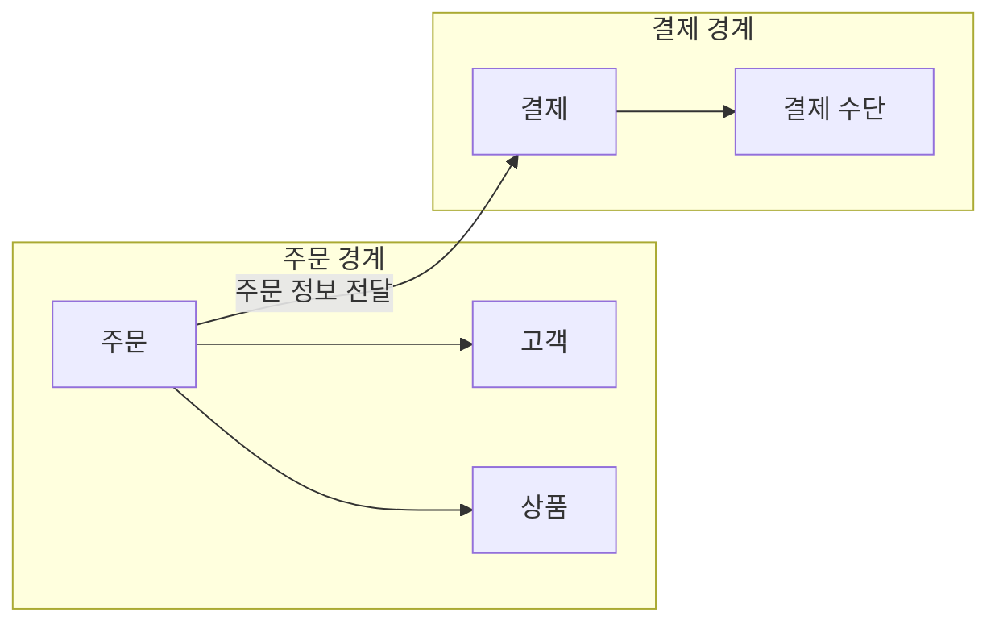
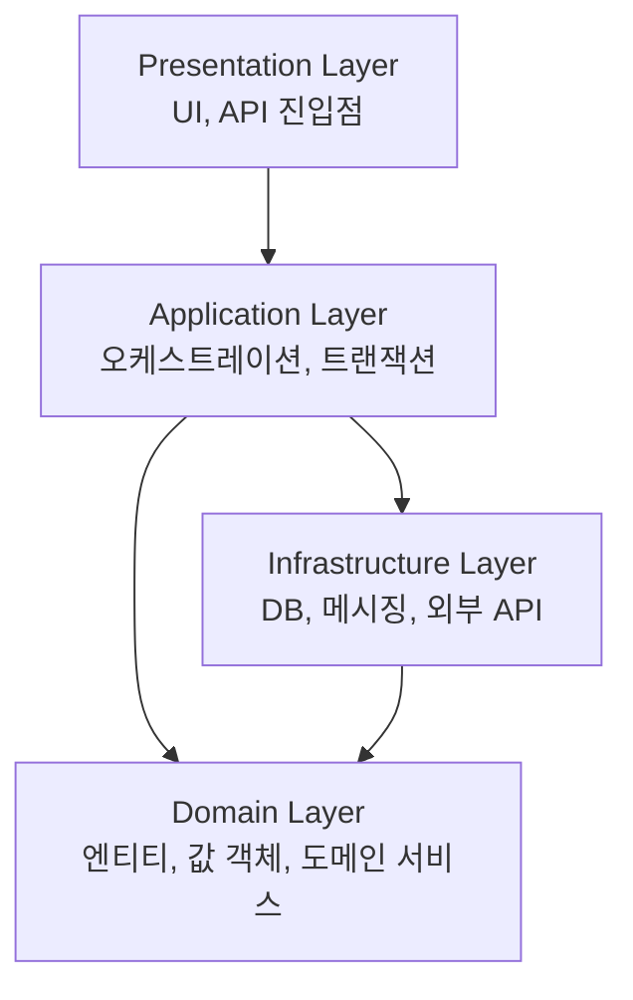

도메인 주도 설계(Domain-Driven Design, DDD)는 복잡한 비즈니스 도메인을 소프트웨어로 잘 반영하기 위한 설계 방법론이다. 비즈니스와 IT가 같은 언어로 소통하고, 도메인 규칙이 코드 구조에 드러나도록 하는 것이 목표다. 이 글에서는 DDD의 정의·역사·핵심 구성 요소·전략·전술 설계·실무 예시·FAQ·관련 기술을 정리한다.

---

## DDD(도메인 주도 설계)란 무엇인가?

### DDD의 정의와 중요성

도메인 주도 설계(DDD)는 **비즈니스 도메인을 중심으로** 소프트웨어를 설계하는 접근이다. 코드의 구조와 이름(클래스, 메서드, 모듈)이 도메인 전문가가 쓰는 용어와 맞아떨어지도록 하고, 도메인 규칙이 한곳에 모여 유지보수와 확장이 쉬워지게 한다. 복잡한 요구사항이 많은 시스템일수록 DDD의 이점이 크다.

### DDD의 역사적 배경

DDD는 에릭 에반스(Eric Evans)가 2003년에 낸 책 《Domain-Driven Design: Tackling Complexity in the Heart of Software》에서 정리된 개념이다. 당시 많은 프로젝트가 DB·UI 중심으로 설계되면서 비즈니스 규칙이 여러 계층에 흩어지고, 도메인 전문가와 개발자 간 소통이 어려운 문제가 있었다. DDD는 “도메인 모델을 설계의 중심에 두자”는 대안을 제시했고, 이후 마이크로서비스·이벤트 드리븐 아키텍처와 함께 널리 쓰이게 되었다.

### DDD의 핵심 원칙

1. **유비쿼터스 언어(Ubiquitous Language)**  
   도메인 전문가와 개발자가 **같은 단어**를 같은 의미로 쓰도록 한다. 문서·대화·코드에서 동일한 용어를 사용해 오해를 줄인다.

2. **바운디드 컨텍스트(Bounded Context)**  
   모델이 적용되는 **명확한 경계**를 둔다. 한 경계 안에서는 한 가지 일관된 모델과 언어가 적용되고, 경계 밖과는 잘 정의된 방식으로만 소통한다.

3. **도메인 모델(Domain Model)**  
   비즈니스 규칙과 개념을 객체·값·집합체 등으로 표현한 **설계의 중심**이다. DB 스키마나 API 스펙에 끌려다니지 않고, 도메인 모델이 먼저 설계된다.

### DDD의 목표와 이점

- **Loose Coupling(낮은 결합도)**: 바운디드 컨텍스트·계층·모듈 간 의존을 최소화한다.
- **High Cohesion(높은 응집도)**: 관련된 비즈니스 규칙과 데이터를 한곳에 모은다.
- **비즈니스와 IT 소통 개선**: 유비쿼터스 언어로 요구사항과 구현의 간극을 줄인다.
- **유지보수·확장 용이**: 도메인이 바뀔 때 수정 범위가 명확해진다.

---

## 도메인 이해하기

### 도메인의 개념

**도메인**이란 “이 소프트웨어가 다루는 문제 영역”이다. 온라인 쇼핑이라면 상품·재고·주문·결제·배송이 도메인에 속하고, 대출 시스템이라면 신청·심사·계약·상환 등이 도메인이다. 도메인을 제대로 나누고 이름 붙이는 것이 DDD의 출발점이다.

### 비즈니스 도메인과 소프트웨어 도메인

- **비즈니스 도메인**: 실제 업무 규칙·프로세스·정책이 살아 있는 영역이다.
- **소프트웨어 도메인**: 그 비즈니스 도메인을 코드와 모델로 옮긴 것이다.

DDD는 비즈니스 도메인을 먼저 이해한 뒤, 그에 맞춰 소프트웨어 도메인(모델·서비스·경계)을 설계하라고 한다. 기술 스택보다 “무슨 일이 일어나는가”에 초점을 맞추는 것이다.

### 도메인 모델링의 필요성

도메인 모델링은 도메인을 **개념·규칙·관계**로 정리하는 작업이다. 모델이 없으면 요구사항이 문서·회의·코드 곳곳에 흩어져 있고, 변경 시 영향 범위를 파악하기 어렵다. 잘 만든 도메인 모델은 “비즈니스가 어떻게 돌아가는지”를 코드만 봐도 이해할 수 있게 한다.

### 도메인 전문가와의 협업

DDD는 도메인 전문가(기획·운영·업무 담당자)와 개발자가 **함께** 모델을 다듬는 것을 전제로 한다. 이벤트 스토밍·워크숍·정기 리뷰를 통해 용어와 규칙을 맞추고, 유비쿼터스 언어를 만들어 나간다. 한쪽만 알아서 정한 모델은 현실과 어긋나기 쉽다.

---

## DDD의 구성 요소

### Ubiquitous Language(유비쿼터스 언어)

팀 전체가 **동일한 의미**로 쓰는 공용 언어다. “주문”, “결제 완료”, “배송 지연” 같은 말을 문서·코드·API에서 그대로 쓴다. 같은 단어가 팀마다 다른 뜻으로 쓰이면, 바운디드 컨텍스트를 나누거나 용어를 구체화해서 정리한다.

### Bounded Context(경계가 있는 맥락)

**Bounded Context**는 “이 모델과 언어가 적용되는 범위”를 말한다. 예를 들어 “고객”이 영업 컨텍스트에서는 선호도·연락처가 중요하고, 정산 컨텍스트에서는 결제 수단·청구 주소가 중요할 수 있다. 컨텍스트마다 모델을 다르게 두고, 경계를 넘을 때는 이벤트·API·ACL 등으로 명시적으로 연결한다.

### Domain Model(도메인 모델)

도메인 모델은 엔티티·값 객체·집합체·도메인 서비스 등으로 구성된다. “주문은 배송 전에만 취소할 수 있다”, “할인 금액은 상품 단가와 수량으로 계산한다” 같은 규칙이 모델 안에 들어가고, 인프라·UI는 이 모델을 사용하는 쪽에 위치한다.

### Context Map(맥락 맵)

**Context Map**은 바운디드 컨텍스트 간 **관계**를 나타낸다. 누가 누구에게 데이터를 주고, 동기/비동기인지, ACL(Anti-Corruption Layer)이 필요한지 등을 그린다. 아래는 주문·결제 경계를 단순화한 맥락 맵이다.

```mermaid
flowchart LR
  subgraph orderContext["주문 경계"]
    order["주문"]
    customer["고객"]
    product["상품"]
    order --> customer
    order --> product
  end

  subgraph paymentContext["결제 경계"]
    payment["결제"]
    paymentMethod["결제 수단"]
    payment --> paymentMethod
  end

  order -->|"주문 정보 전달"| payment
```

각 경계는 독립된 모델과 책임을 가지며, 필요한 경우에만 정해진 계약으로 연동한다.

---

## DDD의 설계 방법론

### 전략적 설계(Strategic Design)

**전략적 설계**는 “무엇을 어떤 경계로 나눌지”를 결정하는 단계다. 서브도메인 식별(Core / Supporting / Generic), 바운디드 컨텍스트 경계, 컨텍스트 맵이 여기서 나온다. 도메인 전문가와 함께 이벤트 스토밍 등을 하면서 도메인 이벤트·액터·정책을 끌어내고, 그 결과로 Bounded Context를 정한다.

### 전술적 설계(Tactical Design)

**전술적 설계**는 각 바운디드 컨텍스트 **안**에서 쓰는 구체적인 패턴이다. 엔티티·값 객체·집합체(Aggregate)·리포지토리·팩토리·도메인 서비스 등을 어떻게 나눌지, 트랜잭션 경계를 어디에 둘지 등을 다룬다.

### Layered Architecture(계층화 아키텍처)

DDD에서 자주 쓰는 계층 구조는 다음과 같다. 의존 방향은 **항상 안쪽(도메인)** 으로만 흐르도록 한다.

```mermaid
flowchart TB
  presentation["Presentation Layer</br>UI, API 진입점"]
  application["Application Layer</br>오케스트레이션, 트랜잭션"]
  domain["Domain Layer</br>엔티티, 값 객체, 도메인 서비스"]
  infrastructure["Infrastructure Layer</br>DB, 메시징, 외부 API"]
  presentation --> application
  application --> domain
  application --> infrastructure
  infrastructure --> domain
```

- **Presentation**: HTTP·CLI·메시지 수신 등 사용자/시스템과의 접점.
- **Application**: 유스케이스 흐름 제어, 트랜잭션 경계. 비즈니스 규칙은 도메인에 위임.
- **Domain**: 핵심 비즈니스 규칙과 모델. 외부 기술에 의존하지 않음.
- **Infrastructure**: DB·메시지 브로커·외부 서비스 연동. 도메인 인터페이스를 구현.

### Aggregate(집합체)와 Entity(엔티티)

- **Entity**: 식별자로 구분되는 객체. 생명 주기 동안 상태가 바뀐다.
- **Value Object**: 식별자 없이 속성만으로 구분되는 불변 객체. 금액·주소·기간 등.
- **Aggregate**: 일관성 경계 단위. **Aggregate Root** 하나와 그 아래 엔티티·값 객체로 구성되며, 외부에서는 Root만 참조한다. 한 트랜잭션에서는 보통 한 Aggregate만 변경하는 것을 권장한다.

예: 주문 Aggregate는 “주문(Root)” + “주문 항목” 등으로 이루어지고, 주문 취소·배송지 변경 같은 변경은 모두 Root를 통해 이뤄진다.

---

## DDD의 실용적인 예제

### 온라인 쇼핑몰 시스템의 DDD 적용

쇼핑몰에서는 상품·재고·주문·결제·배송을 각각 바운디드 컨텍스트로 나눌 수 있다. “주문” 컨텍스트는 주문 생성·취소·상태 변경을 담당하고, “결제” 컨텍스트는 결제 요청·완료/실패만 다룬다. 주문 쪽에서 “결제 완료” 도메인 이벤트를 발행하면, 결제 컨텍스트는 그 이벤트를 구독해 자신의 모델을 갱신하는 식으로 연동할 수 있다.

### 주문 처리 시스템의 도메인 모델링

주문은 “장바구니 확정 → 결제 대기 → 결제 완료 → 배송 준비 → 배송 중 → 완료” 같은 상태를 가질 수 있다. 주문 Aggregate가 상태 전이 규칙(예: “결제 완료된 주문만 배송 준비 가능”)을 갖고, 외부에서는 “주문 취소”, “결제 완료 처리” 같은 명령만 보낸다. 이렇게 하면 주문 관련 규칙이 한곳에 모여 테스트와 변경이 쉬워진다.

### 이벤트 스토밍(Event Storming) 기법 활용

이벤트 스토밍은 도메인 이벤트를 포스트잇으로 쭉 나열한 뒤, 시간 순서로 붙이고 액터·명령·정책·외부 시스템을 붙여 가며 바운디드 컨텍스트와 Aggregate 경계를 찾는 워크숍 기법이다. “주문 생성됨”, “결제 완료됨”, “배송 시작됨” 같은 이벤트를 중심으로 이야기를 만들면, 팀이 도메인을 공유하고 설계에 반영하기 수월해진다.

### 마이크로서비스 아키텍처와의 통합

바운디드 컨텍스트는 마이크로서비스 경계와 잘 맞는다. 컨텍스트당 서비스 하나를 두거나, 한 컨텍스트를 여러 서비스로 나누는 식으로 매핑한다. 서비스 간에는 도메인 이벤트·API·메시지 큐를 사용하고, 다른 컨텍스트의 모델을 그대로 들여오지 않고 ACL로 변환해 쓴다. DDD의 전략적 설계(경계·맥락 맵)가 마이크로서비스 경계 설계의 기초가 된다.

---

## 자주 묻는 질문(FAQ)

**Q. DDD는 어떤 상황에서 사용해야 하나요?**

복잡한 비즈니스 규칙이 많고, 도메인 전문가와 소통이 중요한 프로젝트에 적합하다. 규칙이 단순하고 CRUD 위주라면 DDD는 과할 수 있다.

**Q. DDD와 전통적인 설계 방법의 차이점은 무엇인가요?**

전통적 방식은 DB·기술 스택을 먼저 정하고 그에 맞춰 로직을 나누는 경우가 많다. DDD는 도메인 모델을 먼저 세우고, 바운디드 컨텍스트로 경계를 나눈 뒤, 그에 맞춰 계층·서비스·저장소를 설계한다. 비즈니스 언어와 코드 구조가 맞닿아 있다는 점이 다르다.

**Q. DDD를 적용하기 위한 팀 구성은 어떻게 해야 하나요?**

도메인 전문가(기획·운영·업무 담당자)가 참여할 수 있어야 하고, 개발자·아키텍트가 이들과 함께 모델과 용어를 정리하는 시간이 필요하다. QA·DevOps도 컨텍스트 경계와 배포 단위를 이해하고 있으면 협업이 수월하다.

**Q. DDD의 단점은 무엇인가요?**

학습 비용이 있고, 단순한 시스템에는 설계가 무거울 수 있다. 도메인 전문가 참여가 어렵거나 팀이 작으면 유비쿼터스 언어와 경계를 유지하기 힘들 수 있다. 복잡도에 비해 이득이 크지 않다면 전술적 패턴만 선택적으로 쓰는 것도 방법이다.

---

## 관련 기술

### 마이크로서비스 아키텍처

마이크로서비스는 서비스를 작은 단위로 쪼개 독립 배포·확장하는 방식이다. DDD의 바운디드 컨텍스트를 서비스 경계로 쓰면, “무엇을 나눌지”를 도메인 기준으로 결정할 수 있어 설계가 안정적이다.

### 이벤트 소싱(Event Sourcing)

상태를 덮어쓰는 대신 **발생한 이벤트**를 저장하고, 필요 시 재생해서 상태를 만든다. DDD의 도메인 이벤트와 잘 맞고, Aggregate 단위로 이벤트를 쌓으면 감사·재현·시간 여행 조회가 쉬워진다.

### CQRS(명령 쿼리 책임 분리)

쓰기(명령)와 읽기(쿼리)를 모델·저장소까지 분리하는 패턴이다. DDD의 Aggregate는 명령 쪽에서 일관성을 지키고, 쿼리 쪽은 읽기 최적화된 뷰를 두는 식으로 조합할 수 있다.

### 도메인 특화 언어(DSL)

도메인 규칙을 코드보다 비즈니스에 가까운 형태로 표현하는 것이다. DDD의 유비쿼터스 언어를 DSL로 옮기면, 도메인 전문가가 규칙을 읽거나 검토하기 쉬워진다.

---

## 결론

- **DDD**는 비즈니스 도메인을 설계의 중심에 두고, 유비쿼터스 언어·바운디드 컨텍스트·도메인 모델로 복잡도를 다스리는 방법론이다.
- **전략적 설계**로 경계와 맥락 맵을 정하고, **전술적 설계**로 엔티티·값 객체·집합체·리포지토리 등을 설계한다.
- 마이크로서비스·이벤트 소싱·CQRS와 함께 쓰면, 도메인 경계를 명확히 하면서 확장 가능한 시스템을 만들 수 있다.
- 도메인 전문가와의 협업과 지속적인 모델 개선이 DDD 성공의 전제다.

---

## Reference

- [Domain-driven design - Wikipedia](https://en.wikipedia.org/wiki/Domain-driven_design)
- [DDD 핵심만 빠르게 이해하기 - Happy@Cloud (티스토리)](https://happycloud-lee.tistory.com/94)
- [추천팀의 DDD 도입기 - 카카오테크](https://tech.kakao.com/posts/555)
- [도메인 주도 설계(DDD) 개념 - 네이버 블로그 (seek)](https://blog.naver.com/PostView.naver?blogId=seek316&logNo=222710251462)
- [Domain Driven Design 이란 무엇인가 - Steemit](https://steemit.com/kr/@frontalnh/domain-driven-design)
