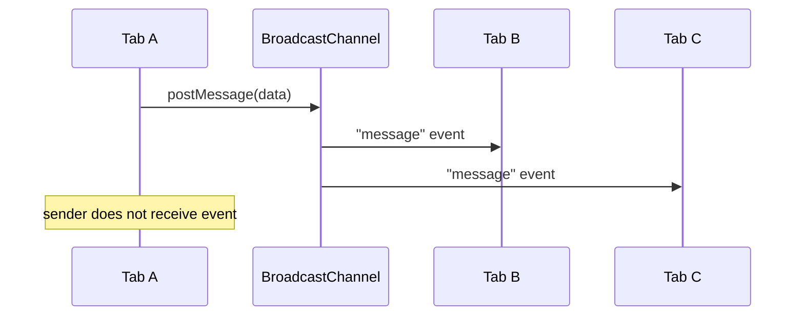
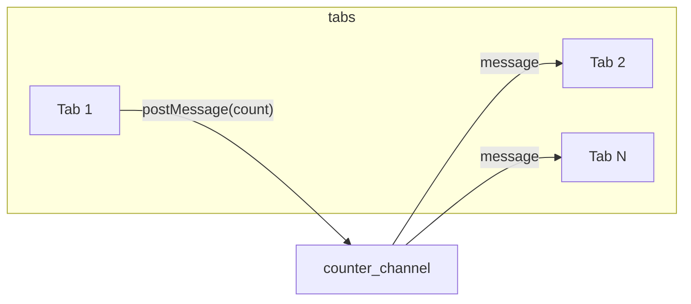

현대 웹 애플리케이션에서는 탭, 창, iframe 등 서로 다른 **브라우징 컨텍스트** 간에 데이터를 맞춰야 하는 요구가 많다. 한 탭에서 로그아웃하면 다른 탭에서도 세션이 반영되어야 하고, 테마나 설정을 바꾸면 열려 있는 모든 창에 곧바로 적용되는 것이 좋다. **Broadcast Channel API**는 같은 출처(origin) 안에 있는 이러한 컨텍스트들 사이에 별도 서버 없이 실시간으로 메시지를 주고받을 수 있게 해주는 Web API다. 이 글에서는 Broadcast Channel API의 정의와 동작 방식, 실전 예제, 한계와 판단 기준, 관련 기술까지 체계적으로 다룬다.

## Broadcast Channel API 개요

### 정의와 필요성

**Broadcast Channel API**는 동일 출처의 여러 브라우징 컨텍스트(탭, 창, 프레임, iframe, Web Worker)가 **이름이 같은 채널**에 참여해 메시지를 보내고 받을 수 있게 하는 메시징 API다. `window.postMessage`처럼 특정 창이나 프레임에 대한 참조를 유지할 필요 없이, 채널 이름만 맞추면 누구나 구독·발행할 수 있어 구현이 단순하다.

한 출처에서 여러 탭·창을 쓰는 경우, 상태나 설정을 맞추려면 보통 서버를 경유하거나 `localStorage` 이벤트에 의존하게 된다. Broadcast Channel API는 같은 출처 내에서만 동작하지만, **실시간**으로 작은 메시지를 여러 컨텍스트에 한 번에 전달하는 데 적합하다. 따라서 탭 간 설정 동기화, 다중 탭 알림, 간단한 협업 상태 공유 등에 잘 맞는다.

### 장점과 사용 사례

이 API의 장점은 다음과 같다. 첫째, **사용이 단순하다.** 생성자에 채널 이름을 넘기고 `postMessage`로 보내고 `onmessage`로 받으면 된다. 둘째, **참조 관리가 필요 없다.** 특정 `window`나 iframe을 알 필요 없이 채널 이름만 맞추면 된다. 셋째, **낮은 지연**으로 같은 출처 내 브로드캐스트가 가능하다.

사용 사례에는 탭·창 간 **테마·언어·설정 동기화**, **다중 탭에서의 로그인·로그아웃 알림**, **간단한 실시간 협업 상태**(예: 좋아요 수 갱신), **같은 탭 그룹 내 알림** 등이 있다. 대량 스트리밍이나 서버와의 양방향 통신이 필요하면 WebSocket 등 다른 수단을 쓰는 것이 맞다.

## 작동 원리

### 채널 생성

채널은 **이름**으로 구분된다. 같은 이름으로 `BroadcastChannel` 인스턴스를 만들면 그 채널에 참여하며, 처음 생성되는 이름이면 채널이 만들어지고, 이미 있으면 해당 채널에 구독한다.

```javascript
const channel = new BroadcastChannel('my_channel');
```

`'my_channel'`은 임의의 문자열이다. 다른 탭·스크립트에서도 동일한 이름으로 인스턴스를 만들면 같은 채널을 공유한다. 생성 후 곧바로 `postMessage`로 보내고 `onmessage`로 받을 수 있다.

### 메시지 수신

다른 컨텍스트에서 보낸 메시지는 **message** 이벤트로 전달된다. `onmessage`에 콜백을 넣거나 `addEventListener('message', ...)`로 수신한다.

```javascript
channel.onmessage = (event) => {
  console.log('Received message:', event.data);
};
```

`event.data`에는 **Structured Clone Algorithm**으로 직렬화된 수신 데이터가 들어 있다. 문자열, 숫자, 일반 객체 등 직렬화 가능한 타입을 그대로 주고받을 수 있다. 참고로 **메시지를 보낸 쪽에는 message 이벤트가 발생하지 않는다.** 즉, 자신이 보낸 메시지는 자신에게는 오지 않는다.

### 메시지 전송

`postMessage` 메서드로 채널에 데이터를 보내면, 같은 채널을 구독한 **다른** 모든 컨텍스트에 메시지가 전달된다.

```javascript
channel.postMessage('Hello from another tab!');
```

전송이 끝나면 더 이상 그 채널을 쓰지 않을 때 `channel.close()`로 채널을 닫아 두는 것이 좋다. 닫힌 인스턴스는 메시지를 보내거나 받지 않으며, 가비지 컬렉션 대상이 된다.

### 메시지 흐름 다이어그램

탭 A에서 메시지를 보내면, 같은 채널을 구독한 탭 B·C만 수신하는 구조는 아래 Mermaid 시퀀스로 요약할 수 있다.



규칙상 노드 ID는 camelCase·PascalCase를 쓰고, 이벤트 이름처럼 고정 문자열은 `"message"`처럼 큰따옴표로 감쌌다.

## 실용적인 예제

### 탭 간 테마 동기화

한 탭에서 라이트/다크 테마를 바꾸면 다른 탭에도 바로 반영되게 하려면, 테마 변경 시 채널로 테마 이름을 보내고, 모든 탭에서 `onmessage`로 받아 `document.body.className` 등을 갱신하면 된다.

아래 코드는 채널을 하나 만들고, 테마 변경 시 해당 채널로 테마 값을 보낸 뒤, 수신 측에서 동일한 테마를 적용하는 흐름이다.

```javascript
const channel = new BroadcastChannel('theme_channel');

function changeTheme(theme) {
  document.body.className = theme;
  channel.postMessage(theme);
}

channel.onmessage = (event) => {
  changeTheme(event.data);
};

document.getElementById('light-theme').onclick = () => changeTheme('light');
document.getElementById('dark-theme').onclick = () => changeTheme('dark');
```

각 탭은 동일한 `theme_channel`에 참여하므로, 한 탭에서 버튼을 누르면 나머지 탭에서도 `changeTheme(event.data)`가 호출되어 테마가 맞춰진다.

### 카운터 애플리케이션(다중 탭 동기화)

여러 탭에서 공유하는 카운터를 만들 때, 한 탭에서 증가/감소하면 다른 탭의 숫자도 같이 바뀌게 하려면 카운터 값을 채널로 브로드캐스트하면 된다.



노드 ID는 공백 없이 사용했고, 엣지 라벨에 메서드·이벤트 이름이 있으므로 큰따옴표로 감쌌다.

```javascript
let count = 0;
const channel = new BroadcastChannel('counter_channel');

function updateCounter() {
  document.getElementById('counter').innerText = count;
  channel.postMessage(count);
}

channel.onmessage = (event) => {
  count = event.data;
  updateCounter();
};

document.getElementById('increment').onclick = () => {
  count++;
  updateCounter();
};
document.getElementById('decrement').onclick = () => {
  count--;
  updateCounter();
};
```

한 탭에서 증감 시 `updateCounter()`가 호출되면서 `postMessage(count)`가 실행되고, 다른 탭들은 `onmessage`에서 `count`를 갱신한 뒤 UI를 다시 그린다.

### React에서의 사용

React에서는 채널을 `useEffect` 안에서 생성하고, 클린업에서 `channel.close()`를 호출해 언마운트 시 채널을 닫는 패턴이 안전하다. 채널 인스턴스를 `useRef`에 넣어 두면 리렌더 시에도 동일한 채널로 `postMessage`를 호출할 수 있다. 아래는 카운터를 탭 간 동기화하는 최소 예제다.

```javascript
import React, { useEffect, useRef, useState } from 'react';

const Counter = () => {
  const [count, setCount] = useState(0);
  const channelRef = useRef(null);

  useEffect(() => {
    const channel = new BroadcastChannel('counter_channel');
    channelRef.current = channel;
    channel.onmessage = (event) => setCount(event.data);
    return () => {
      channel.close();
      channelRef.current = null;
    };
  }, []);

  const increment = () => {
    const next = count + 1;
    setCount(next);
    channelRef.current?.postMessage(next);
  };
  const decrement = () => {
    const next = count - 1;
    setCount(next);
    channelRef.current?.postMessage(next);
  };

  return (
    <div>
      <h1>Count: {count}</h1>
      <button onClick={increment}>Increment</button>
      <button onClick={decrement}>Decrement</button>
    </div>
  );
};

export default Counter;
```

채널을 `useEffect` 안에서만 만들고 `useRef`로 참조하면, 마운트당 하나의 채널만 생성·해제되므로 리소스 관리가 명확해진다.

## 한계와 트레이드오프

### 동일 출처 제한

Broadcast Channel API는 **동일 출처(same origin)** 안에서만 동작한다. 프로토콜·호스트·포트가 같아야 하며, 서브도메인이 다르면(예: `a.example.com`과 `b.example.com`) 서로 통신할 수 없다. 이는 보안을 위한 설계이지만, 여러 서브도메인에 걸친 동기화가 필요하면 서버를 경유하거나 `postMessage` 등 다른 수단을 고려해야 한다.

또한 브라우저에 따라 **storage partition**으로 인해, 같은 출처라도 top-level 사이트가 다르면(예: `a.com` 페이지의 `b.com` iframe과 `b.com` 단독 탭) 통신이 안 될 수 있다. MDN의 [Broadcast Channel API](https://developer.mozilla.org/en-US/docs/Web/API/Broadcast_Channel_API) 문서에서 storage partitioning 설명을 참고하는 것이 좋다.

### 대량 데이터와 브라우저 호환성

이 API는 **작은 메시지**를 같은 출처의 여러 컨텍스트에 빠르게 전달하는 용도에 맞다. 대용량 데이터나 고빈도 전송에는 적합하지 않으며, 그런 경우 WebSocket, Fetch, SharedWorker 등이 더 낫다.

브라우저 지원은 2022년 전후로 주요 브라우저에서 널리 사용 가능해졌다. 구형 브라우저나 일부 환경에서는 지원하지 않으므로, [caniuse.com](https://caniuse.com/broadcastchannel)으로 타깃 환경을 확인하고 필요 시 `localStorage` + `storage` 이벤트나 [pubkey/broadcast-channel](https://github.com/pubkey/broadcast-channel) 같은 폴리필을 검토할 수 있다.

### 언제 쓰고 언제 피할지

| 상황 | 권장 |
|------|------|
| 같은 출처의 여러 탭·창에서 설정·테마·작은 상태 동기화 | Broadcast Channel 적합 |
| 서버와의 양방향 실시간 통신, 대량 스트리밍 | WebSocket 등 사용 |
| 서로 다른 출처(도메인/서브도메인) 간 통신 | postMessage 또는 서버 경유 |
| 구형 브라우저 필수 지원 | 폴리필 또는 storage 이벤트 등 대안 |
| 민감한 데이터를 채널로 전달 | 동일 출처 내 모든 스크립트가 수신 가능하므로 암호화·최소 전송 고려 |

이 표는 문단으로 서술한 한계와 트레이드오프를 한눈에 정리한 것이다. 실제 선택 시에는 요구사항(출처, 데이터 크기, 빈도, 지원 브라우저)에 따라 판단하면 된다.

## 자주 묻는 질문

**Q. Broadcast Channel API는 어떤 상황에서 쓰는 것이 좋나요?**  
동일 출처의 여러 탭·창·iframe에서 작은 메시지로 상태를 맞추거나 알림을 줄 때 적합합니다. 테마·언어·로그인 상태, 다중 탭 알림, 간단한 협업 상태 등이 대표적입니다.

**Q. 다른 메시징 API와의 차이는 무엇인가요?**  
**window.postMessage**는 다른 출처와도 통신할 수 있지만, 대상 `window` 참조가 필요하고 1:1에 가깝습니다. **Channel Messaging API**(MessageChannel)는 1:1 통신용입니다. Broadcast Channel은 **같은 출처 내 1:N** 브로드캐스트에 특화되어 있어, 탭·창 여러 개에 동일 메시지를 보낼 때 구현이 단순합니다.

**Q. 보안상 주의할 점은?**  
동일 출처 내의 모든 스크립트가 같은 채널 이름만 알면 수신할 수 있으므로, 비밀번호나 토큰 같은 민감 정보는 채널로 보내지 말고, 필요한 최소 정보만 전달하는 것이 좋습니다.

## 관련 기술

**WebSocket**은 서버와 클라이언트 간 양방향 실시간 통신용이다. 서버를 거쳐야 하므로, 단순히 같은 출처의 탭들만 동기화할 때는 Broadcast Channel이 더 단순하다.

**Service Worker**는 오프라인 캐시·푸시 알림 등에 쓰이며, Service Worker와 페이지 간 통신에도 메시징이 필요할 수 있다. 그 경우 Broadcast Channel을 보조 수단으로 쓸 수 있다.

**Local Storage**와 **storage** 이벤트는 탭 간에 저장소 변경을 알리는 용도로 쓸 수 있지만, 이벤트가 **발생한 탭을 제외한** 다른 탭에만 전달되고, payload가 없어 어떤 값으로 바뀌었는지는 스토리지를 다시 읽어야 한다. 반면 Broadcast Channel은 전달할 데이터를 직접 담을 수 있어, “지금 이 값으로 맞춰라” 같은 동기화에 더 직관적이다.

## 결론 및 적용 체크리스트

**Broadcast Channel API**는 동일 출처의 탭·창·iframe·Worker 간에 채널 이름 하나로 메시지를 브로드캐스트할 수 있는 단순한 API다. 참조 관리가 필요 없고 사용법이 직관적이라, 테마·설정·작은 상태의 다중 탭 동기화에 잘 맞는다. 대신 동일 출처 제한, 대량 데이터 비적합, 구형 브라우저 미지원 같은 한계가 있으므로, “같은 출처 + 작은 메시지 + 다중 컨텍스트”일 때 선택하는 것이 좋다.

### 이 글을 읽은 후 할 수 있게 될 것

- Broadcast Channel API가 해결하는 문제(동일 출처 내 다중 컨텍스트 실시간 동기화)를 설명할 수 있다.
- `BroadcastChannel` 생성, `postMessage`·`onmessage`·`close()`를 사용해 탭 간 메시지를 주고받을 수 있다.
- “탭 간 동기화가 필요하다”는 요구가 있을 때, 동일 출처·작은 메시지이면 Broadcast Channel을, 서버 통신·대량 데이터면 WebSocket 등 다른 수단을 선택할 수 있다.
- 동일 출처 제한, 발신자는 수신하지 않음, storage partition 등 주의사항을 고려해 설계할 수 있다.

### 적용 전 체크리스트

- [ ] 통신 대상이 모두 **동일 출처**인가?
- [ ] 전달하는 데이터가 **작은 메시지** 수준인가? (대량이면 WebSocket 등 검토)
- [ ] 타깃 브라우저가 Broadcast Channel을 지원하는가? (미지원 시 폴리필 또는 대안)
- [ ] 민감 정보는 채널로 보내지 않고, 필요한 최소 정보만 전달하는가?
- [ ] React 등 프레임워크 사용 시, 언마운트 시 `channel.close()`로 정리하는가?

## Reference

- [Broadcast Channel API - MDN](https://developer.mozilla.org/en-US/docs/Web/API/Broadcast_Channel_API)
- [BroadcastChannel interface - MDN](https://developer.mozilla.org/en-US/docs/Web/API/BroadcastChannel)
- [How to Use the Broadcast Channel API for Real-Time Communication Across Browser Windows - DEV Community](https://dev.to/rigalpatel001/how-to-use-the-broadcast-channel-api-for-real-time-communication-across-browser-windows-23if)
- [BroadcastChannel API란? - dev-record-levelup.tistory.com](https://dev-record-levelup.tistory.com/6)
- [웹뷰 액티비티간 데이터 동기화하기 - 카카오스타일 블로그](https://devblog.kakaostyle.com/ko/2022-10-12-1-sync-data-between-activities/)
- [Broadcast Channel API - idleday.tistory.com](https://idleday.tistory.com/93)
