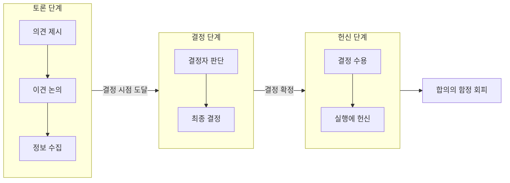

**Disagree and Commit**(이견을 제시하고 헌신하라)은 조직에서 결정이 내려지기 전에는 이견을 자유롭게 제시하고, 결정이 내려진 뒤에는 모두가 그 결정을 따르며 실행에 헌신하는 경영 원칙이다. 합의가 이루어지지 않아 행동이 멈추는 **합의의 함정(consensus trap)**을 피하고, 신속한 의사결정과 일관된 실행력을 동시에 확보하기 위한 방법으로 널리 쓰인다. 이 글에서는 이 원칙의 정의, 기원, 적용 흐름, 실무 활용, FAQ, 관련 기술, 참고 문헌을 정리한다.

---

## 서론

### 관리 원칙의 중요성

현대 조직에서는 효과적인 관리 원칙이 필수적이다. 이러한 원칙은 팀 협업을 촉진하고, 의사결정을 원활하게 하며, 조직 목표 달성을 지원한다. 특히 **Disagree and Commit**은 다양한 의견을 존중하면서도 최종 결정을 내린 뒤 하나의 방향으로 나아가도록 이끈다. 조직의 유연성과 혁신성을 높이는 데 기여한다.

### Disagree and Commit의 정의

**Disagree and Commit**은 “의견이 다를 때에도 최종 결정에 따라 행동하겠다”는 의지를 담은 원칙이다. 팀원이 자유롭게 이견을 제시할 수 있도록 하되, 최종 결정이 나면 모두가 그 결정을 지지하고 실행에 최선을 다한다. 팀 결속력을 높이고, 각자의 의견이 존중받는 환경을 만든다.

### 이 원칙의 역사적 배경

이 원칙은 Amazon 창립자 Jeff Bezos의 강조로 널리 알려졌지만, 그 이전부터 여러 기업에서 사용되었다. Scott McNealy(Sun Microsystems), Andrew Grove(Intel) 등이 조직 차원에서 체계적으로 활용했고, Amazon은 2010년대 초반 “Have Backbone; Disagree and Commit”을 리더십 원칙으로 추가했다. 결정 과정에서의 이견 수렴과 결정 후 일치된 실행의 중요성을 강조한다.

### 이 원칙의 필요성

조직 안에 다양한 의견이 있는 것은 자연스럽다. 그러나 이견이 결정을 지연시키거나 실행 단계에서 불일치로 이어질 수 있다. Disagree and Commit은 “토론 단계에서는 적극적으로 이견을 내고, 결정 후에는 함께 헌신한다”는 명확한 규칙을 제공해, 목표 달성을 위한 일관된 행동을 이끌어 낸다.

---

## 원칙의 기원

### Scott McNealy의 기여

**Scott McNealy**는 Sun Microsystems의 공동 창립자로, 이 원칙을 조직에 체계적으로 적용한 인물 중 한 명이다. 1983년에서 1991년 사이에 **“Agree and commit, disagree and commit, or get out of the way”**(합의하고 헌신하라, 이견을 제시하고 헌신하라, 아니면 길을 비켜라)라는 문구로 정리했다. 팀원이 서로 다른 의견을 가질 수 있음을 인정하면서도, 최종 결정 이후에는 모두가 그 결정을 지지하고 실행해야 한다고 강조했다.

### Andrew Grove와 Intel의 역할

**Andrew Grove**는 Intel CEO로서 이 원칙을 더욱 발전시켰다. 의사결정 과정의 갈등을 두려워하지 않고, 이를 통해 더 나은 결정을 내릴 수 있다고 보았다. Grove는 팀원이 각자 의견을 자유롭게 표현하는 환경을 만들었고, “회의실을 나온 뒤에는 결정된 방향에 전적으로 헌신한다”는 원칙을 확립했다. Intel의 기술 혁신과 빠른 실행에 기여한 문화적 토대가 되었다.

### Amazon의 채택

Amazon은 **Disagree and Commit**을 리더십 원칙의 하나로 삼고 있다. “Have Backbone; Disagree and Commit”이라는 이름으로, 리더는 불편하거나 지치는 상황에서도 의견이 다르면 정중하게 도전할 의무가 있으며, 결정이 내려진 후에는 전적으로 헌신한다고 명시한다. Jeff Bezos는 2016년 주주 서한 등에서 이 원칙이 조직 성공에 필수라고 여러 차례 강조했다.

### Jeff Bezos의 언급

Bezos는 이 원칙을 통해 팀원이 서로 다른 의견을 제시할 수 있는 환경을 만드는 것이 중요하다고 했다. 최종 결정이 내려진 뒤에는 모든 팀원이 그 결정을 지지하고 실행해야 한다는 점을 반복해 강조했다. Amazon의 혁신 문화와 신속한 의사결정은 이런 원칙 위에 서 있다.

---

## 원칙 적용 흐름

Disagree and Commit이 의사결정 과정에서 어떻게 작동하는지 다음 흐름으로 요약할 수 있다.

- **토론 단계**: 의견과 이견을 자유롭게 제시하고 논의하며 정보를 모은다.
- **결정 단계**: 결정 권한이 있는 사람이 판단하고 최종 결정을 내린다.
- **헌신 단계**: 결정을 수용하고, 이견이 있었더라도 실행에 전적으로 헌신한다.

이렇게 단계를 나누어 두면 “결정 전에는 적극적으로 disagree, 결정 후에는 commit”이라는 규칙이 명확해진다.

---

## 원칙의 적용

### 조직 내에서의 활용

Disagree and Commit은 회의·기획·프로젝트 방향 설정 등 다양한 상황에서 쓰인다. 팀원이 특정 방향에 반대 의견을 제시하면, 그 의견을 경청하고 논의한 뒤 최종 결정을 내린다. 결정이 나면 반대했던 사람도 포함해 모두가 그 방향을 지지하고 실행한다. 이 과정이 반복될수록 팀 결속력과 신뢰가 쌓인다.

### 의사결정 과정에서의 역할

의사결정 단계에서 이 원칙은 “다양한 관점을 듣되, 결정 후에는 한 방향으로 간다”는 규칙을 제공한다. 예를 들어 프로젝트 방향을 정할 때 각자 의견을 내고 논의한 후, 최종 결정이 나면 자신의 의견이 반영되지 않았더라도 그 결정에 맞춰 행동한다. 이를 통해 결정의 질을 높이면서도 실행 단계의 일관성을 유지할 수 있다.

### 팀워크와 협업의 증진

이견을 존중하고 결정 후에는 함께 헌신하는 과정에서 팀원 간 신뢰가 강화된다. 한쪽이 반대 의견을 냈을 때 다른 쪽이 경청하고 논의하는 것이 norm이 되면, 팀워크와 협업이 자연스럽게 좋아진다. 최종적으로 모두가 같은 방향으로 움직일 때 목표에 대한 공동 책임감도 커진다.

### 리더십 원칙으로서의 가치

리더는 팀원이 안전하게 이견을 제시할 수 있는 분위기를 만들고, 결정 시에는 그 의견을 충분히 반영해 검토해야 한다. 결정이 나면 리더 자신을 포함해 모두가 그 결정에 헌신하도록 이끈다. 리더가 이 원칙을 일관되게 적용하면 팀은 리더의 결정을 더 신뢰하고, 목표를 함께 달성하려는 동기가 강해진다.

---

## 실용적인 예시

### 기술 기업에서의 사례

기술 기업에서는 제품·아키텍처·우선순위를 두고 이견이 자주 발생한다. 여러 의견을 수렴한 뒤 한 가지 방향으로 결정하고, 결정 후에는 모든 팀원이 그 방향으로 실행하는 문화가 Disagree and Commit에 해당한다. **Stripe**는 운영 원칙 중 하나로 “Disagree and commit”을 명시하고, 토론은 격렬히 하되 결정 후에는 하나의 팀으로 움직이도록 하고 있다. **Netflix** 역시 “disagree then commit”을 강조하며, 결정이 나면 반대했던 사람도 그 결과를 성공적으로 이끌도록 기대한다.

### 스타트업에서의 적용

스타트업은 자원과 시간이 제한적이라 결정과 실행의 속도가 중요하다. 팀원 간 배경과 경험이 달라 의견 충돌이 잦을 수 있지만, 각자 의견을 낸 뒤 한 가지 방향으로 정하고 모두가 그 방향으로 실행하는 것이 필수적이다. 한 스타트업이 제품 아이디어를 두고 논쟁한 뒤 한 안으로 모으고, 전원이 그 안을 실행하기로 한 사례처럼, “이견 제시 → 결정 → 헌신”이 반복되면 팀 사기와 실행력이 함께 올라간다.

### 대기업에서의 성공 사례

대기업에서도 이 원칙이 널리 쓰인다. **Intel**, **Amazon** 외에 **GitLab**, **Zalando**, **Chef** 등이 조직 가치 또는 운영 원칙에 “Disagree and commit”을 포함하고 있다. 제품·프로세스·전략을 두고 다양한 의견을 수렴한 뒤, 최종 결정에 따라 전 조직이 일관되게 움직이는 데 이 원칙이 기여한다.

### 비영리·다양한 조직에서의 활용

비영리·공공·교육 조직처럼 이해관계자가 다양한 곳에서도, “결정 전에는 이견을 내고, 결정 후에는 함께 실행한다”는 규칙은 유효하다. 프로젝트 방향을 정할 때 각자의 의견을 듣고 논의한 뒤 한 방향으로 결정하고, 모든 참여자가 그 방향으로 헌신하면 프로젝트 성공 가능성과 구성원 만족도가 함께 높아진다.

---

## 자주 묻는 질문

**Disagree and Commit의 장점은 무엇인가요?**

팀원이 이견을 자유롭게 제시할 수 있는 환경이 만들어지고, 다양한 관점이 반영된 더 나은 결정을 내릴 수 있다. 동시에 결정이 나면 모두가 그 결정에 헌신하므로 실행 단계의 일관성과 효율이 높아진다. 갈등을 건설적으로 다루고 팀 결속력을 강화하는 데도 도움이 된다.

**이 원칙을 어떻게 효과적으로 적용할 수 있나요?**

먼저 팀 내에 “이견을 말해도 불이익이 없다”는 안전한 소통 환경이 있어야 한다. 의사결정 과정에 필요한 사람이 참여하도록 하고, 결정이 내려진 뒤에는 그 내용을 명확히 전달한 다음 모두가 그에 맞춰 행동하도록 기대한다. 정기 회의와 피드백 세션으로 의견을 수렴하고 결정 사항을 공유하는 것이 중요하다.

**이 원칙이 잘 작동하지 않는 경우는 어떤 경우인가요?**

팀원 간 신뢰가 부족하거나, 이견을 내는 사람이 불이익을 받는다고 느끼면 원칙이 형식적으로만 남을 수 있다. 결정 후에도 불만을 품고 실행을 소극적으로 하면 실행력이 떨어진다. 따라서 신뢰와 존중이 바탕이 되어야 이 원칙이 제대로 작동한다.

**조직 문화에 미치는 영향은 무엇인가요?**

이견을 존중하고 결정 후에는 함께 헌신하는 문화가 자리 잡으면, 협업이 활발해지고 혁신적인 아이디어가 나오기 쉬워진다. 구성원이 “우리 방향”에 대해 일관되게 노력하게 되어 조직 성과와 효율이 개선된다.

---

## 관련 기술·방법론

### 애자일 방법론

애자일은 유연성과 적응성을 강조하며, 짧은 주기로 피드백을 받고 결정을 조정한다. Disagree and Commit은 스프린트·기획 회의 등에서 “토론은 열린 채로, 결정 후에는 팀이 한 방향으로 commit”하는 방식과 잘 맞는다. 팀원이 이견을 내고 논의한 뒤 스프린트 목표나 백로그 우선순위를 정하고, 정해진 내용에 모두가 헌신하면 협업과 실행력이 함께 좋아진다.

### 팀 관리·협업 도구

Asana, Trello, Jira 등은 태스크·일정·결정 사항을 공유하는 플랫폼을 제공한다. 회의에서 “disagree and commit”으로 내린 결정을 이런 도구에 명확히 기록하고, 실행 단계에서 모두가 같은 정보를 보며 행동하도록 하면 원칙의 적용이 수월해진다.

### 의사결정 지원과 조직 문화

의사결정 지원 시스템(DSS)이나 데이터 기반 논의는 “어떤 선택이 합리적인가”에 대한 정보를 채워 준다. Disagree and Commit은 “누가 최종 결정을 내리든, 결정 전에는 이견과 정보를 충분히 수렴하고, 결정 후에는 함께 실행한다”는 행동 규칙을 제공한다. 피드백 설문·문화 진단 등 조직 문화 개선 도구와 결합하면, 이견을 말하기 쉬운 환경과 결정·헌신의 일관성을 함께 점검할 수 있다.

---

## 결론

**Disagree and Commit**은 조직의 의사결정 갈등을 관리하는 실용적인 원칙이다. 토론 단계에서는 이견을 적극적으로 제시하고, 결정이 나면 반대 의견이 있었던 사람까지 포함해 모두가 그 결정을 지지하고 실행에 헌신한다. 이를 통해 합의의 함정을 피하고, 실행력과 팀워크를 동시에 높일 수 있다.

빠르게 변하는 비즈니스 환경에서는 다양한 의견을 수렴한 뒤에도 신속하게 결정하고 일관되게 실행하는 것이 경쟁력의 핵심이다. Disagree and Commit은 “이견 제시 → 결정 → 헌신”이라는 명확한 규칙을 제공해, 조직의 혁신과 실행력을 뒷받침한다. 앞으로도 다양한 배경의 구성원이 함께 일하는 조직일수록, 이 원칙은 의사결정과 실행의 질을 높이는 필수 요소로 자리 잡을 것이다.

---

## 참고 문헌 및 출처

- [Disagree and commit — Wikipedia](https://en.wikipedia.org/wiki/Disagree_and_commit)
- [Stripe's Operating Principles — Stripe](https://stripe.com/jobs/culture)
- [Netflix Culture — Careers at Netflix](https://jobs.netflix.com/culture)
