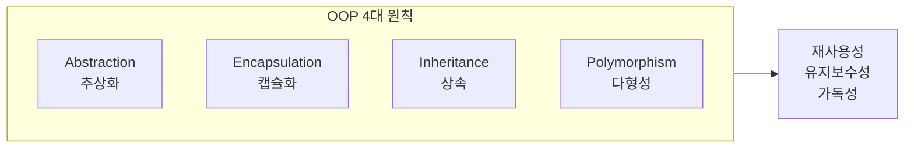
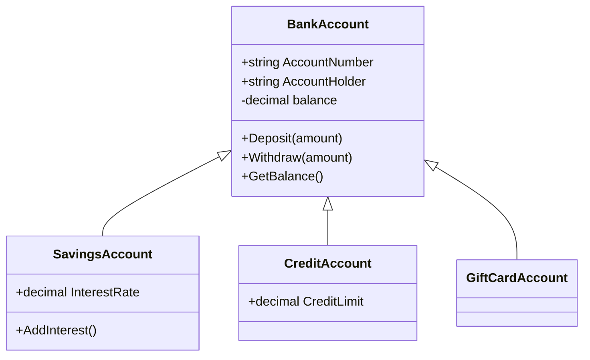

C#은 객체 지향 프로그래밍 언어로, 소프트웨어 개발에 있어 강력한 도구이다. 객체 지향 프로그래밍(OOP)의 네 가지 기본 원칙인 **추상화**, **캡슐화**, **상속**, **다형성**을 통해 개발자는 코드의 재사용성과 유지보수성을 높일 수 있다. 이 문서에서는 C#을 사용하여 OOP의 개념을 실습하는 방법을 다룬다. 특히, `BankAccount` 클래스를 기반으로 다양한 계좌 유형을 생성하고, 각 계좌의 특성에 맞는 기능을 추가하는 과정을 통해 상속과 다형성을 활용하는 방법을 설명한다. C#의 객체 지향 프로그래밍을 통해 복잡한 시스템을 효과적으로 설계하고 구현하는 방법을 익힐 수 있다.

## 이 문서에서 다루는 내용

- 객체 지향 프로그래밍의 네 가지 기본 원칙(추상화, 캡슐화, 상속, 다형성)
- C#의 클래스·객체·접근 제한자·인터페이스·예외 처리
- 클래스 정의, 객체 생성, 상속과 다형성·인터페이스 활용 실습
- 은행 계좌 계층(BankAccount, SavingsAccount, CreditAccount, GiftCardAccount) 실용 예제
- FAQ, 관련 기술(.NET, Unity, Java·Python과의 비교), 참고 자료

---

## OOP 네 가지 원칙 개요

객체 지향 프로그래밍의 핵심은 아래 네 가지 원칙으로 정리할 수 있다. C#은 이 네 가지를 언어 수준에서 잘 지원한다.



- **추상화(Abstraction)**: 복잡한 시스템을 필요한 특성만 남겨 단순화한다. 공통 인터페이스나 추상 클래스로 계약을 정의한다.
- **캡슐화(Encapsulation)**: 객체의 내부 상태와 구현을 숨기고, 공개된 메서드로만 접근하게 한다. 데이터 무결성과 변경 영향 범위 축소에 기여한다.
- **상속(Inheritance)**: 기존 클래스의 멤버를 물려받아 새 타입을 정의한다. 공통 코드 재사용과 계층 구조 설계에 사용한다.
- **다형성(Polymorphism)**: 같은 메시지(메서드 호출)에 대해 타입별로 다른 동작을 하도록 한다. 오버로딩·오버라이딩·인터페이스 구현으로 실현한다.

---

## 객체 지향 프로그래밍의 기본 원칙

### 추상화

추상화는 복잡한 시스템을 단순화하는 과정이다. 객체의 중요한 특성만 강조하고 불필요한 세부 사항은 숨긴다. 예를 들어, 자동차라는 객체에서는 속도, 연료, 엔진 상태 같은 속성만 다루고, 엔진 내부의 복잡한 기계 구조는 노출하지 않는다. C#에서는 **추상 클래스(abstract class)** 와 **인터페이스(interface)** 로 추상화를 구현한다. 추상 클래스는 인스턴스를 만들 수 없고, 자식 클래스가 상속해 구체적인 구현을 채운다.

### 캡슐화

캡슐화는 객체의 상태를 보호하고, 내부 구현을 외부에서 직접 건드리지 못하게 하는 원칙이다. C#에서는 **접근 제한자**(`private`, `protected`, `public`, `internal`)로 캡슐화를 적용한다. `private` 멤버는 해당 클래스 내부에서만 접근 가능하므로, 필드는 주로 private으로 두고 속성(Property)이나 public 메서드를 통해 읽기·쓰기를 제어하는 패턴이 권장된다.

### 상속

상속은 기존 클래스의 속성과 메서드를 새 클래스가 물려받는 기능이다. C#에서는 `:` 기호로 상속 관계를 표현한다. 예: `class Dog : Animal`. 자식 클래스는 부모의 public·protected 멤버를 그대로 사용할 수 있고, 필요 시 메서드를 `override`하여 동작을 바꿀 수 있다. C#은 **단일 상속**만 허용하며, 여러 인터페이스 구현으로 다중 “역할”을 결합한다.

### 다형성

다형성은 동일한 인터페이스(또는 기본 타입)를 통해 서로 다른 객체가 각자 다른 동작을 하도록 하는 능력이다. **메서드 오버로딩**(같은 이름, 다른 시그니처)과 **메서드 오버라이딩**(부모의 `virtual`/`abstract` 메서드를 자식에서 `override`)으로 구현한다. 예를 들어 `Shape` 기본 클래스에 `Draw()`를 두고, `Circle`과 `Square`에서 각각 `Draw()`를 오버라이드하면, 같은 `Shape` 참조로 호출해도 실제 인스턴스 타입에 따라 서로 다른 그리기 로직이 실행된다.

---

## C#에서의 객체 지향 프로그래밍

### 클래스와 객체

C#에서 클래스는 객체의 “설계도”이고, 객체는 그 클래스의 **인스턴스**이다. 클래스는 속성(필드·프로퍼티)과 메서드로 상태와 행동을 정의한다.

```csharp
public class Car
{
    public string Color { get; set; }
    public string Model { get; set; }

    public void Drive()
    {
        Console.WriteLine("The car is driving.");
    }
}

// 객체 생성
Car myCar = new Car();
myCar.Color = "Red";
myCar.Model = "Toyota";
myCar.Drive();
```

### 접근 제한자

| 접근 제한자 | 설명 |
|------------|------|
| `public` | 모든 코드에서 접근 가능 |
| `private` | 해당 클래스 내부에서만 접근 가능 |
| `protected` | 해당 클래스와 파생 클래스에서 접근 가능 |
| `internal` | 같은 어셈블리 내에서만 접근 가능 |

캡슐화를 위해 필드는 `private`으로 두고, 필요한 경우 프로퍼티나 public 메서드로만 노출하는 것이 좋다.

```csharp
public class Person
{
    private string name;

    public void SetName(string name) => this.name = name;
    public string GetName() => name;
}
```

### 인터페이스

인터페이스는 “무엇을 할 수 있는지”만 정의하고, 구현은 각 클래스에 맡긴다. 다중 구현이 가능해, C#의 단일 상속을 보완한다.

```csharp
public interface IDriveable
{
    void Drive();
}

public class Car : IDriveable
{
    public void Drive() => Console.WriteLine("The car is driving.");
}
```

### 예외 처리

예외는 `try`·`catch`·`finally`로 처리한다. OOP 관점에서는 “오류 상황을 객체(예외 인스턴스)”로 표현해 일관된 방식으로 다루는 것이다.

```csharp
try
{
    int[] numbers = { 1, 2, 3 };
    Console.WriteLine(numbers[5]);
}
catch (IndexOutOfRangeException ex)
{
    Console.WriteLine("Index was out of range: " + ex.Message);
}
finally
{
    Console.WriteLine("This block always executes.");
}
```

---

## 클래스 정의와 객체 생성 실습

클래스는 `class` 키워드로 정의하고, `new`로 인스턴스를 만든다. 파생 클래스는 `: BaseClass`로 상속하고, `virtual`·`override`로 다형성을 적용한다.

```csharp
public class Car
{
    public string Model { get; set; }
    public int Year { get; set; }
    public virtual void Drive() => Console.WriteLine($"{Model} is driving.");
}

public class ElectricCar : Car
{
    public int BatteryLife { get; set; }
    public void Charge() => Console.WriteLine($"{Model} is charging.");
    public override void Drive() => Console.WriteLine($"{Model} is driving silently.");
}

// 다형성 활용
void TestDrive(Car car) => car.Drive();
TestDrive(new Car());
TestDrive(new ElectricCar());
```

---

## 실용 예제: 은행 계좌 계층

Microsoft Learn 자습서와 같은 맥락으로, `BankAccount`를 기본으로 여러 계좌 유형을 상속·다형성으로 확장하는 구조를 요약한다.

### BankAccount 기본 클래스

계좌 번호, 소유자, 잔액을 캡슐화하고, 입금·출금·잔액 조회를 제공한다.

```csharp
public class BankAccount
{
    public string AccountNumber { get; set; }
    public string AccountHolder { get; set; }
    private decimal balance;

    public BankAccount(string accountNumber, string accountHolder)
    {
        AccountNumber = accountNumber;
        AccountHolder = accountHolder;
        balance = 0;
    }

    public void Deposit(decimal amount)
    {
        if (amount > 0) { balance += amount; }
        else { Console.WriteLine("입금 금액은 0보다 커야 합니다."); }
    }

    public void Withdraw(decimal amount)
    {
        if (amount > 0 && amount <= balance) { balance -= amount; }
        else { Console.WriteLine("출금 금액이 유효하지 않습니다."); }
    }

    public decimal GetBalance() => balance;
}
```

### SavingsAccount (이자 소득 계좌)

기본 계좌를 상속하고, 이자율과 월말 이자 적립 로직을 추가한다. 다형성을 위해 `PerformMonthEndTransactions()` 같은 `virtual` 메서드를 기본 클래스에 두고, 파생 클래스에서 `override`하는 패턴을 사용할 수 있다.

```csharp
public class SavingsAccount : BankAccount
{
    public decimal InterestRate { get; set; }

    public SavingsAccount(string accountNumber, string accountHolder, decimal interestRate)
        : base(accountNumber, accountHolder)
    {
        InterestRate = interestRate;
    }

    public void AddInterest()
    {
        decimal interest = GetBalance() * InterestRate;
        Deposit(interest);
        Console.WriteLine($"이자가 추가되었습니다: {interest}원");
    }
}
```

### CreditAccount (신용 한도 계좌)

잔액이 0 이하가 될 수 있도록 “최소 잔액” 개념을 도입하고, 출금 시 한도 초과 시 수수료를 부과하는 식으로 기본 클래스의 `Withdraw` 동작을 확장·재정의할 수 있다. (실제 구현에서는 `BankAccount`에 `minimumBalance`와 `protected virtual Transaction? CheckWithdrawalLimit(bool isOverdrawn)` 등을 두고, `LineOfCreditAccount`에서 오버라이드하는 방식을 사용한다.)

### GiftCardAccount (선불 선물 카드)

초기 잔액만 넣고 출금만 가능한 계좌. 필요 시 월별 재충전 같은 로직을 `PerformMonthEndTransactions()`에서 오버라이드해 구현할 수 있다.

아래는 계좌 계층 구조를 Mermaid로 표현한 것이다. 노드 ID는 camelCase/PascalCase를 사용했고, 라벨에 특수문자가 없어 따옴표는 선택적으로만 사용했다.



---

## 자주 묻는 질문(FAQ)

**Q. 객체 지향 프로그래밍이란?**  
데이터와 그 데이터를 다루는 메서드를 “객체” 단위로 묶어 설계하는 패러다임이다. 추상화·캡슐화·상속·다형성을 활용해 재사용성·유지보수성·가독성을 높인다.

**Q. C#에서 상속은 어떻게 동작하나요?**  
`class Child : Parent`로 단일 상속한다. 자식 클래스는 부모의 public·protected 멤버를 사용할 수 있고, 생성자에서 `: base(...)`로 부모 생성자를 호출해야 한다.

**Q. 다형성을 어떻게 활용하나요?**  
부모 타입 변수에 자식 인스턴스를 담고, `virtual`/`override`된 메서드를 호출하면 실행 시점의 실제 타입에 따라 메서드가 선택된다. 인터페이스로도 “역할” 단위 다형성을 구현할 수 있다.

**Q. 캡슐화의 장점은?**  
내부 데이터가 임의로 바뀌는 것을 막고, 변경 영향 범위를 줄이며, 사용 방법(공개 API)을 명확히 해 유지보수와 테스트가 쉬워진다.

---

## 관련 기술

- **C#과 .NET**: C#은 .NET 런타임 위에서 동작하며, BCL과 언어 기능으로 OOP를 강력히 지원한다.
- **Unity와 C#**: Unity 스크립팅의 주 언어는 C#이다. MonoBehaviour 상속, 컴포넌트·게임오브젝트 모델은 OOP와 잘 맞는다.
- **Java·Python과의 비교**: Java도 단일 상속·인터페이스 기반이며 C#과 유사하다. Python은 다중 상속과 덕 타이핑을 지원해 OOP 스타일이 조금 다르다. C#은 프로퍼티·이벤트·nullable 등으로 표현력이 풍부하다.

---

## 결론

객체 지향 프로그래밍은 현대 소프트웨어 개발의 기본이다. C#은 추상화·캡슐화·상속·다형성을 언어 수준에서 잘 지원하므로, 클래스 설계·인터페이스·접근 제한자·예외 처리 등을 익히고, BankAccount 계층처럼 작은 도메인부터 계층과 다형성을 적용해 보면 실무 설계 감각을 키우는 데 도움이 된다. Microsoft Learn의 OOP 자습서와 샘플 코드를 직접 따라 해 보며, 다른 언어(Java, Python)와 비교해 보는 것도 좋은 다음 단계이다.

---

## Reference

- [Object-Oriented 프로그래밍(C#) - Microsoft Learn](https://learn.microsoft.com/ko-kr/dotnet/csharp/fundamentals/tutorials/oop)
- [C# Basics 객체지향 OOP란 무엇인가? - nybot-house.tistory.com](https://nybot-house.tistory.com/104)
- [C# 언어의 객체 지향 프로그래밍 개념과 실습 방법 - koco-pot.co.kr](https://koco-pot.co.kr/c-%EC%96%B8%EC%96%B4%EC%9D%98-%EA%B0%9D%EC%B2%B4-%EC%A7%80%ED%96%A5-%ED%94%84%EB%A1%9C%EA%B7%B8%EB%9E%98%EB%B0%8D-%EA%B0%9C%EB%85%90%EA%B3%BC-%EC%8B%A4%EC%8A%B5-%EB%B0%A9%EB%B2%95/)
- [C# 객체 지향 프로그래밍이란? (OOP) - geukggom.tistory.com](https://geukggom.tistory.com/100)
