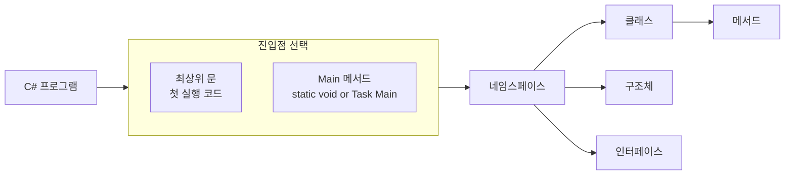

## 개요

C# 프로그램은 **하나 이상의 파일**로 구성되며, 각 파일에는 **0개 이상의 네임스페이스**가 포함된다. 네임스페이스 안에는 클래스, 구조체, 인터페이스, 열거형, 대리자 등이 들어가며, 이들이 프로그램의 골격을 이룬다. 진입점은 **최상위 문(Top-level statements)**을 쓰면 첫 실행 코드가 진입점이 되고, 전통적인 **Main()** 메서드를 쓸 수도 있다. 이 글에서는 C# 프로그램의 일반적인 구조, Main()과 명령줄 인수, 비동기 Main, 최상위 문을 정리하고, 실습 예제와 FAQ로 마무리한다.

**대상 독자**: C# 초급·중급, .NET 콘솔/스크립트 개발자, C# 언어 사양을 빠르게 훑고 싶은 개발자.

---

## C# 프로그램의 일반적인 구조

### 기본 구성 요소

C# 프로그램의 기본 단위는 **네임스페이스**, **클래스**, **메서드**, **변수**이다. C#은 객체 지향 언어이므로 **클래스**가 핵심 구성 요소이며, 네임스페이스로 타입을 그룹화해 이름 충돌을 줄이고 구조를 명확히 한다.

### 네임스페이스와 클래스

- **네임스페이스**: 관련 클래스·타입을 묶어 주며, `using`으로 간단히 가져올 수 있다.
- **클래스**: 객체의 속성과 동작을 정의하는 청사진이다. 메서드, 속성, 필드 등을 담는다.

### 구조체, 인터페이스, 열거형, 대리자

| 타입 | 설명 |
|------|------|
| **구조체(struct)** | 값 타입, 가벼운 데이터 묶음 |
| **인터페이스(interface)** | 구현해야 할 메서드 집합, 다형성 지원 |
| **열거형(enum)** | 관련 상수 집합 |
| **대리자(delegate)** | 메서드 참조 캡슐화, 이벤트·콜백에 사용 |

### 진입점: 최상위 문 vs Main()

- **최상위 문**(C# 9.0~): 파일 루트에 실행 코드를 두면, 그 **첫 줄이 진입점**이 된다. Main()을 명시하지 않아도 된다.
- **Main()**: 클래스/구조체 안에 선언하는 **정적 진입점**이다. 프로그램당 **진입점은 하나**만 있어야 하며, Main이 여러 개면 **StartupObject** 컴파일러 옵션으로 지정해야 한다.

아래 다이어그램은 진입점 선택과 프로그램 구조 관계를 요약한다.



---

## C# 언어 사양과 기본 문법

C# 언어 사양은 문법·의미·사용법에 대한 **공식 정의**이며, Microsoft가 관리하고 버전별로 갱신된다. 기본 문법 예는 다음과 같다.

- **변수 선언·초기화**: `int number = 10;`
- **조건문**: `if (number > 0) { ... }`
- **반복문**: `for (int i = 0; i < 5; i++) { ... }`

C#은 **강타입** 언어이며, LINQ·async/await 등 고급 기능을 제공한다. 자세한 내용은 [C# 언어 사양](https://learn.microsoft.com/ko-kr/dotnet/csharp/language-reference/language-specification/readme)의 기본 개념을 참고하면 된다.

---

## Main()과 명령줄 인수

### Main()의 역할

Main()은 **실행 시 가장 먼저 호출되는 메서드**다. 실행 흐름의 시작과 끝을 담당하며, 다음처럼 선언할 수 있다.

```csharp
static void Main(string[] args)
{
    // 프로그램 코드
}
```

`string[] args`는 **명령줄 인수** 배열이다. 예: `myProgram.exe arg1 arg2` → `args`는 `{"arg1", "arg2"}`.

### Main() 반환 값

Main()은 **void**, **int**, **Task**, **Task&lt;int&gt;** 중 하나를 반환할 수 있다.

- **int / Task&lt;int&gt;** : 종료 코드(0 = 성공, 0이 아닌 값 = 오류). 스크립트·CI에서 활용.
- **void / Task** : 반환값 없이 단순 종료.

```csharp
static int Main(string[] args)
{
    // ...
    return 0; // 성공
}
```

### 명령줄 인수 처리

- **개수 확인**: `args.Length`
- **문자열 → 숫자 변환**: `int.Parse(args[0])`, `Convert.ToInt32(args[0])`, 또는 `int.TryParse(args[0], out int n)`으로 예외 방지
- **검증**: 인수 개수·형식을 검사하고, 잘못된 경우 사용법 메시지를 출력하는 것이 좋다.

---

## 비동기 Main 반환 값

C# 7.1부터 **async Main**이 지원된다. Main()에서 비동기 메서드를 `await`할 수 있어, I/O·네트워크 작업을 진입점에서 깔끔하게 다룰 수 있다.

```csharp
using System;
using System.Threading.Tasks;

class Program
{
    static async Task Main(string[] args)
    {
        await SomeAsyncMethod();
    }

    static async Task SomeAsyncMethod()
    {
        // 비동기 작업
    }
}
```

비동기 Main을 쓰면 컴파일러가 적절한 진입점 래퍼를 생성하므로, 수동으로 `GetAwaiter().GetResult()`를 쓸 필요가 없다.

---

## 최상위 문 — Main 메서드가 없는 프로그램

### 개요

**최상위 문**(C# 9.0~)은 **Main()과 클래스 래퍼 없이** 파일 루트에 실행 코드를 두는 방식이다. 컴파일러가 암시적으로 진입점 메서드를 만들며, 그 이름은 구현 세부 사항이라 코드에서 참조할 수 없다.

### 장점

- **간결함**: Hello World·스크립트·소규모 유틸에 적합.
- **학습 부담 감소**: 클래스/Main 선언 없이 바로 코드 작성 가능.
- Azure Functions, GitHub Actions 등 짧은 스크립트에 유용하다.

### 규칙 요약

- **파일 하나만** 최상위 문을 가질 수 있다. 두 파일 이상에 넣으면 CS8802 오류.
- **using** 지시문은 파일 **맨 앞**에 와야 한다.
- 최상위 문은 **전역 네임스페이스**에 암시적으로 속한다.
- **args**: 최상위 문에서도 `args` 변수로 명령줄 인수 접근 가능(null 아님, 인수 없으면 `Length == 0`).
- **await**: 최상위 문에서 `await` 사용 가능. 이때 암시적 진입점은 `static async Task Main(string[] args)` 형태가 된다.
- **종료 코드**: 최상위 문에서 `return 0;`처럼 `return 정수;`를 쓰면 암시적 Main이 `int`를 반환하는 형태가 된다.

### 예시

```csharp
using System;

Console.WriteLine("Hello, World!");
```

```csharp
using System.Text;

StringBuilder builder = new();
builder.AppendLine("The following arguments are passed:");
foreach (var arg in args)
    builder.AppendLine($"Argument={arg}");
Console.WriteLine(builder.ToString());
return 0;
```

---

## 실습 예제

### 예제 1: Hello World (Main 사용)

```csharp
using System;

class Program
{
    static void Main(string[] args)
    {
        Console.WriteLine("Hello, World!");
    }
}
```

### 예제 2: 명령줄 인수 — 인사 메시지

```csharp
using System;

class Program
{
    static void Main(string[] args)
    {
        if (args.Length > 0)
            Console.WriteLine($"Hello, {args[0]}!");
        else
            Console.WriteLine("Hello, World!");
    }
}
```

실행 예: `dotnet run -- John` → `Hello, John!`

### 예제 3: 명령줄 인수 — 계승 계산기

인수 검증과 `int.TryParse`를 사용한 안전한 변환 예제다.

```csharp
using System;

class Program
{
    static void Main(string[] args)
    {
        if (args.Length != 1)
        {
            Console.WriteLine("사용법: MyProgram.exe <정수>");
            return;
        }

        if (int.TryParse(args[0], out int number) && number >= 0)
        {
            long result = Factorial(number);
            Console.WriteLine($"{number}! = {result}");
        }
        else
        {
            Console.WriteLine("유효한 양의 정수를 입력하세요.");
        }
    }

    static long Factorial(int n)
    {
        if (n == 0) return 1;
        return n * Factorial(n - 1);
    }
}
```

실행 예: `dotnet run -- 5` → `5! = 120`

### 예제 4: 비동기 Main — HTTP 요청

```csharp
using System;
using System.Net.Http;
using System.Threading.Tasks;

class Program
{
    static async Task Main(string[] args)
    {
        string url = "https://api.github.com/";
        using HttpClient client = new HttpClient();
        client.DefaultRequestHeaders.UserAgent.Add(
            new System.Net.Http.Headers.ProductInfoHeaderValue("MyApp", "1.0"));

        string response = await client.GetStringAsync(url);
        Console.WriteLine(response);
    }
}
```

---

## Frequently Asked Questions

**Q. C#에서 Main() 메서드는 왜 필요한가요?**

진입점이 없으면 런타임이 프로그램을 시작할 수 없다. **최상위 문**을 쓰면 Main()을 직접 작성하지 않아도 되지만, 컴파일러가 내부적으로 진입점 메서드를 생성한다.

**Q. 최상위 문 사용 시 제한 사항은?**

- **최상위 문을 포함한 파일은 프로젝트당 하나**만 허용된다(CS8802).
- 최상위 문이 있으면, 같은 프로젝트에 있는 다른 Main()은 진입점으로 쓰이지 않으며 CS7022 경고가 날 수 있다.
- **using**은 파일 최상단에만 올 수 있고, 네임스페이스/타입 정의는 최상위 문 **뒤**에 와야 한다.

**Q. 최상위 문에서 await·return을 쓸 수 있나요?**

가능하다. 최상위 문에서 `await`를 쓰면 암시적 진입점이 `static async Task Main(string[] args)` 형태가 되고, `return 정수;`를 쓰면 종료 코드를 반환하는 형태가 된다.

**Q. 비동기 Main()의 장점은?**

Main()에서 비동기 메서드를 직접 `await`할 수 있어, 상용구 코드 없이 I/O·네트워크 작업을 진입점에서 처리할 수 있다. 콘솔 앱·스크립트에서 응답성과 코드 가독성이 좋아진다.

---

## 관련 기술

- **.NET / .NET Framework**: Windows용 애플리케이션 개발, CLR 기반.
- **.NET Core / .NET 5+**: 크로스 플랫폼, 오픈 소스, 모던 C# 앱·마이크로서비스에 적합.
- **Visual Studio / VS Code**: C# 개발에 널리 쓰이는 IDE. `dotnet` CLI로 빌드·실행(`dotnet build`, `dotnet run`) 가능.

---

## 정리

- C# 프로그램은 **파일 → 네임스페이스 → 타입(클래스·구조체 등)** 구조를 가지며, **진입점은 하나**만 있다.
- **Main()**은 진입점을 명시적으로 두는 방식이고, **명령줄 인수**(`string[] args`)와 **반환 값**(void/int/Task/Task&lt;int&gt;)으로 동작을 제어할 수 있다.
- **최상위 문**은 Main() 없이도 진입점을 제공하며, `args`·`await`·`return 정수`를 사용할 수 있어 스크립트·유틸 작성에 유리하다.
- **비동기 Main**을 쓰면 진입점에서 비동기 작업을 자연스럽게 다룰 수 있다.

---

## Reference

- [C# 프로그램의 일반 구조 — Microsoft Learn](https://learn.microsoft.com/ko-kr/dotnet/csharp/fundamentals/program-structure/)
- [Main()과 명령줄 인수 — Microsoft Learn](https://learn.microsoft.com/ko-kr/dotnet/csharp/fundamentals/program-structure/main-command-line)
- [최상위 문 — Microsoft Learn](https://learn.microsoft.com/ko-kr/dotnet/csharp/fundamentals/program-structure/top-level-statements)
