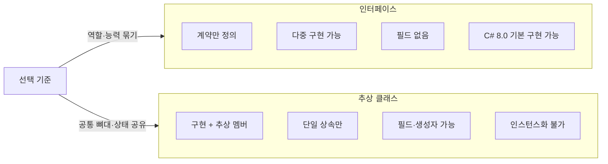

C#에서 **인터페이스**와 **추상 클래스**는 객체 지향 설계의 핵심 도구다. 둘 다 “구현을 강제하는 계약”을 제공하지만, 상속 방식·구현 범위·사용 목적이 달라 설계 시 선택이 갈린다. 이 글에서는 정의, 문법, 비교, 실무 예제, FAQ, 관련 개념까지 한 번에 정리한다.

---

## 1. C#에서의 추상화와 두 가지 수단

**추상화**는 공통 성질만 뽑아 계약이나 기본 구현을 제공하는 것이다. C#에서는 다음 두 가지로 이를 구현한다.

| 수단 | 역할 |
|------|------|
| **인터페이스** | “이 타입은 이런 멤버를 가진다”는 **계약만** 정의. 구현은 클래스·구조체가 담당. |
| **추상 클래스** | **일부 구현 + 추상 멤버**를 함께 두어, 공통 동작과 “반드시 채울 부분”을 한 번에 제공. |

인터페이스는 **다중 구현**이 가능하고, 추상 클래스는 **단일 상속**만 가능하다. 그래서 “여러 역할을 한 타입에 묶을 때”는 인터페이스, “같은 계층의 공통 뼈대와 상태를 나눌 때”는 추상 클래스가 잘 맞는다.

---

## 2. 인터페이스의 특징

### 2.1 기본 구조와 계약

인터페이스는 메서드·프로퍼티·이벤트·인덱서의 **시그니처만** 정의한다. 구현은 이를 구현하는 클래스·구조체가 전담한다.

```csharp
public interface IExample
{
    void MethodA();
    int PropertyB { get; set; }
}
```

`IExample`을 구현하는 모든 타입은 `MethodA()`와 `PropertyB`를 반드시 구현해야 한다. 관례적으로 인터페이스 이름은 `I` 접두사를 붙인다.

### 2.2 접근 제한자

인터페이스 멤버는 기본적으로 **public**이며, C# 8.0 이후로는 `public`, `protected`, `internal`, `private` 등 접근 한정자를 줄 수 있다. `private` 멤버는 반드시 **기본 구현**을 가져야 한다.

### 2.3 메서드·프로퍼티·다중 구현

인터페이스는 필드(인스턴스 데이터)를 가질 수 없고, 메서드·프로퍼티·이벤트·인덱서만 선언한다. 한 클래스가 **여러 인터페이스**를 구현할 수 있어, C#에서 “다중 상속”에 가까운 역할을 한다.

```csharp
public interface IFlyable { void Fly(); }
public interface ISwimmable { void Swim(); }

public class Duck : IFlyable, ISwimmable
{
    public void Fly() => Console.WriteLine("Duck is flying.");
    public void Swim() => Console.WriteLine("Duck is swimming.");
}
```

### 2.4 C# 8.0 기본 구현 메서드

인터페이스에 **기본 구현**을 넣을 수 있다. 구현 클래스는 그 멤버를 오버라이드하지 않아도 되며, **인터페이스 타입으로 업캐스팅했을 때만** 기본 구현이 노출된다. 파생 클래스 참조로는 호출할 수 없다.

```csharp
public interface ILogger
{
    void WriteLog(string message);
    void WriteError(string error) => WriteLog($"Error: {error}");
}
```

기존 인터페이스에 새 멤버를 추가할 때 기존 구현체를 깨지 않고 확장할 수 있어, 버전 관리와 호환성에 유리하다.

---

## 3. 추상 클래스의 특징

### 3.1 기본 구조

추상 클래스는 `abstract`로 선언하며, **인스턴스화할 수 없다**. 추상 메서드(구현 없음)와 일반 메서드·필드·생성자를 함께 가질 수 있다.

```csharp
public abstract class Animal
{
    protected string Name;
    public abstract void Speak();
    public void Sleep() => Console.WriteLine($"{Name} is sleeping.");
}
```

### 3.2 접근 제한자와 생성자

추상 클래스는 일반 클래스와 같이 `public`, `protected`, `internal`, `private`를 사용할 수 있다. **생성자**도 선언 가능하며, 보통 `protected`로 두어 파생 클래스에서만 `base(...)`로 호출하게 한다.

### 3.3 추상 메서드와 override

추상 메서드는 몸체가 없고 세미콜론으로 끝난다. 파생 클래스는 반드시 `override`로 구현해야 한다. 추상 메서드는 암묵적으로 **virtual**이므로, 더 하위 파생 클래스에서 다시 `override`할 수 있다.

```csharp
public abstract class Animal
{
    public abstract void Speak();
}

public class Dog : Animal
{
    public override void Speak() => Console.WriteLine("Woof!");
}
```

### 3.4 상속 규칙

C#에서는 클래스 **단일 상속**만 허용하므로, 한 클래스는 **하나의 추상 클래스만** 상속할 수 있다. 대신 그 추상 클래스와 별도로 여러 인터페이스를 구현하는 것은 가능하다.

---

## 4. 인터페이스 vs 추상 클래스 비교

아래 Mermaid 다이어그램은 선택 기준을 요약한다. 노드 ID는 camelCase이며, 라벨에 특수문자가 있는 경우 큰따옴표로 감쌌다.



| 구분 | 인터페이스 | 추상 클래스 |
|------|------------|-------------|
| **상속** | 다중 구현 가능 | 단일 상속만 |
| **구현** | 시그니처만 (기본 구현은 선택) | 구현 + 추상 멤버 혼합 |
| **필드** | 없음 | 가능 |
| **생성자** | 없음 | 가능 (보통 protected) |
| **접근 제한** | 멤버 기본 public, C# 8.0+ 한정자 가능 | 모든 한정자 사용 가능 |
| **인스턴스화** | 불가 | 불가 |
| **용도** | “할 수 있는 것” 계약, 다형성·테스트 대체 | 같은 계층의 공통 구현과 계약 |

성능은 추상 클래스가 보통 약간 유리할 수 있으나, 대부분의 경우 설계 명확성과 유지보수성이 더 중요하므로 “성능보다 구조”로 선택하는 것이 좋다.

---

## 5. 실전 예제

### 5.1 인터페이스: 로거 교체

여러 구현체가 같은 계약을 따르게 할 때 인터페이스가 적합하다.

```csharp
public interface ILogger
{
    void WriteLog(string message);
}

public class ConsoleLogger : ILogger
{
    public void WriteLog(string message) => Console.WriteLine($"{DateTime.Now:O} {message}");
}

public class FileLogger : ILogger
{
    private readonly StreamWriter _writer;
    public FileLogger(string path) => _writer = new StreamWriter(path) { AutoFlush = true };
    public void WriteLog(string message) => _writer.WriteLine($"{DateTime.Now:O} {message}");
}

// 사용처: ILogger에 의존하면 구현체를 바꿔 끼우기 쉬움
public class ClimateMonitor
{
    private readonly ILogger _logger;
    public ClimateMonitor(ILogger logger) => _logger = logger;
    public void Record(string value) => _logger.WriteLog($"Temperature: {value}");
}
```

### 5.2 추상 클래스: 공통 뼈대

같은 종류의 엔티티가 **공통 상태·동작**을 공유하고, 일부만 타입별로 다르게 할 때 추상 클래스가 적합하다.

```csharp
public abstract class Character
{
    protected string Name { get; }
    protected Character(string name) => Name = name;
    public void Introduce() => Console.WriteLine($"I am {Name}.");
    public abstract void Attack();
}

public class Warrior : Character
{
    public Warrior(string name) : base(name) { }
    public override void Attack() => Console.WriteLine($"{Name} attacks with a sword!");
}

public class Mage : Character
{
    public Mage(string name) : base(name) { }
    public override void Attack() => Console.WriteLine($"{Name} casts a fireball!");
}
```

### 5.3 인터페이스 + 추상 클래스 조합

계약은 인터페이스로, 공통 구현은 추상 클래스로 두는 패턴이다.

```csharp
public interface ICharacter
{
    void Attack();
}

public abstract class CharacterBase : ICharacter
{
    public abstract void Attack();
}

public class Warrior : CharacterBase
{
    public override void Attack() => Console.WriteLine("Warrior attacks with a sword!");
}
```

---

## 6. 자주 묻는 질문

**Q. 인터페이스와 추상 클래스 중 뭘 써야 할까?**  
- **여러 타입이 같은 “역할”만 공유**하면 → 인터페이스 (예: `ILogger`, `IRepository`).  
- **같은 계층에서 공통 필드·메서드 + 일부만 다르게** 하려면 → 추상 클래스 (예: `Animal` → `Dog`, `Cat`).  
- 둘 다 쓰고 싶으면 “인터페이스로 계약 + 추상 클래스로 기본 구현” 조합을 사용한다.

**Q. 인터페이스는 왜 다중 구현이 가능한가?**  
인터페이스는 **구현(상태)을 가지지 않고 시그니처만** 정의하므로, 여러 인터페이스를 한 타입에서 만족해도 “어떤 구현을 쓸지” 모호해지지 않는다. 클래스 다중 상속의 “다이아몬드 문제”를 피할 수 있다.

**Q. 추상 클래스는 왜 인스턴스화할 수 없는가?**  
추상 멤버가 최소 하나라도 있으면 타입이 “불완전”하므로, 그대로 인스턴스를 만드는 것은 금지된다. 대신 파생 클래스에서 추상 멤버를 구현한 뒤, 그 파생 클래스만 인스턴스화할 수 있다.

**Q. 인터페이스 기본 구현 메서드는 언제 쓰나?**  
C# 8.0부터 인터페이스에 기본 구현을 넣을 수 있다. 기존 인터페이스에 **새 멤버를 추가**할 때, 기존 구현체를 수정하지 않고도 호환성을 유지할 수 있다. 인터페이스 타입으로 업캐스팅했을 때만 해당 기본 구현이 노출된다.

---

## 7. 관련 개념

- **다형성**: 인터페이스·추상 클래스 타입으로 참조하면, 실행 시점에 실제 인스턴스 타입에 따라 메서드가 결정된다.  
- **SOLID**: 인터페이스 분리(ISP), 의존성 역전(DIP) 등에서 인터페이스가 핵심이 된다.  
- **디자인 패턴**: 전략 패턴(인터페이스로 알고리즘 교체), 템플릿 메서드(추상 클래스로 골격 정의), 어댑터(인터페이스 맞추기) 등에서 두 개념이 함께 쓰인다.

---

## 8. 정리

- **인터페이스**: 계약(시그니처) 중심, 다중 구현, 필드·생성자 없음. “할 수 있는 것”을 묶을 때 사용.  
- **추상 클래스**: 구현 + 추상 멤버, 단일 상속, 필드·생성자 가능. “같은 종류의 공통 뼈대”를 만들 때 사용.  
- 실무에서는 “역할 계약”은 인터페이스, “계층별 공통 구현”은 추상 클래스로 나누고, 필요하면 둘을 조합해 사용하면 된다.

---

## 참고 문헌

1. [Interfaces - define behavior for multiple types (C#) - Microsoft Learn](https://learn.microsoft.com/en-us/dotnet/csharp/fundamentals/types/interfaces)
2. [abstract keyword - C# reference - Microsoft Learn](https://learn.microsoft.com/en-us/dotnet/csharp/language-reference/keywords/abstract)
3. [Abstract and Sealed Classes and Class Members - C# Programming Guide - Microsoft Learn](https://learn.microsoft.com/en-us/dotnet/csharp/programming-guide/classes-and-structs/abstract-and-sealed-classes-and-class-members)
