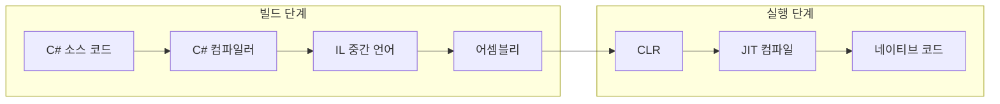

C#은 마이크로소프트에서 개발한 객체 지향 프로그래밍 언어로, .NET 플랫폼에서 실행되는 다양한 응용 프로그램을 작성하는 데 사용된다. 강타입 언어이며 메모리 관리를 자동으로 수행하고, 비동기 프로그래밍·LINQ·제네릭 등 현대적인 패러다임을 지원한다. C, C++, Java와 유사한 문법으로 기존 개발자가 쉽게 접근할 수 있으며, 데스크톱·웹·모바일·게임 등 다양한 분야에서 활용된다. 이 글에서는 C#의 역사와 특징, 기본·고급 문법, .NET과의 관계, 실습 예제, FAQ, 관련 기술, 참고 자료를 정리한다.

---

## C# 언어 소개

### C#의 역사와 발전

C#은 2000년 마이크로소프트에 의해 개발된 객체 지향 프로그래밍 언어이다. .NET 프레임워크의 일환으로 설계되었으며, C++와 Java의 장점을 결합해 만들어졌다. 앤더스 헤일스버그(Anders Hejlsberg)가 주도했으며, 2002년 2월 .NET Framework 1.0과 함께 C# 1.0이 정식 출시되었다. 이후 C# 2.0(제네릭), 3.0(람다·LINQ), 5.0(async/await), 8.0(nullable 참조 형식), 9.0(레코드), 10·11·12까지 이어지며 지속적으로 발전해 왔다. 현재는 Windows뿐 아니라 .NET Core/.NET 5+를 통해 macOS, Linux에서도 실행 가능한 크로스 플랫폼 언어로 자리 잡았다.

### C#의 주요 특징

- **강력한 타입 시스템**: 컴파일 시점에 타입이 결정되어 안정성이 높다.
- **객체 지향**: 클래스·상속·다형성·캡슐화를 지원해 재사용성과 유지보수성을 높인다.
- **LINQ(언어 통합 쿼리)**: 메모리 컬렉션·XML·DB 등 다양한 소스를 일관된 구문으로 쿼리할 수 있다.
- **비동기 프로그래밍**: `async`/`await`로 I/O·네트워크 작업 시 블로킹 없이 효율적인 동시성을 구현할 수 있다.
- **자동 메모리 관리**: 가비지 컬렉션으로 수동 메모리 해제 부담을 줄인다.
- **다중 패러다임**: 절차적·객체지향·함수형 스타일을 함께 사용할 수 있다.

### C#의 사용 사례

- **웹**: ASP.NET Core로 API·웹앱·SPA 백엔드
- **데스크톱**: WPF, WinForms, .NET MAUI
- **모바일**: Xamarin / .NET MAUI로 iOS·Android
- **게임**: Unity 엔진의 스크립팅 언어
- **클라우드·마이크로서비스**: Azure·AWS 등에서 서버리스·컨테이너 기반 서비스

### C#의 장점과 단점

**장점**: 강타입·OOP·풍부한 라이브러리·활발한 커뮤니티·Visual Studio 등 도구 지원·크로스 플랫폼(.NET Core 이후).  
**단점**: 과거에는 Windows 중심 인식이 있었으나, .NET Core 이후에는 상대적으로 완화되었다. 초보자에게는 타입·네임스페이스·async 등 학습할 개념이 많을 수 있다.

---

## C#과 .NET 플랫폼 관계

C# 소스는 컴파일러에 의해 **IL(Intermediate Language, CIL/MSIL)** 로 변환되고, 리소스와 함께 **어셈블리**(.exe/.dll)로 패키징된다. 실행 시 **CLR(Common Language Runtime)** 이 어셈블리를 로드하고, IL을 JIT 또는 AOT로 네이티브 코드로 변환해 실행한다. 아래는 C#에서 실행 파일이 만들어지고 실행되기까지의 흐름을 단순화한 것이다.



**.NET 플랫폼 구성 요소 요약**

| 구성 요소 | 설명 |
|-----------|------|
| **CLR** | 실행 환경. 메모리 관리(GC), 예외 처리, JIT/AOT 컴파일 담당. |
| **BCL(Base Class Library)** | 파일·네트워크·컬렉션·XML 등 공통 API 제공. |
| **ASP.NET Core** | 웹·API·SPA 백엔드 개발 프레임워크. |
| **Entity Framework** | ORM으로 DB와 C# 모델 매핑. |
| **.NET Framework** | Windows 전용 레거시 .NET. |
| **.NET (Core / 5+)** | 크로스 플랫폼·오픈 소스 통합 .NET. |

---

## C# 기본 문법

### 변수와 데이터 타입

C#은 강타입 언어이므로 변수 선언 시 타입을 명시한다. 기본 타입으로는 `int`, `float`, `double`, `char`, `string`, `bool` 등이 있다.

```csharp
int number = 10;
string name = "C#";
bool flag = true;
```

### 제어문

조건문: `if`, `else if`, `else`, `switch`. 반복문: `for`, `while`, `do while`, `foreach`.

```csharp
if (number > 0)
{
    Console.WriteLine("양수입니다.");
}
else
{
    Console.WriteLine("음수이거나 0입니다.");
}
```

### 함수와 메서드

C#에서는 전역 함수가 없고, 메서드는 클래스 내부에 정의된다. 반환 타입·이름·매개변수를 명시한다.

```csharp
public int Add(int a, int b)
{
    return a + b;
}
```

### 클래스와 객체 지향

클래스는 속성(프로퍼티)과 메서드로 데이터와 동작을 묶는다.

```csharp
public class Car
{
    public string Model { get; set; }
    public int Year { get; set; }

    public void Drive()
    {
        Console.WriteLine("차가 운전 중입니다.");
    }
}

// 사용
Car myCar = new Car();
myCar.Model = "소나타";
myCar.Year = 2020;
myCar.Drive();
```

---

## C#의 고급 기능

### LINQ(언어 통합 쿼리)

다양한 데이터 소스에 대해 일관된 쿼리 구문을 사용할 수 있다.

```csharp
using System.Linq;

List<int> numbers = new List<int> { 1, 2, 3, 4, 5, 6 };
var evenNumbers = numbers.Where(n => n % 2 == 0);
foreach (var number in evenNumbers)
    Console.WriteLine(number);
```

### 비동기 프로그래밍

`async`/`await`로 I/O·네트워크 작업을 논블로킹으로 처리한다.

```csharp
static async Task<string> FetchDataAsync(string url)
{
    using (var client = new HttpClient())
        return await client.GetStringAsync(url);
}
```

### 제네릭 프로그래밍

타입 매개변수를 사용해 타입에 안전하면서도 재사용 가능한 코드를 작성할 수 있다.

```csharp
public class GenericList<T>
{
    private List<T> items = new List<T>();
    public void Add(T item) => items.Add(item);
    public T Get(int index) => items[index];
}
```

### 패턴 매칭

C# 7.0부터 `is` 패턴, `switch` 식 등으로 타입·값에 따른 분기를 간결하게 쓸 수 있다.

```csharp
if (obj is string str)
    Console.WriteLine($"길이: {str.Length}");
```

---

## C#과 .NET 플랫폼 (상세)

**.NET 플랫폼 개요**  
.NET은 마이크로소프트가 개발한 무료·오픈 소스·크로스 플랫폼 개발 플랫폼이다. C#, F#, VB 등 여러 언어를 지원하며, 그중 C#이 가장 널리 쓰인다. 웹·데스크톱·모바일·클라우드·게임 등 다양한 워크로드를 지원한다.

**C#과 .NET의 관계**  
C#은 .NET 위에서 동작하는 언어 중 하나이다. .NET BCL과 API를 통해 파일·DB·네트워크·UI 등을 다루며, NuGet을 통해 서드파티 라이브러리를 쉽게 사용할 수 있다.

**.NET의 다양한 변형**  
- **.NET Framework**: Windows 전용, 레거시.  
- **.NET (Core / 5 / 6 / 7 / 8…)**: 크로스 플랫폼, 통합 버전. 새 프로젝트는 이쪽 사용을 권장.  
- **Mono**: 커뮤니티·오픈 소스 .NET 구현, 모바일·게임 등에서 활용.

---

## C# 실습 예제

### Hello World

```csharp
using System;

class Program
{
    static void Main(string[] args)
    {
        Console.WriteLine("Hello, World!");
    }
}
```

### 간단한 계산기

두 수와 연산자를 입력받아 사칙연산을 수행하는 예제이다. `switch`로 연산을 분기하고, 0으로 나누기는 방지한다.

```csharp
Console.WriteLine("첫 번째 숫자:");
double num1 = Convert.ToDouble(Console.ReadLine());
Console.WriteLine("두 번째 숫자:");
double num2 = Convert.ToDouble(Console.ReadLine());
Console.WriteLine("연산: +, -, *, /");
string op = Console.ReadLine();

double result = op switch
{
    "+" => num1 + num2,
    "-" => num1 - num2,
    "*" => num1 * num2,
    "/" => num2 != 0 ? num1 / num2 : throw new DivideByZeroException(),
    _ => throw new ArgumentException("잘못된 연산자")
};
Console.WriteLine($"결과: {result}");
```

### 파일 입출력

```csharp
using System.IO;

string path = "example.txt";
File.WriteAllText(path, "Hello, File!\nC# 파일 입출력 예제입니다.");
string content = File.ReadAllText(path);
Console.WriteLine(content);
```

### 비동기 웹 요청

```csharp
using System.Net.Http;
using System.Threading.Tasks;

using var client = new HttpClient();
string html = await client.GetStringAsync("https://example.com");
Console.WriteLine(html.Length);
```

---

## 자주 묻는 질문(FAQ)

**C#은 어떤 용도로 사용되나요?**  
웹(ASP.NET Core), 데스크톱(WPF, WinForms, MAUI), 모바일(MAUI, Xamarin), 게임(Unity), 클라우드·마이크로서비스 등 전반에 사용된다.

**C#의 장점은 무엇인가요?**  
강타입·OOP·LINQ·async/await·풍부한 라이브러리·훌륭한 도구(Visual Studio, VS Code)·크로스 플랫폼·활발한 커뮤니티 등이다.

**C#과 Java의 차이점은 무엇인가요?**  
C#은 .NET 생태계, 프로퍼티·이벤트·델리게이트·LINQ 등 언어적 편의가 많고, Java는 JVM·플랫폼 독립성·오픈 생태계로 널리 쓰인다. 문법은 비슷한 편이다.

**C#을 배우기 위한 추천 자료는 무엇인가요?**  
Microsoft Learn의 [C# 둘러보기](https://learn.microsoft.com/ko-kr/dotnet/csharp/tour-of-csharp/overview), [.NET 소개](https://learn.microsoft.com/ko-kr/dotnet/core/introduction), 공식 문서·튜토리얼, 서적·온라인 강의(Udemy, Coursera 등), GitHub·Stack Overflow 커뮤니티를 활용하면 좋다.

---

## 관련 기술

- **ASP.NET Core**: 웹·API·SPA 백엔드, MVC·미니멀 API·Blazor 등.  
- **Entity Framework Core**: ORM, Code First·DB First·마이그레이션.  
- **Xamarin / .NET MAUI**: C#·XAML로 iOS·Android·Windows 앱 개발.  
- **Unity**: 게임 엔진, C# 스크립팅.

---

## 결론

C#은 강타입·객체지향·LINQ·비동기 등 현대적인 기능을 갖춘 언어로, .NET과 결합해 웹·데스크톱·모바일·게임·클라우드까지 넓은 영역에서 사용된다. .NET Core/.NET 5+ 이후 크로스 플랫폼·오픈 소스로 무료로 사용할 수 있으며, 학습 자료와 커뮤니티도 풍부하다. 프로그래밍 입문이나 다른 언어 경험자가 .NET 생태계로 진입할 때 C#을 선택하는 것은 실용적인 선택이다.

---

## Reference

- [C# 언어 둘러보기 - Microsoft Learn](https://learn.microsoft.com/ko-kr/dotnet/csharp/tour-of-csharp/overview)
- [.NET 소개 - Microsoft Learn](https://learn.microsoft.com/ko-kr/dotnet/core/introduction)
- [C# 소개 및 개요 - 네이버 블로그 (linknote)](https://m.blog.naver.com/PostView.naver?isHttpsRedirect=true&blogId=linknote&logNo=10082840324)
- [.NET과 C#에 대한 개요 및 관계 - Tistory (dotnetboom)](https://dotnetboom.tistory.com/10)
- [C#에 대한 이해 - Tistory (haedallog)](https://haedallog.tistory.com/186)
