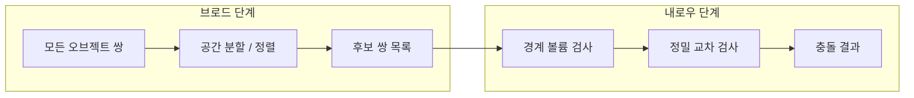

충돌 감지(collision detection)는 컴퓨터 그래픽스, 게임, 로봇 공학, 물리 시뮬레이션 등에서 **두 개 이상의 공간 객체가 서로 교차하는지** 판별하는 계산 기하학의 핵심 문제다. 게임에서는 캐릭터가 벽을 통과하지 않도록 하거나, 물체 간 상호작용을 구현하는 데 필수적이다. 본문에서는 충돌 감지의 기본 개념, 2D/3D 차이, 원형·AABB·스윕 앤 프룬·BVH 등 다양한 알고리즘과 실용 예제, 성능 최적화, FAQ, 참고 문헌까지 체계적으로 다룬다.

## 개요: 충돌 감지가 중요한 이유

**왜 충돌 감지인가**  
물체가 서로 충돌하는 상황을 정확히 감지하는 것은 게임의 현실감과 사용자 경험을 좌우한다. 충돌 감지가 부정확하면 물리적 상호작용이 비현실적으로 보이거나, 캐릭터가 벽을 뚫고 지나가는 등의 버그가 발생한다. 따라서 게임·시뮬레이션·로봇 제어에서 필수 기술로 자리 잡고 있다.

**기본 개념**  
충돌 감지는 **두 개 이상의 물체가 접촉하거나 겹치는지** 판단하는 과정이다. 물체의 위치·형태·속도를 고려하며, 경계가 겹치는지 확인하는 방식으로 이루어진다. 경계는 원형, 사각형(AABB/OBB), 다각형 등 다양한 형태로 정의된다.

**활용 분야**  
액션 게임에서 적과의 충돌로 피해/아이템 획득, 시뮬레이션에서 물체 간 물리적 상호작용, 자율주행·로봇에서 장애물 회피 등에 쓰인다.

## 충돌 감지의 기초

### 정의와 2D/3D 차이

**충돌 감지란**  
두 개 이상의 객체가 서로 겹치는지 판단하는 기술로, 객체 간 상호작용을 결정하고 현실감 있는 환경을 구현하는 데 쓰인다.

**2D vs 3D**  
2D는 평면에서 원·사각형 등 간단한 형태를 다루고, 3D는 구·큐브·다면체 등 복잡한 형태와 더 많은 데이터를 다루므로 계산량과 최적화가 중요하다.

### 전체 파이프라인 (Broad Phase / Narrow Phase)

현대 충돌 감지는 보통 **브로드 단계**와 **내로우 단계**로 나눈다. 브로드 단계에서 “충돌 가능성이 있는 후보 쌍”만 걸러 내고, 내로우 단계에서 실제 교차 여부를 정밀히 판별한다.



- **브로드 단계**: 스윕 앤 프룬, 쿼드트리/옥트리, BVH 등으로 “겹칠 가능성 있는 쌍”만 선별.
- **내로우 단계**: AABB·원·OBB·SAT 등으로 실제로 겹치는지 판정.

### 기본 알고리즘 소개

- **AABB(Axis-Aligned Bounding Box)**: 축에 정렬된 직사각형(또는 3D에서 직육면체). 최소/최대 x, y(, z)로 겹침 여부 판단. 구현이 단순하고 빠름.
- **OBB(Oriented Bounding Box)**: 회전된 경계 상자. 더 타이트하지만 검사 비용이 큼.

## 원형 충돌 감지

### 원리

두 원의 **중심 간 거리**가 **두 반지름의 합**보다 작으면 충돌이다.

- 충돌 조건: `거리(중심1, 중심2) < 반지름1 + 반지름2`
- 2D 게임·시뮬레이션에서 자주 사용된다.

### 구현 예제 (Python)

```python
import math

class Circle:
    def __init__(self, x, y, radius):
        self.x = x
        self.y = y
        self.radius = radius

def is_colliding(circle1, circle2):
    distance = math.sqrt((circle1.x - circle2.x) ** 2 + (circle1.y - circle2.y) ** 2)
    return distance < (circle1.radius + circle2.radius)

# 예제
circle1 = Circle(0, 0, 5)
circle2 = Circle(3, 4, 5)
print("충돌 발생" if is_colliding(circle1, circle2) else "충돌 없음")
```

### 장단점

- **장점**: 구현 간단, 계산 빠름, 많은 객체에서도 효율적.
- **단점**: 원형에만 적합하고, 복잡한 형태에는 부정확하므로 다른 알고리즘과 조합해야 한다.

## 주요 충돌 감지 알고리즘

### 단순 AABB (사각형 겹침)

두 직사각형이 겹치려면 네 변 모두에서 “겹치는 구간”이 있어야 한다.

```python
def is_colliding_aabb(rect1, rect2):
    return (rect1.x < rect2.x + rect2.width and
            rect1.x + rect1.width > rect2.x and
            rect1.y < rect2.y + rect2.height and
            rect1.y + rect1.height > rect2.y)
```

### 스윕 앤 프룬(Sweep and Prune)

객체를 한 축(예: x) 기준으로 **정렬**한 뒤, 인접한 구간만 검사해 후보 쌍을 줄인다. 시간 일관성(temporal coherence)을 활용하면 거의 정렬된 상태를 유지해 삽입 정렬 등으로 O(n + m)에 가깝게 동작할 수 있다.

```python
def sweep_and_prune(objects):
    sorted_objects = sorted(objects, key=lambda obj: obj.bounding_box.x_min)
    potential_collisions = []
    for i in range(len(sorted_objects)):
        for j in range(i + 1, len(sorted_objects)):
            if sorted_objects[j].bounding_box.x_min > sorted_objects[i].bounding_box.x_max:
                break
            if sorted_objects[i].bounding_box.intersects(sorted_objects[j].bounding_box):
                potential_collisions.append((sorted_objects[i], sorted_objects[j]))
    return potential_collisions
```

### 계층적 경계 볼륨(BVH)

복잡한 객체를 여러 경계 볼륨으로 계층 구성한다. 상위 볼륨이 겹치지 않으면 하위는 검사하지 않아 성능을 크게 줄일 수 있다.

```python
class BoundingVolume:
    def __init__(self, children):
        self.children = children

    def intersects(self, other):
        for child in self.children:
            if child.intersects(other):
                return True
        return False
```

## 실용 예제

### 원형 충돌 (거리 제곱 최적화)

`sqrt` 대신 거리 제곱과 반지름 합 제곱을 비교하면 연산을 줄일 수 있다.

```python
def check_collision(circle1, circle2):
    dx = circle1.x - circle2.x
    dy = circle1.y - circle2.y
    distance_sq = dx * dx + dy * dy
    radius_sum_sq = (circle1.radius + circle2.radius) ** 2
    return distance_sq <= radius_sum_sq
```

### AABB 클래스와 검사

```python
class AABB:
    def __init__(self, x_min, y_min, x_max, y_max):
        self.x_min, self.y_min = x_min, y_min
        self.x_max, self.y_max = x_max, y_max

def check_aabb_collision(aabb1, aabb2):
    return (aabb1.x_min < aabb2.x_max and aabb1.x_max > aabb2.x_min and
            aabb1.y_min < aabb2.y_max and aabb1.y_max > aabb2.y_min)
```

### 물리 시뮬레이션에서의 활용

위치·속도를 갱신한 뒤, 모든 객체 쌍에 대해 충돌 검사를 수행하고, 충돌 시 반응(탄성·분리 등)을 적용하는 구조가 일반적이다. 객체 수가 많으면 브로드 단계로 후보를 줄인 뒤 위와 같은 내로우 검사를 적용한다.

## 자주 묻는 질문

**Q. 성능을 높이는 방법은?**  
공간 분할(쿼드트리, 옥트리, 스윕 앤 프룬), 브로드/내로우 단계 분리, 움직임이 작을 때 거의 정렬된 리스트를 유지하는 정렬 알고리즘(삽입 정렬 등) 사용이 효과적이다.

**Q. 정확도와 속도의 균형은?**  
실시간 게임은 속도를 우선해 AABB·원 등 근사 경계를 쓰고, 시뮬레이션은 정밀한 알고리즘(SAT, GJK 등)을 선택하는 경우가 많다. 요구사항에 맞춰 단계별로 정밀도를 조절하면 된다.

**Q. 어떤 알고리즘이 가장 효율적인가?**  
상황에 따라 다르다. 2D에서는 AABB·원이 단순하고 빠르며, 객체가 많으면 스윕 앤 프룬·공간 분할, 3D 복잡 모델에는 BVH가 자주 쓰인다. 후보를 줄이는 브로드 단계와 정밀 검사 내로우 단계를 조합하는 것이 일반적이다.

## 관련 기술

**물리 엔진**  
충돌 감지는 물리 엔진의 핵심이다. 충돌이 감지되면 반응(속도·각속도 변경, 제약 풀이)을 계산해 현실적인 움직임을 만든다.

**게임 개발**  
캐릭터·적·발사체·장애물 간 충돌, 히트박스/허트박스 구분, 벽/바닥과의 접촉 처리 등에 쓰인다.

**로봇·자율주행**  
주변 장애물과의 충돌을 피하기 위한 실시간 감지와 경로 계획에 활용된다.

## 결론

- 충돌 감지는 **게임·시뮬레이션·로봇공학**에서 객체 간 상호작용과 현실감을 위한 핵심 기술이다.
- **브로드 단계**로 후보 쌍을 줄이고 **내로우 단계**에서 정밀 검사를 하는 이단계 구조가 표준에 가깝다.
- **AABB·원·스윕 앤 프룬·BVH** 등을 조합하고, 정확도와 속도 요구에 맞춰 선택하면 된다.
- 앞으로 VR/AR·더 복잡한 물리·실시간 대규모 객체 환경에서 충돌 감지의 중요성은 더 커질 것이다.

## Reference

- [MDN – 2D collision detection](https://developer.mozilla.org/en-US/docs/Games/Techniques/2D_collision_detection)
- [Wikipedia – Collision detection](https://en.wikipedia.org/wiki/Collision_detection)
- [Sort, sweep, and prune: Collision detection algorithms (Part 1)](https://leanrada.com/notes/sweep-and-prune/)
- [Sort, sweep, and prune: Part 2](https://leanrada.com/notes/sweep-and-prune-2/)
