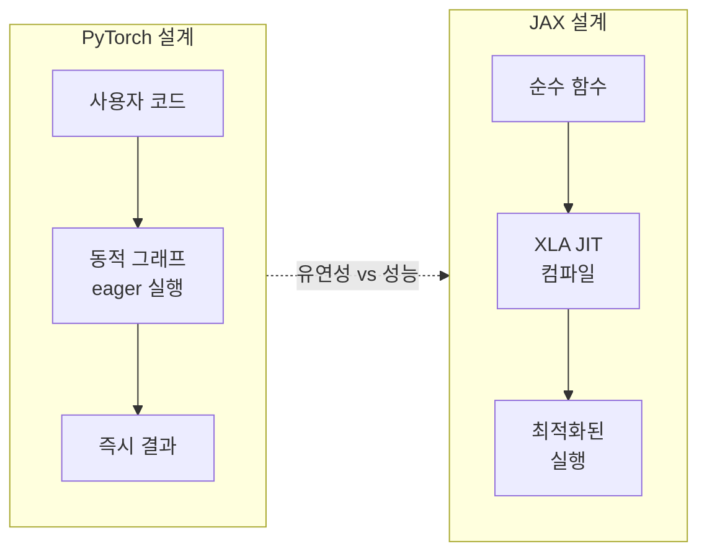

## 서론

**PyTorch와 JAX의 비교**

PyTorch와 JAX는 현대 머신러닝 및 과학 컴퓨팅에서 널리 쓰이는 두 가지 핵심 라이브러리다. PyTorch는 유연한 동적 계산 그래프와 직관적인 API로 연구·개발 현장에서 많이 사용되고, JAX는 자동 미분·JIT 컴파일·GPU/TPU 가속을 통해 대규모 실험과 성능에 초점을 둔다. 두 라이브러리는 설계 철학과 적용 영역이 다르므로, 목적에 맞는 선택이 필요하다.

**과학 컴퓨팅에서의 생산성**

과학 컴퓨팅에서는 코드 생산성과 재현성이 중요하다. 복잡한 수학 모델 구현과 반복 실험 과정에서 가독성·유지보수성·재현성이 필수다. PyTorch는 즉시 실행(eager) 방식으로 디버깅과 프로토타이핑에 유리하고, JAX는 함수형·컴파일러 중심 설계로 대규모 실험과 배포 시 생산성을 높일 수 있다.

**JAX의 목표**

JAX는 “급속한 프로토타이핑과 반복과 더불어, 대규모 실험 배포까지 지원하는” 연구용 프레임워크를 지향한다. 자동 미분, XLA 기반 JIT, 함수형 API를 통해 연구자가 적은 보일러플레이트로 성능과 확장성을 얻을 수 있도록 설계되었다.

---

## 철학적 차이

**PyTorch: 유연성과 동적 접근**

PyTorch는 동적 계산 그래프(eager execution)를 채택해, 작성한 연산이 즉시 실행되고 결과를 바로 확인할 수 있다. 모델 구조 변경이나 새 아이디어 실험 시 즉각적인 피드백을 주어 개발 속도를 높인다. TensorFlow 1.x의 정적·레이지 그래프에 대한 반발로 등장했고, “유연성과 파이썬스러움”을 강점으로 자리 잡았다.

**TensorFlow와의 대비**

TensorFlow 1.x는 정적 그래프와 XLA 컴파일러로 성능을 추구했으나, API가 비직관적이어서 커뮤니티 반발이 컸다. 이후 Keras 중심으로 프론트엔드를 정리하면서 XLA의 역할이 상대적으로 약해졌다. PyTorch는 그 대안으로 “동적·즉시 실행”을 내세웠고, 연구 쪽 사용이 크게 늘었다.

**JAX: 컴파일러 중심 접근**

JAX는 NumPy 스타일 API 위에 XLA(Accelerated Linear Algebra) 컴파일러를 올려, CPU/GPU/TPU에서 공통으로 동작하는 고성능 코드를 만든다. 순수 함수만 쓰면 `@jax.jit`으로 JIT 컴파일해 XLA에 넘기고, 그래프 검증·자동 병렬화·커널 퓨전·비동기 통신 등은 컴파일러가 담당한다. “계산에 집중하고, 나머지는 컴파일러에 맡긴다”는 철학이다.

아래 다이어그램은 두 프레임워크의 설계 방향을 요약한다.

---

## 성능과 확장성

**PyTorch의 성능 이슈**

PyTorch는 대규모 모델·다중 노드 훈련에서 GPU 활용 효율과 분산 설정이 상대적으로 부담된다. 동적 그래프는 디버깅에는 유리하지만, 컴파일 시점 최적화가 제한적이고, DDP/FSDP 등 분산 기능과 `torch.compile`이 한동안 함께 동작하지 않는 등 통합 문제가 있었다. 대규모 데이터셋과 분산 학습이 중요해지면서 이러한 한계가 부각된다.

**JAX의 자동 병렬화**

JAX는 `jax.jit`으로 함수를 XLA에 넘기면, GSPMD 파티셔너 등이 자동으로 병렬화·셰딩을 처리한다. 사용자는 텐서를 디바이스/셰딩에 올려두기만 하면 “computation follows sharding” 원칙에 따라 이후 연산이 자동으로 분산된다. `torch.distributed.barrier()`나 수동 통신 프리미티브 없이도 분산 실행이 가능하다.

**대규모 실험에서의 JAX 장점**

- 자동 미분·JIT·자동 병렬화로 실험 반복이 단순해진다.
- 함수형·순수 함수 기반이라 조합과 재사용이 쉽고, 배치 차원은 `vmap`으로 분리해 생각할 수 있다.
- TPU·멀티노드에서 코드 변경 없이 확장하기 쉽다.

---

## 컴파일러 기반 개발

**JAX와 XLA**

JAX는 XLA를 백엔드로 사용한다. 사용자가 작성한 순수 함수는 `@jax.jit`으로 JIT 컴파일되어 XLA IR로 변환되고, 그래프 검증·연산자 퓨전·레이턴시 숨기기·비동기 통신 삽입 등이 XLA 단에서 처리된다. JAX는 처음부터 XLA와 함께 설계되어, “컴파일러 제약을 받아들이고 그 위에 API를 쌓는” 구조다.

**PyTorch의 컴파일러 통합**

PyTorch는 TorchScript·`torch.compile` 등으로 정적 그래프·컴파일을 도입하고 있으며, PyTorch 2.x 로드맵에서는 OpenXLA를 기본 다운스트림 컴파일러로 사용하는 방안을 논의하고 있다. 다만 Torch는 원래 동적·eager 중심으로 설계되었기 때문에, 컴파일러 제약(트레이싱·순수성 등)과 기존 API의 궁합이 쉽지 않고, 여러 백엔드(트리톤·XLA 등)를 동시에 지원할 때 조각화·호환성 문제가 생길 수 있다.

**코드 간결성**

JAX는 함수형 스타일로, 부작용을 줄이고 서명이 명확한 함수를 조합하는 방식이다. 변이보다는 새 값을 만드는 패턴이라, 수치 계산과 최적화 코드의 추론과 유지보수가 수월해진다.

---

## 함수형 프로그래밍

**JAX의 순수 함수**

JAX는 “같은 입력이면 같은 출력”인 순수 함수를 전제로 한다. 전역 상태나 부작용이 없으므로 트레이싱·JIT·병렬화가 예측 가능하고, 함수끼리 조합하기 좋다. 신경망도 정적 함수로 볼 수 있어, 이 패러다임과 잘 맞는다.

**PyTorch의 복잡성**

PyTorch는 객체와 상태 변경이 흔해, 분산·컴파일·다양한 유틸을 함께 쓰면 조합 폭이 넓어지고 에지 케이스가 많아진다. FSDP·멀티노드·`torch.compile` 등을 한꺼번에 쓰면 특정 조합에서 깨지는 사례가 있었고, 각 기능을 따로 테스트하기도 어렵다.

**JAX의 함수 조합**

`optax`처럼 그래디언트 변환을 “체인”으로 묶는 API가 대표적이다. 예: `optax.chain(optax.clip_by_global_norm(1.0), optax.adam(1e-2), optax.ema(decay=0.999))`. PyTorch에서는 옵티마이저·EMA·클리핑을 객체와 훅으로 나눠 넣어야 할 작업이, JAX에서는 함수 조합으로 한 줄에 표현된다. `vmap`으로 배치 차원을 분리해 생각할 수 있어, 텐서 차원 조작이 단순해진다.

---

## 재현성

**재현성의 중요성**

ML 연구에서 실험 재현은 필수다. 데이터·하이퍼파라미터·무작위성이 동일해야 결과를 검증할 수 있다. 컨테이너·버전 관리만으로는 부족하고, 프레임워크가 재현 가능한 코드를 유도하는 설계가 있으면 실수가 줄어든다.

**PyTorch의 시드 관리**

PyTorch에서는 `torch.manual_seed`, `torch.cuda.manual_seed_all`, `torch.use_deterministic_algorithms`, NumPy 시드 등 여러 곳을 맞춰야 하고, 잘못된 위치에 두면 무시되기 쉽다. 실험 전체가 비재현으로 이어질 수 있어 주의가 필요하다.

**JAX의 명시적 키**

JAX는 무작위성이 필요한 함수에 `key`를 인자로 넘긴다. 모든 RNG가 이 키에서 파생되므로, 같은 키면 같은 결과가 나온다. `jax.numpy`를 쓰면 NumPy 시드를 따로 신경 쓸 필요가 없어, 재현성 설정이 단순해진다.

---

## 이식성 및 자동 스케일링

**PyTorch의 이식성**

PyTorch 코드는 주로 CUDA/GPU를 전제로 하며, TPU·다른 벤더 NPU·AMD GPU 등으로 옮기거나 단일 노드에서 멀티노드로 바꿀 때 상당한 수정이 필요하다. 분산 설정·통신·배리어 등이 코드 곳곳에 들어가야 하는 경우가 많다.

**JAX의 하드웨어 호환**

JAX는 XLA를 통해 CPU/GPU/TPU와 다양한 백엔드를 지원한다. XLA에 디바이스 백엔드만 구현하면, 프레임워크에서 내려온 그래프가 HLO를 거쳐 해당 하드웨어용 IR로 내려가 실행된다. 같은 코드로 단일 디바이스·멀티노드·TPU 슬라이스까지 바꿀 수 있고, 통신·동기화는 XLA가 처리한다.

**자동 스케일링**

JAX에서는 사용자가 랭크나 코디네이터 호스트를 지정하지 않아도, 디바이스가 감지되면 그에 맞춰 계산이 스케줄·동기화된다. 텐서의 셰딩(예: 배치 차원 분할)만 지정하면 “computation follows sharding”에 따라 나머지가 자동으로 결정된다. 재현·확장 시 코드 변경을 최소화할 수 있다.

---

## JAX의 단점과 고려사항

**거버넌스**

XLA는 오랫동안 TF/Google 중심이었고, OpenXLA로 오픈소스 전환이 진행 중이다. JAX는 DeepMind 프로젝트로 Google AI 전략에 중요하지만, 장기적으로 독립적인 거버넌스나 재단이 있으면 생태계 신뢰와 채택에 도움이 될 수 있다.

**XLA 오픈소스 전환**

OpenXLA가 공개되어 내부 XLA를 넘어서는 성능·호환성 이야기가 나오지만, XLA 내부 문서와 로드맵은 아직 부족한 편이다. 문서와 로드맵이 풍부해지면 활용과 기여가 더 수월해진다.

**생태계 통합**

JAX 생태계는 Flax·Equinox 등 여러 NN 라이브러리가 공존한다. PyTorch에서 오는 사용자에게는 API와 추상화 수준 선택이 중요하며, Equinox는 PyTree 기반으로 JAX 철학에 가깝고 학습 곡선이 비교적 짧다는 평가가 있다. JAX 사용 시 [Common Gotchas](https://jax.readthedocs.io/en/latest/notebooks/Common_Gotchas_in_JAX.html) 문서를 한 번 읽어 두면 예외·트레이싱·변경 가능 객체 등에서 시간을 아낄 수 있다.

---

## 비교 요약

| 항목 | PyTorch | JAX |
|------|---------|-----|
| 설계 | 동적 그래프, eager, 유연성 우선 | 순수 함수, XLA JIT, 컴파일러 우선 |
| 분산 | DDP/FSDP 등 수동 설정·통신 | 셰딩 지정 시 자동 병렬·통신 |
| 재현성 | 시드·설정 다수, 누락 시 비재현 가능 | 명시적 `key`, 일관된 RNG |
| 이식성 | CUDA 중심, 멀티노드 시 수정 많음 | CPU/GPU/TPU·멀티노드 동일 코드 |
| 함수형 | 객체·상태 변경 흔함 | 순수 함수·조합 중심 |

---

## 결론

**PyTorch의 강점과 한계**

PyTorch는 프로토타이핑과 디버깅에 유리하고 생태계가 크다. 다만 대규모·분산·성능이 중요해지면서 동적 설계와 컴파일러 통합 사이의 긴장이 커졌고, 여러 핵심 기능 간 통합 이슈가 반복되었다.

**JAX를 고려할 때**

대규모 실험·재현성·이식성·자동 병렬화를 중시한다면 JAX가 적합할 수 있다. 순수 함수와 XLA 기반 설계는 과학 컴퓨팅과 연구 코드베이스에 잘 맞고, 시드·분산·하드웨어 전환 비용을 줄여 준다. 프로토타입은 PyTorch로 하고, 스케일업·배포·재현이 중요해지면 JAX로 옮기는 전략도 유효하다.

**한 줄 요약**

PyTorch는 유연한 프로토타이핑에, JAX는 대규모·재현 가능·이식성 있는 연구·배포에 강점이 있다. 목표 규모와 팀 역량에 맞춰 선택하면 된다.

---

## Reference

1. [PyTorch is dead. Long live JAX. \| Neel Gupta](https://neel04.github.io/my-website/blog/pytorch_rant/) — PyTorch vs JAX 설계·생산성 관점의 비판적 분석.
2. [JAX: High performance array computing — JAX documentation](https://jax.readthedocs.io/en/latest/) — JAX 공식 문서 및 API.
3. [OpenXLA Project](https://openxla.org/) — XLA 오픈소스 프로젝트 및 StableHLO·PJRT 등.
4. [Common Gotchas in JAX](https://jax.readthedocs.io/en/latest/notebooks/Common_Gotchas_in_JAX.html) — JAX 사용 시 주의사항.
