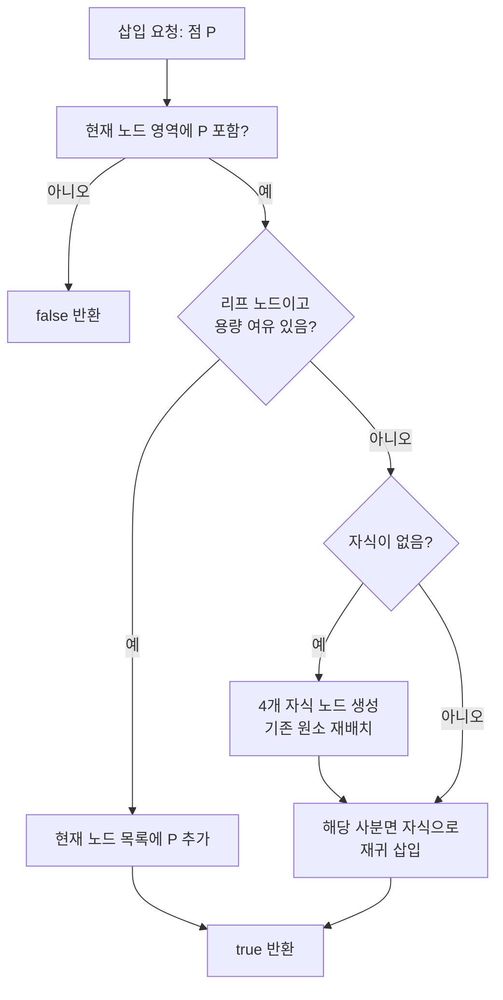

2차원 공간에서 "특정 영역 안에 무엇이 있는지" 또는 "이 점과 가까운 점들은 무엇인지"를 빠르게 묻는 문제는 게임 충돌 감지, 지도 검색, 이미지 압축, 로봇 경로 계획 등에서 반복적으로 등장한다. 전수 조회는 데이터가 많을 때 비효율적이므로, **공간을 계층적으로 나누어 검색 범위를 줄이는 자료구조**가 필요하다. **쿼드 트리(Quad Tree)**는 2차원 평면을 네 개의 사분면으로 재귀적으로 분할하는 트리로, 1974년 Finkel과 Bentley에 의해 명명되었으며, 공간 인덱싱과 범위 질의에서 널리 쓰인다. 이 글에서는 쿼드 트리의 정의와 종류, 동작 원리, 구현 예시, 다른 공간 구조와의 비교, 그리고 **언제 쿼드 트리를 쓰고 언제 피할지**에 대한 판단 기준까지 정리한다.

---

## 쿼드 트리(Quad Tree) 개요

### 쿼드 트리의 정의

**쿼드 트리**는 2차원 공간을 사분면(quadrant)으로 분할하여 데이터를 저장하는 **트리 자료구조**이다. 각 **내부 노드**는 최대 4개의 자식 노드를 가지며, 각 자식은 부모 영역의 북서(NW)·북동(NE)·남서(SW)·남동(SE) 사분면에 대응한다. 리프 노드는 더 이상 쪼개지 않는 한 영역을 나타내며, 그 영역에 대한 데이터(픽셀 값, 점 목록, 객체 목록 등)를 담는다. 따라서 "공간의 재귀적 4분할"과 "한 노드당 최대 4개의 자식"이 쿼드 트리의 핵심 정의다.

### 쿼드 트리의 구조

구조는 "전체 공간 → 루트"에서 시작해, 특정 조건(용량 초과, 균일성 미달 등)을 만족할 때마다 해당 노드를 4개의 동일 크기(또는 동일 규칙) 하위 영역으로 나누고, 각각을 자식 노드로 둔다. 이 과정을 반복하므로 **트리 디렉터리가 곧 공간 분할 구조**와 일치한다. 쿼드 트리의 높이와 형태는 **데이터의 분포와 삽입 순서**(종류에 따라)에 따라 달라지며, 균형이 보장되지 않을 수 있다.

### 쿼드 트리의 특징

- **공간 분할**: 2차원 영역을 계층적으로 4분할하여, 관심 영역만 골라 탐색할 수 있다.
- **동적 세분화**: 필요한 곳만 세분화하므로, 빈 공간이 많은 경우 메모리를 절약할 수 있다.
- **범위 질의에 유리**: "이 사각형과 겹치는 객체들", "이 점 주변 k개" 같은 질의를 전수 조회 없이 처리할 수 있다.

### 쿼드 트리의 활용 분야

**이미지 처리**에서는 영역 쿼드 트리로 동일 색/밝기 영역을 묶어 압축·편집에 활용하고, **GIS·지형**에서는 넓은 지역 데이터를 변 해상도로 저장·조회한다. **게임**에서는 2D 맵의 객체를 쿼드 트리로 관리해 충돌 감지 후보를 줄이고, **로봇/자율주행**에서는 장애물 지도와 경로 계획에 쓰인다. 이처럼 2차원 공간 인덱싱이 필요한 곳이라면 쿼드 트리가 후보가 된다.

---

## 쿼드 트리의 동작 원리

### 공간 분할의 원리

쿼드 트리는 주어진 2차원 영역(보통 AABB, 축정렬 경계 상자)을 **중심 또는 중간선**을 기준으로 네 개의 동일한(또는 규칙적인) 사각형으로 나눈다. 각 사각형은 다시 같은 규칙으로 4분할될 수 있으며, "분할 중단 조건"(최대 깊이, 최소 크기, 노드당 최대 원소 수 등)에 도달할 때까지 재귀적으로 반복한다. 그 결과, 데이터가 밀집한 곳은 더 깊게 쪼개지고, 빈 곳은 큰 노드 하나로 남는 **적응적 해상도**가 만들어진다.

### 노드의 삽입 과정

삽입할 점(또는 객체)의 위치가 속하는 사분면을 찾아, 해당 노드가 리프이면 "용량 여유가 있는지"를 본다. 여유가 있으면 그 노드에 추가하고 끝낸다. 용량이 가득 찼거나, 리프가 아니면 **자식 4개를 만들고(subdivide)**, 기존 원소와 새 원소를 각각 올바른 자식으로 재귀 삽입한다. 이때 "경계에 걸친" 객체는 부모 노드에만 두는 식으로 정책을 정할 수 있다. 삽입 후에는 필요 시 노드 병합(모든 자식이 비면 부모를 리프로 축소)을 하여 깊이를 줄일 수 있다.

### 노드의 삭제 과정

삭제할 대상이 있는 리프(또는 노드)를 찾아 해당 원소만 제거한다. 그 결과 해당 노드가 비고, 형제 노드도 모두 비어 있으면 **부모를 리프로 만들고** 자식 포인터를 제거하는 식으로 위로 올라가며 **축소**할 수 있다. 다만 "한 노드에 여러 원소를 두는" 버킷 방식에서는, 삭제 후에도 다른 원소가 남아 있으면 노드 자체는 유지된다.

### 쿼드 트리의 탐색 과정

**점 조회**: 주어진 점이 속하는 사분면을 루트에서부터 재귀적으로 따라 가면, 해당 점을 포함하는 리프 노드를 찾을 수 있다.

**범위 조회**: 질의 사각형과 "겹치는" 노드만 방문한다. 현재 노드의 AABB와 질의 영역이 겹치지 않으면 가지치기하고, 겹치면 자식으로 내려가거나 현재 노드의 원소 목록을 검사한다. 이를 통해 전수 조회보다 훨씬 적은 노드만 열게 된다.

아래는 **삽입 시 분할 여부**를 결정하는 흐름을 Mermaid로 나타낸 것이다.



---

## 쿼드 트리의 종류

### 영역 쿼드 트리(Region Quadtree)

**영역 쿼드 트리**는 2차원 공간을 **동일한 크기의 네 사각형**으로 반복 분할한다. 각 노드는 한 영역 전체를 대표하며, 리프에는 "그 영역에 대한 하나의 값"(예: 픽셀 블록이 전부 0 또는 전부 1)이 저장된다. 이미지 압축에서 "같은 색 영역을 한 블록으로" 표현할 때 쓰이며, 픽셀 단위보다 큰 블록으로 저장해 용량을 줄인다.

### 점 쿼드 트리(Point Quadtree)

**점 쿼드 트리**는 **각 노드가 하나의 점**을 저장하고, 그 점을 기준으로 사분면을 나눈다. 삽입 순서에 따라 트리 모양이 달라지며, "나쁜" 순서면 높이가 O(n)까지 갈 수 있다. 점 검색·근접 검색에 쓸 수 있으나, 일반적인 k차원 검색에서는 **k-d Tree**에 밀리는 경우가 많다.

### PR 쿼드 트리(Point-Region Quadtree)

**PR 쿼드 트리**는 영역을 **고정된 규칙**(예: 중심으로 4등분)으로 나누고, **리프에 점(또는 객체) 목록**을 둔다. 영역 분할은 데이터와 무관하게 기하학적으로만 이루어지므로, 삽입 순서와 무관하게 같은 데이터 집합이면 같은 구조를 만들 수 있다. 다만 점들이 한곳에 몰리면 그 영역만 깊게 쪼개져 높이가 커질 수 있다.

### 압축 쿼드 트리(Compressed Quadtree)

**압축 쿼드 트리**는 "자식이 하나뿐인" 연속 노드들을 하나로 압축해 **경로 길이**를 줄인다. 빈 영역이 많을 때 노드 수를 크게 줄일 수 있으며, Z-order curve 등으로 인덱싱하면 로그 시간 검색·삽입·삭제를 유지할 수 있다.

---

## 쿼드 트리의 구현

### 쿼드 트리의 기본 구조

각 노드는 **경계(boundary)**와 **자식 4개**(NW, NE, SW, SE) 또는 **리프인 경우 원소 목록**을 가진다. 경계는 중심+반폭/반높이 또는 (x, y, width, height) 형태로 저장하면, "점 포함 여부"와 "두 영역 겹침 여부"를 쉽게 판단할 수 있다.

- **노드(Node)**: 한 사각형 영역과, 그 영역에 속한 원소(리프일 때) 또는 4개의 자식 포인터(내부 노드일 때).
- **자식 노드**: 각각 부모 영역의 북서·북동·남서·남동 사분면.
- **리프 노드**: 더 이상 분할하지 않으며, 실제 데이터(점, 객체 참조 등)를 보관.

### 삽입·삭제·탐색 알고리즘 요약

- **삽입**: (1) 대상이 현재 노드 영역에 있는지 확인, (2) 리프이고 용량 여유 있으면 추가 후 종료, (3) 아니면 필요 시 4분할 후 해당 자식으로 재귀 삽입.
- **삭제**: 대상이 있는 노드를 찾아 제거한 뒤, "모든 자식이 비면" 부모를 리프로 축소하는 과정을 반복.
- **탐색(범위 질의)**: 현재 노드 AABB와 질의 영역이 겹치지 않으면 반환, 겹치면 현재 노드 원소 중 영역 안에 있는 것만 모으고, 자식이 있으면 4방향으로 재귀 호출 후 결과를 합친다.

아래 Python 예제는 **점을 저장하는 쿼드 트리**의 노드 정의와 삽입·영역 포함 판단·4분할을 보여 준다. 실제 프로젝트에서는 최대 깊이 제한, 경계에 걸친 점 처리 정책 등을 추가하는 것이 좋다.

```python
# 42jerrykim.github.io에서 더 많은 정보를 확인할 수 있다
class QuadTreeNode:
    def __init__(self, x, y, width, height):
        self.boundary = (x, y, width, height)  # 노드의 경계
        self.children = [None, None, None, None]  # 자식 노드
        self.points = []  # 노드에 저장된 점들
        self.capacity = 4  # 노드가 가질 수 있는 최대 점의 수

    def insert(self, point):
        # 점이 현재 노드의 경계에 포함되는지 확인
        if not self.contains(point):
            return False

        # 현재 노드에 점을 추가
        if len(self.points) < self.capacity:
            self.points.append(point)
            return True

        # 자식 노드가 생성되지 않았다면 생성
        if self.children[0] is None:
            self.subdivide()

        # 자식 노드에 점을 삽입
        for child in self.children:
            if child.insert(point):
                return True

        return False

    def contains(self, point):
        x, y = point
        bx, by, bw, bh = self.boundary
        return bx <= x < bx + bw and by <= y < by + bh

    def subdivide(self):
        x, y, width, height = self.boundary
        half_width = width / 2
        half_height = height / 2
        self.children[0] = QuadTreeNode(x, y, half_width, half_height)  # NW
        self.children[1] = QuadTreeNode(x + half_width, y, half_width, half_height)  # NE
        self.children[2] = QuadTreeNode(x, y + half_height, half_width, half_height)  # SW
        self.children[3] = QuadTreeNode(x + half_width, y + half_height, half_width, half_height)  # SE
```

---

## 쿼드 트리의 응용

### 이미지 처리에서의 쿼드 트리

이미지를 4분할해 각 블록이 "단일 색"이면 리프로 두고, 아니면 다시 4분할하는 **영역 쿼드 트리**가 전형적이다. 이를 통해 같은 색이 넓은 영역을 차지하는 이미지는 작은 노드 수로 표현되어 압축·편집·영역 질의가 빨라진다.

### 로봇 경로 계획에서의 쿼드 트리

이동 가능 공간을 쿼드 트리로 나누면, 장애물이 있는 셀과 없는 셀을 구분해 두고, A* 등 경로 탐색 알고리즘에서 "갈 수 있는 노드"만 확장할 수 있다. 공간이 넓고 장애물이 일부에만 있을 때 그리드보다 메모리와 탐색 노드 수를 줄일 수 있다.

### 게임 개발에서의 쿼드 트리

2D 맵에서 캐릭터·발사체·오브젝트의 AABB를 쿼드 트리에 넣고, "이 캐릭터 주변과 겹치는 영역에 있는 객체만" 범위 질의로 가져와 충돌 검사를 수행한다. 전수 비교 O(n²)를 피하고, 평균적으로 훨씬 적은 후보만 검사하게 된다.

### 지형·GIS에서의 쿼드 트리

넓은 지형 데이터를 레벨별로 4분할해 저장하면, 화면에 보이는 영역과 확대 수준에 맞는 노드만 로드하는 **LOD(Level of Detail)**와 시각적 컬링이 가능하다. 지리 정보 시스템에서도 특정 경계 상자 안의 지물만 조회하는 데 쿼드 트리(또는 그 변형)가 쓰인다.

---

## 쿼드 트리와 다른 자료 구조의 비교

쿼드 트리와 비슷한 역할을 하는 구조로는 **R-트리**, **k-d Tree**, **옥트리**가 있다. 아래 표는 용도·차원·특성을 한눈에 비교한 것이다.

| 항목 | 쿼드 트리 | R-트리 | k-d Tree | 옥트리 |
|------|-----------|--------|----------|--------|
| **차원** | 2차원 | 다차원 | k차원 | 3차원 |
| **노드당 자식 수** | 최대 4 | 가변(최소/최대 M) | 2 | 최대 8 |
| **분할 방식** | 고정 4등분 | MBR 겹침 최소화 | 한 축 기준 2분할 | 3차원 8등분 |
| **균형** | 보장 안 함 | 삽입/삭제로 유지 | 보장 안 함 | 보장 안 함 |
| **주요 용도** | 2D 공간 인덱싱, 이미지, 게임 | DB 공간 인덱스, GIS | k차원 점 검색, KNN | 3D 그래픽, 충돌, 볼륨 |

2차원 전용이면 쿼드 트리가 구현이 단순하고 이해하기 쉽다. 3차원이면 **옥트리**, 점 위주 검색·KNN이면 **k-d Tree**, DB/대용량 다차원 인덱스가 필요하면 **R-트리** 계열을 고려하면 된다.

---

## 언제 쿼드 트리를 쓰고 언제 피할지

### 사용해도 좋은 경우

- **2차원** 공간에서 범위 질의·근접 검색·충돌 후보 추림이 필요할 때.
- 데이터가 **불균일하게** 퍼져 있어, 일부만 세밀히 나누면 될 때(적응적 해상도).
- **이미지·지형·게임 맵**처럼 "영역 단위"로 다루는 데이터일 때.
- 구현 단순성과 설명 용이성이 중요할 때(교육·프로토타입).

### 피하는 것이 좋은 경우

- **3차원**이면 옥트리나 다른 3D 구조가 적합하다.
- **고차원**(예: 10차원 이상)에서는 차원의 저주로 쿼드/옥트리 계열이 비효율적일 수 있다.
- 데이터가 **한 점에 몰리면** 쿼드 트리 깊이가 커져 성능이 나빠질 수 있으므로, 버킷 크기·최대 깊이 제한이 필요하다.
- **삽입·삭제가 매우 빈번**하고 균형이 중요하면 R-트리 등이 나을 수 있다.

정리하면, "2D 공간 + 영역/범위 질의 + 구현 단순성"이 맞을 때 쿼드 트리를 선택하고, 차원·균형·동적 갱신 요구가 크면 다른 구조를 검토하는 것이 좋다.

---

## 자주 묻는 질문(FAQ)

**쿼드 트리의 장점은?**  
2차원 공간을 필요한 만큼만 세분화해, 범위 질의·충돌 후보 추림을 전수 조회보다 훨씬 적은 노드로 처리할 수 있다. 구현이 비교적 단순하고, 이미지·게임·GIS 등에서 검증된 패턴이다.

**쿼드 트리의 단점은?**  
균형이 보장되지 않아, 데이터가 한곳에 몰리면 깊이가 커지고 성능이 떨어진다. 3차원 이상에는 부적합하며, 동적 갱신이 많을 때는 재구성 비용을 고려해야 한다.

**다른 트리와의 차이점은?**  
이진 트리는 1차원·한 축 기준 2분할, k-d Tree는 k차원·축 번갈아 2분할, R-트리는 다차원·MBR 기반으로 노드 수가 가변이다. 쿼드 트리는 2차원·고정 4분할에 특화되어 있다.

**사용 시 주의할 점은?**  
최대 깊이·노드당 최대 원소 수(버킷 크기)를 두어 무한 분할과 과도한 깊이를 막고, 경계에 걸친 객체는 "부모에만 보관" 등 정책을 정해 두는 것이 좋다.

---

## 관련 기술

- **옥트리(Octree)**: 3차원 공간을 8등분하는 트리. 3D 렌더링, 충돌 감지, 볼륨 데이터에 사용.
- **이진 트리(Binary Tree)**: 한 노드당 자식 2개. 1차원 정렬·검색에 적합.
- **k-d Tree**: k차원 점을 한 축씩 번갈아 2분할. KNN, 범위 검색에 자주 사용.
- **R-트리(R-Tree)**: MBR(Minimum Bounding Rectangle) 기반 다차원 인덱스. 공간 DB, GIS에서 표준에 가깝게 쓰인다.

---

## 결론 및 학습 성과 목표

쿼드 트리는 **2차원 공간을 4분할해 계층적으로 표현**하는 자료구조로, 이미지 압축·게임 충돌·GIS·로봇 경로 계획 등에서 공간 인덱싱과 범위 질의를 효율적으로 만든다. 1974년 Finkel과 Bentley에 의해 정리된 이래, 영역/점/PR/압축 등 여러 변형이 실무에 쓰이고 있다.

**이 글을 읽은 후 달성할 수 있는 목표**

- 쿼드 트리의 **정의**(4분할, 노드당 최대 4자식)와 **영역/점/PR/압축** 종류를 구분해 설명할 수 있다.
- **삽입·범위 조회** 시 "영역 포함·겹침"으로 가지치기하는 흐름을 설명하고, 의사코드나 코드로 구현할 수 있다.
- **R-트리·k-d Tree·옥트리**와 비교해, "2D 공간·범위 질의·구현 단순성"이 중요할 때 쿼드 트리를 선택하는 이유를 말할 수 있다.
- **언제 쿼드 트리를 쓰고 언제 피할지**(2D vs 3D, 균형·동적 갱신 요구)를 판단할 수 있다.

추가로 학습하려면 아래 참고 문헌과 위키백과·교재의 "공간 인덱싱"·"Spatial data structure" 장을 참고하면 좋다.

---

## Reference

- [쿼드 트리(Quad Tree) — velog (youngjun_10)](https://velog.io/@youngjun_10/쿼드-트리Quad-Tree)
- [알고리즘 쿼드트리(Quad Tree) + 백준 1992 — hyo-ue4study.tistory.com](https://hyo-ue4study.tistory.com/235)
- [Quadtree — velog (jk01019)](https://velog.io/@jk01019/Quadtree)
- [Quadtree — Wikipedia (en)](https://en.wikipedia.org/wiki/Quadtree)
- [Data Structure / Algorithm - 쿼드 트리 (Quadtree) — joonyle99.github.io](https://joonyle99.github.io/datastructure_algorithm/DataStructure_Algorithm-Quadtree/)
- [쿼드트리(Quad tree) — chessire.tistory.com](https://chessire.tistory.com/entry/쿼드트리Quad-tree)
