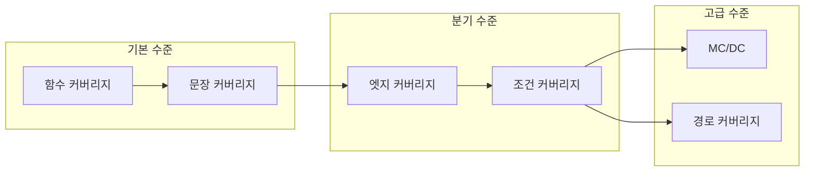

소스 코드 테스트에서 메트릭은 품질 보장의 핵심이다. **코드 커버리지(테스트 커버리지)**는 특정 테스트 스위트 실행 시 프로그램 소스 코드가 얼마나 실행되었는지를 백분율로 측정한다. 높은 커버리지는 미검출 버그 가능성을 낮추는 지표가 되며, 1963년 Miller와 Maloney에 의해 체계적 소프트웨어 테스트 방법으로 처음 소개되었다. 테스트 스위트가 충족해야 할 규칙으로 **함수·문장·엣지·분기·조건 커버리지** 등 여러 기준이 사용된다.


## 소스 코드 테스트를 위한 메트릭

**소스 코드 기반의 커버리지 개요**  

소스 코드 커버리지는 소프트웨어 테스트에서 코드의 실행 비율을 측정하는 중요한 지표이다. 이는 테스트가 얼마나 효과적으로 코드의 다양한 경로를 실행하는지를 나타내며, 코드의 품질과 안정성을 높이는 데 기여한다. 커버리지를 측정함으로써 개발자는 테스트의 부족한 부분을 파악하고, 이를 보완하기 위한 추가 테스트 케이스를 작성할 수 있다.

**소프트웨어 엔지니어링에서의 코드 커버리지**  

소프트웨어 엔지니어링에서는 코드 커버리지가 소프트웨어 품질 보증의 핵심 요소로 자리 잡고 있다. 코드 커버리지는 주로 유닛 테스트, 통합 테스트, 시스템 테스트 등 다양한 테스트 단계에서 측정된다. 이를 통해 개발자는 코드의 결함을 조기에 발견하고, 수정할 수 있는 기회를 가지게 된다.

**테스트 스위트 실행 시 코드 실행 비율**  

테스트 스위트는 여러 테스트 케이스를 포함하는 집합으로, 소프트웨어의 특정 기능이나 모듈을 검증하는 데 사용된다. 테스트 스위트를 실행할 때, 각 테스트 케이스가 코드의 어느 부분을 실행했는지를 분석하여 코드 실행 비율을 계산한다. 이 비율은 코드의 품질을 평가하는 데 중요한 역할을 한다.

**높은 코드 커버리지의 중요성**  

높은 코드 커버리지는 소프트웨어의 신뢰성을 높이는 데 기여한다. 코드 커버리지가 높을수록, 코드의 결함이 발견될 가능성이 줄어들고, 이는 최종 사용자에게 더 나은 품질의 소프트웨어를 제공하는 결과로 이어진다. 따라서 개발팀은 코드 커버리지를 지속적으로 모니터링하고, 이를 개선하기 위한 노력을 기울여야 한다.

## 기본 커버리지 기준

**기능 커버리지**  

기능 커버리지는 소프트웨어의 특정 기능이 테스트되었는지를 측정하는 지표이다. 이는 소프트웨어의 요구 사항이 얼마나 잘 충족되었는지를 평가하는 데 중요한 역할을 한다. 기능 커버리지를 높이기 위해서는 모든 기능이 테스트 케이스에 포함되어야 하며, 각 기능이 예상대로 작동하는지를 확인해야 한다. 이를 통해 소프트웨어의 품질을 보장할 수 있다.

**문장 커버리지**  

문장 커버리지는 코드의 각 문장이 테스트 케이스에 의해 실행되었는지를 측정하는 지표이다. 이는 코드의 각 라인이 적어도 한 번은 실행되었는지를 확인함으로써, 코드의 기본적인 동작이 올바른지를 평가하는 데 도움을 준다. 문장 커버리지를 높이기 위해서는 다양한 입력값을 사용하여 테스트 케이스를 작성해야 하며, 이를 통해 코드의 모든 경로가 실행되도록 해야 한다.

**엣지 커버리지**  

엣지 커버리지는 코드의 각 분기점에서의 경로가 테스트되었는지를 측정하는 지표이다. 이는 조건문이나 반복문과 같은 제어 구조에서의 경로를 평가하는 데 중요하다. 엣지 커버리지를 높이기 위해서는 각 조건의 참과 거짓에 대해 테스트 케이스를 작성해야 하며, 이를 통해 코드의 모든 분기 경로가 테스트되도록 해야 한다.

**조건 커버리지**  

조건 커버리지는 각 조건이 참과 거짓으로 평가되는 경우를 모두 테스트했는지를 측정하는 지표이다. 이는 복잡한 조건문에서의 모든 가능한 경로를 확인하는 데 중요하다. 조건 커버리지를 높이기 위해서는 다양한 조합의 입력값을 사용하여 테스트 케이스를 작성해야 하며, 이를 통해 모든 조건이 적절히 평가되도록 해야 한다. 

이러한 기본 커버리지 기준들은 소프트웨어 테스트의 기초를 형성하며, 각 기준을 충족시키는 것이 소프트웨어의 품질을 높이는 데 필수적이다.

아래는 커버리지 기준 간 포함 관계를 요약한 다이어그램이다. 경로 커버리지가 가장 강하고, 문장·함수 커버리지가 기본이다.



## 수정된 조건/결정 커버리지

**결정 커버리지의 정의**  

결정 커버리지는 소프트웨어 테스트에서 특정 조건이 참 또는 거짓으로 평가되는 모든 경우를 테스트하는 것을 의미한다. 이는 각 조건이 독립적으로 평가되는지를 확인하여, 코드의 모든 분기 경로가 테스트되었는지를 보장하는 데 중요한 역할을 한다. 결정 커버리지는 코드의 복잡성을 줄이고, 버그를 조기에 발견할 수 있도록 도와준다. 

**MC/DC의 필요성**  

MC/DC(Modified Condition/Decision Coverage)는 결정 커버리지의 한 형태로, 각 조건이 결과에 미치는 영향을 독립적으로 평가하는 것을 목표로 한다. MC/DC는 특히 safety-critical 시스템에서 요구되는 커버리지 기준으로, 각 조건이 참 또는 거짓으로 평가될 때 결과에 미치는 영향을 명확히 하기 위해 필요하다. 이를 통해 소프트웨어의 신뢰성을 높이고, 잠재적인 결함을 사전에 방지할 수 있다.

**예시 코드 분석**  

다음은 MC/DC를 적용한 간단한 예시 코드이다.

```python
def example_function(a, b):
    if a > 0 and b > 0:
        return "Both are positive"
    elif a > 0 and b <= 0:
        return "Only a is positive"
    elif a <= 0 and b > 0:
        return "Only b is positive"
    else:
        return "Neither is positive"
```

위의 코드에서 `a`와 `b`의 조건을 각각 독립적으로 평가하여, 모든 가능한 조합을 테스트해야 한다. 예를 들어, `a`가 양수이고 `b`가 음수인 경우, `a`의 조건이 결과에 미치는 영향을 확인할 수 있다. 이를 통해 각 조건이 결과에 미치는 영향을 명확히 파악할 수 있으며, 이는 MC/DC의 핵심이다. 

이와 같은 방식으로 결정 커버리지를 적용하면, 코드의 품질을 높이고, 소프트웨어의 신뢰성을 강화할 수 있다.

## 다중 조건 커버리지

**모든 조건 조합 테스트**  

다중 조건 커버리지는 소프트웨어 테스트에서 모든 조건의 조합을 테스트하는 기법이다. 이 기법은 각 조건이 참 또는 거짓일 때의 모든 가능한 조합을 고려하여 테스트 케이스를 작성하는 것을 목표로 한다. 이를 통해 소프트웨어의 다양한 경로를 검증하고, 특정 조건 조합에서 발생할 수 있는 버그를 발견할 수 있다. 다중 조건 커버리지는 특히 복잡한 로직을 가진 소프트웨어에서 유용하다. 

예를 들어, 다음과 같은 조건문이 있다고 가정해 보자.

```java
if (A && B) {
    // 코드 블록 1
} else if (A && !B) {
    // 코드 블록 2
} else if (!A && B) {
    // 코드 블록 3
} else {
    // 코드 블록 4
}
```

이 경우, A와 B의 모든 조합을 고려하여 테스트 케이스를 작성해야 한다. A와 B가 각각 참(true) 또는 거짓(false)일 때의 모든 조합을 테스트하여 각 코드 블록이 올바르게 실행되는지를 확인해야 한다.

**테스트 케이스 예시**  

다중 조건 커버리지를 적용하기 위한 테스트 케이스 예시는 다음과 같다.

1. A = true, B = true → 코드 블록 1 실행
2. A = true, B = false → 코드 블록 2 실행
3. A = false, B = true → 코드 블록 3 실행
4. A = false, B = false → 코드 블록 4 실행

이러한 테스트 케이스를 통해 모든 조건 조합이 테스트되며, 각 조건의 조합에 따른 소프트웨어의 동작을 검증할 수 있다. 다중 조건 커버리지는 소프트웨어의 신뢰성을 높이는 데 중요한 역할을 한다. 

이와 같은 방식으로 다중 조건 커버리지를 활용하면, 소프트웨어의 품질을 높이고, 잠재적인 버그를 사전에 발견할 수 있는 기회를 제공한다. 따라서, 소프트웨어 개발 과정에서 다중 조건 커버리지를 적극적으로 활용하는 것이 중요하다.

## 매개변수 값 커버리지

**매개변수의 일반적인 값 테스트**  

매개변수 값 커버리지는 소프트웨어 테스트에서 특정 함수나 메서드의 매개변수에 대해 다양한 값을 입력하여 테스트하는 기법이다. 이 기법은 매개변수의 다양한 조합을 통해 소프트웨어의 동작을 검증하고, 예상치 못한 버그를 발견하는 데 도움을 준다. 매개변수 값 커버리지를 통해 개발자는 각 매개변수가 소프트웨어의 동작에 미치는 영향을 이해하고, 이를 통해 더 나은 품질의 소프트웨어를 제공할 수 있다.

예를 들어, 특정 함수가 두 개의 매개변수를 받는다고 가정해보자. 이 함수는 두 매개변수의 값에 따라 다른 결과를 반환할 수 있다. 따라서, 매개변수 값 커버리지를 적용하여 각 매개변수에 대해 다양한 값을 입력하고, 그 결과를 비교함으로써 함수의 동작을 검증할 수 있다. 이 과정에서 매개변수의 경계값, 일반적인 값, 비정상적인 값 등을 포함하여 다양한 테스트 케이스를 생성하는 것이 중요하다.

**버그 발생 가능성 감소**  

매개변수 값 커버리지를 통해 다양한 입력값을 테스트함으로써 소프트웨어의 버그 발생 가능성을 줄일 수 있다. 특히, 매개변수의 조합이 복잡한 경우, 모든 조합을 테스트하는 것은 현실적으로 불가능할 수 있다. 이때 매개변수 값 커버리지를 활용하면, 가장 중요한 조합을 선택하여 테스트할 수 있으며, 이를 통해 소프트웨어의 안정성을 높일 수 있다.

또한, 매개변수 값 커버리지는 코드의 가독성을 높이고, 유지보수를 용이하게 만드는 데도 기여한다. 매개변수에 대한 명확한 테스트 케이스가 존재하면, 개발자는 코드 변경 시 발생할 수 있는 문제를 사전에 예방할 수 있다. 따라서, 매개변수 값 커버리지는 소프트웨어 개발 과정에서 필수적인 요소로 자리 잡고 있다.

결론적으로, 매개변수 값 커버리지는 소프트웨어의 품질을 높이고, 버그 발생 가능성을 줄이는 데 중요한 역할을 한다. 이를 통해 개발자는 더 나은 소프트웨어를 제공할 수 있으며, 사용자에게도 안정적인 경험을 제공할 수 있다.


## 기타 커버리지 기준

**LCSAJ 커버리지**  

LCSAJ(Limited Code Structure and Analysis of Jumps) 커버리지는 프로그램의 코드 구조를 분석하여 특정 경로를 따라 실행되는 코드의 비율을 측정하는 방법이다. 이 커버리지는 코드의 복잡성을 줄이고, 테스트 케이스의 효율성을 높이는 데 도움을 준다. LCSAJ 커버리지를 통해 개발자는 코드의 특정 부분이 얼마나 잘 테스트되었는지를 파악할 수 있으며, 이를 통해 추가적인 테스트가 필요한 영역을 식별할 수 있다.

**경로 커버리지**  

경로 커버리지는 프로그램의 모든 가능한 실행 경로를 테스트하는 것을 목표로 한다. 이는 코드의 모든 분기와 루프를 포함하여, 가능한 모든 경로를 탐색하는 방식이다. 경로 커버리지는 매우 철저한 테스트 방법이지만, 복잡한 프로그램에서는 모든 경로를 테스트하는 것이 비현실적일 수 있다. 따라서 경로 커버리지는 주로 중요한 기능이나 복잡한 알고리즘에 대해 적용된다.

**루프 커버리지**  

루프 커버리지는 프로그램 내의 루프 구조가 얼마나 잘 테스트되었는지를 측정하는 방법이다. 루프는 프로그램의 흐름에서 중요한 역할을 하며, 루프의 반복 횟수나 조건에 따라 프로그램의 동작이 달라질 수 있다. 루프 커버리지를 통해 개발자는 루프가 다양한 조건에서 어떻게 작동하는지를 확인할 수 있으며, 이를 통해 잠재적인 버그를 사전에 발견할 수 있다.

**상태 커버리지**  

상태 커버리지는 프로그램의 다양한 상태가 얼마나 잘 테스트되었는지를 측정하는 방법이다. 프로그램은 다양한 입력에 따라 여러 상태로 전환될 수 있으며, 각 상태에서의 동작이 중요하다. 상태 커버리지를 통해 개발자는 특정 상태에서 발생할 수 있는 문제를 사전에 식별하고, 이를 해결하기 위한 테스트 케이스를 작성할 수 있다.

**데이터 흐름 커버리지**  

데이터 흐름 커버리지는 프로그램 내의 데이터가 어떻게 흐르는지를 분석하여, 데이터의 생성, 사용, 삭제 과정을 추적하는 방법이다. 이 커버리지는 변수의 생명 주기와 데이터의 흐름을 이해하는 데 도움을 주며, 데이터 관련 버그를 발견하는 데 유용하다. 데이터 흐름 커버리지를 통해 개발자는 데이터가 올바르게 처리되고 있는지를 확인할 수 있으며, 이를 통해 소프트웨어의 품질을 높일 수 있다.

## safety-critical 애플리케이션에서의 커버리지

**100% 커버리지 요구 사항**  

safety-critical 애플리케이션은 생명이나 재산에 직접적인 영향을 미치는 소프트웨어를 의미한다. 이러한 애플리케이션에서는 소프트웨어의 결함이 치명적인 결과를 초래할 수 있기 때문에, 100% 커버리지를 요구하는 경우가 많다. 예를 들어, 항공기 제어 시스템이나 의료 기기 소프트웨어는 모든 코드 경로가 테스트되어야 하며, 이는 안전성을 보장하기 위한 필수 조건이다. 

100% 커버리지를 달성하기 위해서는 모든 기능, 조건, 경로가 테스트되어야 하며, 이를 위해 다양한 테스트 기법이 사용된다. 그러나 100% 커버리지를 달성하는 것이 항상 현실적이지는 않으며, 특정 상황에서는 불가능할 수도 있다. 따라서, safety-critical 애플리케이션의 경우, 커버리지 목표를 설정할 때는 실제로 달성 가능한 목표를 설정하는 것이 중요하다.

**커버리지 목표 설정의 비판**  

커버리지 목표를 설정하는 것은 소프트웨어 개발 과정에서 중요한 단계이다. 그러나 이러한 목표가 항상 유용한 것은 아니다. 예를 들어, 100% 커버리지를 목표로 설정할 경우, 개발자들은 코드의 모든 부분을 테스트하기 위해 지나치게 많은 시간과 자원을 소모할 수 있다. 이는 실제로 소프트웨어의 품질을 향상시키기보다는 비효율적인 결과를 초래할 수 있다.

또한, 커버리지 목표가 지나치게 높을 경우, 개발자들은 테스트의 질보다는 양에 집중하게 될 위험이 있다. 이는 테스트가 실제로 중요한 시나리오를 다루지 못하게 만들 수 있으며, 결과적으로 소프트웨어의 결함을 발견하지 못할 수도 있다. 따라서, 커버리지 목표를 설정할 때는 실제로 중요한 기능과 경로를 우선적으로 테스트하는 것이 필요하다.

결론적으로, safety-critical 애플리케이션에서의 커버리지 목표는 신중하게 설정되어야 하며, 단순히 숫자에 집착하기보다는 소프트웨어의 실제 품질을 향상시키는 방향으로 나아가야 한다.

## 테스트 커버리지 정책 구현

**최종 제품 인증을 위한 커버리지 요구 사항**  

소프트웨어 개발에서 테스트 커버리지는 제품의 품질을 보장하는 중요한 요소이다. 최종 제품 인증을 위해서는 특정 커버리지 기준을 충족해야 한다. 이러한 기준은 제품의 복잡성, 사용되는 기술, 그리고 고객의 요구 사항에 따라 달라질 수 있다. 일반적으로, 80% 이상의 코드 커버리지를 목표로 설정하는 것이 좋으며, 이는 제품의 신뢰성을 높이는 데 기여한다. 

또한, 커버리지 요구 사항은 프로젝트 초기 단계에서부터 명확히 정의되어야 하며, 이를 통해 개발팀은 테스트 계획을 수립하고, 필요한 테스트 케이스를 작성할 수 있다. 최종 제품 인증을 위한 커버리지 요구 사항은 고객과의 협의를 통해 결정되며, 이를 통해 고객의 기대에 부합하는 제품을 제공할 수 있다.

**테스트 결과를 통한 추가 테스트 개발**  

테스트 결과는 소프트웨어의 품질을 평가하는 중요한 지표이다. 테스트를 수행한 후, 결과를 분석하여 추가적인 테스트가 필요한 영역을 식별할 수 있다. 예를 들어, 특정 기능에서 높은 결함률이 발견되었다면, 해당 기능에 대한 추가 테스트 케이스를 개발하여 문제를 해결해야 한다. 

또한, 테스트 결과를 기반으로 커버리지 지표를 지속적으로 모니터링하고, 이를 통해 테스트 전략을 조정하는 것이 중요하다. 테스트 결과를 분석하는 과정에서 발견된 문제점은 개발팀과의 협의를 통해 해결 방안을 모색해야 하며, 이를 통해 소프트웨어의 품질을 지속적으로 향상시킬 수 있다. 

테스트 커버리지 정책은 단순히 커버리지 수치를 높이는 것이 아니라, 실제로 소프트웨어의 품질을 보장하는 데 중점을 두어야 한다. 따라서, 테스트 결과를 통해 추가 테스트를 개발하고, 이를 통해 제품의 신뢰성을 높이는 것이 중요하다.

## 테스트 커버리지 기술

**테스트 계획 수립**  

테스트 계획은 소프트웨어 개발 과정에서 매우 중요한 단계이다. 이 단계에서는 테스트의 범위, 목표, 자원, 일정 등을 정의한다. 테스트 계획을 수립함으로써 팀원들은 각자의 역할을 명확히 이해하고, 테스트 진행 상황을 효과적으로 관리할 수 있다. 또한, 테스트 계획은 프로젝트의 전반적인 품질 보증 전략의 기초가 된다.

**유닛 테스트 작성**  

유닛 테스트는 소프트웨어의 개별 구성 요소를 검증하는 과정이다. 각 모듈이나 함수가 예상대로 작동하는지를 확인하기 위해 작성된다. 유닛 테스트는 코드 변경 시 발생할 수 있는 버그를 조기에 발견할 수 있도록 도와준다. 이를 통해 개발자는 코드의 품질을 높이고, 유지보수 비용을 줄일 수 있다.

**정적 분석 도구 사용**  

정적 분석 도구는 소스 코드를 실행하지 않고도 코드의 품질을 평가할 수 있는 도구이다. 이러한 도구는 코드의 스타일, 구조, 복잡성 등을 분석하여 잠재적인 문제를 발견할 수 있다. 정적 분석을 통해 개발자는 코드의 품질을 향상시키고, 버그를 사전에 예방할 수 있다.

**테스트 케이스 개선**  

테스트 케이스는 소프트웨어의 특정 기능이나 모듈을 검증하기 위해 작성된 문서이다. 테스트 케이스를 지속적으로 개선함으로써 테스트의 효율성을 높일 수 있다. 이를 위해 테스트 케이스의 결과를 분석하고, 실패한 테스트의 원인을 파악하여 수정하는 과정이 필요하다.

**자동화된 테스트 실행**  

자동화된 테스트는 수동으로 테스트를 수행하는 대신, 자동화 도구를 사용하여 테스트를 실행하는 방법이다. 자동화된 테스트는 반복적인 작업을 줄이고, 테스트의 일관성을 높일 수 있다. 또한, 코드 변경 시 자동으로 테스트를 실행하여 빠르게 피드백을 받을 수 있는 장점이 있다.

**테스트 결과 추적**  

테스트 결과를 추적하는 것은 테스트의 효과성을 평가하는 데 중요한 요소이다. 테스트 결과를 기록하고 분석함으로써, 어떤 부분에서 문제가 발생했는지를 파악할 수 있다. 이를 통해 향후 테스트 계획을 수정하고, 품질 향상을 위한 전략을 수립할 수 있다.

**테스트 커버리지 검토**  

테스트 커버리지는 테스트가 코드의 어느 정도를 검증했는지를 나타내는 지표이다. 테스트 커버리지를 정기적으로 검토함으로써, 테스트의 효과성을 평가하고, 부족한 부분을 보완할 수 있다. 높은 테스트 커버리지는 소프트웨어의 품질을 보장하는 데 중요한 역할을 한다.

**제3자 도구 활용**  

제3자 도구는 테스트 커버리지, 성능 분석, 버그 추적 등을 지원하는 외부 도구를 의미한다. 이러한 도구를 활용함으로써, 개발팀은 보다 효율적으로 테스트를 수행하고, 품질을 향상시킬 수 있다. 제3자 도구는 팀의 작업을 간소화하고, 테스트 프로세스를 개선하는 데 기여한다.

**품질 향상**  

소프트웨어의 품질 향상은 모든 개발팀의 목표이다. 테스트 커버리지 기술을 통해 품질을 향상시키기 위해서는 지속적인 개선과 피드백이 필요하다. 팀원 간의 협업과 소통을 통해 품질 향상을 위한 전략을 수립하고, 이를 실행하는 것이 중요하다.

**테스트 케이스 최적화**  

테스트 케이스 최적화는 테스트의 효율성을 높이기 위한 과정이다. 불필요한 테스트를 제거하고, 중요한 테스트에 집중함으로써 테스트 시간을 단축할 수 있다. 최적화된 테스트 케이스는 더 나은 품질 보증을 가능하게 한다.

**지속적 통합 시스템 설정**  

지속적 통합(CI) 시스템은 코드 변경 시 자동으로 빌드 및 테스트를 수행하는 시스템이다. 이를 통해 개발자는 코드 변경의 영향을 즉시 확인할 수 있으며, 버그를 조기에 발견할 수 있다. 지속적 통합 시스템은 소프트웨어 개발의 효율성을 높이고, 품질을 보장하는 데 중요한 역할을 한다.

## 테스트 커버리지 기법

**테스트 전략 선택**  

테스트 전략은 소프트웨어 개발 과정에서 테스트를 어떻게 수행할 것인지에 대한 계획을 의미한다. 효과적인 테스트 전략을 수립하기 위해서는 프로젝트의 요구 사항, 리스크, 자원 등을 고려해야 한다. 예를 들어, 애자일 개발 환경에서는 반복적인 테스트와 피드백이 중요하므로, 지속적인 통합(CI)과 지속적인 배포(CD) 전략을 채택하는 것이 유리하다. 

**테스트 케이스 우선순위 지정**  

테스트 케이스의 우선순위를 지정하는 것은 제한된 시간과 자원 내에서 가장 중요한 기능을 테스트하는 데 도움이 된다. 일반적으로 비즈니스에 가장 큰 영향을 미치는 기능이나, 사용자에게 가장 많이 사용되는 기능을 우선적으로 테스트해야 한다. 이를 통해 중요한 결함을 조기에 발견할 수 있다.

**조기 및 빈번한 테스트**  

소프트웨어 개발 초기 단계에서부터 테스트를 시작하는 것이 중요하다. 조기 테스트는 결함을 조기에 발견하고 수정할 수 있는 기회를 제공한다. 또한, 빈번한 테스트를 통해 소프트웨어의 품질을 지속적으로 유지할 수 있다. 이를 위해 자동화된 테스트 도구를 활용하는 것이 효과적이다.

**팀원 간 협업**  

테스트는 혼자서 수행하는 작업이 아니다. 개발자, 테스터, 비즈니스 분석가 등 다양한 팀원 간의 협업이 필요하다. 팀원 간의 원활한 소통과 협업을 통해 테스트의 효율성을 높일 수 있으며, 각자의 전문성을 활용하여 더 나은 테스트 결과를 도출할 수 있다.

**테스트 커버리지 지속적 평가 및 수정**  

테스트 커버리지는 지속적으로 평가하고 수정해야 한다. 초기에는 높은 커버리지를 목표로 하더라도, 시간이 지남에 따라 새로운 기능이 추가되거나 기존 기능이 변경될 수 있다. 따라서 정기적으로 테스트 커버리지를 점검하고, 필요한 경우 테스트 케이스를 수정하거나 추가해야 한다.

**자동화의 현명한 사용**  

자동화된 테스트는 반복적인 작업을 줄이고, 테스트의 일관성을 높이는 데 도움이 된다. 그러나 모든 테스트를 자동화할 수는 없으므로, 자동화가 적합한 테스트와 수동 테스트가 필요한 부분을 구분하는 것이 중요하다. 예를 들어, 회귀 테스트는 자동화에 적합하지만, 사용자 경험을 평가하는 테스트는 수동으로 수행하는 것이 좋다.

**적절한 테스트 데이터 확보**  

테스트를 수행하기 위해서는 적절한 테스트 데이터가 필요하다. 실제 운영 환경과 유사한 데이터를 사용하여 테스트를 수행하면, 더 현실적인 결과를 얻을 수 있다. 또한, 다양한 경계 조건과 예외 상황을 고려한 테스트 데이터를 준비하는 것이 중요하다.

**테스트 설계에 투자**  

테스트 설계는 테스트의 성공 여부를 결정짓는 중요한 요소이다. 초기 단계에서 충분한 시간을 투자하여 테스트 케이스를 설계하고, 각 테스트 케이스의 목적과 기대 결과를 명확히 해야 한다. 잘 설계된 테스트 케이스는 테스트의 효율성을 높이고, 결함 발견 확률을 증가시킨다.

**방어적 사고**  

방어적 사고는 소프트웨어 개발 및 테스트 과정에서 발생할 수 있는 문제를 미리 예측하고 대비하는 사고 방식을 의미한다. 이를 통해 예상치 못한 결함이나 오류를 사전에 방지할 수 있다. 예를 들어, 입력 값의 유효성을 검증하는 로직을 추가하여 잘못된 데이터로 인한 오류를 방지할 수 있다.

**테스트 커버리지 추적**  

테스트 커버리지를 추적하는 것은 테스트의 효과성을 평가하는 데 필수적이다. 커버리지 도구를 사용하여 어떤 코드가 테스트되었는지, 어떤 부분이 테스트되지 않았는지를 확인할 수 있다. 이를 통해 테스트의 빈틈을 찾아내고, 추가적인 테스트 케이스를 작성할 수 있다.

**결과 검토 및 분석**  

테스트 결과는 단순히 통과 여부만을 확인하는 것이 아니라, 결과를 분석하여 개선점을 찾아내는 것이 중요하다. 테스트 결과를 정기적으로 검토하고, 결함의 원인을 분석하여 향후 테스트에 반영해야 한다. 이를 통해 지속적인 품질 향상을 이룰 수 있다.

**코드 변경 모니터링**  

소프트웨어는 지속적으로 변경되기 때문에, 코드 변경 사항을 모니터링하는 것이 중요하다. 변경된 코드에 대한 테스트를 수행하여 새로운 결함이 발생하지 않도록 해야 한다. 또한, 코드 변경이 기존 기능에 미치는 영향을 분석하여 필요한 경우 추가적인 테스트를 수행해야 한다. 

이와 같은 테스트 커버리지 기법을 통해 소프트웨어의 품질을 높이고, 사용자에게 더 나은 경험을 제공할 수 있다.

## 테스트 커버리지 향상을 위한 모범 사례

**명확한 목표 및 목표 정의**  

테스트 커버리지를 향상시키기 위해서는 명확한 목표를 설정하는 것이 중요하다. 목표는 팀의 비전과 일치해야 하며, 구체적이고 측정 가능해야 한다. 예를 들어, 특정 기능에 대한 테스트 커버리지를 80% 이상으로 설정할 수 있다. 이러한 목표는 팀원들이 무엇을 달성해야 하는지를 명확히 이해하는 데 도움을 준다.

**테스트의 중요한 영역 식별**  

소프트웨어의 모든 부분이 동일한 중요성을 가지지는 않다. 따라서, 테스트의 중요한 영역을 식별하는 것이 필요하다. 비즈니스 로직, 사용자 인터페이스, 데이터베이스와 같은 핵심 영역은 우선적으로 테스트해야 한다. 이를 통해 리소스를 효율적으로 사용할 수 있으며, 가장 중요한 부분에서의 결함을 조기에 발견할 수 있다.

**테스트 방법의 조합 사용**  

단일 테스트 방법만으로는 충분하지 않다. 다양한 테스트 방법을 조합하여 사용하는 것이 효과적이다. 유닛 테스트, 통합 테스트, 시스템 테스트, 회귀 테스트 등을 적절히 조합하여 사용하면, 각 테스트 방법의 장점을 극대화할 수 있다. 이를 통해 더 높은 커버리지를 달성할 수 있다.

**테스트 커버리지 지속적 모니터링 및 평가**  

테스트 커버리지는 지속적으로 모니터링하고 평가해야 한다. 정기적으로 커버리지 리포트를 생성하고, 이를 팀과 공유하여 현재 상태를 파악하는 것이 중요하다. 이를 통해 어떤 부분이 부족한지, 어떤 테스트가 필요한지를 명확히 알 수 있다. 또한, 커버리지 목표에 도달하기 위한 전략을 수정할 수 있다.

**테스트 케이스 정기적 업데이트**  

소프트웨어는 지속적으로 변화하기 때문에, 테스트 케이스도 정기적으로 업데이트해야 한다. 새로운 기능이 추가되거나 기존 기능이 변경될 때마다 관련된 테스트 케이스를 수정하거나 추가해야 한다. 이를 통해 테스트의 유효성을 유지하고, 커버리지를 높일 수 있다.

**테스트 커버리지는 팀의 노력**  

테스트 커버리지는 개인의 노력이 아닌 팀의 협력으로 이루어져야 한다. 팀원 간의 소통과 협업이 중요하며, 각자의 역할을 명확히 이해하고 책임을 다해야 한다. 팀 전체가 테스트 커버리지 향상에 기여할 수 있도록 분위기를 조성하는 것이 필요하다.

**코드 커버리지 도구 구현**  

효율적인 테스트 커버리지 관리를 위해 코드 커버리지 도구를 구현하는 것이 좋다. 이러한 도구는 코드의 어떤 부분이 테스트되었는지를 시각적으로 보여주며, 커버리지 리포트를 생성하는 데 도움을 준다. 이를 통해 팀은 커버리지 목표를 달성하기 위한 전략을 수립하고, 필요한 테스트 케이스를 추가할 수 있다.

## 요약

**테스트 커버리지의 중요성**  

테스트 커버리지는 소프트웨어 개발 과정에서 매우 중요한 요소이다. 이는 코드의 어느 부분이 테스트되었는지를 측정하여, 소프트웨어의 품질을 보장하는 데 기여한다. 높은 테스트 커버리지는 버그를 조기에 발견하고, 유지보수 비용을 줄이며, 최종 사용자에게 더 나은 경험을 제공하는 데 도움을 준다. 따라서, 개발팀은 테스트 커버리지를 지속적으로 모니터링하고 개선해야 한다.

**소프트웨어 품질 보장**  

소프트웨어 품질은 고객의 신뢰를 얻고, 비즈니스 성공에 필수적이다. 테스트 커버리지는 소프트웨어의 품질을 보장하는 중요한 도구로 작용한다. 코드의 다양한 경로와 조건을 테스트함으로써, 소프트웨어의 안정성과 신뢰성을 높일 수 있다. 이는 고객의 요구 사항을 충족시키고, 시장에서의 경쟁력을 강화하는 데 기여한다.

**테스트 커버리지 기술의 활용**  

테스트 커버리지를 효과적으로 활용하기 위해서는 다양한 기술과 도구를 사용하는 것이 중요하다. 예를 들어, 정적 분석 도구를 통해 코드의 품질을 사전에 점검하고, 자동화된 테스트를 통해 반복적인 테스트 작업을 효율적으로 수행할 수 있다. 또한, 테스트 커버리지 도구를 사용하여 코드의 커버리지를 시각적으로 분석하고, 개선할 부분을 식별하는 것이 필요하다. 이러한 기술들은 소프트웨어 개발 과정에서 테스트 커버리지를 극대화하는 데 도움을 준다.

## 자주 묻는 질문

**테스트 커버리지 측정 방법**  

테스트 커버리지는 소프트웨어 테스트의 품질을 평가하는 중요한 지표이다. 이를 측정하기 위해서는 코드의 각 부분이 테스트되었는지를 확인해야 한다. 일반적으로 코드 커버리지 도구를 사용하여 테스트가 실행된 코드의 비율을 계산한다. 예를 들어, 문장 커버리지, 분기 커버리지, 조건 커버리지 등의 다양한 측정 방법이 있다. 이러한 도구들은 테스트 실행 후 커버리지 리포트를 생성하여 개발자에게 유용한 정보를 제공한다.

**좋은 테스트 커버리지란?**  

좋은 테스트 커버리지는 소프트웨어의 모든 중요한 기능이 테스트되었음을 의미한다. 일반적으로 80% 이상의 커버리지를 목표로 하는 것이 좋지만, 단순히 숫자에만 의존해서는 안 된다. 중요한 것은 테스트가 실제로 소프트웨어의 결함을 발견할 수 있는지를 평가하는 것이다. 따라서, 커버리지가 높더라도 테스트의 질이 낮다면 의미가 없다. 

**소프트웨어 테스트에서의 테스트 커버리지란?**  

소프트웨어 테스트에서의 테스트 커버리지는 코드의 특정 부분이 테스트되었는지를 나타내는 지표이다. 이는 코드의 품질을 보장하고, 결함을 조기에 발견하는 데 도움을 준다. 테스트 커버리지는 다양한 형태로 측정될 수 있으며, 각 형태는 특정한 테스트 목표에 맞춰져 있다. 예를 들어, 문장 커버리지는 코드의 각 문장이 실행되었는지를 측정하고, 분기 커버리지는 각 조건의 결과가 테스트되었는지를 평가한다.

**테스트 커버리지 개선 방법**  

테스트 커버리지를 개선하기 위해서는 먼저 현재 커버리지 수준을 평가해야 한다. 이후, 테스트 케이스를 추가하거나 수정하여 커버리지를 높일 수 있다. 또한, 코드 리뷰를 통해 테스트가 누락된 부분을 찾아내고, 자동화된 테스트 도구를 활용하여 테스트의 효율성을 높이는 것도 좋은 방법이다. 마지막으로, 팀원 간의 협업을 통해 다양한 시나리오를 테스트하는 것이 중요하다.

**수동 테스트에서의 테스트 커버리지란?**  

수동 테스트에서의 테스트 커버리지는 테스트 케이스가 수동으로 실행되었을 때 코드의 어느 부분이 테스트되었는지를 나타낸다. 수동 테스트는 자동화된 테스트에 비해 시간이 많이 소요되지만, 특정한 상황이나 사용자 경험을 평가하는 데 유용하다. 수동 테스트의 커버리지를 높이기 위해서는 테스트 계획을 철저히 세우고, 다양한 시나리오를 고려해야 한다.

**충분한 테스트 커버리지란?**  

충분한 테스트 커버리지는 소프트웨어의 주요 기능이 모두 테스트되었음을 의미한다. 이는 소프트웨어의 안정성과 신뢰성을 높이는 데 기여한다. 일반적으로 70% 이상의 커버리지를 목표로 하며, 중요한 기능에 대한 테스트가 포함되어야 한다. 그러나 커버리지가 높더라도 테스트의 질이 낮다면 충분하다고 할 수 없다.

**최대 테스트 커버리지란?**  

최대 테스트 커버리지는 가능한 모든 코드 경로와 조건이 테스트되었음을 의미한다. 이는 100% 커버리지를 목표로 하며, 모든 기능이 완벽하게 테스트되었음을 나타낸다. 그러나 현실적으로 모든 경로를 테스트하는 것은 매우 어렵고, 비용이 많이 들 수 있다. 따라서, 최대 커버리지를 목표로 하되, 실제로는 중요한 기능에 집중하는 것이 바람직하다.

**100% 테스트 커버리지란?**  

100% 테스트 커버리지는 모든 코드가 테스트되었음을 의미한다. 이는 이상적인 목표이지만, 실제로는 모든 경로와 조건을 테스트하는 것이 불가능할 수 있다. 그러나 100% 커버리지를 목표로 하는 것은 소프트웨어의 품질을 높이는 데 도움이 된다. 이를 위해서는 철저한 테스트 계획과 다양한 테스트 기법을 활용해야 한다.

## 결론

**테스트 커버리지의 역할**  

테스트 커버리지는 소프트웨어 개발 과정에서 매우 중요한 역할을 한다. 이는 코드의 어느 부분이 테스트되었는지를 측정하여, 소프트웨어의 품질을 보장하는 데 기여한다. 높은 테스트 커버리지는 버그를 조기에 발견하고, 코드의 안정성을 높이며, 유지보수 비용을 줄이는 데 도움을 준다. 또한, 테스트 커버리지를 통해 개발자는 코드의 복잡성을 이해하고, 필요한 경우 리팩토링을 통해 코드 품질을 향상시킬 수 있다.

**소프트웨어 품질 보장**  

소프트웨어 품질 보장은 고객의 신뢰를 얻고, 비즈니스의 성공을 좌우하는 중요한 요소이다. 테스트 커버리지는 소프트웨어의 품질을 보장하는 데 필수적인 도구로 작용한다. 이를 통해 개발자는 소프트웨어의 기능이 요구사항을 충족하는지 확인하고, 예상치 못한 오류를 사전에 방지할 수 있다. 또한, 테스트 커버리지를 통해 소프트웨어의 성능, 보안, 사용성 등을 평가할 수 있으며, 이는 최종 사용자에게 더 나은 경험을 제공하는 데 기여한다.

**테스트 커버리지의 지속적 개선 필요성**  

소프트웨어 개발 환경은 끊임없이 변화하고 있으며, 이에 따라 테스트 커버리지도 지속적으로 개선되어야 한다. 새로운 기능이 추가되거나 기존 기능이 변경될 때마다 테스트 커버리지를 재평가하고, 필요한 경우 새로운 테스트 케이스를 작성해야 한다. 또한, 테스트 커버리지 도구와 기법을 최신 상태로 유지하고, 팀원 간의 협업을 통해 테스트 커버리지를 지속적으로 향상시켜야 한다. 이를 통해 소프트웨어의 품질을 높이고, 고객의 기대에 부응할 수 있는 소프트웨어를 개발할 수 있다.

## 참고 문헌

* [Code coverage - Wikipedia](https://en.wikipedia.org/wiki/Code_coverage) — 커버리지 기준·MC/DC·경로 커버리지 등 정리.
* [Test Coverage - Martin Fowler](https://martinfowler.com/bliki/TestCoverage.html) — 커버리지 수치의 함정과 “충분한 테스트”에 대한 관점.
* [Test Coverage Techniques - BrowserStack](https://www.browserstack.com/guide/test-coverage-techniques) — 테스트 커버리지 기법·메트릭·모범 사례.

