딥러닝은 머신러닝 분야에서 점점 더 중요한 역할을 하고 있으며, 이를 위한 다양한 프레임워크가 존재한다. 그 중에서도 JAX와 PyTorch는 가장 인기 있는 두 가지 딥러닝 프레임워크로, 각각의 장점과 특징이 있다. JAX는 구글에서 개발한 비교적 새로운 프레임워크로, NumPy와 유사한 API를 제공하여 사용자가 쉽게 접근할 수 있도록 설계되었다. 반면, PyTorch는 페이스북에서 개발한 오랜 역사를 가진 프레임워크로, 동적 계산 그래프를 통해 유연성과 디버깅의 용이성을 제공한다. 두 프레임워크 모두 자동 미분 기능을 제공하지만, JAX는 함수의 조합 가능성을 강조하는 함수형 프로그래밍 모델을 채택하고 있으며, PyTorch는 동적 계산 그래프를 통해 모델 구축의 유연성을 제공한다. 이러한 차이점은 사용자가 특정 요구 사항에 따라 적합한 프레임워크를 선택하는 데 중요한 요소가 된다. JAX는 GPU와 TPU를 활용하여 빠른 성능을 제공하며, PyTorch는 방대한 커뮤니티와 다양한 리소스를 통해 사용자에게 지원을 제공한다. 따라서, 두 프레임워크의 비교를 통해 사용자는 자신의 프로젝트에 가장 적합한 도구를 선택할 수 있을 것이다.


||
|:---:|
||


<!--
##### Outline #####
-->

<!--
# JAX vs PyTorch: 두 딥러닝 프레임워크 비교

## 개요
   - 딥러닝의 중요성과 프레임워크 선택의 영향
   - JAX와 PyTorch의 소개 및 발전 배경

## JAX 개요
   - JAX의 정의 및 주요 기능
   - JAX의 성능 최적화 및 하드웨어 가속기 활용
   - JAX의 자동 미분 및 함수 변환 기능

## PyTorch 개요
   - PyTorch의 정의 및 주요 기능
   - PyTorch의 동적 계산 그래프와 유연성
   - PyTorch의 커뮤니티 지원 및 생태계

## JAX와 PyTorch의 비교
   - 4.1. 문법 및 사용 용이성
   - 4.2. 성능 및 속도
   - 4.3. 자동 미분 기능
   - 4.4. 생태계 및 커뮤니티 지원
   - 4.5. 메모리 효율성 및 확장성

## JAX 예제
   - JAX를 사용한 간단한 미분 계산 예제
   - JAX의 JIT 컴파일 및 벡터화 기능 활용 예제

## PyTorch 예제
   - PyTorch를 사용한 간단한 미분 계산 예제
   - PyTorch의 동적 그래프 및 자동 미분 기능 활용 예제

## JAX와 PyTorch의 장단점
   - 7.1. JAX의 장점과 단점
   - 7.2. PyTorch의 장점과 단점

## JAX와 PyTorch의 사용 사례
   - 8.1. JAX의 적합한 사용 사례
   - 8.2. PyTorch의 적합한 사용 사례

## 결론
   - JAX와 PyTorch의 선택 기준
   - 프로젝트 요구 사항에 따른 프레임워크 선택 가이드

## FAQ
   - JAX와 PyTorch의 주요 차이점은 무엇인가요?
   - JAX를 배우기 위한 추천 자료는 무엇인가요?
   - PyTorch의 커뮤니티 지원은 어떤가요?

## 관련 기술
   - TensorFlow와의 비교
   - 딥러닝 모델 배포를 위한 MLOps 도구
   - 최신 딥러닝 연구 동향

## 참고 자료
   - JAX 및 PyTorch 공식 문서 링크
   - 관련 블로그 및 튜토리얼 링크
   - 추천 도서 및 온라인 강좌

이 목차는 JAX와 PyTorch에 대한 포괄적인 비교를 제공하며, 각 섹션은 독자가 두 프레임워크의 차이점과 장단점을 이해하는 데 도움을 줄 것입니다.
-->

<!--
## 개요
   - 딥러닝의 중요성과 프레임워크 선택의 영향
   - JAX와 PyTorch의 소개 및 발전 배경
-->

## 개요

딥러닝은 인공지능(AI) 분야에서 중요한 역할을 하고 있으며, 다양한 산업에서 혁신적인 변화를 이끌고 있다. 특히, 이미지 인식, 자연어 처리, 자율주행차 등 여러 응용 분야에서 딥러닝 기술이 활용되고 있다. 이러한 딥러닝 모델을 효과적으로 개발하고 배포하기 위해서는 적절한 프레임워크 선택이 필수적이다. 프레임워크는 모델의 성능, 개발 속도, 유지보수 용이성 등에 큰 영향을 미치기 때문이다.

**딥러닝의 중요성과 프레임워크 선택의 영향**

딥러닝의 발전은 대량의 데이터와 강력한 컴퓨팅 파워의 결합에 의해 가능해졌다. 이러한 환경에서 딥러닝 프레임워크는 연구자와 개발자가 복잡한 모델을 쉽게 구현하고 실험할 수 있도록 돕는다. 프레임워크의 선택은 다음과 같은 여러 요소에 영향을 미친다.

- **개발 속도**: 프레임워크의 문법과 사용 용이성은 개발 속도에 직접적인 영향을 미친다. 직관적인 API와 풍부한 문서화는 개발자가 빠르게 프로토타입을 만들 수 있도록 돕는다.
- **성능**: 각 프레임워크는 하드웨어 가속기(CPU, GPU, TPU 등)를 활용하는 방식이 다르기 때문에, 성능 차이가 발생할 수 있다. 이는 모델 학습 시간과 예측 속도에 영향을 미친다.
- **커뮤니티 지원**: 활발한 커뮤니티는 문제 해결과 새로운 기능 개발에 큰 도움이 된다. 커뮤니티의 크기와 활동성은 프레임워크의 생태계와도 밀접한 관련이 있다.

**JAX와 PyTorch의 소개 및 발전 배경**

JAX와 PyTorch는 현재 가장 인기 있는 딥러닝 프레임워크 중 두 가지이다. JAX는 Google에서 개발한 프레임워크로, NumPy와 유사한 API를 제공하며, 자동 미분 및 JIT 컴파일 기능을 통해 성능을 극대화할 수 있다. JAX는 특히 연구자들 사이에서 인기를 끌고 있으며, 복잡한 수학적 모델을 구현하는 데 유리하다.

반면, PyTorch는 Facebook AI Research에서 개발한 프레임워크로, 동적 계산 그래프를 지원하여 유연한 모델 설계를 가능하게 한다. PyTorch는 직관적인 문법과 강력한 커뮤니티 지원 덕분에 많은 연구자와 개발자에게 사랑받고 있다. 특히, 교육 및 연구 분야에서 널리 사용되고 있으며, 다양한 산업에서도 채택되고 있다.

다음은 JAX와 PyTorch의 발전 배경을 간단히 정리한 다이어그램이다.

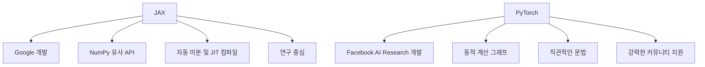

이와 같이 JAX와 PyTorch는 각각의 장점과 특징을 가지고 있으며, 사용자는 자신의 프로젝트 요구 사항에 맞는 프레임워크를 선택해야 한다.

<!--
## JAX 개요
   - JAX의 정의 및 주요 기능
   - JAX의 성능 최적화 및 하드웨어 가속기 활용
   - JAX의 자동 미분 및 함수 변환 기능
-->

## JAX 개요

**JAX의 정의 및 주요 기능**  
JAX는 Google에서 개발한 오픈 소스 라이브러리로, NumPy와 유사한 API를 제공하면서도 자동 미분 및 GPU/TPU 가속을 지원하는 딥러닝 프레임워크이다. JAX는 특히 연구 및 프로토타입 개발에 적합하며, 고성능 수치 계산을 위한 다양한 기능을 제공한다. 주요 기능으로는 다음과 같다.

- **자동 미분**: JAX는 함수의 미분을 자동으로 계산할 수 있는 기능을 제공하여, 복잡한 수학적 모델을 쉽게 구현할 수 있도록 돕는다.
- **JIT 컴파일**: Just-In-Time(JIT) 컴파일을 통해 코드 실행 속도를 극대화할 수 있다.
- **벡터화**: `vmap` 함수를 사용하여 반복적인 연산을 벡터화하여 성능을 향상시킬 수 있다.

```python
import jax.numpy as jnp
from jax import grad

# 간단한 함수 정의
def f(x):
    return x ** 2 + 2 * x + 1

# 함수의 미분 계산
df = grad(f)
print(df(3.0))  # 출력: 8.0
```

**JAX의 성능 최적화 및 하드웨어 가속기 활용**  
JAX는 GPU 및 TPU와 같은 하드웨어 가속기를 활용하여 성능을 최적화할 수 있는 기능을 제공한다. JAX의 `jax.device_put` 함수를 사용하면 데이터를 특정 장치로 쉽게 이동할 수 있으며, 이를 통해 대규모 데이터 처리 및 모델 학습을 가속화할 수 있다.

```python
from jax import random

# 랜덤 텐서 생성
key = random.PRNGKey(0)
x = random.normal(key, (1000, 1000))

# GPU로 데이터 이동
x_device = jax.device_put(x)
```

**JAX의 자동 미분 및 함수 변환 기능**  
JAX는 자동 미분을 통해 사용자가 정의한 함수의 기울기를 쉽게 계산할 수 있도록 지원한다. 또한, `jax.jit`, `jax.vmap`, `jax.grad`와 같은 함수 변환 기능을 통해 코드의 성능을 극대화할 수 있다. 이러한 기능들은 복잡한 모델을 효율적으로 구현하는 데 큰 도움이 된다.

```python
from jax import jit

# JIT 컴파일된 함수
@jit
def compute(x):
    return jnp.sin(x) ** 2 + jnp.cos(x) ** 2

# JIT 컴파일된 함수 호출
result = compute(1.0)
```

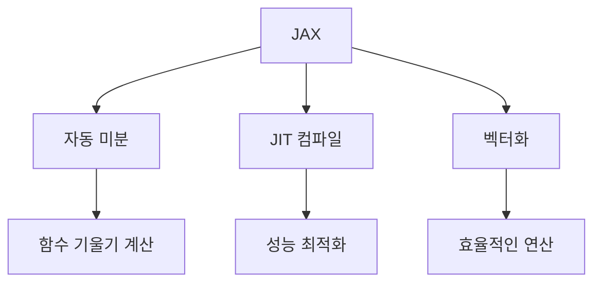

JAX는 이러한 다양한 기능을 통해 연구자와 개발자들이 복잡한 수치 계산을 보다 쉽게 수행할 수 있도록 돕는다. JAX의 강력한 성능 최적화 및 하드웨어 가속기 활용 기능은 특히 대규모 데이터 처리 및 딥러닝 모델 학습에 유용하다.

<!--
## PyTorch 개요
   - PyTorch의 정의 및 주요 기능
   - PyTorch의 동적 계산 그래프와 유연성
   - PyTorch의 커뮤니티 지원 및 생태계
-->

## PyTorch 개요

**PyTorch의 정의 및 주요 기능**  
PyTorch는 Facebook AI Research에 의해 개발된 오픈 소스 딥러닝 프레임워크이다. 이 프레임워크는 연구와 프로덕션 환경 모두에서 사용될 수 있도록 설계되었으며, 특히 동적 계산 그래프를 지원하여 유연한 모델 설계를 가능하게 한다. PyTorch의 주요 기능으로는 다음과 같은 것들이 있다.

- **동적 계산 그래프**: PyTorch는 실행 시점에 계산 그래프를 생성하므로, 코드의 디버깅과 수정이 용이하다.
- **자동 미분**: PyTorch는 텐서 연산에 대한 자동 미분 기능을 제공하여, 복잡한 모델의 학습을 간편하게 수행할 수 있다.
- **GPU 가속**: PyTorch는 CUDA를 통해 GPU 가속을 지원하여, 대규모 데이터셋과 복잡한 모델을 효율적으로 처리할 수 있다.

**PyTorch의 동적 계산 그래프와 유연성**  
PyTorch의 가장 큰 장점 중 하나는 동적 계산 그래프이다. 이는 사용자가 코드를 작성하는 동안 그래프가 생성되므로, 조건문이나 반복문을 포함한 복잡한 모델을 쉽게 구현할 수 있게 해준다. 예를 들어, 다음은 PyTorch에서 동적 계산 그래프를 사용하는 간단한 예제이다.

```python
import torch

# 텐서 생성
x = torch.tensor([1.0, 2.0], requires_grad=True)
y = torch.tensor([3.0, 4.0], requires_grad=True)

# 연산
z = x + y
z.backward(torch.tensor([1.0, 1.0]))

# 기울기 출력
print(x.grad)  # tensor([1., 1.])
print(y.grad)  # tensor([1., 1.])
```

위의 코드에서 `requires_grad=True`를 설정하면, 해당 텐서에 대한 기울기를 자동으로 계산할 수 있다. `backward()` 메서드를 호출하면, 연산 그래프를 따라 기울기가 계산된다.

**PyTorch의 커뮤니티 지원 및 생태계**  
PyTorch는 활발한 커뮤니티와 생태계를 가지고 있다. 많은 연구자와 개발자들이 PyTorch를 사용하여 다양한 프로젝트를 진행하고 있으며, 그 결과로 많은 오픈 소스 라이브러리와 툴이 개발되었다. PyTorch의 생태계에는 다음과 같은 주요 요소들이 포함된다.

- **TorchVision**: 이미지 처리 및 컴퓨터 비전 작업을 위한 라이브러리로, 다양한 데이터셋과 모델을 제공한다.
- **TorchText**: 자연어 처리(NLP) 작업을 위한 라이브러리로, 텍스트 데이터의 전처리 및 모델링을 지원한다.
- **TorchAudio**: 오디오 신호 처리 및 분석을 위한 라이브러리로, 오디오 데이터의 전처리 및 모델링을 지원한다.

이러한 생태계는 PyTorch를 사용하는 개발자들에게 많은 도움을 주며, 다양한 분야에서의 연구와 개발을 촉진하고 있다. 

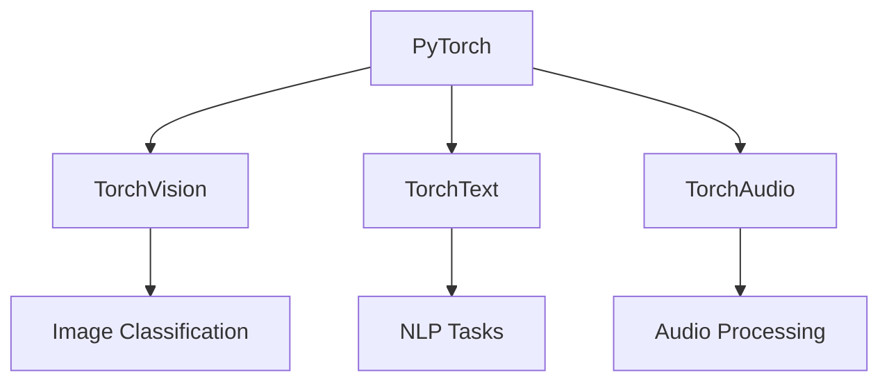

위의 다이어그램은 PyTorch의 주요 라이브러리와 그 사용 사례를 나타낸 것이다. 이러한 다양한 도구들은 PyTorch의 유연성과 확장성을 더욱 강화해준다.

<!--
## JAX와 PyTorch의 비교
   - 4.1. 문법 및 사용 용이성
   - 4.2. 성능 및 속도
   - 4.3. 자동 미분 기능
   - 4.4. 생태계 및 커뮤니티 지원
   - 4.5. 메모리 효율성 및 확장성
-->

## JAX와 PyTorch의 비교

딥러닝 프레임워크를 선택할 때, 여러 요소를 고려해야 한다. JAX와 PyTorch는 각각의 장점과 단점을 가지고 있으며, 이들 간의 비교를 통해 어떤 프레임워크가 특정 요구 사항에 더 적합한지를 판단할 수 있다.

**4.1. 문법 및 사용 용이성**

JAX와 PyTorch는 문법적으로 다소 차이가 있다. PyTorch는 Pythonic한 문법을 채택하고 있어, 직관적이고 사용하기 쉬운 편이다. 특히, 동적 계산 그래프를 사용하여 코드 작성 시 즉각적인 피드백을 받을 수 있어, 디버깅이 용이하다. 반면, JAX는 함수형 프로그래밍 스타일을 채택하고 있어, 처음 접하는 사용자에게는 다소 생소할 수 있다. 그러나 JAX의 문법은 고급 사용자에게는 강력한 기능을 제공한다.

```python
# PyTorch 예제
import torch

x = torch.tensor([1.0, 2.0, 3.0], requires_grad=True)
y = x ** 2
y.backward(torch.tensor([1.0, 1.0, 1.0]))
print(x.grad)  # 출력: tensor([2.0, 4.0, 6.0])
```

**4.2. 성능 및 속도**

JAX는 XLA(Accelerated Linear Algebra)를 사용하여 성능을 최적화할 수 있다. 이는 JAX가 GPU 및 TPU와 같은 하드웨어 가속기를 효과적으로 활용할 수 있게 해준다. PyTorch도 GPU 가속을 지원하지만, JAX는 JIT(Just-In-Time) 컴파일을 통해 성능을 더욱 극대화할 수 있다. 따라서 대규모 데이터셋을 다룰 때 JAX가 더 빠른 성능을 보일 수 있다.

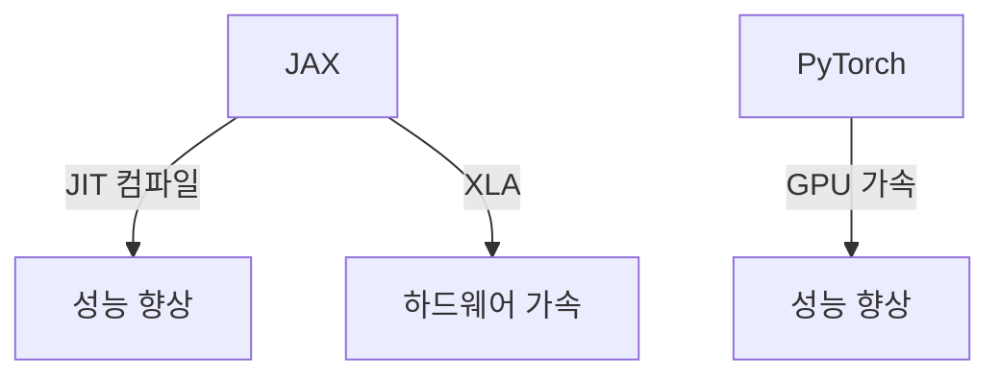

**4.3. 자동 미분 기능**

JAX와 PyTorch 모두 자동 미분 기능을 제공하지만, 그 방식에는 차이가 있다. JAX는 `grad` 함수를 사용하여 미분을 수행하며, 함수형 프로그래밍 스타일을 따르기 때문에 함수의 변환이 용이하다. PyTorch는 `backward` 메서드를 통해 미분을 수행하며, 동적 계산 그래프 덕분에 더 직관적인 방식으로 미분을 처리할 수 있다.

```python
# JAX 예제
import jax.numpy as jnp
from jax import grad

def f(x):
    return x ** 2

df = grad(f)
print(df(3.0))  # 출력: 6.0
```

**4.4. 생태계 및 커뮤니티 지원**

PyTorch는 오랜 시간 동안 많은 사용자와 커뮤니티의 지원을 받아왔다. 다양한 라이브러리와 툴이 PyTorch를 기반으로 개발되었으며, 많은 튜토리얼과 자료가 존재한다. 반면, JAX는 상대적으로 새로운 프레임워크이지만, Google의 지원을 받으며 빠르게 성장하고 있다. JAX의 생태계도 점차 확장되고 있으며, 특히 연구 분야에서 인기를 끌고 있다.

**4.5. 메모리 효율성 및 확장성**

JAX는 메모리 효율성을 높이기 위해 불변성을 강조하며, 함수형 프로그래밍의 장점을 활용한다. 이는 대규모 모델을 다룰 때 메모리 사용을 최적화하는 데 유리하다. PyTorch는 동적 계산 그래프를 사용하여 메모리를 효율적으로 관리하지만, 복잡한 모델에서는 메모리 사용량이 증가할 수 있다. 따라서, 메모리 효율성과 확장성 측면에서 JAX가 더 유리할 수 있다.

이와 같이 JAX와 PyTorch는 각각의 특성과 장단점을 가지고 있으며, 사용자의 필요에 따라 적합한 프레임워크를 선택하는 것이 중요하다.

<!--
## JAX 예제
   - JAX를 사용한 간단한 미분 계산 예제
   - JAX의 JIT 컴파일 및 벡터화 기능 활용 예제
-->

## JAX 예제

**JAX를 사용한 간단한 미분 계산 예제**

JAX는 자동 미분 기능을 제공하여 수학적 함수의 미분을 쉽게 계산할 수 있다. 아래는 JAX를 사용하여 간단한 함수의 미분을 계산하는 예제이다.

```python
import jax.numpy as jnp
from jax import grad

# 미분할 함수 정의
def f(x):
    return x ** 2 + 3 * x + 2

# 함수의 미분 계산
df_dx = grad(f)

# 특정 점에서의 미분값 계산
x_value = 1.0
print("f'({}) = {}".format(x_value, df_dx(x_value)))
```

위 코드는 함수 \( f(x) = x^2 + 3x + 2 \)의 미분을 계산하는 예제이다. `grad` 함수를 사용하여 미분을 수행하고, 특정 점에서의 미분값을 출력한다.

**JAX의 JIT 컴파일 및 벡터화 기능 활용 예제**

JAX는 JIT(Just-In-Time) 컴파일을 통해 성능을 최적화할 수 있다. JIT 컴파일을 사용하면 함수가 호출될 때마다 컴파일되는 것이 아니라, 처음 호출될 때 한 번만 컴파일되어 이후 호출 시 성능이 향상된다. 아래는 JIT 컴파일과 벡터화 기능을 활용한 예제이다.

```python
import jax.numpy as jnp
from jax import jit

# 벡터화된 함수 정의
@jit
def vectorized_function(x):
    return jnp.sin(x) ** 2 + jnp.cos(x) ** 2

# 벡터화된 함수 호출
x_values = jnp.linspace(0, 2 * jnp.pi, 1000)
result = vectorized_function(x_values)

print(result)
```

위 코드는 \( \sin^2(x) + \cos^2(x) \)를 계산하는 벡터화된 함수를 정의하고, JIT 컴파일을 적용한 예제이다. `jnp.linspace`를 사용하여 0부터 \( 2\pi \)까지의 1000개의 값을 생성하고, 벡터화된 함수를 호출하여 결과를 출력한다.

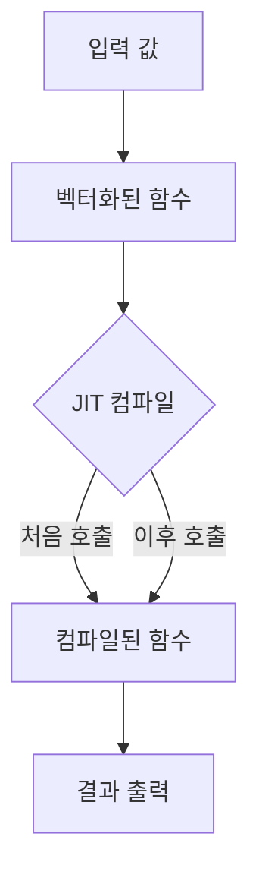

위 다이어그램은 JAX의 JIT 컴파일 과정을 시각적으로 나타낸 것이다. 입력 값이 벡터화된 함수로 전달되고, JIT 컴파일을 통해 컴파일된 함수가 실행되어 결과가 출력되는 과정을 보여준다. JAX의 이러한 기능들은 성능을 극대화하고, 대규모 데이터 처리에 유리한 환경을 제공한다.

<!--
## PyTorch 예제
   - PyTorch를 사용한 간단한 미분 계산 예제
   - PyTorch의 동적 그래프 및 자동 미분 기능 활용 예제
-->

## PyTorch 예제

**PyTorch를 사용한 간단한 미분 계산 예제**

PyTorch는 자동 미분 기능을 제공하여, 복잡한 수학적 계산을 쉽게 수행할 수 있도록 돕는다. 아래는 PyTorch를 사용하여 간단한 미분을 계산하는 예제이다.

```python
import torch

# 변수 x를 정의하고 requires_grad=True로 설정하여 미분 가능하게 만든다.
x = torch.tensor(2.0, requires_grad=True)

# 함수 f(x) = x^2을 정의한다.
y = x ** 2

# y에 대한 x의 미분을 계산한다.
y.backward()

# 미분 결과를 출력한다.
print(f"f'(x) at x=2.0: {x.grad}")
```

위 코드는 `x`의 값이 2일 때, 함수 `f(x) = x^2`의 미분값을 계산하는 예제이다. `y.backward()`를 호출하면 PyTorch는 자동으로 `x`에 대한 `y`의 미분을 계산하고, 그 결과는 `x.grad`에 저장된다.

**PyTorch의 동적 그래프 및 자동 미분 기능 활용 예제**

PyTorch의 가장 큰 장점 중 하나는 동적 계산 그래프를 지원한다는 점이다. 이는 코드 실행 중에 그래프가 생성되므로, 조건문이나 반복문을 사용하여 유연하게 모델을 구성할 수 있다. 아래는 동적 그래프를 활용한 예제이다.

```python
import torch

# 입력 텐서와 가중치 텐서를 정의한다.
x = torch.tensor([1.0, 2.0, 3.0], requires_grad=True)
w = torch.tensor([0.5, 0.5, 0.5], requires_grad=True)

# 예측 함수 정의
def predict(x, w):
    return torch.dot(x, w)

# 예측값을 계산하고 손실을 정의한다.
y_pred = predict(x, w)
loss = (y_pred - 1) ** 2  # 목표값이 1일 때의 손실

# 손실에 대한 가중치의 미분을 계산한다.
loss.backward()

# 가중치의 미분 결과를 출력한다.
print(f"Gradient of w: {w.grad}")
```

위 예제에서는 입력 텐서 `x`와 가중치 텐서 `w`를 정의하고, 이들을 사용하여 예측값을 계산한 후 손실을 정의한다. `loss.backward()`를 호출하면 손실에 대한 가중치의 미분이 계산되어 `w.grad`에 저장된다.

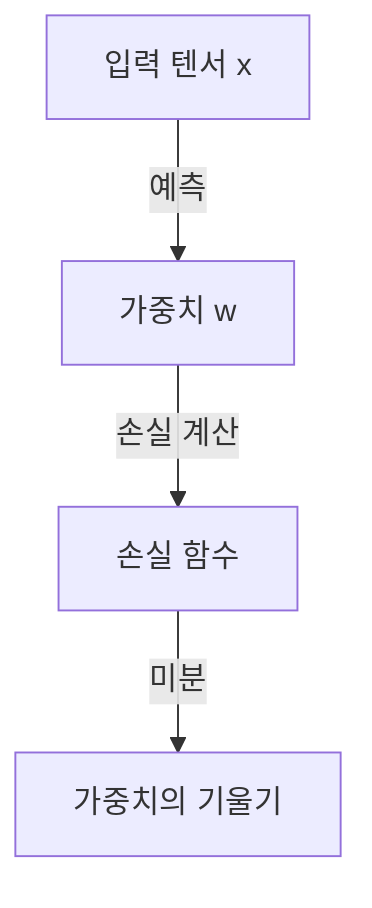

위 다이어그램은 입력 텐서와 가중치 간의 관계, 손실 함수의 계산, 그리고 미분 과정을 시각적으로 나타낸 것이다. PyTorch의 동적 그래프와 자동 미분 기능을 활용하면 이러한 복잡한 계산을 쉽게 수행할 수 있다.

<!--
## JAX와 PyTorch의 장단점
   - 7.1. JAX의 장점과 단점
   - 7.2. PyTorch의 장점과 단점
-->

## JAX와 PyTorch의 장단점

### **7.1. JAX의 장점과 단점**

JAX는 최근에 많은 주목을 받고 있는 딥러닝 프레임워크로, 몇 가지 두드러진 장점과 단점이 있다.

**장점:**

1. **자동 미분의 강력함**: JAX는 NumPy와 유사한 API를 제공하면서도, 자동 미분 기능이 매우 강력하다. 이는 복잡한 수학적 함수의 미분을 쉽게 수행할 수 있게 해준다.

2. **JIT 컴파일**: JAX는 Just-In-Time(JIT) 컴파일을 통해 성능을 극대화할 수 있다. 이는 코드 실행 시점에 최적화를 수행하여 속도를 높인다.

3. **하드웨어 가속기 지원**: JAX는 GPU 및 TPU와 같은 하드웨어 가속기를 쉽게 활용할 수 있도록 설계되어 있어, 대규모 데이터 처리에 유리하다.

4. **함수 변환 기능**: JAX는 `grad`, `jit`, `vmap`과 같은 함수 변환 기능을 제공하여, 코드의 재사용성과 효율성을 높인다.

**단점:**

1. **학습 곡선**: JAX는 NumPy와 유사한 API를 제공하지만, JIT 컴파일 및 함수 변환 기능을 이해하는 데 시간이 걸릴 수 있다. 따라서 초보자에게는 다소 어려울 수 있다.

2. **생태계의 제한성**: JAX는 PyTorch나 TensorFlow에 비해 상대적으로 작은 생태계를 가지고 있어, 다양한 라이브러리나 도구의 지원이 부족할 수 있다.

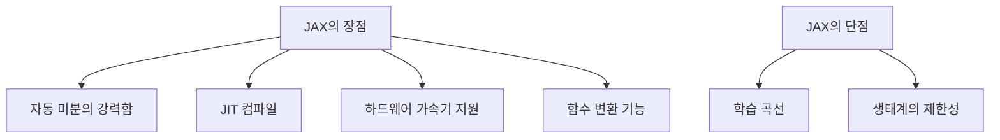

### **7.2. PyTorch의 장점과 단점**

PyTorch는 딥러닝 연구 및 개발에서 널리 사용되는 프레임워크로, 다음과 같은 장점과 단점이 있다.

**장점:**

1. **동적 계산 그래프**: PyTorch는 동적 계산 그래프를 사용하여, 코드 실행 중에 그래프를 생성할 수 있다. 이는 디버깅과 모델 개발을 용이하게 한다.

2. **유연성**: PyTorch는 다양한 모델 아키텍처를 쉽게 구현할 수 있는 유연성을 제공한다. 이는 연구자들이 새로운 아이디어를 실험하는 데 유리하다.

3. **강력한 커뮤니티 지원**: PyTorch는 활발한 커뮤니티와 생태계를 가지고 있어, 다양한 튜토리얼, 라이브러리, 연구 자료를 쉽게 찾을 수 있다.

**단점:**

1. **성능 최적화의 어려움**: PyTorch는 JAX에 비해 성능 최적화가 상대적으로 어렵다. 특히 대규모 모델을 다룰 때 성능 저하가 발생할 수 있다.

2. **메모리 사용량**: PyTorch는 동적 계산 그래프를 사용하기 때문에, 메모리 사용량이 상대적으로 높을 수 있다. 이는 대규모 데이터셋을 처리할 때 문제가 될 수 있다.

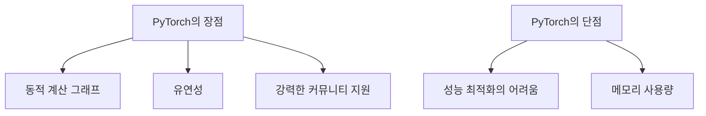

JAX와 PyTorch는 각각의 장단점이 있으며, 사용자의 필요와 프로젝트의 요구 사항에 따라 적절한 프레임워크를 선택하는 것이 중요하다.

<!--
## JAX와 PyTorch의 사용 사례
   - 8.1. JAX의 적합한 사용 사례
   - 8.2. PyTorch의 적합한 사용 사례
-->

## JAX와 PyTorch의 사용 사례

**8.1. JAX의 적합한 사용 사례**

JAX는 고성능 수치 계산을 위한 프레임워크로, 특히 다음과 같은 사용 사례에 적합하다.

1. **연구 및 프로토타입 개발**: JAX는 함수형 프로그래밍 패러다임을 따르며, 자동 미분 및 JIT 컴파일 기능을 제공하여 연구자들이 새로운 알고리즘을 신속하게 프로토타입할 수 있도록 돕는다. 예를 들어, 새로운 최적화 알고리즘이나 신경망 아키텍처를 실험할 때 유용하다.

2. **고성능 컴퓨팅**: JAX는 GPU 및 TPU와 같은 하드웨어 가속기를 활용하여 대규모 데이터셋을 처리하는 데 최적화되어 있다. 이는 대규모 신경망 훈련이나 복잡한 수치 계산을 수행할 때 큰 장점이 된다.

3. **수학적 모델링**: JAX는 수학적 모델링 및 시뮬레이션에 적합하다. 예를 들어, 물리학, 생물학, 경제학 등의 분야에서 복잡한 수학적 모델을 구현하고 최적화하는 데 유용하다.

다음은 JAX를 사용한 간단한 미분 계산 예제이다.

```python
import jax.numpy as jnp
from jax import grad

# 함수 정의
def f(x):
    return x ** 2 + 3 * x + 2

# 미분 계산
df = grad(f)
print(df(1.0))  # x=1에서의 미분값 출력
```

**8.2. PyTorch의 적합한 사용 사례**

PyTorch는 동적 계산 그래프를 기반으로 하여 유연성과 직관성을 제공하는 프레임워크로, 다음과 같은 사용 사례에 적합하다.

1. **딥러닝 모델 개발**: PyTorch는 다양한 딥러닝 모델을 쉽게 구현할 수 있도록 돕는다. 특히, 연구자와 개발자들이 복잡한 모델을 실험하고 수정하는 데 유리하다. 예를 들어, CNN, RNN, GAN 등 다양한 아키텍처를 손쉽게 구현할 수 있다.

2. **교육 및 학습**: PyTorch는 직관적인 API와 동적 계산 그래프 덕분에 딥러닝을 배우는 데 적합하다. 많은 교육 자료와 튜토리얼이 PyTorch를 기반으로 하고 있어, 초보자들이 쉽게 접근할 수 있다.

3. **프로덕션 환경**: PyTorch는 TorchScript와 같은 기능을 통해 모델을 프로덕션 환경에 배포할 수 있도록 지원한다. 이는 연구에서 개발한 모델을 실제 서비스에 적용하는 데 유리하다.

다음은 PyTorch를 사용한 간단한 미분 계산 예제이다.

```python
import torch

# 변수 정의
x = torch.tensor(1.0, requires_grad=True)

# 함수 정의
y = x ** 2 + 3 * x + 2

# 미분 계산
y.backward()
print(x.grad)  # x=1에서의 미분값 출력
```

이와 같이 JAX와 PyTorch는 각각의 강점을 가진 다양한 사용 사례에 적합하다. 연구, 교육, 프로덕션 등 각 분야에서의 활용 가능성을 고려하여 적절한 프레임워크를 선택하는 것이 중요하다.

<!--
## 결론
   - JAX와 PyTorch의 선택 기준
   - 프로젝트 요구 사항에 따른 프레임워크 선택 가이드
-->

## 결론

**JAX와 PyTorch의 선택 기준**  
딥러닝 프레임워크를 선택할 때는 여러 가지 요소를 고려해야 한다. 첫째, 프로젝트의 요구 사항에 따라 적합한 프레임워크가 달라질 수 있다. 예를 들어, 연구 중심의 프로젝트에서는 JAX의 성능 최적화 및 자동 미분 기능이 유리할 수 있다. 반면, 프로덕션 환경에서의 안정성과 커뮤니티 지원이 중요한 경우 PyTorch가 더 적합할 수 있다. 

둘째, 사용자의 경험 수준도 중요한 요소이다. JAX는 함수형 프로그래밍 패러다임을 따르기 때문에, 이에 익숙하지 않은 사용자에게는 다소 어려울 수 있다. 반면, PyTorch는 직관적인 API와 동적 계산 그래프를 제공하여, 초보자도 쉽게 접근할 수 있다.

셋째, 하드웨어 가속기 활용 여부도 고려해야 한다. JAX는 TPU와 같은 하드웨어 가속기를 효과적으로 활용할 수 있는 반면, PyTorch는 GPU에 최적화되어 있어 다양한 하드웨어 환경에서 유연하게 사용할 수 있다.

**프로젝트 요구 사항에 따른 프레임워크 선택 가이드**  
프로젝트의 요구 사항에 따라 JAX와 PyTorch 중 어떤 프레임워크를 선택할지에 대한 가이드는 다음과 같다:

1. **연구 및 실험 중심의 프로젝트**: JAX를 선택하는 것이 좋다. JAX는 고급 수학적 연산과 자동 미분을 지원하여, 복잡한 모델을 실험하는 데 유리하다.

2. **프로덕션 환경**: PyTorch가 더 적합하다. PyTorch는 안정성과 커뮤니티 지원이 뛰어나며, 다양한 라이브러리와의 통합이 용이하다.

3. **하드웨어 가속기 활용**: JAX는 TPU와 같은 하드웨어 가속기를 효과적으로 활용할 수 있어, 대규모 데이터 처리에 유리하다.

4. **사용자 경험**: 초보자라면 PyTorch를 추천한다. PyTorch는 직관적인 API와 동적 계산 그래프를 제공하여, 학습 곡선이 낮다.

5. **성능 최적화**: JAX는 JIT 컴파일과 벡터화 기능을 통해 성능을 극대화할 수 있어, 성능이 중요한 프로젝트에 적합하다.

다음은 JAX와 PyTorch의 선택 기준을 시각적으로 나타낸 다이어그램이다:

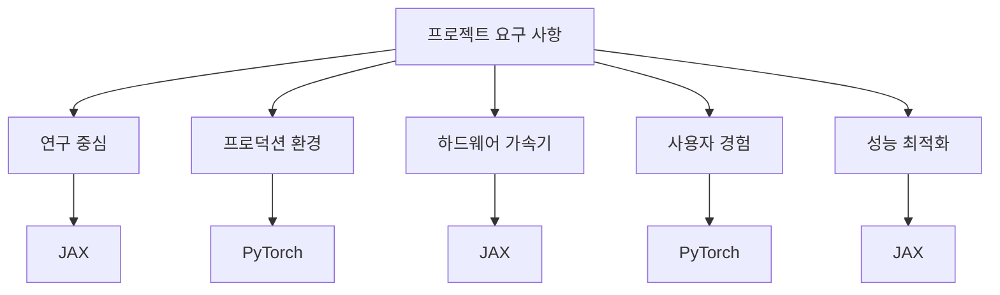

이와 같은 기준을 바탕으로 JAX와 PyTorch 중 적합한 프레임워크를 선택할 수 있다. 각 프레임워크의 장단점을 잘 이해하고, 프로젝트의 특성에 맞는 선택을 하는 것이 중요하다.

<!--
## FAQ
   - JAX와 PyTorch의 주요 차이점은 무엇인가요?
   - JAX를 배우기 위한 추천 자료는 무엇인가요?
   - PyTorch의 커뮤니티 지원은 어떤가요?
-->

## FAQ

**JAX와 PyTorch의 주요 차이점은 무엇인가요?**

JAX와 PyTorch는 모두 딥러닝 프레임워크로 널리 사용되지만, 몇 가지 주요 차이점이 존재한다. 첫째, JAX는 함수형 프로그래밍 패러다임을 따르며, NumPy와 유사한 API를 제공하여 수학적 계산을 쉽게 수행할 수 있도록 돕는다. 반면, PyTorch는 객체 지향 프로그래밍을 기반으로 하며, 동적 계산 그래프를 통해 유연한 모델 설계를 지원한다. 

둘째, JAX는 JIT(Just-In-Time) 컴파일을 통해 성능을 최적화할 수 있으며, GPU 및 TPU와 같은 하드웨어 가속기를 효과적으로 활용할 수 있다. PyTorch도 GPU 가속을 지원하지만, JAX의 JIT 컴파일 기능은 성능 면에서 더 우수할 수 있다.

셋째, JAX는 자동 미분 기능을 제공하여 복잡한 함수의 미분을 쉽게 계산할 수 있으며, 이는 연구 및 실험에 유리하다. PyTorch 역시 자동 미분 기능을 제공하지만, JAX의 접근 방식은 더 직관적일 수 있다.

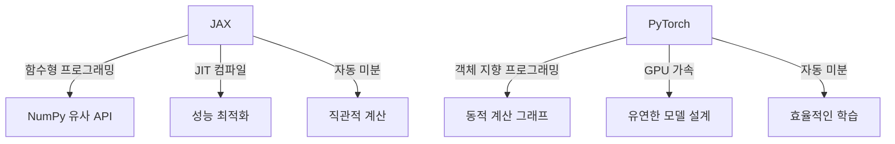

**JAX를 배우기 위한 추천 자료는 무엇인가요?**

JAX를 배우기 위한 자료로는 다음과 같은 리소스가 있다. 첫째, JAX의 공식 문서가 가장 기본적이고 유용한 자료이다. 공식 문서에서는 JAX의 설치 방법, 기본 사용법, 고급 기능 등을 상세히 설명하고 있다. 

둘째, Google의 JAX 튜토리얼은 실습을 통해 JAX의 기능을 익힐 수 있는 좋은 자료이다. 이 튜토리얼에서는 다양한 예제를 통해 JAX의 사용법을 배울 수 있다.

셋째, GitHub에 있는 JAX 관련 프로젝트와 예제 코드를 참고하는 것도 좋은 방법이다. 실제 코드 예제를 통해 JAX의 활용 사례를 이해할 수 있다.

**PyTorch의 커뮤니티 지원은 어떤가요?**

PyTorch는 매우 활발한 커뮤니티를 가지고 있으며, 다양한 지원을 제공한다. 공식 포럼과 GitHub 저장소에서는 사용자들이 질문을 하고 답변을 받을 수 있는 공간이 마련되어 있다. 

또한, PyTorch는 다양한 온라인 강좌와 튜토리얼이 존재하여 초보자부터 고급 사용자까지 학습할 수 있는 기회를 제공한다. 특히, Coursera, Udacity, edX와 같은 플랫폼에서 제공하는 PyTorch 관련 강좌는 많은 인기를 끌고 있다.

마지막으로, PyTorch의 커뮤니티는 연구자와 개발자들이 활발히 참여하고 있어, 최신 연구 결과와 기술 동향을 쉽게 접할 수 있는 장점이 있다. 이러한 커뮤니티 지원은 PyTorch를 배우고 사용하는 데 큰 도움이 된다.

<!--
## 관련 기술
   - TensorFlow와의 비교
   - 딥러닝 모델 배포를 위한 MLOps 도구
   - 최신 딥러닝 연구 동향
-->

## 관련 기술

**TensorFlow와의 비교**  
TensorFlow는 구글이 개발한 오픈소스 딥러닝 프레임워크로, JAX와 PyTorch와 함께 가장 널리 사용되는 프레임워크 중 하나이다. TensorFlow는 정적 계산 그래프를 기반으로 하여, 모델을 정의한 후에 그래프를 컴파일하고 실행하는 방식이다. 반면, JAX는 함수 변환을 통해 동적 계산 그래프를 지원하며, PyTorch는 동적 계산 그래프를 기본으로 하여 유연한 모델링이 가능하다. 이러한 차이로 인해 TensorFlow는 대규모 모델 학습에 적합한 반면, JAX와 PyTorch는 연구 및 프로토타입 개발에 더 유리한 경향이 있다.

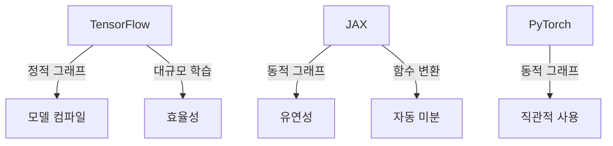

**딥러닝 모델 배포를 위한 MLOps 도구**  
MLOps는 머신러닝과 DevOps의 결합으로, 모델의 개발, 배포, 운영을 통합적으로 관리하는 접근 방식이다. MLOps 도구는 모델의 버전 관리, 자동화된 배포, 모니터링 및 피드백 루프를 제공하여, 모델의 성능을 지속적으로 개선할 수 있도록 돕는다. 대표적인 MLOps 도구로는 MLflow, Kubeflow, TFX(TensorFlow Extended) 등이 있으며, 이들은 다양한 딥러닝 프레임워크와 통합되어 사용될 수 있다.

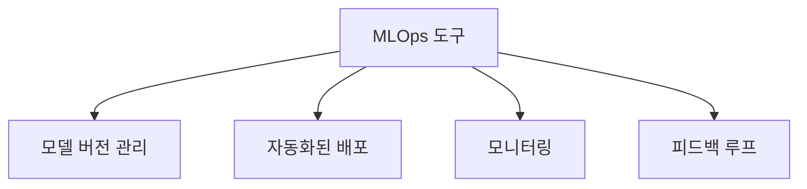

**최신 딥러닝 연구 동향**  
딥러닝 분야는 빠르게 발전하고 있으며, 최신 연구 동향은 다양한 방향으로 진행되고 있다. 최근에는 Transformer 기반 모델이 자연어 처리(NLP)와 컴퓨터 비전(CV) 분야에서 큰 성과를 내고 있으며, 이러한 모델들은 대규모 데이터셋을 활용하여 사전 학습(pre-training) 후 특정 작업에 맞게 미세 조정(fine-tuning)하는 방식으로 사용된다. 또한, 자율주행, 의료 영상 분석, 생성적 적대 신경망(GAN) 등 다양한 응용 분야에서 딥러닝 기술이 활발히 연구되고 있다.

이러한 최신 동향을 반영하여 JAX와 PyTorch는 각각의 프레임워크에서 새로운 기능과 최적화를 지속적으로 추가하고 있으며, 연구자와 개발자들은 이러한 도구들을 활용하여 혁신적인 모델을 개발하고 있다.

<!--
## 참고 자료
   - JAX 및 PyTorch 공식 문서 링크
   - 관련 블로그 및 튜토리얼 링크
   - 추천 도서 및 온라인 강좌
-->

## 참고 자료

딥러닝 프레임워크인 JAX와 PyTorch를 배우고 활용하기 위해 유용한 자료들을 소개한다. 이 자료들은 공식 문서, 블로그, 튜토리얼, 추천 도서 및 온라인 강좌로 구성되어 있으며, 각 자료는 두 프레임워크의 이해를 돕는 데 큰 도움이 될 것이다.

**JAX 및 PyTorch 공식 문서 링크**  
- [JAX 공식 문서](https://jax.readthedocs.io/en/latest/)  
  JAX의 설치 방법, 기본 사용법, 고급 기능에 대한 자세한 설명이 포함되어 있다.  
- [PyTorch 공식 문서](https://pytorch.org/docs/stable/index.html)  
  PyTorch의 다양한 기능과 API에 대한 정보를 제공하며, 예제 코드도 풍부하다.

**관련 블로그 및 튜토리얼 링크**  
- [JAX 튜토리얼](https://jax.readthedocs.io/en/latest/notebooks/index.html)  
  JAX의 기본 개념과 사용법을 단계별로 설명하는 튜토리얼이 포함되어 있다.  
- [PyTorch 튜토리얼](https://pytorch.org/tutorials/)  
  PyTorch의 다양한 예제와 실습을 통해 프레임워크를 익힐 수 있는 자료가 제공된다.

**추천 도서 및 온라인 강좌**  
- **추천 도서**  
  - "Deep Learning with JAX"  
    JAX를 활용한 딥러닝 모델 구축에 대한 심도 있는 내용을 다룬 책이다.  
  - "Programming PyTorch for Deep Learning"  
    PyTorch를 이용한 딥러닝 모델 개발에 대한 실용적인 가이드를 제공하는 책이다.  

- **온라인 강좌**  
  - [Coursera: Introduction to Deep Learning with JAX](https://www.coursera.org/learn/deep-learning-jax)  
    JAX를 이용한 딥러닝의 기초를 배우는 강좌로, 실습 중심의 내용이 포함되어 있다.  
  - [Udacity: Intro to Machine Learning with PyTorch](https://www.udacity.com/course/intro-to-machine-learning-with-pytorch--ud188)  
    PyTorch를 활용한 머신러닝의 기초를 배우는 강좌로, 다양한 프로젝트를 통해 실력을 쌓을 수 있다.

이 자료들은 JAX와 PyTorch를 배우고 활용하는 데 큰 도움이 될 것이며, 각 프레임워크의 특징과 장점을 이해하는 데 기여할 것이다. 

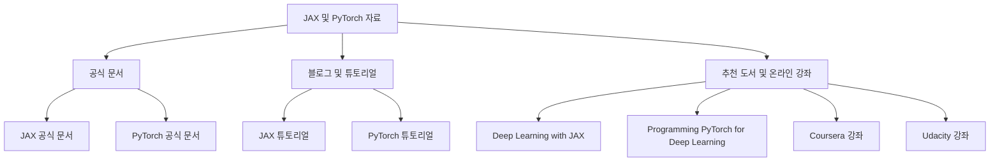

이 다이어그램은 JAX와 PyTorch에 대한 참고 자료의 구조를 시각적으로 나타내며, 각 자료의 관계를 쉽게 이해할 수 있도록 돕는다.

<!--
##### Reference #####
-->

## Reference


* [https://www.newhorizons.com/resources/blog/jax-vs-pytorch-comparing-two-deep-learning-frameworks?ref=blog.paperspace.com](https://www.newhorizons.com/resources/blog/jax-vs-pytorch-comparing-two-deep-learning-frameworks?ref=blog.paperspace.com)
* [https://blog.paperspace.com/pytorch-vs-jax/](https://blog.paperspace.com/pytorch-vs-jax/)
* [https://myscale.com/blog/jax-vs-pytorch-comprehensive-comparison-deep-learning/](https://myscale.com/blog/jax-vs-pytorch-comprehensive-comparison-deep-learning/)
* [https://geekflare.com/jax-vs-pytorch/](https://geekflare.com/jax-vs-pytorch/)
* [https://utsavstha.medium.com/jax-vs-pytorch-a-comprehensive-comparison-for-deep-learning-10a84f934e17](https://utsavstha.medium.com/jax-vs-pytorch-a-comprehensive-comparison-for-deep-learning-10a84f934e17)

