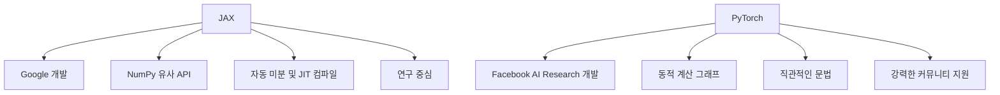
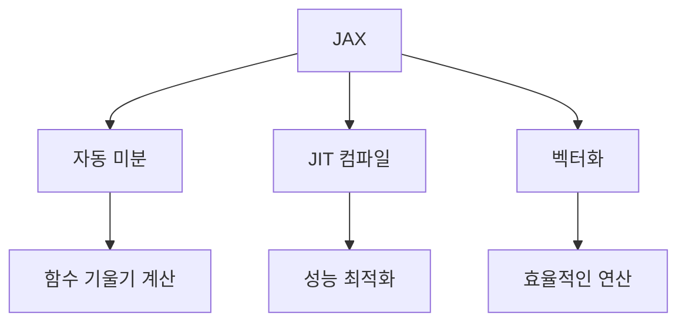
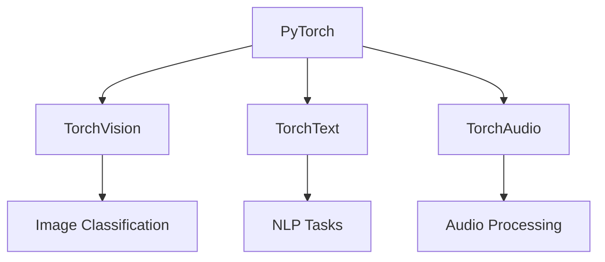
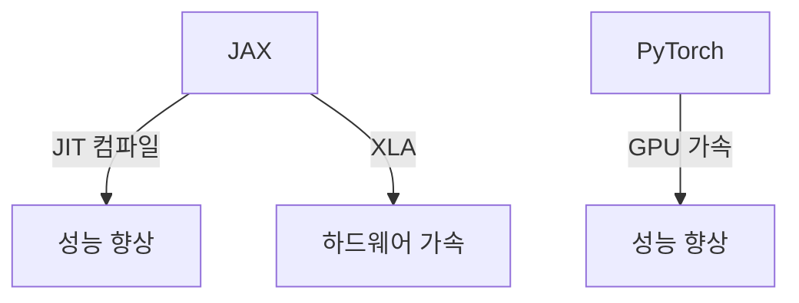
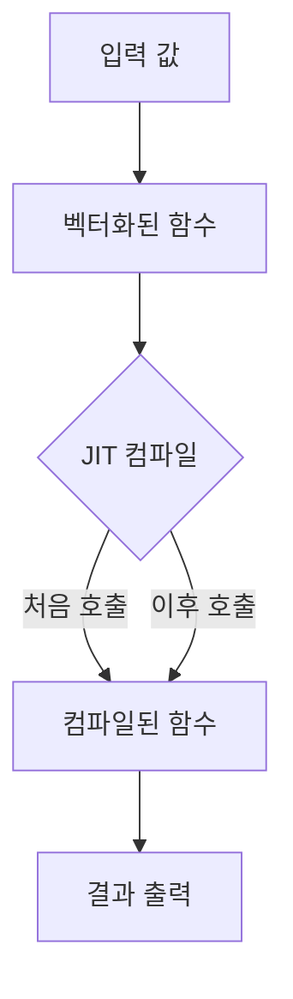
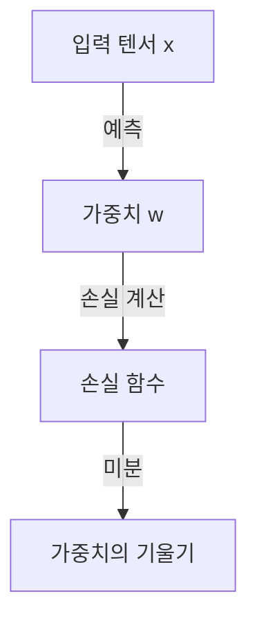
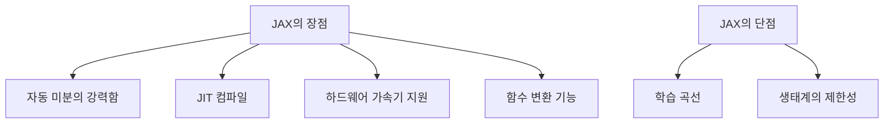
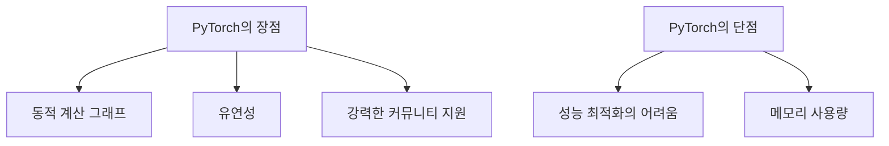
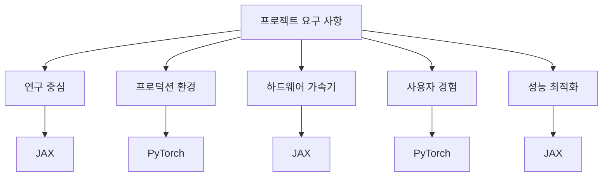

딥러닝은 인공지능(AI) 분야에서 핵심 역할을 하며, 이미지 인식·자연어 처리·자율주행 등 다양한 영역에서 쓰인다. 효과적인 모델 개발과 배포를 위해서는 **프레임워크 선택**이 중요하다. 프레임워크는 개발 속도, 실행 성능, 유지보수성에 직결된다. 이 글에서는 **JAX**와 **PyTorch**를 설계 철학, 문법, 성능, 생태계, 사용 사례까지 비교해 프로젝트에 맞는 선택 기준를 제시한다.

---

## 개요

### 딥러닝의 중요성과 프레임워크 선택

딥러닝의 발전은 대량 데이터와 강한 연산 자원의 결합 덕분에 가능해졌다. 딥러닝 프레임워크는 연구자·개발자가 복잡한 모델을 구현하고 실험하는 데 필수다. 프레임워크 선택이 미치는 영향은 다음과 같다.

- **개발 속도**: 직관적인 API와 풍부한 문서는 프로토타이핑 속도를 높인다.
- **성능**: CPU·GPU·TPU 등 하드웨어 활용 방식에 따라 학습·추론 속도가 달라진다.
- **커뮤니티**: 활발한 커뮤니티는 문제 해결, 튜토리얼, 라이브러리 확장에 유리하다.

### JAX와 PyTorch 소개 및 배경

**JAX**는 Google이 만든 오픈 소스 라이브러리로, NumPy 스타일 API에 자동 미분·JIT 컴파일·벡터화를 결합한 **함수형** 수치 계산 프레임워크다. 연구·고성능 수치 연산에 적합하다.

**PyTorch**는 Meta(Facebook) AI Research에서 개발한 오픈 소스 딥러닝 프레임워크로, **동적 계산 그래프**와 Pythonic API로 유연한 모델 설계와 디버깅이 쉽다. 교육·연구·프로덕션 모두에서 널리 쓰인다.

두 프레임워크의 위치를 정리하면 아래와 같다.


```mermaid
graph TD
    JaxRoot["JAX"]
    JaxRoot --> JaxGoogle["Google 개발"]
    JaxRoot --> JaxApi["NumPy 유사 API"]
    JaxRoot --> JaxJit["자동 미분 및 JIT 컴파일"]
    JaxRoot --> JaxResearch["연구 중심"]
    PytorchRoot["PyTorch"]
    PytorchRoot --> PytorchMeta["Facebook AI Research 개발"]
    PytorchRoot --> PytorchGraph["동적 계산 그래프"]
    PytorchRoot --> PytorchApi["직관적인 문법"]
    PytorchRoot --> PytorchCommunity["강력한 커뮤니티 지원"]
```

---

## JAX 개요

### 정의 및 주요 기능

JAX는 **NumPy 스타일 API**에 **자동 미분**, **JIT 컴파일**, **GPU/TPU 가속**을 더한 고성능 배열 연산·프로그램 변환 라이브러리다. 연구·프로토타입에 적합하다.

- **자동 미분**: `grad` 등으로 함수의 미분을 자동 계산해 복잡한 수식·모델 구현을 단순화한다.
- **JIT 컴파일**: Just-In-Time 컴파일로 반복 실행 시 성능을 크게 높인다.
- **벡터화**: `vmap`으로 단일 샘플용 함수를 배치 처리 가능한 함수로 변환한다.

예: 간단한 미분과 JIT 사용.

```python
import jax.numpy as jnp
from jax import grad

def f(x):
    return x ** 2 + 2 * x + 1

df = grad(f)
print(df(3.0))  # 8.0
```

```python
from jax import jit

@jit
def compute(x):
    return jnp.sin(x) ** 2 + jnp.cos(x) ** 2

result = compute(1.0)
```

### 성능 최적화 및 하드웨어 가속

JAX는 **XLA(Accelerated Linear Algebra)** 백엔드를 사용해 GPU·TPU에서 효율적으로 동작한다. `jax.device_put`으로 데이터를 특정 디바이스로 옮겨 대규모 학습·추론을 가속할 수 있다.

```python
import jax
from jax import random

key = random.PRNGKey(0)
x = random.normal(key, (1000, 1000))
x_device = jax.device_put(x)
```

### 자동 미분 및 함수 변환

`grad`, `jit`, `vmap`, `pmap` 등 **함수 변환**을 조합해 한 번 정의한 함수를 미분·컴파일·벡터화·병렬화할 수 있다. 이 조합 가능성이 JAX의 강점이다.


```mermaid
graph TD
    JaxCore["JAX"]
    JaxCore --> AutoDiff["자동 미분"]
    JaxCore --> JitCompile["JIT 컴파일"]
    JaxCore --> Vmap["벡터화"]
    AutoDiff --> GradCalc["함수 기울기 계산"]
    JitCompile --> PerfOpt["성능 최적화"]
    Vmap --> EfficientOp["효율적인 연산"]
```

---

## PyTorch 개요

### 정의 및 주요 기능

PyTorch는 **동적 계산 그래프** 기반 오픈 소스 딥러닝 프레임워크로, 연구와 프로덕션 모두를 염두에 두고 설계되었다.

- **동적 계산 그래프**: 실행 시점에 그래프가 만들어져 조건문·반복문을 포함한 모델 구현과 디버깅이 쉽다.
- **자동 미분**: `requires_grad`와 `backward()`로 그래디언트를 자동 계산한다.
- **GPU 가속**: CUDA 등으로 GPU 연산을 지원해 대규모 모델·데이터를 다룬다.

### 동적 계산 그래프와 유연성

동적 그래프 덕분에 코드를 쓰는 대로 그래프가 구성되므로, 제어 흐름이 복잡한 모델도 자연스럽게 표현할 수 있다.

```python
import torch

x = torch.tensor([1.0, 2.0], requires_grad=True)
y = torch.tensor([3.0, 4.0], requires_grad=True)
z = x + y
z.backward(torch.tensor([1.0, 1.0]))

print(x.grad)  # tensor([1., 1.])
print(y.grad)  # tensor([1., 1.])
```

### 커뮤니티 및 생태계

TorchVision(비전), TorchText(NLP), TorchAudio(오디오) 등 도메인 라이브러리가 잘 갖춰져 있고, 튜토리얼·논문 구현·오픈소스 프로젝트가 풍부하다.


```mermaid
graph TD
    PytorchCore["PyTorch"]
    PytorchCore --> TorchVision["TorchVision"]
    PytorchCore --> TorchText["TorchText"]
    PytorchCore --> TorchAudio["TorchAudio"]
    TorchVision --> ImgClass["Image Classification"]
    TorchText --> NlpTasks["NLP Tasks"]
    TorchAudio --> AudioProc["Audio Processing"]
```

---

## JAX와 PyTorch 비교

### 비교 요약표

| 항목 | JAX | PyTorch |
|------|-----|---------|
| **패러다임** | 함수형, 변환 조합 | 객체 지향, 동적 그래프 |
| **API 스타일** | NumPy 유사 | Pythonic, `nn.Module` 등 |
| **컴파일** | JIT·XLA 기본 활용 | Eager 기본, `torch.compile` 선택 |
| **하드웨어** | GPU·TPU·CPU | GPU·CPU·MPS 등 |
| **학습 곡선** | 함수형·변환 이해 필요 | 상대적으로 완만 |
| **생태계** | 성장 중, 연구 중심 | 매우 큼, 산업·교육 전반 |
| **메모리** | 불변성·함수형으로 효율적 | 동적 그래프로 유연, 대규모 시 주의 |

### 문법 및 사용 용이성

PyTorch는 Python에 익숙한 개발자에게 직관적이고, 실행 중 즉시 결과를 보며 디버깅하기 쉽다. JAX는 함수형·변환(grad, jit, vmap)에 익숙해져야 하므로 초입 진입 장벽이 다소 높을 수 있다.

```python
# PyTorch 예제
import torch
x = torch.tensor([1.0, 2.0, 3.0], requires_grad=True)
y = x ** 2
y.backward(torch.tensor([1.0, 1.0, 1.0]))
print(x.grad)  # tensor([2., 4., 6.])
```

### 성능 및 속도

JAX는 XLA·JIT로 연산을 융합·최적화해 GPU·TPU에서 매우 높은 처리량을 낼 수 있다. PyTorch도 `torch.compile` 등으로 점점 컴파일 기반 최적화가 보강되고 있다. 대규모 배치·긴 학습에서는 JAX가 유리한 경우가 많다.


```mermaid
graph TD
    JaxPerf["JAX"]
    JaxPerf -->|"JIT 컴파일"| JaxPerfUp["성능 향상"]
    JaxPerf -->|"XLA"| JaxHw["하드웨어 가속"]
    PytorchPerf["PyTorch"]
    PytorchPerf -->|"GPU 가속"| PytorchPerfUp["성능 향상"]
```

### 자동 미분

JAX는 `grad(f)`처럼 **함수**를 받아 미분된 함수를 반환하는 방식이고, PyTorch는 **텐서**에 `requires_grad=True`를 두고 `backward()`로 그래프를 따라 기울기를 계산한다. JAX는 고차 미분·Jacobian 등 수학적 변환 조합에, PyTorch는 레이어 단위 실험과 디버깅에 각각 유리하다.

### 생태계 및 커뮤니티

PyTorch는 오래되고 사용자·라이브러리·강의가 많아 초보자·실무 배포에 유리하다. JAX는 Google 지원 아래 연구·고성능 연산 쪽 생태계가 빠르게 늘고 있다.

### 메모리 효율성 및 확장성

JAX는 불변 배열·순수 함수를 전제로 해 대규모 모델에서 메모리 사용을 예측·최적화하기 쉽다. PyTorch는 동적 그래프로 유연하지만, 매우 큰 모델에서는 그래디언트 체크포인팅·분산 학습 설정이 더 중요해진다.

---

## JAX 예제

### 미분 계산

\( f(x) = x^2 + 3x + 2 \)의 미분을 JAX로 계산하는 예이다.

```python
import jax.numpy as jnp
from jax import grad

def f(x):
    return x ** 2 + 3 * x + 2

df_dx = grad(f)
x_value = 1.0
print("f'({}) = {}".format(x_value, df_dx(x_value)))
```

### JIT과 벡터화

`@jit`으로 컴파일하고, `jnp.linspace`로 만든 구간에서 \( \sin^2 x + \cos^2 x \)를 벡터화해 계산한다.

```python
import jax.numpy as jnp
from jax import jit

@jit
def vectorized_function(x):
    return jnp.sin(x) ** 2 + jnp.cos(x) ** 2

x_values = jnp.linspace(0, 2 * jnp.pi, 1000)
result = vectorized_function(x_values)
```


```mermaid
graph TD
    InputVal["입력 값"]
    InputVal --> VecFunc["벡터화된 함수"]
    VecFunc --> JitCheck{"JIT 컴파일"}
    JitCheck -->|"처음 호출"| CompiledFunc["컴파일된 함수"]
    JitCheck -->|"이후 호출"| CompiledFunc
    CompiledFunc --> OutputResult["결과 출력"]
```

---

## PyTorch 예제

### 미분 계산

\( f(x) = x^2 \)에서 \( x=2 \)일 때의 미분값을 `autograd`로 구한다.

```python
import torch

x = torch.tensor(2.0, requires_grad=True)
y = x ** 2
y.backward()
print("f'(x) at x=2.0:", x.grad)
```

### 동적 그래프와 손실·기울기

입력과 가중치에 대해 예측과 손실을 정의한 뒤 `backward()`로 가중치 그래디언트를 계산한다.

```python
import torch

x = torch.tensor([1.0, 2.0, 3.0], requires_grad=True)
w = torch.tensor([0.5, 0.5, 0.5], requires_grad=True)
y_pred = torch.dot(x, w)
loss = (y_pred - 1) ** 2
loss.backward()
print("Gradient of w:", w.grad)
```


```mermaid
graph TD
    InputTensor["입력 텐서 x"]
    InputTensor -->|"예측"| WeightW["가중치 w"]
    WeightW -->|"손실 계산"| LossFunc["손실 함수"]
    LossFunc -->|"미분"| GradW["가중치의 기울기"]
```

---

## 장단점 정리

### JAX

**장점**

- 자동 미분이 강하고 고차 미분·조합이 자연스럽다.
- JIT·XLA로 GPU·TPU에서 높은 성능을 낼 수 있다.
- `grad`·`jit`·`vmap`·`pmap` 등 함수 변환 조합이 유연하다.
- 불변성·함수형으로 메모리·재현성 관리에 유리하다.

**단점**

- 함수형·변환 개념 학습이 필요해 초보자에게는 진입 장벽이 있다.
- PyTorch·TensorFlow보다 생태계·자료 규모는 작다.


```mermaid
graph TD
    JaxPros["JAX의 장점"]
    JaxPros --> P1["자동 미분의 강력함"]
    JaxPros --> P2["JIT 컴파일"]
    JaxPros --> P3["하드웨어 가속기 지원"]
    JaxPros --> P4["함수 변환 기능"]
    JaxCons["JAX의 단점"]
    JaxCons --> C1["학습 곡선"]
    JaxCons --> C2["생태계의 제한성"]
```

### PyTorch

**장점**

- 동적 계산 그래프로 디버깅과 실험이 쉽다.
- 다양한 아키텍처를 빠르게 구현할 수 있는 유연성이 있다.
- 커뮤니티·튜토리얼·사전 학습 모델이 풍부하다.

**단점**

- JAX 대비 극한 성능 튜닝·메모리 제어는 상대적으로 손이 더 간다.
- 대규모 모델에서는 메모리·분산 설정을 따로 신경 써야 한다.


```mermaid
graph TD
    PytorchPros["PyTorch의 장점"]
    PytorchPros --> PtorchP1["동적 계산 그래프"]
    PytorchPros --> PtorchP2["유연성"]
    PytorchPros --> PtorchP3["강력한 커뮤니티 지원"]
    PytorchCons["PyTorch의 단점"]
    PytorchCons --> PtorchC1["성능 최적화의 어려움"]
    PytorchCons --> PtorchC2["메모리 사용량"]
```

---

## 사용 사례

### JAX가 잘 맞는 경우

- **연구·알고리즘 프로토타입**: 새로운 최적화·아키텍처를 함수 변환으로 빠르게 실험할 때.
- **고성능·대규모 연산**: GPU·TPU에서 큰 배치·긴 시퀀스를 다룰 때.
- **수학적 모델링**: 물리·시뮬레이션·확률 모델 등 수식 중심 모델을 다룰 때.

### PyTorch가 잘 맞는 경우

- **딥러닝 모델 개발**: CNN·RNN·Transformer 등 표준 아키텍처를 빠르게 구현·실험할 때.
- **교육·입문**: 자료가 많고 디버깅이 쉬워 학습용으로 적합하다.
- **프로덕션 배포**: TorchScript·ONNX·다양한 런타임과의 연동이 잘 갖춰져 있을 때.

---

## 결론 및 선택 가이드

### 선택 기준

- **목적**: 연구·극한 성능 → JAX, 교육·실무·배포·생태계 → PyTorch.
- **경험**: 함수형·수치 연산에 익숙하면 JAX, 일반 Python·OOP에 익숙하면 PyTorch가 진입이 쉽다.
- **하드웨어**: TPU·Google 클라우드 중심이면 JAX, 범용 GPU·온프레미스면 PyTorch도 무난하다.

### 프로젝트별 가이드

1. **연구·실험 중심**: JAX 추천. 고급 자동 미분·JIT·벡터화 조합에 유리하다.
2. **프로덕션·팀 협업**: PyTorch 추천. 문서·도구·인력 풀이 크다.
3. **TPU·대규모 배치**: JAX가 유리한 경우가 많다.
4. **입문·교육**: PyTorch 추천. 자료와 커뮤니티가 풍부하다.
5. **성능 극한 추구**: JAX의 JIT·XLA가 유리할 수 있다.


```mermaid
graph TD
    ReqRoot["프로젝트 요구 사항"]
    ReqRoot --> Research["연구 중심"]
    Research --> ChooseJax1["JAX"]
    ReqRoot --> Prod["프로덕션 환경"]
    Prod --> ChoosePytorch1["PyTorch"]
    ReqRoot --> HwAccel["하드웨어 가속기"]
    HwAccel --> ChooseJax2["JAX"]
    ReqRoot --> UserExp["사용자 경험"]
    UserExp --> ChoosePytorch2["PyTorch"]
    ReqRoot --> PerfOpt["성능 최적화"]
    PerfOpt --> ChooseJax3["JAX"]
```

---

## FAQ

**Q. JAX와 PyTorch의 가장 큰 차이는?**

JAX는 **함수형**이고 **함수 변환**(grad, jit, vmap)을 조합하는 방식이며, NumPy 스타일 API와 XLA 기반 JIT으로 성능을 끌어올린다. PyTorch는 **동적 계산 그래프**와 **객체 지향 API**로, 즉시 실행(eager)과 디버깅이 쉽고 생태계가 크다. 자동 미분은 둘 다 지원하지만, JAX는 “함수를 넣으면 미분된 함수가 나온다”는 식으로 조합 가능하다.

**Q. JAX 학습 자료는?**

[JAX 공식 문서](https://jax.readthedocs.io/en/latest/)와 [Getting Started](https://jax.readthedocs.io/en/latest/beginner_guide.html), [JAX 101](https://jax.readthedocs.io/en/latest/jax-101.html)을 추천한다. GitHub의 JAX 예제·논문 구현도 도움이 된다.

**Q. PyTorch 커뮤니티는?**

[PyTorch 포럼](https://discuss.pytorch.org/), [GitHub 이슈](https://github.com/pytorch/pytorch), [공식 튜토리얼](https://pytorch.org/tutorials/)이 활발하다. 입문부터 분산 학습·배포까지 단계별 자료가 많다.

---

## 관련 기술

- **TensorFlow**: 정적 그래프 전통이 있고, Keras 통합·프로덕션 파이프라인(TFX 등)이 강점이다. JAX·PyTorch는 연구·프로토타입에 더 많이 쓰인다.
- **MLOps**: MLflow, Kubeflow, TFX 등은 모델 버전 관리·배포·모니터링을 지원하며, JAX·PyTorch 모델도 연동 가능하다.
- **최신 동향**: Transformer·대규모 사전 학습·멀티모달 모델이 주류인 가운데, JAX·PyTorch 모두 해당 영역에서 기능을 확장하고 있다.

---

## 참고 자료

- [JAX 공식 문서](https://jax.readthedocs.io/en/latest/) — 설치, API, 변환(transform) 설명.
- [PyTorch 공식 문서](https://pytorch.org/docs/stable/index.html) — API 레퍼런스 및 가이드.
- [PyTorch 튜토리얼](https://pytorch.org/tutorials/) — 초급·중급·고급 실습.
- [Comparing PyTorch and JAX (Paperspace Blog)](https://blog.paperspace.com/pytorch-vs-jax/) — 두 프레임워크 비교 소개.

---

## Reference

- [JAX: High performance array computing](https://jax.readthedocs.io/en/latest/)
- [PyTorch documentation](https://pytorch.org/docs/stable/index.html)
- [Comparing PyTorch and JAX \| Paperspace Blog](https://blog.paperspace.com/pytorch-vs-jax/)
