관계형 데이터베이스와 비관계형 데이터베이스는 데이터 저장 및 관리 방식에서 본질적으로 다르다. 관계형 데이터베이스는 데이터를 테이블 형식으로 저장하며, 각 테이블은 행과 열로 구성되어 있다. 이러한 구조는 데이터의 무결성과 일관성을 유지하는 데 유리하며, SQL(Structured Query Language)을 사용하여 데이터를 쿼리하고 조작할 수 있다. 반면, 비관계형 데이터베이스는 데이터가 테이블에 제한되지 않고 다양한 형식으로 저장될 수 있는 유연성을 제공한다. 이러한 데이터베이스는 대량의 비정형 데이터나 반정형 데이터를 처리하는 데 적합하며, 수평적 확장이 용이하여 대규모 애플리케이션에 적합하다. 비관계형 데이터베이스는 JSON, XML과 같은 형식으로 데이터를 저장하며, 데이터 모델이 동적으로 변화할 수 있는 장점이 있다. 이처럼 두 데이터베이스 유형은 각각의 장단점이 있으며, 특정 비즈니스 요구 사항에 따라 적절한 선택이 필요하다. 데이터의 구조, 처리 방식, 성능 요구 사항 등을 고려하여 적합한 데이터베이스를 선택하는 것이 중요하다.


||
|:---:|
||


<!--
##### Outline #####
-->

<!--
# 목차

## 1. 개요
   - 데이터베이스의 중요성
   - 관계형 데이터베이스와 비관계형 데이터베이스의 정의

## 2. 관계형 데이터베이스 (RDBMS)
   - 2.1. 관계형 데이터베이스의 구조
       - 테이블, 행, 열의 개념
       - 기본 키와 외래 키
   - 2.2. 관계형 데이터베이스의 특징
       - ACID 원칙
       - 데이터 무결성 및 일관성
   - 2.3. 관계형 데이터베이스의 장점
       - 복잡한 쿼리 처리
       - 데이터 정확성
   - 2.4. 관계형 데이터베이스의 단점
       - 수직적 확장성의 한계
       - 스키마의 경직성
   - 2.5. 관계형 데이터베이스의 예
       - MySQL, PostgreSQL, Oracle Database, Microsoft SQL Server

## 3. 비관계형 데이터베이스 (NoSQL)
   - 3.1. 비관계형 데이터베이스의 구조
       - 다양한 데이터 모델 (문서, 키-값, 그래프, 열 기반)
   - 3.2. 비관계형 데이터베이스의 특징
       - 스키마 유연성
       - 수평적 확장성
   - 3.3. 비관계형 데이터베이스의 장점
       - 대량의 비정형 데이터 처리
       - 빠른 성능
   - 3.4. 비관계형 데이터베이스의 단점
       - 데이터 무결성 문제
       - 복잡한 트랜잭션 처리의 어려움
   - 3.5. 비관계형 데이터베이스의 예
       - MongoDB, Cassandra, Redis, Couchbase

## 4. 관계형 데이터베이스와 비관계형 데이터베이스의 비교
   - 4.1. 데이터 구조의 차이
   - 4.2. 쿼리 언어의 차이
   - 4.3. 확장성의 차이
   - 4.4. 성능의 차이
   - 4.5. 사용 사례의 차이

## 5. 데이터베이스 선택 가이드
   - 5.1. 데이터 유형에 따른 선택
   - 5.2. 데이터 양에 따른 선택
   - 5.3. 관리 및 유지보수 리소스 고려
   - 5.4. 실시간 데이터 처리 필요성

## 6. 예제
   - 6.1. 관계형 데이터베이스 사용 사례
       - 금융 시스템, CRM 시스템
   - 6.2. 비관계형 데이터베이스 사용 사례
       - 소셜 미디어, IoT 애플리케이션

## 7. FAQ
   - 7.1. 비관계형 데이터베이스의 주요 장점은 무엇인가요?
   - 7.2. 관계형 데이터베이스를 언제 선택해야 하나요?
   - 7.3. 비관계형 데이터베이스의 예시는 무엇인가요?
   - 7.4. 비관계형 데이터베이스에서 수평적 확장은 어떻게 이루어지나요?

## 8. 관련 기술
   - 8.1. 데이터 웨어하우스와 데이터 레이크
   - 8.2. 클라우드 기반 데이터베이스
   - 8.3. 빅데이터 기술과의 통합

## 9. 결론
   - 데이터베이스 선택의 중요성
   - 관계형과 비관계형 데이터베이스의 미래 전망

## 10. 추가 자료
   - 10.1. 추천 도서 및 온라인 강의
   - 10.2. 관련 블로그 및 웹사이트

이 목차는 관계형 데이터베이스와 비관계형 데이터베이스에 대한 포괄적인 이해를 제공하며, 각 섹션은 독자가 데이터베이스 선택에 대한 정보와 통찰력을 얻을 수 있도록 구성되어 있습니다.
-->

<!--
## 1. 개요
   - 데이터베이스의 중요성
   - 관계형 데이터베이스와 비관계형 데이터베이스의 정의
-->

## 1. 개요

데이터베이스는 현대 정보 시스템의 핵심 구성 요소로, 데이터를 효율적으로 저장하고 관리하는 시스템이다. 데이터베이스는 다양한 형태의 데이터를 구조화하여 저장할 수 있으며, 이를 통해 데이터의 검색, 수정, 삭제 및 추가 작업을 용이하게 수행할 수 있다. 데이터베이스의 중요성은 다음과 같은 여러 측면에서 나타난다.

**1.1. 데이터베이스의 중요성**

1. **데이터 관리의 효율성**: 데이터베이스는 대량의 데이터를 체계적으로 관리할 수 있는 기능을 제공한다. 이를 통해 데이터의 중복을 줄이고, 데이터의 일관성을 유지할 수 있다.
   
2. **데이터 접근성**: 데이터베이스는 사용자가 필요로 하는 데이터를 신속하게 검색할 수 있도록 설계되어 있다. SQL과 같은 쿼리 언어를 사용하여 복잡한 데이터 검색이 가능하다.

3. **보안성**: 데이터베이스는 사용자 권한 관리 기능을 통해 데이터에 대한 접근을 제어할 수 있다. 이를 통해 민감한 정보의 보호가 가능하다.

4. **데이터 무결성**: 데이터베이스는 데이터의 정확성과 일관성을 보장하기 위한 다양한 제약 조건을 제공한다. 이를 통해 잘못된 데이터 입력을 방지할 수 있다.

**1.2. 관계형 데이터베이스와 비관계형 데이터베이스의 정의**

관계형 데이터베이스(RDBMS)는 데이터를 테이블 형태로 구조화하여 저장하는 데이터베이스 시스템이다. 각 테이블은 행과 열로 구성되며, 데이터 간의 관계를 정의할 수 있는 기본 키와 외래 키를 사용한다. 관계형 데이터베이스는 SQL(Structured Query Language)을 사용하여 데이터를 쿼리하고 조작할 수 있다.

비관계형 데이터베이스(NoSQL)는 관계형 데이터베이스와는 달리, 데이터를 테이블 형태로 구조화하지 않고 다양한 형태로 저장할 수 있는 데이터베이스 시스템이다. 비관계형 데이터베이스는 문서, 키-값, 그래프, 열 기반 등 여러 데이터 모델을 지원하며, 스키마가 유연하여 비정형 데이터를 처리하는 데 적합하다.

다음은 관계형 데이터베이스와 비관계형 데이터베이스의 구조를 비교한 다이어그램이다.

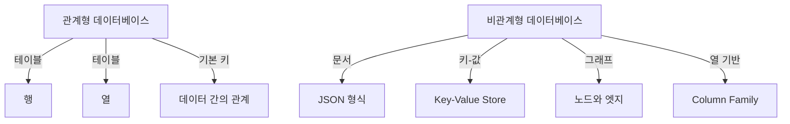

이와 같이 데이터베이스는 그 구조와 특성에 따라 다양한 형태로 존재하며, 각 데이터베이스의 선택은 사용자의 요구 사항에 따라 달라질 수 있다. 데이터베이스의 중요성을 이해하고, 관계형 및 비관계형 데이터베이스의 정의를 명확히 하는 것은 데이터 관리의 첫걸음이다.

<!--
## 2. 관계형 데이터베이스 (RDBMS)
   - 2.1. 관계형 데이터베이스의 구조
       - 테이블, 행, 열의 개념
       - 기본 키와 외래 키
   - 2.2. 관계형 데이터베이스의 특징
       - ACID 원칙
       - 데이터 무결성 및 일관성
   - 2.3. 관계형 데이터베이스의 장점
       - 복잡한 쿼리 처리
       - 데이터 정확성
   - 2.4. 관계형 데이터베이스의 단점
       - 수직적 확장성의 한계
       - 스키마의 경직성
   - 2.5. 관계형 데이터베이스의 예
       - MySQL, PostgreSQL, Oracle Database, Microsoft SQL Server
-->

## 2. 관계형 데이터베이스 (RDBMS)

관계형 데이터베이스(RDBMS)는 데이터를 테이블 형태로 저장하고, 이들 간의 관계를 정의하여 데이터를 관리하는 시스템이다. 이 섹션에서는 관계형 데이터베이스의 구조, 특징, 장점, 단점, 그리고 예에 대해 자세히 살펴보겠다.

**2.1. 관계형 데이터베이스의 구조**

관계형 데이터베이스는 기본적으로 테이블, 행, 열로 구성된다. 

- **테이블**: 데이터의 집합으로, 각 테이블은 특정한 주제를 가진 데이터를 저장한다.
- **행**: 테이블의 각 행은 하나의 레코드를 나타내며, 데이터의 개별 항목을 포함한다.
- **열**: 각 열은 특정한 속성을 나타내며, 데이터의 속성에 대한 정보를 제공한다.

기본 키와 외래 키는 데이터 간의 관계를 정의하는 중요한 요소이다.

- **기본 키**: 각 행을 고유하게 식별하는 열로, 중복된 값을 가질 수 없다.
- **외래 키**: 다른 테이블의 기본 키를 참조하여 두 테이블 간의 관계를 설정하는 열이다.

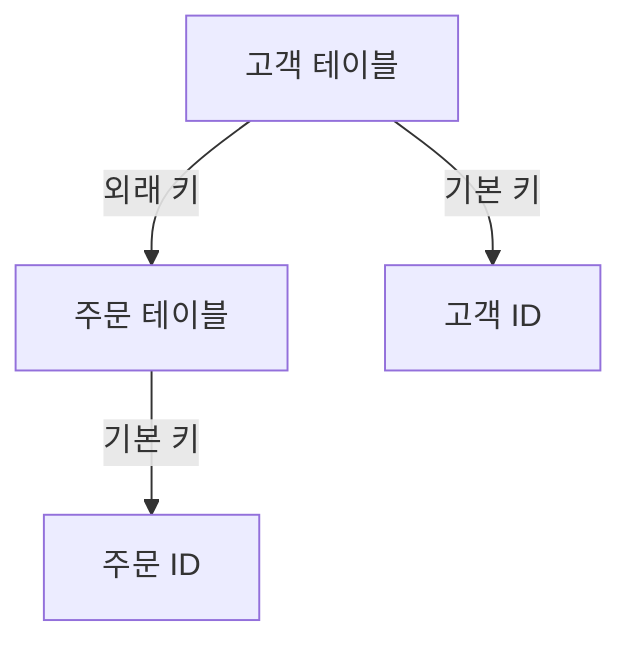

**2.2. 관계형 데이터베이스의 특징**

관계형 데이터베이스는 다음과 같은 특징을 가진다.

- **ACID 원칙**: 데이터베이스의 트랜잭션이 원자성, 일관성, 고립성, 지속성을 보장하는 원칙이다. 이 원칙은 데이터의 신뢰성을 높인다.
- **데이터 무결성 및 일관성**: 데이터의 정확성과 일관성을 유지하기 위한 제약 조건을 설정할 수 있다. 예를 들어, 외래 키 제약 조건을 통해 데이터의 무결성을 보장할 수 있다.

**2.3. 관계형 데이터베이스의 장점**

관계형 데이터베이스는 여러 가지 장점을 제공한다.

- **복잡한 쿼리 처리**: SQL(Structured Query Language)을 사용하여 복잡한 쿼리를 작성하고, 다양한 조건에 따라 데이터를 검색할 수 있다.
- **데이터 정확성**: 데이터 무결성 제약 조건을 통해 데이터의 정확성을 유지할 수 있다.

**2.4. 관계형 데이터베이스의 단점**

관계형 데이터베이스는 몇 가지 단점도 존재한다.

- **수직적 확장성의 한계**: 데이터베이스 서버의 성능을 높이기 위해 하드웨어를 업그레이드하는 수직적 확장성에는 한계가 있다.
- **스키마의 경직성**: 데이터 구조가 고정되어 있어, 변경이 필요할 경우 스키마를 수정해야 하며, 이는 복잡한 작업이 될 수 있다.

**2.5. 관계형 데이터베이스의 예**

관계형 데이터베이스의 대표적인 예로는 다음과 같은 시스템이 있다.

- **MySQL**: 오픈 소스 관계형 데이터베이스 관리 시스템으로, 웹 애플리케이션에서 널리 사용된다.
- **PostgreSQL**: 객체 관계형 데이터베이스로, 고급 쿼리 기능과 확장성을 제공한다.
- **Oracle Database**: 상용 데이터베이스로, 대규모 기업 환경에서 많이 사용된다.
- **Microsoft SQL Server**: 마이크로소프트에서 개발한 관계형 데이터베이스로, 다양한 비즈니스 애플리케이션에서 활용된다.

이와 같이 관계형 데이터베이스는 데이터 관리에 있어 강력한 도구이며, 다양한 분야에서 널리 사용되고 있다.

<!--
## 3. 비관계형 데이터베이스 (NoSQL)
   - 3.1. 비관계형 데이터베이스의 구조
       - 다양한 데이터 모델 (문서, 키-값, 그래프, 열 기반)
   - 3.2. 비관계형 데이터베이스의 특징
       - 스키마 유연성
       - 수평적 확장성
   - 3.3. 비관계형 데이터베이스의 장점
       - 대량의 비정형 데이터 처리
       - 빠른 성능
   - 3.4. 비관계형 데이터베이스의 단점
       - 데이터 무결성 문제
       - 복잡한 트랜잭션 처리의 어려움
   - 3.5. 비관계형 데이터베이스의 예
       - MongoDB, Cassandra, Redis, Couchbase
-->

## 3. 비관계형 데이터베이스 (NoSQL)

비관계형 데이터베이스는 전통적인 관계형 데이터베이스와는 다른 방식으로 데이터를 저장하고 관리하는 시스템이다. 이러한 데이터베이스는 다양한 데이터 모델을 지원하며, 특히 대량의 비정형 데이터를 처리하는 데 강점을 가진다.

**3.1. 비관계형 데이터베이스의 구조**

비관계형 데이터베이스는 여러 가지 데이터 모델을 제공한다. 주요 데이터 모델은 다음과 같다:

- **문서 기반 데이터베이스**: JSON 또는 BSON 형식으로 데이터를 저장하며, MongoDB가 대표적이다.
- **키-값 저장소**: 데이터가 키와 값의 쌍으로 저장되며, Redis가 유명하다.
- **그래프 데이터베이스**: 노드와 엣지로 데이터를 표현하며, Neo4j가 대표적이다.
- **열 기반 데이터베이스**: 데이터를 열 단위로 저장하여 대량의 데이터를 효율적으로 처리할 수 있다. Cassandra가 이에 해당한다.

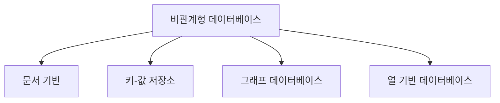

**3.2. 비관계형 데이터베이스의 특징**

비관계형 데이터베이스는 다음과 같은 두 가지 주요 특징을 가진다:

- **스키마 유연성**: 데이터 구조가 고정되어 있지 않아, 필요에 따라 쉽게 변경할 수 있다. 이는 개발 과정에서의 유연성을 높인다.
- **수평적 확장성**: 서버를 추가하여 데이터베이스의 용량과 성능을 쉽게 확장할 수 있다. 이는 대량의 트래픽을 처리하는 데 유리하다.

**3.3. 비관계형 데이터베이스의 장점**

비관계형 데이터베이스는 다음과 같은 장점을 제공한다:

- **대량의 비정형 데이터 처리**: 비정형 데이터(예: 이미지, 동영상, 로그 데이터 등)를 효율적으로 저장하고 관리할 수 있다.
- **빠른 성능**: 데이터 접근 속도가 빠르며, 대량의 요청을 동시에 처리할 수 있는 능력이 뛰어나다.

**3.4. 비관계형 데이터베이스의 단점**

비관계형 데이터베이스는 다음과 같은 단점도 존재한다:

- **데이터 무결성 문제**: 데이터의 일관성을 보장하기 어려운 경우가 많아, 데이터 무결성 문제가 발생할 수 있다.
- **복잡한 트랜잭션 처리의 어려움**: 여러 데이터베이스 간의 트랜잭션을 처리하는 것이 복잡할 수 있으며, ACID 원칙을 완벽하게 지원하지 않는 경우가 많다.

**3.5. 비관계형 데이터베이스의 예**

비관계형 데이터베이스의 몇 가지 예시는 다음과 같다:

- **MongoDB**: 문서 기반 데이터베이스로, JSON 형식으로 데이터를 저장한다.
- **Cassandra**: 열 기반 데이터베이스로, 대량의 데이터를 분산하여 저장할 수 있다.
- **Redis**: 키-값 저장소로, 메모리 내 데이터 저장을 통해 빠른 성능을 제공한다.
- **Couchbase**: 문서 기반 데이터베이스로, JSON 문서를 저장하고, 분산형 아키텍처를 지원한다.

비관계형 데이터베이스는 다양한 데이터 모델과 유연한 구조 덕분에 현대의 데이터 처리 요구에 적합한 솔루션으로 자리잡고 있다.

<!--
## 4. 관계형 데이터베이스와 비관계형 데이터베이스의 비교
   - 4.1. 데이터 구조의 차이
   - 4.2. 쿼리 언어의 차이
   - 4.3. 확장성의 차이
   - 4.4. 성능의 차이
   - 4.5. 사용 사례의 차이
-->

## 4. 관계형 데이터베이스와 비관계형 데이터베이스의 비교

관계형 데이터베이스(RDBMS)와 비관계형 데이터베이스(NoSQL)는 데이터 저장 및 관리 방식에서 여러 가지 차이를 보인다. 이 섹션에서는 데이터 구조, 쿼리 언어, 확장성, 성능, 사용 사례의 차이에 대해 살펴보겠다.

**4.1. 데이터 구조의 차이**  
관계형 데이터베이스는 정형화된 데이터 구조를 가지고 있으며, 데이터는 테이블 형태로 저장된다. 각 테이블은 행과 열로 구성되어 있으며, 데이터 간의 관계를 정의하기 위해 기본 키와 외래 키를 사용한다. 반면, 비관계형 데이터베이스는 다양한 데이터 모델을 지원하며, 문서, 키-값, 그래프, 열 기반 등 여러 형태로 데이터를 저장할 수 있다. 이러한 유연성 덕분에 비관계형 데이터베이스는 비정형 데이터 처리에 적합하다.

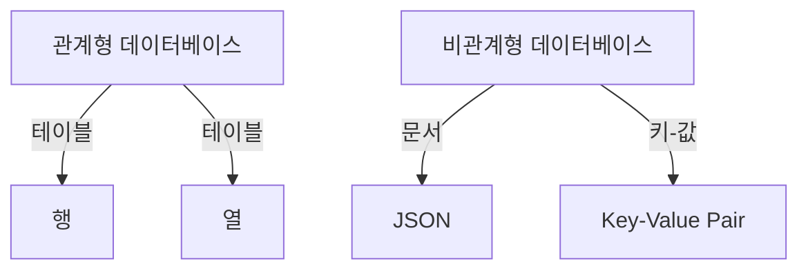

**4.2. 쿼리 언어의 차이**  
관계형 데이터베이스는 SQL(Structured Query Language)을 사용하여 데이터를 쿼리하고 조작한다. SQL은 강력한 쿼리 기능을 제공하며, 복잡한 조인 및 집계 연산을 지원한다. 반면, 비관계형 데이터베이스는 각 데이터베이스에 따라 다양한 쿼리 언어를 사용한다. 예를 들어, MongoDB는 BSON 형식의 문서를 사용하여 쿼리를 수행하며, Cassandra는 CQL(Cassandra Query Language)을 사용한다.

**4.3. 확장성의 차이**  
관계형 데이터베이스는 수직적 확장성에 의존하는 경향이 있다. 즉, 서버의 성능을 높이기 위해 더 강력한 하드웨어로 업그레이드해야 한다. 반면, 비관계형 데이터베이스는 수평적 확장성을 지원하여 여러 서버에 데이터를 분산 저장할 수 있다. 이로 인해 대량의 데이터를 처리하는 데 유리하다.

**4.4. 성능의 차이**  
관계형 데이터베이스는 ACID 원칙을 준수하여 데이터의 일관성과 무결성을 보장하지만, 이로 인해 성능이 저하될 수 있다. 특히, 복잡한 쿼리나 대량의 데이터 처리 시 성능 저하가 발생할 수 있다. 비관계형 데이터베이스는 이러한 제약이 적어 빠른 성능을 제공하지만, 데이터 무결성 측면에서는 상대적으로 약할 수 있다.

**4.5. 사용 사례의 차이**  
관계형 데이터베이스는 금융 시스템, ERP 시스템, CRM 시스템 등 데이터의 일관성과 무결성이 중요한 분야에서 주로 사용된다. 반면, 비관계형 데이터베이스는 소셜 미디어, IoT 애플리케이션, 빅데이터 분석 등 대량의 비정형 데이터를 처리해야 하는 분야에서 많이 활용된다. 이러한 사용 사례의 차이는 각 데이터베이스의 특성과 요구 사항에 따라 결정된다.

이와 같이 관계형 데이터베이스와 비관계형 데이터베이스는 여러 측면에서 차이를 보이며, 각 데이터베이스의 특성을 이해하는 것이 중요하다. 데이터베이스 선택 시 이러한 차이를 고려하여 적합한 솔루션을 선택해야 한다.

<!--
## 5. 데이터베이스 선택 가이드
   - 5.1. 데이터 유형에 따른 선택
   - 5.2. 데이터 양에 따른 선택
   - 5.3. 관리 및 유지보수 리소스 고려
   - 5.4. 실시간 데이터 처리 필요성
-->

## 5. 데이터베이스 선택 가이드

데이터베이스를 선택하는 과정은 프로젝트의 성공에 큰 영향을 미친다. 다양한 요소를 고려하여 적합한 데이터베이스를 선택하는 것이 중요하다. 이 섹션에서는 데이터베이스 선택 시 고려해야 할 주요 요소들을 다룬다.

**5.1. 데이터 유형에 따른 선택**

데이터베이스를 선택할 때 가장 먼저 고려해야 할 요소는 데이터의 유형이다. 데이터는 정형 데이터, 반정형 데이터, 비정형 데이터로 나눌 수 있으며, 각 데이터 유형에 따라 적합한 데이터베이스가 다르다. 

- **정형 데이터**: 관계형 데이터베이스(RDBMS)가 적합하다. 예를 들어, 금융 거래 데이터나 고객 정보와 같은 데이터는 테이블 형식으로 저장되고, SQL 쿼리를 통해 쉽게 접근할 수 있다.
- **비정형 데이터**: 비관계형 데이터베이스(NoSQL)가 적합하다. 소셜 미디어의 게시물, 이미지, 비디오 등은 비정형 데이터로, MongoDB와 같은 문서 기반 데이터베이스가 유용하다.

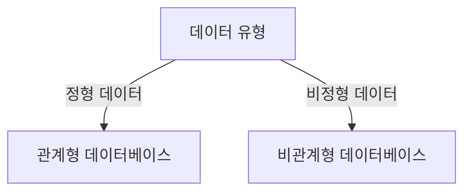

**5.2. 데이터 양에 따른 선택**

데이터의 양도 데이터베이스 선택에 중요한 요소이다. 데이터의 양이 많을수록 데이터베이스의 성능과 확장성이 중요해진다. 

- **소규모 데이터**: 소규모 프로젝트에서는 SQLite와 같은 경량 데이터베이스가 적합하다. 설치가 간편하고, 관리가 용이하다.
- **대규모 데이터**: 대량의 데이터를 처리해야 하는 경우, MySQL, PostgreSQL과 같은 관계형 데이터베이스나 Cassandra, MongoDB와 같은 비관계형 데이터베이스를 고려해야 한다. 이들 데이터베이스는 수평적 확장을 지원하여 대량의 데이터를 효과적으로 처리할 수 있다.

**5.3. 관리 및 유지보수 리소스 고려**

데이터베이스의 관리 및 유지보수에 필요한 리소스도 선택 시 고려해야 할 요소이다. 

- **전문 인력**: 관계형 데이터베이스는 SQL 쿼리와 데이터 모델링에 대한 전문 지식이 필요하다. 따라서, 데이터베이스 관리자를 두는 것이 좋다.
- **자동화 도구**: 비관계형 데이터베이스는 관리가 상대적으로 간단하지만, 데이터의 무결성을 유지하기 위한 자동화 도구가 필요할 수 있다. 이러한 도구를 통해 데이터베이스의 성능을 최적화하고, 유지보수를 용이하게 할 수 있다.

**5.4. 실시간 데이터 처리 필요성**

실시간 데이터 처리가 필요한 경우, 데이터베이스 선택에 신중해야 한다. 

- **관계형 데이터베이스**: ACID 원칙을 준수하여 데이터의 일관성을 보장하지만, 실시간 처리에는 한계가 있을 수 있다. 
- **비관계형 데이터베이스**: 수평적 확장을 통해 대량의 데이터를 빠르게 처리할 수 있으며, 실시간 분석 및 데이터 스트리밍에 적합하다. 예를 들어, Apache Kafka와 같은 메시징 시스템과 함께 사용하면 실시간 데이터 처리가 가능하다.

이와 같이 데이터베이스 선택은 다양한 요소를 고려해야 하며, 각 요소에 따라 적합한 데이터베이스를 선택하는 것이 중요하다.

<!--
## 6. 예제
   - 6.1. 관계형 데이터베이스 사용 사례
       - 금융 시스템, CRM 시스템
   - 6.2. 비관계형 데이터베이스 사용 사례
       - 소셜 미디어, IoT 애플리케이션
-->

## 6. 예제

**6.1. 관계형 데이터베이스 사용 사례**

관계형 데이터베이스는 데이터의 구조가 명확하고, 데이터 간의 관계를 정의할 수 있는 경우에 적합하다. 이러한 특성으로 인해 금융 시스템과 CRM 시스템에서 널리 사용된다.

- **금융 시스템**: 금융 기관에서는 고객 정보, 거래 내역, 계좌 정보 등을 관리하기 위해 관계형 데이터베이스를 사용한다. 예를 들어, 고객의 계좌 정보는 고객 테이블과 연결된 거래 테이블을 통해 관리된다. 이때, 기본 키와 외래 키를 활용하여 데이터의 무결성을 유지할 수 있다.

```sql
-- 고객 테이블 생성
CREATE TABLE Customers (
    CustomerID INT PRIMARY KEY,
    Name VARCHAR(100),
    Email VARCHAR(100)
);

-- 거래 테이블 생성
CREATE TABLE Transactions (
    TransactionID INT PRIMARY KEY,
    CustomerID INT,
    Amount DECIMAL(10, 2),
    TransactionDate DATETIME,
    FOREIGN KEY (CustomerID) REFERENCES Customers(CustomerID)
);
```

- **CRM 시스템**: 고객 관계 관리 시스템에서는 고객의 상호작용, 구매 이력, 피드백 등을 관리하기 위해 관계형 데이터베이스를 사용한다. 이 시스템은 고객과 관련된 다양한 데이터를 통합하여 분석할 수 있는 기능을 제공한다.

```sql
-- 상호작용 테이블 생성
CREATE TABLE Interactions (
    InteractionID INT PRIMARY KEY,
    CustomerID INT,
    InteractionType VARCHAR(50),
    InteractionDate DATETIME,
    FOREIGN KEY (CustomerID) REFERENCES Customers(CustomerID)
);
```

**6.2. 비관계형 데이터베이스 사용 사례**

비관계형 데이터베이스는 비정형 데이터나 대량의 데이터를 처리하는 데 유리하다. 소셜 미디어와 IoT 애플리케이션에서 이러한 데이터베이스가 많이 사용된다.

- **소셜 미디어**: 소셜 미디어 플랫폼에서는 사용자 생성 콘텐츠, 댓글, 좋아요 등의 데이터를 저장하고 관리하기 위해 비관계형 데이터베이스를 사용한다. MongoDB와 같은 문서 지향 데이터베이스는 JSON 형식으로 데이터를 저장하여 유연한 스키마를 제공한다.

```javascript
// MongoDB에서 사용자 데이터 저장 예시
db.users.insertOne({
    username: "john_doe",
    posts: [
        { content: "Hello World!", date: new Date() },
        { content: "Learning NoSQL databases.", date: new Date() }
    ],
    followers: ["user1", "user2"]
});
```

- **IoT 애플리케이션**: IoT 애플리케이션에서는 센서 데이터와 같은 대량의 비정형 데이터를 수집하고 분석하기 위해 비관계형 데이터베이스를 사용한다. Cassandra와 같은 분산형 데이터베이스는 높은 쓰기 성능과 수평적 확장성을 제공하여 IoT 환경에 적합하다.

```cql
// Cassandra에서 센서 데이터 저장 예시
CREATE TABLE sensor_data (
    sensor_id UUID,
    timestamp TIMESTAMP,
    temperature FLOAT,
    humidity FLOAT,
    PRIMARY KEY (sensor_id, timestamp)
);
```

이와 같이 관계형 데이터베이스와 비관계형 데이터베이스는 각각의 특성과 장점을 살려 다양한 분야에서 활용되고 있다. 데이터의 구조와 요구 사항에 따라 적절한 데이터베이스를 선택하는 것이 중요하다.

<!--
## 7. FAQ
   - 7.1. 비관계형 데이터베이스의 주요 장점은 무엇인가요?
   - 7.2. 관계형 데이터베이스를 언제 선택해야 하나요?
   - 7.3. 비관계형 데이터베이스의 예시는 무엇인가요?
   - 7.4. 비관계형 데이터베이스에서 수평적 확장은 어떻게 이루어지나요?
-->

## 7. FAQ

**7.1. 비관계형 데이터베이스의 주요 장점은 무엇인가요?**

비관계형 데이터베이스(NoSQL)는 여러 가지 장점을 제공한다. 첫째, 스키마 유연성이 뛰어나기 때문에 데이터 구조를 사전에 정의할 필요가 없다. 이는 다양한 형태의 데이터를 쉽게 저장하고 관리할 수 있게 해준다. 둘째, 수평적 확장성이 뛰어나 대량의 데이터를 처리하는 데 유리하다. 서버를 추가함으로써 성능을 향상시킬 수 있으며, 이는 클라우드 환경에서도 효과적이다. 셋째, 비정형 데이터 처리에 강점을 가지며, 소셜 미디어, IoT 애플리케이션 등 다양한 분야에서 활용된다.

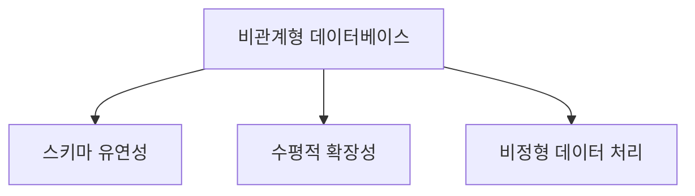

**7.2. 관계형 데이터베이스를 언제 선택해야 하나요?**

관계형 데이터베이스(RDBMS)는 데이터의 무결성과 일관성이 중요한 경우에 적합하다. 예를 들어, 금융 시스템이나 재고 관리 시스템과 같이 트랜잭션의 정확성이 필수적인 경우 관계형 데이터베이스를 선택하는 것이 바람직하다. 또한, 복잡한 쿼리와 데이터 분석이 필요한 경우에도 RDBMS가 유리하다. 데이터 구조가 명확하고, 스키마가 자주 변경되지 않는 환경에서도 관계형 데이터베이스가 적합하다.

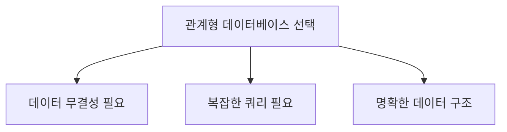

**7.3. 비관계형 데이터베이스의 예시는 무엇인가요?**

비관계형 데이터베이스의 대표적인 예시로는 MongoDB, Cassandra, Redis, Couchbase 등이 있다. MongoDB는 문서 지향 데이터베이스로 JSON 형태의 데이터를 저장하며, 유연한 스키마를 제공한다. Cassandra는 분산형 데이터베이스로 높은 가용성과 확장성을 자랑하며, Redis는 인메모리 데이터베이스로 빠른 데이터 접근 속도를 제공한다. Couchbase는 문서 저장소와 키-값 저장소의 기능을 결합하여 다양한 데이터 모델을 지원한다.

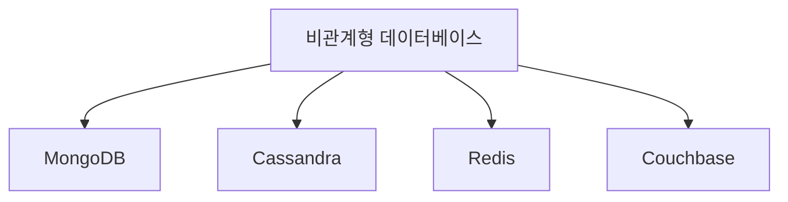

**7.4. 비관계형 데이터베이스에서 수평적 확장은 어떻게 이루어지나요?**

비관계형 데이터베이스에서 수평적 확장은 여러 서버에 데이터를 분산 저장하는 방식으로 이루어진다. 이를 통해 데이터베이스의 성능을 향상시키고, 대량의 데이터를 처리할 수 있다. 예를 들어, 데이터가 여러 노드에 분산되어 저장되며, 각 노드는 독립적으로 작동하여 요청을 처리한다. 이러한 구조는 데이터의 복제 및 샤딩(sharding) 기술을 통해 구현된다. 샤딩은 데이터를 여러 조각으로 나누어 각 서버에 분산 저장하는 방법이다.

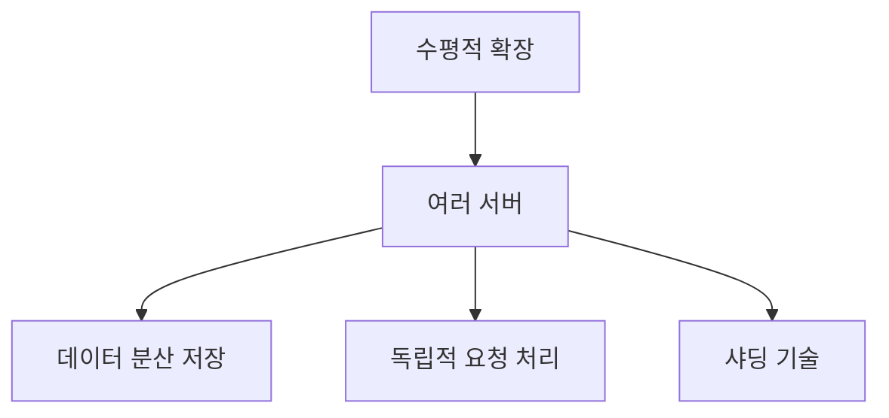

이와 같이 비관계형 데이터베이스는 다양한 장점과 활용 사례를 가지고 있으며, 특정 상황에 따라 관계형 데이터베이스와의 선택이 필요하다.

<!--
## 8. 관련 기술
   - 8.1. 데이터 웨어하우스와 데이터 레이크
   - 8.2. 클라우드 기반 데이터베이스
   - 8.3. 빅데이터 기술과의 통합
-->

## 8. 관련 기술

**데이터 웨어하우스와 데이터 레이크**  

데이터 웨어하우스와 데이터 레이크는 데이터 저장 및 분석을 위한 두 가지 주요 아키텍처이다. 데이터 웨어하우스는 구조화된 데이터를 저장하고, 이를 분석하기 위해 최적화된 시스템이다. 반면, 데이터 레이크는 구조화된 데이터뿐만 아니라 비구조화된 데이터도 저장할 수 있는 유연한 저장소이다. 데이터 웨어하우스는 주로 OLAP(Online Analytical Processing) 시스템에 사용되며, 데이터 레이크는 대량의 데이터를 수집하고 저장하는 데 적합하다.

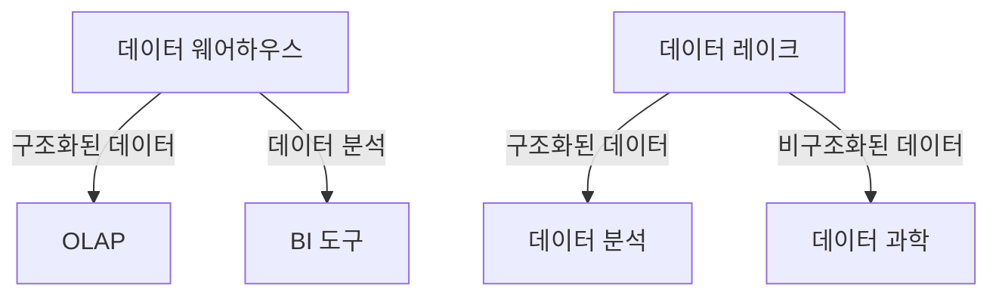

**클라우드 기반 데이터베이스**  

클라우드 기반 데이터베이스는 클라우드 환경에서 제공되는 데이터베이스 서비스이다. 이러한 데이터베이스는 사용자가 인프라를 관리할 필요 없이 데이터베이스를 구축하고 운영할 수 있도록 해준다. 클라우드 기반 데이터베이스는 확장성과 유연성을 제공하며, 사용자는 필요에 따라 리소스를 조정할 수 있다. 대표적인 클라우드 데이터베이스 서비스로는 Amazon RDS, Google Cloud SQL, Microsoft Azure SQL Database 등이 있다.

**빅데이터 기술과의 통합**  

빅데이터 기술은 대량의 데이터를 수집, 저장, 처리 및 분석하는 데 필요한 기술이다. 관계형 데이터베이스와 비관계형 데이터베이스는 빅데이터 환경에서 중요한 역할을 한다. 예를 들어, Hadoop과 Spark와 같은 빅데이터 프레임워크는 대량의 데이터를 처리하는 데 사용되며, 이러한 데이터는 관계형 데이터베이스나 비관계형 데이터베이스에 저장될 수 있다. 데이터 분석 및 머신러닝 모델링을 위해 이러한 데이터베이스와 빅데이터 기술의 통합이 필수적이다.

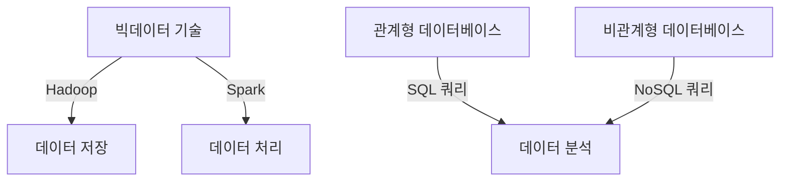

이와 같이 데이터 웨어하우스, 클라우드 기반 데이터베이스, 빅데이터 기술은 현대 데이터 관리 및 분석 환경에서 중요한 역할을 하며, 서로 긴밀하게 연결되어 있다. 이러한 기술들을 이해하고 활용하는 것은 데이터 기반 의사결정을 지원하는 데 필수적이다.

<!--
## 9. 결론
   - 데이터베이스 선택의 중요성
   - 관계형과 비관계형 데이터베이스의 미래 전망
-->

## 9. 결론

**데이터베이스 선택의 중요성**  
데이터베이스는 현대의 정보 시스템에서 핵심적인 역할을 담당하고 있다. 적절한 데이터베이스를 선택하는 것은 애플리케이션의 성능, 확장성, 유지보수성에 직접적인 영향을 미친다. 따라서, 데이터베이스를 선택할 때는 데이터의 유형, 양, 처리 방식, 그리고 시스템의 요구 사항을 면밀히 분석해야 한다. 잘못된 선택은 데이터 무결성 문제를 초래하거나, 시스템의 성능 저하를 유발할 수 있다. 

예를 들어, 대량의 비정형 데이터를 처리해야 하는 경우 비관계형 데이터베이스가 적합할 수 있으며, 복잡한 트랜잭션 처리가 필요한 경우 관계형 데이터베이스가 더 나은 선택이 될 수 있다. 이러한 선택은 기업의 비즈니스 목표와도 밀접하게 연관되어 있으므로, 신중한 결정이 필요하다.

**관계형과 비관계형 데이터베이스의 미래 전망**  
관계형 데이터베이스는 오랜 역사와 안정성을 바탕으로 여전히 많은 기업에서 사용되고 있다. 그러나 비관계형 데이터베이스의 발전과 함께 데이터 처리 방식이 다양해지고 있으며, 특히 대량의 비정형 데이터와 실시간 데이터 처리의 필요성이 증가하고 있다. 이러한 변화는 비관계형 데이터베이스의 수요를 더욱 증가시킬 것으로 예상된다.

앞으로 데이터베이스 기술은 클라우드 기반 솔루션과의 통합, 인공지능 및 머신러닝 기술의 접목 등으로 더욱 발전할 것이다. 이러한 기술들은 데이터베이스의 성능을 극대화하고, 데이터 분석의 효율성을 높이는 데 기여할 것이다. 

다음은 관계형 데이터베이스와 비관계형 데이터베이스의 미래 전망을 시각적으로 나타낸 다이어그램이다.

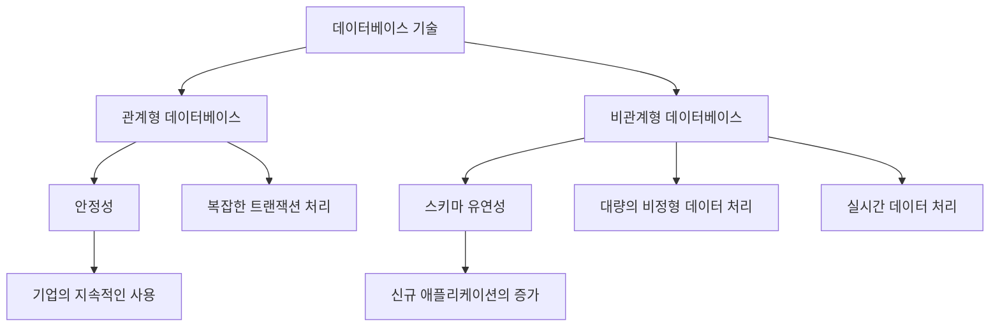

결론적으로, 데이터베이스 선택은 단순한 기술적 결정이 아니라, 기업의 전략적 목표와도 연결된 중요한 요소이다. 관계형과 비관계형 데이터베이스 각각의 장단점을 이해하고, 미래의 기술 발전을 고려하여 적절한 선택을 하는 것이 필수적이다.

<!--
## 10. 추가 자료
   - 10.1. 추천 도서 및 온라인 강의
   - 10.2. 관련 블로그 및 웹사이트
-->

## 10. 추가 자료

**10.1. 추천 도서 및 온라인 강의**

데이터베이스에 대한 깊이 있는 이해를 원한다면 다음의 도서와 온라인 강의를 추천한다. 

- **도서**
  - *"Database System Concepts"* by Abraham Silberschatz, Henry Korth, and S. Sudarshan: 이 책은 관계형 데이터베이스의 기본 개념과 이론을 잘 설명하고 있다.
  - *"NoSQL Distilled: A Brief Guide to the Emerging World of Polyglot Persistence"* by Pramod J. Sadalage and Martin Fowler: 비관계형 데이터베이스의 개념과 다양한 데이터 모델에 대해 다룬다.

- **온라인 강의**
  - Coursera의 *"Databases and SQL for Data Science"* 강의: SQL의 기초부터 데이터베이스 설계까지 폭넓은 내용을 다룬다.
  - Udacity의 *"Data Engineering Nanodegree"* 프로그램: 데이터베이스와 데이터 파이프라인 구축에 대한 실무적인 내용을 배울 수 있다.

**10.2. 관련 블로그 및 웹사이트**

데이터베이스 관련 최신 정보와 기술 동향을 파악하기 위해 다음의 블로그와 웹사이트를 참고하는 것이 좋다.

- **블로그**
  - *DataCamp Blog*: 데이터 과학과 데이터베이스 관련 다양한 주제를 다루며, 실용적인 튜토리얼을 제공한다.
  - *Towards Data Science*: 데이터 과학 및 데이터베이스에 대한 심도 있는 글들이 많이 올라온다.

- **웹사이트**
  - *Stack Overflow*: 데이터베이스 관련 질문과 답변을 통해 실무에서의 문제 해결에 도움을 받을 수 있다.
  - *DB-Engines*: 다양한 데이터베이스 시스템의 인기와 트렌드를 비교할 수 있는 유용한 사이트이다.

이 외에도 다양한 자료들이 존재하므로, 지속적으로 학습하고 최신 정보를 습득하는 것이 중요하다. 

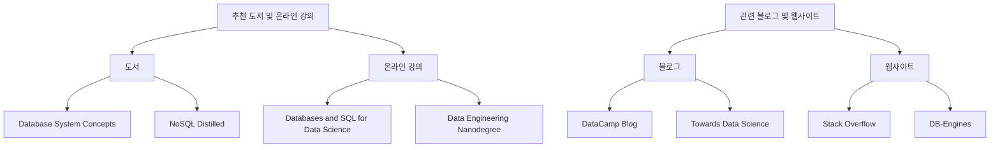

위의 다이어그램은 추천 도서 및 온라인 강의와 관련 블로그 및 웹사이트를 시각적으로 정리한 것이다. 데이터베이스에 대한 이해를 높이기 위해 다양한 자료를 활용하는 것이 중요하다.

<!--
##### Reference #####
-->

## Reference


* [https://blog.purestorage.com/purely-educational/relational-vs-non-relational-databases/](https://blog.purestorage.com/purely-educational/relational-vs-non-relational-databases/)
* [https://www.geeksforgeeks.org/non-relational-databases-and-their-types/](https://www.geeksforgeeks.org/non-relational-databases-and-their-types/)
* [https://dzone.com/articles/how-to-decide-between-relational-and-non-relational-dbs](https://dzone.com/articles/how-to-decide-between-relational-and-non-relational-dbs)
* [https://insightsoftware.com/blog/whats-the-difference-relational-vs-non-relational-databases/](https://insightsoftware.com/blog/whats-the-difference-relational-vs-non-relational-databases/)
* [https://www.pluralsight.com/blog/software-development/relational-vs-non-relational-databases](https://www.pluralsight.com/blog/software-development/relational-vs-non-relational-databases)
* [https://www.mongodb.com/resources/compare/relational-vs-non-relational-databases](https://www.mongodb.com/resources/compare/relational-vs-non-relational-databases)
* [https://aws.amazon.com/ko/compare/the-difference-between-relational-and-non-relational-databases/](https://aws.amazon.com/ko/compare/the-difference-between-relational-and-non-relational-databases/)
* [https://aloa.co/blog/relational-vs-non-relational-database-pros-cons](https://aloa.co/blog/relational-vs-non-relational-database-pros-cons)
* [https://atlan.com/non-relational-database-vs-relational/](https://atlan.com/non-relational-database-vs-relational/)
* [https://www.coursera.org/articles/relational-vs-non-relational-database](https://www.coursera.org/articles/relational-vs-non-relational-database)


<!--
Relational databases and non-relational databases primarily differ in the
types of data they store and how that data is organized. Relational is highly
structured, while non-relational is unstructured. This key design difference
makes them well-suited to very different business functions, applications, and
programs. It also means they have different requirements for their underlying
storage technologies.

In this article, learn more about the differences and advantages of relational
vs. non-relational databases and how the right data storage technologies can
support both.

##  **What Is a Relational Database?**

A relational database (also known as a structured database) is designed to
store structured data types in tables with rows and columns, similar to a
spreadsheet. Because structured data fits into defined formats, categories,
and types, it can be easily sorted into neat, organized tables. Data in a
relational database can also be easily retrieved, searched (queried), and
manipulated.

Take an airline’s flight data, for example. Every flight’s entry includes
structured data such as the flight number, departure and arrival times, origin
and destination airports, stops, the number of seats, airplane type, and so
on. This data can be easily filtered, searched, manipulated, and cross-
referenced with other relational databases on flight booking websites, airport
arrival monitors, customer service centers, and by the FAA.

##  **How Relational Databases Store and Retrieve Data**

The structured nature of the data entries means relationships can be
established between entries in the same table and other tables with primary
keys and foreign keys, respectively. This makes it possible to interlink
related data sources and create more complex data structures and reports.

Relational databases store and retrieve data with:

  * **Rows,** which make up entries or records. Each row is a unique record (e.g., a flight, in the example above). 
  * **Columns,** which are fields of the entries. Each column is a unique attribute (e.g., number of stops, in the example above). 
  * **Primary keys,** which establish each unique row. 
  * **Foreign keys,** which establish relationships between related tables with related data. 
  * **Structured query language (SQL)** —a standardized language used for querying, editing, or retrieving data in relational databases. 

##  **What Are the Features of a Relational Database?**

The features of relational databases include:

  * **Rigid schemas.** The structured tables of relational databases are by design, but not always, a good fit for workloads and data that are bound to change and evolve over time. 
  * **Concurrent transactions or serial transactions,** to avoid data corruption when multiple users are accessing a database.  [ Learn more about serializability in DBMS  ](https://blog.purestorage.com/purely-informational/what-does-serializability-mean-in-a-dbms/) . 

All of these features add up to a highly scalable, secure, and high-
performance way to concurrently access structured data.

##  **What Data Storage Is Best for Relational Databases?**

Relational databases have long been the territory of traditional disk-based
storage technology, but that is changing as more data centers look to improve
cost, efficiency, and power consumption. Flash storage can offer an affordable
and highly consistent storage solution for relational databases as they grow
and support more cloud-based modern applications’ persistent storage needs.

Solid-state drives (SSDs) use flash memory, which is particularly beneficial
for low latency and performance for relational databases. Network attached
storage (NAS) can offer connected storage and shared access to large amounts
of data stored in relational databases across multiple servers. Cloud-based
storage is also an excellent option for getting the [ scalability
](https://blog.purestorage.com/purely-informational/scale-out-vs-scale-up-
whats-the-difference/) and reliability many enterprise applications leveraging
relational databases need.

##  **Using Relational Databases**

###  **What Technologies Use Relational Databases?**

Technologies that use relational databases include many large-scale,
enterprise applications but can also include the structured workloads of
modern applications. You’ll find relational databases behind any large amounts
of structured data, such as user databases, even on platforms like social
networks that rely on NoSQL databases.

Technologies that use relational databases can include:

  * Enterprise resource planning (ERP) and customer relationship management (CRM) platforms and business intelligence platforms that leverage data warehouse solutions 
  * Supply chain management software 
  * E-commerce platforms, supporting large inventories of structured product data (e.g., SKUs) 
  * Accounting and banking software 
  * [ Electronic health record (EHR) systems  ](https://www.purestorage.com/knowledge/what-is-a-healthcare-erp-system.html)
  * Government and municipal applications and records 

###  **What Are Relational Databases Best At?**

  * **Efficiency.** A highly structured and predictable schema means it’s fast and efficient to read, write, and query data. 
  * **Consistency.** Consistency and accuracy are enforced in relational databases by design. This keeps entries and records consistent and builds in integrity to adhere to schema rules and relationships. (This also reduces the likelihood of duplication.) 
  * **Vertical scale**
  * **ACID compliance.** Relational databases typically follow the ACID (atomicity, consistency, isolation, durability) properties, ensuring data transactions are processed reliably and securely. 

###  **Examples of Relational Database Management Systems**

Relational databases and relational database management systems are
traditional, enterprise workhorses such as Oracle Database, IBM Db2, and
Microsoft SQL Server, but there are also some popular open source options,
such as  [ MySQL  ](https://www.purestorage.com/knowledge/what-is-mysql-high-
availability.html) ,  [ MariaDB
](https://www.purestorage.com/partners/technology-alliance-
partners/mariadb.html) , SQLite, and PostgreSQL.  [ Vertica
](https://www.purestorage.com/partners/technology-alliance-
partners/vertica.html) is a relational database; however, in Eon Mode with
Pure Storage, it’s able to leverage file and object storage.

_ Related reading:  _ [ _ What is MySQL High Availability?  _
](https://www.purestorage.com/knowledge/what-is-mysql-high-availability.html)

##  **What Is a Non-relational Database?**

A non-relational database is more commonly referred to as a NoSQL database or
an unstructured database. NoSQL means “not only SQL,” which is the standard
query language for relational databases. If relational databases are designed
for structured data, NoSQL databases are designed for all the rest—semi-
structured and unstructured, which do not fit neatly into tables.

Considering the airline database example above, a NoSQL database would, in
this case, store semi-structured and unstructured data related to flights such
as readings from airplane sensors and gauges, in-flight recordings and comms,
GPS and mapping, regional conditions during the flight, and so on.

Here’s where we start to get into more dynamic, modern-day data applications
and use cases for unstructured data and its potential.

###  **How Do Non-relational Databases Store and Retrieve Data?**

NoSQL databases organize this data with alternative models to SQL databases
that aren’t as rigid. This allows for a more flexible approach to grouping,
storing, and searching data of different types such as photos, audio, or
sensor data. These models include:

  * **Key-value pair databases,** in which data is stored and retrieved based on keys 
  * **Graph databases,** with the primary focus on relationships between data and queries 
  * **Document store databases,** using JSON or XML formats and unique document structures 
  * **Columnar databases,** which use columns instead of rows for discrete grouping and analysis 

###  **What Are the Features of a Non-relational Database?**

NoSQL databases’ features are all about scale, variety, and
flexibility—mirroring those of modern applications and data:

  * **Highly flexible schemas.** While SQL databases have a rigid structure by design, the schema of a NoSQL database can evolve over time. This is a benefit when storing data that’s unstructured and likely to evolve over time, thus not always able to fit into the same, rigid schema. Here’s where eventual consistency helps, propagating changes made to a database across nodes over time. 
  * **Built-in replication.** NoSQL’s ability to replicate and distribute data across the nodes mentioned above gives these databases high availability but also failover and fault tolerance in the event of a failure or outage. 
  * **Sharding,** which improves scalability and load balancing. This technique allows data to be spread vertically across multiple nodes and servers, distributing workloads and dividing data sets up so processing can be done on a smaller scale in parallel. Also, this improves fault tolerance. 

###  **What Data Storage Is Best for Non-relational Databases?**

Compared with SQL databases, NoSQL databases will have very different
requirements from data storage. NoSQL databases need the capabilities of SSD
flash storage, and more specifically, object-based storage to support large-
scale unstructured data volumes. Object storage like Pure Storage  ®  [
FlashBlade  ](https://www.purestorage.com/products/unstructured-data-
storage/flashblade-s.html) ®  is well-suited for the storage and consolidation
of large unstructured files such as images.

In-memory storage, while it has certain limitations, is another option for
real-time applications and caching use cases.

Bottom line:  Storage architectures must be designed to support the demands of
large NoSQL databases with the proper scalability and performance, all while
reducing the overall data center footprint.

###  **Examples of Non-relational Databases**

There are many NoSQL database options, with different models and specialities,
including:

  * **DynamoDB,** both a key-value and document store database 
  * **Neo4j,** a popular graph database 
  * **Redis and Riak,** key-value store databases 
  * **Couchbase and** [ **MongoDB** ](https://www.purestorage.com/partners/technology-alliance-partners/mongodb.html) **,** two popular document-store databases 
  * **Apache Cassandra and HBase,** columnar-store databases 

It’s important to note the variability of data models between NoSQL databases.
When choosing from open source databases, be sure to take into consideration
the developer support, your needs for scalability, and what data model is best
for your workload.

###  **Using Non-relational Databases**

As mentioned above, NoSQL databases are able to meet the unique demands of
modern data and applications. There are complexities and drawbacks, but many
have been addressed with modern unstructured data storage technologies that
deliver highly scalable, affordable, and performant solutions that offset
these issues.

With the right storage technology underneath, using non-relational databases
will depend more on the workloads and what suits them best.

###  **What Do Non-relational Databases Do Best?**

  * [ **Unstructured data management** ](https://www.purestorage.com/knowledge/what-is-unstructured-data-management.html) **.** Relational databases were not built for unstructured and semi-structured data. Storing this data, and storing it in a way that makes it accessible and easily leveraged, is the primary thing NoSQL databases do best. 
  * **Horizontal scale.** As traffic grows and data volumes expand, NoSQL databases can flex to meet demands by adding nodes to existing clusters. 
  * **Complex analytics and real-time analysis of big data.** Storing large volumes of data is one thing; being able to efficiently process and analyze it is another. This is where NoSQL databases excel. 
  * **Distributed and cloud-based applications**

##  **What Technologies Use NoSQL?**

NoSQL databases are the databases of modern applications and data-heavy use
cases such as:

  * Large-scale web applications, with caching as a top use case 
  * Big data analytics 
  * Fraud detection 
  * Recommendation engines 
  * [ Time-series databases  ](https://www.purestorage.com/knowledge/what-is-a-time-series-database.html)
  * Artificial intelligence and machine learning, with flexible data modeling requirements 
  * The internet of things (IoT) and sensor device networks 
  * Real-time data analytics and processing 
  * Social media networks, which rely on unstructured data and massively parallel requests 

What these apps and technology have in common are their demands: massive
scalability, high performance, flexibility, and capacity for highly varied
data types.

##  **Relational vs. Non-relational Databases**

We’ve covered the types of data and features of relational and non-relational
databases. So, which is right for your data, workload, or application? What
data storage can best support your databases and keep data available,
accessible, and secure for your enterprise applications? Let’s take a closer
look.

##  **Key Differences Between Relational and Non-relational Databases**

As mentioned above, relational database pros include integrity, consistency,
and reliability. They’re great for highly structured data, which will always
be a critical workload.

Non-relational databases can tackle the demands of unstructured data, with
advantages for distributed environments and modern workloads that require
deeper, more complex analysis.

Aside from the structured vs. unstructured data advantages, there are a few
other differences to consider:

  * **Avoiding data duplication.** Relational databases promote data consistency by avoiding data duplication and adhering to normalization principles. Normalization eliminates redundant data and minimizes data anomalies, ensuring efficient storage and maintenance of data. 
  * **ACID compliance.** Relational databases may be better suited to ACID compliance (atomicity, consistency, isolation, durability). ACID transactions guarantee that database operations are performed as a single, indivisible unit and that the database remains in a consistent state even in the presence of failures or concurrent access. 
  * **Concurrency.** By design, relational databases can help to avoid issues with consistency or congestion when large amounts of requests are made from multiple users. Handling these concurrent queries and transactions makes relational databases an advantage in scenarios where large amounts of structured data need to be accessed at once without compromising the integrity of the data or the application. 

##  **Conclusion**

As unstructured data continues to grow and is increasingly valuable in
creating rich applications and user experiences, NoSQL databases and unified
fast file and object storage like Pure Storage FlashBlade will be paramount to
successfully powering the applications and technologies listed above. For
high-powered analytics, artificial intelligence, real-time data, and
unstructured data, choose the FlashBlade family for efficient, economical, and
high-performance storage.


-->

<!--


-->

<!--
#  Non-Relational Databases and Their Types

Last Updated :  28 Jun, 2024

In the area of  ****database management** ** , the data is arranged in two
ways which are  ****Relational Databases (SQL)** ** and  ****Non-Relational
Databases (NoSQL** ** ). While relational databases organize data into
****structured tables** ** , non-relational databases use various flexible
data models like  ****key-value pairs, documents, graphs,** ** and  ****wide**
** –  ****column** ** stores.

Here, we will learn about non-relational database meaning and check non-
relational database examples. But to understand non-relational databases, or “
****NoSQL** ** ” databases, we first need to look at relational databases.

##  Relational Database (SQL)

  * A  [ ****relational database** ** ](https://www.geeksforgeeks.org/relational-model-in-dbms/) stores data in a table composed of rows and columns. The  ****table** ** represents an object or entity, such as users, customers, orders, etc. 
  * The column represents the type of data that can be stored in the respective column. 
  * Relational Databases allow users to establish a connection between tables using  ****keys** ** for flexible data flow and querying. 
  * [ ****SQL** ** ](https://www.geeksforgeeks.org/sql-tutorial/) was specifically designed to work with  ****tabular** ** data. These are often categorized as structured data. 
  * This is because there can only be a single schema or structure for the data within a relational database. 
  * SQL is a  ****declarative language** ** , which means that you describe in  ****SQL syntax** ** the desired result you wish from the query. 

###  Key features of relational database


Key Features of Relational Databases

  * Relational data models are similar to an  [ ****Excel** ** ](https://www.geeksforgeeks.org/introduction-to-ms-excel/) spreadsheet, with related data stored in rows and columns in one table. 
  * SQL (Structured Query Language) is the most common way of interacting with relational database systems. Developers can use SQL queries to execute  ****CRUD** ** (Create, Read, Update, Delete) operations. 

##  Non-Relational database (NoSQL)

  * [ ****Non-relational databases** ** ](https://www.geeksforgeeks.org/introduction-to-nosql/) different from relational databases because they do not store data in tabular form. 
  * Instead, non-relational databases are based on data structures like documents and graphs.  ****NoSQL** ** databases also come in a variety of types based on their data models. 
  * They offer scalability when dealing with  ****large volumes** ** of data and high load factors. They were designed when data was expected to be partitioned across multiple machines to scale, in contrast to relational databases, which assumed the data would stay on a single machine. 

##  The benefits of a non-relational database

  * ****Scalability** ** : Non-relational databases like  [ MongoDB  ](https://www.geeksforgeeks.org/mongodb-an-introduction/) and  [ Cassandra  ](https://www.geeksforgeeks.org/introduction-to-apache-cassandra/) are designed to horizontally scale across  ****clusters** ** of  ****cheap** ** commodity hardware, offering seamless  ****scalability** ** as data volumes and user loads increase. 
  * ****Flexibility in Data Models** ** : Unlike rigid table-based structures in relational databases, non-relational databases support flexible data models like document stores (e.g.,  [ JSON  ](https://www.geeksforgeeks.org/javascript-json/) in MongoDB),  ****key-value pairs** ** (e.g.,  [ Redis  ](https://www.geeksforgeeks.org/introduction-to-redis-server/) ), and wide-column stores (e.g., Cassandra), making it easier to store and manage unstructured or semi-structured data. 
  * ****Performance** ** : Non-relational databases are optimized for specific use cases such as real-time data ingestion, high-speed  [ transactions  ](https://www.geeksforgeeks.org/transaction-in-dbms/) , and rapid access to large volumes of data. They often outperform relational databases in these scenarios due to their distributed architecture and optimized data storage formats. 
  * ****Schemaless Design** ** : Non-relational databases typically do not enforce a rigid schema, allowing developers to evolve the data structure over time without downtime or complex migrations. This advantage is particularly beneficial in agile development environments and for handling diverse and  ****unpredictable** ** data types. 
  * ****High Availability and Fault Tolerance** ** : Many non-relational databases are designed with built-in replication and automatic failover capabilities, ensuring high availability and data redundancy. This makes them suitable for mission-critical applications where continuous uptime is essential. 
  * ****Cost-Effectiveness** ** : By using commodity hardware and open-source software, non-relational databases often provide a more cost-effective solution compared to traditional relational databases, especially at scale. 

##  What do NoSQL databases have in common?

  * ****Non-Relational Structure** ** : NoSQL databases store data in flexible formats like key-value pairs, documents, or graphs, allowing for easier adaptation to changing data needs. 
  * ****Scalability** ** : It is Designed for horizontal scaling across multiple servers, enabling efficient handling of large data volumes and high transaction rates. 
  * ****High Performance** ** : It is Highly Optimized for specific query types and workloads, prioritizing low latency and high throughput. 
  * ****Flexibility in Data Models** ** : It Supports various data structures (e.g.,  [ documents  ](https://www.geeksforgeeks.org/mongodb-database-collection-and-document/) , columns, graphs) to fit diverse application requirements without rigid schemas. 
  * ****Eventual Consistency** ** : It Emphasizes availability and partition tolerance over strict immediate consistency across distributed nodes. 
  * ****Horizontal Partitioning:** ** It Uses sharding to distribute data across multiple  ****nodes** ** , improving performance and managing large datasets efficiently. 

##  Non-Relational Database Types

There are four main types of non-relational databases:

  * ****key/value** **
  * ****graph** **
  * ****column** **
  * ****document** **


Non Relational Databases

###  1\. Key/Value Database


Key/ Value Database

[ ****Key-value databases** ** ](https://www.geeksforgeeks.org/key-value-data-
model-in-nosql/) ****** ** use a straightforward schema  ****:** ** a unique
key is paired with a collection of values, where the values can be anything
from a string to a large binary object. One of the benefits of using this
structure in a database is that you don’t have to worry about complex queries.
Because the system knows where the data is stored, it only sends a request to
that particular server.

****Example of Key/Value Database** **

Key  |  Value   
---|---  
Name  |  John Snow   
Age  |  23   
  
###  2\. Graph Database


Graph Database

[ ****Graph database** ** ](https://www.geeksforgeeks.org/what-is-graph-
database/) is another type of non-relational database. A popular example of a
graph database is  ****Neo4J** ** . This database stores information as a
collection of nodes and edges, where the edges represent the relationships
between the nodes.

###  3\. Column Oriented Database


Wide Column

A column-oriented or wide-column non-relational database is primarily designed
for analytics.  [ Cassandra  ](https://www.geeksforgeeks.org/features-of-
cassandra/) is a commonly used column-oriented database.

The advantage of column-oriented/row-oriented databases is that column-
oriented databases return data in columns, making the query much more
performant as it will not return many irrelevant fields that are not required
for the query being serviced.

The primary key in a column-oriented database is the data or value, which is
then mapped to row keys. This is the inverse, or opposite, of how the  [
](https://www.geeksforgeeks.org/primary-key-in-dbms/) primary key works in a
relational database.

****Example of Column Oriented Database** **


###  4\. Document Database


[ ****Document databases** ** ](https://www.geeksforgeeks.org/document-
databases-in-nosql/) , such as MongoDB, store data in a single document, which
can have different shapes within the single collection or table that stores
the documents. It provides a clear means of capturing relationships using sub-
documents and embedded arrays within a single document.

****Example of Document Database** **


##  Non-Relational Database Management Systems

Some of the popular Non-Relational Database Management Systems are:

  1. [ MongoDB  ](https://www.geeksforgeeks.org/mongodb-an-introduction/)
  2. [ Apache Cassandra  ](https://www.geeksforgeeks.org/apache-cassandra-nosql-database/)
  3. [ Redis  ](https://www.geeksforgeeks.org/introduction-to-redis-server/)
  4. [ Couchbase  ](https://www.geeksforgeeks.org/difference-between-couchbase-and-mysql/)
  5. [ Apache HBase  ](https://www.geeksforgeeks.org/apache-hbase/)
  6. [ Neo4j  ](https://www.geeksforgeeks.org/difference-between-neo4j-and-couchdb/)
  7. Riak 
  8. [ Aerospike  ](https://www.geeksforgeeks.org/difference-between-aerospike-and-altibase/)
  9. OrientDB 
  10. ArangoDB 

These are some  ****Non-relational database names** ** , that you might hear
in the market. Decide on which  ****Non-relational database software** ** is
best for your work, and master that.

##  Relational vs Non-Relational Database

Here’s a comparison of Relational and Non-Relational Databases in tabular
format:

Feature  |  Relational Database  |  Non-Relational Database   
---|---|---  
****Data Structure** ** |  Tables with rows and columns  |  Various formats (document, key-value, columnar, graph)   
****Schema** ** |  Structured schema enforced by schemas  |  Flexible schema, often schema-less or dynamic   
****Query Language** ** |  SQL (Structured Query Language)  |  Query languages specific to the database type (e.g., JSON query languages, graph traversal languages)   
****ACID Compliance** ** |  ACID transactions  |  May vary; some offer ACID compliance, others eventual consistency   
****Scalability** ** |  Vertical and horizontal scaling options  |  Horizontal scaling typically easier and more flexible   
****Flexibility** ** |  Less flexible with rigid schema definitions  |  Highly flexible due to schema-less or dynamic schema   
****Performance** ** |  Excellent for complex queries and joins  |  Optimal for hierarchical data storage and retrieval   
****Examples** ** |  MySQL, PostgreSQL, SQL Server  |  MongoDB, Cassandra, Redis, DynamoDB   
  
##  Conclusion

In conclusion, the choice between relational and non-relational databases
depends largely on the nature of the data and the requirements of the
application. Relational databases excel in structured data environments where
data integrity and complex querying are paramount. On the other hand, non-
relational databases shine in scenarios demanding scalability, flexibility in
data models, and high performance across distributed systems.

##  FAQs on Non-Relational Databases and Their Types

###  ****What are the main advantages of using a non-relational database?** **

> Non-relational databases offer scalability, flexible data models, high
> performance, schemaless design, and cost-effectiveness compared to
> traditional relational databases.

###  ****When should I opt for a relational database instead of a non-
relational one?** **

> Opt for a relational database when dealing with structured data that
> requires strict data integrity, complex querying capabilities, and
> transactions adhering to ACID properties.

###  ****What are some popular examples of non-relational databases?** **

> MongoDB, Cassandra, Redis, Couchbase, and Neo4j are among the popular non-
> relational databases used in various industries for their specific strengths
> in handling diverse data types and high-volume transactions.

###  ****How does horizontal scaling work in non-relational databases?** **

> Non-relational databases achieve horizontal scaling by distributing data
> across multiple servers (nodes) in a cluster. This approach allows them to
> handle large volumes of data and high user loads efficiently.

###  Please _ Login  _ to comment...


-->

<!--


-->

<!--
How do you approach data processing? What aspects are worth special
consideration? Find the difference between relational vs non-relational
databases to make informed decisions and learn how to choose a database
regarding your project needs.

##  What Is a Relational vs Non-Relational Database?

That’s obviously the first question to address when choosing a database for
your project. Knowing the difference between relational vs non-relational
databases helps to be more specific with your requirements and leverage the
right solutions.

Being in use for decades, databases have gone through lots of changes and
advancements. But at the same time, most representatives can be referred to as
one or another type. Every team commonly faces the choice between a non-
relational and relational database. Let’s cover the major characteristics of
each solution to make more informed decisions. And, of course, we’ll start the
comparison of relational vs non-relational databases with definitions.

  * **Relational databases** are used to store data in a structured table-based manner. All the data remains easily accessible, linked, and related to support relations. 
  * **Non-relational databases** work in a completely different way to store semi-structured data. They don’t apply a rigid structure, thus introducing more dynamic schemas for unstructured data processing. 

Explained as simply as possible, databases are diversified by data structures.
Relational solutions focus on predefined schemas to define and manipulate
data. In comparison, non-relational ones are known for better flexibility as
they can process any type of data without modifying the architecture.

The distinct characteristic of a relational database is that it always stores
data in tables using rows and columns. Therefore, it supports a
straightforward and intuitive way of displaying data. At the same time, it
allows teams to form relations based on specific entities. Most relational
databases use Structured Query Language; thus, they are often called SQL
databases.

Non-relational databases are believed to appear as a viable alternative as not
all the data can be stored in tabular format. This type embraces all the
database types that can’t follow the relational structure and traditional SQL
syntax. It doesn’t mean they don’t apply SQL language. What’s more, most of
them use both SQL and UnQL (Unstructured Query Language). Therefore this type
can also be referred to as NoSQL (not only SQL) databases.

If SQL databases fall under the table-based category, NoSQL databases can be
divided into several categories. The most common types of NoSQL databases
include:

  * **Document databases** collect, process, and retrieve data as JSON-like documents. 
  * **Key-value stores** arrange data in a key-value format where keys serve as unique identifiers. 
  * **Graph databases** are single-purpose platforms to create and manipulate graphs where data is presented in the form of nodes, edges, and properties. 
  * **Wide-column stores** organize data into flexible columns to be spread across database nodes and multiple servers. It supports varying the column format regardless of the row in the same table. 

Regarding differences between relational vs non-relational databases, teams
have gained the opportunity to find reasonable solutions to their needs.
Today’s businesses collect and process a huge amount of data, including
dealing with complex queries. Well-outlined project requirements establish the
foundation for making informed decisions.

The main idea is that they need to choose a database that can query data
efficiently and support instant outcomes. If the project leverages structured
data and follows ACID compliance, relational databases are a good choice. If
the data remains unstructured and doesn’t fit the predefined criteria, it’s
better to choose a non-relational database. So let’s proceed with other
essential details that become decisive for the final choice.

##  Relational vs Non-Relational Database Pros and Cons

Discussing the difference between relational and non-relational databases,
we’d like to draw attention to the main advantages and disadvantages of these
database types. It greatly helps teams to make a choice and select a database
compatible with set requirements. The main idea is that it allows them to do
comprehensive research and remain business-specific. The database selection
might be difficult at first sight but considering more details aims to
simplify the final decision. So let’s go with the mentioned types of databases
to find their pros and cons.

###  Advantages of Relational Databases

####  ACID Compliance

ACID properties differentiate a relational database and bring it to the
dominant market position. It embraces all the necessary standards to guarantee
the reliability of transactions within a database.

####  Simplicity

Due to the predefined schema and simple structure, the relational database is
quite a straightforward solution. It doesn’t require lots of architectural
efforts as the team uses structured query language.

####  Data Accuracy

Compared to other database types, the accuracy of data is higher for
relational databases. It focuses on preventing data redundancy as there is no
repeated or duplicated information.

####  Security

The table-based model makes it easier to restrict access to confidential data
and reduces the chances of errors significantly.

###  Disadvantages of Relational Databases

####  Scalability

Being vertically scalable, the relational database has a distinct
disadvantage: low scalability. Strict consistency requirements restrict
horizontal scaling, whereas vertical scaling comes with certain limits and
greatly depends on supported hardware.

####  Flexibility

Rigid schemas and constraints could become pros and cons at the same time.

Though it’s easy to interpret the data and identify the relationships, it
remains complex to implement changes to the data structure. Relational
databases aren’t suitable for huge or unstructured data.

####  Performance

The relational database performance is tightly dependent on the amount of
data, the complexity of tables, and their number. Any increase in these areas
leads to a time increase in performing queries.

###  Advantages of Non-Relational Databases

####  Horizontal Scaling

Handling large datasets became easier with the introduction of non-relational
databases. Moreover, horizontal scaling allows a team to accommodate, manage,
and store more data while maintaining lower costs.

####  Flexibility

With the flexible data schema and non-rigid structure, non-relational
databases can combine, process, and store any type of data. It becomes a
distinct feature that differentiates it from a relational database that
handles only structured data. Non-relational databases apply dynamic schemas
for unstructured data.

####  Fast Queries

If relational databases can be used for complex queries, queries in non-
relational databases remain faster. The main advantage is that it embraces the
way to store the data initially optimized for queries. Besides, queries don’t
require joints typical for relational database types.

####  Easier Maintenance

Non-relational databases are simpler and faster to set up and maintain. Some
of them allow developers to map the data structure similar to programming
languages. Thus it supports faster development time and fewer errors.

###  Disadvantages of Non-Relational Databases

####  Data Integrity

Maintaining data integrity greatly depends on building relationships between
data elements. Lack of integrity methods in non-relational databases could
reduce overall data reliability, accuracy, and completeness. It becomes the
developers’ responsibility to complete accurate and error-free data
transferring from one stage to another.

####  Consistency

Focusing on scalability and performance, the non-relational database opts for
consistency issues. It has no required mechanisms to prevent data redundancy
and relies on eventual consistency. Thus they aren’t that efficient for
handling large amounts of data. Moreover, when database categories vary,
achieving all the use cases with one database is hard.

####  Data Analysis

In the light of comparing relational vs non-relational databases, the second
ones have fewer facilities for data analysis. Besides, it usually requires
programming expertise to handle the analysis, even for the simplest query.
Also, many of them lack integration with popular BI tools.

##  When To Use Relational vs Non-Relational Databases

In the light of comparing relational vs non-relational databases, it’s
important to address the common use cases. Learning the good market practices
and the experience of others can provide some additional insights on how to
choose a database for your project. Obviously, one or another category often
suits certain needs and requirements better. The team’s task remains to learn
details, referring to the smallest details.

At the same time, you won’t find a strict distinction on use cases. Different
types of databases were successfully implemented for various types of
projects. It’s worth saying that knowing the relational vs non-relational
database pros and cons is a must-have there. The informed choice can be
supported via the detailed analysis of project specifications and solution
availability. So let’s check on some useful advice on where to use relational
vs non-relational databases.

###  Use Cases of a Relational Database

####  Highly Structured Data

A stable data structure becomes necessary unless the project entails constant
changes. It’s a great option to leverage strict, planned, predictable schemas
to handle data distributed across different tables. Besides, it increases
access to more tools for testing and analyzing data. The organized and
specific nature enables easier manipulation and data querying.

####  Secure and Consistent Environment

When security and consistency are top priorities, teams need to make the right
decisions. Relational databases have become a reasonable solution here. ACID
principles support all the necessary functionality to handle data due to the
latest compliance regulations. This type is often a choice for healthcare,
fintech, enterprises, etc.

####  Support

Wide support availability is explained by the amount of time on the market.
It’s often faster to find the team with the required expertise, as most
relational databases follow similar principles. Also, they are more efficient
for integrating data from other systems and using additional tools. The team
has more product choices when utilizing these types of databases, including
business intelligence tools.

###  Use Cases of a Non-Relational Database

####  Large Amounts of Unstructured Data

One of the main reasons to apply a non-relational database is that not all
data can fit into plain tables. For example, the project needs an efficient
tool to accommodate various types of data like videos, articles, or social
media content. Therefore, lots of data remain unstructured though it supports
horizontal scalability. It helps to cover diversity and bring proper changes
if required.

####  Flexible Development Environment

Fast accumulation rates are explained by the ability to collect data quickly
and easily without its predefinition. The data often remains not restricted to
certain formats and can be processed later. For many teams, a non-relational
database is a great option, especially when the project requirements aren’t
completely clear or they plan on continuous changes or updates.

####  Timing Priorities

The fast development environment enables faster and easier product delivery.
Less methodical approaches eliminate any upfront preparing, planning,
preparing, or designing of the non-relational databases. Teams can proceed
with immediate development instead. It commonly suits the needs of MVP or some
urgent product releases.

* * *

Thanks to the many different database types on the market, there is always a
suitable approach to fulfill project needs. Of course, the database selection
varies from project to project. Moreover, some teams find it efficient to
combine several databases to cover all the use cases.

##  Popular Databases: The Current Market State

The question of how to choose a database can’t be fully addressed without
checking the market availability. It’s a fact that database selection is also
impacted by the market state and popularity of certain databases. Besides, the
successful experience of others can become a good practice to follow. As long
as the team defines project specifications, they are ready to proceed with
learning more details on available databases on the market.

Keeping up with market tendencies allows them to stay up-to-date and increase
the efficiency of leveraged solutions. The fast growth of the market has
brought a great variety of databases to adopt. At present, the number of
available databases has reached more than 300 databases. So, in the same way
we can diversify databases by types or functionalities, it’s common practice
to rank them by popularity.

As we proceed with comparing relational vs non-relational databases, it’s
worth saying that representatives of both database types have gained strong
positions. Based on the latest Stack Overflow Developer Survey results, let’s
look at the most popular databases.

###  Popular Relational Databases

####  MySQL

[ MySQL ](https://www.mysql.com/) is one of the most known relational
databases. Released back in 1995, it has gained considerable popularity due to
its functionality and used approaches. The open-source database has great
support and is compatible with most libraries and frameworks. It is suitable
for delivering cross-platform solutions, and even though mostly used for SQL
queries, it also has NoSQL support if required.

####  PostgreSQL

[ PostgreSQL ](https://www.postgresql.org/) is another powerful open-source
object-relational database first released in 1996. One of its distinctive
characteristics is that it presents data in the form of objects instead of
rows and columns. PostgreSQL is highly extensible; thus, it suits the needs of
large software solutions. There’s no need to recompile the database as
developers can write the code in various programming languages.

####  SQLite

[ SQLite ](https://www.sqlite.org/) is also a relational database management
system released in 2000. It obtains one distinctive difference since it’s a
server-side database. That often makes it faster as requests are serialized by
the server. Also, it has bindings to different programming languages and is
used for a variety of solutions, including IoT and embedded systems.

####  Microsoft SQL Server

[ Microsoft SQL Server ](https://www.microsoft.com/en-us/sql-server/sql-
server-2022) is a known relational database management system introduced by
Microsoft in 1989. They have greatly improved the solution with many unique
features like customization, in-memory analytics, integrations, etc. Also, it
supports different development tools and cloud services; however, it only
works on Windows-based servers.

###  Popular Non-Relational Databases

####  MongoDB

[ MongoDB ](https://www.mongodb.com/) is classified as a non-relational
solution, particularly a document-oriented database released in 2009. It
enables storing different types of data as it uses JSON-like objects. This
technology solution works way faster than relational ones because it doesn’t
require processing collected data. It usually remains unstructured and is
suitable for handling massive sets of data.

####  Redis

[ Redis ](https://redis.io/) is a popular in-memory data store that is also
used as a key-value database introduced in 2009. This open-source non-
relational solution embraces in-memory data structure to support extensibility
and clustering. It allows teams to store large data sets without a complex
structure. Redis is often combined to leverage other data storage solutions as
it can be applied as a caching layer.

####  DynamoDB

[ DynamoDB ](https://www.amazonaws.cn/en/dynamodb/) is a non-relational
database introduced by Amazon in 2012. The tech focus embraces the support of
data structures, documents, and key-value cloud services. High scalability and
performance remain the main advantages of choosing this database, as it
enables running high-performance apps at any scale.

* * *

Due to the good functionality and being first to the market, the relational
solutions still gain a considerable share of the market. Indeed, the
introduction of new representatives makes everyone strengthen available
approaches and keep on advancing new solutions.

##  How To Choose a Database: Relational vs Non-Relational Databases

Gathering all the vital details on different types of databases becomes
necessary for making a good choice. With well-defined project requirements,
the team looks for a database to correspond to their needs and support
solution efficiency. The important thing is that both database types are
viable options. The awareness of major differences greatly helps with its
selection.

Databases  |  Relational  |  Non-relational   
---|---|---  
**Language** |  Structured Query Language (SQL)  |  Structured Query Language (SQL), Unstructured Query Language (UnQL)   
**Data schema** |  Predefined schemas  |  Dynamic schemas   
**Database categories** |  Table-based  |  Document, key-value, graph, and wide-column stores   
**Scalability** |  Vertical scalability  |  Horizontal scalability   
**Performance** |  Low  |  High   
**Security** |  High  |  Less secure   
**Complex queries** |  Used  |  Not used   
**Base properties** |  ACID (atomicity, consistency, isolation, durability) transaction supported  |  Follows CAP (consistency, availability, partition tolerance) theorem   
**Online processing** |  Used for OLTP  |  Used for OLAP   
**Hierarchical data storage** |  Not suitable  |  Best suitable   
**Usage** |  Better for multi-row transactions  |  Better for unstructured data like documents or JSON   
  
There isn’t a bad choice; it’s more about the opportunity to meet requirements
better and receive more outcomes. Considering the above-mentioned aspects,
we’ve also decided to focus on key aspects of how to choose a database.

###  Data Schema

The main difference between the non-relational and relational databases
remains the applied data schemas. If relational solutions use predefined
schemas and deal with structured data, non-relational ones apply flexible
schemas to process unstructured data in various ways. It’s important to
remember that this factor often explains other distinct specifications of the
database selection.

###  Data Structure

Structuring supports the way to locate and access data. If the team chooses
the relational architecture, they proceed with the table-based structure. The
tabular format focuses on linking and relating based on common data. The non-
relational solutions can differ by several structures, including key-value,
document, graph, or wide-column stores. In other words, they bring
alternatives to structure data impossible to deal with in relational
databases.

###  Scaling

The database selection can also be impacted by properties to scale your non-
relational vs relational database. The relational database is vertically
scalable when the load increase should be completed on a single server. Non-
relational solutions are proven more efficient here as horizontal scaling
allows adding more servers, thus handling higher traffic.

###  Security

It has always been crucial to leverage well-protected and highly secured
solutions. ACID compliance for relational databases makes them more secure and
easier to restrict access to confidential data. Non-relational types of
databases are considered less secure, though known for great performance and
scalability.

###  Analytics Capabilities

Relational databases are considered more efficient for leveraging data
analysis and reporting. Most BI tools won’t let you query non-relational
databases but work great with structured data. Of course, it is important to
check the current database’s functionality as many of them keep introducing
new alternatives.

###  Integration

Another aspect to consider in choosing a relational database vs a non-
relational database is the opportunity to integrate it with other tools and
services. Teams always have to check its compatibility with other tech
solutions applied to the project. Integration requirements are growing
dramatically to support consistency across all business solutions.

###  Support Consideration

Let’s draw attention to the point of how each representative is supported. It
involves constant database advancement and its popularity on the market. Lack
of support always ends with unexpected results and often failures. Make sure
to choose databases that have gained good market share, have strong community
support, and meet the project needs.

* * *

Obviously, the database selection varies from project to project, but the main
thing it should correspond to the outlined needs. There won’t be a bad choice
as every project can be addressed from different perspectives. The main idea
is to choose a database that can bring efficiency and meet the outlined
project-specific requirements.

##  Conclusion

An excellent way to compare relational vs non-relational databases relies on a
comprehensive analysis of its core aspects, main pros and cons, and typical
use cases. Considering all the gathered details in this article, we can
conclude that relational databases are a good choice when teams look for
dynamic queries, high security, and cross-platform support. If scalability,
performance, and flexibility remain the main priorities, it is better to opt
for non-relational databases.


-->

<!--


-->

<!--
insightsoftware is the most comprehensive provider of solutions for the Office
of the CFO. We turn information into insights, empowering business leaders to
strategically drive their organization.

 

What’s the difference between relational and non relational database? A
relational database management system (RDBMS) organizes data into separate
tables, allowing for flexible access and reassembly according to user-defined
relational tables. In contrast, a non-relational database employs an
architecture that does not rely on tables as its primary structure.

Imagine your data is a dog. In front of it, you place an Excel sheet and a
Word doc. Which one will the dog go to?

It may be a little silly – but it’s a good way to understand exactly what kind
of data works for the two main types of databases – relational and non-
relational. Let’s go over the difference between relational databases and non
relational database systems – as well as list some key questions every
business should answer before choosing a relational database vs non relational
database.

##  Relational vs Non-Relational Databases

The difference between relational vs Non-Relational Databases reflects the
fundamental differences in data management systems: Relational databases
organize data into interrelated tables and rely on SQL for structured
querying, while Non-Relational databases, or NoSQL, offer flexible storage
solutions like document or key-value stores, ideal for unstructured data and
scalable applications. The choice between them depends on the need for either
structured data integrity and complex querying or scalability and flexibility
in data handling.

##  What Are Relational Databases

Let’s go back to your “data dog.” Maybe it prefers the Excel sheet. Why?
Because it fits nicely into rows and columns.

A relational database is one that stores data in tables. The relationship
between each data point is clear and searching through those relationships is
relatively easy. The relationship between tables and field types is called a
**schema** . For relational databases, the schema must be clearly defined.
From the perspective of a relational database, being [ an integral part of the
3-tier architecture ](https://insightsoftware.com/blog/5-benefits-of-a-3-tier-
architecture/) highlights its pivotal role in ensuring data integrity,
security, and efficient data management within the application’s Data Layer.

Let’s look at an example:

 

Here we see three tables all providing unique information on a specific dog. A
relational database user can then obtain a view of the database to fit their
needs. For example, I might want to view or report on all dogs over 100
pounds. Or you may wish to see which breeds eat dry food. Relational databases
make answering questions like these relatively easy.

Relational databases are also called **SQL databases** . SQL stands for
Structured Query Language and it’s the language relational databases are
written in. SQL is used to execute queries, retrieve data, and edit data by
updating, deleting, or creating new records.

Early adoption and widespread use keep SQL databases a popular data management
system. This is in part due to the lack of training required for workers as
many data scientists learn SQL early on. Let’s do a further breakdown of
Relational vs Non-Relational Databases **.**

##  Examples of Popular Relational/SQL Databases

###  SQL Server

 

[ SQL Server ](https://www.microsoft.com/en-us/sql-server/default.aspx) is a [
relational database management system
](https://insightsoftware.com/solutions/embedded-analytics/) developed
Microsoft. Relational database management systems offer multiple editions with
varying features to target different users.

Pros: SQL Server boasts a rich user interface and can handle large quantities
of data.

Cons: It can be expensive – with the Enterprise level costing thousands of
dollars.

###  MySQL

   
First released in 1995, [ MySQL ](https://www.mysql.com/) is a free and open-
source software, and one of the most popular databases in the world. It is
used by many high-traffic websites like Facebook and YouTube.

Pros: It’s free and open-source. There’s also a lot of documentation and
online support.

Cons: It doesn’t scale very well. MySQL tends to stop working when it’s given
too many operations at a given time.

###  PostgreSQL

   
Where MySQL is based on the relational model, [ PostgreSQL
](https://www.postgresql.org/) is based on the object-relational model.
Another free and open-source database, PostgreSQL was released in 1996 with an
emphasis on extensibility. It’s able to handle complicated data workloads due
to its diversified extension functions.

Pros: Like we said, extensible. If you need additional features in PostgreSQL,
you can add it yourself – a difficult task in most databases.

Cons: For beginners, installation and configuration can be difficult. There’s
also not nearly as much documentation as more popular databases like MySQL.

##  What are Non-Relational Databases

Back to your “data dog.” This time, it went over to the Word doc. Why? All the
open space! The data comes in all different shapes and sizes – it needs room
to spread out.

A **non-relational database** is any database that does not use the tabular
schema of rows and columns like in relational databases. Rather, its storage
model is optimized for the type of data it’s storing.  
 

Non-relational databases are also known as **NoSQL databases** which stands
for “Not Only SQL.” Where relational databases only use SQL, non-relational
databases can use other types of query language.

###  There are four different types of NoSQL databases:

  1. ####  **Document-oriented databases**

– Also known as a document store, this database is designed for storing,
retrieving and managing document-oriented information. Document databases
usually pair each key with a complex data structure (called a document).

  2. ####  **Key-Value Stores**

– This is a database that uses different keys where each key is associated
with only one value in a collection. Think of it as a dictionary. This is one
of the simplest database types among NoSQL databases.

  3. ####  **Wide-Column Stores**

– this database uses tables, rows, and columns, but unlike a relational
database, the names and format of the columns can vary from row to row in the
same table.

  4. ####  **Graph Stores**

– A graph database uses graph structures for semantic queries with nodes,
edges, and properties to represent and store data.

Non-relational databases are becoming more popular as more and more businesses
begin to leverage big data for analysis and reporting. Since critical data
doesn’t always fit well into a pre-defined schema, NoSQL databases allow more
flexibility.

##  Examples of Popular Non-Relational/NoSQL Databases

###  MongoDB

 

[ MongoDB ](https://www.mongodb.com/) is a document store and currently the
most popular NoSQL database engine in use. It uses JSON-like documents to
store data and is run over multiple servers. MongoDB allows for auto-sharding
which is a type of database partitioning that separates very large databases
into smaller, faster, more easily managed parts called data shards.

Pros: MongoDB is very easy to setup and provides a lot of professional
support.

Cons: They don’t allow joins. Joins are used to combine data or rows from two
or more tables based on a common field between them. MongoDB does have a
LOOKUP function but tells its users not to rely on them.

###  Redis

 

[ Redis ](https://redis.io/) – Remote Dictionary Server – is a key-value
store. It supports different kinds of abstract data structures such as
strings, lists, maps, sets, sorted sets, and more. It’s also open-source.

Pros: It supports a large variety of data types and is easy to install.

Cons: Like MongoDB, it doesn’t support joins. It also requires knowledge of
Lua, a high-level programming language.

##  When to use relational vs. non-relational databases

When deciding between relational and non-relational databases for your
project, it’s essential to consider the specific needs and characteristics of
your data, as well as how you plan to use it. Here is a detailed exploration
of the situations when one might be preferred over the other:

###  When to Use Relational Databases

####  **Structured Data Requirements**

Use relational databases when your data is highly structured and consistent.
This is ideal for scenarios where you can define a schema upfront and where
each piece of data (row) neatly fits into a predefined model (table).

####  **Complex Queries and Join Operations**

If your application requires the ability to perform complex queries that
involve multiple tables and necessitate sophisticated join operations,
relational databases excel in these areas. They are designed to handle
intricate SQL queries efficiently.

####  **ACID Transactions**

Projects that require Atomicity, Consistency, Isolation, and Durability (ACID)
properties for transactions should opt for relational databases. These
properties ensure data integrity during transaction processing, making them
suitable for banking, financial services, and any application where data
consistency is critical.

####  **Mature Tools and Ecosystem**

Relational databases benefit from a long history of development, resulting in
a rich ecosystem of tools, extensions, and integrations. This maturity can
provide more robust solutions for backup, monitoring, and performance
optimization.

###  When to Use Non-Relational Databases

####  **Flexible Data Models**

Non-relational databases, also known as NoSQL databases, are ideal when
dealing with unstructured or semi-structured data. They allow for a flexible
data model that can accommodate changes and variations in data structure
without requiring a predefined schema.

####  **Scalability**

If you expect your application to handle massive volumes of data and high
traffic loads, non-relational databases are often more easily scaled. They are
designed to scale out using distributed clusters of hardware, which can
provide cost-effective scalability.

####  **High Performance with Simple Queries**

For applications where the query patterns are relatively simple but need to be
executed with high speed and efficiency, non-relational databases can provide
superior performance. This is particularly true for key-value stores and
document databases where operations are typically more straightforward than
complex SQL queries.

####  **Rapid Development**

Projects that require quick iterations and where the data model might change
frequently may benefit from the schema-less nature of non-relational
databases. This flexibility can significantly speed up development cycles in
agile and evolving projects.

##  Relational vs Non Relational Database

To summarize the difference between relational and non relational database:
**relational databases store data in rows and columns like a spreadsheet while
non-relational databases store data don’t, using a storage model (one of four)
that is best suited for the type of data it’s storing.**

##  Questions to Answer Before Choosing a Database

###  What type of data will you be analyzing?

Does your data fit comfortably in rows and columns? Or is it better suited in
a more flexible space? The answer will tell you whether you need a relational
or non-relational database.

###  How much data are you dealing with?

A good rule of thumb is this – the bigger the data set, the more likely a non-
relational database is a better fit. Non-relational databases can store
unlimited sets of data with any type and have the flexibility to change the
data type.

But relational databases work best when performing intensive read/write
operations on small- or medium-sized data sets.

###  What kind of resources can you devote to the setup and maintenance of
your database?

Here’s another good rule of thumb – the smaller your engineering team, the
more likely **a relational database** is a better fit. Why? For one,
relational databases take less time to manage. Also, SQL is a more well-known
query language. It’s more likely your team already knows it.

Non-relational databases may require more programming knowledge – meaning your
team may have to learn other types of query languages. Or you’ll need to hire
someone with a code-heavier background.

###  Do you need real-time data?

There’s a serious buzz around real-time analytics. The competitive edge it
brings and its impact on decision-making cannot be understated. However, it’s
important to note that not every organization needs [ real-time data
](https://insightsoftware.com/blog/what-is-the-value-of-real-time-data/) .
Maybe your data doesn’t change that much. Maybe you’re more interested in
analyzing past data sets. In that case, **relational databases** work well.

###  Logi Symphony: Leverage Your Entire Cloud into Reports & Dashboards

[ Logi Symphony is a product offering/bundle by insightsoftware
](https://insightsoftware.com/logi-symphony/) that was purpose-built to be
embedded inside your application and deliver self-service analytics and
reporting to your end users. Logi Symphony empowers simple and power users
alike to create robust reports and discover actionable insights for making
better business decisions.

Product Managers augment their product offering with Logi Symphony to connect
to virtually any data source directly or by leveraging REST APIs.
Additionally, Logi Symphony contains an ETL-lite data layer that provides
numerous features to solve data-related issues you might experience with your
embedded Reporting and BI needs. Using the Logi Symphony data layer, you can:

  * Boost and optimize data performance with patented in-memory cubes. 
  * Increase performance and data reliability with [ built-in data warehousing ](https://insightsoftware.com/blog/database-vs-data-warehouse-whats-the-difference/) and automatic data indexing. 
  * Augment and extend data for better analysis using built-in transformations to solve common data issues. 
  * Enable predictive analytics, AI, and machine learning or custom data rules on top of your data by leveraging programming languages such as C#, Python, or R. 
  * Create a tailored user experience by securing data by user with row/column level security. 

####  Get a Demo

See how companies are getting live data from their ERP into Excel, and closing
their books 4 days faster every month.

####  What to expect

20-minute discovery call with a product expert

Discover which solutions are best suited for your needs

Live demo tailored to your business requirements

No high pressure sales pitch

"  *  " indicates required fields


-->

<!--


-->

<!--
A [ relational database ](https://en.wikipedia.org/wiki/Relational_database) ,
also called Relational Database Management System (RDBMS) or [ SQL database
](https://www.pluralsight.com/blog/software-development/5-reasons-to-learn-
sql) , stores data in tables and rows also referred to as records. The term
“relational database” was first used in 1970 by E.F. Codd at IBM in his
research paper “A Relational Model of Data for Large Shared Data Banks.”
Historically, the most popular relational databases have been [ Microsoft SQL
Server ](https://www.pluralsight.com/courses/building-microsoft-sql-server-
big-data-cluster) , Oracle Database, MySQL and IBM DB2. Several free versions
of these RDBMS platforms have gained popularity over the years, such as SQL
Server Express, PostgreSQL, SQLite, MySQL and MariaDB.

A [ relational database works
](https://www.pluralsight.com/courses/relational-database-design) by linking
information from multiple tables through the use of “ _keys_ .” A key is a
unique identifier which can be assigned to a row of data contained within a
table. This unique identifier, called a “ _primary key_ ,” can then be
included in a record located in another table when that record has a
relationship to the primary record in the main table. When this unique primary
key is added to a record in another table, it is called a “ _foreign key_ ” in
the associated table. The connection between the primary and foreign key then
creates the “ _relationship_ ” between records contained across multiple
tables.

This image illustrates a primary/foreign key relationship between two tables.
The Employees table contains a single row representing an employee with each
employee assigned a unique id (primary key). In this case, the primary key is
named EmployeeId. The second table, Sales, contains individual sales records
that are then associated with the employee that made the sale. Because an
employee can make multiple sales, their unique EmployeeId (primary key), can
appear multiple times in the Sales table as a foreign key.


-->

<!--


-->

<!--
###  Document databases

Document databases store data in documents, which are usually JSON-like
structures that support a variety of data types. These types include strings;
numbers like int, float, and long; dates; objects; arrays; and even nested
documents. The data is stored in pairs, similar to key/value pairs.

Consider the same customer example as above. In this case, however, we are
able to view all the data of one customer in a single place as a single
document.


_How data is stored in a document non-relational database_

Below is the query to get the product name and price of the given productid
using the Mongo Query API (similar to SQL in the previous section). In this
query, the first argument (_id) represents the filter to use on the
collection, and the second one—the [ projection
](https://www.mongodb.com/docs/manual/tutorial/project-fields-from-query-
results/) —fields that should be returned by the query.

    
    
    db.product.find({"_id": 23}, {productName: 1, price: 1})

Due to documents being JSON-like, they are much easier to read and understand
for a user. The data is organized, and also easy to view. There is no need to
reference multiple documents or collections to view data of a single customer.
The documents map nicely to objects in code in object-oriented programming
languages, making it much easier to work with.

There is also no schema, meaning you can have flexibility should documents of
different shapes be inserted. However, some [ document database
](https://www.mongodb.com/document-databases) systems allow schema validation
to be applied, should you want the other advantages of document databases but
with a defined shape to the data.

Documents are considered individual units, which means they can be distributed
across multiple servers. Plus, the databases are self-healing which means high
availability.

Document databases are also highly scalable. Unlike relational databases,
where traditionally, you can only scale vertically (CPU, hard drive space,
etc.), non-relational databases, including document databases, can be scaled
horizontally. This means having the databases duplicated across multiple
servers, while still being kept in sync.


-->

<!--


-->

<!--
관계형 데이터베이스와 비관계형 데이터베이스는 서로 매우 다른 방식으로 데이터를 저장하고 관리합니다. 다음 섹션에서는 구체적인 차이점에 대해
설명합니다.

###  **구조**

관계형 데이터베이스는 데이터를 테이블 형식으로 저장하며 데이터 변형 및 테이블 관계에 관한 엄격한 규칙을 따릅니다. 따라서 데이터 무결성과
일관성을 유지하면서 정형 데이터에 대한 복잡한 쿼리를 처리할 수 있습니다.

비관계형 데이터베이스는 더 유연하며, 요구 사항이 변화하는 데이터에 보다 유용합니다. 따라서 이미지, 비디오, 문서 및 기타 반정형 및
비정형 콘텐츠를 저장하는 데 사용할 수 있습니다.

###  **데이터 무결성 메커니즘**

원자성, 일관성, 격리 및 내구성(ACID)은 데이터 처리에서 오류나 중단이 발생하더라도 데이터 무결성을 유지할 수 있는 데이터베이스의
기능을 말합니다.

관계형 데이터베이스 모델은 엄격한 ACID 속성을 따릅니다. 즉, 일련의 후속 작업이 항상 함께 완료됩니다. 단일 작업이 실패하면 전체 작업
세트가 실패합니다. 따라서 데이터 정확성이 항상 보장됩니다.

반면 비관계형 데이터베이스는 기본적으로 가용성이 보장되고 소프트 상태이며 궁극적으로 일관된(BASE) 보다 유연한 모델을 제공합니다.

비관계형 데이터베이스는 가용성을 보장하지만 즉각적인 일관성은 보장하지 않습니다. 데이터베이스 상태는 시간이 지남에 따라 변할 수 있으며 결국
일관된 상태가 됩니다. 일부 비관계형 데이터베이스는 ACID 규정 준수와 성능 또는 기타 장단점을 제공할 수 있습니다.

###  **성능**

관계형 데이터베이스의 성능은 디스크 하위 시스템에 따라 달라집니다. SSD를 사용하고 디스크를 Redundant Array of
Independent Disks(RAID)로 구성하여 디스크를 최적화하면 데이터베이스 성능을 높일 수 있습니다. 성능을 극대화하려면 인덱스,
테이블 구조 및 쿼리도 최적화해야 합니다.

반면 NoSQL 데이터베이스의 성능은 네트워크 지연 시간, 하드웨어 클러스터 크기 및 호출 애플리케이션에 따라 달라집니다. 비관계형
데이터베이스는 다음 몇 가지 방법으로 성능을 높일 수 있습니다.

  * 클러스터 크기 증대 
  * 네트워크 지연 시간 최소화 
  * 인덱스 및 캐시 

NoSQL 데이터베이스는 특정 사용 사례에서 관계형 데이터베이스보다 더 높은 성능과 확장성을 제공합니다.

###  **확장**

관계형 데이터베이스 시스템의 엄격한 스키마는 대규모 환경에서 문제를 야기할 수 있습니다. 일반적으로 수직적으로 규모를 조정할 때는 서버에
CPU 또는 RAM 리소스를 추가합니다. 또한 읽기 전용 워크로드를 처리하기 위해 서버 간에 데이터를 복제하여 수평적으로 규모를 조정할 수도
있습니다. 하지만 읽기-쓰기 워크로드의 수평적 규모 조정에는 파티셔닝 및 샤딩과 같은 특수한 전략이 필요합니다.

[ 데이터베이스 샤딩에 대해 읽어보기 » ](https://aws.amazon.com/what-is/database-sharding/)


반면 NoSQL 데이터베이스는 확장성이 뛰어납니다. 워크로드를 여러 노드에 보다 손쉽게 분산할 수 있습니다. 이 데이터베이스는 더 작은
세트로 분할하고 여러 노드에 세트를 분산하여 대량의 데이터를 처리할 수 있습니다.


-->

<!--


-->

<!--
The differentiating nuances between a relational database vs non relational
database are often overlooked. However, it is essential to understand the core
difference between these two concepts since it can be extremely difficult to
transition data from one type of database to another once the development
process has started. To help save you time and effort, knowing the difference
between relational and non relational databases beforehand will help you
select the correct type to use. 

[ **Aloa** ](https://aloa.co/) , as a software development outsourcing
consultancy company, stays updated on the latest developments in the industry.
Our experience in working with over 10,000+ pre vetted development
professionals and agencies worldwide has given us the insights needed to
provide top-tier development services.

Leveraging our experience in the industry, we’ve compiled this blog post
outlining the details between a relational database vs non-relational
database. We’ll go through their key differences, popular types of databases
and how to start building a database. After, you’ll have a complete idea of
what each type is and which one to use for your project!

Let's dive right in!

##  Relational Database vs Non Relational Database: What’s the Difference?

The core difference between a relational database and a non-relational
database is how data is structured and organized within each type. Software
applications can vary significantly in how they handle data storage, access,
and management based on the type used. The choice significantly impacts an
application's performance, scalability, and complexity. 

Let’s break down each concept:

###  What is a Database?

A [ **database** ](https://aloa.co/blog/what-is-a-database) in software
development is a structured collection of data stored and accessed
electronically. Its design aims to efficiently manage and organize data for
users who need to retrieve, manipulate, and analyze information quickly and
accurately. A database is the fundamental component of many software
applications, acting as the backbone for data storage and retrieval.

###  What is a Relational Database (SQL)

A [ **relational database** ](https://aloa.co/startup-
glossary/terms/relational-database) or a [ **SQL (structured Query Language)**
](https://aloa.co/startup-glossary/terms/sql) database organizes data into
tables (or relations) containing rows and columns. Each table represents a
specific entity, while keys define the relationships between the tables. These
keys allow for complex querying and data manipulation when necessary. 

Let's go through the key components of a relational database:

  * **Tables:** The primary structure where data is stored. Each table contains rows and columns, with rows representing records and columns representing fields in a record. **Schema:** Defines the structure of the database, including tables, columns, data types, and relationships between tables. 
  * **Primary Keys:** Unique identifiers for each record in a table, ensuring that each record can be uniquely identified. 
  * **Foreign Keys:** Fields that create a link between two tables, establishing relationships between them. 

The components of a relational database allow for unique characteristics that
enable users to ensure data consistency and integrity throughout the software
application. These characteristics are: 

  * **Structured Data:** Data is stored in a highly structured format, making it easy to query and manipulate using SQL. 
  * **ACID Compliance:** Ensures reliable transactions through Atomicity, Consistency, Isolation, and Durability properties. 
  * **Normalization:** Organizing data to minimize redundancy and improve data integrity. 

With its structured characteristics, a relational database provides software
developers with these main advantages:

  * **Data Integrity:** StroStrong enforcement of data integrity and relationships, reducing the likelihood of data anomalies. 
  * **Powerful Querying:** Robust SQL querying capabilities, enabling complex joins, filters, and aggregations. 
  * **Standardization:** SQL is widely accepted, ensuring compatibility and interoperability across different systems. 

###  What is a Non-Relational Database (NoSQL)

A [ **non-relational database** ](https://aloa.co/startup-glossary/terms/non-
relational-database) , or NoSQL (Not Only SQL) database, provides a way to
store and retrieve data that does not adhere strictly to the tabular design
schema of relational databases. NoSQL databases are better suited for handling
large volumes of varied data types and sizes while keeping consistent metrics
for high-performance operations, making them ideal for big data and real-time
web applications.

Let's go through the key components and types of NoSQL databases:

  * **Data Model:** Large variety of data types from document-based, key-value pairs, column-family, or graph-based structures. 
  * **Schema Flexibility:** No fixed schema; data models can be dynamically adjusted to fit based on the design and needs of the application. 
  * **Sharding:** Data is horizontally partitioned into multiple servers to ensure scalability options remain viable for long-term usage.  
  * **Replication:** Real-time web applications that deal with large and repetitive data benefit from NoSQL databases' ability to replicate data across multiple nodes. 

Each component offers a more extensive selection of options based on the
developer's specifications and application requirements. High-performance
operations are more accessible to track and manage under the right database
practices. NoSQL platforms heavily rely on these characteristics to stand out:

  * **Scalability:** Horizontal scaling makes distributing this non-relational database through multiple servers easier. 
  * **Performance:** High read/write performance suits real-time applications and programs perfectly.  
  * **Flexibility:** Schemaless design allows for easy adaptation to changing data requirements. 

These characteristics provide various advantages that set it apart from the
other types of databases. These benefits are:

  * **Handling Unstructured Data:** Semi-structured and unstructured data storage and manipulation are easier to handle while also opening for complex systems for management. 
  * **Availability and Fault Tolerance:** Often designed with built-in replication and distribution features, ensuring high availability. 
  * **Big Data Applications:** Suitable for handling large volumes of data generated at high velocity. 

##  5+ Key Differences Between Relational and Non-Relational Databases

With a high-level understanding of relational vs. non-relational databases,
you can now compare them against each other when it comes to their key
differences. To fully understand these differences, it's important to look at
how they differ regarding data structure, performance, scalability, schema,
and development.

Let's go through each one individually: 

###  1\. Data Structure

A [ **data structure** ](https://aloa.co/startup-glossary-terms/what-is-a-
data-structure) is how data is organized and stored in a database. Relational
databases use a table-based structure, while non-relational databases use
different data models, such as key-value, document, column families, and
graphs. 

A relational database is well-suited for any application that demands a high
level of data organization, integrity, and relational mapping. On the other
hand, software applications that require flexible, scalable solutions to
handle large volumes of diverse and rapidly changing data are better suited
for non-relational databases.

###  2\. Performance

When it comes to performance between a relational database vs non-relational
database, a relational database provides strong data consistency and
integrity. A non-relational database performs faster for specific use cases
like big data and real-time processing. 

###  3\. Scalability

Scalability in terms of relational and non-relational databases refers to the
ability of the database to handle increasing amounts of data and user load
without compromising performance. It involves the database's capacity to
expand its resources and capabilities to accommodate growth.

Relational databases have limited scalability, making them less suitable for
large datasets and high read/write loads. Non-relational databases are highly
scalable and can more efficiently handle large-scale, distributed data.

###  4\. Query Language

A query language is a specialized language used to communicate with a database
to retrieve, manipulate, and manage data. It allows users and applications to
interact with the database by specifying queries that describe the data they
want to access or manipulate.

Relational databases use SQL for querying and manipulating data. In contrast,
non-relational databases typically use query languages or APIs, which can vary
between databases.

###  5\. Schema

A schema is a structure or blueprint that defines how data is organized and
represented in a database. It defines the tables, fields, relationships, and
constraints that ensure data integrity and consistency within the database.

Relational databases have a predefined schema, making them better suited for
structured data. Non-relational databases, however, are more flexible and can
accommodate various types of data.

###  6\. Development

In terms of development and a relational database vs a non relational
database, relational databases require more development effort when creating
complex queries or changing the database structure. Non-relational databases
are easier to develop and require fewer resources.

##  Popular Relational Databases (SQL Databases)

Popular relational databases used in software development include open-source
and commercial options that cater to various needs, from small-scale
applications to large enterprise systems. Here are some of the most widely
used relational databases:

###  Oracle Relational Database Management System

Oracle Database is a relational database management system that stands out for
its scalability. The software's dependability makes it ideal for business
applications that require robust and reliable data management solutions. Its
scalability capabilities allow Oracle Database to handle large volumes of data
and high transaction loads efficiently.

Some other notable features of Oracle’s relational database are:

  * **Strong Security:** Oracle Database offers robust security features to protect sensitive data and ensure compliance with regulatory requirements. 
  * **Consolidate Dashboard:** Ideal for keeping track of database performance metrics, resource utilization, and operational health. 
  * **Custom App Development Capabilities:** Oracle Database supports custom application development through PL/SQL, Javascript Integration, and Application Express (APEX). 

With its wide use in sectors that need top-notch data integrity, like finance,
healthcare, and government, Oracle offers a complete package of tools,
libraries, and frameworks designed specifically for building applications and
managing databases effectively.

###  Microsoft SQL Server

Microsoft SQL Server is a relational database management system known for its
robust performance, scalability, and integration with other Microsoft
products. It is a popular choice for businesses of all sizes. 

Here are some notable features of Microsoft SQL Server:

  * **Robust Security Features:** Microsoft accompanies its database with crucial security features such as encryption, access control, and compliance tools to protect data. 
  * **High-Performance Scalability:** Advanced indexing options, query optimization, and in-memory processing enhance performance. 
  * **Build-in Development and Analytics Tools:** Optimize integration with Visual Studio, SQL Server Management Studio (SSMS), and SQL Server Reporting Services (SSRS) for development and data analytics. 

Moreover, advanced options like indexing help boost performance, while stored
procedures streamline complex operations. Triggers also keep everything
running smoothly. All these contribute significantly towards enhancing how
applications perform using Microsoft's platform.

###  PostgreSQL

PostgreSQL is an open-source relational database management system known for
its advanced features, extensibility, and standards compliance. This database
offers developers opportunities for a free alternative while still being able
to handle complex data setups and transactions. 

Some notable features of PostgreSQL are:

  * **Advanced SQL Compliance:** Supports various SQL standards and advanced data types. 
  * **Extensibility:** Allows users to define custom functions, data types, and operators, making it highly customizable. **‚Äç**
  * **ACID Compliance:** Ensures reliable transactions through Atomicity, Consistency, Isolation, and Durability properties. **‚Äç**
  * **MVCC (Multi-Version Concurrency Control):** Provides high concurrency and performance by allowing multiple transactions to access the database simultaneously without locking. 

PostgreSQL is widely used in various industries, including finance,
healthcare, and government, due to its reliability, robustness, and ability to
handle complex queries and data models.

###  MySQL

MySQL is one of the most popular open-source relational database management
systems. It is known for its reliability, ease of use, and support for various
platforms. Both commercial and community support allow users to receive
support from software developers through Oracle to help optimize their data
structure.

Some notable features of MySQL are:

  * **High Performance:** Optimized database spread for read-heavy workloads and supports various storage engines to enhance performance. 
  * **Scalability:** Supports features such as partitioning, replication, and sharding intended for large-scale applications.  
  * **Flexibility:** Out-of-box compatibility with numerous programming languages and development frameworks. 
  * **Community and Commercial Support:** Offers a large community of users and developers, along with commercial support options through Oracle. 

MySQL is widely used in web development, particularly for applications built
on the LAMP stack (Linux, Apache, MySQL, PHP/Perl/Python). This database
platform is heavily favored by startups and enterprises alike for its balance
of performance and ease of use through community collaboration.  To
streamline database management and enhance productivity, many developers use a
[ MySQL editor ](https://www.devart.com/dbforge/mysql/studio/mysql-code-
editor.html) , which provides a user-friendly interface for writing, editing,
and optimizing SQL queries.

###  MariaDB

MariaDB is an open-source relational database management system created as a
fork of MySQL. It aims to maintain compatibility with MySQL while providing
enhanced features, performance improvements, and additional storage engines,
all while running through the same platform coding.

Some notable features of MariaDB are:

  * **MySQL Compatibility:** MariaDB is designed as a drop-in replacement for MySQL, ensuring that applications can switch to MariaDB with minimal changes. 
  * **Enhanced Performance:** Optimized for better performance with improvements in query execution, indexing, and storage engine efficiency. 
  * **Additional Storage Engines:** Supports a variety of storage engines, including Aria, ColumnStore, and MyRocks, offering more flexibility for different use cases. 
  * **Security Features:** Provides advanced security features such as data encryption, user role management, and fine-grained access controls. 

MariaDB has gained popularity in the developer community due to its open-
source nature, active development, and commitment to maintaining compatibility
with MySQL. It is used by organizations of all sizes, from small startups to
large enterprises, for a wide range of applications, including web
development, data warehousing, and analytics.

##  Popular Non Relational Databases (No SQL Databases)

Non-relational databases, or NoSQL databases, are designed to handle large
volumes of diverse data types and provide high performance and scalability.
Here are some of the most widely used NoSQL databases:

###  MongoDB

[ **MongoDB** ](https://aloa.co/blog/what-is-mongodb-simple-pros-and-cons) is
a widely used document-oriented NoSQL database known for its flexibility,
scalability, and ease of use. It stores data in JSON-like BSON (Binary JSON)
documents, allowing for a flexible schema design.

Some notable features of MongoDB are:

  * **Document-Oriented Storage:** Data is stored in flexible, JSON-like documents, making it easy to model and retrieve complex data structures. 
  * **Scalability:** Supports horizontal scaling through sharding and distributing data across multiple servers for high availability and performance. 
  * **Indexing:** Provides powerful indexing capabilities, including geospatial and text search indexes, to optimize query performance. 
  * **Aggregation Framework:** Offers a robust aggregation framework for data processing and analytics. 

MongoDB is commonly used in web development, content management systems, and
real-time analytics applications because it handles dynamic and complex data.

###  Apache CouchDB

Apache CouchDB is a document-oriented NoSQL database with a schema-free JSON
format for data storage. It is designed to be highly available, scalable, and
easily replicated to manage and store data. Companies that conduct large data
collection through web application integration are the best fit for this kind
of database.

Some notable features of Apache CouchDB are:

  * **Multi-Version Concurrency Control (MVCC):** Ensures high performance and data consistency by allowing multiple versions of document types. 
  * **Replication:** Ensure high availability and fault tolerance through seamless data replication across multiple nodes. 
  * **RESTful HTTP API:** This API uses a RESTful API for database interactions, which is intended to simplify the integration process with web applications. 
  * **Eventual Consistency:** Designed to provide eventual consistency, ensuring all nodes converge to the same state over time. 

Apache CouchDB is a good candidate for applications that require distributed
data storage, offline-first capabilities, and high availability, such as
mobile apps and web applications.

###  Couchbase

Couchbase is a distributed NoSQL database that combines the capabilities of a
document store and a key-value store. The data structure is heavily optimized
to work best with real-time applications for its scalability and extensive
support.

Some notable features of Couchbase are:

  * **Hybrid Data Model:** Flexible handling of large amounts of data through document and key-value data models. 
  * **Optimized Performance:** Optimized for low latency and high throughput with features like memory-first architecture and advanced indexing. 
  * **Full-Text Search:** Couchbase offers integrated full-text search capabilities, enabling powerful text-based queries. 
  * **Mobile Synchronization:** Provides Couchbase Mobile for offline data access and synchronization through the Couchbase Server. 

Couchbase is popularized for its investment and scaling capabilities for real-
time applications, including gaming, e-commerce, and IoT solutions, as well as
its optimized performance and scalability.

###  Redis

Redis is an in-memory key-value store known for its exceptional speed and
versatility. It supports a wide range of different data structures, including
hashes, lists, and sorted sets, through complex data entries and relationship
management.

Some notable features of Redis are:

  * **In-Memory Storage:** Stores data in memory for higher performance and swift read and write operations. 
  * **Data Analysis Structures:** Supports various data structures, enabling efficient handling of different data types. 
  * **Data Mining Persistence:** Offers options for data persistence, including snapshotting and append-only file (AOF) logging. 
  * **Pub/Sub Messaging:** Provides dedicated publish/subscribe messaging capabilities for real-time application communication. 

Through their versatility and speed, Redis' in-memory key-value data stores
are a prime option for caching, session management, real-time analytics, and
complex messaging systems.

###  Objectivity InfiniteGraph

Objectivity InfiniteGraph is a distributed graph database for managing and
analyzing complex, interconnected data. It is particularly well-suited for
applications that require deep relationship analysis.

Some notable features of Objectivity InfiniteGraph are:

  * **Graph Data Model:** Stores data as nodes, edges, and properties, enabling efficient representation of complex relationships. 
  * **Scalability:** Supports horizontal scaling, allowing for the distribution of graph data across multiple nodes. 
  * **High Performance:** Optimized for fast graph traversals and real-time relationship analysis. 
  * **Advanced Querying:** Provides powerful querying capabilities for exploring and analyzing graph data. 

Objectivity InfiniteGraph is best used in applications such as fraud
detection, social network analysis, and recommendation engines, where
understanding and analyzing relationships is critical.

##  How to Start Building a Database for Software Applications

Building a software application requires that developers apply the use of the
correct type of database to store, manage, and retrieve data efficiently.
Selecting the right database type—relational or non-relational—based on
the application’s requirements can significantly impact its performance,
scalability, and overall success. 

Here is a step-by-step guide on how to build a database to use for software
applications.

###  Step 1: Understand the Use Cases for Relational and Non-relational
Databases

The first step to go through when building a database for a software
application is to thoroughly understand the various use cases when it comes to
a relational database vs a non relational database. Let's go through a few
common use cases for each type of database:

When to use relational databases:

  * **Transactional Systems:** Applications that require reliable transactions, such as banking systems and online stores. 
  * **Reporting and Analytics:** Scenarios, such as business intelligence tools, require complex querying and reporting. 
  * **Customer Relationship Management (CRM):** Systems that manage customer data and interactions. 
  * **Enterprise Resource Planning (ERP):** Systems integrating core business processes like inventory management, order processing, and accounting. 

When to Use Non-Relational Databases:

  * **Big Data Applications:** Systems that handle large volumes of data generated at high velocity, such as social media platforms. 
  * **Real-Time Web Applications:** Applications that require quick read/write operations and low latency, such as gaming or chat applications. 
  * **Content Management Systems (CMS):** Systems that store and manage large amounts of unstructured data, such as blogs and news sites. 
  * **Internet of Things (IoT) Applications:** Systems that need to store and process data from a wide range of connected devices. 

###  Step 2: Choose a Database Platform 

Choosing the database platform requires careful planning and consideration due
to the time and effort involved in formulating a project. Each platform can
offer various features and components that provide varying degrees of
flexibility and quality in project management and production. If you need
help, you can [ pay experts for coding help ](https://codingzap.com/do-my-
programming-homework/) related to database.

Consider these factors to help choosing a database platform:

  * **Scalability:** Consider the database's ability to handle growth in large quantities of data volume and user load.  
  * **Performance:** Check the minimum speed requirements that each database needs to meet for optimal data access and manipulation. ** **
  * **Flexibility:** Changing data requirements and adding or removing different quotas can help gauge the flexibility of the database. 
  * **Cost:** Pricing plans can widely differ from one database platform to another. Managing costs while calculating additional expenses can help make the decision easier to manage. 
  * **Ecosystem:** Tech development and data collection require top-notch security and reliable service uptime. Always invest in a database that integrates well with existing tech stack and development tools. 

###  Step 3: Design Database Schema and Develop the Database Logic

Choosing a platform provides no benefits without the right database schema and
logic strategy to make it run optimally. Identify the main entities, whether
tables or collections and their relationships with the database. Defining the
entities helps normalize or denormalize data depending on whether the platform
is relational or not. 

Implementing stored procedures and triggers for complex operations and data
integrity can help index all information and speed up the data retrieval
process.

###  Step 4: Test Out the Database

Thoroughly test the database to ensure that it meets the demanding
specifications required for each project. Functional testing will help verify
that operations such as CRUD, transactions, and queries work as intended while
also determining whether the performance metrics remain consistent under heavy
stress loads. 

Backup safety measures should also be experimented with to prevent data loss
while opening up functions for cloud recovery. Any vulnerabilities within the
database should be addressed before officially launching the platform. 

###  Step 5: Deploy and Monitor the Database

Once all the metrics and fine-tuning have been calibrated, deploying the
database to the production environment is the final step to ensure that
everything runs smoothly. Deployment automation tools help ensure a smooth
transition to production. Ensure that a reliable monitoring tool is used to
keep track of any security events and error logs that arise. 

Planning ahead to keep data logs of various components that can be used for
maintenance and scaling. Shifting strategies with development can be easier to
manage with the appropriate usage of these databases.

##  Key Takeaway

Untangling the difference between a relational database vs non relational
database is an essential first step to take when building successful software
applications. Both types carry its own strengths and weaknesses while also
providing unique properties that cater to different application needs.

Software development teams do well to thoroughly understand the capabilities
of each type before choosing which to apply to a project. In doing so they can
ensure that the chosen database aligns with the project’s specific needs and
goals, optimizing performance, scalability, and data management.

Looking to work with skilled professionals adept in relational and non
relational databases for your software application project? Reach out to us at
[ ** [email protected]  ** ](/cdn-cgi/l/email-
protection#96e5f7faf3e5d6f7faf9f7b8f5f9) where our Account Executives can walk
you through our development process and link you up with skilled developers in
the industry!


-->

<!--


-->

<!--
**Relational databases** use structured tables with predefined schemas to
store data, while **non-relational databases** are more flexible, often using
unstructured or semi-structured data models for scalability and diverse data
types.

Understanding the differences between non-relational and relational databases
is key to determining the right storage solution for various data management
needs.

* * *

**Modern data problems require modern solutions** \- Try Atlan, the data
catalog of choice for forward-looking data teams! üëâ [ Book your demo today
](https://atlan.com/forms/talk-to-sales/)

* * *

In this article, we will explore the core concepts, key differences, the pros
and cons of each system, and when it’s appropriate to use one over the
other. Additionally, we’ll illustrate our points with real-world examples,
providing a practical perspective to this theoretical discourse.

Ready? Let’s dive in!

* * *

##  Table of contents

  1. Non relational database vs relational database 
  2. Non relational database vs relational database: 10 Key differences 
  3. Non-relational database vs relational database: Pros and cons 
  4. Non-relational database vs relational database: When to use? 
  5. Examples of non-relational database vs relational database 
  6. Summarizing it all together 
  7. Related reads 

* * *

##  Non relational database vs relational database : Understanding the basics

###  What is non relational database?

A **non-relational database** is often referred to as NoSQL (not only SQL),
represents a broad category of database management systems that diverge from
the traditional relational database model. These databases are characterized
by their flexibility, scalability, and ability to handle large volumes of
unstructured or [ semi-structured data ](https://atlan.com/what-is/semi-
structured-data/) .

Unlike relational databases that store data in predefined tables with rows and
columns, non-relational databases employ a variety of data models. These
models include document-oriented, key-value, wide-column, and graph formats,
each tailored to specific types of data and use cases.

This flexibility allows non-relational databases to accommodate the diverse
and evolving needs of modern applications, especially in handling big data and
real-time web applications.

Here are some of the advantages offered by non-relational databases:

  * **Schema flexibility:** Non-relational databases allow for flexible and dynamic schemas, which means you can store data without a predefined schema. 
  * **Scalability:** NoSQL databases are designed to scale horizontally, which means you can easily distribute data across multiple servers or clusters to handle high volumes of data and traffic. 
  * **High performance:** Non-relational databases are optimized for specific data access patterns, which can lead to better performance in certain use cases. 
  * **Data variety:** NoSQL databases can handle a wide variety of data types, including structured, semi-structured, and unstructured data. 
  * **Distributed data storage:** Many NoSQL databases support distributed data storage, replication, and automatic failover, ensuring data availability and fault tolerance. 

Moreover, non-relational databases often offer better performance for specific
types of queries and workloads, particularly those involving large volumes of
diverse data that don’t fit neatly into a tabular structure. They also tend
to be more agile, allowing developers to rapidly iterate and evolve their
applications without being constrained by a fixed schema.

###  What is relational database?

A **relational database** is a type of database that stores and provides
access to data points that are related to one another. It is based on the
relational model of data, which was introduced by E.F. Codd in 1970.

This model organizes data into one or more tables (or “relations”) of
columns and rows, with a unique key identifying each row. Rows are also called
records or tuples, while columns are referred to as attributes.

The relational database model offers several advantages, including:

  * **Data integrity:** Ensures the accuracy and consistency of data through rules like primary keys and foreign keys. 
  * **Data retrieval:** SQL provides a powerful and flexible language for querying and manipulating data. 
  * **Data independence:** The structure of the database can be modified without needing to alter the data or the application programs that access the data. 
  * **Normalization:** This process organizes data to minimize redundancy and dependency, making the database more efficient. 
  * **ACID properties:** Relational databases often guarantee atomicity, consistency, isolation, and durability (ACID), crucial for ensuring reliable transactions and [ data integrity ](https://atlan.com/what-is-data-integrity/) . 

Relational databases are widely used due to their ease of use, flexibility,
and robustness. They are suitable for a wide range of applications and are
particularly effective in cases where data relationships are important, data
integrity is critical, and the data structure is not expected to change
frequently. Popular [ relational database management systems
](https://atlan.com/what-is-rdbms/) include MySQL, PostgreSQL, Oracle
database, and Microsoft SQL server.

* * *

##  Non relational database vs relational database: 10 Key differences

When comparing non-relational databases with relational databases, it’s
crucial to understand their key differences. These differences span various
aspects, from data structure and query language to scalability and
performance.

Here are the key differences between non-relational databases (NoSQL) and
relational databases (SQL) in tabular form:

Aspect  |  Non-relational database (NoSQL)  |  Relational database (SQL)   
---|---|---  
Data model  |  Uses a variety of data models such as document, key-value, wide-column, and graph.  |  Uses a tabular data model with rows and columns.   
Schema  |  Typically schema-less or flexible schema. Allows for varied data structures within the same database.  |  Requires a predefined schema with a fixed structure.   
Scalability  |  Designed for horizontal scalability, can easily scale out by adding more nodes.  |  Primarily scales vertically, requiring more powerful hardware for scaling.   
Query language  |  No standard query language. Query methods vary based on the type of NoSQL database.  |  Uses structured query language (SQL) for defining and manipulating data.   
Data integrity  |  Typically eventual consistency. Focus on availability and partition tolerance (CAP theorem).  |  Strong focus on data integrity with ACID compliance.   
Complexity of transactions  |  Better suited for simpler transactions. Complex transactions can be more challenging to manage.  |  Ideal for complex transactions and operations requiring joins and multi-record updates with consistency.   
Handling of big data  |  Excellent for handling large volumes of unstructured or semi-structured data.  |  Can handle large volumes of data but may become complex and less efficient with extremely large datasets.   
Flexibility  |  Highly flexible in terms of data models and schema changes.  |  Less flexible; schema changes can be complex and disruptive.   
Relationships  |  Not inherently built for data relationships. Relationships can be modeled but often with more complexity.  |  Excellently manages data relationships through foreign keys and joins.   
Use cases  |  Ideal for unstructured data, real-time applications, big data analytics, and rapidly evolving data requirements.  |  Well-suited for structured data with clear relationships, requiring complex queries and high data integrity.   
  
This table provides an overview of the fundamental differences between non-
relational and relational databases, helping you understand their distinct
characteristics and ideal use cases.

* * *

##  Non-relational database vs relational database: Pros and cons

In the dynamic landscape of data management, the choice between non-relational
and relational databases is pivotal. Each comes with its distinct set of
advantages and challenges, catering to different needs and scenarios.

Here are some of the pros and cons of non-relational databases versus
relational databases, to understand their strengths and limitations in various
contexts.

###  #1 Non-relational database

###  Pros

The following are some of the main advantages of non-relational database:

  1. Scalability 
  2. Flexibility 
  3. Performance 

Let us explore the pros of non-relational databases in detail.

###  1\. Scalability

Non-relational databases are known for their excellent horizontal scalability.
They can handle large and rapidly growing datasets by simply adding more
servers, making them ideal for big data applications and real-time web apps.

###  2\. Flexibility

With no strict schema requirements, non-relational databases offer high
flexibility in [ data modeling ](https://atlan.com/what-is-data-modeling/) .
They can easily accommodate unstructured and semi-structured data, making them
suitable for dynamic applications where data requirements evolve frequently.

###  3\. Performance

For certain types of queries, especially those involving large volumes of data
or simple lookups, non-relational databases often offer superior performance.
Their data model allows for faster retrieval of non-relational data types.

###  Cons

The following are some of the main disadvantages of non-relational database:

  1. Complex transactions 
  2. Consistency 
  3. Standardization 

Let us understand the cons of non-relational databases in detail.

###  1\. Complex transactions

Non-relational databases are not inherently designed for complex transactions.
Handling multi-record updates or transactions that require a high level of
data integrity can be challenging compared to relational databases.

Additionally, they often lack the built-in mechanisms for handling atomic
transactions, making it difficult to ensure that all parts of a transaction
are completed successfully or not at all. This can lead to data
inconsistencies, especially in large-scale applications.

###  2\. Consistency

Many non-relational databases follow the eventual consistency model as per the
CAP theorem, which might not be suitable for applications that require
immediate [ data consistency ](https://atlan.com/data-consistency-101/) . This
means that there might be a delay before changes are reflected across all
nodes in a distributed system.

For critical applications like banking or real-time inventory management, this
could lead to significant problems, including data discrepancies and decision-
making based on outdated information.

###  3\. Standardization

The lack of a standardized query language (like SQL for relational databases)
means a steeper learning curve and potential challenges in interoperability
and data migrations. Each non-relational database often has its own unique way
of handling queries, which can complicate the process for developers
transitioning between different databases.

Furthermore, this lack of standardization can hinder the ability to seamlessly
integrate with various tools and platforms, potentially limiting the
flexibility in choosing technology solutions.

###  #2 Relational database

###  Pros

The following are some of the main advantages of relational database:

  1. Data integrity 
  2. Structured query language 
  3. Complex queries and relationships 

Let’s look at them in detail:

###  1\. Data integrity

Relational databases are designed with a strong focus on data integrity and
consistency. They support atomicity, consistency, isolation, and durability
properties, making them reliable for critical applications.

Furthermore, their strict schema and relational constraints ensure [ data
accuracy ](https://atlan.com/data-accuracy-101-guide/) and prevent redundancy.
The use of primary and foreign keys fosters a clear and enforceable
relationship between different data entities, further enhancing the
trustworthiness of the stored information.

###  2\. Structured query language

The use of structured query language, a standardized and powerful language for
querying and manipulating data, is a significant advantage. It is widely
known, well-documented, and used in many applications.

Its versatility allows for efficient data retrieval, updates, and management
across diverse databases. Furthermore, its compatibility with various database
management systems makes it an indispensable tool for data professionals
worldwide.

###  3\. Complex queries and relationships

Relational databases excel in managing complex queries and data relationships.
They efficiently handle operations requiring joins and multi-record updates
with consistent results.

Their structured framework empowers users to draw insightful connections
between disparate data points. Furthermore, they facilitate intricate [ data
analytics ](https://atlan.com/data-governance-vs-data-analytics/#data-
governance-vs-data-analytics-understanding-the-basics) , making them
indispensable for intricate [ data-driven decision-making
](https://atlan.com/data-driven-decision-making/) .

###  Cons

The following are some of the main disadvantages of relational database:

  1. Scalability 
  2. Schema rigidity 
  3. Handling of unstructured data 

Let’s look at them in detail:

###  1\. Scalability

While powerful, relational databases primarily rely on vertical scaling, which
can be more costly and has physical limitations. Horizontal scaling can be
more complex and less efficient compared to non-relational databases.

Additionally, this scaling issue can lead to performance bottlenecks during
high-demand periods, affecting the overall system responsiveness. There’s
also a risk of increased [ data downtime ](https://atlan.com/data-downtime/)
and maintenance complexities as the database grows in size and user load.

###  2\. Schema rigidity

The requirement for a predefined schema means less flexibility. Making
significant changes to the database structure can be complex and disruptive to
the existing system.

This rigidity can hinder rapid development and adaptation, especially in agile
environments that require quick iterations. It also makes it challenging to
adapt to evolving data requirements without significant overhead or
refactoring efforts.

###  3\. Handling of unstructured data

Relational databases are less suitable for handling large volumes of
unstructured or semi-structured data. They are optimized for structured data
with defined relationships.

This limitation makes it difficult to manage and analyze diverse data types,
such as images, videos, and complex documents, which are increasingly common
in today’s data-driven world.

Moreover, integrating unstructured data often requires additional
transformation and processing steps, increasing the complexity and cost of [
data management ](https://atlan.com/data-management-101/) .

Each type of database system has its strengths and weaknesses. The choice
between a non-relational and relational database largely depends on the
specific requirements, data structure, and desired scalability of the
application or system in question.

* * *

##  Non-relational database vs relational database: When to use?

In the vast landscape of data management, choosing the right database is akin
to selecting the foundation for a building – it’s a critical decision that
shapes the functionality, scalability, and efficiency of your applications.

Whether to opt for a non-relational or relational database is a decision that
hinges on various factors, including the nature of your data, scalability
needs, and the complexity of transactions.

Let’s delve into the scenarios that favor the use of each, providing clarity
on when to employ a non-relational database versus a relational database.

###  #1 When to use a non-relational database

The following factors determine when should you use non-relational database:

  1. Handling large volumes of unstructured data 
  2. Need for high scalability and flexibility 
  3. Rapid development and iteration 
  4. Real-time applications 

Let us explore on when to use a non-relational database in detail.

####  1\. Handling large volumes of unstructured data

If your application deals with massive amounts of unstructured or semi-
structured data, like social media content, sensor data, or multimedia files,
a non-relational database is often more suitable. They can store and manage
diverse data types efficiently.

####  2\. Need for high scalability and flexibility

For applications that experience unpredictable growth or require the ability
to scale out quickly and efficiently, non-relational databases are ideal. They
allow you to add more nodes to handle increased load, ensuring high
availability and performance.

####  3\. Rapid development and iteration

In environments where the data model is evolving or not fully defined, such as
startups or agile software development projects, the schema-less nature of
non-relational databases allows for quicker iterations and modifications
without significant backend overhauls.

####  4\. Real-time applications

Applications that require real-time data processing and quick response times,
such as gaming platforms, real-time analytics, or Internet of Things (IoT)
applications, can benefit from the performance and structure of non-relational
databases.

###  #2 When to use a relational database

The following factors determine when should you use relational database:

  1. Complex transactions and high data integrity 
  2. Structured data with clear relationships 
  3. Need for complex queries and reporting 
  4. Established systems with less frequent schema changes 

Let’s delve deep into when to use relational databases.

####  1\. Complex transactions and high data integrity

Applications requiring complex transactions with multiple operations or those
that demand high data integrity, such as financial systems, inventory
management, or HR systems, are well-suited for relational databases due to
their ACID compliance.

####  2\. Structured data with clear relationships

If your data is highly structured and contains clear relationships, a
relational database provides an efficient and effective way to store,
retrieve, and manage that data. Examples include customer relationship
management (CRM) systems or e-commerce platforms.

####  3\. Need for complex queries and reporting

For applications that require complex queries, reporting, and data analytics,
especially those involving data relationships and joins, relational databases
offer powerful querying capabilities through SQL, making data manipulation and
retrieval more efficient.

####  4\. Established systems with less frequent schema changes

In cases where the data structure is stable and not subject to frequent
changes, relational databases provide a robust and reliable storage solution.
They are well-suited for traditional business applications with consistent
data models.

The choice between a non-relational and relational database should be guided
by the specific needs of the application, the nature of the data being
handled, scalability requirements, and the complexity of the transactions
involved. Each type of database offers unique advantages, and the decision
should align with the overall objectives and constraints of the project or
organization.

* * *

##  3 Examples of non-relational database vs relational database

In the world of databases, the dichotomy between non-relational and relational
models is akin to the contrast between two architectural styles, each with its
unique materials, design principles, and suitable applications.

To concretize this understanding, it’s helpful to look at specific examples
of each type of database.

These examples not only illustrate the characteristics and capabilities of
non-relational and relational databases but also provide real-world context,
showcasing how these databases are employed in various industries and
applications.

Let’s explore some prominent examples of both non-relational and relational
databases, highlighting their distinctive features and common use cases.

###  Examples of non-relational databases

The following are some common examples non-relational databases:

  1. MongoDB 
  2. Cassandra 
  3. Redis 

Here’s an elaborate exploration of examples of non-relational databases.

###  1\. MongoDB

  * **Type:** Document-oriented 
  * **Overview:** [ MongoDB ](https://www.mongodb.com/) is one of the most popular NoSQL databases. It stores data in flexible, JSON-like documents, meaning fields can vary from document to document, and data structure can be changed over time. It’s widely used in big data applications and real-time analytics. 
  * **Use case example:** MongoDB is often used in content management systems and mobile apps due to its ability to handle diverse data types and its scalability. 

###  2\. Cassandra

  * **Type:** Wide-column store 
  * **Overview:** [ Apache Cassandra ](https://cassandra.apache.org/) is designed to handle large amounts of data across many commodity servers, providing high availability with no single point of failure. It’s highly scalable and can support structured, semi-structured, and unstructured data. 
  * **Use case example:** Cassandra is ideal for applications that require fast, scalable access to large data sets, such as IoT applications, time-series data, and recommendation engines. 

###  3\. Redis

  * **Type:** Key-value store 
  * **Overview:** [ Redis ](https://redis.io/) is an in-memory data structure store, used as a database, cache, and message broker. It supports various data structures like strings, hashes, lists, sets, and more, with high performance. 
  * **Use case example:** Redis is commonly used for caching to enhance application performance, session storage, and real-time analytics. 

###  Examples of relational databases

The following are some common examples relational databases:

  1. MySQL 
  2. PostgreSQL 
  3. Oracle database 

Here’s an elaborate exploration of examples of relational databases.

###  1\. MySQL

  * **Overview:** [ MySQL is an open-source relational database ](https://www.mysql.com/) management system. It’s widely used for web applications and is a component of the widely used LAMP web application software stack (Linux, Apache, MySQL, Perl/PHP/Python). 
  * **Use case example:** MySQL is commonly used in e-commerce sites, content management systems, and for building and maintaining online forums. 

###  2\. PostgreSQL

  * **Overview:** [ PostgreSQL ](https://www.postgresql.org/) , often simply “Postgres,” is an open-source, object-relational database system with an emphasis on extensibility and standards compliance. It’s known for its robustness and support for advanced data types. 
  * **Use case example:** PostgreSQL is used in scenarios that require geographic object storage and manipulation, such as in GIS (Geographic information systems). 

###  3\. Oracle database

  * **Overview:** [ Oracle ](https://www.oracle.com/database/) Database is a multi-model database management system commonly used for running online transaction processing (OLTP), [ data warehousing ](https://atlan.com/data-warehouse-101/) (DW), and mixed database workloads. 
  * **Use case example:** Oracle is widely used in enterprise environments for high-volume, high-security online transaction processing environments like banking systems. 

These examples demonstrate the versatility and range of both non-relational
and relational databases in various applications and industries. The choice
between them depends on specific use cases, data requirements, and scalability
needs.

* * *

##  Summarizing it all together

In conclusion, the choice between non-relational and relational databases is
dictated by specific needs and contexts. Non-relational databases, with their
flexible schemas and scalability, are ideal for handling large volumes of
unstructured data and rapid development.

On the other hand, relational databases excel in managing complex
transactions, maintaining high data integrity, and dealing with structured
data.

As we explored the key differences, pros and cons, ideal use cases, and
examples, it’s clear that each type has its distinct advantages.

Ultimately, the decision should align with your project’s data requirements,
scalability needs, and overall goals. Both non-relational and relational
databases are powerful tools in the realm of data management, each playing a
crucial role in different scenarios.

* * *

  1. [ Data Accuracy ](https://atlan.com/data-accuracy-101-guide/) in 2023: A Roadmap for Data Quality 
  2. [ Data Consistency 101: ](https://atlan.com/data-consistency-101/) Causes, Types and Examples 
  3. [ Stop Data Anomalies ](https://atlan.com/stop-data-anomalies/) : 10 Effective Strategies to Follow in 2023 
  4. 7 [ Data Integrity Best Practices ](https://atlan.com/data-integrity-best-practices/) You Need to Know 
  5. [ Data Quality Fundamentals ](https://atlan.com/data-quality-fundamentals/) : Why It Matters in 2023! 
  6. [ Data Privacy vs Data Security ](https://atlan.com/data-privacy-vs-data-security/) : How & Why They Aren’t Same? 
  7. [ What is RDBMS? From Fundamentals to Future Insights ](https://atlan.com/what-is-rdbms/)

* * *


-->

<!--


-->

<!--
Whether you’re an aspiring [ data scientist
](https://www.coursera.org/articles/what-is-a-data-scientist) or are simply in
job that requires you to use data on a daily basis, you’ve probably come
across the terms **relational** and **non-relational databases** . Both types
of databases have clear differences, but you might not be quite sure what they
are or how they’re used.

Let us guide you through what relational and non-relational databases are,
lists of common databases used today, and how to decide which database is best
for your needs.

##  What is a relational database?

A [ relational database ](https://www.coursera.org/articles/relational-
database) stores data in tables composed of rows and columns.

In a relational database, data is contained within a table, which is then
linked to data contained within other tables through the use of unique
identifying keys. Specifically, relationships between tables are formed when a
primary key, which uniquely identifies a row in one table, connects with a
foreign key identifying a row of data in another table.

In effect, relational databases are designed to store **structured data** or
well-defined data like names, dates, and quantities that can be easily
standardized within a table. [ SQL ](https://www.coursera.org/articles/what-
does-sql-stand-for) , or Structured Query Language, is the most common
programming language used to interface with relational databases within
relational database management systems (RDMS).

**Read more:** [ Relational Database: What It Is and Why It’s Important
](https://www.coursera.org/articles/relational-database)

###  Common relational databases

Relational databases are suitable for storing, retrieving, and manipulating
well-defined, structured data. They are easy to use. Some of the most common
relational databases include:

  * [ MySQL ](https://www.coursera.org/articles/sql-vs-mysql)

  * IBM [ Db2 ](https://www.coursera.org/articles/db2)

  * Snowflake 

  * Amazon Aurora 

  * PostgreSQL 

  * Microsoft SQL Server 

##  What is a non-relational database?

A **non-relational database** is a type of database that doesn’t store data in
tables but instead in whatever format is best for the type of data being
stored. In effect, non-relational databases are designed to contain
**unstructured data** , or loosely defined data like email messages, videos,
images, and business documents that aren’t easily standardized. They can also
be used to store a mix of structured and unstructured data.

Non-relational databases are said to be [ NoSQL
](https://www.coursera.org/articles/nosql-vs-sql) , meaning that they don’t
use Structured Query Language, even though many NoSQL databases do support SQL
queries.

###  Types of non-relational databases

Unlike relational databases, which only support a tabular design, there are
many different types of non-relational databases. Some of the most common
approaches to organizing non-relational databases include:

  * **Key-value stores:** In a key-value store, data is assigned a unique identifier, which allows it to be retrieved and sorted. The system consists of "keys," or unique identifiers like a string of numbers, and the "values" with which they're associated, which can be either data itself or simply its location within the database. 

  * **Column-family data stores:** In a column-family data store, data is organized in a "keyspace" containing multiple families of different columns. The column families, in turn, include rows that each also contain columns containing data. The data can be accessed and identified using keys. 

###  Common non-relational databases

Some of the most common non-relational databases include:

  * MongoDB 

  * IBM Cloundant 

  * Amazon DynamoDB 

  * Apache Cassandra 

###  SQL vs NoSQL: What’s the difference?

**Structured query language (SQL)** is the language used in relational
databases and is used for _structured data_ . **NoSQL** stands for “ **not
only structured query language** ” and is used for non-relational databases,
which store both structured _and_ unstructured data.

In short, SQL databases are relational databases, and NoSQL databases are non-
relational databases.

**Read more** : [ NoSQL vs. SQL Databases: Understand the Differences and When
to Use ](https://www.coursera.org/articles/nosql-vs-sql)

If you want to learn more, the [ Learn SQL Basics for Data Science
Specialization ](https://www.coursera.org/specializations/learn-sql-basics-
data-science) from UC Davis teaches beginners with no previous coding
experience the basics of SQL, data wrangling, AB testing, and more.

##  When to use a relational vs. a non-relational database

One question you might ask is: "When should I use a relational database, and
when should I use a non-relational database?"

Here are some considerations to help guide your decision on the appropriate
database to meet your needs:

###  1\. Are you working with structured or unstructured data?

The most important factor to consider when deciding whether you should use a
relational or non-relational database is the type of data you are storing. If
you’re working with structured data that is easily stored within tables, then
you will likely be using a relational database. If you’re working with either
unstructured data or a mix of both structured and unstructured data, then you
will need to use a non-relational database.

**Note:** While a non-relational database can store structured data, a
relational database cannot store unstructured data.

###  2\. How much data are you storing?

Another factor impacting the kind of database you decide to use is the volume
of data you will store in your database. Typically, non-relational databases
are better suited to large volumes of data than relational databases, which
work best with small to medium-sized amounts of data.

If you’re working with big data or ever-growing amounts of real-time data,
then consider using a non-relational database.

###  3\. Who is managing your data and for what purpose?

The last question to consider is who will be using your database regularly and
for what purpose.

Generally speaking, non-professionals find that relational databases are much
easier to use than non-relational databases, which can require additional
training. However, there are some scenarios when a non-relational database
makes more sense for your needs, such as if you are continuously collecting
real-time business data that must also be quickly analyzed to form business
insights.

The right database is the one that best fits your business and its goals, so
make sure to consider these important questions before picking a database.

##  Learn data science with IBM

Databases help businesses store, retrieve, and analyze key data points in
order to gain valuable insights. Prepare for a career working with data today
by taking a cost-effective online course through Coursera.

IBM’s [ Introduction to Data Science Specialization
](https://www.coursera.org/specializations/introduction-data-science) teaches
concepts like big data, statistical analysis, and relational databases. You'll
gain familiarity with various open-source tools and data science programs used
by data scientists, like Jupyter Notebooks, RStudio, GitHub, and SQL.

In IBM's [ Data Engineering Professional Certificate
](https://www.coursera.org/professional-certificates/ibm-data-engineer) ,
meanwhile, you'll develop working knowledge of NoSQL and Big Data using
MongoDB, Cassandra, Cloudant, Hadoop, Apache Spark, Spark SQL, Spark ML, and
Spark Streaming. You'll also learn to create, design, and manage relational
databases.


-->

<!--


-->

