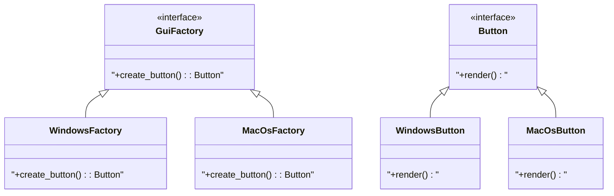
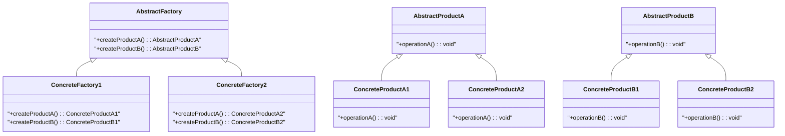
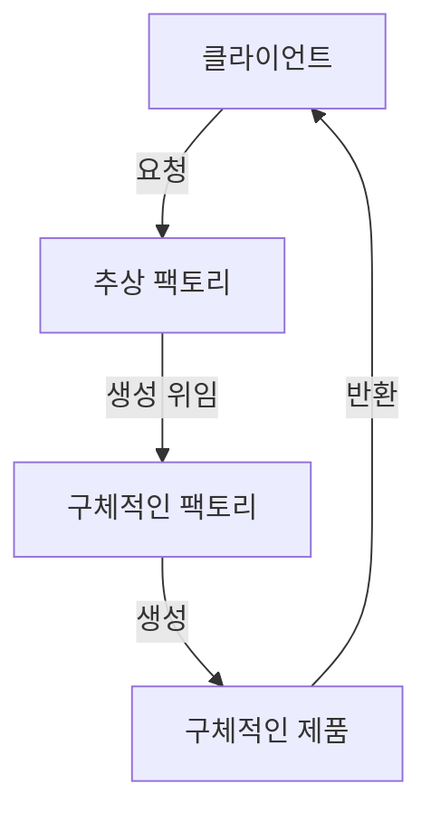
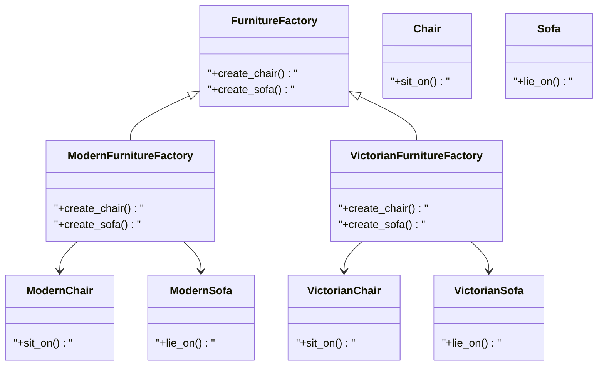
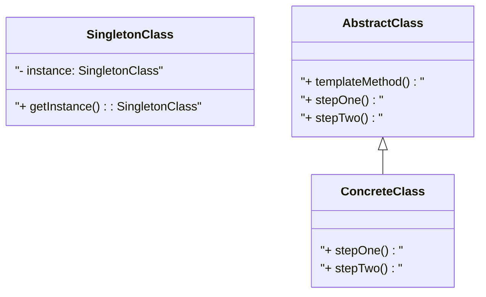

추상 팩토리 패턴은 객체 생성의 유연성을 제공하는 디자인 패턴으로, 서로 관련된 객체들을 일관된 방식으로 생성할 수 있도록 돕는다. 구체적인 클래스에 의존하지 않고 제품군을 정의하고 이를 생성하는 인터페이스를 제공함으로써, 클라이언트 코드가 구체적인 제품의 생성 방식에 대해 알 필요가 없도록 한다. 이 글에서는 정의·구성 요소·동작 원리·실전 예제·FAQ·관련 기술·참고 문헌까지 정리한다.

## 개요

### 추상 팩토리 패턴의 정의

추상 팩토리 패턴은 **구체적인 클래스에 의존하지 않고 관련된 객체들의 집합을 생성하는 인터페이스를 제공하는** 생성 패턴(Creational Pattern)이다. 클라이언트는 어떤 구체 클래스의 인스턴스를 생성할지 결정하지 않고, 팩토리 인터페이스를 통해 객체를 생성한다. GoF(Gamma et al., 1994)의 정의는 다음과 같다.

> "an interface for creating families of related or dependent objects without specifying their concrete classes."

### 패턴의 필요성 및 사용 사례

- **UI 라이브러리**: 운영 체제(Windows, macOS, Linux)에 따라 다른 버튼·텍스트박스·체크박스를 생성할 때, 각 OS에 맞는 UI 요소를 한 번에 맞춰 생성할 수 있다.
- **가구 쇼핑몰 시뮬레이터**: 의자, 소파, 커피 테이블이라는 제품군을 현대식·빅토리안·아르데코 등 스타일별로 일관되게 생성할 때 적합하다.
- **엘리베이터 부품**: 제조사별로 Motor, Door 등 부품군을 바꿔 끼우되, 클라이언트 코드는 동일하게 유지할 수 있다.

### 장점과 단점

| 장점 | 단점 |
|------|------|
| 새로운 제품 변형 추가 시 기존 코드 수정 없이 새 팩토리 클래스만 추가 가능 | 팩토리·제품 클래스가 늘어나 시스템 복잡도 증가 가능 |
| 클라이언트가 구체 클래스에 의존하지 않아 재사용성·테스트 용이 | 새 제품 종류(메서드) 추가 시 추상 팩토리 인터페이스 변경 필요 |

---

## 추상 팩토리 패턴의 구성 요소

| 역할 | 설명 |
|------|------|
| **AbstractFactory** | 제품 객체를 생성하기 위한 인터페이스. 여러 제품 생성 메서드를 선언한다. |
| **ConcreteFactory** | AbstractFactory를 구현하며, 특정 제품군(예: 현대식 가구)에 대한 구체 객체를 생성한다. |
| **AbstractProduct** | 생성될 제품의 공통 인터페이스. 제품이 가져야 할 메서드를 정의한다. |
| **ConcreteProduct** | AbstractProduct를 구현한 실제 제품 클래스(예: ModernChair, VictorianSofa). |

아래는 GUI 예제 기준의 클래스 다이어그램이다.



---

## 구성 요소 상세

**AbstractFactory**  
제품 객체를 생성하기 위한 인터페이스를 정의한다. 다양한 제품을 생성하는 메서드를 포함하며, 클라이언트는 이 인터페이스만으로 제품을 요청한다.

**ConcreteFactory**  
AbstractFactory를 구현하는 클래스로, 특정 제품군에 대한 구체 객체를 생성한다. 예: 현대식 가구 팩토리는 현대식 의자·소파·커피 테이블을 생성한다.

**AbstractProduct**  
생성될 제품의 공통 인터페이스로, 제품이 제공해야 할 메서드를 정의한다. 클라이언트는 이 인터페이스만 알면 된다.

**ConcreteProduct**  
AbstractProduct를 구현한 실제 제품 클래스다. 현대식 의자, 빅토리안 소파, 아르데코 커피 테이블 등이 해당한다.

일반적인 추상 팩토리 구조를 제품 A/B와 두 가지 변형으로 나타낸 다이어그램은 다음과 같다.



---

## 추상 팩토리 패턴의 동작 원리

### 객체 생성 과정

1. 클라이언트는 **추상 팩토리 인터페이스**를 통해 제품을 요청한다.
2. 실행 시점 또는 설정에 따라 **구체 팩토리**가 선택·인스턴스화된다.
3. 선택된 팩토리가 요청된 제품의 인스턴스를 생성해 반환한다.

클라이언트는 구체적인 제품 클래스를 알 필요가 없고, 추상 팩토리와 추상 제품 인터페이스만 사용한다.

### 클라이언트와 팩토리의 관계

클라이언트는 추상 팩토리 타입에만 의존한다. 새 제품 변형이 추가되어도 클라이언트 코드는 수정하지 않아도 되며, 이는 확장성과 유지보수성을 높인다.

### 환경에 따른 팩토리 선택

OS·설정·환경 변수 등에 따라 적절한 ConcreteFactory를 선택해 주입한다. 예시는 다음과 같다.

```python
def get_factory(os_type: str) -> AbstractFactory:
    if os_type == "Windows":
        return WindowsFactory()
    elif os_type == "Linux":
        return LinuxFactory()
    else:
        raise ValueError("Unsupported OS type")
```

동작 흐름을 단순화한 다이어그램은 아래와 같다.



---

## 예제 1: GUI 버튼 (Python)

추상 제품 `Button`, 추상 팩토리 `GUIFactory`, OS별 구체 구현으로 클라이언트가 OS에 맞는 버튼을 받는 예제다.

```python
from abc import ABC, abstractmethod

# Abstract Product
class Button(ABC):
    @abstractmethod
    def render(self):
        pass

# Concrete Products
class WindowsButton(Button):
    def render(self):
        return "Windows Button"

class MacOSButton(Button):
    def render(self):
        return "MacOS Button"

# Abstract Factory
class GUIFactory(ABC):
    @abstractmethod
    def create_button(self) -> Button:
        pass

# Concrete Factories
class WindowsFactory(GUIFactory):
    def create_button(self) -> Button:
        return WindowsButton()

class MacOSFactory(GUIFactory):
    def create_button(self) -> Button:
        return MacOSButton()

# Client Code
def client_code(factory: GUIFactory):
    button = factory.create_button()
    print(button.render())

if __name__ == "__main__":
    os_type = "Windows"  # or "MacOS"
    factory = WindowsFactory() if os_type == "Windows" else MacOSFactory()
    client_code(factory)
```

---

## 예제 2: 가구 쇼핑몰 시뮬레이터

의자·소파·커피 테이블이라는 제품군을 현대식·빅토리안 변형으로 일관되게 생성하는 예제다.

```python
from abc import ABC, abstractmethod

# Abstract Products
class Chair(ABC):
    @abstractmethod
    def sit_on(self):
        pass

class Sofa(ABC):
    @abstractmethod
    def lie_on(self):
        pass

class CoffeeTable(ABC):
    @abstractmethod
    def place_items(self):
        pass

# Concrete Products
class ModernChair(Chair):
    def sit_on(self):
        return "Sitting on a modern chair."

class VictorianChair(Chair):
    def sit_on(self):
        return "Sitting on a Victorian chair."

class ModernSofa(Sofa):
    def lie_on(self):
        return "Lying on a modern sofa."

class VictorianSofa(Sofa):
    def lie_on(self):
        return "Lying on a Victorian sofa."

class ModernCoffeeTable(CoffeeTable):
    def place_items(self):
        return "Placing items on a modern coffee table."

class VictorianCoffeeTable(CoffeeTable):
    def place_items(self):
        return "Placing items on a Victorian coffee table."

# Abstract Factory
class FurnitureFactory(ABC):
    @abstractmethod
    def create_chair(self):
        pass

    @abstractmethod
    def create_sofa(self):
        pass

    @abstractmethod
    def create_coffee_table(self):
        pass

# Concrete Factories
class ModernFurnitureFactory(FurnitureFactory):
    def create_chair(self):
        return ModernChair()

    def create_sofa(self):
        return ModernSofa()

    def create_coffee_table(self):
        return ModernCoffeeTable()

class VictorianFurnitureFactory(FurnitureFactory):
    def create_chair(self):
        return VictorianChair()

    def create_sofa(self):
        return VictorianSofa()

    def create_coffee_table(self):
        return VictorianCoffeeTable()

# Client Code
def client_code(factory: FurnitureFactory):
    chair = factory.create_chair()
    sofa = factory.create_sofa()
    coffee_table = factory.create_coffee_table()
    print(chair.sit_on())
    print(sofa.lie_on())
    print(coffee_table.place_items())

# Usage
print("Modern Furniture:")
client_code(ModernFurnitureFactory())
print("\nVictorian Furniture:")
client_code(VictorianFurnitureFactory())
```

가구 팩토리 구조를 나타낸 클래스 다이어그램이다.



---

## 예제 3: 엘리베이터 부품

제조사별로 버튼·모니터 등 부품군을 바꿔 끼우는 예제다.

```python
from abc import ABC, abstractmethod

class ElevatorButton(ABC):
    @abstractmethod
    def press(self):
        pass

class ElevatorMonitor(ABC):
    @abstractmethod
    def display(self):
        pass

class ManufacturerAButton(ElevatorButton):
    def press(self):
        return "Manufacturer A Button pressed."

class ManufacturerBButton(ElevatorButton):
    def press(self):
        return "Manufacturer B Button pressed."

class ManufacturerAMonitor(ElevatorMonitor):
    def display(self):
        return "Displaying on Manufacturer A Monitor."

class ManufacturerBMonitor(ElevatorMonitor):
    def display(self):
        return "Displaying on Manufacturer B Monitor."

class ElevatorPartsFactory(ABC):
    @abstractmethod
    def create_button(self):
        pass

    @abstractmethod
    def create_monitor(self):
        pass

class ManufacturerAFactory(ElevatorPartsFactory):
    def create_button(self):
        return ManufacturerAButton()

    def create_monitor(self):
        return ManufacturerAMonitor()

class ManufacturerBFactory(ElevatorPartsFactory):
    def create_button(self):
        return ManufacturerBButton()

    def create_monitor(self):
        return ManufacturerBMonitor()

def client_code(factory: ElevatorPartsFactory):
    button = factory.create_button()
    monitor = factory.create_monitor()
    print(button.press())
    print(monitor.display())
```

---

## FAQ

### Q1. 추상 팩토리 패턴과 팩토리 메서드 패턴의 차이는?

- **팩토리 메서드**: **한 종류의 제품**을 생성하는 데 초점을 두고, 서브클래스가 구체 제품을 결정한다.
- **추상 팩토리**: **관련된 여러 제품**을 한 번에 생성하는 인터페이스를 제공하며, 한 팩토리가 제품군 전체를 담당한다. 내부적으로 팩토리 메서드들을 조합해 구현하는 경우가 많다.

### Q2. 사용 시 주의사항은?

- 제품군과 각 제품 간 관계를 명확히 정의해야 한다.
- 새 제품 변형 추가 시 기존 클라이언트를 건드리지 않도록 인터페이스만 활용한다.
- 제품 종류(메서드)가 자주 바뀌면 추상 팩토리 인터페이스가 자주 변경되므로, 그런 경우 빌더·프로토타입 등과의 조합을 고려한다.

### Q3. 새 제품 변형을 추가하려면?

1. 새 변형에 맞는 `ConcreteProduct` 클래스들을 추가한다.
2. `AbstractFactory`를 구현하는 새 `ConcreteFactory`를 추가한다.
3. 초기화/설정 코드에서 환경에 따라 이 새 팩토리를 선택하도록 한다. 클라이언트 코드는 수정하지 않는다.

### Q4. 성능은?

객체 생성이 인터페이스를 한 번 더 거치므로 이론적으로는 오버헤드가 있으나, 대부분의 애플리케이션에서는 무시할 수준이다. 유연성과 유지보수성 이점이 더 크다.

---

## 관련 기술

- **생성 패턴(Creational Patterns)**: 추상 팩토리, 팩토리 메서드, 싱글턴, 빌더, 프로토타입 등으로 객체 생성 방식을 캡슐화한다.
- **싱글턴 패턴**: 구체 팩토리 인스턴스를 앱 전체에서 하나만 쓰고 싶을 때, ConcreteFactory를 싱글턴으로 구현하는 경우가 많다.
- **템플릿 메서드 패턴**: 제품 생성 과정의 골격을 정하고, 일부 단계만 서브클래스에서 구현할 때 함께 쓰일 수 있다.

아래는 싱글턴과 템플릿 메서드 패턴의 구조 예시다. (추상 팩토리와는 별개 패턴이다.)



---

## 결론

- 추상 팩토리 패턴은 **관련 객체 제품군**을 구체 클래스에 의존하지 않고 일관되게 생성할 수 있게 해 준다.
- UI 테마, 가구 스타일, 제조사별 부품처럼 **변형(family)** 이 여러 개이고, 한 번 선택한 변형끼리만 맞춰 쓰는 상황에 적합하다.
- 새 변형 추가는 새 ConcreteFactory와 ConcreteProduct 추가로 해결할 수 있어, 개방-폐쇄 원칙(OCP)에 잘 맞는다.

---

## 참고 문헌

1. **Design Patterns: Elements of Reusable Object-Oriented Software** — Erich Gamma, Richard Helm, Ralph Johnson, John Vlissides. 추상 팩토리를 포함한 GoF 패턴의 원전.
2. **Head First Design Patterns** — Eric Freeman 외. 추상 팩토리를 비유와 그림으로 설명한 입문서.
3. **Refactoring Guru – Abstract Factory** — [https://refactoring.guru/design-patterns/abstract-factory](https://refactoring.guru/design-patterns/abstract-factory). 의도·구조·예제·다른 패턴과의 관계 정리.
4. **Wikipedia – Abstract factory pattern** — [https://en.wikipedia.org/wiki/Abstract_factory_pattern](https://en.wikipedia.org/wiki/Abstract_factory_pattern). 정의·구조·사용 맥락.
5. **gmlwjd9405 – 추상 팩토리 패턴** — [https://gmlwjd9405.github.io/2018/08/08/abstract-factory-pattern.html](https://gmlwjd9405.github.io/2018/08/08/abstract-factory-pattern.html). 엘리베이터 부품 예제와 팩토리 메서드·싱글턴 조합.
6. **johngrib – 추상 팩토리 패턴** — [https://johngrib.github.io/wiki/pattern/abstract-factory/](https://johngrib.github.io/wiki/pattern/abstract-factory/). Java Collection·URL 사례와 구현 시 고려점.

## Reference

- [Refactoring Guru – Abstract Factory](https://refactoring.guru/design-patterns/abstract-factory)
- [Wikipedia – Abstract factory pattern](https://en.wikipedia.org/wiki/Abstract_factory_pattern)
- [gmlwjd9405 – 추상 팩토리 패턴](https://gmlwjd9405.github.io/2018/08/08/abstract-factory-pattern.html)
- [johngrib – 추상 팩토리 패턴](https://johngrib.github.io/wiki/pattern/abstract-factory/)
