프로토타입 패턴은 객체를 생성하는 데 있어 기존 객체를 복제하여 새로운 객체를 생성하는 디자인 패턴이다. 이 패턴은 객체 생성 과정에서 발생할 수 있는 복잡한 로직을 간소화하고, 유사한 객체를 생성할 때 시간과 비용을 줄일 수 있는 장점이 있다. 프로토타입 패턴을 사용하면, 객체 생성 시 복잡한 초기화 과정을 피할 수 있으며, 이미 생성된 객체를 복제하여 새로운 객체를 생성함으로써 코드의 재사용성을 높일 수 있다. 이 패턴은 특히 객체 생성 비용이 크거나, 비슷한 객체가 이미 존재하는 경우에 유용하다. 프로토타입 패턴을 구현하기 위해서는 Cloneable 인터페이스를 구현하고, clone() 메서드를 오버라이드하여 복제 가능한 객체를 만들어야 한다. 이때, 복제된 객체는 원본 객체와 독립적으로 존재해야 하며, 깊은 복사 또는 얕은 복사를 통해 객체를 복제할 수 있다. 프로토타입 패턴은 객체의 상태를 공유하는 경우 부작용이 발생할 수 있으므로, 적절한 복사 방법을 선택하는 것이 중요하다. 이 패턴은 다양한 소프트웨어 개발 분야에서 활용될 수 있으며, 특히 그래픽 디자인 애플리케이션이나 음악 편집기와 같은 분야에서 그 유용성이 두드러진다.


||
|:---:|
||


<!--
##### Outline #####
-->

<!--
# Prototype Design Pattern 목차

## 개요
   - 프로토타입 패턴의 정의
   - 패턴의 필요성 및 사용 사례
   - 패턴의 장점과 단점

## 프로토타입 패턴의 의도
   - 객체 복제의 필요성
   - 객체 생성 비용 절감
   - 런타임에 객체 타입 결정

## 문제 정의
   - 객체 복제의 어려움
   - 비공식적인 접근 방식의 한계
   - 복잡한 객체의 초기화 문제

## 적용 가능성
   - 프로토타입 패턴을 사용할 때의 조건
   - 3rd-party 코드와의 상호작용
   - 서브클래스 수 감소의 필요성

## 구현 방법
   - 프로토타입 인터페이스 정의
   - 복제 메서드 구현
   - 프로토타입 레지스트리의 생성
   - 예제 코드: C# 및 Java 구현

## 예제
   - 개념적인 예시: Person 클래스
   - C++ 예제: Maze Game
   - Java 예제: ShapeCache 및 Shape 클래스
   - 실제 사용 사례: 그림 그리기 애플리케이션

## FAQ
   - 프로토타입 패턴과 다른 디자인 패턴의 차이점은 무엇인가요?
   - 깊은 복사와 얕은 복사의 차이는 무엇인가요?
   - 프로토타입 패턴을 사용할 때 주의해야 할 점은 무엇인가요?
   - 어떤 언어에서 프로토타입 패턴이 더 유용한가요?

## 관련 기술
   - 클론 메서드와 Cloneable 인터페이스
   - 팩토리 메서드 패턴
   - 빌더 패턴
   - 싱글턴 패턴과의 관계

## 결론
   - 프로토타입 패턴의 중요성
   - 객체 지향 설계에서의 역할
   - 향후 연구 및 적용 가능성

## 참고 문헌
   - GoF 디자인 패턴
   - 실용주의 디자인 패턴
   - 코틀린 디자인 패턴
   - 관련 블로그 및 자료 링크

이 목차는 프로토타입 패턴에 대한 포괄적인 이해를 돕기 위해 구성되었으며, 각 섹션은 패턴의 이론적 배경과 실제 구현 예제를 포함하여 독자가 패턴을 쉽게 이해하고 적용할 수 있도록 돕습니다.
-->

<!--
## 개요
   - 프로토타입 패턴의 정의
   - 패턴의 필요성 및 사용 사례
   - 패턴의 장점과 단점
-->

## 개요

**프로토타입 패턴의 정의**  
프로토타입 패턴은 객체를 생성하는 방법 중 하나로, 기존 객체를 복제하여 새로운 객체를 생성하는 방식이다. 이 패턴은 객체의 생성 비용이 높은 경우, 또는 객체의 초기화가 복잡한 경우에 유용하게 사용된다. 프로토타입 패턴은 객체의 복제를 통해 새로운 객체를 생성하므로, 객체의 상태를 유지하면서도 새로운 인스턴스를 쉽게 만들 수 있는 장점이 있다.

**패턴의 필요성 및 사용 사례**  
프로토타입 패턴은 다음과 같은 상황에서 필요하다. 첫째, 객체 생성 비용이 높은 경우, 예를 들어 데이터베이스 연결이나 네트워크 요청과 같은 리소스를 소모하는 객체를 생성할 때 유용하다. 둘째, 복잡한 객체를 초기화하는 과정이 번거로운 경우, 프로토타입 패턴을 통해 기존 객체를 복제하여 초기화 과정을 간소화할 수 있다. 셋째, 런타임에 객체의 타입을 결정해야 할 때, 프로토타입 패턴을 사용하면 유연하게 객체를 생성할 수 있다.

**패턴의 장점과 단점**  
프로토타입 패턴의 장점은 다음과 같다. 첫째, 객체 생성 비용을 줄일 수 있다. 둘째, 복잡한 객체의 초기화 과정을 단순화할 수 있다. 셋째, 런타임에 객체의 타입을 동적으로 결정할 수 있다. 그러나 단점도 존재한다. 첫째, 객체의 복사가 복잡한 경우, 깊은 복사와 얕은 복사 문제로 인해 예상치 못한 오류가 발생할 수 있다. 둘째, 프로토타입 객체를 관리하는 데 추가적인 코드가 필요할 수 있다.

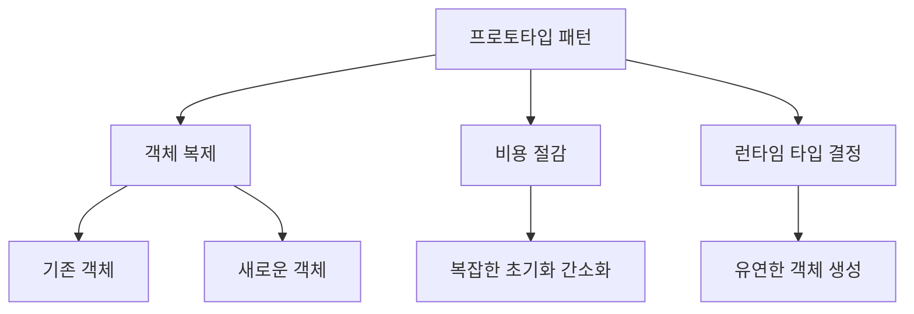

위의 다이어그램은 프로토타입 패턴의 주요 개념과 장점을 시각적으로 나타낸 것이다. 프로토타입 패턴은 객체 지향 설계에서 중요한 역할을 하며, 다양한 상황에서 유용하게 활용될 수 있다.

<!--
## 프로토타입 패턴의 의도
   - 객체 복제의 필요성
   - 객체 생성 비용 절감
   - 런타임에 객체 타입 결정
-->

## 프로토타입 패턴의 의도

**객체 복제의 필요성 **  
객체 복제는 소프트웨어 개발에서 매우 중요한 개념이다. 특히, 객체가 복잡한 상태를 가지거나 초기화 과정이 길어질 경우, 새로운 객체를 생성하는 대신 기존 객체를 복제하는 것이 효율적이다. 프로토타입 패턴은 이러한 복제 과정을 간소화하여, 클라이언트가 객체를 생성할 때 복잡한 초기화 과정을 피할 수 있도록 돕는다. 이를 통해 개발자는 코드의 가독성을 높이고, 유지보수성을 향상시킬 수 있다.

**객체 생성 비용 절감 **  
객체를 생성하는 과정은 메모리 할당, 초기화, 그리고 다양한 설정을 포함한다. 이러한 과정은 특히 복잡한 객체일수록 비용이 많이 든다. 프로토타입 패턴을 사용하면, 이미 생성된 객체를 복제하여 새로운 객체를 생성할 수 있으므로, 객체 생성에 드는 비용을 크게 줄일 수 있다. 이는 성능 최적화에 기여하며, 대량의 객체를 생성해야 하는 경우에 특히 유용하다.

**런타임에 객체 타입 결정 **  
프로토타입 패턴은 런타임에 객체의 타입을 결정할 수 있는 유연성을 제공한다. 이는 다양한 객체를 다루어야 하는 상황에서 매우 유용하다. 예를 들어, 클라이언트가 특정 타입의 객체를 요구할 때, 프로토타입 패턴을 통해 해당 타입의 객체를 런타임에 동적으로 생성할 수 있다. 이러한 유연성은 코드의 확장성을 높이고, 다양한 요구사항에 쉽게 대응할 수 있도록 한다.

**예제 코드 (Java)**

아래는 프로토타입 패턴을 사용하여 객체를 복제하는 간단한 예제이다.

```java
// 프로토타입 인터페이스
interface Prototype {
    Prototype clone();
}

// 구체적인 프로토타입 클래스
class ConcretePrototype implements Prototype {
    private String name;

    public ConcretePrototype(String name) {
        this.name = name;
    }

    @Override
    public Prototype clone() {
        return new ConcretePrototype(this.name);
    }

    public String getName() {
        return name;
    }
}

// 클라이언트 코드
public class PrototypeDemo {
    public static void main(String[] args) {
        ConcretePrototype original = new ConcretePrototype("Original");
        ConcretePrototype clone = (ConcretePrototype) original.clone();

        System.out.println("Original Name: " + original.getName());
        System.out.println("Cloned Name: " + clone.getName());
    }
}
```

**다이어그램**

아래는 프로토타입 패턴의 구조를 나타내는 다이어그램이다.

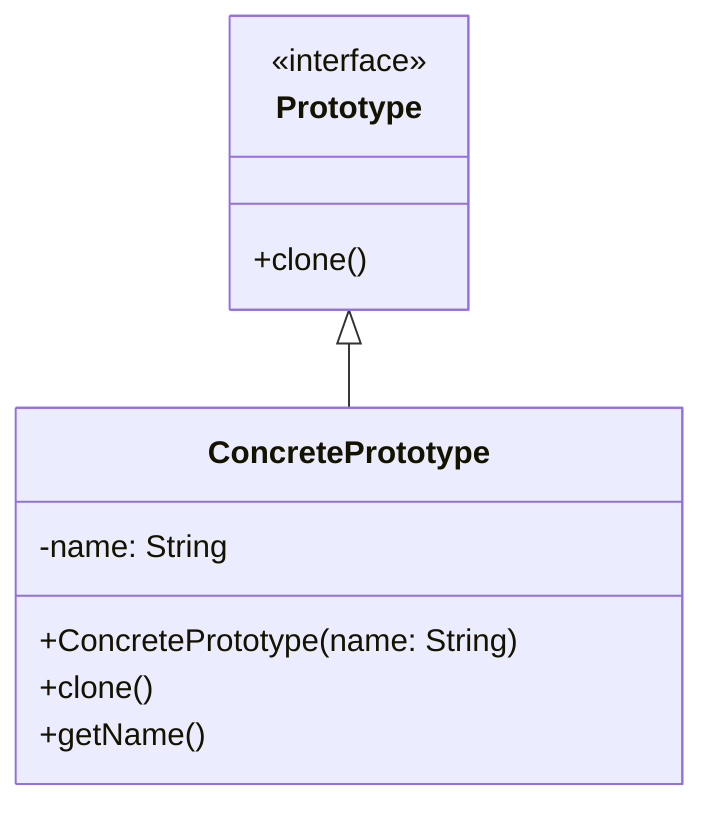

위의 다이어그램은 프로토타입 패턴의 기본 구조를 보여준다. `Prototype` 인터페이스는 `clone` 메서드를 정의하고, `ConcretePrototype` 클래스는 이를 구현하여 객체를 복제하는 기능을 제공한다. 이러한 구조는 객체 복제의 필요성을 충족시키며, 객체 생성 비용을 절감하고 런타임에 객체 타입을 결정할 수 있는 유연성을 제공한다.

<!--
## 문제 정의
   - 객체 복제의 어려움
   - 비공식적인 접근 방식의 한계
   - 복잡한 객체의 초기화 문제
-->

## 문제 정의

**객체 복제의 어려움**  
객체 복제는 소프트웨어 개발에서 자주 발생하는 문제 중 하나이다. 특히, 복잡한 객체를 복제할 때는 그 객체가 가진 상태와 속성을 정확히 복사해야 하므로 어려움이 따른다. 객체가 다른 객체를 참조하고 있는 경우, 단순히 얕은 복사를 수행하면 참조된 객체의 상태가 변경될 때 원본 객체에도 영향을 미칠 수 있다. 이러한 문제는 특히 게임 개발이나 GUI 애플리케이션에서 자주 발생하며, 객체의 상태를 안전하게 복제하는 방법이 필요하다.

**비공식적인 접근 방식의 한계**  
개발자들은 종종 비공식적인 방법으로 객체를 복제하려고 시도한다. 예를 들어, 객체의 속성을 수동으로 복사하거나, JSON 형식으로 직렬화한 후 다시 역직렬화하는 방법을 사용할 수 있다. 그러나 이러한 접근 방식은 코드의 가독성을 떨어뜨리고, 유지보수를 어렵게 만든다. 또한, 객체의 구조가 변경될 경우 이러한 비공식적인 방법은 쉽게 깨질 수 있으며, 이는 버그를 유발할 가능성이 높다.

**복잡한 객체의 초기화 문제**  
복잡한 객체는 여러 개의 하위 객체를 포함하고 있을 수 있으며, 이들 각각의 초기화 과정이 필요하다. 이러한 초기화 과정이 복잡할 경우, 객체를 생성하는 데 많은 코드가 필요하게 된다. 이로 인해 코드의 중복이 발생하고, 객체 생성 시 오류가 발생할 가능성이 높아진다. 따라서, 복잡한 객체를 효율적으로 초기화할 수 있는 방법이 필요하다.

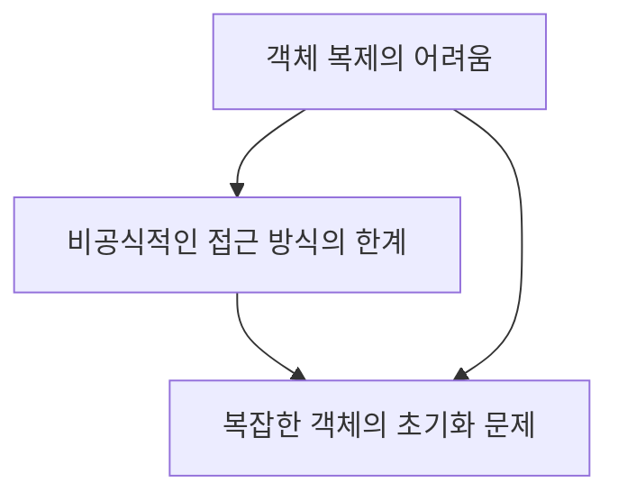

위의 다이어그램은 객체 복제와 관련된 문제들을 시각적으로 나타낸 것이다. 이러한 문제들은 프로토타입 패턴을 통해 해결할 수 있으며, 객체 복제를 보다 효율적이고 안전하게 수행할 수 있는 방법을 제공한다.

<!--
## 적용 가능성
   - 프로토타입 패턴을 사용할 때의 조건
   - 3rd-party 코드와의 상호작용
   - 서브클래스 수 감소의 필요성
-->

## 적용 가능성

프로토타입 패턴은 특정 조건에서 효과적으로 사용될 수 있다. 이 섹션에서는 프로토타입 패턴을 사용할 때의 조건, 3rd-party 코드와의 상호작용, 그리고 서브클래스 수 감소의 필요성에 대해 다룰 것이다.

**프로토타입 패턴을 사용할 때의 조건**
프로토타입 패턴을 적용하기 위해서는 몇 가지 조건이 충족되어야 한다. 첫째, 객체의 생성 비용이 비쌀 때 이 패턴이 유용하다. 객체를 매번 새로 생성하는 대신, 기존 객체를 복제함으로써 성능을 향상시킬 수 있다. 둘째, 객체의 초기화가 복잡할 경우에도 프로토타입 패턴이 적합하다. 복잡한 초기화 과정을 피하고, 이미 초기화된 객체를 복제하여 사용할 수 있기 때문이다. 마지막으로, 다양한 객체 타입이 필요하지만, 이들을 미리 정의하기 어려운 경우에도 프로토타입 패턴이 유용하다.

**3rd-party 코드와의 상호작용**
프로토타입 패턴은 3rd-party 코드와의 상호작용에서도 유용하게 사용될 수 있다. 외부 라이브러리나 프레임워크에서 제공하는 객체를 사용할 때, 해당 객체를 직접 수정하기 어려운 경우가 많다. 이때 프로토타입 패턴을 통해 외부 객체를 복제하여 필요한 속성만 변경함으로써, 기존 객체를 수정하지 않고도 원하는 기능을 구현할 수 있다. 이는 코드의 유연성을 높이고, 유지보수성을 향상시키는 데 기여한다.

**서브클래스 수 감소의 필요성**
객체 지향 설계에서 서브클래스를 많이 생성하는 것은 코드의 복잡성을 증가시킬 수 있다. 프로토타입 패턴을 사용하면 서브클래스를 줄이고, 대신 다양한 객체를 복제하여 사용할 수 있다. 이는 코드의 가독성을 높이고, 유지보수성을 향상시키는 데 도움이 된다. 또한, 서브클래스가 많아질 경우 발생할 수 있는 다형성의 문제를 피할 수 있다.

다음은 프로토타입 패턴의 적용 가능성을 설명하는 다이어그램이다.

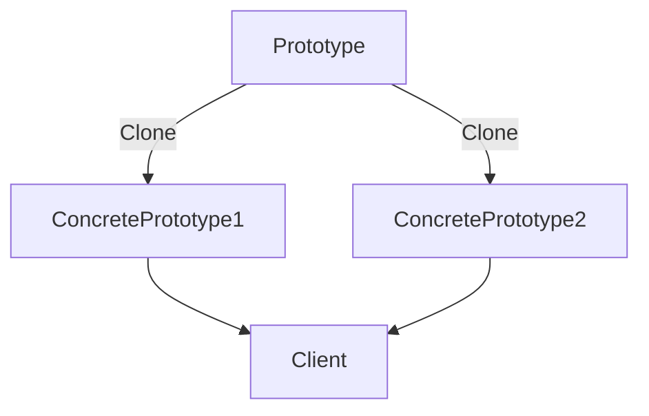

위의 다이어그램은 프로토타입 패턴의 구조를 간단히 나타낸 것이다. 클라이언트는 프로토타입 객체를 통해 다양한 구체적인 객체를 복제하여 사용할 수 있음을 보여준다. 이러한 구조는 객체 생성의 유연성을 제공하며, 다양한 상황에서 프로토타입 패턴을 적용할 수 있는 가능성을 제시한다.

<!--
## 구현 방법
   - 프로토타입 인터페이스 정의
   - 복제 메서드 구현
   - 프로토타입 레지스트리의 생성
   - 예제 코드: C# 및 Java 구현
-->

## 구현 방법

프로토타입 패턴을 구현하기 위해서는 몇 가지 주요 단계를 거쳐야 한다. 이 과정에서는 프로토타입 인터페이스 정의, 복제 메서드 구현, 프로토타입 레지스트리 생성, 그리고 C# 및 Java에서의 예제 코드를 살펴보겠다.

**프로토타입 인터페이스 정의**
프로토타입 패턴의 첫 번째 단계는 복제할 수 있는 객체의 인터페이스를 정의하는 것이다. 이 인터페이스는 일반적으로 `clone()` 메서드를 포함하며, 이 메서드는 객체의 복사본을 반환해야 한다. 예를 들어, 다음과 같은 인터페이스를 정의할 수 있다.

```csharp
public interface IPrototype
{
    IPrototype Clone();
}
```

**복제 메서드 구현**
각 클래스는 `IPrototype` 인터페이스를 구현하고, `Clone()` 메서드를 통해 자신을 복제하는 로직을 제공해야 한다. 이 메서드는 객체의 상태를 그대로 복사하여 새로운 인스턴스를 생성하는 역할을 한다. 예를 들어, C#에서의 구현은 다음과 같다.

```csharp
public class ConcretePrototype : IPrototype
{
    public int Id { get; set; }

    public IPrototype Clone()
    {
        return (IPrototype)this.MemberwiseClone();
    }
}
```

**프로토타입 레지스트리의 생성**
프로토타입 패턴을 효과적으로 사용하기 위해서는 복제할 객체를 관리하는 프로토타입 레지스트리를 생성하는 것이 좋다. 이 레지스트리는 복제할 객체의 인스턴스를 저장하고, 클라이언트가 요청할 때 해당 객체를 복제하여 반환하는 역할을 한다. 다음은 프로토타입 레지스트리의 간단한 예시이다.

```csharp
public class PrototypeRegistry
{
    private Dictionary<string, IPrototype> _prototypes = new Dictionary<string, IPrototype>();

    public void Register(string key, IPrototype prototype)
    {
        _prototypes[key] = prototype;
    }

    public IPrototype GetPrototype(string key)
    {
        return _prototypes[key].Clone();
    }
}
```

**예제 코드: C# 및 Java 구현**
C#과 Java에서의 프로토타입 패턴 구현 예제를 살펴보겠다. 아래는 C#과 Java에서의 간단한 예제 코드이다.

*C# 예제:*

```csharp
public class Client
{
    public static void Main(string[] args)
    {
        PrototypeRegistry registry = new PrototypeRegistry();
        ConcretePrototype prototype = new ConcretePrototype { Id = 1 };
        registry.Register("Prototype1", prototype);

        ConcretePrototype clonedPrototype = (ConcretePrototype)registry.GetPrototype("Prototype1");
        Console.WriteLine($"Cloned Prototype ID: {clonedPrototype.Id}");
    }
}
```

*Java 예제:*

```java
public class Client {
    public static void main(String[] args) {
        PrototypeRegistry registry = new PrototypeRegistry();
        ConcretePrototype prototype = new ConcretePrototype();
        prototype.setId(1);
        registry.register("Prototype1", prototype);

        ConcretePrototype clonedPrototype = (ConcretePrototype) registry.getPrototype("Prototype1");
        System.out.println("Cloned Prototype ID: " + clonedPrototype.getId());
    }
}
```

이와 같이 프로토타입 패턴을 구현하면 객체의 복제를 간편하게 처리할 수 있으며, 객체 생성 비용을 절감할 수 있다. 다음 단계로는 이 패턴을 실제로 어떻게 활용할 수 있는지에 대한 예제를 살펴보겠다. 

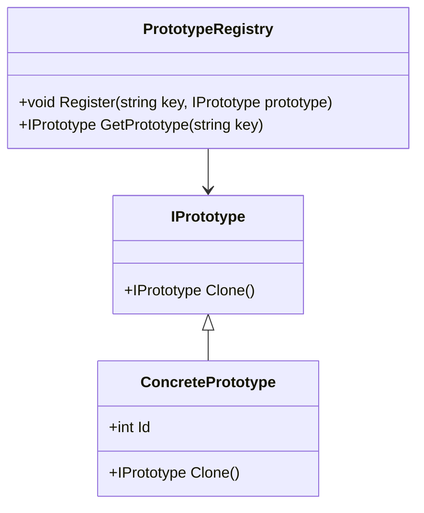

위의 다이어그램은 프로토타입 패턴의 구조를 시각적으로 나타내며, 각 클래스 간의 관계를 명확히 보여준다. 프로토타입 패턴을 통해 객체 복제를 효율적으로 관리할 수 있는 방법을 이해할 수 있다.

<!--
## 예제
   - 개념적인 예시: Person 클래스
   - C++ 예제: Maze Game
   - Java 예제: ShapeCache 및 Shape 클래스
   - 실제 사용 사례: 그림 그리기 애플리케이션
-->

## 예제

**개념적인 예시: Person 클래스**  
프로토타입 패턴을 이해하기 위해 간단한 `Person` 클래스를 예로 들어보겠다. 이 클래스는 이름과 나이를 속성으로 가지며, 복제 메서드를 통해 새로운 `Person` 객체를 생성할 수 있다. 아래는 `Person` 클래스의 간단한 구현 예시이다.

```java
public class Person implements Cloneable {
    private String name;
    private int age;

    public Person(String name, int age) {
        this.name = name;
        this.age = age;
    }

    @Override
    protected Object clone() throws CloneNotSupportedException {
        return super.clone();
    }

    // Getter와 Setter 생략
}
```

위의 코드에서 `Person` 클래스는 `Cloneable` 인터페이스를 구현하고, `clone()` 메서드를 오버라이드하여 객체 복제를 가능하게 한다. 이를 통해 `Person` 객체를 쉽게 복제할 수 있다.

**C++ 예제: Maze Game**  
C++에서 프로토타입 패턴을 활용한 예제로는 `Maze Game`을 들 수 있다. 이 게임에서는 다양한 형태의 미로를 생성할 수 있으며, 각 미로는 복제 가능한 객체로 구현된다. 아래는 간단한 미로 클래스의 예시이다.

```cpp
#include <iostream>
#include <vector>

class Maze {
public:
    virtual Maze* clone() const = 0;
    virtual void display() const = 0;
};

class ConcreteMaze : public Maze {
public:
    Maze* clone() const override {
        return new ConcreteMaze(*this);
    }

    void display() const override {
        std::cout << "Displaying Concrete Maze" << std::endl;
    }
};
```

위의 코드에서 `Maze` 클래스는 복제 메서드를 정의하고, `ConcreteMaze` 클래스는 이를 구현하여 미로 객체를 복제할 수 있도록 한다.

**Java 예제: ShapeCache 및 Shape 클래스**  
Java에서 프로토타입 패턴을 활용한 예제로는 `ShapeCache`와 `Shape` 클래스를 들 수 있다. `ShapeCache`는 다양한 도형 객체를 미리 생성해 두고, 필요할 때마다 복제하여 사용할 수 있다. 아래는 간단한 구현 예시이다.

```java
import java.util.HashMap;

abstract class Shape implements Cloneable {
    protected String type;

    abstract void draw();

    public String getType() {
        return type;
    }

    public Shape clone() {
        Shape clone = null;
        try {
            clone = (Shape) super.clone();
        } catch (CloneNotSupportedException e) {
            e.printStackTrace();
        }
        return clone;
    }
}

class Circle extends Shape {
    public Circle() {
        type = "Circle";
    }

    @Override
    void draw() {
        System.out.println("Drawing a Circle");
    }
}

class ShapeCache {
    private static HashMap<String, Shape> shapeMap = new HashMap<>();

    public static void loadCache() {
        Circle circle = new Circle();
        shapeMap.put(circle.getType(), circle);
    }

    public static Shape getShape(String shapeType) {
        Shape cachedShape = shapeMap.get(shapeType);
        return cachedShape.clone();
    }
}
```

위의 코드에서 `Shape` 클래스는 복제 메서드를 정의하고, `ShapeCache` 클래스는 미리 생성된 도형 객체를 복제하여 반환하는 역할을 한다.

**실제 사용 사례: 그림 그리기 애플리케이션**  
그림 그리기 애플리케이션에서는 다양한 도형을 그릴 수 있는 기능이 필요하다. 이때 프로토타입 패턴을 사용하여 도형 객체를 미리 생성해 두고, 사용자가 원하는 도형을 복제하여 그릴 수 있다. 예를 들어, 사용자가 원을 그리기 원할 경우, 미리 생성된 원 객체를 복제하여 화면에 그리는 방식으로 구현할 수 있다.

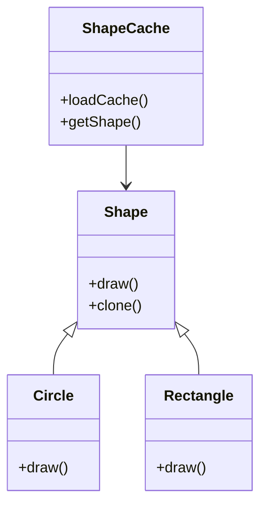

위의 다이어그램은 `Shape`, `Circle`, `Rectangle`, `ShapeCache` 간의 관계를 나타낸다. `ShapeCache`는 다양한 도형 객체를 관리하고, 필요할 때마다 복제하여 사용할 수 있도록 한다. 이러한 방식으로 프로토타입 패턴은 그림 그리기 애플리케이션에서 유용하게 활용될 수 있다.

<!--
## FAQ
   - 프로토타입 패턴과 다른 디자인 패턴의 차이점은 무엇인가요?
   - 깊은 복사와 얕은 복사의 차이는 무엇인가요?
   - 프로토타입 패턴을 사용할 때 주의해야 할 점은 무엇인가요?
   - 어떤 언어에서 프로토타입 패턴이 더 유용한가요?
-->

## FAQ

**프로토타입 패턴과 다른 디자인 패턴의 차이점은 무엇인가요?**  
프로토타입 패턴은 객체를 복제하여 새로운 객체를 생성하는 데 중점을 두고 있다. 이는 객체 생성의 비용을 줄이고, 런타임에 객체의 타입을 결정할 수 있는 유연성을 제공한다. 반면, 다른 디자인 패턴들은 객체 생성, 구조, 행위 등 다양한 측면에 초점을 맞춘다. 예를 들어, 팩토리 메서드 패턴은 객체 생성의 책임을 서브클래스에 위임하여 객체 생성의 유연성을 제공하는 반면, 싱글턴 패턴은 클래스의 인스턴스가 오직 하나만 존재하도록 보장한다. 따라서 프로토타입 패턴은 객체 복제에 특화된 패턴이라고 할 수 있다.

**깊은 복사와 얕은 복사의 차이는 무엇인가요?**  
얕은 복사는 객체의 필드 값만 복사하는 방식으로, 참조형 필드의 경우 원본 객체와 복사된 객체가 동일한 메모리 주소를 참조하게 된다. 반면, 깊은 복사는 객체의 모든 필드 값을 재귀적으로 복사하여 원본 객체와 복사된 객체가 서로 독립적인 메모리 공간을 가지게 된다. 프로토타입 패턴에서는 깊은 복사를 통해 복제된 객체가 원본 객체와 독립적으로 동작할 수 있도록 하는 것이 중요하다.

**프로토타입 패턴을 사용할 때 주의해야 할 점은 무엇인가요?**  
프로토타입 패턴을 사용할 때는 복제할 객체의 상태를 잘 관리해야 한다. 특히, 복제된 객체가 원본 객체의 상태를 공유하게 되면 의도치 않은 부작용이 발생할 수 있다. 또한, 복제할 객체가 복잡한 구조를 가질 경우, 깊은 복사를 구현하는 데 추가적인 노력이 필요할 수 있다. 따라서 복제 메서드를 구현할 때는 객체의 모든 필드를 적절히 복사하도록 주의해야 한다.

**어떤 언어에서 프로토타입 패턴이 더 유용한가요?**  
프로토타입 패턴은 객체 지향 프로그래밍 언어에서 주로 사용되며, 특히 Java, C#, C++와 같은 언어에서 유용하다. Java와 C#에서는 Cloneable 인터페이스와 clone() 메서드를 통해 객체 복제를 쉽게 구현할 수 있다. C++에서는 복사 생성자를 활용하여 깊은 복사를 구현할 수 있다. 또한, JavaScript와 같은 프로토타입 기반 언어에서도 객체를 복제하는 데 유용하게 사용될 수 있다.

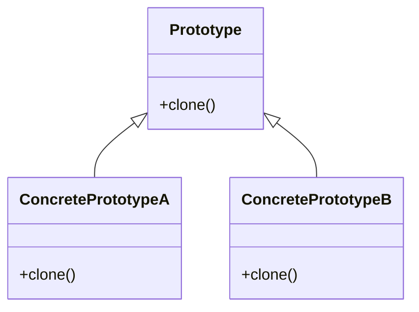

위의 다이어그램은 프로토타입 패턴의 기본 구조를 나타낸다. `Prototype` 클래스는 `clone()` 메서드를 정의하고, 이를 상속받은 `ConcretePrototypeA`와 `ConcretePrototypeB` 클래스는 각각의 복제 메서드를 구현한다. 이러한 구조를 통해 다양한 객체를 효율적으로 복제할 수 있다.

<!--
## 관련 기술
   - 클론 메서드와 Cloneable 인터페이스
   - 팩토리 메서드 패턴
   - 빌더 패턴
   - 싱글턴 패턴과의 관계
-->

## 관련 기술

**클론 메서드와 Cloneable 인터페이스**  
클론 메서드는 객체를 복제하는 데 사용되는 메서드로, Java에서는 `Cloneable` 인터페이스와 함께 사용된다. `Cloneable` 인터페이스를 구현한 클래스는 `clone()` 메서드를 오버라이드하여 객체의 복제를 지원할 수 있다. 이때, 얕은 복사와 깊은 복사를 고려해야 하며, 복제할 객체의 상태를 정확히 반영하기 위해 적절한 구현이 필요하다. 아래는 Java에서의 간단한 예제 코드이다.

```java
class Person implements Cloneable {
    private String name;

    public Person(String name) {
        this.name = name;
    }

    @Override
    protected Object clone() throws CloneNotSupportedException {
        return super.clone();
    }

    public String getName() {
        return name;
    }
}

// 사용 예
public class Main {
    public static void main(String[] args) {
        try {
            Person original = new Person("Alice");
            Person clone = (Person) original.clone();
            System.out.println(clone.getName()); // Alice
        } catch (CloneNotSupportedException e) {
            e.printStackTrace();
        }
    }
}
```

**팩토리 메서드 패턴**  
팩토리 메서드 패턴은 객체 생성의 책임을 서브클래스에 위임하는 디자인 패턴이다. 이 패턴은 객체 생성 로직을 캡슐화하여 클라이언트 코드가 구체적인 클래스에 의존하지 않도록 한다. 프로토타입 패턴과 함께 사용될 수 있으며, 객체의 복제와 생성이 필요한 경우 유용하다. 아래는 팩토리 메서드 패턴의 구조를 나타내는 다이어그램이다.

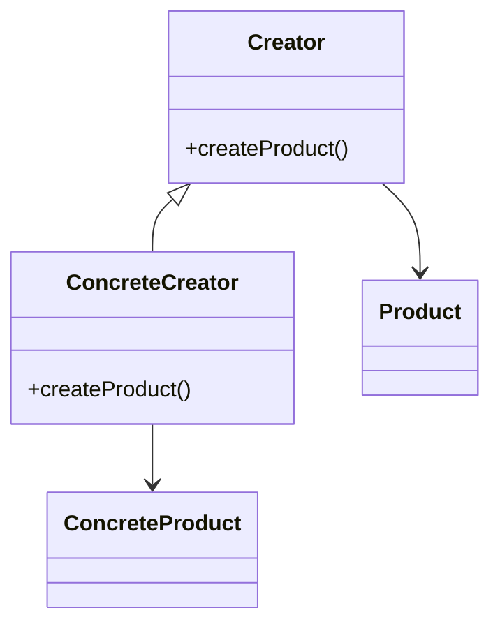

**빌더 패턴**  
빌더 패턴은 복잡한 객체의 생성 과정을 단순화하는 디자인 패턴이다. 이 패턴은 객체의 생성과 표현을 분리하여, 동일한 생성 절차에서 서로 다른 표현의 객체를 생성할 수 있도록 한다. 프로토타입 패턴과 함께 사용하면, 복잡한 객체를 복제할 때 유용하게 활용될 수 있다. 빌더 패턴의 구조는 다음과 같다.

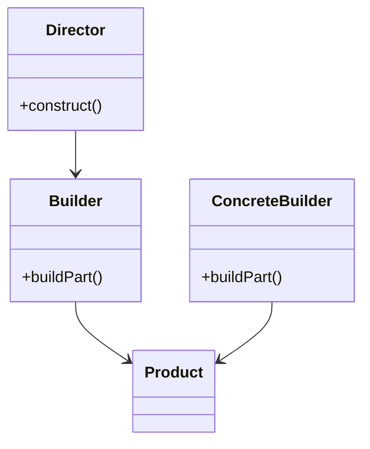

**싱글턴 패턴과의 관계**  
싱글턴 패턴은 클래스의 인스턴스가 오직 하나만 존재하도록 보장하는 디자인 패턴이다. 프로토타입 패턴과는 다르게, 싱글턴 패턴은 객체의 복제를 지원하지 않지만, 특정 상황에서는 두 패턴을 함께 사용할 수 있다. 예를 들어, 싱글턴 객체를 프로토타입으로 복제하여 여러 개의 인스턴스를 생성할 수 있는 경우가 있다. 이러한 관계를 이해하는 것은 객체 지향 설계에서 중요한 요소이다.

이와 같이 프로토타입 패턴은 다양한 디자인 패턴과의 관계를 통해 더욱 유용하게 활용될 수 있으며, 각 패턴의 특성을 이해하는 것이 중요하다.

<!--
## 결론
   - 프로토타입 패턴의 중요성
   - 객체 지향 설계에서의 역할
   - 향후 연구 및 적용 가능성
-->

## 결론

**프로토타입 패턴의 중요성**  
프로토타입 패턴은 객체 생성의 유연성을 제공하는 중요한 디자인 패턴이다. 객체를 복제함으로써 새로운 객체를 생성할 수 있으며, 이는 특히 복잡한 객체를 다룰 때 유용하다. 객체의 초기화 과정에서 발생할 수 있는 비용과 시간을 절감할 수 있으며, 런타임에 객체의 타입을 결정할 수 있는 장점을 가진다. 이러한 특성 덕분에 프로토타입 패턴은 다양한 소프트웨어 개발 환경에서 널리 사용되고 있다.

**객체 지향 설계에서의 역할**  
객체 지향 설계에서 프로토타입 패턴은 객체의 재사용성을 높이고, 코드의 중복을 줄이는 데 기여한다. 객체를 복제하는 방식으로 새로운 객체를 생성함으로써, 개발자는 기존 객체의 상태를 유지하면서도 새로운 기능을 추가할 수 있다. 이는 코드의 유지보수성을 높이고, 시스템의 확장성을 향상시키는 데 중요한 역할을 한다. 또한, 프로토타입 패턴은 객체 간의 관계를 명확히 하여, 객체 지향 설계의 원칙인 '개방-폐쇄 원칙'을 준수하는 데 도움을 준다.

**향후 연구 및 적용 가능성**  
프로토타입 패턴은 다양한 분야에서 활용될 수 있으며, 특히 게임 개발, GUI 애플리케이션, 그리고 복잡한 데이터 구조를 다루는 시스템에서 그 가능성이 크다. 향후 연구에서는 프로토타입 패턴을 더욱 발전시킬 수 있는 방법과, 다른 디자인 패턴과의 통합 방안에 대한 탐구가 필요하다. 예를 들어, 빌더 패턴이나 팩토리 메서드 패턴과의 조합을 통해 더욱 효율적인 객체 생성 방법을 모색할 수 있다.

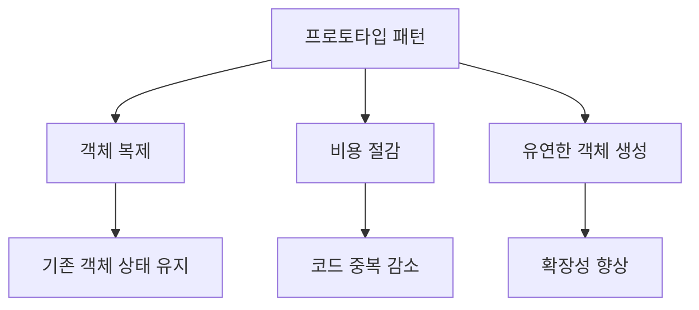

위의 다이어그램은 프로토타입 패턴의 주요 요소와 그로 인해 얻을 수 있는 이점을 시각적으로 나타낸 것이다. 이러한 요소들은 프로토타입 패턴이 소프트웨어 설계에서 중요한 이유를 잘 설명해준다. 프로토타입 패턴은 앞으로도 객체 지향 설계의 중요한 도구로 자리 잡을 것이며, 다양한 분야에서의 적용 가능성을 더욱 넓혀갈 것이다.

<!--
## 참고 문헌
   - GoF 디자인 패턴
   - 실용주의 디자인 패턴
   - 코틀린 디자인 패턴
   - 관련 블로그 및 자료 링크
-->

## 참고 문헌

**GoF 디자인 패턴**  
GoF(Gang of Four) 디자인 패턴은 소프트웨어 디자인 패턴의 기초를 다진 중요한 저서이다. 이 책에서는 23개의 디자인 패턴을 소개하며, 각 패턴의 의도, 구조, 사용 사례를 상세히 설명하고 있다. 프로토타입 패턴도 이 책에서 다루어지며, 객체 생성의 다양한 방법을 이해하는 데 큰 도움이 된다.

**실용주의 디자인 패턴**  
실용주의 디자인 패턴은 소프트웨어 개발에서 실용적인 접근 방식을 강조하는 책이다. 이 책에서는 디자인 패턴을 실제 문제 해결에 어떻게 적용할 수 있는지를 중점적으로 다룬다. 프로토타입 패턴을 포함한 여러 패턴의 실제 사용 사례와 함께, 개발자가 직면할 수 있는 다양한 상황에 대한 통찰을 제공한다.

**코틀린 디자인 패턴**  
코틀린 디자인 패턴은 코틀린 언어를 사용하여 디자인 패턴을 구현하는 방법을 설명하는 자료이다. 이 책에서는 프로토타입 패턴을 포함한 여러 디자인 패턴을 코틀린의 특성을 살려 설명하고 있으며, 현대적인 언어의 장점을 활용한 구현 방법을 제시한다.

**관련 블로그 및 자료 링크**  
다양한 블로그와 온라인 자료는 프로토타입 패턴에 대한 이해를 돕는 데 유용하다. 예를 들어, Medium, Dev.to와 같은 플랫폼에서는 개발자들이 자신의 경험을 바탕으로 작성한 글을 찾아볼 수 있다. 또한, GitHub에서는 프로토타입 패턴을 구현한 다양한 오픈 소스 프로젝트를 통해 실제 코드 예제를 확인할 수 있다.

**샘플 코드**

아래는 프로토타입 패턴을 구현한 간단한 C# 예제 코드이다.

```csharp
public interface IPrototype
{
    IPrototype Clone();
}

public class ConcretePrototype : IPrototype
{
    public string Name { get; set; }

    public ConcretePrototype(string name)
    {
        Name = name;
    }

    public IPrototype Clone()
    {
        return new ConcretePrototype(Name);
    }
}

// 사용 예
class Program
{
    static void Main(string[] args)
    {
        ConcretePrototype prototype = new ConcretePrototype("Prototype1");
        ConcretePrototype clone = (ConcretePrototype)prototype.Clone();

        Console.WriteLine($"Original: {prototype.Name}, Clone: {clone.Name}");
    }
}
```

**다이어그램**

아래는 프로토타입 패턴의 구조를 나타내는 다이어그램이다.

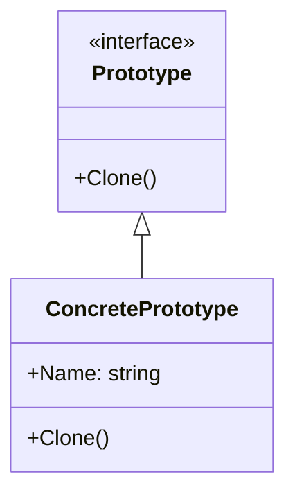

이와 같은 자료들은 프로토타입 패턴을 이해하고 적용하는 데 큰 도움이 될 것이다. 각 참고 문헌과 자료를 통해 더 깊이 있는 지식을 쌓을 수 있다.

<!--
##### Reference #####
-->

## Reference


* [https://refactoring.guru/design-patterns/prototype](https://refactoring.guru/design-patterns/prototype)
* [https://refactoring.guru/ko/design-patterns/prototype/csharp/example](https://refactoring.guru/ko/design-patterns/prototype/csharp/example)
* [https://en.wikipedia.org/wiki/Prototype_pattern](https://en.wikipedia.org/wiki/Prototype_pattern)
* [https://velog.io/@newtownboy/%EB%94%94%EC%9E%90%EC%9D%B8%ED%8C%A8%ED%84%B4-%ED%94%84%EB%A1%9C%ED%86%A0%ED%83%80%EC%9E%85%ED%8C%A8%ED%84%B4Prototype-Pattern](https://velog.io/@newtownboy/%EB%94%94%EC%9E%90%EC%9D%B8%ED%8C%A8%ED%84%B4-%ED%94%84%EB%A1%9C%ED%86%A0%ED%83%80%EC%9E%85%ED%8C%A8%ED%84%B4Prototype-Pattern)
* [https://readystory.tistory.com/122](https://readystory.tistory.com/122)
* [https://johngrib.github.io/wiki/pattern/prototype/](https://johngrib.github.io/wiki/pattern/prototype/)
* [https://shan0325.tistory.com/26](https://shan0325.tistory.com/26)
* [https://math-development-geometry.tistory.com/62](https://math-development-geometry.tistory.com/62)

