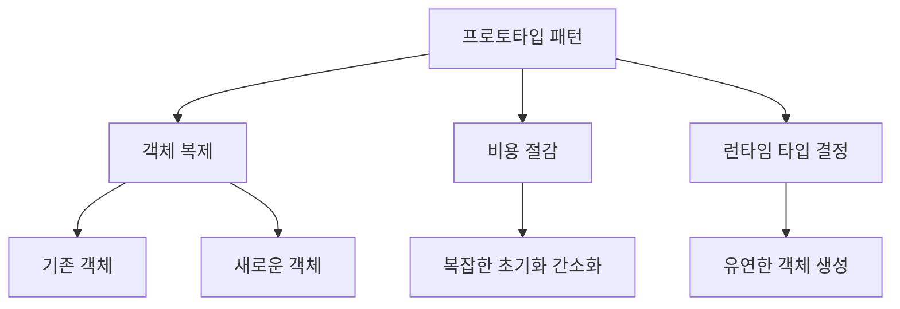
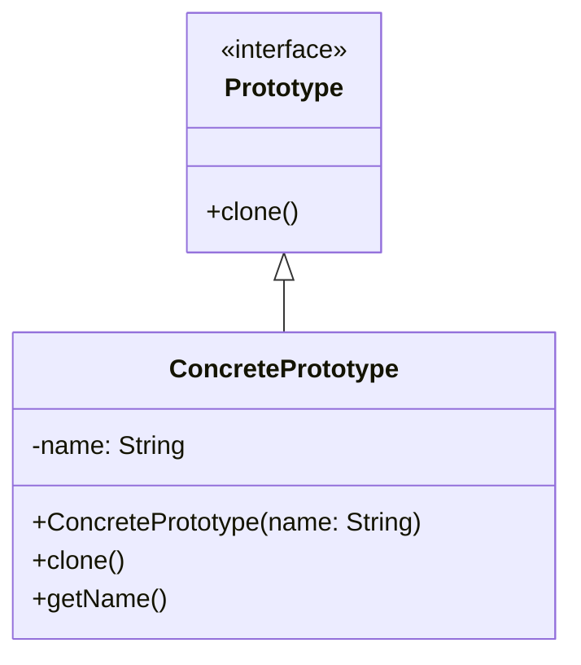
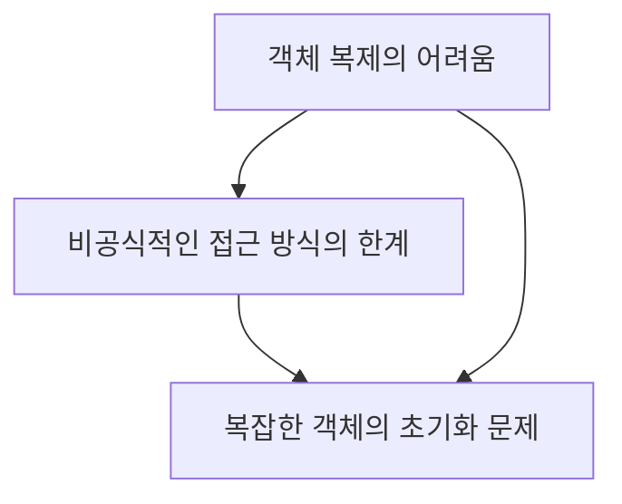
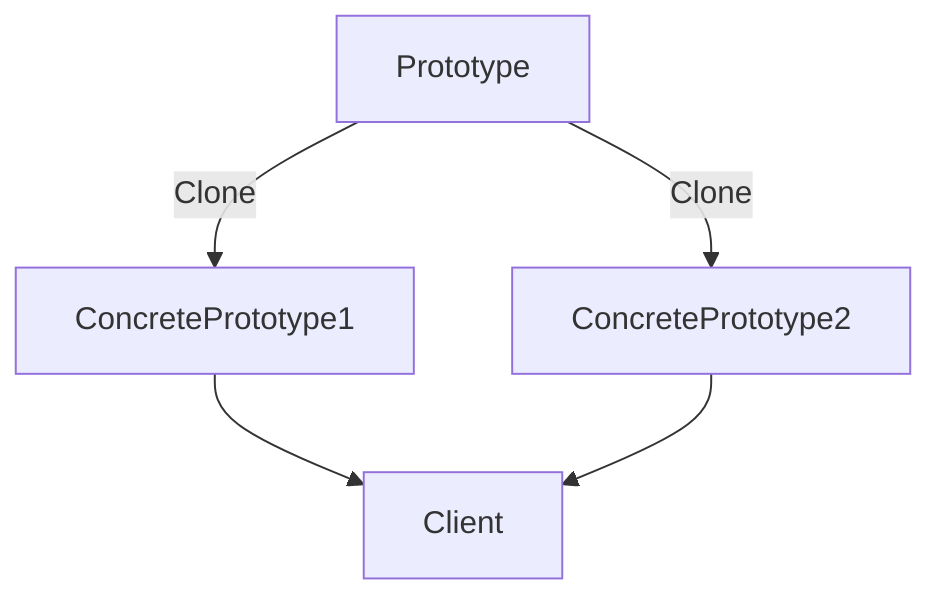
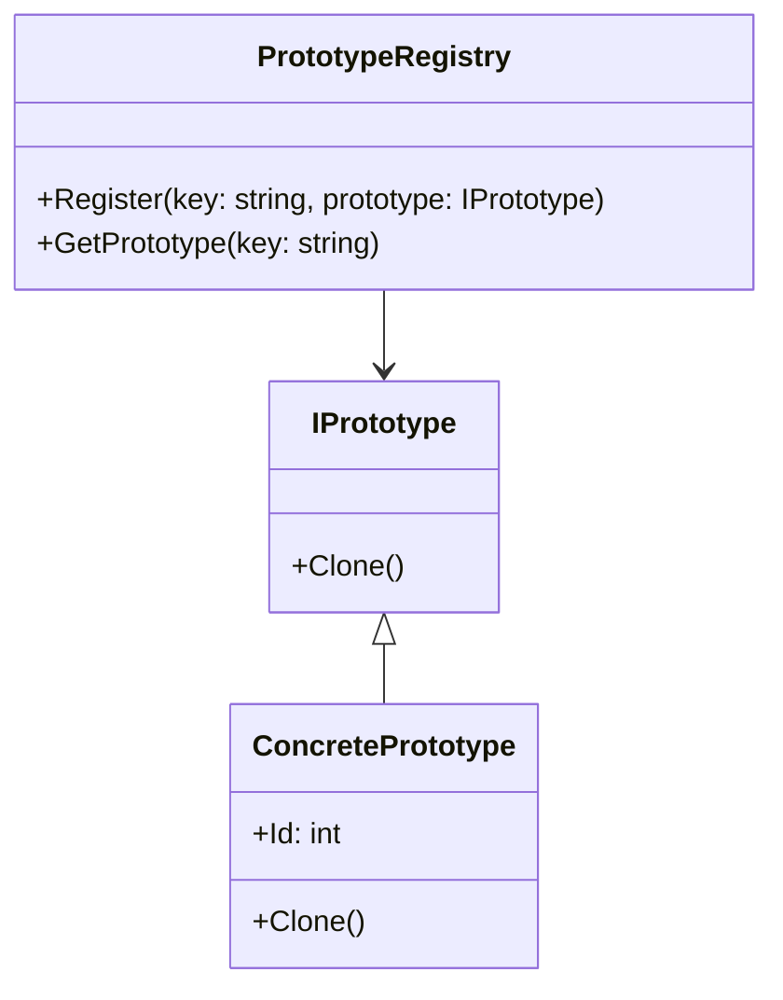
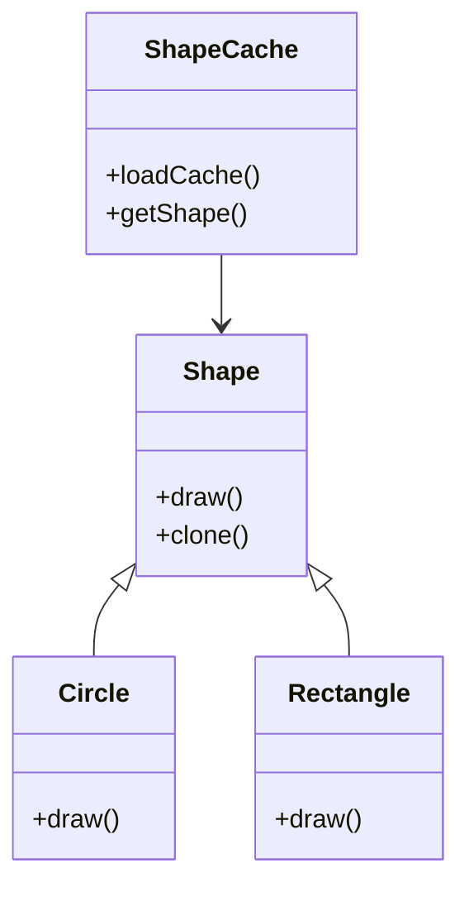
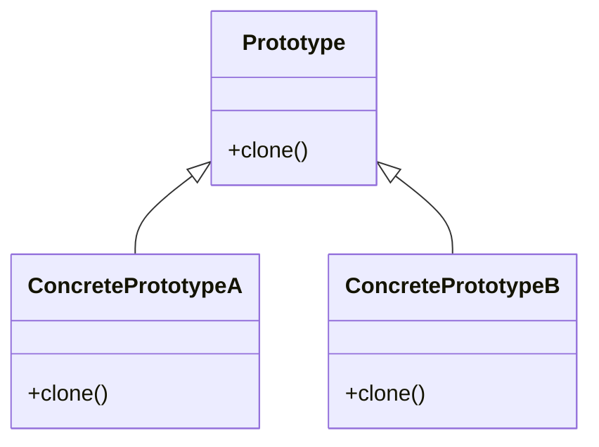
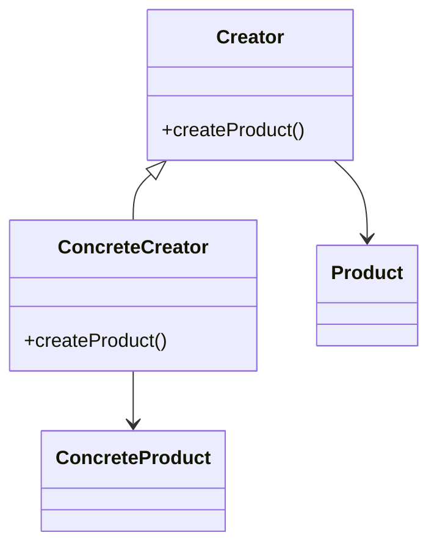
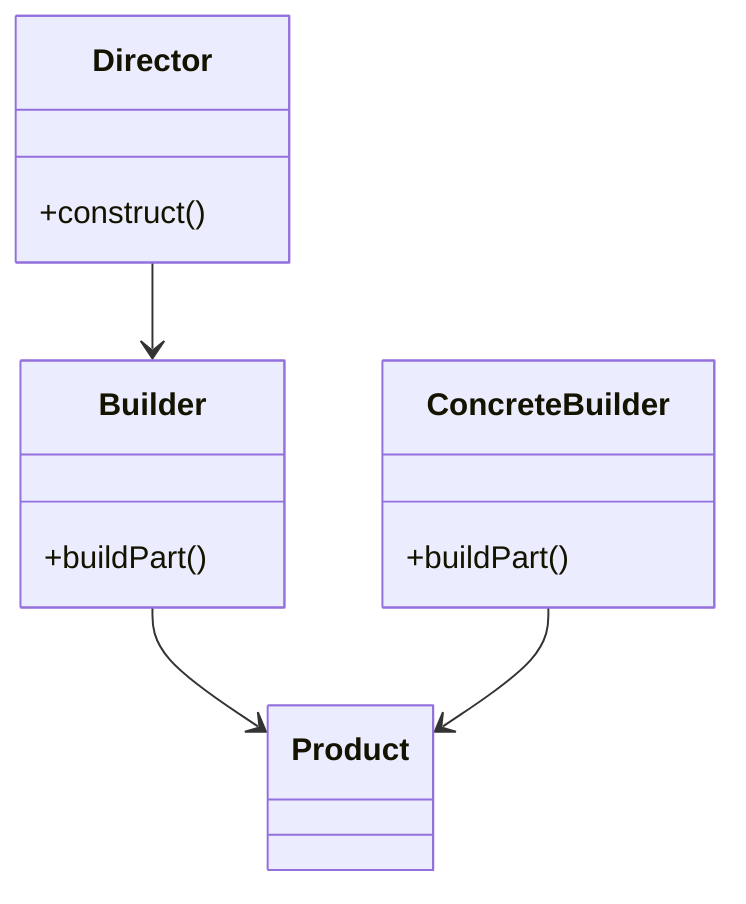
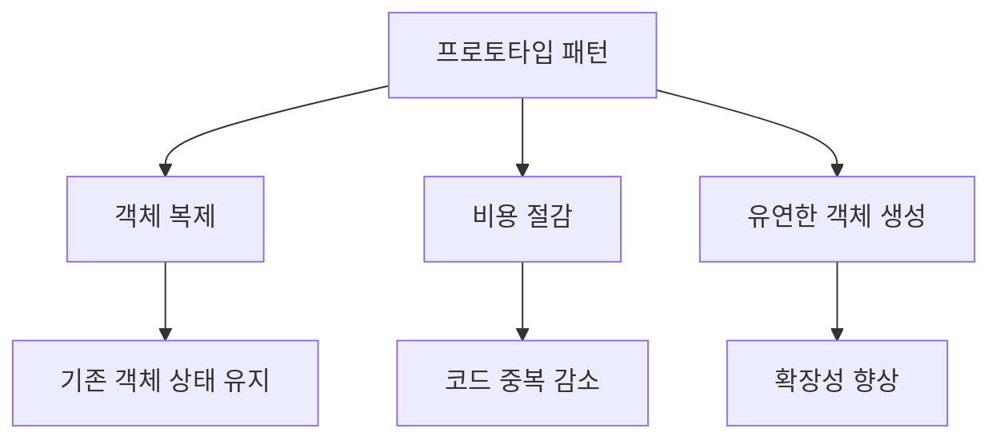

프로토타입 패턴은 **기존 객체를 복제하여 새로운 객체를 만드는 생성 패턴(Creational Pattern)**이다. 객체 생성 비용이 크거나, 복잡한 초기화를 피하고 싶거나, 런타임에 객체 타입을 결정해야 할 때 유용하다. 이 글에서는 정의·의도·문제·적용 조건·구현·예제·FAQ·관련 패턴·참고 문헌까지 체계적으로 다룬다.

---

## 개요

**프로토타입 패턴의 정의**  
프로토타입 패턴은 객체를 만드는 방법 중 하나로, **이미 있는 객체를 복제해 새 객체를 만드는 방식**이다. 생성 비용이 크거나 초기화가 복잡한 객체를 다룰 때, 새 인스턴스를 매번 만드는 대신 원형(prototype)을 복사해 쓰는 패턴이다. 복제를 위해 보통 `clone()`(Java) 또는 `Clone()`(C#), 복사 생성자(C++) 등을 사용한다.

**패턴의 필요성 및 사용 사례**  
다음 상황에서 쓰기 좋다. (1) **객체 생성 비용이 클 때** — DB 조회·네트워크·무거운 연산이 필요한 객체는 한 번 만든 뒤 복제해 재사용한다. (2) **초기화가 복잡할 때** — 여러 단계 설정이 필요한 객체는 원형을 한 번 구성해 두고 복제만 한다. (3) **런타임에 구체 타입을 정할 때** — 클라이언트가 구체 클래스를 알 필요 없이 프로토타입 인터페이스만으로 복제할 수 있다.

**패턴의 장점과 단점**  
장점: 생성 비용·초기화 코드 감소, 런타임 타입 결정 가능, 서브클래스 수를 줄일 수 있음. 단점: **얕은 복사/깊은 복사**를 잘못 쓰면 원본과 복제본이 상태를 공유해 버그가 나고, 순환 참조가 있으면 복제 구현이 까다롭다.


```mermaid
graph TD
    PrototypePattern["프로토타입 패턴"]
    ObjectClone["객체 복제"]
    CostReduction["비용 절감"]
    RuntimeType["런타임 타입 결정"]
    ExistingObj["기존 객체"]
    NewObj["새로운 객체"]
    SimpleInit["복잡한 초기화 간소화"]
    FlexibleCreate["유연한 객체 생성"]

    PrototypePattern --> ObjectClone
    PrototypePattern --> CostReduction
    PrototypePattern --> RuntimeType
    ObjectClone --> ExistingObj
    ObjectClone --> NewObj
    CostReduction --> SimpleInit
    RuntimeType --> FlexibleCreate
```

위 다이어그램은 프로토타입 패턴이 제공하는 세 가지 이점(객체 복제, 비용 절감, 런타임 타입 결정)과 그 결과를 정리한 것이다.

---

## 프로토타입 패턴의 의도

**객체 복제의 필요성**  
복잡한 상태나 긴 초기화를 가진 객체는 매번 새로 만들기보다, 이미 만든 객체를 복제하는 편이 효율적이다. 프로토타입 패턴은 이 복제 과정을 인터페이스로 통일해, 클라이언트가 구체 클래스에 의존하지 않고 복제할 수 있게 한다.

**객체 생성 비용 절감**  
생성에는 메모리 할당·초기화·설정이 포함된다. 프로토타입은 이미 구성된 객체를 복사하므로, 이런 비용을 크게 줄일 수 있고, 대량 생성 시 성능에 유리하다.

**런타임에 객체 타입 결정**  
클라이언트가 “이 인터페이스를 만족하는 객체가 필요하다”만 알면 되고, 구체 타입은 런타임에 프로토타입으로 결정할 수 있다. 동적 로딩·설정 기반 생성·플러그인 구조와 잘 맞는다.

**예제 코드 (Java)**

```java
// 프로토타입 인터페이스
interface Prototype {
    Prototype clone();
}

// 구체 프로토타입
class ConcretePrototype implements Prototype {
    private String name;

    public ConcretePrototype(String name) {
        this.name = name;
    }

    @Override
    public Prototype clone() {
        return new ConcretePrototype(this.name);
    }

    public String getName() {
        return name;
    }
}

// 클라이언트
public class PrototypeDemo {
    public static void main(String[] args) {
        ConcretePrototype original = new ConcretePrototype("Original");
        ConcretePrototype clone = (ConcretePrototype) original.clone();
        System.out.println("Original: " + original.getName() + ", Clone: " + clone.getName());
    }
}
```

**구조 다이어그램**


```mermaid
classDiagram
    class Prototype {
        <<interface>>
        +clone()
    }
    class ConcretePrototype {
        -name: String
        +ConcretePrototype(name: String)
        +clone()
        +getName()
    }
    Prototype <|-- ConcretePrototype
```

`Prototype` 인터페이스는 `clone`을 정의하고, `ConcretePrototype`이 이를 구현해 복제를 제공한다.

---

## 문제 정의

**객체 복제의 어려움**  
복잡한 객체를 복제할 때는 모든 상태·참조를 올바르게 복사해야 한다. **얕은 복사**만 쓰면 참조 타입 필드는 원본과 같은 인스턴스를 가리켜, 한쪽을 수정하면 다른 쪽에도 영향을 준다. 게임·GUI·도메인 모델처럼 중첩 구조가 있으면 복제 로직이 쉽게 잘못될 수 있다.

**비공식적인 접근의 한계**  
필드를 손으로 복사하거나, JSON 등으로 직렬화 후 역직렬화하는 방식은 코드가 흩어지고, 구조가 바뀔 때 깨지기 쉽다. 프로토타입 패턴은 “복제 가능한 인터페이스 + clone 구현”으로 이 책임을 한곳에 모은다.

**복잡한 객체의 초기화 문제**  
여러 하위 객체를 갖는 객체는 생성·초기화 코드가 길어지고 중복된다. 프로토타입은 “한 번 잘 만든 원형을 복제”해 초기화 부담을 줄인다.


```mermaid
graph TD
    CloneDifficulty["객체 복제의 어려움"]
    InformalLimit["비공식적인 접근 방식의 한계"]
    InitProblem["복잡한 객체의 초기화 문제"]

    CloneDifficulty --> InformalLimit
    InformalLimit --> InitProblem
    CloneDifficulty --> InitProblem
```

---

## 적용 가능성

**프로토타입을 쓸 조건**  
(1) 객체 생성 비용이 크거나, (2) 초기화가 복잡하거나, (3) 구체 타입을 미리 열거하기 어렵고 런타임에 결정할 때 적합하다.

**3rd-party 코드와의 상호작용**  
외부 라이브러리 객체를 수정할 수 없을 때, 그 객체를 복제한 뒤 필요한 필드만 바꿔 쓰는 방식으로 활용할 수 있다.

**서브클래스 수 감소**  
“설정만 다른 여러 종류”를 서브클래스로 만들기보다, 설정된 프로토타입을 여러 개 두고 복제해 쓰면 클래스 수를 줄일 수 있다.


```mermaid
graph TD
    Prototype["Prototype"]
    Concrete1["ConcretePrototype1"]
    Concrete2["ConcretePrototype2"]
    Client["Client"]

    Prototype -->|"Clone"| Concrete1
    Prototype -->|"Clone"| Concrete2
    Concrete1 --> Client
    Concrete2 --> Client
```

클라이언트는 프로토타입을 통해 여러 구체 타입의 복제본을 동일한 방식으로 얻을 수 있다.

---

## 구현 방법

**1. 프로토타입 인터페이스**  
복제 가능한 객체의 공통 인터페이스에 `clone()`(또는 `Clone()`)을 선언한다.

**2. 복제 메서드 구현**  
각 구체 클래스에서 자신의 상태를 복사해 새 인스턴스를 반환한다. 참조 타입은 깊은 복사가 필요한지 판단해 구현한다.

**3. 프로토타입 레지스트리**  
자주 쓰는 프로토타입을 이름·키로 등록해 두고, 클라이언트는 키로 조회한 뒤 복제해서 사용한다.

**C# 예제**

```csharp
public interface IPrototype
{
    IPrototype Clone();
}

public class ConcretePrototype : IPrototype
{
    public int Id { get; set; }

    public IPrototype Clone()
    {
        return (IPrototype)this.MemberwiseClone();
    }
}

public class PrototypeRegistry
{
    private Dictionary<string, IPrototype> _prototypes = new Dictionary<string, IPrototype>();

    public void Register(string key, IPrototype prototype)
    {
        _prototypes[key] = prototype;
    }

    public IPrototype GetPrototype(string key)
    {
        return _prototypes[key].Clone();
    }
}
```

*주의: `MemberwiseClone()`은 얕은 복사이다. 참조 타입 필드는 깊은 복사가 필요하면 `Clone()` 안에서 별도 처리해야 한다.*


```mermaid
classDiagram
    class IPrototype {
        +Clone()
    }
    class ConcretePrototype {
        +Id: int
        +Clone()
    }
    class PrototypeRegistry {
        +Register(key: string, prototype: IPrototype)
        +GetPrototype(key: string)
    }
    IPrototype <|-- ConcretePrototype
    PrototypeRegistry --> IPrototype
```

---

## 예제

**Person 클래스 (Java, Cloneable)**  
이름·나이만 갖는 단순 예이다. `Cloneable` + `clone()` 오버라이드로 복제를 지원한다. 기본 `Object.clone()`은 얕은 복사이므로, 참조 필드가 있으면 `clone()` 안에서 깊은 복사를 구현해야 한다.

**C++ Maze Game**  
미로·방·문·복도 등을 복제 가능한 프로토타입으로 두고, `clone()`으로 새 구역을 만드는 식으로 사용할 수 있다. 복사 생성자 또는 `clone()`에서 내부 참조까지 복사해야 한다.

**Java ShapeCache·Shape**  
도형(원, 사각형 등)을 한 번 생성해 캐시에 넣어 두고, 요청 시 `getShape(id)`에서 해당 프로토타입을 `clone()`해 반환한다. 그래픽 에디터의 “도형 추가”와 같은 시나리오에 맞다.

**실제 사용 사례: 그림 그리기 애플리케이션**  
도형 팔레트에 있는 각 도형이 프로토타입이다. 사용자가 도형을 선택하면 해당 프로토타입을 복제해 캔버스에 새 인스턴스를 추가하는 방식으로 구현할 수 있다.


```mermaid
classDiagram
    class Shape {
        +draw()
        +clone()
    }
    class Circle {
        +draw()
    }
    class Rectangle {
        +draw()
    }
    class ShapeCache {
        +loadCache()
        +getShape()
    }
    Shape <|-- Circle
    Shape <|-- Rectangle
    ShapeCache --> Shape
```

---

## FAQ

**Q. 프로토타입과 다른 생성 패턴의 차이는?**  
프로토타입은 “복제”로 객체를 만든다. 팩토리 메서드는 서브클래스가 생성 로직을 담고, 추상 팩토리는 제품 군을 생성하며, 빌더는 단계별로 객체를 조립한다. 프로토타입은 “원형을 복사”하는 데 특화되어 있고, 구체 클래스에 대한 의존을 줄일 수 있다.

**Q. 깊은 복사와 얕은 복사의 차이는?**  
**얕은 복사**: 필드 값만 복사하고, 참조 타입 필드는 같은 인스턴스를 가리킨다. **깊은 복사**: 참조 타입까지 새로 만들어 복사해, 원본과 복제본이 완전히 분리된다. 프로토타입에서는 “원본과 독립적으로 동작해야 하는지”에 따라 선택한다.

**Q. 사용 시 주의점은?**  
(1) 복제 후 원본과 상태를 공유하지 않도록 얕은/깊은 복사를 정확히 구현할 것. (2) 순환 참조가 있으면 복제 순서·깊이 제한을 고려할 것. (3) clone 구현을 누락한 서브클래스가 있으면 부모 타입으로 반환되는 등 버그가 생기므로, 각 구체 타입에서 clone을 명시적으로 구현할 것.

**Q. 어떤 언어에서 유리한가?**  
Java·C#·C++처럼 클래스 기반 OOP에서 생성 비용·초기화 복잡도를 줄이는 데 잘 맞는다. Kotlin의 `data class`·`copy()`, JavaScript의 객체 스프레드 등은 언어 수준에서 복제를 지원해, 프로토타입 패턴을 덜 쓰게 할 수 있다.


```mermaid
classDiagram
    class Prototype {
        +clone()
    }
    class ConcretePrototypeA {
        +clone()
    }
    class ConcretePrototypeB {
        +clone()
    }
    Prototype <|-- ConcretePrototypeA
    Prototype <|-- ConcretePrototypeB
```

---

## 관련 기술

**Clone 메서드와 Cloneable**  
Java에서는 `Cloneable`을 구현한 클래스만 `Object.clone()`을 사용할 수 있다. `clone()`을 public으로 오버라이드하고, 반환 타입을 구체 클래스로 좁혀 쓰는 것이 일반적이다. C#에서는 `ICloneable` 또는 자체 `Clone()` 메서드를 정의해 사용한다.

**팩토리 메서드·빌더와의 관계**  
팩토리 메서드는 “생성 책임을 서브클래스에 위임”하고, 빌더는 “단계별 조립”이다. 프로토타입은 “원형 복제”이므로, “팩토리가 프로토타입을 복제해 제품을 만드는” 식으로 조합할 수 있다.

**싱글턴과의 관계**  
싱글턴은 인스턴스가 하나만 있도록 제한한다. 그 단일 인스턴스를 프로토타입으로 등록해 두고, 필요할 때 복제해 쓰는 구성도 가능하다. 단, 싱글턴이 상태를 많이 갖는 경우 복제 비용과 독립성(깊은 복사 필요 여부)을 고려해야 한다.


```mermaid
classDiagram
    class Creator {
        +createProduct()
    }
    class ConcreteCreator {
        +createProduct()
    }
    class Product
    class ConcreteProduct

    Creator <|-- ConcreteCreator
    Creator --> Product
    ConcreteCreator --> ConcreteProduct
```


```mermaid
classDiagram
    class Director {
        +construct()
    }
    class Builder {
        +buildPart()
    }
    class ConcreteBuilder {
        +buildPart()
    }
    class Product

    Director --> Builder
    Builder --> Product
    ConcreteBuilder --> Product
```

---

## 결론

**프로토타입 패턴의 역할**  
객체 생성 비용을 줄이고, 복잡한 초기화를 원형 복제로 대체하며, 런타임에 구체 타입을 유연하게 선택할 수 있게 한다. 생성 패턴 중 “복제”에 특화된 패턴이다.

**객체 지향 설계에서의 의미**  
코드 중복을 줄이고, 구체 클래스에 대한 의존을 인터페이스 뒤로 숨기며, “원형을 등록·복제”하는 방식으로 확장 가능한 설계를 만들 수 있다.

**활용 방향**  
게임(캐릭터·맵 복제), GUI(위젯·도형 복제), 설정/템플릿 객체 재사용, 동적 로딩된 타입의 인스턴스 생성 등에 적용할 수 있다. 다른 생성 패턴(팩토리, 빌더, 싱글턴)과 함께 쓰면 더 유연한 객체 생성을 설계할 수 있다.


```mermaid
graph TD
    PrototypePattern["프로토타입 패턴"]
    ObjectClone["객체 복제"]
    CostReduction["비용 절감"]
    FlexibleCreate["유연한 객체 생성"]
    StateKeep["기존 객체 상태 유지"]
    LessDuplicate["코드 중복 감소"]
    Extensibility["확장성 향상"]

    PrototypePattern --> ObjectClone
    PrototypePattern --> CostReduction
    PrototypePattern --> FlexibleCreate
    ObjectClone --> StateKeep
    CostReduction --> LessDuplicate
    FlexibleCreate --> Extensibility
```

---

## 참고 문헌

- **GoF 디자인 패턴** — Erich Gamma 외, 『Design Patterns: Elements of Reusable Object-Oriented Software』. 프로토타입을 비롯한 23가지 패턴의 의도·구조·사용 시기가 정리되어 있다.
- **실용주의 디자인 패턴** — Allen Holub, 『Holub on Patterns』. 프로토타입과 추상 팩토리·동적 로딩·상태 기반 생성의 관계를 실무 관점에서 설명한다.
- **코틀린 디자인 패턴** — Kotlin의 `data class`·`copy()`와 프로토타입 패턴의 대응 관계를 다룬다.

---

## Reference

본문에서 참고한 접근 가능한 링크만 아래에 정리한다.

- [Refactoring.Guru – Prototype (영문)](https://refactoring.guru/design-patterns/prototype)
- [Refactoring.Guru – 프로토타입 C# 예제 (한글)](https://refactoring.guru/ko/design-patterns/prototype/csharp/example)
- [Wikipedia – Prototype pattern](https://en.wikipedia.org/wiki/Prototype_pattern)
- [기계인간 John Grib – 프로토타입 패턴](https://johngrib.github.io/wiki/pattern/prototype/)
- [준비된 개발자 – 프로토타입 패턴 이해 및 예제 (readystory)](https://readystory.tistory.com/122)
