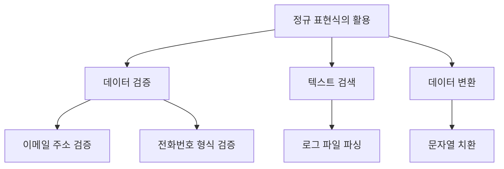
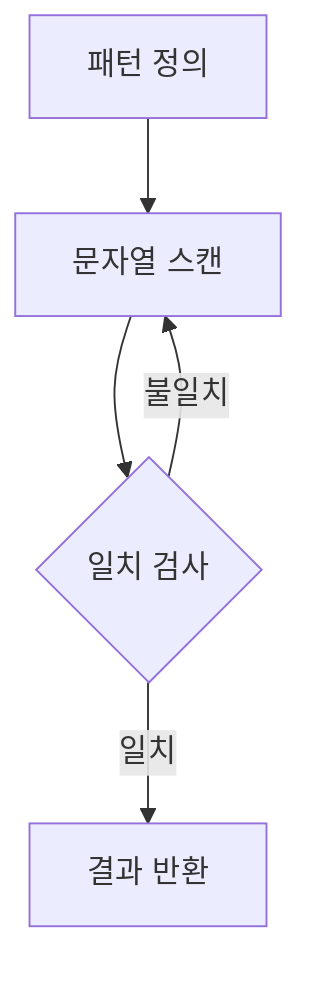
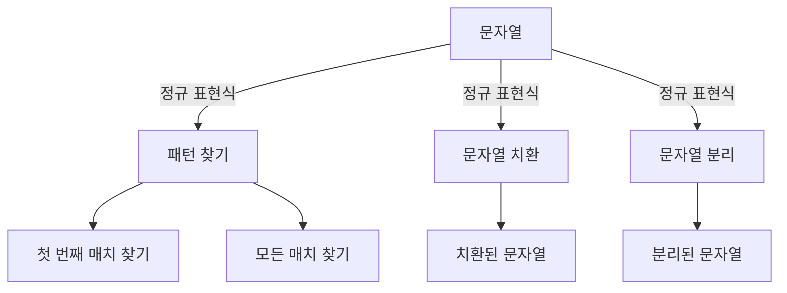
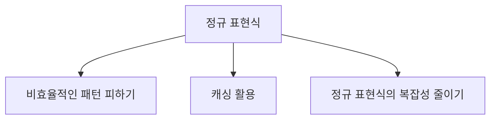
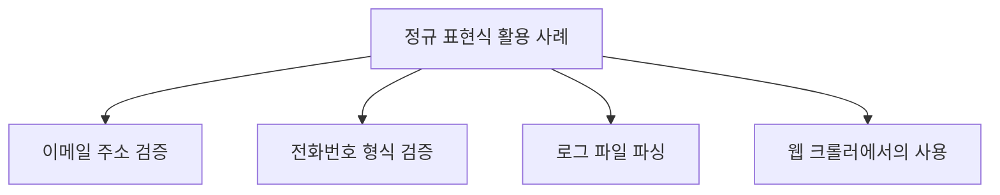
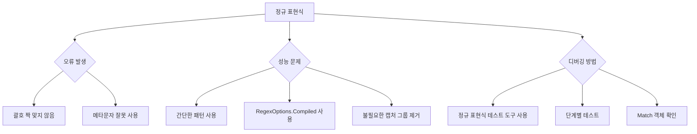
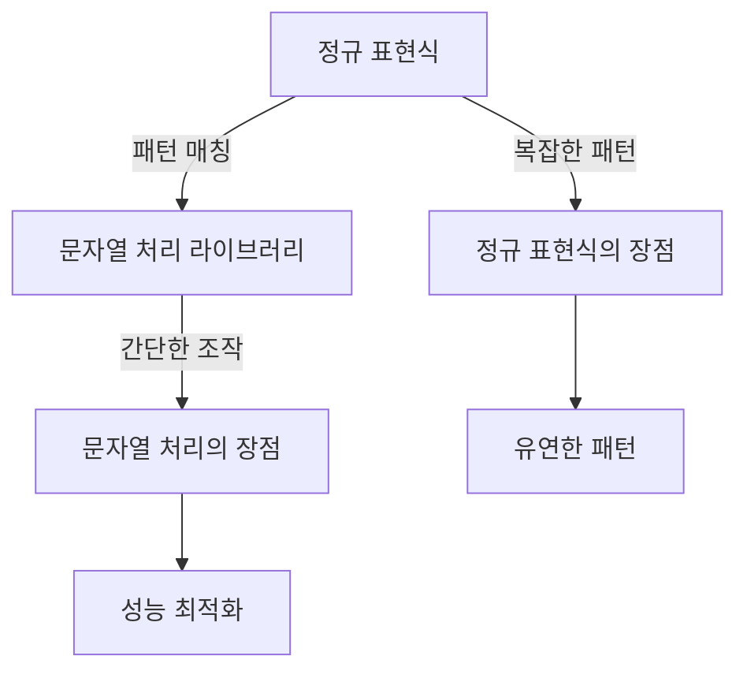
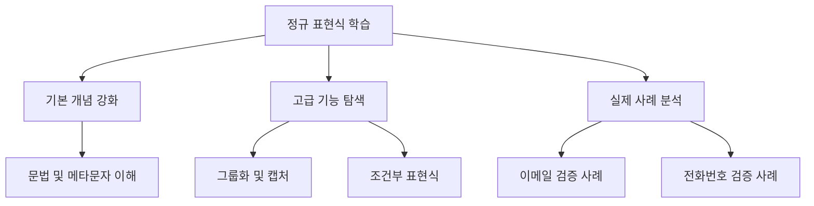
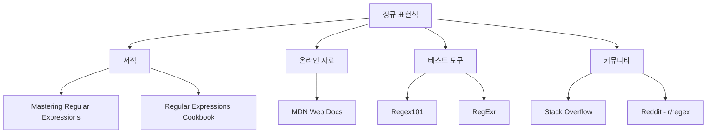

정규 표현식(Regular Expression, Regex)은 문자열에서 특정 패턴을 찾거나, 대체하거나, 검증하는 데 매우 유용한 도구이다. .NET에서는 `System.Text.RegularExpressions` 네임스페이스를 통해 정규 표현식 기능을 제공하며, 이를 통해 복잡한 문자열 처리 작업을 간편하게 수행할 수 있다. 정규 표현식은 Perl에서 발전된 개념으로, 다양한 메타 문자와 패턴을 사용하여 문자열을 검색하고 조작하는 데 강력한 기능을 발휘한다. 예를 들어, 특정 문자열이 포함되어 있는지 확인하거나, 문자열 내에서 특정 패턴을 찾아내어 대체하는 작업을 쉽게 수행할 수 있다. 이러한 기능은 웹 크롤러, 로그 파일 분석, 데이터 검증 등 다양한 분야에서 활용된다. 정규 표현식을 잘 활용하면 대량의 데이터에서 필요한 정보를 신속하게 추출할 수 있으며, 코드의 가독성과 유지보수성을 높이는 데 기여할 수 있다. 정규 표현식의 기본적인 사용법과 메타 문자, 패턴 매칭 방법에 대해 알아보면, 문자열 처리의 효율성을 크게 향상시킬 수 있다.


||
|:---:|
||


<!--
##### Outline #####
-->

<!--
# 목차

## 개요
   - 정규 표현식(Regex)의 정의
   - .NET에서의 Regex 클래스 소개
   - 정규 표현식의 필요성과 활용 사례

## 정규 표현식의 기본 개념
   - 정규 표현식의 구성 요소
   - 메타문자와 그 의미
   - 정규 표현식의 작동 방식

## .NET의 Regex 클래스
   - Regex 클래스의 주요 메서드
     - CompileToAssembly
     - Count
     - EnumerateMatches
     - Split
     - Replace
   - RegexOptions의 사용법
   - Regex 클래스의 예제 코드

## 정규 표현식 사용 예제
   - 문자열에서 패턴 찾기
     - 첫 번째 매치 찾기
     - 모든 매치 찾기
   - 문자열 치환하기
     - 특정 패턴을 다른 문자열로 치환
   - 문자열 분리하기
     - 특정 구분자를 기준으로 문자열 분리

## 정규 표현식의 고급 기능
   - 그룹화와 캡처
   - 조건부 표현식
   - 동적 정규식 생성
   - 성능 최적화 및 주의사항

## 정규 표현식의 활용 사례
   - 이메일 주소 검증
   - 전화번호 형식 검증
   - 로그 파일 파싱
   - 웹 크롤러에서의 사용

## FAQ
   - 정규 표현식에서 자주 발생하는 오류
   - 정규 표현식의 성능 문제 해결 방법
   - 정규 표현식의 디버깅 방법

## 관련 기술
   - 다른 프로그래밍 언어에서의 정규 표현식 사용
   - 정규 표현식과 문자열 처리 라이브러리 비교
   - 정규 표현식의 대안 기술

## 결론
   - 정규 표현식의 중요성 요약
   - 정규 표현식을 활용한 효율적인 문자열 처리 방법
   - 향후 정규 표현식 학습 방향

## 참고 자료
   - 정규 표현식 관련 서적 및 온라인 자료
   - 정규 표현식 테스트 도구 소개
   - 정규 표현식 관련 커뮤니티 및 포럼 링크

이 목차는 정규 표현식에 대한 포괄적인 이해를 돕고, .NET에서의 활용 방법을 중심으로 구성되었습니다. 각 섹션은 독자가 정규 표현식을 효과적으로 사용할 수 있도록 다양한 예제와 설명을 포함하고 있습니다.
-->

<!--
## 개요
   - 정규 표현식(Regex)의 정의
   - .NET에서의 Regex 클래스 소개
   - 정규 표현식의 필요성과 활용 사례
-->

## 개요

**정규 표현식(Regex)의 정의**  

정규 표현식(Regular Expression, Regex)은 문자열에서 특정 패턴을 찾거나 조작하기 위해 사용하는 강력한 도구이다. 정규 표현식은 문자, 숫자, 기호 등으로 구성된 패턴을 정의하여, 해당 패턴과 일치하는 문자열을 검색하거나 변환하는 데 사용된다. 예를 들어, 이메일 주소, 전화번호, 특정 형식의 데이터 등을 검증하는 데 유용하다.

**.NET에서의 Regex 클래스 소개**  

.NET 프레임워크에서는 `System.Text.RegularExpressions` 네임스페이스에 포함된 `Regex` 클래스를 통해 정규 표현식을 사용할 수 있다. 이 클래스는 정규 표현식을 컴파일하고, 문자열에서 패턴을 검색하거나 치환하는 다양한 메서드를 제공한다. `Regex` 클래스는 성능이 뛰어나고, 복잡한 패턴을 처리할 수 있는 기능을 갖추고 있어, .NET 환경에서 정규 표현식을 활용하는 데 매우 유용하다.

**정규 표현식의 필요성과 활용 사례**  

정규 표현식은 데이터 검증, 텍스트 검색 및 변환 등 다양한 분야에서 활용된다. 예를 들어, 웹 애플리케이션에서 사용자 입력을 검증할 때 정규 표현식을 사용하여 이메일 주소나 전화번호의 형식을 확인할 수 있다. 또한, 로그 파일에서 특정 패턴을 찾아내거나, 대량의 텍스트 데이터에서 필요한 정보를 추출하는 데에도 유용하다.

다음은 정규 표현식의 활용 사례를 나타내는 다이어그램이다.



정규 표현식은 이러한 다양한 활용 사례를 통해 개발자에게 강력한 도구가 된다. 이를 통해 복잡한 문자열 처리 작업을 간단하게 수행할 수 있으며, 코드의 가독성과 유지보수성을 높일 수 있다.

<!--
## 정규 표현식의 기본 개념
   - 정규 표현식의 구성 요소
   - 메타문자와 그 의미
   - 정규 표현식의 작동 방식
-->

## 정규 표현식의 기본 개념

정규 표현식은 문자열에서 특정 패턴을 찾거나 조작하기 위해 사용되는 강력한 도구이다. 이 섹션에서는 정규 표현식의 구성 요소, 메타문자, 그리고 정규 표현식의 작동 방식에 대해 살펴보겠다.

**정규 표현식의 구성 요소**

정규 표현식은 다양한 구성 요소로 이루어져 있다. 기본적으로는 문자, 메타문자, 그리고 특수 기호들이 조합되어 패턴을 형성한다. 다음은 정규 표현식의 주요 구성 요소이다.

- **문자**: 일반적인 문자로, 해당 문자가 문자열에 존재하는지를 검사한다.
- **메타문자**: 특정한 의미를 가지는 문자로, 패턴을 정의하는 데 사용된다.
- **수량자**: 특정 문자나 그룹이 몇 번 나타나는지를 정의한다.
- **그룹화**: 괄호를 사용하여 특정 부분을 그룹으로 묶어 패턴을 정의할 수 있다.

**메타문자와 그 의미**

메타문자는 정규 표현식에서 특별한 의미를 가지는 문자들이다. 다음은 자주 사용되는 메타문자와 그 의미이다.

| 메타문자 | 의미                          |
|----------|-------------------------------|
| `.`      | 임의의 한 문자               |
| `^`      | 문자열의 시작                |
| `$`      | 문자열의 끝                  |
| `*`      | 0회 이상 반복                |
| `+`      | 1회 이상 반복                |
| `?`      | 0회 또는 1회 발생            |
| `{n}`    | 정확히 n회 발생              |
| `{n,}`   | n회 이상 발생                |
| `{n,m}`  | n회 이상 m회 이하 발생      |
| `[]`     | 문자 클래스 (여러 문자 중 하나) |
| `\|`      | OR 연산자                    |
| `()`     | 그룹화                       |

**정규 표현식의 작동 방식**

정규 표현식은 주어진 문자열을 스캔하면서 패턴과 일치하는 부분을 찾는다. 이 과정은 다음과 같은 단계로 이루어진다.

1. **패턴 정의**: 사용자가 원하는 패턴을 정규 표현식으로 정의한다.
2. **문자열 스캔**: 정규 표현식 엔진이 문자열을 처음부터 끝까지 스캔한다.
3. **일치 검사**: 각 문자에 대해 패턴과 일치하는지를 검사한다.
4. **결과 반환**: 일치하는 부분이 발견되면 해당 결과를 반환한다.

다음은 정규 표현식의 작동 방식을 나타내는 다이어그램이다.



이와 같은 방식으로 정규 표현식은 문자열에서 원하는 패턴을 찾아내고, 이를 통해 다양한 문자열 조작 작업을 수행할 수 있다. 정규 표현식의 기본 개념을 이해하면, 이후의 고급 기능과 활용 사례를 보다 쉽게 이해할 수 있을 것이다.

<!--
## .NET의 Regex 클래스
   - Regex 클래스의 주요 메서드
     - CompileToAssembly
     - Count
     - EnumerateMatches
     - Split
     - Replace
   - RegexOptions의 사용법
   - Regex 클래스의 예제 코드
-->

## .NET의 Regex 클래스

정규 표현식을 사용하기 위해 .NET에서는 `Regex` 클래스를 제공한다. 이 클래스는 정규 표현식을 처리하는 데 필요한 다양한 메서드를 포함하고 있으며, 이를 통해 문자열 검색, 치환, 분리 등의 작업을 손쉽게 수행할 수 있다.

**Regex 클래스의 주요 메서드**

`.NET Core 8.0` 기준으로 `Regex` 클래스의 주요 메서드에 대한 설명과 함께 각각의 예제를 추가하여 다시 작성하겠다.

**Count**

`Count` 메서드는 주어진 문자열에서 정규 표현식과 일치하는 패턴의 수를 반환한다. 이 메서드는 특정 패턴이 문자열 내에서 얼마나 자주 나타나는지를 확인하는 데 유용하다.

**예제:**
```csharp
using System;
using System.Text.RegularExpressions;

class Program
{
    static void Main()
    {
        string input = "The rain in Spain falls mainly in the plain.";
        string pattern = @"\bin\b";
        
        int count = Regex.Matches(input, pattern).Count;
        Console.WriteLine($"'in'이 나타나는 횟수: {count}");
    }
}
```
이 예제에서는 "in"이라는 단어가 문자열에서 몇 번 나타나는지를 계산한다. 출력 결과는 `'in'이 나타나는 횟수: 2`이 된다.

---

**EnumerateMatches**

`EnumerateMatches` 메서드는 주어진 문자열에서 정규 표현식과 일치하는 모든 매치를 열거하는 기능을 제공한다. 이 메서드는 각 매치에 대해 추가적인 처리를 할 수 있도록 도와준다.

**예제:**
```csharp
using System;
using System.Text.RegularExpressions;

class Program
{
    static void Main()
    {
        string input = "My email is example@example.com and yours is test@test.com.";
        string pattern = @"\b\w+@\w+\.\w+\b";

        foreach (Match match in Regex.Matches(input, pattern))
        {
            Console.WriteLine($"이메일 주소 발견: {match.Value}");
        }
    }
}
```
이 예제에서는 문자열에서 이메일 주소 형식의 모든 매치를 찾아 출력한다. 결과는 `이메일 주소 발견: example@example.com`과 `이메일 주소 발견: test@test.com`이 된다.

---

**Split**

`Split` 메서드는 주어진 문자열을 정규 표현식에 따라 분리하는 기능을 제공한다. 이 메서드는 특정 구분자를 기준으로 문자열을 나누고, 결과를 배열로 반환한다.

**예제:**
```csharp
using System;
using System.Text.RegularExpressions;

class Program
{
    static void Main()
    {
        string input = "apple,orange;banana|grape";
        string pattern = @"[,;|]";

        string[] result = Regex.Split(input, pattern);

        Console.WriteLine("Split 결과:");
        foreach (string s in result)
        {
            Console.WriteLine(s);
        }
    }
}
```
이 예제에서는 쉼표, 세미콜론, 또는 파이프 문자를 기준으로 문자열을 분리한다. 결과 배열은 `apple`, `orange`, `banana`, `grape`가 된다.

---

**Replace**

`Replace` 메서드는 주어진 문자열에서 정규 표현식과 일치하는 부분을 다른 문자열로 치환하는 기능을 제공한다. 이 메서드는 문자열 내에서 특정 패턴을 쉽게 변경할 수 있도록 도와준다.

**예제:**
```csharp
using System;
using System.Text.RegularExpressions;

class Program
{
    static void Main()
    {
        string input = "Hello 123, this is a test 456.";
        string pattern = @"\d+";
        string replacement = "#";

        string result = Regex.Replace(input, pattern, replacement);
        Console.WriteLine(result);
    }
}
```
이 예제에서는 모든 숫자를 "#" 문자로 치환한다. 결과는 `Hello #, this is a test #.`이 된다.

---

이처럼 `Regex` 클래스의 다양한 메서드는 정규 표현식을 활용한 문자열 처리 작업을 더욱 효율적이고 유연하게 만들어준다. `.NET Core 8.0` 환경에서 이러한 기능들을 적절히 활용하면 복잡한 문자열 분석과 변환 작업을 손쉽게 수행할 수 있다.

**RegexOptions의 사용법**

`RegexOptions`는 정규 표현식의 동작 방식을 제어하는 다양한 옵션을 제공한다. 예를 들어, 대소문자를 구분하지 않거나, 멀티라인 모드를 활성화하는 등의 설정을 통해 정규 표현식의 동작을 조정할 수 있다. 다음은 `RegexOptions`의 사용 예시이다.

```csharp
using System;
using System.Text.RegularExpressions;

class Program
{
    static void Main()
    {
        string input = "Hello World";
        string pattern = "hello";
        
        // 대소문자 구분하지 않음
        Regex regex = new Regex(pattern, RegexOptions.IgnoreCase);
        bool isMatch = regex.IsMatch(input);
        
        Console.WriteLine($"Is match: {isMatch}"); // 출력: Is match: True
    }
}
```

**Regex 클래스의 예제 코드**

다음은 `Regex` 클래스를 사용하여 문자열에서 패턴을 찾고, 치환하며, 분리하는 간단한 예제 코드이다.

```csharp
using System;
using System.Text.RegularExpressions;

class Program
{
    static void Main()
    {
        string input = "apple, banana, cherry";
        string pattern = @"\s*,\s*"; // 쉼표와 공백을 기준으로 분리
        
        // 문자열 분리
        string[] fruits = Regex.Split(input, pattern);
        Console.WriteLine("Fruits: " + string.Join(", ", fruits)); // 출력: Fruits: apple, banana, cherry
        
        // 문자열 치환
        string replaced = Regex.Replace(input, "banana", "orange");
        Console.WriteLine("Replaced: " + replaced); // 출력: Replaced: apple, orange, cherry
        
        // 패턴 찾기
        MatchCollection matches = Regex.Matches(input, @"\w+");
        Console.WriteLine("Matches:");
        foreach (Match match in matches)
        {
            Console.WriteLine(match.Value); // 출력: apple, banana, cherry
        }
    }
}
```

위의 예제 코드는 `Regex` 클래스를 활용하여 문자열을 분리하고, 특정 단어를 치환하며, 패턴을 찾아내는 방법을 보여준다. 이러한 기능들은 문자열 처리 작업에서 매우 유용하게 사용될 수 있다.

<!--
## 정규 표현식 사용 예제
   - 문자열에서 패턴 찾기
     - 첫 번째 매치 찾기
     - 모든 매치 찾기
   - 문자열 치환하기
     - 특정 패턴을 다른 문자열로 치환
   - 문자열 분리하기
     - 특정 구분자를 기준으로 문자열 분리
-->

## 정규 표현식 사용 예제

정규 표현식은 문자열 처리에서 매우 유용한 도구이다. 이 섹션에서는 정규 표현식을 사용하여 문자열에서 패턴을 찾고, 문자열을 치환하며, 문자열을 분리하는 방법에 대해 설명하겠다.

**문자열에서 패턴 찾기**

정규 표현식을 사용하여 문자열에서 특정 패턴을 찾는 것은 매우 일반적인 작업이다. 이 과정은 주로 두 가지 방법으로 나뉜다: 첫 번째 매치 찾기와 모든 매치 찾기이다.

**첫 번째 매치 찾기**

첫 번째 매치를 찾기 위해서는 `Regex.Match` 메서드를 사용할 수 있다. 이 메서드는 주어진 문자열에서 정규 표현식과 일치하는 첫 번째 부분을 반환한다. 다음은 간단한 예제 코드이다.

```csharp
using System;
using System.Text.RegularExpressions;

class Program
{
    static void Main()
    {
        string input = "Hello, my email is example@example.com.";
        string pattern = @"\w+@\w+\.\w+";

        Match match = Regex.Match(input, pattern);
        if (match.Success)
        {
            Console.WriteLine("첫 번째 매치: " + match.Value); //첫 번째 매치: example@example.com
        }
    }
}
```

**모든 매치 찾기**

모든 매치를 찾기 위해서는 `Regex.Matches` 메서드를 사용할 수 있다. 이 메서드는 주어진 문자열에서 정규 표현식과 일치하는 모든 부분을 반환한다. 다음은 모든 매치를 찾는 예제 코드이다.

```csharp
using System;
using System.Text.RegularExpressions;

class Program
{
    static void Main()
    {
        string input = "Contact: example@example.com, test@test.com";
        string pattern = @"\w+@\w+\.\w+";

        MatchCollection matches = Regex.Matches(input, pattern);
        foreach (Match match in matches)
        {
            Console.WriteLine("매치: " + match.Value);
        }
    }
}
```

위 코드를 실행하면 다음과 같은 결과를 얻을 수 있다.

```
매치: example@example.com
매치: test@test.com
```

**문자열 치환하기**

정규 표현식을 사용하여 문자열의 특정 패턴을 다른 문자열로 치환할 수 있다. 이를 위해 `Regex.Replace` 메서드를 사용한다. 다음은 특정 패턴을 다른 문자열로 치환하는 예제 코드이다.

```csharp
using System;
using System.Text.RegularExpressions;

class Program
{
    static void Main()
    {
        string input = "My phone number is 123-456-7890.";
        string pattern = @"\d{3}-\d{3}-\d{4}";
        string replacement = "XXX-XXX-XXXX";

        string result = Regex.Replace(input, pattern, replacement);
        Console.WriteLine("치환된 문자열: " + result);
    }
}
```

위 코드를 실행하면 다음과 같은 결과를 얻을 수 있다.

```
치환된 문자열: My phone number is XXX-XXX-XXXX.
```

**문자열 분리하기**

정규 표현식을 사용하여 문자열을 특정 구분자를 기준으로 분리할 수 있다. 이를 위해 `Regex.Split` 메서드를 사용한다. 다음은 특정 구분자를 기준으로 문자열을 분리하는 예제 코드이다.

```csharp
using System;
using System.Text.RegularExpressions;

class Program
{
    static void Main()
    {
        string input = "apple,banana,orange";
        string pattern = @",";
        
        string[] result = Regex.Split(input, pattern);
        Console.WriteLine("분리된 문자열:");
        foreach (string fruit in result)
        {
            Console.WriteLine(fruit);
        }
    }
}
```

위 코드를 실행하면 다음과 같은 결과를 얻을 수 있다.

```
분리된 문자열:
apple
banana
orange
```



이와 같이 정규 표현식을 활용하면 문자열에서 패턴을 찾고, 치환하며, 분리하는 작업을 효율적으로 수행할 수 있다. 이러한 기능들은 데이터 처리 및 텍스트 분석에서 매우 유용하게 사용된다.

<!--
## 정규 표현식의 고급 기능
   - 그룹화와 캡처
   - 조건부 표현식
   - 동적 정규식 생성
   - 성능 최적화 및 주의사항
-->

## 정규 표현식의 고급 기능

정규 표현식은 기본적인 패턴 매칭을 넘어 다양한 고급 기능을 제공한다. 이 섹션에서는 그룹화와 캡처, 조건부 표현식, 동적 정규식 생성, 성능 최적화 및 주의사항에 대해 다룰 것이다.

**그룹화와 캡처**  
그룹화는 정규 표현식에서 특정 부분을 묶어주는 기능이다. 이를 통해 패턴의 일부를 캡처하거나 반복할 수 있다. 그룹은 괄호 `()`로 정의되며, 캡처된 그룹은 후속 작업에서 참조할 수 있다. 예를 들어, 다음과 같은 정규 표현식을 고려해보자.

```csharp
using System;
using System.Text.RegularExpressions;

class Program
{
    static void Main()
    {
        string pattern = @"(\d{3})-(\d{2})-(\d{4})";
        string input = "123-45-6789";
        Match match = Regex.Match(input, pattern);

        if (match.Success)
        {
            Console.WriteLine($"Area Code: {match.Groups[1].Value}");
            Console.WriteLine($"Central Office Code: {match.Groups[2].Value}");
            Console.WriteLine($"Line Number: {match.Groups[3].Value}");
        }
    }
}
```

위 코드를 실행하면 다음과 같은 결과를 얻을 수 있다.

```
Area Code: 123
Central Office Code: 45
Line Number: 6789
```

위의 코드에서 `(\d{3})`, `(\d{2})`, `(\d{4})`는 각각 그룹으로 정의되어 있으며, `match.Groups`를 통해 각 그룹의 값을 추출할 수 있다.

**조건부 표현식**  
조건부 표현식은 특정 조건에 따라 다른 패턴을 선택할 수 있는 기능이다. 이는 `(?=...)`와 `(?!)`와 같은 전방 탐색 및 후방 탐색을 통해 구현할 수 있다. 예를 들어, 다음과 같은 정규 표현식을 사용하여 특정 조건을 만족하는 경우에만 매칭할 수 있다.

```csharp
using System;
using System.Text.RegularExpressions;

class Program
{
    static void Main()
    {
        string pattern = @"\d+(?= dollars)";
        string input = "I have 100 dollars and 50 cents.";
        Match match = Regex.Match(input, pattern);

        if (match.Success)
        {
            Console.WriteLine($"Matched Amount: {match.Value}");
        }
    }
}
```

위 코드를 실행하면 다음과 같은 결과를 얻을 수 있다.

```
Matched Amount: 100
```

위의 예제에서 `(?= dollars)`는 "dollars"라는 단어가 뒤따르는 경우에만 숫자를 매칭하도록 한다.

**동적 정규식 생성**  
동적 정규식 생성은 런타임에 정규 표현식을 생성하는 기능이다. 이는 사용자 입력이나 외부 데이터에 따라 정규 표현식을 동적으로 변경할 수 있게 해준다. 다음은 동적 정규식을 생성하는 예제이다.

```csharp
using System;
using System.Text.RegularExpressions;

class Program
{
    static void Main()
    {
        string userInput = "abc";
        string pattern = $@"{Regex.Escape(userInput)}\d+";
        string input = "abc123 and abc456";
        MatchCollection matches = Regex.Matches(input, pattern);

        foreach (Match match in matches)
        {
            Console.WriteLine($"Matched: {match.Value}");
        }
    }
}
```

위 코드를 실행하면 다음과 같은 결과를 얻을 수 있다.

```
Matched: abc123
Matched: abc456
```

위의 코드에서 `Regex.Escape`를 사용하여 사용자 입력을 안전하게 정규 표현식으로 변환하고, 이를 통해 동적으로 패턴을 생성한다.

**성능 최적화 및 주의사항**  
정규 표현식은 강력하지만, 잘못 사용하면 성능 저하를 초래할 수 있다. 다음은 성능 최적화를 위한 몇 가지 팁이다.

1. **비효율적인 패턴 피하기**: `.*`와 같은 패턴은 많은 백트래킹을 유발할 수 있으므로, 가능한 한 구체적인 패턴을 사용하는 것이 좋다.
2. **캐싱 활용**: 정규 표현식을 자주 사용하는 경우, `Regex` 객체를 미리 컴파일하여 재사용하는 것이 성능을 향상시킬 수 있다.
3. **정규 표현식의 복잡성 줄이기**: 복잡한 정규 표현식은 이해하기 어렵고, 유지보수에 어려움을 줄 수 있다. 가능한 한 간단하게 유지하는 것이 좋다.

다음은 정규 표현식의 성능을 최적화하는 다이어그램이다.



이와 같은 고급 기능을 활용하면 정규 표현식을 더욱 효과적으로 사용할 수 있으며, 복잡한 문자열 처리 작업을 간소화할 수 있다.

<!--
## 정규 표현식의 활용 사례
   - 이메일 주소 검증
   - 전화번호 형식 검증
   - 로그 파일 파싱
   - 웹 크롤러에서의 사용
-->

## 정규 표현식의 활용 사례

정규 표현식은 다양한 분야에서 유용하게 활용될 수 있다. 이 섹션에서는 이메일 주소 검증, 전화번호 형식 검증, 로그 파일 파싱, 그리고 웹 크롤러에서의 사용 사례를 살펴보겠다.

**이메일 주소 검증**

이메일 주소는 특정 형식을 따라야 하며, 정규 표현식을 사용하여 이를 검증할 수 있다. 일반적으로 이메일 주소는 사용자 이름, '@' 기호, 도메인 이름으로 구성된다. 다음은 이메일 주소를 검증하기 위한 정규 표현식의 예시이다.

```csharp
using System;
using System.Text.RegularExpressions;

class Program
{
    static void Main()
    {
        string pattern = @"^[^@\s]+@[^@\s]+\.[^@\s]+$";
        string email = "example@example.com";

        bool isValidEmail = Regex.IsMatch(email, pattern);
        Console.WriteLine(isValidEmail);
    }
}
```

위의 코드에서 `pattern` 변수는 이메일 주소의 형식을 정의하고, `Regex.IsMatch` 메서드를 사용하여 주어진 이메일이 유효한지 확인한다.

**전화번호 형식 검증**

전화번호는 국가마다 형식이 다르지만, 일반적으로 숫자와 특정 기호로 구성된다. 다음은 한국의 전화번호 형식을 검증하기 위한 정규 표현식의 예시이다.

```csharp
using System;
using System.Text.RegularExpressions;

class Program
{
    static void Main()
    {
        string pattern = @"^(\+82-)?(1[0-9]-[0-9]{3,4}-[0-9]{4})$";
        string phoneNumber = "+82-10-1234-5678";

        bool isValidPhoneNumber = Regex.IsMatch(phoneNumber, pattern);
        Console.WriteLine(isValidPhoneNumber);
    }
}
```

이 코드에서는 한국의 전화번호 형식을 정의하고, 주어진 전화번호가 유효한지 확인한다.

**로그 파일 파싱**

로그 파일은 다양한 형식으로 기록되며, 정규 표현식을 사용하여 특정 패턴을 추출할 수 있다. 예를 들어, 웹 서버 로그에서 IP 주소와 요청 메서드를 추출하는 정규 표현식은 다음과 같다.

```csharp
using System;
using System.Text.RegularExpressions;

class Program
{
    static void Main()
    {
        string pattern = @"(?<ip>\d{1,3}\.\d{1,3}\.\d{1,3}\.\d{1,3}) - - \[(?<date>.+?)\] ""(?<method>GET|POST|PUT|DELETE) (?<url>.+?) HTTP/1.1""";
        string logEntry = "192.168.1.1 - - [10/Oct/2000:13:55:36 -0700] \"GET /apache_pb.gif HTTP/1.1\"";

        Match match = Regex.Match(logEntry, pattern);
        if (match.Success)
        {
            string ip = match.Groups["ip"].Value;
            string method = match.Groups["method"].Value;

            // 추가적인 처리
        }
    }
}
```

위의 코드에서는 로그 파일의 특정 형식에 맞춰 IP 주소와 요청 메서드를 추출하는 방법을 보여준다.

**웹 크롤러에서의 사용**

웹 크롤러는 웹 페이지의 내용을 수집하고 분석하는 도구이다. 정규 표현식을 사용하여 HTML 문서에서 특정 정보를 추출할 수 있다. 예를 들어, 웹 페이지에서 모든 링크를 추출하는 정규 표현식은 다음과 같다.

```csharp
string pattern = @"<a\s+(?:[^>]*?\s+)?href=""([^""]*)""";
string htmlContent = "<a href=\"http://example.com\">Example</a>";

MatchCollection matches = Regex.Matches(htmlContent, pattern);
foreach (Match match in matches)
{
    string url = match.Groups[1].Value;
    // 추가적인 처리
}
```

위의 코드에서는 HTML 문서에서 모든 링크를 추출하는 방법을 보여준다.



정규 표현식은 다양한 분야에서 유용하게 활용될 수 있으며, 위의 사례들은 그 중 일부에 불과하다. 각 사례에서 제시한 정규 표현식을 통해 특정 패턴을 검증하거나 추출하는 방법을 이해할 수 있다.

<!--
## FAQ
   - 정규 표현식에서 자주 발생하는 오류
   - 정규 표현식의 성능 문제 해결 방법
   - 정규 표현식의 디버깅 방법
-->

## FAQ

**정규 표현식에서 자주 발생하는 오류**

정규 표현식을 사용할 때 자주 발생하는 오류는 다음과 같다. 첫 번째로, 괄호의 짝이 맞지 않는 경우가 있다. 이는 그룹화나 캡처를 위해 괄호를 사용할 때 발생할 수 있으며, 이로 인해 예상치 못한 결과가 나타날 수 있다. 두 번째로, 메타문자를 잘못 사용하여 의도한 패턴과 다른 결과를 얻는 경우가 있다. 예를 들어, `.` 메타문자는 모든 문자를 의미하므로, 특정 문자만을 찾고자 할 때는 이를 주의해야 한다.

```csharp
// 잘못된 정규 표현식 예시
string pattern = "(abc"; // 괄호가 닫히지 않음
```

**정규 표현식의 성능 문제 해결 방법**

정규 표현식의 성능 문제는 주로 복잡한 패턴이나 대량의 데이터에 대해 검색할 때 발생한다. 이를 해결하기 위해 다음과 같은 방법을 고려할 수 있다. 첫째, 가능한 한 간단한 패턴을 사용하여 성능을 최적화할 수 있다. 둘째, `RegexOptions.Compiled` 옵션을 사용하여 정규 표현식을 미리 컴파일하면 성능을 향상시킬 수 있다. 셋째, 불필요한 캡처 그룹을 제거하여 성능을 개선할 수 있다.

```csharp
// 성능 최적화를 위한 정규 표현식 예시
string pattern = @"\d{3}-\d{2}-\d{4}"; // 간단한 패턴
Regex regex = new Regex(pattern, RegexOptions.Compiled);
```

**정규 표현식의 디버깅 방법**

정규 표현식을 디버깅하는 방법으로는 여러 가지가 있다. 첫 번째로, 정규 표현식 테스트 도구를 사용하는 것이 좋다. 이러한 도구는 입력 문자열과 정규 표현식을 입력하면 매칭 결과를 즉시 확인할 수 있다. 두 번째로, 정규 표현식의 각 부분을 단계별로 테스트하여 문제를 파악할 수 있다. 마지막으로, `Regex.Match` 메서드를 사용하여 매칭 결과를 확인하고, `Match` 객체의 `Groups` 속성을 통해 캡처된 그룹을 확인할 수 있다.

```csharp
// 정규 표현식 디버깅 예시
string input = "My phone number is 123-45-6789.";
string pattern = @"(\d{3})-(\d{2})-(\d{4})";
Match match = Regex.Match(input, pattern);

if (match.Success)
{
    Console.WriteLine($"Matched: {match.Value}");
    Console.WriteLine($"Area Code: {match.Groups[1].Value}");
}
```



이와 같은 방법들을 통해 정규 표현식에서 발생할 수 있는 오류를 예방하고, 성능 문제를 해결하며, 효과적으로 디버깅할 수 있다.

<!--
## 관련 기술
   - 다른 프로그래밍 언어에서의 정규 표현식 사용
   - 정규 표현식과 문자열 처리 라이브러리 비교
   - 정규 표현식의 대안 기술
-->

## 관련 기술

**다른 프로그래밍 언어에서의 정규 표현식 사용**  

정규 표현식은 다양한 프로그래밍 언어에서 지원되며, 각 언어마다 약간의 문법 차이가 존재한다. 예를 들어, Python에서는 `re` 모듈을 사용하여 정규 표현식을 다룬다. JavaScript에서는 `RegExp` 객체를 통해 정규 표현식을 사용할 수 있다. 아래는 Python과 JavaScript에서 정규 표현식을 사용하는 간단한 예제이다.

**Python 예제**

```python
import re

# 문자열에서 이메일 주소 찾기
text = "문의는 example@example.com으로 해주세요."
pattern = r'\b[A-Za-z0-9._%+-]+@[A-Za-z0-9.-]+\.[A-Z|a-z]{2,}\b'
matches = re.findall(pattern, text)

print(matches)  # ['example@example.com']
```

**JavaScript 예제**

```javascript
const text = "문의는 example@example.com으로 해주세요.";
const pattern = /\b[A-Za-z0-9._%+-]+@[A-Za-z0-9.-]+\.[A-Z|a-z]{2,}\b/g;
const matches = text.match(pattern);

console.log(matches);  // ['example@example.com']
```

**정규 표현식과 문자열 처리 라이브러리 비교**  

정규 표현식은 문자열 처리의 강력한 도구이지만, 특정 상황에서는 문자열 처리 라이브러리를 사용하는 것이 더 효율적일 수 있다. 예를 들어, Python의 `str` 메서드나 Java의 `String` 클래스는 문자열을 조작하는 데 유용한 다양한 메서드를 제공한다. 아래는 정규 표현식과 문자열 처리 라이브러리를 비교한 다이어그램이다.



**정규 표현식의 대안 기술**  

정규 표현식은 강력하지만, 가독성이 떨어지거나 복잡한 패턴을 다룰 때는 대안 기술을 고려할 수 있다. 예를 들어, 파서 생성기(Parsing Generator)나 문자열 처리 라이브러리(예: ANTLR, PLY 등)를 사용하여 복잡한 구문을 처리할 수 있다. 이러한 도구들은 정규 표현식보다 더 명확한 구조를 제공하며, 유지보수성을 높일 수 있다.

정리하자면, 정규 표현식은 다양한 프로그래밍 언어에서 사용되며, 문자열 처리 라이브러리와의 비교를 통해 각 기술의 장단점을 이해하는 것이 중요하다. 또한, 복잡한 패턴을 다룰 때는 대안 기술을 고려하는 것이 좋다.

<!--
## 결론
   - 정규 표현식의 중요성 요약
   - 정규 표현식을 활용한 효율적인 문자열 처리 방법
   - 향후 정규 표현식 학습 방향
-->

## 결론

**정규 표현식의 중요성 요약**  

정규 표현식은 문자열 처리에서 매우 중요한 도구이다. 다양한 패턴을 정의하고 이를 기반으로 문자열을 검색, 치환, 분리하는 데 유용하다. 특히, 데이터 검증, 로그 분석, 웹 크롤링 등 여러 분야에서 정규 표현식의 활용이 두드러진다. 정규 표현식을 통해 복잡한 문자열 처리 작업을 간결하고 효율적으로 수행할 수 있다.

**정규 표현식을 활용한 효율적인 문자열 처리 방법**  

정규 표현식을 사용하면 문자열에서 특정 패턴을 쉽게 찾고, 이를 기반으로 다양한 작업을 수행할 수 있다. 예를 들어, 이메일 주소나 전화번호와 같은 형식을 검증할 때 정규 표현식을 활용하면 코드의 가독성과 유지보수성을 높일 수 있다. 아래는 정규 표현식을 사용하여 이메일 주소를 검증하는 간단한 예제 코드이다.

```csharp
using System;
using System.Text.RegularExpressions;

class Program
{
    static void Main()
    {
        string emailPattern = @"^[^@\s]+@[^@\s]+\.[^@\s]+$";
        string email = "example@example.com";

        if (Regex.IsMatch(email, emailPattern))
        {
            Console.WriteLine("유효한 이메일 주소입니다.");
        }
        else
        {
            Console.WriteLine("유효하지 않은 이메일 주소입니다.");
        }
    }
}
```

**향후 정규 표현식 학습 방향**  

정규 표현식은 매우 강력한 도구이지만, 그만큼 복잡할 수 있다. 따라서, 정규 표현식을 더욱 효과적으로 활용하기 위해서는 지속적인 학습이 필요하다. 다음과 같은 방향으로 학습을 진행할 수 있다.

1. **기본 개념 강화**: 정규 표현식의 기본 문법과 메타문자를 충분히 이해하고 연습하는 것이 중요하다.
2. **고급 기능 탐색**: 그룹화, 캡처, 조건부 표현식 등 고급 기능을 학습하여 복잡한 패턴을 처리할 수 있는 능력을 기르는 것이 필요하다.
3. **실제 사례 분석**: 다양한 실제 사례를 분석하고, 이를 통해 정규 표현식의 활용 방법을 익히는 것이 좋다.

아래는 정규 표현식의 학습 방향을 나타내는 다이어그램이다.



정규 표현식은 문자열 처리의 강력한 도구로, 이를 통해 효율적인 데이터 처리가 가능하다. 지속적인 학습과 실습을 통해 정규 표현식의 활용 능력을 높여 나가길 바란다.

<!--
## 참고 자료
   - 정규 표현식 관련 서적 및 온라인 자료
   - 정규 표현식 테스트 도구 소개
   - 정규 표현식 관련 커뮤니티 및 포럼 링크
-->

## 참고 자료

**정규 표현식 관련 서적 및 온라인 자료**

정규 표현식에 대한 깊이 있는 이해를 위해 다음과 같은 서적과 온라인 자료를 추천한다. 

1. **"Mastering Regular Expressions" by Jeffrey E.F. Friedl**: 이 책은 정규 표현식의 기초부터 고급 개념까지 폭넓게 다루고 있으며, 다양한 프로그래밍 언어에서의 활용 사례를 포함하고 있다.
2. **"Regular Expressions Cookbook" by Jan Goyvaerts and Steven Levithan**: 실용적인 예제와 함께 정규 표현식을 사용하는 방법을 설명하는 책으로, 다양한 패턴을 다루고 있다.
3. **MDN Web Docs**: Mozilla의 개발자 네트워크에서 제공하는 정규 표현식에 대한 문서로, 기본 개념부터 고급 기능까지 상세히 설명하고 있다. [MDN Regular Expressions](https://developer.mozilla.org/en-US/docs/Web/JavaScript/Guide/Regular_Expressions)

**정규 표현식 테스트 도구 소개**

정규 표현식을 테스트하고 실험할 수 있는 도구는 다음과 같다.

1. **Regex101**: 다양한 프로그래밍 언어의 정규 표현식을 지원하며, 실시간으로 패턴을 테스트할 수 있는 웹 기반 도구이다. [Regex101](https://regex101.com)
2. **RegExr**: 정규 표현식을 작성하고 테스트할 수 있는 온라인 도구로, 다양한 예제와 설명을 제공하여 학습에 도움을 준다. [RegExr](https://regexr.com)
3. **Regex Pal**: 간단한 인터페이스를 제공하여 정규 표현식을 테스트할 수 있는 도구로, 실시간으로 결과를 확인할 수 있다. [Regex Pal](http://www.regexpal.com)

** 정규 표현식 관련 커뮤니티 및 포럼 링크**

정규 표현식에 대한 질문이나 정보를 공유할 수 있는 커뮤니티와 포럼은 다음과 같다.

1. **Stack Overflow**: 정규 표현식 관련 질문과 답변을 찾을 수 있는 가장 큰 프로그래밍 커뮤니티이다. [Stack Overflow](https://stackoverflow.com/questions/tagged/regex)
2. **Reddit - r/regex**: 정규 표현식에 대한 다양한 주제를 다루는 Reddit 커뮤니티로, 사용자들이 질문하고 정보를 공유할 수 있다. [r/regex](https://www.reddit.com/r/regex/)
3. **RegexOne**: 정규 표현식을 배우고 연습할 수 있는 사이트로, 커뮤니티와 함께 학습할 수 있는 자료를 제공한다. [RegexOne](https://regexone.com)



위의 자료들은 정규 표현식을 배우고 활용하는 데 큰 도움이 될 것이다. 각 자료를 통해 정규 표현식의 다양한 측면을 이해하고, 실무에서 효과적으로 활용할 수 있는 능력을 기를 수 있다.

<!--
##### Reference #####
-->

## Reference


* [https://learn.microsoft.com/ko-kr/dotnet/api/system.text.regularexpressions.regex?view=net-8.0](https://learn.microsoft.com/ko-kr/dotnet/api/system.text.regularexpressions.regex?view=net-8.0)
* [http://www.csharpstudy.com/Practical/Prac-regex-1.aspx](http://www.csharpstudy.com/Practical/Prac-regex-1.aspx)
* [https://hijuworld.tistory.com/22](https://hijuworld.tistory.com/22)
* [https://learn.microsoft.com/ko-kr/dotnet/standard/base-types/regular-expressions](https://learn.microsoft.com/ko-kr/dotnet/standard/base-types/regular-expressions)
* [https://rito15.github.io/posts/memo-cs-regex/](https://rito15.github.io/posts/memo-cs-regex/)
* [https://m.blog.naver.com/dnjswls23/222253252733](https://m.blog.naver.com/dnjswls23/222253252733)
* [https://jacking75.github.io/csharp_RegularExpression/](https://jacking75.github.io/csharp_RegularExpression/)
* [https://myoung-min.tistory.com/51](https://myoung-min.tistory.com/51)
* [https://velog.io/@blimeyoops/Regular-Expression](https://velog.io/@blimeyoops/Regular-Expression)

