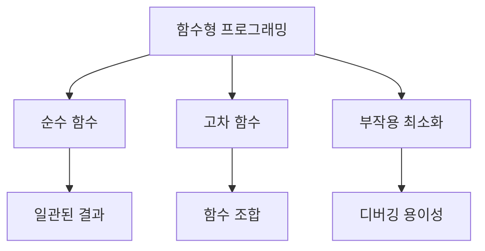
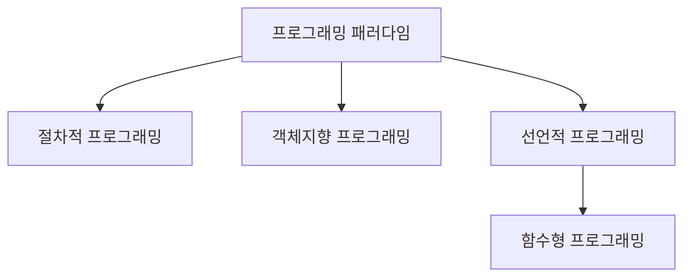
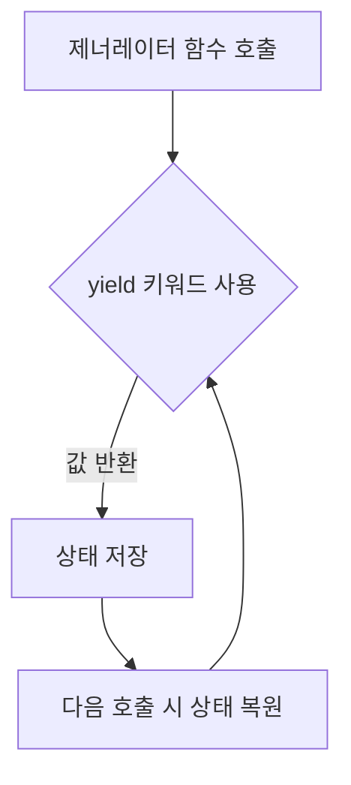
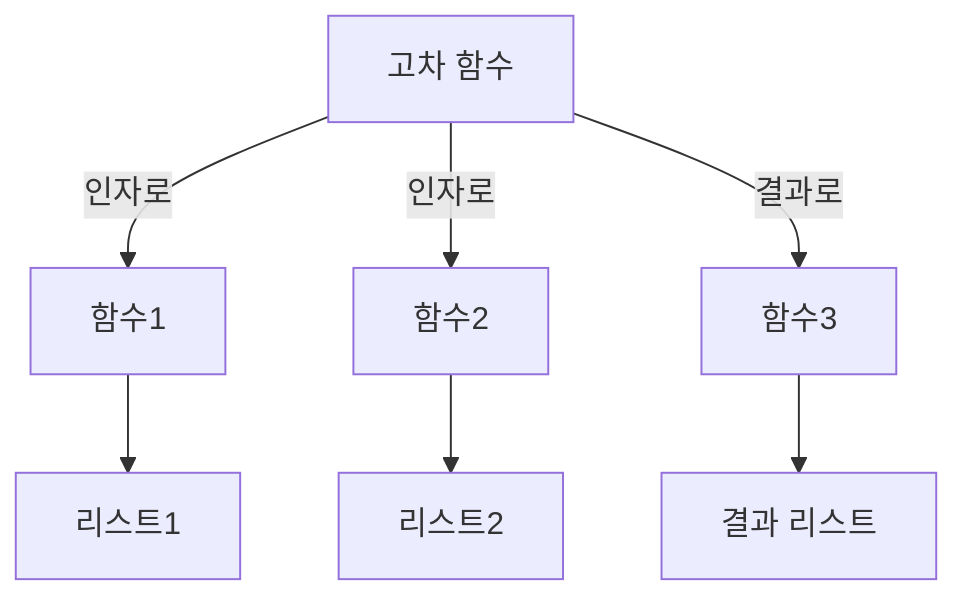
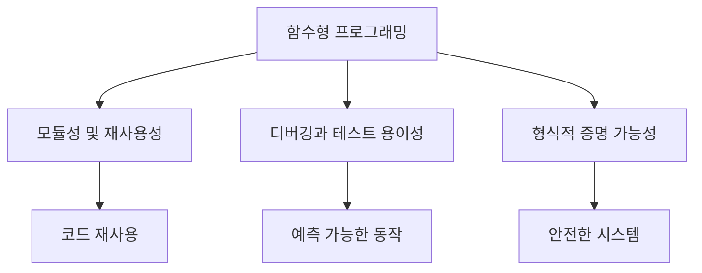
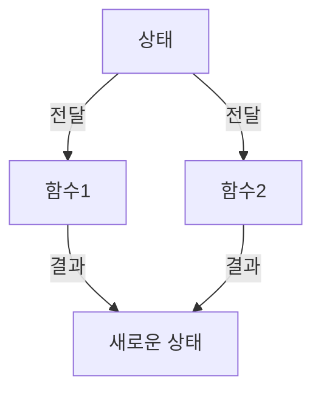
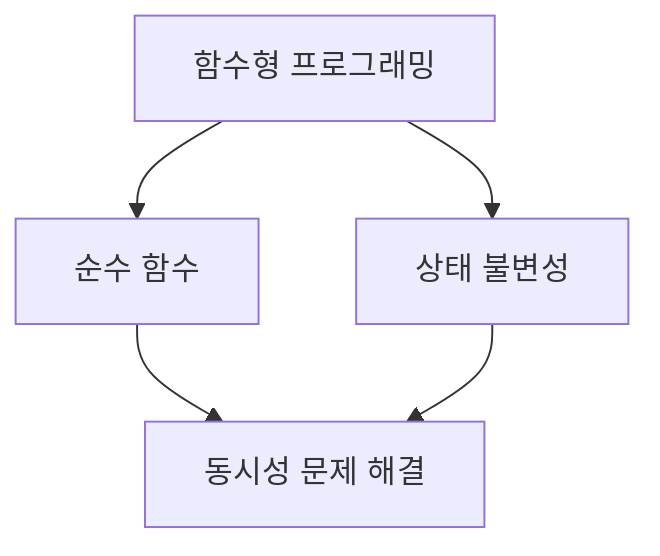
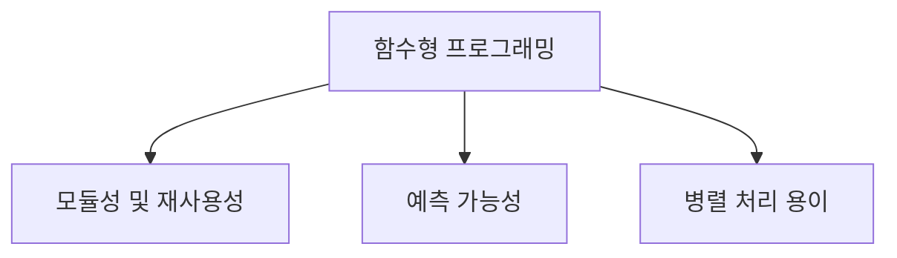
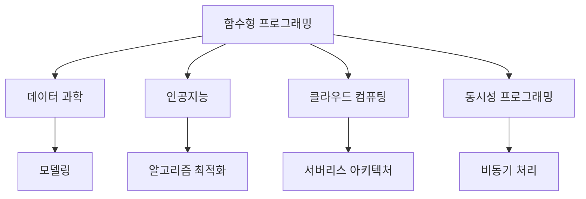
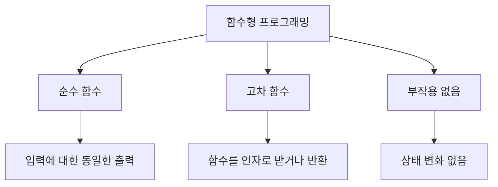

함수형 프로그래밍은 프로그래밍 언어의 한 패러다임으로, 프로그램을 함수의 적용과 조합을 통해 구성하는 방식이다. 이 방식은 수학적 함수의 개념에 뿌리를 두고 있으며, 함수는 일급 시민으로 취급되어 변수에 바인딩되거나 다른 함수의 인자로 전달될 수 있다. 함수형 프로그래밍의 주요 특징 중 하나는 부작용을 피하고, 모든 함수가 순수함수로 정의된다는 점이다. 순수함수는 주어진 입력에 대해 항상 동일한 출력을 생성하며, 외부 상태에 영향을 미치지 않는다. 이러한 특성 덕분에 함수형 프로그래밍은 코드의 모듈성과 재사용성을 높이고, 디버깅과 테스트를 용이하게 하며, 프로그램의 정확성을 수학적으로 증명할 수 있는 가능성을 제공한다. 이 글에서는 파이썬을 활용하여 함수형 프로그래밍의 기본 개념과 이론을 살펴보고, 이터레이터, 제너레이터, 그리고 관련 라이브러리 모듈을 통해 함수형 프로그래밍을 구현하는 방법에 대해 알아보겠다. 함수형 프로그래밍의 장점과 함께, 이를 통해 얻을 수 있는 소프트웨어 개발의 효율성과 품질 향상에 대해서도 논의할 것이다.


||
|:---:|
||


<!--
##### Outline #####
-->

<!--
# 함수형 프로그래밍 HOWTO 목차

## 개요
   - 함수형 프로그래밍의 정의
   - 함수형 프로그래밍의 역사와 발전
   - 함수형 프로그래밍의 중요성

## 함수형 프로그래밍의 기본 개념
   - 절차적, 객체지향, 선언적 프로그래밍과의 비교
   - 순수 함수와 부작용
   - 고차 함수와 일급 함수

## 파이썬에서의 함수형 프로그래밍
   - 파이썬의 함수형 프로그래밍 지원
   - 이터레이터와 제너레이터
   - `itertools`와 `functools` 모듈 활용

## 이터레이터
   - 이터레이터의 정의와 사용법
   - 이터레이터를 지원하는 데이터형
   - 이터레이터의 예제

## 제너레이터
   - 제너레이터의 정의와 특징
   - 제너레이터 표현식과 리스트 컴프리헨션
   - 제너레이터의 예제

## 고차 함수
   - 고차 함수의 개념과 예제
   - `map()`, `filter()`, `reduce()` 함수 사용법
   - 고차 함수의 장점

## 커링과 부분 적용
   - 커링의 정의와 예제
   - 부분 적용의 개념
   - 커링과 부분 적용의 차이점

## 함수형 프로그래밍의 장점
   - 모듈성 및 재사용성
   - 디버깅과 테스트 용이성
   - 형식적 증명 가능성

## 함수형 프로그래밍의 단점
   - 성능 문제
   - 학습 곡선
   - 상태 관리의 복잡성

## 관련 기술
   - 함수형 프로그래밍 언어 (Haskell, Scala, Clojure 등)
   - 함수형 프로그래밍 패러다임의 응용 (Erlang, F# 등)
   - 함수형 프로그래밍과 동시성

## FAQ
   - 함수형 프로그래밍은 왜 중요한가?
   - 함수형 프로그래밍을 배우기 위한 추천 자료는?
   - 파이썬에서 함수형 프로그래밍을 어떻게 시작할 수 있는가?

## 결론
   - 함수형 프로그래밍의 미래
   - 함수형 프로그래밍의 지속적인 발전과 응용

## 참고 문헌
   - 관련 서적 및 자료
   - 온라인 리소스 및 커뮤니티

이 목차는 함수형 프로그래밍의 개념과 파이썬에서의 적용을 포괄적으로 다루며, 관련 기술과 자주 묻는 질문을 포함하여 독자가 함수형 프로그래밍에 대한 깊이 있는 이해를 할 수 있도록 돕습니다.
-->

<!--
## 개요
   - 함수형 프로그래밍의 정의
   - 함수형 프로그래밍의 역사와 발전
   - 함수형 프로그래밍의 중요성
-->

## 개요

함수형 프로그래밍은 프로그래밍 패러다임 중 하나로, 수학적 함수의 개념을 기반으로 하여 프로그램을 구성하는 방식이다. 이 패러다임은 상태와 변수를 최소화하고, 함수의 조합을 통해 프로그램을 작성하는 데 중점을 둔다. 함수형 프로그래밍은 코드의 가독성과 유지보수성을 높이는 데 기여하며, 부작용을 줄이는 데 도움을 준다.

**함수형 프로그래밍의 정의**  

함수형 프로그래밍은 프로그램을 함수의 조합으로 구성하는 프로그래밍 스타일이다. 이 스타일에서는 함수가 일급 시민으로 취급되며, 다른 함수의 인자로 전달되거나 반환값으로 사용될 수 있다. 또한, 순수 함수(pure function)를 강조하여, 동일한 입력에 대해 항상 동일한 출력을 보장하고, 외부 상태를 변경하지 않는 특성을 가진다.

**함수형 프로그래밍의 역사와 발전**  

함수형 프로그래밍의 뿌리는 1950년대의 람다 계산(lambda calculus)으로 거슬러 올라간다. 이후 1970년대에 Haskell과 같은 함수형 프로그래밍 언어가 등장하면서 이 패러다임은 더욱 발전하게 되었다. 2000년대 들어서는 JavaScript, Python, Scala 등 다양한 언어에서 함수형 프로그래밍의 개념이 도입되면서, 현대 소프트웨어 개발에서 중요한 역할을 차지하게 되었다.

**함수형 프로그래밍의 중요성**  

함수형 프로그래밍은 코드의 모듈성과 재사용성을 높이는 데 기여한다. 또한, 부작용을 최소화하여 디버깅과 테스트를 용이하게 하며, 병렬 처리와 같은 동시성 문제를 해결하는 데 유리하다. 이러한 특성 덕분에 함수형 프로그래밍은 대규모 소프트웨어 시스템에서 점점 더 많이 채택되고 있다.

다음은 함수형 프로그래밍의 기본 개념을 설명하는 간단한 다이어그램이다.



위의 다이어그램은 함수형 프로그래밍의 주요 개념들을 시각적으로 나타낸 것이다. 이러한 개념들은 함수형 프로그래밍의 핵심 원칙을 이해하는 데 도움을 준다.

<!--
## 함수형 프로그래밍의 기본 개념
   - 절차적, 객체지향, 선언적 프로그래밍과의 비교
   - 순수 함수와 부작용
   - 고차 함수와 일급 함수
-->

## 함수형 프로그래밍의 기본 개념

함수형 프로그래밍은 프로그래밍 패러다임 중 하나로, 수학적 함수의 개념을 기반으로 하여 프로그램을 구성하는 방식이다. 이 장에서는 함수형 프로그래밍의 기본 개념을 이해하기 위해 절차적, 객체지향, 선언적 프로그래밍과의 비교, 순수 함수와 부작용, 고차 함수와 일급 함수에 대해 살펴보겠다.

**절차적, 객체지향, 선언적 프로그래밍과의 비교**

프로그래밍 패러다임은 문제를 해결하는 방법론을 정의한다. 절차적 프로그래밍은 명령어의 순서에 따라 프로그램을 작성하는 방식으로, 주로 상태와 변수를 사용하여 프로그램의 흐름을 제어한다. 객체지향 프로그래밍은 데이터와 그 데이터를 처리하는 메서드를 객체로 묶어 관리하는 방식이다. 반면, 선언적 프로그래밍은 '무엇을 할 것인가'에 중점을 두고, 그 결과를 명시하는 방식이다. 함수형 프로그래밍은 선언적 프로그래밍의 한 형태로, 함수의 조합을 통해 프로그램을 구성한다.



**순수 함수와 부작용**

순수 함수는 동일한 입력에 대해 항상 동일한 출력을 반환하며, 외부 상태를 변경하지 않는 함수이다. 이러한 특성 덕분에 순수 함수는 테스트와 디버깅이 용이하다. 반면, 부작용이 있는 함수는 외부 상태를 변경하거나, 입력 외의 값을 참조하는 경우를 말한다. 부작용은 프로그램의 예측 가능성을 떨어뜨리므로, 함수형 프로그래밍에서는 가능한 한 순수 함수를 사용하는 것이 권장된다.

```python
# 순수 함수 예제
def add(x, y):
    return x + y

# 부작용이 있는 함수 예제
total = 0
def add_with_side_effect(x, y):
    global total
    total += x + y
    return total
```

**고차 함수와 일급 함수**

고차 함수는 다른 함수를 인자로 받거나, 함수를 반환하는 함수를 의미한다. 이러한 특성 덕분에 고차 함수는 코드의 재사용성과 모듈성을 높이는 데 기여한다. 일급 함수는 함수를 변수에 할당하거나, 함수의 인자로 전달할 수 있는 함수를 말한다. 함수형 프로그래밍에서는 함수가 일급 시민으로 취급되므로, 함수의 조합과 재사용이 용이하다.

```python
# 고차 함수 예제
def apply_function(func, value):
    return func(value)

def square(x):
    return x * x

result = apply_function(square, 5)  # 25
```

이와 같이 함수형 프로그래밍의 기본 개념을 이해하면, 이후의 내용에서 더 깊이 있는 논의를 진행할 수 있다. 함수형 프로그래밍은 코드의 가독성과 유지보수성을 높이는 데 큰 장점을 제공하므로, 이를 잘 활용하는 것이 중요하다.

<!--
## 파이썬에서의 함수형 프로그래밍
   - 파이썬의 함수형 프로그래밍 지원
   - 이터레이터와 제너레이터
   - `itertools`와 `functools` 모듈 활용
-->

## 파이썬에서의 함수형 프로그래밍

파이썬은 함수형 프로그래밍을 지원하는 여러 기능을 제공하여 개발자들이 함수형 프로그래밍 패러다임을 쉽게 적용할 수 있도록 돕는다. 이 장에서는 파이썬의 함수형 프로그래밍 지원, 이터레이터와 제너레이터, 그리고 `itertools`와 `functools` 모듈의 활용에 대해 살펴보겠다.

**파이썬의 함수형 프로그래밍 지원**

파이썬은 함수형 프로그래밍의 여러 개념을 지원한다. 예를 들어, 함수는 일급 객체로 취급되며, 이는 함수를 변수에 할당하거나 다른 함수의 인자로 전달할 수 있음을 의미한다. 또한, 파이썬은 고차 함수를 지원하여, 함수를 인자로 받거나 함수를 반환하는 함수를 작성할 수 있다. 이러한 특성 덕분에 파이썬은 함수형 프로그래밍을 쉽게 구현할 수 있는 언어로 자리 잡았다.

**이터레이터와 제너레이터**

이터레이터는 순회 가능한 객체를 생성하는 객체로, `__iter__()`와 `__next__()` 메서드를 구현하여 사용된다. 이터레이터는 메모리를 효율적으로 사용하며, 대량의 데이터를 처리할 때 유용하다. 제너레이터는 이터레이터를 생성하는 간편한 방법으로, `yield` 키워드를 사용하여 값을 반환한다. 제너레이터는 상태를 유지할 수 있어, 복잡한 상태 관리 없이도 이터레이션을 수행할 수 있다.

다음은 이터레이터와 제너레이터의 간단한 예제이다.

```python
# 이터레이터 예제
class MyIterator:
    def __init__(self, limit):
        self.limit = limit
        self.current = 0

    def __iter__(self):
        return self

    def __next__(self):
        if self.current < self.limit:
            self.current += 1
            return self.current
        else:
            raise StopIteration

# 제너레이터 예제
def my_generator(limit):
    current = 0
    while current < limit:
        current += 1
        yield current

# 이터레이터 사용
for value in MyIterator(5):
    print(value)

# 제너레이터 사용
for value in my_generator(5):
    print(value)
```

**`itertools`와 `functools` 모듈 활용**

파이썬의 `itertools` 모듈은 이터레이터를 생성하는 다양한 함수를 제공한다. 예를 들어, `count()`, `cycle()`, `repeat()`와 같은 함수는 무한 이터레이터를 생성할 수 있다. 이러한 기능은 복잡한 데이터 처리 작업을 간단하게 만들어준다.

`functools` 모듈은 고차 함수와 관련된 여러 유용한 기능을 제공한다. 예를 들어, `reduce()` 함수는 리스트의 모든 요소를 누적하여 단일 값을 반환하는 데 사용된다. 또한, `partial()` 함수를 사용하면 기존 함수를 부분적으로 적용하여 새로운 함수를 생성할 수 있다.

다음은 `itertools`와 `functools` 모듈을 활용한 예제이다.

```python
import itertools
from functools import reduce

# itertools 예제
for value in itertools.count(1):
    if value > 5:
        break
    print(value)

# functools 예제
numbers = [1, 2, 3, 4, 5]
result = reduce(lambda x, y: x + y, numbers)
print(result)
```

이와 같이 파이썬은 함수형 프로그래밍을 지원하는 다양한 기능을 제공하여, 개발자들이 효율적이고 간결한 코드를 작성할 수 있도록 돕는다. 이러한 기능들을 활용하면, 복잡한 문제를 보다 쉽게 해결할 수 있다.

<!--
## 이터레이터
   - 이터레이터의 정의와 사용법
   - 이터레이터를 지원하는 데이터형
   - 이터레이터의 예제
-->

## 이터레이터

**이터레이터의 정의와 사용법**  

이터레이터는 데이터 컬렉션을 순회할 수 있는 객체이다. 이터레이터는 `__iter__()`와 `__next__()` 메서드를 구현하여, 반복 가능한 객체를 생성할 수 있도록 한다. 이터레이터를 사용하면 메모리를 효율적으로 사용할 수 있으며, 대량의 데이터를 처리할 때 유용하다. 이터레이터는 `for` 루프와 함께 사용되며, 각 반복에서 다음 값을 반환한다.

이터레이터의 기본 사용법은 다음과 같다.

```python
class MyIterator:
    def __init__(self, limit):
        self.limit = limit
        self.current = 0

    def __iter__(self):
        return self

    def __next__(self):
        if self.current < self.limit:
            self.current += 1
            return self.current
        else:
            raise StopIteration

# 이터레이터 사용 예
my_iter = MyIterator(5)
for value in my_iter:
    print(value)
```

위의 코드에서 `MyIterator` 클래스는 이터레이터를 구현하고 있으며, `for` 루프를 통해 1부터 5까지의 값을 출력한다.

**이터레이터를 지원하는 데이터형** 

파이썬에서 이터레이터를 지원하는 데이터형에는 리스트, 튜플, 세트, 딕셔너리 등이 있다. 이러한 데이터형은 기본적으로 이터레이터를 제공하며, `iter()` 함수를 사용하여 이터레이터 객체를 생성할 수 있다. 예를 들어, 리스트의 경우 다음과 같이 이터레이터를 생성할 수 있다.

```python
my_list = [1, 2, 3, 4, 5]
list_iter = iter(my_list)

print(next(list_iter))  # 1
print(next(list_iter))  # 2
```

**이터레이터의 예제**  

이터레이터의 활용 예제로는 무한 수열을 생성하는 이터레이터를 들 수 있다. 다음은 피보나치 수열을 생성하는 이터레이터의 예이다.

```python
class FibonacciIterator:
    def __init__(self):
        self.a, self.b = 0, 1

    def __iter__(self):
        return self

    def __next__(self):
        value = self.a
        self.a, self.b = self.b, self.a + self.b
        return value

# 피보나치 이터레이터 사용 예
fib_iter = FibonacciIterator()
for _ in range(10):
    print(next(fib_iter))
```

위의 코드에서 `FibonacciIterator` 클래스는 피보나치 수열을 생성하는 이터레이터를 구현하고 있으며, `for` 루프를 통해 첫 10개의 피보나치 수를 출력한다.

```mermaid
graph TD;
    A[이터레이터] --> B[__iter__() 메서드]
    A --> C[__next__() 메서드]
    B --> D[이터레이터 객체 반환]
    C --> E[다음 값 반환]
    C --> F[StopIteration 예외 발생]
```

위의 다이어그램은 이터레이터의 기본 구조를 나타내며, `__iter__()`와 `__next__()` 메서드의 역할을 설명한다. 이터레이터는 이러한 메서드를 통해 데이터 컬렉션을 순회할 수 있는 기능을 제공한다.

<!--
## 제너레이터
   - 제너레이터의 정의와 특징
   - 제너레이터 표현식과 리스트 컴프리헨션
   - 제너레이터의 예제
-->

## 제너레이터

**제너레이터의 정의와 특징**  

제너레이터는 이터레이터를 생성하는 간편한 방법으로, 함수의 실행을 일시 중지하고 나중에 다시 시작할 수 있는 기능을 제공한다. 제너레이터는 `yield` 키워드를 사용하여 값을 반환하며, 이로 인해 메모리 효율성이 높아진다. 일반적인 함수와 달리 제너레이터는 호출될 때마다 상태를 유지하며, 다음 값을 요청할 때마다 이전 상태에서 계속 실행된다. 이러한 특성 덕분에 대량의 데이터를 처리할 때 유용하게 사용될 수 있다.

**제너레이터 표현식과 리스트 컴프리헨션** 

제너레이터 표현식은 리스트 컴프리헨션과 유사하지만, 메모리를 절약할 수 있는 점에서 차이가 있다. 리스트 컴프리헨션은 모든 요소를 메모리에 저장하는 반면, 제너레이터 표현식은 필요할 때마다 요소를 생성한다. 제너레이터 표현식은 소괄호 `()`를 사용하여 정의된다.

예를 들어, 0부터 9까지의 제곱수를 생성하는 제너레이터 표현식은 다음과 같다:

```python
squares = (x**2 for x in range(10))
```

이와 같은 방식으로 제너레이터를 사용하면 메모리 사용량을 줄일 수 있다.

**제너레이터의 예제**  

다음은 제너레이터를 사용하여 피보나치 수열을 생성하는 간단한 예제이다:

```python
def fibonacci(n):
    a, b = 0, 1
    for _ in range(n):
        yield a
        a, b = b, a + b

# 제너레이터 사용
fib_gen = fibonacci(10)
for num in fib_gen:
    print(num)
```

위의 코드는 0부터 9까지의 피보나치 수열을 생성하여 출력한다. `yield` 키워드를 사용하여 각 호출 시마다 다음 피보나치 수를 반환하며, 상태를 유지하기 때문에 메모리 효율적이다.



위의 다이어그램은 제너레이터의 작동 방식을 시각적으로 나타낸 것이다. 제너레이터 함수가 호출되면 `yield` 키워드에서 값을 반환하고, 상태를 저장한 후 다음 호출 시 저장된 상태에서 실행을 재개한다. 이러한 방식으로 제너레이터는 메모리 효율성을 극대화하며, 대량의 데이터를 처리하는 데 유용하다.

<!--
## 고차 함수
   - 고차 함수의 개념과 예제
   - `map()`, `filter()`, `reduce()` 함수 사용법
   - 고차 함수의 장점
-->

## 고차 함수

고차 함수는 다른 함수를 인자로 받거나, 함수를 결과로 반환하는 함수를 의미한다. 이러한 특성 덕분에 고차 함수는 함수형 프로그래밍에서 매우 중요한 역할을 한다. 고차 함수를 사용하면 코드의 재사용성과 가독성을 높일 수 있으며, 복잡한 로직을 간결하게 표현할 수 있다.

**고차 함수의 개념과 예제**

고차 함수의 가장 간단한 예로는 `map()`, `filter()`, `reduce()` 함수가 있다. 이들 함수는 각각 리스트의 요소를 변형하거나, 특정 조건에 맞는 요소를 필터링하거나, 리스트의 요소를 집계하는 데 사용된다.

예를 들어, `map()` 함수를 사용하여 리스트의 모든 요소에 2를 곱하는 코드는 다음과 같다.

```python
numbers = [1, 2, 3, 4, 5]
doubled = list(map(lambda x: x * 2, numbers))
print(doubled)  # 출력: [2, 4, 6, 8, 10]
```

**`map()`, `filter()`, `reduce()` 함수 사용법**

- `map(function, iterable)`: 주어진 함수 `function`을 iterable의 각 요소에 적용하여 새로운 iterable을 반환한다.
  
- `filter(function, iterable)`: 주어진 함수 `function`이 True를 반환하는 요소만 포함하는 새로운 iterable을 반환한다.

예를 들어, 짝수만 필터링하는 코드는 다음과 같다.

```python
even_numbers = list(filter(lambda x: x % 2 == 0, numbers))
print(even_numbers)  # 출력: [2, 4]
```

- `reduce(function, iterable)`: `functools` 모듈에서 제공되며, iterable의 요소를 누적하여 단일 값을 반환한다.

```python
from functools import reduce

sum_of_numbers = reduce(lambda x, y: x + y, numbers)
print(sum_of_numbers)  # 출력: 15
```

**고차 함수의 장점**

고차 함수는 여러 가지 장점을 제공한다. 첫째, 코드의 재사용성을 높인다. 동일한 로직을 여러 번 작성할 필요 없이, 고차 함수를 통해 간결하게 표현할 수 있다. 둘째, 가독성을 향상시킨다. 복잡한 로직을 함수로 분리함으로써, 코드의 흐름을 쉽게 이해할 수 있다. 셋째, 함수형 프로그래밍의 패러다임을 활용하여 부작용을 줄이고, 순수 함수를 통해 예측 가능한 코드를 작성할 수 있다.

다음은 고차 함수의 흐름을 나타내는 다이어그램이다.



이와 같이 고차 함수는 함수형 프로그래밍에서 중요한 역할을 하며, 파이썬에서도 그 활용도가 높다. 고차 함수를 적절히 사용하면 코드의 품질을 크게 향상시킬 수 있다.

<!--
## 커링과 부분 적용
   - 커링의 정의와 예제
   - 부분 적용의 개념
   - 커링과 부분 적용의 차이점
-->

## 커링과 부분 적용

**커링의 정의와 예제**  

커링(Currying)은 다수의 인자를 받는 함수를 단일 인자를 받는 함수의 연속으로 변환하는 기법이다. 즉, 여러 개의 인자를 받는 함수를 여러 개의 단일 인자를 받는 함수로 변환하여, 각 인자를 하나씩 적용할 수 있도록 한다. 커링을 사용하면 함수의 재사용성을 높이고, 특정 인자를 고정하여 새로운 함수를 생성할 수 있다.

예를 들어, 두 개의 숫자를 더하는 함수를 커링을 통해 구현할 수 있다.

```python
def add(x):
    def inner(y):
        return x + y
    return inner

add_five = add(5)  # x를 5로 고정
result = add_five(3)  # y에 3을 적용
print(result)  # 출력: 8
```

**부분 적용의 개념**  

부분 적용(Partial Application)은 함수의 일부 인자를 미리 고정하여 새로운 함수를 생성하는 기법이다. 커링과 유사하지만, 부분 적용은 여러 인자를 동시에 고정할 수 있다. 이를 통해 특정 인자를 미리 설정한 함수를 쉽게 만들 수 있다.

예를 들어, 세 개의 인자를 받는 함수를 부분 적용을 통해 구현할 수 있다.

```python
def multiply(x, y, z):
    return x * y * z

def partial_multiply(x):
    return lambda y, z: multiply(x, y, z)

double = partial_multiply(2)  # x를 2로 고정
result = double(3, 4)  # y에 3, z에 4를 적용
print(result)  # 출력: 24
```

**커링과 부분 적용의 차이점**

커링과 부분 적용은 비슷한 개념이지만, 그 사용 방식에 있어 차이가 있다. 커링은 모든 인자를 하나씩 순차적으로 적용하는 반면, 부분 적용은 여러 인자를 동시에 고정할 수 있다. 커링은 주로 함수형 프로그래밍에서 사용되며, 부분 적용은 더 일반적인 프로그래밍 패턴으로 사용된다.

다음은 커링과 부분 적용의 차이를 시각적으로 나타낸 다이어그램이다.

```mermaid
graph TD;
    A[함수 f(x, y, z)] --> B[커링: f(x)(y)(z)];
    A --> C[부분 적용: f(x)(y, z)];
```

이와 같이 커링과 부분 적용은 함수형 프로그래밍에서 매우 유용한 기법으로, 코드의 가독성과 재사용성을 높이는 데 기여한다.

<!--
## 함수형 프로그래밍의 장점
   - 모듈성 및 재사용성
   - 디버깅과 테스트 용이성
   - 형식적 증명 가능성
-->

## 함수형 프로그래밍의 장점

함수형 프로그래밍은 여러 가지 장점을 제공하여 소프트웨어 개발에 긍정적인 영향을 미친다. 이 장에서는 함수형 프로그래밍의 주요 장점인 모듈성 및 재사용성, 디버깅과 테스트 용이성, 형식적 증명 가능성에 대해 살펴보겠다.

**모듈성 및 재사용성**

함수형 프로그래밍은 프로그램을 작은 단위의 함수로 나누어 구성하는 것을 장려한다. 이러한 접근 방식은 코드의 모듈성을 높이고, 각 함수가 독립적으로 동작할 수 있도록 한다. 결과적으로, 특정 기능을 수행하는 함수를 다른 프로그램이나 프로젝트에서 재사용할 수 있는 가능성이 높아진다. 

예를 들어, 두 수를 더하는 간단한 함수를 정의해 보겠다.

```python
def add(x, y):
    return x + y
```

이 함수는 다양한 상황에서 재사용될 수 있으며, 다른 함수와 조합하여 더 복잡한 기능을 구현할 수 있다.

**디버깅과 테스트 용이성**

함수형 프로그래밍에서는 순수 함수의 개념이 중요한 역할을 한다. 순수 함수는 동일한 입력에 대해 항상 동일한 출력을 반환하며, 외부 상태에 의존하지 않는다. 이러한 특성 덕분에 함수의 동작을 예측하기 쉬워지고, 디버깅과 테스트가 용이해진다.

예를 들어, 다음과 같은 순수 함수를 고려해 보겠다.

```python
def square(x):
    return x * x
```

이 함수는 입력값이 2일 때 항상 4를 반환하므로, 테스트가 간단하다. 이러한 특성은 코드의 신뢰성을 높이고, 버그를 찾는 데 드는 시간을 줄여준다.

**형식적 증명 가능성**

함수형 프로그래밍은 수학적 원리에 기반한 프로그래밍 패러다임으로, 프로그램의 동작을 수학적으로 증명할 수 있는 가능성을 제공한다. 이는 특히 안전성과 신뢰성이 중요한 시스템에서 유용하다. 형식적 증명을 통해 특정 조건이 충족될 때 프로그램이 올바르게 동작함을 보장할 수 있다.

다음은 간단한 다이어그램을 통해 함수형 프로그래밍의 장점을 시각적으로 표현한 것이다.



이와 같이 함수형 프로그래밍은 모듈성, 재사용성, 디버깅 용이성, 형식적 증명 가능성 등 여러 장점을 통해 소프트웨어 개발의 효율성을 높인다. 이러한 특성들은 개발자들이 더 나은 품질의 코드를 작성할 수 있도록 돕는다.

<!--
## 함수형 프로그래밍의 단점
   - 성능 문제
   - 학습 곡선
   - 상태 관리의 복잡성
-->

## 함수형 프로그래밍의 단점

함수형 프로그래밍은 많은 장점을 가지고 있지만, 몇 가지 단점도 존재한다. 이 단점들은 개발자가 함수형 프로그래밍을 선택할 때 고려해야 할 중요한 요소이다.

**성능 문제**  

함수형 프로그래밍은 불변성을 강조하고, 데이터의 복사본을 생성하는 경향이 있다. 이로 인해 메모리 사용량이 증가하고, 성능 저하가 발생할 수 있다. 특히, 대량의 데이터를 처리할 때는 이러한 성능 문제가 더욱 두드러질 수 있다. 예를 들어, 리스트의 모든 요소를 변환하는 경우, 각 요소에 대해 새로운 리스트를 생성해야 하므로 메모리와 CPU 자원을 더 많이 소모하게 된다.

```python
# 예시: 리스트의 모든 요소를 제곱하는 함수형 프로그래밍
numbers = [1, 2, 3, 4, 5]
squared_numbers = list(map(lambda x: x ** 2, numbers))
print(squared_numbers)  # [1, 4, 9, 16, 25]
```

**학습 곡선**  

함수형 프로그래밍은 절차적 또는 객체지향 프로그래밍에 비해 상대적으로 학습 곡선이 가파르다. 특히, 고차 함수, 커링, 부분 적용 등의 개념은 초보자에게는 다소 어려울 수 있다. 이러한 개념들을 이해하고 활용하기 위해서는 일정한 시간과 노력이 필요하다. 따라서, 팀 내에서 함수형 프로그래밍을 도입할 경우, 팀원들이 이러한 개념을 충분히 이해하고 익힐 수 있도록 교육이 필요하다.

**상태 관리의 복잡성**  

함수형 프로그래밍에서는 상태를 변경하지 않고, 불변성을 유지하는 것이 중요하다. 그러나 이로 인해 상태 관리가 복잡해질 수 있다. 특히, 애플리케이션의 상태를 여러 함수에서 공유해야 할 경우, 상태를 전달하는 방식이 복잡해질 수 있다. 이러한 문제를 해결하기 위해서는 상태를 관리하는 별도의 구조를 도입해야 할 수도 있다.



위의 다이어그램은 상태가 여러 함수에 전달되는 과정을 나타낸다. 각 함수는 상태를 변경하지 않고, 새로운 상태를 생성하여 반환하는 방식으로 동작한다. 이러한 방식은 코드의 가독성을 높이지만, 상태 관리의 복잡성을 증가시킬 수 있다.

결론적으로, 함수형 프로그래밍은 강력한 패러다임이지만, 성능 문제, 학습 곡선, 상태 관리의 복잡성 등의 단점이 존재한다. 이러한 단점을 이해하고 적절히 대처하는 것이 중요하다.

<!--
## 관련 기술
   - 함수형 프로그래밍 언어 (Haskell, Scala, Clojure 등)
   - 함수형 프로그래밍 패러다임의 응용 (Erlang, F# 등)
   - 함수형 프로그래밍과 동시성
-->

## 관련 기술

**함수형 프로그래밍 언어 (Haskell, Scala, Clojure 등)**  

함수형 프로그래밍 언어는 함수형 프로그래밍 패러다임을 중심으로 설계된 언어들이다. Haskell은 순수 함수형 언어로, 부작용을 철저히 배제하고 수학적 함수의 개념을 강조한다. Scala는 객체지향 프로그래밍과 함수형 프로그래밍을 혼합한 언어로, Java와의 호환성을 제공하며, 함수형 프로그래밍의 장점을 활용할 수 있다. Clojure는 JVM 위에서 실행되는 함수형 언어로, 동시성 프로그래밍을 쉽게 할 수 있도록 설계되었다.

```haskell
-- Haskell의 예제: 순수 함수
double :: Int -> Int
double x = x * 2
```

**함수형 프로그래밍 패러다임의 응용 (Erlang, F# 등)**  

Erlang은 분산 시스템과 동시성 프로그래밍에 강점을 가진 함수형 언어로, 높은 가용성과 신뢰성을 제공한다. F#은 .NET 플랫폼에서 사용되는 함수형 언어로, 객체지향과 명령형 프로그래밍을 지원하면서도 함수형 프로그래밍의 장점을 잘 살리고 있다. 이러한 언어들은 특정 도메인에서 함수형 프로그래밍의 이점을 극대화할 수 있도록 설계되었다.

```fsharp
// F#의 예제: 고차 함수
let add x y = x + y
let addFive = add 5
let result = addFive 10 // result는 15
```

**함수형 프로그래밍과 동시성**  

함수형 프로그래밍은 상태를 변경하지 않는 순수 함수를 사용하기 때문에 동시성 문제를 자연스럽게 해결할 수 있는 장점을 가진다. 여러 스레드가 동일한 데이터를 공유할 필요가 없으므로, 데이터 경합이나 상태 불일치 문제를 피할 수 있다. 이러한 특성 덕분에 함수형 프로그래밍은 동시성 프로그래밍에 적합한 패러다임으로 자리 잡고 있다.



이와 같이 함수형 프로그래밍은 다양한 언어와 응용 분야에서 그 장점을 발휘하고 있으며, 동시성 프로그래밍에서도 효과적으로 활용될 수 있다.

<!--
## FAQ
   - 함수형 프로그래밍은 왜 중요한가?
   - 함수형 프로그래밍을 배우기 위한 추천 자료는?
   - 파이썬에서 함수형 프로그래밍을 어떻게 시작할 수 있는가?
-->

## FAQ

**함수형 프로그래밍은 왜 중요한가?**

함수형 프로그래밍은 현대 소프트웨어 개발에서 중요한 역할을 한다. 그 이유는 다음과 같다. 첫째, 함수형 프로그래밍은 코드의 모듈성과 재사용성을 높인다. 함수는 독립적으로 작성되고 테스트될 수 있어, 코드의 유지보수성을 향상시킨다. 둘째, 부작용이 없는 순수 함수를 사용함으로써, 프로그램의 예측 가능성이 높아진다. 이는 디버깅과 테스트를 용이하게 만든다. 셋째, 함수형 프로그래밍은 병렬 처리와 동시성 프로그래밍에 유리하다. 상태를 공유하지 않기 때문에, 여러 스레드가 동시에 실행될 때 발생할 수 있는 문제를 줄일 수 있다.



**함수형 프로그래밍을 배우기 위한 추천 자료는?**

함수형 프로그래밍을 배우기 위해서는 다양한 자료를 활용할 수 있다. 다음은 추천하는 자료들이다.

1. **서적**
   - "Functional Programming in Scala" - 스칼라 언어를 통해 함수형 프로그래밍의 개념을 깊이 있게 다룬다.
   - "Learn You a Haskell for Great Good!" - Haskell을 통해 함수형 프로그래밍의 기초를 쉽게 설명한다.

2. **온라인 강의**
   - Coursera, edX와 같은 플랫폼에서 제공하는 함수형 프로그래밍 관련 강의를 수강할 수 있다.
   - Udemy에서는 파이썬을 이용한 함수형 프로그래밍 강의도 많이 제공된다.

3. **커뮤니티**
   - Stack Overflow와 같은 Q&A 사이트에서 질문하고 답변을 통해 학습할 수 있다.
   - GitHub에서 오픈 소스 프로젝트를 통해 실제 코드를 분석하고 기여하는 것도 좋은 방법이다.

**파이썬에서 함수형 프로그래밍을 어떻게 시작할 수 있는가?**

파이썬에서 함수형 프로그래밍을 시작하기 위해서는 다음과 같은 단계를 따르면 좋다.

1. **기본 개념 이해하기**
   - 함수형 프로그래밍의 기본 개념인 순수 함수, 고차 함수, 커링 등을 이해한다.

2. **파이썬의 함수형 프로그래밍 기능 활용하기**
   - `map()`, `filter()`, `reduce()`와 같은 내장 함수를 사용하여 데이터를 처리하는 방법을 익힌다.
   - `functools`와 `itertools` 모듈을 활용하여 고차 함수와 이터레이터를 사용하는 방법을 배운다.

3. **실습하기**
   - 간단한 프로젝트를 통해 함수형 프로그래밍을 적용해본다. 예를 들어, 리스트의 요소를 변환하거나 필터링하는 프로그램을 작성해볼 수 있다.

4. **코드 리뷰 및 피드백 받기**
   - 작성한 코드를 다른 개발자와 공유하고 피드백을 받아 개선해 나간다.

이러한 단계를 통해 파이썬에서 함수형 프로그래밍을 효과적으로 시작할 수 있다.

<!--
## 결론
   - 함수형 프로그래밍의 미래
   - 함수형 프로그래밍의 지속적인 발전과 응용
-->

## 결론

**함수형 프로그래밍의 미래**

함수형 프로그래밍은 현대 소프트웨어 개발에서 점점 더 중요한 역할을 차지하고 있다. 특히, 데이터 과학, 인공지능, 클라우드 컴퓨팅과 같은 분야에서 함수형 프로그래밍의 장점이 두드러지기 때문이다. 이러한 분야에서는 불변성, 고차 함수, 그리고 병렬 처리와 같은 함수형 프로그래밍의 특성이 매우 유용하게 활용된다. 앞으로도 함수형 프로그래밍은 다양한 언어와 플랫폼에서 더욱 널리 사용될 것으로 예상된다.

**함수형 프로그래밍의 지속적인 발전과 응용**

함수형 프로그래밍은 단순히 이론적인 개념에 그치지 않고, 실제로 다양한 프로그래밍 언어와 프레임워크에 통합되고 있다. 예를 들어, 자바스크립트에서는 ES6부터 화살표 함수와 같은 함수형 프로그래밍의 요소가 도입되었고, 자바에서도 람다 표현식이 추가되었다. 이러한 변화는 개발자들이 함수형 프로그래밍의 장점을 쉽게 활용할 수 있도록 돕고 있다.

또한, 함수형 프로그래밍은 동시성 프로그래밍과의 결합을 통해 더욱 발전하고 있다. 비동기 프로그래밍 모델과 결합하여, 복잡한 상태 관리를 단순화하고, 코드의 가독성을 높이는 데 기여하고 있다. 이러한 경향은 앞으로도 계속될 것이며, 함수형 프로그래밍의 응용 범위는 더욱 넓어질 것이다.

다음은 함수형 프로그래밍의 미래와 발전을 시각적으로 나타낸 다이어그램이다.



이와 같은 흐름은 함수형 프로그래밍이 앞으로도 계속해서 진화하고, 다양한 분야에서 응용될 것임을 보여준다. 따라서 개발자들은 함수형 프로그래밍의 개념과 기술을 익히고, 이를 실제 프로젝트에 적용하는 것이 중요하다.

<!--
## 참고 문헌
   - 관련 서적 및 자료
   - 온라인 리소스 및 커뮤니티
-->

## 참고 문헌

**관련 서적 및 자료** 

함수형 프로그래밍에 대한 깊이 있는 이해를 위해 다음과 같은 서적과 자료를 추천한다.

1. **"Functional Programming in Scala"**  
   이 책은 스칼라 언어를 통해 함수형 프로그래밍의 개념을 깊이 있게 다룬다. 함수형 프로그래밍의 기초부터 고급 개념까지 폭넓게 설명하고 있어, 스칼라를 배우고자 하는 개발자에게 유용하다.

2. **"Haskell Programming from First Principles"**  
   Haskell 언어를 기반으로 한 이 책은 함수형 프로그래밍의 기초를 체계적으로 설명한다. Haskell의 문법과 개념을 통해 함수형 프로그래밍의 원리를 이해할 수 있다.

3. **"JavaScript: The Good Parts"**  
   자바스크립트에서 함수형 프로그래밍을 적용하는 방법을 다룬 이 책은, 자바스크립트의 장점을 살리면서 함수형 프로그래밍 패러다임을 활용하는 방법을 제시한다.

4. **"Programming in Haskell"**  
   Haskell 언어의 기초부터 고급 개념까지 포괄적으로 다루는 이 책은 함수형 프로그래밍의 이론과 실제를 함께 배울 수 있는 좋은 자료이다.

**온라인 리소스 및 커뮤니티** 

함수형 프로그래밍에 대한 최신 정보와 커뮤니티 활동을 위해 다음의 온라인 리소스를 추천한다.

1. **Haskell.org**  
   Haskell 언어의 공식 웹사이트로, 다양한 자료와 튜토리얼을 제공한다. Haskell 커뮤니티와의 연결도 가능하다.

2. **Scala Exercises**  
   스칼라 언어를 배우기 위한 무료 온라인 플랫폼으로, 함수형 프로그래밍의 기초를 실습할 수 있는 다양한 연습문제를 제공한다.

3. **Functional Programming in JavaScript**  
   자바스크립트에서 함수형 프로그래밍을 배우고자 하는 개발자를 위한 블로그와 튜토리얼이 모여 있는 사이트이다.

4. **Stack Overflow**  
   함수형 프로그래밍 관련 질문과 답변을 찾을 수 있는 커뮤니티로, 다양한 언어에서의 함수형 프로그래밍에 대한 논의가 이루어진다.

5. **Reddit - r/functionalprogramming**  
   함수형 프로그래밍에 대한 다양한 주제를 논의하는 Reddit 커뮤니티로, 최신 트렌드와 자료를 공유할 수 있다.

다음은 함수형 프로그래밍의 개념을 시각적으로 나타낸 다이어그램이다.



이 다이어그램은 함수형 프로그래밍의 핵심 개념들을 간단하게 정리한 것이다. 각 개념은 서로 연결되어 있으며, 함수형 프로그래밍의 특징을 잘 보여준다.

<!--
##### Reference #####
-->

## Reference


* [https://docs.python.org/ko/3/howto/functional.html](https://docs.python.org/ko/3/howto/functional.html)
* [https://www.defmacro.org/2006/06/19/fp.html](https://www.defmacro.org/2006/06/19/fp.html)
* [https://en.wikipedia.org/wiki/Functional_programming](https://en.wikipedia.org/wiki/Functional_programming)
* [https://en.wikipedia.org/wiki/Coroutine](https://en.wikipedia.org/wiki/Coroutine)
* [https://en.wikipedia.org/wiki/Partial_application](https://en.wikipedia.org/wiki/Partial_application)
* [https://en.wikipedia.org/wiki/Currying](https://en.wikipedia.org/wiki/Currying)
