버블 정렬(Bubble Sort)은 인접한 두 요소를 비교해 교환하며, 가장 큰 값이 끝으로 “거품처럼” 올라가는 비교 정렬 알고리즘이다. 구현이 단순하고 직관적이라 교육용으로 널리 쓰이지만, 평균·최악 시간 복잡도 O(N²)로 대량 데이터에는 비효율적이다. 이 글에서는 개념, 단계별 과정, 복잡도, 다국어 구현, 최적화, 장단점, 활용·FAQ·관련 정렬까지 정리한다.

## 개요

### 버블 정렬의 정의

버블 정렬(Bubble Sort)은 **인접한 두 요소를 비교해 순서가 잘못되었으면 교환**하는 방식을 반복해, 한 패스마다 남은 구간에서 가장 큰 값이 맨 뒤로 이동하게 하는 정렬 알고리즘이다. 리스트를 끝까지 여러 번 훑으며 “버블”이 떠오르는 모습과 비슷해 이런 이름이 붙었다. 구현이 매우 단순하고 이해하기 쉬우나, 효율성은 다른 O(N²) 정렬(삽입·선택)보다도 일반적으로 낮은 편이다.

### 역사와 배경

버블 정렬은 1956년 수학자이자 계리사인 **Edward Harry Friend**의 논문 \<Sorting on electronic computer systems\>(ACM Journal)에서 “Sorting exchange algorithm”으로 소개된 것이 최초 기록으로 알려져 있다. 이후 Kenneth E. Iverson 등이 이름을 정립했고, 단순함 덕분에 알고리즘·정렬 입문 교재와 강의에서 널리 사용된다. 실무에서는 퀵 정렬·병합 정렬·팀 정렬 등 O(N log N) 정렬이 표준이지만, 버블 정렬은 개념 이해와 비교 기준으로 여전히 의미가 있다.

### 시각적 예시 (초기 상태)

아래는 버블 정렬에서 인접 원소가 비교·교환되는 관계를 단순히 나타낸 다이어그램이다.

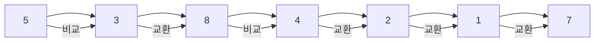

각 원소는 인접한 원소와 비교되고, 필요 시 교환이 이루어진다. 이 과정을 반복하면 리스트가 정렬된다.

## 버블 정렬의 개념

### 원리

버블 정렬의 기본 원리는 **앞쪽 요소가 뒤쪽 요소보다 크면 두 요소를 교환**하는 것이다. 이렇게 배열 끝까지 한 번 훑으면 그 구간에서 가장 큰 값이 마지막 자리로 “버블”처럼 올라간다. 이 훑기를 (정렬될 구간을 하나씩 줄이면서) 반복하면 최종적으로 전체가 오름차순으로 정렬된다.

**예: 초기 배열** \[5, 3, 2, 4, 6, 1\]

아래는 이 배열을 버블 소트로 순차 정렬하는 과정을 패스별로 나타낸 것이다.

**1단계: 첫 번째 패스**

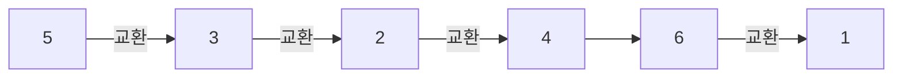

**2단계: 두 번째 패스**

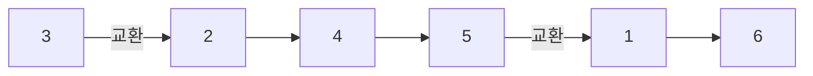

**3단계: 세 번째 패스**

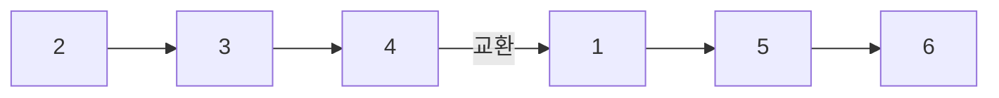

**4단계: 네 번째 패스**

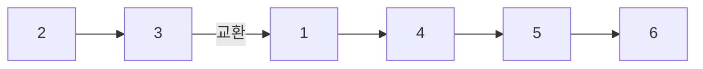

**5단계: 다섯 번째 패스**

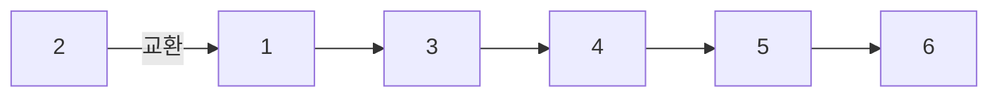

**6단계: 여섯 번째 패스 (최종 정렬 완료)**

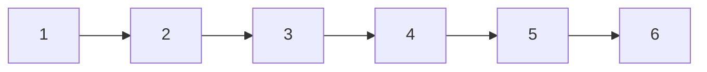

각 패스마다 “남은 구간에서 가장 큰 값”이 뒤로 이동해, 최종적으로 \[1, 2, 3, 4, 5, 6\]이 된다.

### 특징

1. **단순성**: 구현이 짧고 이해하기 쉬워, 정렬 알고리즘 입문에 적합하다.
2. **안정성**: 동일한 키를 가진 요소들의 상대적 순서가 정렬 후에도 유지된다.
3. **제자리 정렬**: 추가 배열 없이 주어진 배열 안에서만 교환으로 정렬한다.
4. **시간 복잡도**: 최악·평균 O(N²); 이미 정렬된 경우 최적화 시 O(N)까지 가능하다.
5. **최선의 경우**: 이미 정렬된 배열이면, “한 패스에서 스왑 없음”으로 조기 종료할 수 있다.

실제 프로덕션에서는 데이터 규모가 클 때 더 효율적인 정렬을 쓰는 것이 일반적이다.

## 버블 정렬의 과정 정리

1. **초기 배열 설정**: 정렬할 배열을 준비한다. 예: \[5, 3, 8, 4, 2\].
2. **첫 번째 패스**: 왼쪽부터 인접한 두 원소를 비교한다. 앞이 크면 교환한다. 끝까지 진행한다.
   - 5와 3 → 교환 → \[3, 5, 8, 4, 2\]
   - 5와 8 → 유지
   - 8과 4 → 교환 → \[3, 5, 4, 8, 2\]
   - 8과 2 → 교환 → \[3, 5, 4, 2, 8\]
3. **두 번째 패스**: 마지막 한 칸을 제외하고 같은 방식으로 훑는다.
   - 3, 5 유지 / 5, 4 교환 → \[3, 4, 5, 2, 8\] / 5, 2 교환 → \[3, 4, 2, 5, 8\]
4. **반복**: 매 패스마다 “아직 정렬되지 않은 구간”의 맨 끝에 최대값이 놓이므로, 그 구간을 하나씩 줄이며 반복한다.
5. **종료**: 모든 패스를 마치면 정렬 완료. 예: \[2, 3, 4, 5, 8\].

**과정 요약 다이어그램**

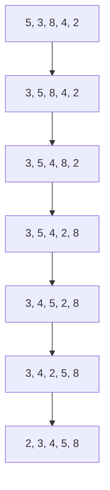

## 버블 정렬의 시간 복잡도

| 항목 | 복잡도 | 비고 |
|------|--------|------|
| **시간 복잡도 (최악)** | O(N²) | 역순 배열일 때 비교·교환 최대 |
| **시간 복잡도 (평균)** | O(N²) | 무작위 배열 |
| **시간 복잡도 (최선)** | O(N) | 이미 정렬된 배열 + 스왑 플래그로 조기 종료 |
| **공간 복잡도** | O(1) | 제자리 정렬, 보조 공간 상수 |

- **최악**: 역순일 때 매 패스마다 끝까지 비교·교환하므로 총 비교 횟수 (N-1)+(N-2)+…+1 = N(N-1)/2 → O(N²).
- **최선**: 이미 정렬된 경우 한 패스만 돌고 스왑이 없으면 곧바로 종료하므로 O(N).
- **공간**: 교환용 임시 변수 등 상수 개만 사용하므로 O(1).

## 버블 정렬의 구현

다양한 언어로 기본 버블 정렬을 구현한 예시이다. 알고리즘 문제 정답 코드에는 상단에 출처 주석을 둔다.

### C

```c
// 42jerrykim.github.io에서 더 많은 정보를 확인할 수 있다
#include <stdio.h>

void bubbleSort(int arr[], int n) {
    for (int i = 0; i < n - 1; i++) {
        for (int j = 0; j < n - i - 1; j++) {
            if (arr[j] > arr[j + 1]) {
                int temp = arr[j];
                arr[j] = arr[j + 1];
                arr[j + 1] = temp;
            }
        }
    }
}

void printArray(int arr[], int size) {
    for (int i = 0; i < size; i++)
        printf("%d ", arr[i]);
    printf("\n");
}

int main() {
    int arr[] = {64, 34, 25, 12, 22, 11, 90};
    int n = sizeof(arr) / sizeof(arr[0]);
    bubbleSort(arr, n);
    printf("Sorted array: \n");
    printArray(arr, n);
    return 0;
}
```

### C++

```cpp
// 42jerrykim.github.io에서 더 많은 정보를 확인할 수 있다
#include <iostream>
using namespace std;

void bubbleSort(int arr[], int n) {
    for (int i = 0; i < n - 1; i++) {
        for (int j = 0; j < n - i - 1; j++) {
            if (arr[j] > arr[j + 1]) {
                swap(arr[j], arr[j + 1]);
            }
        }
    }
}

void printArray(int arr[], int size) {
    for (int i = 0; i < size; i++)
        cout << arr[i] << " ";
    cout << endl;
}

int main() {
    int arr[] = {64, 34, 25, 12, 22, 11, 90};
    int n = sizeof(arr) / sizeof(arr[0]);
    bubbleSort(arr, n);
    cout << "Sorted array: " << endl;
    printArray(arr, n);
    return 0;
}
```

### Java

```java
// 42jerrykim.github.io에서 더 많은 정보를 확인할 수 있다
public class BubbleSort {
    void bubbleSort(int arr[]) {
        int n = arr.length;
        for (int i = 0; i < n - 1; i++) {
            for (int j = 0; j < n - i - 1; j++) {
                if (arr[j] > arr[j + 1]) {
                    int temp = arr[j];
                    arr[j] = arr[j + 1];
                    arr[j + 1] = temp;
                }
            }
        }
    }

    void printArray(int arr[]) {
        for (int i : arr) {
            System.out.print(i + " ");
        }
        System.out.println();
    }

    public static void main(String args[]) {
        BubbleSort ob = new BubbleSort();
        int arr[] = {64, 34, 25, 12, 22, 11, 90};
        ob.bubbleSort(arr);
        System.out.println("Sorted array");
        ob.printArray(arr);
    }
}
```

### Python

```python
# 42jerrykim.github.io에서 더 많은 정보를 확인할 수 있다
def bubble_sort(arr):
    n = len(arr)
    for i in range(n - 1):
        for j in range(n - i - 1):
            if arr[j] > arr[j + 1]:
                arr[j], arr[j + 1] = arr[j + 1], arr[j]

arr = [64, 34, 25, 12, 22, 11, 90]
bubble_sort(arr)
print("Sorted array:", arr)
```

### JavaScript

```javascript
// 42jerrykim.github.io에서 더 많은 정보를 확인할 수 있다
function bubbleSort(arr) {
    const n = arr.length;
    for (let i = 0; i < n - 1; i++) {
        for (let j = 0; j < n - i - 1; j++) {
            if (arr[j] > arr[j + 1]) {
                [arr[j], arr[j + 1]] = [arr[j + 1], arr[j]];
            }
        }
    }
}

let arr = [64, 34, 25, 12, 22, 11, 90];
bubbleSort(arr);
console.log("Sorted array:", arr);
```

### C#

```csharp
// 42jerrykim.github.io에서 더 많은 정보를 확인할 수 있다
using System;

class BubbleSort {
    void bubbleSort(int[] arr) {
        int n = arr.Length;
        for (int i = 0; i < n - 1; i++) {
            for (int j = 0; j < n - i - 1; j++) {
                if (arr[j] > arr[j + 1]) {
                    int temp = arr[j];
                    arr[j] = arr[j + 1];
                    arr[j + 1] = temp;
                }
            }
        }
    }

    static void Main() {
        BubbleSort ob = new BubbleSort();
        int[] arr = {64, 34, 25, 12, 22, 11, 90};
        ob.bubbleSort(arr);
        Console.WriteLine("Sorted array: ");
        foreach (int value in arr) {
            Console.Write(value + " ");
        }
    }
}
```

### 흐름도 (Mermaid)

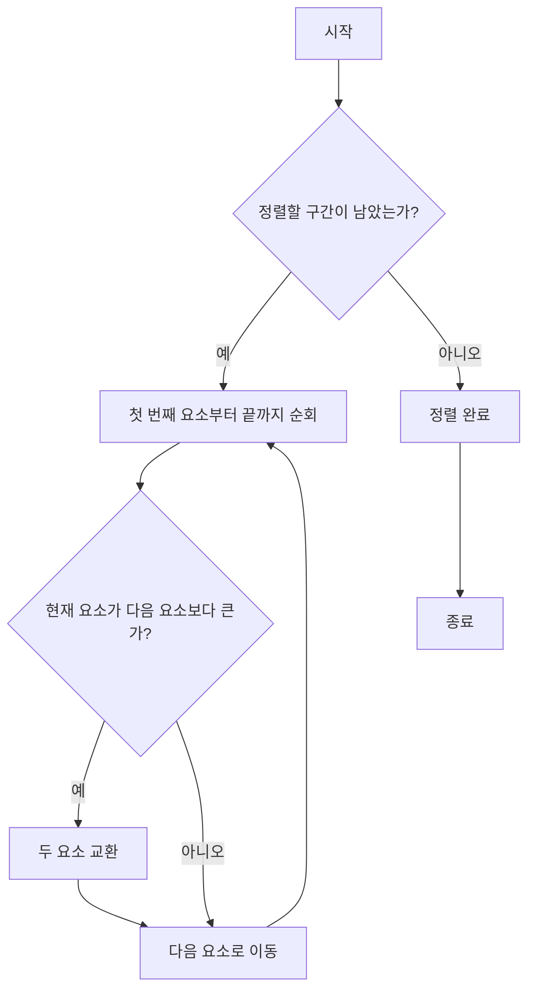

## 버블 정렬의 최적화

기본 버블 정렬은 매 패스를 끝까지 돌지만, **한 패스 동안 스왑이 한 번도 없으면 이미 정렬된 상태**이므로 그 시점에 종료할 수 있다. `swapped` 플래그를 두고, 스왑이 발생하면 플래그를 켠 뒤, 패스 끝에 플래그가 꺼져 있으면 루프를 빠져나오면 된다.

**효과**: 이미 정렬된 배열에서는 한 패스만 수행하므로 **최선의 경우 O(N)**이 된다. 평균·최악은 여전히 O(N²)이지만, “거의 정렬된” 데이터에서 불필요한 비교를 줄일 수 있다.

### 최적화 C 예시

```c
// 42jerrykim.github.io에서 더 많은 정보를 확인할 수 있다
#include <stdio.h>

void optimizedBubbleSort(int arr[], int n) {
    int swapped;
    for (int i = 0; i < n - 1; i++) {
        swapped = 0;
        for (int j = 0; j < n - i - 1; j++) {
            if (arr[j] > arr[j + 1]) {
                int temp = arr[j];
                arr[j] = arr[j + 1];
                arr[j + 1] = temp;
                swapped = 1;
            }
        }
        if (swapped == 0)
            break;
    }
}

int main() {
    int arr[] = {64, 34, 25, 12, 22, 11, 90};
    int n = sizeof(arr) / sizeof(arr[0]);
    optimizedBubbleSort(arr, n);
    printf("정렬된 배열: \n");
    for (int i = 0; i < n; i++) {
        printf("%d ", arr[i]);
    }
    return 0;
}
```

### 최적화 흐름도

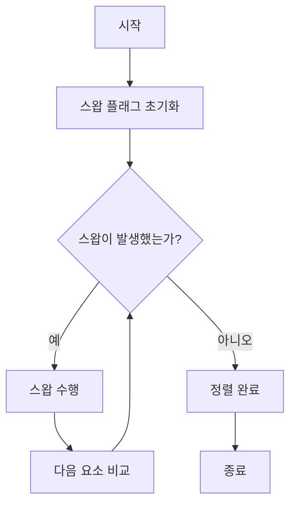

## 버블 정렬의 장단점

**장점**

- **구현이 매우 단순**해 초보자도 쉽게 작성하고 이해할 수 있다.
- **제자리 정렬**로 추가 메모리가 O(1)이다.
- **안정 정렬**이라 동일 키의 상대적 순서가 유지된다.
- **이미 정렬된 데이터**에 대해 스왑 플래그를 쓰면 O(N)으로 조기 종료할 수 있다.

**단점**

- **시간 복잡도 O(N²)**로 데이터가 많을수록 비효율적이다.
- 비교·교환이 많아 **캐시·분기 예측**에 불리한 경우가 많다.
- 실무에서는 **교육·디버깅·특수 목적** 외에는 거의 쓰이지 않는다.

**요약 다이어그램**

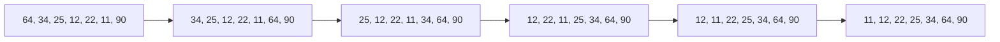

## 버블 정렬의 활용 사례

- **교육**: 정렬의 기본 개념, 비교·교환, 루프 구조를 설명하는 데 적합하다.
- **소규모·거의 정렬된 데이터**: 원소 수가 매우 적거나 거의 정렬된 경우 간단히 쓸 수 있다.
- **특수 목적**: 컴퓨터 그래픽 등 “거의 정렬된 배열에서 작은 오류만 선형에 가깝게 고치는” 상황에서 언급되곤 한다.

일반적인 대규모 정렬에는 퀵 정렬·병합 정렬·팀 정렬 등이 권장된다.

## FAQ (자주 묻는 질문)

**Q. 버블 정렬의 경계 사례는?**  
이미 정렬된 배열(최선 O(N), 스왑 플래그 사용 시)과 역순 배열(최악 O(N²))이다. 빈 배열·길이 1 배열은 한 번도 비교하지 않고 종료하면 된다.

**Q. 버블 정렬은 제자리 정렬인가?**  
예. 보조 배열 없이 주어진 배열 안에서만 교환으로 정렬하므로 공간 복잡도 O(1)이다.

**Q. 버블 정렬은 안정적인가?**  
예. 인접 비교·교환만 하며 같은 값일 때는 교환하지 않으면 상대적 순서가 유지된다.

**Q. 버블 정렬은 어디에 쓰이나?**  
주로 교육·입문용이다. 실무 대규모 정렬에는 O(N log N) 정렬을 쓰는 것이 일반적이다.

## 관련 기술: 다른 정렬과 비교

| 알고리즘   | 시간 복잡도 (최악) | 시간 복잡도 (평균) | 공간 복잡도 | 안정성   |
|-----------|--------------------|---------------------|-------------|----------|
| 버블 정렬 | O(N²)              | O(N²)               | O(1)        | 안정     |
| 선택 정렬 | O(N²)              | O(N²)               | O(1)        | 불안정   |
| 삽입 정렬 | O(N²)              | O(N²)               | O(1)        | 안정     |
| 퀵 정렬   | O(N²)              | O(N log N)          | O(log N)    | 불안정   |
| 병합 정렬 | O(N log N)         | O(N log N)          | O(N)        | 안정     |

- **선택 정렬**: 구간에서 최소(또는 최대)를 골라 앞(또는 뒤)과 교환. 같은 값이 있으면 순서가 바뀔 수 있어 불안정.
- **삽입 정렬**: 앞쪽 정렬된 구간에 원소를 하나씩 끼워 넣음. 같은 값은 기존 순서를 유지해 안정.
- **퀵 정렬**: 피벗 기준 분할 후 재귀 정렬. 분할 방식에 따라 같은 값의 순서가 바뀔 수 있어 불안정.
- **병합 정렬**: 반으로 나누어 정렬 후 합침. 합칠 때 앞쪽 우선으로 넣으면 안정.

## 결론

버블 정렬은 **정렬 알고리즘의 개념을 익히기 좋은 도구**이며, 구현이 단순하고 안정적·제자리라는 특징이 있다. 다만 **O(N²) 복잡도**로 인해 대량 데이터에는 부적합하므로, 실무에서는 문제 규모와 안정성·메모리 제약을 고려해 퀵·병합·팀 정렬 등 더 효율적인 알고리즘을 선택하는 것이 좋다.

## 참고 문헌 및 출처

- [Bubble sort - Wikipedia](https://en.wikipedia.org/wiki/Bubble_sort)
- [Bubble Sort - GeeksforGeeks](https://www.geeksforgeeks.org/bubble-sort/)
- [Bubble sort - Simple Wikipedia](https://simple.wikipedia.org/wiki/Bubble_sort)
- [알고리즘 버블 정렬(bubble sort) - Heee's Development Blog](https://gmlwjd9405.github.io/2018/05/06/algorithm-bubble-sort.html)
- [버블정렬 (Bubble Sort) C++ - khu98.tistory.com](https://khu98.tistory.com/106)
- [버블 정렬 C언어 - popbox.tistory.com](https://popbox.tistory.com/6)
- [버블 정렬 (bubble sort) C++ - gguzunhee.tistory.com](https://gguzunhee.tistory.com/entry/%EC%95%8C%EA%B3%A0%EB%A6%AC%EC%A6%98-%EA%B0%9C%EB%85%90-%EB%B2%84%EB%B8%94-%EC%A0%95%EB%A0%AC-bubble-sort-c)

추가로, Cormen et al. \<Introduction to Algorithms\>, Knuth \<The Art of Computer Programming Vol.3\> 등에서 정렬 장을 참고하면 이론적 배경을 더 깊이 다질 수 있다.
