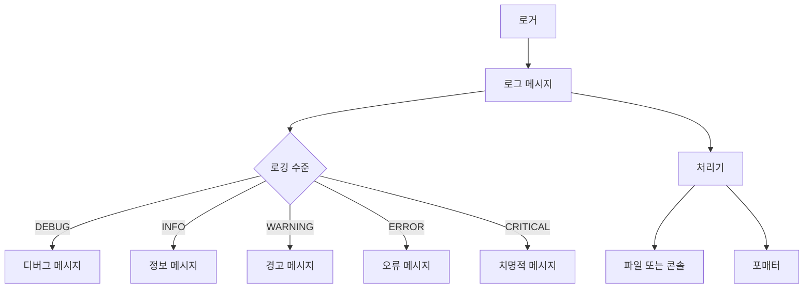
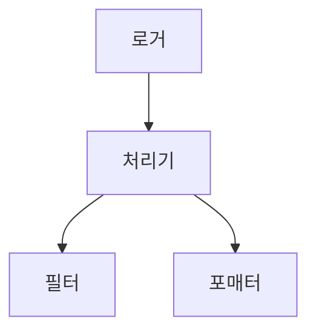
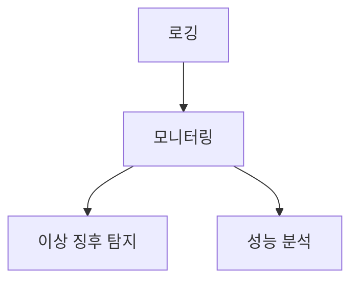
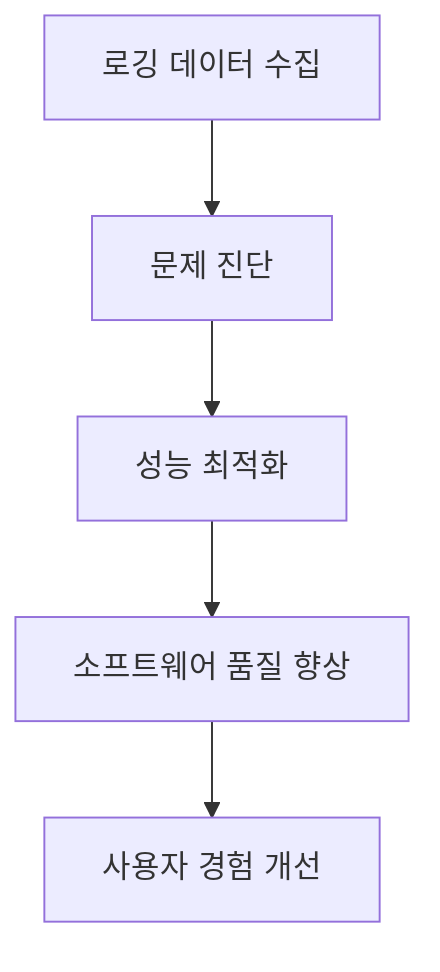
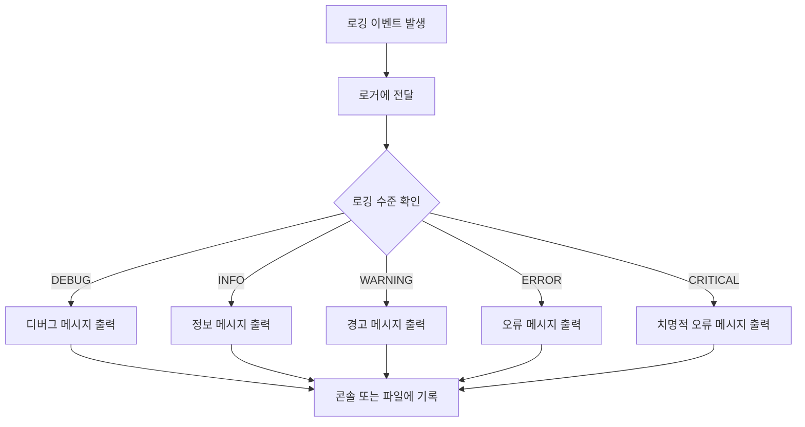

로깅은 소프트웨어 개발에서 필수적인 요소로, 프로그램의 실행 중 발생하는 다양한 이벤트를 추적하고 기록하는 데 사용된다. 개발자는 코드에 로깅 호출을 추가하여 특정 이벤트가 발생했음을 알리고, 이러한 이벤트는 설명 메시지와 함께 가변 데이터를 포함할 수 있다. 로깅의 중요성은 단순히 오류를 추적하는 것에 그치지 않고, 프로그램의 정상 작동을 모니터링하고, 문제를 진단하는 데에도 큰 역할을 한다. 로깅의 수준은 이벤트의 중요도를 나타내며, 일반적으로 DEBUG, INFO, WARNING, ERROR, CRITICAL의 다섯 가지 수준으로 구분된다. 이 자습서에서는 파이썬의 로깅 모듈을 활용하여 로깅을 설정하고 사용하는 방법에 대해 설명할 것이다. 로깅 기능을 사용하기 위해서는 먼저 로거를 생성하고, 다양한 로깅 메서드를 호출하여 이벤트를 기록할 수 있다. 또한, 로깅 메시지를 파일에 기록하거나 콘솔에 출력하는 방법도 다룰 것이다. 이 과정을 통해 독자는 로깅의 기초를 이해하고, 자신의 소프트웨어 프로젝트에 효과적으로 로깅을 적용할 수 있을 것이다.


||
|:---:|
||


<!--
##### Outline #####
-->

<!--
# 로깅 자습서 목차

## 1. 개요
   - 로깅의 정의
   - 로깅의 중요성
   - 로깅의 기본 개념

## 2. 기초 로깅
   - 2.1 로깅을 사용할 때
       - 로거 생성 및 사용 방법
       - 로깅 메서드 설명
   - 2.2 로깅 수준
       - 로깅 수준의 종류 및 설명
       - 기본 로깅 수준 설정
   - 2.3 간단한 예제
       - 콘솔에 로깅하기
       - 파일에 로깅하기
   - 2.4 변수 데이터 로깅
       - 포맷 문자열을 사용한 가변 데이터 로깅
   - 2.5 메시지 포맷 변경
       - 기본 포맷 설정
       - 날짜/시간 표시 추가

## 3. 고급 로깅
   - 3.1 로거, 처리기, 필터 및 포매터
       - 각 구성 요소의 역할 및 사용법
   - 3.2 로깅 흐름
       - 로깅 이벤트의 흐름 설명
   - 3.3 로깅 구성
       - 로깅 구성 방법
       - 구성 파일 및 딕셔너리 기반 구성
   - 3.4 사용자 정의 처리기 및 포매터
       - 사용자 정의 처리기 작성 방법
       - 포매터의 커스터마이징

## 4. 예제
   - 4.1 기본 로깅 예제
   - 4.2 파일 로깅 예제
   - 4.3 사용자 정의 로깅 구성 예제
   - 4.4 다양한 로깅 수준을 사용하는 예제

## 5. FAQ
   - 로깅이 필요한 이유는 무엇인가요?
   - 로깅 수준을 어떻게 설정하나요?
   - 로깅 메시지를 파일에 저장하는 방법은?
   - 로깅 구성 파일을 어떻게 작성하나요?
   - NullHandler는 무엇인가요?

## 6. 관련 기술
   - 로깅과 모니터링
   - 로깅과 디버깅
   - 로깅과 성능 최적화
   - 로깅과 보안

## 7. 결론
   - 로깅의 중요성 재강조
   - 로깅을 통한 소프트웨어 품질 향상
   - 다음 단계: 고급 로깅 기법 탐색

## 8. 추가 자료
   - 로깅 관련 문서 및 자료 링크
   - 추천 도서 및 온라인 강좌
   - 커뮤니티 및 포럼 정보

이 목차는 로깅에 대한 기초부터 고급 개념까지 포괄적으로 다루며, 독자가 로깅을 효과적으로 이해하고 활용할 수 있도록 돕기 위해 구성되었습니다.
-->

<!--
## 1. 개요
   - 로깅의 정의
   - 로깅의 중요성
   - 로깅의 기본 개념
-->

## 1. 개요

로깅은 소프트웨어 개발 및 운영에서 중요한 역할을 하는 기능이다. 이 섹션에서는 로깅의 정의, 중요성, 그리고 기본 개념에 대해 살펴보겠다.

**로깅의 정의**  
로깅은 소프트웨어 애플리케이션에서 발생하는 이벤트, 오류, 상태 변화 등을 기록하는 과정을 의미한다. 이러한 기록은 개발자와 운영자가 시스템의 동작을 이해하고 문제를 해결하는 데 도움을 준다.

**로깅의 중요성**  
로깅은 여러 가지 이유로 중요하다. 첫째, 시스템의 상태를 모니터링하고 문제를 조기에 발견할 수 있도록 돕는다. 둘째, 발생한 오류나 예외를 추적하여 디버깅을 용이하게 한다. 셋째, 시스템의 성능을 분석하고 최적화하는 데 필요한 데이터를 제공한다. 마지막으로, 보안 감사 및 규정 준수를 위한 중요한 정보를 기록하는 데도 사용된다.

**로깅의 기본 개념**  
로깅의 기본 개념은 다음과 같다:

1. **로거(Logger)**: 로깅을 수행하는 주체로, 로그 메시지를 생성하고 기록하는 역할을 한다.
2. **로그 메시지(Log Message)**: 로거가 기록하는 정보로, 이벤트의 종류, 발생 시간, 메시지 내용 등을 포함한다.
3. **로깅 수준(Logging Level)**: 로그 메시지의 중요도를 나타내며, 일반적으로 DEBUG, INFO, WARNING, ERROR, CRITICAL과 같은 수준으로 구분된다.
4. **처리기(Handler)**: 로그 메시지를 저장하는 방법을 정의하며, 콘솔, 파일, 원격 서버 등 다양한 출력 방법을 지원한다.
5. **포매터(Formatter)**: 로그 메시지의 형식을 정의하여, 가독성을 높이고 필요한 정보를 쉽게 파악할 수 있도록 한다.

다음은 로깅의 기본 흐름을 나타내는 다이어그램이다:



이러한 기본 개념을 이해하면, 로깅을 효과적으로 활용하여 소프트웨어의 품질을 향상시키고 문제를 신속하게 해결할 수 있다. 로깅은 단순한 기록을 넘어, 시스템의 건강 상태를 유지하고 성능을 최적화하는 데 필수적인 요소임을 강조하고 싶다.

<!--
## 2. 기초 로깅
   - 2.1 로깅을 사용할 때
       - 로거 생성 및 사용 방법
       - 로깅 메서드 설명
   - 2.2 로깅 수준
       - 로깅 수준의 종류 및 설명
       - 기본 로깅 수준 설정
   - 2.3 간단한 예제
       - 콘솔에 로깅하기
       - 파일에 로깅하기
   - 2.4 변수 데이터 로깅
       - 포맷 문자열을 사용한 가변 데이터 로깅
   - 2.5 메시지 포맷 변경
       - 기본 포맷 설정
       - 날짜/시간 표시 추가
-->

## 2. 기초 로깅

로깅은 소프트웨어 개발에서 중요한 역할을 하며, 이를 통해 애플리케이션의 상태를 모니터링하고 문제를 진단할 수 있다. 이번 섹션에서는 기초적인 로깅 사용법과 관련된 내용을 다룰 것이다.

**2.1 로깅을 사용할 때**

로깅을 시작하기 위해서는 먼저 로거를 생성해야 한다. 로거는 로그 메시지를 기록하는 주체로, 다양한 설정을 통해 로그의 출력을 조정할 수 있다. 다음은 로거를 생성하고 사용하는 방법에 대한 간단한 예제이다.

```python
import logging

# 로거 생성
logger = logging.getLogger('my_logger')
logger.setLevel(logging.DEBUG)

# 콘솔 출력 핸들러 추가
console_handler = logging.StreamHandler()
logger.addHandler(console_handler)

# 로그 메시지 기록
logger.debug('디버그 메시지')
logger.info('정보 메시지')
logger.warning('경고 메시지')
logger.error('오류 메시지')
logger.critical('치명적인 메시지')
```

**2.2 로깅 수준**

로깅 수준은 로그 메시지의 중요도를 나타내며, 다양한 수준이 존재한다. 일반적으로 사용되는 로깅 수준은 다음과 같다:

- DEBUG: 디버깅 정보를 나타내는 메시지
- INFO: 일반적인 정보 메시지
- WARNING: 경고 메시지
- ERROR: 오류 메시지
- CRITICAL: 치명적인 오류 메시지

기본 로깅 수준을 설정하는 방법은 다음과 같다.

```python
# 기본 로깅 수준 설정
logging.basicConfig(level=logging.INFO)
```

**2.3 간단한 예제**

로깅을 콘솔과 파일에 기록하는 방법을 살펴보자. 아래의 예제는 콘솔과 파일 모두에 로그 메시지를 기록하는 방법을 보여준다.

```python
import logging

# 로깅 설정
logging.basicConfig(level=logging.DEBUG, 
                    format='%(asctime)s - %(levelname)s - %(message)s',
                    handlers=[
                        logging.StreamHandler(),  # 콘솔 핸들러
                        logging.FileHandler('app.log')  # 파일 핸들러
                    ])

# 로그 메시지 기록
logging.info('애플리케이션 시작')
logging.error('오류 발생')
```

**2.4 변수 데이터 로깅**

가변 데이터를 로깅할 때는 포맷 문자열을 사용하여 로그 메시지를 구성할 수 있다. 이를 통해 동적인 정보를 로그에 포함시킬 수 있다.

```python
user_id = 42
logging.info('사용자 %d가 로그인했습니다.', user_id)
```

**2.5 메시지 포맷 변경**

로그 메시지의 포맷을 변경하여 더 유용한 정보를 제공할 수 있다. 기본 포맷을 설정하고 날짜/시간 표시를 추가하는 방법은 다음과 같다.

```python
# 기본 포맷 설정
logging.basicConfig(format='%(asctime)s - %(levelname)s - %(message)s', 
                    datefmt='%Y-%m-%d %H:%M:%S')

logging.info('애플리케이션 시작')
```

위의 예제에서는 로그 메시지에 날짜와 시간을 포함시켜, 로그를 분석할 때 유용한 정보를 제공한다.

이와 같이 기초 로깅을 통해 애플리케이션의 상태를 효과적으로 모니터링하고, 문제를 진단할 수 있는 기반을 마련할 수 있다. 로깅은 소프트웨어 개발에서 필수적인 요소이며, 이를 잘 활용하는 것이 중요하다.

<!--
## 3. 고급 로깅
   - 3.1 로거, 처리기, 필터 및 포매터
       - 각 구성 요소의 역할 및 사용법
   - 3.2 로깅 흐름
       - 로깅 이벤트의 흐름 설명
   - 3.3 로깅 구성
       - 로깅 구성 방법
       - 구성 파일 및 딕셔너리 기반 구성
   - 3.4 사용자 정의 처리기 및 포매터
       - 사용자 정의 처리기 작성 방법
       - 포매터의 커스터마이징
-->

## 3. 고급 로깅

로깅의 고급 개념은 소프트웨어 개발에서 더욱 효과적이고 유연한 로깅을 가능하게 한다. 이 섹션에서는 로거, 처리기, 필터 및 포매터의 역할과 사용법, 로깅 이벤트의 흐름, 로깅 구성 방법, 그리고 사용자 정의 처리기 및 포매터에 대해 다룰 것이다.

**3.1 로거, 처리기, 필터 및 포매터**

로깅 시스템은 여러 구성 요소로 이루어져 있으며, 각 구성 요소는 특정한 역할을 수행한다. 

- **로거**: 로깅 이벤트를 생성하는 주체로, 로그 메시지를 기록하는 메서드를 제공한다. 로거는 다양한 수준의 로그 메시지를 기록할 수 있다.
  
- **처리기**: 로거가 생성한 로그 메시지를 실제로 출력하는 역할을 한다. 예를 들어, 콘솔에 출력하거나 파일에 저장하는 등의 작업을 수행한다.

- **필터**: 로깅 이벤트가 처리기까지 도달하기 전에 필터링하는 역할을 한다. 특정 조건에 맞는 로그 메시지만을 처리하도록 설정할 수 있다.

- **포매터**: 로그 메시지의 형식을 정의하는 역할을 한다. 로그 메시지의 출력 형식을 사용자 정의할 수 있다.

다음은 로거, 처리기, 필터 및 포매터의 관계를 나타내는 다이어그램이다.



**3.2 로깅 흐름**

로깅 이벤트의 흐름은 다음과 같은 단계로 이루어진다. 

1. **로거 생성**: 개발자는 로거를 생성하고 로그 메시지를 기록한다.
2. **로그 메시지 생성**: 로거는 로그 메시지를 생성하고, 설정된 로깅 수준에 따라 메시지를 필터링한다.
3. **처리기 전달**: 필터링된 로그 메시지는 처리기로 전달된다.
4. **출력**: 처리기는 로그 메시지를 지정된 출력 대상으로 전달한다.

이러한 흐름을 통해 로그 메시지는 효율적으로 관리되고, 필요한 정보만을 기록할 수 있다.

**3.3 로깅 구성**

로깅 구성은 로깅 시스템의 동작 방식을 설정하는 과정이다. 로깅 구성 방법에는 두 가지 주요 방식이 있다.

- **구성 파일**: XML, JSON 또는 YAML 형식의 파일을 사용하여 로깅 설정을 정의할 수 있다. 이 방법은 설정을 외부 파일로 관리할 수 있어 유연성을 제공한다.

- **딕셔너리 기반 구성**: 파이썬의 딕셔너리를 사용하여 로깅 구성을 직접 코드 내에서 정의할 수 있다. 이 방법은 코드와 설정을 함께 관리할 수 있는 장점이 있다.

다음은 딕셔너리 기반 로깅 구성의 예시 코드이다.

```python
import logging
import logging.config

# 딕셔너리 기반 로깅 구성
logging_config = {
    'version': 1,
    'disable_existing_loggers': False,
    'formatters': {
        'simple': {
            'format': '%(asctime)s - %(name)s - %(levelname)s - %(message)s'
        },
    },
    'handlers': {
        'console': {
            'class': 'logging.StreamHandler',
            'formatter': 'simple',
        },
    },
    'loggers': {
        'my_logger': {
            'handlers': ['console'],
            'level': 'DEBUG',
        },
    },
}

logging.config.dictConfig(logging_config)
logger = logging.getLogger('my_logger')
logger.debug('This is a debug message')
```

**3.4 사용자 정의 처리기 및 포매터**

사용자 정의 처리기와 포매터를 작성하면 로깅 시스템을 더욱 유연하게 사용할 수 있다. 

- **사용자 정의 처리기**: 기본 제공되는 처리기 외에, 특정 요구 사항에 맞는 처리기를 작성할 수 있다. 예를 들어, 로그 메시지를 데이터베이스에 저장하는 처리기를 만들 수 있다.

- **포매터의 커스터마이징**: 기본 포매터를 상속받아 새로운 포매터를 작성할 수 있다. 이를 통해 로그 메시지의 형식을 자유롭게 변경할 수 있다.

다음은 사용자 정의 처리기의 예시 코드이다.

```python
import logging

class CustomHandler(logging.Handler):
    def emit(self, record):
        log_entry = self.format(record)
        # 로그 메시지를 데이터베이스에 저장하는 로직을 추가할 수 있다.
        print(f"Custom log entry: {log_entry}")

# 사용자 정의 처리기 사용 예
logger = logging.getLogger('custom_logger')
custom_handler = CustomHandler()
custom_handler.setFormatter(logging.Formatter('%(asctime)s - %(levelname)s - %(message)s'))
logger.addHandler(custom_handler)
logger.setLevel(logging.DEBUG)

logger.debug('This is a custom log message')
```

이와 같이 고급 로깅 개념을 이해하고 활용하면, 소프트웨어의 로깅 시스템을 더욱 효과적으로 관리할 수 있다.

<!--
## 4. 예제
   - 4.1 기본 로깅 예제
   - 4.2 파일 로깅 예제
   - 4.3 사용자 정의 로깅 구성 예제
   - 4.4 다양한 로깅 수준을 사용하는 예제
-->

## 4. 예제

로깅을 효과적으로 이해하기 위해서는 실제 예제를 통해 학습하는 것이 중요하다. 이 섹션에서는 기본 로깅 예제부터 파일 로깅, 사용자 정의 로깅 구성, 다양한 로깅 수준을 사용하는 예제까지 다양한 사례를 다룰 것이다.

**4.1 기본 로깅 예제**

기본 로깅을 설정하는 방법은 매우 간단하다. Python의 `logging` 모듈을 사용하여 기본적인 로깅을 구현할 수 있다. 아래는 간단한 로깅 예제이다.

```python
import logging

# 기본 로깅 설정
logging.basicConfig(level=logging.DEBUG)

# 로깅 메시지
logging.debug("디버그 메시지입니다.")
logging.info("정보 메시지입니다.")
logging.warning("경고 메시지입니다.")
logging.error("오류 메시지입니다.")
logging.critical("치명적인 메시지입니다.")
```

위 코드를 실행하면 콘솔에 각 로깅 수준에 맞는 메시지가 출력된다. 기본적으로 `DEBUG` 수준으로 설정되어 있어 모든 메시지가 출력된다.

**4.2 파일 로깅 예제**

로깅 메시지를 파일에 저장하는 방법도 매우 유용하다. 아래는 파일에 로깅하는 예제이다.

```python
import logging

# 파일 로깅 설정
logging.basicConfig(filename='app.log', level=logging.DEBUG)

# 로깅 메시지
logging.debug("디버그 메시지입니다.")
logging.info("정보 메시지입니다.")
logging.warning("경고 메시지입니다.")
logging.error("오류 메시지입니다.")
logging.critical("치명적인 메시지입니다.")
```

위 코드를 실행하면 `app.log`라는 파일에 로깅 메시지가 저장된다. 이 파일을 열어보면 각 로깅 수준에 맞는 메시지를 확인할 수 있다.

**4.3 사용자 정의 로깅 구성 예제**

사용자 정의 로깅 구성을 통해 더 세밀한 로깅을 구현할 수 있다. 아래는 사용자 정의 로거와 핸들러를 설정하는 예제이다.

```python
import logging

# 사용자 정의 로거 생성
logger = logging.getLogger('my_logger')
logger.setLevel(logging.DEBUG)

# 콘솔 핸들러 생성
console_handler = logging.StreamHandler()
console_handler.setLevel(logging.INFO)

# 파일 핸들러 생성
file_handler = logging.FileHandler('my_log.log')
file_handler.setLevel(logging.DEBUG)

# 포매터 설정
formatter = logging.Formatter('%(asctime)s - %(name)s - %(levelname)s - %(message)s')
console_handler.setFormatter(formatter)
file_handler.setFormatter(formatter)

# 핸들러 추가
logger.addHandler(console_handler)
logger.addHandler(file_handler)

# 로깅 메시지
logger.debug("디버그 메시지입니다.")
logger.info("정보 메시지입니다.")
logger.warning("경고 메시지입니다.")
logger.error("오류 메시지입니다.")
logger.critical("치명적인 메시지입니다.")
```

위 코드를 실행하면 콘솔에는 `INFO` 수준 이상의 메시지가 출력되고, `my_log.log` 파일에는 모든 메시지가 기록된다.

**4.4 다양한 로깅 수준을 사용하는 예제**

로깅 수준을 적절히 활용하면 애플리케이션의 상태를 효과적으로 모니터링할 수 있다. 아래는 다양한 로깅 수준을 사용하는 예제이다.

```python
import logging

# 기본 로깅 설정
logging.basicConfig(level=logging.DEBUG)

# 다양한 로깅 수준 사용
def divide(a, b):
    logging.debug(f"divide 함수 호출: a={a}, b={b}")
    if b == 0:
        logging.error("0으로 나눌 수 없습니다.")
        return None
    return a / b

result = divide(10, 0)
if result is None:
    logging.warning("결과가 None입니다.")
else:
    logging.info(f"결과: {result}")
```

위 코드는 나눗셈을 수행하는 함수에서 다양한 로깅 수준을 사용하여 상태를 기록한다. `DEBUG` 수준으로 함수 호출을 기록하고, `ERROR` 수준으로 오류를 기록하며, `WARNING` 수준으로 결과가 `None`인 경우를 처리한다.

이와 같은 예제를 통해 로깅의 기본적인 사용법과 다양한 활용 방법을 이해할 수 있다. 로깅은 소프트웨어 개발에서 중요한 역할을 하며, 이를 통해 애플리케이션의 상태를 효과적으로 모니터링하고 문제를 해결할 수 있다.

<!--
## 5. FAQ
   - 로깅이 필요한 이유는 무엇인가요?
   - 로깅 수준을 어떻게 설정하나요?
   - 로깅 메시지를 파일에 저장하는 방법은?
   - 로깅 구성 파일을 어떻게 작성하나요?
   - NullHandler는 무엇인가요?
-->

## 5. FAQ

**로깅이 필요한 이유는 무엇인가요?**  
로깅은 소프트웨어 개발 및 운영에서 매우 중요한 역할을 한다. 로깅을 통해 애플리케이션의 상태를 모니터링하고, 오류를 추적하며, 성능을 분석할 수 있다. 또한, 로깅은 문제 발생 시 원인을 파악하는 데 도움을 주며, 사용자 행동을 이해하는 데도 유용하다. 이러한 정보는 소프트웨어의 품질을 향상시키고, 유지보수 비용을 절감하는 데 기여한다.

**로깅 수준을 어떻게 설정하나요?**  
로깅 수준은 로깅 메시지의 중요도를 나타내며, 일반적으로 다음과 같은 수준이 있다: DEBUG, INFO, WARNING, ERROR, CRITICAL. 로깅 수준을 설정하는 방법은 다음과 같다.

```python
import logging

# 로깅 수준 설정
logging.basicConfig(level=logging.INFO)

# 로깅 메시지
logging.debug("디버그 메시지")  # 출력되지 않음
logging.info("정보 메시지")      # 출력됨
logging.warning("경고 메시지")   # 출력됨
logging.error("오류 메시지")     # 출력됨
logging.critical("치명적 메시지") # 출력됨
```

**로깅 메시지를 파일에 저장하는 방법은?**  
로깅 메시지를 파일에 저장하려면, `FileHandler`를 사용하여 로거를 설정하면 된다. 아래는 파일에 로깅하는 예제이다.

```python
import logging

# 파일 핸들러 설정
logging.basicConfig(filename='app.log', level=logging.INFO)

# 로깅 메시지
logging.info("파일에 기록된 정보 메시지")
```

**로깅 구성 파일을 어떻게 작성하나요?**  
로깅 구성 파일은 INI 형식으로 작성할 수 있으며, 로깅의 다양한 설정을 포함할 수 있다. 아래는 간단한 구성 파일 예제이다.

```ini
[loggers]
keys=root,sampleLogger

[handlers]
keys=consoleHandler,fileHandler

[formatters]
keys=sampleFormatter

[logger_root]
level=DEBUG
handlers=consoleHandler

[logger_sampleLogger]
level=INFO
handlers=fileHandler
qualname=sampleLogger
propagate=0

[handler_consoleHandler]
class=StreamHandler
level=DEBUG
formatter=sampleFormatter
args=

[handler_fileHandler]
class=FileHandler
level=INFO
formatter=sampleFormatter
args=['app.log', 'a']

[formatter_sampleFormatter]
format=%(asctime)s - %(name)s - %(levelname)s - %(message)s
datefmt=%Y-%m-%d %H:%M:%S
```

**NullHandler는 무엇인가요?**  
`NullHandler`는 로깅 메시지를 처리하지 않는 핸들러이다. 주로 라이브러리에서 사용되며, 사용자가 로깅을 설정하지 않았을 때 발생할 수 있는 오류를 방지하는 데 유용하다. 아래는 `NullHandler`의 사용 예제이다.

```python
import logging

# NullHandler 설정
logger = logging.getLogger('my_logger')
logger.addHandler(logging.NullHandler())

# 로깅 메시지
logger.info("이 메시지는 출력되지 않음")
```

이와 같이 `NullHandler`를 사용하면, 로깅 설정이 없는 경우에도 오류 없이 애플리케이션이 실행될 수 있다.

<!--
## 6. 관련 기술
   - 로깅과 모니터링
   - 로깅과 디버깅
   - 로깅과 성능 최적화
   - 로깅과 보안
-->

## 6. 관련 기술

로깅은 소프트웨어 개발 및 운영에서 중요한 역할을 하며, 여러 기술과 밀접하게 연관되어 있다. 이 섹션에서는 로깅과 관련된 몇 가지 주요 기술에 대해 살펴보겠다.

**로깅과 모니터링**  
로깅은 시스템의 상태와 동작을 기록하는 반면, 모니터링은 이러한 로그 데이터를 실시간으로 분석하여 시스템의 성능과 안정성을 평가하는 과정이다. 로깅을 통해 수집된 데이터는 모니터링 도구에 의해 분석되어, 이상 징후를 조기에 발견하고 대응할 수 있도록 돕는다. 예를 들어, 특정 로깅 수준의 메시지를 모니터링하여 시스템의 성능 저하를 감지할 수 있다.



**로깅과 디버깅**  
디버깅 과정에서 로깅은 매우 유용한 도구로 작용한다. 코드의 실행 흐름을 추적하고, 변수의 상태를 기록함으로써 문제의 원인을 파악하는 데 도움을 준다. 로깅을 통해 개발자는 코드의 특정 지점에서 발생하는 오류를 쉽게 추적할 수 있으며, 이를 통해 디버깅 시간을 단축할 수 있다. 예를 들어, 다음과 같은 로깅 코드를 사용하여 함수의 실행 흐름을 기록할 수 있다.

```python
import logging

logging.basicConfig(level=logging.DEBUG)

def example_function(x):
    logging.debug(f"example_function called with x={x}")
    return x * 2

result = example_function(5)
```

**로깅과 성능 최적화**  
로깅은 성능 최적화에도 중요한 역할을 한다. 적절한 로깅 수준과 전략을 사용하면, 시스템의 성능을 저하시키지 않으면서도 필요한 정보를 수집할 수 있다. 예를 들어, 디버깅 정보를 로깅할 때는 개발 환경에서만 활성화하고, 운영 환경에서는 경고나 오류 수준의 로그만 기록하도록 설정할 수 있다. 이를 통해 불필요한 로그 기록을 줄이고, 성능을 최적화할 수 있다.

**로깅과 보안**  
로깅은 보안 측면에서도 중요한 역할을 한다. 시스템에서 발생하는 모든 이벤트를 기록함으로써, 보안 사고 발생 시 원인을 분석하고 대응할 수 있는 기반을 제공한다. 예를 들어, 로그인 시도, 데이터 접근, 시스템 변경 등의 이벤트를 로깅하여, 비정상적인 활동을 감지하고 대응할 수 있다. 다음은 보안 관련 로그를 기록하는 예시 코드이다.

```python
import logging

logging.basicConfig(filename='security.log', level=logging.WARNING)

def log_security_event(event):
    logging.warning(f"Security event: {event}")

log_security_event("Unauthorized access attempt detected.")
```

이와 같이 로깅은 모니터링, 디버깅, 성능 최적화, 보안 등 다양한 기술과 연관되어 있으며, 소프트웨어 개발 및 운영에서 필수적인 요소로 자리 잡고 있다. 로깅을 효과적으로 활용하면 시스템의 안정성과 성능을 높일 수 있다.

<!--
## 7. 결론
   - 로깅의 중요성 재강조
   - 로깅을 통한 소프트웨어 품질 향상
   - 다음 단계: 고급 로깅 기법 탐색
-->

## 7. 결론

로깅은 소프트웨어 개발 및 운영에서 매우 중요한 역할을 한다. 이번 자습서를 통해 로깅의 기본 개념부터 고급 기법까지 살펴보았으며, 이를 통해 로깅의 중요성을 다시 한번 강조하고자 한다.

**로깅의 중요성 재강조**  
로깅은 시스템의 상태를 모니터링하고, 문제를 진단하며, 성능을 최적화하는 데 필수적이다. 적절한 로깅을 통해 개발자는 애플리케이션의 동작을 이해하고, 사용자 경험을 개선할 수 있다. 또한, 로깅은 보안 감사 및 규정 준수에도 중요한 역할을 한다. 

**로깅을 통한 소프트웨어 품질 향상**  
효과적인 로깅은 소프트웨어 품질을 향상시키는 데 기여한다. 로깅을 통해 발생하는 오류나 예외를 신속하게 파악하고, 이를 해결함으로써 시스템의 안정성을 높일 수 있다. 또한, 로깅 데이터를 분석하여 성능 병목 현상을 발견하고, 이를 개선하는 데 활용할 수 있다. 

다음은 로깅을 통한 품질 향상의 흐름을 나타낸 다이어그램이다.



**다음 단계: 고급 로깅 기법 탐색**  
이번 자습서를 통해 기초적인 로깅 기법을 익혔다면, 다음 단계로 고급 로깅 기법을 탐색하는 것이 좋다. 사용자 정의 처리기 및 포매터, 로깅 구성 파일 작성, 그리고 다양한 로깅 수준을 활용하는 방법 등을 학습함으로써 더욱 효과적인 로깅 전략을 수립할 수 있다. 

로깅은 단순한 디버깅 도구가 아니라, 소프트웨어의 품질과 안정성을 높이는 중요한 요소임을 잊지 말아야 한다. 앞으로도 로깅을 통해 소프트웨어 개발의 모든 단계에서 품질을 향상시키는 데 기여할 수 있기를 바란다.

<!--
## 8. 추가 자료
   - 로깅 관련 문서 및 자료 링크
   - 추천 도서 및 온라인 강좌
   - 커뮤니티 및 포럼 정보
-->

## 8. 추가 자료

로깅에 대한 이해를 더욱 깊이 있게 하기 위해 유용한 자료를 소개하고자 한다. 이 자료들은 로깅 관련 문서, 추천 도서, 온라인 강좌, 그리고 커뮤니티 및 포럼 정보를 포함하고 있다.

**로깅 관련 문서 및 자료 링크**  
다양한 로깅 관련 문서와 자료를 통해 로깅의 기초부터 고급 개념까지 폭넓게 학습할 수 있다. 다음은 유용한 링크들이다.

- [Python Logging Documentation](https://docs.python.org/3/library/logging.html): 파이썬의 공식 로깅 문서로, 로깅 모듈의 모든 기능을 상세히 설명하고 있다.
- [Loggly Logging Best Practices](https://www.loggly.com/ultimate-guide/python-logging/): 로깅의 베스트 프랙티스를 다룬 자료로, 실무에서 유용한 팁을 제공한다.
- [Logging in Python: A Beginner's Guide](https://realpython.com/python-logging/): 파이썬 로깅에 대한 초보자 가이드로, 기초부터 시작할 수 있는 좋은 자료이다.

**추천 도서 및 온라인 강좌**  
로깅에 대한 깊이 있는 지식을 얻기 위해 다음의 도서와 온라인 강좌를 추천한다.

- **도서**  
  - *Python Logging: A Comprehensive Guide*: 로깅의 기초부터 고급 기법까지 다룬 책으로, 실용적인 예제와 함께 설명하고 있다.
  - *Effective Python*: 파이썬의 다양한 기법을 다룬 책으로, 로깅에 대한 유용한 팁도 포함되어 있다.

- **온라인 강좌**  
  - [Udemy - Python Logging: The Complete Guide](https://www.udemy.com/course/python-logging/): 로깅에 대한 포괄적인 강좌로, 실습을 통해 로깅을 익힐 수 있다.
  - [Coursera - Software Engineering for Web Applications](https://www.coursera.org/learn/software-engineering-web-apps): 소프트웨어 공학의 기초를 배우며 로깅의 중요성을 이해할 수 있는 강좌이다.

**커뮤니티 및 포럼 정보**  
로깅에 대한 질문이나 정보를 공유할 수 있는 커뮤니티와 포럼도 유용하다. 다음은 추천하는 커뮤니티들이다.

- [Stack Overflow](https://stackoverflow.com/): 프로그래밍 관련 질문과 답변을 주고받을 수 있는 플랫폼으로, 로깅 관련 질문도 활발히 논의된다.
- [Reddit - r/Python](https://www.reddit.com/r/Python/): 파이썬 관련 다양한 주제를 다루는 커뮤니티로, 로깅에 대한 정보도 공유된다.
- [Python Discord](https://pythondiscord.com/): 파이썬 개발자들이 모여 소통하는 플랫폼으로, 로깅에 대한 질문을 할 수 있는 좋은 장소이다.

다음은 로깅의 흐름을 시각적으로 나타낸 다이어그램이다.



이 자료들을 통해 로깅에 대한 이해를 더욱 깊이 있게 할 수 있을 것이다. 로깅은 소프트웨어 개발에서 중요한 역할을 하므로, 지속적으로 학습하고 활용하는 것이 필요하다.

<!--
##### Reference #####
-->

## Reference


* [https://docs.python.org/ko/3/howto/logging.html](https://docs.python.org/ko/3/howto/logging.html)


<!--
This page contains tutorial information. For links to reference information
and a logging cookbook, please see  Other resources  .

##  기초 로깅 자습서

로깅은 어떤 소프트웨어가 실행될 때 발생하는 이벤트를 추적하는 수단입니다. 소프트웨어 개발자는 코드에 로깅 호출을 추가하여 특정 이벤트가
발생했음을 나타냅니다. 이벤트는 선택적으로 가변 데이터 (즉, 이벤트 발생마다 잠재적으로 다른 데이터)를 포함할 수 있는 설명 메시지로
기술됩니다. 이벤트는 또한 개발자가 이벤트에 부여한 중요도를 가지고 있습니다; 중요도는 _수준(level)_ 또는
_심각도(severity)_ 라고도 부를 수 있습니다.

###  로깅을 사용할 때

You can access logging functionality by creating a logger via ` logger  =
getLogger(__name__)  ` , and then calling the logger’s [ ` debug()  `
](../library/logging.html#logging.Logger.debug "logging.Logger.debug") , [ `
info()  ` ](../library/logging.html#logging.Logger.info "logging.Logger.info")
, [ ` warning()  ` ](../library/logging.html#logging.Logger.warning
"logging.Logger.warning") , [ ` error()  `
](../library/logging.html#logging.Logger.error "logging.Logger.error") and [ `
critical()  ` ](../library/logging.html#logging.Logger.critical
"logging.Logger.critical") methods. To determine when to use logging, and to
see which logger methods to use when, see the table below. It states, for each
of a set of common tasks, the best tool to use for that task.

수행하려는 작업  |  작업을 위한 최상의 도구   
---|---  
명령행 스크립트 또는 프로그램의 일반적인 사용을 위한 콘솔 출력 표시  |  [ ` print()  ` ](../library/functions.html#print "print")  
프로그램의 정상 작동 중에 발생하는 이벤트 보고 (가령 상태 모니터링이나 결함 조사)  |  A logger’s [ ` info()  ` ](../library/logging.html#logging.Logger.info "logging.Logger.info") (or [ ` debug()  ` ](../library/logging.html#logging.Logger.debug "logging.Logger.debug") method for very detailed output for diagnostic purposes)   
특정 실행시간 이벤트와 관련하여 경고를 발행  |  라이브러리 코드에서 [ ` warnings.warn()  ` ](../library/warnings.html#warnings.warn "warnings.warn") : 문제를 피할 수 있고 경고를 제거하기 위해 클라이언트 응용 프로그램이 수정되어야 하는 경우  A logger’s [ ` warning()  ` ](../library/logging.html#logging.Logger.warning "logging.Logger.warning") method if there is nothing the client application can do about the situation, but the event should still be noted   
특정 실행시간 이벤트와 관련하여 에러를 보고  |  예외를 일으킵니다   
예외를 발생시키지 않고 에러의 억제를 보고 (가령 장기 실행 서버 프로세스의 에러 처리기)  |  A logger’s [ ` error()  ` ](../library/logging.html#logging.Logger.error "logging.Logger.error") , [ ` exception()  ` ](../library/logging.html#logging.Logger.exception "logging.Logger.exception") or [ ` critical()  ` ](../library/logging.html#logging.Logger.critical "logging.Logger.critical") method as appropriate for the specific error and application domain   
  
The logger methods are named after the level or severity of the events they
are used to track. The standard levels and their applicability are described
below (in increasing order of severity):

수준  |  사용할 때   
---|---  
` DEBUG  ` |  상세한 정보. 보통 문제를 진단할 때만 필요합니다.   
` INFO  ` |  예상대로 작동하는지에 대한 확인.   
` WARNING  ` |  예상치 못한 일이 발생했거나 가까운 미래에 발생할 문제(예를 들어 ‘디스크 공간 부족’)에 대한 표시. 소프트웨어는 여전히 예상대로 작동합니다.   
` ERROR  ` |  더욱 심각한 문제로 인해, 소프트웨어가 일부 기능을 수행하지 못했습니다.   
` CRITICAL  ` |  심각한 에러. 프로그램 자체가 계속 실행되지 않을 수 있음을 나타냅니다.   
  
기본 수준은 ` WARNING  ` 입니다. 이는 logging 패키지가 달리 구성되지 않는 한, 이 수준 이상의 이벤트만 추적된다는 것을
의미합니다.

추적되는 이벤트는 여러 방식으로 처리될 수 있습니다. 추적된 이벤트를 처리하는 가장 간단한 방법은 콘솔에 인쇄하는 것입니다. 또 다른
일반적인 방법은 디스크 파일에 기록하는 것입니다.

###  간단한 예

아주 간단한 예는 이렇습니다:

    
    
    import logging
    logging.warning('Watch out!')  # will print a message to the console
    logging.info('I told you so')  # will not print anything
    

이 줄들을 스크립트에 입력하고 실행하면:

printed out on the console. The ` INFO  ` message doesn’t appear because the
default level is ` WARNING  ` . The printed message includes the indication of
the level and the description of the event provided in the logging call, i.e.
‘Watch out!’. The actual output can be formatted quite flexibly if you need
that; formatting options will also be explained later.

Notice that in this example, we use functions directly on the ` logging  `
module, like ` logging.debug  ` , rather than creating a logger and calling
functions on it. These functions operation on the root logger, but can be
useful as they will call [ ` basicConfig()  `
](../library/logging.html#logging.basicConfig "logging.basicConfig") for you
if it has not been called yet, like in this example. In larger programs you’ll
usually want to control the logging configuration explicitly however - so for
that reason as well as others, it’s better to create loggers and call their
methods.

###  파일에 로깅 하기

A very common situation is that of recording logging events in a file, so
let’s look at that next. Be sure to try the following in a newly started
Python interpreter, and don’t just continue from the session described above:

    
    
    import logging
    logger = logging.getLogger(__name__)
    logging.basicConfig(filename='example.log', encoding='utf-8', level=logging.DEBUG)
    logger.debug('This message should go to the log file')
    logger.info('So should this')
    logger.warning('And this, too')
    logger.error('And non-ASCII stuff, too, like Øresund and Malmö')
    

버전 3.9에서 변경:  _encoding_ 인자가 추가되었습니다. 이전 파이썬 버전에서, 또는 지정되지 않으면, 사용된 인코딩은 [ `
open()  ` ](../library/functions.html#open "open") 에서 사용되는 기본값입니다. 위의 예제에는
표시되지 않았지만, 이제 _errors_ 인자를 전달하여 인코딩 에러 처리 방법을 결정할 수 있습니다. 사용 가능한 값과 기본값은, [ `
open()  ` ](../library/functions.html#open "open") 설명서를 참조하십시오.

이제 파일을 열고 내용을 살펴본다면, 로그 메시지를 찾을 수 있습니다:

    
    
    DEBUG:__main__:This message should go to the log file
    INFO:__main__:So should this
    WARNING:__main__:And this, too
    ERROR:__main__:And non-ASCII stuff, too, like Øresund and Malmö
    

이 예제는 추적 임곗값 역할을 하는 로깅 수준을 설정하는 방법도 보여줍니다. 이 경우 임곗값을 ` DEBUG  ` 로 설정했기 때문에 모든
메시지가 출력되었습니다.

다음과 같은 방식으로 명령행 옵션에서 로깅 수준을 설정하려고 하고:

어떤 변수 _loglevel_ 에 ` --log  ` 로 전달된 매개 변수의 값이 들어있다면, 이런 방법으로:

    
    
    getattr(logging, loglevel.upper())
    

_level_ 인자를 통해 [ ` basicConfig()  `
](../library/logging.html#logging.basicConfig "logging.basicConfig") 에게 전달할 값을
얻습니다. 아마 다음 예제에서와같이, 사용자 입력 값을 오류 검사 하고 싶을 겁니다:

    
    
    # assuming loglevel is bound to the string value obtained from the
    # command line argument. Convert to upper case to allow the user to
    # specify --log=DEBUG or --log=debug
    numeric_level = getattr(logging, loglevel.upper(), None)
    if not isinstance(numeric_level, int):
        raise ValueError('Invalid log level: %s' % loglevel)
    logging.basicConfig(level=numeric_level, ...)
    

The call to [ ` basicConfig()  ` ](../library/logging.html#logging.basicConfig
"logging.basicConfig") should come _before_ any calls to a logger’s methods
such as [ ` debug()  ` ](../library/logging.html#logging.Logger.debug
"logging.Logger.debug") , [ ` info()  `
](../library/logging.html#logging.Logger.info "logging.Logger.info") , etc.
Otherwise, that logging event may not be handled in the desired manner.

위의 스크립트를 여러 번 실행하면, 후속 실행의 메시지가 _example.log_ 파일에 추가됩니다. 이전 실행의 메시지를 기억하지 않고,
각 실행이 새로 시작하게 하려면, 위 예제에서 호출이 _filemode_ 인자를 지정하도록 다음과 같이 변경할 수 있습니다:

    
    
    logging.basicConfig(filename='example.log', filemode='w', level=logging.DEBUG)
    

출력은 이전과 같지만, 더는 로그 파일에 덧붙여지지 않으므로 이전 실행의 메시지는 손실됩니다.

###  변수 데이터 로깅

변수 데이터를 기록하려면, 이벤트 설명 메시지에 포맷 문자열을 사용하고 변수 데이터를 인자로 추가하십시오. 예를 들면:

    
    
    import logging
    logging.warning('%s before you %s', 'Look', 'leap!')
    

이것은 다음과 같이 출력합니다:

    
    
    WARNING:root:Look before you leap!
    

보시다시피, 이벤트 설명 메시지에 가변 데이터를 병합하는데 이전 %-스타일의 문자열 포매팅을 사용합니다. 이전 버전과의 호환성을 위한
것입니다: logging 패키지는 [ ` str.format()  ` ](../library/stdtypes.html#str.format
"str.format") 과 [ ` string.Template  `
](../library/string.html#string.Template "string.Template") 과 같은 새로운 포매팅 옵션
이전부터 존재해왔습니다. 이 새로운 포매팅 옵션 _역시_ 지원되지만, 이 자습서의 범위를 벗어납니다: 좀 더 자세한 정보는 [ 응용 프로그램
전체에서 특정 포맷 스타일 사용하기  ](logging-cookbook.html#formatting-styles) 를 참조하세요.

###  표시된 메시지의 포맷 변경

메시지를 표시하는 데 사용되는 포맷을 변경하려면 사용할 format을 지정해야 합니다:

    
    
    import logging
    logging.basicConfig(format='%(levelname)s:%(message)s', level=logging.DEBUG)
    logging.debug('This message should appear on the console')
    logging.info('So should this')
    logging.warning('And this, too')
    

이것은 다음과 같이 인쇄합니다:

    
    
    DEBUG:This message should appear on the console
    INFO:So should this
    WARNING:And this, too
    

앞의 예제에서 나타난 ‘root’ 가 사라졌음에 주목하십시오. 포맷 문자열에 나타날 수 있는 모든 것은 [ LogRecord 어트리뷰트
](../library/logging.html#logrecord-attributes) 문서를 참고하게요. 하지만, 간단한 사용을 위해서는
_levelname_ (심각도), _message_ (이벤트 설명, 변수 데이터 포함) 와 아마도 발생 시각을 표시해야 할 것입니다. 이것은
다음 섹션에서 설명합니다.

###  메시지에 날짜/시간 표시

이벤트의 날짜와 시간을 표시하려면, 포맷 문자열에 ‘%(asctime)s’ 을 넣으십시오:

    
    
    import logging
    logging.basicConfig(format='%(asctime)s %(message)s')
    logging.warning('is when this event was logged.')
    

이것은 이런 식으로 인쇄합니다:

    
    
    2010-12-12 11:41:42,612 is when this event was logged.
    

(위에 나온) 날짜/시간 표시의 기본 포맷은 ISO8601 또는  [ **RFC 3339**
](https://datatracker.ietf.org/doc/html/rfc3339.html) 와 같습니다. 날짜/시간의 포맷을 좀 더
제어해야 하는 경우, 이 예제에서와같이 ` basicConfig  ` 에 _datefmt_ 인자를 제공하십시오:

    
    
    import logging
    logging.basicConfig(format='%(asctime)s %(message)s', datefmt='%m/%d/%Y %I:%M:%S %p')
    logging.warning('is when this event was logged.')
    

그러면 다음과 같이 표시됩니다:

    
    
    12/12/2010 11:46:36 AM is when this event was logged.
    

_datefmt_ 인자의 형식은 [ ` time.strftime()  ` ](../library/time.html#time.strftime
"time.strftime") 에 의해 지원되는 것과 같습니다.

###  다음 단계

이것으로 기본 자습서를 마칩니다. 여러분이 로깅을 시작하고 사용하는데 충분할 겁니다. logging 패키지가 더 많은 것들을 제공하지만,
최선의 결과를 얻으려면 다음 섹션을 읽는 데 시간을 조금 더 투자하시기 바랍니다. 준비되었다면, 좋아하는 음료 한잔 준비하시고 계속합시다.

If your logging needs are simple, then use the above examples to incorporate
logging into your own scripts, and if you run into problems or don’t
understand something, please post a question on the comp.lang.python Usenet
group (available at [ https://groups.google.com/g/comp.lang.python
](https://groups.google.com/g/comp.lang.python) ) and you should receive help
before too long.

아직 계신가요? 위의 기본 섹션보다 약간 더 고급/심층적인 자습서를 제공하는 다음 몇 섹션을 계속 읽을 수 있습니다. 그 후에, [ 로깅
요리책  ](logging-cookbook.html#logging-cookbook) 을 살펴볼 수 있습니다.

##  고급 로깅 자습서

logging 라이브러리는 모듈 방식으로 구성되며, 로거, 처리기, 필터 및 포매터와 같은 여러 범주의 구성 요소를 제공합니다.

  * 로거는 응용 프로그램 코드가 직접 사용하는 인터페이스를 노출합니다. 

  * 처리기는 (로거에 의해 만들어진) 로그 레코드를 적절한 목적지로 보냅니다. 

  * 필터는 출력할 로그 레코드를 결정하기 위한 보다 정밀한 기능을 제공합니다. 

  * 포매터는 최종 출력에서 로그 레코드의 배치를 지정합니다. 

로그 이벤트 정보는 [ ` LogRecord  ` ](../library/logging.html#logging.LogRecord
"logging.LogRecord") 인스턴스를 통해 로거, 처리기, 필터 및 포매터 간에 전달됩니다.

로깅은 [ ` Logger  ` ](../library/logging.html#logging.Logger "logging.Logger")
클래스(이하 _로거 (loggers)_ 라고 합니다) 인스턴스의 메서드를 호출하여 수행됩니다. 각 인스턴스에는 이름이 있으며, 점(마침표)을
구분 기호로 사용하여 개념적으로는 이름 공간 계층 구조로 배열됩니다. 예를 들어, ‘scan’이라는 로거는 ‘scan.text’,
‘scan.html’ 및 ‘scan.pdf’ 로거의 부모입니다. 로거 이름은 원하는 어떤 것이건 될 수 있으며, 로그 된 메시지가 시작된
응용 프로그램 영역을 나타냅니다.

로거의 이름을 지을 때 사용할 좋은 규칙은 다음과 같이 로깅을 사용하는 각 모듈에서 모듈 수준 로거를 사용하는 것입니다:

    
    
    logger = logging.getLogger(__name__)
    

이것은 로거 이름이 패키지/모듈 계층을 추적한다는 것을 의미하며, 로거 이름으로부터 이벤트가 기록되는 위치를 직관적으로 명확히 알 수
있습니다.

로거 계층의 뿌리를 루트 로거라고 합니다. 이것이 [ ` debug()  `
](../library/logging.html#logging.debug "logging.debug") , [ ` info()  `
](../library/logging.html#logging.info "logging.info") , [ ` warning()  `
](../library/logging.html#logging.warning "logging.warning") , [ ` error()  `
](../library/logging.html#logging.error "logging.error") 그리고 [ ` critical()  `
](../library/logging.html#logging.critical "logging.critical") 함수에 의해 사용되는
로거인데, 루트 로거의 같은 이름의 메서드들 호출합니다. 함수와 메서드는 같은 서명을 가집니다. 루트 로거의 이름은 로그 된 출력에
‘root’ 로 인쇄됩니다.

물론 로그 메시지를 다른 대상에 기록하는 것도 가능합니다. 로그 메시지를 파일, HTTP GET/POST 위치, SMTP를 통한 전자 메일,
일반 소켓, 큐 또는 syslog 나 윈도우 NT 이벤트 로그와 같은 OS 특정 로깅 메커니즘에 쓰는 지원이 패키지에 포함되어 있습니다.
목적지는 _처리기 (handler)_ 클래스에 의해 제공됩니다. 내장된 처리기 클래스에 의해 충족되지 않는 특별한 요구 사항이 있는 경우,
자체 로그 대상 클래스를 작성할 수 있습니다.

기본적으로, 로그 메시지에는 대상이 설정되지 않습니다. 자습서 예제에서와같이 [ ` basicConfig()  `
](../library/logging.html#logging.basicConfig "logging.basicConfig") 를 사용하여
대상(가령 콘솔 또는 파일)을 지정할 수 있습니다. [ ` debug()  `
](../library/logging.html#logging.debug "logging.debug") , [ ` info()  `
](../library/logging.html#logging.info "logging.info") , [ ` warning()  `
](../library/logging.html#logging.warning "logging.warning") , [ ` error()  `
](../library/logging.html#logging.error "logging.error") 및 [ ` critical()  `
](../library/logging.html#logging.critical "logging.critical") 함수를 호출하면 목적지가
설정되어 있지 않은지 확인합니다; 설정되지 않았다면, 실제 메시지 출력을 하기 위해 루트 로거에 위임하기 전에, 콘솔( `
sys.stderr  ` )을 대상으로 설정하고 표시되는 메시지의 기본 포맷을 설정합니다.

메시지에 대해 [ ` basicConfig()  ` ](../library/logging.html#logging.basicConfig
"logging.basicConfig") 에 의해 설정된 기본 포맷은 다음과 같습니다:

    
    
    severity:logger name:message
    

포맷 문자열을 _format_ 키워드 인자로 [ ` basicConfig()  `
](../library/logging.html#logging.basicConfig "logging.basicConfig") 에 전달하여 이를
변경할 수 있습니다. 포맷 문자열 작성 방법과 관련된 모든 옵션은 [ Formatter 객체
](../library/logging.html#formatter-objects) 를 참조하십시오.

###  로깅 흐름

로거 및 처리기에서 로그 이벤트 정보의 흐름은 다음 도표에 설명되어 있습니다.

Logger flow  Create  LogRecord  Logging call in user  code, e.g.
logger.info(...)  Stop  Does a filter attached  to logger reject the  record?
Pass record to  handlers of  current logger  Is propagate true for  current
logger?  Is there a parent  logger?  Set current  logger to parent  At least
one handler  in hierarchy?  Use  lastResort  handler  Handler enabled for
level of record?  Does a filter attached  to handler reject the  record?  Stop
Emit (includes formatting)  Handler flow  Logger enabled for  level of call?
No  Yes  Yes  No  No  Yes  Yes  No  No  Yes  No  Yes  No  Yes  Record passed
to handler

###  로거

[ ` Logger  ` ](../library/logging.html#logging.Logger "logging.Logger") 객체는 세
가지 작업을 합니다. 첫째, 응용 프로그램이 실행시간에 메시지를 기록 할 수 있도록 여러 메서드를 응용 프로그램 코드에 노출합니다. 둘째,
로거 객체는 심각도 (기본 필터링 장치) 또는 필터 객체에 따라 어떤 로그 메시지를 처리할지 결정합니다. 셋째, 로거 객체는 관련 로그
메시지를 관심 있는 모든 로그 처리기로 전달합니다.

로거 객체에서 가장 널리 사용되는 메서드는 두 가지 범주로 분류됩니다: 구성 및 메시지 전송

다음은 가장 일반적인 구성 메서드입니다:

생성 한 모든 로거에서 항상 이 메서드를 호출할 필요는 없습니다. 이 섹션의 마지막 두 단락을 참조하십시오.

로거 객체가 구성된 상태에서 다음 메서드는 로그 메시지를 만듭니다:

[ ` getLogger()  ` ](../library/logging.html#logging.getLogger
"logging.getLogger") 는 이름이 제공되는 경우 지정된 이름을 가진 로거 인스턴스에 대한 참조를 반환하고, 그렇지 않으면 `
root  ` 를 반환합니다. 이름은 마침표로 구분된 계층적 구조입니다. 같은 이름으로 [ ` getLogger()  `
](../library/logging.html#logging.getLogger "logging.getLogger") 를 여러 번 호출하면
같은 로거 객체에 대한 참조를 반환합니다. 계층적 목록에서 더 아래쪽에 있는 로거는 목록에서 상위에 있는 로거의 자식입니다. 예를 들어,
이름이 ` foo  ` 인 로거가 주어지면, ` foo.bar  ` , ` foo.bar.baz  ` , 그리고 ` foo.bam  ` 의
이름을 가진 로거는 모두 ` foo  ` 의 자손입니다.

로거에는 _실효 수준_ 이라는 개념이 있습니다. 수준이 로거에 명시적으로 설정되지 않은 경우, 부모 수준을 실효 수준으로 대신 사용합니다.
부모가 명시적 수준 집합을 가지고 있지 않으면, 다시 그것의 부모가 검사되고, 등등 - 명시적으로 설정된 수준이 발견될 때까지 모든 조상이
검색됩니다. 루트 로거는 항상 명시적인 수준 집합(기본적으로 ` WARNING  ` )을 가지고 있습니다. 이벤트 처리 여부를 결정할 때,
로거의 실효 수준이 이벤트가 로거 처리기로 전달되는지를 판별하는 데 사용됩니다.

자식 로거는 조상 로거와 연관된 처리기로 메시지를 전달합니다. 이 때문에 응용 프로그램에서 사용하는 모든 로거에 대해 처리기를 정의하고
구성할 필요가 없습니다. 최상위 수준 로거에 대한 처리기를 구성하고 필요에 따라 자식 로거를 만드는 것으로 충분합니다. (그러나, 로거의
_propagate_ 어트리뷰트를 ` False  ` 로 설정하여 전파를 끌 수 있습니다.)

###  처리기

[ ` Handler  ` ](../library/logging.html#logging.Handler "logging.Handler")
객체는 (로그 메시지의 심각도를 기반으로) 적절한 로그 메시지를 처리기의 지정된 대상으로 전달하는 역할을 합니다. [ ` Logger  `
](../library/logging.html#logging.Logger "logging.Logger") 객체는 [ `
addHandler()  ` ](../library/logging.html#logging.Logger.addHandler
"logging.Logger.addHandler") 메서드를 사용하여 0개 이상의 처리기 객체를 자신에게 추가 할 수 있습니다. 예를 들어,
응용 프로그램은 모든 로그 메시지를 로그 파일로 보내고, 에러(error)와 그 이상의 모든 로그 메시지를 표준 출력으로 보내고, 모든
심각한 에러(critical) 메시지를 전자 메일 주소로 보낼 수 있습니다. 이 시나리오에서는 각 처리기가 특정 심각도의 메시지를 특정
위치로 보내는 3개의 개별 처리기가 필요합니다.

표준 라이브러리에는 꽤 많은 처리기형이 포함되어있습니다 (  유용한 처리기  참조). 자습서는 주로 [ ` StreamHandler  `
](../library/logging.handlers.html#logging.StreamHandler
"logging.StreamHandler") 와 [ ` FileHandler  `
](../library/logging.handlers.html#logging.FileHandler "logging.FileHandler")
를 예제에서 사용합니다.

처리기에는 응용 프로그램 개발자가 직접 신경 써야 할 메서드가 거의 없습니다. 기본 제공 처리기 객체를 사용하는 (즉, 사용자 정의 처리기를
만들지 않는) 응용 프로그램 개발자와 관련이 있는 처리기 메서드는 다음과 같은 구성 메서드뿐입니다:

  * The [ ` setLevel()  ` ](../library/logging.html#logging.Handler.setLevel "logging.Handler.setLevel") method, just as in logger objects, specifies the lowest severity that will be dispatched to the appropriate destination. Why are there two [ ` setLevel()  ` ](../library/logging.html#logging.Handler.setLevel "logging.Handler.setLevel") methods? The level set in the logger determines which severity of messages it will pass to its handlers. The level set in each handler determines which messages that handler will send on. 

  * [ ` setFormatter()  ` ](../library/logging.html#logging.Handler.setFormatter "logging.Handler.setFormatter") 는 처리기가 사용할 포매터 객체를 선택합니다. 

  * [ ` addFilter()  ` ](../library/logging.html#logging.Handler.addFilter "logging.Handler.addFilter") 와 [ ` removeFilter()  ` ](../library/logging.html#logging.Handler.removeFilter "logging.Handler.removeFilter") 는 각각 처리기에서 필터 객체를 구성하고 해제합니다. 

응용 프로그램 코드는 [ ` Handler  ` ](../library/logging.html#logging.Handler
"logging.Handler") 의 인스턴스를 직접 인스턴스화해서 사용해서는 안 됩니다. 대신, [ ` Handler  `
](../library/logging.html#logging.Handler "logging.Handler") 클래스는 모든 처리기가 가져야
하는 인터페이스를 정의하고 자식 클래스가 사용할 수 있는 (또는 재정의할 수 있는) 기본 동작을 설정하는 베이스 클래스입니다.

###  포매터

포매터 객체는 로그 메시지의 최종 순서, 구조 및 내용을 구성합니다. 베이스 [ ` logging.Handler  `
](../library/logging.html#logging.Handler "logging.Handler") 클래스와는 달리, 응용 프로그램
코드는 포매터 클래스를 인스턴스화 할 수 있습니다. 응용 프로그램에 특별한 동작이 필요한 경우 포매터의 서브 클래스를 만들 수도 있습니다.
생성자는 세 가지 선택적 인자를 취합니다 – 메시지 포맷 문자열, 날짜 포맷 문자열 및 스타일 지시자.

logging.Formatter.  __init__  (  _ fmt  =  None  _ , _ datefmt  =  None  _ , _
style  =  '%'  _ )

    

메시지 포맷 문자열이 없으면, 기본값은 날 메시지를 사용하는 것입니다. 날짜 포맷 문자열이 없으면, 기본 날짜 형식은 다음과 같습니다:

with the milliseconds tacked on at the end. The ` style  ` is one of ` '%'  `
, ` '{'  ` , or ` '$'  ` . If one of these is not specified, then ` '%'  `
will be used.

If the ` style  ` is ` '%'  ` , the message format string uses ` %(<dictionary
key>)s  ` styled string substitution; the possible keys are documented in [
LogRecord 어트리뷰트  ](../library/logging.html#logrecord-attributes) . If the
style is ` '{'  ` , the message format string is assumed to be compatible with
[ ` str.format()  ` ](../library/stdtypes.html#str.format "str.format") (using
keyword arguments), while if the style is ` '$'  ` then the message format
string should conform to what is expected by [ ` string.Template.substitute()
` ](../library/string.html#string.Template.substitute
"string.Template.substitute") .

버전 3.2에서 변경:  ` style  ` 매개 변수를 추가했습니다.

다음 메시지 포맷 문자열은 사람이 읽을 수 있는 형식의 시간, 메시지의 심각도 및 메시지의 내용을 순서대로 기록합니다:

    
    
    '%(asctime)s - %(levelname)s - %(message)s'
    

포매터는 사용자가 구성 할 수 있는 함수를 사용하여 레코드의 생성 시간을 튜플로 변환합니다. 기본적으로, [ `
time.localtime()  ` ](../library/time.html#time.localtime "time.localtime") 이
사용됩니다; 특정 포매터 인스턴스에 대해 이를 변경하려면, 인스턴스의 ` converter  ` 어트리뷰트를 [ `
time.localtime()  ` ](../library/time.html#time.localtime "time.localtime") 또는
[ ` time.gmtime()  ` ](../library/time.html#time.gmtime "time.gmtime") 과 같은
서명을 가진 함수로 설정하십시오. 모든 포매터를 변경하려면, 예를 들어 모든 로깅 시간을 GMT로 표시하려면, Formatter 클래스의 `
converter  ` 어트리뷰트를 설정하십시오 (GMT 표시를 위해 ` time.gmtime  ` 으로).

###  로깅 구성

프로그래머는 세 가지 방법으로 로깅을 구성 할 수 있습니다:

  1. 위에 나열된 구성 메서드를 호출하는 파이썬 코드를 사용하여 로거, 처리기 및 포매터를 명시적으로 만듭니다. 

  2. 로깅 구성 파일을 만들고, [ ` fileConfig()  ` ](../library/logging.config.html#logging.config.fileConfig "logging.config.fileConfig") 함수를 사용하여 그것을 읽습니다. 

  3. 구성 정보의 딕셔너리를 만들고, [ ` dictConfig()  ` ](../library/logging.config.html#logging.config.dictConfig "logging.config.dictConfig") 함수에 전달합니다. 

마지막 두 옵션에 대한 참조 설명서는 [ 구성 함수  ](../library/logging.config.html#logging-config-
api) 를 참조하십시오. 다음 예제는 파이썬 코드를 사용하여 매우 단순한 로거, 콘솔 처리기 및 간단한 포매터를 구성합니다:

    
    
    import logging
    
    # create logger
    logger = logging.getLogger('simple_example')
    logger.setLevel(logging.DEBUG)
    
    # create console handler and set level to debug
    ch = logging.StreamHandler()
    ch.setLevel(logging.DEBUG)
    
    # create formatter
    formatter = logging.Formatter('%(asctime)s - %(name)s - %(levelname)s - %(message)s')
    
    # add formatter to ch
    ch.setFormatter(formatter)
    
    # add ch to logger
    logger.addHandler(ch)
    
    # 'application' code
    logger.debug('debug message')
    logger.info('info message')
    logger.warning('warn message')
    logger.error('error message')
    logger.critical('critical message')
    

명령행에서 이 모듈을 실행하면 다음과 같이 출력됩니다:

    
    
    $ python simple_logging_module.py
    2005-03-19 15:10:26,618 - simple_example - DEBUG - debug message
    2005-03-19 15:10:26,620 - simple_example - INFO - info message
    2005-03-19 15:10:26,695 - simple_example - WARNING - warn message
    2005-03-19 15:10:26,697 - simple_example - ERROR - error message
    2005-03-19 15:10:26,773 - simple_example - CRITICAL - critical message
    

다음의 파이썬 모듈은 위에 열거된 예제와 거의 같고 객체의 이름 만 다른 로거, 처리기 및 포매터를 생성합니다:

    
    
    import logging
    import logging.config
    
    logging.config.fileConfig('logging.conf')
    
    # create logger
    logger = logging.getLogger('simpleExample')
    
    # 'application' code
    logger.debug('debug message')
    logger.info('info message')
    logger.warning('warn message')
    logger.error('error message')
    logger.critical('critical message')
    

logging.conf 파일은 이렇습니다:

    
    
    [loggers]
    keys=root,simpleExample
    
    [handlers]
    keys=consoleHandler
    
    [formatters]
    keys=simpleFormatter
    
    [logger_root]
    level=DEBUG
    handlers=consoleHandler
    
    [logger_simpleExample]
    level=DEBUG
    handlers=consoleHandler
    qualname=simpleExample
    propagate=0
    
    [handler_consoleHandler]
    class=StreamHandler
    level=DEBUG
    formatter=simpleFormatter
    args=(sys.stdout,)
    
    [formatter_simpleFormatter]
    format=%(asctime)s - %(name)s - %(levelname)s - %(message)s
    

출력은 구성 파일 기반이 아닌 예제와 거의 같습니다:

    
    
    $ python simple_logging_config.py
    2005-03-19 15:38:55,977 - simpleExample - DEBUG - debug message
    2005-03-19 15:38:55,979 - simpleExample - INFO - info message
    2005-03-19 15:38:56,054 - simpleExample - WARNING - warn message
    2005-03-19 15:38:56,055 - simpleExample - ERROR - error message
    2005-03-19 15:38:56,130 - simpleExample - CRITICAL - critical message
    

구성 파일 접근법이 파이썬 코드 접근법보다 몇 가지 장점이 있음을 알 수 있습니다. 주로 구성과 코드의 분리와 코더가 아니라도 로깅 속성을
쉽게 수정할 수 있다는 것입니다.

경고

[ ` fileConfig()  ` ](../library/logging.config.html#logging.config.fileConfig
"logging.config.fileConfig") 함수는 기본 매개 변수 ` disable_existing_loggers  ` 를
취하는데, 하위 호환성을 위해 기본값은 ` True  ` 입니다. 이것들은 여러분이 원하는 것일 수도 있고 아닐 수도 있습니다. 왜냐하면 [
` fileConfig()  ` ](../library/logging.config.html#logging.config.fileConfig
"logging.config.fileConfig") 호출 전에 존재하는 모든 비 루트 로거들이, 구성에서 명시적으로 명명되지 않는 한,
비활성화되기 때문입니다. 자세한 내용은 참조 설명서를 참조하고, 원한다면 이 매개 변수에 ` False  ` 를 지정하십시오.

[ ` dictConfig()  ` ](../library/logging.config.html#logging.config.dictConfig
"logging.config.dictConfig") 에 전달된 딕셔너리 또한 ` disable_existing_loggers  ` 키로
논리값을 지정할 수 있습니다. 딕셔너리에 명시적으로 지정되지 않으면 기본적으로 ` True  ` 로 해석됩니다. 이것은 위에서 설명한 로거
비활성화 동작으로 이어지는데, 여러분이 원하는 것이 아닐 수도 있습니다. 이 경우 키에 명시적으로 ` False  ` 값을 제공하십시오.

구성 파일에서 참조되는 클래스 이름은 logging 모듈에 상대적이거나, 일반적인 임포트 메커니즘을 사용하여 결정할 수 있는 절댓값이어야
합니다. 따라서, [ ` WatchedFileHandler  `
](../library/logging.handlers.html#logging.handlers.WatchedFileHandler
"logging.handlers.WatchedFileHandler") (logging 모듈에 상대적) 또는 `
mypackage.mymodule.MyHandler  ` (패키지 ` mypackage  ` 와 모듈 ` mymodule  ` 에 정의된
클래스, 여기서 ` mypackage  ` 는 파이썬 임포트 경로에서 사용 가능해야 합니다).

파이썬 3.2에서는 구성 정보를 보관하는 딕셔너리를 사용하여 로깅을 구성하는 새로운 방법이 도입되었습니다. 이는 위에 설명된 구성 파일 기반
접근 방식의 기능을 제공하며, 새로운 응용 프로그램 및 배포에 권장되는 구성 방법입니다. 파이썬 딕셔너리가 구성 정보를 저장하는 데
사용되고, 다른 방법을 사용하여 해당 딕셔너리를 채울 수 있으므로 더 많은 구성 옵션을 갖게 됩니다. 예를 들어, 구성 딕셔너리를 채우는데
JSON 형식의 구성 파일이나, YAML 처리 기능에 액세스할 수 있는 경우, YAML 형식의 파일을 사용할 수 있습니다. 물론, 파이썬
코드로 딕셔너리를 만들거나, 소켓을 통해 피클 된 형태로 수신하거나, 그 밖의 응용 프로그램에 적합한 어떤 방식도 사용할 수 있습니다.

다음은 새로운 딕셔너리 기반 접근 방식으로 YAML 형식으로 위와 같이 구성한 예입니다:

    
    
    version: 1
    formatters:
      simple:
        format: '%(asctime)s - %(name)s - %(levelname)s - %(message)s'
    handlers:
      console:
        class: logging.StreamHandler
        level: DEBUG
        formatter: simple
        stream: ext://sys.stdout
    loggers:
      simpleExample:
        level: DEBUG
        handlers: [console]
        propagate: no
    root:
      level: DEBUG
      handlers: [console]
    

딕셔너리를 사용하여 로깅 하는 방법에 대한 자세한 내용은 [ 구성 함수
](../library/logging.config.html#logging-config-api) 를 참조하십시오.

###  구성이 제공되지 않으면 어떻게 되는가

If no logging configuration is provided, it is possible to have a situation
where a logging event needs to be output, but no handlers can be found to
output the event.

The event is output using a ‘handler of last resort’, stored in [ ` lastResort
` ](../library/logging.html#logging.lastResort "logging.lastResort") . This
internal handler is not associated with any logger, and acts like a [ `
StreamHandler  ` ](../library/logging.handlers.html#logging.StreamHandler
"logging.StreamHandler") which writes the event description message to the
current value of ` sys.stderr  ` (therefore respecting any redirections which
may be in effect). No formatting is done on the message - just the bare event
description message is printed. The handler’s level is set to ` WARNING  ` ,
so all events at this and greater severities will be output.

버전 3.2에서 변경:  3.2 이전의 파이썬 버전의 경우 동작은 다음과 같습니다:

  * If [ ` raiseExceptions  ` ](../library/logging.html#logging.raiseExceptions "logging.raiseExceptions") is ` False  ` (production mode), the event is silently dropped. 

  * If [ ` raiseExceptions  ` ](../library/logging.html#logging.raiseExceptions "logging.raiseExceptions") is ` True  ` (development mode), a message ‘No handlers could be found for logger X.Y.Z’ is printed once. 

To obtain the pre-3.2 behaviour, [ ` lastResort  `
](../library/logging.html#logging.lastResort "logging.lastResort") can be set
to ` None  ` .

###  라이브러리 로깅 구성

로깅을 사용하는 라이브러리를 개발할 때, 라이브러리에서 로깅을 사용하는 방법을 문서로 만들어야 합니다 - 예를 들어, 사용된 로거의 이름.
또한, 로깅 구성에 대한 고려가 필요합니다. 사용하는 응용 프로그램이 로깅을 사용하지 않고 라이브러리 코드가 로깅을 호출하면, (앞 절에서
설명했듯이) 심각도가 ` WARNING  ` 이상인 이벤트는 ` sys.stderr  ` 에 출력됩니다. 이것이 최상의 기본 동작인 것으로
간주합니다.

어떤 이유로 로깅 구성이 없을 때 이 메시지가 인쇄되는 것을 원하지 _않는_ 다면, 라이브러리의 최상위 로거에 아무것도 하지 않는 처리기를
연결할 수 있습니다. 이렇게 하면 메시지가 인쇄되는 것을 피할 수 있습니다. 라이브러리의 이벤트를 위한 처리기가 항상 존재하기 때문입니다:
단지 아무런 출력도 만들지 않을 뿐입니다. 라이브러리 사용자가 응용 프로그램이 사용하기 위해 로깅을 구성하면, 아마도 그 구성이 어떤
처리기를 추가할 것이고, 수준이 적절하게 구성된 경우 라이브러리에서 이루어진 로깅 호출은 그 처리기로 정상적으로 출력을 보낼 것입니다.

아무것도 하지 않는 처리기가 logging 패키지에 포함되어 있습니다: [ ` NullHandler  `
](../library/logging.handlers.html#logging.NullHandler "logging.NullHandler")
(파이썬 3.1부터). 이 처리기의 인스턴스는 라이브러리가 사용하는 로깅 이름 공간의 최상위 로거에 추가될 수 있습니다 ( _만약_ 로깅
구성이 없는 경우 라이브러리가 로깅한 이벤트가 ` sys.stderr  ` 에 출력되는 것을 막으려면). 라이브러리 _foo_ 에 의한 모든
로깅이 ‘foo.x’, ‘foo.x.y’ 등과 일치하는 이름을 가진 로거들만 사용한다면, 다음과 같은 코드가:

    
    
    import logging
    logging.getLogger('foo').addHandler(logging.NullHandler())
    

원하는 효과를 주어야 합니다. 만약 조직이 여러 라이브러리를 만든다면, 지정된 로거 이름으로 단순한 ‘foo’ 대신에
‘orgname.foo’를 사용할 수 있습니다.

참고

It is strongly advised that you _do not log to the root logger_ in your
library. Instead, use a logger with a unique and easily identifiable name,
such as the ` __name__  ` for your library’s top-level package or module.
Logging to the root logger will make it difficult or impossible for the
application developer to configure the logging verbosity or handlers of your
library as they wish.

참고

[ ` NullHandler  ` ](../library/logging.handlers.html#logging.NullHandler
"logging.NullHandler") _이외의 처리기를 라이브러리의 로거에 추가하지 않는 것이_ 좋습니다. 이것은 처리기 구성이
라이브러리를 사용하는 응용 프로그램 개발자의 특권이기 때문입니다. 응용 프로그램 개발자는 사용자와 응용 프로그램에 가장 적합한 처리기가
무엇인지 알고 있습니다. 여러분이 처리기를 ‘이면에서’ 추가하면, 단위 테스트를 수행하고 그들의 요구사항에 맞는 로그를 전달하는 작업을
방해할 수 있습니다.

##  로깅 수준

로깅 수준의 숫자 값은 다음 표에 나와 있습니다. 이것은 주로 여러분 자신의 수준을 정의하고 사전 정의된 수준에 상대적인 특정 값을 갖도록
하려는 경우 관심의 대상입니다. 같은 숫자 값을 가진 수준을 정의하면 미리 정의된 값을 덮어씁니다; 사전 정의된 이름이 유실됩니다.

수준  |  숫자 값   
---|---  
` CRITICAL  ` |  50   
` ERROR  ` |  40   
` WARNING  ` |  30   
` INFO  ` |  20   
` DEBUG  ` |  10   
` NOTSET  ` |  0   
  
또한, 수준은 개발자가 설정하거나 저장된 로깅 구성을 로드하여 로거와 연관될 수 있습니다. 로깅 메서드가 로거에 호출되면, 로거는 자체
수준을 메서드 호출과 연관된 수준과 비교합니다. 로거 수준이 메서드 호출보다 높으면 실제로 로깅 메시지가 생성되지 않습니다. 이것은 로그
출력의 상세도를 제어하는 기본 메커니즘입니다.

로깅 메시지는 [ ` LogRecord  ` ](../library/logging.html#logging.LogRecord
"logging.LogRecord") 클래스의 인스턴스로 인코딩됩니다. 로거가 실제로 이벤트를 로그 하기로 하면, [ ` LogRecord
` ](../library/logging.html#logging.LogRecord "logging.LogRecord") 인스턴스가 로깅
메시지로부터 만들어집니다.

로깅 메시지는 [ ` Handler  ` ](../library/logging.html#logging.Handler
"logging.Handler") 클래스의 서브 클래스의 인스턴스인 _처리기 (handlers)_ 를 통한 전달 메커니즘을 적용받게 됩니다.
처리기는 로그된 메시지( [ ` LogRecord  ` ](../library/logging.html#logging.LogRecord
"logging.LogRecord") 형식)가 대상 독자(가령 최종 사용자, 지원 데스크 직원, 시스템 관리자, 개발자)에게 유용한 특정
위치(또는 위치 집합)에 도달하도록 할 책임이 있습니다. 처리기로는 특정 목적지를 위한 [ ` LogRecord  `
](../library/logging.html#logging.LogRecord "logging.LogRecord") 인스턴스가 전달됩니다.
각 로거에는 0개 이상의 처리기가 연관될 수 있습니다 ( [ ` Logger  `
](../library/logging.html#logging.Logger "logging.Logger") 의 [ ` addHandler()
` ](../library/logging.html#logging.Logger.addHandler
"logging.Logger.addHandler") 메서드를 통해). 로거에 직접 연관된 모든 처리기뿐만 아니라, (로거의
_propagate_ 플래그가 거짓 값으로 설정되어 있지 않은 한, 그 지점에서 부모 처리기로의 전달이 멈춥니다) _로거의 모든 조상과
연관된 모든 처리기_ 가 메시지를 전달하도록 호출됩니다.

로거와 마찬가지로, 처리기도 연관된 수준을 가질 수 있습니다. 처리기의 수준은 로거의 수준과 같은 방식으로 필터의 역할을 합니다. 처리기가
실제로 이벤트를 전달하기로 하면, [ ` emit()  `
](../library/logging.html#logging.Handler.emit "logging.Handler.emit") 메서드가
목적지로 메시지를 보내기 위해 사용됩니다. [ ` Handler  `
](../library/logging.html#logging.Handler "logging.Handler") 의 대부분의 사용자 정의 서브
클래스는 이 [ ` emit()  ` ](../library/logging.html#logging.Handler.emit
"logging.Handler.emit") 를 재정의해야 합니다.

###  사용자 정의 수준

여러분 자신의 수준을 정의하는 것이 가능하지만 필요하지는 않은데, 현재의 수준이 실무 경험에 근거하여 선택되었기 때문입니다. 하지만, 사용자
정의 수준이 필요하다고 확신하는 경우, 이를 수행할 때 많은 주의를 기울여야 합니다. _라이브러리를 개발하고 있다면 사용자 지정 수준을
정의하는 것은 매우 나쁜 생각_ 일 수 있습니다. 왜냐하면, 여러 라이브러리 작성자가 모두 자신의 사용자 정의 수준을 정의하면, 주어진 숫자
값이 라이브러리마다 각기 다른 것을 의미 할 수 있으므로, 사용 중인 개발자가 함께 사용하는 여러 라이브러리의 로깅 결과를 제어하거나
해석하는 것이 어려울 수 있기 때문입니다.


-->

<!--


-->

