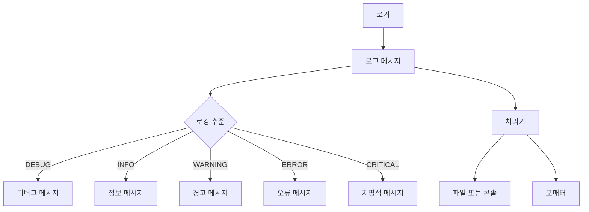
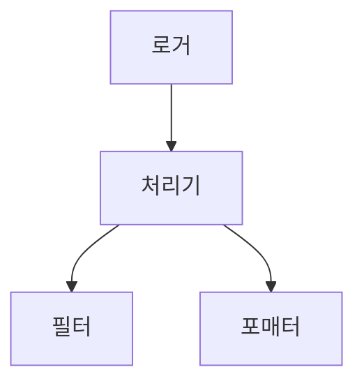
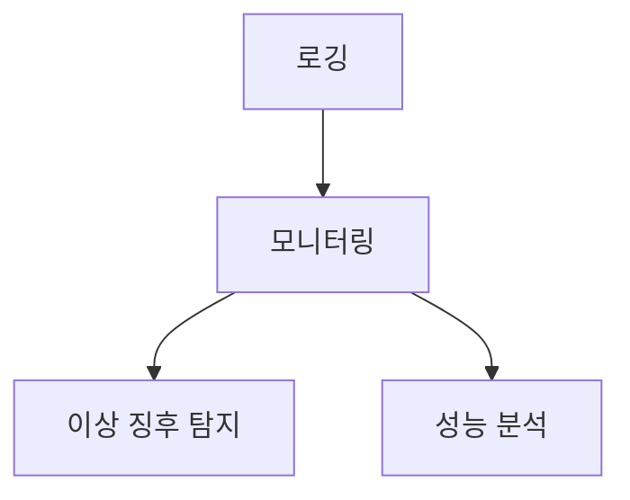
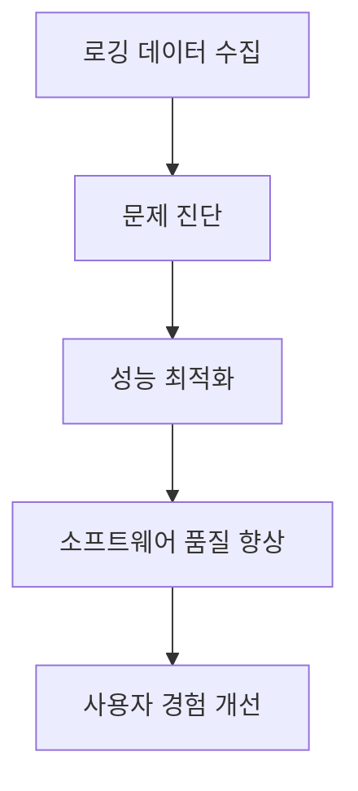
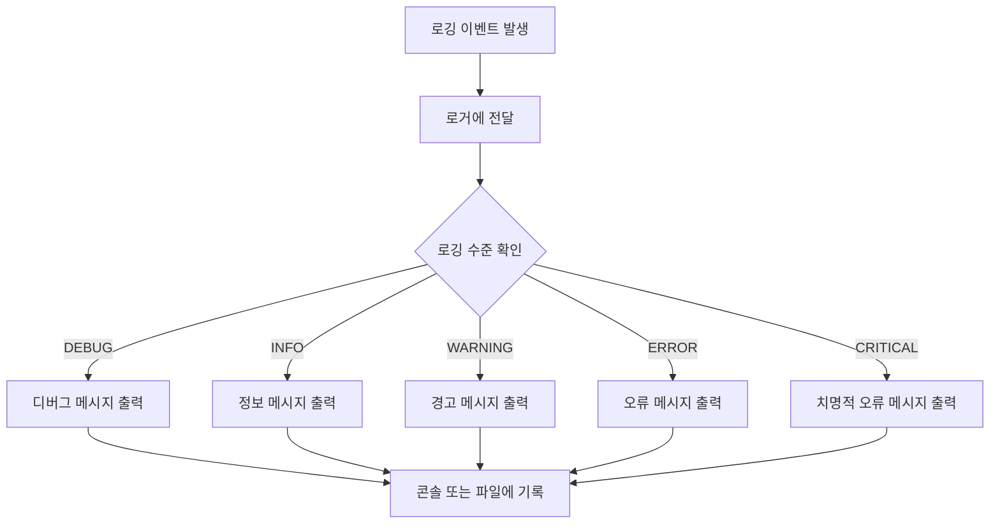

로깅은 소프트웨어 개발에서 필수적인 요소로, 프로그램 실행 중 발생하는 이벤트를 추적·기록하는 데 사용된다. 개발자는 로깅 호출을 추가해 이벤트 발생을 알리며, 메시지와 함께 가변 데이터를 남길 수 있다. 로깅은 오류 추적뿐 아니라 정상 동작 모니터링과 문제 진단에도 핵심적이다. 로깅 수준(DEBUG, INFO, WARNING, ERROR, CRITICAL)으로 중요도를 구분하며, 이 글에서는 Python `logging` 모듈로 로거 생성·설정, 콘솔·파일 출력, 포매터·핸들러 활용까지 기초부터 실무 활용까지 다룬다.

## 개요

로깅은 소프트웨어 개발 및 운영에서 중요한 역할을 하는 기능이다. 이 섹션에서는 로깅의 정의, 중요성, 그리고 기본 개념에 대해 살펴보겠다.

**로깅의 정의**  
로깅은 소프트웨어 애플리케이션에서 발생하는 이벤트, 오류, 상태 변화 등을 기록하는 과정을 의미한다. 이러한 기록은 개발자와 운영자가 시스템의 동작을 이해하고 문제를 해결하는 데 도움을 준다.

**로깅의 중요성**  
로깅은 여러 가지 이유로 중요하다. 첫째, 시스템의 상태를 모니터링하고 문제를 조기에 발견할 수 있도록 돕는다. 둘째, 발생한 오류나 예외를 추적하여 디버깅을 용이하게 한다. 셋째, 시스템의 성능을 분석하고 최적화하는 데 필요한 데이터를 제공한다. 마지막으로, 보안 감사 및 규정 준수를 위한 중요한 정보를 기록하는 데도 사용된다.

**로깅의 기본 개념**  
로깅의 기본 개념은 다음과 같다:

1. **로거(Logger)**: 로깅을 수행하는 주체로, 로그 메시지를 생성하고 기록하는 역할을 한다.
2. **로그 메시지(Log Message)**: 로거가 기록하는 정보로, 이벤트의 종류, 발생 시간, 메시지 내용 등을 포함한다.
3. **로깅 수준(Logging Level)**: 로그 메시지의 중요도를 나타내며, 일반적으로 DEBUG, INFO, WARNING, ERROR, CRITICAL과 같은 수준으로 구분된다.
4. **처리기(Handler)**: 로그 메시지를 저장하는 방법을 정의하며, 콘솔, 파일, 원격 서버 등 다양한 출력 방법을 지원한다.
5. **포매터(Formatter)**: 로그 메시지의 형식을 정의하여, 가독성을 높이고 필요한 정보를 쉽게 파악할 수 있도록 한다.

다음은 로깅의 기본 흐름을 나타내는 다이어그램이다:


```mermaid
graph TD
    Logger["로거"]
    LogMsg["로그 메시지"]
    LevelCheck{"로깅 수준"}
    DebugMsg["디버그 메시지"]
    InfoMsg["정보 메시지"]
    WarnMsg["경고 메시지"]
    ErrMsg["오류 메시지"]
    CritMsg["치명적 메시지"]
    Handler["처리기"]
    FileOrConsole["파일 또는 콘솔"]
    Formatter["포매터"]
    Logger --> LogMsg
    LogMsg --> LevelCheck
    LevelCheck -->|"DEBUG"| DebugMsg
    LevelCheck -->|"INFO"| InfoMsg
    LevelCheck -->|"WARNING"| WarnMsg
    LevelCheck -->|"ERROR"| ErrMsg
    LevelCheck -->|"CRITICAL"| CritMsg
    LogMsg --> Handler
    Handler --> FileOrConsole
    Handler --> Formatter
```

이러한 기본 개념을 이해하면, 로깅을 효과적으로 활용하여 소프트웨어의 품질을 향상시키고 문제를 신속하게 해결할 수 있다. 로깅은 단순한 기록을 넘어, 시스템의 건강 상태를 유지하고 성능을 최적화하는 데 필수적인 요소임을 강조하고 싶다.

## 기초 로깅

로깅은 소프트웨어 개발에서 중요한 역할을 하며, 이를 통해 애플리케이션의 상태를 모니터링하고 문제를 진단할 수 있다. 이번 섹션에서는 기초적인 로깅 사용법과 관련된 내용을 다룰 것이다.

**2.1 로깅을 사용할 때**

로깅을 시작하기 위해서는 먼저 로거를 생성해야 한다. 로거는 로그 메시지를 기록하는 주체로, 다양한 설정을 통해 로그의 출력을 조정할 수 있다. 다음은 로거를 생성하고 사용하는 방법에 대한 간단한 예제이다.

```python
import logging

# 로거 생성
logger = logging.getLogger('my_logger')
logger.setLevel(logging.DEBUG)

# 콘솔 출력 핸들러 추가
console_handler = logging.StreamHandler()
logger.addHandler(console_handler)

# 로그 메시지 기록
logger.debug('디버그 메시지')
logger.info('정보 메시지')
logger.warning('경고 메시지')
logger.error('오류 메시지')
logger.critical('치명적인 메시지')
```

**2.2 로깅 수준**

로깅 수준은 로그 메시지의 중요도를 나타내며, 다양한 수준이 존재한다. 일반적으로 사용되는 로깅 수준은 다음과 같다:

- DEBUG: 디버깅 정보를 나타내는 메시지
- INFO: 일반적인 정보 메시지
- WARNING: 경고 메시지
- ERROR: 오류 메시지
- CRITICAL: 치명적인 오류 메시지

기본 로깅 수준을 설정하는 방법은 다음과 같다.

```python
# 기본 로깅 수준 설정
logging.basicConfig(level=logging.INFO)
```

**2.3 간단한 예제**

로깅을 콘솔과 파일에 기록하는 방법을 살펴보자. 아래의 예제는 콘솔과 파일 모두에 로그 메시지를 기록하는 방법을 보여준다.

```python
import logging

# 로깅 설정
logging.basicConfig(level=logging.DEBUG, 
                    format='%(asctime)s - %(levelname)s - %(message)s',
                    handlers=[
                        logging.StreamHandler(),  # 콘솔 핸들러
                        logging.FileHandler('app.log')  # 파일 핸들러
                    ])

# 로그 메시지 기록
logging.info('애플리케이션 시작')
logging.error('오류 발생')
```

**2.4 변수 데이터 로깅**

가변 데이터를 로깅할 때는 포맷 문자열을 사용하여 로그 메시지를 구성할 수 있다. 이를 통해 동적인 정보를 로그에 포함시킬 수 있다.

```python
user_id = 42
logging.info('사용자 %d가 로그인했습니다.', user_id)
```

**2.5 메시지 포맷 변경**

로그 메시지의 포맷을 변경하여 더 유용한 정보를 제공할 수 있다. 기본 포맷을 설정하고 날짜/시간 표시를 추가하는 방법은 다음과 같다.

```python
# 기본 포맷 설정
logging.basicConfig(format='%(asctime)s - %(levelname)s - %(message)s', 
                    datefmt='%Y-%m-%d %H:%M:%S')

logging.info('애플리케이션 시작')
```

위의 예제에서는 로그 메시지에 날짜와 시간을 포함시켜, 로그를 분석할 때 유용한 정보를 제공한다.

이와 같이 기초 로깅을 통해 애플리케이션의 상태를 효과적으로 모니터링하고, 문제를 진단할 수 있는 기반을 마련할 수 있다. 로깅은 소프트웨어 개발에서 필수적인 요소이며, 이를 잘 활용하는 것이 중요하다.

## 고급 로깅

로깅의 고급 개념은 소프트웨어 개발에서 더욱 효과적이고 유연한 로깅을 가능하게 한다. 이 섹션에서는 로거, 처리기, 필터 및 포매터의 역할과 사용법, 로깅 이벤트의 흐름, 로깅 구성 방법, 그리고 사용자 정의 처리기 및 포매터에 대해 다룰 것이다.

**3.1 로거, 처리기, 필터 및 포매터**

로깅 시스템은 여러 구성 요소로 이루어져 있으며, 각 구성 요소는 특정한 역할을 수행한다. 

- **로거**: 로깅 이벤트를 생성하는 주체로, 로그 메시지를 기록하는 메서드를 제공한다. 로거는 다양한 수준의 로그 메시지를 기록할 수 있다.
  
- **처리기**: 로거가 생성한 로그 메시지를 실제로 출력하는 역할을 한다. 예를 들어, 콘솔에 출력하거나 파일에 저장하는 등의 작업을 수행한다.

- **필터**: 로깅 이벤트가 처리기까지 도달하기 전에 필터링하는 역할을 한다. 특정 조건에 맞는 로그 메시지만을 처리하도록 설정할 수 있다.

- **포매터**: 로그 메시지의 형식을 정의하는 역할을 한다. 로그 메시지의 출력 형식을 사용자 정의할 수 있다.

다음은 로거, 처리기, 필터 및 포매터의 관계를 나타내는 다이어그램이다.


```mermaid
graph TD
    LoggerNode["로거"]
    HandlerNode["처리기"]
    FilterNode["필터"]
    FormatterNode["포매터"]
    LoggerNode --> HandlerNode
    HandlerNode --> FilterNode
    HandlerNode --> FormatterNode
```

**3.2 로깅 흐름**

로깅 이벤트의 흐름은 다음과 같은 단계로 이루어진다. 

1. **로거 생성**: 개발자는 로거를 생성하고 로그 메시지를 기록한다.
2. **로그 메시지 생성**: 로거는 로그 메시지를 생성하고, 설정된 로깅 수준에 따라 메시지를 필터링한다.
3. **처리기 전달**: 필터링된 로그 메시지는 처리기로 전달된다.
4. **출력**: 처리기는 로그 메시지를 지정된 출력 대상으로 전달한다.

이러한 흐름을 통해 로그 메시지는 효율적으로 관리되고, 필요한 정보만을 기록할 수 있다.

**3.3 로깅 구성**

로깅 구성은 로깅 시스템의 동작 방식을 설정하는 과정이다. 로깅 구성 방법에는 두 가지 주요 방식이 있다.

- **구성 파일**: XML, JSON 또는 YAML 형식의 파일을 사용하여 로깅 설정을 정의할 수 있다. 이 방법은 설정을 외부 파일로 관리할 수 있어 유연성을 제공한다.

- **딕셔너리 기반 구성**: 파이썬의 딕셔너리를 사용하여 로깅 구성을 직접 코드 내에서 정의할 수 있다. 이 방법은 코드와 설정을 함께 관리할 수 있는 장점이 있다.

다음은 딕셔너리 기반 로깅 구성의 예시 코드이다.

```python
import logging
import logging.config

# 딕셔너리 기반 로깅 구성
logging_config = {
    'version': 1,
    'disable_existing_loggers': False,
    'formatters': {
        'simple': {
            'format': '%(asctime)s - %(name)s - %(levelname)s - %(message)s'
        },
    },
    'handlers': {
        'console': {
            'class': 'logging.StreamHandler',
            'formatter': 'simple',
        },
    },
    'loggers': {
        'my_logger': {
            'handlers': ['console'],
            'level': 'DEBUG',
        },
    },
}

logging.config.dictConfig(logging_config)
logger = logging.getLogger('my_logger')
logger.debug('This is a debug message')
```

**3.4 사용자 정의 처리기 및 포매터**

사용자 정의 처리기와 포매터를 작성하면 로깅 시스템을 더욱 유연하게 사용할 수 있다. 

- **사용자 정의 처리기**: 기본 제공되는 처리기 외에, 특정 요구 사항에 맞는 처리기를 작성할 수 있다. 예를 들어, 로그 메시지를 데이터베이스에 저장하는 처리기를 만들 수 있다.

- **포매터의 커스터마이징**: 기본 포매터를 상속받아 새로운 포매터를 작성할 수 있다. 이를 통해 로그 메시지의 형식을 자유롭게 변경할 수 있다.

다음은 사용자 정의 처리기의 예시 코드이다.

```python
import logging

class CustomHandler(logging.Handler):
    def emit(self, record):
        log_entry = self.format(record)
        # 로그 메시지를 데이터베이스에 저장하는 로직을 추가할 수 있다.
        print(f"Custom log entry: {log_entry}")

# 사용자 정의 처리기 사용 예
logger = logging.getLogger('custom_logger')
custom_handler = CustomHandler()
custom_handler.setFormatter(logging.Formatter('%(asctime)s - %(levelname)s - %(message)s'))
logger.addHandler(custom_handler)
logger.setLevel(logging.DEBUG)

logger.debug('This is a custom log message')
```

이와 같이 고급 로깅 개념을 이해하고 활용하면, 소프트웨어의 로깅 시스템을 더욱 효과적으로 관리할 수 있다.

## 예제

로깅을 효과적으로 이해하기 위해서는 실제 예제를 통해 학습하는 것이 중요하다. 이 섹션에서는 기본 로깅 예제부터 파일 로깅, 사용자 정의 로깅 구성, 다양한 로깅 수준을 사용하는 예제까지 다양한 사례를 다룰 것이다.

**4.1 기본 로깅 예제**

기본 로깅을 설정하는 방법은 매우 간단하다. Python의 `logging` 모듈을 사용하여 기본적인 로깅을 구현할 수 있다. 아래는 간단한 로깅 예제이다.

```python
import logging

# 기본 로깅 설정
logging.basicConfig(level=logging.DEBUG)

# 로깅 메시지
logging.debug("디버그 메시지입니다.")
logging.info("정보 메시지입니다.")
logging.warning("경고 메시지입니다.")
logging.error("오류 메시지입니다.")
logging.critical("치명적인 메시지입니다.")
```

위 코드를 실행하면 콘솔에 각 로깅 수준에 맞는 메시지가 출력된다. 기본적으로 `DEBUG` 수준으로 설정되어 있어 모든 메시지가 출력된다.

**4.2 파일 로깅 예제**

로깅 메시지를 파일에 저장하는 방법도 매우 유용하다. 아래는 파일에 로깅하는 예제이다.

```python
import logging

# 파일 로깅 설정
logging.basicConfig(filename='app.log', level=logging.DEBUG)

# 로깅 메시지
logging.debug("디버그 메시지입니다.")
logging.info("정보 메시지입니다.")
logging.warning("경고 메시지입니다.")
logging.error("오류 메시지입니다.")
logging.critical("치명적인 메시지입니다.")
```

위 코드를 실행하면 `app.log`라는 파일에 로깅 메시지가 저장된다. 이 파일을 열어보면 각 로깅 수준에 맞는 메시지를 확인할 수 있다.

**4.3 사용자 정의 로깅 구성 예제**

사용자 정의 로깅 구성을 통해 더 세밀한 로깅을 구현할 수 있다. 아래는 사용자 정의 로거와 핸들러를 설정하는 예제이다.

```python
import logging

# 사용자 정의 로거 생성
logger = logging.getLogger('my_logger')
logger.setLevel(logging.DEBUG)

# 콘솔 핸들러 생성
console_handler = logging.StreamHandler()
console_handler.setLevel(logging.INFO)

# 파일 핸들러 생성
file_handler = logging.FileHandler('my_log.log')
file_handler.setLevel(logging.DEBUG)

# 포매터 설정
formatter = logging.Formatter('%(asctime)s - %(name)s - %(levelname)s - %(message)s')
console_handler.setFormatter(formatter)
file_handler.setFormatter(formatter)

# 핸들러 추가
logger.addHandler(console_handler)
logger.addHandler(file_handler)

# 로깅 메시지
logger.debug("디버그 메시지입니다.")
logger.info("정보 메시지입니다.")
logger.warning("경고 메시지입니다.")
logger.error("오류 메시지입니다.")
logger.critical("치명적인 메시지입니다.")
```

위 코드를 실행하면 콘솔에는 `INFO` 수준 이상의 메시지가 출력되고, `my_log.log` 파일에는 모든 메시지가 기록된다.

**4.4 다양한 로깅 수준을 사용하는 예제**

로깅 수준을 적절히 활용하면 애플리케이션의 상태를 효과적으로 모니터링할 수 있다. 아래는 다양한 로깅 수준을 사용하는 예제이다.

```python
import logging

# 기본 로깅 설정
logging.basicConfig(level=logging.DEBUG)

# 다양한 로깅 수준 사용
def divide(a, b):
    logging.debug(f"divide 함수 호출: a={a}, b={b}")
    if b == 0:
        logging.error("0으로 나눌 수 없습니다.")
        return None
    return a / b

result = divide(10, 0)
if result is None:
    logging.warning("결과가 None입니다.")
else:
    logging.info(f"결과: {result}")
```

위 코드는 나눗셈을 수행하는 함수에서 다양한 로깅 수준을 사용하여 상태를 기록한다. `DEBUG` 수준으로 함수 호출을 기록하고, `ERROR` 수준으로 오류를 기록하며, `WARNING` 수준으로 결과가 `None`인 경우를 처리한다.

이와 같은 예제를 통해 로깅의 기본적인 사용법과 다양한 활용 방법을 이해할 수 있다. 로깅은 소프트웨어 개발에서 중요한 역할을 하며, 이를 통해 애플리케이션의 상태를 효과적으로 모니터링하고 문제를 해결할 수 있다.

## FAQ

**로깅이 필요한 이유는 무엇인가요?**  
로깅은 소프트웨어 개발 및 운영에서 매우 중요한 역할을 한다. 로깅을 통해 애플리케이션의 상태를 모니터링하고, 오류를 추적하며, 성능을 분석할 수 있다. 또한, 로깅은 문제 발생 시 원인을 파악하는 데 도움을 주며, 사용자 행동을 이해하는 데도 유용하다. 이러한 정보는 소프트웨어의 품질을 향상시키고, 유지보수 비용을 절감하는 데 기여한다.

**로깅 수준을 어떻게 설정하나요?**  
로깅 수준은 로깅 메시지의 중요도를 나타내며, 일반적으로 다음과 같은 수준이 있다: DEBUG, INFO, WARNING, ERROR, CRITICAL. 로깅 수준을 설정하는 방법은 다음과 같다.

```python
import logging

# 로깅 수준 설정
logging.basicConfig(level=logging.INFO)

# 로깅 메시지
logging.debug("디버그 메시지")  # 출력되지 않음
logging.info("정보 메시지")      # 출력됨
logging.warning("경고 메시지")   # 출력됨
logging.error("오류 메시지")     # 출력됨
logging.critical("치명적 메시지") # 출력됨
```

**로깅 메시지를 파일에 저장하는 방법은?**  
로깅 메시지를 파일에 저장하려면, `FileHandler`를 사용하여 로거를 설정하면 된다. 아래는 파일에 로깅하는 예제이다.

```python
import logging

# 파일 핸들러 설정
logging.basicConfig(filename='app.log', level=logging.INFO)

# 로깅 메시지
logging.info("파일에 기록된 정보 메시지")
```

**로깅 구성 파일을 어떻게 작성하나요?**  
로깅 구성 파일은 INI 형식으로 작성할 수 있으며, 로깅의 다양한 설정을 포함할 수 있다. 아래는 간단한 구성 파일 예제이다.

```ini
[loggers]
keys=root,sampleLogger

[handlers]
keys=consoleHandler,fileHandler

[formatters]
keys=sampleFormatter

[logger_root]
level=DEBUG
handlers=consoleHandler

[logger_sampleLogger]
level=INFO
handlers=fileHandler
qualname=sampleLogger
propagate=0

[handler_consoleHandler]
class=StreamHandler
level=DEBUG
formatter=sampleFormatter
args=

[handler_fileHandler]
class=FileHandler
level=INFO
formatter=sampleFormatter
args=['app.log', 'a']

[formatter_sampleFormatter]
format=%(asctime)s - %(name)s - %(levelname)s - %(message)s
datefmt=%Y-%m-%d %H:%M:%S
```

**NullHandler는 무엇인가요?**  
`NullHandler`는 로깅 메시지를 처리하지 않는 핸들러이다. 주로 라이브러리에서 사용되며, 사용자가 로깅을 설정하지 않았을 때 발생할 수 있는 오류를 방지하는 데 유용하다. 아래는 `NullHandler`의 사용 예제이다.

```python
import logging

# NullHandler 설정
logger = logging.getLogger('my_logger')
logger.addHandler(logging.NullHandler())

# 로깅 메시지
logger.info("이 메시지는 출력되지 않음")
```

이와 같이 `NullHandler`를 사용하면, 로깅 설정이 없는 경우에도 오류 없이 애플리케이션이 실행될 수 있다.

## 관련 기술

로깅은 소프트웨어 개발 및 운영에서 중요한 역할을 하며, 여러 기술과 밀접하게 연관되어 있다. 이 섹션에서는 로깅과 관련된 몇 가지 주요 기술에 대해 살펴보겠다.

**로깅과 모니터링**  
로깅은 시스템의 상태와 동작을 기록하는 반면, 모니터링은 이러한 로그 데이터를 실시간으로 분석하여 시스템의 성능과 안정성을 평가하는 과정이다. 로깅을 통해 수집된 데이터는 모니터링 도구에 의해 분석되어, 이상 징후를 조기에 발견하고 대응할 수 있도록 돕는다. 예를 들어, 특정 로깅 수준의 메시지를 모니터링하여 시스템의 성능 저하를 감지할 수 있다.


```mermaid
graph TD
    LoggingNode["로깅"]
    MonitoringNode["모니터링"]
    AnomalyNode["이상 징후 탐지"]
    PerfNode["성능 분석"]
    LoggingNode --> MonitoringNode
    MonitoringNode --> AnomalyNode
    MonitoringNode --> PerfNode
```

**로깅과 디버깅**  
디버깅 과정에서 로깅은 매우 유용한 도구로 작용한다. 코드의 실행 흐름을 추적하고, 변수의 상태를 기록함으로써 문제의 원인을 파악하는 데 도움을 준다. 로깅을 통해 개발자는 코드의 특정 지점에서 발생하는 오류를 쉽게 추적할 수 있으며, 이를 통해 디버깅 시간을 단축할 수 있다. 예를 들어, 다음과 같은 로깅 코드를 사용하여 함수의 실행 흐름을 기록할 수 있다.

```python
import logging

logging.basicConfig(level=logging.DEBUG)

def example_function(x):
    logging.debug(f"example_function called with x={x}")
    return x * 2

result = example_function(5)
```

**로깅과 성능 최적화**  
로깅은 성능 최적화에도 중요한 역할을 한다. 적절한 로깅 수준과 전략을 사용하면, 시스템의 성능을 저하시키지 않으면서도 필요한 정보를 수집할 수 있다. 예를 들어, 디버깅 정보를 로깅할 때는 개발 환경에서만 활성화하고, 운영 환경에서는 경고나 오류 수준의 로그만 기록하도록 설정할 수 있다. 이를 통해 불필요한 로그 기록을 줄이고, 성능을 최적화할 수 있다.

**로깅과 보안**  
로깅은 보안 측면에서도 중요한 역할을 한다. 시스템에서 발생하는 모든 이벤트를 기록함으로써, 보안 사고 발생 시 원인을 분석하고 대응할 수 있는 기반을 제공한다. 예를 들어, 로그인 시도, 데이터 접근, 시스템 변경 등의 이벤트를 로깅하여, 비정상적인 활동을 감지하고 대응할 수 있다. 다음은 보안 관련 로그를 기록하는 예시 코드이다.

```python
import logging

logging.basicConfig(filename='security.log', level=logging.WARNING)

def log_security_event(event):
    logging.warning(f"Security event: {event}")

log_security_event("Unauthorized access attempt detected.")
```

이와 같이 로깅은 모니터링, 디버깅, 성능 최적화, 보안 등 다양한 기술과 연관되어 있으며, 소프트웨어 개발 및 운영에서 필수적인 요소로 자리 잡고 있다. 로깅을 효과적으로 활용하면 시스템의 안정성과 성능을 높일 수 있다.

## 결론

로깅은 소프트웨어 개발 및 운영에서 매우 중요한 역할을 한다. 이번 자습서를 통해 로깅의 기본 개념부터 고급 기법까지 살펴보았으며, 이를 통해 로깅의 중요성을 다시 한번 강조하고자 한다.

**로깅의 중요성 재강조**  
로깅은 시스템의 상태를 모니터링하고, 문제를 진단하며, 성능을 최적화하는 데 필수적이다. 적절한 로깅을 통해 개발자는 애플리케이션의 동작을 이해하고, 사용자 경험을 개선할 수 있다. 또한, 로깅은 보안 감사 및 규정 준수에도 중요한 역할을 한다. 

**로깅을 통한 소프트웨어 품질 향상**  
효과적인 로깅은 소프트웨어 품질을 향상시키는 데 기여한다. 로깅을 통해 발생하는 오류나 예외를 신속하게 파악하고, 이를 해결함으로써 시스템의 안정성을 높일 수 있다. 또한, 로깅 데이터를 분석하여 성능 병목 현상을 발견하고, 이를 개선하는 데 활용할 수 있다. 

다음은 로깅을 통한 품질 향상의 흐름을 나타낸 다이어그램이다.


```mermaid
graph TD
    CollectNode["로깅 데이터 수집"]
    DiagnoseNode["문제 진단"]
    OptimizeNode["성능 최적화"]
    QualityNode["소프트웨어 품질 향상"]
    UXNode["사용자 경험 개선"]
    CollectNode --> DiagnoseNode
    DiagnoseNode --> OptimizeNode
    OptimizeNode --> QualityNode
    QualityNode --> UXNode
```

**다음 단계: 고급 로깅 기법 탐색**  
이번 자습서를 통해 기초적인 로깅 기법을 익혔다면, 다음 단계로 고급 로깅 기법을 탐색하는 것이 좋다. 사용자 정의 처리기 및 포매터, 로깅 구성 파일 작성, 그리고 다양한 로깅 수준을 활용하는 방법 등을 학습함으로써 더욱 효과적인 로깅 전략을 수립할 수 있다. 

로깅은 단순한 디버깅 도구가 아니라, 소프트웨어의 품질과 안정성을 높이는 중요한 요소임을 잊지 말아야 한다. 앞으로도 로깅을 통해 소프트웨어 개발의 모든 단계에서 품질을 향상시키는 데 기여할 수 있기를 바란다.

## 추가 자료

로깅에 대한 이해를 더욱 깊이 있게 하기 위해 유용한 자료를 소개하고자 한다. 이 자료들은 로깅 관련 문서, 추천 도서, 온라인 강좌, 그리고 커뮤니티 및 포럼 정보를 포함하고 있다.

**로깅 관련 문서 및 자료**  
로깅의 기초부터 고급 개념까지 다음 공식·권장 자료로 학습할 수 있다.

- [Python Logging HOWTO (한국어)](https://docs.python.org/ko/3/howto/logging.html): 공식 기초·고급 로깅 자습서(한글).
- [logging — Python 공식 라이브러리 문서](https://docs.python.org/3/library/logging.html): 로깅 API 레퍼런스.
- [Logging in Python (Real Python)](https://realpython.com/python-logging/): 실습 중심 로깅 튜토리얼.

**커뮤니티**  
- [Stack Overflow](https://stackoverflow.com/questions/tagged/python+logging): Python logging 태그 질문·답변.
- [r/Python](https://www.reddit.com/r/Python/): 파이썬 커뮤니티에서 로깅 관련 논의 공유.

다음은 로깅의 흐름을 시각적으로 나타낸 다이어그램이다.


```mermaid
graph TD
    EventNode["로깅 이벤트 발생"]
    ToLogger["로거에 전달"]
    LevelChk{"로깅 수준 확인"}
    OutDebug["디버그 메시지 출력"]
    OutInfo["정보 메시지 출력"]
    OutWarn["경고 메시지 출력"]
    OutErr["오류 메시지 출력"]
    OutCrit["치명적 오류 메시지 출력"]
    SinkNode["콘솔 또는 파일에 기록"]
    EventNode --> ToLogger
    ToLogger --> LevelChk
    LevelChk -->|"DEBUG"| OutDebug
    LevelChk -->|"INFO"| OutInfo
    LevelChk -->|"WARNING"| OutWarn
    LevelChk -->|"ERROR"| OutErr
    LevelChk -->|"CRITICAL"| OutCrit
    OutDebug --> SinkNode
    OutInfo --> SinkNode
    OutWarn --> SinkNode
    OutErr --> SinkNode
    OutCrit --> SinkNode
```

이 자료들을 통해 로깅에 대한 이해를 더욱 깊이 있게 할 수 있을 것이다. 로깅은 소프트웨어 개발에서 중요한 역할을 하므로, 지속적으로 학습하고 활용하는 것이 필요하다.

## Reference

1. [로깅 HOWTO — Python 3 문서 (한국어)](https://docs.python.org/ko/3/howto/logging.html)  
   기초·고급 로깅 자습서, 로거·처리기·포매터·구성 방법.
2. [logging — Logging facility for Python](https://docs.python.org/3/library/logging.html)  
   공식 logging 모듈 API 레퍼런스.
3. [Logging in Python – Real Python](https://realpython.com/python-logging/)  
   실습 중심 로깅 튜토리얼 및 베스트 프랙티스.
