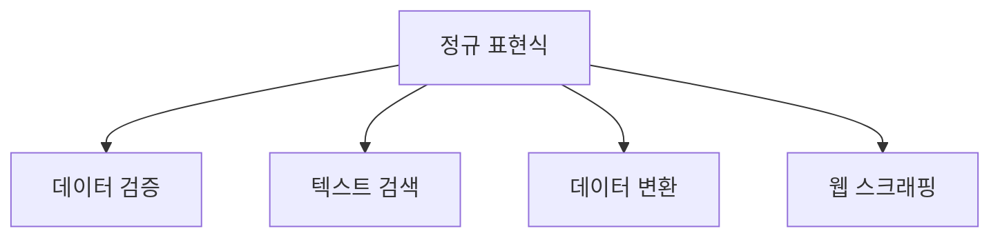
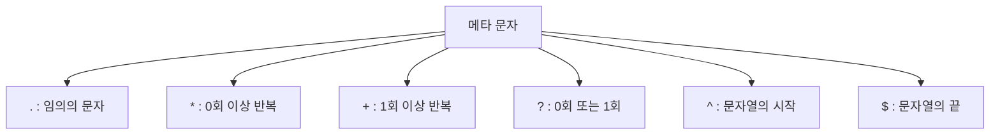
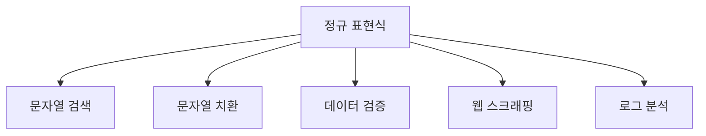
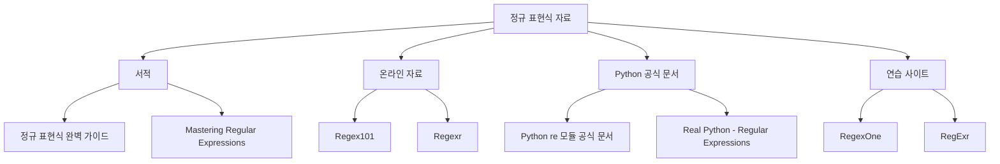

정규식(정규 표현식)은 문자열에서 특정 패턴을 찾고 조작하는 데 사용되는 강력한 도구이다. 파이썬에서는 `re` 모듈을 통해 정규식을 사용할 수 있으며, 이를 통해 문자열 검색, 치환, 분할 등의 작업을 수행할 수 있다. 정규식의 기본 구성 요소는 메타 문자로, 이들은 문자열의 특정 규칙을 정의하는 데 사용된다. 예를 들어, `.`는 줄바꿈 문자를 제외한 모든 문자와 일치하며, `*`는 앞의 문자가 0회 이상 반복될 수 있음을 나타낸다. 또한, `[]`를 사용하여 문자 클래스(특정 문자 집합)를 정의할 수 있으며, `^`와 `$`는 각각 문자열의 시작과 끝을 나타낸다. 이러한 메타 문자를 조합하여 복잡한 패턴을 만들 수 있으며, 이를 통해 다양한 문자열 처리 작업을 효율적으로 수행할 수 있다. 정규식은 데이터 처리, 텍스트 분석, 웹 스크래핑 등 여러 분야에서 유용하게 사용되며, 그 활용도는 매우 넓다. 정규식을 잘 활용하면 코드의 가독성과 효율성을 높일 수 있다.


||
|:---:|
||


<!--
##### Outline #####
-->

<!--
# 정규 표현식(Regular Expressions) 블로그 목차

## 1. 개요
   - 정규 표현식의 정의
   - 정규 표현식의 필요성 및 활용 분야

## 2. 정규 표현식의 기초
   - 2.1 메타 문자
     - 2.1.1 문자 클래스([ ])
     - 2.1.2 Dot(.) 문자
     - 2.1.3 반복(*, +, ?)
     - 2.1.4 반복 횟수 지정({m,n})
     - 2.1.5 OR 연산자(|)
     - 2.1.6 문자열의 시작(^)과 끝($)
     - 2.1.7 단어 경계(\b)와 비단어 경계(\B)
   - 2.2 특수 시퀀스
     - 2.2.1 \d, \D, \w, \W, \s, \S
     - 2.2.2 \A, \Z

## 3. 정규 표현식의 활용
   - 3.1 Python의 re 모듈
     - 3.1.1 re 모듈의 기본 함수
       - match()
       - search()
       - findall()
       - finditer()
       - sub()
     - 3.1.2 정규 표현식 컴파일
   - 3.2 정규 표현식의 예제
     - 3.2.1 이메일 주소 찾기
     - 3.2.2 전화번호 찾기
     - 3.2.3 특정 패턴의 문자열 치환
   - 3.3 정규 표현식의 고급 기능
     - 3.3.1 그룹화 및 이름 붙이기
     - 3.3.2 역참조
     - 3.3.3 전방 탐색 및 후방 탐색

## 4. 정규 표현식의 최적화
   - 4.1 그리디 vs 비 그리디
   - 4.2 성능 최적화 기법

## 5. 정규 표현식의 일반적인 문제
   - 5.1 문자열 메서드와 정규 표현식의 비교
   - 5.2 백슬래시 문제와 Raw String 사용법
   - 5.3 정규 표현식의 가독성 향상 방법

## 6. FAQ
   - 정규 표현식이란 무엇인가요?
   - 정규 표현식은 어떻게 사용하나요?
   - 정규 표현식의 성능을 최적화하는 방법은 무엇인가요?
   - 정규 표현식에서 메타 문자는 무엇인가요?
   - Python에서 정규 표현식을 사용할 때 주의할 점은 무엇인가요?

## 7. 관련 기술
   - 정규 표현식과 문자열 처리
   - 정규 표현식과 데이터 검증
   - 정규 표현식과 웹 스크래핑

## 8. 결론
   - 정규 표현식의 중요성 요약
   - 정규 표현식의 미래와 발전 방향

## 9. 참고 자료
   - 정규 표현식 관련 서적 및 온라인 자료
   - Python 공식 문서 및 튜토리얼
   - 정규 표현식 연습 사이트 및 도구

이 목차는 정규 표현식에 대한 포괄적인 이해를 돕고, 관련된 다양한 주제를 다루어 독자가 정규 표현식을 효과적으로 활용할 수 있도록 구성되었습니다.
-->

<!--
## 1. 개요
   - 정규 표현식의 정의
   - 정규 표현식의 필요성 및 활용 분야
-->

## 1. 개요

**정규 표현식의 정의**  

정규 표현식(Regular Expression, 줄여서 regex)은 문자열에서 특정 패턴을 찾거나, 대체하거나, 검증하는 데 사용되는 강력한 도구이다. 정규 표현식은 문자, 숫자, 기호 등 다양한 문자 조합을 사용하여 복잡한 검색 조건을 정의할 수 있다. 이러한 패턴은 텍스트 데이터의 처리 및 분석에 매우 유용하다.

정규 표현식은 다양한 프로그래밍 언어에서 지원되며, 각 언어마다 약간의 문법 차이가 있을 수 있지만 기본적인 개념은 동일하다. 예를 들어, Python, JavaScript, Java, Perl 등에서 정규 표현식을 사용할 수 있다.

**정규 표현식의 필요성 및 활용 분야**  

정규 표현식은 다음과 같은 여러 분야에서 필요하다:

1. **데이터 검증**: 사용자 입력 데이터가 특정 형식(예: 이메일 주소, 전화번호 등)을 따르는지 확인하는 데 사용된다.
2. **텍스트 검색**: 대량의 텍스트 데이터에서 특정 패턴을 찾아내는 데 유용하다. 예를 들어, 로그 파일에서 특정 오류 메시지를 검색할 수 있다.
3. **데이터 변환 및 치환**: 문자열 내에서 특정 패턴을 찾아 다른 문자열로 대체하는 작업에 사용된다. 예를 들어, 특정 형식의 날짜를 다른 형식으로 변환할 수 있다.
4. **웹 스크래핑**: 웹 페이지에서 필요한 정보를 추출하는 데 사용된다. HTML 문서에서 특정 태그나 속성을 찾는 데 유용하다.

정규 표현식은 이러한 다양한 활용 분야 덕분에 데이터 처리 및 분석 작업에서 필수적인 도구로 자리 잡고 있다.



위의 다이어그램은 정규 표현식이 활용되는 다양한 분야를 시각적으로 나타낸 것이다. 정규 표현식은 이러한 분야에서 강력한 도구로 사용되며, 데이터 처리의 효율성을 높이는 데 기여한다.

<!--
## 2. 정규 표현식의 기초
   - 2.1 메타 문자
     - 2.1.1 문자 클래스([ ])
     - 2.1.2 Dot(.) 문자
     - 2.1.3 반복(*, +, ?)
     - 2.1.4 반복 횟수 지정({m,n})
     - 2.1.5 OR 연산자(|)
     - 2.1.6 문자열의 시작(^)과 끝($)
     - 2.1.7 단어 경계(\b)와 비단어 경계(\B)
   - 2.2 특수 시퀀스
     - 2.2.1 \d, \D, \w, \W, \s, \S
     - 2.2.2 \A, \Z
-->

## 2. 정규 표현식의 기초

정규 표현식의 기초는 메타 문자와 특수 시퀀스를 이해하는 것에서 시작된다. 이 두 가지 요소는 정규 표현식의 강력한 기능을 가능하게 하며, 다양한 문자열 패턴을 효과적으로 처리할 수 있도록 돕는다.

### **2.1 메타 문자**

메타 문자는 정규 표현식에서 특별한 의미를 가지는 문자들이다. 이들은 문자열을 검색하거나 조작하는 데 사용된다.

#### **2.1.1 문자 클래스([ ])**

문자 클래스는 대괄호 안에 포함된 문자 중 하나와 일치하는 패턴을 정의한다. 예를 들어, `[abc]`는 'a', 'b', 또는 'c' 중 하나와 일치한다.

```python
import re

pattern = r'[abc]'
text = "apple banana cherry"
matches = re.findall(pattern, text)
print(matches)  # ['a', 'b', 'a', 'a', 'a', 'c']
```

#### **2.1.2 Dot(.) 문자**

Dot(.) 문자는 임의의 단일 문자와 일치한다. 예를 들어, `a.b`는 'a'와 'b' 사이에 어떤 문자든 올 수 있음을 의미한다.

```python
import re

pattern = r'a.b'
text = "a1b a2b a3b"
matches = re.findall(pattern, text)
print(matches)  # ['a1b', 'a2b', 'a3b']
```

#### **2.1.3 반복(*, +, ?)**

- `*`는 0회 이상 반복을 의미한다.
- `+`는 1회 이상 반복을 의미한다.
- `?`는 0회 또는 1회 발생을 의미한다.

```python
import re

pattern = r'a*'
text = "aaa bbb a c"
matches = re.findall(pattern, text)
print(matches)  # ['aaa', '', '', '', '', '', 'a', '', '', '']
```

#### **2.1.4 반복 횟수 지정({m,n})**

중괄호를 사용하여 특정 횟수만큼 반복할 수 있다. `{m,n}`은 최소 m회, 최대 n회 반복을 의미한다.

```python
import re

pattern = r'a{2,4}'
text = "aa aaaa aaaaa"
matches = re.findall(pattern, text)
print(matches)  # ['aa', 'aaaa', 'aaaa']
```

#### **2.1.5 OR 연산자(|)**

OR 연산자는 여러 패턴 중 하나와 일치하는 경우를 정의한다. 예를 들어, `a|b`는 'a' 또는 'b'와 일치한다.

```python
import re

pattern = r'a|b'
text = "apple banana"
matches = re.findall(pattern, text)
print(matches)  # ['a', 'b', 'a', 'a', 'a']
```

#### **2.1.6 문자열의 시작(^)과 끝($)**

- `^`는 문자열의 시작을 의미한다.
- `$`는 문자열의 끝을 의미한다.

```python
import re

pattern = r'^a.*b$'
text = "apple banana"
matches = re.findall(pattern, text)
print(matches)  # []
```

#### **2.1.7 단어 경계(\b)와 비단어 경계(\B)**

- `\b`는 단어의 경계를 의미한다.
- `\B`는 비단어 경계를 의미한다.

```python
import re

pattern = r'\bapple\b'
text = "apple banana applepie"
matches = re.findall(pattern, text)
print(matches)  #['apple']
```

### **2.2 특수 시퀀스**

특수 시퀀스는 정규 표현식에서 자주 사용되는 패턴을 간단하게 표현할 수 있도록 돕는다.

#### **2.2.1 \d, \D, \w, \W, \s, \S**

- `\d`: 숫자와 일치 (0-9)
- `\D`: 숫자가 아닌 것과 일치
- `\w`: 알파벳, 숫자, 언더스코어와 일치
- `\W`: 알파벳, 숫자, 언더스코어가 아닌 것과 일치
- `\s`: 공백 문자와 일치
- `\S`: 공백 문자가 아닌 것과 일치

```python
import re

pattern = r'\d+'
text = "There are 2 apples and 3 bananas."
matches = re.findall(pattern, text)
print(matches)  # ['2', '3']
```

#### **2.2.2 \A, \Z**

- `\A`: 문자열의 시작과 일치
- `\Z`: 문자열의 끝과 일치

```python
import re

pattern = r'\AHello'
text = "Hello, world!"
matches = re.findall(pattern, text)
print(matches)  # ['Hello']
```

이와 같이 정규 표현식의 기초를 이해하면, 문자열을 효과적으로 검색하고 조작할 수 있는 강력한 도구를 갖추게 된다. 정규 표현식은 다양한 프로그래밍 언어에서 지원되며, 특히 Python의 `re` 모듈을 통해 쉽게 활용할 수 있다.

<!--
## 3. 정규 표현식의 활용
   - 3.1 Python의 re 모듈
     - 3.1.1 re 모듈의 기본 함수
       - match()
       - search()
       - findall()
       - finditer()
       - sub()
     - 3.1.2 정규 표현식 컴파일
   - 3.2 정규 표현식의 예제
     - 3.2.1 이메일 주소 찾기
     - 3.2.2 전화번호 찾기
     - 3.2.3 특정 패턴의 문자열 치환
   - 3.3 정규 표현식의 고급 기능
     - 3.3.1 그룹화 및 이름 붙이기
     - 3.3.2 역참조
     - 3.3.3 전방 탐색 및 후방 탐색
-->

## 3. 정규 표현식의 활용

정규 표현식은 문자열 검색 및 조작에 매우 유용한 도구이다. 이 섹션에서는 Python의 `re` 모듈을 활용하여 정규 표현식을 사용하는 방법과 다양한 예제, 그리고 고급 기능에 대해 알아보겠다.

**3.1 Python의 re 모듈**

Python에서 정규 표현식을 사용하기 위해서는 `re` 모듈을 임포트해야 한다. 이 모듈은 정규 표현식의 다양한 기능을 제공하며, 문자열 검색 및 치환 작업을 쉽게 수행할 수 있도록 돕는다.

**3.1.1 re 모듈의 기본 함수**

- **match()**: 문자열의 시작 부분에서 정규 표현식과 일치하는지 검사한다.
  
  ```python
  import re

  pattern = r'\d+'  # 하나 이상의 숫자
  result = re.match(pattern, '123abc')
  print(result.group())  # 출력: 123
  ```

- **search()**: 문자열 내에서 정규 표현식과 일치하는 첫 번째 위치를 찾는다.
  
  ```python
  import re

  pattern = r'\d+'  # 하나 이상의 숫자
  result = re.search(pattern, 'abc123def')
  print(result.group())  # 출력: 123
  ```

- **findall()**: 문자열 내에서 정규 표현식과 일치하는 모든 부분을 리스트로 반환한다.
  
  ```python
  import re

  pattern = r'\d+'  # 하나 이상의 숫자
  result = re.findall(pattern, 'abc123def456ghi')
  print(result)  # 출력: ['123', '456']
  ```

- **finditer()**: 문자열 내에서 정규 표현식과 일치하는 모든 부분을 반복 가능한 객체로 반환한다.
  
  ```python
  import re

  pattern = r'\d+'  # 하나 이상의 숫자
  result = re.finditer(pattern, 'abc123def456ghi')
  for match in result:
      print(match.group())  # 출력: 123, 456
  ```

- **sub()**: 정규 표현식과 일치하는 부분을 다른 문자열로 치환한다.
  
  ```python
  import re

  pattern = r'\d+'  # 하나 이상의 숫자
  result = re.sub(pattern, 'NUM', 'abc123def456ghi')
  print(result)  # 출력: abcNUMdefNUMghi
  ```

**3.1.2 정규 표현식 컴파일**

정규 표현식을 자주 사용할 경우, `re.compile()` 함수를 사용하여 정규 표현식을 미리 컴파일할 수 있다. 이렇게 하면 성능이 향상된다.

```python
import re

pattern = re.compile(r'\d+')
result = pattern.findall('abc123def456ghi')
print(result)  # 출력: ['123', '456']
```

**3.2 정규 표현식의 예제**

정규 표현식을 활용하여 다양한 문자열 패턴을 찾는 예제를 살펴보겠다.

**3.2.1 이메일 주소 찾기**

이메일 주소를 찾기 위한 정규 표현식은 다음과 같다.

```python
import re

email_pattern = r'[a-zA-Z0-9._%+-]+@[a-zA-Z0-9.-]+\.[a-zA-Z]{2,}'
text = "문의는 support@example.com 또는 info@example.org로 해주세요."
emails = re.findall(email_pattern, text)
print(emails)  # 출력: ['support@example.com', 'info@example.org']
```

**3.2.2 전화번호 찾기**

전화번호를 찾기 위한 정규 표현식은 다음과 같다.

```python
import re

phone_pattern = r'\d{3}-\d{3}-\d{4}'
text = "연락처: 123-456-7890, 987-654-3210"
phones = re.findall(phone_pattern, text)
print(phones)  # 출력: ['123-456-7890', '987-654-3210']
```

**3.2.3 특정 패턴의 문자열 치환**

특정 패턴을 찾아서 다른 문자열로 치환하는 예제이다.

```python
import re

text = "이 문장은 너무 길어서 짧게 줄여야 합니다."
pattern = r'길어서'
result = re.sub(pattern, '짧게', text)
print(result)  # 출력: "이 문장은 너무 짧게 짧게 줄여야 합니다."
```

**3.3 정규 표현식의 고급 기능**

정규 표현식은 기본적인 검색 및 치환 외에도 다양한 고급 기능을 제공한다.

**3.3.1 그룹화 및 이름 붙이기**

정규 표현식에서 그룹을 사용하면 특정 부분을 캡처할 수 있다. 이름 붙이기를 통해 그룹에 이름을 부여할 수도 있다.

```python
import re

pattern = r'(?P<area>\d{3})-(?P<local>\d{3})-(?P<line>\d{4})'
text = "전화번호는 123-456-7890입니다."
match = re.search(pattern, text)
if match:
    print(match.group('area'))  # 출력: 123
    print(match.group('local'))  # 출력: 456
    print(match.group('line'))   # 출력: 7890
```

**3.3.2 역참조**

정규 표현식에서 역참조를 사용하면 이전에 캡처한 그룹을 다시 참조할 수 있다.

```python
import re

pattern = r'(\w+)\s+\1'
text = "hello hello world"
matches = re.findall(pattern, text)
print(matches)  # 출력: ['hello']
```

**3.3.3 전방 탐색 및 후방 탐색**

전방 탐색과 후방 탐색을 사용하면 특정 패턴이 앞이나 뒤에 있는 경우를 찾을 수 있다.

```python
import re

# 전방 탐색
pattern = r'(?<=@)\w+'
text = "이메일은 support@example.com입니다."
matches = re.findall(pattern, text)
print(matches)  # 출력: ['example']

# 후방 탐색
pattern = r'\w+(?=@)'
matches = re.findall(pattern, text)
print(matches)  # 출력: ['support']
```

이와 같이 정규 표현식은 다양한 기능을 제공하여 문자열 처리에 매우 유용하다. 이를 통해 복잡한 문자열 검색 및 조작 작업을 간편하게 수행할 수 있다.

<!--
## 4. 정규 표현식의 최적화
   - 4.1 그리디 vs 비 그리디
   - 4.2 성능 최적화 기법
-->

## 4. 정규 표현식의 최적화

정규 표현식은 강력한 도구이지만, 잘못 사용하면 성능 저하를 초래할 수 있다. 따라서 정규 표현식을 최적화하는 방법을 이해하는 것이 중요하다. 이 섹션에서는 그리디와 비 그리디, 그리고 성능 최적화 기법에 대해 다루겠다.

**4.1 그리디 vs 비 그리디**

정규 표현식에서 그리디(greedy)와 비 그리디(non-greedy) 방식은 패턴 매칭의 방식에 따라 다르다. 그리디 방식은 가능한 한 많은 문자를 매칭하려고 하며, 비 그리디 방식은 가능한 한 적은 문자를 매칭하려고 한다.

예를 들어, 다음과 같은 문자열이 있다고 가정하자.

```
"<div>Content</div>"
```

이 문자열에서 `<.*>` 패턴을 사용하면 그리디 방식으로 매칭되어 `<div>Content</div>` 전체를 반환한다. 반면, `<.*?>` 패턴을 사용하면 비 그리디 방식으로 매칭되어 `<div>`와 `</div>`를 각각 반환한다.

다음은 Python에서 그리디와 비 그리디 패턴을 사용하는 예제 코드이다.

```python
import re

text = "<div>Content</div>"

# 그리디 매칭
greedy_match = re.search(r'<.*>', text)
print("그리디 매칭:", greedy_match.group())

# 비 그리디 매칭
non_greedy_match = re.search(r'<.*?>', text)
print("비 그리디 매칭:", non_greedy_match.group())
```

위 코드를 실행하면 다음과 같은 결과를 얻을 수 있다.

```
그리디 매칭: <div>Content</div>
비 그리디 매칭: <div>
```

**4.2 성능 최적화 기법**

정규 표현식의 성능을 최적화하기 위해서는 몇 가지 기법을 사용할 수 있다. 다음은 일반적인 성능 최적화 기법이다.

1. **패턴 간소화**: 불필요한 메타 문자를 제거하고, 가능한 한 간단한 패턴을 사용하는 것이 좋다. 예를 들어, `a|b|c` 대신 `[abc]`를 사용하는 것이 더 효율적이다.

2. **정규 표현식 컴파일**: 정규 표현식을 자주 사용할 경우, `re.compile()` 함수를 사용하여 패턴을 미리 컴파일하면 성능을 향상시킬 수 있다.

3. **전방 탐색과 후방 탐색 사용**: 특정 조건을 만족하는 문자열을 찾을 때 전방 탐색(`(?=...)`)과 후방 탐색(`(?<=...)`)을 사용하면 불필요한 매칭을 줄일 수 있다.

4. **그리디와 비 그리디의 적절한 사용**: 상황에 따라 그리디와 비 그리디를 적절히 사용하여 매칭 범위를 조절하면 성능을 개선할 수 있다.

다음은 정규 표현식 컴파일을 사용하는 예제 코드이다.

```python
import re

# 정규 표현식 컴파일
pattern = re.compile(r'\d+')

text = "There are 123 apples and 456 oranges."

# 컴파일된 패턴 사용
matches = pattern.findall(text)
print("찾은 숫자:", matches)
```

위 코드를 실행하면 다음과 같은 결과를 얻을 수 있다.

```
찾은 숫자: ['123', '456']
```

이와 같이 정규 표현식을 최적화하면 성능을 향상시킬 수 있으며, 복잡한 문자열 처리 작업에서도 효율적으로 작업할 수 있다.

<!--
## 5. 정규 표현식의 일반적인 문제
   - 5.1 문자열 메서드와 정규 표현식의 비교
   - 5.2 백슬래시 문제와 Raw String 사용법
   - 5.3 정규 표현식의 가독성 향상 방법
-->

## 5. 정규 표현식의 일반적인 문제

정규 표현식은 강력한 도구이지만, 사용하면서 여러 가지 문제에 직면할 수 있다. 이 섹션에서는 정규 표현식과 관련된 일반적인 문제를 다루고, 이를 해결하기 위한 방법을 제시한다.

**5.1 문자열 메서드와 정규 표현식의 비교**

문자열 메서드는 특정 문자열을 처리하는 데 유용한 기능을 제공하지만, 정규 표현식은 보다 복잡한 패턴을 처리하는 데 강력한 도구이다. 예를 들어, 문자열 메서드인 `str.replace()`는 단순한 문자열 치환에 적합하지만, 정규 표현식은 패턴 기반의 치환을 가능하게 한다.

다음은 문자열 메서드와 정규 표현식을 비교한 예시이다.

```python
import re

# 문자열 메서드 사용
text = "Hello, my email is example@example.com"
replaced_text = text.replace("example@example.com", "new_email@example.com")
print(replaced_text)  # Hello, my email is new_email@example.com

# 정규 표현식 사용
pattern = r'\bexample@example\.com\b'
replaced_text_regex = re.sub(pattern, "new_email@example.com", text)
print(replaced_text_regex)  # Hello, my email is new_email@example.com
```

위의 예시에서 문자열 메서드는 특정 문자열을 직접적으로 치환하는 반면, 정규 표현식은 패턴을 기반으로 치환을 수행한다. 이처럼 정규 표현식은 복잡한 문자열 처리에 유리하다.

**5.2 백슬래시 문제와 Raw String 사용법**

정규 표현식에서 백슬래시는 특별한 의미를 가지므로, 이를 사용할 때 주의가 필요하다. 일반적으로 백슬래시를 사용할 때는 두 번 입력해야 하는 경우가 많다. 예를 들어, `\d`는 숫자를 의미하지만, 이를 문자열로 표현할 때는 `\\d`로 작성해야 한다.

이러한 문제를 해결하기 위해 Python에서는 Raw String을 사용할 수 있다. Raw String은 문자열 앞에 `r`을 붙여서 작성하며, 이 경우 백슬래시가 특별한 의미를 가지지 않는다.

다음은 Raw String을 사용하는 예시이다.

```python
import re

# 일반 문자열
pattern = "\\d{3}-\\d{2}-\\d{4}"  # 123-45-6789 형식
text = "My SSN is 123-45-6789"
match = re.search(pattern, text)
print(match.group())  # 123-45-6789

# Raw String 사용
raw_pattern = r"\d{3}-\d{2}-\d{4}"
match_raw = re.search(raw_pattern, text)
print(match_raw.group())  # 123-45-6789
```

위의 예시에서 Raw String을 사용하면 백슬래시를 두 번 입력할 필요가 없어 코드가 더 간결해진다.

**5.3 정규 표현식의 가독성 향상 방법**

정규 표현식은 복잡한 패턴을 표현할 수 있지만, 가독성이 떨어질 수 있다. 이를 개선하기 위해 다음과 같은 방법을 사용할 수 있다.

1. **주석 추가**: 정규 표현식 내에 주석을 추가하여 각 부분의 의미를 설명할 수 있다. Python에서는 `(?P<name>...)` 형식으로 그룹에 이름을 붙일 수 있다.

2. **공백 사용**: 정규 표현식에서 공백을 사용하여 가독성을 높일 수 있다. Python의 `re.VERBOSE` 플래그를 사용하면 공백과 주석을 무시할 수 있다.

다음은 가독성을 높인 정규 표현식의 예시이다.

```python
import re

pattern = r"""
    ^                   # 문자열의 시작
    (?P<area_code>\d{3})  # 지역 코드
    -                   # 하이픈
    (?P<central_office>\d{3})  # 중앙 사무소 코드
    -                   # 하이픈
    (?P<line_number>\d{4})  # 라인 번호
    $                   # 문자열의 끝
"""

text = "123-456-7890"
match = re.match(pattern, text, re.VERBOSE)
if match:
    print(f"Area Code: {match.group('area_code')}")
    print(f"Central Office: {match.group('central_office')}")
    print(f"Line Number: {match.group('line_number')}")
```

위 코드를 실행하면 다음과 같은 결과를 얻을 수 있다.

```
Area Code: 123
Central Office: 456
Line Number: 7890
```

위의 예시에서 `re.VERBOSE` 플래그를 사용하여 정규 표현식의 가독성을 높였다. 주석을 통해 각 부분의 의미를 명확히 하여 코드의 이해도를 높일 수 있다.

이와 같이 정규 표현식의 일반적인 문제를 이해하고 해결하는 방법을 익히면, 보다 효과적으로 정규 표현식을 활용할 수 있다.

<!--
## 6. FAQ
   - 정규 표현식이란 무엇인가요?
   - 정규 표현식은 어떻게 사용하나요?
   - 정규 표현식의 성능을 최적화하는 방법은 무엇인가요?
   - 정규 표현식에서 메타 문자는 무엇인가요?
   - Python에서 정규 표현식을 사용할 때 주의할 점은 무엇인가요?
-->

## 6. FAQ

**정규 표현식이란 무엇인가요?**  

정규 표현식(Regular Expression, Regex)은 문자열에서 특정 패턴을 찾거나 조작하기 위해 사용하는 강력한 도구이다. 정규 표현식은 텍스트 검색, 데이터 검증, 문자열 치환 등 다양한 분야에서 활용된다. 이를 통해 복잡한 문자열 패턴을 간단하게 표현할 수 있으며, 프로그래밍 언어에 따라 다양한 문법을 제공한다.

**정규 표현식은 어떻게 사용하나요?**  

정규 표현식은 주로 문자열을 검색하거나 변환하는 데 사용된다. 예를 들어, Python에서는 `re` 모듈을 사용하여 정규 표현식을 활용할 수 있다. 다음은 이메일 주소를 찾기 위한 정규 표현식의 예시이다.

```python
import re

# 이메일 주소를 찾기 위한 정규 표현식
pattern = r'[a-zA-Z0-9._%+-]+@[a-zA-Z0-9.-]+\.[a-zA-Z]{2,}'
text = "문의는 example@example.com으로 해주세요."

# 이메일 주소 찾기
matches = re.findall(pattern, text)
print(matches)  # ['example@example.com']
```

**정규 표현식의 성능을 최적화하는 방법은 무엇인가요?** 

정규 표현식의 성능을 최적화하기 위해서는 다음과 같은 방법을 고려할 수 있다.

1. **그리디와 비 그리디 사용**: 필요에 따라 그리디(`*`, `+`)와 비 그리디(`*?`, `+?`)를 적절히 사용하여 성능을 개선할 수 있다.
2. **패턴 컴파일**: 정규 표현식을 미리 컴파일하여 재사용하면 성능이 향상된다.
3. **불필요한 패턴 제거**: 복잡한 패턴을 단순화하고 불필요한 그룹화를 피하는 것이 좋다.

다음은 패턴을 컴파일하여 사용하는 예시이다.

```python
import re

# 정규 표현식 컴파일
pattern = re.compile(r'\d+')

text = "123 456 789"
matches = pattern.findall(text)
print(matches)  # ['123', '456', '789']
```

**정규 표현식에서 메타 문자는 무엇인가요?**  

메타 문자는 정규 표현식에서 특별한 의미를 가지는 문자들이다. 예를 들어, `.`은 임의의 문자 하나를 의미하고, `*`는 0회 이상 반복을 의미한다. 이러한 메타 문자를 사용하여 복잡한 패턴을 정의할 수 있다. 다음은 주요 메타 문자의 예시이다.



**Python에서 정규 표현식을 사용할 때 주의할 점은 무엇인가요?** 

Python에서 정규 표현식을 사용할 때는 다음과 같은 점에 주의해야 한다.

1. **백슬래시 문제**: 정규 표현식에서 백슬래시(`\`)는 이스케이프 문자로 사용되므로, 문자열 앞에 `r`을 붙여 Raw String으로 사용하는 것이 좋다.
2. **정규 표현식의 가독성**: 복잡한 정규 표현식은 가독성이 떨어질 수 있으므로, 주석을 추가하거나 적절한 변수명을 사용하는 것이 중요하다.
3. **성능 고려**: 복잡한 패턴은 성능에 영향을 줄 수 있으므로, 필요한 경우 성능 최적화를 고려해야 한다.

이러한 주의사항을 염두에 두고 정규 표현식을 사용하면 보다 효과적으로 문자열을 처리할 수 있다.

<!--
## 7. 관련 기술
   - 정규 표현식과 문자열 처리
   - 정규 표현식과 데이터 검증
   - 정규 표현식과 웹 스크래핑
-->

## 7. 관련 기술

정규 표현식은 다양한 분야에서 활용되며, 특히 문자열 처리, 데이터 검증, 웹 스크래핑과 같은 기술과 밀접한 관계가 있다. 이 섹션에서는 이러한 관련 기술들에 대해 살펴보겠다.

**정규 표현식과 문자열 처리**

정규 표현식은 문자열 처리에서 매우 유용하게 사용된다. 문자열에서 특정 패턴을 찾거나, 대체하거나, 분리하는 작업을 간편하게 수행할 수 있다. 예를 들어, 문자열에서 모든 숫자를 추출하거나, 특정 형식의 날짜를 찾는 등의 작업을 정규 표현식을 통해 쉽게 처리할 수 있다.

다음은 Python에서 정규 표현식을 사용하여 문자열에서 모든 숫자를 추출하는 예제 코드이다.

```python
import re

text = "오늘은 2023년 10월 5일입니다. 내일은 10월 6일입니다."
numbers = re.findall(r'\d+', text)
print(numbers)  # ['2023', '10', '5', '10', '6']
```

**정규 표현식과 데이터 검증**

정규 표현식은 데이터 검증에서도 중요한 역할을 한다. 사용자가 입력한 데이터가 특정 형식에 맞는지 확인하는 데 유용하다. 예를 들어, 이메일 주소나 전화번호와 같은 형식을 검증할 때 정규 표현식을 사용할 수 있다.

아래는 이메일 주소의 형식을 검증하는 예제 코드이다.

```python
import re

def is_valid_email(email):
    pattern = r'^[a-zA-Z0-9._%+-]+@[a-zA-Z0-9.-]+\.[a-zA-Z]{2,}$'
    return re.match(pattern, email) is not None

print(is_valid_email("example@example.com"))  # True
print(is_valid_email("invalid-email"))        # False
```

**정규 표현식과 웹 스크래핑**

웹 스크래핑에서도 정규 표현식은 유용하게 사용된다. 웹 페이지에서 특정 데이터를 추출할 때 HTML 태그를 무시하고 필요한 정보만을 추출하는 데 정규 표현식을 활용할 수 있다. 예를 들어, 웹 페이지에서 모든 링크를 추출하는 작업을 정규 표현식으로 수행할 수 있다.

다음은 웹 페이지에서 모든 링크를 추출하는 예제 코드이다.

```python
import re
import requests

url = 'https://example.com'
response = requests.get(url)
html_content = response.text

links = re.findall(r'href=["\'](http[s]?://[^"\']+)["\']', html_content)
print(links)
```

이와 같이 정규 표현식은 문자열 처리, 데이터 검증, 웹 스크래핑 등 다양한 분야에서 활용되며, 개발자에게 매우 유용한 도구가 된다. 정규 표현식을 적절히 활용하면 코드의 효율성과 가독성을 높일 수 있다.

<!--
## 8. 결론
   - 정규 표현식의 중요성 요약
   - 정규 표현식의 미래와 발전 방향
-->

## 8. 결론

**정규 표현식의 중요성 요약**  

정규 표현식은 문자열 처리에 있어 매우 강력한 도구이다. 다양한 패턴을 정의하고 이를 기반으로 문자열을 검색, 치환, 검증할 수 있는 기능을 제공한다. 특히, 데이터 검증, 웹 스크래핑, 로그 분석 등 여러 분야에서 널리 활용되고 있다. 정규 표현식의 사용은 코드의 가독성을 높이고, 복잡한 문자열 처리 작업을 간결하게 만들어준다. 다음은 정규 표현식의 중요성을 요약한 다이어그램이다.



**정규 표현식의 미래와 발전 방향**  

정규 표현식은 현재도 많은 프로그래밍 언어와 도구에서 지원되고 있으며, 앞으로도 그 중요성은 계속해서 증가할 것으로 예상된다. 특히, 인공지능과 머신러닝의 발전에 따라 정규 표현식은 데이터 전처리 및 패턴 인식에 더욱 중요한 역할을 할 것이다. 또한, 사용자 친화적인 정규 표현식 작성 도구와 시각화 도구의 발전이 이루어질 것으로 보인다. 이러한 도구들은 정규 표현식을 처음 접하는 사용자에게도 쉽게 접근할 수 있는 환경을 제공할 것이다.

결론적으로, 정규 표현식은 문자열 처리의 필수적인 기술로 자리 잡고 있으며, 앞으로도 다양한 분야에서 그 활용도가 높아질 것이다. 정규 표현식을 잘 활용하는 것은 개발자에게 큰 이점이 될 것이며, 지속적인 학습과 연습이 필요하다.

<!--
## 9. 참고 자료
   - 정규 표현식 관련 서적 및 온라인 자료
   - Python 공식 문서 및 튜토리얼
   - 정규 표현식 연습 사이트 및 도구
-->

## 9. 참고 자료

정규 표현식을 효과적으로 배우고 활용하기 위해서는 다양한 자료를 참고하는 것이 중요하다. 아래에서는 정규 표현식 관련 서적, 온라인 자료, Python 공식 문서 및 튜토리얼, 그리고 연습 사이트와 도구를 소개한다.

**정규 표현식 관련 서적 및 온라인 자료**

정규 표현식에 대한 깊이 있는 이해를 위해서는 다음과 같은 서적을 추천한다.

- **"정규 표현식 완벽 가이드"**: 이 책은 정규 표현식의 기초부터 고급 개념까지 폭넓게 다루고 있으며, 다양한 예제와 함께 설명하고 있다.
- **"Mastering Regular Expressions"**: 이 책은 정규 표현식의 고급 기능과 최적화 기법에 대해 심도 있게 다룬다.

또한, 온라인 자료로는 다음과 같은 사이트가 유용하다.

- **Regex101**: 정규 표현식을 실시간으로 테스트하고, 설명을 제공하는 사이트이다. 다양한 언어에 대한 지원을 제공한다.
- **Regexr**: 정규 표현식을 작성하고 테스트할 수 있는 인터페이스를 제공하며, 커뮤니티에서 공유된 예제도 확인할 수 있다.

**Python 공식 문서 및 튜토리얼**

Python의 `re` 모듈에 대한 공식 문서는 다음 링크에서 확인할 수 있다. 이 문서에서는 정규 표현식의 기본 사용법과 다양한 함수에 대한 설명을 제공한다.

- [Python re 모듈 공식 문서](https://docs.python.org/3/library/re.html)

또한, Python 관련 튜토리얼 사이트인 **Real Python**에서는 정규 표현식에 대한 실용적인 예제와 함께 설명하는 자료를 제공한다.

- [Real Python - Regular Expressions](https://realpython.com/regex-python/)

**정규 표현식 연습 사이트 및 도구**

정규 표현식을 연습할 수 있는 사이트와 도구는 다음과 같다.

- **RegexOne**: 정규 표현식의 기초를 배우고 연습할 수 있는 사이트로, 단계별로 진행되는 튜토리얼을 제공한다.
- **RegExr**: 정규 표현식을 작성하고 테스트할 수 있는 도구로, 다양한 예제와 설명을 통해 학습할 수 있다.



이와 같은 자료를 통해 정규 표현식에 대한 이해를 높이고, 실제로 활용할 수 있는 능력을 기를 수 있다. 정규 표현식은 다양한 분야에서 유용하게 사용되므로, 지속적인 학습과 연습이 필요하다.

<!--
##### Reference #####
-->

## Reference


* [https://docs.python.org/ko/3/howto/regex.html](https://docs.python.org/ko/3/howto/regex.html)
* [https://docs.python.org/ko/3/library/re.html](https://docs.python.org/ko/3/library/re.html)
* [https://nachwon.github.io/regular-expressions/](https://nachwon.github.io/regular-expressions/)
* [https://spidyweb.tistory.com/373](https://spidyweb.tistory.com/373)
* [https://wikidocs.net/4308](https://wikidocs.net/4308)
* [https://www.w3schools.com/python/python_regex.asp](https://www.w3schools.com/python/python_regex.asp)
* [https://developers.google.com/edu/python/regular-expressions?hl=ko](https://developers.google.com/edu/python/regular-expressions?hl=ko)


<!--
##  소개

정규식(RE, regexes 또는 regex 패턴이라고 불립니다)은 본질적으로 파이썬에 내장된 매우 작고 고도로 특수화된 프로그래밍
언어이며, [ ` re  ` ](../library/re.html#module-re "re: Regular expression
operations.") 모듈을 통해 사용할 수 있습니다. 이 작은 언어를 사용하여, 일치시키려는 가능한 문자열 집합에 대한 규칙을
지정합니다; 이 집합은 영어 문장, 전자 메일 주소, TeX 명령 또는 원하는 어떤 것이건 포함 할 수 있습니다. 그런 다음 “이 문자열이
패턴과 일치합니까?”, 또는 “이 문자열의 어느 부분에 패턴과 일치하는 것이 있습니까?”와 같은 질문을 할 수 있습니다. 또한 RE를
사용하여 문자열을 수정하거나 여러 방법으로 분할할 수 있습니다.

정규식 패턴은 일련의 바이트 코드로 컴파일된 다음 C로 작성된 일치 엔진에 의해 실행됩니다. 고급 사용을 위해서는, 엔진이 지정된 RE를
실행하는 방법에 주의를 기울이고, 더 빠르게 실행되는 바이트 코드를 생성하기 위해 특정한 방법으로 RE를 작성하는 것이 필요할 수 있습니다.
최적화는 일치 엔진의 내부를 잘 이해하고 있어야 하므로 이 설명서에서 다루지 않습니다.

정규식 언어는 비교적 작고 제한적이므로, 정규식을 사용하여 가능한 모든 문자열 처리 작업을 수행할 수 있는 것은 아닙니다. 정규식으로 수행할
_수_ 는 있지만, 표현이 아주 복잡해지는 작업도 있습니다. 이럴 때, 처리하기 위한 파이썬 코드를 작성하는 것이 더 나을 수 있습니다;
파이썬 코드는 정교한 정규식보다 느리겠지만, 아마도 더 이해하기 쉬울 겁니다.

##  단순한 패턴

우리는 가능한 가장 단순한 정규식에 대해 배우는 것으로 시작합니다. 정규식은 문자열에 대한 연산에 사용되므로, 가장 일반적인 작업으로
시작하겠습니다: 문자 일치.

정규식의 기초가 되는 컴퓨터 과학(결정적인 혹은 비결정적인 유한 오토마타)에 대한 자세한 설명은, 컴파일러 작성에 관한 거의 모든 교과서를
참조 할 수 있습니다.

###  문자 일치

대부분 글자와 문자는 단순히 자신과 일치합니다. 예를 들어, 정규식 ` test  ` 는 문자열 ` test  ` 와 정확히 일치합니다.
(이 RE가 ` Test  ` 나 ` TEST  ` 와 일치하도록 대/소문자를 구분하지 않는 모드를 활성화할 수 있습니다; 나중에 자세히
설명합니다.)

이 규칙에는 예외가 있습니다; 일부 문자는 특수한 _메타 문자 (metacharacters)_ 이며, 자신과 일치하지 않습니다. 그 대신,
그들은 일반적이지 않은 것을 일치시켜야 한다는 신호를 보냅니다. 또는 반복하거나 의미를 바꾸어 RE의 다른 부분에 영향을 줍니다. 이
설명서의 많은 부분은 다양한 메타 문자와 그 기능에 대해 논의하는데 할애하고 있습니다.

다음은 메타 문자의 전체 목록입니다; 이것들의 의미는 이 HOWTO의 나머지 부분에서 논의될 것입니다.

    
    
    . ^ $ * + ? { } [ ] \ | ( )
    

우리가 살펴볼 첫 번째 메타 문자는 ` [  ` 와 ` ]  ` 입니다. 일치시키려는 문자 집합인 문자 클래스를 지정하는 데 사용됩니다.
문자는 개별적으로 나열되거나, 두 문자를 주고 ` '-'  ` 로 구분하여 문자의 범위를 나타낼 수 있습니다. 예를 들어, ` [abc]
` 는 ` a  ` , ` b  ` 또는 ` c  ` 문자와 일치합니다; 이것은 ` [a-c]  ` 와 같은데, 같은 문자 집합을 표현하기
위해 범위를 사용합니다. 소문자들만 일치시키려면, RE가 ` [a-z]  ` 가 됩니다.

Metacharacters (except ` \  ` ) are not active inside classes. For example, `
[akm$]  ` will match any of the characters ` 'a'  ` , ` 'k'  ` , ` 'm'  ` , or
` '$'  ` ; ` '$'  ` is usually a metacharacter, but inside a character class
it’s stripped of its special nature.

_여집합 (complement set)_ 을 사용해서 클래스에 나열되지 않은 문자를 일치시킬 수 있습니다. 이것은 클래스의 첫 번째 문자로
` '^'  ` 를 포함하는 것으로 나타냅니다. 예를 들어, ` [^5]  ` 는 ` '5'  ` 를 제외한 모든 문자와 일치합니다. 캐럿이
문자 클래스의 다른 곳에 나타나면, 특별한 의미가 없습니다. 예를 들어, ` [5^]  ` 는 ` '5'  ` 나 ` '^'  ` 와
일치합니다.

아마도 가장 중요한 메타 문자는 백 슬래시( ` \  ` )입니다. 파이썬 문자열 리터럴에서와 같이, 백 슬래시 다음에 다양한 특수 시퀀스를
알리는 다양한 문자가 따라올 수 있습니다. 또한, 모든 메타 문자를 이스케이프 처리하여 패턴으로 일치시킬 수 있도록 합니다. 예를 들어, `
[  ` 나 ` \  ` 와 일치시켜야 할 때, 특별한 의미를 제거하기 위해 앞에 백 슬래시를 붙일 수 있습니다: ` \[  ` 나 ` \\
` .

` '\'  ` 로 시작하는 특수 시퀀스 중 일부는 숫자(digit) 집합, 글자(letter) 집합 또는 공백이 아닌 모든 것의 집합과
같이 종종 유용한 미리 정의된 문자 집합을 나타냅니다.

예를 들어 보겠습니다: ` \w  ` 는 모든 영숫자(alphanumeric character)와 일치합니다. 정규식 패턴을 바이트열로
표현하면, 이것은 ` [a-zA-Z0-9_]  ` 클래스와 동등합니다. 정규식 패턴이 문자열이면, ` \w  ` 는 [ `
unicodedata  ` ](../library/unicodedata.html#module-unicodedata "unicodedata:
Access the Unicode Database.") 모듈이 제공하는 유니코드 데이터베이스에서 글자(letter)로 표시된 모든 문자를
일치시킵니다. 정규식을 컴파일할 때 [ ` re.ASCII  ` ](../library/re.html#re.ASCII "re.ASCII")
플래그를 제공하여 문자열 패턴에서 ` \w  ` 의 더 제한된 정의를 사용할 수 있습니다.

다음 특수 시퀀스 목록은 완전하지 않습니다. 유니코드 문자열 패턴에 대한 시퀀스와 확장 클래스 정의의 전체 목록은, 표준 라이브러리
레퍼런스에서 [ 정규식 문법  ](../library/re.html#re-syntax) 의 마지막 부분을 참조하십시오. 일반적으로, 유니코드
버전은 유니코드 데이터베이스의 적절한 범주에 있는 모든 문자와 일치합니다.

` \d  `

    

모든 십진 숫자와 일치합니다; 이것은 클래스 ` [0-9]  ` 와 동등합니다.

` \D  `

    

모든 비 숫자 문자와 일치합니다; 이것은 클래스 ` [^0-9]  ` 와 동등합니다.

` \s  `

    

모든 공백 문자와 일치합니다; 이것은 클래스 ` [  \t\n\r\f\v]  ` 와 동등합니다.

` \S  `

    

모든 비 공백 문자와 일치합니다; 이것은 클래스 ` [^  \t\n\r\f\v]  ` 와 동등합니다.

` \w  `

    

모든 영숫자(alphanumeric character)와 일치합니다; 이것은 클래스 ` [a-zA-Z0-9_]  ` 와 동등합니다.

` \W  `

    

모든 비 영숫자와 일치합니다; 이것은 클래스 ` [^a-zA-Z0-9_]  ` 와 동등합니다.

이 시퀀스들은 문자 클래스 내에 포함될 수 있습니다. 예를 들어, ` [\s,.]  ` 는 모든 공백 문자, ` ','  ` 또는 ` '.'
` 와 일치하는 문자 클래스입니다.

이 절의 마지막 메타 문자는 ` .  ` 입니다. 개행 문자를 제외한 모든 문자와 일치하며, 개행 문자와도 일치하는 대체 모드( [ `
re.DOTALL  ` ](../library/re.html#re.DOTALL "re.DOTALL") )가 있습니다. ` .  ` 은 “모든
문자”와 일치시키려고 할 때 자주 사용됩니다.

###  반복하기

다양한 문자 집합을 일치시킬 수 있다는 것이 문자열에서 사용할 수 있는 메서드로 이미 가능하지 않은 것을 정규식이 수행할 수 있는 첫 번째
것입니다. 그러나, 이것이 정규식의 유일한 추가 기능이라면, 그다지 진보했다고 할 수 없습니다. 또 다른 기능은 RE의 일부가 특정 횟수만큼
반복되어야 한다고 지정할 수 있다는 것입니다.

우리가 살펴볼 반복을 위한 첫 번째 메타 문자는 ` *  ` 입니다. ` *  ` 는 리터럴 문자 ` '*'  ` 와 일치하지 않습니다;
대신 이전 문자를 정확히 한 번이 아닌 0번 이상 일치시킬 수 있도록 지정합니다.

예를 들어, ` ca*t  ` 는 ` 'ct'  ` (0개의 ` 'a'  ` 문자), ` 'cat'  ` (1개의 ` 'a'  ` ), `
'caaat'  ` (3개의 ` 'a'  ` 문자) 등과 일치합니다.

` *  ` 와 같은 반복은 _탐욕스럽습니다 (greedy)_ ; RE를 반복할 때, 일치 엔진은 가능한 한 여러 번 반복하려고 시도합니다.
패턴의 뒷부분이 일치하지 않으면, 일치 엔진은 되돌아가서 더 작은 반복으로 다시 시도합니다.

단계별 예제를 통해 더 명확하게 알 수 있습니다. 정규식 ` a[bcd]*b  ` 를 생각해 봅시다. 이 문자는 ` 'a'  ` 문자와
일치하고, 0개 이상의 ` [bcd]  ` 클래스 문자가 뒤따르고, 마지막에 ` 'b'  ` 로 끝납니다. 이제 이 RE를 문자열 `
'abcbd'  ` 와 일치시킨다고 상상해보십시오.

단계  |  일치된 것  |  설명   
---|---|---  
1  |  ` a  ` |  RE의 ` a  ` 가 일치합니다.   
2  |  ` abcbd  ` |  엔진은 가능한 한 길게 ` [bcd]*  ` 와 일치시키려고 문자열의 끝까지 갑니다.   
3  |  _실패_ |  엔진은 ` b  ` 를 일치하려고 시도하지만, 현재 위치가 문자열의 끝이므로 실패합니다.   
4  |  ` abcb  ` |  물러서서, ` [bcd]*  ` 가 하나 적은 문자와 일치합니다.   
5  |  _실패_ |  ` b  ` 를 다시 시도하지만, 현재 위치는 ` 'd'  ` 인 마지막 문자에 있습니다.   
6  |  ` abc  ` |  다시 물러서서, ` [bcd]*  ` 가 ` bc  ` 하고 만 일치합니다.   
6  |  ` abcb  ` |  ` b  ` 를 다시 시도합니다. 이번에는 현재 위치의 문자가 ` 'b'  ` 이므로 성공합니다.   
  
RE의 끝에 도달했으며, ` 'abcb'  ` 와 일치했습니다. 이것은 일치 엔진이 처음에는 갈 수 있는 데까지 가본 다음, 일치하는 것이
발견되지 않으면 점진적으로 물러서고, 나머지 RE의 나머지 부분을 반복해서 다시 시도하는 것을 보여줍니다. ` [bcd]*  ` 에 대한
일치 항목의 길이가 0이 될 때까지 물러서고, 그것마저도 실패하면, 엔진은 문자열이 RE와 전혀 일치하지 않는다고 결론을 내립니다.

또 다른 반복 메타 문자는 ` +  ` 인 데, 하나 이상과 일치합니다. ` *  ` 와 ` +  ` 의 차이점에 주의하십시오; ` *  `
는 _0_ 이상과 일치하므로, 반복되는 내용이 전혀 표시되지 않을 수 있습니다. 반면 ` +  ` 는 적어도 _1_ 번 이상 나타날 것을
요구합니다. 비슷한 예제를 사용하면, ` ca+t  ` 는 ` 'cat'  ` (1 ` 'a'  ` ), ` 'caaat'  ` (3 `
'a'  ` )와 일치하지만 ` 'ct'  ` 와 일치하지는 않습니다.

There are two more repeating operators or quantifiers. The question mark
character, ` ?  ` , matches either once or zero times; you can think of it as
marking something as being optional. For example, ` home-?brew  ` matches
either ` 'homebrew'  ` or ` 'home-brew'  ` .

The most complicated quantifier is ` {m,n}  ` , where _m_ and _n_ are decimal
integers. This quantifier means there must be at least _m_ repetitions, and at
most _n_ . For example, ` a/{1,3}b  ` will match ` 'a/b'  ` , ` 'a//b'  ` ,
and ` 'a///b'  ` . It won’t match ` 'ab'  ` , which has no slashes, or `
'a////b'  ` , which has four.

_m_ 이나 _n_ 을 생략 할 수 있습니다; 이때, 빠진 값에 대해 합리적인 값이 가정됩니다. _m_ 을 생략하면 0 하한으로 해석하는
반면, _m_ 을 생략하면 무한대의 상한을 뜻합니다.

The simplest case ` {m}  ` matches the preceding item exactly _m_ times. For
example, ` a/{2}b  ` will only match ` 'a//b'  ` .

Readers of a reductionist bent may notice that the three other quantifiers can
all be expressed using this notation. ` {0,}  ` is the same as ` *  ` , ` {1,}
` is equivalent to ` +  ` , and ` {0,1}  ` is the same as ` ?  ` . It’s better
to use ` *  ` , ` +  ` , or ` ?  ` when you can, simply because they’re
shorter and easier to read.

##  정규식 사용하기

이제 간단한 정규식을 살펴보았습니다. 실제로 파이썬에서 어떻게 사용해야 할까요? [ ` re  `
](../library/re.html#module-re "re: Regular expression operations.") 모듈은 정규식
엔진에 대한 인터페이스를 제공해서, RE를 객체로 컴파일한 다음 일치를 수행 할 수 있도록 합니다.

###  정규식 컴파일하기

정규식은 패턴 객체로 컴파일되는데, 패턴 일치를 검색하거나 문자열 치환을 수행하는 등의 다양한 작업을 위한 메서드를 갖고 있습니다.

    
    
    >>> import re
    >>> p = re.compile('ab*')
    >>> p
    re.compile('ab*')
    

[ ` re.compile()  ` ](../library/re.html#re.compile "re.compile") 은 다양한 특수 기능과
문법 변형을 가능하게 하는 선택적 _flags_ 인자도 받아들입니다. 나중에 사용할 수 있는 설정을 살펴보도록 하겠지만, 지금은 한 가지 예
만 보겠습니다:

    
    
    >>> p = re.compile('ab*', re.IGNORECASE)
    

RE는 문자열로 [ ` re.compile()  ` ](../library/re.html#re.compile "re.compile") 에
전달됩니다. 정규식이 핵심 파이썬 언어의 일부가 아니고, 정규식을 표현하기 위한 특수 문법이 만들어지지 않았기 때문에 RE는 문자열로
다뤄집니다. (RE를 전혀 필요로하지 않는 응용 프로그램이 있기 때문에, 이를 포함해서 언어 사양을 부풀릴 필요가 없습니다.) 대신, [ `
re  ` ](../library/re.html#module-re "re: Regular expression operations.") 모듈은
[ ` socket  ` ](../library/socket.html#module-socket "socket: Low-level
networking interface.") 이나 [ ` zlib  ` ](../library/zlib.html#module-zlib
"zlib: Low-level interface to compression and decompression routines
compatible with gzip.") 모듈과 마찬가지로 파이썬에 포함된 C 확장 모듈일 뿐입니다.

RE를 문자열에 넣는 것은 파이썬 언어가 더 간단하게 유지되도록 하지만, 다음 절의 주제인 한 가지 단점이 있습니다.

###  백 슬래시 전염병

앞에서 언급한 것처럼, 정규식은 백 슬래시 문자( ` '\'  ` )를 사용하여 특수 형식을 나타내거나 특수 문자 특별한 의미를 갖지 않고
사용되도록 합니다. 이것은 파이썬이 문자열 리터럴에서 같은 목적으로 같은 문자를 사용하는 것과 충돌합니다.

LaTeX 파일에서 발견되는 문자열 ` \section  ` 과 일치하는 RE를 작성한다고 가정해 봅시다. 프로그램 코드에 무엇을 쓸지
알아내기 위해, 일치시키고자 하는 문자열로 시작하십시오. 그런 다음, 백 슬래시와 다른 메타 문자 앞에 백 슬래시를 붙여 이스케이프
처리하면, 문자열 ` \\section  ` 을 얻게 됩니다. [ ` re.compile()  `
](../library/re.html#re.compile "re.compile") 에 전달되어야 하는 결과 문자열은 ` \\section
` 이어야 합니다. 그러나, 이를 파이썬 문자열 리터럴로 표현하려면, 두 개의 백 슬래시를 모두 _다시_ 이스케이프 처리해야 합니다.

문자  |  단계   
---|---  
` \section  ` |  일치시킬 텍스트 문자열   
` \\section  ` |  [ ` re.compile()  ` ](../library/re.html#re.compile "re.compile") 을 위해 이스케이프 처리된 백 슬래시   
` "\\\\section"  ` |  문자열 리터럴을 위해 이스케이프 처리된 백 슬래시   
  
즉, 리터럴 백 슬래시와 일치시키려면, RE 문자열로 ` '\\\\'  ` 을 작성해야 하는데, 정규식은 ` \\  ` 이어야하고, 일반
파이썬 문자열 리터럴 안에서 각 백 슬래시를 ` \\  ` 로 표현해야 하기 때문입니다. 백 슬래시를 반복적으로 사용하는 RE에서는, 수없이
반복되는 백 슬래시로 이어져, 결과 문자열을 이해하기 어렵게 만듭니다.

해결책은 정규식에 파이썬의 날 문자열 표기법을 사용하는 것입니다; 백 슬래시는 ` 'r'  ` 접두사가 붙은 문자열 리터럴에서 특별한
방법으로 처리되지 않아서, ` r"\n"  ` 는 ` '\'  ` 과 ` 'n'  ` 을 포함하는 두 문자 문자열이지만, ` "\n"  `
는 줄 넘김을 포함하는 한 문자 문자열입니다. 정규식은 종종 이 날 문자열 표기법을 사용하여 파이썬 코드로 작성됩니다.

또한, 정규식에서는 유효하지만, 파이썬 문자열 리터럴에서는 유효하지 않은 특수 이스케이프 시퀀스는 이제 [ `
DeprecationWarning  ` ](../library/exceptions.html#DeprecationWarning
"DeprecationWarning") 을 발생시키고 결국에는 [ ` SyntaxError  `
](../library/exceptions.html#SyntaxError "SyntaxError") 가 될 것입니다. 이는 날 문자열
표기법이나 백 슬래시 이스케이핑이 사용되지 않으면 시퀀스가 유효하지 않게 됨을 뜻합니다.

일반 문자열  |  날 문자열   
---|---  
` "ab*"  ` |  ` r"ab*"  `  
` "\\\\section"  ` |  ` r"\\section"  `  
` "\\w+\\s+\\1"  ` |  ` r"\w+\s+\1"  `  
  
###  일치 수행하기

일단 컴파일된 정규식을 나타내는 객체가 있으면, 이것으로 무엇을 할까요? 패턴 객체에는 여러 가지 메서드와 어트리뷰트가 있습니다. 가장
중요한 것만 여기서 다루어집니다; 전체 목록을 보려면 [ ` re  ` ](../library/re.html#module-re "re:
Regular expression operations.") 설명서를 참조하십시오.

메서드/어트리뷰트  |  목적   
---|---  
` match()  ` |  문자열의 시작 부분에서 RE가 일치하는지 판단합니다.   
` search()  ` |  이 RE가 일치하는 위치를 찾으면서, 문자열을 훑습니다.   
` findall()  ` |  RE가 일치하는 모든 부분 문자열을 찾아 리스트로 반환합니다.   
` finditer()  ` |  RE가 일치하는 모든 부분 문자열을 찾아 [ 이터레이터  ](../glossary.html#term-iterator) 로 반환합니다.   
  
[ ` match()  ` ](../library/re.html#re.Pattern.match "re.Pattern.match") 와 [ `
search()  ` ](../library/re.html#re.Pattern.search "re.Pattern.search") 는 일치하는
항목이 없으면 ` None  ` 을 반환합니다. 성공하면, [ 일치 객체  ](../library/re.html#match-objects)
인스턴스가 반환되고, 일치에 대한 정보가 들어 있습니다: 어디에서 시작하고 끝나는지, 일치하는 부분 문자열 등입니다.

You can learn about this by interactively experimenting with the [ ` re  `
](../library/re.html#module-re "re: Regular expression operations.") module.

이 HOWTO는 예제에 표준 파이썬 인터프리터를 사용합니다. 먼저, 파이썬 인터프리터를 실행하고, [ ` re  `
](../library/re.html#module-re "re: Regular expression operations.") 모듈을 임포트 한
다음, RE를 컴파일하십시오:

    
    
    >>> import re
    >>> p = re.compile('[a-z]+')
    >>> p
    re.compile('[a-z]+')
    

이제, 다양한 문자열을 RE ` [a-z]+  ` 와 일치시켜볼 수 있습니다. ` +  ` 는 ‘하나 이상의 반복’을 의미하므로, 빈
문자열은 전혀 일치하지 않아야 합니다. 이때 [ ` match()  ` ](../library/re.html#re.Pattern.match
"re.Pattern.match") 는 ` None  ` 을 반환해야 하며, 인터프리터는 출력을 인쇄하지 않습니다. 분명하게 하기 위해 `
match()  ` 의 결과를 명시적으로 인쇄 할 수 있습니다.

    
    
    >>> p.match("")
    >>> print(p.match(""))
    None
    

이제, 일치해야 하는 문자열을 시도해 봅시다, 가령 ` tempo  ` . 이때, [ ` match()  `
](../library/re.html#re.Pattern.match "re.Pattern.match") 는 [ 일치 객체
](../library/re.html#match-objects) 를 반환하므로, 나중에 사용할 수 있도록 결과를 변수에 저장해야 합니다.

    
    
    >>> m = p.match('tempo')
    >>> m
    <re.Match object; span=(0, 5), match='tempo'>
    

이제 [ match object  ](../library/re.html#match-objects) 를 조회하여 일치하는 문자열에 대한 정보를
얻을 수 있습니다. 일치 객체 인스턴스에는 여러 메서드와 어트리뷰트가 있습니다; 가장 중요한 것들은 다음과 같습니다:

메서드/어트리뷰트  |  목적   
---|---  
` group()  ` |  RE와 일치하는 문자열을 반환합니다.   
` start()  ` |  일치의 시작 위치를 반환합니다   
` end()  ` |  일치의 끝 위치를 반환합니다   
` span()  ` |  일치의 (시작, 끝) 위치를 포함하는 튜플을 반환합니다.   
  
이 메서드를 실험해보면 곧 그 의미가 분명해질 것입니다:

    
    
    >>> m.group()
    'tempo'
    >>> m.start(), m.end()
    (0, 5)
    >>> m.span()
    (0, 5)
    

[ ` group()  ` ](../library/re.html#re.Match.group "re.Match.group") 은 RE에 의해
일치된 부분 문자열을 반환합니다. [ ` start()  ` ](../library/re.html#re.Match.start
"re.Match.start") 와 [ ` end()  ` ](../library/re.html#re.Match.end
"re.Match.end") 는 일치의 시작과 끝 인덱스를 반환합니다. [ ` span()  `
](../library/re.html#re.Match.span "re.Match.span") 은 시작과 끝 인덱스를 단일 튜플로 반환합니다.
[ ` match()  ` ](../library/re.html#re.Pattern.match "re.Pattern.match") 메서드는
문자열의 시작 부분에서 RE가 일치하는지 검사하므로, ` start()  ` 는 항상 0입니다. 그러나, 패턴의 [ ` search()  `
](../library/re.html#re.Pattern.search "re.Pattern.search") 메서드는 문자열을 훑기 때문에,
일치가 0에서 시작하지 않을 수 있습니다.

    
    
    >>> print(p.match('::: message'))
    None
    >>> m = p.search('::: message'); print(m)
    <re.Match object; span=(4, 11), match='message'>
    >>> m.group()
    'message'
    >>> m.span()
    (4, 11)
    

실제 프로그램에서, 가장 일반적인 스타일은 [ 일치 객체  ](../library/re.html#match-objects) 를 변수에 저장한
다음, ` None  ` 인지 확인하는 것입니다. 보통 이런 식입니다:

    
    
    p = re.compile( ... )
    m = p.match( 'string goes here' )
    if m:
        print('Match found: ', m.group())
    else:
        print('No match')
    

두 패턴 메서드는 패턴에 대한 모든 일치를 반환합니다. [ ` findall()  `
](../library/re.html#re.Pattern.findall "re.Pattern.findall") 은 일치하는 문자열 리스트를
반환합니다:

    
    
    >>> p = re.compile(r'\d+')
    >>> p.findall('12 drummers drumming, 11 pipers piping, 10 lords a-leaping')
    ['12', '11', '10']
    

이 예제에서는 리터럴을 날 문자열 리터럴로 만드는 ` r  ` 접두어가 필요한데, 일반적인 “요리된(cooked)” 문자열 리터럴에 있는,
정규식에서는 허락되지만, 파이썬에서 인식하지 못하는, 이스케이프 시퀀스가 이제 [ ` DeprecationWarning  `
](../library/exceptions.html#DeprecationWarning "DeprecationWarning") 을 발생시키고,
결국에는 결국 [ ` SyntaxError  ` ](../library/exceptions.html#SyntaxError
"SyntaxError") 가 될 것이기 때문입니다.  백 슬래시 전염병  를 참조하십시오.

[ ` findall()  ` ](../library/re.html#re.Pattern.findall "re.Pattern.findall")
은 결과로 반환하기 전에 전체 리스트를 만들어야 합니다. [ ` finditer()  `
](../library/re.html#re.Pattern.finditer "re.Pattern.finditer") 메서드는 [ 매치 객체
](../library/re.html#match-objects) 인스턴스의 시퀀스를 [ 이터레이터
](../glossary.html#term-iterator) 로 반환합니다:

    
    
    >>> iterator = p.finditer('12 drummers drumming, 11 ... 10 ...')
    >>> iterator  
    <callable_iterator object at 0x...>
    >>> for match in iterator:
    ...     print(match.span())
    ...
    (0, 2)
    (22, 24)
    (29, 31)
    

###  모듈 수준 함수

패턴 객체를 생성하고 메서드를 호출해야만 하는 것은 아닙니다; [ ` re  ` ](../library/re.html#module-re
"re: Regular expression operations.") 모듈은 [ ` match()  `
](../library/re.html#re.match "re.match") , [ ` search()  `
](../library/re.html#re.search "re.search") , [ ` findall()  `
](../library/re.html#re.findall "re.findall") , [ ` sub()  `
](../library/re.html#re.sub "re.sub") 등의 최상위 수준 함수도 제공합니다. 이 함수들은 첫 번째 인자로 RE
문자열이 추가된 해당 패턴 메서드와 같은 인자를 취하고, 여전히 ` None  ` 이나 [ 일치 객체
](../library/re.html#match-objects) 인스턴스를 반환합니다.

    
    
    >>> print(re.match(r'From\s+', 'Fromage amk'))
    None
    >>> re.match(r'From\s+', 'From amk Thu May 14 19:12:10 1998')  
    <re.Match object; span=(0, 5), match='From '>
    

내부적으로, 이 함수는 단순히 패턴 객체를 만들고 적절한 메서드를 호출합니다. 또한 컴파일된 객체를 캐시에 저장하므로, 같은 RE를 사용하는
이후의 호출에서는 패턴을 반복해서 구문 분석할 필요가 없습니다.

이러한 모듈 수준의 함수를 사용해야 할까요, 아니면 패턴을 얻어서 메서드를 직접 호출해야 할까요? 루프 내에서 정규식에 액세스하고 있다면,
사전 컴파일이 몇 번의 함수 호출을 절약할 수 있습니다. 루프 바깥에서는, 내부 캐시 덕분에 큰 차이가 없습니다.

###  컴파일 플래그

컴파일 플래그를 사용하면 정규식의 작동 방식을 수정할 수 있습니다. 플래그는 [ ` re  ` ](../library/re.html#module-re "re: Regular expression operations.") 모듈에서 [ ` IGNORECASE  ` ](../library/re.html#re.IGNORECASE "re.IGNORECASE") 와 같은 긴 이름과 [ ` I  ` ](../library/re.html#re.I "re.I") 와 같은 간단한 한 글자 형식의 두 가지 이름으로 사용 가능합니다. (Perl의 패턴 수정자에 익숙하다면, 한 글자 형식은 같은 글자를 사용합니다; 예를 들어, [ ` re.VERBOSE  ` ](../library/re.html#re.VERBOSE "re.VERBOSE") 의 짧은 형식은 [ ` re.X  ` ](../library/re.html#re.X "re.X") 입니다.) 다중 플래그는 비트별 OR 하여 지정할 수 있습니다; 예를 들어, ` re.I  |  re.M  ` 은 [ ` I  ` ](../library/re.html#re.I "re.I") 와 [ ` M  ` ](../library/re.html#re.M "re.M") 플래그를 모두 설정합니다. 

다음은 사용 가능한 플래그와 각 플래그에 대한 자세한 설명입니다.

플래그  |  의미   
---|---  
[ ` ASCII  ` ](../library/re.html#re.ASCII "re.ASCII") , [ ` A  ` ](../library/re.html#re.A "re.A") |  ` \w  ` , ` \b  ` , ` \s  ` 및 ` \d  ` 와 같은 여러 이스케이프가 해당 속성이 있는 ASCII 문자에만 일치하도록 합니다.   
[ ` DOTALL  ` ](../library/re.html#re.DOTALL "re.DOTALL") , [ ` S  ` ](../library/re.html#re.S "re.S") |  ` .  ` 가 개행 문자를 포함한 모든 문자와 일치하도록 합니다.   
[ ` IGNORECASE  ` ](../library/re.html#re.IGNORECASE "re.IGNORECASE") , [ ` I  ` ](../library/re.html#re.I "re.I") |  대소 문자 구분 없는 일치를 수행합니다.   
[ ` LOCALE  ` ](../library/re.html#re.LOCALE "re.LOCALE") , [ ` L  ` ](../library/re.html#re.L "re.L") |  로케일을 고려하는 일치를 수행합니다.   
[ ` MULTILINE  ` ](../library/re.html#re.MULTILINE "re.MULTILINE") , [ ` M  ` ](../library/re.html#re.M "re.M") |  다중 행 일치, ` ^  ` 와 ` $  ` 에 영향을 줍니다.   
[ ` VERBOSE  ` ](../library/re.html#re.VERBOSE "re.VERBOSE") , [ ` X  ` ](../library/re.html#re.X "re.X") (‘확장’ 용)  |  더 명확하고 이해하기 쉽게 정리될 수 있는 상세한 RE를 활성화합니다.   
  
re.  I

re.  IGNORECASE

    

대소 문자를 구분하지 않는 일치를 수행합니다; 문자 클래스와 리터럴 문자열은 대소 문자를 무시하여 문자와 일치합니다. 예를 들어 `
[A-Z]  ` 는 소문자와도 일치합니다. [ ` ASCII  ` ](../library/re.html#re.ASCII "re.ASCII")
플래그로 ASCII가 아닌 일치를 막지 않는 한, 전체 유니코드 일치도 작동합니다. 유니코드 패턴 ` [a-z]  ` 나 ` [A-Z]  `
가 [ ` IGNORECASE  ` ](../library/re.html#re.IGNORECASE "re.IGNORECASE") 플래그와
함께 사용되면, 52 ASCII 문자와 4개의 추가 비 ASCII 문자와 일치합니다: ‘İ’ (U+0130, 위에 점이 있는 라틴 대문자
I), ‘ı’ (U+0131, 라틴 소문자 점 없는 i), ‘ſ’ (U+017F, 라틴 소문자 긴 s) 및 ‘K’ (U+212A, 켈빈
기호). ` Spam  ` 은 ` 'Spam'  ` , ` 'spam'  ` , ` 'spAM'  ` 또는 ` 'ſpam'  ` 과
일치합니다 (마지막은 유니코드 모드에서만 일치합니다). 이 소문자화는 현재 로케일을 고려하지 않습니다; 고려하려면 [ ` LOCALE  `
](../library/re.html#re.LOCALE "re.LOCALE") 플래그를 설정하면 됩니다.

re.  L

re.  LOCALE

    

` \w  ` , ` \W  ` , ` \b  ` , ` \B  ` 및 대소 문자를 구분하지 않는 일치를 유니코드 데이터베이스 대신 현재
로케일에 의존하도록 만듭니다.

로케일은 언어 차이를 고려한 프로그램을 작성하는 데 도움이 되는 C 라이브러리의 기능입니다. 예를 들어, 인코딩된 프랑스어 텍스트를 처리할
때, 단어와 일치하도록 ` \w+  ` 를 쓰고 싶습니다, 하지만 ` \w  ` 는 바이트열 패턴에서 ` [A-Za-z]  ` 문자
클래스하고만 일치합니다; ` é  ` 나 ` ç  ` 에 해당하는 바이트는 일치하지 않습니다. 시스템이 올바르게 구성되고 프랑스어 로케일이
선택되면, 특정 C 함수는 ` é  ` 에 해당하는 바이트도 문자로 간주하여야 함을 프로그램에 알립니다. 정규식을 컴파일할 때 [ `
LOCALE  ` ](../library/re.html#re.LOCALE "re.LOCALE") 플래그를 설정하면, 컴파일된 결과 객체가 `
\w  ` 에 대해 이러한 C 함수를 사용하게 됩니다; 더 느리기는 하지만, 기대하는 대로 ` \w+  ` 가 프랑스어 단어를 일치시킬 수
있습니다. 이 플래그의 사용은 파이썬 3에서는 권장하지 않는데, 로케일 메커니즘이 매우 신뢰성이 떨어지고, 한 번에 하나의
“컬처(culture)” 만 처리하고, 8비트 로케일에서 만 작동하기 때문입니다. 파이썬 3에서 유니코드 (str) 패턴에 대해 유니코드
일치가 기본적으로 이미 활성화되어 있으며, 다른 로케일/언어를 처리할 수 있습니다.

re.  M

re.  MULTILINE

    

( ` ^  ` 과 ` $  ` 는 아직 설명되지 않았습니다;  메타 문자 더 보기  절에서 소개될 예정입니다.)

보통 ` ^  ` 는 문자열의 시작 부분에서만 일치하고, ` $  ` 는 문자열의 끝부분과 문자열 끝에 있는 줄 바꿈 (있다면) 바로 앞에서
일치합니다. 이 플래그를 지정하면 ` ^  ` 는 문자열 시작 부분과 문자열 내의 각 줄 시작 부분(각 줄 바꿈의 바로 뒤)에서 일치합니다.
비슷하게, ` $  ` 메타 문자는 문자열 끝과 각 줄의 끝(각 줄 바꿈 바로 앞)에서 일치합니다.

re.  S

re.  DOTALL

    

` '.'  ` 특수 문자가 개행 문자를 포함하는 모든 문자와 일치하도록 만듭니다; 이 플래그가 없으면, ` '.'  ` 는 개행 문자를
_제외한_ 모든 문자와 일치합니다.

re.  A

re.  ASCII

    

` \w  ` , ` \W  ` , ` \b  ` , ` \B  ` , ` \s  ` 및 ` \S  ` 가 전체 유니코드 일치 대신
ASCII 전용 일치를 수행하도록 만듭니다. 유니코드 패턴에서만 의미가 있으며, 바이트열 패턴에서는 무시됩니다.

re.  X

re.  VERBOSE

    

이 플래그는 정규식을 포매팅하는 더 유연한 방법을 제공해서 더 가독성 있는 정규식을 작성할 수 있도록 합니다. 이 플래그가 지정되면, 문자
클래스에 있거나 이스케이프 되지 않은 백 슬래시 뒤에 있을 때를 제외하고, RE 문자열 내의 공백을 무시합니다; 이것은 RE를 보다 명확하게
구성하고 들여쓰기 할 수 있도록 합니다. 이 플래그는 RE 내에 엔진이 무시하는 주석을 넣을 수도 있게 합니다; 주석은 문자 클래스나
이스케이프 처리되지 않은 백 슬래시 뒤에 있지 않은 ` '#'  ` 로 표시됩니다.

예를 들어, 여기에 [ ` re.VERBOSE  ` ](../library/re.html#re.VERBOSE "re.VERBOSE") 를
사용하는 RE가 있습니다; 얼마다 더 읽기 쉬워지는지 보이십니까?

    
    
    charref = re.compile(r"""
     &[#]                # Start of a numeric entity reference
     (
         0[0-7]+         # Octal form
       | [0-9]+          # Decimal form
       | x[0-9a-fA-F]+   # Hexadecimal form
     )
     ;                   # Trailing semicolon
    """, re.VERBOSE)
    

상세 설정이 없으면, RE는 이렇게 됩니다:

    
    
    charref = re.compile("&#(0[0-7]+"
                         "|[0-9]+"
                         "|x[0-9a-fA-F]+);")
    

위의 예에서, 파이썬의 문자열 리터럴 자동 이어붙이기를 사용해서 RE를 더 작은 조각으로 나누었지만, [ ` re.VERBOSE  `
](../library/re.html#re.VERBOSE "re.VERBOSE") 를 사용하는 버전보다 여전히 이해하기가 어렵습니다.

##  더 많은 패턴 기능

지금까지 정규식의 일부 기능에 관해서만 설명했습니다. 이 절에서는, 몇 가지 새로운 메타 문자와 그룹을 사용하여 일치하는 텍스트의 부분을
꺼내는 방법을 다룹니다.

###  그룹

종종 단지 RE가 일치하는지보다 많은 정보를 얻을 필요가 있습니다. 정규식은 종종 관심 있는 다른 구성 요소와 일치하는 몇 개의 서브
그룹으로 나누어진 RE를 작성하여 문자열을 해부하는 데 사용됩니다. 예를 들어, RFC-822 헤더 행은 다음과 같이 ` ':'  ` 로
구분된 헤더 이름과 값으로 나뉩니다:

    
    
    From: author@example.com
    User-Agent: Thunderbird 1.5.0.9 (X11/20061227)
    MIME-Version: 1.0
    To: editor@example.com
    

이것은 전체 헤더 행과 일치하는 정규식을 작성하고, 헤더 이름과 일치하는 그룹 하나와 헤더 값과 일치하는 다른 그룹을 가짐으로써 처리 할 수
있습니다.

Groups are marked by the ` '('  ` , ` ')'  ` metacharacters. ` '('  ` and `
')'  ` have much the same meaning as they do in mathematical expressions; they
group together the expressions contained inside them, and you can repeat the
contents of a group with a quantifier, such as ` *  ` , ` +  ` , ` ?  ` , or `
{m,n}  ` . For example, ` (ab)*  ` will match zero or more repetitions of ` ab
` .

    
    
    >>> p = re.compile('(ab)*')
    >>> print(p.match('ababababab').span())
    (0, 10)
    

` '('  ` , ` ')'  ` 로 표시된 그룹은 일치하는 텍스트의 시작과 끝 인덱스도 포착합니다; 이것은 [ ` group()  `
](../library/re.html#re.Match.group "re.Match.group") , [ ` start()  `
](../library/re.html#re.Match.start "re.Match.start") , [ ` end()  `
](../library/re.html#re.Match.end "re.Match.end") 및 [ ` span()  `
](../library/re.html#re.Match.span "re.Match.span") 에 인자를 전달하여 꺼낼 수 있습니다. 그룹은
0부터 시작하여 번호가 매겨집니다. 그룹 0은 항상 존재합니다; 이것은 전체 RE이므로 [ 일치 객체
](../library/re.html#match-objects) 메서드는 모두 그룹 0을 기본 인자로 사용합니다. 나중에 일치하는 텍스트
범위를 포착하지 않는 그룹을 표현하는 방법을 살펴보겠습니다.

    
    
    >>> p = re.compile('(a)b')
    >>> m = p.match('ab')
    >>> m.group()
    'ab'
    >>> m.group(0)
    'ab'
    

서브 그룹은 왼쪽에서 오른쪽으로 1부터 위로 번호가 매겨집니다. 그룹은 중첩될 수 있습니다; 숫자를 결정하려면, 왼쪽에서 오른쪽으로 가면서
여는 괄호 문자를 세십시오.

    
    
    >>> p = re.compile('(a(b)c)d')
    >>> m = p.match('abcd')
    >>> m.group(0)
    'abcd'
    >>> m.group(1)
    'abc'
    >>> m.group(2)
    'b'
    

[ ` group()  ` ](../library/re.html#re.Match.group "re.Match.group") 으로는 한 번에
여러 개의 그룹 번호를 전달할 수 있으며, 이때 해당 그룹에 해당하는 값을 포함하는 튜플을 반환합니다.

    
    
    >>> m.group(2,1,2)
    ('b', 'abc', 'b')
    

[ ` groups()  ` ](../library/re.html#re.Match.groups "re.Match.groups") 메서드는
모든 서브 그룹에 대한 문자열을 포함하는 튜플을 반환합니다, 1에서 최대까지.

    
    
    >>> m.groups()
    ('abc', 'b')
    

패턴의 역참조를 사용하면 이전 포착 그룹의 내용이 문자열의 현재 위치에서도 발견되어야 한다고 지정할 수 있습니다. 예를 들어, ` \1  `
은 그룹 1의 정확한 내용이 현재 위치에서 발견되면 성공하고, 그렇지 않으면 실패합니다. 파이썬의 문자열 리터럴은 백 슬래시 뒤에 숫자를
붙여 문자열에 임의의 문자를 포함할 수 있기 때문에, RE에 역참조를 포함할 때 날 문자열을 사용해야 합니다.

예를 들어, 다음 RE는 문자열에서 중복 단어를 감지합니다.

    
    
    >>> p = re.compile(r'\b(\w+)\s+\1\b')
    >>> p.search('Paris in the the spring').group()
    'the the'
    

이와 같은 역참조는 단순히 문자열을 검색하는 데는 별로 유용하지 않습니다 — 이런 식으로 데이터를 반복하는 텍스트 형식은 거의 없습니다 —
하지만 곧 문자열 치환을 수행할 때 _아주_ 유용하다는 것을 알게 될 것입니다.

###  비 포착 그룹과 이름 있는 그룹

정교한 RE는 관심 있는 부분 문자열을 포착하고 RE 자체를 그룹화하고 구조화하기 위해 많은 그룹을 사용할 수 있습니다. 복잡한 RE에서는,
그룹 번호를 추적하기가 어려워집니다. 이 문제를 해결하는 데 도움이 되는 두 가지 기능이 있습니다. 둘 다 정규식 확장에 같은 문법을
사용하므로, 그것부터 살펴보겠습니다.

Perl 5는 표준 정규식에 대한 강력한 추가 기능으로 유명합니다. 이러한 새로운 기능을 위해 Perl 개발자는 Perl의 정규식을 표준
RE와 혼란스러울 만큼 다르게 만들지 않으면서 한 글자 메타 문자나 ` \  ` 로 시작하는 새로운 특수 시퀀스를 선택할 수 없었습니다.
예를 들어, ` & ` 를 새로운 메타 문자로 선택하면, 예전 정규식은 ` & ` 가 일반 문자라고 가정하고 ` \& ` 나 ` [&]  `
로 작성하여 이스케이프 하지 않을 것입니다.

Perl 개발자가 선택한 해법은 ` (?...)  ` 를 확장 문법으로 사용하는 것입니다. 괄호 바로 뒤에 있는 ` ?  ` 는 ` ?  `
가 반복할 것이 없기 때문에 문법 에러였습니다. 따라서 이것은 어떤 호환성 문제도 일으키지 않습니다. ` ?  ` 다음에 나오는 문자는 어떤
확장이 사용되는지 나타내므로, ` (?=foo)  ` 는 한가지 확장이고 (긍정적인 미리 보기 어서션), ` (?:foo)  ` 는 또 다른
것입니다 (서브 정규식 ` foo  ` 를 포함하는 비 포착 그룹).

파이썬은 여러 Perl의 확장을 지원하고 Perl의 확장 문법에 확장 문법을 추가합니다. 물음표 뒤의 첫 번째 문자가 ` P  ` 이면,
파이썬에 특유한 확장임을 알 수 있습니다.

이제 일반적인 확장 문법을 살펴보았으므로, 복잡한 RE에서 그룹 작업을 단순화하는 기능으로 돌아갈 수 있습니다.

때로 그룹을 사용하여 정규식의 일부를 나타내고 싶지만, 그룹의 내용을 꺼내는 데는 관심이 없습니다. 이 사실을 비 포착 그룹을 사용해서
명시적으로 만들 수 있습니다: ` (?:...)  ` , 여기서 ` ...  ` 을 다른 정규식으로 바꿀 수 있습니다.

    
    
    >>> m = re.match("([abc])+", "abc")
    >>> m.groups()
    ('c',)
    >>> m = re.match("(?:[abc])+", "abc")
    >>> m.groups()
    ()
    

그룹과 일치하는 내용을 꺼낼 수 없다는 점을 제외하면, 비 포착 그룹은 포착 그룹과 정확히 같게 작동합니다; 안에 어떤 것이든 넣을 수
있고, ` *  ` 와 같은 반복 메타 문자로 반복할 수 있고, 다른 그룹(포착이나 비 포착) 내에 중첩할 수 있습니다. ` (?:...)
` 는 기존 패턴을 수정할 때 특히 유용합니다. 다른 모든 그룹의 번호가 매겨지는 방식을 변경하지 않고 새 그룹을 추가 할 수 있기
때문입니다. 포착 그룹과 비 포착 그룹을 검색할 때 성능 차이가 없다는 점을 짚고 넘어가야 할 것 같습니다; 두 형태 중 어느 것도 다른
것보다 빠르지 않습니다.

더 중요한 기능은 이름 있는 그룹입니다: 번호로 참조하는 대신, 이름으로 그룹을 참조 할 수 있습니다.

이름 있는 그룹의 문법은 파이썬 특정 확장 중 하나입니다: ` (?P<name>...)  ` . _name_ 은, 당연히, 그룹의
이름입니다. 이름 있는 그룹은 포착 그룹과 똑같이 동작하며, 추가로 이름을 그룹과 연관시킵니다. 포착 그룹을 다루는 [ 일치 객체
](../library/re.html#match-objects) 메서드는 모두 숫자로 그룹을 가리키는 정수나 원하는 그룹의 이름을 포함하는
문자열을 받아들입니다. 이름 있는 그룹에는 여전히 번호가 매겨지므로, 두 가지 방법으로 그룹에 대한 정보를 꺼낼 수 있습니다:

    
    
    >>> p = re.compile(r'(?P<word>\b\w+\b)')
    >>> m = p.search( '(((( Lots of punctuation )))' )
    >>> m.group('word')
    'Lots'
    >>> m.group(1)
    'Lots'
    

또한, [ ` groupdict()  ` ](../library/re.html#re.Match.groupdict
"re.Match.groupdict") 로 이름 있는 그룹을 딕셔너리로 꺼낼 수 있습니다:

    
    
    >>> m = re.match(r'(?P<first>\w+) (?P<last>\w+)', 'Jane Doe')
    >>> m.groupdict()
    {'first': 'Jane', 'last': 'Doe'}
    

Named groups are handy because they let you use easily remembered names,
instead of having to remember numbers. Here’s an example RE from the [ `
imaplib  ` ](../library/imaplib.html#module-imaplib "imaplib: IMAP4 protocol
client \(requires sockets\).") module:

    
    
    InternalDate = re.compile(r'INTERNALDATE "'
            r'(?P<day>[ 123][0-9])-(?P<mon>[A-Z][a-z][a-z])-'
            r'(?P<year>[0-9][0-9][0-9][0-9])'
            r' (?P<hour>[0-9][0-9]):(?P<min>[0-9][0-9]):(?P<sec>[0-9][0-9])'
            r' (?P<zonen>[-+])(?P<zoneh>[0-9][0-9])(?P<zonem>[0-9][0-9])'
            r'"')
    

그룹 9를 꺼내는 것을 기억하는 대신, ` m.group('zonem')  ` 을 꺼내기가 훨씬 쉽습니다.

` (...)\1  ` 과 같은 정규식에서 역참조 문법은 그룹 번호를 나타냅니다. 자연스럽게 번호 대신 그룹 이름을 사용하는 변형이
있습니다. 이것은 다른 파이썬 확장입니다: ` (?P=name)  ` 은 _name_ 이라는 그룹의 내용이 현재 위치에서 다시 일치해야 함을
나타냅니다. 중복된 단어를 찾는 정규식인 ` \b(\w+)\s+\1\b  ` 는 ` \b(?P<word>\w+)\s+(?P=word)\b
` 로 표현할 수도 있습니다:

    
    
    >>> p = re.compile(r'\b(?P<word>\w+)\s+(?P=word)\b')
    >>> p.search('Paris in the the spring').group()
    'the the'
    

###  미리 보기 어서션

또 다른 폭이 없는 어서션은 미리 보기 어서션(lookahead assertion)입니다. 미리 보기 어서션은 긍정과 부정 형식 모두
제공되며, 다음과 같이 표시됩니다:

` (?=...)  `

    

긍정적인 미리 보기 어서션. 포함된 정규식(여기에서는 ` ...  ` 로 표시되었습니다)이 현재 위치에서 성공적으로 일치하면 성공하고,
그렇지 않으면 실패합니다. 그러나, 일단 포함된 정규식이 시도되면, 일치 엔진은 전혀 앞으로 나아가지 않습니다; 어서선이 시작한 곳에서
나머지 패턴을 시도합니다.

` (?!...)  `

    

부정적인 미리 보기 어서션. 이것은 긍정적인 어서션의 반대입니다; 포함된 정규식이 문자열의 현재 위치에서 일치하지 _않으면_ 성공합니다.

이를 구체적으로 설명하기 위해, 미리 보기가 유용한 경우를 살펴보겠습니다. 파일 이름을 일치시키고 ` .  ` 로 구분된 기본 이름과
확장자로 분리하는 간단한 패턴을 생각해봅시다. 예를 들어, ` news.rc  ` 에서, ` news  ` 는 기본 이름이고 ` rc  `
는 파일명의 확장자입니다.

이것과 일치하는 패턴은 매우 간단합니다:

` .*[.].*$  `

` .  ` 는 메타 문자이므로 특수하게 처리해야 하므로, 해당 문자에만 일치하기 위해 문자 클래스 내에 있습니다. 또한 후행 ` $  `
도 유의하십시오; 나머지 문자열이 확장에 포함되어야 함을 보장하기 위해 추가됩니다. 이 정규식은 ` foo.bar  ` 와 `
autoexec.bat  ` 와 ` sendmail.cf  ` 와 ` printers.conf  ` 와 일치합니다.

자, 문제를 조금 복잡하게 생각해보십시오; 확장자가 ` bat  ` 이 아닌 파일명을 일치시키려면 어떻게 해야 합니까? 몇 가지 잘못된
시도:

` .*[.][^b].*$  ` 위의 첫 번째 시도는 확장자의 첫 번째 문자가 ` b  ` 가 아니도록 요구하여 ` bat  ` 를
제외하려고 시도합니다. 패턴이 ` foo.bar  ` 와도 일치하지 않기 때문에, 이것은 잘못된 것입니다.

` .*[.]([^b]..|.[^a].|..[^t])$  `

다음에서 하나를 요구하여 첫 번째 해결 방법을 패치할 때 정규식이 더 복잡해집니다: 확장자의 첫 번째 문자가 ` b  ` 가 아닙니다; 두
번째 문자가 ` a  ` 가 아닙니다; 또는 세 번째 문자가 ` t  ` 가 아닙니다. 이것은 ` foo.bar  ` 를 받아들이고 `
autoexec.bat  ` 를 거부하지만, 세 문자 확장자를 요구하고 ` sendmail.cf  ` 와 같은 두 문자로 된 확장자를 가진
파일명을 허용하지 않습니다. 문제를 해결하기 위해 패턴을 다시 복잡하게 만들 것입니다.

` .*[.]([^b].?.?|.[^a]?.?|..?[^t]?)$  `

세 번째 시도에서, ` sendmail.cf  ` 와 같이 세 문자보다 짧은 확장자를 허용하기 위해 두 번째와 세 번째 문자는 모두
선택적입니다.

이제 패턴이 정말 복잡해져서, 읽고 이해하기 어렵습니다. 더욱이, 문제가 변경되어 확장자 ` bat  ` 와 ` exe  ` 를 모두
제외하려면, 패턴이 훨씬 복잡하고 혼란스러워집니다.

부정적인 미리 보기는 이 모든 혼란을 제거합니다:

` .*[.](?!bat$)[^.]*$  ` 부정적인 미리 보기는 다음과 같은 의미입니다: ` bat  ` 정규식이 이 지점에서 일치하지
않으면, 나머지 패턴을 시도합니다; ` bat$  ` 가 일치하면, 전체 패턴이 실패합니다. 후행 ` $  ` 는 ` sample.batch
` 와 같이 ` bat  ` 로 시작하기만 하는 확장자를 허용하기 위해 필요합니다. ` [^.]*  ` 는 파일명에 여러 점이 있을 때
패턴이 작동하도록 합니다.

다른 파일명 확장자를 제외하는 것이 이제는 쉽습니다; 단순히 어서션 안에 대안으로 추가하십시오. 다음 패턴은 ` bat  ` 나 ` exe
` 로 끝나는 파일명을 제외합니다:

` .*[.](?!bat$|exe$)[^.]*$  `

##  문자열 수정하기

지금까지는, 정적 문자열에 대한 검색만 수행했습니다. 정규식은 다음과 같은 패턴 메서드를 사용하여 다양한 방법으로 문자열을 수정하는 데 흔히
사용됩니다:

메서드/어트리뷰트  |  목적   
---|---  
` split()  ` |  RE가 일치하는 모든 곳에서 분할하여, 문자열을 리스트로 분할합니다   
` sub()  ` |  RE가 일치하는 모든 부분 문자열을 찾고, 다른 문자열로 대체합니다.   
` subn()  ` |  ` sub()  ` 와 같은 일을 하지만, 새로운 문자열과 치환 횟수를 반환합니다   
  
###  문자열 분할하기

패턴의 [ ` split()  ` ](../library/re.html#re.Pattern.split "re.Pattern.split")
메서드는 RE가 일치하는 모든 곳에서 문자열을 분할하여, 조각의 리스트를 반환합니다. 이것은 [ ` split()  `
](../library/stdtypes.html#str.split "str.split") 문자열 메서드와 비슷하지만 분리하는 데 사용되는
구분자에 훨씬 더 일반성을 제공합니다; 문자열 ` split()  ` 는 공백이나 고정 문자열로의 분할 만 지원합니다. 예상대로, 모듈
수준의 [ ` re.split()  ` ](../library/re.html#re.split "re.split") 함수도 있습니다.

.  split  (  _ string  _ [  , _ maxsplit=0  _ ]  )

    

정규식과 일치하는 것으로 _string_ 을 분할합니다. RE에서 포착하는 괄호가 사용되면, 해당 내용도 결과 리스트의 일부로 반환됩니다.
_maxsplit_ 가 0이 아니면, 최대 _maxsplit_ 번 분할만 수행됩니다.

_maxsplit_ 값을 전달하여, 분할 수를 제한 할 수 있습니다. _maxsplit_ 가 0이 아니면, 최대 _maxsplit_ 번
분할만 이루어지고, 나머지 문자열은 리스트의 마지막 요소로 반환됩니다. 다음 예제에서, 구분자는 영숫자가 아닌 문자 시퀀스입니다.

    
    
    >>> p = re.compile(r'\W+')
    >>> p.split('This is a test, short and sweet, of split().')
    ['This', 'is', 'a', 'test', 'short', 'and', 'sweet', 'of', 'split', '']
    >>> p.split('This is a test, short and sweet, of split().', 3)
    ['This', 'is', 'a', 'test, short and sweet, of split().']
    

때로는 구분자 사이의 텍스트가 무엇인지에 관심이 있을 뿐만 아니라, 구분자가 무엇인지도 알아야 할 필요가 있습니다. RE에서 포착하는 괄호가
사용되면, 해당 값도 리스트의 일부로 반환됩니다. 다음 호출을 비교하십시오:

    
    
    >>> p = re.compile(r'\W+')
    >>> p2 = re.compile(r'(\W+)')
    >>> p.split('This... is a test.')
    ['This', 'is', 'a', 'test', '']
    >>> p2.split('This... is a test.')
    ['This', '... ', 'is', ' ', 'a', ' ', 'test', '.', '']
    

모듈 수준 함수 [ ` re.split()  ` ](../library/re.html#re.split "re.split") 는 첫 번째
인자로 사용할 RE를 추가하지만, 이를 제외하고는 같습니다.

    
    
    >>> re.split(r'[\W]+', 'Words, words, words.')
    ['Words', 'words', 'words', '']
    >>> re.split(r'([\W]+)', 'Words, words, words.')
    ['Words', ', ', 'words', ', ', 'words', '.', '']
    >>> re.split(r'[\W]+', 'Words, words, words.', 1)
    ['Words', 'words, words.']
    

###  검색과 치환

또 다른 흔한 작업은 패턴에 대한 모든 일치를 찾아 다른 문자열로 치환하는 것입니다. [ ` sub()  `
](../library/re.html#re.Pattern.sub "re.Pattern.sub") 메서드는 치환 값(문자열이나 함수일 수
있습니다)과 처리할 문자열을 취합니다.

.  sub  (  _ replacement  _ , _ string  _ [  , _ count=0  _ ]  )

    

_string_ 에서 가장 왼쪽에 나타나는 겹쳐지지 않은 RE의 일치를 _replacement_ 로 치환한 문자열을 반환합니다. 패턴이
없으면, _string_ 이 변경 없이 반환됩니다.

선택적 인자 _count_ 는 치환될 패턴 일치의 최대 수입니다; _count_ 는 음수가 아닌 정수여야 합니다. 기본값 0은 모든 일치를
치환하는 것을 의미합니다.

다음은 [ ` sub()  ` ](../library/re.html#re.Pattern.sub "re.Pattern.sub") 메서드를
사용하는 간단한 예제입니다. 색상 이름을 ` colour  ` 라는 단어로 바꿉니다:

    
    
    >>> p = re.compile('(blue|white|red)')
    >>> p.sub('colour', 'blue socks and red shoes')
    'colour socks and colour shoes'
    >>> p.sub('colour', 'blue socks and red shoes', count=1)
    'colour socks and red shoes'
    

[ ` subn()  ` ](../library/re.html#re.Pattern.subn "re.Pattern.subn") 메서드는 같은
작업을 수행하지만, 새 문자열 값과 수행된 치환 수가 포함된 2-튜플을 반환합니다:

    
    
    >>> p = re.compile('(blue|white|red)')
    >>> p.subn('colour', 'blue socks and red shoes')
    ('colour socks and colour shoes', 2)
    >>> p.subn('colour', 'no colours at all')
    ('no colours at all', 0)
    

빈 일치는 이전의 빈 일치와 인접하지 않은 경우에만 치환됩니다.

    
    
    >>> p = re.compile('x*')
    >>> p.sub('-', 'abxd')
    '-a-b--d-'
    

_replacement_ 가 문자열이면, 그 안에 있는 모든 역 슬래시 이스케이프가 처리됩니다. 즉, ` \n  ` 은 단일 개행 문자로
변환되고, ` \r  ` 은 캐리지 리턴으로 변환되고, 나머지도 마찬가지입니다. ` \& ` 와 같은 알 수 없는 이스케이프는 그대로
남습니다. ` \6  ` 과 같은 역참조는 RE의 해당 그룹과 일치하는 부분 문자열로 치환됩니다. 이렇게 하면 결과 치환 문자열에 원본
텍스트의 일부를 통합할 수 있습니다.

이 예제는 뒤에 ` {  ` , ` }  ` 로 묶인 문자열이 오는 단어 ` section  ` 과 일치하고, ` section  ` 을 `
subsection  ` 으로 변경합니다:

    
    
    >>> p = re.compile('section{ ( [^}]* ) }', re.VERBOSE)
    >>> p.sub(r'subsection{\1}','section{First} section{second}')
    'subsection{First} subsection{second}'
    

또한 ` (?P<name>...)  ` 문법으로 정의된 이름 있는 그룹을 참조하기 위한 문법이 있습니다. ` \g<name> ` 은 `
name  ` 그룹과 일치하는 부분 문자열을 사용하고, ` \g<number> ` 는 해당 그룹 번호를 사용합니다. 따라서 ` \g<2> `
는 ` \2  ` 와 동등하지만, ` \g<2>0  ` 과 같은 치환 문자열에서 모호하지 않습니다. ( ` \20  ` 은 ` '0'  `
이 뒤에 오는 그룹 2에 대한 참조가 아닌, 그룹 20에 대한 참조로 해석됩니다.) 다음 치환은 모두 동등하지만, 치환 문자열의 세 가지
변형을 모두 사용합니다.

    
    
    >>> p = re.compile('section{ (?P<name> [^}]* ) }', re.VERBOSE)
    >>> p.sub(r'subsection{\1}','section{First}')
    'subsection{First}'
    >>> p.sub(r'subsection{\g<1>}','section{First}')
    'subsection{First}'
    >>> p.sub(r'subsection{\g<name>}','section{First}')
    'subsection{First}'
    

_replacement_ 는 함수일 수도 있는데, 더 많은 제어를 제공합니다. _replacement_ 가 함수면, _pattern_ 의
겹쳐지지 않는 모든 일치에 대해 함수가 호출됩니다. 각 호출에서, 함수는 그 일치에 대한 [ 일치 객체
](../library/re.html#match-objects) 인자를 전달받고, 이 정보를 사용하여 원하는 치환 문자열을 계산하고 이를
반환 할 수 있습니다.

다음 예제에서, 치환 함수는 십진수를 16진수로 변환합니다:

    
    
    >>> def hexrepl(match):
    ...     "Return the hex string for a decimal number"
    ...     value = int(match.group())
    ...     return hex(value)
    ...
    >>> p = re.compile(r'\d+')
    >>> p.sub(hexrepl, 'Call 65490 for printing, 49152 for user code.')
    'Call 0xffd2 for printing, 0xc000 for user code.'
    

모듈 수준의 [ ` re.sub()  ` ](../library/re.html#re.sub "re.sub") 함수를 사용할 때, 패턴은 첫
번째 인자로 전달됩니다. 패턴은 객체나 문자열로 제공될 수 있습니다; 정규식 플래그를 지정해야 하면, 패턴 객체를 첫 번째 매개 변수로
사용하거나 패턴 문자열에 포함된 수정자를 사용해야 합니다, 예를 들어 ` sub("(?i)b+",  "x",  "bbbb  BBBB")  `
는 ` 'x  x'  ` 를 반환합니다.

##  일반적인 문제들

정규식은 일부 응용을 위한 강력한 도구이지만, 어떤 면에서는 동작이 직관적이지 않고 때때로 예상대로 동작하지 않을 수도 있습니다. 이
절에서는 가장 일반적인 함정 중 일부를 지적합니다.

###  문자열 메서드를 사용하십시오

때때로 [ ` re  ` ](../library/re.html#module-re "re: Regular expression
operations.") 모듈을 사용하는 것은 실수입니다. 고정된 문자열이나 단일 문자 클래스와 일치시키려고 하고, [ `
IGNORECASE  ` ](../library/re.html#re.IGNORECASE "re.IGNORECASE") 플래그와 같은 [ `
re  ` ](../library/re.html#module-re "re: Regular expression operations.") 기능을
사용하지 않는다면, 정규식의 모든 기능이 필요하지 않을 수 있습니다. 문자열은 고정 문자열을 사용하는 연산을 수행하는 몇 가지 메서드를
가지고 있으며, 대개 훨씬 빠릅니다. 더 크고, 더 일반화된 정규식 엔진 대신, 구현이 목적에 맞게 최적화된 단일하고 작은 C 루프이기
때문입니다.

한가지 예는 하나의 고정 된 문자열을 다른 것으로 치환하는 것일 수 있습니다; 예를 들어, ` word  ` 를 ` deed  ` 로 바꿀
수 있습니다. [ ` re.sub()  ` ](../library/re.html#re.sub "re.sub") 가 이를 위한 함수인 것처럼
보이지만, [ ` replace()  ` ](../library/stdtypes.html#str.replace "str.replace")
메서드를 고려하십시오. ` replace()  ` 는 또한 단어 안에 있는 ` word  ` 를 치환해서, ` swordfish  ` 를 `
sdeedfish  ` 로 바꾸지만, 나이브한 RE ` word  ` 도 그렇게 했을 것입니다. (단어의 일부에 대한 치환을 수행하는 것을
피하고자, 패턴은 ` word  ` 양쪽에 단어 경계가 있도록 ` \bword\b  ` 여야 합니다. 이 작업은 ` replace()  `
의 능력을 넘어섭니다.)

또 다른 일반적인 작업은 문자열에서 단일 문자를 모두 삭제하거나 다른 단일 문자로 바꾸는 것입니다. ` re.sub('\n',  '  ',
S)  ` 와 같은 방식으로 이 작업을 수행 할 수 있지만, [ ` translate()  `
](../library/stdtypes.html#str.translate "str.translate") 는 두 가지 작업을 모두 수행 할 수
있으며 정규식 연산보다 빠릅니다.

정리하면, [ ` re  ` ](../library/re.html#module-re "re: Regular expression
operations.") 모듈을 사용하기 전에, 더 빠르고 간단한 문자열 메서드로 문제를 해결할 수 있는지 고려하십시오.

###  match()와 search() 비교

[ ` match()  ` ](../library/re.html#re.match "re.match") 함수는 문자열 시작 부분에서 RE가
일치하는지만 확인하는 반면, [ ` search()  ` ](../library/re.html#re.search "re.search") 는
일치를 찾기 위해 문자열을 정방향으로 검색합니다. 이 차이를 염두에 두는 것이 중요합니다. 기억하십시오, ` match()  ` 는 0에서
시작하는 성공적인 일치만을 보고합니다; 일치가 0에서 시작하지 않으면, ` match()  ` 는 이를 보고하지 _않습니다_ .

    
    
    >>> print(re.match('super', 'superstition').span())
    (0, 5)
    >>> print(re.match('super', 'insuperable'))
    None
    

반면에, [ ` search()  ` ](../library/re.html#re.search "re.search") 는 문자열을 정방향으로
검색하여, 발견된 첫 번째 일치를 보고합니다.

    
    
    >>> print(re.search('super', 'superstition').span())
    (0, 5)
    >>> print(re.search('super', 'insuperable').span())
    (2, 7)
    

때로 [ ` re.match()  ` ](../library/re.html#re.match "re.match") 를 계속 사용하면서, 단지
` .*  ` 를 RE 앞에 추가하고 싶을 수 있습니다. 이 유혹에 저항하고, 대신 [ ` re.search()  `
](../library/re.html#re.search "re.search") 를 사용하십시오. 정규식 컴파일러는 일치를 찾는 프로세스의
속도를 높이기 위해 RE에 대한 분석을 수행합니다. 그러한 분석의 하나는 일치의 첫 번째 문자가 무엇인지 알아내는 것입니다; 예를 들어, `
Crow  ` 로 시작하는 패턴은 ` 'C'  ` 로 시작하는 것과 일치해야 합니다. 이 분석을 통해 엔진은 시작 문자를 찾기 위해 문자열을
빠르게 검색하고, ` 'C'  ` 가 발견될 때만 전체 일치를 시도합니다.

` .*  ` 를 추가하면 이 최적화가 실패하고, 문자열의 끝부분까지 스캔한 다음, RE의 나머지에 대한 일치를 찾기 위해 역 추적합니다.
대신 [ ` re.search()  ` ](../library/re.html#re.search "re.search") 를 사용하십시오.

###  탐욕적 과 비 탐욕적 비교

` a*  ` 에서와같이 정규식을 반복할 때, 결과 동작은 가능한 한 많은 패턴을 소비하는 것입니다. 이 사실은 HTML 태그를 둘러싼 화살
괄호(angle brackets)와 같이 쌍을 이루는 구분 기호 쌍을 일치시키려고 할 때 여러분을 물어뜯을 수 있습니다. 하나의 HTML
태그를 일치하는 나이브한 패턴은 ` .*  ` 의 탐욕스러운 성격 때문에 작동하지 않습니다.

    
    
    >>> s = '<html><head><title>Title</title>'
    >>> len(s)
    32
    >>> print(re.match('<.*>', s).span())
    (0, 32)
    >>> print(re.match('<.*>', s).group())
    <html><head><title>Title</title>
    

RE는 ` '<html>'  ` 의 ` '<'  ` 와 일치하고, ` .*  ` 는 나머지 문자열을 소비합니다. RE에는 여전히 남아있는
것이 있고, ` > ` 는 문자열의 끝에서 일치할 수 없기 때문에, 정규식 엔진은 ` > ` 와 일치하는 것을 찾을 때까지 문자 단위로 역
추적해야 합니다. 최종 일치는 ` '<html>'  ` 의 ` '<'  ` 에서 ` '</title>'  ` 의 ` '>'  ` 까지
확장되는데, 이는 여러분이 원하는 것이 아닙니다.

In this case, the solution is to use the non-greedy quantifiers ` *?  ` , ` +?
` , ` ??  ` , or ` {m,n}?  ` , which match as _little_ text as possible. In
the above example, the ` '>'  ` is tried immediately after the first ` '<'  `
matches, and when it fails, the engine advances a character at a time,
retrying the ` '>'  ` at every step. This produces just the right result:

    
    
    >>> print(re.match('<.*?>', s).group())
    <html>
    

(정규식으로 HTML이나 XML을 구문 분석하기는 쉽지 않습니다. 빠르지만 지저분한 패턴은 일반적인 경우를 처리할 것이지만, HTML과
XML에는 명확한 정규식을 깨뜨릴 특수 사례가 있습니다; 모든 가능한 경우를 처리하도록 정규식을 작성하면, 패턴이 _아주_ 복잡해질 수
있습니다. 이러한 작업에는 HTML이나 XML 구문 분석 모듈을 사용하십시오.)

###  re.VERBOSE 사용하기

지금까지 정규식이 매우 콤팩트한 표기법이라는 사실을 눈치챘을 것입니다만, 극단적으로 읽기 어렵지는 않았습니다. 중간 정도의 복잡성을 가진
RE는 역 슬래시, 괄호 및 메타 문자의 긴 모음이 되어 읽고 이해하기 어려울 수 있습니다.

이러한 RE의 경우, 정규식을 컴파일할 때 [ ` re.VERBOSE  ` ](../library/re.html#re.VERBOSE
"re.VERBOSE") 플래그를 지정하면 정규식을 보다 명확하게 포맷할 수 있어서 도움이 됩니다.

` re.VERBOSE  ` 플래그는 여러 가지 효과가 있습니다. 문자 클래스 안에 _있지 않은_ 공백이 무시됩니다. 이것은, ` dog  |  cat  ` 과 같은 정규식은 가독성이 떨어지는 ` dog|cat  ` 과 동등하지만, ` [a  b]  ` 는 여전히 ` 'a'  ` , ` 'b'  ` 또는 스페이스 문자와 일치함을 뜻합니다. 또한, 주석을 RE에 넣을 수도 있습니다; 주석은 ` #  ` 문자에서 다음 줄 바꿈까지 확장됩니다. 삼중 따옴표로 묶은 문자열과 함께 사용하면, RE를 더 깔끔하게 포맷할 수 있습니다: 
    
    
    pat = re.compile(r"""
     \s*                 # Skip leading whitespace
     (?P<header>[^:]+)   # Header name
     \s* :               # Whitespace, and a colon
     (?P<value>.*?)      # The header's value -- *? used to
                         # lose the following trailing whitespace
     \s*$                # Trailing whitespace to end-of-line
    """, re.VERBOSE)
    

이것이 다음보다 훨씬 읽기 쉽습니다:

    
    
    pat = re.compile(r"\s*(?P<header>[^:]+)\s*:(?P<value>.*?)\s*$")
    


-->

<!--


-->

<!--
#  ` re  ` — Regular expression operations

**Source code:** [ Lib/re/
](https://github.com/python/cpython/tree/3.12/Lib/re/)

* * *

이 모듈은 Perl에 있는 것과 유사한 정규식 일치 연산을 제공합니다.

Both patterns and strings to be searched can be Unicode strings ( [ ` str  `
](stdtypes.html#str "str") ) as well as 8-bit strings ( [ ` bytes  `
](stdtypes.html#bytes "bytes") ). However, Unicode strings and 8-bit strings
cannot be mixed: that is, you cannot match a Unicode string with a bytes
pattern or vice-versa; similarly, when asking for a substitution, the
replacement string must be of the same type as both the pattern and the search
string.

Regular expressions use the backslash character ( ` '\'  ` ) to indicate
special forms or to allow special characters to be used without invoking their
special meaning. This collides with Python’s usage of the same character for
the same purpose in string literals; for example, to match a literal
backslash, one might have to write ` '\\\\'  ` as the pattern string, because
the regular expression must be ` \\  ` , and each backslash must be expressed
as ` \\  ` inside a regular Python string literal. Also, please note that any
invalid escape sequences in Python’s usage of the backslash in string literals
now generate a [ ` SyntaxWarning  ` ](exceptions.html#SyntaxWarning
"SyntaxWarning") and in the future this will become a [ ` SyntaxError  `
](exceptions.html#SyntaxError "SyntaxError") . This behaviour will happen even
if it is a valid escape sequence for a regular expression.

해결책은 정규식 패턴에 파이썬의 날 문자열(raw string) 표기법을 사용하는 것입니다; 역 슬래시는 ` 'r'  ` 접두어가 붙은
문자열 리터럴에서 특별한 방법으로 처리되지 않습니다. 따라서 ` r"\n"  ` 은 ` '\'  ` 와 ` 'n'  ` 을 포함하는 두 글자
문자열이고, ` "\n"  ` 은 개행을 포함하는 한 글자 문자열입니다. 일반적으로 패턴은, 이 날 문자열 표기법을 사용하여 파이썬 코드로
표현됩니다.

대부분 정규식 연산은 모듈 수준 함수와  컴파일된 정규식  의 메서드로 사용할 수 있다는 점에 유의해야 합니다. 함수는 정규식 객체를 먼저
컴파일할 필요가 없도록 하는 바로 가기이지만, 일부 미세 조정 매개 변수가 빠져있습니다.

더 보기

The third-party [ regex ](https://pypi.org/project/regex/) module, which has
an API compatible with the standard library  ` re  ` module, but offers
additional functionality and a more thorough Unicode support.

##  정규식 문법

정규식(또는 RE)은 일치하는 문자열 집합을 지정합니다; 이 모듈의 함수는 특정 문자열이 주어진 정규식과 일치하는지 확인할 수 있도록 합니다
(또는 주어진 정규식이 특정 문자열과 일치하는지, 결국 같은 결과를 줍니다).

정규식을 이어붙여서 새로운 정규식을 만들 수 있습니다; _A_ 와 _B_ 가 모두 정규식이면 _AB_ 도 정규식입니다. 일반적으로 문자열
_p_ 가 _A_ 와 일치하고 다른 문자열 _q_ 가 _B_ 와 일치하면 문자열 _pq_ 가 AB와 일치합니다. 이것은 _A_ 나 _B_ 가
우선순위가 낮은 연산, _A_ 와 _B_ 사이의 경계 조건 또는 숫자 그룹 참조를 포함하지 않는 한 성립합니다. 따라서, 복잡한 정규식은
여기에 설명된 것과 같은 더 단순한 기본 정규식으로 쉽게 구성할 수 있습니다. 정규식의 이론과 구현에 관한 자세한 내용은 Friedl 책
[Frie09]  , 또는 컴파일러 작성에 관한 거의 모든 교과서를 참조하십시오.

정규식의 형식에 대한 간단한 설명이 이어집니다. 더 자세한 정보와 더 친절한 소개는 [ 정규식 HOWTO
](../howto/regex.html#regex-howto) 를 참조하십시오.

정규식은 특수 문자와 일반 문자를 모두 포함 할 수 있습니다. ` 'A'  ` , ` 'a'  ` 또는 ` '0'  ` 과 같은 대부분의
일반 문자는 가장 단순한 정규식입니다; 그들은 단순히 자신과 일치합니다. 일반 문자를 이어 붙일 수 있어서, ` last  ` 는 `
'last'  ` 문자열과 일치합니다. (이 절의 나머지 부분에서는, RE를 (보통 따옴표 없이) ` 이런  특별한  스타일  ` 로,
일치할 문자열은 ` '작은따옴표  안에'  ` 씁니다.)

` '|'  ` 나 ` '('  ` 와 같은 일부 문자는 특수합니다. 특수 문자는 일반 문자의 클래스를 나타내거나, 그 주변의 정규식이
해석되는 방식에 영향을 줍니다.

Repetition operators or quantifiers ( ` *  ` , ` +  ` , ` ?  ` , ` {m,n}  ` ,
etc) cannot be directly nested. This avoids ambiguity with the non-greedy
modifier suffix ` ?  ` , and with other modifiers in other implementations. To
apply a second repetition to an inner repetition, parentheses may be used. For
example, the expression ` (?:a{6})*  ` matches any multiple of six ` 'a'  `
characters.

특수 문자는 다음과 같습니다:

` .  `

    

(Dot.) In the default mode, this matches any character except a newline. If
the  ` DOTALL  ` flag has been specified, this matches any character including
a newline. ` (?s:.)  ` matches any character regardless of flags.

` ^  `

    

(캐럿.) 문자열의 시작과 일치하고,  ` MULTILINE  ` 모드에서는 각 개행 직후에도 일치합니다.

` $  `

    

문자열의 끝이나 문자열 끝의 개행 문자 바로 직전과 일치하고,  ` MULTILINE  ` 모드에서는 개행 문자 앞에서도 일치합니다. `
foo  ` 는 ‘foo’와 ‘foobar’를 모두 일치시키는 반면, 정규식 ` foo$  ` 는 ‘foo’ 만 일치합니다. 흥미롭게도, `
'foo1\nfoo2\n'  ` 에서 ` foo.$  ` 를 검색하면 ‘foo2’ 는 정상적으로 일치되지만, ‘foo1’은  `
MULTILINE  ` 모드에서 검색됩니다; ` 'foo\n'  ` 에서 단일 ` $  ` 를 검색하면 두 개의 (빈) 일치가 발견됩니다:
하나는 개행 직전에, 다른 하나는 문자열 끝에.

` *  `

    

결과 RE가 선행 RE의 가능한 한 많은 0회 이상의 반복과 일치하도록 합니다. ` ab*  ` 는 ‘a’, ‘ab’ 또는 ‘a’ 다음에
임의의 수의 ‘b’가 오는 것과 일치합니다.

` +  `

    

결과 RE가 선행 RE의 1회 이상의 반복과 일치하도록 합니다. ` ab+  ` 는 ‘a’ 다음에 하나 이상의 ‘b’가 오는 것과
일치합니다; 단지 ‘a’와는 일치하지 않습니다.

` ?  `

    

결과 RE가 선행 RE의 0 또는 1 반복과 일치하도록 합니다. ` ab?  ` 는 ‘a’나 ‘ab’와 일치합니다.

` *?  ` , ` +?  ` , ` ??  `

    

The ` '*'  ` , ` '+'  ` , and ` '?'  ` quantifiers are all _greedy_ ; they
match as much text as possible. Sometimes this behaviour isn’t desired; if the
RE ` <.*> ` is matched against ` '<a> b  <c>'  ` , it will match the entire
string, and not just ` '<a>'  ` . Adding ` ?  ` after the quantifier makes it
perform the match in _non-greedy_ or _minimal_ fashion; as _few_ characters as
possible will be matched. Using the RE ` <.*?> ` will match only ` '<a>'  ` .

` *+  ` , ` ++  ` , ` ?+  `

    

Like the ` '*'  ` , ` '+'  ` , and ` '?'  ` quantifiers, those where ` '+'  `
is appended also match as many times as possible. However, unlike the true
greedy quantifiers, these do not allow back-tracking when the expression
following it fails to match. These are known as _possessive_ quantifiers. For
example, ` a*a  ` will match ` 'aaaa'  ` because the ` a*  ` will match all 4
` 'a'  ` s, but, when the final ` 'a'  ` is encountered, the expression is
backtracked so that in the end the ` a*  ` ends up matching 3 ` 'a'  ` s
total, and the fourth ` 'a'  ` is matched by the final ` 'a'  ` . However,
when ` a*+a  ` is used to match ` 'aaaa'  ` , the ` a*+  ` will match all 4 `
'a'  ` , but when the final ` 'a'  ` fails to find any more characters to
match, the expression cannot be backtracked and will thus fail to match. ` x*+
` , ` x++  ` and ` x?+  ` are equivalent to ` (?>x*)  ` , ` (?>x+)  ` and `
(?>x?)  ` correspondingly.

` {m}  `

    

선행 RE의 정확히 _m_ 복사가 일치하도록 지정합니다; 적은 횟수의 일치는 전체 RE가 일치하지 않게 됩니다. 예를 들어, ` a{6}
` 는 정확히 6개의 ` 'a'  ` 문자와 일치하지만, 5개의 문자와는 일치하지 않습니다.

` {m,n}  `

    

결과 RE를 선행 RE의 _m_ 에서 _n_ 사이의 최대한 많은 반복과 일치하도록 합니다. 예를 들어, ` a{3,5}  ` 는 3에서
5개의 ` 'a'  ` 문자와 일치합니다. _m_ 을 생략하면 하한값 0이 지정되고, _n_ 을 생략하면 무한한 상한이 지정됩니다. 예를
들어, ` a{4,}b  ` 는 ` 'aaaab'  ` 나 1000개의 ` 'a'  ` 문자와 ` 'b'  ` 가 일치하지만, `
'aaab'  ` 는 일치하지 않습니다. 콤마는 생략할 수 없습니다, 그렇지 않으면 한정자가 앞에서 설명한 형식과 혼동될 수 있습니다.

` {m,n}?  `

    

Causes the resulting RE to match from _m_ to _n_ repetitions of the preceding
RE, attempting to match as _few_ repetitions as possible. This is the non-
greedy version of the previous quantifier. For example, on the 6-character
string ` 'aaaaaa'  ` , ` a{3,5}  ` will match 5 ` 'a'  ` characters, while `
a{3,5}?  ` will only match 3 characters.

` {m,n}+  `

    

Causes the resulting RE to match from _m_ to _n_ repetitions of the preceding
RE, attempting to match as many repetitions as possible _without_ establishing
any backtracking points. This is the possessive version of the quantifier
above. For example, on the 6-character string ` 'aaaaaa'  ` , ` a{3,5}+aa  `
attempt to match 5 ` 'a'  ` characters, then, requiring 2 more ` 'a'  ` s,
will need more characters than available and thus fail, while ` a{3,5}aa  `
will match with ` a{3,5}  ` capturing 5, then 4 ` 'a'  ` s by backtracking and
then the final 2 ` 'a'  ` s are matched by the final ` aa  ` in the pattern. `
x{m,n}+  ` is equivalent to ` (?>x{m,n})  ` .

` \  `

    

특수 문자를 이스케이프 하거나 ( ` '*'  ` , ` '?'  ` 등의 문자를 일치시킬 수 있도록 합니다), 특수 시퀀스를 알립니다;
특수 시퀀스는 아래에서 설명합니다.

날 문자열을 사용하여 패턴을 표현하지 않는다면, 파이썬이 문자열 리터럴에서 이스케이프 시퀀스로 역 슬래시를 사용한다는 것을 기억하십시오;
이스케이프 시퀀스가 파이썬의 구문 분석기에 의해 인식되지 않으면, 역 슬래시와 후속 문자가 결과 문자열에 포함됩니다. 그러나 파이썬이 결과
시퀀스를 인식한다면 역 슬래시는 두 번 반복되어야 합니다. 이것은 복잡하고 이해하기 어렵기 때문에, 가장 단순한 표현 이외에는 날 문자열을
사용하는 것이 좋습니다.

` []  `

    

문자 집합을 나타내는 데 사용됩니다. 집합 안에서:

  * 문자의 범위는 ` '-'  ` 로 구분된 두 문자를 주고는 것으로 나타낼 수 있습니다, 예를 들어 ` [a-z]  ` 는 모든 소문자 ASCII 문자와 일치하고, ` [0-5][0-9]  ` 는 ` 00  ` 에서 ` 59  ` 까지의 모든 두 자리 숫자와 일치하며, ` [0-9A-Fa-f]  ` 는 모든 16진수와 일치합니다. ` -  ` 가 이스케이프 처리되거나 (예를 들어 ` [a\-z]  ` ) 첫 번째나 마지막 문자로 배치되면 (예를 들어 ` [-a]  ` 나 ` [a-]  ` ) 리터럴 ` '-'  ` 와 일치합니다. 

  * 특수 문자는 집합 내에서 특별한 의미를 상실합니다. 예를 들어, ` [(+*)]  ` 는 리터럴 문자 ` '('  ` , ` '+'  ` , ` '*'  ` 또는 ` ')'  ` 와 일치합니다. 

  * 범위 내에 있지 않은 문자는 _여집합(complementing)_ 을 만들어 일치할 수 있습니다. 집합의 첫 번째 문자가 ` '^'  ` 이면, 집합에 속하지 _않은_ 모든 문자가 일치합니다. 예를 들어, ` [^5]  ` 는 ` '5'  ` 를 제외한 모든 문자와 일치하며, ` [^^]  ` 는 ` '^'  ` 를 제외한 모든 문자와 일치합니다. ` ^  ` 는 집합의 첫 번째 문자가 아닐 때 특별한 의미가 없습니다. 

  * To match a literal ` ']'  ` inside a set, precede it with a backslash, or place it at the beginning of the set. For example, both ` [()[\]{}]  ` and ` []()[{}]  ` will match a right bracket, as well as left bracket, braces, and parentheses. 

  * [ 유니코드 기술 표준 #18 ](https://unicode.org/reports/tr18/) 에서 정의하는 중첩 집합과 집합 연산의 지원이 다음에 추가될 수 있습니다. 이것은 문법을 변경하므로, 이 변경을 용이하게 하기 위해 당분간 [ ` FutureWarning  ` ](exceptions.html#FutureWarning "FutureWarning") 이 모호한 경우에 발생합니다. 여기에는 리터럴 ` '['  ` 로 시작하거나 리터럴 문자 시퀀스 ` '--'  ` , ` '&&'  ` , ` '~~'  ` 및 ` '||'  ` 가 포함된 집합이 포함됩니다. 경고를 피하려면 역 슬래시로 이스케이프 처리하십시오. 

버전 3.7에서 변경:  문자 집합이 미래에 의미가 변할 구조를 포함하고 있다면 [ ` FutureWarning  `
](exceptions.html#FutureWarning "FutureWarning") 이 발생합니다.

` |  `
    

` A|B  ` (여기서 _A_ 와 _B_ 는 임의의 RE일 수 있습니다)는 _A_ 나 _B_ 와 일치하는 정규식을 만듭니다. 이러한
방식으로 임의의 수의 RE를 ` '|'  ` 로 분리 할 수 있습니다. 이것은 그룹(아래를 참조하세요)에서도 사용할 수 있습니다. 대상
문자열이 스캔 될 때 ` '|'  ` 로 구분된 RE는 왼쪽에서 오른쪽으로 시도됩니다. 한 패턴이 완전히 일치하면, 해당 분기가
받아들여집니다. 이는 일단 _A_ 가 일치하면, _B_ 는 전체적으로 더 긴 일치를 생성하더라도 더 검사되지 않는다는 것을 뜻합니다. 즉,
` '|'  ` 연산자는 절대로 탐욕적이지 않습니다. 리터럴 ` '|'  ` 와 일치시키려면, ` \|  ` 를 사용하거나, ` [|]  `
처럼 문자 클래스 안에 넣으십시오.

` (...)  `

    

괄호 안에 있는 정규식과 일치하며, 그룹의 시작과 끝을 나타냅니다; 그룹의 내용은 일치가 수행된 후 조회할 수 있으며, 나중에 문자열에서 `
\number  ` 특수 시퀀스로 일치시킬 수 있습니다 (아래에서 설명됩니다). 리터럴 ` '('  ` 나 ` ')'  ` 를 일치시키려면,
` \(  ` 나 ` \)  ` 를 사용하거나, 문자 클래스 안에 넣으십시오: ` [(]  ` , ` [)]  ` .

` (?...)  `

    

이것은 확장 표기법입니다 (그렇지 않으면 ` '('  ` 다음에 오는 ` '?'``는  의미가  없습니다).  ``'?'  ` 다음의 첫
번째 문자는 확장의 의미와 이후의 문법을 결정합니다. 확장은 대개 새 그룹을 만들지 않습니다; 이 규칙에 대한 유일한 예외는 `
(?P<name>...)  ` 입니다. 다음은 현재 지원되는 확장입니다.

` (?aiLmsux)  `

    

(One or more letters from the set ` 'a'  ` , ` 'i'  ` , ` 'L'  ` , ` 'm'  ` ,
` 's'  ` , ` 'u'  ` , ` 'x'  ` .) The group matches the empty string; the
letters set the corresponding flags for the entire regular expression:

(The flags are described in  모듈 내용  .) This is useful if you wish to include
the flags as part of the regular expression, instead of passing a _flag_
argument to the  ` re.compile()  ` function. Flags should be used first in the
expression string.

버전 3.11에서 변경:  This construction can only be used at the start of the
expression.

` (?:...)  `

    

일반 괄호의 비 포착 버전. 괄호 안의 정규식과 일치하지만, 그룹과 일치하는 부분 문자열은 일치를 수행한 후 조회하거나 나중에 패턴에서
참조할 수 _없습니다_ .

` (?aiLmsux-imsx:...)  `

    

(Zero or more letters from the set ` 'a'  ` , ` 'i'  ` , ` 'L'  ` , ` 'm'  ` ,
` 's'  ` , ` 'u'  ` , ` 'x'  ` , optionally followed by ` '-'  ` followed by
one or more letters from the ` 'i'  ` , ` 'm'  ` , ` 's'  ` , ` 'x'  ` .) The
letters set or remove the corresponding flags for the part of the expression:

(The flags are described in  모듈 내용  .)

The letters ` 'a'  ` , ` 'L'  ` and ` 'u'  ` are mutually exclusive when used
as inline flags, so they can’t be combined or follow ` '-'  ` . Instead, when
one of them appears in an inline group, it overrides the matching mode in the
enclosing group. In Unicode patterns ` (?a:...)  ` switches to ASCII-only
matching, and ` (?u:...)  ` switches to Unicode matching (default). In bytes
patterns ` (?L:...)  ` switches to locale dependent matching, and ` (?a:...)
` switches to ASCII-only matching (default). This override is only in effect
for the narrow inline group, and the original matching mode is restored
outside of the group.

버전 3.7에서 변경:  문자 ` 'a'  ` , ` 'L'  ` 및 ` 'u'  ` 도 그룹에서 사용할 수 있습니다.

` (?>...)  `

    

Attempts to match ` ...  ` as if it was a separate regular expression, and if
successful, continues to match the rest of the pattern following it. If the
subsequent pattern fails to match, the stack can only be unwound to a point
_before_ the ` (?>...)  ` because once exited, the expression, known as an
_atomic group_ , has thrown away all stack points within itself. Thus, `
(?>.*).  ` would never match anything because first the ` .*  ` would match
all characters possible, then, having nothing left to match, the final ` .  `
would fail to match. Since there are no stack points saved in the Atomic
Group, and there is no stack point before it, the entire expression would thus
fail to match.

` (?P<name>...)  `

    

Similar to regular parentheses, but the substring matched by the group is
accessible via the symbolic group name _name_ . Group names must be valid
Python identifiers, and in [ ` bytes  ` ](stdtypes.html#bytes "bytes")
patterns they can only contain bytes in the ASCII range. Each group name must
be defined only once within a regular expression. A symbolic group is also a
numbered group, just as if the group were not named.

이름 있는 그룹은 세 가지 문맥에서 참조될 수 있습니다. 패턴이 ` (?P<quote>['"]).*?(?P=quote)  ` 면 (즉,
작은따옴표나 큰따옴표로 인용된 문자열과 일치):

그룹 “quote”에 대한 참조 문맥  |  참조하는 방법   
---|---  
같은 패턴 자체에서  |   
일치 객체 _m_ 을 처리할 때  | 

  * ` m.group('quote')  `
  * ` m.end('quote')  ` (등) 

  
` re.sub()  ` 의 _repl_ 인자로 전달되는 문자열에서  |   
  
버전 3.12에서 변경:  In [ ` bytes  ` ](stdtypes.html#bytes "bytes") patterns, group
_name_ can only contain bytes in the ASCII range ( ` b'\x00'  ` \- ` b'\x7f'
` ).

` (?P=name)  `

    

이름있는 그룹에 대한 역참조; _name_ 이라는 이름의 앞선 그룹과 일치하는 텍스트와 일치합니다.

` (?#...)  `

    

주석; 괄호의 내용은 단순히 무시됩니다.

` (?=...)  `

    

` ...  ` 가 다음과 일치하면 일치하지만, 문자열을 소비하지는 않습니다. 이를 _미리 보기 어서션 (lookahead
assertion)_ 이라고 합니다. 예를 들어, ` Isaac  (?=Asimov)  ` 는 ` 'Asimov'  ` 가 뒤따를 때만 `
'Isaac  '  ` 과 일치합니다.

` (?!...)  `

    

` ...  ` 가 다음과 일치하지 않으면 일치합니다. 이것은 _부정적인 미리 보기 어서션 (negative lookahead
assertion)_ 입니다. 예를 들어, ` Isaac  (?!Asimov)  ` 는 ` 'Asimov'  ` 가 뒤따르지 _않을_ 때 만
` 'Isaac  '  ` 과 일치합니다.

` (?<=...)  `

    

문자열의 현재 위치 앞에 현재 위치에서 끝나는 ` ...  ` 와의 일치가 있으면 일치합니다. 이를 _긍정적인 되돌아보기 어서션
(positive lookbehind assertion)_ 이라고 합니다. 되돌아보기가 3문자를 백업하고 포함된 패턴이 일치하는지 확인하기
때문에 ` (?<=abc)def  ` 는 ` 'abcdef'  ` 에서 일치를 찾습니다. 포함된 패턴은 고정 길이의 문자열과 일치해야
합니다, 즉, ` abc  ` 나 ` a|b  ` 는 허용되지만, ` a*  ` 와 ` a{3,4}  ` 는 허용되지 않습니다. 긍정적인
되돌아보기 어서션으로 시작하는 패턴은 검색되는 문자열의 시작 부분에서 일치하지 않음에 유의하십시오;  ` match()  ` 함수보다는  `
search()  ` 함수를 사용하기를 원할 것입니다:

    
    
    >>> import re
    >>> m = re.search('(?<=abc)def', 'abcdef')
    >>> m.group(0)
    'def'
    

이 예에서는 하이픈 다음의 단어를 찾습니다:

    
    
    >>> m = re.search(r'(?<=-)\w+', 'spam-egg')
    >>> m.group(0)
    'egg'
    

버전 3.5에서 변경:  고정 길이의 그룹 참조에 대한 지원이 추가되었습니다.

` (?<!...)  `

    

문자열의 현재 위치 앞에 ` ...  ` 와의 일치가 없으면 일치합니다. 이를 _부정적인 뒤돌아보기 어서션 (negative
lookbehind assertion)_ 이라고 합니다. 긍정적인 뒤돌아보기 어서션과 마찬가지로, 포함된 패턴은 고정 길이의 문자열과
일치해야 합니다. 부정적인 뒤돌아보기 어서션으로 시작하는 패턴은 검색되는 문자열의 시작 부분에서 일치 할 수 있습니다.

` (?(id/name)yes-pattern|no-pattern)  `

    

주어진 _id_ 나 _name_ 의 그룹이 있으면 ` yes-pattern  ` 과, 그렇지 않으면 ` no-pattern  ` 과
일치하려고 시도합니다. ` no-pattern  ` 은 선택적이며 생략될 수 있습니다. 예를 들어, `
(<)?(\w+@\w+(?:\.\w+)+)(?(1)>|$)  ` 는 정교하지 않은 전자 메일 일치 패턴인데, `
'<user@host.com>'  ` 및 ` 'user@host.com'  ` 과 일치하지만, ` '<user@host.com'  ` 이나
` 'user@host.com>'  ` 과는 일치하지 않습니다.

버전 3.12에서 변경:  Group _id_ can only contain ASCII digits. In [ ` bytes  `
](stdtypes.html#bytes "bytes") patterns, group _name_ can only contain bytes
in the ASCII range ( ` b'\x00'  ` \- ` b'\x7f'  ` ).

특수 시퀀스는 ` '\'  ` 와 아래 목록의 문자로 구성됩니다. 일반 문자가 ASCII 숫자나 ASCII 글자가 아니면, 결과 RE는 두
번째 문자와 일치합니다. 예를 들어, ` \$  ` 는 문자 ` '$'  ` 와 일치합니다.

` \number  `

    

같은 번호의 그룹 내용과 일치합니다. 그룹은 1부터 번호가 매겨집니다. 예를 들어, ` (.+)  \1  ` 은 ` 'the  the'  `
나 ` '55  55'  ` 와 일치하지만, ` 'thethe'  ` 와는 일치하지 않습니다 (그룹 뒤의 공백에 유의하십시오). 이 특수
시퀀스는 첫 99개 그룹 중 하나와 일치하는 데에만 사용될 수 있습니다. _number_ 의 첫 자릿수가 0이거나, _number_ 가 3
자릿수면, 그룹 일치로 해석되지 않고, 8진수 값 _number_ 를 갖는 문자로 해석됩니다. 문자 클래스의 ` '['  ` 와 ` ']'
` 안에서는, 모든 숫자 이스케이프가 문자로 처리됩니다.

` \A  `

    

문자열의 시작 부분에서만 일치합니다.

` \b  `

    

Matches the empty string, but only at the beginning or end of a word. A word
is defined as a sequence of word characters. Note that formally, ` \b  ` is
defined as the boundary between a ` \w  ` and a ` \W  ` character (or vice
versa), or between ` \w  ` and the beginning or end of the string. This means
that ` r'\bat\b'  ` matches ` 'at'  ` , ` 'at.'  ` , ` '(at)'  ` , and ` 'as
at  ay'  ` but not ` 'attempt'  ` or ` 'atlas'  ` .

The default word characters in Unicode (str) patterns are Unicode
alphanumerics and the underscore, but this can be changed by using the  `
ASCII  ` flag. Word boundaries are determined by the current locale if the  `
LOCALE  ` flag is used.

참고

Inside a character range, ` \b  ` represents the backspace character, for
compatibility with Python’s string literals.

` \B  `

    

Matches the empty string, but only when it is _not_ at the beginning or end of
a word. This means that ` r'at\B'  ` matches ` 'athens'  ` , ` 'atom'  ` , `
'attorney'  ` , but not ` 'at'  ` , ` 'at.'  ` , or ` 'at!'  ` . ` \B  ` is
the opposite of ` \b  ` , so word characters in Unicode (str) patterns are
Unicode alphanumerics or the underscore, although this can be changed by using
the  ` ASCII  ` flag. Word boundaries are determined by the current locale if
the  ` LOCALE  ` flag is used.

` \d  `

    

유니코드 (str) 패턴일 때:

    

Matches any Unicode decimal digit (that is, any character in Unicode character
category [ [Nd]
](https://www.unicode.org/versions/Unicode15.0.0/ch04.pdf#G134153) ). This
includes ` [0-9]  ` , and also many other digit characters.

Matches ` [0-9]  ` if the  ` ASCII  ` flag is used.

8비트 (bytes) 패턴일 때:

    

Matches any decimal digit in the ASCII character set; this is equivalent to `
[0-9]  ` .

` \D  `

    

Matches any character which is not a decimal digit. This is the opposite of `
\d  ` .

Matches ` [^0-9]  ` if the  ` ASCII  ` flag is used.

` \s  `

    

유니코드 (str) 패턴일 때:

    

Matches Unicode whitespace characters (which includes ` [  \t\n\r\f\v]  ` ,
and also many other characters, for example the non-breaking spaces mandated
by typography rules in many languages).

Matches ` [  \t\n\r\f\v]  ` if the  ` ASCII  ` flag is used.

8비트 (bytes) 패턴일 때:

    

ASCII 문자 집합에서 공백으로 간주하는 문자와 일치합니다; 이것은 ` [  \t\n\r\f\v]  ` 와 동등합니다.

` \S  `

    

Matches any character which is not a whitespace character. This is the
opposite of ` \s  ` .

Matches ` [^  \t\n\r\f\v]  ` if the  ` ASCII  ` flag is used.

` \w  `

    

유니코드 (str) 패턴일 때:

    

Matches Unicode word characters; this includes all Unicode alphanumeric
characters (as defined by [ ` str.isalnum()  ` ](stdtypes.html#str.isalnum
"str.isalnum") ), as well as the underscore ( ` _  ` ).

Matches ` [a-zA-Z0-9_]  ` if the  ` ASCII  ` flag is used.

8비트 (bytes) 패턴일 때:

    

Matches characters considered alphanumeric in the ASCII character set; this is
equivalent to ` [a-zA-Z0-9_]  ` . If the  ` LOCALE  ` flag is used, matches
characters considered alphanumeric in the current locale and the underscore.

` \W  `

    

Matches any character which is not a word character. This is the opposite of `
\w  ` . By default, matches non-underscore ( ` _  ` ) characters for which [ `
str.isalnum()  ` ](stdtypes.html#str.isalnum "str.isalnum") returns ` False  `
.

Matches ` [^a-zA-Z0-9_]  ` if the  ` ASCII  ` flag is used.

If the  ` LOCALE  ` flag is used, matches characters which are neither
alphanumeric in the current locale nor the underscore.

` \Z  `

    

문자열 끝에만 일치합니다.

Most of the [ escape sequences  ](../reference/lexical_analysis.html#escape-
sequences) supported by Python string literals are also accepted by the
regular expression parser:

    
    
    \a      \b      \f      \n
    \N      \r      \t      \u
    \U      \v      \x      \\
    

( ` \b  ` 는 단어 경계를 나타내는 데 사용되며, 문자 클래스 내에서만 “백스페이스”를 의미함에 유의하십시오.)

` '\u'  ` , ` '\U'  ` , and ` '\N'  ` escape sequences are only recognized in
Unicode (str) patterns. In bytes patterns they are errors. Unknown escapes of
ASCII letters are reserved for future use and treated as errors.

8진수 이스케이프는 제한된 형식으로 포함됩니다. 첫 번째 숫자가 0이거나, 3개의 8진수가 있으면, 8진수 이스케이프로 간주합니다. 그렇지
않으면, 그룹 참조입니다. 문자열 리터럴과 마찬가지로, 8진수 이스케이프 길이는 항상 최대 3자리입니다.

버전 3.3에서 변경:  ` '\u'  ` 와 ` '\U'  ` 이스케이프 시퀀스가 추가되었습니다.

버전 3.6에서 변경:  ` '\'  ` 와 ASCII 글자로 구성된 알 수 없는 이스케이프는 이제 에러입니다.

버전 3.8에서 변경:  The ` '\N{  _ name  _ }'  ` escape sequence has been added. As
in string literals, it expands to the named Unicode character (e.g. ` '\N{EM
DASH}'  ` ).

##  모듈 내용

모듈은 몇 가지 함수, 상수 및 예외를 정의합니다. 함수 중 일부는 컴파일된 정규식의 모든 기능을 갖춘 메서드의 단순화된 버전입니다.
대부분의 사소하지 않은 응용 프로그램은 항상 컴파일된 형식을 사용합니다.

###  Flags

_ class  _ re.  RegexFlag

    

An [ ` enum.IntFlag  ` ](enum.html#enum.IntFlag "enum.IntFlag") class
containing the regex options listed below.

Added in version 3.11:  \- added to ` __all__  `

re.  A

re.  ASCII

    

Make ` \w  ` , ` \W  ` , ` \b  ` , ` \B  ` , ` \d  ` , ` \D  ` , ` \s  ` and `
\S  ` perform ASCII-only matching instead of full Unicode matching. This is
only meaningful for Unicode (str) patterns, and is ignored for bytes patterns.

Corresponds to the inline flag ` (?a)  ` .

참고

The  ` U  ` flag still exists for backward compatibility, but is redundant in
Python 3 since matches are Unicode by default for ` str  ` patterns, and
Unicode matching isn’t allowed for bytes patterns.  ` UNICODE  ` and the
inline flag ` (?u)  ` are similarly redundant.

re.  DEBUG

    

Display debug information about compiled expression.

No corresponding inline flag.

re.  I

re.  IGNORECASE

    

Perform case-insensitive matching; expressions like ` [A-Z]  ` will also match
lowercase letters. Full Unicode matching (such as ` Ü  ` matching ` ü  ` )
also works unless the  ` ASCII  ` flag is used to disable non-ASCII matches.
The current locale does not change the effect of this flag unless the  `
LOCALE  ` flag is also used.

Corresponds to the inline flag ` (?i)  ` .

Note that when the Unicode patterns ` [a-z]  ` or ` [A-Z]  ` are used in
combination with the  ` IGNORECASE  ` flag, they will match the 52 ASCII
letters and 4 additional non-ASCII letters: ‘İ’ (U+0130, Latin capital letter
I with dot above), ‘ı’ (U+0131, Latin small letter dotless i), ‘ſ’ (U+017F,
Latin small letter long s) and ‘K’ (U+212A, Kelvin sign). If the  ` ASCII  `
flag is used, only letters ‘a’ to ‘z’ and ‘A’ to ‘Z’ are matched.

re.  L

re.  LOCALE

    

Make ` \w  ` , ` \W  ` , ` \b  ` , ` \B  ` and case-insensitive matching
dependent on the current locale. This flag can be used only with bytes
patterns.

Corresponds to the inline flag ` (?L)  ` .

경고

This flag is discouraged; consider Unicode matching instead. The locale
mechanism is very unreliable as it only handles one “culture” at a time and
only works with 8-bit locales. Unicode matching is enabled by default for
Unicode (str) patterns and it is able to handle different locales and
languages.

버전 3.6에서 변경:  ` LOCALE  ` can be used only with bytes patterns and is not
compatible with  ` ASCII  ` .

버전 3.7에서 변경:  Compiled regular expression objects with the  ` LOCALE  ` flag
no longer depend on the locale at compile time. Only the locale at matching
time affects the result of matching.

re.  M

re.  MULTILINE

    

When specified, the pattern character ` '^'  ` matches at the beginning of the
string and at the beginning of each line (immediately following each newline);
and the pattern character ` '$'  ` matches at the end of the string and at the
end of each line (immediately preceding each newline). By default, ` '^'  `
matches only at the beginning of the string, and ` '$'  ` only at the end of
the string and immediately before the newline (if any) at the end of the
string.

Corresponds to the inline flag ` (?m)  ` .

re.  NOFLAG

    

Indicates no flag being applied, the value is ` 0  ` . This flag may be used
as a default value for a function keyword argument or as a base value that
will be conditionally ORed with other flags. Example of use as a default
value:

    
    
    def myfunc(text, flag=re.NOFLAG):
        return re.match(text, flag)
    

re.  S

re.  DOTALL

    

Make the ` '.'  ` special character match any character at all, including a
newline; without this flag, ` '.'  ` will match anything _except_ a newline.

Corresponds to the inline flag ` (?s)  ` .

re.  U

re.  UNICODE

    

In Python 3, Unicode characters are matched by default for ` str  ` patterns.
This flag is therefore redundant with **no effect** and is only kept for
backward compatibility.

See  ` ASCII  ` to restrict matching to ASCII characters instead.

re.  X

re.  VERBOSE

    

This flag allows you to write regular expressions that look nicer and are more
readable by allowing you to visually separate logical sections of the pattern
and add comments. Whitespace within the pattern is ignored, except when in a
character class, or when preceded by an unescaped backslash, or within tokens
like ` *?  ` , ` (?:  ` or ` (?P<...> ` . For example, ` (?  :  ` and ` *  ?
` are not allowed. When a line contains a ` #  ` that is not in a character
class and is not preceded by an unescaped backslash, all characters from the
leftmost such ` #  ` through the end of the line are ignored.

이것은 십진수와 일치하는 다음 두 정규식 객체는 기능적으로 같음을 뜻합니다:

    
    
    a = re.compile(r"""\d +  # the integral part
                       \.    # the decimal point
                       \d *  # some fractional digits""", re.X)
    b = re.compile(r"\d+\.\d*")
    

인라인 플래그 ` (?x)  ` 에 해당합니다.

###  Functions

re.  compile  (  _ pattern  _ , _ flags  =  0  _ )

    

정규식 패턴을  정규식 객체  로 컴파일합니다. 정규식 객체는 아래에 설명되는  ` match()  ` ,  ` search()  ` 및
기타 메서드를 일치시키는 데 사용할 수 있습니다.

The expression’s behaviour can be modified by specifying a _flags_ value. Values can be any of the  flags  variables, combined using bitwise OR (the ` |  ` operator). 

시퀀스

    
    
    prog = re.compile(pattern)
    result = prog.match(string)
    

는 다음과 동등합니다

    
    
    result = re.match(pattern, string)
    

하지만 정규식이 단일 프로그램에서 여러 번 사용될 때,  ` re.compile()  ` 을 사용하고 결과 정규식 객체를 저장하여 재사용하는
것이 더 효율적입니다.

참고

` re.compile()  ` 과 모듈 수준 일치 함수에 전달된 가장 최근 패턴의 컴파일된 버전이 캐시 되므로, 한 번에 몇 가지 정규식만
사용하는 프로그램은 정규식 컴파일에 대해 신경 쓸 필요가 없습니다.

re.  search  (  _ pattern  _ , _ string  _ , _ flags  =  0  _ )

    

Scan through _string_ looking for the first location where the regular
expression _pattern_ produces a match, and return a corresponding  ` Match  `
. Return ` None  ` if no position in the string matches the pattern; note that
this is different from finding a zero-length match at some point in the
string.

The expression’s behaviour can be modified by specifying a _flags_ value. Values can be any of the  flags  variables, combined using bitwise OR (the ` |  ` operator). 

re.  match  (  _ pattern  _ , _ string  _ , _ flags  =  0  _ )

    

If zero or more characters at the beginning of _string_ match the regular
expression _pattern_ , return a corresponding  ` Match  ` . Return ` None  `
if the string does not match the pattern; note that this is different from a
zero-length match.

` MULTILINE  ` 모드에서도,  ` re.match()  ` 는 각 줄의 시작 부분이 아니라 문자열의 시작 부분에서만 일치함에
유의하십시오.

_string_ 의 모든 위치에서 일치를 찾으려면, 대신  ` search()  ` 를 사용하십시오 (  search() 대 match()
도 참조하십시오).

The expression’s behaviour can be modified by specifying a _flags_ value. Values can be any of the  flags  variables, combined using bitwise OR (the ` |  ` operator). 

re.  fullmatch  (  _ pattern  _ , _ string  _ , _ flags  =  0  _ )

    

If the whole _string_ matches the regular expression _pattern_ , return a
corresponding  ` Match  ` . Return ` None  ` if the string does not match the
pattern; note that this is different from a zero-length match.

The expression’s behaviour can be modified by specifying a _flags_ value. Values can be any of the  flags  variables, combined using bitwise OR (the ` |  ` operator). 

re.  split  (  _ pattern  _ , _ string  _ , _ maxsplit  =  0  _ , _ flags  =
0  _ )

    

_string_ 을 _pattern_ 으로 나눕니다. _pattern_ 에서 포착하는 괄호가 사용되면 패턴의 모든 그룹 텍스트도 결과
리스트의 일부로 반환됩니다. _maxsplit_ 이 0이 아니면, 최대 _maxsplit_ 분할이 발생하고, 나머지 문자열이 리스트의 마지막
요소로 반환됩니다.

    
    
    >>> re.split(r'\W+', 'Words, words, words.')
    ['Words', 'words', 'words', '']
    >>> re.split(r'(\W+)', 'Words, words, words.')
    ['Words', ', ', 'words', ', ', 'words', '.', '']
    >>> re.split(r'\W+', 'Words, words, words.', 1)
    ['Words', 'words, words.']
    >>> re.split('[a-f]+', '0a3B9', flags=re.IGNORECASE)
    ['0', '3', '9']
    

구분자에 포착하는 그룹이 있고 문자열 시작 부분에서 일치하면, 결과는 빈 문자열로 시작됩니다. 문자열의 끝에 대해서도 마찬가지입니다:

    
    
    >>> re.split(r'(\W+)', '...words, words...')
    ['', '...', 'words', ', ', 'words', '...', '']
    

그런 식으로, 구분자 구성 요소는 항상 결과 리스트 내의 같은 상대 인덱스에서 발견됩니다.

패턴에 대한 빈(empty) 일치는 이전의 빈 일치와 인접하지 않을 때만 문자열을 분할합니다.

    
    
    >>> re.split(r'\b', 'Words, words, words.')
    ['', 'Words', ', ', 'words', ', ', 'words', '.']
    >>> re.split(r'\W*', '...words...')
    ['', '', 'w', 'o', 'r', 'd', 's', '', '']
    >>> re.split(r'(\W*)', '...words...')
    ['', '...', '', '', 'w', '', 'o', '', 'r', '', 'd', '', 's', '...', '', '', '']
    

The expression’s behaviour can be modified by specifying a _flags_ value. Values can be any of the  flags  variables, combined using bitwise OR (the ` |  ` operator). 

버전 3.1에서 변경:  선택적 flags 인자를 추가했습니다.

버전 3.7에서 변경:  빈 문자열과 일치 할 수 있는 패턴으로 분할하는 지원을 추가했습니다.

re.  findall  (  _ pattern  _ , _ string  _ , _ flags  =  0  _ )

    

Return all non-overlapping matches of _pattern_ in _string_ , as a list of
strings or tuples. The _string_ is scanned left-to-right, and matches are
returned in the order found. Empty matches are included in the result.

The result depends on the number of capturing groups in the pattern. If there
are no groups, return a list of strings matching the whole pattern. If there
is exactly one group, return a list of strings matching that group. If
multiple groups are present, return a list of tuples of strings matching the
groups. Non-capturing groups do not affect the form of the result.

    
    
    >>> re.findall(r'\bf[a-z]*', 'which foot or hand fell fastest')
    ['foot', 'fell', 'fastest']
    >>> re.findall(r'(\w+)=(\d+)', 'set width=20 and height=10')
    [('width', '20'), ('height', '10')]
    

The expression’s behaviour can be modified by specifying a _flags_ value. Values can be any of the  flags  variables, combined using bitwise OR (the ` |  ` operator). 

버전 3.7에서 변경:  비어 있지 않은 일치는 이제 이전의 비어 있는 일치 직후에 시작할 수 있습니다.

re.  finditer  (  _ pattern  _ , _ string  _ , _ flags  =  0  _ )

    

Return an [ iterator  ](../glossary.html#term-iterator) yielding  ` Match  `
objects over all non-overlapping matches for the RE _pattern_ in _string_ .
The _string_ is scanned left-to-right, and matches are returned in the order
found. Empty matches are included in the result.

The expression’s behaviour can be modified by specifying a _flags_ value. Values can be any of the  flags  variables, combined using bitwise OR (the ` |  ` operator). 

버전 3.7에서 변경:  비어 있지 않은 일치는 이제 이전의 비어 있는 일치 직후에 시작할 수 있습니다.

re.  sub  (  _ pattern  _ , _ repl  _ , _ string  _ , _ count  =  0  _ , _
flags  =  0  _ )

    

_string_ 에서 겹치지 않는 _pattern_ 의 가장 왼쪽 일치를 _repl_ 로 치환하여 얻은 문자열을 반환합니다. 패턴을 찾지
못하면, _string_ 이 변경되지 않고 반환됩니다. _repl_ 은 문자열이나 함수가 될 수 있습니다; 문자열이면 모든 역 슬래시
이스케이프가 처리됩니다. 즉, ` \n  ` 은 단일 개행 문자로 변환되고, ` \r  ` 는 캐리지 리턴으로 변환되고, 등등. 알 수 없는
ASCII 글자 이스케이프는 나중에 사용하기 위해 예약되어 있으며 에러로 처리됩니다. ` \& ` 와 같은 다른 알려지지 않은 이스케이프는
그대로 있습니다. ` \6  ` 과 같은 역참조는 패턴에서 그룹 6과 일치하는 부분 문자열로 치환됩니다. 예를 들면:

    
    
    >>> re.sub(r'def\s+([a-zA-Z_][a-zA-Z_0-9]*)\s*\(\s*\):',
    ...        r'static PyObject*\npy_\1(void)\n{',
    ...        'def myfunc():')
    'static PyObject*\npy_myfunc(void)\n{'
    

If _repl_ is a function, it is called for every non-overlapping occurrence of
_pattern_ . The function takes a single  ` Match  ` argument, and returns the
replacement string. For example:

    
    
    >>> def dashrepl(matchobj):
    ...     if matchobj.group(0) == '-': return ' '
    ...     else: return '-'
    ...
    >>> re.sub('-{1,2}', dashrepl, 'pro----gram-files')
    'pro--gram files'
    >>> re.sub(r'\sAND\s', ' & ', 'Baked Beans And Spam', flags=re.IGNORECASE)
    'Baked Beans & Spam'
    

The pattern may be a string or a  ` Pattern  ` .

선택적 인자 _count_ 는 치환될 패턴 발생의 최대 수입니다; _count_ 는 음수가 아닌 정수여야 합니다. 생략되거나 0이면, 모든
발생이 치환됩니다. 패턴에 대한 빈 일치는 이전의 빈 일치와 인접하지 않을 때만 치환되므로, ` sub('x*',  '-',  'abxd')
` 는 ` '-a-b--d-'  ` 를 반환합니다.

문자열형 _repl_ 인자에서, 위에 설명된 문자 이스케이프와 역참조 외에, ` \g<name> ` 는 ` (?P<name>...)  `
문법으로 정의한 ` name  ` 이라는 그룹에 일치하는 부분 문자열을 사용합니다. ` \g<number> ` 는 해당 그룹 번호를
사용합니다; 따라서 ` \g<2> ` 는 ` \2  ` 와 동등하지만, ` \g<2>0  ` 와 같은 치환에서 모호하지 않습니다. ` \20
` 은 그룹 2에 대한 참조에 리터럴 문자 ` '0'  ` 이 뒤에 오는 것이 아니라, 그룹 20에 대한 참조로 해석됩니다. 역참조 `
\g<0> ` 은 RE와 일치하는 전체 부분 문자열을 치환합니다.

The expression’s behaviour can be modified by specifying a _flags_ value. Values can be any of the  flags  variables, combined using bitwise OR (the ` |  ` operator). 

버전 3.1에서 변경:  선택적 flags 인자를 추가했습니다.

버전 3.5에서 변경:  일치하지 않는 그룹은 빈 문자열로 치환됩니다.

버전 3.6에서 변경:  _pattern_ 의 ` '\'  ` 와 ASCII 글자(letter)로 구성된 알 수 없는 이스케이프는 이제
에러입니다.

버전 3.7에서 변경:  _repl_ 의 ` '\'  ` 와 ASCII 글자(letter)로 구성된 알 수 없는 이스케이프는 이제
에러입니다.

버전 3.7에서 변경:  패턴에 대한 빈 일치는 이전의 비어 있지 않은 일치와 인접 할 때 치환됩니다.

버전 3.12에서 변경:  Group _id_ can only contain ASCII digits. In [ ` bytes  `
](stdtypes.html#bytes "bytes") replacement strings, group _name_ can only
contain bytes in the ASCII range ( ` b'\x00'  ` \- ` b'\x7f'  ` ).

re.  subn  (  _ pattern  _ , _ repl  _ , _ string  _ , _ count  =  0  _ , _
flags  =  0  _ )

    

` sub()  ` 와 같은 연산을 수행하지만, 튜플 ` (new_string,  number_of_subs_made)  ` 를 반환합니다.

버전 3.1에서 변경:  선택적 flags 인자를 추가했습니다.

버전 3.5에서 변경:  일치하지 않는 그룹은 빈 문자열로 치환됩니다.

The expression’s behaviour can be modified by specifying a _flags_ value. Values can be any of the  flags  variables, combined using bitwise OR (the ` |  ` operator). 

re.  escape  (  _ pattern  _ )

    

_pattern_ 에서 특수 문자를 이스케이프 처리합니다. 이것은 정규식 메타 문자가 포함되어있을 수 있는 임의의 리터럴 문자열을
일치시키려는 경우에 유용합니다. 예를 들면:

    
    
    >>> print(re.escape('https://www.python.org'))
    https://www\.python\.org
    
    >>> legal_chars = string.ascii_lowercase + string.digits + "!#$%&'*+-.^_`|~:"
    >>> print('[%s]+' % re.escape(legal_chars))
    [abcdefghijklmnopqrstuvwxyz0123456789!\#\$%\&'\*\+\-\.\^_`\|\~:]+
    
    >>> operators = ['+', '-', '*', '/', '**']
    >>> print('|'.join(map(re.escape, sorted(operators, reverse=True))))
    /|\-|\+|\*\*|\*
    

이 함수는  ` sub()  ` 와  ` subn()  ` 의 치환 문자열에 사용하면 안 되며, 역 슬래시만 이스케이프 해야 합니다. 예를
들면:

    
    
    >>> digits_re = r'\d+'
    >>> sample = '/usr/sbin/sendmail - 0 errors, 12 warnings'
    >>> print(re.sub(digits_re, digits_re.replace('\\', r'\\'), sample))
    /usr/sbin/sendmail - \d+ errors, \d+ warnings
    

버전 3.3에서 변경:  ` '_'  ` 문자는 더는 이스케이프 되지 않습니다.

버전 3.7에서 변경:  정규식에서 특별한 의미를 가질 수 있는 문자만 이스케이프 됩니다. 결과적으로, ` '!'  ` , ` '"'  `
, ` '%'  ` , ` "'"  ` , ` ','  ` , ` '/'  ` , ` ':'  ` , ` ';'  ` , ` '<'  ` ,
` '='  ` , ` '>'  ` , ` '@'  ` 및 ‘  ”  '는 더는 이스케이프 되지 않습니다.

re.  purge  (  )

    

정규식 캐시를 지웁니다.

###  Exceptions

_ exception  _ re.  error  (  _ msg  _ , _ pattern  =  None  _ , _ pos  =
None  _ )

    

여기에 있는 함수 중 하나에 전달된 문자열이 유효한 정규식이 아니거나 (예를 들어, 쌍을 이루지 않는 괄호가 들어있을 수 있습니다)
컴파일이나 일치 중에 다른 에러가 발생할 때 발생하는 예외. 문자열에 패턴과의 일치가 포함되지 않을 때 에러가 발생하지는 않습니다. 에러
인스턴스에는 다음과 같은 추가 어트리뷰트가 있습니다:

msg

    

포맷되지 않은 에러 메시지.

pattern

    

정규식 패턴.

pos

    

컴파일이 실패한 위치를 가리키는 _pattern_ 의 인덱스 ( ` None  ` 일 수 있습니다).

lineno

    

_pos_ 에 해당하는 줄 ( ` None  ` 일 수 있습니다).

colno

    

_pos_ 에 해당하는 열 ( ` None  ` 일 수 있습니다).

버전 3.5에서 변경:  추가 어트리뷰트가 추가되었습니다.

##  정규식 객체

_ class  _ re.  Pattern

    

Compiled regular expression object returned by  ` re.compile()  ` .

Pattern.  search  (  _ string  _ [  , _ pos  _ [  , _ endpos  _ ]  ]  )

    

Scan through _string_ looking for the first location where this regular
expression produces a match, and return a corresponding  ` Match  ` . Return `
None  ` if no position in the string matches the pattern; note that this is
different from finding a zero-length match at some point in the string.

선택적 두 번째 매개 변수 _pos_ 는 검색을 시작할 문자열의 인덱스를 제공합니다; 기본값은 ` 0  ` 입니다. 이것은 문자열을
슬라이싱하는 것과 완전히 동등하지는 않습니다; ` '^'  ` 패턴 문자는 문자열의 실제 시작 부분과 개행 직후의 위치에서 일치하지만,
검색을 시작할 색인에서 반드시 일치하지는 않습니다.

선택적 매개 변수 _endpos_ 는 문자열을 어디까지 검색할지를 제한합니다; 문자열이 _endpos_ 문자 길이인 것처럼 취급되어, 일치를
찾기 위해 _pos_ 에서 ` endpos  -  1  ` 까지의 문자만 검색됩니다. _endpos_ 가 _pos_ 보다 작으면 일치는
없습니다; 그렇지 않으면, _rx_ 가 컴파일된 정규식 객체일 때, ` rx.search(string,  0,  50)  ` 는 `
rx.search(string[:50],  0)  ` 와 동등합니다.

    
    
    >>> pattern = re.compile("d")
    >>> pattern.search("dog")     # Match at index 0
    <re.Match object; span=(0, 1), match='d'>
    >>> pattern.search("dog", 1)  # No match; search doesn't include the "d"
    

Pattern.  match  (  _ string  _ [  , _ pos  _ [  , _ endpos  _ ]  ]  )

    

If zero or more characters at the _beginning_ of _string_ match this regular
expression, return a corresponding  ` Match  ` . Return ` None  ` if the
string does not match the pattern; note that this is different from a zero-
length match.

선택적 _pos_ 와 _endpos_ 매개 변수는  ` search()  ` 메서드에서와 같은 의미입니다.

    
    
    >>> pattern = re.compile("o")
    >>> pattern.match("dog")      # No match as "o" is not at the start of "dog".
    >>> pattern.match("dog", 1)   # Match as "o" is the 2nd character of "dog".
    <re.Match object; span=(1, 2), match='o'>
    

_string_ 의 임의 위치에서 일치를 찾으려면, 대신  ` search()  ` 를 사용하십시오 (  search() 대 match()
도 참조하십시오).

Pattern.  fullmatch  (  _ string  _ [  , _ pos  _ [  , _ endpos  _ ]  ]  )

    

If the whole _string_ matches this regular expression, return a corresponding
` Match  ` . Return ` None  ` if the string does not match the pattern; note
that this is different from a zero-length match.

선택적 _pos_ 와 _endpos_ 매개 변수는  ` search()  ` 메서드에서와 같은 의미입니다.

    
    
    >>> pattern = re.compile("o[gh]")
    >>> pattern.fullmatch("dog")      # No match as "o" is not at the start of "dog".
    >>> pattern.fullmatch("ogre")     # No match as not the full string matches.
    >>> pattern.fullmatch("doggie", 1, 3)   # Matches within given limits.
    <re.Match object; span=(1, 3), match='og'>
    

Pattern.  split  (  _ string  _ , _ maxsplit  =  0  _ )

    

` split()  ` 함수와 같은데, 컴파일된 패턴을 사용합니다.

Pattern.  findall  (  _ string  _ [  , _ pos  _ [  , _ endpos  _ ]  ]  )

    

` findall()  ` 함수와 유사한데, 컴파일된 패턴을 사용합니다. 하지만,  ` search()  ` 처럼 검색 영역을 제한하는
선택적 _pos_ 와 _endpos_ 매개 변수도 받아들입니다.

Pattern.  finditer  (  _ string  _ [  , _ pos  _ [  , _ endpos  _ ]  ]  )

    

` finditer()  ` 함수와 유사한데, 컴파일된 패턴을 사용합니다. 하지만,  ` search()  ` 처럼 검색 영역을 제한하는
선택적 _pos_ 와 _endpos_ 매개 변수도 받아들입니다.

Pattern.  sub  (  _ repl  _ , _ string  _ , _ count  =  0  _ )

    

` sub()  ` 함수와 같은데, 컴파일된 패턴을 사용합니다.

Pattern.  subn  (  _ repl  _ , _ string  _ , _ count  =  0  _ )

    

` subn()  ` 함수와 같은데, 컴파일된 패턴을 사용합니다.

Pattern.  flags

    

The regex matching flags. This is a combination of the flags given to  `
compile()  ` , any ` (?...)  ` inline flags in the pattern, and implicit flags
such as  ` UNICODE  ` if the pattern is a Unicode string.

Pattern.  groups

    

패턴에 있는 포착 그룹 수.

Pattern.  groupindex

    

` (?P<id>)  ` 로 정의된 기호 그룹 이름을 그룹 번호에 매핑하는 딕셔너리. 패턴에 기호 그룹이 사용되지 않으면 딕셔너리는 비어
있습니다.

Pattern.  pattern

    

패턴 객체가 컴파일된 패턴 문자열.

##  일치 객체

일치 객체는 항상 불리언 값 ` True  ` 를 가집니다.  ` match()  ` 와  ` search()  ` 는 일치가 없을 때 `
None  ` 을 반환하기 때문에, 간단한 ` if  ` 문으로 일치가 있는지 검사할 수 있습니다:

    
    
    match = re.search(pattern, string)
    if match:
        process(match)
    

_ class  _ re.  Match

    

Match object returned by successful ` match  ` es and ` search  ` es.

Match.  expand  (  _ template  _ )

    

Return the string obtained by doing backslash substitution on the template
string _template_ , as done by the  ` sub()  ` method. Escapes such as ` \n  `
are converted to the appropriate characters, and numeric backreferences ( ` \1
` , ` \2  ` ) and named backreferences ( ` \g<1> ` , ` \g<name> ` ) are
replaced by the contents of the corresponding group. The backreference ` \g<0>
` will be replaced by the entire match.

버전 3.5에서 변경:  일치하지 않는 그룹은 빈 문자열로 치환됩니다.

Match.  group  (  [  _ group1  _ , _ ...  _ ]  )

    

일치의 하나 이상의 서브 그룹을 반환합니다. 단일 인자가 있으면, 결과는 단일 문자열입니다; 인자가 여러 개면, 결과는 인자당 하나의 항목이
있는 튜플입니다. 인자가 없으면, _group1_ 의 기본값은 0입니다 (전체 일치가 반환됩니다). _groupN_ 인자가 0이면, 해당
반환 값은 전체 일치 문자열입니다; 경계를 포함하는 범위 [1..99]에 있으면, 해당 괄호로 묶은 그룹과 일치하는 문자열입니다. 그룹
번호가 음수이거나 패턴에 정의된 그룹 수보다 크면, [ ` IndexError  ` ](exceptions.html#IndexError
"IndexError") 예외가 발생합니다. 패턴이 일치하지 않는 부분에 그룹이 포함되어 있으면, 해당 결과는 ` None  ` 입니다.
그룹이 여러 번 일치하는 패턴의 일부에 포함되어 있으면, 마지막 일치가 반환됩니다.

    
    
    >>> m = re.match(r"(\w+) (\w+)", "Isaac Newton, physicist")
    >>> m.group(0)       # The entire match
    'Isaac Newton'
    >>> m.group(1)       # The first parenthesized subgroup.
    'Isaac'
    >>> m.group(2)       # The second parenthesized subgroup.
    'Newton'
    >>> m.group(1, 2)    # Multiple arguments give us a tuple.
    ('Isaac', 'Newton')
    

정규식이 ` (?P<name>...)  ` 문법을 사용하면, _groupN_ 인자는 그룹 이름으로 그룹을 식별하는 문자열일 수도 있습니다.
문자열 인자가 패턴의 그룹 이름으로 사용되지 않으면, [ ` IndexError  ` ](exceptions.html#IndexError
"IndexError") 예외가 발생합니다.

적당히 복잡한 예:

    
    
    >>> m = re.match(r"(?P<first_name>\w+) (?P<last_name>\w+)", "Malcolm Reynolds")
    >>> m.group('first_name')
    'Malcolm'
    >>> m.group('last_name')
    'Reynolds'
    

이름있는 그룹은 인덱스로 참조할 수도 있습니다:

    
    
    >>> m.group(1)
    'Malcolm'
    >>> m.group(2)
    'Reynolds'
    

그룹이 여러 번 일치하면, 마지막 일치만 액세스 할 수 있습니다:

    
    
    >>> m = re.match(r"(..)+", "a1b2c3")  # Matches 3 times.
    >>> m.group(1)                        # Returns only the last match.
    'c3'
    

Match.  __getitem__  (  _ g  _ )

    

이것은 ` m.group(g)  ` 와 같습니다. 일치에서 개별 그룹에 더 쉽게 액세스 할 수 있게 합니다:

    
    
    >>> m = re.match(r"(\w+) (\w+)", "Isaac Newton, physicist")
    >>> m[0]       # The entire match
    'Isaac Newton'
    >>> m[1]       # The first parenthesized subgroup.
    'Isaac'
    >>> m[2]       # The second parenthesized subgroup.
    'Newton'
    

Named groups are supported as well:

    
    
    >>> m = re.match(r"(?P<first_name>\w+) (?P<last_name>\w+)", "Isaac Newton")
    >>> m['first_name']
    'Isaac'
    >>> m['last_name']
    'Newton'
    

Match.  groups  (  _ default  =  None  _ )

    

1에서 패턴에 있는 그룹의 수까지, 일치의 모든 서브 그룹을 포함하는 튜플을 반환합니다. _default_ 인자는 일치에 참여하지 않은
그룹에 사용됩니다; 기본값은 ` None  ` 입니다.

예를 들면:

    
    
    >>> m = re.match(r"(\d+)\.(\d+)", "24.1632")
    >>> m.groups()
    ('24', '1632')
    

우리가 소수점과 그 이후의 모든 것을 선택적으로 만들면, 모든 그룹이 일치에 참여하지 않을 수 있습니다. 이 그룹은 _default_ 인자가
주어지지 않는 한 기본값 ` None  ` 이 됩니다:

    
    
    >>> m = re.match(r"(\d+)\.?(\d+)?", "24")
    >>> m.groups()      # Second group defaults to None.
    ('24', None)
    >>> m.groups('0')   # Now, the second group defaults to '0'.
    ('24', '0')
    

Match.  groupdict  (  _ default  =  None  _ )

    

일치의 모든 _이름 있는_ 서브 그룹을 포함하고, 서브 그룹의 이름을 키로 사용하는 딕셔너리를 반환합니다. _default_ 인자는 일치에
참여하지 않은 그룹에 사용됩니다; 기본값은 ` None  ` 입니다. 예를 들면:

    
    
    >>> m = re.match(r"(?P<first_name>\w+) (?P<last_name>\w+)", "Malcolm Reynolds")
    >>> m.groupdict()
    {'first_name': 'Malcolm', 'last_name': 'Reynolds'}
    

Match.  start  (  [  _ group  _ ]  )

Match.  end  (  [  _ group  _ ]  )

    

_group_ 과 일치하는 부분 문자열의 시작과 끝 인덱스를 반환합니다; _group_ 의 기본값은 0입니다 (전체 일치 문자열을
뜻합니다). _group_ 이 있지만, 일치에 기여하지 않으면, ` -1  ` 을 반환합니다. 일치 객체 _m_ 과 일치에 기여한 그룹
_g_ 에서, 그룹 _g_ 와 일치하는 부분 문자열( ` m.group(g)  ` 와 동등합니다)은 다음과 같습니다

    
    
    m.string[m.start(g):m.end(g)]
    

_group_ 이 널 문자열과 일치하면 ` m.start(group)  ` 은 ` m.end(group)  ` 와 같음에 유의하십시오. 예를
들어, ` m  =  re.search('b(c?)',  'cba')  ` 이후에, ` m.start(0)  ` 은 1이고, `
m.end(0)  ` 은 2이며, ` m.start(1)  ` 과 ` m.end(1)  ` 은 모두 2이고, ` m.start(2)  ` 는
[ ` IndexError  ` ](exceptions.html#IndexError "IndexError") 예외를 발생시킵니다.

전자 메일 주소에서 _remove_this_ 를 제거하는 예:

    
    
    >>> email = "tony@tiremove_thisger.net"
    >>> m = re.search("remove_this", email)
    >>> email[:m.start()] + email[m.end():]
    'tony@tiger.net'
    

Match.  span  (  [  _ group  _ ]  )

    

일치가 _m_ 일 때, 2-튜플 ` (m.start(group),  m.end(group))  ` 를 반환합니다. _group_ 이 일치에
기여하지 않으면, 이것은 ` (-1,  -1)  ` 임에 유의하십시오. _group_ 의 기본값은 0으로, 전체 일치입니다.

Match.  pos

    

정규식 객체  의  ` search()  ` 나  ` match()  ` 메서드에 전달된 _pos_ 값. 이것은 RE 엔진이 일치를 찾기
시작한 string에 대한 인덱스입니다.

Match.  endpos

    

정규식 객체  의  ` search()  ` 나  ` match()  ` 메서드에 전달된 _endpos_ 값. 이것은 RE 엔진이 넘어가지
않을 string에 대한 인덱스입니다.

Match.  lastindex

    

마지막으로 일치하는 포착 그룹의 정수 인덱스, 또는 그룹이 전혀 일치하지 않으면 ` None  ` . 예를 들어, 정규식 ` (a)b  `
, ` ((a)(b))  ` 및 ` ((ab))  ` 는 문자열 ` 'ab'  ` 에 적용될 경우 ` lastindex  ==  1  ` 이
되지만, ` (a)(b)  ` 정규식은 같은 문자열에 적용될 때 ` lastindex  ==  2  ` 가 됩니다.

Match.  lastgroup

    

마지막으로 일치하는 포착 그룹의 이름, 또는 그룹에 이름이 없거나, 그룹이 전혀 일치하지 않으면 ` None  ` .

Match.  re

    

` match()  ` 나  ` search()  ` 메서드가 이 일치 인스턴스를 생성한  정규식 객체  .

Match.  string

    

` match()  ` 나  ` search()  ` 에 전달된 문자열.

##  정규식 예제

###  쌍 검사하기

이 예제에서는, 다음과 같은 도우미 함수를 사용하여 좀 더 세련되게 일치 객체를 표시합니다:

    
    
    def displaymatch(match):
        if match is None:
            return None
        return '<Match: %r, groups=%r>' % (match.group(), match.groups())
    

플레이어의 패를 5문자 문자열로 나타내는 포커 프로그램을 작성하고 있다고 가정해봅시다. “a”는 에이스, “k”는 킹, “q”는 퀸,
“j”는 잭, “t”는 10, “2”에서 “9”는 그 값의 카드를 나타냅니다.

주어진 문자열이 유효한 패인지 보려면, 다음과 같이 할 수 있습니다:

    
    
    >>> valid = re.compile(r"^[a2-9tjqk]{5}$")
    >>> displaymatch(valid.match("akt5q"))  # Valid.
    "<Match: 'akt5q', groups=()>"
    >>> displaymatch(valid.match("akt5e"))  # Invalid.
    >>> displaymatch(valid.match("akt"))    # Invalid.
    >>> displaymatch(valid.match("727ak"))  # Valid.
    "<Match: '727ak', groups=()>"
    

마지막 패 ` "727ak"  ` 는 페어, 즉 같은 값의 카드 두 장을 포함합니다. 이것을 정규식과 일치시키려면, 역참조를 다음과 같이
사용할 수 있습니다:

    
    
    >>> pair = re.compile(r".*(.).*\1")
    >>> displaymatch(pair.match("717ak"))     # Pair of 7s.
    "<Match: '717', groups=('7',)>"
    >>> displaymatch(pair.match("718ak"))     # No pairs.
    >>> displaymatch(pair.match("354aa"))     # Pair of aces.
    "<Match: '354aa', groups=('a',)>"
    

페어가 어떤 카드로 구성되어 있는지 알아내려면, 다음과 같이 일치 객체의  ` group()  ` 메서드를 사용할 수 있습니다:

    
    
    >>> pair = re.compile(r".*(.).*\1")
    >>> pair.match("717ak").group(1)
    '7'
    
    # Error because re.match() returns None, which doesn't have a group() method:
    >>> pair.match("718ak").group(1)
    Traceback (most recent call last):
      File "<pyshell#23>", line 1, in <module>
        re.match(r".*(.).*\1", "718ak").group(1)
    AttributeError: 'NoneType' object has no attribute 'group'
    
    >>> pair.match("354aa").group(1)
    'a'
    

###  scanf() 시뮬레이션

Python does not currently have an equivalent to ` scanf()  ` . Regular
expressions are generally more powerful, though also more verbose, than `
scanf()  ` format strings. The table below offers some more-or-less equivalent
mappings between ` scanf()  ` format tokens and regular expressions.

` scanf()  ` Token  |  정규식   
---|---  
` %c  ` |  ` .  `  
` %5c  ` |  ` .{5}  `  
` %d  ` |  ` [-+]?\d+  `  
` %e  ` , ` %E  ` , ` %f  ` , ` %g  ` |  ` [-+]?(\d+(\.\d*)?|\.\d+)([eE][-+]?\d+)?  `  
` %i  ` |  ` [-+]?(0[xX][\dA-Fa-f]+|0[0-7]*|\d+)  `  
` %o  ` |  ` [-+]?[0-7]+  `  
` %s  ` |  ` \S+  `  
` %u  ` |  ` \d+  `  
` %x  ` , ` %X  ` |  ` [-+]?(0[xX])?[\dA-Fa-f]+  `  
  
다음과 같은 문자열에서 파일명과 숫자를 추출하려면

    
    
    /usr/sbin/sendmail - 0 errors, 4 warnings
    

you would use a ` scanf()  ` format like

    
    
    %s - %d errors, %d warnings
    

동등한 정규식은 다음과 같습니다

    
    
    (\S+) - (\d+) errors, (\d+) warnings
    

###  search() 대 match()

Python offers different primitive operations based on regular expressions:

  * ` re.match()  ` checks for a match only at the beginning of the string 

  * ` re.search()  ` checks for a match anywhere in the string (this is what Perl does by default) 

  * ` re.fullmatch()  ` checks for entire string to be a match 

예를 들면:

    
    
    >>> re.match("c", "abcdef")    # No match
    >>> re.search("c", "abcdef")   # Match
    <re.Match object; span=(2, 3), match='c'>
    >>> re.fullmatch("p.*n", "python") # Match
    <re.Match object; span=(0, 6), match='python'>
    >>> re.fullmatch("r.*n", "python") # No match
    

` '^'  ` 로 시작하는 정규식은  ` search()  ` 와 함께 사용하여 문자열 시작 부분의 일치로 제한 할 수 있습니다:

    
    
    >>> re.match("c", "abcdef")    # No match
    >>> re.search("^c", "abcdef")  # No match
    >>> re.search("^a", "abcdef")  # Match
    <re.Match object; span=(0, 1), match='a'>
    

그러나  ` MULTILINE  ` 모드에서  ` match()  ` 는 문자열 시작 부분에서만 일치하지만, ` '^'  ` 로 시작하는
정규식을  ` search()  ` 에 사용하면 각 줄의 시작 부분에서 일치합니다.

    
    
    >>> re.match("X", "A\nB\nX", re.MULTILINE)  # No match
    >>> re.search("^X", "A\nB\nX", re.MULTILINE)  # Match
    <re.Match object; span=(4, 5), match='X'>
    

###  전화번호부 만들기

` split()  ` 는 문자열을, 전달된 패턴으로 구분된 리스트로 분할합니다. 이 메서드는 전화번호부를 만드는 다음 예제에서 보이듯이
텍스트 데이터를 파이썬에서 쉽게 읽고 수정할 수 있는 데이터 구조로 변환하는 데 매우 중요합니다.

먼저, 여기 입력이 있습니다. 보통 파일에서 올 수 있습니다만, 여기서는 삼중 따옴표로 묶인 문자열 문법을 사용합니다.

    
    
    >>> text = """Ross McFluff: 834.345.1254 155 Elm Street
    ...
    ... Ronald Heathmore: 892.345.3428 436 Finley Avenue
    ... Frank Burger: 925.541.7625 662 South Dogwood Way
    ...
    ...
    ... Heather Albrecht: 548.326.4584 919 Park Place"""
    

항목은 하나 이상의 개행으로 구분됩니다. 이제 비어있지 않은 각 줄이 항목이 되도록 문자열을 리스트로 변환합니다:

    
    
    >>> entries = re.split("\n+", text)
    >>> entries
    ['Ross McFluff: 834.345.1254 155 Elm Street',
    'Ronald Heathmore: 892.345.3428 436 Finley Avenue',
    'Frank Burger: 925.541.7625 662 South Dogwood Way',
    'Heather Albrecht: 548.326.4584 919 Park Place']
    

마지막으로, 각 항목을 이름, 성, 전화번호 및 주소로 구성된 리스트로 분할합니다. 주소에 우리의 분할 패턴인 스페이스가 들어있기 때문에,
` split()  ` 의 ` maxsplit  ` 매개 변수를 사용합니다:

    
    
    >>> [re.split(":? ", entry, 3) for entry in entries]
    [['Ross', 'McFluff', '834.345.1254', '155 Elm Street'],
    ['Ronald', 'Heathmore', '892.345.3428', '436 Finley Avenue'],
    ['Frank', 'Burger', '925.541.7625', '662 South Dogwood Way'],
    ['Heather', 'Albrecht', '548.326.4584', '919 Park Place']]
    

` :?  ` 패턴은 결과 리스트에 나타나지 않도록, 성 뒤의 콜론과 일치합니다. ` maxsplit  ` 로 ` 4  ` 를 사용하면,
번지수를 거리 이름과 분리 할 수 있습니다:

    
    
    >>> [re.split(":? ", entry, 4) for entry in entries]
    [['Ross', 'McFluff', '834.345.1254', '155', 'Elm Street'],
    ['Ronald', 'Heathmore', '892.345.3428', '436', 'Finley Avenue'],
    ['Frank', 'Burger', '925.541.7625', '662', 'South Dogwood Way'],
    ['Heather', 'Albrecht', '548.326.4584', '919', 'Park Place']]
    

###  텍스트 뒤섞기

` sub()  ` 는 패턴의 모든 일치를 문자열이나 함수의 결과로 치환합니다. 이 예제는  ` sub()  ` 에 텍스트를 “뒤섞는”, 즉
문장의 각 단어에서 첫 번째 문자와 마지막 문자를 제외한 모든 문자의 순서를 무작위로 바꾸는 함수를 사용하는 방법을 보여줍니다:

    
    
    >>> def repl(m):
    ...     inner_word = list(m.group(2))
    ...     random.shuffle(inner_word)
    ...     return m.group(1) + "".join(inner_word) + m.group(3)
    ...
    >>> text = "Professor Abdolmalek, please report your absences promptly."
    >>> re.sub(r"(\w)(\w+)(\w)", repl, text)
    'Poefsrosr Aealmlobdk, pslaee reorpt your abnseces plmrptoy.'
    >>> re.sub(r"(\w)(\w+)(\w)", repl, text)
    'Pofsroser Aodlambelk, plasee reoprt yuor asnebces potlmrpy.'
    

###  모든 부사 찾기

` findall()  ` 은  ` search()  ` 처럼 첫 번째 등장뿐만 아니라, 패턴의 _모든_ 등장과 일치합니다. 예를 들어,
작가가 어떤 텍스트에서 부사를 모두 찾고 싶으면, 다음과 같은 방식으로  ` findall()  ` 을 사용할 수 있습니다:

    
    
    >>> text = "He was carefully disguised but captured quickly by police."
    >>> re.findall(r"\w+ly\b", text)
    ['carefully', 'quickly']
    

###  모든 부사와 그 위치 찾기

If one wants more information about all matches of a pattern than the matched
text,  ` finditer()  ` is useful as it provides  ` Match  ` objects instead of
strings. Continuing with the previous example, if a writer wanted to find all
of the adverbs _and their positions_ in some text, they would use  `
finditer()  ` in the following manner:

    
    
    >>> text = "He was carefully disguised but captured quickly by police."
    >>> for m in re.finditer(r"\w+ly\b", text):
    ...     print('%02d-%02d: %s' % (m.start(), m.end(), m.group(0)))
    07-16: carefully
    40-47: quickly
    

###  날 문자열 표기법

날 문자열 표기법( ` r"text"  ` )은 정규식을 합리적인 상태로 유지합니다. 이것 없이는, 정규식의 모든 역 슬래시( ` '\'
` )를 이스케이프 하기 위해 그 앞에 또 하나의 역 슬래시를 붙여야 합니다. 예를 들어, 다음 두 코드 줄은 기능상으로 같습니다:

    
    
    >>> re.match(r"\W(.)\1\W", " ff ")
    <re.Match object; span=(0, 4), match=' ff '>
    >>> re.match("\\W(.)\\1\\W", " ff ")
    <re.Match object; span=(0, 4), match=' ff '>
    

리터럴 역 슬래시와 일치시키려면, 정규식에서 이스케이프 되어야 합니다. 날 문자열 표기법을 사용하면, ` r"\\"  ` 이 됩니다. 날
문자열 표기법을 사용하지 않으면, ` "\\\\"  ` 를 사용해야 하는데, 다음 코드 줄들은 기능적으로 같습니다:

    
    
    >>> re.match(r"\\", r"\\")
    <re.Match object; span=(0, 1), match='\\'>
    >>> re.match("\\\\", r"\\")
    <re.Match object; span=(0, 1), match='\\'>
    

###  토크나이저 작성하기

[ 토크나이저나 스캐너 ](https://en.wikipedia.org/wiki/Lexical_analysis) 는 문자열을 분석하여 문자
그룹을 분류합니다. 이것은 컴파일러나 인터프리터를 작성하는 데 유용한 첫 번째 단계입니다.

텍스트 범주는 정규식으로 지정됩니다. 이 기법은 이들을 하나의 마스터 정규식으로 결합하고 연속적인 일치를 반복하는 것입니다:

    
    
    from typing import NamedTuple
    import re
    
    class Token(NamedTuple):
        type: str
        value: str
        line: int
        column: int
    
    def tokenize(code):
        keywords = {'IF', 'THEN', 'ENDIF', 'FOR', 'NEXT', 'GOSUB', 'RETURN'}
        token_specification = [
            ('NUMBER',   r'\d+(\.\d*)?'),  # Integer or decimal number
            ('ASSIGN',   r':='),           # Assignment operator
            ('END',      r';'),            # Statement terminator
            ('ID',       r'[A-Za-z]+'),    # Identifiers
            ('OP',       r'[+\-*/]'),      # Arithmetic operators
            ('NEWLINE',  r'\n'),           # Line endings
            ('SKIP',     r'[ \t]+'),       # Skip over spaces and tabs
            ('MISMATCH', r'.'),            # Any other character
        ]
        tok_regex = '|'.join('(?P<%s>%s)' % pair for pair in token_specification)
        line_num = 1
        line_start = 0
        for mo in re.finditer(tok_regex, code):
            kind = mo.lastgroup
            value = mo.group()
            column = mo.start() - line_start
            if kind == 'NUMBER':
                value = float(value) if '.' in value else int(value)
            elif kind == 'ID' and value in keywords:
                kind = value
            elif kind == 'NEWLINE':
                line_start = mo.end()
                line_num += 1
                continue
            elif kind == 'SKIP':
                continue
            elif kind == 'MISMATCH':
                raise RuntimeError(f'{value!r} unexpected on line {line_num}')
            yield Token(kind, value, line_num, column)
    
    statements = '''
        IF quantity THEN
            total := total + price * quantity;
            tax := price * 0.05;
        ENDIF;
    '''
    
    for token in tokenize(statements):
        print(token)
    

토크나이저는 다음과 같은 출력을 생성합니다:

    
    
    Token(type='IF', value='IF', line=2, column=4)
    Token(type='ID', value='quantity', line=2, column=7)
    Token(type='THEN', value='THEN', line=2, column=16)
    Token(type='ID', value='total', line=3, column=8)
    Token(type='ASSIGN', value=':=', line=3, column=14)
    Token(type='ID', value='total', line=3, column=17)
    Token(type='OP', value='+', line=3, column=23)
    Token(type='ID', value='price', line=3, column=25)
    Token(type='OP', value='*', line=3, column=31)
    Token(type='ID', value='quantity', line=3, column=33)
    Token(type='END', value=';', line=3, column=41)
    Token(type='ID', value='tax', line=4, column=8)
    Token(type='ASSIGN', value=':=', line=4, column=12)
    Token(type='ID', value='price', line=4, column=15)
    Token(type='OP', value='*', line=4, column=21)
    Token(type='NUMBER', value=0.05, line=4, column=23)
    Token(type='END', value=';', line=4, column=27)
    Token(type='ENDIF', value='ENDIF', line=5, column=4)
    Token(type='END', value=';', line=5, column=9)
    

[  Frie09  ]

Friedl, Jeffrey. Mastering Regular Expressions. 3rd ed., O’Reilly Media, 2009.
이 책의 세 번째 판은 더는 파이썬을 다루지 않지만, 초판은 훌륭한 정규식 패턴 작성을 아주 자세하게 다루었습니다.


-->

<!--


-->

<!--
#  [Python 문법] 정규표현식 (Regular Expressions)

####  17 Sep 2017

__ Reading time ~9 minutes

[ __ ](https://nachwon.github.io/posts/)

##  정규표현식이란?

정규표현식 (Regular expressions) 은 특정한 규칙을 가진 문자열의 집합을 표현하는 데 사용하는 형식 언어이다. 복잡한
문자열의 검색과 치환을 위해 사용되며, Python 뿐만 아니라 문자열을 처리하는 모든 곳에서 사용된다.

* * *

메타 문자란 문자가 가진 원래의 의미가 아닌 특별한 용도로 사용되는 문자를 말한다. 정규표현식에서 사용되는 메타 문자는 다음과 같다.

    
    
    . ^ $ * + ? \ | ( ) { } [ ]  
    

* * *

####  ` [] ` 문자 클래스

정규표현식에서 대괄호 ` [] ` 는 **대괄호 안에 포함된 문자들 중 하나와 매치** 를 뜻한다.

    
    
    'a' # a와 매치
    'boy' # b와 매치
    'dye' # a, b, c 중 어느 문자와도 매치되지 않음
    

` [] ` 안의 두 문자에 ` - ` 를 사용하면 **두 문자 사이의 범위** 를 뜻한다.

    
    
    [a-c] # [abc]와 같음
    [0-5] # [012345]와 같음
    [a-zA-Z] # 모든 알파벳
    [0-9] # 숫자
    

* * *

#####  **※** 자주 사용하는 문자 클래스

문자 클래스  |  설명   
---|---  
**\d** |  숫자 [0-9]와 같다.   
**\D** |  비숫자 [^0-9]와 같다.   
**\w** |  숫자 + 문자 [a-zA-Z0-9]와 같다.   
**\W** |  숫자 + 문자가 아닌 것 [^a-zA-Z0-9]와 같다.   
**\s** |  공백 [ \t\n\r\f\v]와 같다.   
**\S** |  비공백 [^ \t\n\r\f\v]와 같다.   
**\b** |  단어 경계 (`\w`와 `\W`의 경계)   
**\B** |  비단어 경계   
  
* * *

` [] ` 안에서 ` ^ ` 는 **반대** 를 뜻한다.

    
    
    [^0-9] # 숫자를 제외한 문자만 매치
    [^abc] # a, b, c를 제외한 모든 문자와 매치
    

* * *

####  ` . ` 모든 문자

` . ` 은 줄바꿈 문자인 ` \n ` 을 제외한 **모든 문자** 와 매치된다.

    
    
    a.b # 'a + 모든 문자 + b'를 뜻함
    
    
    
    aab # a와 b 사이의 a는 모든 문자에 포함되므로 매치
    a0b # a와 b 사이의 0은 모든 문자에 포함되므로 매치
    abc # a와 b 사이에 문자가 없기 때문에 매치되지 않음
    

**※** ` [] ` 사이에서 ` . ` 을 사용할 경우 문자 원래의 의미인 마침표가 된다.

    
    
    a.b # a와 b 사이에 마침표가 있으므로 매치
    a0b # a와 b 사이에 마침표가 없으므로 매치 안됨
    

* * *

####  ` * ` 반복

` * ` 앞에 오는 문자가 **0개를 포함하여 몇 개가 오든** 모두 매치된다.

    
    
    ll # 매치
    lol # 매치
    looool # 매치
    looooooooooooooooooooool # 매치
    lbl # 매치 안됨
    loooooooooooobooooooool # 매치 안됨
    

* * *

####  ` + ` 최소 한 번 이상 반복

` + ` 앞에 있는 문자가 **최소 한 번 이상 반복** 되어야 매치된다.

    
    
    ll # 매치 안됨
    lol # 매치
    looooool # 매치
    

* * *

####  ` ? ` 없거나 하나 있거나

` ? ` 앞에 있는 문자가 **없거나 하나** 있을 때 매치된다.

    
    
    ll # 매치
    lol # 매치
    lool # 매치 안됨
    

* * *

####  ` {m, n} ` 반복 횟수 지정

` {m, n} ` 앞에 있는 문자가 **` m ` 번에서 ` n ` 번까지 반복 ** 될 때 매치된다.

    
    
     ll # 매치 안됨
     lol # 매치 안됨
     loool # 매치
     loooool # 매치
     looooool # 매치 안됨
    

` {m} ` 의 형태로 사용하면 반드시 ` m ` 번 반복인 경우만 매치된다.

` {0,} ` 는 ` * ` , ` {1,} ` 는 ` + ` , ` {0,1} ` 는 ` ? ` 와 각각 동일하다.

* * *

####  ` | ` 여러 개의 표현식 중 하나 

여러 개의 정규표현식들을 ` | ` 로 구분하면 ` or ` 의 의미가 적용되어 정규표현식들 중 **어느 하나** 와 매치된다. 
    
    
    a|b|c # hello or hi or bye
    
    
    
    a # 매치
    b # 매치
    c # 매치
    a b # 매치
    a b c # 매치
    d # 매치 안됨
    

* * *

####  ` ^ ` 문자열의 제일 처음과 매치

문자열이 ` ^ ` 의 뒤에 있는 문자로 **시작되면** 매치된다. 여러 줄의 문자열일 경우 **첫 줄** 만 적용된다. (단,
re.MULTILINE 옵션이 적용되면 각 줄의 첫 문자를 검사하여 매치된다.)

    
    
    a # 매치
    aaa # 매치
    baaa # 매치 안됨
    1aaa # 매치 안됨
    

* * *

####  ` $ ` 문자열의 제일 마지막과 매치

문자열이 ` $ ` 의 앞에 있는 문자로 **끝나면** 매치된다. 여러 줄의 문자열일 경우 **마지막 줄** 만 적용된다. (단, `
re.MULTILINE ` 옵션이 적용되면 각 줄의 마지막 문자를 검사하여 매치된다.)

    
    
    a # 매치
    aa # 매치
    baa # 매치
    aabb # 매치안됨
    

* * *

####  ` \A ` , ` \Z `

` \A ` 는 ` ^ ` 와 동일하지만 ` re.MULTILINE ` 옵션을 무시하고 항상 문자열 첫 줄의 시작 문자를 검사한다. ` \Z
` 는 ` $ ` 와 동일하지만 ` re.MULTILINE ` 옵션을 무시하고 항상 문자열 마지막 줄의 끝 문자를 검사한다.

* * *

####  조건이 있는 표현식

다음의 표현들은 조건을 가진 정규표현식이다.

**` 표현식1(?=표현식2) ` ** : 표현식1 뒤의 문자열이 표현식2와 **매치되면** 표현식1 매치.

    
    
    'hello(?=world)' # hello 뒤에 world가 있으면 hello를 매치
    
    
    
    helloworld # hello 뒤에 world가 있기 때문에 hello가 매치됨
    byeworld # hello가 없기 때문에 매치 안됨
    helloJames # hello 뒤에 world가 없기 때문에 매치 안됨
    

**` 표현식1(?!표현식2) ` ** : 표현식1 뒤의 문자열이 표현식2와 **매치되지 않으면** 표현식1 매치.

    
    
    'hello(?!world)' # hello 뒤에 world가 없으면 hello를 매치
    
    
    
    helloworld # hello 뒤에 world가 있기 때문에 매치 안됨
    byeworld # hello가 없기 때문에 매치 안됨
    helloJames # hello 뒤에 world가 없기 때문에 hello가 매치됨
    

**` (?<=표현식1)표현식2 ` ** : 표현식2 앞의 문자열이 표현식1과 **매치되면** 표현식2 매치.

    
    
    '(?<=hello)world' # world 앞에 hello가 있으면 world를 매치
    
    
    
    helloworld # world 앞에 hello가 있기 때문에 world가 매치됨
    byeworld # world 앞에 hello가 없기 때문에 매치 안됨
    helloJames # world가 없기 때문에 매치 안됨
    

**` (?<!표현식1)표현식2 ` ** : 표현식2 앞의 문자열이 표현식1과 **매치되지 않으면** 표현식2 매치.

    
    
    '(?<!hello)world' # world 앞에 hello가 없으면 world를 매치
    
    
    
    helloworld # world 앞에 hello가 있기 때문에 매치 안됨
    byeworld # world 앞에 hello가 없기 때문에 world가 매치됨
    helloJames # world가 없기 때문에 매치 안됨
    

* * *

##  ` re ` Python 정규표현식 모듈

Python 에서는 ` re ` 모듈을 통해 정규표현식을 사용한다.

* * *

####  ` compile ` 정규표현식 컴파일

` re.compile() ` 명령을 통해 정규표현식을 컴파일하여 변수에 저장한 후 사용할 수 있다.

    
    
    변수이름 = re.compile('정규표현식')
    

정규표현식을 컴파일하여 변수에 할당한 후 타입을 확인해보면 ` _sre.SRE_Pattern ` 이라는 이름의 **클래스 객체** 인 것을
볼 수 있다.

    
    
    p = re.compile('[abc]')
    print(type(p))
    
    
    
    <class '_sre.SRE_Pattern'>
    

* * *

##  패턴 객체의 메서드

패턴 객체는 매치를 검색할 수 있는 네 가지 메서드를 제공한다.  
다음의 정규표현식으로 각각의 메서드를 비교해본다.

* * *

####  ` match ` : 시작부터 일치하는 패턴 찾기

문자열의 처음 시작부터 검색하여 일치하지 않는 부분이 나올 때까지 찾는다.

    
    
    p.match('aaaaa')
    <_sre.SRE_Match object; span=(0, 5), match='aaaaa'>
    
    p.match('bbbbbbbbb')
    <_sre.SRE_Match object; span=(0, 9), match='bbbbbbbbb'>
    
    p.match('1aaaa')
    None
    
    p.match('aaa1aaa')
    <_sre.SRE_Match object; span=(0, 3), match='aaa'>
    

검색의 결과로 ` _sre.SRE_Match ` 객체를 리턴한다.

* * *

####  ` search ` : 전체 문자열에서 첫 번째 매치 찾기

문자열 전체에서 검색하여 처음으로 매치되는 문자열을 찾는다.

    
    
    p.search('aaaaa')
    <_sre.SRE_Match object; span=(0, 5), match='aaaaa'>
    
    p.search('11aaaa')
    <_sre.SRE_Match object; span=(2, 6), match='aaaa'>
    
    p.search('aaa11aaa')
    <_sre.SRE_Match object; span=(0, 3), match='aaa'>
    
    p.search('1aaa11aaa1')
    <_sre.SRE_Match object; span=(1, 4), match='aaa'>
    

` match ` 와 동일한 형태로 결과를 출력해준다.

* * *

####  ` findall ` : 모든 매치를 찾아 리스트로 반환

문자열 내에서 일치하는 모든 패턴을 찾아 **리스트** 로 반환한다.

    
    
    p.findall('aaa')
    ['aaa']
    
    p.findall('11aaa')
    ['aaa']
    
    p.findall('1a1a1a1a1a')
    ['a', 'a', 'a', 'a', 'a']
    
    p.findall('1aa1aaa1a1aa1aaa')
    ['aa', 'aaa', 'a', 'aa', 'aaa']
    

* * *

####  ` finditer ` : 모든 매치를 찾아 반복가능 객체로 반환

    
    
    p.finditer('a1bb1ccc')
    <callable_iterator object at 0x7f850c4285f8>
    

` callable_iterator ` 라는 객체가 반환되었다. ` for ` 을 사용하여 하나씩 출력해보자.

    
    
    f_iter = p.finditer('a1bb1ccc')
    for i in f_iter:
        print(i)
    
    
    
    <_sre.SRE_Match object; span=(0, 1), match='a'>
    <_sre.SRE_Match object; span=(2, 4), match='bb'>
    <_sre.SRE_Match object; span=(5, 8), match='ccc'>
    

반복가능 객체는 각 매치의 결과인 매치 객체를 포함하고 있다.

* * *

##  매치 객체의 메서드

패턴 객체의 메서드를 통해 리턴된 매치 객체는 아래와 같은 정보를 담고 있다.

    
    
    <_sre.SRE_Match object; span=(매치 시작지점 인덱스, 매치 끝지점 인덱스), match='매치된 문자열'>
    

매치 객체는 내부 정보에 접근할 수 있는 네 가지 메서드를 제공한다.

메서드  |  기능   
---|---  
**group()** |  매치된 문자열 출력   
**start()** |  매치 시작지점 인덱스 출력   
**end()** |  매치 끝지점 인덱스 출력   
**span()** |  (start(), end())를 튜플로 출력   
  
* * *
    
    
    p = re.compile('[a-z]+')
    result = p.search('1aaa11aaa1')
    print(result)
    

위의 코드를 실행하면 아래의 매치 오브젝트를 얻는다.

    
    
    <_sre.SRE_Match object; span=(1, 4), match='aaa'>
    

매치 객체의 메서드를 실행한 결과는 아래와 같다.

    
    
    result.group()
    aaa
    
    result.start()
    1
    
    result.end()
    4
    
    result.span()
    (1, 4)
    

* * *

##  ` () ` 그룹화

정규표현식을 ` () ` 안에 넣으면 그 부분만 그룹화된다. ` groups ` 메서드를 통해 그룹들을 튜플 형태로 리턴 할 수 있다.

    
    
    p = re.search('(hello)(world)', 'helloworld') # 정규표현식 hello와 world의 매치 결과를 각각 그룹화하였다
    grouping = p.groups()
    print(grouping)
    
    
    
    ('hello', 'world') # 각 그룹의 매치 결과가 튜플로 묶여서 리턴됨
    

` group ` 메서드를 통해 각 그룹을 호출할 수 있다.

    
    
    p.group() # 인자를 넣지 않으면 전체 매치 결과 리턴
    helloworld
    
    p.group(0) # group()와 같다
    helloworld
    
    p.group(1) # 1번 그룹 매치 결과 리턴
    hello
    
    p.group(2) # 2번 그룹 매치 결과 리턴
    world
    

* * *

####  그룹 이름 지정

그룹에 이름을 지정하려면 다음과 같이 한다.

표현식 ` a ` 의 매치 결과는 그룹 ` first ` 에 저장되고 표현식 ` b ` 의 매치 결과는 그룹 ` second ` 에
저장된다.

    
    
    re.match('(?P<first>a)(?P<second>b)', 'ab')
    <_sre.SRE_Match object; span=(0, 2), match='ab'>
    

위의 표현식은 그룹화가 된다는 점을 제외하면 아래의 표현식과 동일한 결과를 돌려준다.

    
    
    re.match('ab', 'ab')
    <_sre.SRE_Match object; span=(0, 2), match='ab'>
    

* * *

####  그룹 재참조

그룹을 지정하면 같은 ` \그룹번호 ` 와 같은 형식으로 표현식 내에서 다시 호출하여 사용할 수 있다.  
이 때, **반드시 표현식 앞에` r ` 을 붙여야 제대로 작동한다. ** 이에 대해서는 아래에 자세히 설명한다.

    
    
    re.match(r'(a)(b)\1\2', 'abab') # 표현식 'abab'와 동일하다
    <_sre.SRE_Match object; span=(0, 4), match='abab'> # abab가 모두 매치되었다
    

그룹의 이름을 지정하였을 경우 ` (?P=그룹이름) ` 의 형식으로 호출할 수 있다.

    
    
    re.match('(?P<first>a)(?P<second>b)(?P=first)(?P=second)', 'abab') # 표현식 'abab'와 동일하다
    <_sre.SRE_Match object; span=(0, 4), match='abab'> # abab가 모두 매치되었다
    

* * *

##  컴파일 옵션

정규표현식을 컴파일 할 때 옵션을 지정해줄 수 있다.

    
    
    변수이름 = re.compile('정규표현식', re.옵션)
    

* * *

####  ` DOTALL ` , ` S `

` . ` 은 줄바꿈 문자 ` \n ` 를 제외한 모든 것과 매치된다. 컴파일 할 때 ` re.DOTALL ` 또는 ` re.S ` 옵션을
넣어주면 **` \n ` 까지 매치 ** 되도록 할 수 있다.

    
    
    p = re.compile('.') # 옵션 없음
    result = p.findall('1a\nbc')
    print(result)
    
    
    
    ['1', 'a', 'b', 'c'] # \n이 매치되지 않음
    
    
    
    p = re.compile('.', re.DOTALL) # re.DOTALL 옵션 추가
    result = p.findall('1a\nbc')
    print(result)
    
    
    
    ['1', 'a', '\n', 'b', 'c'] # \n까지 매치
    

* * *

####  ` IGNORECASE ` , ` I `

` re.IGNORECASE ` 또는 ` re.I ` 옵션을 넣어주면 **대소문자** 를 구별하지 않고 매치된다.

    
    
    p = re.compile('[a-z]') # 소문자만 매치
    result = p.findall('aAbB')
    print(result)
    
    
    
    ['a', 'b']
    
    
    
    p = re.compile('[a-z]', re.IGNORECASE) # re.IGNORECASE 옵션 추가
    result = p.findall('aAbB')
    print(result)
    
    
    
    ['a', 'A', 'b', 'B'] # 소문자와 대문자 모두 매치
    

* * *

####  ` MULTILINE ` , ` M `

` re.MULTILINE ` 또는 ` re.M ` 옵션을 넣어주면 **여러 줄의 문자열** 에 ` ^ ` 와 ` $ ` 를 적용할 수
있다.

    
    
    text = '''student-1-name: James
    student-2-name: John
    student-3-name: Jordan
    teacher-1-name: Mike
    student-5-name: John'''
    
    
    
    p = re.compile('^student.*') # 뒤따라 오는 문자 종류와 개수에 상관없이 student로 시작하는 문자열 매치 
    result = p.findall(text)
    print(result)
    
    
    
    ['student-1-name: James'] # 첫 줄만 매치되었다.
    
    
    
    p = re.compile('^student.*', re.MULTILINE) # re.MULTILINE 옵션 추가
    result = p.findall(text)
    print(result)
    
    
    
    ['student-1-name: James', 'student-2-name: John', 'student-3-name: Jordan', 'student-5-name: John']
    # student로 시작하는 모든 줄이 매치되었다.
    
    
    
    p = re.compile('.*John$') # John으로 끝나는 문자열 매치
    result = p.findall(text)
    print(result)
    
    
    
    ['student-5-name: John'] # 가장 마지막 줄만 매치되었다
    
    
    
    p = re.compile('.*John$', re.MULTILINE) # re.MULTILINE 옵션 추가
    result = p.findall(text)
    print(result)
    
    
    
    ['student-2-name: John', 'student-5-name: John'] # John으로 끝나는 모든 줄이 매치됨
    

* * *

####  ` VERBOSE ` , ` X `

` re.VERBOSE ` 또는 ` re.X ` 옵션을 주면 좀 더 **가독성 좋게** 정규표현식을 작성할 수 있게 된다. 아래의 두
표현식은 동일하게 작동한다.

    
    
    p = re.compile(r'&[#](0[0-7]+|[0-9]+|x[0-9a-fA-F]+);')
    
    
    
    p = re.compile(r"""
     &[#]                # Start of a numeric entity reference
     (
         0[0-7]+         # Octal form
       | [0-9]+          # Decimal form
       | x[0-9a-fA-F]+   # Hexadecimal form
     )
     ;                   # Trailing semicolon
    """, re.VERBOSE) # re.VERBOSE 옵션 추가
    

` re.VERBOSE ` 옵션을 추가하면 정규표현식에 컴파일시 자동으로 제거되는 **공백** 과 **코멘트** 를 추가할 수 있게된다.  
(단, ` [] ` 안에 입력된 공백문자 제외)

* * *

##  Python 정규표현식의 ` \ ` 문제

Python에서 정규표현식에 ` \ ` 을 사용할 때 아래와 같은 문제가 발생할 수 있다.

    
    
    text = '\section'
    result = re.match('\\section', text)
    print(result)
    

` \s ` 는 공백문자를 뜻하는 메타문자로 인식되기 때문에 ` \section ` 이라는 문자열을 찾으려면 위해 이스케이프 코드 ` \\
` 를 사용한 ` \\section ` 를 정규표현식에 입력해야한다.  
그러나 Python 정규식 엔진에서 리터럴 규칙에 의해 ` \\ ` 가 ` \ ` 로 해석되어 전달된다.  
따라서 ` \\ ` 를 문자 그대로 넘겨주어야하는데 이를 위해서는 ` \\\\ ` 로 입력해야한다.

    
    
    text = '\section'
    result = re.match('\\\\section', text)
    print(result)
    
    
    
    <_sre.SRE_Match object; span=(0, 8), match='\\section'>
    

가독성이 심각하게 저하되는데 이를 방지하기 위해 다음과 같이 작성한다.

    
    
    text = '\section'
    result = re.match(r'\\section', text) # raw string을 뜻하는 r을 앞에 붙여준다.
    print(result)
    
    
    
    <_sre.SRE_Match object; span=(0, 8), match='\\section'>
    

정규표현식 앞에 ` r ` 은 항상 붙여주는 것이 권장된다.

* * *

######  Reference


-->

<!--


-->

<!--
이번 포스트에서는 정규표현식의 개념과, python에서 정규표현식을 지원하는 re 모듈에 대해서 정리하겠습니다.

* * *

##  **1\. 정규 표현식이란?**

정규 표현식(Regular Expressions)은 복잡한 문자열을 처리할 때 사용하는 기법으로, 파이썬만의 고유 문법이 아니라 문자열을
처리하는 모든 곳에서 사용, 정규식이라고도 부름

* * *

##  **2\. 정규 표현식의 기초, 메타 문자**

> ※ 메타 문자란 원래 그 문자가 가진 뜻이 아닌 특별한 용도로 사용하는 문자
    
    
    . ^ $ * + ? { } [ ] \ | ( )

* * *

####  **1) 문자 클래스 [ ]**

  * 문자 클래스로 만들어진 정규식은 '[ ] 사이의 문자들과 매치'를 의미 

예를 들어, 정규 표현식

    
    
    [abc]

는 'a  , b, c 중 한 개의 문자와 매치'를 뜻함

즉, 어떠한 문자열에("defg") 위의 정규식이 하나도 해당되지 않을 때, '[abc]정규식와 매치하지 않는다.' 라고함

* * *

  * [ ] 안의 두 문자 사이에 하이픈(-)을 사용하면 두 문자 사이의 범위(From - To)를 의미 

예를 들어, 정규 표현식

    
    
    [a-z]

는 [abcdefghijklmnopqrstuvwxyz]와 같음.

* * *

  * 문자 클래스를 사용한 대표적으로 많이 쓰이는 정규식은 다음과 같음 

    
    
    [a-zA-Z]#모든 영문자
    [0-9]#모든 숫자
    [ㄱ-ㅎ|ㅏ-ㅣ|가-힣]#모든 한글

* * *

####  **자주 사용하는 문자 클래스**

  * \d  \- 숫자와 매치, [0-9]와 동일한 표현식 
  * \D  \- 숫자가 아닌 것과 매치,  [^0-9]와 동일한 표현식 
  * \s  \- whitespace 문자와 매치,  [ \t\n\r\f\v]와 동일한 표현식, 맨 앞의 빈 칸은 공백문자(space)를 의미 
  * \S  \- whitespace 문자가 아닌 것과 매치,  [^ \t\n\r\f\v]와 동일한 표현식 
  * \w  \- 문자+숫자(alphanumeric)와 매치,  [a-zA-Z0-9_]와 동일한 표현식 
  * \W  \- 문자+숫자(alphanumeric)가 아닌 문자와 매치,  [^a-zA-Z0-9_]와 동일한 표현식 

대문자로 사용된 것은 소문자의 반대임을 추측할 수 있다.

* * *

####  **2) Dot(.)**

  * 정규 표현식의 Dot(.) 메타 문자는 줄바꿈 문자인 \n을 제외한 모든 문자와 매치됨을 의미 

    
    
    a.b

는 '  a + 모든문자 + b'를 뜻함

a와 b라는 문자 사이에 어떤 문자가 들어가도 모두 매치된다는 의미

*a와 b사이에 어떠한 문자가 반드시 하나는 있어야 된다. 

* * *

  * 메타 문자가아닌 점(dot)을 의미하는 문자 '.' 를 사용하려면 

    
    
    a[.]b

'a + Dot(.)문자 + b'를 뜻함

* * *

####  **3) 반복 (*)**

    
    
    ca*t

**정규식** |  **문자열** |  **Match 여부** |  **설명**  
---|---|---|---  
ca*t  |  ct  |  Yes  |  "a"가 0번 반복되어 매치   
ca*t  |  cat  |  Yes  |  "a"가 0번 이상 반복되어 매치 (1번 반복)   
ca*t  |  caaat  |  Yes  |  "a"가 0번 이상 반복되어 매치 (3번 반복)   
  
* * *

####  **4) 반복 (+)**

  * 반복을 나타내는 또 다른 메타 문자  +(최소 1번 이상 반복) 

    
    
    ca+t

'c + a(1번 이상 반복) + t'를 뜻함

**정규식** |  **문자열** |  **Match 여부** |  **설명**  
---|---|---|---  
ca+t  |  ct  |  No  |  "a"가 0번 반복되어 매치되지 않음   
ca+t  |  cat  |  Yes  |  "a"가 1번 이상 반복되어 매치 (1번 반복)   
ca+t  |  caaat  |  Yes  |  "a"가 1번 이상 반복되어 매치 (3번 반복)   
  
* * *

####  **5) 반복 ({m,n}, ?)**

    
    
    ca{2}t

'c + a(반드시 2번 반복) + t'

**정규식** |  **문자열** |  **Match** |  **설명**  
---|---|---|---  
ca{2}t  |  cat  |  No  |  "a"가 1번만 반복되어 매치되지 않음   
ca{2}t  |  caat  |  Yes  |  "a"가 2번 반복되어 매치   
      
    
     {3,}#사용하면 반복 횟수가 3 이상
     {,3}#사용하면 반복 횟수가 3 이하 의미 #생략된 m은 0과 동일)

> {1,}은 +와 동일하고, {0,}은 *와 동일

* * *
    
    
    ca{2,5}t

'c + a(2~5회 반복) + t'

**정규식** |  **문자열** |  **Match 여부** |  **설명**  
---|---|---|---  
ca{2,5}t  |  cat  |  No  |  "a"가 1번만 반복되어 매치되지 않음   
ca{2,5}t  |  caat  |  Yes  |  "a"가 2번 반복되어 매치   
ca{2,5}t  |  caaaaat  |  Yes  |  "a"가 5번 반복되어 매치   
  
* * *
    
    
    ab?c

'a + b(있어도 되고 없어도 된다) + c'

**정규식** |  **문자열** |  **Match 여부** |  **설명**  
---|---|---|---  
ab?c  |  abc  |  Yes  |  "b"가 1번 사용되어 매치   
ab?c  |  ac  |  Yes  |  "b"가 0번 사용되어 매치   
  
b 문자가 있거나 없거나 둘 다 매치되는 경우

* * *

##  **2\. 파이썬에서 정규 표현식을 지원하는 re 모듈**

파이썬은 정규 표현식을 지원하기 위해 re(regular expression의 약어) 모듈을 제공

re module은 파이썬 설치시 기본적으로 탑재되어 있는 기본 라이브러리

    
    
    import re
    p = re.compile('ab*')

* * *

####  **1) 정규식을 이용한 문자열 검색**

**method** |  **목적**  
---|---  
match()  |  문자열의 처음부터 정규식과 매치되는지 조사한다.   
search()  |  문자열 전체를 검색하여 정규식과 매치되는지 조사한다.   
findall()  |  정규식과 매치되는 모든 문자열(substring)을 리스트로 돌려준다.   
finditer()  |  정규식과 매치되는 모든 문자열(substring)을 반복 가능한 객체로 돌려준다.   
  
match, search는 정규식과 매치될 때는 match 객체를 돌려주고, 매치되지 않을 때는 None을 돌려줌

* * *

####  **match**

    
    
    import re
    text = "abc"
    text2 = "3 python"
    
    p = re.compile('[a-z]+')
    m = p.match(text)
    n = p.match(text2)
    print(m)
    #<re.Match object; span=(0, 3), match='abc'> 출력
    print(n)
    #None 출력
    if m:
        print('Match found: ', m.group())
    else:
        print('No match')
    #Match found: abc 출력
    if n:
        print('Match found: ', m.group())
    else:
        print('No match')
    #No match 출력

match 객체의 메서드

  * match 객체의 어떤 문자열이 매치되었는지 
  * 매치된 문자열의 인덱스 시작과 끝 

**method** |  **목적**  
---|---  
group()  |  매치된 문자열을 돌려준다.   
start()  |  매치된 문자열의 시작 위치를 돌려준다.   
end()  |  매치된 문자열의 끝 위치를 돌려준다.   
span()  |  매치된 문자열의 (시작, 끝)에 해당하는 튜플을 돌려준다.   
      
    
    #Match 객체의 메소드
    print(m.group(),m.start(),m.end(),m.span())
    #abc, 0, 3, (0,3) 출력

* * *

####  **search**

    
    
    import re
    text = "abc"
    text2 = "3 python"
    
    p = re.compile('[a-z]+')
    a = p.search(text)
    print(a)
    #<re.Match object; span=(0, 3), match='abc'> 출력
    b = p.search(text2)
    print(b)
    #<re.Match object; span=(2, 8), match='python'> 출력

* * *

####  **findall**

    
    
    import re
    
    text3 = "life is too short"
    q = p.findall(text3)
    print(q)
    #['life', 'is', 'too', 'short'] 출력

* * *

####  **finditer**

    
    
    import re
    
    text3 = "life is too short"
    
    w = p.finditer(text3)
    print(w)
    #<callable_iterator object at 0x000001A3A8388400> 출력
    for i in w:
        print(i)
    #<re.Match object; span=(0, 4), match='life'>
    #<re.Match object; span=(5, 7), match='is'>
    #<re.Match object; span=(8, 11), match='too'>
    #<re.Match object; span=(12, 17), match='short'>

* * *

####  **컴파일 옵션**

  * **DOTALL(S):** .  이 줄바꿈 문자를 포함하여 모든 문자와 매치할 수 있도록 함 
  * **IGNORECASE(I):** 대소문자에 관계없이 매치할 수 있도록 함 
  * **MULTILINE(M):** 여러줄과 매치할 수 있도록 함 (^,  $  메타문자의 사용과 관계가 있는 옵션) 
  * **VERBOSE(X):** verbose 모드를 사용할 수 있도록 함 (정규식을 보기 편하게 만들수 있고 주석등을 사용할 수 있게됨) 

옵션을 사용할 때는  re.DOTALL처럼 전체 옵션 이름을 써도 되고  re.S처럼 약어를 써도 됨

* * *

####  **white space, 백슬래쉬(\\) 문제와 Raw String 규칙**

백슬래쉬로 인해 white space가 문자를 표현 할 수 있는데, 정규식에서 \자체를 표현하려면 2번을 사용해서 표현 ****

    
    
    #6. 백슬래쉬와 Raw String 규칙
    #\t\n\r\f\v 와 같이 white space에 대해서는 정규식을 적용하고 싶다면 \를 2번 사용
    p = re.compile('\\nowhitespace')
    print(p.search('example\nowhitespace'))
    #<re.Match object; span=(7, 19), match='\nowhitespace'> 출력
    
    p = re.compile('\\\\nowhitespace')
    print(p.search('example\\nowhitespace'))
    #<re.Match object; span=(7, 20), match='\\nowhitespace'> 출력

백슬래쉬를 1번만 사용하면서 \문자를 있는 그대로 표현하고 싶다면 Raw String 규칙인 r문자를 사용

    
    
    p = re.compile(r'\nowhitespace')
    print(p.search('example\nowhitespace'))
    #<re.Match object; span=(7, 19), match='\nowhitespace'> 출력

* * *

##  **3\. 메타문자( 문자열을 소비시키지 않는 메타 문자) **

\+  ,  *  ,  []  ,  {}  등의 메타문자는 매치가 진행될 때 현재 매치되고 있는 문자열의 위치가 변경된다(보통 소비된다고
표현

* * *

####  ** | **
    
    
    >>> p = re.compile('Crow|Servo')
    >>> m = p.match('CrowHello')
    >>> print(m)
    <re.Match object; span=(0, 4), match='Crow'>

* * *

####  ** ^ **

  * ^ 메타 문자는 문자열의 맨 처음과 일치함을 의미 
  * re.MULTILINE을 사용할 경우에는 여러 줄의 문자열일 때 각 줄의 처음과 일치 

    
    
    >>> print(re.search('^Life', 'Life is too short'))
    <re.Match object; span=(0, 4), match='Life'>
    >>> print(re.search('^Life', 'My Life'))
    None

* * *

####  **$**

  * $ 메타 문자는 ^ 메타 문자와 반대의 경우 
  * 문자열의 끝과 매치함을 의미 

    
    
    >>> print(re.search('short$', 'Life is too short'))
    <re.Match object; span=(12, 17), match='short'>
    >>> print(re.search('short$', 'Life is too short, you need python'))
    None

* * *

###  **\A**

  * \A는 문자열의 처음과 매치됨을 의미 
  * ^  메타 문자와 동일한 의미이지만  re.MULTILINE  옵션을 사용할 경우에는 다르게 해석 
  * re.MULTILINE  옵션을 사용할 경우  ^  은 각 줄의 문자열의 처음과 매치되지만  \A  는 줄과 상관없이 전체 문자열의 처음하고만 매치 

* * *

###  **\Z**

  * \Z는 문자열의 끝과 매치됨을 의미 
  * \A  와 동일하게  re.MULTILINE  옵션을 사용할 경우  $  메타 문자와는 달리 전체 문자열의 끝과 매치 

* * *

###  **\b**

  * \b는 단어 구분자(Word boundary) 
  * \b  는 파이썬 리터럴 규칙에 의하면 백스페이스(BackSpace)를 의미하므로 백스페이스가 아닌 단어 구분자임을 알려 주기 위해  r'\bclass\b'  처럼 Raw string임을 알려주는 기호 r을 반드시 붙여주어야 함 

    
    
    >>> p = re.compile(r'\bclass\b')
    >>> print(p.search('no class at all'))  
    <re.Match object; span=(3, 8), match='class'>

* * *

###  **\B**

  * \B 메타 문자는 \b 메타 문자와 반대의 경우 
  * whitespace로 구분된 단어가 아닌 경우에만 매치 

* * *

##  **4\. 그룹핑**

문자열이 계속해서 반복되는지 조사하는 정규식을 그룹핑을 통해 해결

    
    
    (ABC)+

위와 같이 문자를 괄호로 묶음으로써 그룹핑 시킴

    
    
    import re
    
    p = re.compile(r"\w+\s+\d+[-]\d+[-]\d+")#이름 + " " + 전화번호 형태의 문자열을 찾는 정규식
    m = p.search("park 010-1234-1234")
    
    #이름만 뽑아내는 정규식
    p = re.compile(r"(\w+)\s+\d+[-]\d+[-]\d+")#0번 째 그룹은 park 010-1234-1234, 1번 째 그룹은 park이다.
    m = p.search("park 010-1234-1234")
    print(m.group(1))#park 출력
    
    #이름과 전화번호를 그룹핑하는 정규식
    p = re.compile(r"(\w+)\s+(\d+[-]\d+[-]\d+)")
    m = p.search("park 010-1234-1234")
    print(m.group(1),m.group(2))#park 010-1234-1234 출력
    
    #이름과 전화번호와 국번만 뽑아내는 정규식
    p = re.compile(r"(\w+)\s+((\d+)[-]\d+[-]\d+)")#2번 째 그룹 안에 중첩된 그룹을 만들 수 있다(3번 째 그룹)
    m = p.search("park 010-1234-1234")
    print(m.group(1), m.group(2), m.group(3))#park 010-1234-1234 010 출력

**group(인덱스)** |  **설명**  
---|---  
group(0)  |  매치된 전체 문자열   
group(1)  |  첫 번째 그룹에 해당되는 문자열   
group(2)  |  두 번째 그룹에 해당되는 문자열   
group(n)  |  n 번째 그룹에 해당되는 문자열   
  
그룹핑 문자열 재참조

    
    
    #그룹핑 문자열 재참조
    p = re.compile(r'(\b\w+)\s+\1')#(\b\w+)\s+\1은 (그룹) + " " + 그룹과 동일한 단어, 2개의 동일한 단어를 연속적으로 사용해야만 매치
    m = p.search('hello python python python bye')
    print(m.group())#python python 출력

그루핑된 문자열에 이름 붙이기

    
    
    #그룹핑 문자열 이름 붙여 재참조
    p = re.compile(r'(?P<myfirstgroup>\b\w+)\s+(?P=myfirstgroup)')#그룹핑 명에 이름을 부여하면 (?P=그룹핑 명) 처럼 사용하여 재참조한다.
    m = p.search("hello python python python bye")
    print(m.group())#python python 출력

* * *

####  **전방형 탐색**

예를 들어, http:라는 검색 결과에서 :을 제외하고 출력하고자 할 때 사용

  * 긍정형 전방 탐색((?=...)) -  ...  에 해당되는 정규식과 매치되어야 하며 조건이 통과되어도 문자열이 소비되지 않음 
  * 부정형 전방 탐색((?!...)) -  ...에 해당되는 정규식과 매치되지 않아야 하며 조건이 통과되어도 문자열이 소비되지 않음 

    
    
    .*[.](?!bat$).*$ #확장자가 bat가 아닌 경우에만 통과된다는 의미
    .*[.](?!bat$|exe$).*$ #확장자가 bat이거나 exe이면 제외하라는 조건

* * *

####  **문자열 바꾸기**

**sub 메소드** 를 이용하여 문자열을 바꿀 수 있음

    
    
    #문자열 변환 sub 메소드
    p = re.compile(r'(score|password|grade)')
    m = p.sub('encoding target','your score, password, grade, name, telephone is here')#1번째 매개변수자리엔 변환할 문자열, 2번째 문자열엔 적용 대상 문자열
    print(m)#your encoding target, encoding target, encoding target, name, telephone is here 출력
    
    m = p.sub('encoding target','your score, password, grade, name, telephone is here',count=1)#맨 앞의 1개만 변환
    print(m)#your encoding target, password, grade, name, telephone is here 출력
    
    m = p.subn('encoding target','your score, password, grade, name, telephone is here',2)#맨 앞의 2개만 변환하여 튜플로 출력
    print(m)#('your encoding target, encoding target, grade, name, telephone is here', 2) 출력

###

* * *

###  **SQL, HIVE에서의 regex**

**ORACLE**

**SQL** |  **Description**  
---|---  
REGEXP_LIKE(열 이름, 조건)  |  정규 표현식을 사용하여 조건 검색을 실행   
REGEXP_REPLACE(문자열 또는 열 이름, 조건, 치환 문자열)  |  지정한 정규 표현식에 일치하는 부분을 지정한 다른 문자열로 치환함   
REGEXP_INSTR(문자열 또는 열 이름, 조건)  |  지정한 조건(정규 표현식)에 일치하는 부분의 최초의 위치를 반환함.   
REGEXP_SUBSTR(문자열 또는 열 이름, 조건)  |  지정된 정규 표현식에 일치하는 부분 문자열을 찾아 결과로 리턴   
  
* * *

**MySQL**

**version 8이전** |  **version8이상** |  **설명**  
---|---|---  
****REGEXP** ** |  **REGEXP** |  WHERE 문에 사용하며, 기본적으로 정규식을 사용할 때 사용하는 함수   
****RLIKE** ** |  **REGEXP_LIKE** |  WHERE 문에 사용하며, REGEXP랑 같은 용도로 사용된다. 정규식을 사용할 때 사용하는 함수   
사용불가  |  **REGEXP_REPLACE** |  SELECT 문에 사용하며,   
**SELECT REGEXP_REPLACE** (대상 컬럼, 대상 문자열, 변경 문자열)  
과 같이 사용한다.  
  
  
  
REGEXP

address 컬럼이 특수기호가 들어간 row만 출력


RLIKE

address 컬럼이 특수기호가 들어간 row만 출력


REGEXP_LIKE

address 컬럼이 특수기호가 들어간 row만 출력


REGEXP_REPLACE

actor 테이블의 last_update 컬럼이 숫자가 있으면 *로 변환


* * *

**HIVE**

hive에서의 정규식도 mysql과 사용하는 함수가 대부분이 같다.'

기본적으로 2개의 함수는 대표적으로 많이 쓰인다.

**RLIKE **

**REGEXP_REPLACE **

IF, RLIKE, REGEXP_REPLACE를 활용하여 다음과 같이 address컬럼에 특수기호가 들어가 있는 row에 숫자를 마스킹 처리
하도록 표현할 수도 있다.


다만 하이브는 특수기호 자체를 표현하는데에 있어서 \사용에 유의해야 한다.

    
    
    REGEXP_REPLACE (CL, '\(\\d+\)\.\(\\d+\)\.\(\\d+\)', '')

위의 하이브 수식은 아래의 파이썬에서 의미하는 정규식의 의미를 나타낸다.

(정확히는 파이썬이 갖고 있는 함수가아닌 pyspark에서의 REGEXP_REPLACE)

    
    
    REGEXP_REPLACE(CL,'(\d+)\.(\d+)\.(\d+)','')

* * *

##  **PySpark에서의 regex**

**PySpark의 정규식은 특수기호 자체를 표현하는데 있어서, HIVE혹은 MYSQL과는 다르게 python언어를 따라가게 된다.**

기본적으로 2개의 함수는 대표적으로 많이 쓰인다.

**RLIKE **

**REGEXP_REPLACE **

    
    
    F.when(F.col('a.UI_VER').rlike('^[0-9]*$'),F.regexp_replace(F.col('a.CL'),'(\d+)\.(\d+)','')).otherwise(F.lit(0))
    
    
    F.regexp_replace(F.col('a.CL'),'(\d+)\.(\d+)\.(\d+)','')

* * *

참조:

[ https://wikidocs.net/4308 ](https://wikidocs.net/4308)

[ https://itbellstone.tistory.com/88 ](https://itbellstone.tistory.com/88)


-->

<!--


-->

<!--
정규 표현식에서는 메타 문자(meta characters)를 사용한다. 먼저 메타 문자가 무엇인지 알아보자.

##  정규 표현식의 기초, 메타 문자

메타 문자란 원래 그 문자가 가진 뜻이 아니라 특별한 의미를 가진 문자를 말한다. 정규 표현식에 다음과 같은 메타 문자를 사용하면 특별한
의미를 갖게 된다.

    
    
    . ^ $ * + ? { } [ ] \ | ( )
    

그러면 가장 간단한 정규 표현식부터 시작해 각 메타 문자의 의미와 사용법을 알아보자.

###  [ ] 문자 - 문자 클래스

우리가 가장 먼저 살펴볼 메타 문자는 바로 문자 클래스(character class)인 ` [] ` 이다. 문자 클래스로 만들어진 정규식은
‘[’ 와 ‘]’ 사이의 문자들과 매치’라는 의미를 갖는다.

> 문자 클래스를 만드는 메타 문자인 [ ] 사이에는 어떤 문자도 들어갈 수 있다.

즉, 정규 표현식이 ` [abc] ` 라면 이 표현식의 의미는 ‘a, b, c 중 한 개의 문자와 매치’를 뜻한다. 이해를 돕기 위해 문자열
"a", "before", "dude"가 정규식 ` [abc] ` 와 어떻게 매치되는지 살펴보자.

  * "a"는 정규식과 일치하는 문자인 "a"가 있으므로 매치된다. 
  * "before"는 정규식과 일치하는 문자인 "b"가 있으므로 매치된다. 
  * "dude"는 정규식과 일치하는 문자인 a, b, c 중 어느 하나도 포함하고 있지 않으므로 매치되지 않는다. 

[] 안의 두 문자 사이에 하이픈(-)을 사용하면 두 문자 사이의 범위를 의미한다. 예를 들어 ` [a-c] ` 라는 정규 표현식은 `
[abc] ` 와 동일하고 ` [0-5] ` 는 ` [012345] ` 와 동일하다.

다음은 하이픈(-)을 사용한 문자 클래스의 사용 예이다.

  * [a-zA-Z] : 모든 알파벳 
  * [0-9] : 모든 숫자 

문자 클래스([]) 안에는 어떤 문자나 메타 문자도 사용할 수 있지만, 주의해야 할 메타 문자가 1가지 있다. 그것은 바로 ` ^ ` 인데,
문자 클래스 안에 ^ 메타 문자를 사용할 경우에는 반대(not)라는 의미를 갖는다. 예를 들어 ` [^0-9] ` 라는 정규 표현식은 숫자가
아닌 문자만 매치된다.

점프 투 파이썬  **자주 사용하는 문자 클래스**

` [0-9] ` 또는 ` [a-zA-Z] ` 등은 무척 자주 사용하는 정규 표현식이다. 이렇게 자주 사용하는 정규식은 별도의 표기법으로
표현할 수 있다. 다음을 기억해 두자.

  * ` \d ` \- 숫자와 매치된다. ` [0-9] ` 와 동일한 표현식이다. 
  * ` \D ` \- 숫자가 아닌 것과 매치된다. ` [^0-9] ` 와 동일한 표현식이다. 
  * ` \s ` \- 화이트스페이스(whitespace) 문자와 매치된다. ` [ \t\n\r\f\v] ` 와 동일한 표현식이다. 맨 앞의 빈칸은 공백 문자(space)를 의미한다. 
  * ` \S ` \- 화이트스페이스 문자가 아닌 것과 매치된다. ` [^ \t\n\r\f\v] ` 와 동일한 표현식이다. 
  * ` \w ` \- 문자+숫자(alphanumeric)와 매치된다. ` [a-zA-Z0-9_] ` 와 동일한 표현식이다. 
  * ` \W ` \- 문자+숫자(alphanumeric)가 아닌 문자와 매치된다. ` [^a-zA-Z0-9_] ` 와 동일한 표현식이다. 

대문자로 사용된 것은 소문자의 반대임을 추측할 수 있다.

###  .(dot) 문자 - ` \n ` 을 제외한 모든 문자

정규 표현식의 .(dot) 메타 문자는 줄바꿈 문자인 ` \n ` 을 제외한 모든 문자와 매치된다는 것을 의미한다.

> 정규식을 작성할 때 ` re.DOTALL ` 옵션을 주면 .(dot) 문자와 ` \n ` 문자도 매치된다.

다음 정규식을 살펴보자.

    
    
    a.b
    

위 정규식의 의미는 다음과 같다.

    
    
    "a + 모든_문자 + b"
    

즉, a와 b라는 문자 사이에 어떤 문자가 들어가도 모두 매치된다는 의미이다.

이해를 돕기 위해 문자열 "aab", "a0b", "abc"가 정규식 ` a.b ` 와 어떻게 매치되는지 살펴보자.

  * "aab"는 가운데 문자 "a"가 모든 문자를 의미하는 ` . ` 과 일치하므로 정규식과 매치된다. 
  * "a0b"는 가운데 문자 "0"가 모든 문자를 의미하는 ` . ` 과 일치하므로 정규식과 매치된다. 
  * "abc"는 "a"문자와 "b"문자 사이에 어떤 문자라도 하나는 있어야 하는 이 정규식과 일치하지 않으므로 매치되지 않는다. 

앞의 식과 조금 다른 다음 정규식을 살펴보자.

    
    
    a[.]b
    

이렇게 [] 안에 ` . ` 문자를 쓰면 여기서 ` . ` 는 메타 문자가 아니라 ‘.’ 문자 그대로를 의미한다. 즉, 이 정규식의 의미는
다음과 같다.

    
    
    "a + . + b"
    

따라서 정규식 ` a[.]b ` 는 "a.b" 문자열과 매치되고 "a0b" 문자열과는 매치되지 않는다. 혼동하지 않도록 주의하자.

###  ` * ` 문자

다음 정규식을 살펴보자.

    
    
    ca*t
    

이 정규식은 반복을 의미하는 ` * ` 메타 문자를 사용했다. 여기에서 사용한 ` * ` 은 ` * ` 바로 앞에 있는 문자 a가 0부터
무한대까지 반복될 수 있다는 의미이다.

> ` * ` 메타 문자의 반복 개수가 무한대라고 표현했는데, 메모리 용량에 한계가 있어 실제로는 약 2억 개라고 한다.

즉, 다음과 같은 문자열이 모두 매치된다.

정규식  |  문자열  |  매치 여부  |  설명   
---|---|---|---  
` ca*t ` |  ct  |  Yes  |  "a"가 0번 반복되어 매치   
` ca*t ` |  cat  |  Yes  |  "a"가 0번 이상 반복되어 매치 (1번 반복)   
` ca*t ` |  caaat  |  Yes  |  "a"가 0번 이상 반복되어 매치 (3번 반복)   
  
###  \+ 문자

반복을 나타내는 또 다른 메타 문자로 ` + ` 가 있다. ` + ` 는 최소 1번 이상 반복될 때 사용한다. 즉, ` * ` 가 반복
횟수가 0부터라면 ` + ` 는 반복 횟수가 1부터인 것이다.

다음 정규식을 살펴보자.

    
    
    ca+t
    

위 정규식의 의미는 다음과 같다.

    
    
    "c + a가_1번_이상_반복 + t"
    

위 정규식에 대한 매치 여부는 다음 표와 같다.

정규식  |  문자열  |  매치 여부  |  설명   
---|---|---|---  
` ca+t ` |  ct  |  No  |  "a"가 0번 반복되어 매치되지 않음   
` ca+t ` |  cat  |  Yes  |  "a"가 1번 이상 반복되어 매치 (1번 반복)   
` ca+t ` |  caaat  |  Yes  |  "a"가 1번 이상 반복되어 매치 (3번 반복)   
  
###  {} 문자와 ? 문자

여기에서 잠깐 생각해 볼 것이 있다. 반복 횟수를 3회만 또는 1회부터 3회까지만으로 제한하고 싶을 수도 있지 않을까? 이럴 때 ` {} `
메타 문자를 사용하면 반복 횟수를 고정할 수 있다. ` {m, n} ` 정규식을 사용하면 반복 횟수가 m부터 n까지인 문자와 매치할 수
있다. m 또는 n을 생략할 수도 있다. 만약 ` {3,} ` 처럼 사용하면 반복 횟수가 3 이상인 경우이고 ` {, 3} ` 처럼 사용하면
반복 횟수가 3 이하인 경우를 의미한다. 생략된 m은 0과 동일하며, 생략된 n은 무한대(약 2억 개 미만)의 의미를 갖는다.

> ` {1,} ` 은 ` + ` , ` {0,} ` 은 ` * ` 와 동일하다.

{}을 사용한 몇 가지 정규식 예시를 살펴보자.

**1.** {m}

    
    
    ca{2}t
    

이 정규식의 의미는 다음과 같다.

    
    
    "c + a를_반드시_2번_반복 + t"
    

이 정규식에 대한 매치 여부는 다음 표와 같다.

정규식  |  문자열  |  매치 여부  |  설명   
---|---|---|---  
` ca{2}t ` |  cat  |  No  |  "a"가 1번만 반복되어 매치되지 않음.   
` ca{2}t ` |  caat  |  Yes  |  "a"가 2번 반복되어 매치   
  
**2.** {m, n}

    
    
    ca{2,5}t
    

이 정규식의 의미는 다음과 같다.

    
    
    "c + a를_2~5회_반복 + t"
    

이 정규식에 대한 매치 여부는 다음 표와 같다.

정규식  |  문자열  |  매치 여부  |  설명   
---|---|---|---  
` ca{2,5}t ` |  cat  |  No  |  "a"가 1번만 반복되어 매치되지 않음.   
` ca{2,5}t ` |  caat  |  Yes  |  "a"가 2번 반복되어 매치   
` ca{2,5}t ` |  caaaaat  |  Yes  |  "a"가 5번 반복되어 매치   
  
**3.** ` ? `

반복은 아니지만 이와 비슷한 기능을 하는 ` ? ` 문자가 있다. ` ? ` 메타 문자가 의미하는 것은 ` {0, 1} ` 이다.

다음 정규식을 살펴보자.

    
    
    ab?c
    

이 정규식의 의미는 다음과 같다.

    
    
    "a + b가_있어도_되고_없어도_됨 + c"
    

이 정규식에 대한 매치 여부는 다음 표와 같다.

정규식  |  문자열  |  매치 여부  |  설명   
---|---|---|---  
` ab?c ` |  abc  |  Yes  |  "b"가 1번 사용되어 매치   
` ab?c ` |  ac  |  Yes  |  "b"가 0번 사용되어 매치   
  
즉, b 문자가 있거나 없거나 둘 다 매치되는 경우이다.

` * ` , ` + ` , ` ? ` 메타 문자는 모두 ` {m, n} ` 형태로 고쳐 쓰는 것이 가능하지만, 이해하기 쉽고 표현도 간결한
` * ` , ` + ` , ` ? ` 메타 문자를 사용하는 것이 좋다.

지금까지 매우 기초적인 정규 표현식에 대해 알아보았다. 알아야 할 것들이 아직 많이 남아 있지만, 그에 앞서 파이썬으로 정규 표현식을 어떻게
사용할 수 있는지 알아보자.

##  파이썬에서 정규 표현식을 지원하는 re 모듈

파이썬은 정규 표현식을 지원하기 위해 re(regular expression) 모듈을 제공한다. re 모듈은 파이썬을 설치할 때 자동으로
설치되는 표준 라이브러리로, 사용 방법은 다음과 같다.

    
    
    >>> import re
    >>> p = re.compile('ab*')
    

re.compile을 사용하여 정규 표현식(위 예에서는 ` ab* ` )을 컴파일한다. re.compile의 리턴값을 객체 p(컴파일된 패턴
객체)에 할당해 그 이후의 작업을 수행할 것이다.

>   * 정규식을 컴파일할 때 특정 옵션을 주는 것도 가능한데, 이에 대해서는 뒤에서 자세히 살펴본다.
>   * 패턴이란 정규식을 컴파일한 결과이다.
>

##  정규식을 이용한 문자열 검색

이제 컴파일된 패턴 객체를 사용하여 문자열 검색을 수행해 보자. 컴파일된 패턴 객체는 다음과 같은 4가지 메서드를 제공한다.

Method  |  목적   
---|---  
match()  |  문자열의 처음부터 정규식과 매치되는지 조사한다.   
search()  |  문자열 전체를 검색하여 정규식과 매치되는지 조사한다.   
findall()  |  정규식과 매치되는 모든 문자열(substring)을 리스트로 리턴한다.   
finditer()  |  정규식과 매치되는 모든 문자열(substring)을 반복 가능한 객체로 리턴한다.   
  
match, search는 정규식과 매치될 때는 match 객체를 리턴하고 매치되지 않을 때는 None을 리턴한다. match 객체란
정규식의 검색 결과로 리턴된 객체를 말한다.

먼저 다음과 같은 패턴을 만들어 보자.

    
    
    >>> import re
    >>> p = re.compile('[a-z]+')
    

이제 이 패턴 객체로 앞에 나온 메서드를 사용하는 간단한 예를 살펴보자.

###  match

match 메서드는 문자열의 처음부터 정규식과 매치되는지 조사한다. 앞 패턴에 match 메서드를 수행해 보자.

    
    
    >>> m = p.match("python")
    >>> print(m)
    <re.Match object; span=(0, 6), match='python'>
    

"python" 문자열은 ` [a-z]+ ` 정규식에 부합되므로 match 객체가 리턴된다.

    
    
    >>> m = p.match("3 python")
    >>> print(m)
    None
    

"3 python" 문자열은 처음에 나오는 문자 3이 정규식 ` [a-z]+ ` 에 부합되지 않으므로 None이 리턴된다.

match의 결과로 match 객체 또는 None을 리턴하기 때문에 파이썬 정규식 프로그램은 보통 다음과 같은 흐름으로 작성한다.

    
    
    p = re.compile(정규표현식)
    m = p.match( '조사할 문자열' )
    if m:
        print('Match found: ', m.group())
    else:
        print('No match')
    

즉, match의 결괏값이 있을 때만 그다음 작업을 수행하겠다는 것이다.

###  search

컴파일된 패턴 객체 p를 가지고 이번에는 search 메서드를 수행해 보자.

    
    
    >>> m = p.search("python")
    >>> print(m)
    <re.Match object; span=(0, 6), match='python'>
    

"python" 문자열에 search 메서드를 수행하면 match 메서드를 수행했을 때와 동일하게 매치된다.

    
    
    >>> m = p.search("3 python")
    >>> print(m)
    <re.Match object; span=(2, 8), match='python'>
    

"3 python" 문자열의 첫 번째 문자는 "3"이지만, search는 문자열의 처음부터 검색하는 것이 아니라 문자열 전체를 검색하기
때문에 "3" 이후의 "python" 문자열과 매치된다.

이렇듯 match 메서드와 search 메서드는 문자열의 처음부터 검색할지의 여부에 따라 다르게 사용해야 한다.

###  findall

이번에는 findall 메서드를 수행해 보자.

    
    
    >>> result = p.findall("life is too short")
    >>> print(result)
    ['life', 'is', 'too', 'short']
    

findall은 패턴( ` [a-z]+ ` )과 매치되는 모든 값을 찾아 리스트로 리턴한다.

###  finditer

이번에는 finditer 메서드를 수행해 보자.

    
    
    >>> result = p.finditer("life is too short")
    >>> print(result)
    <callable_iterator object at 0x01F5E390>
    >>> for r in result: print(r)
    ...
    <re.Match object; span=(0, 4), match='life'>
    <re.Match object; span=(5, 7), match='is'>
    <re.Match object; span=(8, 11), match='too'>
    <re.Match object; span=(12, 17), match='short'>
    

finditer는 findall과 동일하지만, 그 결과로 반복 가능한 객체(iterator object)를 리턴한다. 그리고 반복 가능한
객체가 포함하는 각각의 요소는 match 객체이다.

##  match 객체의 메서드

match 객체란 앞에서 살펴본 p.match, p.search 또는 p.finditer 메서드에 의해 리턴된 매치 객체(Match
Object)를 의미한다. 이제 이 match 객체에 대해서 자세히 알아보자.

앞에서 정규식을 사용한 문자열 검색을 수행하면서 아마도 다음과 같은 궁금증이 생겼을 것이다.

  * 어떤 문자열이 매치되었는가? 
  * 매치된 문자열의 인덱스는 어디서부터 어디까지인가? 

match 객체의 메서드를 사용하면 이 같은 궁금증을 해결할 수 있다. 다음 표를 살펴보자.

method  |  목적   
---|---  
group  |  매치된 문자열을 리턴한다.   
start  |  매치된 문자열의 시작 위치를 리턴한다.   
end  |  매치된 문자열의 끝 위치를 리턴한다.   
span  |  매치된 문자열의 (시작, 끝)에 해당하는 튜플을 리턴한다.   
  
다음 예로 확인해 보자.

    
    
    >>> m = p.match("python")
    >>> m.group()
    'python'
    >>> m.start()
    0
    >>> m.end()
    6
    >>> m.span()
    (0, 6)
    

예상한 대로 결괏값이 출력되는 것을 확인할 수 있다. match 메서드를 수행한 결과로 리턴된 match 객체로 start 메서드를 사용했을
때 결괏값은 항상 0일 수밖에 없다. match 메서드는 항상 문자열의 시작부터 조사하기 때문이다.

만약 search 메서드를 사용했다면 ` m.start() ` 값은 다음과 같이 다르게 나올 것이다.

    
    
    >>> m = p.search("3 python")
    >>> m.group()
    'python'
    >>> m.start()
    2
    >>> m.end()
    8
    >>> m.span()
    (2, 8)
    

점프 투 파이썬  **모듈 단위로 수행하기**

지금까지 우리는 re.compile을 사용하여 컴파일된 패턴 객체로 그 이후의 작업을 수행했다. re 모듈은 이를 더 축약한 형태로 사용할
수 있는 방법을 제공한다. 다음 예를 살펴보자.

    
    
    >>> p = re.compile('[a-z]+')
    >>> m = p.match("python")
    

이 코드가 축약된 형태는 다음과 같다.

    
    
    >>> m = re.match('[a-z]+', "python")
    

이렇게 사용하면 컴파일과 match 메서드를 한 번에 수행할 수 있다. 보통 한 번 만든 패턴 객체를 여러 번 사용해야 할 때는 이 방법보다
re.compile을 사용하는 것이 편리하다.

##  컴파일 옵션

정규식을 컴파일할 때 다음 옵션을 사용할 수 있다.

  * DOTALL(S) - ` . ` (dot)이 줄바꿈 문자를 포함해 모든 문자와 매치될 수 있게 한다. 
  * IGNORECASE(I) - 대소문자에 관계없이 매치될 수 있게 한다. 
  * MULTILINE(M) - 여러 줄과 매치될 수 있게 한다. ` ^ ` , ` $ ` 메타 문자 사용과 관계 있는 옵션이다. 
  * VERBOSE(X) - verbose 모드를 사용할 수 있게 한다. 정규식을 보기 편하게 만들 수 있고 주석 등을 사용할 수 있게 된다. 

옵션을 사용할 때는 ` re.DOTALL ` 처럼 전체 옵션 이름을 써도 되고 ` re.S ` 처럼 약어를 써도 된다.

###  DOTALL, S

` . ` 메타 문자는 줄바꿈 문자( ` \n ` )를 제외한 모든 문자와 매치되는 규칙이 있다. 만약 ` \n ` 문자도 포함하여 매치하고
싶다면 ` re.DOTALL ` 또는 ` re.S ` 옵션을 사용해 정규식을 컴파일하면 된다.

다음 예를 보자.

    
    
    >>> import re
    >>> p = re.compile('a.b')
    >>> m = p.match('a\nb')
    >>> print(m)
    None
    

정규식이 ` a.b ` 인 경우 문자열 ` a\nb ` 는 매치되지 않는다는 것을 알 수 있다. ` \n ` 은 ` . ` 메타 문자와
매치되지 않기 때문이다. ` \n ` 문자와도 매치되게 하려면 다음과 같이 ` re.DOTALL ` 옵션을 사용해야 한다.

    
    
    >>> p = re.compile('a.b', re.DOTALL)
    >>> m = p.match('a\nb')
    >>> print(m)
    <re.Match object; span=(0, 3), match='a\nb'>
    

보통 ` re.DOTALL ` 옵션은 여러 줄로 이루어진 문자열에서 줄바꿈 문자에 상관없이 검색할 때 많이 사용한다.

###  IGNORECASE, I

` re.IGNORECASE ` 또는 ` re.I ` 옵션은 대소문자 구별 없이 매치를 수행할 때 사용하는 옵션이다. 다음 예제를 살펴보자.

    
    
    >>> p = re.compile('[a-z]+', re.I)
    >>> p.match('python')
    <re.Match object; span=(0, 6), match='python'>
    >>> p.match('Python')
    <re.Match object; span=(0, 6), match='Python'>
    >>> p.match('PYTHON')
    <re.Match object; span=(0, 6), match='PYTHON'>
    

` [a-z]+ ` 정규식은 소문자만을 의미하지만, ` re.I ` 옵션으로 대소문자 구별 없이 매치된다.

###  MULTILINE, M

` re.MULTILINE ` 또는 ` re.M ` 옵션은 조금 후에 설명할 메타 문자인 ` ^ ` , ` $ ` 와 연관된 옵션이다. 이
메타 문자에 대해 간단히 설명하면 ` ^ ` 는 문자열의 처음, ` $ ` 는 문자열의 마지막을 의미한다. 예를 들어 정규식이 `
^python ` 인 경우, 문자열의 처음은 항상 python으로 시작해야 매치되고 만약 정규식이 ` python$ ` 이라면 문자열의
마지막은 항상 python으로 끝나야 매치된다는 의미이다.

다음 예를 살펴보자.

    
    
    # multiline.py
    import re
    p = re.compile("^python\s\w+")
    
    data = """python one
    life is too short
    python two
    you need python
    python three"""
    
    print(p.findall(data))
    

정규식 ` ^python\s\w+ ` 은 python이라는 문자열로 시작하고 그 뒤에 화이트스페이스, 그 뒤에 단어가 와야 한다는 의미이다.

이 스크립트를 실행하면 다음과 같은 결과를 리턴한다.

    
    
    ['python one']
    

` ^ ` 메타 문자에 의해 python이라는 문자열을 사용한 첫 번째 줄만 매치된 것이다.

하지만 ` ^ ` 메타 문자를 문자열 전체의 처음이 아니라 각 라인의 처음으로 인식시키고 싶은 경우도 있을 것이다. 이럴 때 사용할 수 있는
옵션이 바로 ` re.MULTILINE ` 또는 ` re.M ` 이다. 앞 코드를 다음과 같이 수정해 보자.

    
    
    # multiline.py
    import re
    p = re.compile("^python\s\w+", [[MARK]]re.MULTILINE[[/MARK]])
    
    data = """python one
    life is too short
    python two
    you need python
    python three"""
    
    print(p.findall(data))
    

` re.MULTILINE ` 옵션으로 인해 ` ^ ` 메타 문자가 문자열 전체가 아닌 각 줄의 처음이라는 의미를 가지게 되었다. 이
스크립트를 실행하면 다음과 같은 결과가 출력된다.

    
    
    ['python one', 'python two', 'python three']
    

즉, ` re.MULTILINE ` 옵션은 ` ^ ` , ` $ ` 메타 문자를 문자열의 각 줄마다 적용해 주는 것이다.

###  VERBOSE, X

지금껏 알아본 정규식은 매우 간단하지만, 정규식 전문가들이 만든 정규식을 보면 거의 암호 수준이다. 정규식을 이해하려면 하나하나 조심스럽게
뜯어 봐야만 한다. 이렇게 이해하기 어려운 정규식을 주석 또는 줄 단위로 구분할 수 있다면 얼마나 보기 좋고 이해하기 쉬울까? 이 경우에는
` re.VERBOSE ` 또는 ` re.X ` 옵션을 사용하면 된다.

다음 예를 보자.

    
    
    charref = re.compile(r'&[#](0[0-7]+|[0-9]+|x[0-9a-fA-F]+);')
    

이 정규식이 쉽게 이해되는가? 이제 다음 예를 살펴보자.

    
    
    charref = re.compile(r"""
     &[#]                # Start of a numeric entity reference
     (
         0[0-7]+         # Octal form
       | [0-9]+          # Decimal form
       | x[0-9a-fA-F]+   # Hexadecimal form
     )
     ;                   # Trailing semicolon
    """, [[MARK]]re.VERBOSE[[/MARK]])
    

첫 번째와 두 번째 예를 비교해 보면 컴파일된 패턴 객체인 charref는 모두 동일한 역할을 한다. 하지만 정규식이 복잡할 경우, 두
번째처럼 주석을 적고 여러 줄로 표현하는 것이 훨씬 가독성이 좋다는 것을 알 수 있다.

` re.VERBOSE ` 옵션을 사용하면 문자열에 사용된 화이트스페이스는 컴파일할 때 제거된다(단, [ ] 안에 사용한 화이트스페이스는
제외).

##  역슬래시 문제

정규 표현식을 파이썬에서 사용할 때 혼란을 주는 요소가 1가지 있는데, 바로 역슬래시( ` \ ` )이다.

예를 들어 어떤 파일 안에 있는 ` "\section" ` 문자열을 찾기 위한 정규식을 만든다고 가정해 보자.

    
    
    \section
    

이 정규식은 ` \s ` 문자가 whitespace로 해석되어 의도한 대로 매치가 이루어지지 않는다.

이 표현은 다음과 동일한 의미이다.

    
    
    [ \t\n\r\f\v]ection
    

의도한 대로 매치하고 싶다면 다음과 같이 변경해야 한다.

    
    
    \\section
    

즉, 앞 정규식에서 사용한 ` \ ` 문자가 문자열 자체라는 것을 알려 주기 위해 역슬래시 2개를 사용해 이스케이프 처리를 해야 한다.

따라서 위 정규식을 컴파일하려면 다음과 같이 작성해야 한다.

    
    
    >>> p = re.compile('\\section')
    

그런데 여기에서 또 하나의 문제가 발견된다. 이처럼 정규식을 만들어서 컴파일하면 실제 파이썬 정규식 엔진에는 파이썬 문자열 리터럴 규칙에
따라 ` \\ ` 이 ` \ ` 로 변경되어 ` \section ` 이 전달된다.

> 이 문제는 이와 같은 정규식을 파이썬에서 사용할 때만 발생한다(파이썬의 리터럴 규칙). 유닉스의 grep, vi 등에서는 이러한 문제가
> 없다.

결국 정규식 엔진에 ` \\ ` 문자를 전달하려면 파이썬은 ` \\\\ ` 처럼 역슬래시를 4개나 사용해야 한다.

> 정규식 엔진은 정규식을 해석하고 수행하는 모듈이다.
    
    
    >>> p = re.compile('\\\\section')
    

이렇게 해야만 원하는 결과를 얻을 수 있다. 하지만 너무 복잡하지 않은가?

만약 이와 같이 ` \ ` 를 사용한 표현이 계속 반복되는 정규식이라면 너무 복잡해서 이해하기 어려울 것이다. 이 문제를 해결하려면 raw
string 표현법을 사용해야 한다. 그 방법은 다음과 같다.

    
    
    >>> p = re.compile(r'\\section')
    

이와 같이 정규식 문자열 앞에 r 문자를 삽입하면 이 정규식은 raw string 규칙에 의해 역슬래시 2개 대신 1개만 써도 2개를 쓴
것과 동일한 의미를 가지게 된다.

> 만약 역슬래시를 사용하지 않는 정규식이라면 r의 유무에 상관없이 동일한 정규식이 될 것이다.


-->

<!--


-->

<!--
#  Python  RegEx

* * *

A RegEx, or Regular Expression, is a sequence of characters that forms a
search pattern.

RegEx can be used to check if a string contains the specified search pattern.

* * *

##  RegEx Module

Python has a built-in package called ` re ` , which can be used to work with
Regular Expressions.

Import the ` re ` module:

* * *

##  RegEx in Python

When you have imported the ` re ` module, you can start using regular
expressions:

###  Example

Search the string to see if it starts with "The" and ends with "Spain":

import re  
  
txt = "The rain in Spain"  
x = re.search("^The.*Spain$", txt)

[ Try it Yourself » ](trypython.asp?filename=demo_regex)

* * *

##  RegEx Functions

The ` re ` module offers a set of functions that allows us to search a string
for a match:

Function  |  Description   
---|---  
findall  |  Returns a list containing all matches   
search  |  Returns a  Match object  if there is a match anywhere in the string   
split  |  Returns a list where the string has been split at each match   
sub  |  Replaces one or many matches with a string   
  
* * *

* * *

##  Metacharacters

Metacharacters are characters with a special meaning:

Character  |  Description  |  Example  |  Try it   
---|---|---|---  
[]  |  A set of characters  |  "[a-m]"  |  [ Try it » ](trypython.asp?filename=demo_regex_meta1)  
\  |  Signals a special sequence (can also be used to escape special characters)  |  "\d"  |  [ Try it » ](trypython.asp?filename=demo_regex_meta2)  
.  |  Any character (except newline character)  |  "he..o"  |  [ Try it » ](trypython.asp?filename=demo_regex_meta3)  
^  |  Starts with  |  "^hello"  |  [ Try it » ](trypython.asp?filename=demo_regex_meta4)  
$  |  Ends with  |  "planet$"  |  [ Try it » ](trypython.asp?filename=demo_regex_meta5)  
*  |  Zero or more occurrences  |  "he.*o"  |  [ Try it » ](trypython.asp?filename=demo_regex_meta6)  
\+  |  One or more occurrences  |  "he.+o"  |  [ Try it » ](trypython.asp?filename=demo_regex_meta7)  
?  |  Zero or one occurrences  |  "he.?o"  |  [ Try it » ](trypython.asp?filename=demo_regex_meta10)  
{}  |  Exactly the specified number of occurrences  |  "he.{2}o"  |  [ Try it » ](trypython.asp?filename=demo_regex_meta8)  
|  |  Either or  |  "falls|stays"  |  [ Try it » ](trypython.asp?filename=demo_regex_meta9)  
()  |  Capture and group  |  |   
  
* * *

##  Special Sequences

A special sequence is a ` \ ` followed by one of the characters in the list
below, and has a special meaning:

Character  |  Description  |  Example  |  Try it   
---|---|---|---  
\A  |  Returns a match if the specified characters are at the beginning of the string  |  "\AThe"  |  [ Try it » ](trypython.asp?filename=demo_regex_seq1)  
\b  |  Returns a match where the specified characters are at the beginning or at the end of a word   
(the "r" in the beginning is making sure that the string is being treated as a "raw string")  |  r"\bain"   
  
r"ain\b"  |  [ Try it » ](trypython.asp?filename=demo_regex_seq2)   
  
[ Try it » ](trypython.asp?filename=demo_regex_seq2-2)  
\B  |  Returns a match where the specified characters are present, but NOT at the beginning (or at the end) of a word   
(the "r" in the beginning is making sure that the string is being treated as a "raw string")  |  r"\Bain"   
  
r"ain\B"  |  [ Try it » ](trypython.asp?filename=demo_regex_seq3)   
  
[ Try it » ](trypython.asp?filename=demo_regex_seq3-2)  
\d  |  Returns a match where the string contains digits (numbers from 0-9)  |  "\d"  |  [ Try it » ](trypython.asp?filename=demo_regex_seq4)  
\D  |  Returns a match where the string DOES NOT contain digits  |  "\D"  |  [ Try it » ](trypython.asp?filename=demo_regex_seq5)  
\s  |  Returns a match where the string contains a white space character  |  "\s"  |  [ Try it » ](trypython.asp?filename=demo_regex_seq6)  
\S  |  Returns a match where the string DOES NOT contain a white space character  |  "\S"  |  [ Try it » ](trypython.asp?filename=demo_regex_seq7)  
\w  |  Returns a match where the string contains any word characters (characters from a to Z, digits from 0-9, and the underscore _ character)  |  "\w"  |  [ Try it » ](trypython.asp?filename=demo_regex_seq8)  
\W  |  Returns a match where the string DOES NOT contain any word characters  |  "\W"  |  [ Try it » ](trypython.asp?filename=demo_regex_seq9)  
\Z  |  Returns a match if the specified characters are at the end of the string  |  "Spain\Z"  |  [ Try it » ](trypython.asp?filename=demo_regex_seq10)  
  
* * *

##  Sets

A set is a set of characters inside a pair of square brackets ` [] ` with a
special meaning:

Set  |  Description  |  Try it   
---|---|---  
[arn]  |  Returns a match where one of the specified characters ( ` a ` , ` r ` , or ` n ` ) is present  |  [ Try it » ](trypython.asp?filename=demo_regex_set1)  
[a-n]  |  Returns a match for any lower case character, alphabetically between ` a ` and ` n ` |  [ Try it » ](trypython.asp?filename=demo_regex_set2)  
[^arn]  |  Returns a match for any character EXCEPT ` a ` , ` r ` , and ` n ` |  [ Try it » ](trypython.asp?filename=demo_regex_set3)  
[0123]  |  Returns a match where any of the specified digits ( ` 0 ` , ` 1 ` , ` 2 ` , or ` 3 ` ) are present  |  [ Try it » ](trypython.asp?filename=demo_regex_set4)  
[0-9]  |  Returns a match for any digit between ` 0 ` and ` 9 ` |  [ Try it » ](trypython.asp?filename=demo_regex_set5)  
[0-5][0-9]  |  Returns a match for any two-digit numbers from ` 00 ` and ` 59 ` |  [ Try it » ](trypython.asp?filename=demo_regex_set6)  
[a-zA-Z]  |  Returns a match for any character alphabetically between ` a ` and ` z ` , lower case OR upper case  |  [ Try it » ](trypython.asp?filename=demo_regex_set7)  
[+]  |  In sets, ` + ` , ` * ` , ` . ` , ` | ` , ` () ` , ` $ ` , ` {} ` has no special meaning, so ` [+] ` means: return a match for any ` + ` character in the string  |  [ Try it » ](trypython.asp?filename=demo_regex_set8)  
  
* * *

##  The findall() Function

The ` findall() ` function returns a list containing all matches.

###  Example

Print a list of all matches:

import re  
  
txt = "The rain in Spain"  
x = re.findall("ai", txt)  
print(x)

[ Try it Yourself » ](trypython.asp?filename=demo_regex_findall)

The list contains the matches in the order they are found.

If no matches are found, an empty list is returned:

###  Example

Return an empty list if no match was found:

import re  
  
txt = "The rain in Spain"  
x = re.findall("Portugal", txt)  
print(x)

[ Try it Yourself » ](trypython.asp?filename=demo_regex_findall2)

* * *

##  The search() Function

The ` search() ` function searches the string for a match, and returns a
Match object  if there is a match.

If there is more than one match, only the first occurrence of the match will
be returned:

###  Example

Search for the first white-space character in the string:

import re  
  
txt = "The rain in Spain"  
x = re.search("\s", txt)  
  
print("The first white-space character is located in position:", x.start())

[ Try it Yourself » ](trypython.asp?filename=demo_regex_search)

If no matches are found, the value ` None ` is returned:

###  Example

Make a search that returns no match:

import re  
  
txt = "The rain in Spain"  
x = re.search("Portugal", txt)  
print(x)

[ Try it Yourself » ](trypython.asp?filename=demo_regex_search2)

* * *

##  The split() Function

The ` split() ` function returns a list where the string has been split at
each match:

###  Example

Split at each white-space character:

import re  
  
txt = "The rain in Spain"  
x = re.split("\s", txt)  
print(x)

[ Try it Yourself » ](trypython.asp?filename=demo_regex_split)

You can control the number of occurrences by specifying the ` maxsplit `
parameter:

###  Example

Split the string only at the first occurrence:

import re  
  
txt = "The rain in Spain"  
x = re.split("\s", txt, 1)  
print(x)

[ Try it Yourself » ](trypython.asp?filename=demo_regex_split2)

* * *

##  The sub() Function

The ` sub() ` function replaces the matches with the text of your choice:

###  Example

Replace every white-space character with the number 9:

import re  
  
txt = "The rain in Spain"  
x = re.sub("\s", "9", txt)  
print(x)

[ Try it Yourself » ](trypython.asp?filename=demo_regex_sub)

You can control the number of replacements by specifying the ` count `
parameter:

###  Example

Replace the first 2 occurrences:

import re  
  
txt = "The rain in Spain"  
x = re.sub("\s", "9", txt, 2)  
print(x)

[ Try it Yourself » ](trypython.asp?filename=demo_regex_sub2)

* * *

##  Match Object

A Match Object is an object containing information about the search and the
result.

**Note:** If there is no match, the value ` None ` will be returned, instead
of the Match Object.

###  Example

Do a search that will return a Match Object:

import re  
  
txt = "The rain in Spain"  
x = re.search("ai", txt)  
print(x) #this will print an object

[ Try it Yourself » ](trypython.asp?filename=demo_regex_match)

The Match object has properties and methods used to retrieve information about
the search, and the result:

` .span() ` returns a tuple containing the start-, and end positions of the
match.  
` .string ` returns the string passed into the function  
` .group() ` returns the part of the string where there was a match  

###  Example

Print the position (start- and end-position) of the first match occurrence.

The regular expression looks for any words that starts with an upper case "S":

import re  
  
txt = "The rain in Spain"  
x = re.search(r"\bS\w+", txt)  
print( **x.span()** )

[ Try it Yourself » ](trypython.asp?filename=demo_regex_match_span)

###  Example

Print the string passed into the function:

import re  
  
txt = "The rain in Spain"  
x = re.search(r"\bS\w+", txt)  
print( **x.string** )

[ Try it Yourself » ](trypython.asp?filename=demo_regex_match_string)

###  Example

Print the part of the string where there was a match.

The regular expression looks for any words that starts with an upper case "S":

import re  
  
txt = "The rain in Spain"  
x = re.search(r"\bS\w+", txt)  
print( **x.group()** )

[ Try it Yourself » ](trypython.asp?filename=demo_regex_match_group)

**Note:** If there is no match, the value ` None ` will be returned, instead
of the Match Object.

* * *

* * *

W3schools Pathfinder

Track your progress - it's free!


-->

<!--


-->

<!--
정규 표현식은 텍스트 패턴을 일치시키는 강력한 언어입니다. 이 페이지에서는 Python 실습에 충분한 정규 표현식 자체에 대한 기본적인
소개를 제공하며 Python에서 정규 표현식이 작동하는 방식을 보여줍니다. Python 're' 모듈은 정규 표현식을 지원합니다.

Python에서 정규 표현식 검색은 일반적으로 다음과 같이 작성됩니다.

    
    
    match = re.search(pat, str)
    

re.search() 메서드는 정규 표현식 패턴과 문자열을 가져와서 문자열 내에서 해당 패턴을 검색합니다. 검색이 성공하면 search()는
match 객체를 반환하거나 그렇지 않으면 None을 반환합니다. 따라서, 다음 예와 같이 'word' 패턴을 검색하는 다음 예와 같이
일반적으로 검색 직후에 검색이 성공했는지 테스트하기 위한 if 문이 나옵니다. 뒤에 3글자가 표시됩니다 (자세한 내용은 아래 참조).

    
    
    import re
    
    str = 'an example word:cat!!'
    match = re.search(r'word:\w\w\w', str)
    # If-statement after search() tests if it succeeded
    if match:
      print('found', match.group()) ## 'found word:cat'
    else:
      print('did not find')
    

` match = re.search(pat, str) ` 코드는 'match'라는 변수에 검색결과를 저장합니다. 그런 다음 if 문이 일치를
테스트합니다. true이면 검색이 성공하고 match.group()은 일치하는 텍스트입니다 (예: 'word:cat'). 그렇지 않고 일치가
false인 경우 (더 구체적으로는 없음) 검색이 실패하고 일치하는 텍스트가 없는 것입니다.

'r' 패턴 문자열 시작 부분에서 python 'raw'를 지정합니다. 문자열이며 변경 없이 백슬래시를 통과합니다. 이는 정규 표현식에 매우
편리합니다 (Java에는 이 기능이 꼭 필요합니다!). 항상 'r'로 된 패턴 문자열을 작성하는 것이 좋습니다. 그냥 습관입니다.

##  기본 패턴

정규 표현식의 강점은 고정 문자뿐만 아니라 패턴도 지정할 수 있다는 것입니다. 다음은 단일 문자와 일치하는 가장 기본적인 패턴입니다.

  * a, X, 9, < : 일반 문자는 정확히 일치합니다. 특별한 의미가 있어 일치하지 않는 메타 문자는 다음과 같습니다. . ^ $ * + ? { [ ] \ | ( ) (아래 세부정보 참고) 
  * . (마침표) -- 줄바꿈 '\n'을 제외한 모든 단일 문자와 일치합니다. 
  * \w -- (소문자 w)는 '단어'와 일치합니다. 문자: 문자, 숫자 또는 언더바[a-zA-Z0-9_]. 비록 'word'는 는 이를 나타내는 연상 기호이며, 전체 단어가 아닌 단일 단어 문자와만 일치합니다. \W (대문자 W)는 단어가 아닌 모든 문자와 일치합니다. 
  * \b -- 단어와 비단어 사이의 경계 
  * \s -- (소문자 s)는 공백, 줄바꿈, return, 탭, 형식 [ \nR\t\f]와 같은 단일 공백 문자와 일치합니다. \S (대문자 S)는 공백이 아닌 모든 문자와 일치합니다. 
  * \t, \n, \r -- 탭, 줄바꿈, 반환 
  * \d -- 십진수 [0-9] (일부 이전 정규식 유틸리티는 \d를 지원하지 않지만 모두 \w 및 \s를 지원합니다.) 
  * ^ = start, $ = end -- 문자열의 시작 또는 끝 부분과 일치합니다. 
  * \ -- '특수성'을 금지합니다. 나타냅니다. 예를 들어 \를 사용합니다. 슬래시를 매칭하려면 \\\를 사용하면 됩니다. '@' 기호와 같이 문자에 특별한 의미가 있는지 확실하지 않은 경우 문자 앞에 슬래시(\@)를 붙일 수 있습니다. \c와 같이 유효한 이스케이프 시퀀스가 아닌 경우 Python 프로그램이 오류와 함께 중단됩니다. 

##  기본 예

농담: 눈이 세 개인 돼지를 뭐라고 부르나요? 개구르르!

문자열 내 패턴에 대한 정규 표현식 검색의 기본 규칙은 다음과 같습니다.

  * 검색은 처음부터 끝까지 문자열을 통해 진행되며 발견된 첫 번째 일치 항목에서 중지됩니다. 
  * 모든 패턴이 일치해야 하지만 모든 문자열이 일치하지는 않습니다. 
  * ` match = re.search(pat, str) ` 가 성공하면 Match는 None이 아니며, 특히 match.group()이 일치하는 텍스트입니다. 

    
    
      ## Search for pattern 'iii' in string 'piiig'.
      ## All of the pattern must match, but it may appear anywhere.
      ## On success, match.group() is matched text.
      match = re.search(r'iii', 'piiig') # found, match.group() == "iii"
      match = re.search(r'igs', 'piiig') # not found, match == None
    
      ## . = any char but \n
      match = re.search(r'..g', 'piiig') # found, match.group() == "iig"
    
      ## \d = digit char, \w = word char
      match = re.search(r'\d\d\d', 'p123g') # found, match.group() == "123"
      match = re.search(r'\w\w\w', '@@abcd!!') # found, match.group() == "abc"
    

##  반복

\+ 및 * 를 사용하여 패턴에서 반복을 지정하면

  * \+ -- 1번 이상 왼쪽에 패턴이 있음. 예: 'i+' = 하나 이상의 i 
  * * -- 왼쪽에 패턴이 0번 이상 표시됨 
  * ? -- 왼쪽에 있는 패턴과 일치하는 항목을 0개 또는 1개 찾습니다. 

###  맨 왼쪽 & 최대 규모

먼저 검색은 패턴과 일치하는 가장 왼쪽에 있는 항목을 찾고 두 번째로 가능한 한 많은 문자열을 사용합니다. 즉, +와 * 를 최대한 많이
사용합니다 (+ 및 * 를 '그리디'라고 함).

##  반복의 예

    
    
      ## i+ = one or more i's, as many as possible.
      match = re.search(r'pi+', 'piiig') # found, match.group() == "piii"
    
      ## Finds the first/leftmost solution, and within it drives the +
      ## as far as possible (aka 'leftmost and largest').
      ## In this example, note that it does not get to the second set of i's.
      match = re.search(r'i+', 'piigiiii') # found, match.group() == "ii"
    
      ## \s* = zero or more whitespace chars
      ## Here look for 3 digits, possibly separated by whitespace.
      match = re.search(r'\d\s*\d\s*\d', 'xx1 2   3xx') # found, match.group() == "1 2   3"
      match = re.search(r'\d\s*\d\s*\d', 'xx12  3xx') # found, match.group() == "12  3"
      match = re.search(r'\d\s*\d\s*\d', 'xx123xx') # found, match.group() == "123"
    
      ## ^ = matches the start of string, so this fails:
      match = re.search(r'^b\w+', 'foobar') # not found, match == None
      ## but without the ^ it succeeds:
      match = re.search(r'b\w+', 'foobar') # found, match.group() == "bar"
    

##  이메일 예

'xyz alice-b@google.com 보라색 원숭이' 문자열에서 이메일 주소를 찾으려 한다고 가정해 보겠습니다. 이것을 실행 예제로
사용하여 더 많은 정규 표현식 기능을 시연해 보겠습니다. 다음은 r'\w+@\w+' 패턴을 사용하여 시도해 보겠습니다.

    
    
      str = 'purple alice-b@google.com monkey dishwasher'
      match = re.search(r'\w+@\w+', str)
      if match:
        print(match.group())  ## 'b@google'
    

이 경우 \w가 '-'와 일치하지 않으므로 전체 이메일 주소가 검색되지는 않습니다. 또는 '.' 포함되어 있습니다. 이 문제는 아래의 정규
표현식 기능을 사용하여 수정하겠습니다.

###  대괄호

대괄호를 사용하여 문자 집합을 나타낼 수 있으므로 [abc] 는 'a'와 일치합니다. 또는 'b' 또는 'c'. 코드 \w, \s 등도
대괄호 안에서 작동합니다. 단, 점 (.)은 문자 그대로의 점을 의미합니다. 이메일 문제의 경우 대괄호를 사용하면 '.'를 쉽게 추가할 수
있습니다. 및 '-' 문자 집합에 r'[\w.-]+@[\w.-]+' 패턴을 사용하여 @ 기호 주위에 나타날 수 있는 문자 집합에 대한 검색
전체 이메일 주소를 가져옵니다.

    
    
      match = re.search(r'[\w.-]+@[\w.-]+', str)
      if match:
        print(match.group())  ## 'alice-b@google.com'
    

드림 (대괄호 기능 더보기) 대시를 사용하여 범위를 나타낼 수도 있으므로 [a-z] 는 모든 소문자와 일치합니다. 범위를 지정하지 않고
대시를 사용하려면 대시를 마지막에 입력합니다. 예를 들어 [abc-]. 대괄호 세트 시작 부분의 업햇 (^)은 이 값을 반전하므로 [^ab]
는 'a'를 제외한 모든 문자를 의미합니다. 또는 'b'.

'그룹' 기능을 사용하면 일치하는 텍스트 중 일부를 선택할 수 있습니다. 이메일 문제의 경우 사용자 이름과 호스트를 별도로 추출하려고 한다고
가정해 보겠습니다. 이렇게 하려면 r'([\w.-]+)@([\w.-]+)'와 같이 사용자 이름과 호스트를 패턴으로 묶은 괄호( )를
추가합니다. 이 경우 괄호는 패턴이 일치하는 항목을 변경하지 않고 대신 논리적 '그룹'을 설정합니다. 찾을 수 있습니다. 성공적인 검색에서
match.group(1)은 왼쪽 첫 번째 괄호에 해당하는 일치 텍스트가, match.group(2)는 왼쪽 두 번째 괄호에 해당하는
텍스트입니다. 일반 match.group()은 여전히 평소처럼 전체 일치 텍스트입니다.

    
    
      str = 'purple alice-b@google.com monkey dishwasher'
      match = re.search(r'([\w.-]+)@([\w.-]+)', str)
      if match:
        print(match.group())   ## 'alice-b@google.com' (the whole match)
        print(match.group(1))  ## 'alice-b' (the username, group 1)
        print(match.group(2))  ## 'google.com' (the host, group 2)
    

정규 표현식을 사용하는 일반적인 워크플로는 괄호 그룹을 추가하여 찾으려는 대상에 대한 패턴을 작성하고 원하는 부분을 추출하는 것입니다.

##  Findall

findall()은 re 모듈에서 가장 강력한 단일 함수일 것입니다. 위에서 패턴에 대한 첫 번째 일치 항목을 찾기 위해
re.search() 를 사용했습니다. findall()은 *모든* 일치 항목을 찾아서 각 문자열이 하나의 일치 항목을 나타내는 문자열
목록으로 반환합니다.

    
    
      ## Suppose we have a text with many email addresses
      str = 'purple alice@google.com, blah monkey bob@abc.com blah dishwasher'
    
      ## Here re.findall() returns a list of all the found email strings
      emails = re.findall(r'[\w\.-]+@[\w\.-]+', str) ## ['alice@google.com', 'bob@abc.com']
      for email in emails:
        # do something with each found email string
        print(email)
    

##  파일이 있는 findall

파일의 경우 루프를 작성하여 파일의 줄을 반복한 다음 각 줄에서 findall()을 호출할 수 있습니다. 대신 findall()을 사용하여
반복 작업을 수행하도록 할 수 있습니다. 훨씬 좋습니다. 전체 파일 텍스트를 findall()에 피드하고 모든 일치 항목 목록을 한 번에
반환하도록 하세요 (f.read()는 파일의 전체 텍스트를 단일 문자열로 반환한다는 점을 기억하세요).

    
    
      # Open file
      f = open('test.txt', encoding='utf-8')
      # Feed the file text into findall(); it returns a list of all the found strings
      strings = re.findall(r'some pattern', f.read())
    

##  findall 및 그룹스

괄호 ( ) 그룹 메커니즘은 findall()과 결합할 수 있습니다. 패턴에 2개 이상의 괄호 그룹이 포함된 경우 문자열 목록을 반환하는
대신 findall()은 *튜플* 목록을 반환합니다. 각 튜플은 패턴의 한 일치 항목을 나타내며, 튜플 내부에는 group(1),
group(2) .. 데이터가 있습니다. 따라서 2개의 괄호 그룹이 이메일 패턴에 추가된 경우 findall()은 튜플의 목록을
반환합니다.각 길이 2에는 사용자 이름과 호스트가 포함됩니다. 예를 들면 ('alice', 'google.com')을 사용합니다.

    
    
      str = 'purple alice@google.com, blah monkey bob@abc.com blah dishwasher'
      tuples = re.findall(r'([\w\.-]+)@([\w\.-]+)', str)
      print(tuples)  ## [('alice', 'google.com'), ('bob', 'abc.com')]
      for tuple in tuples:
        print(tuple[0])  ## username
        print(tuple[1])  ## host
    

튜플 목록이 있으면 이를 루프 처리하여 각 튜플에 대해 몇 가지 계산을 수행할 수 있습니다. 패턴에 괄호가 포함되어 있지 않으면
findall()은 앞의 예와 같이 찾은 문자열의 목록을 반환합니다. 패턴에 단일 괄호 쌍이 포함되어 있으면 findall()은 단일 그룹에
해당하는 문자열 목록을 반환합니다. (애매한 선택적 기능: 경우에 따라 패턴에 괄호 ( ) 그룹이 있지만 추출하지 않을 수 있습니다. 이
경우 시작 부분에 ?:로 괄호를 작성합니다(예: (?: ) 및 왼쪽 괄호는 그룹 결과로 계산되지 않습니다.

##  RE 워크플로 및 디버그

정규 표현식 패턴은 단 몇 개의 문자로 많은 의미를 담을 수 있지만, 패턴이 매우 많기 때문에 패턴을 디버깅하는 데 많은 시간을 할애할 수
있습니다. 런타임을 설정하여 패턴을 실행하고 일치하는 항목을 쉽게 인쇄할 수 있습니다. 예를 들어 작은 테스트 텍스트에서 실행하고
findall()의 결과를 출력합니다. 패턴과 일치하지 않는 경우 패턴을 약하게 하고 일부를 제거하여 일치를 너무 많이 만듭니다. 아무것도
일치하지 않으면 진전이 불가능합니다. 구체적으로 살펴봐야 할 것이 없기 때문입니다. 너무 많이 일치하게 되면 조금 더 조여서 원하는 결과를
얻을 수 있습니다.

##  옵션

re 함수는 패턴 일치 동작을 수정하는 옵션을 사용합니다. 옵션 플래그는 search() 또는 findall() 등에 추가 인수로
추가됩니다. 예: re.search(pat, str, re.IGNORECASE)

  * IGNORECASE -- 일치 시 대소문자 차이를 무시하므로 'a' 'a' 모두와 일치 'A'를 입력합니다. 
  * DOTALL -- 점 (.)이 줄바꿈과 일치하도록 허용합니다. 일반적으로 줄바꿈 이외의 모든 항목과 일치합니다. .* 가 모든 항목과 일치한다고 생각하지만 기본적으로 줄의 끝을 벗어나지 않습니다. \s (공백)에는 줄바꿈이 포함되므로 줄바꿈이 포함될 수 있는 일련의 공백을 일치시키려면 \s*만 사용하면 됩니다. 
  * 여러 줄 -- 여러 줄로 구성된 문자열 내에서 ^ 및 $ 기호를 각 행의 시작과 끝부분에 일치시킬 수 있도록 허용합니다. 일반적으로 ^/$ 는 전체 문자열의 시작과 끝 부분과만 일치합니다. 

##  그리디 vs. 비 그리디 (선택사항)

이 섹션은 연습에서 필요하지 않은 고급 정규 표현식 기술을 보여주는 선택적 섹션입니다.

<b>foo</b> 태그가 있는 텍스트가 있다고 가정해 보겠습니다. <i>기타</i>

각 태그를 '(<.*>)' 패턴과 일치시키려고 한다고 가정해 보겠습니다. -- 먼저 어떤 항목이 일치합니까?

결과는 약간 놀랍지만 .* 의 탐욕 측면으로 인해 전체 '<b>foo</b>와 일치합니다. <i>등</i>' 하나의 큰 경기로 볼 수
있습니다. 문제는 .* 가 첫 번째 > ('탐욕'이라고도 함)

? 끝에 .*? 또는 .+?로 변경하여 탐욕이 없는 것으로 변경합니다. 이제는 가능한 한 빨리 멈춥니다. 따라서 '(<.*?>)' 패턴은
'<b>'만 가져옵니다. '</b>'은(는) 첫 번째 일치 항목으로, 를 두 번째 일치로 처리하고 각 <..> 차례로 페어링됩니다. 스타일은
일반적으로 .*? 바로 뒤에 몇 가지 구체적인 마커(이 경우 >)가 옵니다. 이 경우 .*? 확장이 강제로 연장됩니다

*? 확장자가 Perl에서 유래되었으며 Perl의 확장을 포함하는 정규식은 Perl 호환 정규식 -- pcre로 알려져 있습니다. Python에는 pcre 지원 기능이 포함되어 있습니다. 많은 명령줄 유틸리티 등에는 pcre 패턴을 허용하는 플래그가 있습니다. 

'X에서 멈추는 경우를 제외하고 모든 문자'라는 개념을 코딩하는 데 오래되었지만 널리 사용되는 기법입니다. 는 대괄호 스타일을 사용합니다.
위의 경우 패턴을 작성할 수 있지만 모든 문자를 가져오려면 .* 대신 >가 아닌 모든 문자를 건너뛰는 [^>]* 를 사용합니다. 선행 ^
기호는 대괄호 집합을 '반전'하므로 대괄호 안에 있지 않은 모든 문자와 일치합니다.

##  대체 (선택사항)

re.sub(pat, replacement, str) 함수는 지정된 문자열에서 패턴의 모든 인스턴스를 검색하여 바꿉니다. 대체 문자열에는
'\1', '\2'가 포함될 수 있습니다. 는 원래 일치 텍스트에서 group(1), group(2) 등의 텍스트를 참조합니다.

다음은 모든 이메일 주소를 검색하여 사용자 (\1)를 유지하지만 호스트로 yo-yo-dyne.com을 포함하도록 변경하는 예입니다.

    
    
      str = 'purple alice@google.com, blah monkey bob@abc.com blah dishwasher'
      ## re.sub(pat, replacement, str) -- returns new string with all replacements,
      ## \1 is group(1), \2 group(2) in the replacement
      print(re.sub(r'([\w\.-]+)@([\w\.-]+)', r'\1@yo-yo-dyne.com', str))
      ## purple alice@yo-yo-dyne.com, blah monkey bob@yo-yo-dyne.com blah dishwasher
    

##  운동

정규 표현식을 연습하려면 [ 아기 이름 운동
](https://developers.google.com/edu/python/exercises/baby-names?hl=ko) 을
참조하세요.


-->

<!--


-->

