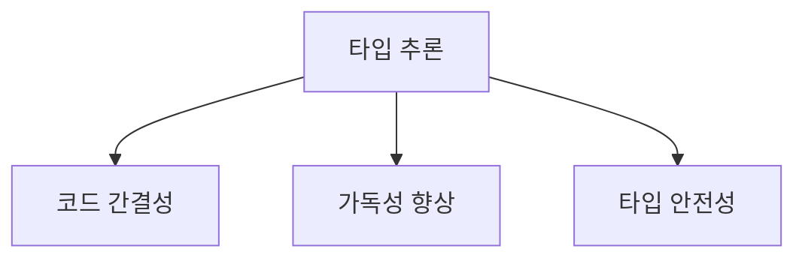
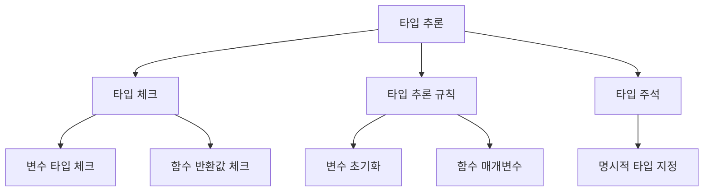
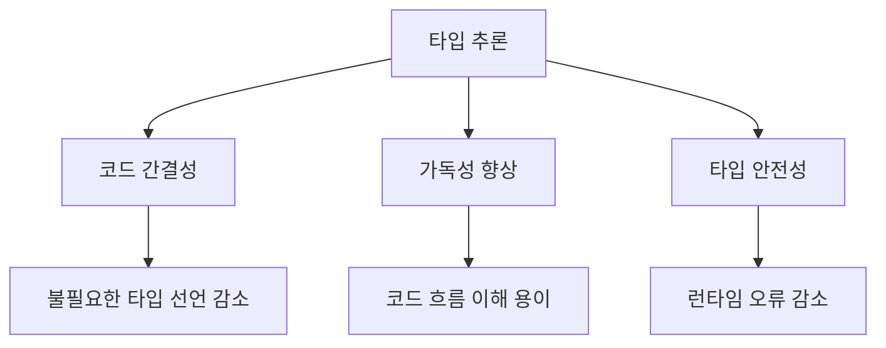
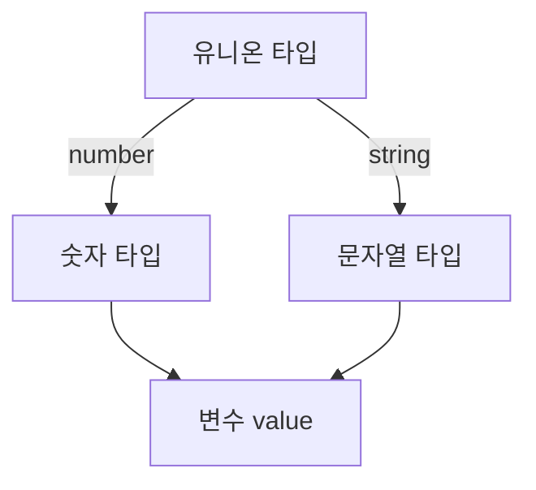
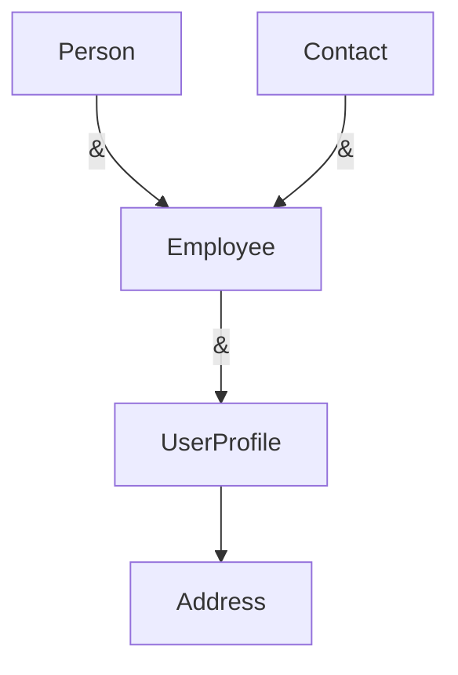
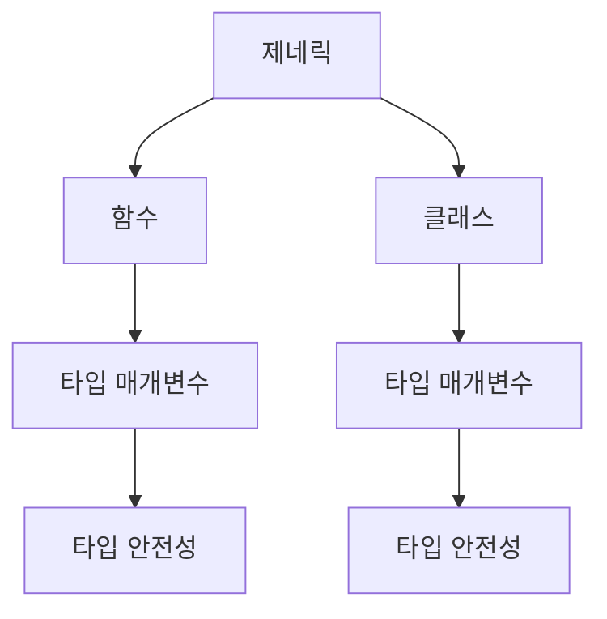
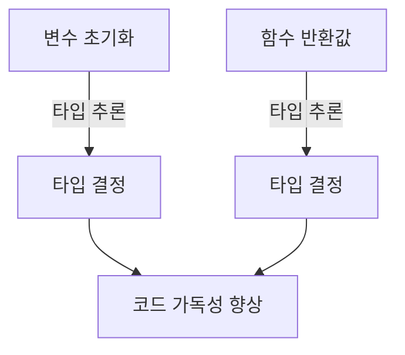
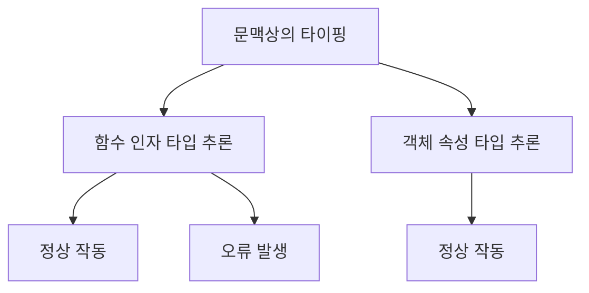
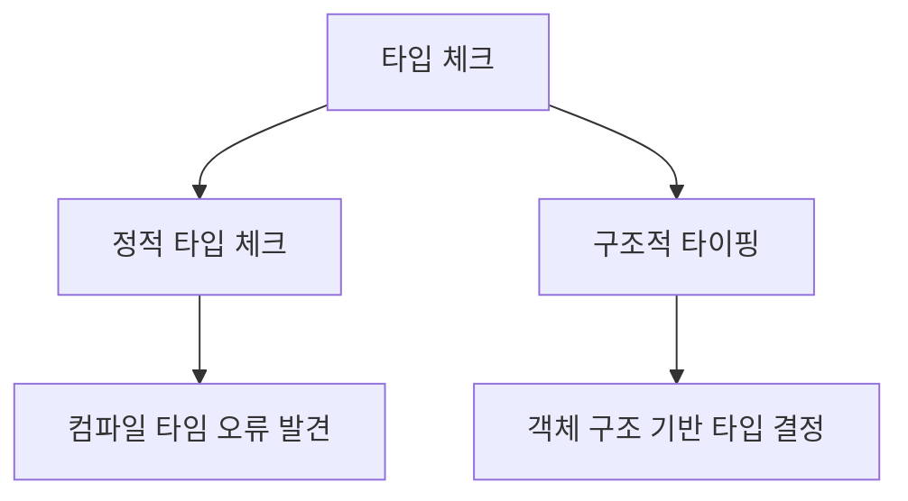
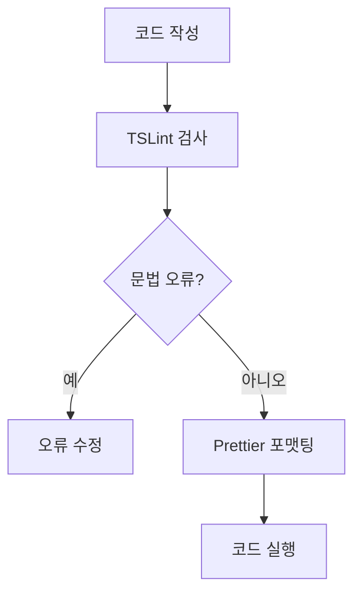

타입스크립트(TypeScript)는 자바스크립트의 상위 집합으로, 정적 타입을 지원하는 프로그래밍 언어이다. 타입스크립트의 가장 큰 장점 중 하나는 타입 추론(Type Inference) 기능이다. 타입 추론이란, 개발자가 명시적으로 타입을 지정하지 않아도 타입스크립트 컴파일러가 변수나 표현식의 타입을 자동으로 추론하는 기능을 의미한다. 예를 들어, 변수를 초기화할 때 그 값에 따라 타입스크립트는 해당 변수의 타입을 자동으로 결정한다. 이는 코드의 가독성을 높이고, 불필요한 타입 주석을 줄여 코드의 간결함을 유지하는 데 큰 도움이 된다. 또한, 타입 추론은 코드 작성 시 발생할 수 있는 오류를 사전에 방지하는 데 기여한다. 그러나 복잡한 상황에서는 명시적으로 타입을 정의해야 할 필요가 있다. 이 글에서는 타입스크립트의 타입 추론에 대해 자세히 살펴보고, 기본 개념부터 고급 주제까지 다양한 예제를 통해 이해를 돕고자 한다. 타입 추론을 활용하여 더 깔끔하고 안전한 타입스크립트 코드를 작성해보자.


||
|:---:|
||


<!--
##### Outline #####
-->

<!--
# TypeScript 타입 추론: 포괄적인 가이드

## 개요
- TypeScript 타입 추론의 정의
- 타입 추론의 중요성 및 장점

## 타입 추론의 기본
- 타입 추론이란 무엇인가?
- 타입 추론의 작동 원리
  - 타입 체크
  - 타입 추론 규칙
  - 타입 주석의 역할

## 타입 추론의 이점
- 코드 간결성
- 가독성 향상
- 타입 안전성

## 고급 타입 추론
### 1. 유니온 타입
- 유니온 타입의 정의 및 예제
- 유니온 타입을 통한 타입 추론

### 2. 교차 타입
- 교차 타입의 정의 및 예제
- 교차 타입을 통한 객체 타입 정의

### 3. 제네릭
- 제네릭의 정의 및 예제
- 제네릭을 통한 함수 및 클래스의 타입 추론

## 타입 추론의 다양한 사례
### 1. 변수 초기화 시 타입 추론
- 변수 초기화 예제
- 함수 반환값에 따른 타입 추론

### 2. 배열 및 객체의 타입 추론
- 배열의 타입 추론 예제
- 객체의 타입 추론 예제

### 3. 문맥상의 타이핑 (Contextual Typing)
- 문맥상의 타이핑의 정의
- 문맥상의 타이핑 예제

## 최적의 공통 타입 (Best Common Type)
- 최적의 공통 타입의 정의
- 최적의 공통 타입을 통한 타입 추론 예제

## 타입스크립트의 타입 체크
- 타입 체크의 원칙
- Duck Typing 및 Structural Subtyping 설명

## FAQ
- 타입 추론을 사용할 때의 주의사항은 무엇인가?
- 타입 추론이 복잡한 경우 어떻게 처리해야 하는가?
- 타입 추론과 타입 주석의 차이는 무엇인가?

## 관련 기술
- TypeScript와 JavaScript의 차이점
- 타입스크립트의 다른 기능 (예: 인터페이스, 타입 별칭)
- 타입스크립트의 도구 및 라이브러리 (예: TSLint, Prettier)

## 결론
- 타입스크립트 타입 추론의 중요성 요약
- 타입 추론을 활용한 코드 작성의 장점
- 추가 학습 자료 및 리소스 안내

## 참고 자료
- 공식 TypeScript 문서 링크
- 추천 서적 및 온라인 강의
- 커뮤니티 및 포럼 링크

이 목차는 TypeScript의 타입 추론에 대한 포괄적인 이해를 돕기 위해 구성되었습니다. 각 섹션은 관련된 예제와 설명을 포함하여 독자가 쉽게 이해할 수 있도록 돕습니다.
-->

<!--
## 개요
- TypeScript 타입 추론의 정의
- 타입 추론의 중요성 및 장점
-->

## 개요

**TypeScript 타입 추론의 정의**  

타입스크립트(TypeScript)에서 타입 추론은 변수나 함수의 반환값에 대해 명시적으로 타입을 지정하지 않아도, 컴파일러가 자동으로 타입을 추론하는 과정을 의미한다. 이는 개발자가 코드 작성 시 타입을 일일이 지정하지 않아도 되므로, 코드의 간결성을 높이고 개발 속도를 향상시키는 데 기여한다.

예를 들어, 다음과 같은 코드가 있을 때:

```typescript
let message = "Hello, TypeScript!";
```

위 코드에서 `message` 변수는 문자열 타입으로 자동으로 추론된다. 타입스크립트는 변수의 초기값을 기반으로 타입을 결정하므로, 개발자는 타입을 명시적으로 지정할 필요가 없다.

**타입 추론의 중요성 및 장점** 

타입 추론은 타입스크립트의 핵심 기능 중 하나로, 여러 가지 장점을 제공한다. 첫째, 코드의 간결성을 높인다. 개발자는 타입을 명시적으로 지정하지 않아도 되므로, 코드가 더 깔끔해진다. 둘째, 가독성이 향상된다. 타입이 자동으로 추론되기 때문에, 코드의 흐름을 이해하는 데 도움이 된다. 마지막으로, 타입 안전성을 제공한다. 타입스크립트는 타입을 추론하여 코드에서 발생할 수 있는 오류를 사전에 방지할 수 있다.

다음은 타입 추론의 장점을 시각적으로 나타낸 다이어그램이다:



이와 같이 타입 추론은 타입스크립트의 유용성을 극대화하는 중요한 기능이며, 개발자에게 많은 이점을 제공한다.

<!--
## 타입 추론의 기본
- 타입 추론이란 무엇인가?
- 타입 추론의 작동 원리
  - 타입 체크
  - 타입 추론 규칙
  - 타입 주석의 역할
-->

## 타입 추론의 기본

**타입 추론이란 무엇인가?**  

타입 추론은 TypeScript가 변수, 함수의 반환값, 매개변수 등의 타입을 자동으로 결정하는 과정을 의미한다. 개발자가 명시적으로 타입을 지정하지 않더라도 TypeScript는 코드의 문맥을 분석하여 적절한 타입을 추론한다. 이를 통해 코드의 가독성을 높이고, 개발자가 타입을 일일이 지정하는 수고를 덜 수 있다.

**타입 추론의 작동 원리** 

타입 추론은 여러 단계로 이루어지며, 다음과 같은 원리로 작동한다.

- **타입 체크**  
  TypeScript는 코드가 작성될 때, 각 변수와 함수의 타입을 체크하여 일관성을 유지한다. 예를 들어, 숫자형 변수에 문자열을 할당하려고 하면 오류가 발생한다.

  ```typescript
  let num = 5; // TypeScript는 num의 타입을 number로 추론
  num = "Hello"; // 오류: Type 'string' is not assignable to type 'number'
  ```

- **타입 추론 규칙**  
  TypeScript는 다양한 규칙을 통해 타입을 추론한다. 예를 들어, 변수 초기화 시 할당된 값의 타입을 기반으로 추론하거나, 함수의 반환값을 분석하여 타입을 결정한다.

  ```typescript
  let str = "Hello"; // TypeScript는 str의 타입을 string으로 추론
  function add(a: number, b: number) {
      return a + b; // TypeScript는 반환값의 타입을 number로 추론
  }
  ```

- **타입 주석의 역할**  
  타입 주석은 개발자가 명시적으로 타입을 지정할 수 있는 방법이다. 타입 주석을 사용하면 TypeScript의 타입 추론을 보완하거나, 특정 타입을 강제할 수 있다. 이는 코드의 명확성을 높이고, 타입 오류를 사전에 방지하는 데 도움을 준다.

  ```typescript
  let isActive: boolean = true; // 타입 주석을 통해 isActive의 타입을 boolean으로 지정
  ```



타입 추론은 TypeScript의 핵심 기능 중 하나로, 코드의 안정성과 가독성을 높이는 데 중요한 역할을 한다. 이를 통해 개발자는 더 효율적으로 코드를 작성할 수 있으며, 타입 관련 오류를 줄일 수 있다.

<!--
## 타입 추론의 이점
- 코드 간결성
- 가독성 향상
- 타입 안전성
-->

## 타입 추론의 이점

타입스크립트의 타입 추론은 개발자에게 여러 가지 이점을 제공한다. 이 섹션에서는 코드 간결성, 가독성 향상, 그리고 타입 안전성에 대해 자세히 살펴보겠다.

**코드 간결성**

타입 추론을 사용하면 코드에서 타입을 명시적으로 선언할 필요가 줄어든다. 이는 코드의 길이를 줄이고, 불필요한 반복을 피할 수 있게 해준다. 예를 들어, 변수를 선언할 때 타입을 명시하지 않고도 초기값을 통해 타입이 자동으로 추론된다.

```typescript
let message = "Hello, TypeScript!"; // string 타입으로 추론됨
```

위의 코드에서 `message` 변수는 문자열 타입으로 자동으로 추론된다. 이처럼 타입을 명시하지 않아도 코드가 간결해지는 효과를 볼 수 있다.

**가독성 향상**

타입 추론은 코드의 가독성을 높이는 데 기여한다. 개발자는 타입을 명시적으로 선언하지 않아도 되므로, 코드의 핵심 로직에 집중할 수 있다. 또한, 타입스크립트는 IDE에서 타입 정보를 제공하므로, 개발자는 코드의 흐름을 쉽게 이해할 수 있다.

```typescript
function add(a: number, b: number) {
    return a + b;
}

let result = add(5, 10); // result는 number 타입으로 추론됨
```

위의 예제에서 `result` 변수는 `add` 함수의 반환값을 통해 타입이 자동으로 추론된다. 이로 인해 코드의 가독성이 향상된다.

**타입 안전성**

타입 추론은 코드의 타입 안전성을 높이는 데 중요한 역할을 한다. 타입스크립트는 컴파일 타임에 타입을 체크하므로, 런타임 오류를 줄일 수 있다. 이는 개발자가 코드 작성 시 실수를 줄이고, 더 안전한 코드를 작성할 수 있도록 돕는다.

```typescript
let num: number = 5;
num = "Hello"; // 오류 발생: Type 'string' is not assignable to type 'number'
```

위의 코드에서 `num` 변수는 숫자 타입으로 선언되었기 때문에, 문자열을 할당하려고 하면 오류가 발생한다. 이러한 타입 체크는 개발자가 실수를 미리 방지할 수 있게 해준다.



위의 다이어그램은 타입 추론이 제공하는 주요 이점들을 시각적으로 나타낸 것이다. 타입 추론은 코드의 품질을 높이는 데 기여하며, 개발자에게 더 나은 개발 경험을 제공한다.

<!--
## 고급 타입 추론
### 1. 유니온 타입
- 유니온 타입의 정의 및 예제
- 유니온 타입을 통한 타입 추론
-->

## 고급 타입 추론

** 유니온 타입의 정의 및 예제 **  
유니온 타입은 TypeScript에서 여러 타입 중 하나를 허용하는 타입이다. 즉, 변수나 함수의 매개변수가 여러 타입을 가질 수 있도록 정의할 수 있다. 유니온 타입은 `|` 기호를 사용하여 여러 타입을 결합하여 표현한다. 

예를 들어, 다음과 같은 코드가 있다.

```typescript
function printId(id: number | string) {
    console.log(`Your ID is: ${id}`);
}

printId(101); // 숫자 타입
printId("202"); // 문자열 타입
```

위의 예제에서 `printId` 함수는 `number` 또는 `string` 타입의 `id`를 매개변수로 받을 수 있다. 이처럼 유니온 타입을 사용하면 함수가 다양한 타입의 인자를 처리할 수 있도록 유연성을 제공한다.

** 유니온 타입을 통한 타입 추론 **  
TypeScript는 유니온 타입을 사용하여 변수의 타입을 추론할 수 있다. 예를 들어, 다음과 같은 코드에서 TypeScript는 `value` 변수가 유니온 타입으로 추론된다.

```typescript
let value: number | string;

value = 42; // number 타입
console.log(value); // 42

value = "Hello"; // string 타입
console.log(value); // Hello
```

이 경우, `value`는 처음에 `number` 타입으로 초기화되었다가, 이후에 `string` 타입으로 변경되었다. TypeScript는 이러한 타입 변화를 인식하고, 유니온 타입으로 추론한다.

다음은 유니온 타입을 활용한 예제 다이어그램이다.



위의 다이어그램은 유니온 타입이 `number`와 `string` 두 가지 타입을 포함하고 있으며, 이 두 타입 모두 `value` 변수에 할당될 수 있음을 보여준다. 유니온 타입을 활용하면 코드의 유연성을 높이고, 다양한 타입을 처리할 수 있는 장점을 제공한다.

<!--
### 2. 교차 타입
- 교차 타입의 정의 및 예제
- 교차 타입을 통한 객체 타입 정의
-->

## 교차 타입

**교차 타입의 정의 및 예제**

교차 타입(Cross Type)은 TypeScript에서 여러 타입을 결합하여 새로운 타입을 생성하는 방법이다. 이는 여러 타입의 속성을 모두 포함하는 객체 타입을 정의할 수 있게 해준다. 교차 타입은 `&` 연산자를 사용하여 정의하며, 여러 인터페이스나 타입을 조합할 수 있다.

예를 들어, 두 개의 인터페이스 `Person`과 `Contact`가 있다고 가정해보자.

```typescript
interface Person {
    name: string;
    age: number;
}

interface Contact {
    email: string;
    phone: string;
}

type Employee = Person & Contact;

const employee: Employee = {
    name: "John Doe",
    age: 30,
    email: "john.doe@example.com",
    phone: "123-456-7890"
};
```

위의 예제에서 `Employee` 타입은 `Person`과 `Contact`의 모든 속성을 포함하고 있다. 따라서 `employee` 객체는 두 인터페이스의 속성을 모두 갖추고 있어야 한다.

**교차 타입을 통한 객체 타입 정의**

교차 타입은 객체 타입을 정의할 때 매우 유용하다. 여러 타입의 속성을 조합하여 복잡한 객체를 쉽게 정의할 수 있기 때문이다. 예를 들어, 다음과 같이 다양한 속성을 가진 객체를 정의할 수 있다.

```typescript
interface Address {
    street: string;
    city: string;
}

type UserProfile = Person & Contact & Address;

const userProfile: UserProfile = {
    name: "Jane Smith",
    age: 28,
    email: "jane.smith@example.com",
    phone: "987-654-3210",
    street: "123 Main St",
    city: "Anytown"
};
```

위의 코드에서 `UserProfile` 타입은 `Person`, `Contact`, `Address`의 모든 속성을 포함하고 있다. 이를 통해 다양한 정보를 가진 사용자 프로필 객체를 쉽게 정의할 수 있다.

다음은 교차 타입의 구조를 시각적으로 나타낸 다이어그램이다.



이 다이어그램은 `Person`과 `Contact`가 결합되어 `Employee`를 형성하고, `UserProfile`이 `Employee`와 `Address`를 결합하여 생성되는 구조를 보여준다. 교차 타입을 사용하면 이러한 방식으로 복잡한 타입을 쉽게 관리할 수 있다.

<!--
### 3. 제네릭
- 제네릭의 정의 및 예제
- 제네릭을 통한 함수 및 클래스의 타입 추론
-->

## 제네릭

**제네릭의 정의 및 예제**  

제네릭은 TypeScript에서 타입을 매개변수로 받아 다양한 타입에 대해 유연하게 동작할 수 있도록 하는 기능이다. 이를 통해 코드의 재사용성을 높이고, 타입 안전성을 유지할 수 있다. 제네릭을 사용하면 특정 타입에 의존하지 않고, 다양한 타입에 대해 동일한 로직을 적용할 수 있다.

예를 들어, 배열의 요소를 출력하는 함수를 제네릭으로 정의할 수 있다. 아래는 제네릭을 사용한 간단한 예제이다.

```typescript
function printArray<T>(arr: T[]): void {
    arr.forEach(element => {
        console.log(element);
    });
}

printArray<number>([1, 2, 3]); // 1, 2, 3
printArray<string>(['a', 'b', 'c']); // a, b, c
```

위의 코드에서 `printArray` 함수는 제네릭 타입 매개변수 `T`를 사용하여, 어떤 타입의 배열이든 받아들일 수 있다. 이를 통해 숫자 배열과 문자열 배열 모두를 처리할 수 있다.

**제네릭을 통한 함수 및 클래스의 타입 추론**  

제네릭은 함수뿐만 아니라 클래스에서도 사용할 수 있다. 클래스에서 제네릭을 사용하면, 인스턴스를 생성할 때 타입을 지정할 수 있으며, 이를 통해 타입 안전성을 더욱 강화할 수 있다.

아래는 제네릭을 사용한 클래스의 예제이다.

```typescript
class Box<T> {
    private value: T;

    constructor(value: T) {
        this.value = value;
    }

    getValue(): T {
        return this.value;
    }
}

const numberBox = new Box<number>(123);
console.log(numberBox.getValue()); // 123

const stringBox = new Box<string>('Hello');
console.log(stringBox.getValue()); // Hello
```

위의 `Box` 클래스는 제네릭 타입 매개변수 `T`를 사용하여, 다양한 타입의 값을 저장할 수 있다. `numberBox`와 `stringBox`는 각각 숫자와 문자열을 저장하는 인스턴스이다.

이와 같은 방식으로 제네릭을 활용하면, 코드의 재사용성을 높이고, 타입 추론을 통해 더욱 안전한 코드를 작성할 수 있다.



위의 다이어그램은 제네릭이 함수와 클래스에서 어떻게 사용되는지를 나타낸다. 제네릭을 통해 타입 매개변수를 사용함으로써, 코드의 안전성을 높일 수 있음을 보여준다.

<!--
## 타입 추론의 다양한 사례
### 1. 변수 초기화 시 타입 추론
- 변수 초기화 예제
- 함수 반환값에 따른 타입 추론
-->

## 타입 추론의 다양한 사례

**변수 초기화 시 타입 추론**

타입스크립트는 변수 초기화 시 자동으로 타입을 추론하는 기능을 제공한다. 이는 개발자가 명시적으로 타입을 지정하지 않아도, 초기값에 따라 적절한 타입을 자동으로 결정하는 것을 의미한다. 예를 들어, 다음과 같은 코드가 있다.

```typescript
let num = 42; // num은 number 타입으로 추론된다.
let str = "Hello, TypeScript!"; // str은 string 타입으로 추론된다.
let isActive = true; // isActive는 boolean 타입으로 추론된다.
```

위의 예제에서 `num`, `str`, `isActive` 변수는 각각 `number`, `string`, `boolean` 타입으로 자동으로 추론된다. 이러한 타입 추론은 코드의 가독성을 높이고, 개발자가 타입을 명시적으로 지정할 필요를 줄여준다.

**함수 반환값에 따른 타입 추론**

타입스크립트는 함수의 반환값에 따라서도 타입을 추론할 수 있다. 함수의 반환값이 명확할 경우, 타입스크립트는 해당 반환값의 타입을 자동으로 결정한다. 다음은 함수 반환값에 따른 타입 추론의 예시이다.

```typescript
function add(a: number, b: number) {
    return a + b; // 반환값은 number 타입으로 추론된다.
}

const result = add(5, 10); // result는 number 타입으로 추론된다.
```

위의 코드에서 `add` 함수는 두 개의 `number` 타입 매개변수를 받아서 그 합을 반환한다. 타입스크립트는 이 함수의 반환값이 `number` 타입임을 자동으로 추론하여, `result` 변수 또한 `number` 타입으로 결정된다.

이와 같은 타입 추론 기능은 코드 작성 시 타입을 명시적으로 지정하지 않아도 되므로, 개발자의 생산성을 높이는 데 기여한다.



위의 다이어그램은 변수 초기화와 함수 반환값에 따른 타입 추론 과정을 시각적으로 나타낸 것이다. 이러한 타입 추론 기능은 타입스크립트의 강력한 특징 중 하나로, 개발자가 보다 효율적으로 코드를 작성할 수 있도록 돕는다.

<!--
### 2. 배열 및 객체의 타입 추론
- 배열의 타입 추론 예제
- 객체의 타입 추론 예제
-->

## 배열 및 객체의 타입 추론

**배열의 타입 추론 예제**  

TypeScript는 배열을 초기화할 때, 그 요소의 타입을 자동으로 추론한다. 예를 들어, 숫자 배열을 선언하고 초기화하면 TypeScript는 해당 배열의 타입을 `number[]`로 추론한다. 다음은 간단한 예제이다.

```typescript
let numbers = [1, 2, 3, 4]; // TypeScript는 numbers의 타입을 number[]로 추론한다.
```

이 경우, `numbers` 배열에 숫자 이외의 값을 추가하려고 하면 TypeScript는 오류를 발생시킨다.

```typescript
numbers.push("5"); // 오류: Argument of type 'string' is not assignable to parameter of type 'number'.
```

이처럼 TypeScript의 타입 추론 기능은 배열의 요소 타입을 명확히 하여 코드의 안전성을 높인다.

**객체의 타입 추론 예제** 

TypeScript는 객체를 초기화할 때도 그 속성의 타입을 추론할 수 있다. 예를 들어, 다음과 같은 객체를 선언할 수 있다.

```typescript
let person = {
    name: "Alice",
    age: 30
}; // TypeScript는 person의 타입을 { name: string; age: number; }로 추론한다.
```

이 경우, `person` 객체의 속성에 잘못된 타입의 값을 할당하려고 하면 TypeScript는 오류를 발생시킨다.

```typescript
person.age = "thirty"; // 오류: Type 'string' is not assignable to type 'number'.
```

이러한 타입 추론은 객체의 구조를 명확히 하여 코드의 가독성을 높이고, 개발자가 실수로 잘못된 타입을 할당하는 것을 방지한다.

```mermaid
graph TD;
    A[배열] -->|타입 추론| B[숫자 배열: number[]]
    A -->|타입 추론| C[문자열 배열: string[]]
    D[객체] -->|타입 추론| E[객체 타입: { name: string; age: number; }]
```

위의 다이어그램은 배열과 객체의 타입 추론 과정을 시각적으로 나타낸 것이다. 배열의 경우, 요소의 타입에 따라 다양한 배열 타입으로 추론되며, 객체의 경우 속성의 타입에 따라 객체 타입으로 추론된다. 이러한 타입 추론 기능은 TypeScript의 강력한 타입 시스템의 핵심 요소 중 하나이다.

<!--
### 3. 문맥상의 타이핑 (Contextual Typing)
- 문맥상의 타이핑의 정의
- 문맥상의 타이핑 예제
-->

## 문맥상의 타이핑 (Contextual Typing)

**문맥상의 타이핑의 정의** 

문맥상의 타이핑은 TypeScript에서 특정한 상황이나 문맥에 따라 변수나 함수의 타입을 자동으로 추론하는 기능이다. 이는 주로 함수의 인자나 반환값, 또는 객체의 속성에 대한 타입을 결정할 때 유용하게 사용된다. 문맥상의 타이핑은 코드의 가독성을 높이고, 개발자가 명시적으로 타입을 지정하지 않아도 타입 안전성을 유지할 수 있도록 돕는다.

**문맥상의 타이핑 예제**  

아래의 예제를 통해 문맥상의 타이핑이 어떻게 작동하는지 살펴보겠다.

```typescript
// 함수의 인자에 대한 문맥상의 타이핑
const logMessage = (message: string) => {
    console.log(message);
};

// logMessage 함수에 문자열을 전달하면 TypeScript는 message의 타입을 자동으로 추론한다.
logMessage("Hello, TypeScript!"); // 정상 작동
logMessage(42); // 오류 발생: Argument of type 'number' is not assignable to parameter of type 'string'.
```

위의 예제에서 `logMessage` 함수는 `message`라는 인자를 받는다. 이 인자는 문자열 타입으로 정의되어 있으며, TypeScript는 이 정보를 바탕으로 `logMessage` 함수에 전달되는 인자의 타입을 자동으로 추론한다. 만약 숫자 타입의 인자를 전달하려고 하면 TypeScript는 오류를 발생시킨다.

또한, 문맥상의 타이핑은 객체의 속성에서도 적용된다. 다음은 객체의 속성에 대한 문맥상의 타이핑 예제이다.

```typescript
// 객체의 속성에 대한 문맥상의 타이핑
const user = {
    name: "Alice",
    age: 30,
};

// user 객체의 속성에 대한 타입이 자동으로 추론된다.
const greetUser = (user: { name: string; age: number }) => {
    console.log(`Hello, ${user.name}. You are ${user.age} years old.`);
};

greetUser(user); // 정상 작동
```

위의 예제에서 `user` 객체는 `name`과 `age`라는 두 개의 속성을 가지고 있다. TypeScript는 이 객체의 구조를 분석하여 `greetUser` 함수의 인자 타입을 자동으로 추론한다. 이처럼 문맥상의 타이핑은 코드의 명확성을 높이고, 타입 안전성을 보장하는 데 큰 역할을 한다.



위의 다이어그램은 문맥상의 타이핑이 함수 인자와 객체 속성에서 어떻게 작동하는지를 시각적으로 나타낸 것이다. 문맥상의 타이핑은 TypeScript의 강력한 기능 중 하나로, 개발자가 보다 안전하고 효율적인 코드를 작성할 수 있도록 돕는다.

<!--
## 최적의 공통 타입 (Best Common Type)
- 최적의 공통 타입의 정의
- 최적의 공통 타입을 통한 타입 추론 예제
-->

## 최적의 공통 타입 (Best Common Type)

**최적의 공통 타입의 정의** 

최적의 공통 타입(Best Common Type)은 TypeScript에서 여러 타입이 혼합된 경우, 이들 타입의 공통된 특성을 추론하여 가장 적합한 타입을 결정하는 과정을 의미한다. 이는 주로 배열이나 여러 변수의 타입이 서로 다를 때 발생하며, TypeScript는 이러한 상황에서 최적의 공통 타입을 찾아내어 코드의 타입 안전성을 높인다. 

예를 들어, 두 개의 서로 다른 타입을 가진 변수가 있을 때, TypeScript는 이 두 타입의 공통된 부분을 찾아내어 새로운 타입을 생성한다. 이 과정은 코드의 가독성을 높이고, 타입 오류를 줄이는 데 기여한다.

**최적의 공통 타입을 통한 타입 추론 예제** 
 
다음은 최적의 공통 타입을 활용한 간단한 예제이다.

```typescript
function getLength(input: string | string[]): number {
    return input.length;
}

const strLength = getLength("Hello, TypeScript!"); // strLength는 number 타입
const arrLength = getLength(["Hello", "TypeScript"]); // arrLength도 number 타입
```

위의 코드에서 `getLength` 함수는 입력으로 문자열 또는 문자열 배열을 받을 수 있다. TypeScript는 `input`의 타입이 `string | string[]`임을 인식하고, 이 두 타입의 공통된 특성인 `length` 속성을 사용하여 반환 타입을 `number`로 추론한다. 

이와 같은 방식으로 TypeScript는 다양한 타입을 처리할 수 있으며, 개발자는 보다 안전하고 간결한 코드를 작성할 수 있다.

```mermaid
graph TD;
    A[Input: string] --> B[Length: number]
    A --> C[Common Type: string]
    D[Input: string[]] --> B
    D --> C
```

위의 다이어그램은 `string`과 `string[]` 타입이 `getLength` 함수에 입력될 때, TypeScript가 어떻게 공통 타입을 추론하고, 최종적으로 `number` 타입의 길이를 반환하는지를 보여준다. 

이처럼 최적의 공통 타입은 TypeScript의 타입 추론에서 중요한 역할을 하며, 다양한 타입을 안전하게 처리할 수 있는 기반을 제공한다.

<!--
## 타입스크립트의 타입 체크
- 타입 체크의 원칙
- Duck Typing 및 Structural Subtyping 설명
-->

## 타입스크립트의 타입 체크

타입스크립트는 정적 타입 언어로, 코드 작성 시 타입 체크를 통해 오류를 사전에 방지할 수 있다. 타입 체크는 코드의 안정성을 높이고, 유지보수를 용이하게 하는 중요한 역할을 한다. 이번 섹션에서는 타입 체크의 원칙과 Duck Typing 및 Structural Subtyping에 대해 살펴보겠다.

**타입 체크의 원칙**

타입 체크는 주로 두 가지 원칙에 기반하여 작동한다. 첫 번째는 "정적 타입 체크"이며, 두 번째는 "구조적 타이핑"이다. 정적 타입 체크는 컴파일 타임에 타입 오류를 발견하는 방식으로, 코드가 실행되기 전에 오류를 미리 확인할 수 있다. 구조적 타이핑은 객체의 구조를 기반으로 타입을 결정하는 방식으로, 객체의 속성과 메서드가 일치하는지를 검사한다.

다음은 타입 체크의 원칙을 설명하는 간단한 다이어그램이다.



**Duck Typing 및 Structural Subtyping 설명**

Duck Typing은 "오리처럼 걷고, 오리처럼 꽥꽥거린다면, 그것은 오리이다"라는 원칙에 기반한 개념이다. 즉, 객체의 타입은 그 객체가 가진 속성과 메서드에 의해 결정되며, 명시적인 타입 선언이 필요하지 않다. 타입스크립트에서는 Duck Typing을 통해 객체가 특정 인터페이스를 구현하는지 여부를 검사할 수 있다.

예를 들어, 다음과 같은 코드에서 `quack` 메서드를 가진 객체는 `Duck` 타입으로 간주된다.

```typescript
interface Duck {
    quack: () => void;
}

function makeItQuack(duck: Duck) {
    duck.quack();
}

const myDuck = {
    quack: () => console.log("꽥꽥!")
};

makeItQuack(myDuck); // "꽥꽥!" 출력
```

이와 같은 방식으로 Duck Typing은 타입스크립트의 유연성을 높여준다.

Structural Subtyping은 객체의 구조를 기반으로 타입을 결정하는 방식이다. 즉, 객체가 특정 타입의 모든 속성과 메서드를 포함하고 있다면, 해당 객체는 그 타입으로 간주된다. 이는 타입스크립트의 강력한 타입 시스템의 핵심 요소 중 하나이다.

다음은 Structural Subtyping의 예시이다.

```typescript
interface Person {
    name: string;
    age: number;
}

function greet(person: Person) {
    console.log(`안녕하세요, ${person.name}님!`);
}

const user = {
    name: "홍길동",
    age: 30,
    location: "서울" // 추가 속성
};

greet(user); // "안녕하세요, 홍길동님!" 출력
```

위의 예시에서 `user` 객체는 `Person` 인터페이스의 모든 속성을 포함하고 있으므로, 타입 체크를 통과한다. 추가 속성인 `location`은 무시되며, 이는 구조적 타이핑의 유연성을 보여준다.

타입스크립트의 타입 체크는 이러한 원칙을 통해 코드의 안정성을 높이고, 개발자가 보다 안전하게 코드를 작성할 수 있도록 돕는다.

<!--
## FAQ
- 타입 추론을 사용할 때의 주의사항은 무엇인가?
- 타입 추론이 복잡한 경우 어떻게 처리해야 하는가?
- 타입 추론과 타입 주석의 차이는 무엇인가?
-->

## FAQ

**타입 추론을 사용할 때의 주의사항은 무엇인가?**

타입 추론은 TypeScript의 강력한 기능 중 하나이지만, 사용할 때 몇 가지 주의사항이 있다. 첫째, 타입 추론이 항상 정확하지 않을 수 있다는 점이다. TypeScript는 변수의 초기값을 기반으로 타입을 추론하지만, 초기값이 명확하지 않거나 복잡한 경우에는 잘못된 타입이 추론될 수 있다. 따라서, 중요한 변수나 함수의 반환값에 대해서는 명시적으로 타입을 주석으로 작성하는 것이 좋다.

둘째, 타입 추론이 지나치게 복잡해질 경우 코드의 가독성이 떨어질 수 있다. 예를 들어, 여러 개의 유니온 타입이나 교차 타입이 결합된 경우, 타입이 무엇인지 파악하기 어려울 수 있다. 이럴 때는 코드의 가독성을 높이기 위해 타입 별칭을 사용하는 것이 유용하다.

```typescript
// 타입 추론이 복잡해질 수 있는 예제
type A = { name: string } | { age: number };
type B = { address: string } & { phone: string };

const example: A & B = {
  name: "John",
  address: "123 Main St",
  phone: "123-456-7890"
};
```

**타입 추론이 복잡한 경우 어떻게 처리해야 하는가?**

타입 추론이 복잡한 경우, 몇 가지 방법으로 이를 처리할 수 있다. 첫째, 타입 별칭을 사용하여 복잡한 타입을 간단하게 정의할 수 있다. 타입 별칭을 사용하면 코드의 가독성을 높이고, 재사용성을 증가시킬 수 있다.

둘째, 제네릭을 활용하여 타입을 동적으로 정의할 수 있다. 제네릭을 사용하면 다양한 타입에 대해 유연하게 대응할 수 있으며, 코드의 재사용성을 높일 수 있다.

```typescript
// 제네릭을 활용한 예제
function identity<T>(arg: T): T {
  return arg;
}

const result = identity<string>("Hello, TypeScript");
```

**타입 추론과 타입 주석의 차이는 무엇인가?**

타입 추론과 타입 주석은 TypeScript에서 타입을 정의하는 두 가지 방법이다. 타입 추론은 TypeScript가 변수의 초기값을 기반으로 자동으로 타입을 결정하는 반면, 타입 주석은 개발자가 명시적으로 타입을 지정하는 방법이다.

타입 추론은 코드 작성 시 편리함을 제공하지만, 때로는 예상치 못한 타입이 추론될 수 있다. 반면, 타입 주석은 명확한 타입 정의를 제공하여 코드의 의도를 분명히 할 수 있다. 따라서, 중요한 부분에서는 타입 주석을 사용하는 것이 좋다.

```typescript
// 타입 추론 예제
let inferredString = "Hello, TypeScript"; // string으로 추론됨

// 타입 주석 예제
let annotatedString: string = "Hello, TypeScript"; // 명시적으로 string 타입 지정
```

이와 같이, 타입 추론과 타입 주석은 각각의 장단점이 있으며, 상황에 따라 적절히 활용하는 것이 중요하다.

<!--
## 관련 기술
- TypeScript와 JavaScript의 차이점
- 타입스크립트의 다른 기능 (예: 인터페이스, 타입 별칭)
- 타입스크립트의 도구 및 라이브러리 (예: TSLint, Prettier)
-->

## 관련 기술

**TypeScript와 JavaScript의 차이점**

TypeScript는 JavaScript의 상위 집합으로, 정적 타입을 지원하는 언어이다. JavaScript는 동적 타입 언어로, 변수의 타입이 런타임에 결정된다. 반면, TypeScript는 컴파일 타임에 타입을 체크하여 코드의 안정성을 높인다. 이러한 차이로 인해 TypeScript는 대규모 애플리케이션 개발에 유리하다. 

아래는 TypeScript와 JavaScript의 주요 차이점을 정리한 표이다.

| 특징               | JavaScript                | TypeScript               |
|--------------------|--------------------------|--------------------------|
| 타입 시스템        | 동적 타입                | 정적 타입                |
| 컴파일             | 인터프리터 방식         | 컴파일 필요              |
| IDE 지원           | 기본적인 지원            | 강력한 자동 완성 및 오류 체크 |
| 클래스 기반 객체지향 | 지원                     | 지원                     |

**타입스크립트의 다른 기능 (예: 인터페이스, 타입 별칭)**

TypeScript는 인터페이스와 타입 별칭을 통해 복잡한 타입을 정의할 수 있는 기능을 제공한다. 인터페이스는 객체의 구조를 정의하는 데 사용되며, 타입 별칭은 특정 타입에 이름을 부여하는 데 사용된다. 

예를 들어, 인터페이스를 사용하여 객체의 구조를 정의할 수 있다.

```typescript
interface User {
    id: number;
    name: string;
    email: string;
}

const user: User = {
    id: 1,
    name: "John Doe",
    email: "john.doe@example.com"
};
```

타입 별칭의 예시는 다음과 같다.

```typescript
type Point = {
    x: number;
    y: number;
};

const point: Point = {
    x: 10,
    y: 20
};
```

**타입스크립트의 도구 및 라이브러리 (예: TSLint, Prettier)**

TypeScript 개발을 보다 효율적으로 하기 위해 다양한 도구와 라이브러리를 사용할 수 있다. TSLint는 TypeScript 코드의 스타일과 품질을 검사하는 도구로, 코드 작성 시 일관성을 유지하는 데 도움을 준다. 

Prettier는 코드 포맷터로, 코드 스타일을 자동으로 정리해 주어 가독성을 높인다. 아래는 TSLint와 Prettier의 사용 예시를 보여주는 다이어그램이다.



이와 같은 도구들은 TypeScript 개발 환경을 개선하고, 코드 품질을 높이는 데 기여한다.

<!--
## 결론
- 타입스크립트 타입 추론의 중요성 요약
- 타입 추론을 활용한 코드 작성의 장점
- 추가 학습 자료 및 리소스 안내
-->

## 결론

**타입스크립트 타입 추론의 중요성 요약**  
타입스크립트의 타입 추론은 개발자가 명시적으로 타입을 지정하지 않아도, 코드의 문맥을 분석하여 적절한 타입을 자동으로 결정하는 기능이다. 이는 코드 작성 시 불필요한 타입 주석을 줄여주고, 개발자가 더 직관적으로 코드를 작성할 수 있도록 돕는다. 타입 추론은 코드의 안정성을 높이고, 버그를 사전에 방지하는 데 중요한 역할을 한다.

**타입 추론을 활용한 코드 작성의 장점**  
타입 추론을 활용하면 다음과 같은 장점이 있다:

1. **코드 간결성**: 타입 주석을 생략할 수 있어 코드가 더 깔끔해진다.
2. **가독성 향상**: 타입이 자동으로 추론되므로, 코드의 흐름을 이해하기 쉬워진다.
3. **유지보수 용이성**: 타입이 명확하게 정의되지 않아도, 타입스크립트가 자동으로 타입을 추론하므로 코드 수정 시 발생할 수 있는 오류를 줄일 수 있다.

아래는 타입 추론을 활용한 간단한 예제이다.

```typescript
function add(a: number, b: number) {
    return a + b;
}

const result = add(5, 10); // result의 타입은 자동으로 number로 추론된다.
```

**추가 학습 자료 및 리소스 안내**  
타입스크립트의 타입 추론에 대해 더 깊이 이해하고 싶다면 다음과 같은 자료를 참고하는 것이 좋다:

- **공식 TypeScript 문서**: 타입스크립트의 공식 문서에서는 타입 추론에 대한 자세한 설명과 예제를 제공한다.
- **추천 서적**: "Programming TypeScript"와 같은 서적은 타입스크립트의 다양한 기능을 깊이 있게 다룬다.
- **온라인 강의**: Udemy, Coursera와 같은 플랫폼에서 제공하는 타입스크립트 강의는 실습을 통해 학습할 수 있는 좋은 기회를 제공한다.

타입스크립트의 타입 추론을 잘 활용하면, 더 안전하고 효율적인 코드를 작성할 수 있다. 추가적인 학습을 통해 이 기능을 최대한 활용해 보길 권장한다.

<!--
## 참고 자료
- 공식 TypeScript 문서 링크
- 추천 서적 및 온라인 강의
- 커뮤니티 및 포럼 링크
-->

## 참고 자료

** 공식 TypeScript 문서 링크 **  
TypeScript의 공식 문서는 가장 신뢰할 수 있는 자료 중 하나이다. 이 문서에서는 TypeScript의 기본 개념부터 고급 기능까지 다양한 내용을 다루고 있다. 공식 문서를 통해 최신 정보와 업데이트를 확인할 수 있으며, 다양한 예제와 함께 실습할 수 있는 자료도 제공된다. 공식 문서 링크는 다음과 같다: [TypeScript 공식 문서](https://www.typescriptlang.org/docs/)

** 추천 서적 및 온라인 강의 **  
TypeScript를 깊이 있게 배우고자 하는 개발자에게는 여러 서적과 온라인 강의가 유용하다. 다음은 추천할 만한 자료들이다:

1. **서적**
   - "Programming TypeScript" by Boris Cherny: TypeScript의 기본 개념과 고급 기능을 체계적으로 설명하고 있다.
   - "TypeScript Quickly" by Yakov Fain & Anton Moiseev: 실용적인 예제를 통해 TypeScript를 빠르게 익힐 수 있도록 돕는다.

2. **온라인 강의**
   - Udemy의 "Understanding TypeScript": TypeScript의 기초부터 고급 개념까지 포괄적으로 다루는 강의이다.
   - Pluralsight의 "TypeScript Fundamentals": TypeScript의 기본 개념을 이해하는 데 도움이 되는 강의이다.

** 커뮤니티 및 포럼 링크 **  
TypeScript에 대한 질문이나 문제를 해결하고 싶다면, 다양한 커뮤니티와 포럼에서 도움을 받을 수 있다. 다음은 유용한 커뮤니티 링크이다:

- [Stack Overflow](https://stackoverflow.com/questions/tagged/typescript): TypeScript 관련 질문과 답변을 찾을 수 있는 플랫폼이다.
- [TypeScript GitHub Repository](https://github.com/microsoft/TypeScript): TypeScript의 공식 GitHub 저장소로, 이슈를 보고하거나 기여할 수 있다.
- [Reddit - r/typescript](https://www.reddit.com/r/typescript/): TypeScript에 대한 다양한 주제를 논의할 수 있는 Reddit 커뮤니티이다.

이 자료들은 TypeScript를 배우고 활용하는 데 큰 도움이 될 것이다. 각 자료를 통해 실력을 쌓고, 커뮤니티와의 소통을 통해 더 나은 개발자로 성장할 수 있다.

<!--
##### Reference #####
-->

## Reference


* [https://dev.to/shagun_mistry/typescript-inference-and-its-usefulness-41ek](https://dev.to/shagun_mistry/typescript-inference-and-its-usefulness-41ek)
* [https://www.typescriptlang.org/docs/handbook/type-inference.html](https://www.typescriptlang.org/docs/handbook/type-inference.html)
* [https://medium.com/@sahil90085/typescript-type-inference-a-comprehensive-guide-40c888c6d78f](https://medium.com/@sahil90085/typescript-type-inference-a-comprehensive-guide-40c888c6d78f)
* [https://joshua1988.github.io/ts/guide/type-inference.html#%EA%B0%95%EC%9D%98%EC%99%80-%EC%B1%85%EC%9C%BC%EB%A1%9C-%EB%8D%94-%EC%89%BD%EA%B2%8C-%EB%B0%B0%EC%9B%8C%EC%9A%94-%F0%9F%8E%81](https://joshua1988.github.io/ts/guide/type-inference.html#%EA%B0%95%EC%9D%98%EC%99%80-%EC%B1%85%EC%9C%BC%EB%A1%9C-%EB%8D%94-%EC%89%BD%EA%B2%8C-%EB%B0%B0%EC%9B%8C%EC%9A%94-%F0%9F%8E%81)
* [https://www.geeksforgeeks.org/typescript-inference/](https://www.geeksforgeeks.org/typescript-inference/)
* [https://www.javatpoint.com/typescript-type-inference](https://www.javatpoint.com/typescript-type-inference)


<!--
Instead of explicitly defining types for every variable, TypeScript can often
infer the type based on the context. This can save you time and make your code
more concise.

Let’s explore a simple example:  

    
    
    // Without type inference
    let message: string = "Hello, world!"; 
    
    // With type inference
    let message = "Hello, world!";
    

Enter fullscreen mode  Exit fullscreen mode

In the first example, we explicitly define the message variable as a string.
In the second example, TypeScript infers the type of message to be a string
based on the value we're assigning to it.

Both examples achieve the same result, but the second one is more concise.
Here's another example demonstrating type inference with functions:  

    
    
    // Without type inference
    function addNumbers(a: number, b: number): number {
      return a + b;
    }
    
    // With type inference
    function addNumbers(a, b) {
      return a + b;
    }
    

Enter fullscreen mode  Exit fullscreen mode

In this case, typescript can infer the types of both parameters as well as the
return type based on the function’s implementation.

##  Benefits of Type Inference

  * **Reduced Code Verbosity** : Less typing, more focus on logic. 
  * **Improved Readability** : Easier to understand the intent of your code. 
  * **Fewer Errors** : TypeScript can catch type errors earlier, reducing the risk of runtime issues. 

Embrace type inference to write cleaner, more concise TypeScript code. Let
TypeScript handle the type checking for you, allowing you to focus on building
awesome applications!

* * *

**Important Note**

_While type inference is helpful, it's important to be aware of its
limitations. In complex scenarios, you may need to explicitly define types for
clarity or to avoid ambiguity._


-->

<!--


-->

<!--
In TypeScript, there are several places where type inference is used to
provide type information when there is no explicit type annotation. For
example, in this code

    
    
    ts

The type of the ` x ` variable is inferred to be ` number ` . This kind of
inference takes place when initializing variables and members, setting
parameter default values, and determining function return types.

In most cases, type inference is straightforward. In the following sections,
we’ll explore some of the nuances in how types are inferred.

##  Best common type

When a type inference is made from several expressions, the types of those
expressions are used to calculate a “best common type”. For example,

    
    
    ts

To infer the type of ` x ` in the example above, we must consider the type of
each array element. Here we are given two choices for the type of the array: `
number ` and ` null ` . The best common type algorithm considers each
candidate type, and picks the type that is compatible with all the other
candidates.

Because the best common type has to be chosen from the provided candidate
types, there are some cases where types share a common structure, but no one
type is the super type of all candidate types. For example:

    
    
    ts
    
    let zoo = [new Rhino(), new Elephant(), new Snake()];
    
    [Try](https://www.typescriptlang.org/play/#code/PTAEAEGcBcCcEsDG0BcoBmBDANpApgFCLaaSSgCCAdvALY6gDeAvkSWaAEoAW8VA9qDwAPaHioATctToNGBUKG6kAEv1hU0cAK54A3AVbFS5AKLY8AB2VVoQ0eKmUa9bEwVLSAFVjaqAay1ffUM2E1AAZSpMfzx7MUlpFzkPZUgAGTwAc0g0LFwQ1hBQAFoyxG1oMpKCCzsAL35BAF5QAG0qPAB3Ll4BAAoASgAaUE6e8ysbaCHR8cjo2KGAXQNixVAAPQB+IA)

Ideally, we may want ` zoo ` to be inferred as an ` Animal[] ` , but because
there is no object that is strictly of type ` Animal ` in the array, we make
no inference about the array element type. To correct this, explicitly provide
the type when no one type is a super type of all other candidates:

    
    
    ts
    
    let zoo: Animal[] = [new Rhino(), new Elephant(), new Snake()];
    
    [Try](https://www.typescriptlang.org/play/#code/PTAEAEGcBcCcEsDG0BcoBmBDANpApgFCLaaSSgCCAdvALY6gDeAvkSWaAEoAW8VA9qDwAPaHioATctToNGBUKG6kAEv1hU0cAK54A3AVbFS5AKLY8AB2VVoQ0eKmUa9bEwVLSAFVjaqAay1ffUM2E1AAZSpMfzx7MUlpFzkPZUgAGTwAc0g0LFwQ1hBQAFoyxG1oMpKCCzsAL35+NBlXAG0AXVAAXlA2qjwAdy5eAQAKAEoAGlAB4fMrG2hJmbnI6NjJjoNixVAAPQB+IA)

When no best common type is found, the resulting inference is the union array type, ` (Rhino | Elephant | Snake)[] ` . 

##  Contextual Typing

Type inference also works in “the other direction” in some cases in
TypeScript. This is known as “contextual typing”. Contextual typing occurs
when the type of an expression is implied by its location. For example:

    
    
    ts
    
    window.onmousedown = function (mouseEvent) {
    
      console.log(mouseEvent.button);
    
      console.log(mouseEvent.kangaroo);
    
    Property 'kangaroo' does not exist on type 'MouseEvent'.2339Property 'kangaroo' does not exist on type 'MouseEvent'.
    
    };
    
    [Try](https://www.typescriptlang.org/play/#code/PTAEAEFMCdoe2gZwFygEwGYME4BQB3ASwDsATOfAOjmIFs4BXRSc-Y0AXlADMHiBjAC6EaoABT0mkAKIA3SMUEBKUAG9coUPxqI4AG0iU9cAOYTGzOQsGUARg0GCaSgNwatO-YeNnJl+YqUANYAhsQmIfBwrrgAvi5AA)

Here, the TypeScript type checker used the type of the ` Window.onmousedown `
function to infer the type of the function expression on the right hand side
of the assignment. When it did so, it was able to infer the [ type
](https://developer.mozilla.org/docs/Web/API/MouseEvent) of the ` mouseEvent `
parameter, which does contain a ` button ` property, but not a ` kangaroo `
property.

This works because window already has ` onmousedown ` declared in its type:

    
    
    ts
    
    // Declares there is a global variable called 'window'
    
    declare var window: Window & typeof globalThis;
    
    // Which is declared as (simplified):
    
    interface Window extends GlobalEventHandlers {
    
      // ...
    
    }
    
    // Which defines a lot of known handler events
    
    interface GlobalEventHandlers {
    
      onmousedown: ((this: GlobalEventHandlers, ev: MouseEvent) => any) | null;
    
      // ...
    
    }

TypeScript is smart enough to infer types in other contexts as well:

    
    
    ts
    
    window.onscroll = function (uiEvent) {
    
      console.log(uiEvent.button);
    
    Property 'button' does not exist on type 'Event'.2339Property 'button' does not exist on type 'Event'.
    
    };
    
    [Try](https://www.typescriptlang.org/play/#code/PTAEAEFMCdoe2gZwFygEwGYME4BQB3ASwDsATOfAOjmMQGN4AbR0AXlADMBXYugF0I1QACi6EAogDdIxPgEpQAb1yhQdGojiNIlRnADmoidNmUARlz58acgNy4AvraA)

Based on the fact that the above function is being assigned to `
Window.onscroll ` , TypeScript knows that ` uiEvent ` is a [ UIEvent
](https://developer.mozilla.org/docs/Web/API/UIEvent) , and not a [ MouseEvent
](https://developer.mozilla.org/docs/Web/API/MouseEvent) like the previous
example. ` UIEvent ` objects contain no ` button ` property, and so TypeScript
will throw an error.

If this function were not in a contextually typed position, the function’s
argument would implicitly have type ` any ` , and no error would be issued
(unless you are using the [ ` noImplicitAny ` ](/tsconfig#noImplicitAny)
option):

    
    
    ts
    
    const handler = function (uiEvent) {
    
      console.log(uiEvent.button); // <- OK
    
    };
    
    [Try](https://www.typescriptlang.org/play/#code/PTAEAEDsHsEkFsAOAbAlgY1QFwIKQJ4BcoAZgIbIDOApgFDrSSVagAWZkAJstQE6gBeUgFdI6LKkagAFMNQBRAG7VIWAJSgA3rVCgGTaDwB0yaAHNZC5aqMAjYViyM1AblAhQAHgC0oAPIA0rQAvi5AA)

We can also explicitly give type information to the function’s argument to
override any contextual type:

    
    
    ts
    
    window.onscroll = function (uiEvent: any) {
    
      console.log(uiEvent.button); // <- Now, no error is given
    
    };
    
    [Try](https://www.typescriptlang.org/play/#code/O4SwdgJg9sB0VgM4GMBOUA2GAEBebAZgK5jIAuIC2AFESAKIBuApmGQFzYCGYAngJTYA3gChs2ZAkSZmsDFADmtBizawARkTJkE-ANzYA9IewAeALTYAcjAA02MFGzNU6VNhCJsCkKpEBfPSA)

However, this code will log ` undefined ` , since ` uiEvent ` has no property
called ` button ` .

Contextual typing applies in many cases. Common cases include arguments to
function calls, right hand sides of assignments, type assertions, members of
object and array literals, and return statements. The contextual type also
acts as a candidate type in best common type. For example:

    
    
    ts
    
    function createZoo(): Animal[] {
    
      return [new Rhino(), new Elephant(), new Snake()];
    
    }
    
    [Try](https://www.typescriptlang.org/play/#code/PTAEAEGcBcCcEsDG0BcoBmBDANpApgFCLaaSSgCCAdvALY6gDeAvkSWaAEoAW8VA9qDwAPaHioATctToNGBUKG6kAEv1hU0cAK54A3AVbFS5AKLY8AB2VVoQ0eKmUa9bEwVLSAFVjaqAay1ffUM2E1AAZSpMfzx7MUlpFzkPZUgAGTwAc0g0LFwQ1hBQAFoyxG1oMpKCdD9keH4qUERYPEwxAC1+fgAKAEo0GVcAbQBdd0U26G0NUBGqPAB3Ll4BAYAaUEWV8ysbaE3t5cjo2IGxg2YgA)

In this example, best common type has a set of four candidates: ` Animal ` , `
Rhino ` , ` Elephant ` , and ` Snake ` . Of these, ` Animal ` can be chosen by
the best common type algorithm.


-->

<!--


-->

<!--
#  TypeScript Type Inference: A Comprehensive Guide

Photo by [ Goran Ivos
](https://unsplash.com/@goran_ivos?utm_source=medium&utm_medium=referral) on [
Unsplash ](https://unsplash.com/?utm_source=medium&utm_medium=referral)

TypeScript type inference is a powerful feature that allows you to write more
concise and readable code. It also helps to prevent errors by ensuring that
your code is type-safe.

In this blog post, we will take a comprehensive look at TypeScript type
inference. We will cover the basics of type inference, as well as some more
advanced topics. We will also provide examples of how to use type inference in
your TypeScript code.

#  What is TypeScript Type Inference?

TypeScript type inference is a feature that allows the TypeScript compiler to
automatically deduce the type of a variable or expression. This means that you
do not have to explicitly specify the type of every variable and expression in
your code.

For example, consider the following TypeScript code:

    
    
    const x = 10;  
    const y = x + 2;  
      
    console.log(y); // 12

In this code, the TypeScript compiler can infer that the type of ` x ` is `
number ` . This is because ` x ` is being assigned a number value. The
compiler can also infer that the type of ` y ` is ` number ` , because ` y `
is the result of adding two numbers together.

As a result, the TypeScript compiler does not need to be explicitly told the
type of ` x ` or ` y ` . This can make the code more concise and readable, as
it eliminates the need for type annotations.

#  How Does TypeScript Type Inference Work?

TypeScript type inference works by using a variety of techniques to deduce the
type of a variable or expression. These techniques include:

  * **Type checking:** The TypeScript compiler checks the types of the expressions that are used to initialize a variable or expression. This can be used to infer the type of the variable or expression. 
  * **Type inference rules:** TypeScript has a set of rules that can be used to infer the type of a variable or expression. These rules are based on the types of the expressions that are used in the variable or expression. 
  * **Type annotations:** If you have explicitly annotated the type of a variable or expression, the TypeScript compiler will use that type annotation to infer the type of the variable or expression. 

#  Benefits of TypeScript Type Inference

TypeScript type inference provides a number of benefits, including:

  * **Conciseness:** TypeScript type inference can help to make your code more concise by eliminating the need for type annotations. This can make your code easier to read and write. 
  * **Readability:** TypeScript type inference can help to make your code more readable by making it clear what the types of your variables and expressions are. This can make it easier to understand your code for both humans and machines. 
  * **Type safety:** TypeScript type inference can help to prevent errors by ensuring that your code is type-safe. This means that the TypeScript compiler can detect errors at compile time, rather than at runtime. 

#  Advanced TypeScript Type Inference

In addition to the basic type inference techniques that we have already
discussed, TypeScript also supports a number of advanced type inference
techniques. These techniques can be used to infer the types of more complex
variables and expressions.

Some of the more advanced TypeScript type inference techniques include:

##  Union types

Union types allow you to specify that a variable or expression can have one of
a few different types. For example, the following code defines a variable ` x
` that can be either a string or a number:

    
    
    const x: string | number;

The TypeScript compiler can infer the type of ` x ` based on the expressions
that are used to initialize it. For example, if ` x ` is initialized to the
string ` "hello" ` , the compiler will infer that the type of ` x ` is `
string ` . If ` x ` is initialized to the number 10, the compiler will infer
that the type of ` x ` is ` number ` .

##  Intersection types

Intersection types allow you to specify that a variable or expression must
have all of the types in a set.

For example:

    
    
    // Define two types representing different features  
    type HasName = { name: string };  
    type HasAge = { age: number };  
      
    // Create an intersection type combining both features  
    type Person = HasName & HasAge;  
      
    // Create an object that satisfies the intersection type  
    const person: Person = {  
      name: 'Alice',  
      age: 30,  
    };  
      
    console.log(person); // { name: 'Alice', age: 30 }

We have two types, ` HasName ` and ` HasAge ` , each representing an object
with specific properties. We then create an intersection type ` Person ` that
combines both ` HasName ` and ` HasAge ` . The resulting ` Person ` type
enforces that any object assigned to it must have both a ` name ` and an ` age
` property. Finally, we create an object ` person ` that satisfies the
intersection type and contains both properties.

##  Generics

Generics allow you to create functions and classes that can work with
different types of data. For example, the following code defines a generic
function ` swap ` that takes two variables of the same type and swaps their
values:

    
    
    function swap<T>(x: T, y: T): void {  
      const temp = x;  
      x = y;  
      y = temp;  
    }

The ` swap ` function can be used to swap the values of any two variables of
the same type. For example, the following code swaps the values of the
variables ` a ` and ` b ` :

    
    
    const a = 10;  
    const b = 20;  
      
    swap(a, b);  
      
    console.log(a); // 20  
    console.log(b); // 10t

#  Conclusion

TypeScript type inference is a powerful feature that can help you to write
more concise, readable, and type-safe code. If you are new to TypeScript, I
encourage you to learn more about type inference and how to use it in your
code.

Here are some additional resources that you may find helpful:


-->

<!--


-->

<!--
##  타입 추론(Type Inference)

타입 추론이란 타입스크립트가 코드를 해석해 나가는 동작을 의미합니다.

##  타입 추론의 기본

타입스크립트가 타입 추론을 해나가는 과정은 다음과 같습니다.

위와 같이 ` x ` 에 대한 타입을 따로 지정하지 않더라도 일단 ` x ` 는 ` number ` 로 간주됩니다. 이렇게 변수를 선언하거나
초기화 할 때 타입이 추론됩니다. 이외에도 변수, 속성, 인자의 기본 값, 함수의 반환 값 등을 설정할 때 타입 추론이 일어납니다.

##  가장 적절한 타입(Best Common Type)

타입은 보통 몇 개의 표현식(코드)을 바탕으로 타입을 추론합니다. 그리고 그 표현식을 이용하여 가장 근접한 타입을 추론하게 되는데 이 가장
근접한 타입을 [ Best Common Type
](https://www.typescriptlang.org/docs/handbook/type-inference.html) 이라고 합니다.

잠깐 예제를 보겠습니다.

위 변수 ` arr ` 의 타입을 추론하기 위해서는 배열의 각 아이템을 살펴봐야 합니다. 배열의 각 아이템의 타입은 크게 ` number `
와 ` null ` 로 구분됩니다. 이 때 Best Common Type 알고리즘으로 다른 타입들과 가장 잘 호환되는 타입을 선정합니다.

##  문맥상의 타이핑(Contextual Typing)

타입스크립트에서 타입을 추론하는 또 하나의 방식은 바로 문맥상으로 타입을 결정하는 것입니다. 이 문맥상의 타이핑(타입 결정)은 코드의
위치(문맥)를 기준으로 일어납니다.

###  예시 코드 1

예시 코드를 보겠습니다.

위 코드를 타입스크립트 검사기 관점에서 보면 ` window.onmousedown ` 에 할당되는 함수의 타입을 추론하기 위해 `
window.onmousedown ` 타입을 검사합니다. 타입 검사가 끝나고 나면 함수의 타입이 마우스 이벤트와 연관이 있다고 추론하기
때문에 ` mouseEvent ` 인자에 ` button ` 속성은 있지만 ` kangaroo ` 속성은 없다고 결론을 내립니다.

###  예시 코드 2

다른 예제를 보겠습니다.

앞의 예제와 마찬가지로 오른쪽의 함수는 ` window.onscroll ` 에 할당되었기 때문에 함수의 인자 ` uiEvent ` 는 [
UIEvent  ](https://developer.mozilla.org/en-US/docs/Web/API/UIEvent) 으로 간주됩니다.
그래서 앞에서 봤던 [ MouseEvent  ](https://developer.mozilla.org/en-
US/docs/Web/API/MouseEvent) 와는 다르게 ` button ` 속성이 없다고 추론합니다. 그러므로 `
uiEvent.button ` 에서 에러가 나죠.

여기서 만약 문맥상 타이핑을 좀 더 이해하고자 한다면 아래와 같이 코드를 바꿔볼 수도 있습니다.

오른쪽 함수 표현식이 앞의 예제와 동일하지만 함수가 할당되는 변수만으로는 타입을 추정하기 어렵기 때문에 아무 에러가 나지 않습니다.

WARNING

위 코드에서 ` --noImplicitAny ` 옵션을 사용하면 에러납니다 😄

##  타입스크립트의 타입 체킹

타입 체킹에 있어서 타입스크립트의 지향점은 타입 체크는 값의 형태에 기반하여 이루어져야 한다는 점입니다. 이걸 Duck Typing 또는
Structural Subtyping 이라고 합니다.

TIP

Duck Typing : 객체의 변수 및 메서드의 집합이 객체의 타입을 결정하는 것을 의미. 동적 타이핑의 한 종류 Structural
Subtyping : 객체의 실제 구조나 정의에 따라 타입을 결정하는 것을 의미

##  강의와 책으로 더 쉽게 배워요 🎁

누적 수강생 8천명이 선택한 [ 타입스크립트 입문 - 시작부터 실전까지
](https://www.inflearn.com/course/%ED%83%80%EC%9E%85%EC%8A%A4%ED%81%AC%EB%A6%BD%ED%8A%B8-%EC%9E%85%EB%AC%B8?inst=f1ae9299&utm_source=blog&utm_medium=githubio&utm_campaign=captianpangyo&utm_term=banner)
온라인 강의로 더 쉽게 배워볼 수 있어요 😃

[ 
](https://www.inflearn.com/course/%ED%83%80%EC%9E%85%EC%8A%A4%ED%81%AC%EB%A6%BD%ED%8A%B8-%EC%9E%85%EB%AC%B8?inst=f1ae9299&utm_source=blog&utm_medium=githubio&utm_campaign=captianpangyo&utm_term=banner)

강의와 함께 [ 쉽게 시작하는 타입스크립트  ](https://www.yes24.com/Product/Goods/119410497) 를
읽어보시면 실무에서 타입스크립트 코드가 전혀 두렵지 않을 겁니다 😃

[ 
](https://www.yes24.com/Product/Goods/119410497)


-->

<!--


-->

<!--
#  TypeScript Inference

Last Updated :  06 Nov, 2023

TypeScript  ****Inference** ** defines that TypeScript will automatically
detect variables data type, functions return type, Object types, Array Types,
etc. This detection is based on the values assigned to the variables and the
usage of the code or function calls.

##  What is Inference?

  * Inference allows the compiler to automatically determine the data types of variables, functions return type, Object types, and Array Types based on the context in which they are used. 
  * TypeScript uses inference extensively to provide type safety while still maintaining the flexibility of JavaScript. 

****Example 1:** ** Inference of Number and String Types: TypeScript will
infer types by looking at the initial values of the variables and functions
return values and it will determine the appropriate types for the variables
and function return types by checking their usage throughout the code.

##  Javascript

` let x = 10; ` ` ` ` let message = ` ` "Hello , GeeksForGeeks" ` ` ; ` ` ` `
console.log(`Value of x is ${x}`); ` ` console.log(`Message : ${message}`); `  
---  
  
****Output:** **

    
    
    Value of x is 10  
    Message : Hello , GeeksForGeeks

****Example 2:** ** TypeScript can infer the types of arrays and objects based
on their initial values.

##  Javascript

` let Games = ` ` ` ` [ ` ` "Golf" ` ` , ` ` "Cricket" ` ` , ` ` "Hockey" ` `
, ` ` "Chess" ` ` ]; ` ` ` ` let RollNos = [12, 14, 56, 7, 45]; ` ` for ` `
(let games of Games) { ` ` ` ` console.log(`Value of x is ${games}`); ` ` } `
` for ` ` (let rollno of RollNos) { ` ` ` ` console.log(`Message :
${rollno}`); ` ` } `  
---  
  
####  Output :

    
    
    Value of x is Golf  
    Value of x is Cricket  
    Value of x is Hockey  
    Value of x is Chess  
    Message : 12  
    Message : 14  
    Message : 56  
    Message : 7  
    Message : 45

****Example 3:** ** TypeScript can infer return types also with conditions of
the functions based on the values returned from the functions and usage of the
functions in the entire code.

##  Javascript

` function ` ` getMessage(isMorning: boolean, isEvening: boolean){ ` ` ` ` if
` ` (isMorning) { ` ` ` ` return ` ` "Good morning!" ` ` ; ` ` ` ` } ` ` else
` ` if ` ` (isEvening){ ` ` ` ` return ` ` "Good evening!" ` ` ; ` ` ` ` } ` `
` ` else ` ` { ` ` ` ` return ` ` "Good night!" ` ` ; ` ` ` ` } ` ` } ` `
console.log(getMessage( ` ` false ` ` , ` ` true ` ` )); `  
---  
  
****Output:** **


Output of the code.

****Conclusion:** ** TypeScript’s type inference is a feature that helps
developers write simple and clean code by automatically detecting the type of
variables and functions return types etc. It also enables writing strongly
types code and in figuring out type related errors in initial development
phase of the application.

###  Please _ Login  _ to comment...


-->

<!--


-->

<!--
#  TypeScript Type Inference

In TypeScript, it is not necessary to annotate type always. The TypeScript
compiler infers the type information when there is no explicit information
available in the form of type annotations.  In TypeScript, TypeScript compiler
infers the type information when:

  * Variables and members are initialized 
  * Setting default values for parameters 
  * Determined function return types 

**For example** In the above, the type of the variable "x" infers in a number.
The type inference takes place when initializing variables and members,
setting parameter default values, and determining function return types.
**Let us take another example.** In the above example, we get an error because
while inferring types, TypeScript inferred the type of variable "x" as a
string and variable "y" as a number. When we try to assign y to x, the
compiler generates an error that a number type is not assignable to a string
type.

##  Best Common Type: Type Inference

Type inference is helpful in type-checking when there are no explicit type
annotation is available. In type inference, there can be a situation where an
object may be initialized with multiple types.  **For example** In the above
example, we have an array with values 10, 20, null, and, 30. Here, we have
given two choices for the type of an **array: number and null** . The best
common type algorithm picks the one which is compatible with all types, i.e.,
number and null.  **Let us take another example.** In the above example, the
array contains values of type number and string both. Now, the TypeScript
compiler uses the most common type algorithm and picks the one which is
compatible with all types. In such cases, the compiler treats the type as a
union of all types in the array. Here, the type would be (string or number),
which means that the array can hold either string values or numeric values.
The return type of a function is also inferred by the returning value. For
example:  In the above example, the return type of the function **sum** is
**number** . So, its result will be stored in a number type variable, not a
string type variable.  
  
  
  


-->

<!--


-->

