타입스크립트(TypeScript)는 자바스크립트의 상위 집합으로, 정적 타입을 지원하는 프로그래밍 언어이다. 타입스크립트의 가장 큰 장점 중 하나는 타입 추론(Type Inference) 기능이다. 타입 추론이란, 개발자가 명시적으로 타입을 지정하지 않아도 타입스크립트 컴파일러가 변수나 표현식의 타입을 자동으로 추론하는 기능을 의미한다. 예를 들어, 변수를 초기화할 때 그 값에 따라 타입스크립트는 해당 변수의 타입을 자동으로 결정한다. 이는 코드의 가독성을 높이고, 불필요한 타입 주석을 줄여 코드의 간결함을 유지하는 데 큰 도움이 된다. 또한, 타입 추론은 코드 작성 시 발생할 수 있는 오류를 사전에 방지하는 데 기여한다. 그러나 복잡한 상황에서는 명시적으로 타입을 정의해야 할 필요가 있다. 이 글에서는 타입스크립트의 타입 추론에 대해 자세히 살펴보고, 기본 개념부터 고급 주제까지 다양한 예제를 통해 이해를 돕고자 한다. 타입 추론을 활용하여 더 깔끔하고 안전한 타입스크립트 코드를 작성해보자.


||
|:---:|
|타입 추론 개요 |

## 개요

**TypeScript 타입 추론의 정의**  

타입스크립트(TypeScript)에서 타입 추론은 변수나 함수의 반환값에 대해 명시적으로 타입을 지정하지 않아도, 컴파일러가 자동으로 타입을 추론하는 과정을 의미한다. 이는 개발자가 코드 작성 시 타입을 일일이 지정하지 않아도 되므로, 코드의 간결성을 높이고 개발 속도를 향상시키는 데 기여한다.

예를 들어, 다음과 같은 코드가 있을 때:

```typescript
let message = "Hello, TypeScript!";
```

위 코드에서 `message` 변수는 문자열 타입으로 자동으로 추론된다. 타입스크립트는 변수의 초기값을 기반으로 타입을 결정하므로, 개발자는 타입을 명시적으로 지정할 필요가 없다.

**타입 추론의 중요성 및 장점** 

타입 추론은 타입스크립트의 핵심 기능 중 하나로, 여러 가지 장점을 제공한다. 첫째, 코드의 간결성을 높인다. 개발자는 타입을 명시적으로 지정하지 않아도 되므로, 코드가 더 깔끔해진다. 둘째, 가독성이 향상된다. 타입이 자동으로 추론되기 때문에, 코드의 흐름을 이해하는 데 도움이 된다. 마지막으로, 타입 안전성을 제공한다. 타입스크립트는 타입을 추론하여 코드에서 발생할 수 있는 오류를 사전에 방지할 수 있다.

다음은 타입 추론의 장점을 시각적으로 나타낸 다이어그램이다:

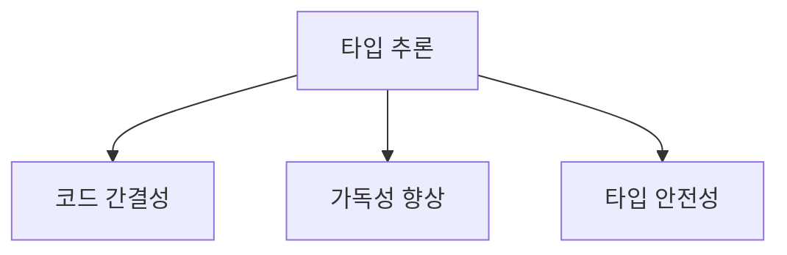
```mermaid
graph TD
    TypeInference["타입 추론"] --> CodeConciseness["코드 간결성"]
    TypeInference --> ReadabilityUp["가독성 향상"]
    TypeInference --> TypeSafety["타입 안전성"]
```

이와 같이 타입 추론은 타입스크립트의 유용성을 극대화하는 중요한 기능이며, 개발자에게 많은 이점을 제공한다.

## 타입 추론의 기본

**타입 추론이란 무엇인가?**  

타입 추론은 TypeScript가 변수, 함수의 반환값, 매개변수 등의 타입을 자동으로 결정하는 과정을 의미한다. 개발자가 명시적으로 타입을 지정하지 않더라도 TypeScript는 코드의 문맥을 분석하여 적절한 타입을 추론한다. 이를 통해 코드의 가독성을 높이고, 개발자가 타입을 일일이 지정하는 수고를 덜 수 있다.

**타입 추론의 작동 원리** 

타입 추론은 여러 단계로 이루어지며, 다음과 같은 원리로 작동한다.

- **타입 체크**  
  TypeScript는 코드가 작성될 때, 각 변수와 함수의 타입을 체크하여 일관성을 유지한다. 예를 들어, 숫자형 변수에 문자열을 할당하려고 하면 오류가 발생한다.

  ```typescript
  let num = 5; // TypeScript는 num의 타입을 number로 추론
  num = "Hello"; // 오류: Type 'string' is not assignable to type 'number'
  ```

- **타입 추론 규칙**  
  TypeScript는 다양한 규칙을 통해 타입을 추론한다. 예를 들어, 변수 초기화 시 할당된 값의 타입을 기반으로 추론하거나, 함수의 반환값을 분석하여 타입을 결정한다.

  ```typescript
  let str = "Hello"; // TypeScript는 str의 타입을 string으로 추론
  function add(a: number, b: number) {
      return a + b; // TypeScript는 반환값의 타입을 number로 추론
  }
  ```

- **타입 주석의 역할**  
  타입 주석은 개발자가 명시적으로 타입을 지정할 수 있는 방법이다. 타입 주석을 사용하면 TypeScript의 타입 추론을 보완하거나, 특정 타입을 강제할 수 있다. 이는 코드의 명확성을 높이고, 타입 오류를 사전에 방지하는 데 도움을 준다.

  ```typescript
  let isActive: boolean = true; // 타입 주석을 통해 isActive의 타입을 boolean으로 지정
  ```

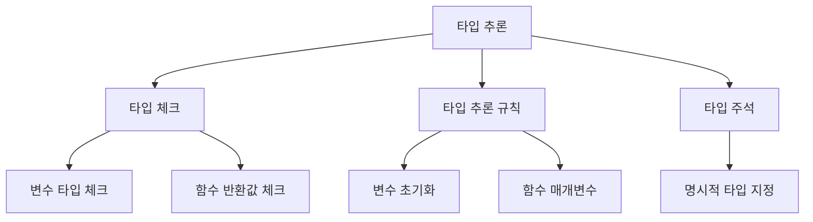
```mermaid
graph TD
    TypeInferenceRoot["타입 추론"] --> TypeCheck["타입 체크"]
    TypeInferenceRoot --> InferenceRules["타입 추론 규칙"]
    TypeInferenceRoot --> TypeAnnotation["타입 주석"]
    TypeCheck --> VarCheck["변수 타입 체크"]
    TypeCheck --> ReturnCheck["함수 반환값 체크"]
    InferenceRules --> VarInit["변수 초기화"]
    InferenceRules --> ParamType["함수 매개변수"]
    TypeAnnotation --> ExplicitType["명시적 타입 지정"]
```

타입 추론은 TypeScript의 핵심 기능 중 하나로, 코드의 안정성과 가독성을 높이는 데 중요한 역할을 한다. 이를 통해 개발자는 더 효율적으로 코드를 작성할 수 있으며, 타입 관련 오류를 줄일 수 있다.

## 타입 추론의 이점

타입스크립트의 타입 추론은 개발자에게 여러 가지 이점을 제공한다. 이 섹션에서는 코드 간결성, 가독성 향상, 그리고 타입 안전성에 대해 자세히 살펴보겠다.

**코드 간결성**

타입 추론을 사용하면 코드에서 타입을 명시적으로 선언할 필요가 줄어든다. 이는 코드의 길이를 줄이고, 불필요한 반복을 피할 수 있게 해준다. 예를 들어, 변수를 선언할 때 타입을 명시하지 않고도 초기값을 통해 타입이 자동으로 추론된다.

```typescript
let message = "Hello, TypeScript!"; // string 타입으로 추론됨
```

위의 코드에서 `message` 변수는 문자열 타입으로 자동으로 추론된다. 이처럼 타입을 명시하지 않아도 코드가 간결해지는 효과를 볼 수 있다.

**가독성 향상**

타입 추론은 코드의 가독성을 높이는 데 기여한다. 개발자는 타입을 명시적으로 선언하지 않아도 되므로, 코드의 핵심 로직에 집중할 수 있다. 또한, 타입스크립트는 IDE에서 타입 정보를 제공하므로, 개발자는 코드의 흐름을 쉽게 이해할 수 있다.

```typescript
function add(a: number, b: number) {
    return a + b;
}

let result = add(5, 10); // result는 number 타입으로 추론됨
```

위의 예제에서 `result` 변수는 `add` 함수의 반환값을 통해 타입이 자동으로 추론된다. 이로 인해 코드의 가독성이 향상된다.

**타입 안전성**

타입 추론은 코드의 타입 안전성을 높이는 데 중요한 역할을 한다. 타입스크립트는 컴파일 타임에 타입을 체크하므로, 런타임 오류를 줄일 수 있다. 이는 개발자가 코드 작성 시 실수를 줄이고, 더 안전한 코드를 작성할 수 있도록 돕는다.

```typescript
let num: number = 5;
num = "Hello"; // 오류 발생: Type 'string' is not assignable to type 'number'
```

위의 코드에서 `num` 변수는 숫자 타입으로 선언되었기 때문에, 문자열을 할당하려고 하면 오류가 발생한다. 이러한 타입 체크는 개발자가 실수를 미리 방지할 수 있게 해준다.

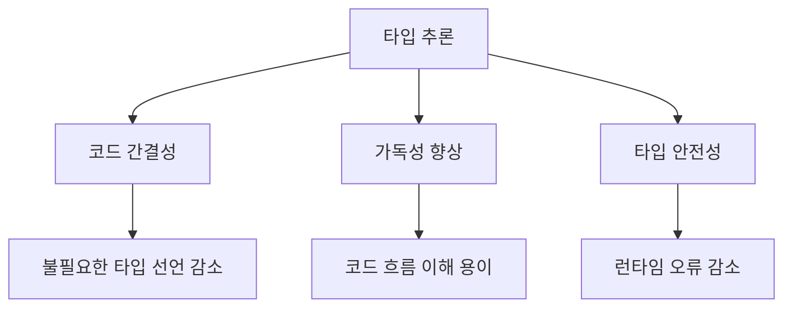
```mermaid
graph TD
    InferenceBenefits["타입 추론"] --> Conciseness["코드 간결성"]
    InferenceBenefits --> Readability["가독성 향상"]
    InferenceBenefits --> Safety["타입 안전성"]
    Conciseness --> LessDecl["불필요한 타입 선언 감소"]
    Readability --> FlowUnderstand["코드 흐름 이해 용이"]
    Safety --> LessRuntime["런타임 오류 감소"]
```

위의 다이어그램은 타입 추론이 제공하는 주요 이점들을 시각적으로 나타낸 것이다. 타입 추론은 코드의 품질을 높이는 데 기여하며, 개발자에게 더 나은 개발 경험을 제공한다.

## 고급 타입 추론

**유니온 타입의 정의 및 예제**  
유니온 타입은 TypeScript에서 여러 타입 중 하나를 허용하는 타입이다. 즉, 변수나 함수의 매개변수가 여러 타입을 가질 수 있도록 정의할 수 있다. 유니온 타입은 `|` 기호를 사용하여 여러 타입을 결합하여 표현한다. 

예를 들어, 다음과 같은 코드가 있다.

```typescript
function printId(id: number | string) {
    console.log(`Your ID is: ${id}`);
}

printId(101); // 숫자 타입
printId("202"); // 문자열 타입
```

위의 예제에서 `printId` 함수는 `number` 또는 `string` 타입의 `id`를 매개변수로 받을 수 있다. 이처럼 유니온 타입을 사용하면 함수가 다양한 타입의 인자를 처리할 수 있도록 유연성을 제공한다.

**유니온 타입을 통한 타입 추론**  
TypeScript는 유니온 타입을 사용하여 변수의 타입을 추론할 수 있다. 예를 들어, 다음과 같은 코드에서 TypeScript는 `value` 변수가 유니온 타입으로 추론된다.

```typescript
let value: number | string;

value = 42; // number 타입
console.log(value); // 42

value = "Hello"; // string 타입
console.log(value); // Hello
```

이 경우, `value`는 처음에 `number` 타입으로 초기화되었다가, 이후에 `string` 타입으로 변경되었다. TypeScript는 이러한 타입 변화를 인식하고, 유니온 타입으로 추론한다.

다음은 유니온 타입을 활용한 예제 다이어그램이다.

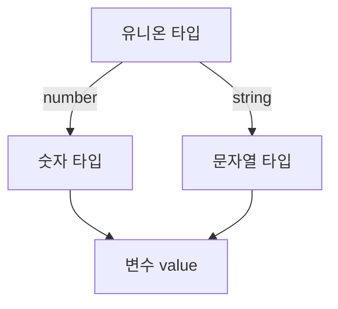
```mermaid
graph TD
    UnionType["유니온 타입"] -->|"number"| NumType["숫자 타입"]
    UnionType -->|"string"| StrType["문자열 타입"]
    NumType --> ValueVar["변수 value"]
    StrType --> ValueVar
```

위의 다이어그램은 유니온 타입이 `number`와 `string` 두 가지 타입을 포함하고 있으며, 이 두 타입 모두 `value` 변수에 할당될 수 있음을 보여준다. 유니온 타입을 활용하면 코드의 유연성을 높이고, 다양한 타입을 처리할 수 있는 장점을 제공한다.

## 교차 타입

**교차 타입의 정의 및 예제**

교차 타입(Cross Type)은 TypeScript에서 여러 타입을 결합하여 새로운 타입을 생성하는 방법이다. 이는 여러 타입의 속성을 모두 포함하는 객체 타입을 정의할 수 있게 해준다. 교차 타입은 `&` 연산자를 사용하여 정의하며, 여러 인터페이스나 타입을 조합할 수 있다.

예를 들어, 두 개의 인터페이스 `Person`과 `Contact`가 있다고 가정해보자.

```typescript
interface Person {
    name: string;
    age: number;
}

interface Contact {
    email: string;
    phone: string;
}

type Employee = Person & Contact;

const employee: Employee = {
    name: "John Doe",
    age: 30,
    email: "john.doe@example.com",
    phone: "123-456-7890"
};
```

위의 예제에서 `Employee` 타입은 `Person`과 `Contact`의 모든 속성을 포함하고 있다. 따라서 `employee` 객체는 두 인터페이스의 속성을 모두 갖추고 있어야 한다.

**교차 타입을 통한 객체 타입 정의**

교차 타입은 객체 타입을 정의할 때 매우 유용하다. 여러 타입의 속성을 조합하여 복잡한 객체를 쉽게 정의할 수 있기 때문이다. 예를 들어, 다음과 같이 다양한 속성을 가진 객체를 정의할 수 있다.

```typescript
interface Address {
    street: string;
    city: string;
}

type UserProfile = Person & Contact & Address;

const userProfile: UserProfile = {
    name: "Jane Smith",
    age: 28,
    email: "jane.smith@example.com",
    phone: "987-654-3210",
    street: "123 Main St",
    city: "Anytown"
};
```

위의 코드에서 `UserProfile` 타입은 `Person`, `Contact`, `Address`의 모든 속성을 포함하고 있다. 이를 통해 다양한 정보를 가진 사용자 프로필 객체를 쉽게 정의할 수 있다.

다음은 교차 타입의 구조를 시각적으로 나타낸 다이어그램이다.

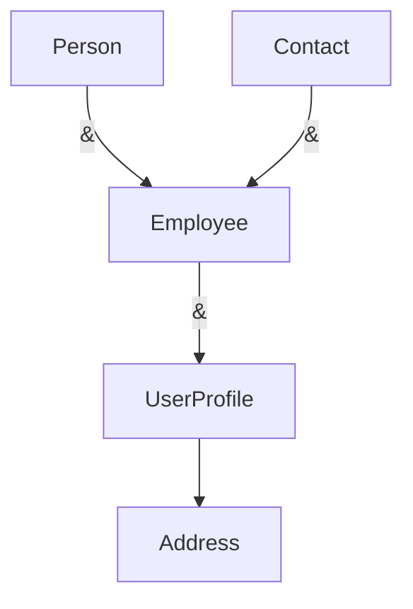
```mermaid
graph TD
    PersonNode["Person"] -->|"&"| EmployeeNode["Employee"]
    ContactNode["Contact"] -->|"&"| EmployeeNode
    EmployeeNode -->|"&"| UserProfileNode["UserProfile"]
    UserProfileNode --> AddressNode["Address"]
```

이 다이어그램은 `Person`과 `Contact`가 결합되어 `Employee`를 형성하고, `UserProfile`이 `Employee`와 `Address`를 결합하여 생성되는 구조를 보여준다. 교차 타입을 사용하면 이러한 방식으로 복잡한 타입을 쉽게 관리할 수 있다.

## 제네릭

**제네릭의 정의 및 예제**  

제네릭은 TypeScript에서 타입을 매개변수로 받아 다양한 타입에 대해 유연하게 동작할 수 있도록 하는 기능이다. 이를 통해 코드의 재사용성을 높이고, 타입 안전성을 유지할 수 있다. 제네릭을 사용하면 특정 타입에 의존하지 않고, 다양한 타입에 대해 동일한 로직을 적용할 수 있다.

예를 들어, 배열의 요소를 출력하는 함수를 제네릭으로 정의할 수 있다. 아래는 제네릭을 사용한 간단한 예제이다.

```typescript
function printArray<T>(arr: T[]): void {
    arr.forEach(element => {
        console.log(element);
    });
}

printArray<number>([1, 2, 3]); // 1, 2, 3
printArray<string>(['a', 'b', 'c']); // a, b, c
```

위의 코드에서 `printArray` 함수는 제네릭 타입 매개변수 `T`를 사용하여, 어떤 타입의 배열이든 받아들일 수 있다. 이를 통해 숫자 배열과 문자열 배열 모두를 처리할 수 있다.

**제네릭을 통한 함수 및 클래스의 타입 추론**  

제네릭은 함수뿐만 아니라 클래스에서도 사용할 수 있다. 클래스에서 제네릭을 사용하면, 인스턴스를 생성할 때 타입을 지정할 수 있으며, 이를 통해 타입 안전성을 더욱 강화할 수 있다.

아래는 제네릭을 사용한 클래스의 예제이다.

```typescript
class Box<T> {
    private value: T;

    constructor(value: T) {
        this.value = value;
    }

    getValue(): T {
        return this.value;
    }
}

const numberBox = new Box<number>(123);
console.log(numberBox.getValue()); // 123

const stringBox = new Box<string>('Hello');
console.log(stringBox.getValue()); // Hello
```

위의 `Box` 클래스는 제네릭 타입 매개변수 `T`를 사용하여, 다양한 타입의 값을 저장할 수 있다. `numberBox`와 `stringBox`는 각각 숫자와 문자열을 저장하는 인스턴스이다.

이와 같은 방식으로 제네릭을 활용하면, 코드의 재사용성을 높이고, 타입 추론을 통해 더욱 안전한 코드를 작성할 수 있다.

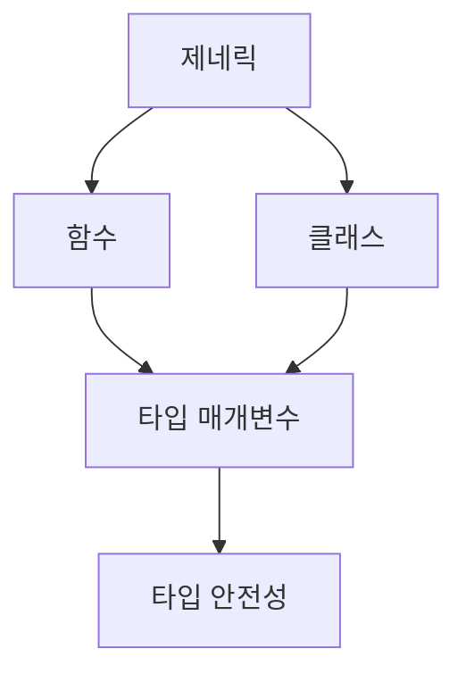
```mermaid
graph TD
    Generics["제네릭"] --> FuncNode["함수"]
    Generics --> ClassNode["클래스"]
    FuncNode --> TypeParam["타입 매개변수"]
    ClassNode --> TypeParam
    TypeParam --> GenTypeSafety["타입 안전성"]
```

위의 다이어그램은 제네릭이 함수와 클래스에서 어떻게 사용되는지를 나타낸다. 제네릭을 통해 타입 매개변수를 사용함으로써, 코드의 안전성을 높일 수 있음을 보여준다.

## 타입 추론의 다양한 사례

**변수 초기화 시 타입 추론**

타입스크립트는 변수 초기화 시 자동으로 타입을 추론하는 기능을 제공한다. 이는 개발자가 명시적으로 타입을 지정하지 않아도, 초기값에 따라 적절한 타입을 자동으로 결정하는 것을 의미한다. 예를 들어, 다음과 같은 코드가 있다.

```typescript
let num = 42; // num은 number 타입으로 추론된다.
let str = "Hello, TypeScript!"; // str은 string 타입으로 추론된다.
let isActive = true; // isActive는 boolean 타입으로 추론된다.
```

위의 예제에서 `num`, `str`, `isActive` 변수는 각각 `number`, `string`, `boolean` 타입으로 자동으로 추론된다. 이러한 타입 추론은 코드의 가독성을 높이고, 개발자가 타입을 명시적으로 지정할 필요를 줄여준다.

**함수 반환값에 따른 타입 추론**

타입스크립트는 함수의 반환값에 따라서도 타입을 추론할 수 있다. 함수의 반환값이 명확할 경우, 타입스크립트는 해당 반환값의 타입을 자동으로 결정한다. 다음은 함수 반환값에 따른 타입 추론의 예시이다.

```typescript
function add(a: number, b: number) {
    return a + b; // 반환값은 number 타입으로 추론된다.
}

const result = add(5, 10); // result는 number 타입으로 추론된다.
```

위의 코드에서 `add` 함수는 두 개의 `number` 타입 매개변수를 받아서 그 합을 반환한다. 타입스크립트는 이 함수의 반환값이 `number` 타입임을 자동으로 추론하여, `result` 변수 또한 `number` 타입으로 결정된다.

이와 같은 타입 추론 기능은 코드 작성 시 타입을 명시적으로 지정하지 않아도 되므로, 개발자의 생산성을 높이는 데 기여한다.

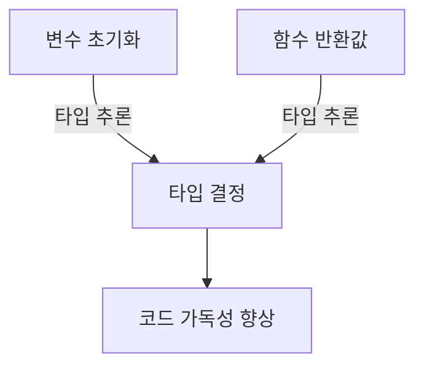
```mermaid
graph TD
    VarInitNode["변수 초기화"] -->|"타입 추론"| TypeDecide["타입 결정"]
    FuncReturn["함수 반환값"] -->|"타입 추론"| TypeDecide
    TypeDecide --> CodeReadability["코드 가독성 향상"]
```

위의 다이어그램은 변수 초기화와 함수 반환값에 따른 타입 추론 과정을 시각적으로 나타낸 것이다. 이러한 타입 추론 기능은 타입스크립트의 강력한 특징 중 하나로, 개발자가 보다 효율적으로 코드를 작성할 수 있도록 돕는다.

## 배열 및 객체의 타입 추론

**배열의 타입 추론 예제**  

TypeScript는 배열을 초기화할 때, 그 요소의 타입을 자동으로 추론한다. 예를 들어, 숫자 배열을 선언하고 초기화하면 TypeScript는 해당 배열의 타입을 `number[]`로 추론한다. 다음은 간단한 예제이다.

```typescript
let numbers = [1, 2, 3, 4]; // TypeScript는 numbers의 타입을 number[]로 추론한다.
```

이 경우, `numbers` 배열에 숫자 이외의 값을 추가하려고 하면 TypeScript는 오류를 발생시킨다.

```typescript
numbers.push("5"); // 오류: Argument of type 'string' is not assignable to parameter of type 'number'.
```

이처럼 TypeScript의 타입 추론 기능은 배열의 요소 타입을 명확히 하여 코드의 안전성을 높인다.

**객체의 타입 추론 예제** 

TypeScript는 객체를 초기화할 때도 그 속성의 타입을 추론할 수 있다. 예를 들어, 다음과 같은 객체를 선언할 수 있다.

```typescript
let person = {
    name: "Alice",
    age: 30
}; // TypeScript는 person의 타입을 { name: string; age: number; }로 추론한다.
```

이 경우, `person` 객체의 속성에 잘못된 타입의 값을 할당하려고 하면 TypeScript는 오류를 발생시킨다.

```typescript
person.age = "thirty"; // 오류: Type 'string' is not assignable to type 'number'.
```

이러한 타입 추론은 객체의 구조를 명확히 하여 코드의 가독성을 높이고, 개발자가 실수로 잘못된 타입을 할당하는 것을 방지한다.

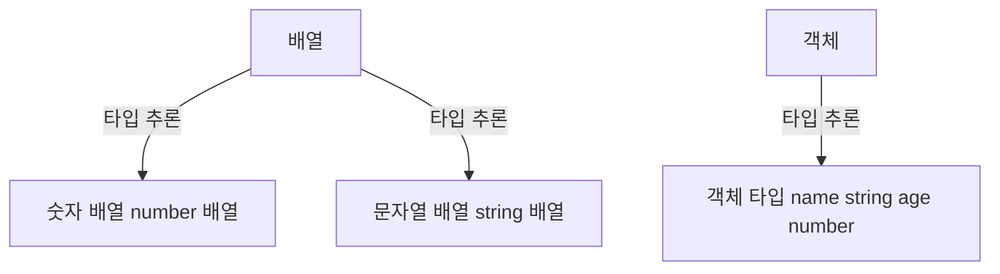
```mermaid
graph TD
    ArrNode["배열"] -->|"타입 추론"| NumArr["숫자 배열 number 배열"]
    ArrNode -->|"타입 추론"| StrArr["문자열 배열 string 배열"]
    ObjNode["객체"] -->|"타입 추론"| ObjType["객체 타입 name string age number"]
```

위의 다이어그램은 배열과 객체의 타입 추론 과정을 시각적으로 나타낸 것이다. 배열의 경우, 요소의 타입에 따라 다양한 배열 타입으로 추론되며, 객체의 경우 속성의 타입에 따라 객체 타입으로 추론된다. 이러한 타입 추론 기능은 TypeScript의 강력한 타입 시스템의 핵심 요소 중 하나이다.

## 문맥상의 타이핑 (Contextual Typing)

**문맥상의 타이핑의 정의** 

문맥상의 타이핑은 TypeScript에서 특정한 상황이나 문맥에 따라 변수나 함수의 타입을 자동으로 추론하는 기능이다. 이는 주로 함수의 인자나 반환값, 또는 객체의 속성에 대한 타입을 결정할 때 유용하게 사용된다. 문맥상의 타이핑은 코드의 가독성을 높이고, 개발자가 명시적으로 타입을 지정하지 않아도 타입 안전성을 유지할 수 있도록 돕는다.

**문맥상의 타이핑 예제**  

아래의 예제를 통해 문맥상의 타이핑이 어떻게 작동하는지 살펴보겠다.

```typescript
// 함수의 인자에 대한 문맥상의 타이핑
const logMessage = (message: string) => {
    console.log(message);
};

// logMessage 함수에 문자열을 전달하면 TypeScript는 message의 타입을 자동으로 추론한다.
logMessage("Hello, TypeScript!"); // 정상 작동
logMessage(42); // 오류 발생: Argument of type 'number' is not assignable to parameter of type 'string'.
```

위의 예제에서 `logMessage` 함수는 `message`라는 인자를 받는다. 이 인자는 문자열 타입으로 정의되어 있으며, TypeScript는 이 정보를 바탕으로 `logMessage` 함수에 전달되는 인자의 타입을 자동으로 추론한다. 만약 숫자 타입의 인자를 전달하려고 하면 TypeScript는 오류를 발생시킨다.

또한, 문맥상의 타이핑은 객체의 속성에서도 적용된다. 다음은 객체의 속성에 대한 문맥상의 타이핑 예제이다.

```typescript
// 객체의 속성에 대한 문맥상의 타이핑
const user = {
    name: "Alice",
    age: 30,
};

// user 객체의 속성에 대한 타입이 자동으로 추론된다.
const greetUser = (user: { name: string; age: number }) => {
    console.log(`Hello, ${user.name}. You are ${user.age} years old.`);
};

greetUser(user); // 정상 작동
```

위의 예제에서 `user` 객체는 `name`과 `age`라는 두 개의 속성을 가지고 있다. TypeScript는 이 객체의 구조를 분석하여 `greetUser` 함수의 인자 타입을 자동으로 추론한다. 이처럼 문맥상의 타이핑은 코드의 명확성을 높이고, 타입 안전성을 보장하는 데 큰 역할을 한다.

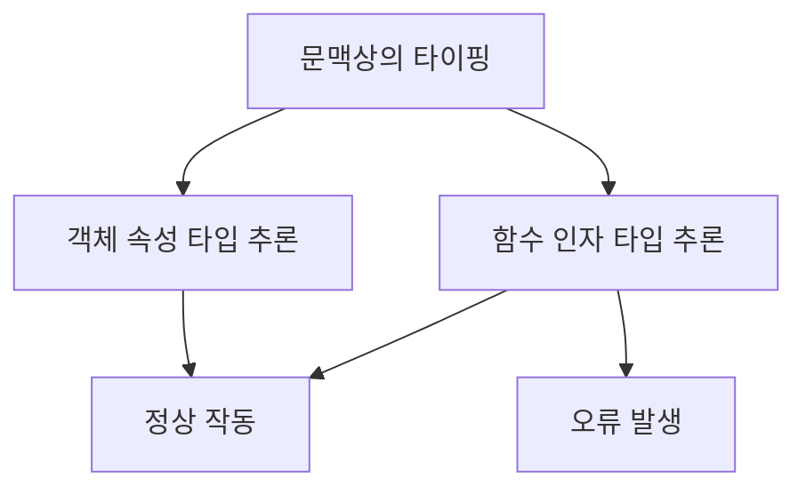
```mermaid
graph TD
    ContextTyping["문맥상의 타이핑"] --> ArgInference["함수 인자 타입 추론"]
    ContextTyping --> PropInference["객체 속성 타입 추론"]
    ArgInference --> OkResult["정상 작동"]
    ArgInference --> ErrResult["오류 발생"]
    PropInference --> OkResult
```

위의 다이어그램은 문맥상의 타이핑이 함수 인자와 객체 속성에서 어떻게 작동하는지를 시각적으로 나타낸 것이다. 문맥상의 타이핑은 TypeScript의 강력한 기능 중 하나로, 개발자가 보다 안전하고 효율적인 코드를 작성할 수 있도록 돕는다.

## 최적의 공통 타입 (Best Common Type)

**최적의 공통 타입의 정의** 

최적의 공통 타입(Best Common Type)은 TypeScript에서 여러 타입이 혼합된 경우, 이들 타입의 공통된 특성을 추론하여 가장 적합한 타입을 결정하는 과정을 의미한다. 이는 주로 배열이나 여러 변수의 타입이 서로 다를 때 발생하며, TypeScript는 이러한 상황에서 최적의 공통 타입을 찾아내어 코드의 타입 안전성을 높인다. 

예를 들어, 두 개의 서로 다른 타입을 가진 변수가 있을 때, TypeScript는 이 두 타입의 공통된 부분을 찾아내어 새로운 타입을 생성한다. 이 과정은 코드의 가독성을 높이고, 타입 오류를 줄이는 데 기여한다.

**최적의 공통 타입을 통한 타입 추론 예제** 
 
다음은 최적의 공통 타입을 활용한 간단한 예제이다.

```typescript
function getLength(input: string | string[]): number {
    return input.length;
}

const strLength = getLength("Hello, TypeScript!"); // strLength는 number 타입
const arrLength = getLength(["Hello", "TypeScript"]); // arrLength도 number 타입
```

위의 코드에서 `getLength` 함수는 입력으로 문자열 또는 문자열 배열을 받을 수 있다. TypeScript는 `input`의 타입이 `string | string[]`임을 인식하고, 이 두 타입의 공통된 특성인 `length` 속성을 사용하여 반환 타입을 `number`로 추론한다. 

이와 같은 방식으로 TypeScript는 다양한 타입을 처리할 수 있으며, 개발자는 보다 안전하고 간결한 코드를 작성할 수 있다.

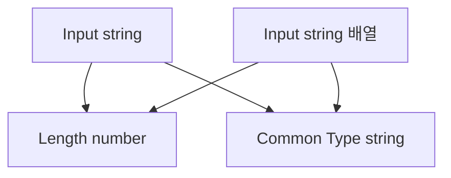
```mermaid
graph TD
    InputStr["Input string"] --> LengthNum["Length number"]
    InputStr --> CommonStr["Common Type string"]
    InputArr["Input string 배열"] --> LengthNum
    InputArr --> CommonStr
```

위의 다이어그램은 `string`과 `string[]` 타입이 `getLength` 함수에 입력될 때, TypeScript가 어떻게 공통 타입을 추론하고, 최종적으로 `number` 타입의 길이를 반환하는지를 보여준다. 

이처럼 최적의 공통 타입은 TypeScript의 타입 추론에서 중요한 역할을 하며, 다양한 타입을 안전하게 처리할 수 있는 기반을 제공한다.

## 타입스크립트의 타입 체크

타입스크립트는 정적 타입 언어로, 코드 작성 시 타입 체크를 통해 오류를 사전에 방지할 수 있다. 타입 체크는 코드의 안정성을 높이고, 유지보수를 용이하게 하는 중요한 역할을 한다. 이번 섹션에서는 타입 체크의 원칙과 Duck Typing 및 Structural Subtyping에 대해 살펴보겠다.

**타입 체크의 원칙**

타입 체크는 주로 두 가지 원칙에 기반하여 작동한다. 첫 번째는 "정적 타입 체크"이며, 두 번째는 "구조적 타이핑"이다. 정적 타입 체크는 컴파일 타임에 타입 오류를 발견하는 방식으로, 코드가 실행되기 전에 오류를 미리 확인할 수 있다. 구조적 타이핑은 객체의 구조를 기반으로 타입을 결정하는 방식으로, 객체의 속성과 메서드가 일치하는지를 검사한다.

다음은 타입 체크의 원칙을 설명하는 간단한 다이어그램이다.

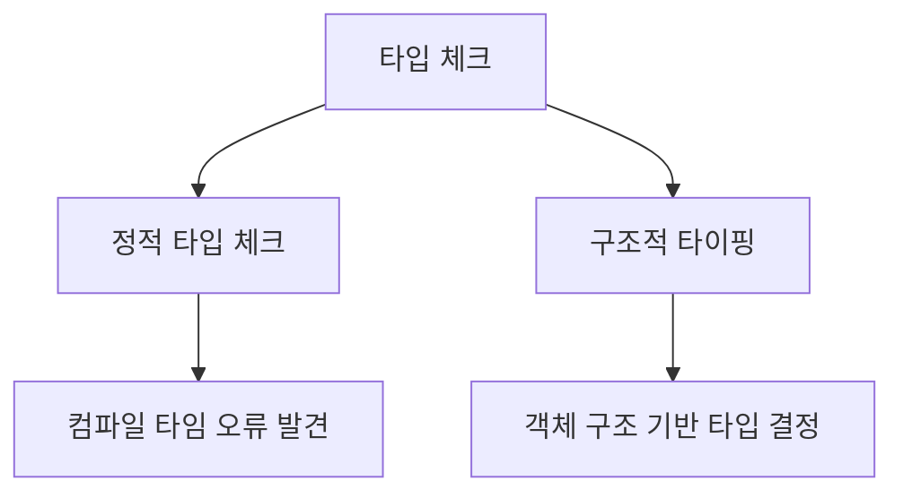
```mermaid
graph TD
    TypeCheckRoot["타입 체크"] --> StaticCheck["정적 타입 체크"]
    TypeCheckRoot --> StructuralTyping["구조적 타이핑"]
    StaticCheck --> CompileError["컴파일 타임 오류 발견"]
    StructuralTyping --> ObjStructure["객체 구조 기반 타입 결정"]
```

**Duck Typing 및 Structural Subtyping 설명**

Duck Typing은 "오리처럼 걷고, 오리처럼 꽥꽥거린다면, 그것은 오리이다"라는 원칙에 기반한 개념이다. 즉, 객체의 타입은 그 객체가 가진 속성과 메서드에 의해 결정되며, 명시적인 타입 선언이 필요하지 않다. 타입스크립트에서는 Duck Typing을 통해 객체가 특정 인터페이스를 구현하는지 여부를 검사할 수 있다.

예를 들어, 다음과 같은 코드에서 `quack` 메서드를 가진 객체는 `Duck` 타입으로 간주된다.

```typescript
interface Duck {
    quack: () => void;
}

function makeItQuack(duck: Duck) {
    duck.quack();
}

const myDuck = {
    quack: () => console.log("꽥꽥!")
};

makeItQuack(myDuck); // "꽥꽥!" 출력
```

이와 같은 방식으로 Duck Typing은 타입스크립트의 유연성을 높여준다.

Structural Subtyping은 객체의 구조를 기반으로 타입을 결정하는 방식이다. 즉, 객체가 특정 타입의 모든 속성과 메서드를 포함하고 있다면, 해당 객체는 그 타입으로 간주된다. 이는 타입스크립트의 강력한 타입 시스템의 핵심 요소 중 하나이다.

다음은 Structural Subtyping의 예시이다.

```typescript
interface Person {
    name: string;
    age: number;
}

function greet(person: Person) {
    console.log(`안녕하세요, ${person.name}님!`);
}

const user = {
    name: "홍길동",
    age: 30,
    location: "서울" // 추가 속성
};

greet(user); // "안녕하세요, 홍길동님!" 출력
```

위의 예시에서 `user` 객체는 `Person` 인터페이스의 모든 속성을 포함하고 있으므로, 타입 체크를 통과한다. 추가 속성인 `location`은 무시되며, 이는 구조적 타이핑의 유연성을 보여준다.

타입스크립트의 타입 체크는 이러한 원칙을 통해 코드의 안정성을 높이고, 개발자가 보다 안전하게 코드를 작성할 수 있도록 돕는다.

## FAQ

**타입 추론을 사용할 때의 주의사항은 무엇인가?**

타입 추론은 TypeScript의 강력한 기능 중 하나이지만, 사용할 때 몇 가지 주의사항이 있다. 첫째, 타입 추론이 항상 정확하지 않을 수 있다는 점이다. TypeScript는 변수의 초기값을 기반으로 타입을 추론하지만, 초기값이 명확하지 않거나 복잡한 경우에는 잘못된 타입이 추론될 수 있다. 따라서, 중요한 변수나 함수의 반환값에 대해서는 명시적으로 타입을 주석으로 작성하는 것이 좋다.

둘째, 타입 추론이 지나치게 복잡해질 경우 코드의 가독성이 떨어질 수 있다. 예를 들어, 여러 개의 유니온 타입이나 교차 타입이 결합된 경우, 타입이 무엇인지 파악하기 어려울 수 있다. 이럴 때는 코드의 가독성을 높이기 위해 타입 별칭을 사용하는 것이 유용하다.

```typescript
// 타입 추론이 복잡해질 수 있는 예제
type A = { name: string } | { age: number };
type B = { address: string } & { phone: string };

const example: A & B = {
  name: "John",
  address: "123 Main St",
  phone: "123-456-7890"
};
```

**타입 추론이 복잡한 경우 어떻게 처리해야 하는가?**

타입 추론이 복잡한 경우, 몇 가지 방법으로 이를 처리할 수 있다. 첫째, 타입 별칭을 사용하여 복잡한 타입을 간단하게 정의할 수 있다. 타입 별칭을 사용하면 코드의 가독성을 높이고, 재사용성을 증가시킬 수 있다.

둘째, 제네릭을 활용하여 타입을 동적으로 정의할 수 있다. 제네릭을 사용하면 다양한 타입에 대해 유연하게 대응할 수 있으며, 코드의 재사용성을 높일 수 있다.

```typescript
// 제네릭을 활용한 예제
function identity<T>(arg: T): T {
  return arg;
}

const result = identity<string>("Hello, TypeScript");
```

**타입 추론과 타입 주석의 차이는 무엇인가?**

타입 추론과 타입 주석은 TypeScript에서 타입을 정의하는 두 가지 방법이다. 타입 추론은 TypeScript가 변수의 초기값을 기반으로 자동으로 타입을 결정하는 반면, 타입 주석은 개발자가 명시적으로 타입을 지정하는 방법이다.

타입 추론은 코드 작성 시 편리함을 제공하지만, 때로는 예상치 못한 타입이 추론될 수 있다. 반면, 타입 주석은 명확한 타입 정의를 제공하여 코드의 의도를 분명히 할 수 있다. 따라서, 중요한 부분에서는 타입 주석을 사용하는 것이 좋다.

```typescript
// 타입 추론 예제
let inferredString = "Hello, TypeScript"; // string으로 추론됨

// 타입 주석 예제
let annotatedString: string = "Hello, TypeScript"; // 명시적으로 string 타입 지정
```

이와 같이, 타입 추론과 타입 주석은 각각의 장단점이 있으며, 상황에 따라 적절히 활용하는 것이 중요하다.

## 관련 기술

**TypeScript와 JavaScript의 차이점**

TypeScript는 JavaScript의 상위 집합으로, 정적 타입을 지원하는 언어이다. JavaScript는 동적 타입 언어로, 변수의 타입이 런타임에 결정된다. 반면, TypeScript는 컴파일 타임에 타입을 체크하여 코드의 안정성을 높인다. 이러한 차이로 인해 TypeScript는 대규모 애플리케이션 개발에 유리하다.

| 특징               | JavaScript                | TypeScript               |
|--------------------|--------------------------|--------------------------|
| 타입 시스템        | 동적 타입                | 정적 타입                |
| 컴파일             | 인터프리터 방식         | 컴파일 필요              |
| IDE 지원           | 기본적인 지원            | 강력한 자동 완성 및 오류 체크 |
| 클래스 기반 객체지향 | 지원                     | 지원                     |

**타입스크립트의 다른 기능 (인터페이스, 타입 별칭)**

TypeScript는 인터페이스와 타입 별칭을 통해 복잡한 타입을 정의할 수 있다. 인터페이스는 객체 구조를 정의하고, 타입 별칭은 특정 타입에 이름을 부여한다.

```typescript
interface User {
    id: number;
    name: string;
    email: string;
}

type Point = { x: number; y: number; };
```

**도구 (TSLint, Prettier)**

TSLint는 TypeScript 코드 스타일·품질 검사, Prettier는 코드 포맷팅으로 가독성을 높인다. ESLint와 Prettier 조합이 현재 많이 사용된다.

## 결론

타입스크립트의 타입 추론은 명시적 타입 없이도 문맥을 분석해 타입을 자동 결정하는 핵심 기능이다. 코드 간결성·가독성·유지보수성 향상과 버그 사전 방지에 기여한다. 복잡한 경우 타입 별칭·제네릭을 활용하고, 공식 문서와 커뮤니티 자료로 심화 학습할 수 있다.

## 참고 자료

- [TypeScript 공식 문서](https://www.typescriptlang.org/docs/): 기본 개념부터 고급 기능, 최신 업데이트를 확인할 수 있다.
- [TypeScript Handbook - Type Inference](https://www.typescriptlang.org/docs/handbook/type-inference.html): 타입 추론 공식 핸드북.
- [TypeScript GitHub](https://github.com/microsoft/TypeScript): 공식 저장소, 이슈·기여·릴리즈 노트.
- [Stack Overflow - TypeScript](https://stackoverflow.com/questions/tagged/typescript): 타입 추론·타입 체크 관련 Q&A.
- [DEV - TypeScript inference and its usefulness](https://dev.to/shagun_mistry/typescript-inference-and-its-usefulness-41ek): 타입 추론 요약 및 활용 예.

## Reference

- [TypeScript Handbook - Type Inference](https://www.typescriptlang.org/docs/handbook/type-inference.html)
- [TypeScript 공식 문서](https://www.typescriptlang.org/docs/)
- [DEV - TypeScript inference and its usefulness](https://dev.to/shagun_mistry/typescript-inference-and-its-usefulness-41ek)
- [TypeScript GitHub Repository](https://github.com/microsoft/TypeScript)
- [Stack Overflow - typescript tag](https://stackoverflow.com/questions/tagged/typescript)
