API를 개발할 때 데이터베이스 성능은 매우 중요한 요소이다. 그러나 많은 개발자들이 흔히 저지르는 실수들이 존재하며, 이러한 실수들은 API의 전반적인 성능에 부정적인 영향을 미칠 수 있다. 본 글에서는 API 개발에서 자주 발생하는 다섯 가지 데이터베이스 성능 실수에 대해 살펴보겠다. 첫 번째 실수는 변경되지 않는 정보를 쿼리하는 것이다. 이는 불필요한 데이터베이스 쿼리를 초래하여 성능 저하를 일으킬 수 있다. 두 번째 실수는 상태 페이지 체크가 데이터베이스를 과도하게 사용하는 경우이다. 이러한 체크는 서버의 건강 상태를 모니터링하는 데 필요하지만, 지나치게 빈번한 쿼리는 데이터베이스에 부담을 줄 수 있다. 세 번째 실수는 API 인증 과정에서 너무 많은 쿼리를 사용하는 것이다. 인증 정보를 캐싱하여 성능을 개선할 수 있다. 네 번째 실수는 객체 관계 매퍼가 루프 내에서 쿼리하는 경우이다. 이는 의도치 않게 많은 쿼리를 발생시킬 수 있다. 마지막으로, 다섯 번째 실수는 빠른 쿼리를 무시하는 것이다. 빠른 쿼리라도 누적되면 성능에 영향을 미칠 수 있으므로, 모든 쿼리에 주의를 기울여야 한다. 이러한 실수들을 피하고 데이터베이스 성능을 최적화하는 방법에 대해 논의할 것이다.


||
|:---:|
||


<!--
##### Outline #####
-->

<!--
# 데이터베이스 성능 최적화: API 개발에서의 흔한 실수들

## 개요
- 데이터베이스 성능의 중요성
- API 개발에서의 일반적인 문제점 소개

## 1. 흔한 데이터베이스 성능 실수
### 1.1 정보 변경이 없는 쿼리
- 정적 데이터 캐싱의 필요성
- 예제 코드: C#에서의 캐시 구현

### 1.2 데이터베이스 과다 사용 상태 페이지 체크
- 상태 체크의 중요성
- 캐싱을 통한 데이터베이스 부하 감소 방법

### 1.3 너무 많은 쿼리를 사용하는 API 인증
- 인증 및 권한 확인의 성능 문제
- 캐시를 통한 인증 최적화 방법

### 1.4 루프 내에서 쿼리하는 객체 관계 매퍼
- ORM 사용 시 주의사항
- 성능 모니터링 및 최적화 기법

### 1.5 빠른 쿼리 무시하기
- 쿼리 성능의 누적 효과
- API 설계에서의 쿼리 최적화 중요성

## 2. 데이터베이스 설계 및 관리의 일반적인 실수
### 2.1 불완전한 설계 및 계획
- 데이터 요구 사항의 이해 부족
- 정규화의 중요성

### 2.2 중복 데이터 및 레코드
- 데이터 일관성 문제
- 유지 관리의 비효율성

### 2.3 불명확한 명명 규칙 및 문서화 부족
- 명확한 명명 규칙의 필요성
- 문서화의 중요성

### 2.4 보안 조치 부족
- 접근 제어 및 데이터 암호화의 필요성
- 보안 정책 및 업데이트의 중요성

### 2.5 비효율적인 쿼리 최적화
- 복잡한 쿼리 구조
- 적절한 인덱스 사용의 중요성

## 3. 데이터베이스 성능 문제 해결 방법
### 3.1 인덱스 부족 문제 해결
- 인덱스 추가 및 최적화 방법
- 예제: 인덱스 추가 전후 성능 비교

### 3.2 비효율적인 쿼리 개선
- 쿼리 최적화 기법
- 예제: 비효율적인 쿼리와 최적화된 쿼리 비교

### 3.3 데이터 타입의 적절한 선택
- 데이터 타입 최적화 방법
- 성능 고려 사항

### 3.4 정기적인 유지 관리의 중요성
- 데이터베이스 백업 및 업데이트
- 성능 모니터링 및 조정

### 3.5 하드웨어 제한 문제 해결
- RAM, 하드 디스크, CPU의 중요성
- 하드웨어 업그레이드 고려 사항

## 4. 예제
- API 성능 최적화를 위한 실제 사례
- 데이터베이스 쿼리 최적화 전후 성능 비교

## 5. FAQ
- 데이터베이스 성능 문제를 어떻게 진단하나요?
- API에서 데이터베이스 쿼리를 최적화하는 방법은 무엇인가요?
- 데이터베이스 인덱스는 언제 추가해야 하나요?

## 6. 관련 기술
- ORM (객체 관계 매퍼)
- 캐싱 전략
- 데이터베이스 모니터링 도구

## 7. 결론
- 데이터베이스 성능 최적화의 중요성
- API 개발에서의 성능 문제 예방 및 해결 방안 요약
-->

<!--
## 개요
- 데이터베이스 성능의 중요성
- API 개발에서의 일반적인 문제점 소개
-->

## 개요

**데이터베이스 성능의 중요성**  

데이터베이스는 현대 애플리케이션의 핵심 구성 요소로, 데이터의 저장, 검색 및 관리 기능을 제공한다. 따라서 데이터베이스의 성능은 전체 시스템의 성능에 직접적인 영향을 미친다. 데이터베이스 성능이 저하되면 애플리케이션의 응답 속도가 느려지고, 사용자 경험이 저하되며, 결국 비즈니스에 부정적인 영향을 미칠 수 있다. 따라서 데이터베이스 성능 최적화는 API 개발에서 매우 중요한 요소로 자리 잡고 있다.

**API 개발에서의 일반적인 문제점 소개**  

API(Application Programming Interface)는 클라이언트와 서버 간의 상호작용을 가능하게 하는 중요한 인터페이스이다. 그러나 API 개발 과정에서 데이터베이스와의 상호작용이 비효율적으로 이루어질 경우, 성능 저하를 초래할 수 있다. 일반적으로 발생하는 문제점으로는 불필요한 쿼리 실행, 비효율적인 데이터 처리, 캐싱 미비 등이 있다. 이러한 문제들은 데이터베이스의 부하를 증가시키고, API의 응답 시간을 늘리며, 사용자에게 불편을 초래할 수 있다.

다음은 API와 데이터베이스 간의 상호작용을 시각적으로 나타낸 다이어그램이다.


이 다이어그램은 클라이언트가 API 서버에 요청을 보내고, API 서버가 데이터베이스에 쿼리를 실행하여 결과를 반환하는 과정을 보여준다. 이 과정에서 데이터베이스 성능이 저하되면, API 서버의 응답 속도 또한 느려지게 된다. 따라서 API 개발 시 데이터베이스 성능을 고려하는 것이 필수적이다.

<!--
## 1. 흔한 데이터베이스 성능 실수
### 1.1 정보 변경이 없는 쿼리
- 정적 데이터 캐싱의 필요성
- 예제 코드: C#에서의 캐시 구현
-->

## 1. 흔한 데이터베이스 성능 실수

### 1.1 정보 변경이 없는 쿼리

데이터베이스 성능 최적화에서 가장 흔히 발생하는 실수 중 하나는 정보 변경이 없는 쿼리를 매번 데이터베이스에 요청하는 것이다. 이러한 쿼리는 정적 데이터를 조회하는 경우가 많으며, 매번 데이터베이스에 접근하는 것은 불필요한 부하를 초래할 수 있다. 따라서 정적 데이터 캐싱의 필요성이 대두된다.

정적 데이터 캐싱은 데이터베이스에서 자주 조회되는 정보를 메모리에 저장하여, 이후의 요청 시 데이터베이스에 접근하지 않고도 빠르게 응답할 수 있도록 하는 기법이다. 이를 통해 데이터베이스의 부하를 줄이고, 응답 속도를 향상시킬 수 있다.

**정적 데이터 캐싱의 필요성**

정적 데이터는 자주 변경되지 않기 때문에, 이를 캐싱함으로써 데이터베이스의 성능을 크게 향상시킬 수 있다. 예를 들어, 사용자 프로필 정보나 설정 값과 같은 데이터는 변경 빈도가 낮기 때문에, 캐싱을 통해 매번 데이터베이스에 접근할 필요가 없다. 

캐싱을 통해 얻는 이점은 다음과 같다:
- 데이터베이스 부하 감소
- 응답 시간 단축
- 네트워크 트래픽 감소

**예제 코드: C#에서의 캐시 구현**

아래는 C#에서 정적 데이터를 캐싱하는 간단한 예제 코드이다. 이 코드는 메모리 캐시를 사용하여 데이터베이스에 접근하지 않고도 데이터를 제공하는 방법을 보여준다.

```csharp
using System;
using System.Collections.Generic;
using Microsoft.Extensions.Caching.Memory;

public class UserProfileService
{
    private readonly IMemoryCache _cache;
    private readonly IUserRepository _userRepository;

    public UserProfileService(IMemoryCache cache, IUserRepository userRepository)
    {
        _cache = cache;
        _userRepository = userRepository;
    }

    public UserProfile GetUserProfile(int userId)
    {
        // 캐시 키 생성
        string cacheKey = $"UserProfile-{userId}";

        // 캐시에서 데이터 조회
        if (!_cache.TryGetValue(cacheKey, out UserProfile userProfile))
        {
            // 캐시에 데이터가 없으면 데이터베이스에서 조회
            userProfile = _userRepository.GetUserProfile(userId);

            // 캐시에 데이터 저장
            var cacheEntryOptions = new MemoryCacheEntryOptions()
                .SetSlidingExpiration(TimeSpan.FromMinutes(5)); // 5분 동안 캐시 유지

            _cache.Set(cacheKey, userProfile, cacheEntryOptions);
        }

        return userProfile;
    }
}
```

위의 코드에서 `UserProfileService` 클래스는 사용자 프로필 정보를 캐싱하는 기능을 제공한다. `GetUserProfile` 메서드는 먼저 캐시에서 데이터를 조회하고, 캐시에 데이터가 없을 경우 데이터베이스에서 조회하여 캐시에 저장한다. 이를 통해 데이터베이스에 대한 불필요한 요청을 줄일 수 있다.

**다이어그램**

아래는 정적 데이터 캐싱의 흐름을 나타내는 다이어그램이다.

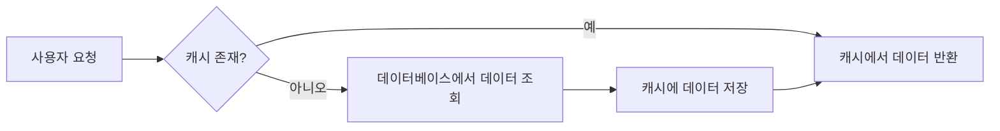

이와 같이 정적 데이터 캐싱을 활용하면 데이터베이스 성능을 최적화할 수 있으며, API의 응답 속도를 향상시킬 수 있다. 데이터베이스에 대한 불필요한 요청을 줄이는 것은 성능 최적화의 중요한 요소임을 잊지 말아야 한다.

<!--
### 1.2 데이터베이스 과다 사용 상태 페이지 체크
- 상태 체크의 중요성
- 캐싱을 통한 데이터베이스 부하 감소 방법
-->

### 1.2 데이터베이스 과다 사용 상태 페이지 체크

**상태 체크의 중요성**  

데이터베이스의 성능을 유지하기 위해서는 상태 체크가 필수적이다. 상태 체크는 데이터베이스의 현재 상태를 모니터링하고, 성능 저하의 원인을 조기에 발견할 수 있도록 도와준다. 이를 통해 데이터베이스의 부하를 줄이고, 시스템의 안정성을 높일 수 있다. 예를 들어, 쿼리 실행 시간, 연결 수, 메모리 사용량 등을 주기적으로 체크하여 비정상적인 패턴을 발견할 수 있다.

**캐싱을 통한 데이터베이스 부하 감소 방법**  

캐싱은 데이터베이스의 부하를 줄이는 효과적인 방법 중 하나이다. 자주 조회되는 데이터나 변경이 적은 데이터를 메모리에 저장하여, 데이터베이스에 대한 요청을 최소화할 수 있다. 이를 통해 데이터베이스의 성능을 향상시키고, 응답 시간을 단축할 수 있다.

다음은 C#에서 캐시를 구현하는 간단한 예제 코드이다.

```csharp
using System;
using System.Collections.Generic;

public class Cache
{
    private Dictionary<string, string> _cache = new Dictionary<string, string>();

    public string Get(string key)
    {
        if (_cache.ContainsKey(key))
        {
            return _cache[key];
        }
        return null;
    }

    public void Set(string key, string value)
    {
        _cache[key] = value;
    }
}

// 사용 예
public class Program
{
    public static void Main()
    {
        Cache cache = new Cache();
        cache.Set("user_1", "John Doe");

        string user = cache.Get("user_1");
        Console.WriteLine(user); // 출력: John Doe
    }
}
```

위의 코드에서는 간단한 캐시 클래스를 구현하여 데이터를 저장하고 조회하는 방법을 보여준다. 이와 같은 캐싱 전략을 통해 데이터베이스에 대한 요청을 줄이고, 성능을 최적화할 수 있다.

다음은 캐싱을 통한 데이터베이스 부하 감소를 시각적으로 나타낸 다이어그램이다.

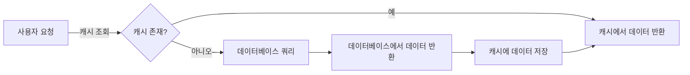

이와 같은 방식으로 캐싱을 활용하면 데이터베이스의 부하를 효과적으로 줄일 수 있으며, 전체 시스템의 성능을 향상시킬 수 있다. 데이터베이스의 상태 체크와 캐싱 전략을 적절히 활용하는 것이 중요하다.

<!--
### 1.3 너무 많은 쿼리를 사용하는 API 인증
- 인증 및 권한 확인의 성능 문제
- 캐시를 통한 인증 최적화 방법
-->

### 1.3 너무 많은 쿼리를 사용하는 API 인증

**인증 및 권한 확인의 성능 문제**  

API에서 인증 및 권한 확인을 수행할 때, 매번 데이터베이스에 쿼리를 보내는 방식은 성능 저하를 초래할 수 있다. 특히, 사용자가 자주 요청을 보내는 경우, 매번 데이터베이스에 접근하여 인증 정보를 확인하는 것은 불필요한 부하를 발생시킨다. 이러한 문제는 특히 대규모 사용자 기반을 가진 서비스에서 더욱 두드러지며, 응답 속도 저하와 서버 자원 낭비로 이어질 수 있다.

**캐시를 통한 인증 최적화 방법**  

이러한 성능 문제를 해결하기 위해 캐싱 전략을 도입할 수 있다. 인증 정보를 메모리에 캐시하여, 동일한 사용자의 인증 요청이 있을 경우 데이터베이스에 접근하지 않고 캐시된 정보를 활용하는 방식이다. 이를 통해 데이터베이스의 부하를 줄이고, 응답 속도를 개선할 수 있다.

다음은 C#에서 캐시를 활용한 인증 최적화의 예제 코드이다.

```csharp
public class AuthService
{
    private readonly ICacheService _cacheService;
    private readonly IUserRepository _userRepository;

    public AuthService(ICacheService cacheService, IUserRepository userRepository)
    {
        _cacheService = cacheService;
        _userRepository = userRepository;
    }

    public User Authenticate(string username, string password)
    {
        // 캐시에서 사용자 정보 조회
        var cacheKey = $"User:{username}";
        var cachedUser = _cacheService.Get<User>(cacheKey);

        if (cachedUser != null)
        {
            return cachedUser; // 캐시된 사용자 정보 반환
        }

        // 데이터베이스에서 사용자 정보 조회
        var user = _userRepository.GetUserByUsernameAndPassword(username, password);
        if (user != null)
        {
            // 사용자 정보를 캐시에 저장
            _cacheService.Set(cacheKey, user, TimeSpan.FromMinutes(30));
        }

        return user;
    }
}
```

위의 코드에서는 사용자의 인증 정보를 캐시하여, 동일한 사용자의 인증 요청이 있을 경우 데이터베이스에 접근하지 않고 캐시된 정보를 반환하는 구조이다. 이를 통해 데이터베이스의 부하를 줄이고, 성능을 향상시킬 수 있다.

다음은 캐시를 활용한 인증 프로세스를 나타내는 다이어그램이다.

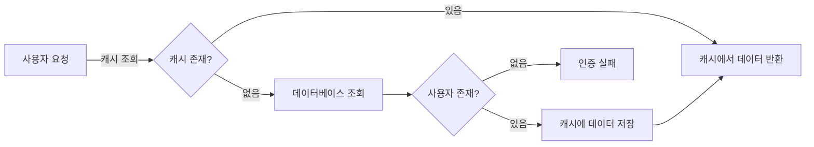

이와 같은 캐싱 전략을 통해 API 인증의 성능을 최적화할 수 있으며, 데이터베이스의 부하를 줄이는 동시에 사용자 경험을 개선할 수 있다.

<!--
### 1.4 루프 내에서 쿼리하는 객체 관계 매퍼
- ORM 사용 시 주의사항
- 성능 모니터링 및 최적화 기법
-->

### 1.4 루프 내에서 쿼리하는 객체 관계 매퍼

ORM(Object-Relational Mapping)은 데이터베이스와 객체 지향 프로그래밍 언어 간의 매핑을 제공하여 개발자가 데이터베이스 작업을 더 쉽게 수행할 수 있도록 돕는다. 그러나 ORM을 사용할 때 루프 내에서 쿼리를 실행하는 것은 성능 저하를 초래할 수 있는 일반적인 실수 중 하나이다. 이 글에서는 ORM 사용 시 주의사항과 성능 모니터링 및 최적화 기법에 대해 살펴보겠다.

**ORM 사용 시 주의사항**

ORM을 사용할 때 주의해야 할 점은 데이터베이스에 대한 쿼리를 루프 내에서 반복적으로 실행하는 것이다. 예를 들어, 다음과 같은 코드가 있다고 가정해 보자.

```csharp
foreach (var user in users)
{
    var orders = dbContext.Orders.Where(o => o.UserId == user.Id).ToList();
    // 처리 로직
}
```

위의 코드에서는 각 사용자에 대해 데이터베이스에서 주문을 조회하는 쿼리가 실행된다. 이 경우, 사용자가 100명이라면 100번의 쿼리가 실행되므로 성능이 크게 저하될 수 있다. 이를 해결하기 위해서는 한 번의 쿼리로 모든 주문을 가져온 후, 메모리에서 필터링하는 방식으로 변경해야 한다.

**성능 모니터링 및 최적화 기법**

ORM을 사용할 때 성능을 모니터링하고 최적화하는 방법은 여러 가지가 있다. 첫째, 쿼리 성능을 모니터링하기 위해 데이터베이스의 쿼리 로그를 활용할 수 있다. 이를 통해 어떤 쿼리가 느리게 실행되고 있는지 파악할 수 있다.

둘째, N+1 쿼리 문제를 피하기 위해 `Include` 메서드를 사용하여 관련 데이터를 미리 로드하는 것이 좋다. 예를 들어, 다음과 같이 코드를 수정할 수 있다.

```csharp
var usersWithOrders = dbContext.Users
    .Include(u => u.Orders)
    .ToList();

foreach (var user in usersWithOrders)
{
    // 처리 로직
}
```

위의 코드에서는 사용자와 그에 해당하는 주문을 한 번의 쿼리로 가져오므로 성능이 개선된다.

마지막으로, 성능을 지속적으로 모니터링하기 위해 APM(Application Performance Management) 도구를 사용하는 것도 좋은 방법이다. 이러한 도구는 애플리케이션의 성능을 실시간으로 모니터링하고, 병목 현상을 식별하는 데 도움을 준다.

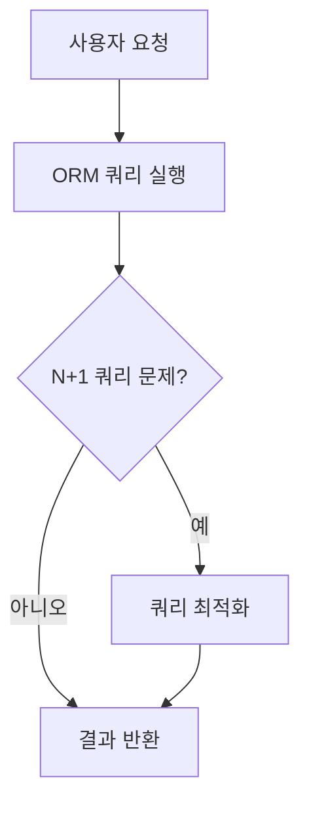

위의 다이어그램은 ORM 쿼리 실행 과정에서 N+1 쿼리 문제를 확인하고 최적화하는 흐름을 나타낸다. 이러한 최적화 기법을 통해 ORM 사용 시 성능을 개선할 수 있다. ORM을 효과적으로 활용하기 위해서는 이러한 주의사항과 최적화 기법을 숙지하고 적용하는 것이 중요하다.

<!--
### 1.5 빠른 쿼리 무시하기
- 쿼리 성능의 누적 효과
- API 설계에서의 쿼리 최적화 중요성
-->

### 1.5 빠른 쿼리 무시하기

데이터베이스 성능 최적화에서 쿼리 성능은 매우 중요한 요소이다. 특히, API 개발 시 쿼리 성능을 간과하는 경우가 많다. 빠른 쿼리를 무시하는 것은 누적 효과를 초래하여 전체 시스템 성능에 부정적인 영향을 미칠 수 있다. 이 글에서는 쿼리 성능의 누적 효과와 API 설계에서 쿼리 최적화의 중요성에 대해 살펴보겠다.

**쿼리 성능의 누적 효과**

쿼리 성능은 단순히 개별 쿼리의 실행 시간만을 의미하지 않는다. 여러 쿼리가 동시에 실행될 때, 각 쿼리의 성능이 전체 시스템의 응답 시간에 영향을 미친다. 예를 들어, API가 여러 개의 데이터베이스 쿼리를 실행해야 하는 경우, 각 쿼리의 성능이 좋지 않다면 전체 API의 응답 시간이 느려질 수 있다. 이러한 상황은 특히 트래픽이 많은 서비스에서 더욱 두드러지게 나타난다.

다음은 쿼리 성능의 누적 효과를 시각적으로 나타낸 다이어그램이다.

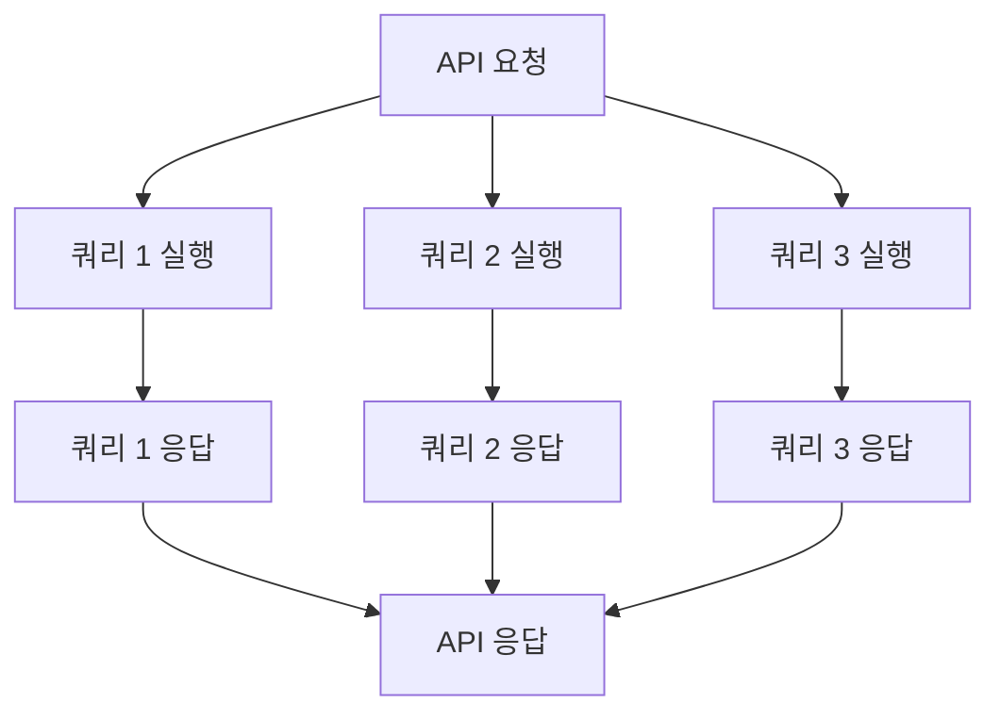

위의 다이어그램에서 API 요청이 들어오면 여러 쿼리가 동시에 실행된다. 각 쿼리의 응답 시간이 길어질수록 API의 전체 응답 시간도 증가하게 된다. 따라서, 빠른 쿼리를 무시하는 것은 API의 성능 저하로 이어질 수 있다.

**API 설계에서의 쿼리 최적화 중요성**

API 설계 단계에서 쿼리 최적화는 필수적이다. 쿼리 최적화를 통해 데이터베이스의 부하를 줄이고, 응답 시간을 단축시킬 수 있다. 다음은 API 설계에서 고려해야 할 쿼리 최적화 방법이다.

1. **필요한 데이터만 요청하기**: API에서 필요한 데이터만 요청하도록 쿼리를 작성해야 한다. 불필요한 데이터까지 요청하면 성능이 저하될 수 있다.

2. **인덱스 활용하기**: 데이터베이스에서 인덱스를 적절히 활용하면 쿼리 성능을 크게 향상시킬 수 있다. 인덱스가 없는 경우, 데이터베이스는 전체 테이블을 스캔해야 하므로 성능이 저하된다.

3. **쿼리 병합하기**: 여러 개의 쿼리를 하나로 병합하여 데이터베이스에 대한 호출 횟수를 줄이는 것이 좋다. 이를 통해 네트워크 지연 시간을 줄일 수 있다.

4. **캐싱 전략 사용하기**: 자주 요청되는 데이터는 캐싱하여 데이터베이스에 대한 부하를 줄일 수 있다. 캐싱을 통해 응답 시간을 단축시키고, 데이터베이스의 성능을 향상시킬 수 있다.

이와 같은 쿼리 최적화 방법을 통해 API의 성능을 개선할 수 있으며, 이는 사용자 경험을 향상시키는 데 기여한다. 따라서, 빠른 쿼리를 무시하지 않고, API 설계 단계에서부터 쿼리 최적화를 고려하는 것이 중요하다.

<!--
## 2. 데이터베이스 설계 및 관리의 일반적인 실수
### 2.1 불완전한 설계 및 계획
- 데이터 요구 사항의 이해 부족
- 정규화의 중요성
-->

## 2. 데이터베이스 설계 및 관리의 일반적인 실수

### 2.1 불완전한 설계 및 계획

데이터베이스 설계는 소프트웨어 개발의 중요한 단계 중 하나이다. 이 단계에서 데이터 요구 사항을 충분히 이해하지 못하면, 이후의 개발 과정에서 여러 가지 문제가 발생할 수 있다. 불완전한 설계는 데이터의 무결성을 해치고, 성능 저하를 초래하며, 유지 보수의 어려움을 증가시킨다. 따라서, 데이터 요구 사항을 명확히 이해하고 이를 기반으로 설계를 진행하는 것이 필수적이다.

정규화는 데이터베이스 설계에서 중요한 개념이다. 정규화는 데이터 중복을 최소화하고, 데이터 무결성을 유지하기 위해 데이터를 구조화하는 과정이다. 이를 통해 데이터베이스의 효율성을 높이고, 데이터의 일관성을 보장할 수 있다. 정규화의 단계는 여러 가지가 있으며, 각 단계는 데이터의 중복을 줄이고, 관계를 명확히 하는 데 도움을 준다.

다음은 정규화의 기본 개념을 설명하는 다이어그램이다.

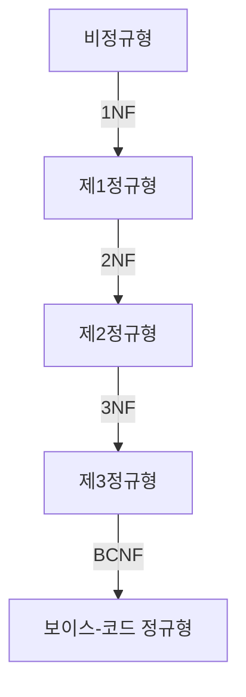

위의 다이어그램은 비정규형에서 시작하여 정규화의 각 단계를 거쳐 보이스-코드 정규형에 이르는 과정을 보여준다. 각 단계에서 데이터의 중복이 줄어들고, 데이터 간의 관계가 명확해지는 것을 확인할 수 있다.

정리하자면, 데이터베이스 설계에서 불완전한 설계 및 계획은 여러 가지 문제를 초래할 수 있으며, 데이터 요구 사항을 충분히 이해하고 정규화를 통해 데이터베이스를 구조화하는 것이 중요하다. 이러한 과정을 통해 데이터베이스의 성능과 유지 보수성을 높일 수 있다.

<!--
### 2.2 중복 데이터 및 레코드
- 데이터 일관성 문제
- 유지 관리의 비효율성
-->

### 2.2 중복 데이터 및 레코드

**데이터 일관성 문제**  

중복 데이터는 데이터베이스에서 여러 번 저장된 동일한 정보를 의미한다. 이러한 중복은 데이터 일관성 문제를 초래할 수 있다. 예를 들어, 고객 정보를 저장하는 테이블에서 동일한 고객이 여러 번 등록되면, 고객의 주소나 연락처가 변경될 때 모든 레코드를 업데이트해야 한다. 이 과정에서 일부 레코드가 누락되거나 잘못 업데이트될 가능성이 높아진다. 결과적으로 데이터의 신뢰성이 떨어지고, 비즈니스 의사결정에 부정적인 영향을 미칠 수 있다.

**유지 관리의 비효율성**  

중복 데이터는 유지 관리의 비효율성을 초래한다. 데이터베이스의 크기가 커질수록 중복된 데이터가 많아지면, 쿼리 성능이 저하되고, 데이터베이스의 백업 및 복구 작업이 복잡해진다. 또한, 중복된 데이터를 정리하는 데 소요되는 시간과 자원이 증가하여 운영 비용이 상승할 수 있다. 따라서 데이터베이스 설계 단계에서 중복 데이터를 최소화하는 것이 중요하다.

다음은 중복 데이터를 방지하기 위한 간단한 예제 코드이다. 이 코드는 C#에서 Entity Framework를 사용하여 중복 고객 레코드를 확인하고, 중복이 발견되면 이를 제거하는 방법을 보여준다.

```csharp
using (var context = new MyDbContext())
{
    var duplicateCustomers = context.Customers
        .GroupBy(c => c.Email)
        .Where(g => g.Count() > 1)
        .SelectMany(g => g.Skip(1)); // 첫 번째 레코드를 제외한 나머지 중복 레코드

    context.Customers.RemoveRange(duplicateCustomers);
    context.SaveChanges();
}
```

이 코드는 이메일 주소를 기준으로 중복된 고객 레코드를 찾아서 첫 번째 레코드를 제외한 나머지를 삭제하는 방식이다. 이를 통해 데이터베이스의 일관성을 유지하고, 유지 관리의 효율성을 높일 수 있다.

다음은 중복 데이터 문제를 시각적으로 설명하는 다이어그램이다.

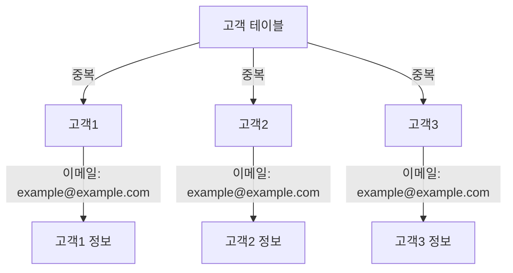

이 다이어그램은 동일한 이메일 주소를 가진 여러 고객 레코드가 존재하는 상황을 나타낸다. 이러한 중복은 데이터 일관성을 해치고, 유지 관리의 비효율성을 초래할 수 있다. 따라서 데이터베이스 설계 시 중복 데이터를 방지하는 것이 필수적이다.

<!--
### 2.3 불명확한 명명 규칙 및 문서화 부족
- 명확한 명명 규칙의 필요성
- 문서화의 중요성
-->

### 2.3 불명확한 명명 규칙 및 문서화 부족

**명확한 명명 규칙의 필요성**  

데이터베이스 설계에서 명확한 명명 규칙은 매우 중요하다. 일관된 명명 규칙은 데이터베이스 구조를 이해하는 데 도움을 주며, 팀원 간의 협업을 원활하게 만든다. 예를 들어, 테이블 이름, 컬럼 이름, 인덱스 이름 등을 명확하게 정의하면, 데이터베이스를 사용하는 개발자나 운영자가 쉽게 이해하고 사용할 수 있다. 

명명 규칙을 정할 때는 다음과 같은 사항을 고려해야 한다:
- **일관성**: 모든 테이블과 컬럼에 대해 동일한 규칙을 적용해야 한다.
- **의미 전달**: 이름이 해당 데이터의 의미를 명확히 전달해야 한다.
- **약어 사용 최소화**: 약어는 혼란을 초래할 수 있으므로, 가능한 한 사용을 자제해야 한다.

예를 들어, 사용자 정보를 저장하는 테이블의 경우 `User`라는 이름을 사용하는 것이 좋으며, 각 컬럼은 `UserId`, `UserName`, `UserEmail`과 같이 명확하게 정의해야 한다.

**문서화의 중요성**  

문서화는 데이터베이스 설계와 관련된 모든 정보를 기록하는 과정이다. 이는 데이터베이스의 구조, 관계, 사용 방법 등을 명확히 설명하여, 새로운 팀원이 쉽게 이해하고 기존 팀원이 빠르게 참고할 수 있도록 돕는다. 문서화가 부족하면, 데이터베이스의 복잡성이 증가할수록 유지보수가 어려워지고, 오류가 발생할 가능성이 높아진다.

문서화에는 다음과 같은 내용이 포함되어야 한다:
- **테이블 및 컬럼 설명**: 각 테이블과 컬럼의 목적과 사용 방법을 설명한다.
- **관계 설명**: 테이블 간의 관계를 명확히 설명하여 데이터의 흐름을 이해할 수 있도록 한다.
- **변경 이력**: 데이터베이스 구조의 변경 이력을 기록하여, 과거의 변경 사항을 추적할 수 있도록 한다.

다음은 데이터베이스 문서화의 예시를 나타내는 다이어그램이다:

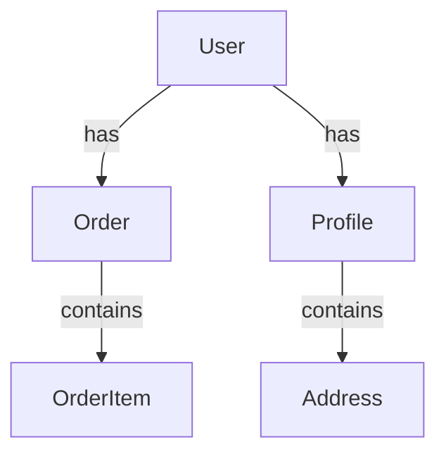

위의 다이어그램은 `User` 테이블이 `Order`와 `Profile` 테이블과 관계를 맺고 있으며, `Order` 테이블은 `OrderItem`을 포함하고, `Profile`은 `Address`를 포함하고 있음을 보여준다. 이러한 시각적 표현은 데이터베이스 구조를 이해하는 데 큰 도움이 된다.

결론적으로, 명확한 명명 규칙과 철저한 문서화는 데이터베이스의 유지보수성과 가독성을 높이는 데 필수적이다. 이를 통해 팀원 간의 협업을 원활하게 하고, 데이터베이스의 복잡성을 줄일 수 있다.

<!--
### 2.4 보안 조치 부족
- 접근 제어 및 데이터 암호화의 필요성
- 보안 정책 및 업데이트의 중요성
-->

### 2.4 보안 조치 부족

**접근 제어 및 데이터 암호화의 필요성**  

데이터베이스의 보안은 API 개발에서 매우 중요한 요소이다. 접근 제어는 데이터베이스에 대한 사용자 접근을 관리하는 방법으로, 권한이 없는 사용자가 데이터에 접근하지 못하도록 하는 데 필수적이다. 이를 통해 데이터 유출 및 무단 접근을 방지할 수 있다. 

데이터 암호화는 저장된 데이터와 전송 중인 데이터를 보호하는 방법으로, 해커가 데이터에 접근하더라도 내용을 이해할 수 없도록 만든다. 예를 들어, 사용자의 비밀번호는 해시 함수를 사용하여 암호화하여 저장해야 하며, 전송 중인 데이터는 SSL/TLS 프로토콜을 통해 암호화하여 보호해야 한다.

다음은 C#에서 데이터 암호화를 구현하는 간단한 예제 코드이다.

```csharp
using System;
using System.Security.Cryptography;
using System.Text;

public class EncryptionHelper
{
    public static string EncryptString(string plainText, string key)
    {
        using (Aes aes = Aes.Create())
        {
            aes.Key = Encoding.UTF8.GetBytes(key);
            aes.GenerateIV();
            using (var encryptor = aes.CreateEncryptor(aes.Key, aes.IV))
            {
                using (var ms = new MemoryStream())
                {
                    ms.Write(aes.IV, 0, aes.IV.Length);
                    using (var cs = new CryptoStream(ms, encryptor, CryptoStreamMode.Write))
                    {
                        using (var sw = new StreamWriter(cs))
                        {
                            sw.Write(plainText);
                        }
                        return Convert.ToBase64String(ms.ToArray());
                    }
                }
            }
        }
    }
}
```

**보안 정책 및 업데이트의 중요성**  

보안 정책은 데이터베이스와 API의 보안을 유지하기 위한 규칙과 절차를 정의하는 문서이다. 이러한 정책은 데이터 접근, 암호화, 백업 및 복구 절차 등을 포함해야 하며, 모든 직원이 이를 준수하도록 교육받아야 한다. 

정기적인 보안 업데이트는 시스템의 취약점을 최소화하는 데 필수적이다. 소프트웨어 및 라이브러리의 최신 버전을 유지하고, 보안 패치를 즉시 적용하는 것이 중요하다. 이를 통해 알려진 취약점으로부터 시스템을 보호할 수 있다.

다음은 보안 정책의 예시를 나타내는 다이어그램이다.

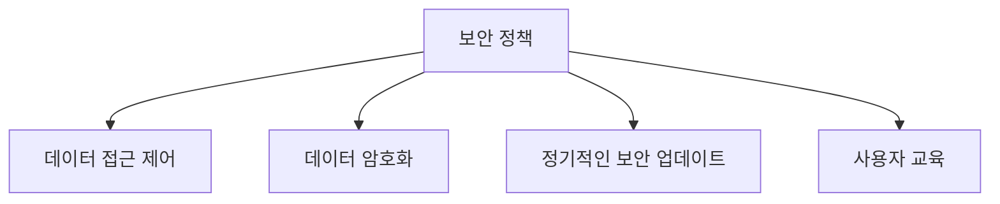

이와 같은 접근 제어 및 데이터 암호화, 보안 정책의 수립과 정기적인 업데이트는 데이터베이스의 보안을 강화하는 데 필수적이다. API 개발 시 이러한 요소들을 고려하여 보안 조치를 강화하는 것이 중요하다.

<!--
### 2.5 비효율적인 쿼리 최적화
- 복잡한 쿼리 구조
- 적절한 인덱스 사용의 중요성
-->

### 2.5 비효율적인 쿼리 최적화

비효율적인 쿼리는 데이터베이스 성능에 큰 영향을 미친다. 복잡한 쿼리 구조는 데이터베이스의 처리 속도를 저하시킬 수 있으며, 이는 결국 API의 응답 시간에 부정적인 영향을 미친다. 따라서 쿼리 최적화는 데이터베이스 성능을 향상시키기 위한 필수적인 과정이다.

**복잡한 쿼리 구조**

복잡한 쿼리 구조는 여러 테이블을 조인하거나 서브쿼리를 사용하는 경우에 발생한다. 이러한 쿼리는 데이터베이스가 처리해야 할 작업이 많아지므로 성능 저하를 초래할 수 있다. 예를 들어, 다음과 같은 쿼리를 살펴보자.

```sql
SELECT a.name, b.order_date
FROM customers a
JOIN orders b ON a.id = b.customer_id
WHERE b.order_date > '2023-01-01'
AND a.status = 'active';
```

위 쿼리는 고객과 주문 테이블을 조인하여 활성 고객의 주문 정보를 가져오는 쿼리이다. 하지만 이 쿼리가 복잡해질수록 데이터베이스의 부하가 증가하게 된다. 따라서 쿼리를 단순화하거나 필요한 데이터만 선택하는 것이 중요하다.

**적절한 인덱스 사용의 중요성**

인덱스는 데이터베이스에서 검색 성능을 향상시키는 중요한 요소이다. 적절한 인덱스를 사용하면 쿼리 성능을 크게 개선할 수 있다. 예를 들어, 위의 쿼리에서 `customers` 테이블의 `status` 컬럼과 `orders` 테이블의 `order_date` 컬럼에 인덱스를 추가하면 쿼리 성능이 향상될 수 있다.

다음은 인덱스를 추가하는 SQL 예제이다.

```sql
CREATE INDEX idx_customer_status ON customers(status);
CREATE INDEX idx_order_date ON orders(order_date);
```

이와 같이 인덱스를 추가하면 데이터베이스는 쿼리를 처리할 때 더 빠르게 필요한 데이터를 찾을 수 있다. 그러나 인덱스가 너무 많으면 데이터 삽입 및 업데이트 성능에 영향을 줄 수 있으므로 적절한 균형을 유지하는 것이 중요하다.

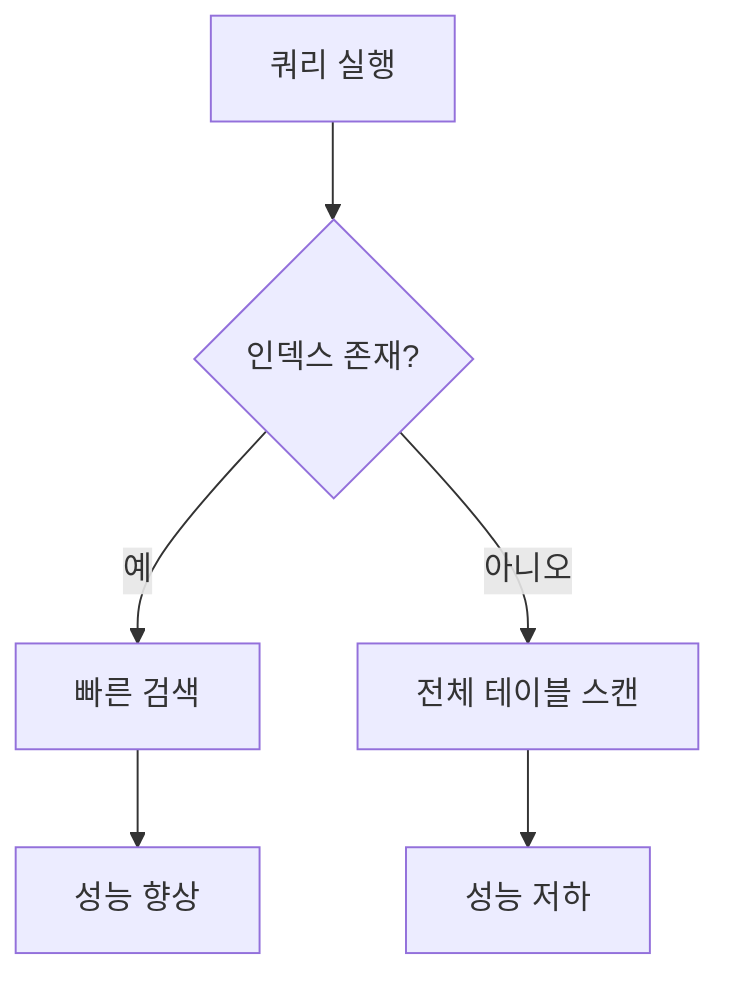

위 다이어그램은 인덱스의 존재 여부에 따라 쿼리 실행 성능이 어떻게 달라지는지를 보여준다. 인덱스가 존재할 경우 빠른 검색이 가능하지만, 인덱스가 없으면 전체 테이블을 스캔해야 하므로 성능이 저하된다.

결론적으로, 비효율적인 쿼리를 최적화하기 위해서는 쿼리 구조를 단순화하고 적절한 인덱스를 사용하는 것이 중요하다. 이를 통해 데이터베이스 성능을 향상시키고 API의 응답 시간을 줄일 수 있다.

<!--
## 3. 데이터베이스 성능 문제 해결 방법
### 3.1 인덱스 부족 문제 해결
- 인덱스 추가 및 최적화 방법
- 예제: 인덱스 추가 전후 성능 비교
-->

## 3. 데이터베이스 성능 문제 해결 방법

### 3.1 인덱스 부족 문제 해결

데이터베이스에서 인덱스는 쿼리 성능을 크게 향상시키는 중요한 요소이다. 인덱스가 부족하면 데이터 검색 시 전체 테이블을 스캔해야 하므로 성능 저하가 발생할 수 있다. 따라서 인덱스를 추가하고 최적화하는 방법을 이해하는 것이 중요하다.

**인덱스 추가 및 최적화 방법**

1. **인덱스 추가**: 데이터베이스에서 자주 조회되는 컬럼에 인덱스를 추가하는 것이 좋다. 예를 들어, 사용자 정보를 저장하는 테이블에서 이메일 주소로 검색하는 경우, 이메일 컬럼에 인덱스를 추가하면 검색 속도가 빨라진다.

   ```sql
   CREATE INDEX idx_email ON users(email);
   ```

2. **복합 인덱스 사용**: 여러 컬럼을 조합하여 검색하는 경우, 복합 인덱스를 사용하는 것이 효과적이다. 예를 들어, 사용자 테이블에서 이름과 이메일로 검색할 경우 다음과 같이 복합 인덱스를 추가할 수 있다.

   ```sql
   CREATE INDEX idx_name_email ON users(name, email);
   ```

3. **인덱스 최적화**: 인덱스는 데이터 삽입, 수정, 삭제 시 오버헤드를 발생시킬 수 있으므로, 사용하지 않는 인덱스는 제거하는 것이 좋다. 주기적으로 인덱스 사용 현황을 점검하고 최적화하는 것이 필요하다.

**예제: 인덱스 추가 전후 성능 비교**

다음은 인덱스를 추가하기 전과 후의 쿼리 성능을 비교하는 예제이다. 

1. **인덱스 추가 전**: 이메일로 사용자를 검색할 때 인덱스가 없으면 전체 테이블을 스캔해야 하므로 성능이 저하된다.

   ```sql
   SELECT * FROM users WHERE email = 'example@example.com';
   ```

   - **성능**: 500ms (전체 테이블 스캔)

2. **인덱스 추가 후**: 이메일 컬럼에 인덱스를 추가한 후 동일한 쿼리를 실행하면 성능이 크게 향상된다.

   ```sql
   SELECT * FROM users WHERE email = 'example@example.com';
   ```

   - **성능**: 10ms (인덱스 사용)

이와 같이 인덱스를 추가함으로써 쿼리 성능이 크게 향상되는 것을 확인할 수 있다. 

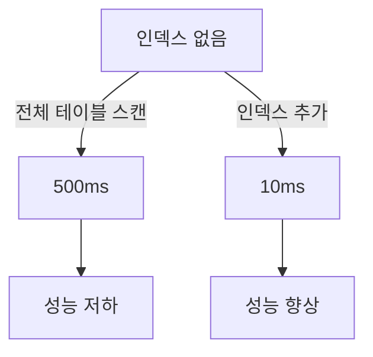

인덱스는 데이터베이스 성능 최적화에 있어 필수적인 요소이므로, 적절한 인덱스를 추가하고 관리하는 것이 중요하다.

<!--
### 3.2 비효율적인 쿼리 개선
- 쿼리 최적화 기법
- 예제: 비효율적인 쿼리와 최적화된 쿼리 비교
-->

### 3.2 비효율적인 쿼리 개선

비효율적인 쿼리는 데이터베이스 성능에 큰 영향을 미친다. 쿼리 최적화는 데이터베이스의 응답 속도를 개선하고, 서버 자원의 낭비를 줄이는 데 필수적이다. 이 섹션에서는 쿼리 최적화 기법과 비효율적인 쿼리와 최적화된 쿼리의 비교를 통해 성능 개선 방법을 살펴보겠다.

**쿼리 최적화 기법**

1. **인덱스 활용**: 인덱스는 데이터 검색 속도를 높이는 데 중요한 역할을 한다. 자주 조회되는 컬럼에 인덱스를 추가하면 쿼리 성능이 크게 향상된다.

2. **SELECT 절 최적화**: 필요한 컬럼만 선택하여 불필요한 데이터 전송을 줄인다. 예를 들어, `SELECT *` 대신 필요한 컬럼만 명시적으로 지정하는 것이 좋다.

3. **JOIN 최적화**: JOIN 연산은 성능에 큰 영향을 미칠 수 있다. 필요한 데이터만 JOIN하고, 가능한 경우 서브쿼리 대신 JOIN을 사용하는 것이 좋다.

4. **WHERE 절 최적화**: WHERE 절에서 조건을 최적화하여 불필요한 데이터 검색을 줄인다. 예를 들어, 범위 조건을 사용하여 검색 범위를 좁히는 것이 효과적이다.

5. **쿼리 리팩토링**: 복잡한 쿼리는 여러 개의 간단한 쿼리로 나누어 성능을 개선할 수 있다. 이 경우, 각 쿼리의 결과를 임시 테이블에 저장하고, 최종 결과를 조합하는 방법을 사용할 수 있다.

**예제: 비효율적인 쿼리와 최적화된 쿼리 비교**

아래는 비효율적인 쿼리와 최적화된 쿼리의 예시이다.

```sql
-- 비효율적인 쿼리
SELECT * FROM orders
WHERE customer_id IN (SELECT id FROM customers WHERE status = 'active');
```

위 쿼리는 서브쿼리를 사용하여 활성 고객의 주문을 조회하고 있다. 이 경우, 서브쿼리가 비효율적일 수 있다.

```sql
-- 최적화된 쿼리
SELECT o.*
FROM orders o
JOIN customers c ON o.customer_id = c.id
WHERE c.status = 'active';
```

최적화된 쿼리는 JOIN을 사용하여 활성 고객의 주문을 조회한다. 이 방법은 데이터베이스가 인덱스를 활용할 수 있도록 하여 성능을 개선한다.

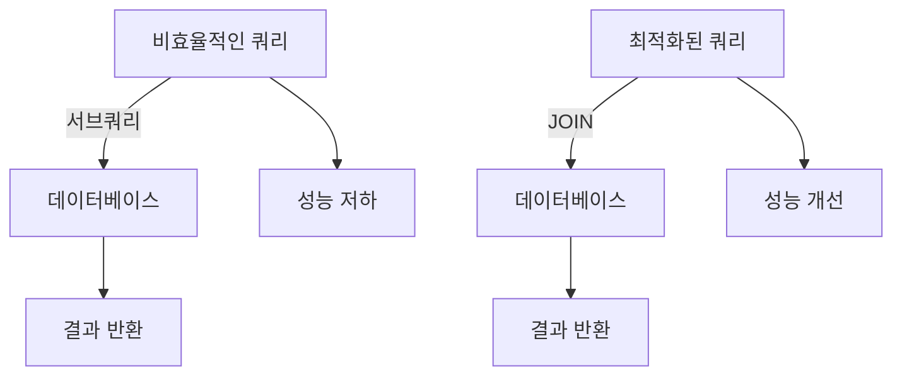

위 다이어그램은 비효율적인 쿼리와 최적화된 쿼리의 성능 차이를 시각적으로 나타낸 것이다. 최적화된 쿼리는 JOIN을 통해 데이터베이스의 성능을 개선하고, 결과 반환 속도를 높인다. 

쿼리 최적화는 데이터베이스 성능을 향상시키는 중요한 과정이다. 위에서 제시한 기법들을 활용하여 비효율적인 쿼리를 개선하면, API의 응답 속도와 전체 시스템의 성능을 크게 향상시킬 수 있다.

<!--
### 3.3 데이터 타입의 적절한 선택
- 데이터 타입 최적화 방법
- 성능 고려 사항
-->

### 3.3 데이터 타입의 적절한 선택

데이터베이스에서 데이터 타입을 적절히 선택하는 것은 성능 최적화에 있어 매우 중요한 요소이다. 잘못된 데이터 타입을 사용하면 저장 공간을 낭비하거나 쿼리 성능을 저하시킬 수 있다. 따라서 데이터 타입을 최적화하는 방법과 성능 고려 사항에 대해 살펴보도록 하겠다.

**데이터 타입 최적화 방법**

1. **적절한 데이터 타입 선택**: 데이터베이스에서 제공하는 다양한 데이터 타입 중에서 실제 데이터의 특성에 맞는 타입을 선택해야 한다. 예를 들어, 정수형 데이터는 `INT`나 `SMALLINT`를 사용하고, 문자열 데이터는 `VARCHAR`나 `CHAR`를 사용하는 것이 좋다. 필요 이상의 크기를 지정하면 저장 공간이 낭비될 수 있다.

2. **NULL 허용 여부 결정**: 데이터 타입을 정의할 때 NULL 값을 허용할지 여부를 결정해야 한다. NULL을 허용하면 추가적인 저장 공간이 필요할 수 있으며, 쿼리 성능에도 영향을 미칠 수 있다. 따라서 NULL이 필요하지 않은 경우에는 NOT NULL 제약 조건을 사용하는 것이 좋다.

3. **인덱스와 데이터 타입**: 인덱스를 생성할 때 데이터 타입이 성능에 미치는 영향을 고려해야 한다. 예를 들어, 문자열 데이터에 인덱스를 생성할 경우, `VARCHAR`보다 `CHAR`가 더 빠른 성능을 보일 수 있다. 이는 `CHAR`가 고정 길이이기 때문에 검색 시 더 효율적이기 때문이다.

**성능 고려 사항**

1. **저장 공간**: 데이터 타입의 크기는 저장 공간에 직접적인 영향을 미친다. 예를 들어, `INT`는 4바이트를 차지하지만, `BIGINT`는 8바이트를 차지한다. 따라서 데이터의 범위를 고려하여 적절한 타입을 선택해야 한다.

2. **쿼리 성능**: 데이터 타입에 따라 쿼리 성능이 달라질 수 있다. 예를 들어, `VARCHAR` 타입의 데이터는 길이에 따라 성능이 달라질 수 있으며, 인덱스가 적용된 경우에도 성능 차이가 발생할 수 있다. 따라서 쿼리 성능을 고려하여 데이터 타입을 선택해야 한다.

3. **데이터 변환 비용**: 데이터 타입 간의 변환이 필요한 경우, 변환 비용이 발생할 수 있다. 예를 들어, `VARCHAR`에서 `INT`로 변환하는 경우, 추가적인 연산이 필요하므로 성능 저하가 발생할 수 있다. 따라서 데이터 타입을 선택할 때 변환 비용도 고려해야 한다.

다음은 데이터 타입 선택의 예시를 보여주는 다이어그램이다.

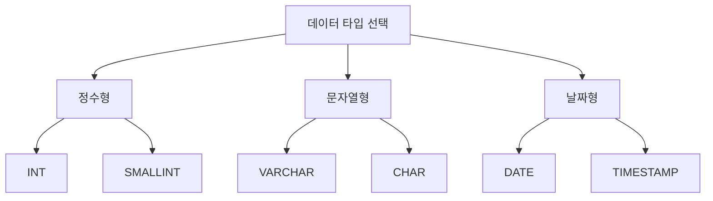

데이터 타입의 적절한 선택은 데이터베이스 성능 최적화의 중요한 요소이다. 따라서 데이터의 특성과 사용 패턴을 고려하여 최적의 데이터 타입을 선택하는 것이 필요하다.

<!--
### 3.4 정기적인 유지 관리의 중요성
- 데이터베이스 백업 및 업데이트
- 성능 모니터링 및 조정
-->

### 3.4 정기적인 유지 관리의 중요성

데이터베이스의 성능을 유지하고 최적화하기 위해서는 정기적인 유지 관리가 필수적이다. 데이터베이스는 시간이 지남에 따라 데이터가 증가하고, 쿼리 패턴이 변화하며, 하드웨어의 성능이 저하될 수 있기 때문에 이러한 유지 관리 작업이 필요하다.

**데이터베이스 백업 및 업데이트**

정기적인 데이터베이스 백업은 데이터 손실을 방지하는 가장 기본적인 방법이다. 예기치 않은 시스템 장애나 데이터 손상으로부터 데이터를 보호하기 위해서는 주기적으로 백업을 수행해야 한다. 또한, 데이터베이스 소프트웨어의 업데이트도 중요하다. 최신 버전으로 업데이트하면 보안 취약점을 해결하고 성능 개선을 기대할 수 있다.

다음은 C#을 사용하여 데이터베이스 백업을 수행하는 간단한 예제 코드이다.

```csharp
using System;
using System.Data.SqlClient;

class Program
{
    static void Main()
    {
        string connectionString = "your_connection_string";
        string backupFilePath = "C:\\Backup\\database_backup.bak";

        using (SqlConnection connection = new SqlConnection(connectionString))
        {
            connection.Open();
            string query = $"BACKUP DATABASE [YourDatabase] TO DISK = '{backupFilePath}'";
            SqlCommand command = new SqlCommand(query, connection);
            command.ExecuteNonQuery();
            Console.WriteLine("Database backup completed successfully.");
        }
    }
}
```

**성능 모니터링 및 조정**

데이터베이스의 성능을 지속적으로 모니터링하는 것은 성능 저하를 조기에 발견하고 해결하는 데 도움이 된다. 성능 모니터링 도구를 사용하여 쿼리 실행 시간, CPU 사용량, 메모리 사용량 등을 체크할 수 있다. 이러한 데이터를 기반으로 쿼리 최적화, 인덱스 추가, 하드웨어 업그레이드 등의 조치를 취할 수 있다.

다음은 데이터베이스 성능 모니터링을 위한 간단한 다이어그램이다.

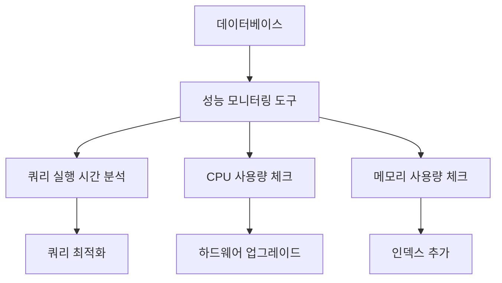

정기적인 유지 관리는 데이터베이스의 안정성과 성능을 보장하는 데 중요한 역할을 한다. 따라서, 개발자와 운영자는 이러한 유지 관리 작업을 소홀히 하지 않아야 한다.

<!--
### 3.5 하드웨어 제한 문제 해결
- RAM, 하드 디스크, CPU의 중요성
- 하드웨어 업그레이드 고려 사항
-->

### 3.5 하드웨어 제한 문제 해결

하드웨어는 데이터베이스 성능에 큰 영향을 미치는 요소 중 하나이다. RAM, 하드 디스크, CPU의 성능이 저하되면 데이터베이스의 응답 속도와 처리 능력이 떨어지게 된다. 따라서 하드웨어의 중요성을 이해하고 적절한 업그레이드 방안을 고려하는 것이 필요하다.

**RAM, 하드 디스크, CPU의 중요성**

1. **RAM**: 데이터베이스는 메모리 내에서 데이터를 처리하는 경우가 많다. 충분한 RAM이 확보되어 있지 않으면 데이터베이스는 디스크에서 데이터를 읽어야 하며, 이는 성능 저하를 초래한다. 일반적으로 RAM이 많을수록 데이터베이스의 캐시가 커져서 성능이 향상된다.

2. **하드 디스크**: 하드 디스크의 속도 또한 데이터베이스 성능에 큰 영향을 미친다. SSD(Solid State Drive)는 HDD(Hard Disk Drive)보다 훨씬 빠른 데이터 접근 속도를 제공하므로, 데이터베이스의 읽기 및 쓰기 성능을 크게 향상시킬 수 있다.

3. **CPU**: CPU의 성능은 데이터베이스 쿼리 처리 속도에 직접적인 영향을 미친다. 멀티코어 CPU는 동시에 여러 쿼리를 처리할 수 있는 능력을 제공하므로, 데이터베이스의 성능을 높이는 데 기여한다.

** 하드웨어 업그레이드 고려 사항 **

하드웨어 업그레이드를 고려할 때는 다음과 같은 사항을 염두에 두어야 한다.

- **현재 사용 중인 하드웨어의 성능 분석**: 현재 시스템의 CPU 사용률, 메모리 사용량, 디스크 I/O 성능 등을 모니터링하여 병목 현상이 발생하는 부분을 파악해야 한다.

- **예산**: 하드웨어 업그레이드는 비용이 발생하므로, 예산을 고려하여 필요한 부분만 업그레이드하는 것이 중요하다.

- **확장성**: 현재의 하드웨어가 향후 데이터베이스의 성장에 맞춰 확장 가능한지 여부를 고려해야 한다. 예를 들어, RAM 슬롯이 여유가 있는지, 추가 SSD를 장착할 수 있는지 등을 확인해야 한다.

- **성능 테스트**: 하드웨어 업그레이드 후에는 성능 테스트를 통해 실제 성능 향상을 확인해야 한다. 이를 통해 업그레이드가 효과적이었는지 평가할 수 있다.

다음은 하드웨어 업그레이드 전후의 성능 비교를 나타내는 다이어그램이다.

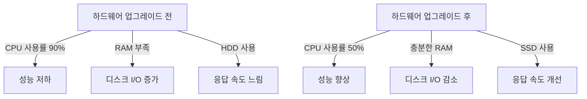

하드웨어는 데이터베이스 성능 최적화에서 중요한 역할을 하므로, 적절한 하드웨어 선택과 업그레이드가 필요하다. 이를 통해 데이터베이스의 성능을 극대화할 수 있다.

<!--
## 4. 예제
- API 성능 최적화를 위한 실제 사례
- 데이터베이스 쿼리 최적화 전후 성능 비교
-->

## 4. 예제

**API 성능 최적화를 위한 실제 사례**

API 성능 최적화는 실제로 많은 기업에서 중요한 과제로 다루어지고 있다. 예를 들어, 한 전자상거래 플랫폼에서는 사용자 요청에 대한 응답 속도가 느려져 고객 이탈률이 증가하는 문제를 겪었다. 이 문제를 해결하기 위해 다음과 같은 최적화 작업을 진행하였다.

1. **쿼리 최적화**: 기존의 복잡한 JOIN 쿼리를 단순화하고, 필요한 데이터만을 선택하는 방식으로 변경하였다. 이를 통해 데이터베이스의 부하를 줄이고 응답 속도를 개선하였다.

2. **캐싱 전략 도입**: 자주 조회되는 상품 정보를 메모리에 캐싱하여 데이터베이스 접근을 최소화하였다. Redis와 같은 인메모리 데이터 저장소를 활용하여 캐시를 구현하였다.

3. **비동기 처리**: API 요청을 비동기적으로 처리하여 사용자 경험을 개선하였다. 이를 통해 사용자는 요청 후 즉시 다른 작업을 수행할 수 있게 되었다.

다음은 캐시를 구현한 C# 코드의 예시이다.

```csharp
public class ProductService
{
    private readonly ICacheService _cacheService;
    private readonly IProductRepository _productRepository;

    public ProductService(ICacheService cacheService, IProductRepository productRepository)
    {
        _cacheService = cacheService;
        _productRepository = productRepository;
    }

    public Product GetProductById(int productId)
    {
        var cacheKey = $"Product_{productId}";
        var product = _cacheService.Get<Product>(cacheKey);

        if (product == null)
        {
            product = _productRepository.GetById(productId);
            _cacheService.Set(cacheKey, product);
        }

        return product;
    }
}
```

**데이터베이스 쿼리 최적화 전후 성능 비교**

쿼리 최적화 전후의 성능을 비교하기 위해, 특정 API 엔드포인트에 대한 응답 시간을 측정하였다. 다음은 최적화 전후의 성능 비교 결과이다.

| 상태          | 평균 응답 시간 (ms) | 데이터베이스 쿼리 수 |
|---------------|---------------------|-----------------------|
| 최적화 전     | 500                 | 10                    |
| 최적화 후     | 150                 | 4                     |

위의 표에서 볼 수 있듯이, 쿼리 최적화 후 평균 응답 시간이 크게 감소하였고, 데이터베이스 쿼리 수 또한 줄어들었다. 이러한 최적화 작업은 API의 전반적인 성능을 향상시키고 사용자 경험을 개선하는 데 기여하였다.

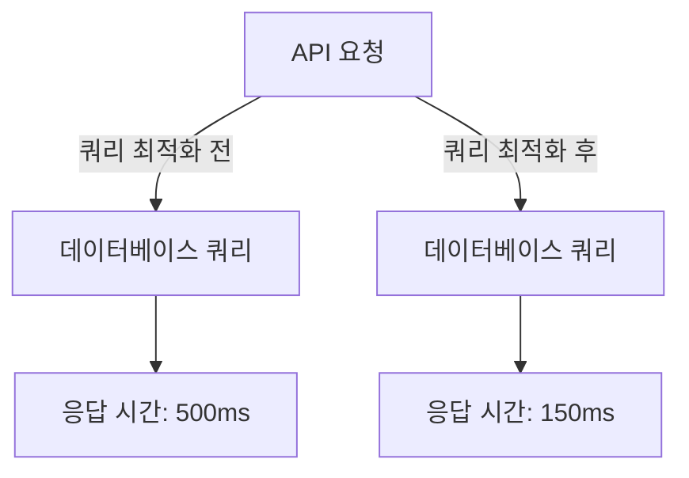

이와 같은 사례를 통해 API 성능 최적화의 필요성과 효과를 명확히 이해할 수 있다. 데이터베이스 쿼리 최적화는 API의 성능을 개선하는 데 중요한 역할을 하며, 이를 통해 사용자 만족도를 높일 수 있다.

<!--
## 5. FAQ
- 데이터베이스 성능 문제를 어떻게 진단하나요?
- API에서 데이터베이스 쿼리를 최적화하는 방법은 무엇인가요?
- 데이터베이스 인덱스는 언제 추가해야 하나요?
-->

## 5. FAQ

**데이터베이스 성능 문제를 어떻게 진단하나요?**

데이터베이스 성능 문제를 진단하기 위해서는 여러 가지 방법을 사용할 수 있다. 첫 번째로, 쿼리 성능을 모니터링하는 것이 중요하다. 이를 위해 데이터베이스의 실행 계획을 분석하고, 쿼리의 실행 시간을 측정하여 병목 현상이 발생하는 부분을 찾아야 한다. 

두 번째로, 데이터베이스의 리소스 사용량을 모니터링해야 한다. CPU, 메모리, 디스크 I/O 등의 사용량을 체크하여 과부하가 발생하는지 확인할 수 있다. 

마지막으로, 로그 파일을 분석하여 오류나 경고 메시지를 확인하는 것도 좋은 방법이다. 이러한 로그는 성능 문제의 원인을 파악하는 데 큰 도움이 된다.

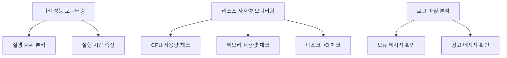

**API에서 데이터베이스 쿼리를 최적화하는 방법은 무엇인가요?**

API에서 데이터베이스 쿼리를 최적화하기 위해서는 몇 가지 전략을 사용할 수 있다. 첫 번째로, 필요한 데이터만 선택적으로 조회하는 것이 중요하다. SELECT * 대신 필요한 컬럼만 명시적으로 지정하여 불필요한 데이터 전송을 줄여야 한다.

두 번째로, 쿼리의 조건을 최적화하여 인덱스를 활용할 수 있도록 해야 한다. WHERE 절에 인덱스가 적용될 수 있는 컬럼을 사용하면 성능이 향상된다.

세 번째로, 쿼리의 실행 횟수를 줄이기 위해 캐싱을 활용하는 것이 좋다. 자주 조회되는 데이터는 메모리에 캐시하여 데이터베이스에 대한 요청을 줄일 수 있다.

```csharp
// C#에서의 쿼리 최적화 예제
using (var connection = new SqlConnection(connectionString))
{
    var command = new SqlCommand("SELECT Id, Name FROM Users WHERE IsActive = 1", connection);
    connection.Open();
    using (var reader = command.ExecuteReader())
    {
        while (reader.Read())
        {
            // 데이터 처리
        }
    }
}
```

**데이터베이스 인덱스는 언제 추가해야 하나요?**

데이터베이스 인덱스는 특정 조건을 만족할 때 추가하는 것이 좋다. 첫 번째로, 쿼리의 WHERE 절에 자주 사용되는 컬럼에 인덱스를 추가하는 것이 효과적이다. 이러한 컬럼은 검색 성능을 크게 향상시킬 수 있다.

두 번째로, JOIN 연산에 사용되는 컬럼에도 인덱스를 추가해야 한다. JOIN이 자주 발생하는 경우, 인덱스가 성능을 개선하는 데 큰 역할을 한다.

세 번째로, 데이터베이스의 성능 모니터링을 통해 쿼리 실행 시간이 길어지는 경우 인덱스를 추가하는 것을 고려해야 한다. 인덱스는 데이터 삽입 및 수정 시 오버헤드를 발생시킬 수 있으므로, 성능 저하가 발생하는 쿼리에 대해서만 신중하게 추가해야 한다. 

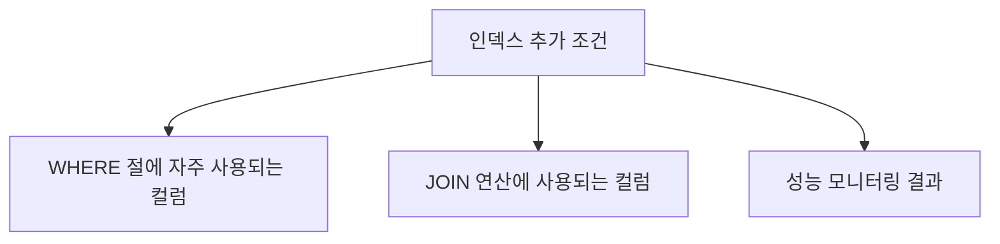

이와 같은 방법으로 데이터베이스 성능 문제를 진단하고, API에서 쿼리를 최적화하며, 인덱스를 적절히 추가하는 것이 중요하다.

<!--
## 6. 관련 기술
- ORM (객체 관계 매퍼)
- 캐싱 전략
- 데이터베이스 모니터링 도구
-->

## 6. 관련 기술

**ORM (객체 관계 매퍼)** 

ORM은 객체 지향 프로그래밍 언어와 관계형 데이터베이스 간의 데이터 변환을 자동화하는 기술이다. ORM을 사용하면 SQL 쿼리를 직접 작성하지 않고도 데이터베이스와 상호작용할 수 있어 개발자의 생산성을 높일 수 있다. 그러나 ORM을 사용할 때는 성능 문제를 유의해야 하며, 불필요한 쿼리 발생을 방지하기 위해 적절한 사용이 필요하다.

예를 들어, C#의 Entity Framework를 사용하여 데이터베이스에 접근하는 코드는 다음과 같다.

```csharp
using (var context = new MyDbContext())
{
    var users = context.Users.ToList(); // 모든 사용자 조회
}
```

이 코드에서는 모든 사용자를 조회하는 쿼리가 실행되며, 데이터가 많을 경우 성능 저하를 초래할 수 있다. 따라서 필요한 데이터만 선택적으로 조회하는 것이 중요하다.

**캐싱 전략**  

캐싱은 데이터베이스의 부하를 줄이고 응답 속도를 향상시키기 위한 효과적인 방법이다. 자주 조회되는 데이터는 메모리에 저장하여 데이터베이스에 대한 요청을 최소화할 수 있다. 캐싱 전략에는 여러 가지가 있으며, 그 중 가장 일반적인 방법은 메모리 캐시와 분산 캐시를 사용하는 것이다.

예를 들어, Redis를 사용한 캐싱 전략은 다음과 같다.

```csharp
var cacheKey = "user_1";
var cachedUser = await redisCache.GetStringAsync(cacheKey);

if (string.IsNullOrEmpty(cachedUser))
{
    var user = await dbContext.Users.FindAsync(1);
    await redisCache.SetStringAsync(cacheKey, JsonConvert.SerializeObject(user));
}
else
{
    var user = JsonConvert.DeserializeObject<User>(cachedUser);
}
```

이 코드는 Redis 캐시에서 사용자 정보를 조회하고, 캐시에 데이터가 없을 경우 데이터베이스에서 조회하여 캐시에 저장하는 방식이다. 이를 통해 데이터베이스의 부하를 줄일 수 있다.

**데이터베이스 모니터링 도구**  

데이터베이스 성능을 최적화하기 위해서는 모니터링 도구를 활용하여 성능 지표를 분석하는 것이 중요하다. 이러한 도구는 쿼리 성능, 데이터베이스 부하, 인덱스 사용 현황 등을 실시간으로 모니터링할 수 있게 해준다. 대표적인 데이터베이스 모니터링 도구로는 Prometheus, Grafana, New Relic 등이 있다.

다음은 데이터베이스 성능 모니터링을 위한 간단한 다이어그램이다.


이 다이어그램은 사용자 요청이 API 서버를 통해 ORM을 거쳐 데이터베이스에 접근하고, 모니터링 도구가 성능을 분석하여 최적화 조치를 취하는 과정을 나타낸다. 이러한 모니터링과 최적화 과정은 데이터베이스 성능을 지속적으로 개선하는 데 필수적이다.

<!--
## 7. 결론
- 데이터베이스 성능 최적화의 중요성
- API 개발에서의 성능 문제 예방 및 해결 방안 요약
-->

## 결론

**데이터베이스 성능 최적화의 중요성**

데이터베이스 성능 최적화는 API 개발에서 매우 중요한 요소이다. 성능이 저하되면 사용자 경험이 나빠지고, 이는 결국 비즈니스에 부정적인 영향을 미칠 수 있다. 따라서, 데이터베이스의 성능을 지속적으로 모니터링하고 최적화하는 것은 필수적이다. 특히, 데이터베이스 쿼리의 효율성을 높이고, 적절한 인덱스를 사용하며, 캐싱 전략을 도입하는 것이 중요하다. 이러한 최적화 작업은 데이터베이스의 응답 속도를 개선하고, 서버의 부하를 줄이며, 전체 시스템의 안정성을 높이는 데 기여한다.

**API 개발에서의 성능 문제 예방 및 해결 방안 요약**

API 개발 과정에서 성능 문제를 예방하고 해결하기 위해서는 다음과 같은 방안을 고려해야 한다.

1. **쿼리 최적화**: 비효율적인 쿼리를 식별하고 최적화하는 것이 중요하다. 예를 들어, JOIN 연산을 최소화하고, 필요한 데이터만 선택하는 쿼리를 작성해야 한다.

2. **인덱스 활용**: 데이터베이스의 인덱스를 적절히 활용하여 검색 성능을 향상시켜야 한다. 인덱스가 없는 경우, 쿼리 성능이 크게 저하될 수 있다.

3. **캐싱 전략**: 자주 조회되는 데이터를 캐싱하여 데이터베이스의 부하를 줄이고 응답 속도를 높일 수 있다. 예를 들어, Redis와 같은 인메모리 데이터베이스를 활용할 수 있다.

4. **정기적인 유지 관리**: 데이터베이스의 정기적인 백업 및 업데이트를 통해 성능을 유지하고, 문제 발생 시 신속하게 대응할 수 있도록 해야 한다.

5. **모니터링 도구 사용**: 데이터베이스 성능을 모니터링할 수 있는 도구를 사용하여, 성능 저하의 원인을 신속하게 파악하고 해결할 수 있도록 해야 한다.

다음은 데이터베이스 성능 최적화를 위한 간단한 다이어그램이다.

```mermaid
graph TD;
    A[API 요청] --> B[쿼리 최적화]
    A --> C[인덱스 활용]
    A --> D[캐싱 전략]
    A --> E[정기적인 유지 관리]
    A --> F[모니터링 도구 사용]
    B --> G[성능 향상]
    C --> G
    D --> G
    E --> G
    F --> G
```

이와 같은 방법들을 통해 API 개발에서의 데이터베이스 성능 문제를 예방하고, 발생한 문제를 효과적으로 해결할 수 있다. 데이터베이스 성능 최적화는 지속적인 과정이며, 이를 통해 더욱 안정적이고 빠른 서비스를 제공할 수 있다.

<!--
##### Reference #####
-->

## Reference


* [https://tedspence.com/five-common-database-performance-mistakes-in-api-development-06d99c001bb2](https://tedspence.com/five-common-database-performance-mistakes-in-api-development-06d99c001bb2)
* [https://www.linkedin.com/pulse/common-database-mistakes-consequences-faisal-sarfraz-ezngf](https://www.linkedin.com/pulse/common-database-mistakes-consequences-faisal-sarfraz-ezngf)
* [https://www.loadview-testing.com/blog/5-most-common-database-performance-issues-fixes/](https://www.loadview-testing.com/blog/5-most-common-database-performance-issues-fixes/)

