알고리즘은 문제를 해결하기 위한 절차나 방법을 의미하며, 다양한 주제와 기법으로 분류될 수 있다. 기초적인 알고리즘으로는 최대값 또는 최소값을 찾는 방법과 유클리드 알고리즘이 있다. 탐색 알고리즘은 순서화된 리스트에서 특정 원소의 위치를 찾는 데 사용되며, 순차 탐색과 이진 탐색이 주요한 예시이다. 스트링 매칭 알고리즘은 긴 텍스트에서 짧은 패턴 문자열의 위치를 찾는 데 초점을 맞춘다. 정렬 알고리즘은 데이터를 특정 목적에 맞게 재배열하는 방법으로, 선택 정렬, 버블 정렬, 삽입 정렬, 퀵 정렬, 병합 정렬 등이 있다. 그래프 알고리즘은 그래프의 순회 및 최단 경로를 찾는 방법을 포함하며, 해시 알고리즘과 최적화 알고리즘도 중요한 분류에 속한다. 알고리즘은 결정적 알고리즘과 확률적 알고리즘으로 나눌 수 있으며, 후자는 무작위로 명령이 결정되는 특징이 있다. 알고리즘 설계 기법으로는 분할 정복, 동적 계획법, 탐욕 알고리즘 등이 있으며, 이러한 다양한 분류는 알고리즘의 이해와 활용에 큰 도움을 준다. 알고리즘은 현대 컴퓨터 과학의 핵심 요소로, 문제 해결 능력을 향상시키고, 효율적인 소프트웨어 개발에 기여하는 중요한 역할을 한다.


||
|:---:|
||


<!--
##### Outline #####
-->

<!--
# 알고리즘의 주제별 분류 블로그 목차

## 개요
   - 알고리즘의 정의
   - 알고리즘의 중요성
   - 알고리즘의 분류 기준

## 알고리즘의 주제별 분류
   ### 기초적인 알고리즘
   - 최대값 또는 최소값 찾기
   - 유클리드 알고리즘

   ### 탐색 알고리즘 (Searching Algorithm)
   - 탐색 문제 정의
   - 주요 종류
     - 순차 탐색 (Sequential Search)
     - 이진 탐색 (Binary Search)
   - 탐색 알고리즘의 효율성

   ### 스트링 매칭 알고리즘 (String Matching Algorithm)
   - 정의 및 필요성
   - 주요 알고리즘
     - KMP 알고리즘
     - 라빈-카프 알고리즘

   ### 정렬 알고리즘 (Sorting Algorithm)
   - 정렬 문제 정의
   - 주요 종류
     - 선택 정렬 (Selection Sort)
     - 버블 정렬 (Bubble Sort)
     - 삽입 정렬 (Insertion Sort)
     - 퀵 정렬 (Quick Sort)
     - 병합 정렬 (Merge Sort)
   - 정렬 알고리즘의 시간 복잡도 비교

   ### 그래프 알고리즘 (Graph Algorithm)
   - 그래프의 정의
   - 주요 종류
     - 그래프 순회 (Graph Traversal)
     - 최소비용 생성 트리 알고리즘
     - 최단경로 알고리즘 (Dijkstra, Bellman-Ford)

   ### 해시 알고리즘 (Hash Algorithm)
   - 해시 함수의 정의
   - 해시 테이블의 구조와 활용

   ### 최적화 알고리즘 (Optimizing Algorithm)
   - 최적화 문제의 정의
   - 주요 기법
     - 선형 프로그래밍
     - 유전자 알고리즘

## 알고리즘에 확률의 개입 여부에 따른 분류
   ### 결정 알고리즘 (Deterministic Algorithm)
   ### 확률 알고리즘 (Probabilistic Algorithm)
   - 몬테칼로 알고리즘
   - 라스베가스 알고리즘

## 알고리즘의 설계 기법/설계 전략/설계 패러다임에 의한 분류
   - 분할정복 (Divide and Conquer)
   - 동적계획법 (Dynamic Programming)
   - 탐욕 알고리즘 (Greedy Algorithm)

## 알고리즘의 응용
   - 알고리즘의 실제 사례
   - 산업별 알고리즘 활용 예시

## 예제
   - 각 알고리즘의 구현 예제
   - 문제 해결을 위한 알고리즘 선택 가이드

## FAQ
   - 알고리즘의 시간 복잡도란 무엇인가?
   - 어떤 알고리즘을 선택해야 할까?
   - 알고리즘을 배우기 위한 추천 자료

## 관련 기술
   - 데이터 구조와 알고리즘의 관계
   - 머신러닝과 알고리즘
   - 알고리즘과 소프트웨어 개발

## 결론
   - 알고리즘 학습의 중요성
   - 앞으로의 알고리즘 발전 방향

## 참고 자료
   - 추천 도서 및 온라인 강의
   - 알고리즘 관련 웹사이트 및 커뮤니티

이 목차는 알고리즘에 대한 포괄적인 이해를 돕고, 각 주제에 대한 깊이 있는 탐구를 가능하게 합니다.
-->

<!--
## 개요
   - 알고리즘의 정의
   - 알고리즘의 중요성
   - 알고리즘의 분류 기준
-->

## 개요

**알고리즘의 정의**

알고리즘은 특정 문제를 해결하기 위한 일련의 단계적 절차 또는 규칙을 의미한다. 이는 입력을 받아서 원하는 출력을 생성하는 과정을 포함하며, 일반적으로 명확하고 유한한 단계로 구성되어 있다. 알고리즘은 수학적 개념에서부터 컴퓨터 과학, 데이터 처리, 인공지능 등 다양한 분야에서 활용된다.

**알고리즘의 중요성**

알고리즘은 문제 해결의 핵심 요소로, 효율적인 알고리즘을 통해 시간과 자원을 절약할 수 있다. 또한, 알고리즘의 성능은 소프트웨어의 전반적인 성능에 큰 영향을 미치므로, 적절한 알고리즘을 선택하는 것이 중요하다. 예를 들어, 정렬 알고리즘의 선택에 따라 데이터 처리 속도가 크게 달라질 수 있다.

**알고리즘의 분류 기준**

알고리즘은 여러 기준에 따라 분류될 수 있다. 일반적으로는 문제의 성격, 해결 방법, 시간 복잡도, 공간 복잡도 등을 기준으로 분류한다. 예를 들어, 문제의 성격에 따라 탐색 알고리즘, 정렬 알고리즘, 그래프 알고리즘 등으로 나눌 수 있으며, 해결 방법에 따라 분할 정복, 동적 계획법, 탐욕 알고리즘 등으로 구분할 수 있다.

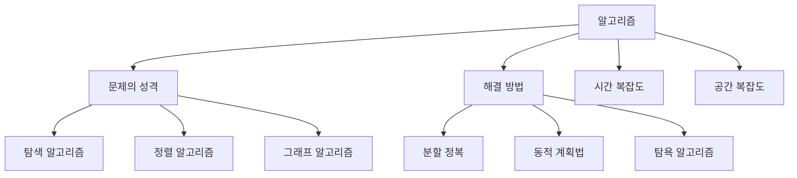

이와 같은 분류 기준을 통해 알고리즘을 체계적으로 이해하고, 문제 해결에 적합한 알고리즘을 선택할 수 있다.

<!--
## 알고리즘의 주제별 분류
   ### 기초적인 알고리즘
   - 최대값 또는 최소값 찾기
   - 유클리드 알고리즘
-->

## 알고리즘의 주제별 분류

**기초적인 알고리즘**

기초적인 알고리즘은 알고리즘의 기본 개념을 이해하고, 문제 해결 능력을 기르는 데 중요한 역할을 한다. 이 섹션에서는 최대값 또는 최소값 찾기와 유클리드 알고리즘에 대해 설명하겠다.

**최대값 또는 최소값 찾기**

최대값 또는 최소값 찾기는 주어진 데이터 집합에서 가장 큰 값이나 가장 작은 값을 찾는 알고리즘이다. 이 알고리즘은 배열이나 리스트와 같은 데이터 구조에서 자주 사용된다. 일반적으로 순차 탐색을 통해 구현되며, 시간 복잡도는 O(n)이다.

다음은 최대값을 찾는 간단한 파이썬 코드 예제이다.

```python
def find_maximum(arr):
    max_value = arr[0]
    for num in arr:
        if num > max_value:
            max_value = num
    return max_value

# 사용 예시
numbers = [3, 5, 1, 8, 2]
print("최대값:", find_maximum(numbers))
```

**유클리드 알고리즘**

유클리드 알고리즘은 두 수의 최대공약수(GCD)를 구하는 효율적인 방법이다. 이 알고리즘은 재귀적으로 두 수의 나머지를 이용하여 최대공약수를 찾는다. 유클리드 알고리즘의 시간 복잡도는 O(log(min(a, b)))이다.

다음은 유클리드 알고리즘을 구현한 파이썬 코드 예제이다.

```python
def gcd(a, b):
    while b:
        a, b = b, a % b
    return a

# 사용 예시
print("최대공약수:", gcd(48, 18))
```

**다이어그램**

아래는 유클리드 알고리즘의 과정을 나타내는 다이어그램이다.

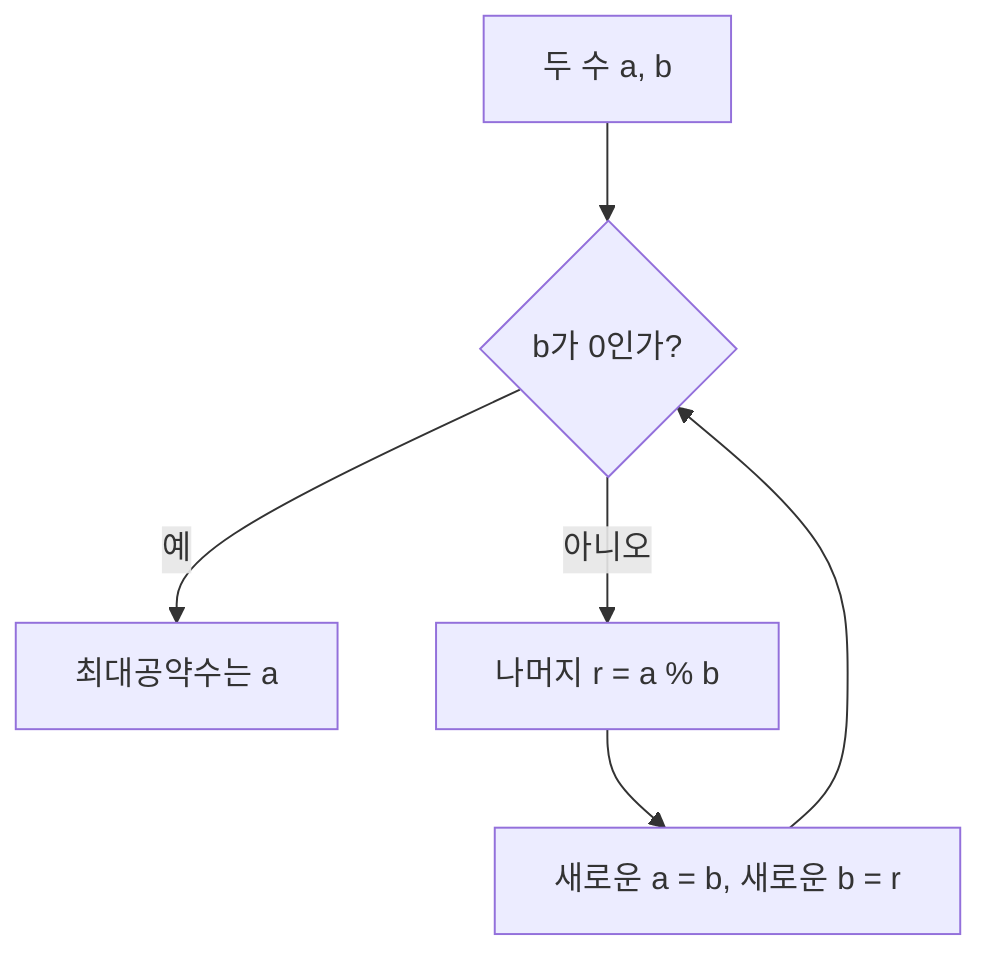

이와 같이 기초적인 알고리즘은 다양한 문제를 해결하는 데 필수적인 기초를 제공하며, 알고리즘의 이해도를 높이는 데 중요한 역할을 한다.

<!--
   ### 탐색 알고리즘 (Searching Algorithm)
   - 탐색 문제 정의
   - 주요 종류
     - 순차 탐색 (Sequential Search)
     - 이진 탐색 (Binary Search)
   - 탐색 알고리즘의 효율성
-->

## 탐색 알고리즘 (Searching Algorithm)

탐색 알고리즘은 주어진 데이터 집합에서 특정한 값을 찾는 방법을 정의하는 알고리즘이다. 데이터가 정렬되어 있는지 여부, 데이터의 크기, 그리고 탐색할 값의 특성에 따라 다양한 탐색 알고리즘이 사용된다. 이 글에서는 탐색 문제의 정의와 주요 탐색 알고리즘, 그리고 이들의 효율성에 대해 살펴보겠다.

**탐색 문제 정의** 

탐색 문제는 주어진 데이터 집합에서 특정한 값을 찾는 문제를 의미한다. 예를 들어, 배열이나 리스트에서 특정한 숫자를 찾거나, 데이터베이스에서 특정한 레코드를 검색하는 경우가 이에 해당한다. 탐색 문제는 데이터의 구조와 크기에 따라 다양한 접근 방식이 필요하다.

**주요 종류** 

탐색 알고리즘의 주요 종류로는 순차 탐색과 이진 탐색이 있다.

- **순차 탐색 (Sequential Search)**  
  순차 탐색은 데이터 집합의 각 요소를 하나씩 확인하여 원하는 값을 찾는 방법이다. 이 방법은 간단하지만, 최악의 경우 모든 요소를 확인해야 하므로 시간 복잡도는 O(n)이다.

  ```python
  def sequential_search(arr, target):
      for index, value in enumerate(arr):
          if value == target:
              return index
      return -1
  ```

- **이진 탐색 (Binary Search)**  
  이진 탐색은 정렬된 데이터 집합에서 중간 값을 기준으로 탐색 범위를 반으로 나누어 원하는 값을 찾는 방법이다. 이 방법은 매우 효율적이며, 시간 복잡도는 O(log n)이다. 단, 이진 탐색을 사용하기 위해서는 데이터가 반드시 정렬되어 있어야 한다.

  ```python
  def binary_search(arr, target):
      left, right = 0, len(arr) - 1
      while left <= right:
          mid = (left + right) // 2
          if arr[mid] == target:
              return mid
          elif arr[mid] < target:
              left = mid + 1
          else:
              right = mid - 1
      return -1
  ```

**탐색 알고리즘의 효율성**  

탐색 알고리즘의 효율성은 주로 시간 복잡도와 공간 복잡도로 평가된다. 순차 탐색은 모든 요소를 확인해야 하므로 O(n)의 시간 복잡도를 가지며, 이진 탐색은 정렬된 데이터에서 O(log n)의 시간 복잡도를 가진다. 따라서 데이터가 정렬되어 있다면 이진 탐색을 사용하는 것이 훨씬 더 효율적이다.

다음은 순차 탐색과 이진 탐색의 시간 복잡도를 비교한 다이어그램이다.

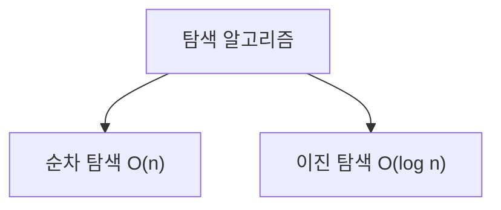

탐색 알고리즘은 데이터 구조와 문제의 특성에 따라 적절한 방법을 선택하는 것이 중요하다. 이를 통해 효율적인 데이터 검색이 가능해진다.

<!--
   ### 스트링 매칭 알고리즘 (String Matching Algorithm)
   - 정의 및 필요성
   - 주요 알고리즘
     - KMP 알고리즘
     - 라빈-카프 알고리즘
-->

## 스트링 매칭 알고리즘 (String Matching Algorithm)

**정의 및 필요성**  

스트링 매칭 알고리즘은 주어진 텍스트 내에서 특정 패턴을 찾는 알고리즘이다. 이 알고리즘은 텍스트 검색, 데이터베이스 쿼리, DNA 서열 분석 등 다양한 분야에서 필수적으로 사용된다. 효율적인 스트링 매칭은 대량의 데이터에서 원하는 정보를 신속하게 찾는 데 중요한 역할을 한다.

**주요 알고리즘**  

**KMP 알고리즘**  

KMP(Knuth-Morris-Pratt) 알고리즘은 패턴을 검색할 때, 이미 비교한 문자를 다시 비교하지 않도록 하는 방식으로 효율성을 높인 알고리즘이다. 이 알고리즘은 패턴의 접두사와 접미사를 이용하여 불필요한 비교를 줄인다. KMP 알고리즘의 시간 복잡도는 O(n + m)으로, n은 텍스트의 길이, m은 패턴의 길이이다.

다음은 KMP 알고리즘의 간단한 구현 예제이다.

```python
def KMP_search(text, pattern):
    # 패턴의 길이
    m = len(pattern)
    # 텍스트의 길이
    n = len(text)

    # LPS 배열 생성
    lps = [0] * m
    j = 0  # 패턴의 인덱스
    computeLPSArray(pattern, m, lps)

    i = 0  # 텍스트의 인덱스
    while n > i:
        if pattern[j] == text[i]:
            i += 1
            j += 1

        if j == m:
            print("패턴이 텍스트의 인덱스 {}에서 발견됨".format(i - j))
            j = lps[j - 1]
        elif i < n and pattern[j] != text[i]:
            if j != 0:
                j = lps[j - 1]
            else:
                i += 1

def computeLPSArray(pattern, m, lps):
    length = 0
    i = 1
    lps[0] = 0

    while i < m:
        if pattern[i] == pattern[length]:
            length += 1
            lps[i] = length
            i += 1
        else:
            if length != 0:
                length = lps[length - 1]
            else:
                lps[i] = 0
                i += 1
```

**라빈-카프 알고리즘** 

라빈-카프 알고리즘은 해시 함수를 사용하여 패턴을 찾는 방법이다. 이 알고리즘은 텍스트의 부분 문자열을 해시 값으로 변환하여 패턴과 비교하는 방식으로 작동한다. 해시 값을 이용하기 때문에 평균적으로 O(n + m) 시간 복잡도를 가지지만, 최악의 경우 O(nm) 시간이 소요될 수 있다.

다음은 라빈-카프 알고리즘의 간단한 구현 예제이다.

```python
def rabin_karp(text, pattern):
    d = 256  # 문자 집합의 크기
    q = 101  # 소수
    M = len(pattern)
    N = len(text)
    p = 0  # 패턴의 해시 값
    t = 0  # 텍스트의 해시 값
    h = 1

    for i in range(M - 1):
        h = (h * d) % q

    for i in range(M):
        p = (d * p + ord(pattern[i])) % q
        t = (d * t + ord(text[i])) % q

    for i in range(N - M + 1):
        if p == t:
            if text[i:i + M] == pattern:
                print("패턴이 텍스트의 인덱스 {}에서 발견됨".format(i))

        if i < N - M:
            t = (d * (t - ord(text[i]) * h) + ord(text[i + M])) % q
            if t < 0:
                t += q
```

다음은 KMP 알고리즘과 라빈-카프 알고리즘의 동작 과정을 나타내는 다이어그램이다.

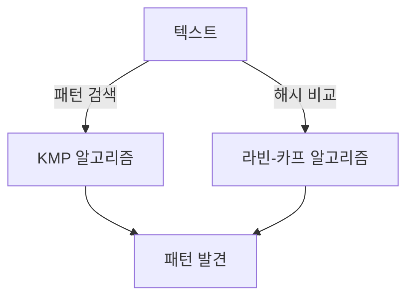

이와 같이 스트링 매칭 알고리즘은 다양한 방법으로 구현될 수 있으며, 각 알고리즘의 특성과 효율성을 고려하여 적절한 상황에서 선택하여 사용할 수 있다.

<!--
   ### 정렬 알고리즘 (Sorting Algorithm)
   - 정렬 문제 정의
   - 주요 종류
     - 선택 정렬 (Selection Sort)
     - 버블 정렬 (Bubble Sort)
     - 삽입 정렬 (Insertion Sort)
     - 퀵 정렬 (Quick Sort)
     - 병합 정렬 (Merge Sort)
   - 정렬 알고리즘의 시간 복잡도 비교
-->

## 정렬 알고리즘 (Sorting Algorithm)

정렬 알고리즘은 주어진 데이터 집합을 특정한 순서에 따라 배열하는 알고리즘이다. 일반적으로 오름차순 또는 내림차순으로 정렬하는 것이 일반적이며, 정렬된 데이터는 검색, 데이터 분석 등 다양한 분야에서 유용하게 활용된다.

**정렬 문제 정의**  

정렬 문제는 주어진 데이터 집합을 정해진 기준에 따라 순서대로 나열하는 문제이다. 예를 들어, 숫자 리스트를 오름차순으로 정렬하거나, 문자열 리스트를 알파벳 순으로 정렬하는 것이 이에 해당한다.

**주요 종류**  

정렬 알고리즘은 여러 가지 종류가 있으며, 그 중에서 대표적인 알고리즘을 소개한다.

- **선택 정렬 (Selection Sort)**  
  선택 정렬은 주어진 리스트에서 가장 작은(또는 큰) 요소를 선택하여 정렬된 부분과 교환하는 방식으로 동작한다. 이 과정은 리스트의 모든 요소가 정렬될 때까지 반복된다.

  ```python
  def selection_sort(arr):
      n = len(arr)
      for i in range(n):
          min_index = i
          for j in range(i + 1, n):
              if arr[j] < arr[min_index]:
                  min_index = j
          arr[i], arr[min_index] = arr[min_index], arr[i]
      return arr
  ```

- **버블 정렬 (Bubble Sort)**  
  버블 정렬은 인접한 두 요소를 비교하여 정렬하는 방식이다. 큰 값이 뒤로 "버블"처럼 올라가는 형태로 정렬이 이루어진다.

  ```python
  def bubble_sort(arr):
      n = len(arr)
      for i in range(n):
          for j in range(0, n-i-1):
              if arr[j] > arr[j+1]:
                  arr[j], arr[j+1] = arr[j+1], arr[j]
      return arr
  ```

- **삽입 정렬 (Insertion Sort)**  
  삽입 정렬은 정렬된 부분과 정렬되지 않은 부분으로 나누고, 정렬되지 않은 부분의 첫 번째 요소를 정렬된 부분에 적절한 위치에 삽입하는 방식이다.

  ```python
  def insertion_sort(arr):
      for i in range(1, len(arr)):
          key = arr[i]
          j = i - 1
          while j >= 0 and key < arr[j]:
              arr[j + 1] = arr[j]
              j -= 1
          arr[j + 1] = key
      return arr
  ```

- **퀵 정렬 (Quick Sort)**  
  퀵 정렬은 분할 정복 기법을 사용하는 알고리즘으로, 피벗을 선택하여 피벗보다 작은 요소와 큰 요소로 나누고, 재귀적으로 정렬하는 방식이다.

  ```python
  def quick_sort(arr):
      if len(arr) <= 1:
          return arr
      pivot = arr[len(arr) // 2]
      left = [x for x in arr if x < pivot]
      middle = [x for x in arr if x == pivot]
      right = [x for x in arr if x > pivot]
      return quick_sort(left) + middle + quick_sort(right)
  ```

- **병합 정렬 (Merge Sort)**  
  병합 정렬 역시 분할 정복 기법을 사용하며, 리스트를 반으로 나누고 각각을 정렬한 후, 두 정렬된 리스트를 병합하는 방식이다.

  ```python
  def merge_sort(arr):
      if len(arr) <= 1:
          return arr
      mid = len(arr) // 2
      left = merge_sort(arr[:mid])
      right = merge_sort(arr[mid:])
      return merge(left, right)

  def merge(left, right):
      result = []
      i = j = 0
      while i < len(left) and j < len(right):
          if left[i] < right[j]:
              result.append(left[i])
              i += 1
          else:
              result.append(right[j])
              j += 1
      result.extend(left[i:])
      result.extend(right[j:])
      return result
  ```

**정렬 알고리즘의 시간 복잡도 비교**

정렬 알고리즘의 시간 복잡도는 알고리즘의 효율성을 평가하는 중요한 기준이다. 다음은 주요 정렬 알고리즘의 평균 및 최악의 경우 시간 복잡도이다.

| 알고리즘         | 평균 시간 복잡도 | 최악 시간 복잡도 | 공간 복잡도 |
|------------------|------------------|-------------------|--------------|
| 선택 정렬       | O(n^2)           | O(n^2)            | O(1)         |
| 버블 정렬       | O(n^2)           | O(n^2)            | O(1)         |
| 삽입 정렬       | O(n^2)           | O(n^2)            | O(1)         |
| 퀵 정렬         | O(n log n)       | O(n^2)            | O(log n)     |
| 병합 정렬       | O(n log n)       | O(n log n)        | O(n)         |

정렬 알고리즘은 데이터의 특성과 크기에 따라 적절한 알고리즘을 선택하는 것이 중요하다. 각 알고리즘의 장단점을 이해하고, 상황에 맞는 알고리즘을 활용하는 것이 효율적인 프로그래밍의 핵심이다.

<!--
   ### 그래프 알고리즘 (Graph Algorithm)
   - 그래프의 정의
   - 주요 종류
     - 그래프 순회 (Graph Traversal)
     - 최소비용 생성 트리 알고리즘
     - 최단경로 알고리즘 (Dijkstra, Bellman-Ford)
-->

## 그래프 알고리즘 (Graph Algorithm)

**그래프의 정의**  

그래프는 정점(Vertex)과 정점 간의 연결을 나타내는 간선(Edge)으로 구성된 자료 구조이다. 그래프는 다양한 형태로 나타낼 수 있으며, 방향성이 있는 그래프(Directed Graph)와 방향성이 없는 그래프(Undirected Graph)로 구분된다. 그래프는 네트워크, 소셜 미디어, 도로망 등 여러 분야에서 활용된다.

**주요 종류**  

**그래프 순회 (Graph Traversal)** 

그래프 순회는 그래프의 모든 정점을 방문하는 과정을 의미한다. 대표적인 그래프 순회 알고리즘으로는 깊이 우선 탐색(Depth-First Search, DFS)과 너비 우선 탐색(Breadth-First Search, BFS)이 있다. DFS는 한 방향으로 최대한 깊게 탐색한 후, 더 이상 갈 수 없을 때 되돌아오는 방식이다. 반면, BFS는 현재 정점과 인접한 정점들을 먼저 방문한 후, 다음 단계로 넘어가는 방식이다.

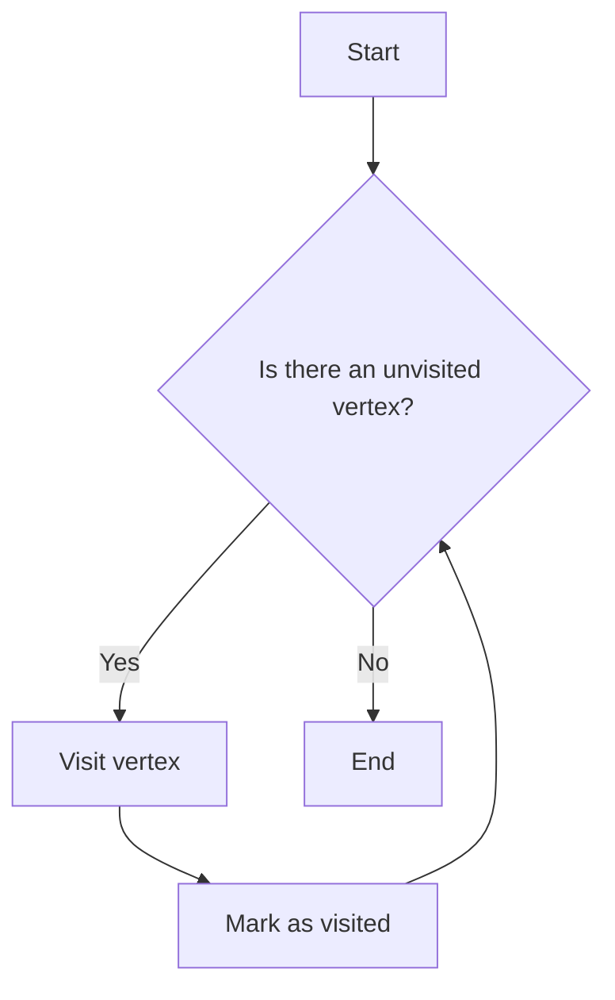

**최소비용 생성 트리 알고리즘**  

최소비용 생성 트리는 그래프의 모든 정점을 포함하면서, 간선의 총 비용이 최소가 되는 트리이다. 대표적인 알고리즘으로는 크루스칼 알고리즘(Kruskal's Algorithm)과 프림 알고리즘(Prim's Algorithm)이 있다. 크루스칼 알고리즘은 간선을 비용 순으로 정렬한 후, 사이클을 형성하지 않도록 간선을 선택하는 방식이다. 프림 알고리즘은 시작 정점에서부터 인접한 정점 중 가장 비용이 적은 간선을 선택하여 트리를 확장하는 방식이다.

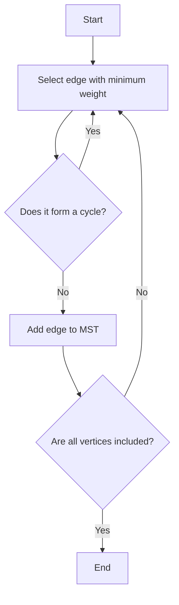

**최단경로 알고리즘 (Dijkstra, Bellman-Ford)**  

최단경로 알고리즘은 그래프에서 두 정점 간의 최단 경로를 찾는 알고리즘이다. 다익스트라 알고리즘(Dijkstra's Algorithm)은 가중치가 있는 그래프에서 한 정점에서 다른 모든 정점까지의 최단 경로를 찾는 데 사용된다. 이 알고리즘은 우선순위 큐를 사용하여 현재까지의 최단 경로를 업데이트하며, 음의 가중치가 없는 그래프에서만 사용할 수 있다.

벨만-포드 알고리즘(Bellman-Ford Algorithm)은 음의 가중치가 있는 그래프에서도 최단 경로를 찾을 수 있는 알고리즘이다. 이 알고리즘은 모든 간선을 반복적으로 검사하여 최단 경로를 업데이트하는 방식으로 작동한다. 다만, 음의 사이클이 존재하는 경우에는 최단 경로를 찾을 수 없다.

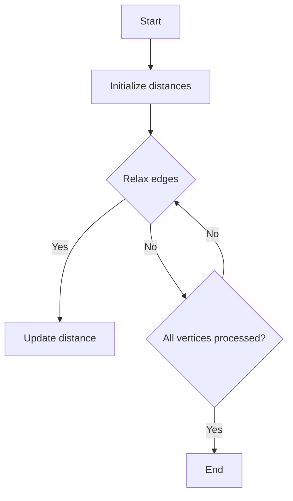

그래프 알고리즘은 다양한 문제를 해결하는 데 필수적인 도구이며, 실제 응용에서도 널리 사용된다. 이러한 알고리즘을 이해하고 활용하는 것은 소프트웨어 개발 및 데이터 분석 분야에서 매우 중요하다.

<!--
   ### 해시 알고리즘 (Hash Algorithm)
   - 해시 함수의 정의
   - 해시 테이블의 구조와 활용
-->

## 해시 알고리즘 (Hash Algorithm)

**해시 함수의 정의**  

해시 함수는 임의의 길이를 가진 입력 데이터를 고정된 길이의 해시 값으로 변환하는 함수이다. 이 함수는 입력 데이터의 내용을 기반으로 해시 값을 생성하며, 동일한 입력에 대해서는 항상 동일한 해시 값을 반환한다. 해시 함수는 데이터의 무결성을 검증하거나, 데이터 검색을 빠르게 하기 위해 사용된다. 해시 함수의 주요 특징은 다음과 같다.

1. **결정성**: 동일한 입력에 대해 항상 동일한 해시 값을 생성한다.
2. **빠른 계산**: 해시 값을 빠르게 계산할 수 있어야 한다.
3. **충돌 저항성**: 서로 다른 입력이 동일한 해시 값을 생성하는 경우(충돌)가 적어야 한다.
4. **비가역성**: 해시 값을 통해 원래의 입력 데이터를 복원할 수 없어야 한다.

해시 함수의 예로는 SHA-256, MD5 등이 있으며, 이들은 각각 다른 보안 수준과 속성을 가진다.

**해시 테이블의 구조와 활용**  

해시 테이블은 해시 함수를 사용하여 데이터를 저장하는 자료 구조이다. 해시 테이블은 키-값 쌍으로 데이터를 저장하며, 키를 해시 함수에 입력하여 생성된 해시 값을 인덱스로 사용하여 데이터를 저장하거나 검색한다. 해시 테이블의 구조는 다음과 같다.

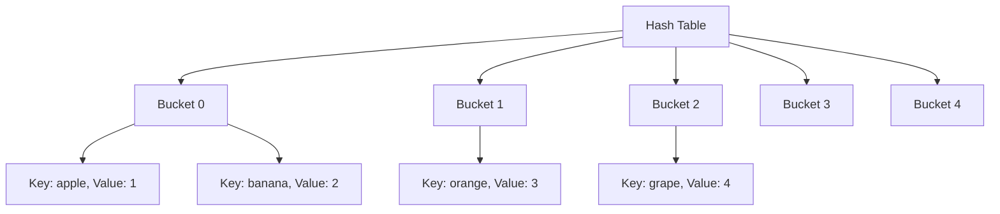

해시 테이블의 주요 장점은 평균적으로 O(1)의 시간 복잡도로 데이터를 검색할 수 있다는 점이다. 그러나 해시 충돌이 발생할 경우, 충돌 해결 방법에 따라 성능이 저하될 수 있다. 일반적인 충돌 해결 방법으로는 체이닝(Chaining)과 개방 주소법(Open Addressing)이 있다.

해시 테이블은 데이터베이스 인덱싱, 캐시 구현, 중복 데이터 제거 등 다양한 분야에서 활용된다. 예를 들어, 웹 브라우저의 캐시는 URL을 해시 테이블에 저장하여 빠르게 페이지를 로드할 수 있도록 돕는다.

<!--
   ### 최적화 알고리즘 (Optimizing Algorithm)
   - 최적화 문제의 정의
   - 주요 기법
     - 선형 프로그래밍
     - 유전자 알고리즘
-->

## 최적화 알고리즘 (Optimizing Algorithm)

최적화 알고리즘은 주어진 문제의 최적해를 찾기 위한 알고리즘이다. 이러한 알고리즘은 다양한 분야에서 활용되며, 특히 자원 배분, 경로 최적화, 스케줄링 문제 등에서 중요한 역할을 한다. 최적화 문제는 일반적으로 목적 함수와 제약 조건으로 구성되며, 이 두 요소를 고려하여 최적의 해를 도출하는 것이 핵심이다.

**최적화 문제의 정의**

최적화 문제는 특정한 조건을 만족하는 해를 찾는 문제로, 주어진 목적 함수를 최대화하거나 최소화하는 것을 목표로 한다. 예를 들어, 생산 비용을 최소화하거나 이익을 최대화하는 문제는 전형적인 최적화 문제이다. 이러한 문제는 수학적 모델링을 통해 정의되며, 다양한 기법을 통해 해결할 수 있다.

**주요 기법**

최적화 알고리즘에는 여러 가지 기법이 존재하며, 그 중에서 두 가지 주요 기법을 소개한다.

- **선형 프로그래밍 (Linear Programming)**

선형 프로그래밍은 선형 방정식과 부등식으로 구성된 제약 조건을 가진 최적화 문제를 해결하는 기법이다. 이 기법은 목적 함수와 제약 조건이 모두 선형일 때 사용되며, 일반적으로 심플렉스 알고리즘(Simplex Algorithm)이나 내적점 방법(Interior Point Method)을 통해 해결된다.

다음은 선형 프로그래밍의 간단한 예시를 보여주는 다이어그램이다.

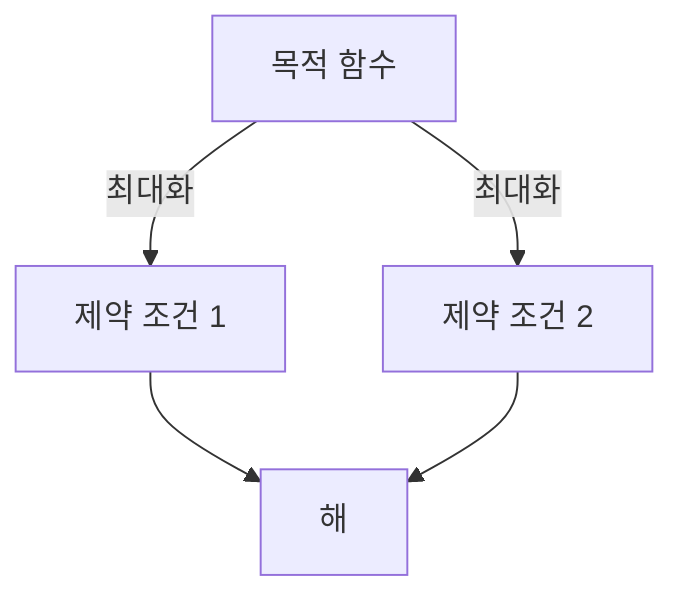

- **유전자 알고리즘 (Genetic Algorithm)**

유전자 알고리즘은 자연 선택과 유전학의 원리를 기반으로 한 최적화 기법이다. 이 알고리즘은 해의 집합을 '개체'로 보고, 이들 개체의 적합도를 평가하여 최적해를 찾는다. 유전자 알고리즘은 주로 복잡한 최적화 문제에 효과적이며, 다음과 같은 단계로 진행된다.

1. 초기 개체군 생성
2. 적합도 평가
3. 선택, 교배, 돌연변이 과정을 통해 새로운 개체군 생성
4. 종료 조건 만족 시까지 반복

아래는 유전자 알고리즘의 흐름을 나타낸 다이어그램이다.

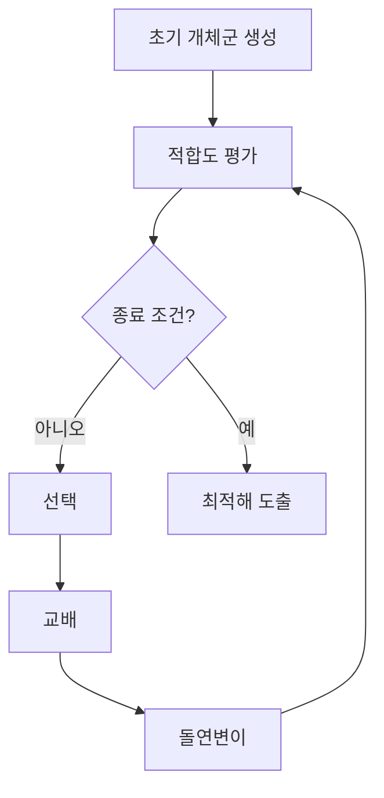

최적화 알고리즘은 다양한 문제를 해결하는 데 유용하며, 각 기법의 특성과 적용 가능성을 이해하는 것이 중요하다. 이를 통해 실제 문제에 적합한 최적화 기법을 선택할 수 있다.

<!--
## 알고리즘에 확률의 개입 여부에 따른 분류
   ### 결정 알고리즘 (Deterministic Algorithm)
   ### 확률 알고리즘 (Probabilistic Algorithm)
   - 몬테칼로 알고리즘
   - 라스베가스 알고리즘
-->

## 알고리즘에 확률의 개입 여부에 따른 분류

알고리즘은 그 설계 방식에 따라 결정적 알고리즘과 확률적 알고리즘으로 나눌 수 있다. 이 두 가지 유형은 문제 해결 접근 방식에서 큰 차이를 보인다.

**결정 알고리즘 (Deterministic Algorithm)**

결정 알고리즘은 주어진 입력에 대해 항상 동일한 출력을 생성하는 알고리즘이다. 즉, 같은 입력을 주었을 때 항상 같은 결과를 도출한다. 이러한 알고리즘은 예측 가능성이 높고, 결과의 정확성이 보장된다. 일반적으로 수학적 모델이나 명확한 규칙에 기반하여 작동한다.

예를 들어, 정렬 알고리즘인 퀵 정렬이나 병합 정렬은 결정적 알고리즘의 대표적인 예이다. 이들은 입력 데이터에 따라 항상 동일한 방식으로 정렬을 수행한다.

**확률 알고리즘 (Probabilistic Algorithm)**

확률 알고리즘은 입력에 따라 다양한 출력을 생성할 수 있는 알고리즘이다. 이러한 알고리즘은 확률적 요소를 포함하고 있어, 동일한 입력에 대해 매번 다른 결과를 도출할 수 있다. 확률 알고리즘은 일반적으로 문제 해결의 효율성을 높이기 위해 사용되며, 특히 NP-완전 문제와 같은 복잡한 문제를 해결하는 데 유용하다.

**몬테칼로 알고리즘**

몬테칼로 알고리즘은 무작위 샘플링을 통해 문제를 해결하는 방법이다. 이 알고리즘은 주어진 문제의 해를 찾기 위해 여러 번의 무작위 실험을 수행하고, 그 결과를 바탕으로 최종 결론을 도출한다. 예를 들어, 원주율을 근사하는 방법으로 몬테칼로 방법이 사용된다.

```python
import random

def monte_carlo_pi(num_samples):
    inside_circle = 0
    for _ in range(num_samples):
        x, y = random.uniform(-1, 1), random.uniform(-1, 1)
        if x**2 + y**2 <= 1:
            inside_circle += 1
    return (inside_circle / num_samples) * 4

# 1000000 샘플을 사용하여 원주율 근사
estimated_pi = monte_carlo_pi(1000000)
print(f"Estimated Pi: {estimated_pi}")
```

**라스베가스 알고리즘**

라스베가스 알고리즘은 항상 올바른 결과를 보장하지만, 그 결과를 도출하는 데 걸리는 시간은 확률적으로 변동하는 알고리즘이다. 이 알고리즘은 무작위성을 사용하여 문제를 해결하며, 최악의 경우에도 결과를 보장한다. 예를 들어, 랜덤화된 퀵 정렬은 라스베가스 알고리즘의 한 예로, 평균적으로 빠른 성능을 보이지만 최악의 경우에는 느릴 수 있다.

```python
import random

def randomized_quick_sort(arr):
    if len(arr) <= 1:
        return arr
    pivot = random.choice(arr)
    less_than_pivot = [x for x in arr if x < pivot]
    equal_to_pivot = [x for x in arr if x == pivot]
    greater_than_pivot = [x for x in arr if x > pivot]
    return randomized_quick_sort(less_than_pivot) + equal_to_pivot + randomized_quick_sort(greater_than_pivot)

# 예시 배열
arr = [3, 6, 8, 10, 1, 2, 1]
sorted_arr = randomized_quick_sort(arr)
print(f"Sorted Array: {sorted_arr}")
```

이와 같이 결정 알고리즘과 확률 알고리즘은 각각의 특성과 장단점이 있으며, 문제의 성격에 따라 적절한 알고리즘을 선택하는 것이 중요하다.

<!--
## 알고리즘의 설계 기법/설계 전략/설계 패러다임에 의한 분류
   - 분할정복 (Divide and Conquer)
   - 동적계획법 (Dynamic Programming)
   - 탐욕 알고리즘 (Greedy Algorithm)
-->

## 알고리즘의 설계 기법/설계 전략/설계 패러다임에 의한 분류

알고리즘의 설계 기법은 문제를 해결하기 위한 다양한 접근 방식을 제공한다. 이 섹션에서는 세 가지 주요 설계 기법인 분할정복, 동적계획법, 탐욕 알고리즘에 대해 설명하겠다.

**분할정복 (Divide and Conquer)**

분할정복은 문제를 더 작은 하위 문제로 나누고, 각 하위 문제를 독립적으로 해결한 후, 그 결과를 결합하여 최종 해결책을 도출하는 방법이다. 이 기법은 주로 재귀적으로 구현되며, 대표적인 예로는 퀵 정렬과 병합 정렬이 있다.

다음은 병합 정렬의 간단한 구현 예제이다.

```python
def merge_sort(arr):
    if len(arr) > 1:
        mid = len(arr) // 2
        left_half = arr[:mid]
        right_half = arr[mid:]

        merge_sort(left_half)
        merge_sort(right_half)

        i = j = k = 0

        while i < len(left_half) and j < len(right_half):
            if left_half[i] < right_half[j]:
                arr[k] = left_half[i]
                i += 1
            else:
                arr[k] = right_half[j]
                j += 1
            k += 1

        while i < len(left_half):
            arr[k] = left_half[i]
            i += 1
            k += 1

        while j < len(right_half):
            arr[k] = right_half[j]
            j += 1
            k += 1

# 사용 예
arr = [38, 27, 43, 3, 9, 82, 10]
merge_sort(arr)
print(arr)  # 출력: [3, 9, 10, 27, 38, 43, 82]
```

다음은 분할정복의 과정을 나타내는 다이어그램이다.

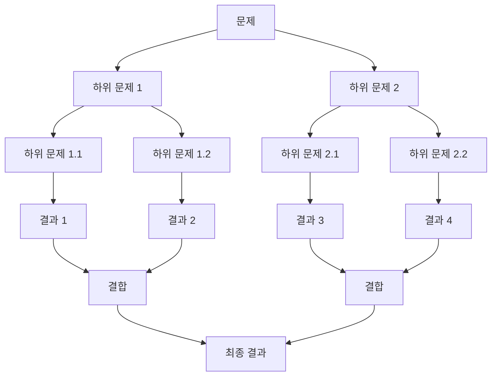

**동적계획법 (Dynamic Programming)**

동적계획법은 문제를 여러 개의 하위 문제로 나누고, 각 하위 문제의 결과를 저장하여 중복 계산을 피하는 기법이다. 이 방법은 최적 부분 구조와 중복 부분 문제의 성질을 가진 문제에 적합하다. 대표적인 예로는 피보나치 수열, 최장 공통 부분 수열 등이 있다.

다음은 피보나치 수열을 동적계획법으로 구현한 예제이다.

```python
def fibonacci(n):
    fib = [0] * (n + 1)
    fib[1] = 1

    for i in range(2, n + 1):
        fib[i] = fib[i - 1] + fib[i - 2]

    return fib[n]

# 사용 예
print(fibonacci(10))  # 출력: 55
```

**탐욕 알고리즘 (Greedy Algorithm)**

탐욕 알고리즘은 현재 상황에서 가장 최적이라고 생각되는 선택을 하는 방식으로 문제를 해결하는 기법이다. 이 방법은 최적해를 보장하지 않지만, 많은 경우에 빠르고 효율적인 해결책을 제공한다. 대표적인 예로는 동전 교환 문제, 최소 신장 트리 등이 있다.

다음은 동전 교환 문제를 해결하는 탐욕 알고리즘의 예제이다.

```python
def coin_change(coins, amount):
    coins.sort(reverse=True)
    count = 0
    for coin in coins:
        while amount >= coin:
            amount -= coin
            count += 1
    return count

# 사용 예
coins = [1, 5, 10, 25]
amount = 63
print(coin_change(coins, amount))  # 출력: 6 (25*2 + 10*1 + 1*3)
```

이와 같이 알고리즘의 설계 기법은 문제 해결을 위한 다양한 접근 방식을 제공하며, 각 기법의 특성과 장단점을 이해하는 것이 중요하다.

<!--
## 알고리즘의 응용
   - 알고리즘의 실제 사례
   - 산업별 알고리즘 활용 예시
-->

## 알고리즘의 응용

알고리즘은 다양한 분야에서 실제 문제를 해결하는 데 필수적인 역할을 한다. 이 섹션에서는 알고리즘의 실제 사례와 산업별 알고리즘 활용 예시에 대해 살펴보겠다.

**알고리즘의 실제 사례**

알고리즘은 일상생활에서도 쉽게 찾아볼 수 있다. 예를 들어, 검색 엔진에서 사용되는 페이지랭크 알고리즘은 웹 페이지의 중요도를 평가하여 검색 결과의 순위를 결정하는 데 사용된다. 이 알고리즘은 링크 구조를 분석하여 페이지의 신뢰성을 평가하고, 사용자에게 가장 관련성 높은 정보를 제공하는 데 기여한다.

또한, 추천 시스템에서도 알고리즘이 중요한 역할을 한다. 예를 들어, 넷플릭스나 아마존과 같은 플랫폼은 사용자의 이전 행동을 기반으로 추천 알고리즘을 통해 개인화된 콘텐츠를 제공한다. 이러한 알고리즘은 사용자의 취향을 분석하고, 비슷한 사용자들의 행동을 참고하여 최적의 추천을 생성한다.

**산업별 알고리즘 활용 예시**

1. **금융 산업**: 금융 분야에서는 알고리즘 트레이딩이 널리 사용된다. 이 알고리즘은 시장 데이터를 분석하고, 실시간으로 거래 결정을 내리는 데 도움을 준다. 예를 들어, 특정 주식의 가격이 일정 수준에 도달했을 때 자동으로 매수 또는 매도하는 알고리즘이 있다.

2. **의료 산업**: 의료 분야에서는 진단 알고리즘이 환자의 증상을 분석하여 질병을 예측하는 데 사용된다. 머신러닝 알고리즘을 활용하여 환자의 데이터를 분석하고, 질병의 가능성을 평가하는 시스템이 개발되고 있다.

3. **물류 산업**: 물류 및 배송 분야에서는 최적화 알고리즘이 경로 계획 및 재고 관리를 개선하는 데 사용된다. 예를 들어, 배송 차량의 최적 경로를 계산하여 연료 비용을 절감하고, 배송 시간을 단축하는 알고리즘이 있다.

다음은 간단한 알고리즘의 예시를 보여주는 코드이다. 이 코드는 주어진 리스트에서 최대값을 찾는 알고리즘을 구현한 것이다.

```python
def find_maximum(numbers):
    max_value = numbers[0]
    for number in numbers:
        if number > max_value:
            max_value = number
    return max_value

# 사용 예시
numbers = [3, 5, 2, 8, 1]
print("최대값:", find_maximum(numbers))
```

또한, 알고리즘의 흐름을 시각적으로 표현한 다이어그램은 다음과 같다.

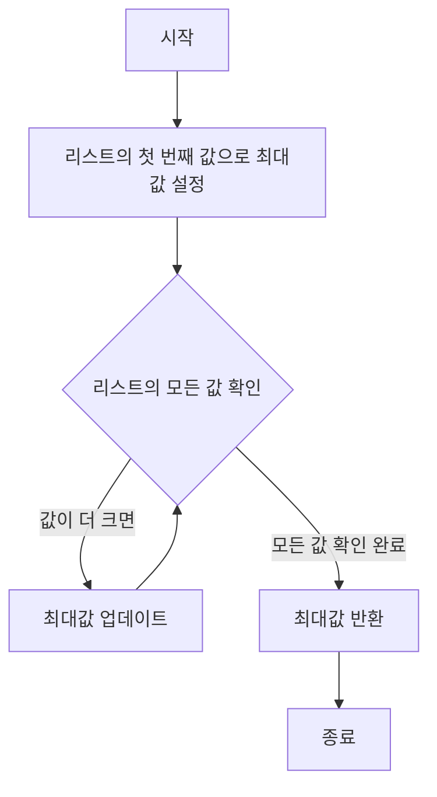

이와 같이 알고리즘은 다양한 산업에서 실제 문제를 해결하는 데 중요한 역할을 하고 있으며, 앞으로도 그 활용 범위는 더욱 넓어질 것이다.

<!--
## 예제
   - 각 알고리즘의 구현 예제
   - 문제 해결을 위한 알고리즘 선택 가이드
-->

## 예제

**각 알고리즘의 구현 예제**

알고리즘을 이해하는 가장 좋은 방법 중 하나는 실제로 구현해보는 것이다. 아래에서는 몇 가지 기본적인 알고리즘의 구현 예제를 소개한다.

**1. 최대값 찾기 알고리즘**

최대값을 찾는 알고리즘은 주어진 리스트에서 가장 큰 값을 찾는 간단한 알고리즘이다. 아래는 파이썬으로 구현한 예제이다.

```python
def find_maximum(numbers):
    max_value = numbers[0]
    for number in numbers:
        if number > max_value:
            max_value = number
    return max_value

# 사용 예
numbers = [3, 5, 2, 9, 1]
print(find_maximum(numbers))  # 출력: 9
```

**2. 이진 탐색 알고리즘**

이진 탐색은 정렬된 리스트에서 특정 값을 찾는 효율적인 방법이다. 아래는 이진 탐색의 파이썬 구현 예제이다.

```python
def binary_search(sorted_list, target):
    left, right = 0, len(sorted_list) - 1
    while left <= right:
        mid = (left + right) // 2
        if sorted_list[mid] == target:
            return mid
        elif sorted_list[mid] < target:
            left = mid + 1
        else:
            right = mid - 1
    return -1

# 사용 예
sorted_list = [1, 2, 3, 4, 5, 6, 7, 8, 9]
target = 5
print(binary_search(sorted_list, target))  # 출력: 4
```

**3. 퀵 정렬 알고리즘**

퀵 정렬은 분할 정복 기법을 사용하는 정렬 알고리즘이다. 아래는 퀵 정렬의 파이썬 구현 예제이다.

```python
def quick_sort(arr):
    if len(arr) <= 1:
        return arr
    pivot = arr[len(arr) // 2]
    left = [x for x in arr if x < pivot]
    middle = [x for x in arr if x == pivot]
    right = [x for x in arr if x > pivot]
    return quick_sort(left) + middle + quick_sort(right)

# 사용 예
arr = [3, 6, 8, 10, 1, 2, 1]
print(quick_sort(arr))  # 출력: [1, 1, 2, 3, 6, 8, 10]
```

**문제 해결을 위한 알고리즘 선택 가이드**

알고리즘을 선택할 때는 문제의 특성과 요구 사항을 고려해야 한다. 다음은 알고리즘 선택을 위한 몇 가지 가이드라인이다.

1. **문제의 유형 파악하기**: 문제의 유형에 따라 적합한 알고리즘이 다르다. 예를 들어, 정렬이 필요한 경우 정렬 알고리즘을 선택해야 한다.

2. **데이터의 크기 고려하기**: 데이터의 크기가 크면 시간 복잡도가 낮은 알고리즘을 선택하는 것이 중요하다. 예를 들어, O(n log n) 복잡도를 가진 퀵 정렬이나 병합 정렬이 적합하다.

3. **메모리 사용량 고려하기**: 메모리 사용량이 중요한 경우, 메모리 효율적인 알고리즘을 선택해야 한다. 예를 들어, 선택 정렬은 O(1) 공간 복잡도를 가진다.

4. **알고리즘의 안정성**: 정렬 알고리즘의 경우, 안정성이 필요한 경우 안정적인 알고리즘을 선택해야 한다. 예를 들어, 병합 정렬은 안정적인 정렬 알고리즘이다.

5. **실행 시간과 구현 난이도**: 알고리즘의 실행 시간과 구현 난이도를 고려하여 적절한 알고리즘을 선택해야 한다. 간단한 문제는 간단한 알고리즘으로 해결할 수 있다.

이러한 가이드라인을 통해 문제에 적합한 알고리즘을 선택할 수 있으며, 이를 통해 효율적인 문제 해결이 가능하다.

<!--
## FAQ
   - 알고리즘의 시간 복잡도란 무엇인가?
   - 어떤 알고리즘을 선택해야 할까?
   - 알고리즘을 배우기 위한 추천 자료
-->

## FAQ

**알고리즘의 시간 복잡도란 무엇인가?**  

알고리즘의 시간 복잡도는 알고리즘이 문제를 해결하는 데 소요되는 시간의 양을 나타내는 척도이다. 이는 입력의 크기와 알고리즘의 성능 간의 관계를 설명하며, 일반적으로 빅오 표기법(Big O notation)을 사용하여 표현된다. 예를 들어, O(n), O(log n), O(n^2) 등의 형태로 나타낼 수 있다. 시간 복잡도를 분석함으로써 알고리즘의 효율성을 비교하고, 최적의 알고리즘을 선택하는 데 도움을 준다.

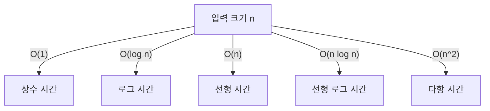

**어떤 알고리즘을 선택해야 할까?**
  
알고리즘을 선택할 때는 문제의 특성과 요구 사항을 고려해야 한다. 예를 들어, 데이터의 크기, 정렬 여부, 탐색의 필요성, 메모리 사용량 등을 평가해야 한다. 또한, 알고리즘의 시간 복잡도와 공간 복잡도를 비교하여 최적의 선택을 할 수 있다. 일반적으로 다음과 같은 기준을 고려할 수 있다:

1. **문제의 유형**: 정렬, 탐색, 최적화 문제 등
2. **데이터의 크기**: 작은 데이터에는 단순한 알고리즘이 적합할 수 있지만, 큰 데이터에는 효율적인 알고리즘이 필요하다.
3. **성능 요구 사항**: 실시간 처리나 대량의 데이터 처리 등 성능이 중요한 경우 적합한 알고리즘을 선택해야 한다.

**알고리즘을 배우기 위한 추천 자료**

알고리즘을 배우기 위해서는 다양한 자료를 활용하는 것이 좋다. 다음은 추천하는 자료들이다:

1. **도서**: 
   - "Introduction to Algorithms" by Thomas H. Cormen
   - "Algorithms" by Robert Sedgewick
   - "Grokking Algorithms" by Aditya Bhargava

2. **온라인 강의**:
   - Coursera의 "Algorithms Specialization"
   - edX의 "Algorithm Design and Analysis"
   - Udacity의 "Data Structures and Algorithms Nanodegree"

3. **웹사이트 및 커뮤니티**:
   - LeetCode: 다양한 알고리즘 문제를 풀어볼 수 있는 플랫폼
   - HackerRank: 알고리즘 및 데이터 구조 문제를 연습할 수 있는 사이트
   - Stack Overflow: 알고리즘 관련 질문과 답변을 찾을 수 있는 커뮤니티

이러한 자료들을 통해 알고리즘에 대한 이해를 깊이 있게 할 수 있으며, 실습을 통해 문제 해결 능력을 향상시킬 수 있다.

<!--
## 관련 기술
   - 데이터 구조와 알고리즘의 관계
   - 머신러닝과 알고리즘
   - 알고리즘과 소프트웨어 개발
-->

## 관련 기술

**데이터 구조와 알고리즘의 관계**

데이터 구조와 알고리즘은 소프트웨어 개발의 두 가지 핵심 요소이다. 데이터 구조는 데이터를 저장하고 조직하는 방법을 정의하며, 알고리즘은 이러한 데이터를 처리하는 방법을 정의한다. 따라서 적절한 데이터 구조를 선택하는 것은 알고리즘의 효율성을 크게 향상시킬 수 있다. 예를 들어, 배열과 연결 리스트는 데이터를 저장하는 방법이 다르며, 이로 인해 특정 알고리즘의 성능에 영향을 미친다.

다음은 데이터 구조와 알고리즘의 관계를 나타내는 다이어그램이다.

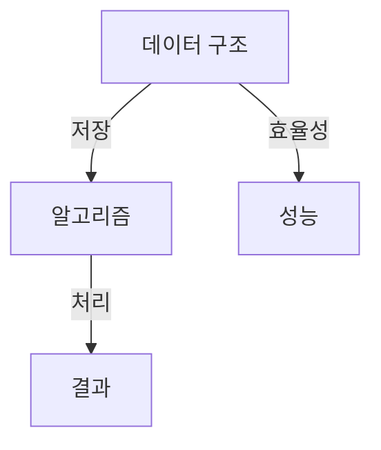

**머신러닝과 알고리즘**

머신러닝은 데이터에서 패턴을 학습하고 예측을 수행하는 알고리즘의 집합이다. 전통적인 알고리즘과는 달리, 머신러닝 알고리즘은 데이터로부터 스스로 학습하여 성능을 개선할 수 있다. 예를 들어, 회귀 분석, 의사결정 나무, 신경망 등은 머신러닝의 대표적인 알고리즘이다. 이러한 알고리즘은 대량의 데이터를 처리하고, 이를 통해 예측 모델을 구축하는 데 사용된다.

아래는 간단한 선형 회귀 알고리즘의 샘플 코드이다.

```python
import numpy as np
from sklearn.linear_model import LinearRegression

# 데이터 생성
X = np.array([[1], [2], [3], [4], [5]])
y = np.array([1, 2, 3, 4, 5])

# 모델 생성 및 학습
model = LinearRegression()
model.fit(X, y)

# 예측
predictions = model.predict(np.array([[6], [7]]))
print(predictions)  # [6. 7.]
```

**알고리즘과 소프트웨어 개발**

알고리즘은 소프트웨어 개발의 핵심 요소로, 문제 해결을 위한 체계적인 접근 방식을 제공한다. 소프트웨어 개발 과정에서 알고리즘을 설계하고 구현하는 것은 필수적이며, 이는 코드의 효율성과 유지보수성을 높이는 데 기여한다. 또한, 알고리즘의 선택은 소프트웨어의 성능에 직접적인 영향을 미치므로, 개발자는 문제에 적합한 알고리즘을 선택해야 한다.

소프트웨어 개발에서 알고리즘을 효과적으로 활용하기 위해서는 다음과 같은 원칙을 고려해야 한다.

1. **문제 정의**: 해결하고자 하는 문제를 명확히 정의한다.
2. **알고리즘 선택**: 문제에 적합한 알고리즘을 선택한다.
3. **성능 분석**: 알고리즘의 시간 복잡도와 공간 복잡도를 분석한다.
4. **테스트 및 검증**: 알고리즘이 올바르게 작동하는지 테스트한다.

이러한 원칙을 통해 알고리즘을 효과적으로 활용할 수 있으며, 이는 소프트웨어 개발의 성공에 중요한 역할을 한다.

<!--
## 결론
   - 알고리즘 학습의 중요성
   - 앞으로의 알고리즘 발전 방향
-->

## 결론

**알고리즘 학습의 중요성**

알고리즘은 컴퓨터 과학의 근본적인 요소로, 문제를 해결하기 위한 절차나 방법을 정의한다. 알고리즘을 학습하는 것은 단순히 프로그래밍 기술을 향상시키는 것에 그치지 않고, 문제 해결 능력을 키우고, 효율적인 코드를 작성하는 데 필수적이다. 알고리즘을 이해하고 활용함으로써 개발자는 복잡한 문제를 체계적으로 접근할 수 있으며, 최적의 해결책을 찾는 데 필요한 사고 방식을 기를 수 있다. 

또한, 알고리즘은 다양한 분야에서 응용되므로, 알고리즘에 대한 깊은 이해는 데이터 분석, 인공지능, 웹 개발 등 여러 분야에서 경쟁력을 높이는 데 기여한다. 따라서 알고리즘 학습은 개발자에게 필수적인 과정이라 할 수 있다.

**앞으로의 알고리즘 발전 방향**

알고리즘의 발전은 기술의 발전과 밀접한 관계가 있다. 인공지능과 머신러닝의 발전으로 인해, 데이터 처리와 분석을 위한 새로운 알고리즘이 지속적으로 개발되고 있다. 예를 들어, 딥러닝 알고리즘은 대량의 데이터를 처리하고 패턴을 인식하는 데 매우 효과적이다. 이러한 알고리즘은 앞으로도 더욱 발전하여 다양한 산업에 혁신을 가져올 것으로 예상된다.

또한, 양자 컴퓨팅의 발전은 기존의 알고리즘을 재정의할 가능성을 가지고 있다. 양자 알고리즘은 특정 문제를 기존의 컴퓨터보다 훨씬 빠르게 해결할 수 있는 잠재력을 지니고 있으며, 이는 알고리즘 연구의 새로운 지평을 열 것이다.

마지막으로, 알고리즘의 효율성과 최적화는 앞으로도 중요한 연구 주제가 될 것이다. 데이터의 양이 기하급수적으로 증가함에 따라, 효율적인 알고리즘의 필요성이 더욱 커질 것이며, 이를 통해 자원 낭비를 줄이고 성능을 극대화하는 방향으로 발전할 것이다.

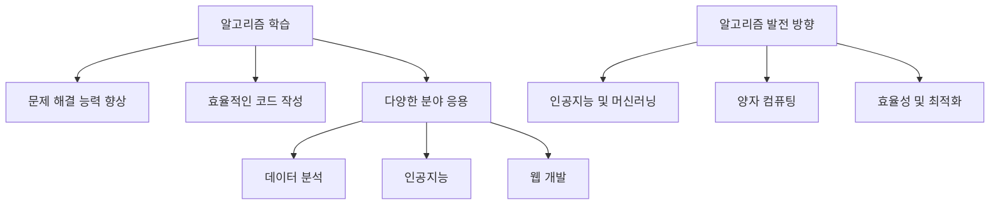

이와 같이 알고리즘은 단순한 기술적 요소를 넘어, 현대 사회의 다양한 문제를 해결하는 데 필수적인 역할을 하고 있다. 앞으로의 알고리즘 발전은 더욱 흥미롭고 도전적인 방향으로 나아갈 것이며, 이에 대한 지속적인 학습과 연구가 필요하다.

<!--
## 참고 자료
   - 추천 도서 및 온라인 강의
   - 알고리즘 관련 웹사이트 및 커뮤니티
-->

## 참고 자료

**추천 도서 및 온라인 강의**  
알고리즘을 깊이 있게 학습하기 위해서는 신뢰할 수 있는 자료를 참고하는 것이 중요하다. 다음은 추천하는 도서와 온라인 강의 목록이다.

1. **도서**
   - **"Introduction to Algorithms"** by Thomas H. Cormen, Charles E. Leiserson, Ronald L. Rivest, and Clifford Stein  
     이 책은 알고리즘의 기초부터 고급 주제까지 폭넓게 다루고 있으며, 다양한 알고리즘의 설명과 함께 수학적 분석을 제공한다.
   - **"Algorithms"** by Robert Sedgewick and Kevin Wayne  
     이 책은 알고리즘의 개념을 시각적으로 이해할 수 있도록 도와주며, Java를 사용한 구현 예제를 포함하고 있다.

2. **온라인 강의**
   - **Coursera - "Algorithms Specialization"**  
     스탠포드 대학교에서 제공하는 이 강의는 알고리즘의 기초부터 고급 개념까지 체계적으로 배울 수 있는 과정이다.
   - **edX - "Algorithm Design and Analysis"**  
     이 강의는 알고리즘 설계 및 분석에 대한 깊이 있는 이해를 제공하며, 실제 문제 해결을 위한 접근 방식을 배울 수 있다.

** 알고리즘 관련 웹사이트 및 커뮤니티 **  
알고리즘에 대한 최신 정보와 다양한 문제를 해결하기 위해 다음의 웹사이트와 커뮤니티를 활용할 수 있다.

1. **LeetCode**  
   다양한 알고리즘 문제를 풀어볼 수 있는 플랫폼으로, 문제 해결 능력을 키우기에 적합하다. 각 문제에 대한 해설과 다른 사용자들의 풀이를 참고할 수 있다.

2. **GeeksforGeeks**  
   알고리즘 및 데이터 구조에 대한 다양한 자료와 튜토리얼을 제공하는 웹사이트로, 초보자부터 전문가까지 유용한 정보를 찾을 수 있다.

3. **Stack Overflow**  
   프로그래밍 관련 질문과 답변을 공유하는 커뮤니티로, 알고리즘 관련 문제에 대한 다양한 해결책을 찾을 수 있다.

4. **GitHub**  
   다양한 알고리즘 구현 예제를 찾아볼 수 있는 플랫폼으로, 다른 개발자들이 작성한 코드를 참고하거나 자신의 프로젝트에 활용할 수 있다.

다음은 간단한 정렬 알고리즘인 버블 정렬(Bubble Sort)의 구현 예제이다.

```python
def bubble_sort(arr):
    n = len(arr)
    for i in range(n):
        for j in range(0, n-i-1):
            if arr[j] > arr[j+1]:
                arr[j], arr[j+1] = arr[j+1], arr[j]
    return arr

# 사용 예
arr = [64, 34, 25, 12, 22, 11, 90]
sorted_arr = bubble_sort(arr)
print("정렬된 배열:", sorted_arr)
```

다음은 버블 정렬의 동작 과정을 나타낸 다이어그램이다.

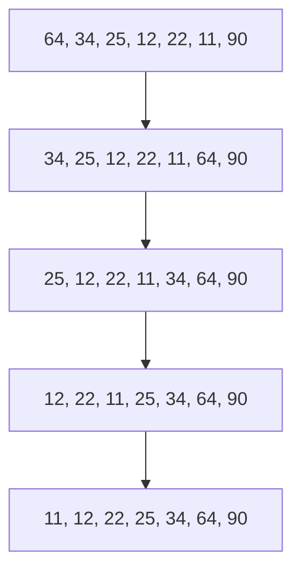

이와 같은 자료를 통해 알고리즘에 대한 이해를 높이고, 실제 문제 해결 능력을 향상시킬 수 있다.

<!--
##### Reference #####
-->

## Reference


* [https://42jerrykim.github.io/collections/computerterms/algotithm_classify/](https://42jerrykim.github.io/collections/computerterms/algotithm_classify/)
* [http://www.ktword.co.kr/test/view/view.php?no=5735](http://www.ktword.co.kr/test/view/view.php?no=5735)
* [https://namu.wiki/w/%EB%B6%84%EB%A5%98:%EC%95%8C%EA%B3%A0%EB%A6%AC%EC%A6%98](https://namu.wiki/w/%EB%B6%84%EB%A5%98:%EC%95%8C%EA%B3%A0%EB%A6%AC%EC%A6%98)
* [https://namu.wiki/w/%EC%BD%94%EB%94%A9%20%ED%85%8C%EC%8A%A4%ED%8A%B8](https://namu.wiki/w/%EC%BD%94%EB%94%A9%20%ED%85%8C%EC%8A%A4%ED%8A%B8)
* [https://school.programmers.co.kr/learn/challenges?tab=algorithm_practice_kit](https://school.programmers.co.kr/learn/challenges?tab=algorithm_practice_kit)

