C4 모델은 소프트웨어 아키텍처를 시각적으로 표현하기 위한 강력한 도구이다. 이 모델은 시스템을 다양한 추상화 수준으로 나누어 설명함으로써, 개발자와 이해관계자 간의 원활한 소통을 가능하게 한다. C4 모델은 크게 네 가지 다이어그램으로 구성되어 있다. 첫 번째는 컨텍스트 다이어그램으로, 시스템의 외부와의 관계를 보여준다. 두 번째는 컨테이너 다이어그램으로, 시스템을 구성하는 주요 애플리케이션과 데이터 저장소를 나타낸다. 세 번째는 컴포넌트 다이어그램으로, 각 컨테이너 내의 구성 요소를 세부적으로 설명한다. 마지막으로 코드 다이어그램은 각 구성 요소의 구현 세부 사항을 보여준다. 이러한 구조는 팀이 시스템을 이해하고, 변경 사항을 효과적으로 관리할 수 있도록 돕는다. C4 모델은 특히 애자일 환경에서 유용하며, 문서화의 부담을 줄이고, 팀원 간의 협업을 촉진하는 데 기여한다. 이 글에서는 C4 모델의 기본 개념과 실무에서의 활용 방법에 대해 자세히 살펴보겠다.

||
|:---:|
||

<!--
##### Outline #####
-->

<!--
# C4 모델을 통한 소프트웨어 아키텍처 모델링

## 개요
   - C4 모델의 정의 및 중요성
   - 소프트웨어 아키텍처의 필요성
   - C4 모델의 역사와 발전

## C4 모델의 구성 요소
   - 2.1. C4 모델의 기본 개념
       - 소프트웨어 시스템, 컨테이너, 컴포넌트, 코드
   - 2.2. C4 모델의 다이어그램 레벨
       - 레벨 1: 시스템 컨텍스트 다이어그램
       - 레벨 2: 컨테이너 다이어그램
       - 레벨 3: 컴포넌트 다이어그램
       - 레벨 4: 코드 다이어그램

## C4 모델 다이어그램의 작성 방법
   - 3.1. 시스템 컨텍스트 다이어그램 작성
       - 외부 시스템 및 사용자와의 관계 정의
   - 3.2. 컨테이너 다이어그램 작성
       - 시스템의 주요 구성 요소 및 기술 선택
   - 3.3. 컴포넌트 다이어그램 작성
       - 각 컨테이너 내의 주요 컴포넌트 정의
   - 3.4. 코드 다이어그램 작성
       - 코드 구조 및 의존성 표현

## C4 모델의 활용 사례
   - 4.1. 실제 프로젝트에서의 C4 모델 적용
   - 4.2. C4 모델을 통한 팀 간 커뮤니케이션 개선 사례
   - 4.3. C4 모델을 활용한 애자일 개발 환경에서의 아키텍처 문서화

## C4 모델의 모범 사례
   - 5.1. 일관된 다이어그램 작성
   - 5.2. 적절한 세부사항과 추상화 수준 유지
   - 5.3. 협업적 접근 방식
   - 5.4. 반복적인 개선 과정
   - 5.5. 문서화 및 주석 작성의 중요성
   - 5.6. 교육 및 지식 공유

## FAQ
   - C4 모델은 다른 모델과 어떻게 다른가요?
   - C4 모델을 사용하기 위한 도구는 무엇이 있나요?
   - C4 모델의 다이어그램은 어떻게 유지 관리하나요?

## 관련 기술
   - UML(통합 모델링 언어)
   - ERD(엔티티-관계 다이어그램)
   - 마이크로서비스 아키텍처
   - 애자일 개발 방법론

## 결론
   - C4 모델의 장점 요약
   - 소프트웨어 아키텍처 문서화의 중요성
   - C4 모델을 통한 팀의 협업 및 커뮤니케이션 향상

## 참고 자료
   - C4 모델 공식 웹사이트
   - 관련 서적 및 자료
   - C4 모델 워크숍 및 교육 자료

이 목차는 C4 모델에 대한 포괄적인 이해를 제공하며, 독자가 소프트웨어 아키텍처 모델링을 효과적으로 수행할 수 있도록 돕기 위해 구성되었습니다.
-->

<!--
## 개요
   - C4 모델의 정의 및 중요성
   - 소프트웨어 아키텍처의 필요성
   - C4 모델의 역사와 발전
-->

## 개요

**C4 모델의 정의 및 중요성**  

C4 모델은 소프트웨어 아키텍처를 시각적으로 표현하기 위한 모델로, 시스템의 구조를 명확하게 이해하고 소통할 수 있도록 돕는 도구이다. C4는 "Context, Containers, Components, Code"의 약자로, 각 레벨에서 시스템을 다양한 관점에서 설명한다. 이 모델은 복잡한 시스템을 단순화하여 이해하기 쉽게 만들어 주며, 팀 간의 커뮤니케이션을 원활하게 하는 데 중요한 역할을 한다. 특히, 소프트웨어 개발 과정에서 아키텍처를 명확히 문서화함으로써, 개발자와 이해관계자 간의 공통된 이해를 도모할 수 있다.

**소프트웨어 아키텍처의 필요성**  

소프트웨어 아키텍처는 시스템의 구조와 상호작용을 정의하는 중요한 요소이다. 잘 설계된 아키텍처는 시스템의 유지보수성과 확장성을 높이며, 개발 과정에서 발생할 수 있는 문제를 사전에 예방할 수 있다. 또한, 아키텍처는 팀원 간의 협업을 촉진하고, 프로젝트의 전반적인 품질을 향상시키는 데 기여한다. 따라서, 소프트웨어 아키텍처는 단순한 기술적 요소를 넘어, 비즈니스 목표를 달성하는 데 필수적인 요소로 자리 잡고 있다.

**C4 모델의 역사와 발전** 

C4 모델은 2011년 Simon Brown에 의해 처음 소개되었으며, 이후 소프트웨어 아키텍처 문서화의 표준으로 자리 잡았다. 초기에는 UML(통합 모델링 언어)와 같은 전통적인 모델링 기법이 주로 사용되었으나, C4 모델은 이러한 기법의 복잡성을 줄이고, 더 직관적인 시각화를 제공함으로써 많은 개발자와 팀에 채택되었다. C4 모델은 지속적으로 발전하고 있으며, 다양한 도구와 프레임워크와의 통합을 통해 더욱 효과적인 아키텍처 문서화를 지원하고 있다.

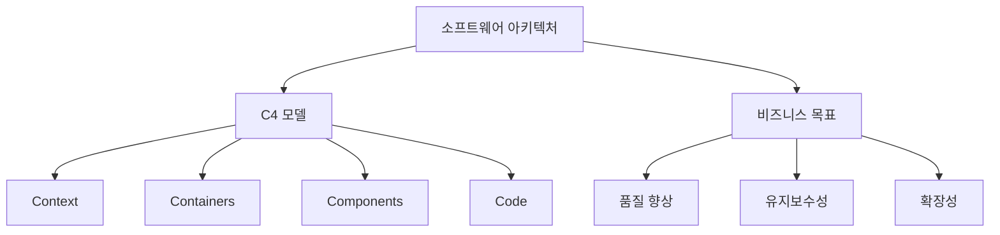

위의 다이어그램은 소프트웨어 아키텍처와 C4 모델 간의 관계를 시각적으로 나타낸 것이다. C4 모델은 소프트웨어 아키텍처의 중요한 구성 요소로, 비즈니스 목표를 달성하는 데 기여하는 다양한 요소들을 포함하고 있다.

<!--
## C4 모델의 구성 요소
   - 2.1. C4 모델의 기본 개념
       - 소프트웨어 시스템, 컨테이너, 컴포넌트, 코드
   - 2.2. C4 모델의 다이어그램 레벨
       - 레벨 1: 시스템 컨텍스트 다이어그램
       - 레벨 2: 컨테이너 다이어그램
       - 레벨 3: 컴포넌트 다이어그램
       - 레벨 4: 코드 다이어그램
-->

## C4 모델의 구성 요소

C4 모델은 소프트웨어 아키텍처를 시각적으로 표현하기 위한 강력한 도구이다. 이 모델은 소프트웨어 시스템을 다양한 레벨로 나누어 이해하기 쉽게 구성되어 있으며, 각 구성 요소는 서로 다른 관점에서 시스템을 설명한다. 이번 섹션에서는 C4 모델의 기본 개념과 다이어그램 레벨에 대해 살펴보겠다.

**2.1. C4 모델의 기본 개념**

C4 모델은 소프트웨어 시스템을 다음 네 가지 주요 구성 요소로 나눈다.

1. **소프트웨어 시스템**: 전체 시스템을 나타내며, 사용자와 외부 시스템과의 상호작용을 포함한다.
2. **컨테이너**: 소프트웨어 시스템 내에서 실행되는 애플리케이션이나 데이터 저장소를 의미한다. 각 컨테이너는 특정 기능을 수행하며, 서로 다른 기술 스택을 사용할 수 있다.
3. **컴포넌트**: 각 컨테이너 내에서 작동하는 개별적인 모듈이나 클래스이다. 컴포넌트는 특정 기능을 수행하며, 다른 컴포넌트와의 관계를 통해 시스템의 동작을 정의한다.
4. **코드**: 컴포넌트의 내부 구조를 나타내며, 실제 구현된 코드와 그 의존성을 포함한다.

이러한 구성 요소는 소프트웨어 시스템을 다양한 관점에서 이해하고, 설계 및 개발 과정에서의 의사소통을 원활하게 하는 데 도움을 준다.

**2.2. C4 모델의 다이어그램 레벨**

C4 모델은 네 가지 다이어그램 레벨로 구성되어 있으며, 각 레벨은 시스템의 다른 측면을 강조한다.

- **레벨 1: 시스템 컨텍스트 다이어그램**
  - 시스템과 외부 사용자 및 시스템 간의 관계를 시각적으로 표현한다. 이 다이어그램은 시스템의 경계를 정의하고, 외부와의 상호작용을 명확히 한다.

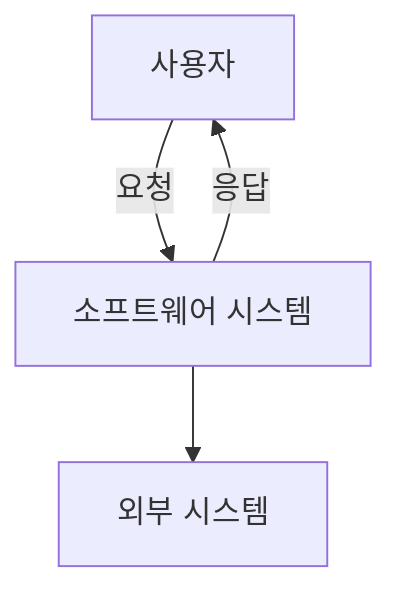

- **레벨 2: 컨테이너 다이어그램**
  - 시스템 내의 주요 컨테이너를 식별하고, 각 컨테이너 간의 관계를 나타낸다. 이 다이어그램은 각 컨테이너의 기술 스택과 역할을 명확히 한다.

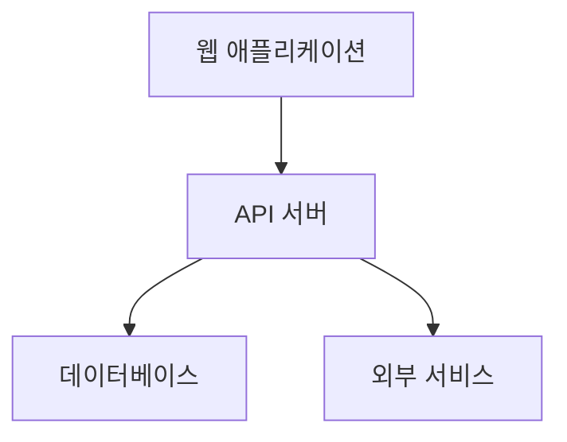

- **레벨 3: 컴포넌트 다이어그램**
  - 각 컨테이너 내의 주요 컴포넌트를 정의하고, 이들 간의 관계를 나타낸다. 이 다이어그램은 컴포넌트의 역할과 상호작용을 명확히 한다.

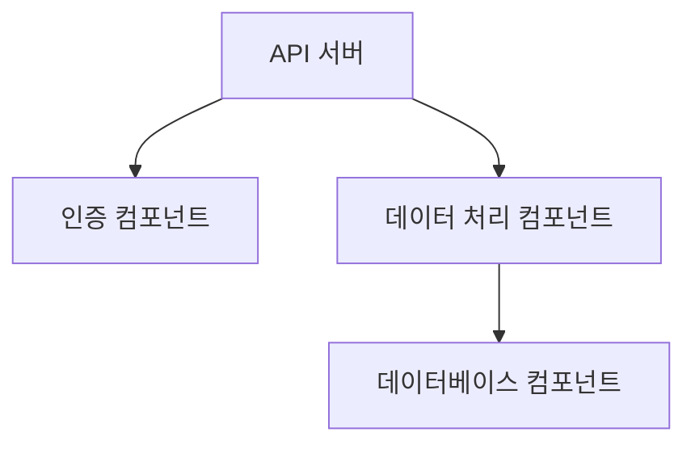

- **레벨 4: 코드 다이어그램**
  - 컴포넌트의 내부 구조와 의존성을 표현한다. 이 다이어그램은 실제 코드의 구조를 이해하는 데 도움을 준다.

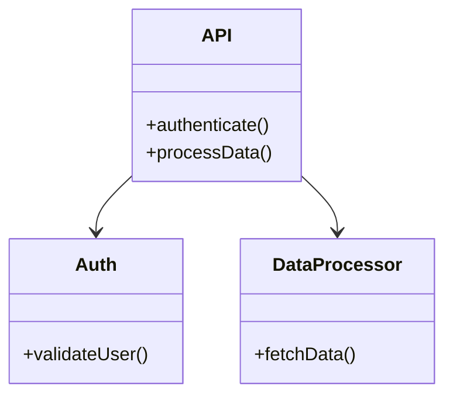

C4 모델의 각 다이어그램 레벨은 소프트웨어 아키텍처를 명확하게 이해하고, 팀 간의 커뮤니케이션을 개선하는 데 중요한 역할을 한다. 이러한 다이어그램을 통해 개발자와 이해관계자는 시스템의 구조와 동작을 쉽게 파악할 수 있다.

<!--
## C4 모델 다이어그램의 작성 방법
   - 3.1. 시스템 컨텍스트 다이어그램 작성
       - 외부 시스템 및 사용자와의 관계 정의
   - 3.2. 컨테이너 다이어그램 작성
       - 시스템의 주요 구성 요소 및 기술 선택
   - 3.3. 컴포넌트 다이어그램 작성
       - 각 컨테이너 내의 주요 컴포넌트 정의
   - 3.4. 코드 다이어그램 작성
       - 코드 구조 및 의존성 표현
-->

## C4 모델 다이어그램의 작성 방법

C4 모델은 소프트웨어 아키텍처를 시각적으로 표현하는 데 유용한 도구이다. 이 섹션에서는 C4 모델의 각 다이어그램을 작성하는 방법에 대해 설명하겠다.

**3.1. 시스템 컨텍스트 다이어그램 작성**  

시스템 컨텍스트 다이어그램은 소프트웨어 시스템과 외부 시스템 및 사용자 간의 관계를 정의하는 데 사용된다. 이 다이어그램은 시스템의 경계를 명확히 하고, 외부와의 상호작용을 시각적으로 표현한다. 

다이어그램 예시는 다음과 같다:

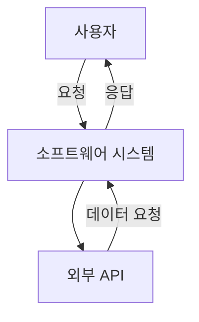

이 다이어그램에서 사용자는 소프트웨어 시스템에 요청을 보내고, 시스템은 외부 API와 상호작용하여 데이터를 처리한다.

**3.2. 컨테이너 다이어그램 작성**  

컨테이너 다이어그램은 시스템의 주요 구성 요소와 기술 선택을 나타낸다. 이 다이어그램은 각 컨테이너가 어떤 역할을 하는지, 그리고 서로 어떻게 상호작용하는지를 보여준다.

다이어그램 예시는 다음과 같다:

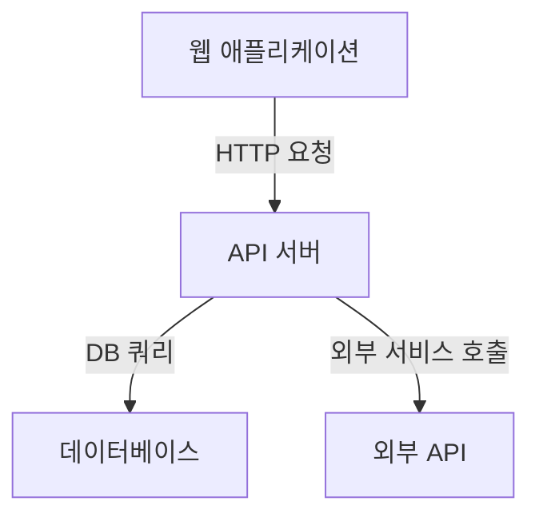

이 다이어그램에서는 웹 애플리케이션이 API 서버에 요청을 보내고, API 서버는 데이터베이스와 외부 API와 상호작용하는 구조를 보여준다.

**3.3. 컴포넌트 다이어그램 작성** 

컴포넌트 다이어그램은 각 컨테이너 내의 주요 컴포넌트를 정의하고, 이들 간의 관계를 나타낸다. 이 다이어그램은 시스템의 내부 구조를 이해하는 데 도움을 준다.

다이어그램 예시는 다음과 같다:

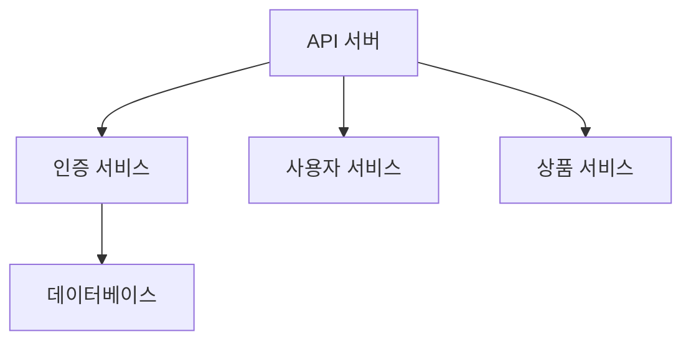

이 다이어그램에서는 API 서버가 여러 서비스와 상호작용하며, 인증 서비스가 데이터베이스와 연결되어 있는 구조를 보여준다.

**3.4. 코드 다이어그램 작성**  

코드 다이어그램은 코드 구조 및 의존성을 표현하는 데 사용된다. 이 다이어그램은 클래스, 인터페이스 및 이들 간의 관계를 시각적으로 나타낸다.

다이어그램 예시는 다음과 같다:

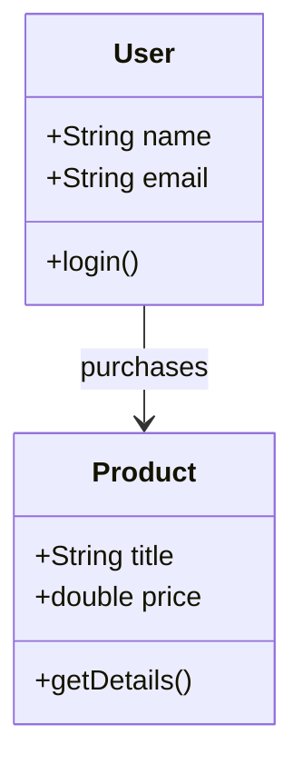

이 다이어그램에서는 사용자 클래스와 상품 클래스 간의 관계를 보여주며, 사용자가 상품을 구매하는 구조를 나타낸다.

이와 같이 C4 모델의 각 다이어그램은 소프트웨어 아키텍처를 명확하게 이해하고 문서화하는 데 중요한 역할을 한다. 각 다이어그램을 작성할 때는 명확한 관계와 역할을 정의하는 것이 중요하다.

<!--
## C4 모델의 활용 사례
   - 4.1. 실제 프로젝트에서의 C4 모델 적용
   - 4.2. C4 모델을 통한 팀 간 커뮤니케이션 개선 사례
   - 4.3. C4 모델을 활용한 애자일 개발 환경에서의 아키텍처 문서화
-->

## C4 모델의 활용 사례

**4.1. 실제 프로젝트에서의 C4 모델 적용** 

C4 모델은 실제 프로젝트에서 소프트웨어 아키텍처를 명확하게 시각화하는 데 유용하다. 예를 들어, 한 전자상거래 플랫폼 개발 프로젝트에서 C4 모델을 적용한 사례를 살펴보자. 이 프로젝트에서는 시스템 컨텍스트 다이어그램을 통해 외부 사용자와의 상호작용을 정의하고, 컨테이너 다이어그램을 통해 웹 애플리케이션, 데이터베이스, API 서버 등 주요 구성 요소를 시각화하였다. 

다음은 시스템 컨텍스트 다이어그램의 예시이다.

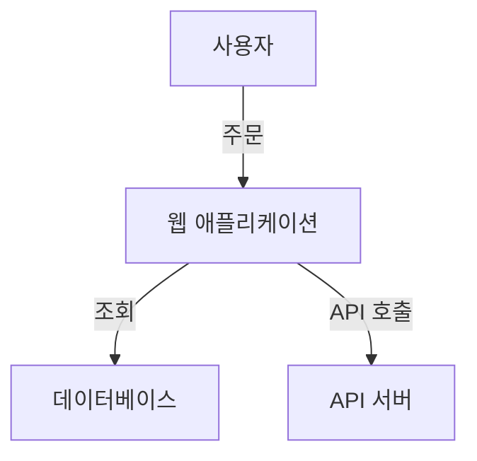

이러한 다이어그램을 통해 팀원들은 시스템의 전반적인 구조를 이해하고, 각 구성 요소 간의 관계를 명확히 할 수 있었다.

**4.2. C4 모델을 통한 팀 간 커뮤니케이션 개선 사례**  

C4 모델은 팀 간의 커뮤니케이션을 개선하는 데 큰 역할을 한다. 한 금융 서비스 회사에서는 C4 모델을 도입하여 개발팀과 운영팀 간의 협업을 강화하였다. 컨테이너 다이어그램을 활용하여 각 팀의 역할과 책임을 명확히 하고, 이를 바탕으로 정기적인 회의를 통해 아키텍처 변경 사항을 공유하였다. 

이 과정에서 팀원들은 각자의 이해도를 높이고, 문제 발생 시 신속하게 대응할 수 있는 기반을 마련하였다. 다음은 컨테이너 다이어그램의 예시이다.

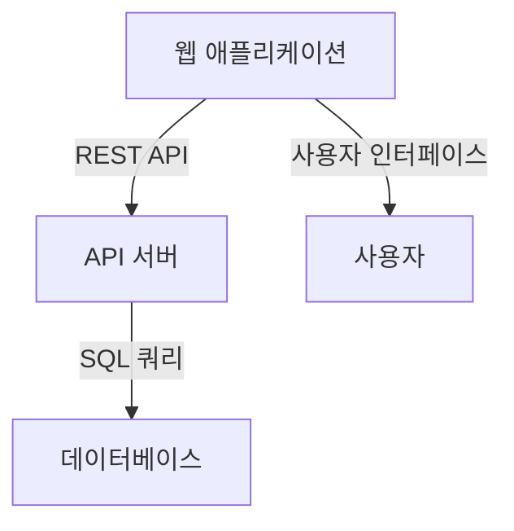

**4.3. C4 모델을 활용한 애자일 개발 환경에서의 아키텍처 문서화**  

애자일 개발 환경에서는 빠른 변화에 대응하기 위해 아키텍처 문서화가 필수적이다. C4 모델은 이러한 문서화를 효과적으로 지원한다. 예를 들어, 한 스타트업에서는 스프린트 회의에서 C4 모델을 활용하여 매 스프린트마다 아키텍처를 업데이트하고, 이를 팀원들과 공유하였다. 

코드 다이어그램을 통해 각 컴포넌트의 구조와 의존성을 시각화함으로써, 개발자들은 코드 변경 시 발생할 수 있는 영향을 쉽게 파악할 수 있었다. 다음은 코드 다이어그램의 예시이다.

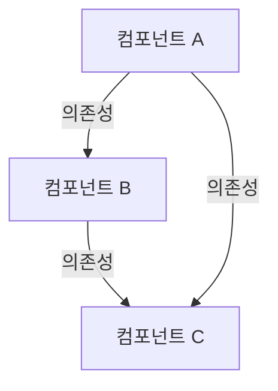

이러한 방식으로 C4 모델을 활용하면 애자일 개발 환경에서도 아키텍처 문서화를 효과적으로 수행할 수 있다. C4 모델은 팀의 협업을 촉진하고, 소프트웨어 아키텍처의 명확성을 높이는 데 기여한다.

<!--
## C4 모델의 모범 사례
   - 5.1. 일관된 다이어그램 작성
   - 5.2. 적절한 세부사항과 추상화 수준 유지
   - 5.3. 협업적 접근 방식
   - 5.4. 반복적인 개선 과정
   - 5.5. 문서화 및 주석 작성의 중요성
   - 5.6. 교육 및 지식 공유
-->

## C4 모델의 모범 사례

C4 모델을 효과적으로 활용하기 위해서는 몇 가지 모범 사례를 따르는 것이 중요하다. 이러한 모범 사례는 다이어그램의 일관성을 유지하고, 팀 간의 협업을 촉진하며, 지속적인 개선을 가능하게 한다.

**5.1. 일관된 다이어그램 작성**  

일관된 다이어그램 작성은 C4 모델의 핵심이다. 모든 팀원이 동일한 형식과 스타일을 따를 때, 다이어그램의 가독성이 높아지고 이해하기 쉬워진다. 이를 위해 팀 내에서 다이어그램 작성 가이드라인을 설정하고, 이를 준수하는 것이 필요하다.

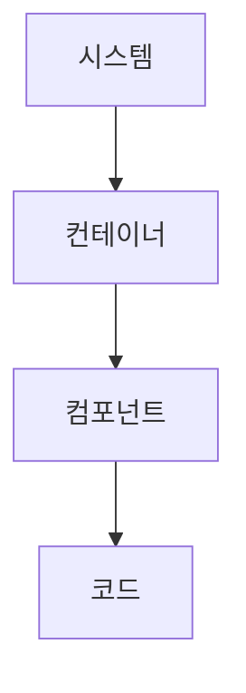

**5.2. 적절한 세부사항과 추상화 수준 유지**  

다이어그램은 너무 많은 세부사항을 포함하지 않도록 주의해야 한다. 각 레벨의 다이어그램은 특정한 목적을 가지고 있으며, 그에 맞는 적절한 세부사항을 포함해야 한다. 예를 들어, 시스템 컨텍스트 다이어그램은 시스템의 전반적인 관계를 보여주고, 컴포넌트 다이어그램은 각 구성 요소의 세부사항을 나타내야 한다.

**5.3. 협업적 접근 방식**  

C4 모델을 활용할 때는 팀원 간의 협업이 필수적이다. 다이어그램 작성 과정에서 팀원들이 의견을 나누고, 피드백을 주고받는 것이 중요하다. 이를 통해 다양한 관점을 반영할 수 있으며, 최종 결과물의 품질이 향상된다.

**5.4. 반복적인 개선 과정**  

C4 모델은 한 번 작성하고 끝나는 것이 아니다. 프로젝트가 진행됨에 따라 다이어그램을 지속적으로 업데이트하고 개선해야 한다. 정기적인 리뷰 세션을 통해 다이어그램을 점검하고, 필요한 변경 사항을 반영하는 것이 좋다.

**5.5. 문서화 및 주석 작성의 중요성**  

다이어그램에 대한 문서화와 주석 작성은 이해를 돕는 중요한 요소이다. 각 다이어그램에 대한 설명을 추가하고, 주요 결정 사항이나 가정에 대한 주석을 작성함으로써, 후속 작업을 하는 팀원들이 쉽게 이해할 수 있도록 해야 한다.

**5.6. 교육 및 지식 공유** 

C4 모델을 효과적으로 활용하기 위해서는 팀원들 간의 교육과 지식 공유가 필요하다. 정기적인 워크숍이나 세미나를 통해 C4 모델의 원리와 활용 방법을 공유하고, 팀원들이 서로의 경험을 나누는 것이 중요하다. 이를 통해 팀 전체의 역량이 향상될 수 있다.

이러한 모범 사례를 통해 C4 모델을 효과적으로 활용하고, 소프트웨어 아키텍처 문서화의 품질을 높일 수 있다.

<!--
## FAQ
   - C4 모델은 다른 모델과 어떻게 다른가요?
   - C4 모델을 사용하기 위한 도구는 무엇이 있나요?
   - C4 모델의 다이어그램은 어떻게 유지 관리하나요?
-->

## FAQ

**C4 모델은 다른 모델과 어떻게 다른가요?**  

C4 모델은 소프트웨어 아키텍처를 시각적으로 표현하기 위해 설계된 모델로, 시스템을 다양한 레벨에서 명확하게 설명할 수 있는 구조를 제공한다. 다른 모델들과의 주요 차별점은 다음과 같다. 

1. **계층적 접근**: C4 모델은 시스템을 네 가지 레벨로 나누어 다이어그램을 작성할 수 있도록 하여, 각 레벨에서 필요한 세부 정보를 제공한다. 이는 복잡한 시스템을 이해하는 데 도움을 준다.
2. **명확한 용어 정의**: C4 모델은 소프트웨어 시스템, 컨테이너, 컴포넌트, 코드와 같은 명확한 용어를 사용하여 아키텍처를 설명한다. 이는 팀원 간의 커뮤니케이션을 원활하게 한다.
3. **유연성**: C4 모델은 다양한 기술 스택과 아키텍처 스타일에 적용할 수 있어, 특정 기술에 국한되지 않고 널리 사용될 수 있다.

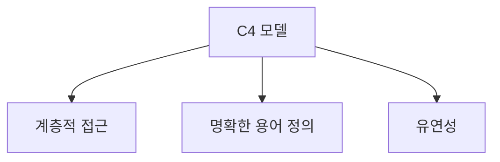

**C4 모델을 사용하기 위한 도구는 무엇이 있나요?**  

C4 모델을 작성하기 위해 사용할 수 있는 다양한 도구가 존재한다. 이들 도구는 다이어그램을 쉽게 작성하고 관리할 수 있도록 돕는다. 주요 도구는 다음과 같다.

1. **Structurizr**: C4 모델을 지원하는 웹 기반 도구로, 다이어그램을 쉽게 작성하고 공유할 수 있다.
2. **PlantUML**: 텍스트 기반의 다이어그램 생성 도구로, C4 모델의 다이어그램을 코드로 작성할 수 있다.
3. **Lucidchart**: 다양한 다이어그램을 작성할 수 있는 클라우드 기반 도구로, C4 모델 다이어그램을 쉽게 만들 수 있다.

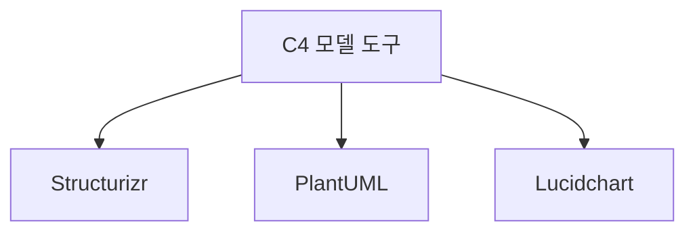

**C4 모델의 다이어그램은 어떻게 유지 관리하나요?**  

C4 모델의 다이어그램을 효과적으로 유지 관리하기 위해서는 다음과 같은 방법을 고려해야 한다.

1. **정기적인 리뷰**: 다이어그램을 정기적으로 검토하여 시스템의 변경 사항을 반영하도록 한다. 이를 통해 다이어그램의 최신성을 유지할 수 있다.
2. **버전 관리**: 다이어그램 파일을 버전 관리 시스템에 저장하여 변경 이력을 추적하고, 필요 시 이전 버전으로 롤백할 수 있도록 한다.
3. **팀원 간의 협업**: 팀원들이 다이어그램을 함께 수정하고 업데이트할 수 있도록 협업 도구를 활용한다. 이를 통해 모든 팀원이 다이어그램에 대한 이해를 공유할 수 있다.

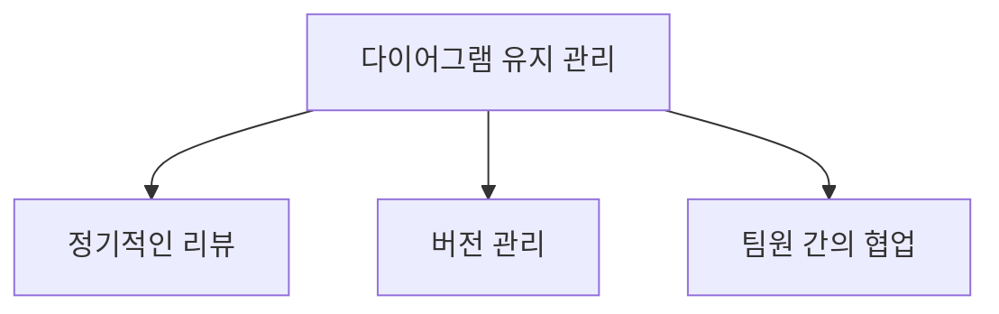

이와 같은 방법을 통해 C4 모델의 다이어그램을 효과적으로 유지 관리할 수 있으며, 이는 소프트웨어 아키텍처의 명확성과 일관성을 높이는 데 기여한다.

<!--
## 관련 기술
   - UML(통합 모델링 언어)
   - ERD(엔티티-관계 다이어그램)
   - 마이크로서비스 아키텍처
   - 애자일 개발 방법론
-->

## 관련 기술

C4 모델은 소프트웨어 아키텍처를 시각적으로 표현하는 데 유용한 도구이다. 이와 함께 사용되는 여러 관련 기술들이 있으며, 이들 각각은 소프트웨어 개발 및 아키텍처 설계에 중요한 역할을 한다. 아래에서는 주요 관련 기술에 대해 설명하겠다.

**UML(통합 모델링 언어)**

UML은 소프트웨어 시스템을 시각적으로 모델링하기 위한 표준 언어이다. 다양한 다이어그램을 통해 시스템의 구조와 동작을 표현할 수 있으며, C4 모델과 함께 사용될 수 있다. UML은 클래스 다이어그램, 시퀀스 다이어그램, 유스케이스 다이어그램 등 여러 유형의 다이어그램을 제공하여 개발자와 이해관계자 간의 소통을 원활하게 한다.

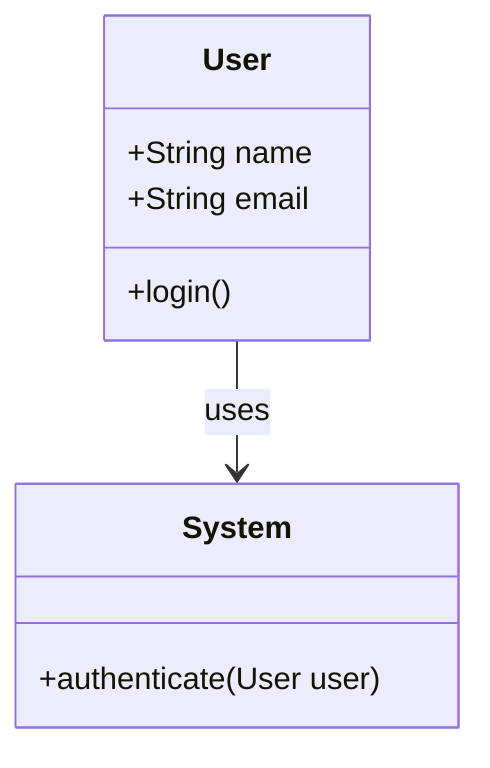

**ERD(엔티티-관계 다이어그램)**  

ERD는 데이터베이스의 구조를 시각적으로 표현하는 데 사용된다. 엔티티, 속성, 관계를 통해 데이터베이스 설계를 명확히 할 수 있으며, C4 모델의 컴포넌트 다이어그램과 함께 사용하여 데이터와 시스템 간의 관계를 명확히 할 수 있다.

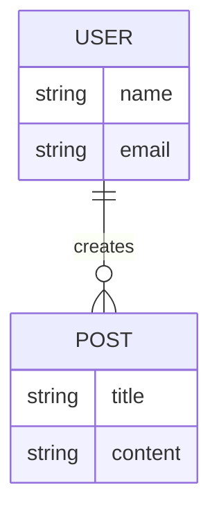

**마이크로서비스 아키텍처**  

마이크로서비스 아키텍처는 애플리케이션을 여러 개의 독립적인 서비스로 나누어 개발하는 접근 방식이다. 각 서비스는 독립적으로 배포 및 확장 가능하며, C4 모델을 통해 각 서비스의 컨테이너와 컴포넌트를 명확히 정의할 수 있다. 이로 인해 시스템의 복잡성을 줄이고, 팀 간의 협업을 촉진할 수 있다.

**애자일 개발 방법론**  

애자일 개발 방법론은 소프트웨어 개발 프로세스를 유연하고 반복적으로 진행하는 접근 방식이다. C4 모델은 애자일 환경에서 아키텍처 문서화를 지원하며, 팀이 지속적으로 아키텍처를 개선하고 조정할 수 있도록 돕는다. 애자일 방법론을 통해 팀은 고객의 피드백을 신속하게 반영할 수 있으며, C4 모델을 활용하여 아키텍처 변경 사항을 명확히 문서화할 수 있다.

이와 같은 관련 기술들은 C4 모델과 함께 사용될 때, 소프트웨어 아키텍처의 이해도를 높이고, 팀 간의 커뮤니케이션을 개선하는 데 기여한다. 각 기술의 특성을 이해하고 적절히 활용하는 것이 중요하다.

<!--
## 결론
   - C4 모델의 장점 요약
   - 소프트웨어 아키텍처 문서화의 중요성
   - C4 모델을 통한 팀의 협업 및 커뮤니케이션 향상
-->

## 결론

**C4 모델의 장점 요약**  

C4 모델은 소프트웨어 아키텍처를 명확하게 시각화할 수 있는 강력한 도구이다. 이 모델은 시스템의 다양한 레벨을 통해 아키텍처를 계층적으로 표현함으로써, 복잡한 시스템을 이해하기 쉽게 만든다. 또한, C4 모델은 팀원 간의 공통된 이해를 돕고, 아키텍처에 대한 논의를 촉진하는 데 기여한다. 이러한 장점 덕분에 C4 모델은 다양한 프로젝트에서 널리 사용되고 있다.

**소프트웨어 아키텍처 문서화의 중요성**  

소프트웨어 아키텍처 문서화는 프로젝트의 성공에 필수적이다. 문서화된 아키텍처는 팀원들이 시스템의 구조와 동작 방식을 이해하는 데 도움을 주며, 새로운 팀원이 프로젝트에 합류할 때 빠르게 적응할 수 있도록 한다. 또한, 문서화는 시스템의 유지보수와 확장성을 높이는 데 기여하며, 장기적으로는 비용 절감 효과를 가져온다.

**C4 모델을 통한 팀의 협업 및 커뮤니케이션 향상** 

C4 모델은 팀 간의 협업과 커뮤니케이션을 개선하는 데 중요한 역할을 한다. 다양한 이해관계자들이 아키텍처를 쉽게 이해할 수 있도록 시각적으로 표현함으로써, 기술적 논의가 보다 원활하게 이루어질 수 있다. 또한, C4 모델은 팀원들이 아키텍처에 대한 피드백을 주고받는 데 유용한 기반을 제공하여, 협업의 질을 높인다.

다음은 C4 모델의 다이어그램을 나타내는 예시이다. 이 다이어그램은 시스템 컨텍스트를 시각화한 것으로, 외부 시스템과 사용자 간의 관계를 보여준다.

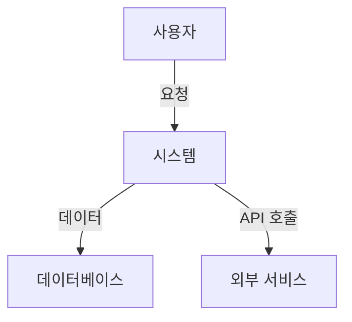

이와 같은 다이어그램을 통해 팀원들은 시스템의 전반적인 구조를 쉽게 이해할 수 있으며, 이는 효과적인 커뮤니케이션을 촉진한다. C4 모델을 활용하여 소프트웨어 아키텍처를 문서화하고, 팀의 협업을 강화하는 것은 현대 소프트웨어 개발에서 매우 중요한 요소이다.

<!--
## 참고 자료
   - C4 모델 공식 웹사이트
   - 관련 서적 및 자료
   - C4 모델 워크숍 및 교육 자료
-->

## 참고 자료

**C4 모델 공식 웹사이트**  

C4 모델에 대한 가장 신뢰할 수 있는 정보는 공식 웹사이트에서 찾을 수 있다. 이 사이트에서는 C4 모델의 기본 개념, 다이어그램 작성 방법, 그리고 다양한 리소스에 대한 링크를 제공한다. 공식 웹사이트는 다음과 같다: [C4 Model Official Website](https://c4model.com)

**관련 서적 및 자료**  

C4 모델에 대한 깊이 있는 이해를 원한다면, 다음의 서적을 추천한다.

1. **"Software Architecture for Developers"** - C4 모델의 창시자인 Simon Brown이 저술한 이 책은 소프트웨어 아키텍처의 기본 개념과 C4 모델의 적용 방법을 상세히 설명한다.
2. **"The Art of Scalability"** - 이 책은 대규모 시스템의 아키텍처 설계에 대한 통찰을 제공하며, C4 모델을 활용한 사례도 포함되어 있다.

이 외에도 다양한 블로그 포스트와 온라인 강의가 C4 모델에 대한 유용한 정보를 제공하므로 참고하면 좋다.

**C4 모델 워크숍 및 교육 자료** 

C4 모델을 실제로 적용해보고 싶다면, 다양한 워크숍과 교육 프로그램에 참여하는 것이 좋다. 이러한 프로그램은 C4 모델의 이론뿐만 아니라 실습을 통해 모델링 기술을 익힐 수 있는 기회를 제공한다. 

예를 들어, Simon Brown이 주최하는 워크숍에서는 C4 모델을 활용한 실습을 통해 팀원 간의 협업을 증진시키는 방법을 배울 수 있다. 또한, 온라인 플랫폼에서도 C4 모델에 대한 교육 자료와 강의를 찾아볼 수 있다.

<!--
##### Reference #####
-->

## Reference

* [https://en.wikipedia.org/wiki/C4_model](https://en.wikipedia.org/wiki/C4_model)
* [https://c4model.com/](https://c4model.com/)
* [https://haandol.github.io/2022/12/17/demystifying-c4model.html](https://haandol.github.io/2022/12/17/demystifying-c4model.html)
* [https://miro.com/diagramming/c4-model-for-software-architecture/](https://miro.com/diagramming/c4-model-for-software-architecture/)
* [https://www.infoq.com/articles/C4-architecture-model/](https://www.infoq.com/articles/C4-architecture-model/)

