코딩 테스트는 1990년대에 마이크로소프트의 빌 게이츠에 의해 처음 도입되었으며, 이후 아마존, 페이스북, 구글 등 대형 기술 회사들에 의해 확산되었다. 국내에서는 2005년에 다음커뮤니케이션이 처음으로 코딩 테스트를 도입하였고, 이후 많은 기업들이 이를 채용 과정에 포함시키기 시작했다. 적성검사가 여러 기업에서 축소되거나 폐지되는 가운데, IT 계열에서는 대기업 및 중견기업을 중심으로 코딩 테스트가 점점 더 중요해지고 있다. 현재 코딩 테스트는 실무 능력을 평가하는 데 한계가 있다는 비판도 있지만, 여전히 많은 기업들이 이를 통해 지원자의 기초적인 프로그래밍 능력을 확인하고자 한다. 특히 대기업에서는 학벌, 학점, 자격증, 인턴 경험 등 다양한 요소를 종합적으로 평가하기 때문에 코딩 테스트는 그 중 하나의 요소로 자리 잡고 있다. 또한, 일부 기업은 특정 상황을 제시하고 기능 구현을 요구하는 과제를 선호하기도 하며, 이는 각 기업의 채용 방향성과 직무에 따라 다르게 나타난다. 결국 코딩 테스트는 지원자에게 실무 능력을 직접적으로 보여줄 수 있는 기회가 되며, 많은 기업들이 온라인 저지 서비스를 통해 문제 출제와 결과 검사를 외부에 맡기는 경향이 있다. 이러한 변화 속에서도 코딩 테스트는 여전히 많은 기업에서 중요한 평가 기준으로 남아 있으며, 지원자들은 이를 준비하는 데 많은 노력을 기울이고 있다.


||
|:---:|
||


<!--
##### Outline #####
-->

<!--
# 코딩 테스트와 관련된 기술 블로그 목차

## 1. 개요
   - 코딩 테스트의 정의
   - 코딩 테스트의 중요성
   - 역사적 배경

## 2. 코딩 테스트의 발전
   - 1990년대 마이크로소프트와 빌 게이츠의 기여
   - 아마존, 페이스북, 구글의 도입 사례
   - 국내 기업의 코딩 테스트 도입 (예: 다음커뮤니케이션)

## 3. 코딩 테스트의 현황
   - 대기업 및 중견기업의 코딩 테스트 실시 현황
   - 적성검사와 코딩 테스트의 비교
   - 실무 능력 평가의 변화

## 4. 코딩 테스트의 유형
   - 온라인 저지 서비스의 활용
   - 자체 출제 문제의 사례
   - 과제 전형과 코딩 테스트의 차이점

## 5. 코딩 테스트 준비 방법
   - 스택과 큐 문제 풀이
   - 자주 출제되는 알고리즘 및 자료구조
   - 모의 코딩 테스트와 피드백 활용

## 6. 코딩 테스트의 평가 기준
   - 점수 산정 방식
   - 문제 난이도와 출제 빈도
   - 평균 점수 분석

## 7. FAQ
   - 코딩 테스트는 어떻게 준비해야 하나요?
   - 코딩 테스트에서 자주 나오는 문제 유형은 무엇인가요?
   - 코딩 테스트의 결과는 어떻게 활용되나요?

## 8. 관련 기술
   - 알고리즘과 자료구조
   - 프로그래밍 언어의 선택
   - 소프트웨어 개발 생명주기(SDLC)

## 9. 결론
   - 코딩 테스트의 미래
   - 취업 시장에서의 코딩 테스트의 역할
   - 지속적인 학습과 기술 향상의 중요성

## 10. 참고 자료
   - 관련 서적 및 온라인 강의
   - 유용한 웹사이트 및 커뮤니티
   - 코딩 테스트 연습 플랫폼 소개
-->

<!--
## 1. 개요
   - 코딩 테스트의 정의
   - 코딩 테스트의 중요성
   - 역사적 배경
-->

## 1. 개요

**코딩 테스트의 정의**  

코딩 테스트는 프로그래밍 능력을 평가하기 위해 고안된 일련의 문제를 해결하는 과정을 의미한다. 일반적으로 지원자가 주어진 문제를 해결하기 위해 코드를 작성하고, 그 결과를 제출하여 평가받는 형식으로 진행된다. 이러한 테스트는 주로 소프트웨어 개발 직무에 지원하는 과정에서 필수적으로 요구되며, 지원자의 문제 해결 능력, 알고리즘 이해도, 코드 작성 능력 등을 종합적으로 평가하는 데 사용된다.

**코딩 테스트의 중요성**  

코딩 테스트는 기업이 지원자의 기술적 역량을 객관적으로 평가할 수 있는 중요한 도구이다. 특히, 소프트웨어 개발 분야에서는 이론적인 지식뿐만 아니라 실제 문제를 해결하는 능력이 필수적이기 때문에, 코딩 테스트는 지원자의 실무 능력을 가늠하는 데 큰 역할을 한다. 또한, 코딩 테스트를 통해 기업은 적합한 인재를 선발할 수 있으며, 지원자에게는 자신의 능력을 입증할 수 있는 기회를 제공한다.

**역사적 배경**  

코딩 테스트의 기원은 1970년대와 1980년대 초반으로 거슬러 올라간다. 당시 컴퓨터 과학 분야의 발전과 함께 프로그래밍 언어의 다양화가 이루어지면서, 기업들은 지원자의 프로그래밍 능력을 평가하기 위한 방법을 모색하게 되었다. 1990년대에 들어서면서 마이크로소프트와 같은 대기업들이 코딩 테스트를 공식적인 채용 과정에 도입하게 되었고, 이후 아마존, 구글, 페이스북 등 다양한 기업들이 이를 채택하게 되었다. 이러한 변화는 코딩 테스트가 소프트웨어 개발 직무의 필수적인 평가 요소로 자리 잡는 계기가 되었다.

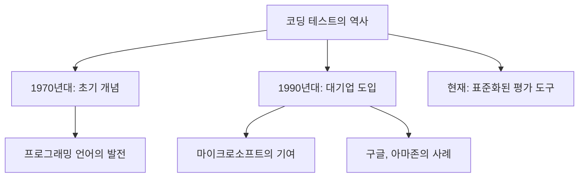

위의 다이어그램은 코딩 테스트의 역사적 배경을 간략하게 나타낸 것이다. 코딩 테스트는 초기 개념에서 시작하여, 대기업의 도입을 통해 현재의 표준화된 평가 도구로 발전해왔다. 이러한 발전 과정은 소프트웨어 개발 분야의 채용 방식에 큰 영향을 미쳤다.

<!--
## 2. 코딩 테스트의 발전
   - 1990년대 마이크로소프트와 빌 게이츠의 기여
   - 아마존, 페이스북, 구글의 도입 사례
   - 국내 기업의 코딩 테스트 도입 (예: 다음커뮤니케이션)
-->

## 2. 코딩 테스트의 발전

코딩 테스트는 소프트웨어 개발 분야에서 인재를 선발하는 중요한 도구로 자리 잡았다. 특히 1990년대부터 시작된 여러 기업의 기여는 코딩 테스트의 발전에 큰 영향을 미쳤다. 이 글에서는 마이크로소프트와 빌 게이츠의 기여, 아마존, 페이스북, 구글의 도입 사례, 그리고 국내 기업의 코딩 테스트 도입에 대해 살펴보겠다.

**1990년대 마이크로소프트와 빌 게이츠의 기여**

1990년대 초반, 마이크로소프트는 소프트웨어 개발자 채용 과정에서 코딩 테스트를 도입하기 시작했다. 빌 게이츠는 기술적 능력을 평가하는 것이 중요하다고 강조하였고, 이는 이후 많은 기업들이 코딩 테스트를 채용 과정에 포함시키는 계기가 되었다. 마이크로소프트의 코딩 테스트는 주로 알고리즘 문제와 자료구조 문제로 구성되어 있으며, 지원자의 문제 해결 능력을 평가하는 데 중점을 두었다.

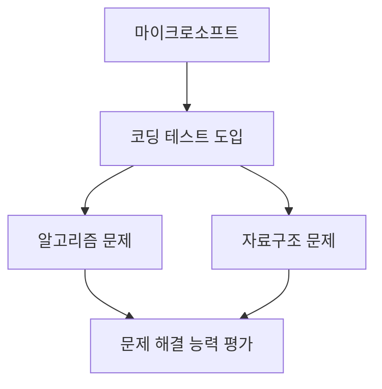

**아마존, 페이스북, 구글의 도입 사례**

아마존, 페이스북, 구글과 같은 글로벌 IT 기업들은 코딩 테스트를 통해 우수한 인재를 선발하고 있다. 이들 기업은 각기 다른 방식으로 코딩 테스트를 운영하고 있으며, 문제의 난이도와 유형도 다양하다. 예를 들어, 아마존은 고객 중심의 문제 해결 능력을 평가하는 데 중점을 두고 있으며, 페이스북은 협업 능력과 코드 품질을 중요시한다. 구글은 데이터 구조와 알고리즘에 대한 깊은 이해를 요구하는 문제를 출제하여 지원자의 기술적 역량을 철저히 평가한다.

**국내 기업의 코딩 테스트 도입 (예: 다음커뮤니케이션)**

국내에서도 코딩 테스트의 도입이 활발히 이루어지고 있다. 다음커뮤니케이션은 2000년대 초반부터 코딩 테스트를 실시하여, 지원자의 프로그래밍 능력을 평가하고 있다. 이 회사는 온라인 저지 시스템을 활용하여 실시간으로 문제를 출제하고, 지원자들이 문제를 해결하는 과정을 모니터링한다. 이러한 방식은 지원자에게 공정한 평가를 제공하며, 기업은 우수한 인재를 선발하는 데 큰 도움이 된다.

코딩 테스트는 이제 단순한 채용 도구를 넘어, 기업의 기술력과 인재 선발 전략에 중요한 역할을 하고 있다. 앞으로도 코딩 테스트는 지속적으로 발전하며, 다양한 기업에서 그 중요성이 더욱 부각될 것이다.

<!--
## 3. 코딩 테스트의 현황
   - 대기업 및 중견기업의 코딩 테스트 실시 현황
   - 적성검사와 코딩 테스트의 비교
   - 실무 능력 평가의 변화
-->

## 3. 코딩 테스트의 현황

코딩 테스트는 최근 몇 년간 많은 기업에서 인재 선발의 중요한 도구로 자리 잡았다. 특히 대기업 및 중견기업에서의 코딩 테스트 실시 현황은 눈에 띄게 증가하고 있다. 이 글에서는 대기업 및 중견기업의 코딩 테스트 실시 현황, 적성검사와 코딩 테스트의 비교, 그리고 실무 능력 평가의 변화를 살펴보겠다.

**대기업 및 중견기업의 코딩 테스트 실시 현황**

대기업에서는 코딩 테스트를 통해 지원자의 문제 해결 능력과 프로그래밍 능력을 평가하는 경우가 많다. 예를 들어, 삼성전자, LG전자, 카카오 등은 온라인 플랫폼을 통해 코딩 테스트를 실시하고 있으며, 지원자는 주어진 시간 내에 문제를 해결해야 한다. 이러한 방식은 지원자의 실력을 객관적으로 평가할 수 있는 장점이 있다.

중견기업 또한 코딩 테스트를 도입하고 있으며, 특히 IT 및 소프트웨어 관련 기업에서 그 비율이 높다. 중견기업은 대기업에 비해 상대적으로 유연한 채용 방식을 채택하고 있어, 다양한 문제 유형을 출제하여 지원자의 창의성과 적응력을 평가하는 경향이 있다.

**적성검사와 코딩 테스트의 비교**

적성검사는 일반적으로 지원자의 인지 능력, 성격, 직무 적합성을 평가하는 데 중점을 둔다. 반면, 코딩 테스트는 지원자의 프로그래밍 능력과 문제 해결 능력을 직접적으로 평가하는 방식이다. 두 가지 방식은 서로 보완적인 관계에 있으며, 많은 기업에서는 두 가지를 함께 활용하여 보다 종합적인 평가를 진행하고 있다.

아래의 다이어그램은 적성검사와 코딩 테스트의 차이점을 시각적으로 나타낸 것이다.

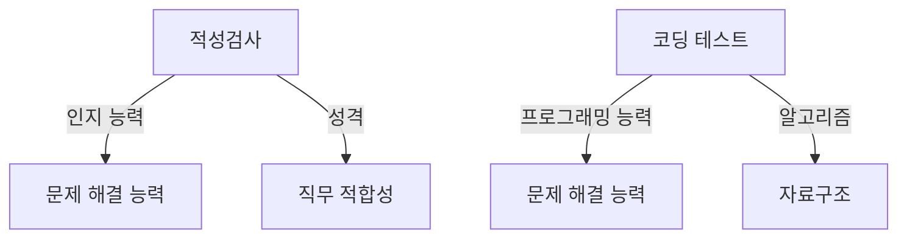

**실무 능력 평가의 변화**

최근에는 실무 능력 평가의 중요성이 더욱 강조되고 있다. 전통적인 코딩 테스트는 주로 알고리즘 문제에 집중했으나, 현재는 실제 업무에서 필요한 기술과 지식을 평가하는 방향으로 변화하고 있다. 예를 들어, 팀 프로젝트를 통한 협업 능력, 코드 리뷰 및 유지보수 능력 등을 평가하는 방식이 도입되고 있다.

이러한 변화는 기업이 필요로 하는 인재의 스펙트럼을 넓히고, 지원자에게도 실무에 가까운 경험을 제공하는 데 기여하고 있다. 따라서 지원자는 단순히 알고리즘 문제를 푸는 데 그치지 않고, 다양한 실무 경험을 쌓는 것이 중요하다. 

코딩 테스트의 현황은 기업의 채용 방식에 큰 영향을 미치고 있으며, 앞으로도 지속적인 변화가 예상된다. 이러한 변화에 발맞추어 지원자들은 다양한 준비 방법을 모색해야 할 것이다.

<!--
## 4. 코딩 테스트의 유형
   - 온라인 저지 서비스의 활용
   - 자체 출제 문제의 사례
   - 과제 전형과 코딩 테스트의 차이점
-->

## 4. 코딩 테스트의 유형

코딩 테스트는 다양한 방식으로 진행될 수 있으며, 각 방식은 특정한 목적과 장점을 가지고 있다. 이번 섹션에서는 온라인 저지 서비스의 활용, 자체 출제 문제의 사례, 그리고 과제 전형과 코딩 테스트의 차이점에 대해 살펴보겠다.

**온라인 저지 서비스의 활용**

온라인 저지 서비스는 코딩 테스트를 진행하는 데 있어 매우 유용한 플랫폼이다. 이러한 서비스는 문제를 출제하고, 참가자가 작성한 코드를 자동으로 채점하는 기능을 제공한다. 대표적인 온라인 저지 서비스로는 LeetCode, HackerRank, CodeSignal 등이 있다. 이들 플랫폼은 다양한 난이도의 문제를 제공하며, 실시간으로 피드백을 받을 수 있는 장점이 있다.

예를 들어, LeetCode에서는 다음과 같은 문제를 제공한다:

```python
def two_sum(nums, target):
    num_map = {}
    for i, num in enumerate(nums):
        complement = target - num
        if complement in num_map:
            return [num_map[complement], i]
        num_map[num] = i
    return []
```

위 코드는 주어진 배열에서 두 수의 합이 특정 값이 되는 인덱스를 찾는 문제를 해결하는 예시이다. 이러한 문제를 통해 지원자는 알고리즘적 사고와 문제 해결 능력을 평가받게 된다.

**자체 출제 문제의 사례**

일부 기업은 자체적으로 문제를 출제하여 코딩 테스트를 진행하기도 한다. 이러한 문제는 기업의 실제 업무와 관련된 상황을 반영하여 출제되며, 지원자의 실무 능력을 평가하는 데 중점을 둔다. 예를 들어, 특정 기업에서는 데이터베이스 쿼리 최적화 문제나 API 설계 문제를 출제할 수 있다.

자체 출제 문제의 예시는 다음과 같다:

```sql
SELECT employee_id, COUNT(*) as project_count
FROM projects
GROUP BY employee_id
HAVING project_count > 5;
```

위 SQL 쿼리는 특정 직원이 참여한 프로젝트 수를 세고, 5개 이상의 프로젝트에 참여한 직원의 ID를 반환하는 문제를 해결하는 예시이다. 이러한 문제는 지원자가 실제 업무에서 필요한 기술을 갖추고 있는지를 평가하는 데 유용하다.

**과제 전형과 코딩 테스트의 차이점**

과제 전형과 코딩 테스트는 모두 지원자의 능력을 평가하는 방법이지만, 그 방식과 목적에는 차이가 있다. 코딩 테스트는 주로 제한된 시간 내에 문제를 해결하는 형식으로 진행되며, 알고리즘적 사고와 문제 해결 능력을 중점적으로 평가한다. 반면, 과제 전형은 보다 실무 지향적인 과제를 주어 지원자가 실제 업무를 수행할 수 있는지를 평가하는 방식이다.

다음은 과제 전형과 코딩 테스트의 차이점을 나타내는 다이어그램이다:

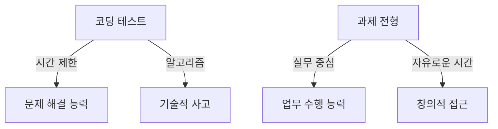

이와 같이 코딩 테스트와 과제 전형은 서로 다른 평가 기준을 가지고 있으며, 지원자는 각 방식에 맞춰 준비하는 것이 중요하다. 코딩 테스트는 빠른 문제 해결 능력을, 과제 전형은 실무 능력을 강조하는 평가 방식이다.

<!--
## 5. 코딩 테스트 준비 방법
   - 스택과 큐 문제 풀이
   - 자주 출제되는 알고리즘 및 자료구조
   - 모의 코딩 테스트와 피드백 활용
-->

## 5. 코딩 테스트 준비 방법

코딩 테스트를 준비하는 과정은 체계적이고 전략적으로 접근해야 한다. 다양한 문제 유형과 알고리즘을 이해하고, 실전 경험을 쌓는 것이 중요하다. 아래에서는 코딩 테스트 준비를 위한 몇 가지 방법을 소개한다.

**스택과 큐 문제 풀이**

스택과 큐는 기본적인 자료구조로, 많은 코딩 테스트에서 자주 출제되는 주제이다. 스택은 후입선출(LIFO) 구조를 가지며, 큐는 선입선출(FIFO) 구조를 가진다. 이 두 자료구조를 활용한 문제를 풀어보는 것이 좋다.

예를 들어, 스택을 이용한 괄호 검사 문제는 다음과 같은 방식으로 해결할 수 있다.

```python
def is_valid_parentheses(s: str) -> bool:
    stack = []
    mapping = {")": "(", "}": "{", "]": "["}
    
    for char in s:
        if char in mapping:
            top_element = stack.pop() if stack else '#'
            if mapping[char] != top_element:
                return False
        else:
            stack.append(char)
    
    return not stack
```

위 코드는 주어진 문자열에서 괄호의 유효성을 검사하는 함수이다. 스택을 사용하여 여는 괄호를 저장하고, 닫는 괄호가 나올 때마다 스택에서 여는 괄호를 꺼내 비교한다.

**자주 출제되는 알고리즘 및 자료구조**

코딩 테스트에서 자주 출제되는 알고리즘과 자료구조를 미리 파악하고 연습하는 것이 중요하다. 예를 들어, 정렬 알고리즘, 탐색 알고리즘, 그래프 알고리즘 등이 있다. 각 알고리즘의 시간 복잡도와 공간 복잡도를 이해하고, 다양한 문제에 적용해보는 것이 좋다.

다음은 간단한 정렬 알고리즘인 버블 정렬의 예시이다.

```python
def bubble_sort(arr):
    n = len(arr)
    for i in range(n):
        for j in range(0, n-i-1):
            if arr[j] > arr[j+1]:
                arr[j], arr[j+1] = arr[j+1], arr[j]
    return arr
```

이 코드는 주어진 배열을 버블 정렬 방식으로 정렬하는 함수이다. 각 요소를 비교하여 큰 값을 뒤로 보내는 방식으로 정렬을 수행한다.

**모의 코딩 테스트와 피드백 활용**

모의 코딩 테스트는 실제 코딩 테스트와 유사한 환경에서 연습할 수 있는 좋은 방법이다. 다양한 플랫폼에서 제공하는 모의 테스트를 통해 시간 관리와 문제 해결 능력을 키울 수 있다. 또한, 문제를 푼 후에는 반드시 피드백을 받아야 한다. 자신의 풀이를 분석하고, 더 나은 방법이나 최적화된 코드를 찾아보는 것이 중요하다.

다음은 모의 코딩 테스트를 위한 간단한 다이어그램이다.

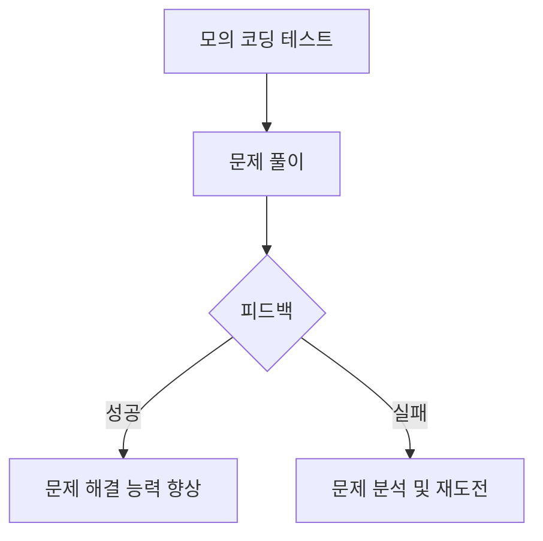

위 다이어그램은 모의 코딩 테스트의 흐름을 나타낸다. 문제를 풀고 피드백을 통해 자신의 실력을 점검하며, 지속적으로 개선해 나가는 과정이 중요하다. 

이와 같은 방법들을 통해 코딩 테스트를 준비하면, 실전에서 더 좋은 결과를 얻을 수 있을 것이다.

<!--
## 6. 코딩 테스트의 평가 기준
   - 점수 산정 방식
   - 문제 난이도와 출제 빈도
   - 평균 점수 분석
-->

## 6. 코딩 테스트의 평가 기준

코딩 테스트의 평가 기준은 지원자의 프로그래밍 능력을 객관적으로 측정하기 위한 중요한 요소이다. 이 기준은 점수 산정 방식, 문제 난이도와 출제 빈도, 평균 점수 분석으로 나눌 수 있다.

**점수 산정 방식**

코딩 테스트의 점수 산정 방식은 일반적으로 다음과 같은 요소를 포함한다. 

1. **정답 여부**: 문제를 정확히 해결했는지 여부에 따라 점수가 부여된다.
2. **시간 복잡도**: 제출된 코드의 효율성도 평가의 중요한 기준이다. 더 효율적인 알고리즘을 사용한 경우 추가 점수를 받을 수 있다.
3. **코드 품질**: 가독성, 주석, 변수명 등의 코드 품질도 평가에 포함된다. 이는 유지보수성과 협업 능력을 반영하기 때문이다.

아래는 점수 산정 방식을 나타내는 다이어그램이다.

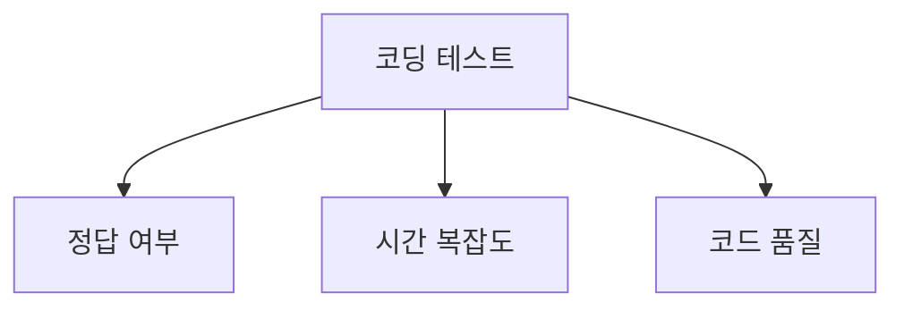

** 문제 난이도와 출제 빈도**

문제의 난이도는 코딩 테스트의 평가 기준에서 중요한 역할을 한다. 일반적으로 문제는 난이도에 따라 다음과 같이 분류된다.

- **쉬운 문제**: 기본적인 알고리즘과 자료구조를 요구하며, 초급자도 해결할 수 있는 수준이다.
- **중간 문제**: 약간의 사고가 필요하며, 중급자의 능력을 평가하는 데 적합하다.
- **어려운 문제**: 고급 알고리즘과 복잡한 자료구조를 요구하며, 상급자의 능력을 평가하는 데 사용된다.

문제의 출제 빈도는 특정 기업이나 산업에서 자주 출제되는 문제 유형을 파악하는 데 도움이 된다. 이를 통해 지원자는 자신이 준비해야 할 문제 유형을 미리 예측할 수 있다.

**평균 점수 분석**

평균 점수 분석은 코딩 테스트의 결과를 해석하는 데 중요한 역할을 한다. 평균 점수는 전체 지원자의 성과를 비교하는 기준이 되며, 특정 문제의 난이도를 평가하는 데도 사용된다. 예를 들어, 특정 문제의 평균 점수가 낮다면 해당 문제의 난이도가 너무 높았던 것으로 판단할 수 있다.

이러한 분석을 통해 기업은 코딩 테스트의 문제를 개선하고, 지원자는 자신의 실력을 객관적으로 평가할 수 있는 기회를 갖게 된다. 

결론적으로, 코딩 테스트의 평가 기준은 지원자의 능력을 공정하게 평가하기 위한 필수 요소이며, 이를 통해 기업은 적합한 인재를 선발할 수 있다.

<!--
## 7. FAQ
   - 코딩 테스트는 어떻게 준비해야 하나요?
   - 코딩 테스트에서 자주 나오는 문제 유형은 무엇인가요?
   - 코딩 테스트의 결과는 어떻게 활용되나요?
-->

## 7. FAQ

**코딩 테스트는 어떻게 준비해야 하나요?**  

코딩 테스트를 준비하기 위해서는 체계적인 학습 계획이 필요하다. 우선, 기본적인 자료구조와 알고리즘에 대한 이해를 높이는 것이 중요하다. 이를 위해 다양한 온라인 강의와 서적을 활용할 수 있다. 또한, 실제 코딩 테스트와 유사한 문제를 풀어보는 것이 효과적이다. 여러 온라인 저지 플랫폼에서 제공하는 문제를 풀어보며 실력을 쌓는 것이 좋다. 

아래는 스택과 큐를 활용한 간단한 문제 예시이다.

```python
# 스택을 이용한 괄호 유효성 검사
def is_valid_parentheses(s):
    stack = []
    mapping = {')': '(', '}': '{', ']': '['}
    
    for char in s:
        if char in mapping:
            top_element = stack.pop() if stack else '#'
            if mapping[char] != top_element:
                return False
        else:
            stack.append(char)
    
    return not stack

# 사용 예시
print(is_valid_parentheses("()[]{}"))  # True
print(is_valid_parentheses("(]"))      # False
```

**코딩 테스트에서 자주 나오는 문제 유형은 무엇인가요?**  

코딩 테스트에서 자주 출제되는 문제 유형은 다음과 같다. 

1. **정렬 및 탐색**: 배열이나 리스트를 정렬하거나 특정 값을 찾는 문제.
2. **그래프 및 트리**: DFS, BFS와 같은 탐색 알고리즘을 활용한 문제.
3. **동적 프로그래밍**: 최적화 문제를 해결하기 위한 접근 방식.
4. **문자열 처리**: 문자열의 조작 및 분석과 관련된 문제.
5. **수학적 문제**: 소수 판별, 최대공약수, 최소공배수와 같은 수학적 개념을 활용한 문제.

아래는 피보나치 수열을 동적 프로그래밍으로 해결하는 예시이다.

```python
# 피보나치 수열 동적 프로그래밍
def fibonacci(n):
    fib = [0, 1]
    for i in range(2, n + 1):
        fib.append(fib[i - 1] + fib[i - 2])
    return fib[n]

# 사용 예시
print(fibonacci(10))  # 55
```

**코딩 테스트의 결과는 어떻게 활용되나요?**  

코딩 테스트의 결과는 주로 채용 과정에서 지원자의 기술적 능력을 평가하는 데 사용된다. 기업은 코딩 테스트 결과를 바탕으로 지원자의 문제 해결 능력, 알고리즘 이해도, 코드 작성 능력 등을 판단한다. 또한, 코딩 테스트의 점수는 최종 면접 단계에서의 평가 기준으로 활용될 수 있다. 

아래는 코딩 테스트 결과를 활용하는 과정의 다이어그램이다.

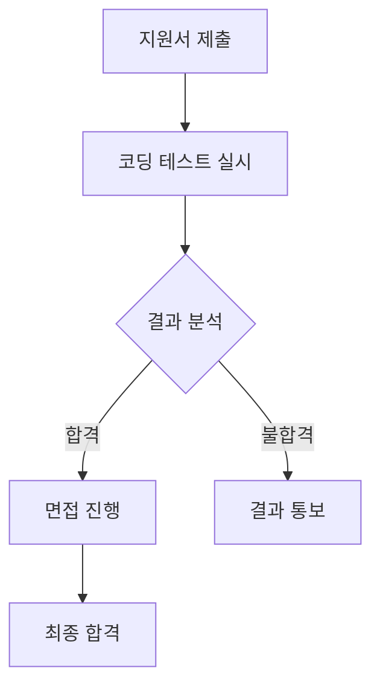

이와 같이 코딩 테스트는 지원자의 기술적 역량을 평가하는 중요한 도구로 활용되며, 기업의 인재 선발 과정에서 중요한 역할을 한다.

<!--
## 8. 관련 기술
   - 알고리즘과 자료구조
   - 프로그래밍 언어의 선택
   - 소프트웨어 개발 생명주기(SDLC)
-->

## 8. 관련 기술

**알고리즘과 자료구조**  

알고리즘과 자료구조는 코딩 테스트에서 매우 중요한 역할을 한다. 알고리즘은 문제를 해결하기 위한 절차나 방법을 의미하며, 자료구조는 데이터를 효율적으로 저장하고 관리하기 위한 구조를 의미한다. 코딩 테스트에서는 주어진 문제를 해결하기 위해 적절한 알고리즘과 자료구조를 선택하는 것이 필수적이다. 

예를 들어, 정렬 문제를 해결할 때는 다양한 정렬 알고리즘(버블 정렬, 퀵 정렬, 병합 정렬 등)을 사용할 수 있으며, 각 알고리즘의 시간 복잡도와 공간 복잡도를 고려하여 최적의 방법을 선택해야 한다. 아래는 간단한 퀵 정렬의 샘플 코드이다.

```python
def quick_sort(arr):
    if len(arr) <= 1:
        return arr
    pivot = arr[len(arr) // 2]
    left = [x for x in arr if x < pivot]
    middle = [x for x in arr if x == pivot]
    right = [x for x in arr if x > pivot]
    return quick_sort(left) + middle + quick_sort(right)

# 사용 예시
arr = [3, 6, 8, 10, 1, 2, 1]
print(quick_sort(arr))
```

**프로그래밍 언어의 선택**  

코딩 테스트를 준비할 때 어떤 프로그래밍 언어를 선택하는지도 중요하다. 각 언어는 고유의 문법과 특성을 가지고 있으며, 특정 문제를 해결하는 데 더 적합한 언어가 있을 수 있다. 예를 들어, Python은 간결한 문법과 강력한 라이브러리 지원 덕분에 알고리즘 문제 해결에 많이 사용된다. 반면, C++는 성능이 중요한 문제에서 유리할 수 있다.

아래는 프로그래밍 언어 선택 시 고려해야 할 요소들을 정리한 다이어그램이다.

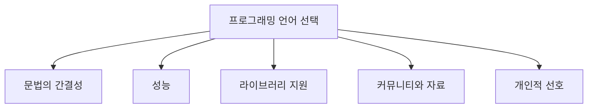

**소프트웨어 개발 생명주기(SDLC)**  

소프트웨어 개발 생명주기(SDLC)는 소프트웨어 개발 과정의 단계들을 정의한 모델이다. 코딩 테스트와 관련하여 SDLC의 각 단계는 개발자가 문제를 해결하는 데 필요한 기술적 접근 방식을 이해하는 데 도움을 준다. SDLC의 주요 단계는 요구사항 분석, 설계, 구현, 테스트, 배포, 유지보수로 나눌 수 있다.

코딩 테스트에서는 주로 구현과 테스트 단계가 중요하다. 문제를 해결하기 위해 코드를 작성하고, 작성한 코드가 올바르게 작동하는지 확인하는 과정이 포함된다. 아래는 SDLC의 주요 단계를 나타낸 다이어그램이다.

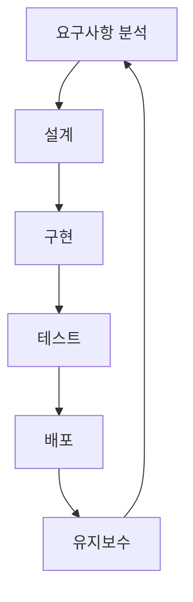

이와 같이 알고리즘과 자료구조, 프로그래밍 언어의 선택, 소프트웨어 개발 생명주기(SDLC)는 코딩 테스트를 준비하는 데 있어 필수적인 기술적 요소들이다. 각 요소를 충분히 이해하고 연습하는 것이 중요하다.

<!--
## 9. 결론
   - 코딩 테스트의 미래
   - 취업 시장에서의 코딩 테스트의 역할
   - 지속적인 학습과 기술 향상의 중요성
-->

## 9. 결론

**코딩 테스트의 미래**  

코딩 테스트는 앞으로도 계속해서 진화할 것으로 예상된다. 기술의 발전과 함께 인공지능(AI) 및 머신러닝(ML) 기술이 코딩 테스트에 도입될 가능성이 높다. 예를 들어, AI 기반의 자동 채점 시스템이 도입되면, 지원자의 코드 품질을 더욱 정교하게 평가할 수 있을 것이다. 또한, 가상 현실(VR)이나 증강 현실(AR) 기술을 활용한 몰입형 코딩 테스트도 등장할 수 있다. 이러한 변화는 지원자에게 더 나은 경험을 제공하고, 기업에게는 더 정확한 인재 선발을 가능하게 할 것이다.

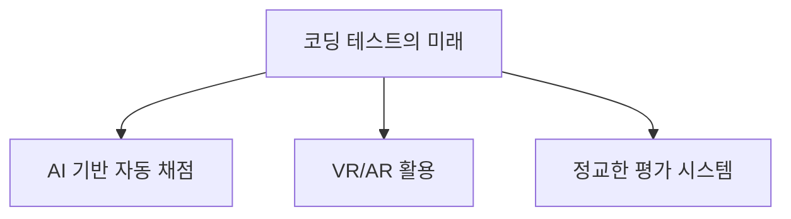

**취업 시장에서의 코딩 테스트의 역할**  

코딩 테스트는 취업 시장에서 점점 더 중요한 역할을 하고 있다. 많은 기업들이 기술 면접의 일환으로 코딩 테스트를 실시하고 있으며, 이는 지원자의 실무 능력을 평가하는 데 큰 도움이 된다. 특히, 소프트웨어 개발 분야에서는 코딩 테스트가 필수적인 요소로 자리 잡고 있으며, 이를 통해 기업은 적합한 인재를 선발할 수 있다. 따라서, 지원자들은 코딩 테스트를 준비하는 것이 취업 성공의 중요한 열쇠가 될 것이다.

**지속적인 학습과 기술 향상의 중요성**  

코딩 테스트를 준비하는 과정에서 지속적인 학습과 기술 향상은 필수적이다. 기술은 빠르게 변화하고 있으며, 새로운 언어와 프레임워크가 지속적으로 등장하고 있다. 따라서, 개발자는 최신 기술 트렌드를 따라잡고, 알고리즘 및 자료구조에 대한 깊은 이해를 유지해야 한다. 이를 통해 코딩 테스트에서 좋은 성과를 거둘 수 있을 뿐만 아니라, 실제 업무에서도 뛰어난 성과를 낼 수 있다. 지속적인 학습은 개인의 성장뿐만 아니라, 기업의 경쟁력에도 기여할 것이다.

<!--
## 10. 참고 자료
   - 관련 서적 및 온라인 강의
   - 유용한 웹사이트 및 커뮤니티
   - 코딩 테스트 연습 플랫폼 소개
-->

## 10. 참고 자료

**관련 서적 및 온라인 강의**  

코딩 테스트를 준비하는 데 유용한 서적과 온라인 강의는 많다. 다음은 추천할 만한 자료들이다.

1. **서적**
   - **"Cracking the Coding Interview"**: 이 책은 코딩 인터뷰를 준비하는 데 필수적인 자료구조와 알고리즘 문제를 다룬다. 각 문제에 대한 해설과 함께 다양한 접근 방식을 제시한다.
   - **"Elements of Programming Interviews"**: 이 책은 문제 해결 능력을 키우기 위한 다양한 문제를 제공하며, 각 문제에 대한 상세한 해설이 포함되어 있다.

2. **온라인 강의**
   - **Coursera의 "Data Structures and Algorithms"**: 이 강의는 자료구조와 알고리즘의 기초부터 심화까지 다룬다. 실습 문제를 통해 학습한 내용을 적용할 수 있다.
   - **Udemy의 "Coding Interview Bootcamp"**: 이 강의는 코딩 인터뷰에서 자주 출제되는 문제를 중심으로 구성되어 있으며, 실전 연습을 통해 자신감을 키울 수 있다.

** 유용한 웹사이트 및 커뮤니티 **  
코딩 테스트를 준비하는 데 도움이 되는 웹사이트와 커뮤니티는 다음과 같다.

- **LeetCode**: 다양한 난이도의 문제를 제공하며, 문제 풀이 후 다른 사람의 솔루션을 비교할 수 있는 기능이 있다. 이를 통해 다양한 접근 방식을 배울 수 있다.
- **HackerRank**: 코딩 테스트를 위한 플랫폼으로, 다양한 기업의 실제 문제를 연습할 수 있다. 또한, 커뮤니티에서 다른 개발자들과 소통할 수 있는 공간도 제공한다.
- **Stack Overflow**: 프로그래밍 관련 질문과 답변을 공유하는 커뮤니티로, 코딩 테스트와 관련된 질문을 검색하거나 직접 질문할 수 있다.

** 코딩 테스트 연습 플랫폼 소개 **  
코딩 테스트를 효과적으로 연습할 수 있는 플랫폼은 다음과 같다.

- **CodeSignal**: 다양한 코딩 테스트 문제를 제공하며, 실시간으로 코드를 실행하고 결과를 확인할 수 있다. 기업의 코딩 테스트를 모의로 진행해 볼 수 있는 기능도 있다.
- **Codility**: 코딩 테스트를 위한 플랫폼으로, 문제를 풀고 제출하면 자동으로 평가해준다. 문제의 난이도에 따라 다양한 연습을 할 수 있다.
- **AtCoder**: 일본의 프로그래밍 대회 플랫폼으로, 다양한 문제를 제공하며, 정기적으로 대회가 열려 실력을 테스트할 수 있는 기회를 제공한다.

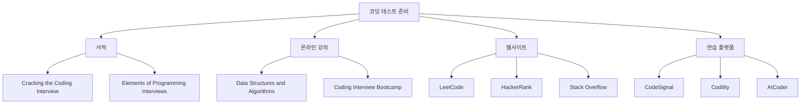

위의 자료들을 활용하여 코딩 테스트를 준비하면, 보다 효과적으로 실력을 향상시킬 수 있다. 지속적인 학습과 연습이 중요하다.

<!--
##### Reference #####
-->

## Reference


* [http://www.ktword.co.kr/test/view/view.php?no=5735](http://www.ktword.co.kr/test/view/view.php?no=5735)
* [https://namu.wiki/w/%EB%B6%84%EB%A5%98:%EC%95%8C%EA%B3%A0%EB%A6%AC%EC%A6%98](https://namu.wiki/w/%EB%B6%84%EB%A5%98:%EC%95%8C%EA%B3%A0%EB%A6%AC%EC%A6%98)
* [https://namu.wiki/w/%EC%BD%94%EB%94%A9%20%ED%85%8C%EC%8A%A4%ED%8A%B8](https://namu.wiki/w/%EC%BD%94%EB%94%A9%20%ED%85%8C%EC%8A%A4%ED%8A%B8)
* [https://school.programmers.co.kr/learn/challenges?tab=algorithm_practice_kit](https://school.programmers.co.kr/learn/challenges?tab=algorithm_practice_kit)

