C++는 강력한 프로그래밍 언어이지만, 보안 및 시스템 프로그래밍 관점에서 여러 가지 문제를 안고 있다. 최근 Herb Sutter의 기사를 통해 C++의 안전성 문제에 대한 논의가 활발히 이루어지고 있으며, 그가 제안하는 해결책은 많은 프로그래머들에게 희망을 주고 있다. 그러나 이러한 접근 방식이 실제로 C++의 보안 및 시스템 프로그래밍에 미치는 영향은 여전히 의문이다. C++는 메모리 안전성, 타입 안전성, 경계 안전성, 초기화 안전성 등 여러 측면에서 개선이 필요하다. 특히, C++의 표준 라이브러리는 시스템 프로그래머에게 유리하지 않으며, 이는 코드의 예측 가능성을 저하시킨다. Rust와 같은 다른 언어와 비교했을 때, C++는 보안 및 안전성을 보장하는 데 있어 더 많은 노력이 필요하다. 이러한 문제를 해결하기 위해서는 C++의 기본 설계 원칙을 재검토하고, 프로그래머가 안전한 코드를 작성할 수 있도록 도와주는 도구와 규칙을 마련해야 한다. C++의 미래는 이러한 문제를 해결하는 데 달려 있으며, 이를 통해 더 안전하고 신뢰할 수 있는 소프트웨어를 개발할 수 있을 것이다.


||
|:---:|
||


<!--
##### Outline #####
-->

<!--
# C++의 보안 및 시스템 프로그래밍 — 비판적 시각

## 목차

1. **개요**
   - C++의 보안 및 안전성 문제
   - Herb Sutter의 안전성 논의 요약
   - C++와 다른 언어(예: Rust) 간의 비교

2. **C++의 현재 안전성 문제**
   - C++에서의 보안 및 안전성 취약점
   - C++의 안전성 문제의 원인
   - C++의 메모리 안전성 및 타입 안전성 문제

3. **C++의 안전성 개선 방안**
   - 타입 안전성, 경계 안전성, 초기화 안전성, 생애 안전성 개선
   - C++ 표준 라이브러리의 스레드 안전성
   - 안전성 프로파일 및 규칙 제안

4. **C++의 메모리 안전성**
   - 메모리 안전성의 중요성
   - 메모리 안전성을 위한 C++의 현재 도전 과제
   - 메모리 안전성을 위한 대안 언어와의 비교

5. **C++의 성능과 안전성의 균형**
   - 성능 저하 없이 안전성 강화하기
   - 안전성 규칙의 기본값 설정 및 옵트아웃 방법
   - C++의 성능 최적화와 안전성 간의 상충

6. **C++의 메타프로그래밍과 그 문제점**
   - 메타프로그래밍의 장점과 단점
   - 메타프로그래밍이 코드 품질에 미치는 영향
   - 메타프로그래밍을 통한 안전성 개선 방안

7. **C++의 안전성 관련 도구 및 기술**
   - 정적 분석 도구 및 동적 분석 도구
   - C++에서의 샌타이저 사용
   - C++의 안전성 도구 및 라이브러리

8. **FAQ**
   - C++의 안전성을 높이기 위한 가장 좋은 방법은 무엇인가요?
   - C++에서 메모리 안전성을 보장하기 위한 도구는 무엇이 있나요?
   - C++의 성능을 유지하면서 안전성을 강화할 수 있는 방법은 무엇인가요?

9. **관련 기술**
   - Rust와 C++의 안전성 비교
   - 메모리 안전 언어(MSL)와 C++
   - C++의 최신 표준(C++20, C++23)과 안전성 관련 기능

10. **결론**
    - C++의 미래와 안전성 개선의 필요성
    - 프로그래머와 개발 팀의 역할
    - C++의 안전성을 높이기 위한 지속적인 노력의 중요성

11. **부록**
    - C++ 안전성 프로파일 및 규칙 목록
    - C++에서의 안전성 관련 연구 및 자료
    - C++ 커뮤니티의 안전성 관련 논의 및 피드백

이 목차는 C++의 보안 및 시스템 프로그래밍에 대한 비판적 시각을 다루며, 관련된 다양한 주제를 포함하여 독자에게 풍부한 정보를 제공할 수 있도록 구성되었습니다.
-->

<!--
1. **개요**
   - C++의 보안 및 안전성 문제
   - Herb Sutter의 안전성 논의 요약
   - C++와 다른 언어(예: Rust) 간의 비교
-->

## C++의 보안 및 안전성 문제

C++는 강력한 성능과 유연성을 제공하는 프로그래밍 언어이지만, 그만큼 보안 및 안전성 문제도 내포하고 있다. C++의 메모리 관리 방식은 프로그래머에게 많은 자유를 주지만, 이로 인해 발생할 수 있는 메모리 누수, 버퍼 오버플로우, 그리고 데이터 경합과 같은 취약점은 심각한 보안 문제를 초래할 수 있다. 이러한 문제들은 C++로 작성된 소프트웨어의 신뢰성을 저하시킬 수 있으며, 결과적으로 시스템의 안전성을 위협하게 된다.

C++의 보안 문제는 주로 다음과 같은 원인에서 발생한다.

- **메모리 관리의 복잡성**: C++는 프로그래머가 직접 메모리를 할당하고 해제해야 하므로, 메모리 관리에서 실수가 발생할 가능성이 높다.
- **타입 안전성 부족**: C++는 강타입 언어이지만, 포인터와 같은 저수준 기능을 사용함으로써 타입 안전성을 위협할 수 있다.
- **예외 처리의 불완전성**: C++의 예외 처리 메커니즘은 복잡하며, 예외가 발생했을 때 자원 해제를 제대로 수행하지 못할 수 있다.

이러한 문제들은 C++의 사용을 더욱 신중하게 만들어야 하며, 개발자들은 보안과 안전성을 고려한 코딩 습관을 기르는 것이 중요하다.

**Herb Sutter의 안전성 논의 요약**

Herb Sutter는 C++의 안전성 문제에 대해 깊이 있는 논의를 진행해왔다. 그는 C++의 안전성을 높이기 위한 여러 가지 방안을 제안하며, 특히 "C++의 안전성은 프로그래머의 책임"이라는 점을 강조한다. Sutter는 C++의 안전성을 개선하기 위해 다음과 같은 접근 방식을 제안한다.

- **안전한 라이브러리 사용**: C++ 표준 라이브러리와 같은 안전한 라이브러리를 활용하여 코드의 안전성을 높일 수 있다.
- **정적 분석 도구 활용**: 코드 작성 시 정적 분석 도구를 사용하여 잠재적인 취약점을 사전에 발견하고 수정할 수 있다.
- **안전성 프로파일 설정**: 프로젝트에 맞는 안전성 프로파일을 설정하여, 코드 작성 시 안전성을 고려하도록 유도할 수 있다.

이러한 접근 방식은 C++의 안전성을 높이는 데 기여할 수 있으며, 개발자들이 보다 안전한 코드를 작성하는 데 도움을 줄 수 있다.

**C++와 다른 언어(예: Rust) 간의 비교**

C++와 Rust는 모두 시스템 프로그래밍 언어로, 성능과 효율성을 중시한다. 그러나 두 언어는 안전성에 대한 접근 방식에서 큰 차이를 보인다. Rust는 메모리 안전성을 보장하기 위해 소유권(ownership) 시스템을 도입하였으며, 이로 인해 메모리 관리에서 발생할 수 있는 많은 문제를 사전에 방지할 수 있다. 반면, C++는 프로그래머에게 더 많은 자유를 주지만, 그만큼 안전성을 보장하기 위한 추가적인 노력이 필요하다.

다음은 C++와 Rust의 안전성 관련 특징을 비교한 다이어그램이다.

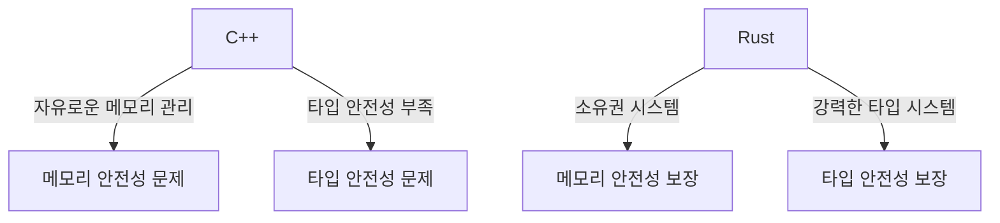

이와 같이 C++와 Rust는 각각의 장단점이 있으며, 개발자는 프로젝트의 요구사항에 따라 적절한 언어를 선택해야 한다. C++의 경우, 보안 및 안전성을 높이기 위한 다양한 방법을 모색하는 것이 필수적이다.

<!--
2. **C++의 현재 안전성 문제**
   - C++에서의 보안 및 안전성 취약점
   - C++의 안전성 문제의 원인
   - C++의 메모리 안전성 및 타입 안전성 문제
-->

## C++의 현재 안전성 문제

C++는 강력한 성능과 유연성을 제공하는 프로그래밍 언어이지만, 그만큼 보안 및 안전성 문제도 내포하고 있다. 이 장에서는 C++에서의 보안 및 안전성 취약점, 그 원인, 그리고 메모리 안전성 및 타입 안전성 문제에 대해 살펴보겠다.

**C++에서의 보안 및 안전성 취약점**

C++는 저수준 메모리 접근을 허용하는 언어로, 이는 개발자가 메모리를 직접 관리할 수 있는 유연성을 제공하지만, 동시에 여러 가지 보안 취약점을 초래할 수 있다. 예를 들어, 버퍼 오버플로우, 사용 후 해제된 메모리 접근, 그리고 포인터 산술 연산으로 인한 오류 등이 있다. 이러한 취약점은 악의적인 공격자가 시스템에 침투하거나 데이터를 손상시키는 데 악용될 수 있다.

```cpp
#include <iostream>
#include <cstring>

void vulnerableFunction() {
    char buffer[10];
    std::cout << "Enter some text: ";
    std::cin >> buffer; // 버퍼 오버플로우 발생 가능성
    std::cout << "You entered: " << buffer << std::endl;
}
```

위의 코드에서 사용자가 10자를 초과하는 입력을 제공하면, `buffer` 배열의 경계를 넘어서는 메모리 접근이 발생할 수 있다. 이는 프로그램의 비정상 종료나 보안 취약점으로 이어질 수 있다.

**C++의 안전성 문제의 원인**

C++의 안전성 문제는 여러 가지 원인에 기인한다. 첫째, C++는 메모리 관리를 개발자에게 맡기기 때문에, 메모리 할당 및 해제 과정에서 실수가 발생할 수 있다. 둘째, C++의 복잡한 문법과 기능은 개발자가 실수할 가능성을 높인다. 예를 들어, 다중 상속, 템플릿, 그리고 메타프로그래밍 등은 코드의 가독성을 떨어뜨리고, 버그를 유발할 수 있다.

**C++의 메모리 안전성 및 타입 안전성 문제**

C++의 메모리 안전성 문제는 주로 동적 메모리 할당과 관련이 있다. 개발자는 `new`와 `delete`를 사용하여 메모리를 관리해야 하며, 이 과정에서 메모리 누수나 이중 해제와 같은 문제가 발생할 수 있다. 또한, C++는 타입 안전성을 보장하지 않기 때문에, 잘못된 타입의 포인터를 사용하거나, 타입 캐스팅을 잘못하면 예기치 않은 동작이 발생할 수 있다.

```cpp
#include <iostream>

void unsafeCast() {
    int* intPtr = new int(42);
    char* charPtr = reinterpret_cast<char*>(intPtr); // 타입 안전성 문제
    std::cout << "Value: " << *charPtr << std::endl; // 잘못된 출력
    delete intPtr;
}
```

위의 코드에서 `reinterpret_cast`를 사용하여 타입을 변환하는 것은 타입 안전성을 위반하는 예이다. 이로 인해 프로그램의 동작이 예기치 않게 변할 수 있다.

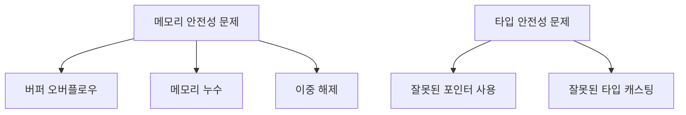

위의 다이어그램은 C++의 메모리 안전성과 타입 안전성 문제의 주요 원인을 시각적으로 나타낸 것이다. 이러한 문제들은 C++의 안전성을 저해하며, 개발자는 이를 인지하고 예방하기 위한 노력이 필요하다. C++의 안전성 문제를 해결하기 위해서는 언어의 특성을 이해하고, 안전한 코딩 관행을 따르는 것이 중요하다.

<!--
3. **C++의 안전성 개선 방안**
   - 타입 안전성, 경계 안전성, 초기화 안전성, 생애 안전성 개선
   - C++ 표준 라이브러리의 스레드 안전성
   - 안전성 프로파일 및 규칙 제안
-->

## C++의 안전성 개선 방안

C++는 뛰어난 성능과 유연성을 제공하는 강력한 프로그래밍 언어이지만, 그 유연성으로 인해 다양한 안전성 문제가 발생할 수 있다. 이러한 문제를 해결하기 위해 타입 안전성, 경계 안전성, 초기화 안전성, 생애 안전성 등의 개선 방안이 필요하다. 이 글에서는 각각의 개선 방안과 C++ 표준 라이브러리의 스레드 안전성, 그리고 안전성 프로파일 및 규칙 제안에 대해 논의하겠다.

**1. 타입 안전성**

타입 안전성은 변수의 타입이 일관되게 사용되도록 보장하는 것이다. C++에서는 암시적 타입 변환이 빈번하게 일어나기 때문에, 의도하지 않은 타입 변환으로 인해 예기치 않은 동작이 발생할 수 있다. 이를 개선하기 위해 `std::variant`와 같은 안전한 타입 관리 도구를 활용할 수 있다. `std::variant`는 여러 타입을 저장할 수 있는 타입 안전한 유니온(공용체)으로, 특정 타입으로만 값을 접근할 수 있도록 강제한다.

```cpp
#include <iostream>
#include <variant>

int main() {
    std::variant<int, std::string> value;

    value = 42; // int 타입 저장
    std::cout << std::get<int>(value) << std::endl;

    value = "Hello, C++"; // string 타입 저장
    std::cout << std::get<std::string>(value) << std::endl;

    return 0;
}
```

이처럼 `std::variant`를 사용하면 타입 변환 오류를 컴파일 타임에 잡아낼 수 있어, 타입 안전성을 높일 수 있다.

**2. 경계 안전성**

경계 안전성은 배열이나 포인터의 경계를 넘어서는 접근을 방지하는 것이다. C++에서는 원시 배열과 포인터가 이러한 경계 초과 문제를 일으키기 쉽다. 이를 해결하기 위해 `std::array`와 같은 안전한 컨테이너를 사용하는 것이 좋다. `std::array`는 정적 배열로 크기를 고정할 수 있으며, 배열의 경계를 넘어서는 접근을 시도하면 예외가 발생하도록 설계되어 있다.

```cpp
#include <iostream>
#include <array>

int main() {
    std::array<int, 5> arr = {1, 2, 3, 4, 5};

    try {
        std::cout << arr.at(10) << std::endl; // 경계 초과 접근 시도
    } catch (const std::out_of_range& e) {
        std::cerr << "Out of range error: " << e.what() << std::endl;
    }

    return 0;
}
```

위 예제에서 볼 수 있듯이, `std::array`의 `at` 메소드를 사용하면 경계 초과 접근 시 예외를 발생시켜 안전성을 높일 수 있다.

**3. 초기화 안전성**

초기화 안전성은 변수가 사용되기 전에 반드시 초기화되도록 보장하는 것이다. C++에서는 초기화되지 않은 변수를 사용할 경우 예기치 않은 동작을 일으킬 수 있다. C++11 이후에는 `std::optional`을 사용하여 초기화 안전성을 개선할 수 있다. `std::optional`은 값이 있을 수도 없을 수도 있는 변수를 표현하는 데 사용되며, 값이 설정되었는지 여부를 확인하는 안전한 방법을 제공한다.

```cpp
#include <iostream>
#include <optional>

int main() {
    std::optional<int> value;

    if (value.has_value()) {
        std::cout << "Value: " << value.value() << std::endl;
    } else {
        std::cout << "No value set" << std::endl;
    }

    value = 42;

    if (value.has_value()) {
        std::cout << "Value: " << value.value() << std::endl;
    }

    return 0;
}
```

이와 같이 `std::optional`을 사용하면 변수가 적절히 초기화되었는지 안전하게 확인할 수 있다.

**4. 생애 안전성**

생애 안전성은 객체의 생애 주기를 관리하여 메모리 누수나 잘못된 메모리 접근을 방지하는 것이다. C++에서는 직접 메모리를 관리해야 하기 때문에 메모리 누수가 자주 발생할 수 있다. 이러한 문제를 해결하기 위해 스마트 포인터(`std::unique_ptr`, `std::shared_ptr`)를 사용하는 것이 좋다. 스마트 포인터는 객체의 소유권을 관리하고, 객체가 더 이상 사용되지 않을 때 자동으로 메모리를 해제한다.

```cpp
#include <iostream>
#include <memory>

int main() {
    std::unique_ptr<int> ptr = std::make_unique<int>(10);
    std::cout << "Value: " << *ptr << std::endl;

    // 메모리 해제는 자동으로 이루어짐
    return 0;
}
```

이와 같이 스마트 포인터를 사용하면 메모리 관리가 자동으로 이루어지므로, 생애 안전성을 높일 수 있다.

**5. C++ 표준 라이브러리의 스레드 안전성**

스레드 안전성은 다중 스레드 환경에서 데이터 경합을 방지하는 것이다. C++ 표준 라이브러리는 스레드 안전성을 보장하기 위해 다양한 동기화 도구(`std::mutex`, `std::lock_guard` 등)를 제공한다. 이러한 도구를 사용하면 다중 스레드 환경에서 발생할 수 있는 데이터 경합을 효과적으로 방지할 수 있다.

```cpp
#include <iostream>
#include <thread>
#include <mutex>

std::mutex mtx;

void print_thread_id(int id) {
    std::lock_guard<std::mutex> lock(mtx);
    std::cout << "Thread ID: " << id << std::endl;
}

int main() {
    std::thread t1(print_thread_id, 1);
    std::thread t2(print_thread_id, 2);

    t1.join();
    t2.join();

    return 0;
}
```

위 코드에서는 `std::mutex`와 `std::lock_guard`를 사용하여 스레드 간의 안전한 데이터 접근을 보장한다.

**6. 안전성 프로파일 및 규칙 제안**

C++의 안전성을 더욱 강화하기 위해, 안전성 프로파일과 규칙을 도입할 수 있다. 예를 들어, 다음과 같은 규칙을 제안할 수 있다.

1. 모든 변수는 사용 전에 초기화해야 한다.
2. 포인터를 사용할 때는 반드시 nullptr 체크를 수행해야 한다.
3. 배열 접근 시 경계를 벗어나지 않도록 주의해야 한다.
4. 멀티스레드 환경에서는 반드시 동기화 도구를 사용해야 한다.

이러한 프로파일은 코딩 표준과 유사하게 동작하며, 코드에서 허용되는 패턴과 금지되는 패턴을 명확히 정의한다. 예를 들어, 직접적인 포인터 연산이나 특정 유형의 타입 변환을 금지하고, 대신 스마트 포인터와 `std::variant`와 같은 안전한 대안을 사용하는 것을 권장할 수 있다. 이러한 규칙을 준수함으로써 C++의 안전성을 높일 수 있으며, 개발자들이 보다 안전한 코드를 작성할 수 있도록 도와줄 수 있다.

이처럼 C++의 안전성을 개선하기 위해서는 타입, 경계, 초기화, 생애 안전성을 강화하고, 스레드 안전성을 보장하며, 엄격한 코딩 규칙을 도입하는 것이 중요하다. 이러한 개선 방안은 코드의 신뢰성을 높이고, 예기치 않은 버그를 줄이는 데 큰 도움이 될 것이다.

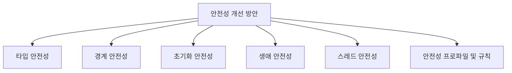

위의 다이어그램은 C++의 안전성 개선 방안을 시각적으로 나타낸 것이다. 각 요소는 안전성을 높이기 위한 다양한 접근 방식을 보여준다. C++의 안전성을 개선하기 위한 지속적인 노력이 필요하며, 이를 통해 보다 안전하고 신뢰할 수 있는 소프트웨어를 개발할 수 있을 것이다.

<!--
4. **C++의 메모리 안전성**
   - 메모리 안전성의 중요성
   - 메모리 안전성을 위한 C++의 현재 도전 과제
   - 메모리 안전성을 위한 대안 언어와의 비교
-->

## C++의 메모리 안전성

**메모리 안전성의 중요성**

메모리 안전성은 소프트웨어의 안정성과 보안성을 보장하는 데 필수적인 요소이다. C++는 저수준 메모리 조작을 허용하는 언어로, 프로그래머가 메모리를 직접 관리해야 한다. 이로 인해 메모리 누수, 버퍼 오버플로우, 댕글링 포인터와 같은 다양한 문제가 발생할 수 있다. 이러한 문제는 프로그램의 예기치 않은 동작을 초래하고, 보안 취약점을 유발할 수 있다. 따라서 메모리 안전성을 확보하는 것은 C++ 프로그래밍에서 매우 중요하다.

**메모리 안전성을 위한 C++의 현재 도전 과제**

C++에서 메모리 안전성을 확보하기 위한 여러 도전 과제가 존재한다. 첫째, C++의 메모리 관리 모델은 프로그래머에게 많은 자유도를 제공하지만, 이로 인해 실수로 인한 메모리 오류가 발생할 가능성이 높아진다. 둘째, C++의 표준 라이브러리는 메모리 안전성을 보장하기 위한 다양한 기능을 제공하지만, 여전히 프로그래머의 주의가 필요하다. 셋째, 기존의 C++ 코드베이스는 메모리 안전성을 고려하지 않고 작성된 경우가 많아, 이를 개선하는 데 많은 노력이 필요하다.

다음은 C++에서 메모리 안전성을 확보하기 위한 몇 가지 도전 과제를 정리한 다이어그램이다.

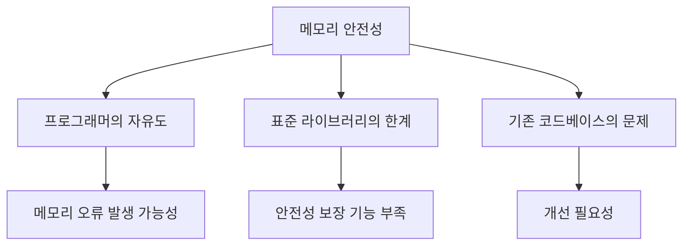

**메모리 안전성을 위한 대안 언어와의 비교**

C++의 메모리 안전성을 확보하기 위한 노력에도 불구하고, Rust와 같은 대안 언어는 메모리 안전성을 보다 강력하게 보장하는 기능을 제공한다. Rust는 소유권 시스템을 통해 메모리 관리의 안전성을 확보하며, 컴파일 타임에 메모리 오류를 방지할 수 있다. 반면 C++는 이러한 기능이 부족하여, 프로그래머가 직접 메모리 관리를 해야 한다. 

아래는 C++와 Rust의 메모리 안전성 관련 특징을 비교한 표이다.

| 특징               | C++                          | Rust                          |
|------------------|-----------------------------|-------------------------------|
| 메모리 관리       | 프로그래머의 책임            | 소유권 시스템에 의한 자동 관리 |
| 메모리 오류 방지  | 런타임 오류 발생 가능       | 컴파일 타임에 오류 방지      |
| 안전성 보장 기능  | 제한적                      | 강력한 안전성 보장           |

이와 같이 C++의 메모리 안전성은 여러 도전 과제를 안고 있으며, 대안 언어와의 비교를 통해 그 한계를 이해할 수 있다. C++의 메모리 안전성을 개선하기 위한 지속적인 노력이 필요하다.

<!--
5. **C++의 성능과 안전성의 균형**
   - 성능 저하 없이 안전성 강화하기
   - 안전성 규칙의 기본값 설정 및 옵트아웃 방법
   - C++의 성능 최적화와 안전성 간의 상충
-->

## C++의 성능과 안전성의 균형

C++는 성능과 안전성 간의 균형을 맞추는 것이 중요한 과제이다. 성능을 유지하면서도 안전성을 강화하는 방법을 모색하는 것은 C++ 프로그래머에게 필수적인 요소이다. 이 섹션에서는 성능 저하 없이 안전성을 강화하는 방법, 안전성 규칙의 기본값 설정 및 옵트아웃 방법, 그리고 성능 최적화와 안전성 간의 상충에 대해 논의할 것이다.

**성능 저하 없이 안전성 강화하기**

C++에서 안전성을 강화하는 방법 중 하나는 정적 분석 도구를 활용하는 것이다. 이러한 도구는 코드 작성 시점에서 잠재적인 오류를 발견하고, 이를 통해 런타임 오류를 줄일 수 있다. 예를 들어, `clang-tidy`와 같은 도구는 코드의 스타일과 안전성을 검사하여 개발자가 미리 문제를 인지할 수 있도록 돕는다.

```cpp
#include <iostream>
#include <vector>

void processData(const std::vector<int>& data) {
    for (const auto& value : data) {
        std::cout << value << std::endl;
    }
}

int main() {
    std::vector<int> numbers = {1, 2, 3, 4, 5};
    processData(numbers);
    return 0;
}
```

위의 코드에서 `std::vector`를 사용하여 메모리 안전성을 확보하고, `const` 키워드를 통해 불변성을 유지함으로써 성능 저하 없이 안전성을 강화할 수 있다.

**안전성 규칙의 기본값 설정 및 옵트아웃 방법**

C++에서는 안전성 규칙을 기본값으로 설정하고, 필요에 따라 옵트아웃할 수 있는 방법을 제공해야 한다. 예를 들어, C++20에서는 `[[nodiscard]]` 속성을 사용하여 반환값을 무시할 경우 경고를 발생시킬 수 있다. 이를 통해 개발자는 안전성을 높일 수 있지만, 필요에 따라 이 규칙을 무시할 수 있는 유연성을 제공한다.

```cpp
[[nodiscard]] int calculateValue() {
    return 42;
}

int main() {
    calculateValue(); // 경고 발생
    return 0;
}
```

이와 같이 기본값으로 안전성 규칙을 설정하고, 필요에 따라 옵트아웃할 수 있는 방법은 개발자가 성능과 안전성 간의 균형을 맞추는 데 도움을 준다.

**C++의 성능 최적화와 안전성 간의 상충**

C++에서 성능 최적화와 안전성 간의 상충은 종종 발생한다. 예를 들어, 메모리 관리를 수동으로 수행하는 경우 성능을 높일 수 있지만, 이는 메모리 누수나 버퍼 오버플로우와 같은 안전성 문제를 초래할 수 있다. 이러한 상충을 해결하기 위해서는 스마트 포인터와 같은 RAII(Resource Acquisition Is Initialization) 패턴을 활용하는 것이 좋다.

```cpp
#include <memory>

void processResource() {
    std::unique_ptr<int> resource(new int(10));
    // 자원 사용
} // resource는 자동으로 해제된다.

int main() {
    processResource();
    return 0;
}
```

위의 코드에서 `std::unique_ptr`를 사용하여 메모리 관리를 자동화함으로써 성능을 유지하면서도 안전성을 확보할 수 있다.

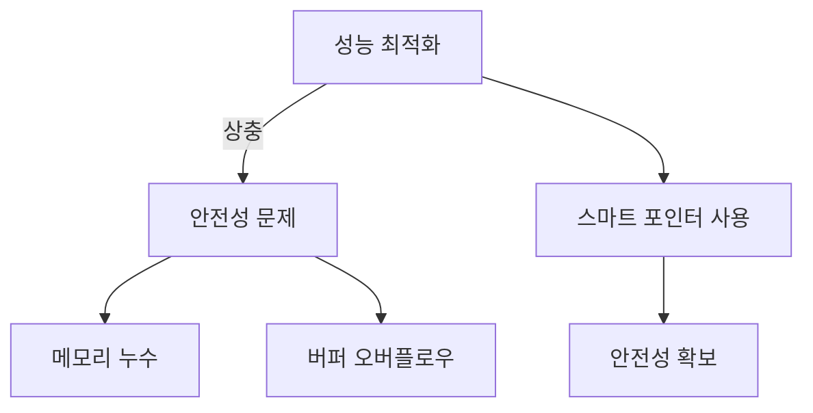

이와 같이 C++의 성능과 안전성 간의 균형을 맞추는 것은 복잡한 문제이지만, 적절한 도구와 패턴을 활용함으로써 해결할 수 있다. 프로그래머는 이러한 원칙을 이해하고 적용하여 안전하고 효율적인 코드를 작성해야 한다.

<!--
6. **C++의 메타프로그래밍과 그 문제점**
   - 메타프로그래밍의 장점과 단점
   - 메타프로그래밍이 코드 품질에 미치는 영향
   - 메타프로그래밍을 통한 안전성 개선 방안
-->

## C++의 메타프로그래밍과 그 문제점

C++의 메타프로그래밍은 컴파일 타임에 코드를 생성하거나 변형하는 기법으로, 코드의 재사용성과 유연성을 높이는 데 기여한다. 그러나 이러한 장점과 함께 몇 가지 문제점도 동반된다.

**메타프로그래밍의 장점과 단점**

메타프로그래밍의 가장 큰 장점은 코드의 재사용성을 높이고, 반복적인 작업을 줄일 수 있다는 점이다. 예를 들어, 템플릿을 사용하여 다양한 데이터 타입에 대해 동일한 알고리즘을 적용할 수 있다. 이는 코드의 양을 줄이고, 유지보수를 용이하게 한다.

그러나 메타프로그래밍은 복잡성을 증가시키고, 코드의 가독성을 저하시킬 수 있다. 특히, 템플릿 메타프로그래밍은 오류 메시지가 복잡하고 이해하기 어려운 경우가 많아, 디버깅이 어려워질 수 있다. 이러한 문제는 개발자가 코드를 이해하고 유지보수하는 데 큰 부담이 된다.

**메타프로그래밍이 코드 품질에 미치는 영향**

메타프로그래밍은 코드 품질에 긍정적이거나 부정적인 영향을 미칠 수 있다. 긍정적인 측면으로는 코드의 중복을 줄이고, 일관성을 높일 수 있다는 점이다. 예를 들어, 템플릿을 사용하여 다양한 데이터 타입에 대해 동일한 로직을 적용하면, 코드의 일관성을 유지할 수 있다.

반면, 부정적인 측면으로는 코드의 복잡성이 증가하고, 가독성이 떨어질 수 있다는 점이다. 메타프로그래밍을 과도하게 사용하면, 코드가 지나치게 복잡해져서 다른 개발자가 이해하기 어려운 상황이 발생할 수 있다. 이는 코드 품질을 저하시킬 수 있는 요인이 된다.

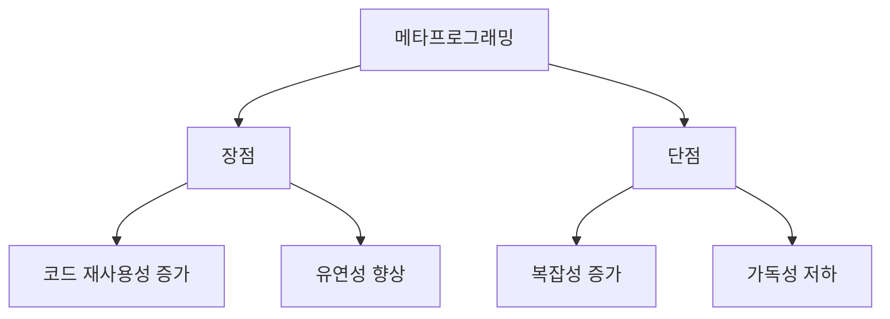

**메타프로그래밍을 통한 안전성 개선 방안**

메타프로그래밍은 안전성을 개선하는 데에도 활용될 수 있다. 예를 들어, 타입 안전성을 보장하기 위해 템플릿을 사용하여 특정 조건을 만족하는 타입만을 허용하는 코드를 작성할 수 있다. 이를 통해 런타임 오류를 줄이고, 컴파일 타임에 오류를 발견할 수 있는 기회를 제공한다.

또한, 메타프로그래밍을 통해 코드의 경계 조건을 검증하는 기능을 추가할 수 있다. 예를 들어, 배열의 인덱스가 유효한 범위 내에 있는지를 컴파일 타임에 체크하는 코드를 작성할 수 있다. 이러한 접근은 메모리 안전성을 높이는 데 기여할 수 있다.

```cpp
template<typename T, std::size_t N>
class SafeArray {
public:
    T& operator[](std::size_t index) {
        if (index >= N) {
            throw std::out_of_range("Index out of bounds");
        }
        return data[index];
    }

private:
    T data[N];
};
```

위의 코드 예시는 템플릿을 사용하여 배열의 인덱스를 안전하게 접근하는 방법을 보여준다. 이와 같은 메타프로그래밍 기법은 C++의 안전성을 높이는 데 기여할 수 있다. 

결론적으로, C++의 메타프로그래밍은 코드의 재사용성과 유연성을 높이는 데 유용하지만, 복잡성과 가독성 저하라는 문제를 동반할 수 있다. 따라서 메타프로그래밍을 사용할 때는 이러한 장단점을 고려하여 신중하게 접근해야 한다.

<!--
7. **C++의 안전성 관련 도구 및 기술**
   - 정적 분석 도구 및 동적 분석 도구
   - C++에서의 샌타이저 사용
   - C++의 안전성 도구 및 라이브러리
-->

## C++의 안전성 관련 도구 및 기술

C++의 안전성을 높이기 위해 다양한 도구와 기술이 존재한다. 이 섹션에서는 정적 분석 도구와 동적 분석 도구, C++에서의 샌타이저 사용, 그리고 C++의 안전성 도구 및 라이브러리에 대해 살펴보겠다.

**정적 분석 도구 및 동적 분석 도구**

정적 분석 도구는 소스 코드를 실행하지 않고도 코드의 품질과 안전성을 평가할 수 있는 도구이다. 이러한 도구는 코드의 잠재적인 버그, 보안 취약점, 스타일 문제 등을 찾아내는 데 유용하다. 대표적인 정적 분석 도구로는 `Cppcheck`, `Clang Static Analyzer`, `SonarQube` 등이 있다.

동적 분석 도구는 프로그램이 실행되는 동안 동작을 분석하여 런타임 오류나 메모리 누수와 같은 문제를 찾아낸다. `Valgrind`, `AddressSanitizer`, `ThreadSanitizer` 등이 동적 분석 도구의 예시이다. 이러한 도구들은 메모리 안전성을 확보하는 데 중요한 역할을 한다.

```cpp
#include <iostream>
#include <vector>

void memoryLeakExample() {
    std::vector<int>* vec = new std::vector<int>();
    vec->push_back(1);
    vec->push_back(2);
    // 메모리 누수 발생: delete vec; 호출하지 않음
}

int main() {
    memoryLeakExample();
    return 0;
}
```

위의 코드 예시는 메모리 누수가 발생하는 경우를 보여준다. 동적 분석 도구를 사용하면 이러한 문제를 쉽게 찾아낼 수 있다.

**C++에서의 샌타이저 사용**

샌타이저(Sanitizer)는 C++ 프로그램의 안전성을 높이기 위해 메모리 오류를 탐지하는 도구이다. `AddressSanitizer`는 메모리 접근 오류를 찾아내는 데 유용하며, `UndefinedBehaviorSanitizer`는 정의되지 않은 동작을 탐지하는 데 사용된다. 이러한 도구들은 컴파일 시에 활성화할 수 있으며, 런타임에 발생하는 오류를 실시간으로 감지할 수 있다.

샌타이저를 사용하기 위해서는 컴파일 시에 특정 플래그를 추가해야 한다. 예를 들어, `AddressSanitizer`를 활성화하려면 다음과 같이 컴파일하면 된다.

```bash
g++ -fsanitize=address -g -o my_program my_program.cpp
```

**C++의 안전성 도구 및 라이브러리**

C++의 안전성을 높이기 위한 다양한 라이브러리와 도구가 존재한다. 예를 들어, `Boost` 라이브러리는 다양한 안전성 관련 기능을 제공하며, `SafeInt` 라이브러리는 정수 오버플로우를 방지하는 데 도움을 준다. 또한, `Google Test`와 같은 테스트 프레임워크는 코드의 품질을 높이는 데 기여한다.

다음은 C++의 안전성 도구 및 라이브러리를 나타내는 다이어그램이다.

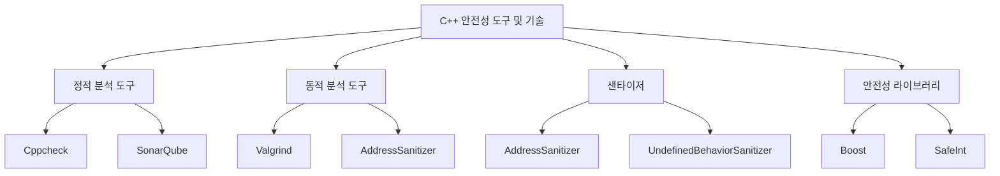

이와 같이 C++의 안전성을 높이기 위한 다양한 도구와 기술이 존재하며, 이를 적절히 활용함으로써 코드의 품질과 안전성을 향상시킬 수 있다.

<!--
8. **FAQ**
   - C++의 안전성을 높이기 위한 가장 좋은 방법은 무엇인가요?
   - C++에서 메모리 안전성을 보장하기 위한 도구는 무엇이 있나요?
   - C++의 성능을 유지하면서 안전성을 강화할 수 있는 방법은 무엇인가요?
-->

## FAQ

**C++의 안전성을 높이기 위한 가장 좋은 방법은 무엇인가요?**

C++의 안전성을 높이기 위한 가장 좋은 방법은 코드 작성 시 안전성을 고려한 프로그래밍 패턴을 채택하는 것이다. 예를 들어, 스마트 포인터를 사용하여 메모리 관리를 자동화하고, RAII(Resource Acquisition Is Initialization) 원칙을 적용하여 자원의 수명 관리를 명확히 하는 것이 중요하다. 또한, 정적 분석 도구를 활용하여 코드의 잠재적인 취약점을 사전에 발견하고 수정하는 것이 효과적이다.

다음은 스마트 포인터를 사용하는 간단한 예제이다.

```cpp
#include <iostream>
#include <memory>

class MyClass {
public:
    MyClass() { std::cout << "Constructor called" << std::endl; }
    ~MyClass() { std::cout << "Destructor called" << std::endl; }
};

int main() {
    std::unique_ptr<MyClass> ptr = std::make_unique<MyClass>();
    // ptr이 범위를 벗어나면 자동으로 메모리가 해제된다.
    return 0;
}
```

**C++에서 메모리 안전성을 보장하기 위한 도구는 무엇이 있나요?**

C++에서 메모리 안전성을 보장하기 위한 도구로는 여러 가지가 있다. 대표적으로는 AddressSanitizer, Valgrind, 그리고 Clang Static Analyzer가 있다. 이 도구들은 메모리 누수, 잘못된 메모리 접근, 그리고 버퍼 오버플로우와 같은 문제를 탐지하는 데 유용하다.

다음은 AddressSanitizer를 사용하는 방법에 대한 간단한 다이어그램이다.

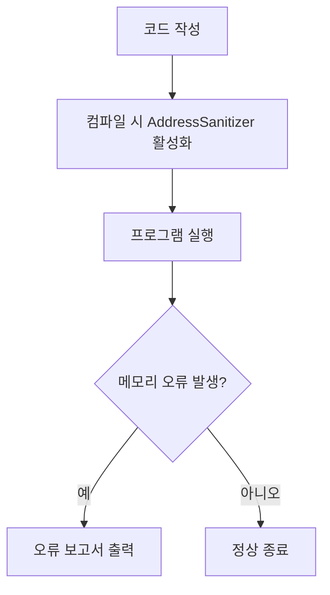

**C++의 성능을 유지하면서 안전성을 강화할 수 있는 방법은 무엇인가요?**

C++의 성능을 유지하면서 안전성을 강화하기 위해서는 성능에 미치는 영향을 최소화하는 안전성 규칙을 설정하는 것이 중요하다. 예를 들어, 성능이 중요한 부분에서는 수동 메모리 관리를 사용하고, 안전성이 중요한 부분에서는 스마트 포인터와 같은 안전한 메모리 관리 기법을 사용하는 것이 좋다. 또한, 컴파일러 최적화 옵션을 적절히 활용하여 성능을 극대화할 수 있다.

다음은 성능과 안전성을 동시에 고려한 코드 예제이다.

```cpp
#include <iostream>
#include <vector>

void processData(const std::vector<int>& data) {
    for (const auto& value : data) {
        // 데이터 처리 로직
        std::cout << value << std::endl;
    }
}

int main() {
    std::vector<int> data = {1, 2, 3, 4, 5};
    processData(data);
    return 0;
}
```

이와 같이 C++의 안전성을 높이기 위한 다양한 방법과 도구를 활용하면, 성능을 유지하면서도 안전한 코드를 작성할 수 있다.

<!--
9. **관련 기술**
   - Rust와 C++의 안전성 비교
   - 메모리 안전 언어(MSL)와 C++
   - C++의 최신 표준(C++20, C++23)과 안전성 관련 기능
-->

## 관련 기술

**Rust와 C++의 안전성 비교**

Rust는 메모리 안전성을 보장하기 위해 설계된 프로그래밍 언어이다. Rust의 주요 특징 중 하나는 소유권 시스템으로, 이는 메모리 관리에서 발생할 수 있는 많은 오류를 컴파일 타임에 방지할 수 있도록 돕는다. 반면, C++는 개발자가 메모리를 직접 관리해야 하며, 이로 인해 메모리 누수나 버퍼 오버플로우와 같은 문제가 발생할 수 있다.

Rust의 소유권 시스템은 다음과 같은 규칙을 따른다:

1. 각 값은 하나의 소유자만 가질 수 있다.
2. 소유자가 범위를 벗어나면 값은 자동으로 해제된다.
3. 소유자는 값을 빌려줄 수 있으며, 빌린 값은 소유권을 잃지 않는다.

이러한 규칙 덕분에 Rust는 메모리 안전성을 보장할 수 있으며, C++보다 더 안전한 코드 작성을 가능하게 한다. 아래는 Rust의 소유권 시스템을 설명하는 다이어그램이다.

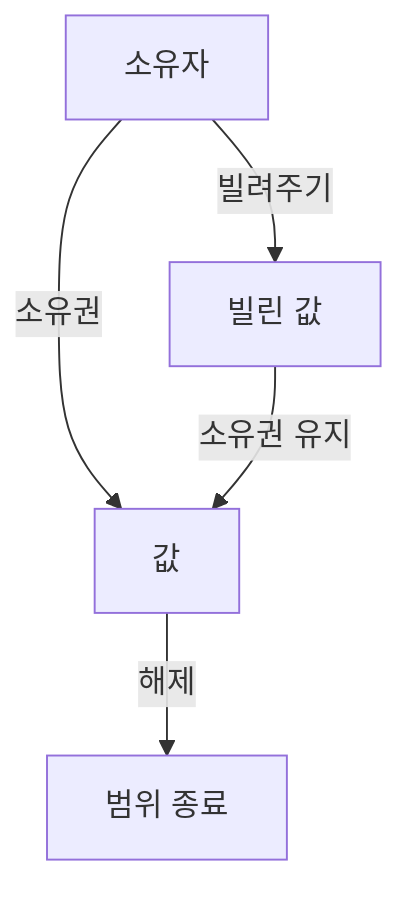

**메모리 안전 언어(MSL)와 C++**

메모리 안전 언어(Memory Safe Language, MSL)는 메모리 관련 오류를 방지하기 위해 설계된 언어를 의미한다. MSL은 일반적으로 자동 메모리 관리, 타입 시스템 강화, 그리고 안전한 메모리 접근을 제공한다. C++는 이러한 MSL의 특성을 일부 갖추고 있지만, 개발자가 메모리를 직접 관리해야 하므로 여전히 많은 위험 요소가 존재한다.

C++에서 메모리 안전성을 높이기 위해서는 스마트 포인터와 같은 RAII(Resource Acquisition Is Initialization) 패턴을 활용할 수 있다. 스마트 포인터는 메모리 관리를 자동으로 수행하여 메모리 누수를 방지하는 데 도움을 준다. 아래는 C++에서 스마트 포인터를 사용하는 예시 코드이다.

```cpp
#include <iostream>
#include <memory>

class MyClass {
public:
    MyClass() { std::cout << "Constructor called" << std::endl; }
    ~MyClass() { std::cout << "Destructor called" << std::endl; }
};

int main() {
    std::unique_ptr<MyClass> ptr = std::make_unique<MyClass>();
    // ptr이 범위를 벗어나면 자동으로 메모리가 해제된다.
    return 0;
}
```

**C++의 최신 표준(C++20, C++23)과 안전성 관련 기능**

C++20과 C++23은 안전성을 높이기 위한 여러 기능을 도입하였다. C++20에서는 개념(Concepts)과 범위(Ranges)와 같은 새로운 기능이 추가되어 코드의 안전성을 높이는 데 기여하고 있다. 개념은 템플릿 매개변수에 대한 제약 조건을 정의할 수 있게 해주어, 잘못된 타입의 사용을 방지할 수 있다.

C++23에서는 더욱 발전된 안전성 기능이 추가될 예정이다. 예를 들어, `std::expected`와 같은 새로운 타입은 함수의 성공 또는 실패를 명시적으로 처리할 수 있도록 도와준다. 이는 예외 처리보다 더 안전하고 명확한 방법으로 오류를 관리할 수 있게 해준다.

아래는 C++20의 개념을 사용하는 예시 코드이다.

```cpp
#include <iostream>
#include <concepts>

template<typename T>
concept Integral = std::is_integral_v<T>;

template<Integral T>
T add(T a, T b) {
    return a + b;
}

int main() {
    std::cout << add(5, 10) << std::endl; // 정수형 값
    // std::cout << add(5.5, 10.5) << std::endl; // 컴파일 오류
    return 0;
}
```

이와 같이 C++의 최신 표준은 안전성을 높이기 위한 다양한 기능을 제공하고 있으며, 개발자들이 보다 안전한 코드를 작성할 수 있도록 돕고 있다.

<!--
10. **결론**
    - C++의 미래와 안전성 개선의 필요성
    - 프로그래머와 개발 팀의 역할
    - C++의 안전성을 높이기 위한 지속적인 노력의 중요성
-->

## 결론

C++는 오랜 역사와 강력한 성능을 자랑하는 프로그래밍 언어이다. 그러나 그만큼 보안 및 안전성 문제도 심각하게 대두되고 있다. 이러한 문제를 해결하기 위해서는 C++의 미래와 안전성 개선의 필요성을 인식하고, 프로그래머와 개발 팀이 적극적으로 역할을 수행해야 한다. 또한, C++의 안전성을 높이기 위한 지속적인 노력이 필수적이다.

**C++의 미래와 안전성 개선의 필요성**

C++는 다양한 분야에서 널리 사용되고 있으며, 특히 시스템 프로그래밍, 게임 개발, 고성능 애플리케이션 등에서 그 강점을 발휘하고 있다. 그러나 이러한 강력한 성능 뒤에는 메모리 안전성, 타입 안전성 등의 문제들이 존재한다. 따라서 C++의 미래를 위해서는 이러한 안전성 문제를 해결하는 것이 필수적이다. 안전성을 개선하기 위한 노력은 단순히 언어의 발전을 넘어, 개발자와 사용자 모두의 신뢰를 구축하는 데 기여할 것이다.

**프로그래머와 개발 팀의 역할**

프로그래머와 개발 팀은 C++의 안전성을 높이는 데 중요한 역할을 한다. 이들은 안전한 코드를 작성하고, 코드 리뷰 및 테스트를 통해 잠재적인 취약점을 사전에 발견해야 한다. 또한, 최신 C++ 표준과 안전성 관련 도구를 적극적으로 활용하여 코드의 품질을 높이는 것이 중요하다. 아래는 프로그래머와 개발 팀이 수행할 수 있는 몇 가지 역할이다.

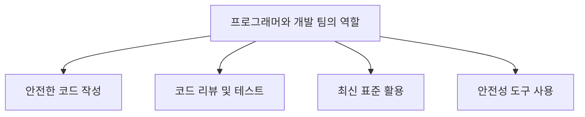

**C++의 안전성을 높이기 위한 지속적인 노력의 중요성**

C++의 안전성을 높이기 위한 노력은 단기적인 해결책이 아닌, 지속적인 과정으로 인식해야 한다. 새로운 기술과 도구가 지속적으로 발전하고 있으며, 이를 통해 C++의 안전성을 강화할 수 있는 기회가 늘어나고 있다. 따라서 개발자들은 이러한 변화에 적응하고, 지속적으로 학습하며, 안전성을 높이기 위한 새로운 방법을 모색해야 한다. C++의 안전성을 높이는 것은 단순히 개인의 책임이 아니라, 전체 개발 생태계의 발전을 위한 필수적인 과정이다. 

결론적으로, C++의 안전성 문제는 단순한 기술적 과제가 아니라, 프로그래머와 개발 팀의 협력과 지속적인 노력이 필요한 중요한 이슈이다. C++의 미래를 위해서는 이러한 안전성 문제를 해결하는 데 모든 이해관계자가 함께 노력해야 한다.

<!--
11. **부록**
    - C++ 안전성 프로파일 및 규칙 목록
    - C++에서의 안전성 관련 연구 및 자료
    - C++ 커뮤니티의 안전성 관련 논의 및 피드백
-->

## 부록

C++의 안전성 관련 주제는 매우 광범위하며, 이를 이해하고 적용하기 위해서는 다양한 자료와 규칙이 필요하다. 이 부록에서는 C++ 안전성 프로파일 및 규칙 목록, 안전성 관련 연구 및 자료, 그리고 C++ 커뮤니티의 안전성 관련 논의 및 피드백을 다룬다.

**C++ 안전성 프로파일 및 규칙 목록**

C++의 안전성을 높이기 위해서는 명확한 프로파일과 규칙이 필요하다. 다음은 C++에서 자주 사용되는 안전성 프로파일 및 규칙의 목록이다.

1. **타입 안전성**: 모든 변수는 명확한 타입을 가져야 하며, 타입 변환은 안전하게 이루어져야 한다.
2. **경계 안전성**: 배열이나 버퍼의 경계를 넘어서는 접근을 방지해야 한다.
3. **초기화 안전성**: 모든 변수를 사용하기 전에 반드시 초기화해야 한다.
4. **생애 안전성**: 객체의 생애 주기를 명확히 관리하여, 사용 후 해제된 메모리에 접근하지 않도록 해야 한다.
5. **스레드 안전성**: 멀티스레드 환경에서 데이터 경합을 방지하기 위한 규칙을 준수해야 한다.

**C++에서의 안전성 관련 연구 및 자료**

C++의 안전성을 높이기 위한 연구는 지속적으로 진행되고 있다. 다음은 C++ 안전성 관련 주요 연구 및 자료이다.

- **C++ Core Guidelines**: C++의 안전성을 높이기 위한 권장 사항을 제시하는 문서로, 다양한 안전성 규칙을 포함하고 있다.
- **ISO C++ Standards**: C++의 최신 표준 문서로, 안전성과 관련된 새로운 기능과 규칙이 포함되어 있다.
- **Static Analysis Tools**: 정적 분석 도구를 사용하여 코드의 안전성을 평가하고, 잠재적인 취약점을 발견할 수 있다.

**C++ 커뮤니티의 안전성 관련 논의 및 피드백**

C++ 커뮤니티는 안전성 문제에 대해 활발히 논의하고 있으며, 다양한 피드백을 통해 개선 방안을 모색하고 있다. 다음은 커뮤니티에서의 주요 논의 주제이다.

- **안전성 도구의 필요성**: 많은 개발자들이 C++의 안전성을 높이기 위한 도구의 필요성을 강조하고 있다. 특히, 정적 분석 도구와 동적 분석 도구의 활용이 중요하다는 의견이 많다.
- **안전성 교육**: C++의 안전성을 높이기 위해서는 개발자들이 안전성 관련 교육을 받는 것이 필요하다는 의견이 제기되고 있다.
- **커뮤니티의 협력**: C++의 안전성을 높이기 위해서는 커뮤니티의 협력이 필수적이며, 다양한 의견을 수렴하여 발전해 나가야 한다는 점이 강조되고 있다.

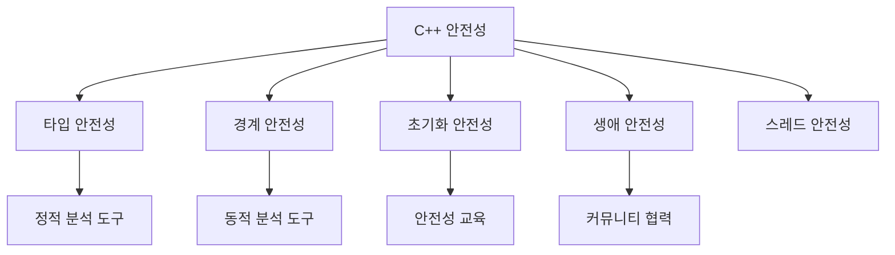

이와 같은 자료와 논의는 C++의 안전성을 높이는 데 중요한 역할을 하며, 개발자들이 보다 안전한 코드를 작성하는 데 기여할 수 있다. C++의 안전성 문제는 지속적으로 발전하고 있으며, 이를 해결하기 위한 노력은 앞으로도 계속되어야 한다.

<!--
##### Reference #####
-->

## Reference


* [https://ricomariani.medium.com/c-for-security-and-systems-programming-objections-5dc07a24c815](https://ricomariani.medium.com/c-for-security-and-systems-programming-objections-5dc07a24c815)
* [https://herbsutter.com/2024/03/11/safety-in-context/](https://herbsutter.com/2024/03/11/safety-in-context/)
* [https://learn.microsoft.com/ko-kr/cpp/standard-library/thread-safety-in-the-cpp-standard-library?view=msvc-170](https://learn.microsoft.com/ko-kr/cpp/standard-library/thread-safety-in-the-cpp-standard-library?view=msvc-170)
* [https://learn.microsoft.com/ko-kr/cpp/standard-library/safe-libraries-cpp-standard-library?view=msvc-170](https://learn.microsoft.com/ko-kr/cpp/standard-library/safe-libraries-cpp-standard-library?view=msvc-170)
* [https://learn.microsoft.com/ko-kr/cpp/standard-library/checked-iterators?view=msvc-170](https://learn.microsoft.com/ko-kr/cpp/standard-library/checked-iterators?view=msvc-170)
* [https://learn.microsoft.com/ko-kr/cpp/standard-library/debug-iterator-support?view=msvc-170](https://learn.microsoft.com/ko-kr/cpp/standard-library/debug-iterator-support?view=msvc-170)
* [https://www.appinf.com/download/SafetyCriticalC++.pdf](https://www.appinf.com/download/SafetyCriticalC++.pdf)

